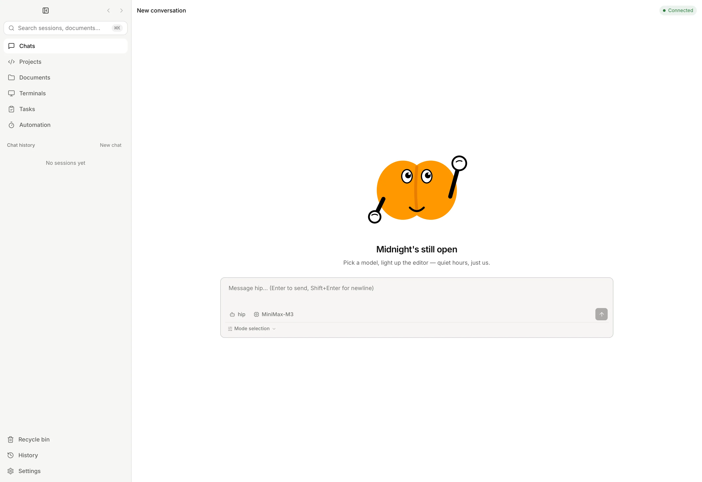
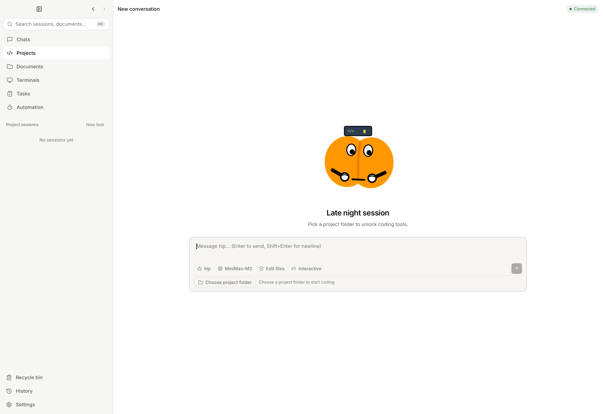
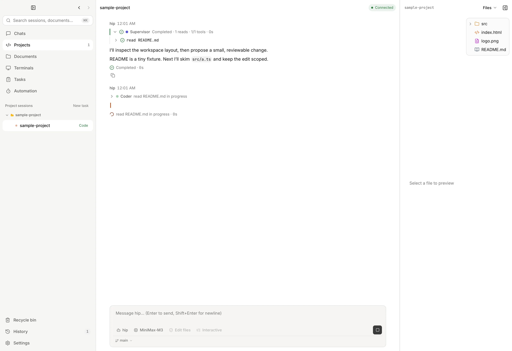
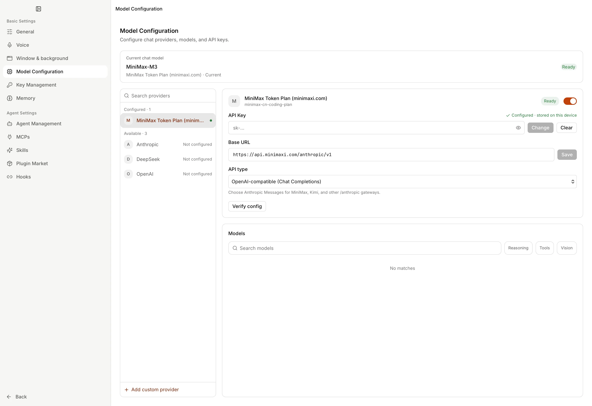
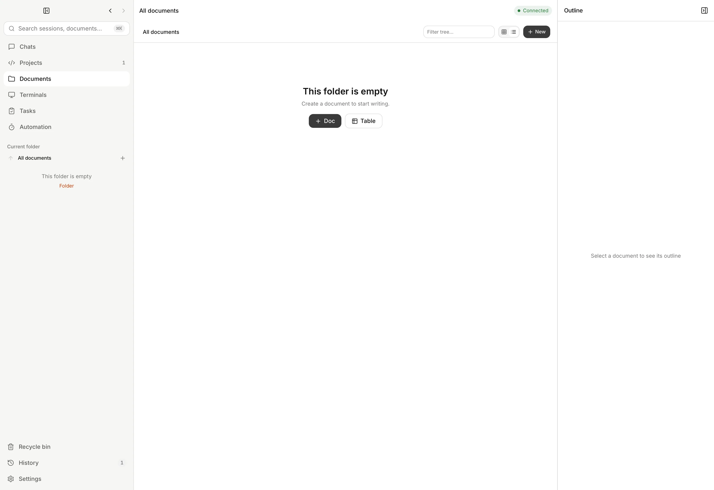

<p align="center">
  
</p>

# hip

[English](./README.md) | **简体中文** | [繁體中文](./README.zh-TW.md) | [日本語](./README.ja.md) | [한국어](./README.ko.md)

**hip** 是一款桌面 AI 工作台（定位类似 Claude Code Desktop / Codex Desktop）：Tauri 壳 + React UI + Node.js sidecar，在本地项目中运行 [LangGraph](https://langchain-ai.github.io/langgraphjs/) 智能体。

> **说明：** hip 为独立项目，与 Anthropic、OpenAI、xAI 等第三方产品**无隶属或官方背书**关系；文中出现的名称仅用于互操作说明。

## 下载

预编译安装包（若已发布）见 **[GitHub Releases](https://github.com/limin411/hip/releases)**。  
若尚无附件，请按下文「开发环境」从源码构建。

每个 UI 标签页是独立会话。产品默认是 **Supervisor ReAct** 回路——智能体使用工具，并在需要时通过 `task` / `dispatch_agent` / `task_batch` 委派。普通轮次**不会**强制 Planner → Coder → Reviewer 流水线。

## 界面预览

<p align="center">
  
</p>

<p align="center"><sub>Chat — 新会话。每个标签页是独立会话。</sub></p>

<table>
  <tr>
    <td align="center" valign="top" width="50%">
      
      <br />
      <sub>Code — 选择项目文件夹后发送任务</sub>
    </td>
    <td align="center" valign="top" width="50%">
      
      <br />
      <sub>Code 会话 — Supervisor 工具与文件栏</sub>
    </td>
  </tr>
  <tr>
    <td align="center" valign="top">
      
      <br />
      <sub>设置 → 模型配置 — 供应商与 API Key</sub>
    </td>
    <td align="center" valign="top">
      
      <br />
      <sub>文档 — 本地笔记、页面与表格</sub>
    </td>
  </tr>
</table>

## 操作示例

1. **添加供应商密钥** — **设置 → 模型配置**。密钥保存在 `~/.hip/config/auth.json`（权限 `0600`）。
2. **开始 Chat 或 Code** — Chat 是更轻的会话面；Code 需要先 **选择项目文件夹**（默认权限 **edit**，项目沙箱）。
3. **发送任务** — Supervisor 会使用工具，并可通过 `task` / `dispatch_agent` / `task_batch` 委派。关注右侧文件栏和 **Changes** 标签。
4. **就近记笔记** — **文档** 是同一工作区旁的本地知识库（页面与表格）。

## 核心能力

| 领域 | 说明 |
|------|------|
| **界面（Surfaces）** | **Code** — 完整项目工作台（文件、git 指导、MCP、工具）。**Chat** — 更轻的会话面；可预览交付物写入工作区供工件面板展示。 |
| **权限模式** | **edit**（默认，项目根沙箱）、**chat**（只读）、**full**（用户明确授权的全文件系统）。 |
| **智能体** | Supervisor 与专用花名册（**explore** / **plan** / **coder**）；通过 `task_batch` 做真正的并行子任务。 |
| **扩展** | 技能（`SKILL.md`）、插件、MCP、钩子——全局在 `~/.hip/`，项目在 `.hip/`。冲突裁决走扩展注册表（技能优先级：项目 > 用户 > 插件 > 内置；hip.toml 的 MCP id 优先）。 |
| **记忆** | 跨会话记忆**默认关闭**；在 **设置 → 记忆** 中开启。 |
| **CLI** | 仅附着到**已运行**桌面应用的 `@hip/cli`（`doctor`、`session`、`run`、`repl`）。 |
| **本地优先** | 配置、SQLite、技能、插件与日志均在 `~/.hip/`。 |

## 架构

运行时有三个进程协作：

| 进程 | 运行时 | 职责 |
|------|--------|------|
| **Tauri Shell** | Rust（`src-tauri/`） | 窗口管理、sidecar 生命周期、`get_sidecar_port` 命令 |
| **Frontend** | React + Vite（`src/`） | 标签页、聊天、智能体执行树 |
| **Sidecar** | Node.js（`packages/sidecar/`） | LangGraph 智能体运行时、WebSocket 服务 |

Tauri 壳在启动时通过 `tauri-plugin-shell` 的 sidecar 机制拉起 sidecar。sidecar 在空闲端口绑定 WebSocket，并向 stdout 打印 `{"port":NNNN}`；Rust 捕获后通过 `get_sidecar_port` 暴露给前端，前端连接 `ws://localhost:NNNN`。

### 委派入口（智能体运行时）

产品轮次走以下三条路径之一。只有**显式**工作流定义会离开默认 ReAct 回路；会话 `orchMode` 不参与路由（UI 开关已移除；API 仍保留但已弃用）。

| 入口 | 时机 | 行为 |
|------|------|------|
| **默认 ReAct + task/dispatch** | 普通 `message:send`（无待运行工作流） | Supervisor ReAct 图（`buildGraph`）。通过 `task` / `dispatch_agent` 做智能体驱动隔离；一次 `task_batch` 做**真正并行**的多段研究（可选 per-task `agent`，默认并发 4）。优先 `task_batch`，避免顺序多次 `dispatch_agent`。 |
| **显式 DAG** | 设置了 `pendingWorkflowDef`，或 `workflow:run` | 编排器 / workflow-runner DAG。不被模式标志强制。内置 cluster 模板（如 planner→coder）仅作内部/测试辅助。 |
| **多智能体 handoff** | 可选 / 非默认调用方 | `multi-agent-graph` 的 `handoff_to_*` 组合。实验面；不是产品默认会话路径。 |

本仓库为 **yarn workspaces** monorepo：

```
packages/protocol/   @hip/protocol — 共享 WebSocket 消息类型
packages/sidecar/    @hip/sidecar  — LangGraph WS 服务
packages/cli/        @hip/cli      — 仅附着的产品 CLI
packages/product-content/  智能体嵌入内容 + 设置 Help 本地化
src/                 React 前端
src-tauri/           Rust 壳
```

## 开发环境

> API 密钥（如 DeepSeek）在应用 **设置** 面板中填写，保存在
> `~/.hip/config/auth.json`（文件模式 `0600`）——唯一权威来源。桌面应用、
> 独立 sidecar（`scripts/dev.sh start sidecar`）与测试套件都从该处读取。
> **`~/.hip/config/` 存有明文密钥；请勿同步到网盘或 dotfile 仓库。**

### 前置条件

- Node.js + [Yarn](https://yarnpkg.com/)（workspaces）
- Rust 工具链（Tauri）
- [Tauri v2](https://v2.tauri.app/start/prerequisites/) 平台依赖

### 快速开始

```bash
# 1. 安装 workspace 依赖
yarn install

# 2. 生成 dev 模式 sidecar 包装（首次，以及工具链变更后）。
#    src-tauri/binaries/ 为 gitignore 的构建产物目录，
#    Rust 构建解析 sidecar 前必须执行本步。
yarn sidecar:dev-bin

# 3. 运行应用（启动 Vite、sidecar 与 Tauri 窗口）
yarn tauri dev
```

然后打开 **设置**，添加提供商 API 密钥，在 **Code** 或 **Chat** 界面开始会话。


### 本地数据布局（`~/.hip/`）

| 路径 | 用途 |
|------|------|
| `~/.hip/config/` | `auth.json`、`hip.toml`、网络策略（适用处模式 `0600`） |
| `~/.hip/config/terminal-hosts.json` | SSH / 终端主机库（模式 `0600`） |
| `~/.hip/db/hip.db` | SQLite：会话、消息、智能体运行、工具、事件 |
| `~/.hip/data/tool-output/` | 大型工具输出（不进 DB） |
| `~/.hip/logs/` | Sidecar / Tauri 日志 |
| `~/.hip/skills/`、`plugins/`、`scratch/` | 技能、插件、安装临时区 |
| `~/.hip/memories/` | 开启记忆后的 Markdown 导出镜像 |
| `~/.hip/work-items/` | 事项追踪目录（`catalog.json`）与 UI 偏好 |
| `~/.hip/automations/` | 自动化目录与运行日志（`catalog.json`、`runs.json`；模式 `0600`） |
| `~/.hip/knowledge/` | 本地优先知识库空间/文档（文件系统内容） |
| `~/.hip/trash/` | 产品回收站隔离区（知识库文件；会话用 SQLite `deleted_at`） |

### 回收站（软删除）

**桌面 UI** 中删除 Chat/Code 会话或知识库空间/文档时，会先进入侧栏 **回收站**（位于历史会话上方）。可恢复或永久删除；超过保留期后自动清除。

| 设置 | 位置 |
|------|------|
| 保留天数（默认 **7**，范围 1–365） | **设置 → 通用**，或 `~/.hip/config/hip.toml` 中 `[trash] retentionDays = 7` |

- **UI 删除** → 软删除（可恢复）。
- **CLI** `hip session delete <id> --yes` → **永久**硬删除（不经过回收站）。
- **记忆**回收站仍在 **设置 → 记忆**（默认 30 天，独立策略）。

```bash
# 可选：大量永久删除后回收空闲页（须先关闭应用）
sqlite3 ~/.hip/db/hip.db 'VACUUM;'
```

### 关闭窗口与系统托盘

默认关闭主窗口会 **退出** hip（sidecar、agent 与 CLI attach 一并结束）。可在 **设置 → 通用 → 窗口与后台** 中配置：

| 选项 | 效果 |
|------|------|
| **隐藏到系统托盘** | 关窗仅隐藏；agent / 终端 / sidecar 继续运行。托盘左键或「显示主界面」恢复；「退出」干净退出。 |
| **退出 hip** | 关窗即退出（历史默认）。 |
| **系统托盘图标** | 显示托盘图标（选隐藏时会自动开启）。 |

```toml
# ~/.hip/config/hip.toml
[window]
closeAction = "hide"   # hide | quit | ask（ask 的 UI 为 Phase 2）
trayEnabled = true
```

- **Cmd+Q** / 应用菜单退出始终真正退出（不会只隐藏）。
- 隐藏模式下产品 CLI 仍可 attach 到运行中的桌面进程。
- 逃生开关：`HIP_TRAY=0` 强制关窗退出并禁用托盘。
- Release 构建为单实例（二次启动聚焦已有窗口）；开发模式允许多实例。
- **开机启动** 与 **任务完成通知**（窗口隐藏时）可在同一设置区块开启。登录项启动会带 `--autostart`，默认隐藏到托盘。

### 常用脚本

| 命令 | 说明 |
|------|------|
| `yarn tauri dev` | 开发模式运行完整桌面应用 |
| `yarn sidecar:dev` | 独立运行 sidecar WS 服务（打印端口） |
| `yarn sidecar:dev-bin` | （重新）生成 `src-tauri/binaries/` 中的 dev sidecar 包装 |
| `yarn cli:dev` | 产品 CLI（`hip doctor` / `session` / `run` / `repl`）——**需 hip 应用已运行** |
| `yarn cli:test` | CLI 单元测试（无付费 LLM） |
| `yarn type-check` | 前端类型检查 |
| `yarn workspace @hip/sidecar type-check` | sidecar 类型检查 |
| `yarn test` | 前端与单元测试（Vitest） |
| `yarn product:content` | 重新生成智能体/UI 产品内容嵌入 |

### 产品 CLI（`@hip/cli`）

仅附着到**已运行**的 hip 桌面应用（共享 sidecar 与 `~/.hip` 数据）。

**没有**单独的 SDK 包——脚本应调用 `hip … --json`。
CLI **不会**启动产品 sidecar；须先启动应用，否则失败并返回
`APP_NOT_RUNNING`（退出码 3）。

```bash
# 先启动桌面应用，然后：

# 健康检查：discovery 文件 + 附着 + hasApiKey
yarn cli:dev doctor

# 是否已有鉴权密钥？（永不打印密钥本身）
yarn cli:dev config auth-status

# 对在线应用做一次运行（HipRunResult JSON）
yarn cli:dev run --stream none \
  --json --output /tmp/hip-out/result.json \
  "Reply with exactly: pong"

# 人类可读流模式：text | tools | all | none
yarn cli:dev run --stream all "summarize README.md"

# 会话（与 GUI 共享；delete 为永久硬删，非 UI 回收站）
yarn cli:dev session list
yarn cli:dev session show <id-prefix> --limit 20
yarn cli:dev session delete <id> --yes

# 交互式多轮 REPL（TTY；有 GUI 时 HITL 优先走 GUI）
yarn cli:dev repl --cwd .
```

| 标志 / 命令 | 含义 |
|-------------|------|
| `doctor` | 附着健康检查（需应用已运行） |
| `--json` / `--output` | `HipRunResult` schemaVersion 1 |
| `--out-dir` | `result.json`、`trace.jsonl`、`patch.diff`、`usage.json` |
| `--stream` | 人类可读 transcript（text \| tools \| all \| none） |
| `--hitl auto` | 自动批准工具权限（**绕过 GUI**） |
| `--hitl prompt` | 无 GUI 客户端时等待 GUI 或 TTY |
| `session *` | list/show/send；`session delete` 为**永久**删除（UI 软删进回收站） |
| `repl` | 多轮交互聊天 |
| `HIP_CLI_DEV_SPAWN=1` | 仅开发：隔离 spawn（绝不使用产品 DB） |

## 记忆

跨会话记忆**默认关闭**。在 **设置 → 记忆** 中开启。
SQLite 为权威数据源；`~/.hip/memories/` 存放 Markdown 导出镜像。
供智能体使用的产品文案（维护者亦可阅读）：[packages/product-content/references/memory.md](./packages/product-content/references/memory.md)（英文）；简体中文见 [packages/product-content/locales/zh-CN/references/memory.md](./packages/product-content/locales/zh-CN/references/memory.md)。

## 推荐 IDE 配置

- [VS Code](https://code.visualstudio.com/) + [Tauri](https://marketplace.visualstudio.com/items?itemName=tauri-apps.tauri-vscode) + [rust-analyzer](https://marketplace.visualstudio.com/items?itemName=rust-lang.rust-analyzer)

## 产品内容（智能体嵌入）

内置产品 / 编码技能会嵌入给智能体使用（仓库意义上的用户 Help 页不在此；设置中的 Help 使用本地化正文）。

权威来源（不在 `docs/` 下）：

- 产品：[packages/product-content/](./packages/product-content/)
- 编码 / 委派 ops 技能：[packages/product-content/ops/](./packages/product-content/ops/)
- UI 本地化：`packages/product-content/locales/zh-CN/`、`zh-TW/`、`ja/`、`ko/`

编辑上述目录后重新生成嵌入：`yarn product:content`。

仓库根目录的 `docs/`（若存在）仅为可选开发者笔记，应用**不会**读取。

## 文档语言

| 语言 | 文件 |
|------|------|
| English | [README.md](./README.md) |
| 简体中文 | [README.zh-CN.md](./README.zh-CN.md) |
| 繁體中文 | [README.zh-TW.md](./README.zh-TW.md) |
| 日本語 | [README.ja.md](./README.ja.md) |
| 한국어 | [README.ko.md](./README.ko.md) |

英文为 GitHub 与智能体侧产品嵌入的默认语言。技术标识符（路径、CLI 标志、工具名）在各语言版本中保持一致。

应用界面语言（设置 → 界面语言）：**English**、**简体中文**、**繁體中文**、**日本語**、**한국어**。

## 贡献

见 [CONTRIBUTING.md](./CONTRIBUTING.md) 与 [Code of Conduct](./CODE_OF_CONDUCT.md)。

## 安全

漏洞请按 [SECURITY.md](./SECURITY.md) **私下**报告，不要开公开 issue。

## 变更日志

见 [CHANGELOG.md](./CHANGELOG.md)。发版说明：[docs/release.md](./docs/release.md)。

## 许可证

Copyright 2026 ljm

本项目采用 [MIT License](./LICENSE) 开源协议。
