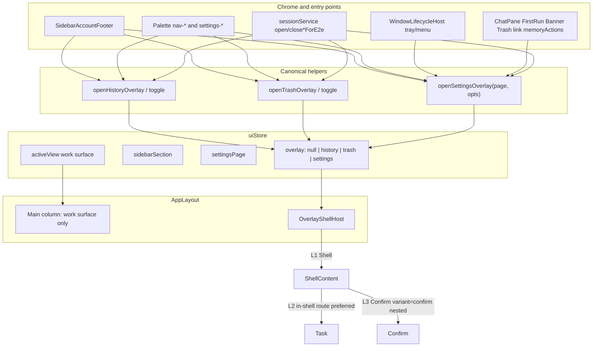
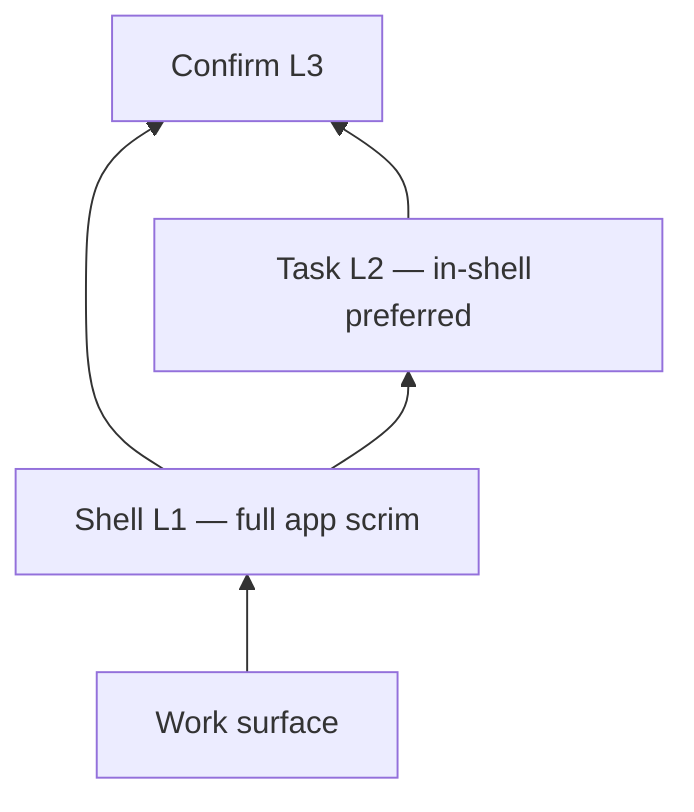

# Design: Overlay Shells for History, Trash, and Settings

| Field | Value |
|-------|-------|
| **Title** | Overlay Shells for Recycle Bin, Session History, and Settings |
| **Author** | TBD |
| **Date** | 2026-07-30 |
| **Status** | Draft (rev 4 — user decisions: History/Trash resizable; ChatPane → model) |
| **Product terms** | Recycle Bin (回收站), Session History (历史会话), Settings (设置) |

---

## Overview

Today the three bottom-left sidebar footer destinations — **Recycle Bin**, **Session History**, and **Settings** — are implemented as exclusive `activeView` main-content pages. Opening any of them unmounts the underlying work surface (`chat` / `code` / `knowledge` / `tasks` / …), which interrupts session streaming visibility, forces leave-knowledge / leave-work-items flushes on history and trash paths, and makes nested editors stack full-strength scrims on top of a full-page host.

This design converts those destinations into **overlay shells** layered above a **mounted, live** work surface (streaming continues; pointer/keyboard to the surface are blocked by the shell scrim until dismiss). An independent `overlay` state owns open/close; `activeView` / `sidebarSection` continue to mean only the underlying work surface. A three-role dialog visual system (**Shell / Task / Confirm**) plus an explicit nested-scrim matrix prevents double-scrim soup. Shell geometry is driven by the **desktop main window** size (default 1800×1100), not mobile breakpoints.

**Phase 1 (high ROI):** History + Trash → resizable overlay shells (remembered size).  
**Phase 2:** Settings as a large resizable overlay shell, then migrate high-traffic L2 editors to in-shell routes.

All Settings entry points converge on a single **`openSettingsOverlay`** helper. Footer active state is **hybrid** during PR3→PR4 so Settings rail highlighting remains correct while only History/Trash have moved.

---

## Background & Motivation

### Current architecture

| Concern | Location | Behavior today |
|---------|----------|----------------|
| Main content switch | `src/routes/AppLayout.tsx` → `renderMainContent()` | `activeView === 'history' \| 'trash' \| 'settings'` replaces chat/knowledge/etc. |
| View type | `src/store/uiStore.ts` → `ActiveView` | Includes `'settings' \| 'history' \| 'trash'` alongside work surfaces |
| Special-view memory | `setActiveView` + `previousView` | Remembers pre-special view; `handleMainToolbarBack` exists but **has no UI callers** (MainToolbar already dropped special-view back) |
| Chrome openers | `src/components/layout/sidebarActions.ts` | `openHistoryFromChrome` / `openTrashFromChrome` **leave** knowledge/tasks and reassign section; `openSettingsFromChrome` **flushes** knowledge/tasks but keeps section, still swaps main content |
| Footer | `SidebarAccountFooter.tsx` + `AppSidebar.tsx` | `active` derived from `activeView` |
| Toolbar | `MainToolbar.tsx` | Treats settings/history/trash as “special” (hides ConnectionStatus + PanelToggle) |
| Nav history | `navHistory.ts` / `navHistoryStore.ts` | `NavEntry.activeView` can be settings/history/trash; openers call `recordNavEntry()` |
| Modals | `src/components/ui/Modal.tsx` | Single style: full `bg-overlay` + `backdrop-blur-[2px]` at `z-50`; optional resize via `useResizableBox`; non-resizable default content `max-w-lg` |
| Resize clamp | `useResizableBox.ts` | `DEFAULT_MIN` 600×440; `clampToViewport` uses `max(min, 0.96W/0.92H)` — when viewport is narrower than min, **min dominates** and sizes stick to min (overflows window); **no** `resize` re-clamp |
| E2E open | `sessionService.open*PageForE2e` | Sets `activeView` directly |
| E2E close | `e2e/helpers/{history,trash,settings}.ts`, `e2e/helpers/app.ts` | History/Trash: click `sidebar-nav-chats`. Settings: `titlebar-back` / `settings-back` (no such testids in `src/` today). `leaveSpecialViewsIfOpen` also tries chats nav |
| Command palette | `buildGlobalCommands.ts` | `nav-*` call chrome openers; **per-page** `settings-${page}` commands call `setSettingsPage` + `setActiveView('settings')` directly |
| Command palette z | `GlobalCommandPalette.tsx` | Scrim `z-[200]`, panel `z-[210]` — already **above** Modal `z-50` |
| Window | `src-tauri/tauri.conf.json` | **1800×1100**, no min size. Sidebar 200–480 |

### Settings entry points today (complete inventory)

Every path that opens Settings must be migrated through one helper (see Proposed Design). Verified writers of `activeView: 'settings'` / equivalent:

| # | Location | Behavior today |
|---|----------|----------------|
| 1 | `sidebarActions.openSettingsFromChrome` | Flush knowledge/tasks; `setSettingsPage('general')`; `setActiveView('settings')`; `recordNavEntry()` |
| 2 | `buildGlobalCommands` `nav-settings` | Chrome opener or fallback `setSettingsPage('general')` + `setActiveView('settings')` |
| 3 | `buildGlobalCommands` `buildSettingsCommands` (`settings-${page}`) | `setSettingsPage(page)` + `setActiveView('settings')` — **does not** reset to General |
| 4 | `domain/commands/memoryActions.ts` `openMemorySettings` / `goSettingsPage` | Page + `setActiveView('settings')` |
| 5 | `command-palette/catalog.ts` | Calls `openMemorySettings()` |
| 6 | `window/WindowLifecycleHost.tsx` `listenOpenSettings` | Native/tray/menu → `setActiveView('settings')` only (does not force General today) |
| 7 | `chat/ChatPane.tsx` NO_API_KEY CTA | `setActiveView('settings')` (no page set → whatever `settingsPage` was) → **target: `openSettingsOverlay('model')`** |
| 8 | `chat/FirstRunSetupCard.tsx` | `setSettingsPage('model')` + `setActiveView('settings')` |
| 9 | `automation/AutomationScheduleBanner.tsx` | `setSettingsPage('window')` + `setActiveView('settings')` |
| 10 | `history/RecycleBinPage.tsx` memory link | `setSettingsPage('memory')` + `setActiveView('settings')` |
| 11 | `sessionService.openSettingsPageForE2e` | Page + `setActiveView('settings')` |

History/Trash writers: chrome openers, palette `nav-history`/`nav-trash` (+ fallbacks), E2E hooks, residual `setActiveView` in tests.

### Pain points

1. **Work surface death.** Opening History unmounts `ChatPane` / `InputBar` (keyed by `activeView` in AppLayout). Streaming may continue in domain state, but the user loses the live surface; re-entry remounts UI.
2. **Forced leave on History/Trash.** `openHistoryFromChrome` / `openTrashFromChrome` call `leaveKnowledge` / `leaveWorkItems` and `assignSectionAfterLeaving*`, which is necessary only because special views own the main column.
3. **Settings flush on open.** `openSettingsFromChrome` awaits leave-knowledge / leave-work-items even though section is kept — a **behavior we intentionally stop** when Settings becomes an overlay (dirty drafts stay until a real work-surface leave).
4. **Double-scrim soup.** Nested confirms and editors each mount a full-strength Modal scrim.
5. **Resize hazard on small windows.** Fixed `minSize` 600×440 breaks under ~600×440 client area.
6. **Nav history pollution.** Openers push work-surface frames for modal-like destinations.
7. **Scattered Settings writers.** Eleven entry points; migrating only chrome leaves double-booking risk.

### Non-problems (out of scope)

- Knowledge, terminals, tasks, automation remain real `activeView` work surfaces (not footer overlays).
- Command palette, session menu dialogs, permission modal stay as-is except where they open these three destinations.
- Runtime feature flags (hip uses compile-time `feature.ts` already `true`).

---

## Goals & Non-Goals

### Goals

1. Keep the underlying work surface **mounted and live** (streaming/domain continuity) while History / Trash / Settings are open. The shell scrim and Radix focus trap **block** pointer/keyboard to the work surface until the shell closes — we do **not** promise interaction under the overlay.
2. Introduce `overlay` state independent of `activeView`; **never** set `activeView` to settings/history/trash while also showing a modal for the same destination (no double-booking).
3. Layered dialog roles: Shell (L1), Task (L2), Confirm (L3) with a concrete scrim/Esc matrix.
4. Viewport-responsive shell sizing for the **desktop client area** (tiers A–D).
5. Safer `useResizableBox` min/max clamping and re-clamp on window resize + localStorage restore.
6. Route **all** History/Trash/Settings open paths through shared helpers; update chrome, palette, native menu, E2E open **and close**, and unit tests.
7. Prefer **not** recording overlay open/close as navHistory work-surface frames; coerce legacy special-view stack frames on apply.
8. Incremental, independently mergeable PRs with hybrid footer active during migration.
9. Selecting a session from History **closes** the shell on **all** open paths (row click + context-menu Open via shared helper); session-activating trash restore does the same when it navigates.

### Non-Goals

- Mobile-first responsive redesign or touch-specific shells.
- Rewriting Settings content (General/Model/Agents/…) business logic.
- Migrating *all* Settings nested modals in Phase 1 (inventory + preferred in-shell path; migrate progressively in Phase 2+).
- Changing trash retention, session delete semantics, or settings persistence (`settingsPage` still persisted).
- Feature-flagging behind runtime toggle; ship via progressive PR merge.
- Replacing Radix Dialog for Confirms (keep Modal primitive; evolve API).
- Drawers for tier D (near-full sheet is enough).

---

## Proposed Design

### High-level architecture



### Navigation model

#### State

Add to `UiState` in `src/store/uiStore.ts` (ephemeral — **not** in `UiPersistedState` / `partialize`):

```ts
export type AppOverlay = 'history' | 'trash' | 'settings'

// on UiState:
overlay: AppOverlay | null
setOverlay: (o: AppOverlay | null) => void
/** Toggle: if already open, close; else open. */
toggleOverlay: (o: AppOverlay) => void
```

**Invariant (post-migration of a destination):** When that destination is shown, it appears **only** via `overlay`, never via `activeView`. During PR3 (History/Trash migrated, Settings not), `activeView === 'settings'` may still appear; hybrid footer handles active rail.

Optional hardening in `setOverlay` (migration safety when opening an overlay while a residual special `activeView` is set):

```ts
setOverlay: (o) =>
  set((s) => {
    if (o != null && (s.activeView === 'history' || s.activeView === 'trash' || s.activeView === 'settings')) {
      const surface = coerceWorkSurfaceFromUi(s)
      return {
        overlay: o,
        activeView: surface.view,
        sidebarSection: surface.section,
      }
    }
    return { overlay: o }
  }),
```

**`coerceWorkSurfaceFromUi` / `coerceUnderlyingFromEntry` (normative, not optional sketch):**

```ts
import { surfaceOf } from '@/lib/sessions'
import { useDomainStore } from '@/domain'
import type { ActiveView, SidebarSection } from '@/store/uiStore'
import type { NavEntry } from '@/store/navHistoryStore'

type WorkSurface = { view: ActiveView; section: SidebarSection }

/**
 * Resolve a non-special work surface for the main column under an overlay.
 * Never returns settings|history|trash.
 */
export function coerceWorkSurfaceFromUi(s: {
  activeView: ActiveView
  sidebarSection: SidebarSection
  chatSessionId: string | null
  codeSessionId: string | null
}): WorkSurface {
  // If already on a real work surface, keep it (including knowledge/tasks/terminals/automation).
  if (
    s.activeView !== 'settings' &&
    s.activeView !== 'history' &&
    s.activeView !== 'trash'
  ) {
    return { view: s.activeView, section: s.sidebarSection }
  }
  // Residual special activeView: prefer domain active session, else surface pointers.
  const domain = useDomainStore.getState()
  const activeId = domain.activeSessionId
  const sess =
    (activeId && domain.sessions.find((x) => x.id === activeId)) ||
    (s.codeSessionId && domain.sessions.find((x) => x.id === s.codeSessionId)) ||
    (s.chatSessionId && domain.sessions.find((x) => x.id === s.chatSessionId)) ||
    null
  if (sess) {
    const surface = surfaceOf(sess.config) // 'chat' | 'code'
    return {
      view: surface,
      section: surface === 'code' ? 'projects' : 'chats',
    }
  }
  // Fallback: empty chat home
  return { view: 'chat', section: 'chats' }
}

/** Same rules for a NavEntry being applied (legacy special frames). */
export function coerceUnderlyingFromEntry(entry: NavEntry): WorkSurface {
  if (entry.sessionId) {
    const sess = useDomainStore.getState().sessions.find((x) => x.id === entry.sessionId)
    if (sess) {
      const surface = surfaceOf(sess.config)
      return {
        view: surface,
        section: surface === 'code' ? 'projects' : 'chats',
      }
    }
  }
  // Entry may already carry a work-surface sidebarSection even if activeView was special
  if (
    entry.sidebarSection === 'knowledge' ||
    entry.sidebarSection === 'terminals' ||
    entry.sidebarSection === 'tasks' ||
    entry.sidebarSection === 'automation'
  ) {
    return {
      view: entry.sidebarSection as ActiveView,
      section: entry.sidebarSection,
    }
  }
  if (entry.sidebarSection === 'projects') {
    return { view: 'code', section: 'projects' }
  }
  return { view: 'chat', section: 'chats' }
}
```

Rules in plain language:

1. Prefer `surfaceOf(session)` + chats/projects when a loaded `sessionId` (or domain active session) exists.
2. Else prefer non-special `sidebarSection` (knowledge/tasks/terminals/automation/projects/chats) mapped to the matching `activeView`.
3. Else **`activeView: 'chat'`, `sidebarSection: 'chats'`**.
4. Never return `settings` | `history` | `trash`.

#### Deprecating special ActiveView values

| Phase | ActiveView | Behavior |
|-------|------------|----------|
| PR3 | Keep type members | History/Trash openers stop writing `activeView`; `renderMainContent` no longer branches on history/trash; residual sets remapped or ignored |
| PR4 | Keep type members briefly | Settings openers all use `openSettingsOverlay`; main branch removed |
| PR6 | Remove `'settings' \| 'history' \| 'trash'` from `ActiveView` | Drop `previousView` special-case, `isEphemeralActiveView` entries, dead `handleMainToolbarBack` tests; context-menu / gating tests updated |

`settingsPage: SettingsPageId` **remains** (persisted).

#### Canonical helpers (single write path)

Place in `src/components/layout/sidebarActions.ts` (or `src/lib/overlayNav.ts` re-exported from sidebarActions for existing imports):

```ts
/** Open or replace History shell. No leave-*, no recordNavEntry, no activeView change. */
export function openHistoryOverlay(): void {
  useUiStore.getState().setOverlay('history')
}

export function toggleHistoryOverlay(): void {
  useUiStore.getState().toggleOverlay('history')
}

export function openTrashOverlay(): void {
  useUiStore.getState().setOverlay('trash')
  void import('@/domain').then(({ sessionService }) => {
    sessionService.requestTrashList()
  })
}

export function toggleTrashOverlay(): void {
  const ui = useUiStore.getState()
  if (ui.overlay === 'trash') {
    ui.setOverlay(null)
    return
  }
  openTrashOverlay()
}

/**
 * Canonical Settings open. All product entry points must call this (or a
 * thin wrapper). Never setActiveView('settings').
 *
 * **Param semantics (page always wins when provided):**
 * - If `page` is defined → `setSettingsPage(page)` (deep link / palette category).
 * - Else if `opts?.resetToGeneral !== false` → `setSettingsPage('general')`
 *   (footer, tray/menu, nav-settings with no page).
 * - Else → leave current `settingsPage` unchanged (rare).
 *
 * Do **not** pass `{ resetToGeneral: true }` together with a non-null `page`;
 * if both appear, **page wins** (implementation ignores reset when page is set).
 */
export function openSettingsOverlay(
  page?: SettingsPageId,
  opts?: { resetToGeneral?: boolean },
): void {
  const ui = useUiStore.getState()
  if (page != null) {
    ui.setSettingsPage(page)
  } else if (opts?.resetToGeneral !== false) {
    ui.setSettingsPage('general')
  }
  ui.setOverlay('settings')
  // Intentional behavior change: do NOT leaveKnowledge / leaveWorkItems.
}

/** Footer / chrome toggle (re-click closes). Lands on General when opening. */
export function openSettingsFromChrome(): void {
  const ui = useUiStore.getState()
  if (ui.overlay === 'settings') {
    ui.setOverlay(null)
    return
  }
  openSettingsOverlay() // no page → General
}

export function closeOverlay(): void {
  useUiStore.getState().setOverlay(null)
}
```

Wire entry points:

| Entry | Call |
|-------|------|
| Footer Settings | `openSettingsFromChrome` (toggle; open → General) |
| Footer History/Trash | `toggleHistoryOverlay` / `toggleTrashOverlay` |
| Palette `nav-settings` | `openSettingsFromChrome` or `openSettingsOverlay()` |
| Palette `settings-${page}` | `openSettingsOverlay(page)` — page wins |
| `openMemorySettings` | `openSettingsOverlay('memory')` |
| `goSettingsPage(page)` | `openSettingsOverlay(page)` |
| `WindowLifecycleHost` | `openSettingsOverlay()` — tray/menu lands General |
| `ChatPane` NO_API_KEY | `openSettingsOverlay('model')` (**final** — Model category for API key setup) |
| `FirstRunSetupCard` | `openSettingsOverlay('model')` |
| `AutomationScheduleBanner` | `openSettingsOverlay('window')` |
| RecycleBin memory link | **PR3:** close trash then full-page settings (see below). **PR4+:** `openSettingsOverlay('memory')` replaces trash shell |
| E2E `openSettingsPageForE2e(page)` | `openSettingsOverlay(page)` |

**Acceptance grep gate (PR4 + PR6):** zero remaining production (non-test) matches for `setActiveView('settings'|'history'|'trash')` and direct `activeView: 'settings'` writes outside migration shims/tests.

#### Open / close rules

| Action | Behavior |
|--------|----------|
| Open History / Trash / Settings | Canonical helper; **do not** change `activeView` / `sidebarSection` |
| Footer re-click of **active** overlay | Toggle close |
| Open another overlay while one is open | Replace L1 (`overlay = next`); clear shell-local L2 route; unmount L3 confirms with previous shell |
| Close (X, allowed scrim click, footer toggle, `closeOverlay`) | `setOverlay(null)`; work surface unchanged |
| Esc | Topmost layer only — see Nested dialog matrix |
| Knowledge / tasks under overlay | **Do not** call `leaveKnowledge` / `leaveWorkItems` on open (**behavior change for Settings** — no flush on open) |
| Session streaming | Continues under scrim; surface not interactive until shell closes |
| **Select session from History (all paths)** | Use `openSessionFromHistory(id)` (row click **and** context-menu Open) — never leave History shell open |
| **Restore session from Trash** that navigates to a session | Close trash overlay only if restore activates a session (today restore usually does not call selectSession; gate on actual navigation) |

#### Footer active state (hybrid until PR6)

**Do not** switch to `overlay` alone in PR3.

```ts
// src/components/layout/sidebarFooterActive.ts (or inline in AppSidebar)
export function footerUtilityActive(
  overlay: AppOverlay | null,
  activeView: ActiveView,
): 'trash' | 'history' | 'settings' | null {
  if (overlay === 'history' || overlay === 'trash' || overlay === 'settings') {
    return overlay
  }
  // Mid-migration: Settings (and any residual special view) still on activeView
  if (activeView === 'settings' || activeView === 'history' || activeView === 'trash') {
    return activeView
  }
  return null
}
```

- **PR3 acceptance:** hybrid helper used; History/Trash highlight via `overlay`; Settings highlight still works via `activeView === 'settings'`.
- **PR4 acceptance:** Settings also on `overlay`; hybrid still correct (overlay wins).
- **PR6:** collapse to `active={overlay}` only after ActiveView special values removed.

#### MainToolbar

Once a destination is an overlay, MainToolbar no longer needs that destination’s title branch or special chrome-hiding. Underlying work surface chrome remains correct for live `activeView`. Shell titles live in the Shell header.

#### Nav history (`navHistory` / `navHistoryStore`)

**Chosen rules:**

1. Overlay open/close is **not** a work-surface frame — openers must **not** call `recordNavEntry()`.
2. `captureNavEntry()` does **not** include `overlay`.
3. `applyNavEntry` **always** starts with `setOverlay(null)`.
4. **Legacy special-view frames** (in-session stack from before migration, or residual):

```ts
// applyNavEntry sketch
const SPECIAL = new Set(['settings', 'history', 'trash'])

export async function applyNavEntry(entry: NavEntry): Promise<void> {
  useNavHistoryStore.getState().setApplying(true)
  try {
    useUiStore.getState().setOverlay(null)

    if (SPECIAL.has(entry.activeView)) {
      // Reopen as overlay + restore work surface underneath (see coerceUnderlyingFromEntry)
      const surface = coerceUnderlyingFromEntry(entry)
      useUiStore.getState().setSidebarSection(surface.section)
      useUiStore.getState().setActiveView(surface.view)
      if (entry.activeView === 'settings') {
        useUiStore.getState().setSettingsPage(entry.settingsPage)
      }
      if (entry.sessionId) {
        const exists = useDomainStore.getState().sessions.some((s) => s.id === entry.sessionId)
        if (exists) sessionService.selectSession(entry.sessionId)
        // selectSession records nav while applying is true → no-op push; OK
      }
      // Product: restoring an old special frame reopens that shell over the coerced surface
      useUiStore.getState().setOverlay(entry.activeView as AppOverlay)
      if (entry.activeView === 'trash') {
        void sessionService.requestTrashList()
      }
      return
    }

    // … existing non-special restore …
  } finally {
    useNavHistoryStore.getState().setApplying(false)
  }
}
```

**PR6 type cleanup:** `NavEntry.activeView` narrows to work-surface views; at read time, any persisted test stack with special values is coerced the same way. Unit tests in `navHistory.test.ts` cover: special frame → overlay + surface; normal frame clears overlay; History open does not push.

5. Category changes inside Settings (`setSettingsPage`) do **not** push frames.
6. `selectSession` continues to `recordNavEntry()` — that records the **work surface**, which is correct after History closes overlay first.

#### Command palette

- `nav-history` / `nav-trash` / `nav-settings` → chrome toggle helpers.
- `settings-${page}` → `openSettingsOverlay(page, { resetToGeneral: false })` (via context method `openSettingsOverlay` preferred over raw setState).
- Remove `setActiveView('settings'|'history'|'trash')` fallbacks in PR3/PR4 as each destination migrates.
- z-index: palette already `z-[200]/[210]` vs Modal `z-50` — **no change required**; risk is low.

#### E2E open **and close**

**Open** (`sessionService`):

```ts
openSettingsPageForE2e(page = 'general'): void {
  openSettingsOverlay(page as SettingsPageId) // page always wins
}
openHistoryPageForE2e(): void {
  openHistoryOverlay()
}
openTrashPageForE2e(): void {
  openTrashOverlay()
}
/** New: close any footer utility shell */
closeOverlayForE2e(): void {
  useUiStore.getState().setOverlay(null)
}
```

Install `closeOverlayForE2e` on `window.__hipE2E`.

**Close helpers redesign** (required in the same PR as open migration — not “only if assertions break”):

| Helper | After migration |
|--------|-----------------|
| `e2e/helpers/history.ts` `closeHistory` | Prefer `closeOverlayForE2e()`; fallback click `[data-testid="modal-close"]` within `[data-testid="overlay-shell-history"]`, or footer re-click `account-history-button`. Wait until `session-history` gone. **Do not** rely on `sidebar-nav-chats`. |
| `e2e/helpers/trash.ts` `closeTrash` | Same pattern with `overlay-shell-trash` / `recycle-bin-page`. |
| `e2e/helpers/settings.ts` `closeSettings` | **Remove** dependency on missing `titlebar-back` / `settings-back`. Use `closeOverlayForE2e()` or shell `modal-close` / footer `account-settings-button`. |
| `e2e/helpers/app.ts` `leaveSpecialViewsIfOpen` | Call `closeOverlayForE2e` first; then legacy chats-nav only if residual full-page special views still exist mid-migration. Wait for absence of `session-history`, `recycle-bin-page`, `settings-page` **and** overlay shell testids. |
| `e2e/helpers/memory.ts` | Open still via `openSettingsPageForE2e('memory')`; close via settings close helper if needed. |

Stable page roots **kept**: `session-history`, `recycle-bin-page`, settings nav `settings-nav-${id}`. New shell wrappers: `overlay-shell-history`, `overlay-shell-trash`, `overlay-shell-settings`.

#### Session select / restore closes overlay (product rule)

**Key Decision 13 — not optional. Covers every History open path, not only row click.**

Today:

- Row click in `SessionHistory.tsx` calls `sessionService.selectSession(id)` directly.
- Context-menu **Open** uses a **different** path: `sessionHistoryProvider` → `selectSessionFromSidebar(sessionId)` (`src/components/context-menu/providers/sessionHistory.ts`), which does `leaveActiveSurfaceIfNeeded` → `selectSession` → `recordNavEntry` and **never** clears an overlay.

As an overlay, **both** paths must close History. Do **not** bury close inside global `sessionService.selectSession` (would wrongly close Settings if anything selected a session while Settings is open). Do **not** only patch the row `onClick`.

**Canonical helper (PR3):**

```ts
// sidebarActions.ts (or next to overlay helpers)
/**
 * Open a session from History (row click or context-menu Open).
 * Leaves knowledge/tasks if needed, selects session, records nav, closes History/Trash shell.
 * Does not close Settings if somehow called while settings overlay is open —
 * only clears overlay when it is 'history' or 'trash'.
 */
export async function openSessionFromHistory(id: string): Promise<void> {
  await leaveActiveSurfaceIfNeeded()
  sessionService.selectSession(id) // sets chat/code activeView + recordNavEntry internally
  const o = useUiStore.getState().overlay
  if (o === 'history' || o === 'trash') {
    useUiStore.getState().setOverlay(null)
  }
}
```

Wire:

| Path | Change |
|------|--------|
| `SessionHistory` row `onClick` | `void openSessionFromHistory(session.id)` (replace bare `selectSession`) |
| `sessionHistoryProvider` Open | `void openSessionFromHistory(sessionId)` (replace `selectSessionFromSidebar`) |
| Sidebar session rows | **Keep** `selectSessionFromSidebar` — do not close overlay when picking a session from the left rail while a shell is open? Prefer: sidebar select **also** closes history/trash overlay so the work surface is visible (`openSessionFromHistory` or shared `selectSessionAndDismissUtilityOverlay`). **Product:** sidebar/session rail select while History shell open should dismiss History (same helper or call `closeOverlay` when overlay is history/trash after select). Use `selectSessionFromSidebar` updated to: after select, if `overlay === 'history' \| 'trash'` then `setOverlay(null)`. Settings overlay stays open if user clicks a session in the rail (unusual; optional close — **default: only dismiss history/trash**, not settings). |

```ts
// selectSessionFromSidebar — extend in PR3
export async function selectSessionFromSidebar(id: string): Promise<void> {
  await leaveActiveSurfaceIfNeeded()
  sessionService.selectSession(id)
  recordNavEntry()
  const o = useUiStore.getState().overlay
  if (o === 'history' || o === 'trash') {
    useUiStore.getState().setOverlay(null)
  }
}
```

Then `openSessionFromHistory` can be `selectSessionFromSidebar` (same behavior) **or** a thin alias — **prefer one function** to avoid drift:

```ts
export const openSessionFromHistory = selectSessionFromSidebar
// after selectSessionFromSidebar gains history/trash dismiss
```

And History row + context menu both call `selectSessionFromSidebar` / `openSessionFromHistory`.

**Trash:** session soft-restore today does not always `selectSession`; only close trash overlay when a path actually activates a session.

**Tests (PR3):**

- `SessionHistory` row click → overlay null + select called.
- `sessionHistoryProvider` Open → overlay null + select called (`sessionHistory.test.ts`).
- `selectSessionFromSidebar` with `overlay: 'history'` → ends null; with `overlay: 'settings'` → settings remains (settings not dismissed by session select).

#### Cold-launch / reconnect guard

`sessionService` (~L453–460) today clears `knowledge` / `settings` / `history` but **not** `trash`. Spec:

```ts
const special =
  st.activeView === 'knowledge' ||
  st.activeView === 'settings' ||
  st.activeView === 'history' ||
  st.activeView === 'trash'
if (special || st.overlay != null) {
  useUiStore.setState({
    activeView: 'chat',
    sidebarSection: 'chats',
    overlay: null,
  })
}
```

(Only apply the chat force when the existing cold-reconnect branch runs — preserve knowledge leave semantics of that code path carefully; include trash + overlay null.)

#### Dialog host pattern + a11y / testids

```tsx
// AppLayout.tsx
<OverlayShellHost />
```

```tsx
// OverlayShellHost.tsx
export function OverlayShellHost() {
  const overlay = useUiStore((s) => s.overlay)
  const { t } = useTranslation()
  if (!overlay) return null

  const onOpenChange = (open: boolean) => {
    if (!open) useUiStore.getState().setOverlay(null)
  }

  if (overlay === 'history') {
    return (
      <Modal
        variant="shell"
        open
        onOpenChange={onOpenChange}
        title={t('history.title')}
        // All shells: resizable + storageKey; defaultSize from shellSize; clamp on open/resize
        resizable
        defaultSize={shellSize(window.innerWidth, window.innerHeight, 'history')}
        storageKey="overlay-shell-history"
        // Prefer contentClassName or children wrapper for testid — see below
        // closeDisabled only if a future busy flag exists; default false
      >
        <div data-testid="overlay-shell-history" className="flex min-h-0 flex-1 flex-col">
          <SessionHistory embeddedInShell />
        </div>
      </Modal>
    )
  }
  // trash: resizable, storageKey="overlay-shell-trash", defaultSize shellSize(..., 'trash')
  // settings: resizable, storageKey="overlay-shell-settings",
  //   title t('settings.title'), wrapper testid overlay-shell-settings,
  //   dismissOnScrim true (PR4 default)
}
```

**Shell `data-testid` (Modal has no passthrough today):** `ModalProps` does not forward `data-testid` (`Modal.tsx` only hardcodes `modal-close` on the X). **Chosen approach for PR3 (no Modal API change required):** wrap page body in `<div data-testid="overlay-shell-history|trash|settings">` inside Modal children. E2E scopes `modal-close` via shell wrapper parent or uses `closeOverlayForE2e`. Optional PR2 nicety: `contentTestId?: string` on Modal forwarded to `Dialog.Content` — not required if wrapper exists.

**Title policy:** Modal header carries the product title (`history.title`, trash title, `settings.title`). Page components **suppress their page-level h2** when `embeddedInShell` (or always if title moves exclusively to shell) to avoid double titles. Existing page `data-testid`s remain on the body for e2e.

**Scrim dismiss (PR4 defaults):**

| Shell | Outside / scrim click |
|-------|------------------------|
| History | Dismiss (`onOpenChange(false)`) |
| Trash | Dismiss |
| Settings | Dismiss by default; if an in-shell L2 form later needs dirty protection, that route sets `closeDisabled` or prompts — not required for PR4 host |

---

### Nested dialog visual system



| Role | Use | Size | Scrim | Resizable |
|------|-----|------|-------|-----------|
| **Shell (L1)** | History / Trash / Settings host | Viewport tiers A–D + `shellSize` (default open size) | Full app scrim (`bg-overlay` + light blur) — **only** full-strength layer over work surface | **Yes** for History, Trash, and Settings — each with its own `storageKey`; re-clamp on open/resize/restore |
| **Task (L2)** | Large editors | Medium, smaller than Shell | Prefer **in-shell route** (no second Modal). If Modal needed: `variant="task"` | Optional |
| **Confirm (L3)** | Delete / empty / preflight | `max-w-sm`, never resizable | See matrix below | Never |

#### Modal API

```ts
export type ModalVariant = 'shell' | 'task' | 'confirm'

interface ModalProps {
  // existing fields…
  /**
   * Visual/behavior role. **Default: undefined = legacy** (today’s full scrim,
   * max-w-lg when not resizable, current blur). Never default to 'confirm'.
   */
  variant?: ModalVariant
  /**
   * When true, Confirm/Task use nested stacking policy (light scrim, no blur).
   * Callers may pass explicitly; Confirm helpers should auto-set when
   * `useUiStore.getState().overlay != null`.
   */
  nested?: boolean
}
```

**Backward compatibility:** Omitting `variant` preserves current `Modal.tsx` behavior (full `bg-overlay backdrop-blur-[2px]`, non-resizable `max-w-lg`). PR2 must not change global defaults. Opt in with `variant="confirm" | "task" | "shell"`.

**Shell class overrides** (when `variant="shell"`):

- Strip / override base `max-w-lg`, `max-h-[85vh]`, `w-[calc(100vw-2rem)]`.
- Apply computed `width`/`height` from `shellSize` (or `useResizableBox` for Settings) as inline style.
- Use `max-h-[100dvh]` only as a safety ceiling; primary size is px from helper.
- Keep centering via `fixed inset-0 m-auto` (existing modalMotion-safe pattern).

#### Nested / Esc / scrim decision table

| Context | Overlay node | Scrim | Esc / dismiss | Who sets `nested` |
|---------|--------------|-------|---------------|-------------------|
| Shell alone | Yes | Full strength + blur | Closes shell | n/a |
| Confirm over Shell (History delete, trash hard-delete, etc.) | Yes (second Dialog) | **Light**, **no blur** (`--overlay-scrim-light` or `bg-black/20`) | Closes **confirm only**; shell stays | **Auto:** `nested={useUiStore(s => s.overlay != null)}` inside Confirm wrappers (`DeleteSessionDialog`, etc.) or Modal when `variant="confirm" && overlay` |
| Confirm alone (e.g. SessionMenuDialogHost delete while no footer shell) | Yes | **Full** legacy scrim (same as today’s Modal) — do not force light when `!nested` | Closes confirm | `nested=false` |
| Task as portaled Modal over Shell (temporary until in-shell) | Yes | Light / no blur when `nested` | Closes task only | Explicit `variant="task" nested` |
| Task **in-shell** route (PR5 preferred) | **No** portal Modal | n/a | Shell header Back / Esc handled by shell route stack, not second Dialog | n/a |

**Sibling Dialog.Roots note:** `DeleteSessionDialog` mounts its own `Modal` (portal) as a sibling tree under SessionHistory, not as Radix nested content. Esc ordering is **not** automatic.

**PR3 chosen strategy (single mechanism — implement this):**

1. Confirm dialogs (`DeleteSessionDialog`, `ClearAllSessionsDialog`, trash hard-delete/empty Modals) set **`data-confirm-dialog`** on `Dialog.Content` (via Modal: when `variant="confirm"`, add the attribute automatically; or pass `contentProps`).
2. Shell Modal `onEscapeKeyDown`:  
   `if (document.querySelector('[data-confirm-dialog]')) e.preventDefault()`  
   so Esc is handled by the Confirm dialog first (Radix focuses the topmost dialog; Shell must not also close).
3. Integration test: open History → open DeleteSessionDialog → Esc → confirm gone, History still open → Esc → History gone.

Alternative (not default): React state `confirmOpen` lifted into shell host — only if a given confirm cannot set `data-confirm-dialog`. Do not mix both strategies in PR3.

**Two architectures for Task (do not mix casually):**

| Path | When |
|------|------|
| **In-shell route** | Settings editors (Agent, MCP, Skill, Plugin, Memory) after PR5 — no second portal |
| **`variant="task"` Modal** | Temporary or non-Settings surfaces that cannot move in-shell yet |

#### Inventory of multi-layer paths

**History (PR3)**

| Dialog | File | Role |
|--------|------|------|
| Delete session | `DeleteSessionDialog.tsx` | Confirm + auto `nested` when shell open + `data-confirm-dialog` |
| Clear all | `ClearAllSessionsDialog.tsx` | Confirm + auto `nested` + `data-confirm-dialog` |

**Trash (PR3)**

| Dialog | File | Role |
|--------|------|------|
| Hard-delete / empty | inline Modal in `RecycleBinPage.tsx` | Confirm + auto `nested` + `data-confirm-dialog` |

**Settings (PR4 host, PR5 L2)**

| Surface | File(s) | Treatment |
|---------|---------|-----------|
| Agent editor | `AgentEditor.tsx` | In-shell L2 (PR5) |
| Delete agent | `DeleteAgentDialog.tsx` | Confirm |
| MCP add/edit | `McpConfig.tsx` | In-shell L2 |
| MCP registry | `McpRegistrySourceModal.tsx` | Task or in-shell |
| Skill view (`storageKey="skill-view"`) | `SkillConfig.tsx` | In-shell L2 |
| Plugin detail | `PluginConfig.tsx`, `PluginConfigView.tsx` | In-shell L2; Confirm delete |
| Memory add/edit | `MemoryConfig.tsx` | In-shell L2 |
| Preflight | `PreflightEnableModal.tsx` | Confirm |
| Add provider / endpoint | `AddProviderDialog.tsx`, `EndpointModelDialog.tsx` | Task or in-shell |
| Marketplace source | `MarketplaceSourceModal.tsx` | Task |

In-shell route type (PR5):

```ts
type SettingsShellRoute =
  | { type: 'page' }
  | { type: 'agent-edit'; agentId?: string }
  | { type: 'mcp-edit'; serverId?: string }
  | { type: 'skill-view'; skillId: string }
  | { type: 'plugin-view'; pluginId: string }
  | { type: 'memory-edit'; memoryId?: string }
```

---

### Viewport-responsive shell sizing (desktop window-driven)

Main window default: **1800×1100**. No OS min size. Sidebar 200–480. Breakpoints use **client area** (`window.innerWidth` / `innerHeight`). Shell is portaled and centered on the **full window**, so using `innerWidth` (including sidebar) is correct; “expose work-surface margins” on tier A is visual margin around the floating panel only.

`UiDensity` affects **row heights only**, not breakpoints.

#### Tiers (evaluate **D → C → B → A**)

| Tier | Condition | Presentation |
|------|-----------|--------------|
| **D** | `W < 720` **or** `H < 560` | Fill client (margin ~4px); Settings back-stack; **no double centered dialogs** |
| **C** | `W < 1000` **or** `H < 700` | Near-full sheet (margin ~10px); Settings single-column |
| **B** | `W < 1280` **or** `H < 800` | Larger share of viewport |
| **A** | else (`W ≥ 1280` **and** `H ≥ 800`) | Floating centered; visible margins |

Boundary examples for tests: `719×559 → D`, `720×560 → C` (neither D inequality holds), `999×800 → C`, `1000×700 → B` (H=700 is not `< 700`, W=1000 is not `< 1000` → not C; W<1280 → B), `1280×800 → A`, `600×500 → D` (success criterion: no overflow).

#### Size formulas

```ts
function gutters(w: number, h: number): { gx: number; gy: number } {
  if (w < 720 || h < 560) return { gx: 4, gy: 4 }
  if (w < 1000 || h < 700) return { gx: 10, gy: 10 }
  if (w < 1280 || h < 800) return { gx: 24, gy: 20 }
  return {
    gx: Math.round(clampNum(32, 0.04 * w, 64)),
    gy: Math.round(clampNum(28, 0.04 * h, 56)),
  }
}

const FLOOR = { width: 480, height: 360 }

function shellSize(
  w: number,
  h: number,
  kind: 'history' | 'trash' | 'settings' = 'settings',
): Size {
  const { gx, gy } = gutters(w, h)
  const maxW = Math.max(0, w - 2 * gx)
  const maxH = Math.max(0, h - 2 * gy)
  const idealW =
    kind === 'settings' ? Math.min(1100, 0.62 * w) : Math.min(960, 0.55 * w)
  const idealH =
    kind === 'settings' ? Math.min(780, 0.72 * h) : Math.min(720, 0.68 * h)
  const minW = Math.min(FLOOR.width, maxW)
  const minH = Math.min(FLOOR.height, maxH)
  return {
    width: Math.round(clampNum(minW, idealW, maxW)),
    height: Math.round(clampNum(minH, idealH, maxH)),
  }
}

function clampNum(min: number, v: number, max: number) {
  if (max < min) return max
  return Math.max(min, Math.min(v, max))
}
```

#### `useResizableBox` fixes

```ts
function clampToViewport(s: Size, min: Size, padding = { x: 0.04, y: 0.08 }): Size {
  const maxW = Math.round(window.innerWidth * (1 - padding.x))
  const maxH = Math.round(window.innerHeight * (1 - padding.y))
  const effMinW = Math.min(min.width, maxW)
  const effMinH = Math.min(min.height, maxH)
  return {
    width: Math.max(effMinW, Math.min(s.width, maxW)),
    height: Math.max(effMinH, Math.min(s.height, maxH)),
  }
}
```

- Re-clamp on `window.resize` while enabled.
- Re-clamp on localStorage restore.
- Shells pass viewport-aware mins from `shellSize` / FLOOR — do not force DEFAULT_MIN 600×440 onto shells.
- History / Trash / Settings each use `resizable` + a dedicated `storageKey` (`overlay-shell-history`, `overlay-shell-trash`, `overlay-shell-settings`). Default open size = `shellSize(...)`; stored size is re-clamped on open and window resize.

#### Settings layout contract by tier (PR4)

| Tier | Category nav | L2 route (`settingsShellRoute`) |
|------|--------------|----------------------------------|
| **A / B** | Current vertical `TabsPrimitive` + `NAV_WIDTH_CLASS = 'w-48'`; keep `data-testid={settings-nav-${id}}` and group headers `settings-nav-group-${id}` | PR5: body swaps to editor; side nav can remain visible |
| **C** | **Native `<select>`** (not chip soup for ~11 pages). Options grouped with `<optgroup label={t(group.labelKey)}>`. Each `<option>` keeps `data-testid={settings-nav-${id}}` **or** e2e uses `select` value + option testid on wrapper: preferred — render a visually hidden / SR-friendly list that preserves `settings-nav-${id}` triggers for e2e, **or** update Settings e2e page object once with select value API. **This design chooses:** compact `<select data-testid="settings-nav-select">` + options `data-testid={settings-nav-${id}}` on each `<option>` (HTML allows testid on option). `TabsPrimitive.Root` keeps `value={settingsPage}` / `onValueChange`; **replace List only**, Content unchanged. | Same as A/B |
| **D** | Same compact select as C when `route.type === 'page'`. When `route.type !== 'page'`, **hide** category control; show shell Back only | Esc/Back pops L2 then shell |

**Live resize C↔B:** `useShellViewportTier()` subscribes to `resize`; switching tier re-renders nav chrome without remounting the active page component (keep `Tabs.Content` / page instance stable via `settingsPage` key only — do not key entire panel by tier). Accept brief focus loss on the nav control; do not reset `settingsPage`.

```ts
export function useShellViewportTier(): 'A' | 'B' | 'C' | 'D' {
  // state + resize listener; pure classify(w,h) from shellViewport.ts
}
```

---

## API / Interface Changes

### uiStore

```ts
export type AppOverlay = 'history' | 'trash' | 'settings'
overlay: AppOverlay | null
setOverlay: (overlay: AppOverlay | null) => void
toggleOverlay: (overlay: AppOverlay) => void
```

### Canonical helpers

`openHistoryOverlay`, `toggleHistoryOverlay`, `openTrashOverlay`, `toggleTrashOverlay`, `openSettingsOverlay`, `openSettingsFromChrome` (toggle), `closeOverlay`, plus chrome aliases for History/Trash.

### Modal

```ts
variant?: 'shell' | 'task' | 'confirm'  // default undefined = legacy
nested?: boolean
```

### New modules

| Path | Responsibility |
|------|----------------|
| `src/lib/shellViewport.ts` | Tiers, gutters, `shellSize`, `classifyTier`, clamp |
| `src/lib/shellViewport.test.ts` | Table-driven boundaries |
| `src/components/layout/OverlayShellHost.tsx` | L1 host |
| `src/components/layout/sidebarFooterActive.ts` | Hybrid footer active (optional file) |
| `src/hooks/useShellViewport.ts` | React tier + size |

### E2E

- `closeOverlayForE2e` on `__hipE2E`
- Helpers: `history.ts`, `trash.ts`, `settings.ts`, `app.ts`, `memory.ts` as needed

---

## Data Model Changes

| Store / storage | Change |
|-----------------|--------|
| `uiStore` runtime | +`overlay` (null default) |
| `hip-ui` localStorage | **No** persist of `overlay` |
| `settingsPage` | Unchanged, still persisted |
| Shell size keys | `overlay-shell-history`, `overlay-shell-trash`, `overlay-shell-settings` (or equivalent); clamp on read |
| `navHistoryStore` | No `overlay` field; apply clears overlay + coerces special frames |
| Domain / protocol | None |

---

## Alternatives Considered

### A. Keep `activeView` special pages + dimming layer

Still unmounts or hides work surface; rejects product goal. **Reject.**

### B. Route-based overlays (`?modal=settings`)

Conflicts with store-driven `navHistoryStore`. **Reject** unless shareable deep links become a goal.

### C. Global dialog-stack reducer

Large rewrite; Modal `variant` is enough. **Reject** as big-bang.

### D. Drawers instead of centered shells

Product wants centered floating shells on large desktop (tier A). Tier C/D near-full sheet covers constrained windows; **drawer-only for tier D was considered and rejected** in favor of one sheet geometry path.

---

## Security & Privacy Considerations

| Topic | Assessment |
|-------|------------|
| Auth / API keys | Same Settings panels; keys remain plaintext `~/.hip/config/auth.json` by design |
| Focus trap | Radix Dialog on Shell; palette remains above (`z-200`) |
| E2E hooks | DEV-only; add `closeOverlayForE2e` |
| Threat delta | **Low** — migration double-booking is the main residual (grep gate) |

---

## Observability

- No new production metrics required.
- Unit tests for viewport math, hybrid footer, applyNavEntry special frames, session-select closes overlay, Esc stacking.
- E2E open/close helpers as the integration signal.

---

## Rollout Plan

**No runtime feature flag.** Progressive PR merge.

| Stage | Content | Rollback |
|-------|---------|----------|
| PR1 | Viewport utils + table tests | Revert |
| PR2 | Modal variants (**legacy default**) + useResizableBox clamp | Revert |
| PR3 | History/Trash shells + overlay state + hybrid footer + e2e close + session-select close | Revert |
| PR4 | Settings shell + **all** settings entry points + e2e close | Revert |
| PR5 | Settings in-shell L2 (batchable) | Revert partial |
| PR6 | Remove special ActiveViews; context-menu/gating tests; footer → overlay only | Revert |

---

## Risks

| Risk | Severity | Mitigation |
|------|----------|------------|
| Nested Esc order with sibling Dialogs | **High** | PR3: `data-confirm-dialog` on Confirm Content + Shell `onEscapeKeyDown` preventDefault when present; integration test |
| Double-booking overlay + activeView | **High** | Canonical helpers; `setOverlay` coerce; grep gate PR4/PR6 |
| Footer Settings inactive after PR3 | **High** | Hybrid `footerUtilityActive` |
| Missed settings entry point | **High** | Full inventory table; single `openSettingsOverlay`; grep gate |
| Modal default wrongly set to confirm | **High** | Default = legacy (`undefined`) |
| E2E close via chats nav leaves shell open | **High** | Redesign close helpers + `closeOverlayForE2e` in PR3/PR4 |
| History select leaves shell open | **High** | Close in SessionHistory path; unit test |
| `useResizableBox` min > max | **High** | PR2 clamp + resize listener |
| Knowledge dirty under Settings without flush | **Medium** | Documented intentional behavior change; flush on real leave |
| Settings L2 still full-scrim until PR5 | **Low–Medium** | Temporary `variant=task nested` |
| Palette under shell | **Low** | Already z-200 > z-50 |
| Context-menu tests bake special activeViews | **Low** | PR6 checklist grep |

---

## Open Questions

None remaining for Phase 1–2 product forks. Resolved decisions:

| Topic | Resolution |
|-------|------------|
| Session select closes shell | Key Decision 13 |
| Settings scrim dismiss | Allow for PR4; dirty L2 protection later if needed |
| History/Trash resizable | **Yes** — resizable + localStorage per kind (Key Decision 15); default size still `shellSize` |
| ChatPane NO_API_KEY page | **`model`** (Key Decision 17) |

---

## References

- `src/routes/AppLayout.tsx`, `src/store/uiStore.ts`
- `src/components/layout/sidebarActions.ts`, `SidebarAccountFooter.tsx`, `navHistory.ts`, `MainToolbar.tsx`
- `src/components/ui/Modal.tsx`, `useResizableBox.ts`, `motionClasses.ts`
- `src/components/history/SessionHistory.tsx`, `RecycleBinPage.tsx`, `SessionMenuDialogHost.tsx`
- `src/components/account/SettingsPage.tsx`, `SettingsPanel.tsx`
- Settings entry points: `memoryActions.ts`, `WindowLifecycleHost.tsx`, `ChatPane.tsx`, `FirstRunSetupCard.tsx`, `AutomationScheduleBanner.tsx`, `buildGlobalCommands.ts`
- `src/components/command-palette/GlobalCommandPalette.tsx` (z-200/210)
- `src/domain/sessionService.ts` E2E hooks + cold guard
- E2E: `e2e/helpers/{history,trash,settings,app,memory,e2e-hooks}.ts`
- Context-menu tests with special views: `providers/{sessionHistory,trashEntry,agentConfig,mcpServer,skillConfig,plugin}.test.ts`
- `src-tauri/tauri.conf.json` — 1800×1100

---

## Key Decisions

1. **Independent `overlay` state, never dual modal+activeView for the same destination.**  
   Rationale: Double-booking unmounts the work surface and reintroduces leave-section hacks.

2. **Phase History/Trash first (PR3), Settings second (PR4).**  
   Rationale: Smaller surfaces, clear Confirms; Settings has many nested editors and entry points.

3. **Opening any overlay does not leave knowledge/tasks — including Settings (behavior change).**  
   Rationale: Flushes exist because special views stole the main column. Overlays no longer need that. Dirty knowledge drafts remain until a real work-surface leave or app exit handlers. **Product accepts delayed flush** for Settings-open.

4. **Nav history does not record overlay frames; apply clears overlay and coerces legacy special-view frames to overlay+surface.**  
   Rationale: Overlays are transient; old stack frames must not resurrect full-page mains.

5. **Three Modal variants; default is legacy (undefined), not `confirm`.**  
   Rationale: Opt-in roles avoid shrinking/lightening every existing Modal in PR2.

6. **Prefer in-shell L2 for Settings editors; keep destructive actions as Confirm with auto-`nested` when a shell is open.**  
   Rationale: Avoids double-scrim; sibling Dialog Esc needs explicit nested policy.

7. **Desktop client-area tiers A–D; density is not a breakpoint; shell size uses full `innerWidth`.**  
   Rationale: Portaled shell is window-centered.

8. **Fix `useResizableBox` so min ≤ max always; re-clamp on resize and restore.**  
   Rationale: DEFAULT_MIN 600×440 is unsafe on small windows.

9. **No runtime feature flag; progressive PR merge.**  
   Rationale: Matches hip `feature.ts` pattern.

10. **Footer re-click toggles close; Esc closes topmost layer only.**  
    Rationale: Standard desktop utility UX.

11. **Hybrid footer active (`overlay ?? special activeView`) until ActiveView cleanup.**  
    Rationale: PR3 migrates only History/Trash; Settings rail must stay correct.

12. **Single canonical `openSettingsOverlay(page?, opts?)` for all Settings entry points.**  
    Rationale: Eleven writers today; grep gate prevents double-booking.

13. **Every History open path that activates a session dismisses the History/Trash overlay — row click and context-menu Open (`sessionHistoryProvider` → same helper as `selectSessionFromSidebar` after PR3 dismiss hook), not inside global `sessionService.selectSession`.** Settings overlay is **not** dismissed by session select.  
    Rationale: Context menu today uses `selectSessionFromSidebar`, not the row `onClick`; both must close History or KD13 is incomplete.

14. **E2E close via `closeOverlayForE2e` / shell modal-close / footer toggle — never chats-nav alone.**  
    Rationale: Chats nav does not clear `overlay`.

15. **History, Trash, and Settings shells are all resizable with remembered size** (`storageKey` e.g. `overlay-shell-history`, `overlay-shell-trash`, `overlay-shell-settings`). Default open size still comes from `shellSize` (tier/gutter formulas); user drag is persisted and re-clamped on open, window resize, and restore. Settings scrim-dismiss is allowed.  
    Rationale: Product decision — same resize/remember pattern for all three footer shells; viewport clamp remains mandatory so small windows never overflow.

16. **Settings tier C uses grouped `<select>` preserving `settings-nav-${id}`; tier D hides category nav on L2 routes.**  
    Rationale: Chips wrap poorly for ~11 pages; e2e testids must survive.

17. **ChatPane NO_API_KEY CTA opens Settings on the `model` page** via `openSettingsOverlay('model')`.  
    Rationale: Product decision — API keys live under Model; replaces today’s page-less `setActiveView('settings')`.

---

## PR Plan

Each PR is independently reviewable and mergeable.

### PR1 — Viewport shell geometry utilities

- **Title:** `feat(ui): shell viewport tiers and size clamp helpers`
- **Depends on:** none
- **Files:** `src/lib/shellViewport.ts`, `src/lib/shellViewport.test.ts`
- **Changes:** `classifyTier`, gutters, `shellSize(kind)`, clamp; table-driven tests for 719×559→D, 720×560→C, 999×800→C, 1000×700→B, 1280×800→A, 600×500 no overflow.
- **Acceptance:** pure unit tests green; no UI wiring.

### PR2 — Modal variants + resizable clamp (legacy default)

- **Title:** `feat(ui): Modal shell/task/confirm variants and safe useResizableBox clamp`
- **Depends on:** PR1 (soft OK)
- **Files:** `Modal.tsx`, `useResizableBox.ts`, tokens/tailwind for light scrim, unit tests
- **Changes:**
  - `variant?: 'shell' | 'task' | 'confirm'` — **default `undefined` = current behavior**
  - `nested?: boolean` + Confirm light scrim when nested
  - Shell class overrides documented in Modal
  - Resize re-clamp; min never exceeds max
  - Optional explicit `variant="confirm"` on DeleteSessionDialog / ClearAllSessionsDialog only
  - When `variant="confirm"`, set `data-confirm-dialog` on Dialog.Content (for Shell Esc gate)
- **Acceptance:** existing Modal callers visually unchanged without `variant`; clamp unit tests for viewport &lt; min.

### PR3 — History & Trash overlay shells (Phase 1)

- **Title:** `feat(shell): History and Trash as overlay shells`
- **Depends on:** PR1, PR2
- **Files:**
  - `uiStore.ts`, `uiStore.test.ts` — `overlay` API; optional setOverlay coerce via `coerceWorkSurfaceFromUi`
  - `sidebarActions.ts`, `sidebarActions.test.ts` — history/trash helpers; no leave on open; **`selectSessionFromSidebar` dismisses history/trash overlay**; export `openSessionFromHistory` alias if desired
  - `sidebarFooterActive` + `AppSidebar.tsx` — **hybrid** active
  - `OverlayShellHost.tsx` — history + trash only; **resizable** + `storageKey` (`overlay-shell-history` / `overlay-shell-trash`); `defaultSize` from `shellSize`; shell Esc gate via `[data-confirm-dialog]`; body wrappers matching testids
  - `AppLayout.tsx`, `AppLayout.test.tsx` — host mount; remove history/trash main branches
  - `MainToolbar.tsx` (+ tests) — drop history/trash special titles when unused
  - `navHistory.ts`, `navHistory.test.ts` — clear overlay; `coerceUnderlyingFromEntry`; no record on open
  - `buildGlobalCommands.ts` — history/trash fallbacks → overlay
  - `SessionHistory.tsx` (+ tests) — embed; row click → `selectSessionFromSidebar` / `openSessionFromHistory`; suppress h2 if needed
  - `context-menu/providers/sessionHistory.ts` (+ `sessionHistory.test.ts`) — Open uses same helper; assert overlay null
  - `RecycleBinPage.tsx` — embed; Confirm nested + `data-confirm-dialog`; **memory link PR3 rule only** (see below)
  - `sessionService.ts` — history/trash E2E open; **`closeOverlayForE2e`**; cold guard includes trash + `overlay=null`
  - **E2E (required):** `e2e/helpers/history.ts`, `trash.ts`, `app.ts`, `e2e-hooks.ts`
- **PR3 Recycle Bin → Memory settings (single rule — no alternatives):**

  ```ts
  // RecycleBinPage memory link onClick — PR3 only
  onClick={() => {
    useUiStore.getState().setOverlay(null) // close trash shell first — required
    useUiStore.getState().setSettingsPage('memory')
    useUiStore.getState().setActiveView('settings') // full-page Settings until PR4
  }}
  ```

  **Never** leave `overlay === 'trash'` while setting `activeView === 'settings'`.  
  **Never** call `setOverlay('settings')` in PR3 (host has no settings branch).  
  PR4 replaces this with `openSettingsOverlay('memory')` only.

- **Acceptance checklist:**
  - [ ] `overlay` drives History/Trash; main column stays work surface
  - [ ] Hybrid footer: History/Trash from overlay; Settings still from `activeView`
  - [ ] No leave-knowledge/tasks on History/Trash open
  - [ ] Session **row click** closes history overlay
  - [ ] Context-menu **sessionHistory.open** closes history overlay (`sessionHistoryProvider`)
  - [ ] `selectSessionFromSidebar` with history/trash overlay ends overlay null; settings overlay not dismissed
  - [ ] Esc: confirm then shell via `data-confirm-dialog` gate
  - [ ] E2E close does not use chats-nav alone
  - [ ] No `recordNavEntry` on History/Trash open
  - [ ] Cold guard clears trash + overlay
  - [ ] Memory link: closes trash overlay **then** full-page settings (no double-booking)
  - [ ] History/Trash shells: `resizable` + storageKey; stored size re-clamped to viewport; default open uses `shellSize`

### PR4 — Settings overlay shell + all entry points

- **Title:** `feat(shell): Settings overlay shell and unified openSettingsOverlay`
- **Depends on:** PR3
- **Files:**
  - `openSettingsOverlay` final form (overlay only)
  - `OverlayShellHost.tsx` — settings branch (resizable, storageKey, scrim dismiss)
  - `SettingsPage.tsx` / `SettingsPanel.tsx` — tier C select contract; embed; testids
  - `useShellViewport.ts` / tier hook
  - **All entry points:**  
    `sidebarActions.ts`, `memoryActions.ts`, `memoryActions.test.ts`,  
    `buildGlobalCommands.ts`, `GlobalCommandPalette.tsx` (ctx wiring),  
    `WindowLifecycleHost.tsx`, `ChatPane.tsx`, `FirstRunSetupCard.tsx` (+ test),  
    `AutomationScheduleBanner.tsx` (+ test), `RecycleBinPage.tsx` memory link,  
    `sessionService.openSettingsPageForE2e`, catalog callers
  - `AppLayout.tsx` — remove settings main branch
  - `MainToolbar.tsx` — remove settings special chrome
  - **E2E:** `settings.ts`, `memory.ts`, `app.ts` close paths; `e2e-hooks.ts`
  - Unit tests for each touched opener
- **Acceptance checklist:**
  - [ ] Grep: no production `setActiveView('settings')`
  - [ ] Hybrid footer still works; Settings active via overlay
  - [ ] Chrome/tray → General; deep links keep page
  - [ ] Tier C select + `settings-nav-*` testids
  - [ ] E2E close via overlay hooks / modal-close
  - [ ] No leave flush on settings open

### PR5 — Settings in-shell L2 migration

- **Title:** `feat(settings): in-shell routes for Agent / MCP / Skill / Plugin / Memory`
- **Depends on:** PR4
- **Files:** settings shell route state; `AgentEditor.tsx`, `McpConfig.tsx`, `SkillConfig.tsx`, `PluginConfig.tsx`, `MemoryConfig.tsx`; tests
- **Changes:** Replace global Task modals with in-shell routes + Back; Confirms stay `variant="confirm"`. Split into 5a–5d if review size demands.
- **Acceptance:** Tier D shows no double centered dialogs for migrated editors.

### PR6 — ActiveView cleanup + gating tests

- **Title:** `refactor(ui): remove settings/history/trash from ActiveView`
- **Depends on:** PR4 (PR5 optional)
- **Files:**
  - `uiStore.ts` / tests — narrow `ActiveView`; remove special `previousView`
  - `navHistory.ts` / `navHistoryStore.ts` — types + coerce
  - `sidebarActions.ts` — delete dead `handleMainToolbarBack` if unused
  - `sidebarFooterActive` → `overlay` only
  - `sessionService` legacy clears
  - Context-menu / palette tests:  
    `sessionHistory.test.ts`, `trashEntry.test.ts`, `agentConfig.test.ts`, `mcpServer.test.ts`, `skillConfig.test.ts`, `plugin.test.ts`, `settingsList.wiring.test.ts`, `terminalGating.test.ts`, `matchesWhen` if present
  - Grep gate for special ActiveView strings in production code
- **Changes:** Type-level invariant; prefer gating on `overlay` where intent is “footer utility open.”

---

## Success Criteria

- Opening History/Trash/Settings does not unmount chat/knowledge/tasks; streaming continues; input blocked by scrim.
- No double-booking: destination visible only via `overlay` after its migration PR.
- Hybrid footer correct through PR3–PR4; overlay-only after PR6.
- Footer re-click toggles; Esc closes topmost (confirm then shell).
- Session select from History closes overlay on **row click and context-menu Open** (shared helper).
- Shell sizes respect tiers A–D; no horizontal overflow at 600×500 (including after restoring stored History/Trash/Settings sizes).
- All Settings entry points use `openSettingsOverlay`; grep gate clean after PR4.
- E2E open **and close** work without chats-nav / missing titlebar-back.
- Nav: no overlay frames pushed; apply coerces legacy special frames; overlay cleared on apply.
- Modal without `variant` unchanged; `yarn test` / `yarn tsc` green each PR.
