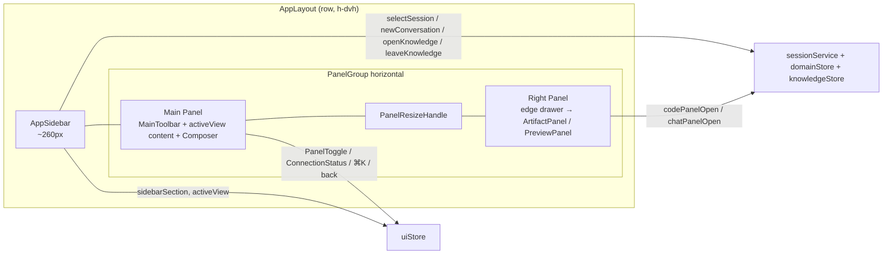
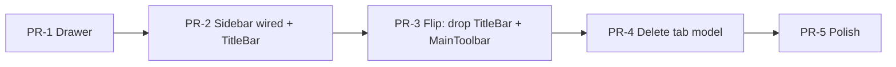

# App Shell Redesign — Left Sidebar + No TitleBar + Edge Drawer

| Field | Value |
|-------|-------|
| **Title** | App Shell Redesign v2 (Sidebar layout) |
| **Author** | TBD |
| **Date** | 2026-07-16 |
| **Status** | Ready for implementation (reviewer: 0 open issues) |
| **Canonical visual / IA** | [`docs/design/layout-sidebar-proposal.html`](./layout-sidebar-proposal.html) (user-approved color, layout, style) |
| **Related** | `src/routes/AppLayout.tsx`, `src/store/uiStore.ts`, `src/domain/sessionService.ts` |

---

## Overview

hip’s desktop shell today is a **full-width `TitleBar`** (browser-style `SessionTabBar` + connection/panel chrome) over a two-column `react-resizable-panels` workspace whose right column is a **floating card** (`p-3` + `rounded-xl` + `shadow-panel`). Session discovery is “open tabs”; soft-close (`closeSession`) removes a tab without deleting history.

Product intent (approved via interactive prototype): **drop the full-width titlebar**, add a **left `AppSidebar`** (search, primary nav, section-filtered history/spaces, account footer), keep a **slim main-column toolbar** for session context + global actions, and render the right panel as a **normal edge-flush drawer**. History becomes the discovery surface; there is no open-tab set.

This document is implementation-ready: store fields, component tree, **interaction contracts**, migration of `openSessionIds` / `knowledgeTabOpen` / soft-close, knowledge leave/flush rules, MainToolbar state matrix, file touch list, tests, i18n, and an ordered PR plan that **never ships a shell without session discovery**.

---

## Background & Motivation

### Current state

| Layer | Implementation |
|-------|----------------|
| Shell | `AppLayout` → `TitleBar` + `PanelGroup` (main \| right float) + `FloatingAvatarButton` |
| Window chrome | macOS Overlay traffic lights cleared via `--titlebar-lights-inset` on the full-width bar; Win/Linux use OS decorations + `data-platform` CSS |
| Session UX | `uiStore.openSessionIds[]` + `SessionTabBar` / `SessionTab`; soft-close via `sessionService.closeSession` |
| Knowledge | `knowledgeTabOpen` chip in the tab bar; independent of session ids; open path is `openKnowledgeView()` + `loadSpaces()`; space entry via `knowledgeStore.openSpace` / `openRecent` |
| Right panel | `data-testid="right-panel-float"` wrapper; open state still `session.codePanelOpen` / `chatPanelOpen` |
| Account | Absolute `bottom-4 left-4` `FloatingAvatarButton` (History / Settings / Logout + `window.confirm`) |
| Settings header | Title lives in TitleBar special mode; `SettingsPage` comment: “标题已上移到全宽 TitleBar” — **no in-page h1** |
| History header | Page still renders its own `h2` (`SessionHistory.tsx`) **and** TitleBar shows `history.title` when in special mode |

Pain points aligned with the prototype:

1. **TitleBar + tabs compete for vertical space** and encode a browser-tab mental model that does not match “agent workbench” IA.
2. **Right float card** leaves gutter and looks inconsistent once a full-height left sidebar exists.
3. **`openSessionIds` dual-lists** sessions (domain catalog + UI open set), complicating restore, bulk close, and cold launch.
4. **Knowledge as a tab chip** is secondary chrome instead of a first-class section.

### Why change now

The interactive HTML prototype is **user-approved** for color, layout, and style. Visual tokens already match hip’s sage/monochrome system in `src/styles/tokens.css` (prototype reuses the same hex values). This is a shell/IA change, not a product-surface redesign of chat, artifacts, or knowledge editor internals.

---

## Goals & Non-Goals

### Goals

1. Ship Layout v2 per prototype: **left sidebar · main column · right edge drawer**, no full-width titlebar, no session tab strip.
2. Preserve **existing domain behaviors**: `selectSession`, `newConversation('chat'|'code')`, `setSurface` / surface pointers (`chatSessionId` / `codeSessionId`), panel open flags, composer in main column, `activeView` routing for chat/code/knowledge/settings/history.
3. Migrate state so discovery is **section + list**, not **open tabs**.
4. Match **existing design tokens** (no new palette).
5. i18n for new chrome: **en / zh-CN / zh-TW**.
6. Accessibility: nav landmarks, list semantics, keyboard, focus.
7. Incremental **shippable PRs**; each leaves the app usable (**session discovery never disappears** between merges).
8. Update unit tests that encode the old shell.
9. **Knowledge draft safety**: every leave-knowledge path flushes via one helper (parity with today’s `closeKnowledgeView`).

### Non-Goals

- Sidebar expand/collapse (v1 expand-only; collapse later OK).
- Redesign `ArtifactPanel` / `PreviewPanel` internals or tab contents.
- Custom Windows titlebar / in-content min-max-close.
- Rework knowledge editor, session protocol, or sidecar.
- Multi-window or multi-root workspace.
- Global search index beyond filtering the loaded session/space lists + existing ⌘K palette.
- Dark-theme redesign beyond existing `.dark` token mapping.
- Dual-shell feature flag (see Rollout).

---

## Proposed Design

### High-level architecture



### Target component tree

```
AppLayout                          # src/routes/AppLayout.tsx
├── AppSidebar                     # NEW src/components/layout/AppSidebar.tsx
│   ├── SidebarDragRegion          # 40px; lights inset + data-tauri-drag-region + useWindowDrag
│   ├── SidebarSearch              # filters list; kbd affordance opens GlobalCommandPalette
│   ├── SidebarPrimaryNav          # 知识库 · 项目 · 对话 (+ on projects/chats)
│   ├── SidebarSessionList         # code|chat sessions OR knowledge spaces
│   └── SidebarAccountFooter       # port of FloatingAvatarButton menu (position only changes)
├── PanelGroup
│   ├── Panel (main)
│   │   ├── MainToolbar            # NEW ~40px — see MainToolbar state matrix
│   │   └── { activeView content } # ChatPane+InputBar | NewConversation | Knowledge | Settings | History
│   ├── PanelResizeHandle
│   └── Panel (right, collapsible)
│       └── ArtifactPanel | PreviewPanel   # direct fill; NO right-panel-float
├── GlobalCommandPalette
├── GlobalHotkeysBinder
└── SessionMenuDialogHost
```

**Removed from mount path (after shell-flip PR):** `TitleBar`, `SessionTabBar` / `SessionTab`, `FloatingAvatarButton`.

### Visual shell (tokens)

Reuse `src/styles/tokens.css` only:

| Role | Token / value |
|------|----------------|
| Sidebar bg | `--bg-subtle` (matte — **do not** reuse TitleBar glass `--titlebar-bg` / backdrop on sidebar) |
| Main bg | `--bg-app` |
| Borders | `--border` |
| Accent / focus | `--accent`, `--accent-strong`, focus ring |
| Hover / active nav | `--state-hover`, `--state-active` |
| macOS lights clearance | **`--titlebar-lights-inset: 90px`** product token (mac); `8px` win/linux via `data-platform` |
| Prototype HTML inset | Prototype uses **78px** demo var — **implementers must use 90px product token**, not HTML `--lights-inset` |
| Sidebar width | `--sidebar-width: 260px` (range 240–280; fixed for v1) |

Optional cleanup: stop using `--shadow-panel` on the right column. Leave unused `--rail-width` alone.

### Left AppSidebar

**Width:** `w-[var(--sidebar-width)]` ≈ 260px, `shrink-0`, full viewport height, `border-r border-border bg-subtle`.

#### Frozen vertical order (match prototype structure)

```
┌ 40px  SidebarDragRegion   (lights spacer + drag; no search here)
├       SidebarSearch       (first interactive control — below drag row)
├       SidebarPrimaryNav
├ flex  SidebarSessionList  (scroll)
└       SidebarAccountFooter
```

**Manual smoke (required on macOS device):** traffic lights must not collide with search or nav; first interactive control is **below** the 40px drag row; horizontal clearance is the 90px spacer inside the drag row only (search is full sidebar width under that row).

#### 1. Drag region (top 40px)

- Replaces TitleBar’s window-drag + lights inset for the final shell.
- Left spacer `width: var(--titlebar-lights-inset)` (90px mac / 8px win-linux).
- `data-tauri-drag-region` + `useWindowDrag()` from `src/lib/useWindowDrag.ts`.
- Interactive children: `data-no-drag` / `data-tauri-drag-region="false"`.
- **No fake traffic-light dots in production** (prototype paints them for demo only).
- **No product “hip” wordmark required** in the drag row (prototype hint is optional chrome; omit or use empty spacer — do not invent branding work).
- **Matte only:** `bg-subtle`, no glass blur.

#### 2. Search box

- Filters the **sidebar list only** (sessions by title/preview or spaces by name).
- **Component-local** React state (not in `uiStore`, not persisted).
- Visual: ~34px height, border, accent focus ring.
- Affordance: kbd chip for ⌘K; **clicking the kbd chip** opens `GlobalCommandPalette` via `useCommandPaletteStore.setOpen(true)`. Typing in the search input filters the list only — does **not** open the palette.
- Filter algorithm: reuse `SessionHistory` pattern (`title` / `preview` lowercase includes; spaces by `name`).

#### 3. Primary nav

| Section | Label keys | Behavior (see Interaction contracts) |
|---------|------------|--------------------------------------|
| `knowledge` | `sidebar.nav.knowledge` | `enterKnowledge()` |
| `projects` | `sidebar.nav.projects` | `enterSection('projects')` |
| `chats` | `sidebar.nav.chats` | `enterSection('chats')` |

- “+” on Projects / Chats (hover/active): `sessionService.newConversation('code' | 'chat')` after leave-knowledge if needed.
- Knowledge count optional: `knowledgeStore.spaces.length`.
- **Nav highlight:** `sidebarSection` drives `aria-current` / `.active` on the three items **always**, including while `activeView` is `settings` or `history` (last section remains highlighted — settings/history are overlays on main content, not fourth nav items). When `activeView === 'knowledge'`, section must be `'knowledge'`.

#### 4. History / spaces list

- Scrollable middle (`flex-1 min-h-0 overflow-y-auto`).
- **projects:** sessions with `surfaceOf(s.config) === 'code'`, sort `updatedAtMs` desc.
- **chats:** same for `'chat'`.
- **knowledge:** `knowledgeStore.spaces` (after `loadSpaces()`).
- Active session row: `session.id === activeSessionId` **and** `activeView` is `chat` or `code`.
- Row click (session): `selectSessionFromSidebar(id)` (see contracts).
- Row click (space): `openSpaceFromSidebar(id)` → `openKnowledgeView` path already entered + `void knowledgeStore.openSpace(id)` (sets workspace mode / `activeSpaceId` via existing store implementation — same as `KnowledgeHome`).
- Header: section label + **“查看全部”** → **`void openHistoryFromChrome()`** (same helper as account History / palette nav-history). Rule: `leaveKnowledge()`; if was knowledge then `assignSectionAfterLeavingKnowledge()`; then `setActiveView('history')`. **Do not** open History with bare `setActiveView('history')`.
- Context menu: migrate `sessionTab` → sidebar session row; rename, copy id, reveal in history, **permanent delete** (confirm). **No soft-close.**

#### 5. Account footer

**Port `FloatingAvatarButton` menu structure and testids; only change position** from absolute `bottom-4 left-4` to sidebar footer. Do **not** replace with prototype’s “设置 · 账号 + gear only” chrome.

| Element | testid (keep) |
|---------|----------------|
| Trigger | `account-menu-button` |
| History | `account-history-menu-item` |
| Settings | `account-settings-menu-item` |
| Logout | `account-logout-menu-item` |

- Menu order: History → Settings → Logout (same separators as today).
- Logout: `window.confirm` with `common.logoutConfirmTitle` / `common.logoutConfirmDesc`.
- History/Settings openers must go through leave-knowledge helper when leaving knowledge (see contracts).
- Move/rename component to `SidebarAccountFooter` or re-export from footer; delete absolute positioning. Port `FloatingAvatarButton.test.tsx` → footer tests.

### Main column

#### MainToolbar (**keep**) — full state matrix

~40px, `border-b border-border bg-app`, `data-testid="main-toolbar"`. **Not** a window titlebar.

| `activeView` / context | Left | Title (center/flex truncate) | Right actions |
|------------------------|------|------------------------------|---------------|
| `chat` or `code`, session active | — | `activeSession.title` | ⌘K · `ConnectionStatus` · `PanelToggle` |
| `chat` or `code`, no session (New Conversation) | — | i18n `mainToolbar.newConversation` (or surface greeting) | ⌘K · `ConnectionStatus` · **no** `PanelToggle` (same as today: PanelToggle returns null without session) |
| `knowledge` | — | `t('knowledge.title')` or active space name if `knowledgeStore.mode === 'workspace'` | ⌘K · `ConnectionStatus` · **no** `PanelToggle` |
| `settings` | Back button `data-testid="main-toolbar-back"` | `t('settings.title')` | ⌘K only (**hide** `ConnectionStatus` + `PanelToggle` — parity with TitleBar special mode) |
| `history` | Back button `data-testid="main-toolbar-back"` | **Empty in toolbar** (History page keeps its own `h2`) | ⌘K only (**hide** status + panel) |

**Back behavior (settings/history only)** — must keep `sidebarSection` in sync with restored view:

```ts
// MainToolbar back (and any chrome that leaves settings/history via previousView)
function handleMainToolbarBack(): void {
  const target = useUiStore.getState().previousView ?? 'chat'
  useUiStore.getState().setActiveView(target)
  // When user opened Settings/History from Knowledge, assignSectionAfterLeavingKnowledge()
  // moved section off knowledge. Restoring previousView === 'knowledge' MUST restore section too
  // (rule: activeView === 'knowledge' ⇒ sidebarSection === 'knowledge').
  if (target === 'knowledge') {
    useUiStore.getState().setSidebarSection('knowledge')
    // No re-flush: draft was flushed on the way into settings/history.
  } else if (target === 'chat' || target === 'code') {
    useUiStore.getState().setSidebarSection(target === 'code' ? 'projects' : 'chats')
  }
  // settings/history as previousView is not expected (isSpecial nesting); leave section as-is.
}
```

**MainToolbar test (required):** knowledge → Settings → Back restores `activeView === 'knowledge'` **and** `sidebarSection === 'knowledge'`.

**Settings header ownership:** In the same PR that unmounts TitleBar, update `SettingsPage.tsx` comment from “标题已上移到全宽 TitleBar” → “标题在 MainToolbar；本组件仍不渲染头行.” Settings continues to have **no** in-page title.

**History double-title avoidance:** MainToolbar does **not** show `history.title` when `activeView === 'history'`; the page `h2` remains sole title (or alternatively strip page `h2` and put title only in toolbar — **pick: page keeps h2, toolbar title empty** for less History churn).

**Window drag on MainToolbar:** **Recommended default on all platforms**, especially Windows/Linux where the full-width TitleBar drag surface disappears and sidebar drag is only ~40×260. Apply `useWindowDrag` on the toolbar container; all buttons `data-no-drag`. macOS still primarily uses sidebar top for lights clearance, but MainToolbar drag is allowed.

#### Content

Unchanged `renderMainContent()` logic:

```ts
if (activeView === 'history') return <SessionHistory />
if (activeView === 'settings') return <SettingsPage />
if (activeView === 'knowledge') return <KnowledgePage />
return activeSessionId == null ? <NewConversation /> : (<><ChatPane /><InputBar /></>)
```

### Right panel = edge drawer

**Keep** resizable panel state machine:

- `rightOpen = (activeView === 'code' && codePanelOpen) || (activeView === 'chat' && chatPanelOpen)`
- `rightPanelRef` collapse/expand `useEffect` (existing)
- `onCollapse` / `onExpand` → `setSessionCodePanelOpen` / `setSessionChatPanelOpen`

**Change only the chrome:**

```tsx
// AFTER
<div
  className="flex h-full min-h-0 flex-col border-l border-border bg-subtle"
  data-testid="right-panel-drawer"
>
  {codeOpen ? <ArtifactPanel /> : <PreviewPanel />}
</div>
```

No `p-3`, no `rounded-xl`, no `shadow-panel`. Do not redesign Artifact/Preview internals.

### Platform behavior

| Platform | Behavior |
|----------|----------|
| macOS | Overlay lights over sidebar top drag row; product inset **90px** (not prototype 78px) |
| Windows / Linux | OS decorations; inset 8px; no glass; **MainToolbar drag recommended** (TitleBar was large drag surface) |
| Drag | Sidebar top + MainToolbar non-interactive areas; buttons/lists excluded |

---

## Interaction contracts

Single source of truth for implementers. All multi-step UI actions use these ordered mutations. Prefer thin helpers on `sessionService` or a small `src/components/layout/sidebarActions.ts` to avoid scattering.

### Helpers

```ts
/** Leave knowledge safely. No-op if activeView !== 'knowledge'. Flush only — caller sets destination. */
async function leaveKnowledge(): Promise<void> {
  const ui = useUiStore.getState()
  if (ui.activeView !== 'knowledge') return
  try {
    await useKnowledgeStore.getState().flushSave()
  } catch { /* non-Tauri / not loaded */ }
  // Clear chip flag while it still exists (pre-PR-4). Do not set activeView here.
  if ('knowledgeTabOpen' in ui) useUiStore.setState({ knowledgeTabOpen: false })
}

/** After leaving knowledge for settings/history (not for setSurface/selectSession). */
function assignSectionAfterLeavingKnowledge(): void {
  const active = useDomainStore.getState().sessions.find(
    (s) => s.id === useDomainStore.getState().activeSessionId,
  )
  if (active) {
    useUiStore.getState().setSidebarSection(surfaceOf(active.config) === 'code' ? 'projects' : 'chats')
  } else {
    useUiStore.getState().setSidebarSection('chats')
  }
}

async function enterKnowledge(): Promise<void> {
  useUiStore.getState().openKnowledgeView() // sets activeView knowledge (+ knowledgeTabOpen until removed)
  useUiStore.getState().setSidebarSection('knowledge')
  await useKnowledgeStore.getState().loadSpaces()
}

async function enterSection(section: 'projects' | 'chats'): Promise<void> {
  await leaveKnowledge()
  useUiStore.getState().setSidebarSection(section)
  // Restores remembered session or deselects — existing setSurface behavior
  sessionService.setSurface(section === 'projects' ? 'code' : 'chat')
}

async function selectSessionFromSidebar(id: string): Promise<void> {
  await leaveKnowledge()
  sessionService.selectSession(id)
  // selectSession must also setSidebarSection from surfaceOf(config)
}

async function newConversationFromSidebar(surface: 'chat' | 'code'): Promise<void> {
  await leaveKnowledge()
  sessionService.newConversation(surface)
  useUiStore.getState().setSidebarSection(surface === 'code' ? 'projects' : 'chats')
}

async function openSpaceFromSidebar(spaceId: string): Promise<void> {
  if (useUiStore.getState().activeView !== 'knowledge') {
    await enterKnowledge()
  } else {
    useUiStore.getState().setSidebarSection('knowledge')
  }
  await useKnowledgeStore.getState().openSpace(spaceId)
}

async function openSettingsFromChrome(): Promise<void> {
  const wasKnowledge = useUiStore.getState().activeView === 'knowledge'
  await leaveKnowledge()
  if (wasKnowledge) assignSectionAfterLeavingKnowledge()
  useUiStore.getState().setActiveView('settings') // records previousView via existing uiStore logic
}

async function openHistoryFromChrome(): Promise<void> {
  // Single History opener for: account menu, sidebar “查看全部”, palette nav-history.
  const wasKnowledge = useUiStore.getState().activeView === 'knowledge'
  await leaveKnowledge()
  if (wasKnowledge) assignSectionAfterLeavingKnowledge()
  useUiStore.getState().setActiveView('history')
}

/** MainToolbar / special-view back — keep section in sync with restored view. */
function handleMainToolbarBack(): void {
  const target = useUiStore.getState().previousView ?? 'chat'
  useUiStore.getState().setActiveView(target)
  if (target === 'knowledge') {
    useUiStore.getState().setSidebarSection('knowledge')
  } else if (target === 'chat' || target === 'code') {
    useUiStore.getState().setSidebarSection(target === 'code' ? 'projects' : 'chats')
  }
}
```

**Note on `leaveKnowledge` vs today’s `closeKnowledgeView`:**  
Today `closeKnowledgeView` flushes **and** restores chat/code from the active domain session. For section navigation we **must not** always restore surface inside the helper — callers choose destination (`setSurface`, `selectSession`, special views, etc.). Therefore:

- **Replace** chip-close semantics with:
  1. `leaveKnowledge()` = flush only (+ clear `knowledgeTabOpen` while it exists during dual-chrome).
  2. Caller sets `activeView` / section / selection.
- **`closeKnowledgeView`** can become a thin wrapper: `await leaveKnowledge(); restore surface from active session` for any remaining call sites, or be deleted once all paths use explicit contracts.
- **Never** use bare `setActiveView('chat'|'code'|'settings'|'history')` from sidebar, account, or **command palette** without the helpers when currently on knowledge.
- **Leaving knowledge for settings/history** always runs `assignSectionAfterLeavingKnowledge()` so Knowledge nav is not left `aria-current` while the main pane shows Settings/History.
- **Back to knowledge** restores `sidebarSection: 'knowledge'` via `handleMainToolbarBack` (no re-flush).

### Command palette mappings (required — not “audit later”)

Today `buildGlobalCommands.ts` uses bare `ctx.setActiveView(...)` for nav-chat/code/history/settings. **Replace** those `run` handlers with shell helpers (wire via `GlobalCommandContext` in `GlobalCommandPalette.tsx`):

| Palette command id | Today | Required `run` |
|--------------------|-------|----------------|
| `nav-chat` | `setActiveView('chat')` | `() => void enterSection('chats')` |
| `nav-code` | `setActiveView('code')` | `() => void enterSection('projects')` |
| `nav-history` | `setActiveView('history')` | `() => void openHistoryFromChrome()` |
| `nav-settings` | `setActiveView('settings')` | `() => void openSettingsFromChrome()` |
| `nav-knowledge` | `openKnowledgeView?.()` | `() => void enterKnowledge()` |
| knowledge doc / recent | `openKnowledgeView` + `openRecent` | **Keep** — never bare `setActiveView('knowledge')` |

Context shape: inject helpers on `GlobalCommandContext` (e.g. `enterSection`, `openHistoryFromChrome`, `openSettingsFromChrome`, `enterKnowledge`) rather than expanding bare `setActiveView` usage.

**Out of shell scope (call out only):** other bare `setActiveView('settings')` sites (`ChatPane`, `memoryActions`, `sessionService.openSettingsPageForE2e`) are pre-existing; fix opportunistically if they leave knowledge without flush, but not required for shell PR accept.

**PR timing for palette:** prefer rewiring in **PR-2** when `sidebarActions` first lands (dual chrome already flushes on ⌘K leave). **PR-3 accept hard-requires** palette helpers if not done in PR-2.

### Entry / exit path matrix (knowledge flush)

| Path | Flush? | Section after | View / selection |
|------|--------|---------------|------------------|
| Nav → Knowledge | n/a enter | `knowledge` | `enterKnowledge()` |
| Nav → Projects / Chats | yes | target section | `enterSection` → `setSurface` |
| Session row click | yes | from session surface | `selectSession` |
| Space row click | n/a or enter | `knowledge` | `openSpace(id)` |
| Sidebar “+” | yes | projects/chats | `newConversation` |
| View all (History) | yes | if was KB → assign non-KB; else unchanged | **`openHistoryFromChrome()`** |
| Account → History | yes | if was KB → assign non-KB; else unchanged | **`openHistoryFromChrome()`** |
| Account → Settings | yes | if was KB → assign non-KB; else unchanged | **`openSettingsFromChrome()`** |
| Account → Logout | yes (best-effort) | n/a | logout |
| MainToolbar back | no re-flush | sync to `previousView` (KB → `knowledge`) | `handleMainToolbarBack()` |
| ⌘K `nav-chat` / `nav-code` | yes (via enterSection) | chats / projects | `enterSection(...)` |
| ⌘K `nav-history` / `nav-settings` | yes | if was KB → assign non-KB | `openHistoryFromChrome` / `openSettingsFromChrome` |
| ⌘K `nav-knowledge` / open doc | enter path | `knowledge` | `enterKnowledge` / `openRecent` |
| Cold launch | n/a | force `chats` | `applyColdLaunchShell` |

### Cold launch sequence

```mermaid
sequenceDiagram
  participant Persist as hip-ui rehydrate
  participant UI as applyColdLaunchShell
  participant SS as sessionService
  participant WS as session:list:result
  Persist->>UI: merge strips activeView; no sidebarSection persist
  UI->>UI: activeView=chat, sidebarSection=chats, knowledgeTabOpen=false
  SS->>WS: connect / list
  WS->>SS: pruneSurfacePointersFromList
  Note over SS: prune chatSessionId/codeSessionId only<br/>NO openSessionIds<br/>deselect if no live active
  Note over UI: Do NOT auto-select a session from history
```

1. Zustand rehydrate `hip-ui` (sync/async).
2. `mergeUiPersistedState`: force `activeView: 'chat'`; strip legacy `openSessionIds` / `knowledgeTabOpen` / `activeView`; **do not read sidebarSection from disk**.
3. `applyColdLaunchShell()`: `{ activeView: 'chat', sidebarSection: 'chats', knowledgeTabOpen: false }` (until kb flag removed).
4. On `session:list:result`: `pruneSurfacePointersFromList()` — validate `chatSessionId`/`codeSessionId` against existing ids; if `activeSessionId` live, keep it (reconnect); else `deselect()` (cold launch New Conversation).
5. Sidebar shows chats list; nothing auto-selected.

### `selectSession` retained side effects

After removing `addOpenSession`, `selectSession` **must still**:

1. `domainStore.selectSession(id)`
2. `setSelectedArtifactPath(null)`
3. Set `activeView` from `surfaceOf(config)` (`chat`|`code`)
4. `setSidebarSection('projects'|'chats')` from surface
5. `rememberActiveForSurface(id)`
6. If `!loaded` → `session:load`
7. `fs:diffSummary` + `git:checkpoint:list`
8. `setScrollTarget(messageId ?? null)`

### `setSurface` vs section

- Switching projects ↔ chats **always** goes through `sessionService.setSurface('code'|'chat')` (snapshots leaving surface pointer, restores entering pointer or deselects).
- Also `setSidebarSection` to match.
- Do **not** only `setActiveView` when the user clicks primary nav — that skips surface pointer restore.

### Permanent delete from sidebar

1. Context menu → confirm dialog (existing delete session dialog / `openDeleteSessionDialog`).
2. `sessionService.deleteSession(id)` — permanent; PTY kill; clear surface pointers if pointed here; reconcile active session for current surface (existing logic).
3. No `openSessionIds` mutation.

---

## State Model & Migration

### Target model

| Field | Store | Persist? | Role |
|-------|-------|----------|------|
| `activeSessionId` | `domainStore` | no | Current conversation |
| `sidebarSection` | `uiStore` | **No** | `'knowledge' \| 'projects' \| 'chats'`; memory-only for the process |
| `sidebarSearchQuery` | component-local | no | List filter |
| `chatSessionId` / `codeSessionId` | `uiStore` | **yes** (existing) | Last session per surface |
| `activeView` | `uiStore` | **no** (existing) | Main content router |
| `openSessionIds` | — | **removed** | — |
| `knowledgeTabOpen` | — | **removed** | Knowledge = `activeView === 'knowledge'` |

**Cold launch:** always `sidebarSection: 'chats'` + `activeView: 'chat'` + deselect (New Conversation). Mid-session section changes live in memory only; a restart does not restore “projects” or “knowledge” section chrome.

**Special views vs section:** While `activeView` is `settings` or `history`, primary nav still reflects `sidebarSection` (not a fourth nav item). If the user opened Settings/History **from Knowledge**, `assignSectionAfterLeavingKnowledge()` sets section to the active session’s surface or `'chats'` so Knowledge is not left as `aria-current`. If they opened Settings from Projects/Chats, section is unchanged.

### Fate of `openSessionIds` — **delete (not kept internally)**

| API | Action |
|-----|--------|
| `addOpenSession` / `removeOpenSession` / `reorderOpenSessions` | Delete |
| `UiPersistedState.openSessionIds` | Drop from `partialize`; merge strips legacy key |
| `createSession` / `selectSession` | Stop `addOpenSession` |
| `closeSession` | **Delete** after call-site purge (see checklist) |
| `deleteSession` | Stop `removeOpenSession` |
| `applyRestoredOpenTabs` | Replace with `pruneSurfacePointersFromList` |
| Context menu soft-close | Remove |
| Bulk soft-close Path A | Remove |

**Working-set model change:** Multi-open MRU tab order and “close → neighbor tab” navigation are **intentionally gone**. Discovery = full section-filtered history + History page. Surface pointers restore one session per surface when switching projects↔chats.

### Soft-close / bulk infrastructure deletion checklist (PR-4)

| Item | Action |
|------|--------|
| `sessionService.closeSession` | Delete method |
| `SessionTabBar` tab X / `SessionTab` | Delete with components |
| `sessionTab` provider `sessionTab.close` item | Remove; replace with permanent delete if sidebar menu |
| `orderBulkCloseIds` + tests | Delete |
| `confirmBulkDelete` dialog kind in `sessionMenuDialogStore` | Delete kind + host branch that loops `closeSession` |
| `openConfirmDeleteSessionsDialog` | Delete (no production callers today; tests only) |
| `ConfirmDeleteSessionsDialog` soft-close tests | Rewrite/delete; keep **permanent** delete/clear-all on History |
| `SessionMenuDialogHost` bulk closeSession loop | Delete |
| Tests: `sessionService.test.ts` close/open-tab blocks | Rewrite |
| `SessionTabBar.test.tsx`, `sessionTab.test.ts` | Delete |
| Deprecation shim | **Do not ship a long-lived shim.** If any interim PR still mounts tabs, keep real `closeSession` until tabs unmount; delete both together |

### Fate of `knowledgeTabOpen`

Removed. `openKnowledgeView()` becomes:

```ts
openKnowledgeView: () => set({ activeView: 'knowledge' })
// callers also setSidebarSection('knowledge') + loadSpaces
```

Chip UI deleted with SessionTabBar.

### `sidebarSection` type

```ts
export type SidebarSection = 'knowledge' | 'projects' | 'chats'

// UiState
sidebarSection: SidebarSection  // default 'chats'
setSidebarSection: (s: SidebarSection) => void

// partialize: DO NOT include sidebarSection
// applyColdLaunchShell:
useUiStore.setState({ activeView: 'chat', sidebarSection: 'chats', /* knowledgeTabOpen: false until removed */ })
```

Validation: if any code sets an invalid value, TypeScript union is the guard; no persisted bad values.

### Merge helper sketch

```ts
export function mergeUiPersistedState(persistedState: unknown, currentState: S): S {
  const p = (persistedState ?? {}) as Partial<UiPersistedState> & {
    activeView?: ActiveView
    knowledgeTabOpen?: boolean
    openSessionIds?: string[]
    sidebarSection?: SidebarSection
  }
  const {
    activeView: _v,
    knowledgeTabOpen: _k,
    openSessionIds: _tabs,
    sidebarSection: _sec, // ignore if somehow present
    ...rest
  } = p
  return {
    ...currentState,
    ...rest,
    activeView: 'chat',
    sidebarSection: 'chats',
  }
}
```

---

## API / Interface Changes

### uiStore (after cleanup)

```ts
export type SidebarSection = 'knowledge' | 'projects' | 'chats'

export type UiPersistedState = {
  chatSessionId: string | null
  codeSessionId: string | null
  // no openSessionIds, no sidebarSection, no activeView
  theme: Theme
  language: AppLanguage
  settingsPage: SettingsPageId
  settingsNavCollapsed: boolean
  diffViewMode: 'unified' | 'split'
  checkpointMode: CheckpointMode
}
```

### sessionService

| Method | Change |
|--------|--------|
| `selectSession` | Drop `addOpenSession`; add `setSidebarSection`; **keep** load/diff/checkpoint/scroll/remember |
| `createSession` | Drop `addOpenSession` |
| `newConversation` | Set section from surface |
| `setSurface` | Also `setSidebarSection` |
| `closeSession` | Delete with tabs |
| `deleteSession` | Drop `removeOpenSession` |
| restore helper | `pruneSurfacePointersFromList` only |

### Knowledge APIs (named)

| Action | API |
|--------|-----|
| Enter knowledge section | `uiStore.openKnowledgeView()` + `setSidebarSection('knowledge')` + `knowledgeStore.loadSpaces()` |
| Open space from sidebar row | `knowledgeStore.openSpace(id)` (workspace mode / tree — same as `KnowledgeHome`) |
| Open recent from palette | `openKnowledgeView` + `knowledgeStore.openRecent(item)` (existing) |
| Leave knowledge | `leaveKnowledge()` → `flushSave()` then caller sets destination |

### Context menu

- Sidebar session row: rename, copy id, reveal in history, permanent delete.
- Remove soft-close item and `openSessionIds` from `buildContext` / `types`.

### Testids

| Element | testid |
|---------|--------|
| Sidebar root | `app-sidebar` |
| Nav items | `sidebar-nav-knowledge`, `sidebar-nav-projects`, `sidebar-nav-chats` |
| New buttons | `sidebar-new-chat`, `sidebar-new-code` |
| Search | `sidebar-search` |
| Session row | `sidebar-session-{id}` |
| Account menu | `account-menu-button`, `account-history-menu-item`, `account-settings-menu-item`, `account-logout-menu-item` |
| Main toolbar | `main-toolbar`, `main-toolbar-back`, `main-toolbar-command-palette` (or keep `titlebar-command-palette` → prefer new id and update tests) |
| Right panel | `right-panel-drawer` |
| Titlebar / float | **gone** after shell-flip |

---

## Data Model Changes

Client-only localStorage `hip-ui`:

1. Stop writing `openSessionIds`; strip on read.
2. Never write `sidebarSection`.
3. No protocol / sidecar / DB migration.

---

## Alternatives Considered

### A. Keep TitleBar but remove only SessionTabBar

Rejected — user approved no-titlebar v2.

### B. Keep `openSessionIds` as internal LRU

Rejected — dual list / soft-close return; history list is sufficient.

### C. Omit MainToolbar

Rejected — user liked prototype; hosts special-view chrome.

### D. Feature-flag dual shell

Rejected — hip rarely dual-ships chrome. **Shippable interim is dual chrome only as a short-lived PR** (sidebar + TitleBar both mounted), not a runtime flag.

### E. Overlay right drawer (no reflow)

Rejected — prototype wants IDE reflow; Panel already reflows.

### F. Persist `sidebarSection`

Rejected — partialize only affects next launch; product cold launch is always chats/New Conversation. Memory-only section is enough mid-session.

---

## Security & Privacy Considerations

| Topic | Notes |
|-------|-------|
| Auth | Account footer reuses logout confirm; same testids |
| Session titles | Local list only |
| Knowledge flush | Prevents silent draft loss on section switch |
| Drag vs click | `data-no-drag` on controls |
| Threat model | Shell IA only; no new IPC |

---

## Observability

- Unit tests for contracts (section switch, leave knowledge flush mock, cold launch section).
- Manual: macOS lights vs search; Win/Linux drag via MainToolbar.
- E2E: migrate selectors; preserve account menu testids.
- No new production metrics.

---

## Rollout Plan

### Feature flag: **No**

Dual **runtime** shell not maintained. Incremental PRs only.

### Shippable sequencing principle

**Never merge a commit that unmounts SessionTabBar before AppSidebar can select/create sessions.** Dual chrome (sidebar + TitleBar) is an acceptable **short-lived** interim: discovery works twice until the flip PR.

### Rollback

- **Primary:** revert the single **shell-flip** PR (TitleBar unmount + MainToolbar) if post-flip issues — sidebar can remain or go with it depending on flip packaging.
- **Store cleanup PR** may land after one release of the new shell so emergency revert of chrome does not require re-adding `openSessionIds` immediately — optional; not dual UI.
- localStorage: stripping unknown keys is safe; removing `openSessionIds` is forward-compatible.

### Risks

| Risk | Severity | Mitigation |
|------|----------|------------|
| Unusable intermediate without discovery | Critical | PR order: wire sidebar before unmounting tabs |
| Knowledge draft loss | High | `leaveKnowledge` on all leave paths |
| macOS lights overlap | High | 40px drag row + 90px inset; device smoke |
| Win/Linux drag surface too small | Medium | MainToolbar drag default |
| Soft-close call sites remain | Medium | PR-4 rg gate checklist |
| Settings missing title after flip | Medium | MainToolbar matrix + SettingsPage comment |

---

## Accessibility

- `<aside aria-label={t('sidebar.aria')}>`.
- Primary nav: `aria-current="page"` on **section** items (not on settings/history — those are main views).
- Session list: buttons with accessible names.
- Search: `type="search"` + sr-only label.
- Keyboard: Tab order drag skip → search → nav → list → footer; Enter activates.
- Focus visible via existing tokens.
- Command palette remains global.

---

## i18n

```ts
sidebar: {
  aria: 'Application sidebar',
  searchPlaceholder: 'Search sessions…',
  nav: {
    knowledge: 'Knowledge',
    projects: 'Projects',
    chats: 'Chats',
  },
  newProject: 'New coding session',
  newChat: 'New chat',
  historyHeadingProjects: 'Project sessions',
  historyHeadingChats: 'Chat history',
  spacesHeading: 'Spaces',
  viewAll: 'View all',
  empty: 'No sessions yet — click + to create',
  emptyFilter: 'No matches',
  manageSpaces: 'Manage',
},
mainToolbar: {
  newConversation: 'New conversation',
  aria: 'Session toolbar',
},
```

Reuse: `nav.settings`, `nav.history`, `common.logout*`, `commandPalette.*`, `history.*`, `settings.title`, `knowledge.title`, `dropdown.newChat` / `newCode`.

Keys in `en.ts`, `zh-CN.ts`, `zh-TW.ts`. Cleanup dead `tabs.*` keys in store-cleanup PR.

---

## Test Impact

### AppLayout (explicit)

| Today | After |
|-------|-------|
| Asserts `title-bar` present | After flip: **absent** |
| Asserts `floating-avatar` present | After flip: **absent**; account in sidebar |
| Asserts **`sidebar-root` absent** | Invert: assert **`app-sidebar` present** (PR that mounts sidebar) |
| No float testid assert | PR-1: assert `right-panel-drawer` when panel open (or static class); remove any float references |
| Mocks TitleBar / FloatingAvatarButton | Update mocks: mock `AppSidebar` / `MainToolbar` or render real with domain mocks |

### Full inventory (PR-4 / cleanup)

| Area | Files / notes |
|------|----------------|
| Layout | `AppLayout.test.tsx`, new `AppSidebar.test.tsx`, `MainToolbar.test.tsx` |
| TitleBar | `TitleBar.test.tsx` — delete with TitleBar |
| Tabs | `SessionTabBar.test.tsx`, SessionTab tests — delete |
| Account | **`FloatingAvatarButton.test.tsx` exists** — port to footer tests, then delete |
| uiStore | openSessionIds API tests → section + merge strips |
| sessionService | close/open-tab/restore tests; `setSurface.test.ts` if present |
| terminalGating | partialize fixture `openSessionIds` |
| Context menu | `buildContext.ts` / `types.ts` / `catalog.ts` / `registry.test.ts` / providers’ fixtures with `openSessionIds` |
| Soft-close bulk | `ConfirmDeleteSessionsDialog*`, `orderBulkCloseIds*`, `SessionMenuDialogHost` |
| Knowledge chip | SessionTabBar knowledge tests; palette still uses `openKnowledgeView` + `loadSpaces` / `openRecent` |
| Command palette | `GlobalCommandPalette` / `buildGlobalCommands` knowledge path — keep flush-safe open helpers |

### PR-4 accept: ripgrep gate (must be zero production hits)

```bash
rg -n "openSessionIds|knowledgeTabOpen|closeSession\(|right-panel-float|SessionTabBar|FloatingAvatarButton|data-testid=\"titlebar\"" src --glob '!**/node_modules/**'
# Allowlisted: none in src/ after cleanup (tests deleted with code).
# closeSession string may appear in comments history — prefer zero.
```

Also: `rg "titlebar-lights-inset"` still valid (sidebar uses it).

---

## Open Questions

Resolved in this revision:

| # | Question | Resolution |
|---|----------|------------|
| 1 | Persist `sidebarSection`? | **No.** Cold launch always `'chats'`. |
| 4 | MainToolbar on special views? | **State matrix** above — always mounted; special views hide status/panel; history title stays on page. |

Remaining (non-blocking):

1. **Session row hover trash** vs context-menu-only delete? **Default: context menu only.**
2. **User display name** in footer: keep generic Avatar until profile exists.

---

## References

- Prototype: [`docs/design/layout-sidebar-proposal.html`](./layout-sidebar-proposal.html)
- `src/routes/AppLayout.tsx`, `TitleBar.tsx`, `SessionTabBar.tsx`, `SessionHistory.tsx`
- `FloatingAvatarButton.tsx` + **`FloatingAvatarButton.test.tsx`**
- `uiStore.ts`, `sessionService.ts`, `knowledgeStore.ts` (`openSpace`, `openRecent`, `loadSpaces`, `flushSave`)
- `tokens.css`, `useWindowDrag.ts`, `PanelToggle.tsx`, `ConnectionStatus.tsx`
- Command palette knowledge: `registry.ts`, `GlobalCommandPalette.tsx`, `buildGlobalCommands.ts`
- `SettingsPage.tsx` (header ownership comment)
- `AGENTS.md`, `CLAUDE.md`

---

## Implementation Notes (file-level)

### New files

| Path | Responsibility |
|------|----------------|
| `src/components/layout/AppSidebar.tsx` | Sidebar composition |
| `src/components/layout/MainToolbar.tsx` | Toolbar + state matrix |
| `src/components/layout/sidebarActions.ts` (optional) | `leaveKnowledge`, `enterSection`, … |
| `src/components/layout/AppSidebar.test.tsx` | Nav, filter, select, flush |
| `src/components/layout/MainToolbar.test.tsx` | Matrix: back, hidden panel on settings |

Split subcomponents only if files exceed ~200 lines.

### Modified (primary)

- `AppLayout.tsx`, `uiStore.ts`, `sessionService.ts`, `tokens.css`
- i18n `en.ts` / `zh-CN.ts` / `zh-TW.ts`
- Context menu types/providers/buildContext
- `SettingsPage.tsx` comment
- Command palette handlers if they set view without flush
- Tests listed above

### Deleted after migration

- `TitleBar.tsx` + test
- `SessionTabBar.tsx`, `SessionTab.tsx` + tests
- `FloatingAvatarButton.tsx` + **`FloatingAvatarButton.test.tsx`**
- `orderBulkCloseIds.ts` + tests; bulk soft-close dialog kind

### Interim AppLayout sketch (PR-2 dual chrome)

**Do not** put TitleBar full-width above both sidebar and main (that fights “lights on sidebar” later and wastes horizontal space). Structure:

```
flex-row h-dvh overflow-hidden
├── AppSidebar                    # left column; drag region secondary during dual chrome
└── flex-col flex-1 min-w-0       # right stack
    ├── TitleBar                  # STILL owns macOS lights inset + SessionTabBar
    ├── PanelGroup (main | right drawer)
    └── FloatingAvatarButton      # keep until footer in PR-3; callbacks MUST use helpers
```

```tsx
// PR-2 only — dual chrome
return (
  <div className="flex h-dvh w-screen flex-row overflow-hidden bg-surface">
    <AppSidebar /* wired list/nav; account footer omitted in PR-2 */ />
    <div className="relative flex min-h-0 min-w-0 flex-1 flex-col">
      <TitleBar />
      <PanelGroup direction="horizontal" className="min-h-0 flex-1">
        {/* main + right drawer — same as today after PR-1 */}
      </PanelGroup>
      <FloatingAvatarButton
        onOpenHistory={() => void openHistoryFromChrome()}
        onOpenSettings={() => void openSettingsFromChrome()}
        onLogout={async () => {
          await leaveKnowledge()
          logout()
          navigate('/login')
        }}
      />
      <GlobalCommandPalette />
      <GlobalHotkeysBinder />
      <SessionMenuDialogHost />
    </div>
  </div>
)
```

**Lights / drag during dual chrome:** TitleBar remains the **authoritative** macOS lights inset + primary drag surface. Sidebar top drag region may also exist (prototype final state) — short-lived **double inset / dual drag is acceptable**; do not remove TitleBar lights spacer in PR-2. After PR-3 flip, only sidebar (+ MainToolbar drag) owns window chrome.

**Dual-chrome knowledge chip vs `leaveKnowledge`:** Sidebar leave helpers clear `knowledgeTabOpen` on flush. That may hide the TitleBar knowledge chip while `activeView` is still knowledge for a tick, or immediately when navigating Projects/Chats via sidebar. **Intentional — do not “fix” by re-opening the chip** when using sidebar section nav. Chip and sidebar are both valid entry points; chip stickiness is not preserved across sidebar leave paths.

**PR-2 FloatingAvatar (required if footer deferred):** Must **not** keep today’s bare:
`onOpenHistory={() => setActiveView('history')}` / `onOpenSettings={() => setActiveView('settings')}`.
Wire to `openHistoryFromChrome` / `openSettingsFromChrome` so Goal 9 holds while dual chrome ships.

### Final AppLayout sketch (PR-3+)

```tsx
return (
  <div className="flex h-dvh w-screen flex-row overflow-hidden bg-surface">
    <AppSidebar
      onOpenHistory={() => void openHistoryFromChrome()}
      onOpenSettings={() => void openSettingsFromChrome()}
      onLogout={async () => {
        await leaveKnowledge()
        logout()
        navigate('/login')
      }}
    />
    <PanelGroup direction="horizontal" className="min-w-0 flex-1">
      <Panel minSize={34} className="flex min-w-0 flex-col">
        <MainToolbar />
        {renderMainContent()}
      </Panel>
      <PanelResizeHandle className="…">{/* grip when rightOpen */}</PanelResizeHandle>
      <Panel ref={rightPanelRef} collapsible collapsedSize={0} …>
        {rightOpen ? (
          <div className="flex h-full min-h-0 flex-col border-l border-border bg-surface-subtle" data-testid="right-panel-drawer">
            {codeOpen ? <ArtifactPanel /> : <PreviewPanel />}
          </div>
        ) : null}
      </Panel>
    </PanelGroup>
    <GlobalCommandPalette />
    <GlobalHotkeysBinder />
    <SessionMenuDialogHost />
  </div>
)
```

---

## PR Plan

Each PR is independently shippable: **session discovery remains available** after every merge.

### PR-1 — Right panel drawer chrome

| Field | Value |
|-------|-------|
| **Title** | `ui(shell): edge-flush right drawer (remove float card)` |
| **Depends on** | — |
| **Files** | `AppLayout.tsx`, `AppLayout.test.tsx` |
| **Description** | Replace `right-panel-float` with edge-flush drawer (`border-l`, no padding/radius/shadow). Keep Panel collapse / panel-open flags / grip. |
| **Accept** | Visual drawer; panel toggle works; test asserts `right-panel-drawer` (when open path exercised) or structure; **no** regression to TitleBar/tabs. |
| **Rollback** | Revert PR-1 alone. |

### PR-2 — Fully wired AppSidebar **beside** TitleBar (dual chrome)

| Field | Value |
|-------|-------|
| **Title** | `ui(shell): AppSidebar (wired) alongside TitleBar` |
| **Depends on** | PR-1 recommended |
| **Files** | `AppLayout.tsx` (see interim sketch), new AppSidebar*, `sidebarActions` / leaveKnowledge, `uiStore.sidebarSection` (memory-only), i18n, `AppSidebar.test.tsx`; keep TitleBar + SessionTabBar; **rewire FloatingAvatar** and preferably palette to helpers |
| **Description** | Ship complete sidebar IA: drag, search, nav, lists, `+`, selectSession, knowledge enter/leave flush. **No account footer yet** (avoid dual account UI) — FloatingAvatar stays but callbacks use `openHistoryFromChrome` / `openSettingsFromChrome` / `leaveKnowledge` on logout. Tabs remain soft-close authority; sidebar is additional discovery. Prefer rewiring palette nav commands to helpers in this PR. Short-lived dual chrome intentional. |
| **Interim user journey** | Sessions via **tabs or sidebar**. Soft-close on tabs. Knowledge via chip **or** sidebar (`enterKnowledge`); sidebar leave may clear chip flag (OK). Account via FloatingAvatar with flush-safe openers. |
| **Accept** | Sidebar selects/creates sessions; leave knowledge flushes (unit test mock `flushSave`); FloatingAvatar History/Settings use helpers (not bare `setActiveView`); TitleBar still works; dual-chrome layout matches interim sketch; cold launch unchanged; `yarn test` green. |
| **Rollback** | Revert PR-2; TitleBar-only shell restored. |

### PR-3 — Shell flip: unmount TitleBar + MainToolbar + account footer

| Field | Value |
|-------|-------|
| **Title** | `ui(shell): remove TitleBar; add MainToolbar; account in sidebar` |
| **Depends on** | **PR-2** (wired sidebar must already ship) |
| **Files** | `AppLayout.tsx` (final sketch), `MainToolbar.tsx` + tests (incl. knowledge→settings→back section restore), unmount TitleBar/SessionTabBar/FloatingAvatarButton, SettingsPage comment, port account testids to footer, palette helper wiring if not in PR-2, `AppLayout.test.tsx` |
| **Description** | Single flip PR: remove full-width chrome; MainToolbar owns special-view back/title rules + `handleMainToolbarBack`; FloatingAvatar removed; footer is sole account menu. May still update `openSessionIds` unused until PR-4. |
| **Accept** | No TitleBar; settings/history back restores view **and** `sidebarSection` (KB case); Settings has toolbar title; History no double title; macOS lights smoke; account E2E testids work; **palette leave paths use helpers** (hard require); session discovery via sidebar only. |
| **Rollback** | **Revert PR-3** (primary emergency unit). PR-2 dual chrome returns if only PR-3 reverts. |

### PR-4 — Remove open-tabs model + soft-close + dead code

| Field | Value |
|-------|-------|
| **Title** | `ui(shell): remove openSessionIds, closeSession, tab components` |
| **Depends on** | PR-3 |
| **Files** | `uiStore`, `sessionService`, context menu, history bulk soft-close, delete TitleBar/tabs/FloatingAvatar files if not deleted in PR-3, full test inventory, **rg gate** |
| **Description** | Execute soft-close deletion checklist; pruneSurfacePointersFromList; strip persist keys; no production `closeSession`. |
| **Accept** | rg gate clean; permanent delete/clear-all still work; no openSessionIds. |
| **Rollback** | Revert PR-4; chrome can stay new without tab model only if PR-3 already removed UI — prefer not to reintroduce tabs. |

### PR-5 — Polish (optional)

| Field | Value |
|-------|-------|
| **Title** | `ui(shell): sidebar a11y, context menu, grip polish` |
| **Depends on** | PR-4 |
| **Files** | a11y attrs, sidebar context menu permanent delete, grip CSS |
| **Accept** | Keyboard usable; menus match History destructiveness. |



---

## Key Decisions

| # | Decision | Rationale |
|---|----------|-----------|
| 1 | **Canonical UI = approved prototype** | User satisfied with color, layout, style. |
| 2 | **Remove full-width `TitleBar`** after wired sidebar ships | No discovery gap between merges. |
| 3 | **Keep `MainToolbar`** with full special-view matrix | User liked style; replaces TitleBar special mode (back, hide status/panel on settings/history). |
| 4 | **`openSessionIds` deleted — not kept internally** | Section history is the discovery surface. |
| 5 | **Soft-close removed** with checklist; no long-lived shim | Tabs and `closeSession` deleted together after flip. |
| 6 | **`knowledgeTabOpen` removed**; **`leaveKnowledge()` flush on all leave paths** | Prevent draft loss when chip close disappears. |
| 7 | **Right panel = edge drawer**, same Panel state machine | Chrome-only. |
| 8 | **Preserve `chatSessionId` / `codeSessionId`** | Per-surface restore without tabs. |
| 9 | **Cold launch: chat New Conversation + `sidebarSection: 'chats'`** | Existing product rule. |
| 10 | **`sidebarSection` not persisted** | Restart always chats; mid-session memory only. |
| 11 | **No runtime feature flag**; short dual-chrome PR is OK | Avoid unusable intermediate; no dual maintenance. |
| 12 | **v1 sidebar expand-only ~260px** | Collapse non-goal. |
| 13 | **Tokens from `tokens.css`; product lights inset 90px not prototype 78px**; matte sidebar | No palette drift; no glass on sidebar. |
| 14 | **Account: port FloatingAvatarButton menu + testids; position only** | E2E continuity; not prototype gear-only footer. |
| 15 | **SessionHistory page remains** for view-all / bulk permanent delete | |
| 16 | **MainToolbar drag recommended (esp. Win/Linux)** | Replaces large TitleBar drag surface. |
| 17 | **Primary rollback unit = shell-flip PR (PR-3)** | Store cleanup can trail. |
| 18 | **Knowledge space row → `openSpace(id)`** | Same as KnowledgeHome / palette patterns. |
| 19 | **History title stays on page; toolbar empty on history** | Avoid double title. |
| 20 | **Settings title only on MainToolbar** | Continues no in-page header. |
| 21 | **MainToolbar back restores `sidebarSection` for knowledge/chat/code** | After `assignSectionAfterLeavingKnowledge`, Back to knowledge would desync without this. |
| 22 | **All History openers use `openHistoryFromChrome`** | View-all, account, palette share one section+flush rule. |
| 23 | **Palette nav commands call shell helpers by PR-3 (prefer PR-2)** | Goal 9 — no bare `setActiveView` leave paths in chrome. |
| 24 | **PR-2 dual chrome: TitleBar owns lights; rewire FloatingAvatar to helpers** | Interim sketch; flush completeness without dual account UI. |

---

*End of design document.*
