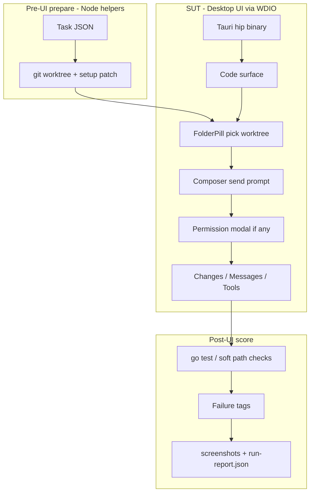

# Hip Capability Evaluation Loop (SWE-like Failure Discovery) — UI-first

| Field | Value |
|-------|-------|
| **Title** | Hip Capability Evaluation Loop — discover product gaps via **desktop UI** coding tasks |
| **Author** | TBD |
| **Date** | 2026-07-16 |
| **Status** | Draft (**rev 3** — UI-first constraint) |
| **Audience** | Hip core engineers (frontend / e2e / product) |
| **Related** | `e2e/` (WDIO + Tauri), `e2e/helpers/*`, Code surface + Changes panel; **复杂任务扩展：** [`2026-07-16-hip-capability-matrix-spec.md`](./2026-07-16-hip-capability-matrix-spec.md) + [`2026-07-16-hip-capability-matrix-plan.md`](./2026-07-16-hip-capability-matrix-plan.md) |

---

## Overview

Hip is a **Tauri desktop** AI workbench. The product path users take is: open the app → Code surface → pick project folder → compose → approve permissions → watch tools / Changes / chat. Capability discovery (「做题 / 操作真实项目写代码 / 类 SWE」) **must exercise that same path**. Headless `hip run --preset harness` is **not** the primary SUT path for this loop — it can remain a secondary engineer tool, but **all evaluation tests for this feature are implemented as UI operations** (WebdriverIO e2e driving the real desktop binary).

This rev 3 redesigns the loop around:

1. **SUT** = debug Tauri app + Vite UI (same as existing `yarn test:e2e`).
2. **Driver** = WDIO specs + helpers (extend `e2e/`, not a new headless `@hip/eval` runner as MVP).
3. **Task packs** = fixtures + prompt + verify (JSON under `e2e/eval-tasks/` or `e2e/fixtures/eval/`).
4. **Workspace safety** = git worktree prepared **before** UI bind; UI then picks that folder via product FolderPill (same as `CodePage.pickDirectory`).
5. **Pilot** = Bytebase pinned SHA, **3 tasks**, live LLM opt-in (`@live @eval`).

**Chinese summary:** 桌面应用，评测与回归一律走 **UI 操作**（选项目 → 发题 → 权限弹窗 → Changes/消息）。用现有 e2e（WDIO+Tauri）驱动真实窗口；任务包 + worktree 只做题面准备与磁盘侧 verify；不把 headless CLI 当产品能力门禁。

---

## Background & Motivation

### Product constraint (rev 3)

| Constraint | Implication |
|------------|-------------|
| Desktop app is the product | Eval must open windows, click composers, pick folders, use Permission UI |
| 「所有的测试都通过 UI 操作实现」 | Gate for this capability = e2e specs; no “pass via CLI only” |
| Existing e2e stack | WDIO + `@wdio/tauri-service`, tags `@smoke/@core/@harness/@live`, `window.__hipE2E`, `__hipPickDir` |
| Code workspace already UI-tested | `project-workspace.spec.ts`, `write-to-changes.spec.ts`, `live-chat.spec.ts` |

### Current state (UI-relevant)

| Capability | Where | Notes |
|------------|--------|-------|
| Launch desktop + ready | `e2e/helpers/app.ts` | `waitForAppReady` / `waitForMainApp` |
| Code surface + folder pick | `CodePage`, `git-workspace.ts` | `__hipPickDir` stubs native dialog; FolderPill → draft `cwd` |
| Create code session | Product: send first message **or** DEV `createCodeSessionForE2e(cwd)` | Eval **prefers product path** (pick folder + composer send) so cwd/permissionMode go through real UI |
| Live LLM chat | `live-chat.spec.ts` `@live` | Opt-in `E2E_LIVE_LLM=1`; auth staged by wdio |
| Changes panel | `write-to-changes.spec.ts` | UI shows agent edits after writes |
| Permission UI | harness permission specs + `PermissionModal` | Real HITL path when not auto |
| Inject harness | `__hipE2E` | **Allowed only** for unpaid UI regression (cancel, interrupt chrome). **Forbidden** as substitute for agent coding skill on `@eval @live` tasks |
| Headless CLI harness | `packages/cli` | Secondary; **out of MVP gate** for this loop |

### Pain points

1. Headless eval (rev 2) would green-pass product gaps that only appear in UI (FolderPill, permission picker, Changes refresh, surface switch).
2. Failure modes users feel (wrong folder bound, permission modal stuck, Changes empty while disk dirty) are **UI-visible**.
3. Prior SWE-bench Docker smoke never scored the agent; still deferred.

### Why UI-first now

- e2e infrastructure already drives Tauri + Code workspace.
- Live LLM path already exists (`@live`).
- Bytebase pilot is a real folder the FolderPill can bind.

---

## Goals & Non-Goals

### Goals

1. **UI-operated evaluation loop**: every coding-task eval case is a WDIO flow that uses product controls.
2. **Task pack format** (JSON) for prompt + workspace + verify + UI expectations.
3. **Safe workspace**: worktree under `HIP_EVAL_ROOT` / temp; primary Bytebase never mutated as default cwd; UI binds worktree path.
4. **Binary score**: after UI turn completes, e2e runs verify (e.g. `go test`) on worktree disk + asserts UI outcomes (Changes paths, assistant text, no stuck modal).
5. **v1 failure taxonomy** from **UI-observable signals** + disk inventory (not CLI-only artifacts).
6. **Bytebase pilot**: exactly 3 tasks, pinned `base_sha`.
7. **Closed loop**: e2e artifacts (screenshots, run dir, tags) → backlog.

### Non-Goals

- Not making headless `hip-eval` / `runHip` the product gate for this feature (rev 2 primary path **rejected**).
- Not replacing all existing unpaid unit/e2e harness inject tests (they stay for chrome/regression).
- Not Docker/SWE-bench MVP.
- Not LLM-as-judge as sole scorer.
- Not multi-tenant OS sandbox.
- Not auto-filing GitHub issues.
- Not requiring a new in-app “Eval Studio” screen for MVP (optional Phase 3); MVP is **automated UI e2e** + optional manual UI checklist.

---

## Proposed Design

### High-level architecture



**Principle:** Prepare and score may use Node/git/shell **outside** the agent runtime; **the agent turn itself** must go through UI (same sidecar session the desktop created).

### Package / tree layout (MVP)

Prefer **extending `e2e/`** over a new monorepo package for MVP (simplicity; WDIO already owns the desktop lifecycle).

```text
e2e/
  eval/                              # NEW
    types.ts                         # TaskSpec, UiExpectation, FailureTagV1
    load-task.ts
    workspace.ts                     # worktree add -b, cleanup, primary guard
    inventory.ts                     # porcelain + full patch (untracked-aware)
    score.ts                         # verify + tags
    report.ts                        # run-report.json under E2E run dir
    taxonomy.ts
    tasks/
      bytebase-pilot/
        pack.json
        README.md                    # base_sha, Go version, env
        tasks/
          bb-common-fix-has-prefixes.json
          bb-common-nav-truncate.json
          bb-stress-timeout.json
        fixtures/
          break-has-prefixes.patch
  helpers/
    eval-run.ts                      # NEW: end-to-end UI driver for one task
    eval-composer.ts                 # send in session InputBar (not only new-conversation)
    eval-permissions.ts              # auto-approve or assert modal
    # existing: app, surface, CodePage, git-workspace, session, e2e-hooks
  specs/
    eval-bytebase-fix-has-prefixes.spec.ts   # @live @eval
    eval-bytebase-nav-truncate.spec.ts
    eval-bytebase-stress-timeout.spec.ts
    eval-ui-smoke.spec.ts            # unpaid: pack load + worktree + pick folder only
scripts/
  hip-eval-ui-pilot.sh               # wraps E2E_LIVE_LLM=1 + E2E_GREP=@eval
```

Root scripts (optional):

```json
"test:e2e:eval": "E2E_LIVE_LLM=1 E2E_GREP=@eval wdio run wdio.conf.ts",
"test:e2e:eval-smoke": "E2E_GREP='@eval @smoke' wdio run wdio.conf.ts"
```

**Rev 2 `@hip/eval` package:** deferred / cancelled for MVP. If shared types are needed later, extract then — do not block UI path.

### End-to-end sequence (single task — UI)

```mermaid
sequenceDiagram
  participant Spec as WDIO spec
  participant Prep as eval/workspace
  participant UI as Desktop UI
  participant SC as Sidecar via UI session
  participant Disk as Worktree disk

  Spec->>Prep: load task + worktree add -b + apply fixture
  Spec->>UI: waitForAppReady, Code surface
  Spec->>UI: pickDirectory(worktreePath) via FolderPill
  Spec->>UI: set permissionMode edit via UI picker (if visible)
  Spec->>UI: composer send task.prompt
  UI->>SC: message:send (real product path)
  loop until turn settle or timeout
    Spec->>UI: poll messages / tools / permission modal
    Spec->>UI: if permission modal: click Allow (product UI)
  end
  Spec->>UI: open Changes; capture diff-file list
  Spec->>Disk: go test / inventory
  Spec->>Spec: score + tags + screenshot on fail
  Spec->>Prep: cleanup worktree unless keep
```

### UI operation contract (what “通过 UI” means)

| Step | Product control | E2E mechanism | Forbidden shortcut for `@eval @live` |
|------|-----------------|---------------|--------------------------------------|
| Open app | Tauri window | existing WDIO launch | headless `runHip` as sole run |
| Code surface | surface switcher | `switchToCodeSurface()` | skip surface |
| Bind project | FolderPill / pick folder | `CodePage.pickDirectory(wt)` (`__hipPickDir` only stubs **native dialog**, still clicks product button) | `createCodeSessionForE2e` alone without pick (DEV inject) as **only** bind — allowed only if product path broken; default is pick + first message |
| Permission mode | PermissionModePicker | click to `edit` | force full via inject without UI |
| Send task | Composer / InputBar | type + `composer-send` click | `injectServerMessage` fake assistant |
| HITL | PermissionModal / PlanApprovalCard | click Allow / deny as task expects | CLI `hitl: auto` without modal |
| Observe edits | Changes panel | `selectPanelTab('changes')`, `diff-file` | only `git diff` without opening Changes (disk verify **also** required, but UI must be checked) |
| Observe text | message bubbles | `[data-message-id]` | only sidecar DB query |

**Dialog stub rule:** `__hipPickDir` is OK because OS file dialog is not automatable reliably; it still exercises product FolderPill click path. `__hipE2E` inject is OK for **unpaid chrome** tests, **not** for skill scoring on live eval tasks.

### Workspace strategy (unchanged intent, UI bind)

```bash
export HIP_EVAL_BYTEBASE_PATH=/Users/lijiamin/data/code-repository/project-go/bytebase-3.16.1
export HIP_EVAL_ROOT=${HIP_EVAL_ROOT:-$HOME/.hip/eval-runs}
```

| Strategy | MVP |
|----------|-----|
| `worktree` under `HIP_EVAL_ROOT/worktrees/<run_id>` | **Yes** |
| UI `cwd` = worktree path | **Yes** |
| `inplace` on primary | **Forbidden** |

#### Exact create sequence

```bash
base_sha=$(git -C "$repo_path" rev-parse "$pinned_sha")
branch="hip-eval/${task_id}/${run_id}"
wt_path="$HIP_EVAL_ROOT/worktrees/${run_id}"
git -C "$repo_path" worktree add -b "$branch" "$wt_path" "$base_sha"
# apply fixture patch inside wt_path
# UI picks wt_path
```

**Safety:**

- Default UI permission mode **`edit`** (jail file tools to cwd/worktree).
- Linked worktree ≠ OS sandbox; `run_script` can still shell out.
- Primary-tree porcelain pre/post snapshot → tag `primary_tree_mutated`.
- Doctor/README: only re-cloneable Bytebase trees.

### Task pack format (JSON)

```json
{
  "schemaVersion": 1,
  "id": "bb-common-fix-has-prefixes",
  "prompt": "In this Bytebase repository, unit tests in package backend/common related to HasPrefixes are failing. Find the bug, fix the implementation (not the test), and ensure go test ./backend/common/ -count=1 passes. Do not commit or push.",
  "workspace": {
    "repo_path_env": "HIP_EVAL_BYTEBASE_PATH",
    "base_sha": "ac0061377bfdd05813e4747df971b0e3737fbe61",
    "strategy": "worktree",
    "setup": { "kind": "patch", "path": "fixtures/break-has-prefixes.patch" }
  },
  "ui": {
    "surface": "code",
    "permission_mode": "edit",
    "timeout_ms": 900000,
    "auto_approve_permissions": true,
    "expect": {
      "changes_paths_regex": ["^backend/common/"],
      "changes_avoid_regex": ["^frontend/"],
      "assistant_text_regex": null,
      "no_permission_modal_stuck": true
    }
  },
  "verify": {
    "commands": [
      { "cmd": ["go", "test", "./backend/common/", "-count=1", "-timeout", "60s"] }
    ]
  }
}
```

### Scoring model (UI + disk)

**Pass requires all of:**

1. UI turn settled (assistant complete or explicit terminal UI state) without hard crash.
2. No stuck permission/plan modal (`no_permission_modal_stuck`).
3. Soft UI checks (Changes paths / assistant text) as configured.
4. All `verify.commands` exit 0 on worktree.
5. Primary tree not mutated.

| Signal | Source |
|--------|--------|
| Turn complete | no streaming cursor; last assistant bubble stable; optional DEV helper **read-only** `getLastAssistantText` |
| Changes | `[data-testid="diff-file"]` text list |
| Permission stuck | modal still open after timeout |
| Disk verify | `child_process` from e2e helper (not agent) |
| Inventory | porcelain + full patch in worktree |

**When verify runs:** always after UI settle (including timeout/fail) if worktree exists — partial edits still informative.

### Failure taxonomy (v1 — UI-grounded)

| Tag | Detection |
|-----|-----------|
| `pass` | all pass criteria |
| `infra_prepare` | worktree/setup failed before UI |
| `ui_launch_fail` | app not ready |
| `ui_bind_fail` | folder chip never shows worktree |
| `no_api_key` | UI/settings or turn error surfaces no-key (and/or staged auth missing) |
| `timeout` | WDIO/task timeout before settle |
| `permission_stuck` | modal open at end |
| `empty_change` | no Changes rows AND inventory empty AND verify fail |
| `ui_changes_missing` | disk dirty but Changes empty (product bug!) |
| `wrong_file` | path soft checks fail |
| `incomplete_fix` | paths ok + verify fail |
| `verify_failed` | go test ≠ 0 |
| `primary_tree_mutated` | primary porcelain/HEAD changed |
| `awaiting_user` | interrupt/pause card visible without recovery |
| `unknown` | residual |

**Deferred:** arg-based doom-loop batch signatures, headless-only trace classifiers. Optional best-effort: pause card text matches known doom-loop copy.

### Pilot tasks (Bytebase) — 3

| ID | UI focus | Verify |
|----|----------|--------|
| `bb-common-fix-has-prefixes` | Fix via Code + see Changes under `backend/common/` | `go test ./backend/common/` |
| `bb-common-nav-truncate` | Navigation; assistant text mentions TruncateString/util.go; may empty Changes | text regex + no infra fail |
| `bb-stress-timeout` | Short `timeout_ms` (e.g. 60s) | often fail; calibrate timeout/empty tags |

Pins: `base_sha=ac0061377bfdd05813e4747df971b0e3737fbe61`, Go `1.26.0` per module. Fixture `git apply --check` on pin.

### Manual UI checklist (same steps, human)

For dogfooding without WDIO:

1. Prepare worktree (script) or copy.
2. Open hip → Code → pick worktree → permission `edit`.
3. Paste task prompt → send.
4. Approve permissions in UI as needed.
5. Open Changes; run tests in Terminal panel or external terminal.
6. Record outcome in simple markdown log.

Manual path uses **identical UI**; automation is a robot of the same path.

### Optional Phase 3 product UI (“Eval” panel)

Only after e2e loop works: Settings or command-palette entry to load pack, pick task, show last tags. **Not MVP.** MVP must not block on new product surface.

---

## API / Interface Changes

### E2E only (MVP)

- New helpers + specs under `e2e/eval`, `e2e/helpers/eval-*.ts`, `e2e/specs/eval-*.spec.ts`.
- Optional env: `HIP_EVAL_BYTEBASE_PATH`, `HIP_EVAL_ROOT`, `E2E_EVAL_KEEP_WORKSPACE=1`.
- No Harness ABI change.
- No required `@hip/cli` dependency for the gate.

### Read-only DEV helpers (optional)

If product UI does not expose “turn complete” cleanly, allow **read-only** `__hipE2E` getters already present (`getLastAssistantText`, `getPendingInterrupt`) — **not** inject/simulate for live skill scoring.

### Exit codes (WDIO)

- Spec fail → mocha fail (existing).
- Wrapper script `hip-eval-ui-pilot.sh`: exit 0 if all `@eval` green; non-zero otherwise.

---

## Data Model Changes

None in `~/.hip/db` for MVP. Artifacts under `HIP_EVAL_ROOT/<run_id>/` + e2e screenshot dir.

---

## Alternatives Considered

### A. Headless `@hip/eval` + `runHip` as primary (rev 2)

**Rejected for this product goal.** Misses FolderPill, permission UI, Changes, surface bugs. CLI may remain engineer smoke only.

### B. In-app Eval Studio only, no e2e

Rejected as sole MVP: non-automatable regression. Optional later.

### C. Pure `__hipE2E` inject without LLM

Rejected for skill discovery; kept for unpaid chrome.

### D. Docker SWE-bench first

Rejected; infra failed before agent; also not desktop UI path.

### E. Terminal panel runs `go test` as only verify

Optional enhancement (more “UI”); MVP allows e2e-side `go test` after UI turn to reduce flake from PTY. Phase 2 may add “run verify in Terminal” for deeper UI coverage.

---

## Security & Privacy

| Risk | Mitigation |
|------|------------|
| Agent edits host via shell | worktree + `edit` mode + primary guard + re-cloneable path |
| Auth keys in e2e | existing wdio staging of `auth.json` into `HIP_DATA_DIR`; no trace-raw in shared logs |
| Live LLM cost | `@live @eval` opt-in only; not in `test:e2e:gate` |
| Dialog stub abuse | only path injection for folder pick |

---

## Observability

| Artifact | Source |
|----------|--------|
| Failure PNG | existing `E2E_SCREENSHOT_DIR` |
| `run-report.json` | `e2e/eval/report.ts` |
| Changes snapshot | DOM text dump |
| verify logs | worktree `verify/*.log` |
| Tag histogram | batch summary after pack run |

---

## Rollout Plan

### Phase 0 — Design rev 3 (this doc)

### Phase 1 — Unpaid UI plumbing

- Task load + worktree helper + `eval-ui-smoke` (pick folder shows chip; no LLM).
- Primary guard unit tests in helper (Node).

### Phase 2 — Live eval specs (3 tasks)

- `@live @eval` specs; composer + Changes + verify.
- Pilot script + README.

### Phase 3 — Taxonomy polish + nightly optional

- Tag clustering; more Bytebase tasks; optional Terminal-verify UI.

### Phase 4 — Optional in-app Eval entry + SWE adapter

### Rollback

Delete `e2e/eval` + eval specs; no production impact.

---

## Risks

| Risk | Severity | Mitigation |
|------|----------|------------|
| Live e2e flaky / slow | High | long timeouts; k=3 before backlog; isolate data dir |
| Folder dialog automation | Med | keep `__hipPickDir` stub + click product control |
| UI Changes lag vs disk | Med | waitUntil + tag `ui_changes_missing` as product bug |
| Permission mode not exposed clearly | Med | assert picker; document default; fix product if missing |
| Go toolchain on e2e host | Med | doctor in smoke; skip with clear message |

---

## Open Questions

1. ~~Headless vs UI primary?~~ **Decided (user): UI only for this eval loop.**
2. Should first message bind session (full product) vs DEV createSession + InputBar? **Recommendation:** full product (pick + send prompt) for live eval.
3. Auto-approve permissions via UI clicks vs product sticky approval? **Recommendation:** click Allow on modal when `auto_approve_permissions: true` to exercise modal chrome.
4. Pin policy / dirty primary: **warn only** (same as rev 2 user choice).
5. Phase 2: run `go test` inside app Terminal for extra UI coverage? **Default MVP: e2e-side shell verify.**

---

## References

- `e2e/README.md` — WDIO tags, live opt-in
- `e2e/page-objects/CodePage.ts` — pickDirectory / FolderPill
- `e2e/helpers/git-workspace.ts` — Changes helpers
- `e2e/specs/live-chat.spec.ts` — live LLM pattern
- `e2e/specs/write-to-changes.spec.ts` — Changes UI
- `e2e/specs/project-workspace.spec.ts` — folder bind
- `e2e/helpers/e2e-hooks.ts` — `__hipE2E` (inject vs read-only)
- `src/components/chat/PermissionModePicker.tsx`, `PermissionModal.tsx`
- Bytebase path (operator): `HIP_EVAL_BYTEBASE_PATH`
- Rev 2 headless design history: superseded as primary path in rev 3

---

## Key Decisions

1. **Primary SUT path = desktop UI via WDIO e2e, not headless CLI.**  
   Rationale: product is Tauri app; user constraint requires UI operations.

2. **MVP lives under `e2e/eval` + specs, not `@hip/eval` package.**  
   Rationale: reuse existing desktop harness; fewer moving parts.

3. **Agent turn must use product controls (FolderPill, composer, permission UI, Changes).**  
   Rationale: discover UI-layer bugs; `__hipE2E` inject forbidden for live skill scoring.

4. **`__hipPickDir` allowed only as native dialog stub after clicking product pick control.**  
   Rationale: OS dialog automation is unreliable; product path still clicked.

5. **Worktree + `permissionMode: edit` + primary guard.**  
   Rationale: protect Bytebase primary; same safety as rev 2.

6. **Score = UI expectations + disk verify commands.**  
   Rationale: Changes empty while disk dirty is a first-class product finding.

7. **Exactly 3 Bytebase pilot tasks, pinned SHA.**  
   Rationale: simplicity first.

8. **Live eval is `@live @eval`, never default gate.**  
   Rationale: cost and flake; unpaid smoke covers plumbing only.

9. **Headless CLI optional secondary, not gate.**  
   Rationale: engineers may smoke models offline; product claims need UI.

10. **Auth via existing e2e staging of user auth.json.**  
    Rationale: match live-chat practice.

---

## PR Plan

### PR 1 — Eval task types + worktree helper + unpaid UI smoke

- **Title:** `test(e2e): eval task pack load, worktree prep, folder-bind smoke`
- **Files:** `e2e/eval/*` (load, workspace, types), `e2e/specs/eval-ui-smoke.spec.ts`, fixtures stub
- **Dependencies:** none
- **Acceptance:** without LLM, worktree created; UI Code surface pick shows folder chip for worktree path; cleanup works; primary guard snapshot
- **Description:** No live model; establishes UI bind contract

### PR 2 — UI driver helpers (composer session, permissions, Changes capture)

- **Title:** `test(e2e): eval UI helpers for composer, permission modal, Changes snapshot`
- **Files:** `e2e/helpers/eval-run.ts`, `eval-composer.ts`, `eval-permissions.ts`
- **Dependencies:** PR 1
- **Acceptance:** unit-level helper tests where pure; smoke uses helpers to open Changes after fake disk write (optional unpaid)
- **Description:** Centralize “what UI ops mean”

### PR 3 — Score + taxonomy + run-report from UI signals

- **Title:** `test(e2e): eval scorer and v1 UI-grounded failure tags`
- **Files:** `e2e/eval/score.ts`, `taxonomy.ts`, `report.ts`, inventory
- **Dependencies:** PR 2
- **Acceptance:** offline fixture tests for tags; `ui_changes_missing` defined
- **Description:** No LLM required for classifier unit tests

### PR 4 — Bytebase pilot pack + 3 `@live @eval` specs

- **Title:** `test(e2e): bytebase pilot eval specs (3 tasks) via UI`
- **Files:** `e2e/eval/tasks/bytebase-pilot/**`, `e2e/specs/eval-bytebase-*.spec.ts`, `scripts/hip-eval-ui-pilot.sh`
- **Dependencies:** PR 3
- **Acceptance:** docs for env + pinned sha; `git apply --check`; specs skip without `E2E_LIVE_LLM=1`; with key, full UI path + `go test` for fix task
- **Description:** IDs: `bb-common-fix-has-prefixes`, `bb-common-nav-truncate`, `bb-stress-timeout`

### PR 5 — (Optional) Terminal-panel verify path

- **Title:** `test(e2e): optional verify via Code Terminal UI`
- **Dependencies:** PR 4
- **Description:** deeper UI coverage for test execution

### PR 6 — (Optional) In-app Eval entry / SWE stub

- **Dependencies:** PR 4
- **Description:** product surface + adapter; only after e2e loop proven

---

## Appendix A — Operator commands

```bash
export HIP_EVAL_BYTEBASE_PATH=/Users/lijiamin/data/code-repository/project-go/bytebase-3.16.1
export HIP_AUTH_PATH=$HOME/.hip/config/auth.json   # staged by wdio for live
cd "$HIP_EVAL_BYTEBASE_PATH" && go mod download

# Debug binary
yarn tauri build --debug

# Unpaid plumbing
yarn test:e2e --spec e2e/specs/eval-ui-smoke.spec.ts

# Live pilot (paid)
E2E_LIVE_LLM=1 E2E_GREP=@eval yarn test:e2e
# or
scripts/hip-eval-ui-pilot.sh
```

## Appendix B — Why not CLI for product claims

| Claim | CLI harness | Desktop UI e2e |
|-------|-------------|----------------|
| Agent can edit files | yes | yes |
| User can bind project folder | no | **yes** |
| Permission modal UX | no | **yes** |
| Changes panel reflects writes | no | **yes** |
| Surface / session chrome | no | **yes** |

Product capability discovery optimizes for the right column.

## Appendix C — Revision history

| Rev | Date | Notes |
|-----|------|-------|
| 1 | 2026-07-16 | Initial headless `@hip/eval` draft |
| 2 | 2026-07-16 | Design review: edit jail, taxonomy, 3 tasks, worktree `-b` |
| 3 | 2026-07-16 | **UI-first:** primary path = WDIO desktop e2e; headless CLI demoted; `e2e/eval` layout |
