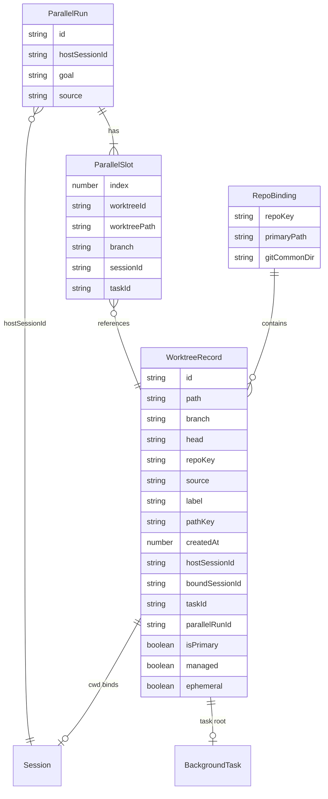
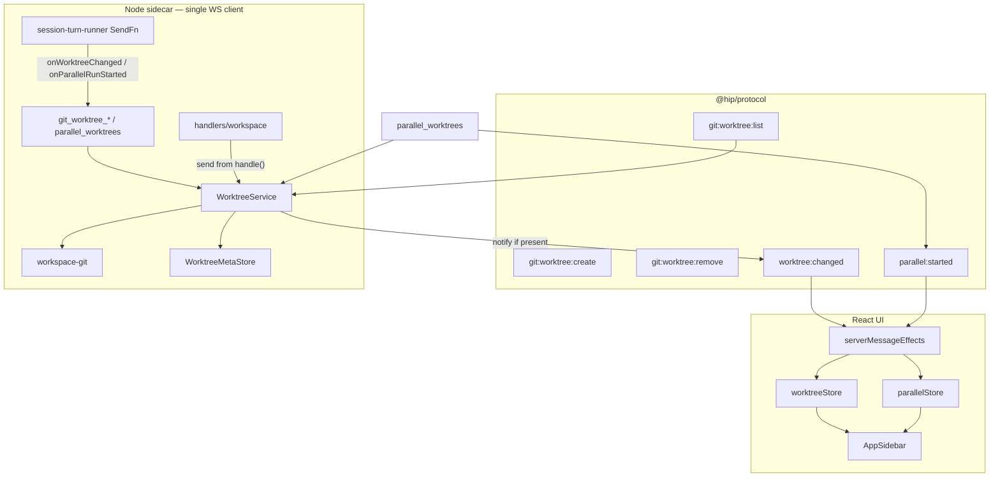
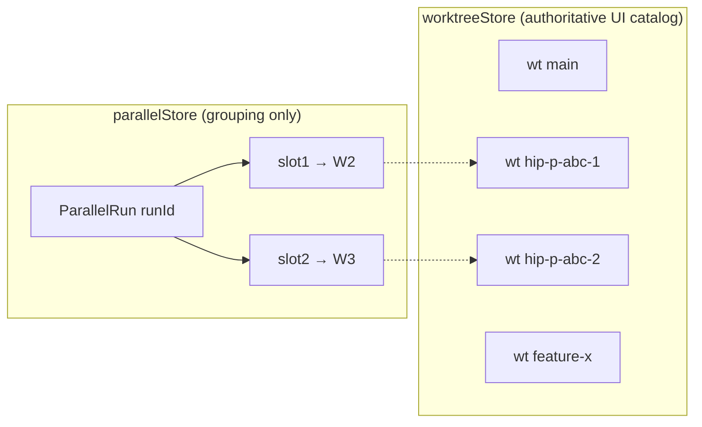

# Worktree Studio — Align hip with Orca Best Practices

| Field | Value |
|-------|-------|
| **Title** | Worktree Studio：将 hip 工作树对齐 Orca 最佳实践（Spec + Plan） |
| **Author** | TBD |
| **Date** | 2026-07-17 |
| **Status** | Approved (design review 0 open issues, 2026-07-17) |
| **Branch context** | `dev.20260716` |
| **Workspace** | `/Users/lijiamin/data/my-github/hip` |
| **Orca reference** | `/Users/lijiamin/data/code-repository/github/orca` |
| **Grok-build reference** | `/Users/lijiamin/data/code-repository/github/grok-build` |
| **Supersedes / extends** | See **Narrative reconciliation** below. Extends agent-driven parallel plan; redefines Scheme A spine. |
| **Strategic lock** | Decision brief name remains **Parallel Studio**; product implementation spine is **Worktree Studio** (worktree first-class; parallel is one creation/grouping mode) |

### Narrative reconciliation (Scheme A / P0 / agent-driven)

| Source | Status after this design |
|--------|---------------------------|
| `docs/upgrade/00-decision-brief.md` — “Parallel Studio” | **Keep as product marketing / stage name.** Does not require ParallelRun as the only worktree visibility source. |
| `docs/upgrade/02-schemes.md` Scheme A — ParallelRun first-class, Composer fan-out, `parallel:*` protocol | **Partially superseded.** WorktreeRecord is first-class; ParallelRun is a **grouping** over worktrees/sessions. Composer “并行 ×N” chip already removed by agent-driven plan — **stay removed**. Server-side `parallel:create|status` authority **not required** for v1 (client parallelStore + protocol events remain). |
| `docs/design/2026-07-17-p0-parallel-surface-spec.md` §2.1 | **Still required** (createBranch/pathKey, managed dir). |
| `docs/design/2026-07-17-p0-parallel-surface-spec.md` §2.2 | **Reoriented** by agent-driven plan + this doc: entry = `parallel_worktrees` HITL, not Composer control; slots may be background tasks without full sessions. |
| `docs/design/2026-07-17-agent-driven-parallel-plan.md` | **Still required** (HITL, tool, `parallel:started`). This design adds catalog/events so non-parallel creates are visible too. |
| This design | **Canonical spine** for worktree path policy, list authority, emit wiring, sidebar catalog. Upgrade docs should point here for implementation; Scheme A MVP items 1 (Composer parallel) are obsolete. |

**Product sentence:** hip’s Parallel Studio *capability* is delivered as **Worktree Studio with parallel as one creation mode** — not as “only parallel slots appear in the UI.”

---

## Overview

hip already creates **managed git worktrees** under `~/.hip/worktrees` (env `HIP_WORKTREES_DIR`) and has three creation surfaces: agent tool `git_worktree_create`, protocol `git:worktree:create` (CLI / host fan-out), and agent tool `parallel_worktrees` (HITL → workers + `parallel:started`). Only the last path reliably appears in the UI, because the sidebar renders `useParallelStore` slots nested under the host session — not a worktree catalog.

Orca treats **worktree as a first-class product object**: create always registers meta, list authority is `git worktree list` merged with meta, create always reveals in the sidebar, and parallel/orchestration groups *over* worktrees rather than owning visibility. Grok-build uses a similar managed layout (`~/.grok/worktrees/<repo_slug>/<session|label>/` + SQLite `worktrees.db`) with an optional CoW engine (`xai-fast-worktree`, out of P0 for hip).

This document is a **single Spec + Plan** to re-center hip on Worktree Studio: unify create paths, make listing authoritative, surface every durable managed worktree, keep agent-driven parallel HITL intact, and phase external discovery + delete preflight without rewriting the session model.

**WS / multi-client constraint (hip ground truth):** the desktop sidecar is a **single-client** WebSocket model (`packages/sidecar/src/server/ws-server.ts`: one Tauri shell connection; close cancels in-flight turns). There is no multi-client broadcast. Live `worktree:changed` events only reach the client attached to that sidecar. CLI defaults to **spawning a separate sidecar** (`packages/cli/src/commands/worktree.ts`: `sidecar: 'spawn'` unless port/token/log provided), so CLI creates **cannot** toast the open UI in the default product path — UI must **hydrate from list** on focus/session open.

---

## Background & Motivation

### Current state (grounded in code)

| Layer | Location | Behavior today |
|-------|----------|----------------|
| Managed root | `packages/sidecar/src/session/worktree-config.ts` | `HIP_WORKTREES_DIR` or `~/.hip/worktrees`; `mkdir -p` on read |
| Rust inject | `src-tauri/src/sidecar.rs`, `src-tauri/src/paths.rs::worktrees_dir` | Sets `HIP_WORKTREES_DIR` to `<hip_base>/worktrees` |
| Path resolve | `workspace-git.ts::resolveManagedWorktreePath` | `getWorktreesDir() + sanitize(pathKey \|\| branch)` — **flat or pathKey segments; no repo nest** |
| Agent create | `tools/git.ts::git_worktree_create` | `path.join(getWorktreesDir(), branch)` with **raw branch** (may contain `/` — accidental nest; **not** `resolveManagedWorktreePath` sanitize); **no send/emit hook**, no meta, no UI |
| Protocol create | `handlers/workspace.ts` + `messages.ts` | Supports `createBranch`, `baseRef`, `pathKey`; result is request/response only; handler has `send` |
| Parallel tool | `tools/parallel-worktree.ts` | HITL → branch `hip-p-{runShort}-{i}` → pathKey `{runId}/{branch}` → `onRunStarted` → `parallel:started` via `session-turn-runner` |
| Background isolate | `background-worktree.ts` + `session-background.ts` | Ephemeral path `managedDir/<sanitize(sessionId)>/<sanitize(taskId)>`, branch `hip-bg-*`; **auto-cleanup** unless caller used `runBackgroundSubagent({ root, keepWorktree: true })` (parallel path) |
| UI visibility | `src/store/parallelStore.ts` + `AppSidebar.tsx` | Only `runsForHost` / slots; fed solely by `parallel:started` (and legacy `startParallelRun`) |
| List | `listWorktrees` → `git worktree list --porcelain` | Returns all worktrees for repo including primary; **UI never consumes for studio** |
| Remove | `removeWorktree` | Managed-dir gate + **always `--force`**; no dirty preflight |

### Pain points

1. **Silent creates:** User/agent runs `git_worktree_create` → disk worktree exists → sidebar still empty → “created but not shown”.
2. **Visibility = parallelStore:** Worktrees that are not part of a parallel run are invisible even if managed.
3. **Inconsistent path policy:** Parallel uses sanitized `runId/branch` via `resolveManagedWorktreePath`; agent tool uses raw `path.join(..., branch)` (unsafe `/` nesting); no `repoName` nest (Orca `nestWorkspaces: true`; Grok `repo_slug/session|label`).
4. **Session-first UX:** Sidebar topology is *session → parallel slots*, not *project/repo → worktrees → sessions*.
5. **Unsafe remove defaults:** Force remove without porcelain dirty check can surprise users who had uncommitted work (Orca preflight: status before kill/remove).
6. **No external discovery:** CLI / third-party worktrees under managed dir (or git-linked outside) never enter an inbox.

### Why now

P0 Parallel Surface shipped the parallel *grouping* and CLI primitives, but the product narrative (Scheme A Worktree Studio) still lacks the **first-class worktree spine**. Without it, every new create path will re-invent “notify UI” ad hoc.

---

## Goals & Non-Goals

### Goals

| ID | Goal |
|----|------|
| G1 | **Worktree as first-class object** with stable id, path, branch, repo binding, creation source, optional session/task links |
| G2 | **Single create pipeline** used by tool, protocol, CLI, parallel_worktrees, host fan-out |
| G3 | **Authoritative list** from `git worktree list` + managed-dir filter + meta merge |
| G4 | **Create → meta → notify → UI refresh → reveal** with no silent product creates |
| G5 | **ParallelRun becomes a grouping** over worktrees (and sessions/tasks), not the sole visibility source |
| G6 | **Preserve agent-driven parallel HITL** (`parallel_worktrees` + PermissionModal + `parallel:started`) |
| G7 | **Configurability** of workspace root + nest-by-repo (env + future settings) |
| G8 | **Safe remove preflight** (dirty/untracked) before destroy; force remains explicit |
| G9 | **Session binding** optional: session `cwd` may equal a worktree path; host session stays on main tree |
| G10 | **Migration** from parallelStore-only UX without breaking existing dogfood / tests |

### Non-Goals (v1 unless argued otherwise)

| Non-goal | Rationale |
|----------|-----------|
| Full Orca terminal-as-center redesign | Scheme B separate; not blocking worktree spine |
| CoW / Btrfs `xai-fast-worktree` engine | Grok-build only; note as later performance path |
| Auto-merge / auto-PR | Explicit Scheme A non-goal |
| SSH remote worktrees | P1 remote sidecar; design extension points only |
| Replace session model with worktree-only model | Sessions remain primary chat runtime; worktrees are workspace objects |
| Persist parallel run state server-side as authority | ParallelRun remains UI/client (+ ephemeral protocol events); worktree meta may be file-backed |
| Force all background subagents to stay as product worktrees | Default path: `acquireBackgroundWorktree` auto-deletes on cleanup. Parallel uses `runBackgroundSubagent({ root, keepWorktree: true })` with a **pre-created** root — that is the durable catalog case, not a flag on `acquireBackgroundWorktree` itself |

---

## Key Decisions

| # | Decision | Choice | Rationale |
|---|----------|--------|-----------|
| KD1 | Product object | **WorktreeRecord** first-class; ParallelRun secondary grouping | Fixes silent creates; Orca parity on A/H |
| KD2 | List authority | **`git worktree list` is ground truth**; meta is overlay | Orphans and external creates detectable |
| KD3 | Managed path default | Keep **`~/.hip/worktrees`** (+ `HIP_WORKTREES_DIR`). Nest-by-repo helper lands first with **default off**; flip default **on** only after WorktreeService (see PR1 vs PR2b) | Avoids mid-migration path break before catalog/meta exist |
| KD4 | Create funnelling | All product creates call **`WorktreeService.create`** (sidecar); tools/handlers thin | Guarantees event emission when `send` is available |
| KD5 | Notification | New **`worktree:changed`** ServerMessage on the **same WS** as the creating client; parallel keeps **`parallel:started`** as *group* event. **Not** multi-client broadcast | Matches single-client `ws-server.ts` |
| KD6 | UI topology (v1) | **Session host → worktrees for that session’s repo**; algorithm in §6 | Minimal disruption; see host-binding rules |
| KD7 | Meta persistence | **JSON per repo under `~/.hip/worktrees/.meta/<repoKey>.json`**; not SQLite in v1. **Single-writer** = long-lived desktop sidecar | CLI-spawned sidecars are ephemeral; see Data Model |
| KD8 | Remove policy | **Per call site** force defaults (table §9): user/CLI/tool default preflight; bg cleanup + parallel auto-cleanup **force: true** | Avoids breaking dirty worker cleanup |
| KD9 | Agent tool fix | `git_worktree_create` via service + **same sanitize/pathKey as protocol** (not raw `path.join(branch)`); emit via DI | Closes silent create + path inconsistency |
| KD10 | Parallel slots | Slot stores **`worktreeId` + path + branch + taskId/sessionId`** | Grouping over catalog |
| KD11 | Scope of “managed” | **Only current `getWorktreesDir()`** (+ primary). No historical-root registry in v1; relocating env is user responsibility | Avoids half-built Orca `workspaceDirHistory` |
| KD12 | Rollout / rollback | **No feature-flag framework.** Ship behind incremental PRs; rollback = revert UI PR (PR4). Dual-write parallelStore during migration without a flag | hip has no FF surface; avoid inventing `HIP_WORKTREE_STUDIO` |
| KD13 | List protocol | **Extend existing `WorktreeInfo` + `git:worktree:list`**; defer separate `worktree:list` client RPC | One list API; `WorktreeRecord` still used for events/meta types |
| KD14 | Ephemeral filter | Hide only if **meta `ephemeral`** **or** branch `^hip-bg-` (path depth alone is **not** sufficient — parallel `runId/branch` is also two segments) | Prevents bg noise without hiding parallel slots |
| KD15 | Worktree id | `id = hash(repoKey + realpath)` — **stable for a given path across restarts, not across path moves** | Nest migration never rewrites paths |

---

## Proposed Design

### 1. Object model



#### TypeScript shapes (proposed `@hip/protocol`)

```typescript
/**
 * Stable for a given path across process restarts.
 * NOT stable across path moves/relocations (same coupling as Orca `${repoId}::${path}`).
 * Nest migration never rewrites existing paths, so this is sufficient for v1.
 */
export type WorktreeId = string

export type WorktreeSource =
  | 'agent_tool'        // git_worktree_create
  | 'protocol'          // git:worktree:create / CLI
  | 'parallel'          // parallel_worktrees
  | 'host_fanout'       // sessionService.startParallelRun (legacy)
  | 'background'        // durable only when keepWorktree via pre-created root
  | 'import'            // external inbox accept (P1)
  | 'discovered'        // listed from git, not yet claimed
  | 'primary'           // main tree

export interface WorktreeRecord {
  id: WorktreeId
  path: string                 // absolute, realpath preferred
  branch: string               // '' if detached
  head: string
  repoKey: string              // stable: hash of git common dir or primary realpath
  isPrimary: boolean
  managed: boolean             // path under **current** getWorktreesDir() only (v1)
  /** When true, excluded from Studio catalog (disposable bg isolate). */
  ephemeral?: boolean
  source: WorktreeSource
  label?: string               // display name; default branch or last path segment
  pathKey?: string             // relative key under managed root used at create
  createdAt?: number
  hostSessionId?: string       // session whose cwd was used for create
  boundSessionId?: string      // session whose cwd === this.path (if any)
  taskId?: string
  parallelRunId?: string
  dirty?: boolean
  lastSeenAt?: number
}

export interface WorktreeMetaFile {
  version: 1
  repoKey: string
  primaryPath: string
  records: Record<WorktreeId, Omit<WorktreeRecord, 'branch' | 'head' | 'dirty'>>
  /** Paths user dismissed from external inbox */
  dismissedExternalPaths?: string[]
  /** Paths user imported */
  importedExternalPaths?: string[]
}

export interface WorktreeListFilter {
  managedOnly?: boolean        // default true for Studio
  includePrimary?: boolean     // default true
  hostSessionId?: string
  parallelRunId?: string
}

export type WorktreeChangeKind = 'created' | 'updated' | 'removed' | 'discovered' | 'imported'

export interface WorktreeChangedEvent {
  type: 'worktree:changed'
  sessionId?: string           // optional correlation (create session)
  repoKey: string
  kind: WorktreeChangeKind
  worktree: WorktreeRecord
  /** When true, UI should expand host and scroll to this worktree. */
  reveal?: boolean
}
```

Parallel types evolve (backward compatible):

```typescript
export interface ParallelSlot {
  index: number
  sessionId: string
  taskId?: string
  worktreePath: string
  worktreeId?: string          // NEW
  branch: string
  status: ParallelSlotStatus
  error?: string
}
```

### 2. Path policy (Orca-aligned)

| Setting | Orca | hip today | hip target |
|---------|------|-----------|------------|
| Default root | `~/orca/workspaces` | `~/.hip/worktrees` | **keep** `~/.hip/worktrees` (product identity) |
| Env override | settings `workspaceDir` | `HIP_WORKTREES_DIR` | keep; settings UI later (no historical-root DB in v1) |
| Nest by repo | `nestWorkspaces: true` → `root/<repoName>/<name>` | flat / pathKey only | Helper supports nest; **product default on only after PR2b** (see rollout). Until then `nestByRepo: false` preserves `root/<pathKey>` |
| Per-repo override | `repo.worktreeBasePath` | none | P1 optional |
| Safety | `ensurePathWithinWorkspace` | `path.resolve` + string prefix on remove | create-time ensure + **remove-time realpath** (PR6) |
| Historical roots | `workspaceDirHistory` | none | **v1: none** — only current `getWorktreesDir()` is `managed`. Changing `HIP_WORKTREES_DIR` leaves old trees as non-managed (user cleans or re-imports in P1) |

**Proposed path computation** (sidecar pure functions, mirror Orca `computeWorktreePath`):

```typescript
// packages/sidecar/src/session/worktree-paths.ts
export interface WorktreePathSettings {
  workspaceDir: string          // getWorktreesDir()
  nestByRepo: boolean           // default FALSE until PR2b; then true
  repoSlug: string              // basename(primary)
}

/** pathKey segments always sanitized (never raw branch with '/'). */
export function computeManagedWorktreePath(
  settings: WorktreePathSettings,
  pathKey: string,
): string {
  const parts = pathKey.split(/[/\\]+/).filter(Boolean).map(sanitizeRefComponent)
  const base = settings.nestByRepo
    ? path.join(settings.workspaceDir, settings.repoSlug)
    : settings.workspaceDir
  return path.join(base, ...parts)
}

export function ensurePathWithinWorkspace(target: string, workspaceDir: string): string {
  // resolve + relative must not escape (same as Orca ensurePathWithinWorkspace)
}
```

**Agent tool parity:** `git_worktree_create` **must not** use `path.join(getWorktreesDir(), branch)`. It must call `resolveManagedWorktreePath` / `computeManagedWorktreePath` so `/` in branch names becomes sanitized segments (same as protocol/parallel).

**`resolveManagedWorktreePath` migration:** PR1 introduces nest helpers **without** changing `resolveManagedWorktreePath` behavior (nest off). PR2b optionally switches the shared resolve helper to nest-on after service/tests updated.

**Env ownership (nest):**

| PR | Who reads `HIP_WORKTREES_NEST` | Effect on create paths |
|----|-------------------------------|------------------------|
| **PR1** | Documents the env name in comments/tests only | **No** — `resolveManagedWorktreePath` always nest=false; production creates unchanged |
| **PR2+** | `WorktreeService` / create pipeline | If env `=1`, set `nestByRepo: true` for **new** creates through the service |
| **PR2b** | Default when env **unset** | Flip default to nest **on**; env `=0` remains escape |

Do **not** make PR1 honor the env for live creates — that would change paths before WorktreeService exists.

### 3. Architecture



#### 3.1 Emit DI (mandatory — agent tools have no `send` today)

**Ground truth:** `buildGitTools(cwd)` only receives `cwd` (`tools/git.ts`). Parallel already injects notify via `BuildToolsOpts.onParallelRunStarted` → `session-turn-runner.ts` wraps `send({ type: 'parallel:started', … })`. Protocol handlers receive `send` in `handlers/workspace.ts`.

**Required wiring (mirror parallel pattern):**

```typescript
// packages/sidecar/src/session/tools/helpers.ts — extend BuildToolsOpts
export interface BuildToolsOpts {
  // …existing fields…
  onParallelRunStarted?: (payload: { /* existing */ }) => void
  /** Product worktree catalog notifications (create/remove/update). */
  onWorktreeChanged?: (event: Omit<WorktreeChangedEvent, 'type'>) => void
}

// packages/sidecar/src/session/tools/git.ts
export function buildGitTools(
  cwd: string | undefined,
  opts?: {
    hostSessionId?: string
    onWorktreeChanged?: BuildToolsOpts['onWorktreeChanged']
  },
): StructuredToolInterface[]

// packages/sidecar/src/session/worktree-service.ts
export interface WorktreeServiceDeps {
  /** Optional: absent in unit tests / headless one-shot CLI sidecar still OK for disk ops. */
  notify?: (event: Omit<WorktreeChangedEvent, 'type'>) => void
  nestByRepo?: boolean
}

export class WorktreeService {
  constructor(private deps: WorktreeServiceDeps = {}) {}
  async create(opts: CreateWorktreeOpts): Promise<CreateResult> {
    // … git + meta …
    this.deps.notify?.({
      kind: 'created',
      repoKey,
      worktree: record,
      reveal: opts.reveal ?? true,
      sessionId: opts.hostSessionId,
    })
    return result
  }
}

// packages/sidecar/src/session/session-turn-runner.ts — next to onParallelRunStarted:
onWorktreeChanged: (event) => {
  send({ type: 'worktree:changed', ...event })
},

// tools/index.ts
base.push(...buildGitTools(cwd, {
  hostSessionId: opts.sessionId,
  onWorktreeChanged: opts.onWorktreeChanged,
}))
```

| Caller | How notify is provided |
|--------|-------------------------|
| Agent tools (turn) | `session-turn-runner` → `BuildToolsOpts.onWorktreeChanged` → `send` |
| Protocol handler | `WorktreeService({ notify: (e) => send({ type: 'worktree:changed', …e }) })` |
| `parallel_worktrees` | Service create with same notify; **plus** existing `onParallelRunStarted` |
| CLI default spawn | Separate sidecar: notify hits CLI’s short-lived WS only (no UI). Disk+meta still written |
| Unit tests | `notify` mock / omit |

**PR ownership:** PR2 must land `WorktreeService` + handler notify. **PR3 must wire `buildGitTools` + `BuildToolsOpts` + turn-runner** (not optional). Without PR3 wiring, AC1 fails.

**WorktreeService** methods:

| Method | Responsibility |
|--------|----------------|
| `create(opts)` | validate branch, **sanitize pathKey**, compute path, ensure within workspace, `git worktree add`, write meta, `notify` created+reveal |
| `list(cwd, filter)` | porcelain → merge meta → classify; **exclude ephemeral** from Studio default |
| `remove(opts)` | managed gate (**realpath**) → preflight unless `force` → remove → meta → notify |
| `refresh` / list hydrate | used by UI on session open / window focus |
| `bindSession(worktreeId, sessionId)` | meta update when session cwd set to worktree |
| `registerExternal(path)` | P1 import |

### 4. Create sequence (unified)

```mermaid
sequenceDiagram
  participant Actor as Tool/CLI/UI/Parallel
  participant Svc as WorktreeService
  participant Git as git worktree
  participant Meta as MetaStore
  participant UI as UI stores

  Actor->>Svc: create({ cwd, branch, pathKey?, createBranch?, source, hostSessionId, reveal })
  Svc->>Svc: isSafeBranchName / sanitize pathKey
  Svc->>Svc: computeManagedWorktreePath (nest)
  Svc->>Svc: ensurePathWithinWorkspace
  alt createBranch
    Svc->>Git: git branch name [baseRef]
  end
  Svc->>Git: git worktree add path branch
  Git-->>Svc: ok
  Svc->>Meta: upsert WorktreeRecord
  Svc-->>Actor: { ok, path, id, record }
  Svc-->>UI: worktree:changed { kind: created, reveal: true }
  UI->>UI: worktreeStore.upsert + expand host + scroll/highlight
```

#### Path-specific wiring

| Entry | Today | Target |
|-------|-------|--------|
| `git_worktree_create` | direct `createWorktree` + raw path | `WorktreeService.create({ source: 'agent_tool', reveal: true })` via sanitized pathKey; notify through `onWorktreeChanged` |
| `git:worktree:create` | handler only | same service; result includes `id`; notify via handler `send` |
| CLI `hip worktree create` | spawn sidecar by default | Disk/meta written on that process; **UI not live-notified** unless CLI attaches to UI sidecar (unsupported as product multi-client) — UI **polls list** instead |
| `parallel_worktrees` | own create + `onRunStarted` | service.create per slot + `parallel:started` + per-slot `worktree:changed` |
| `startParallelRun` | protocol create loop | optional/legacy (agent-driven plan prefers remove call sites); if kept, use service |
| `acquireBackgroundWorktree` | silent + auto cleanup | write meta `ephemeral: true` **or** no meta; **always hidden from Studio**; cleanup uses **force remove** |
| `runBackgroundSubagent({ root, keepWorktree: true })` | parallel durable root | catalogued via parallel create path (`source: 'parallel'`) |

**Critical product rules:**

1. Any create that leaves a **durable** (non-ephemeral) worktree under managed root **must** call `notify` when a `SendFn` is available on that process.
2. Disposable bg worktrees are **never** Studio catalog rows (filter + ephemeral flag), even though porcelain lists them while running.

### 5. List / refresh

```mermaid
sequenceDiagram
  participant UI as worktreeStore
  participant P as Protocol
  participant Svc as WorktreeService
  participant Git as git worktree list
  participant Meta as MetaStore

  Note over UI: On session open / window focus (CLI gap)
  UI->>P: git:worktree:list { sessionId }
  P->>Svc: list(cwd)
  Svc->>Git: porcelain
  Git-->>Svc: entries[]
  Svc->>Meta: load(repoKey)
  Svc->>Svc: merge + classify + drop ephemeral
  Svc-->>UI: worktrees: WorktreeInfo[] enriched
  Note over UI: Studio shows managed + primary; external[] for P1 inbox
```

**Merge algorithm (Orca-inspired merge in `worktree-logic.ts` / listDetected):**

1. Parse porcelain → `{ path, branch, head }[]`.
2. Normalize paths (`realpath` when possible).
3. For each entry:
   - `isPrimary` if path equals repo root.
   - `managed` if under **current** `getWorktreesDir()` only (v1 — **no** historical roots).
   - **Ephemeral hide** (Studio catalog default). Hide **only if any** of:
     1. meta `ephemeral === true`, **or**
     2. branch matches `^hip-bg-` (bg isolate naming from `background-worktree.ts`), **or**
     3. *(optional conjunctive)* path is under managed dir **and** branch matches `^hip-bg-` (layout alone never sufficient).
     - **Do not** treat “exactly two path segments under managed root” as ephemeral: parallel uses the same shape (`…/worktrees/<runId>/<hip-p-…>` via `pathKey = runId/branch`) and **must remain catalogued** (source `parallel`, branch `hip-p-*`).
     - **Non-example:** path `~/.hip/worktrees/a1b2c3d4e5/hip-p-abc-1` + branch `hip-p-abc-1` → **show** in catalog + parallel group.
     - **Example hide:** path `~/.hip/worktrees/<sess>/<task>` + branch `hip-bg-…` → **hide** (or meta ephemeral).
     - Debug/`includeEphemeral` may still return hidden rows.
   - Match meta by path → fill id/source/label/task/session/run.
   - Unmatched managed non-ephemeral → assign `id = hash(repoKey+path)`, `source: 'discovered'`.
4. Meta entries missing from git → soft-gone; refresh cleans.

**Locked list API decision (KD13):**

- **Keep** client message `git:worktree:list` (already in `CLIENT_MESSAGE_TYPES`).
- **Extend** `WorktreeInfo` with additive optional fields.
- **Do not** add a parallel `worktree:list` client RPC in v1.
- Put full `WorktreeRecord` / `WorktreeChangedEvent` types in protocol for **server events and meta**, even if list returns enriched `WorktreeInfo`.

```typescript
export interface WorktreeInfo {
  path: string
  branch: string
  head: string
  id?: string
  managed?: boolean
  isPrimary?: boolean
  ephemeral?: boolean
  source?: WorktreeSource
  label?: string
  parallelRunId?: string
  taskId?: string
  boundSessionId?: string
}
```

**Hydrate (CLI / missed events):** On code-session open and app window focus, UI sends `git:worktree:list` for that session and replaces `worktreeStore` slice for `repoKey`. This is the **supported** path for CLI-created worktrees to appear without multi-client WS.

### 6. Parallel run as grouping + sidebar algorithm



#### 6.1 Host binding (session → worktrees)

For sidebar session row `H` with `cwd = C` (or last known project root):

1. Resolve `repoKey` from `C` (git toplevel / common dir). If not a git repo → no worktree subtree.
2. `catalog = worktreeStore.byRepoKey(repoKey)` filtered `!ephemeral && (managed || isPrimary)`.
3. `runs = parallelStore.runsForHost(H.id)`.
4. `slotPaths = set of realpath(slot.worktreePath)` across those runs.

**If multiple code sessions share the same repo cwd:** each host session row shows the **same** managed catalog for that `repoKey`, but **only its own** `runsForHost`. Parallel groups are host-scoped; orphan managed worktrees (no `hostSessionId` or foreign host) still appear under **every** session of that repo (acceptable v1; optional later filter `hostSessionId === H || !hostSessionId`).

**CLI / discovered worktrees** without `hostSessionId`: still appear under any session whose repo matches (via hydrate list).

#### 6.2 Render algorithm (dedup)

```
for session H in sidebar:
  if no slots and no catalog managed: collapse (no tree)
  else expand (user preference):
    1. Main row — primary worktree (if present)
    2. For each run in runsForHost(H) [newest first]:
         group header (if >1 run)
         for each slot: ParallelSlotRow (existing)
    3. Standalone managed worktrees:
         catalog.managed where realpath(path) ∉ slotPaths
         and !isPrimary
         → WorktreeRow (new)
```

**Never double-render** the same path as both a parallel slot and a standalone row.

#### 6.3 Click actions

| Row | Click | Double-click (optional) |
|-----|-------|-------------------------|
| Main | select host session H | — |
| Parallel slot with `sessionId` | `selectSession(sessionId)` | selectWinner |
| Parallel slot agent-only (`sessionId` empty, `taskId` set) | select host H (task output lives on host) — **same as today** | — |
| Standalone with `boundSessionId` | select that session | — |
| Standalone without bound session | v1: select host + toast path / “open session in worktree” action creates code session `cwd=path` and sets meta bind | — |

`parallel:started` still fills parallelStore; each slot create also upserts catalog via `worktree:changed` (or list hydrate).

### 7. Session relationship

| Concept | Rule |
|---------|------|
| Host / main session | `cwd` = primary repo path; used for git ops and agent planning |
| Slot session (host fan-out) | `cwd` = worktree path; full code session |
| Agent parallel workers | background task `root` = worktree; may not have full session id |
| Binding | When UI creates session in worktree, set meta `boundSessionId`; session summary may later expose `cwd` in UI |
| Switch | Selecting worktree focuses bound session; does not mutate primary |

`session:setCwd` / create with cwd remain the binding mechanism — no “worktree replaces session” rewrite.

### 8. External / orphan discovery (design now, ship later)

**Phases:**

| Phase | Capability |
|-------|------------|
| P0.5 | On list/refresh, classify non-managed non-primary as `external[]` in service (debug/log); not Studio main list |
| P1 | Inbox UI: Import / Dismiss — parity with Orca helpers in `src/shared/external-worktree-inbox.ts`, `src/shared/worktree-ownership.ts`, and renderer inbox actions (not a single symbol-symbol `new-external-worktrees-inbox`) |
| P1 | Orphans: managed path missing from git → “Broken worktree” + prune |

Meta fields: `dismissedExternalPaths`, `importedExternalPaths` (mirror Orca baseline path sets).

Import: register meta `source: 'import'`; no copy/symlink required if already a git worktree.

### 9. Safe remove preflight + force policy per call site

Align with Orca `docs/worktree-delete-preflight.md`.

**Today:** `removeWorktree` always `--force` (`workspace-git.ts`). Call sites:

| Call site | File | Required force policy after PR6 |
|-----------|------|----------------------------------|
| `acquireBackgroundWorktree` cleanup | `background-worktree.ts` | **`force: true`** (must succeed; disposable) |
| Parallel unselected cleanup / selectWinner cleanup | future UI or agent | **`force: true`** after user confirms discard **or** best-effort force when agent tears down workers |
| Protocol `git:worktree:remove` | `handlers/workspace.ts` | **`force` from message; default `false`** |
| CLI `hip worktree remove` | `commands/worktree.ts` | default preflight; **`--force` flag** |
| Agent `git_worktree_remove` | `tools/git.ts` | default **`force: false`**; schema `force?: boolean` so agent can pass true after user intent |
| Integration tests | `worktree.integration.test.ts` | force as needed for teardown |

```
remove(path, { force }):
  1. realpath(path) and realpath(worktreesDir); reject if outside managed
  2. if !force: assertWorktreeCleanForRemoval
       git status --porcelain --untracked-files=all
       non-empty → { ok:false, code:'WORKTREE_DIRTY' }
  3. optional unbind sessions / stop tasks
  4. git worktree remove path [--force if force]
  5. meta remove + notify removed
```

Protocol:

```typescript
| { type: 'git:worktree:remove'; sessionId: string; worktreePath: string; force?: boolean }
```

**UI confirm:** There is **no** sidebar remove control today. PR6 does **not** invent a dead “UI confirm” without a control. Options for PR6 scope:
- (a) protocol/CLI/tool only + document force call sites, **or**
- (b) add sidebar context-menu “Remove worktree…” with dirty dialog in the same PR.

**Acceptance:** Dirty parallel worker cleanup with `force: true` still succeeds (test in PR5 or PR6).

**Orphan compatibility:** status “not a working tree” / ENOENT → fall through to meta cleanup + prune (Orca).

### 10. UI behavior (产品 UX — bilingual labels)

| Surface | EN | 中文 | Behavior |
|---------|----|------|----------|
| Sidebar group | Worktrees | 工作树 | Expandable under host code session or project |
| Primary row | Main | 主工作区 | Primary path; always present |
| Slot row | branch · taskId | 分支 · 任务 | Existing parallel slot UI |
| Create toast | Worktree created | 已创建工作树 | **Same-process only** — on `worktree:changed` with `reveal` (agent tool / UI-attached protocol / parallel on desktop sidecar). **Not** on default CLI spawn (see AC2); hydrate path has no create toast (optional quiet “catalog refreshed” is fine) |
| Reveal | Jump to worktree | 定位到工作树 | Same-process `worktree:changed` with reveal; expand + highlight (Orca `sidebarRevealBehavior: 'auto'`) |
| Dirty remove dialog | Uncommitted changes | 有未提交更改 | Offer Force / Cancel |
| External inbox | External worktrees | 外部工作树 | Phase later |
| Empty state | No worktrees yet — ask the agent to explore in parallel, or create one | 尚无工作树 — 可让 Agent 并行探索或手动创建 | |

**Sidebar topology recommendation (v1):** keep **session → worktrees** (current AppSidebar pattern) to avoid a project registry redesign. Phase 2: project → worktrees when multi-repo UI exists.

### 11. Config surface

| Key | Source | Default |
|-----|--------|---------|
| workspace dir | `HIP_WORKTREES_DIR` / Rust `paths::worktrees_dir` | `~/.hip/worktrees` |
| nest by repo | `HIP_WORKTREES_NEST` read by **WorktreeService (PR2+)**; default flip in **PR2b** | **default off** until PR2b; env `=1` early-opts only after PR2 |
| max parallel slots | existing clamp | 2–4 |
| meta path | derived | `~/.hip/worktrees/.meta/<repoKey>.json` |
| historical roots | — | **none in v1** |

Settings UI: Phase 2 “Worktrees directory” + “Nest by repository name”.

---

## API / Interface Changes

### Protocol (`packages/protocol`)

| Message | Change |
|---------|--------|
| `git:worktree:create` | unchanged inputs; **result adds `id?`** |
| `git:worktree:create:result` | `{ ..., id?: string, worktree?: WorktreeInfo }` |
| `git:worktree:list` | **unchanged client type** (already guarded) |
| `git:worktree:list:result` | `WorktreeInfo` **additive** optional fields only |
| `git:worktree:remove` | add `force?: boolean` (default false at protocol layer) |
| `git:worktree:remove:result` | add `code?: 'WORKTREE_DIRTY' \| 'OUTSIDE_MANAGED' \| ...` |
| **NEW** `worktree:changed` | **ServerMessage** only — TypeScript union in `messages.ts`; UI `serverMessageEffects` |
| `parallel:started` | slots may include `worktreeId?` |

**message-guard.ts:** Only validates **client** messages (`CLIENT_MESSAGE_TYPES` / `parseClientMessage`). Adding `worktree:changed` as a **server** event does **not** require message-guard changes. Guard updates only if a **new client** RPC is introduced (v1: none — keep `git:worktree:*`).

### Agent tools (`packages/sidecar/src/session/tools/git.ts`)

```typescript
// Signature change (emit DI)
buildGitTools(cwd, { hostSessionId, onWorktreeChanged })

// git_worktree_create schema evolution
z.object({
  branch: z.string(),
  create_branch: z.boolean().optional(),
  base_ref: z.string().optional(),
  path_key: z.string().optional(), // sanitized via resolveManagedWorktreePath — never raw join(branch)
  label: z.string().optional(),
})
// → WorktreeService.create({ source: 'agent_tool', reveal: true, pathKey: path_key ?? branch })
// return JSON: { path, id, branch }
```

`git_worktree_remove`: `force` optional; **default false** (dirty error to agent).  
`git_worktree_list`: enriched JSON including managed/id; ephemeral hidden by default.

### CLI (`packages/cli`)

| Command | Change |
|---------|--------|
| `hip worktree create` | Print `id` + path (JSON or text). Writes disk/meta on the **CLI process’s** sidecar. **Default spawn: no live UI event** (separate sidecar / single-client WS — see AC2). Open UI shows the path only after **hydrate** (`git:worktree:list` on session open / focus), not via create toast |
| `hip worktree list` | show managed/primary columns in text mode; exclude ephemeral by default |
| `hip worktree remove` | `--force` flag; default preflight |
| **NEW** `hip worktree refresh` | optional; list+discover on **this** sidecar only (does not push to UI WS) |

### Frontend stores

| Store | Role |
|-------|------|
| **NEW** `src/store/worktreeStore.ts` | Catalog by `repoKey`; hydrate from `git:worktree:list`; apply `worktree:changed` |
| `parallelStore.ts` | Runs/slots grouping; `worktreeId` dual-write; **not** sole visibility |
| `serverMessageEffects.ts` | `worktree:changed` → upsert/remove + optional reveal; keep `parallel:started` |
| `AppSidebar.tsx` | Algorithm §6.2: Main + parallel groups + standalone managed |

---

## Data Model Changes

### On-disk meta (sidecar)

```
~/.hip/worktrees/
  .meta/
    <repoKey>.json     # WorktreeMetaFile
  <repoSlug>/          # only after nest default on (PR2b)
    <pathKey>/
  <pathKey>/           # flat / pathKey layout (current + nest-off)
```

**repoKey:** `sha256(realpath(gitCommonDir)).slice(0, 16)` or `sha256(primaryPath).slice(0, 16)` (impl uses sha256; either identity input is OK as long as stable for the repo).

**Migration:** On first list after upgrade, scan porcelain managed non-ephemeral paths → meta `source: 'discovered'`. No path moves.

**Concurrency / multi-process:**

- **Single-writer assumption:** the long-lived **desktop** sidecar is the authoritative meta writer for interactive Studio.
- CLI default **spawn** is a second process that may write meta for its own creates; **last-write-wins** on atomic rename. This is **not** a live event bus to the UI (Issue 1).
- Optional later: `flock` around meta file writes if races appear in dogfood.
- Meta is **not** a substitute for multi-client WS broadcast.

### Client persistence

Optional last-known list; **authoritative** refresh on session open / window focus via `git:worktree:list`.

---

## File-level touch list

### PR-critical (ordered roughly by phase)

| Area | Files |
|------|-------|
| Path / config | `packages/sidecar/src/session/worktree-config.ts`, **new** `worktree-paths.ts`, `src-tauri/src/paths.rs` (doc only), `src-tauri/src/sidecar.rs` (optional nest env inject) |
| Git core | `packages/sidecar/src/session/workspace-git.ts` (preflight, remove force flag, enrich list) |
| Service | **new** `packages/sidecar/src/session/worktree-service.ts`, **new** `worktree-meta.ts` |
| Handlers | `packages/sidecar/src/session/handlers/workspace.ts` |
| Tools | `packages/sidecar/src/session/tools/git.ts`, `parallel-worktree.ts`, `tools/index.ts` |
| Turn runner | `packages/sidecar/src/session/session-turn-runner.ts` (emit bridge) |
| Background | `packages/sidecar/src/session/background-worktree.ts` |
| Protocol | `packages/protocol/src/workspace-types.ts`, `messages.ts` (ServerMessage; **no** message-guard for `worktree:changed`) |
| Tool DI | `tools/helpers.ts` (`onWorktreeChanged`), `tools/git.ts`, `tools/index.ts`, `session-turn-runner.ts` |
| CLI | `packages/cli/src/commands/worktree.ts`, `bin.ts` |
| UI store | **new** `src/store/worktreeStore.ts`, `src/store/parallelStore.ts` |
| Effects | `src/domain/serverMessageEffects.ts` |
| Sidebar | `src/components/layout/AppSidebar.tsx` (+ tests) |
| Domain | `src/domain/sessionService.ts` (`startParallelRun` use enriched results) |
| i18n | `src/i18n/en.ts`, `zh-CN.ts`, `zh-TW.ts` |
| Tests | `workspace-git` tests, **new** service tests, `parallel-worktree.test.ts`, `AppSidebar.test.tsx`, protocol contracts |
| Docs | this design; update `docs/design/2026-07-17-p0-parallel-surface-spec.md` pointer |

---

## Alternatives Considered

### Alt 1 — Only fix `git_worktree_create` to emit `parallel:started`

**Idea:** Fake a one-slot parallel run so existing sidebar shows it.

| Pros | Cons |
|------|------|
| Tiny patch | Pollutes parallel semantics; every worktree becomes a “run” |
| No new store | No list authority; no external discovery path |
| | Breaks product narrative (worktree ≠ parallel) |

**Reject** for Studio spine; acceptable only as emergency hotfix.

### Alt 2 — Orca-scale Repo + WorktreeMeta SQLite + IPC matrix

**Idea:** Port Orca’s repo registry, meta DB, listDetected, ownership, WSL mirroring.

| Pros | Cons |
|------|------|
| Full parity | Months of work; wrong stack (Electron IPC vs Tauri+sidecar) |
| | Violates simplicity (AGENTS.md); overbuilds for single-user local |

**Reject for v1.** Steal algorithms (path nest, merge, preflight, inbox), not architecture.

### Alt 3 — Worktree-only UI; sessions demoted

**Idea:** Sidebar is only worktrees; chat attaches as panel (true Orca).

| Pros | Cons |
|------|------|
| Clean mental model | Massive navigation rewrite; conflicts with hip session/memory/plan surface |
| | Explicit non-goal |

**Defer.** v1 binds sessions *to* worktrees without flipping primary navigation.

### Alt 4 — Chosen: WorktreeService + catalog store + parallel as group

| Pros | Cons |
|------|------|
| Fixes silent create | More files than Alt 1 |
| Incremental PRs | Dual-write migration brief window |
| Keeps HITL parallel | Must educate: Main vs worktree |

**Accept.**

---

## Security & Privacy Considerations

| Threat | Severity | Mitigation |
|--------|----------|------------|
| Path traversal via pathKey/branch | High | Existing `sanitizeRefComponent` / `isSafeBranchName`; `ensurePathWithinWorkspace` on create; managed prefix on remove |
| Agent removes arbitrary disk paths | High | Managed-dir gate retained; never remove primary |
| Force delete loses user work | Medium | Default non-force + dirty preflight; force requires explicit flag / confirm UI |
| Meta path leaks repo locations | Low | Local-only under `~/.hip`; mode 0600 preferred for meta files |
| Branch name injection | Medium | Keep `isSafeBranchName` (no `.`/`..`/flags) |
| Symlink escape from managed dir | Medium | **PR6:** `realpath` before managed check on remove + unit test rejecting symlink outside managed dir |

AuthN/Z: local desktop trust model unchanged (no multi-user ACL).

---

## Observability

| Signal | Where | Notes |
|--------|-------|-------|
| `worktree_create` | sidecar log | source, repoKey, nest, latency_ms, ok/error |
| `worktree_remove` | sidecar log | force, dirty preflight fail, ok |
| `worktree_list` | debug | count managed/primary/external |
| UI toast | create / remove fail | user-facing |
| Metrics (later) | optional | count creates by source |

Do not log full prompts in path keys. Correlate with `sessionId` / `runId` only.

**Latency targets:** create < 2s typical small repo; list < 300ms; preflight < 500ms.

**Disk:** each worktree ≈ full working tree size; UI should warn when N≥4 parallel (existing).

---

## Rollout Plan

### No feature-flag framework

hip has `hip.toml` + env for concrete domains (providers, langsmith, agentLoop, …) but **no general FF surface**. This design **does not** invent `HIP_WORKTREE_STUDIO` / `worktreeStudio.v1`.

| Mechanism | Use |
|-----------|-----|
| Incremental PRs | Ship service before UI; UI PR is the visible cutover |
| Rollback | **Revert PR4** (worktreeStore + sidebar) → parallelStore-only visibility returns |
| Nest | PR1 nest **off** (env documented, not applied to creates); PR2+ honors `HIP_WORKTREES_NEST=1`; PR2b default on |
| Meta | Ignore corrupt JSON → re-discover from git |

### Stages (aligned with PR plan)

1. **PR1** path helpers (nest **off** by default).  
2. **PR2** WorktreeService + meta + `worktree:changed` + handler notify.  
3. **PR3** agent tool DI + sanitize path (fixes silent creates for UI-attached turns).  
4. **PR4** worktreeStore + sidebar algorithm + **hydrate on session open/focus**.  
5. **PR5** parallel worktreeId dual events.  
6. **PR6** preflight remove + realpath gate + force call sites.  
7. **PR2b / nest-on** flip default nest after dogfood.  
8. **PR8** external classification (stretch).  

### Rollback

- Revert UI PR → prior sidebar.  
- Nest remains off if not flipped.  
- No git history rewrite.

---

## Testing Strategy

| Layer | Cases |
|-------|-------|
| Unit paths | nest on/off; ensurePathWithinWorkspace rejects `..`; sanitize |
| Unit meta | merge porcelain + meta; discovered assignment; atomic write |
| Integration git | create → list sees managed; remove dirty fails without force; force succeeds |
| Tool | `git_worktree_create` emits changed (mock send); returns id |
| Parallel | HITL n2 still works; slots have worktreeId; dual events |
| UI | AppSidebar shows agent-created worktree without parallel run; reveal expands host |
| CLI | create/list/remove --force exit codes |
| Regression | existing `worktree.integration.test.ts`, `parallel-worktree.test.ts` green |

Paid LLM tests: not required for this spine.

---

## Orca / Grok Parity Matrix

| Capability | Orca | Grok-build | hip today | hip target phase |
|------------|------|------------|-----------|------------------|
| A. Worktree first-class UI | ● | ● (workspace) | ○ (parallel only) | **P0** |
| B. Managed path + config | ● workspaceDir, nest, per-repo | ● `~/.grok/worktrees/<slug>/` | ◐ env only, flat | **P0** nest+env; P1 settings UI |
| C. git worktree list authority | ● listDetected + meta | ● | ◐ list exists, unused by UI | **P0** |
| D. Create → register → reveal | ● | ● | ○ except parallel | **P0** |
| E. Unify create paths | ● worktrees:create | ● | ○ fragmented | **P0** |
| F. External discovery inbox | ● | ◐ | ○ | **P1** (design in P0) |
| G. Delete preflight | ● | ? | ○ force always | **P0.5** |
| H. Parallel as grouping | ● orchestration over WT | ● | ◐ parallel owns visibility | **P0** |
| I. Session bind to worktree | ● terminal/session on WT | ● | ◐ cwd only | **P0** bind meta |
| J. Migration without breaking HITL | n/a | n/a | n/a | **P0** dual-write |
| CoW fast worktree | ○ | ● `xai-fast-worktree` | ○ | **Later** |
| Layout path | `~/orca/workspaces/<repo>/<name>` | `~/.grok/worktrees/<repo>/<session|label>/` | flat/pathKey | **P0** helpers; nest default after PR2b |
| SSH remote worktrees | ● | ○ | ○ | **P1** extension |
| Sidebar jump reveal | ● auto behavior | ? | ○ toast only | **P0** (same-process creates only) |

---

## Phased Implementation Plan

### Phase 0 — Spec lock (this doc)

- KD1–KD15 frozen for implementers (OQs resolved-by-recommendation below).
- Narrative reconciliation accepted for Scheme A.

### Phase 1 — Path helpers (nest **off**)

- `worktree-paths.ts`; `resolveManagedWorktreePath` behavior unchanged.

### Phase 2 — WorktreeService spine

- Meta + service + `worktree:changed` ServerMessage + **handler** notify.
- Enrich `WorktreeInfo`; **no** new client list RPC; **no** message-guard for server event.

### Phase 3 — Agent tool fix + DI

- `buildGitTools` opts + turn-runner `onWorktreeChanged`; sanitize path.

### Phase 4 — UI catalog

- worktreeStore, §6.2 algorithm, **hydrate on session open / window focus**, reveal.

### Phase 5 — Parallel polish

- `worktreeId` on slots; dual events; cleanup **force: true**.

### Phase 6 — Remove preflight + realpath

- Call-site force table; CLI `--force` (fold list polish into same PR if small).

### Phase 7 — Nest default on (PR2b)

- After catalog dogfood; update tests expecting flat paths.

### Phase 8 — External classification (P1 stretch)

### Phase 9 — Remote extension points (design only; no SSH)

---

## PR Plan

Independently mergeable PRs; each green on its own.

### PR1 — `feat(worktree): path helpers + ensure within workspace (nest default off)`

| | |
|--|--|
| **Deps** | none |
| **Files** | **new** `worktree-paths.ts` + unit tests; thin re-exports from `worktree-config` / `workspace-git` if needed |
| **Description** | Pure path policy with `nestByRepo` parameter. **`resolveManagedWorktreePath` keeps current flat/pathKey behavior** (helper always called with nest=false). **Documents** env name `HIP_WORKTREES_NEST` in comments/tests but **does not** wire env into production creates (no path change). |
| **Accept** | Unit tests for nest on/off **as pure function**; traversal rejected; **live create paths identical to today** (env ignored by resolve helper) |

### PR2 — `feat(worktree): WorktreeService + meta + worktree:changed + handler emit`

| | |
|--|--|
| **Deps** | PR1 |
| **Files** | **new** `worktree-service.ts`, `worktree-meta.ts`; `workspace-types.ts`, `messages.ts` (**ServerMessage** only — **not** message-guard); `handlers/workspace.ts` |
| **Description** | Core spine; create/list/remove via service; handler `notify → send(worktree:changed)`; enrich `WorktreeInfo`. **First place that reads `HIP_WORKTREES_NEST=1`** → `nestByRepo` for new creates. Ephemeral filter: meta / `^hip-bg-` only — **not** two-segment path depth (parallel must stay visible). |
| **Accept** | Integration: create → meta → list has id; parallel-shaped path+branch not filtered; types compile; message-guard **unchanged** |

### PR2b — `feat(worktree): enable nest-by-repo default for new creates` (after PR4 dogfood)

| | |
|--|--|
| **Deps** | PR2, preferably PR4 |
| **Files** | path settings default, create call sites, tests |
| **Description** | Flip nest default on for new creates only; document path change |
| **Accept** | New creates under `…/<repoSlug>/…`; old paths still list |

### PR3 — `fix(agent): git worktree tools via service + onWorktreeChanged DI`

| | |
|--|--|
| **Deps** | PR2 |
| **Files** | `tools/git.ts`, `tools/helpers.ts` (`BuildToolsOpts`), `tools/index.ts`, `session-turn-runner.ts`, tests |
| **Description** | **Mandatory** emit wiring (mirror `onParallelRunStarted`). Sanitize pathKey; return JSON `{path,id}`; mock notify receives event |
| **Accept** | Test: after create, `onWorktreeChanged` / send mock got `worktree:changed` |

### PR4 — `feat(ui): worktreeStore + sidebar catalog algorithm + hydrate + reveal`

| | |
|--|--|
| **Deps** | PR2; PR3 for dogfood |
| **Files** | **new** `worktreeStore.ts`, `serverMessageEffects.ts`, `AppSidebar.tsx` (+test), i18n; session open/focus list call |
| **Description** | §6.2 Main + parallel groups + standalone managed; no double rows; hydrate on open/focus for CLI-created trees |
| **Accept** | (1) inject `worktree:changed` → row without parallelStore; (2) hydrate from list shows managed path; (3) parallel slot path not duplicated as standalone |

### PR5 — `refactor(parallel): worktreeId + service creates + force cleanup policy`

| | |
|--|--|
| **Deps** | PR2, **PR4** (sidebar dedup) |
| **Files** | `parallel-worktree.ts`, `parallelStore.ts`, `session-turn-runner.ts`, tests |
| **Description** | Dual events; slots include worktreeId; document cleanup `force: true` |
| **Accept** | parallel-worktree tests green; HITL n2; no double sidebar rows |

### PR6 — `feat(worktree): dirty preflight, force per call site, realpath gate, CLI --force`

| | |
|--|--|
| **Deps** | PR2 |
| **Files** | `workspace-git.ts`, service, protocol remove, `background-worktree.ts` force, `tools/git.ts`, `commands/worktree.ts`, tests |
| **Description** | Default non-force preflight; bg cleanup force; realpath managed gate; CLI list columns + `--force` (CLI polish folded here). **No** fake UI confirm unless sidebar remove menu is added in this PR |
| **Accept** | Dirty fails non-force; force succeeds; **symlink outside managed rejected after realpath**; dirty parallel cleanup with force still works |

### PR7 — *(folded into PR6)* CLI list/remove polish

Omit separate PR unless CLI scope grows; if split, deps PR6.

### PR8 — `feat(worktree): external discovery classification (inbox-ready, stretch)`

| | |
|--|--|
| **Deps** | PR2, PR4 |
| **Files** | service external[], meta dismissed/imported; optional badge |
| **Description** | P1-ready classification; cite Orca `external-worktree-inbox.ts` / `worktree-ownership.ts` |
| **Accept** | External paths not in main Studio list |

### PR9 — `chore: host startParallelRun alignment` (**optional / legacy**)

| | |
|--|--|
| **Deps** | PR2, PR5 |
| **Files** | `sessionService.ts` |
| **Description** | Agent-driven plan prefers removing host fan-out call sites. **Optional:** only if host path retained for tests; otherwise delete unused host fan-out instead of investing |
| **Accept** | If kept: same worktreeId dual-write; if deleted: no dead code |

**Suggested merge order:** PR1 → PR2 → PR3 → PR4 → PR5 → PR6 → (PR2b) → PR8 → (PR9 optional).

---

## Risks

| Risk | Severity | Mitigation |
|------|----------|------------|
| Dual store divergence | Medium | Dual-write; hydrate list reconciles |
| Nest mid-migration path break | Medium | Nest default **off** until PR2b |
| CLI create invisible in UI | Medium (expected) | Hydrate on focus; document single-client WS |
| Meta multi-process race | Low | Single-writer assumption; atomic rename; optional flock later |
| Meta corruption | Low | Re-discover from git |
| Agent depends on string-only result | Low | JSON body |
| Remove without force breaks bg/parallel cleanup | **High if mishandled** | Call-site force table; tests for force cleanup |
| Symlink escape | Medium | PR6 realpath gate + test |
| Performance list | Low | Cap UI; porcelain cheap |

---

## Open Questions

**Status: resolved by recommendation as of this draft (2026-07-17).** Implementers should not re-litigate mid-PR unless product explicitly reopens.

| ID | Question | **Frozen decision** | Mapped KD |
|----|----------|---------------------|-----------|
| **OQ1** | Sidebar topology | **(a)** session→worktrees v1 | KD6 |
| **OQ2** | Default nest by repo | **Off until PR2b**; then **on** for new creates; env opt-in early | KD3 |
| **OQ3** | Disposable bg in Studio? | **Never** — hide via `^hip-bg-` / meta `ephemeral` (not path depth); durable parallel `hip-p-*` stays visible | KD14 |
| **OQ4** | Meta storage | **JSON** v1 | KD7 |
| **OQ5** | Agent remove default | **Preflight**; `force` optional; cleanup sites force | KD8 |
| **OQ6** | Worktree id | **hash(repoKey+path)**; stable per path, not across moves | KD15 |
| **OQ7** | Primary in list? | **Yes** as Main row | KD11 |
| **OQ8** | Persist parallelRun server-side? | **No** — client parallelStore | Non-goals |

---

## Acceptance Criteria (Spec)

| # | Criterion |
|---|-----------|
| AC1 | Same-sidecar `git_worktree_create` (agent turn on UI-connected process) produces a sidebar-visible managed worktree **without** `parallel_worktrees`, after PR3+PR4 |
| AC2 | **CLI default spawn does not live-toast the open UI** (single-client WS). Supported: after CLI create, **UI hydrate** via `git:worktree:list` on session open / window focus shows the new managed path. Optional dogfood: attach CLI to UI sidecar is **unsupported** as multi-client product |
| AC3 | Protocol/tool list managed set matches Studio catalog (excluding ephemeral bg) |
| AC4 | Parallel HITL n=2 still creates 2 workers + group UI + task poll; no double rows for slot paths |
| AC5 | Non-force remove of dirty worktree fails with `WORKTREE_DIRTY`; force succeeds; bg cleanup force still works |
| AC6 | When nest **enabled** (PR2b / env), new creates under `…/<repoSlug>/…`; when off, flat/pathKey as today |
| AC7 | Primary tree never removable via product remove |
| AC8 | Existing parallelStore persisted runs still render after upgrade |
| AC9 | Unit/integration: service path, tool emit DI, sidebar catalog/hydrate, realpath remove gate green |
| AC10 | Managed-dir escape on remove still rejected (including symlink-outside after realpath) |
| AC11 | Disposable `hip-bg-*` / meta-ephemeral worktrees do **not** appear as Studio standalone rows while running; parallel `runId/hip-p-*` **does** appear (not misclassified by path depth) |

---

## References

### hip

- `packages/sidecar/src/session/worktree-config.ts` — `getWorktreesDir`
- `packages/sidecar/src/session/workspace-git.ts` — `createWorktree`, `listWorktrees`, `removeWorktree`, `resolveManagedWorktreePath`
- `packages/sidecar/src/session/tools/git.ts` — `git_worktree_*`
- `packages/sidecar/src/session/tools/parallel-worktree.ts` — agent parallel + HITL
- `packages/sidecar/src/session/background-worktree.ts` — ephemeral isolate (`sessionId/taskId`, `hip-bg-*`)
- `packages/sidecar/src/session/session-background.ts` — `runBackgroundSubagent({ root, keepWorktree })`
- `packages/sidecar/src/session/session-turn-runner.ts` — `onParallelRunStarted` → `send` (pattern for `onWorktreeChanged`)
- `packages/sidecar/src/server/ws-server.ts` — single-client WS model
- `packages/sidecar/src/session/handlers/workspace.ts` — protocol handlers (`send`)
- `packages/protocol/src/messages.ts` — Client/Server unions; `git:worktree:*`, `parallel:started`
- `packages/protocol/src/message-guard.ts` — **client-only** allowlist (`CLIENT_MESSAGE_TYPES`)
- `packages/protocol/src/workspace-types.ts` — `WorktreeInfo`
- `src/store/parallelStore.ts` — UI parallel runs
- `src/domain/serverMessageEffects.ts` — `parallel:started` handler
- `src/components/layout/AppSidebar.tsx` — session→slots tree
- `src/domain/sessionService.ts` — `startParallelRun`
- `packages/cli/src/commands/worktree.ts` — CLI
- `src-tauri/src/paths.rs` / `sidecar.rs` — `HIP_WORKTREES_DIR`
- `docs/upgrade/00-decision-brief.md`, `02-schemes.md` Scheme A
- `docs/design/2026-07-17-p0-parallel-surface-spec.md`
- `docs/design/2026-07-17-agent-driven-parallel-plan.md`

### Orca

- `src/shared/constants.ts` — `getDefaultWorkspaceDir` → `~/orca/workspaces`, `nestWorkspaces: true`
- `src/main/ipc/worktree-logic.ts` — `computeWorktreePath`, `computeWorkspaceRoot`, `ensurePathWithinWorkspace`, `sanitizeWorktreeName`
- `src/main/ipc/worktrees.ts` — `worktrees:create` → `createLocalWorktree`
- `src/shared/external-worktree-inbox.ts`, `src/shared/worktree-ownership.ts` — external visibility / inbox path helpers
- `docs/new-worktree-sidebar-reveal.md` — create → reveal `auto`
- `docs/worktree-delete-preflight.md` — dirty preflight ordering
- Renderer `store/slices/worktrees.ts` — listDetected + meta merge

### Grok-build

- `crates/codegen/xai-fast-worktree` — CoW engine (later)
- Workspace layout: `~/.grok/worktrees/<repo_slug>/<session|label>/` + SQLite (`worktrees.db`) — pattern only

---

## Summary for implementers

1. **Stop treating parallelStore as the worktree database.**
2. **Put WorktreeService in front of every durable create.**
3. **Wire emit DI** (`onWorktreeChanged` / handler `send`) — tools do not have `send` today.
4. **Same-process events only**; CLI → UI uses **list hydrate**, not multi-client broadcast / create toast.
5. **Keep `parallel_worktrees` HITL**; parallel is a group on top of worktrees.
6. **Filter ephemeral via branch `hip-bg-*` / meta — never by two-segment path depth alone.**
7. **Nest:** PR1 pure helpers only; PR2+ env; PR2b default on. Force remove policy per call site.
8. **No feature flag** — rollback by reverting UI PR.

Canonical PR Plan: **§ PR Plan** above (PR1→PR2→PR3→PR4→PR5→PR6→PR2b→PR8; PR9 optional).
