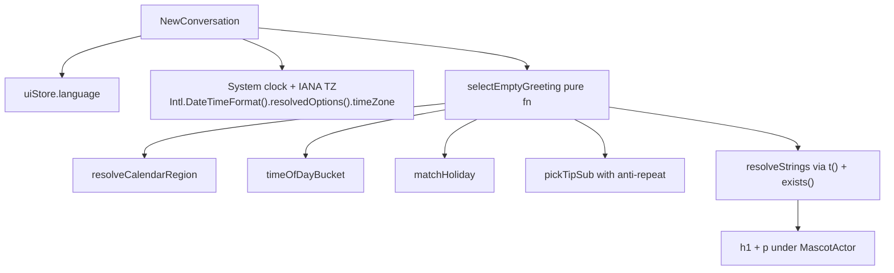
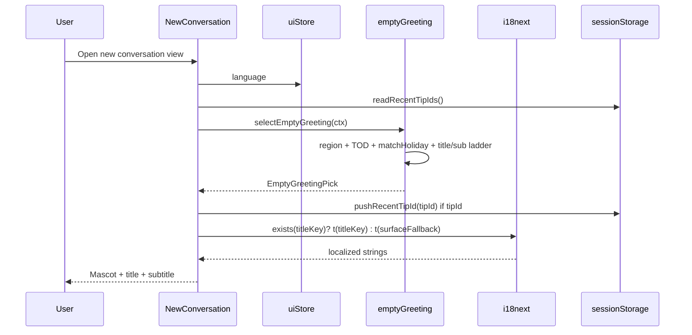

# Design: Locale-Aware Dynamic Empty-State Greeting

| Field | Value |
|-------|--------|
| **Title** | Locale-Aware Dynamic Empty-State Greeting (New Conversation) |
| **Author** | TBD |
| **Date** | 2026-07-19 |
| **Status** | Draft (rev 3 — final nits addressed; ready to implement) |
| **Related** | `src/components/chat/NewConversation.tsx`, `src/components/login/MascotActor.tsx`, `src/i18n/*`, `src/store/uiStore.ts` |

---

## Overview

On the new-conversation empty state, the text under the mascot is currently static: a fixed title (`chat.newConversationGreeting` / `chat.codeGreeting`) and a fixed subtitle (`chat.greetingSub.default`). Users who open hip repeatedly see the same lines regardless of time of day, calendar, language, or region.

This design makes those two lines **context-aware and locale-aware** using a small frontend-only selection engine. Inputs are: system local time (IANA timezone), app UI language, a coarse **calendar region** inferred without geolocation, surface (`chat` vs `code`), and a short tip anti-repetition history. Output is a pair of i18n keys (title + subtitle) resolved through existing `react-i18next` locales (`en`, `zh-CN`, `zh-TW`).

**Locked content model (v1):**

| Tier | Title | Subtitle |
|------|-------|----------|
| **Holiday** | Holiday title | Holiday sub (or code-biased tip sub on code surface when a code tip is available) |
| **Otherwise** | Time-of-day title, **or** weekend title with **p = 0.25** (daily hash) on Sat/Sun | Rotating **tip** sub (anti-repeat), else matching TOD/weekend sub |
| **Fallback** | Surface default keys if i18n key missing | Same |

**Unified priority (use this wording everywhere):**

1. **Holiday** full pair (highest)  
2. Else **title** = weekend (optional, p=0.25 on local weekend) **or** time-of-day  
3. **Subtitle** = tip pool (surface-biased, anti-repeat) **else** TOD/weekend sub  
4. **Surface defaults** only when keys are missing / selector fails  

No network, no IP geo, no sidecar, no new settings page in v1.

---

## Background & Motivation

### Current state

| Piece | Location | Behavior today |
|-------|----------|----------------|
| Empty state shell | `src/components/chat/NewConversation.tsx` | Renders `MascotActor` + `h1` + `p` + composer |
| Title | L85, L146–147 | `surface === 'code' ? t('chat.codeGreeting') : t('chat.newConversationGreeting')` |
| Subtitle | L148–150 | Always `t('chat.greetingSub.default')` |
| Mascot | `src/components/login/MascotActor.tsx` | Idle cycle of motion SVGs; `initialAction` is `wave` (chat) or `code` (code); respects `prefers-reduced-motion` |
| Enter animation | `src/styles/tokens.css` (`.animate-greeting-enter`) | Opacity/translate; disabled under reduced-motion global CSS |
| Action-keyed copy | `chat.greeting.*` / `chat.greetingSub.*` in `en.ts`, `zh-CN.ts`, `zh-TW.ts` | **Present but unused** by `NewConversation` (only `greetingSub.default` is read). Keys (`puff`, `happy`, `think`, `splash`, …) do **not** match current `MascotAction` (`coffee`, `gift`, `code`, …) — older vocabulary; do not wire in v1. |
| Language | `uiStore.language` + `LanguageProvider` + `src/i18n/index.ts` | `AppLanguage = 'zh-CN' \| 'zh-TW' \| 'en'`; seed from `i18nextLng` / `navigator.language`; fallback `zh-CN`. Region subtags (`en-US`, `en-GB`) are normalized away today. |
| Time formatting | `src/lib/datetime.ts` | `Intl.DateTimeFormat` / `RelativeTimeFormat` with explicit locale; **no time-of-day bucket helper** |
| Product copy package | `packages/product-content/` | Agent help / capability map embeds — **not** empty-state UI strings |

```145:150:src/components/chat/NewConversation.tsx
          <h1 className="mb-2 text-center text-display font-semibold tracking-tight text-ink">
            {greeting}
          </h1>
          <p className="mb-8 text-center text-body text-ink-secondary">
            {t('chat.greetingSub.default', '')}
          </p>
```

### Pain points

1. **No temporal warmth** — night owls and morning users get the same line.
2. **No regional calendar awareness** — CN National Day, TW 雙十, US Independence Day, JP Golden Week, etc. are invisible.
3. **Dead i18n surface** — unused action-keyed maps from an older mascot vocabulary.
4. **Language ≠ region** — app language alone is insufficient for holidays (e.g. English UI in Tokyo vs Chicago). Timezone is available free via the OS.

### Industry practice (condensed)

- Compute **time-of-day from the user's local clock**, never server time.
- Prefer **OS locale + timezone** over IP geolocation for privacy and desktop UX.
- Layer **calendar events only when region is confident**; fall back to time-of-day when region is ambiguous.
- Keep copy **optional flavor** — never block core tasks; avoid creepy personalization.
- **Holiday full pair; otherwise stable TOD (or light weekend) title + rotating subtitle tips.**
- Localize every string; do not default all users to CN or US calendars.
- Anti-repeat **tips** so reopen does not feel sticky-looped.

---

## Goals & Non-Goals

### Goals

1. Replace static title + subtitle under the mascot with **dynamic, fully localizable** content.
2. Drive selection from **local timezone + calendar region + UI language + surface**.
3. Support a **frozen, curated holiday registry** (10 named definitions in v1) with implementable match rules.
4. Provide **anti-repetition for tip subtitles** so consecutive empty-state visits vary when possible.
5. Remain **fully offline**, pure frontend, unit-testable with injectable `now` / `timeZone` / `rng`.
6. Preserve **accessibility**: meaning does not depend on animation; reduced-motion only affects enter CSS / mascot.
7. Keep change **surgical**: selection module, i18n keys, and `NewConversation` wiring only.

### Non-Goals (v1)

- Geolocation, IP lookup, or network holiday APIs.
- User-editable holiday lists or a new Settings control.
- Coupling greeting text to `MascotAction` (unused action keys stay; optional PR 3 may add holiday mascot accent only).
- Seasonal full-theme recolors / festive chrome beyond text.
- Full lunar calendar libraries (v1 uses hand-maintained Gregorian anchors for a few festivals).
- First-run vs returning-user personalization.
- Sidecar / protocol / `packages/product-content` involvement.
- Analytics telemetry for which greeting was shown.
- Expanding to many countries (DE, FR, BR, CA, KR, …) — add only when product owns copy.

---

## Proposed Design

### Architecture



**Placement:**

| File | Role |
|------|------|
| `src/lib/emptyGreeting.ts` | Pure selection: TOD, region, weekend, `selectEmptyGreeting` |
| `src/lib/emptyGreeting.holidays.ts` | Holiday registry + `matchHoliday` + lunar anchors |
| `src/lib/emptyGreeting.keys.ts` | **Shared const ids + i18n key paths** (single source for engine + translations) |
| `src/lib/emptyGreeting.recent.ts` | sessionStorage read/write (I/O; not pure) |
| `src/lib/emptyGreeting.test.ts` | Unit tests |
| `src/lib/emptyGreeting.holidays.test.ts` | Holiday match + anchor coverage CI guard |

UI only calls the selector and resolves keys with `t()` / `i18n.exists()`.

**Why frontend-only:** greetings are pure presentation; no secrets; `Date` + `Intl` are available in the Tauri webview; sidecar would add latency and IPC for zero benefit.

### Context model

```ts
// src/lib/emptyGreeting.ts (conceptual)

import type { AppLanguage } from '@/store/uiStore'

export type Surface = 'chat' | 'code'
export type TimeOfDay = 'morning' | 'afternoon' | 'evening' | 'night'

/** v1 regions with at least one holiday (or GENERIC). No KR until holidays exist. */
export type CalendarRegion = 'CN' | 'TW' | 'JP' | 'US' | 'GB' | 'AU' | 'GENERIC'

export type GreetingTier = 'holiday' | 'weekend' | 'timeOfDay' | 'default'

export interface EmptyGreetingContext {
  now: Date
  timeZone: string           // IANA, e.g. "Asia/Shanghai"
  language: AppLanguage
  surface: Surface
  recentTipIds?: string[]    // anti-repeat window for tip ids only
  /** Injected for tests; production uses dailyHash(dateKey) then optional Math.random only if needed */
  rng?: () => number         // [0, 1)
}

export interface EmptyGreetingPick {
  /** Stable content id, e.g. "holiday:cn-national-day", "tod:afternoon", "weekend", "tip:code-folder" */
  id: string
  tier: GreetingTier
  /** When subtitle comes from tip pool, set for anti-repeat push; else undefined */
  tipId?: string
  titleKey: string
  subKey: string
  region: CalendarRegion
  timeOfDay: TimeOfDay
}
```

### Shared key constants (`emptyGreeting.keys.ts`)

```ts
/** Keep ids and i18n paths in one module so engine and locale files cannot drift. */
export const EMPTY_GREETING = {
  tod: {
    morning: {
      title: 'chat.emptyGreeting.timeOfDay.morning.title',
      sub: 'chat.emptyGreeting.timeOfDay.morning.sub',
    },
    // afternoon, evening, night …
  },
  weekend: {
    title: 'chat.emptyGreeting.weekend.title',
    sub: 'chat.emptyGreeting.weekend.sub',
  },
  holiday: {
    'cn-national-day': {
      id: 'holiday:cn-national-day',
      title: 'chat.emptyGreeting.holiday.cn-national-day.title',
      sub: 'chat.emptyGreeting.holiday.cn-national-day.sub',
    },
    // …
  },
  tip: {
    'chat-paste': {
      id: 'tip:chat-paste',
      sub: 'chat.emptyGreeting.tip.chat-paste.sub',
      surfaces: ['chat', 'code'] as const,
    },
    'code-folder': {
      id: 'tip:code-folder',
      sub: 'chat.emptyGreeting.tip.code-folder.sub',
      surfaces: ['code'] as const,
    },
    // …
  },
  surface: {
    chat: {
      title: 'chat.newConversationGreeting',
      sub: 'chat.greetingSub.default',
    },
    code: {
      title: 'chat.codeGreeting',
      sub: 'chat.greetingSub.default',
    },
  },
} as const
```

Tips own **subtitle keys only** (no tip titles). Titles on non-holiday days always come from TOD or weekend.

### Resolving timezone (always local; ephemeral)

```ts
export function resolveSystemTimeZone(): string {
  try {
    return Intl.DateTimeFormat().resolvedOptions().timeZone || 'UTC'
  } catch {
    return 'UTC'
  }
}
```

- **Never** use server time or a hardcoded offset.
- IANA TZ is read **ephemerally for selection only** — this feature does **not** persist timezone (only tip ids may be stored).
- Local wall-clock via `formatToParts` so tests can pin `timeZone` independent of host:

```ts
export function localParts(now: Date, timeZone: string): {
  year: number; month: number; day: number; hour: number; weekday: number // 0=Sun … 6=Sat
} {
  // Intl.DateTimeFormat(undefined, { timeZone, hour: 'numeric', … hourCycle: 'h23' }).formatToParts(now)
}
```

### Time-of-day buckets

| Bucket | Local hour (inclusive) | Intent |
|--------|------------------------|--------|
| `morning` | 05–11 | Warm start |
| `afternoon` | 12–17 | Midday productivity |
| `evening` | 18–21 | Still shipping |
| `night` | 22–04 | Late session; gentle, not preachy |

Constants live in one place (`TIME_OF_DAY_BOUNDS`). Avoid moralizing night copy.

### Calendar region — frozen policy

**Policy (v1, locked):**

> **CJK UI language locks the calendar region**, except when the IANA timezone is on an **explicit override allowlist**.  
> For `en`, region comes **only** from a high-confidence TZ allowlist; otherwise `GENERIC`.  
> High-confidence TZ never uses continent wildcards (`America/*`).

```ts
/** Explicit CJK language → region, with TZ overrides. */
const CJK_TZ_OVERRIDES: Record<string, CalendarRegion> = {
  'Asia/Taipei': 'TW',
  // Only Taipei overrides zh-CN in v1. Tokyo does NOT override zh-CN → stays CN.
}

/** en (and non-CJK) TZ allowlists — exact IANA names only. */
const TZ_TO_REGION_EN: Record<string, CalendarRegion> = {
  // US (allowlist — NOT America/*)
  'America/New_York': 'US',
  'America/Chicago': 'US',
  'America/Denver': 'US',
  'America/Los_Angeles': 'US',
  'America/Phoenix': 'US',
  'America/Anchorage': 'US',
  'America/Honolulu': 'US',
  'America/Boise': 'US',
  'America/Indiana/Indianapolis': 'US',
  'America/Detroit': 'US',
  'Pacific/Honolulu': 'US',
  // GB
  'Europe/London': 'GB',
  // AU
  'Australia/Sydney': 'AU',
  'Australia/Melbourne': 'AU',
  'Australia/Brisbane': 'AU',
  'Australia/Perth': 'AU',
  'Australia/Adelaide': 'AU',
  'Australia/Hobart': 'AU',
  // JP / CN / TW when English UI but local TZ is clear
  'Asia/Tokyo': 'JP',
  'Asia/Shanghai': 'CN',
  'Asia/Chongqing': 'CN',
  'Asia/Urumqi': 'CN',
  'Asia/Taipei': 'TW',
  // Explicitly NOT mapped (→ GENERIC): America/Toronto, America/Vancouver,
  // America/Mexico_City, America/Sao_Paulo, Asia/Hong_Kong, Asia/Macau,
  // Europe/Berlin, UTC, Etc/UTC, …
}

/**
 * Incomplete allowlist is intentional: unlisted US/AU (and other) IANA names map to
 * GENERIC and miss regional holidays rather than over-firing US/AU days. Expand the
 * allowlist when product sees real user TZs in the wild.
 *
 * Nice-to-have later (still not continent wildcards): America/Juneau, America/Puerto_Rico,
 * America/Kentucky/Louisville, America/North_Dakota/Center, Australia/Darwin,
 * Australia/Eucla; legacy aliases US/Eastern, US/Pacific only if the webview still reports them.
 * PR1 tests may assert a few unlisted names → GENERIC so expansion is mechanical.
 */
```

```ts
export function resolveCalendarRegion(
  language: AppLanguage,
  timeZone: string,
): CalendarRegion {
  if (language === 'zh-TW') {
    // Language lock: Traditional Chinese UI → TW calendar always in v1.
    return 'TW'
  }
  if (language === 'zh-CN') {
    // Explicit override only (Taipei). HK/Macau/Tokyo do NOT flip away from CN.
    if (CJK_TZ_OVERRIDES[timeZone]) return CJK_TZ_OVERRIDES[timeZone]
    return 'CN'
  }
  // language === 'en'
  return TZ_TO_REGION_EN[timeZone] ?? 'GENERIC'
}
```

#### Testable matrix (language × TZ → region)

| language | timeZone | region | notes |
|----------|----------|--------|-------|
| zh-CN | Asia/Shanghai | CN | language lock |
| zh-CN | Asia/Chongqing | CN | language lock |
| zh-CN | Asia/Taipei | **TW** | only CJK TZ override in v1 |
| zh-CN | Asia/Tokyo | **CN** | language lock; not JP |
| zh-CN | America/New_York | CN | language lock |
| zh-CN | Asia/Hong_Kong | CN | language lock (UI is zh-CN) |
| zh-TW | Asia/Taipei | TW | language lock |
| zh-TW | Asia/Shanghai | TW | language lock |
| zh-TW | America/New_York | TW | language lock |
| en | America/New_York | US | allowlist |
| en | America/Los_Angeles | US | allowlist |
| en | America/Toronto | **GENERIC** | not US; no CA holidays in v1 |
| en | America/Vancouver | **GENERIC** | same |
| en | America/Sao_Paulo | **GENERIC** | same |
| en | America/Mexico_City | **GENERIC** | same |
| en | Asia/Shanghai | CN | TZ wins for en |
| en | Asia/Tokyo | JP | TZ wins for en |
| en | Asia/Taipei | TW | TZ wins for en |
| en | Asia/Hong_Kong | **GENERIC** | safe; no political national-day framing |
| en | Asia/Macau | **GENERIC** | same |
| en | Europe/London | GB | allowlist |
| en | Europe/Berlin | **GENERIC** | no blanket Europe/* |
| en | Australia/Sydney | AU | allowlist |
| en | UTC | **GENERIC** | |
| en | Etc/UTC | **GENERIC** | |

**HK / Macau (locked):** for `en`, map to `GENERIC`. For `zh-CN` UI, language lock yields `CN` (user chose Simplified Chinese). No separate HK holiday set in v1 — avoids political national-day footguns for en+HK users and avoids inventing a half calendar.

**String locale vs calendar region (two concerns):**

| Concern | Source |
|---------|--------|
| Which language strings | `uiStore.language` / i18n |
| Which calendar days fire | `CalendarRegion` from rules above |

### Holiday match schema (discriminated union)

```ts
export type HolidayMatch =
  | {
      type: 'fixed'
      month: number      // 1–12
      day: number        // 1–31
      endMonth?: number  // inclusive multi-day window
      endDay?: number
    }
  | {
      type: 'nthWeekday'
      month: number      // 1–12
      weekday: number    // 0=Sun … 6=Sat (JS convention)
      nth: number        // 1–4, or -1 for last
    }
  | {
      type: 'anchors'
      anchorId: string   // key into LUNAR_ANCHORS
      /** Inclusive days after anchor day 0 (anchor date itself). */
      spanDays: number   // 0 = single day; 3 = anchor..anchor+3
      /** Days before anchor included (e.g. 1 = eve). */
      leadDays?: number
    }

export interface HolidayDef {
  id: string                 // "cn-national-day" — matches EMPTY_GREETING.holiday keys
  regions: CalendarRegion[]  // one def may apply to multiple regions if needed
  match: HolidayMatch
  kind: 'public' | 'cultural'
}
```

#### Lunar / floating anchors

```ts
/**
 * Hand-maintained Gregorian dates for floating festivals.
 * Maintainer: refresh when CI fails (see holidays.test.ts).
 * Source: public civil calendars; update offline, no runtime network.
 * After max year: festival simply does not match (TOD path still works).
 */
export const LUNAR_ANCHORS: Record<string, ReadonlyArray<{ year: number; month: number; day: number }>> = {
  // Spring Festival Day 1 (农历正月初一)
  'spring-festival': [
    { year: 2025, month: 1, day: 29 },
    { year: 2026, month: 2, day: 17 },
    { year: 2027, month: 2, day: 6 },
    { year: 2028, month: 1, day: 26 },
    { year: 2029, month: 2, day: 13 },
    { year: 2030, month: 2, day: 3 },
  ],
  // Mid-Autumn (农历八月十五)
  'mid-autumn': [
    { year: 2025, month: 10, day: 6 },
    { year: 2026, month: 9, day: 25 },
    { year: 2027, month: 9, day: 15 },
    { year: 2028, month: 10, day: 3 },
    { year: 2029, month: 9, day: 22 },
    { year: 2030, month: 9, day: 12 },
  ],
}
```

**CI guard** (`emptyGreeting.holidays.test.ts`):

```ts
it('lunar anchors cover currentYear and currentYear+1', () => {
  const y = new Date().getFullYear()
  for (const [id, rows] of Object.entries(LUNAR_ANCHORS)) {
    expect(rows.some((r) => r.year === y), `${id} missing ${y}`).toBe(true)
    expect(rows.some((r) => r.year === y + 1), `${id} missing ${y + 1}`).toBe(true)
  }
})
```

**Thanksgiving helper:** pure function `nthWeekdayOfMonth(year, month, weekday, nth)` — no dependency.

### v1 holiday registry (frozen, 10 definitions)

| id | regions | match rule | i18n title/sub path |
|----|---------|------------|---------------------|
| `new-year` | CN, TW, JP, US, GB, AU, GENERIC | `fixed` 1/1 | `chat.emptyGreeting.holiday.new-year.*` |
| `cn-spring-festival` | CN, TW | `anchors` `spring-festival`, `leadDays: 1`, `spanDays: 2` → **eve + day1–day3** (4 calendar days: eve, D1, D2, D3) | `…holiday.cn-spring-festival.*` |
| `cn-labor-day` | CN, TW | `fixed` 5/1 | `…holiday.cn-labor-day.*` |
| `cn-national-day` | CN | `fixed` 10/1–10/3 (`endMonth: 10, endDay: 3`) | `…holiday.cn-national-day.*` |
| `tw-national-day` | TW | `fixed` 10/10 | `…holiday.tw-national-day.*` |
| `cn-mid-autumn` | CN, TW | `anchors` `mid-autumn`, `spanDays: 0` (single day) | `…holiday.cn-mid-autumn.*` |
| `jp-golden-week` | JP | `fixed` 4/29–5/5 inclusive | `…holiday.jp-golden-week.*` |
| `us-independence-day` | US | `fixed` 7/4 | `…holiday.us-independence-day.*` |
| `us-thanksgiving` | US | `nthWeekday` month=11, weekday=4 (Thu), nth=4 | `…holiday.us-thanksgiving.*` |
| `christmas` | US, GB, AU | `fixed` 12/25; **kind: cultural**; **not** on CN/TW/JP/GENERIC | `…holiday.christmas.*` |

**Lock:** these **10 ids** only. Do not add holidays without updating the registry, all three locale files, and tests in the same PR.

**Not in v1:** KR holidays (region type excludes KR), Dragon Boat, Qingming, AU/GB-specific beyond shared new-year + christmas for GB/AU, Canada Day, etc.

**Religious / cultural note:** Christmas only for US/GB/AU with light non-proselytizing copy. Omit from CN/TW/JP/GENERIC.

**Match algorithm:** among defs whose `regions` includes current region and whose `match` hits local date, pick **first by registry order** (table order above). Prefer more specific over `new-year` by listing `new-year` first only as NYD; other holidays never collide with 1/1 except spring festival years that start on 1/1 (rare) — if collide, first match wins; acceptable.

### Content prioritization — locked algorithm

```ts
const WEEKEND_TITLE_P = 0.25 // locked

function dayKey(parts: { year: number; month: number; day: number }): string {
  return `${parts.year}-${parts.month}-${parts.day}`
}

/** Stable [0,1) from dayKey — no Math.random in production path for weekend gate. */
function dailyUnit(dayKey: string, salt: string): number {
  // simple string hash → [0,1)
}

export function selectEmptyGreeting(ctx: EmptyGreetingContext): EmptyGreetingPick {
  const parts = localParts(ctx.now, ctx.timeZone)
  const region = resolveCalendarRegion(ctx.language, ctx.timeZone)
  const tod = timeOfDayBucket(parts.hour)
  const holiday = matchHoliday(region, parts)

  // 1) HOLIDAY — full pair
  if (holiday) {
    const keys = EMPTY_GREETING.holiday[holiday.id]
    let subKey = keys.sub
    let tipId: string | undefined
    // Code surface: prefer a tip whose surfaces include 'code' as sub when available
    if (ctx.surface === 'code') {
      const tip = pickTipSub(ctx)
      if (tip) {
        subKey = tip.subKey
        tipId = tip.id
      }
    }
    return {
      // Primary content id = holiday (stable). tipId carries optional tip for anti-repeat.
      id: keys.id,
      tier: 'holiday',
      tipId,
      titleKey: keys.title,
      subKey,
      region,
      timeOfDay: tod,
    }
  }

  // 2) TITLE = weekend (p=0.25, deterministic daily hash) OR time-of-day
  const isWe = parts.weekday === 0 || parts.weekday === 6
  const useWeekendTitle =
    isWe && dailyUnit(dayKey(parts), 'weekend-title') < WEEKEND_TITLE_P

  const titleKey = useWeekendTitle
    ? EMPTY_GREETING.weekend.title
    : EMPTY_GREETING.tod[tod].title
  const tier: GreetingTier = useWeekendTitle ? 'weekend' : 'timeOfDay'
  const titleId = useWeekendTitle ? 'weekend' : `tod:${tod}`

  // 3) SUB = tip (anti-repeat) else TOD/weekend sub
  const tip = pickTipSub(ctx)
  if (tip) {
    return {
      // Composite id is debug/telemetry only; anti-repeat uses tipId exclusively.
      id: `${titleId}+${tip.id}`,
      tier,
      tipId: tip.id,
      titleKey,
      subKey: tip.subKey,
      region,
      timeOfDay: tod,
    }
  }

  const subKey = useWeekendTitle
    ? EMPTY_GREETING.weekend.sub
    : EMPTY_GREETING.tod[tod].sub

  return {
    id: titleId,
    tier,
    titleKey,
    subKey,
    region,
    timeOfDay: tod,
  }
}

/** Tips eligible for the current surface (shared tips list both 'chat' and 'code'). */
function pickTipSub(
  ctx: EmptyGreetingContext,
): { id: string; subKey: string } | null {
  const pool = Object.values(EMPTY_GREETING.tip).filter((t) =>
    (t.surfaces as readonly Surface[]).includes(ctx.surface),
  )
  const recent = new Set(ctx.recentTipIds ?? [])
  const fresh = pool.filter((t) => !recent.has(t.id))
  const list = fresh.length > 0 ? fresh : pool
  if (list.length === 0) return null
  const parts = localParts(ctx.now, ctx.timeZone)
  const unit = (ctx.rng ?? (() => dailyUnit(dayKey(parts), 'tip')))()
  const idx = Math.floor(unit * list.length) % list.length
  const chosen = list[idx]
  return { id: chosen.id, subKey: chosen.sub }
}
```

**Clarifications (locked):**

- Tips **never own the title** on non-holiday days.
- Holiday owns title always; on code surface, sub may be a tip whose `surfaces` includes `'code'`.
- **Anti-repeat always uses `tipId` only** (`pushRecentTipId(pick.tipId)` when defined). Never push `pick.id`.
- **`pick.id` semantics:** holiday → holiday id only (even if `tipId` set); non-holiday with tip → optional composite `tod:…+tip:…` / `weekend+tip:…` for debug; non-holiday without tip → `tod:…` or `weekend`. Composite form is not required for product logic.
- `WEEKEND_TITLE_P = 0.25` via **daily hash**, not `Math.random` (stable within a calendar day for same TZ).
- Surface defaults are **not** returned by the selector when TOD keys exist; they are used only in the UI layer if `i18n.exists` fails.

### Anti-repetition

| Decision | Value |
|----------|--------|
| Storage | **`sessionStorage`** key `hip-empty-greeting-recent` |
| Payload | `string[]` of **tip ids only** (e.g. `tip:chat-paste`), cap **8** |
| When to push | Only when `pick.tipId` is defined |
| I/O location | `emptyGreeting.recent.ts`; pure selector only **filters** injected `recentTipIds` |
| Missing storage | try/catch → `[]` / no-op (private mode, SSR, broken env) |

```ts
const RECENT_KEY = 'hip-empty-greeting-recent'
const RECENT_CAP = 8

export function readRecentTipIds(): string[] {
  try {
    if (typeof sessionStorage === 'undefined') return []
    const raw = sessionStorage.getItem(RECENT_KEY)
    // parse, validate string[]
  } catch {
    return []
  }
}

export function pushRecentTipId(tipId: string): void {
  try {
    if (typeof sessionStorage === 'undefined') return
    const next = [tipId, ...readRecentTipIds().filter((x) => x !== tipId)].slice(0, RECENT_CAP)
    sessionStorage.setItem(RECENT_KEY, JSON.stringify(next))
  } catch {
    // ignore
  }
}
```

Surface switch (chat↔code) may re-pick and push another tip — **accepted** (intentionally fresh).

### UI integration

```tsx
// NewConversation.tsx
const language = useUiStore((s) => s.language)
const surface = activeView === 'code' ? 'code' : 'chat'
const { t, i18n } = useTranslation()

const pick = useMemo(() => {
  return selectEmptyGreeting({
    now: new Date(),
    timeZone: resolveSystemTimeZone(),
    language,
    surface,
    recentTipIds: readRecentTipIds(),
  })
}, [language, surface]) // once per empty-state mount / language / surface; no minute ticker

useEffect(() => {
  if (pick.tipId) pushRecentTipId(pick.tipId)
}, [pick.tipId])

function resolveKey(key: string, fallbackKey: string): string {
  if (i18n.exists(key)) return t(key)
  return t(fallbackKey)
}

const surfaceFb = EMPTY_GREETING.surface[surface]
const greeting = resolveKey(pick.titleKey, surfaceFb.title)
const greetingSub = resolveKey(pick.subKey, surfaceFb.sub)
```

**Stability:** recompute on `language` / `surface` only. No timer for midnight. Stale holiday/TOD if empty state stays mounted across midnight or OS TZ change — **accepted for v1** (see Risks).

**Animation:** keep `animate-greeting-enter`. Mascot independent. No `initialAction` change in PRs 1–2 (optional PR3 polish only).

**Test mock gap:** `NewConversation.test.tsx` currently mocks `useUiStore` with only `activeView` / `setActiveView` / `setTab`. Wiring **must** extend the mock with `language: 'en'` (and optionally `setLanguage`) so `useUiStore((s) => s.language)` is defined.

### i18n key layout

```ts
// Mirrored in en / zh-CN / zh-TW — translation-keys.test.ts enforces parity
chat: {
  newConversationGreeting: '...', // kept as surface fallback
  codeGreeting: '...',
  greetingSub: { default: '...', /* legacy unused action maps */ },

  emptyGreeting: {
    timeOfDay: {
      morning: { title: 'Good morning', sub: 'Ready when you are.' },
      afternoon: { title: 'Good afternoon', sub: 'What shall we tackle?' },
      evening: { title: 'Good evening', sub: 'Still building something great?' },
      night: { title: 'Burning the midnight oil?', sub: 'I am here if you need me.' },
    },
    weekend: {
      title: 'Happy weekend',
      sub: 'Ship something fun — or rest. Your call.',
    },
    holiday: {
      'new-year': { title: 'Happy New Year', sub: 'A clean slate for the next build.' },
      'cn-spring-festival': { title: 'Happy Spring Festival', sub: 'Wishing you a great year of shipping.' },
      'cn-labor-day': { title: 'Happy Labor Day', sub: 'Rest well — or tinker if you like.' },
      'cn-national-day': { title: 'Happy National Day', sub: 'Celebrate — and maybe ship one small win.' },
      'tw-national-day': { title: 'Happy National Day', sub: 'A good day for something worthwhile.' },
      'cn-mid-autumn': { title: 'Happy Mid-Autumn Festival', sub: 'Round moon, sharp code.' },
      'jp-golden-week': { title: 'Happy Golden Week', sub: 'Rest or build — both count.' },
      'us-independence-day': { title: 'Happy Fourth of July', sub: 'Freedom to refactor awaits.' },
      'us-thanksgiving': { title: 'Happy Thanksgiving', sub: 'Grateful for good tools and good bugs to fix.' },
      christmas: { title: 'Season\'s greetings', sub: 'Hope your builds are merry and bright.' },
    },
    tip: {
      // subtitle only
      'chat-paste': { sub: 'Paste an error, a file path, or a goal.' },
      'chat-slash': { sub: 'Tip: type /help for slash commands.' },
      'chat-model': { sub: 'Switch models anytime from the chip below.' },
      'code-folder': { sub: 'Pick a project folder to unlock coding tools.' },
      'code-plan': { sub: 'Use plan mode for larger changes.' },
    },
  },
}
```

**Copy guidelines:** short title; one-line sub preferred; warm, non-creepy; no PII; no sleep-shaming at night.

All holiday strings exist in **en, zh-CN, zh-TW** (parity test). A JP-region user with `en` UI sees English holiday copy; a CN-region user with `zh-CN` sees Chinese.

### Relation to unused `chat.greeting` / `chat.greetingSub` action maps

Unused and **misaligned** with current `MascotAction` (legacy names like `puff` / `splash` vs `coffee` / `gift`). **Do not wire in v1.** Do not delete (AGENTS.md). Optional cleanup later after product confirms.

### `packages/product-content`

**Out of scope.** Empty-state microcopy stays in `src/i18n`.

---

## API / Interface Changes

No Tauri commands, no protocol messages, no sidecar APIs.

| Export | Module | Purpose |
|--------|--------|---------|
| `selectEmptyGreeting` | `emptyGreeting.ts` | Main pure selector |
| `resolveSystemTimeZone` | same | IANA TZ |
| `resolveCalendarRegion` | same | Frozen matrix |
| `timeOfDayBucket` | same | Bucket |
| `localParts` | same | TZ-safe Y/M/D/H/weekday |
| `matchHoliday` | `emptyGreeting.holidays.ts` | Registry match |
| `LUNAR_ANCHORS` / `HOLIDAYS` | same | Data |
| `EMPTY_GREETING` | `emptyGreeting.keys.ts` | Ids + key paths |
| `readRecentTipIds` / `pushRecentTipId` | `emptyGreeting.recent.ts` | sessionStorage I/O (PR2 wire) |

---

## Data Model Changes

| Store | Change |
|-------|--------|
| `uiStore` | None |
| SQLite / sidecar | None |
| `sessionStorage` | `hip-empty-greeting-recent`: tip id `string[]`, cap 8 |
| i18n | `chat.emptyGreeting.*` in all three locales |
| Holiday table | Compile-time TS only |

IANA TZ is **not** written to any store by this feature.

---

## Alternatives Considered

### A. Sidecar-served greeting of the day
Rejected: IPC, offline failure, overkill.

### B. Remote CMS / JSON holiday feed
Rejected: network, trust, local-first product.

### C. Full world-calendar npm package
Rejected: bundle size, tone risk, license noise.

### D. Geolocation / IP country
Rejected: invasive; product prefers OS signals.

### E. Only time-of-day, no holidays (as final scope)
Rejected as **final** scope (product asked for 节假日). See G for phased delivery.

### F. Couple every mascot idle action to text
Rejected: thrash + conflicts with holiday/TOD.

### G. Phased delivery: TOD (+ tips) first, holidays fast-follow
**Viable** if lunar risk is scary, but **v1 ships both** because the holiday registry is now frozen at 10 small defs with explicit anchors. Implementers should still land pure engine tests before UI wire (see PR plan). Not a separate product milestone unless schedule forces it.

### H. Use full BCP-47 before `normalizeAppLanguage` for region hints
`navigator.language` may be `en-US` / `en-GB` / `zh-HK`, but `normalizeAppLanguage` collapses to `en` / `zh-CN` / `zh-TW`. **v1 does not revive region subtags** — TZ allowlist + language lock is enough and already testable. Future: optional soft signal from raw navigator tag without geo.

---

## Security & Privacy Considerations

| Topic | Approach |
|-------|----------|
| Location | No GPS, no IP geo. Only ephemeral `Intl` timezone + existing UI language. |
| TZ persistence | **IANA TZ is not stored** by this feature; only tip greeting ids may be. |
| Data leaving device | None. |
| Storage | Tip ids only in sessionStorage (session-scoped chrome state). |
| Content safety | Static product-authored strings only. |
| Threat model | Low; wrong holiday if OS TZ wrong — user-controlled. |

---

## Observability

v1: **no metrics**. Optional dev-only `console.debug({ id, tier, region, tod, tipId })` behind existing dev flag.

Silent fallback to surface default keys if `i18n.exists` is false.

---

## Rollout Plan

1. **PR1:** engine + keys constants + holiday registry + unit tests + i18n strings (no UI).  
2. **PR2:** wire `NewConversation` + sessionStorage + fix uiStore mock + component tests.  
3. **PR3 (optional):** holiday mascot `initialAction`, copy polish, more anchors.

**QA matrix (manual):**

| Case | Expect |
|------|--------|
| zh-CN + Asia/Shanghai + 10/01 | `cn-national-day` |
| zh-CN + Asia/Taipei + 10/10 | `tw-national-day` (region TW) |
| zh-CN + Asia/Tokyo + weekday | CN holidays only if date matches; **not** JP Golden Week |
| en + America/New_York + 7/4 | `us-independence-day` |
| en + America/Toronto + 7/4 | **not** US Independence Day; TOD/tip |
| en + Asia/Hong_Kong | GENERIC calendar; no CN National Day |
| en + UTC evening | TOD evening + tip |
| code surface + holiday | holiday title + code tip sub if pool non-empty |
| reduced-motion | text still correct; mascot static logo |
| Missing lunar year (mock year 2035) | no spring festival match; TOD path |
| `i18n.exists` false (break key in test) | surface default strings |

**Rollback:** revert NewConversation wiring; leave lib in tree or delete in follow-up. No feature flag required (client-only, low risk); optional constant kill-switch is fine but not required.

---

## Risks

| Risk | Severity | Mitigation |
|------|----------|------------|
| Wrong holiday (expat / mis-set TZ) | Medium | CJK language lock; allowlists; GENERIC for ambiguous en TZ |
| Lunar anchor stale | Medium | CI covers currentYear..+1; maintainer note on table |
| Bundle of multi-locale holiday strings | Low | Cap 10 holiday ids; tips few |
| Flaky Date/TZ tests | Medium | Inject `now`, `timeZone`, `rng`; `formatToParts` |
| Tip variety burned by surface switching | Low | sessionStorage cap 8; accept re-pick |
| **Stale greeting until remount** if clock crosses bucket/holiday or OS TZ changes while empty state stays mounted | Low | **Accepted for v1** — no ticker |
| Raw i18n key shown on typo | Medium | `i18n.exists` → surface fallback |
| HK/Macau political sensitivity | Low | en → GENERIC; documented |

---

## Open Questions

**None blocking for v1.** Prior product choices are locked in **Key Decisions**. Future expansion only:

1. Add CA / KR / DE regions when product owns holidays + copy.  
2. Whether to revive BCP-47 region subtags (Alternative H).  
3. Whether PR3 holiday mascot accent ships.

---

## Key Decisions

| Decision | Choice | Rationale |
|----------|--------|-----------|
| Where logic lives | Frontend pure modules under `src/lib/emptyGreeting*` | Presentation-only; testable; no IPC |
| Where strings live | `src/i18n` `chat.emptyGreeting.*` + surface fallbacks | UI i18n; not product-content |
| Shared ids/keys | `emptyGreeting.keys.ts` in first PR | Prevent engine/i18n drift |
| Time source | System local via `Intl` + injectable `now`/`timeZone` | Offline; industry standard |
| TZ persistence | **Not persisted** | Privacy; only tip ids stored |
| Region policy | **CJK language locks calendar**; only `Asia/Taipei` overrides zh-CN → TW; **en uses exact TZ allowlist**; else GENERIC | Unambiguous multi-country matrix |
| America mapping | **US city/zone allowlist only** — never `America/*` | Toronto/São Paulo must not get US holidays |
| Allowlist completeness | Unlisted US/AU/etc. zones → **GENERIC** by design | Prefer miss-holiday over wrong-holiday; expand later |
| HK / Macau | `en` → GENERIC; `zh-CN` → CN via language lock | Avoid political national-day for en+HK |
| Title/sub model | **Holiday = full pair**; else **TOD or weekend title** + **tip sub (anti-repeat) or TOD/weekend sub**; tips never own title | Stable titles; variety in subtitles |
| Weekend | Separate title with **p=0.25** via **daily hash** on local Sat/Sun; not before holiday | Light flavor without thrash |
| Priority order | **1 holiday → 2 weekend-or-TOD title → 3 tip sub else TOD/weekend sub → 4 surface fallback if missing keys** | Single stack everywhere |
| Christmas | US/GB/AU cultural only | Not CN/TW/JP/GENERIC |
| Spring Festival | Eve + D1–D3 (`leadDays: 1`, `spanDays: 2` from Day1 anchor) | Concrete window |
| Holiday count | **10 named defs** in registry table | Implementable; editorial-bounded |
| Holiday schema | Discriminated `fixed` \| `nthWeekday` \| `anchors` | No invent-at-impl-time |
| Lunar data | Hand table 2025–2030 + CI year coverage | No heavy lib |
| Anti-repeat | **sessionStorage**, tip ids only, cap 8; push only when `tipId` set | Simple privacy; pure selector filters only |
| Code + holiday | Holiday title + code tip sub when available | Surface-aware without dropping holiday |
| Mascot | No change in implementation PRs 1–2; optional polish later | Avoid scope creep |
| Missing i18n | `i18n.exists` → surface default keys | Never show raw key path |
| Feature flag | Not required | Revert UI wire to rollback |
| Regions type | `CN\|TW\|JP\|US\|GB\|AU\|GENERIC` — **no KR** until holidays exist | Type honesty |

---

## References

### Codebase

- Empty state: `src/components/chat/NewConversation.tsx`
- Tests: `src/components/chat/NewConversation.test.tsx` (**must extend uiStore mock with `language`**)
- Mascot: `src/components/login/MascotActor.tsx`
- i18n: `src/i18n/{en,zh-CN,zh-TW}.ts`, `index.ts`, `translation-keys.test.ts`
- Language: `src/store/uiStore.ts` (`AppLanguage`, `normalizeAppLanguage`)
- Language UI: `src/components/account/GeneralSettings.tsx`
- Language sync: `src/components/theme/LanguageProvider.tsx`
- Date helpers: `src/lib/datetime.ts`
- Greeting CSS: `src/styles/tokens.css`
- Product content (not used): `packages/product-content/README.md`
- Shell: `src/routes/AppLayout.tsx`

---

## PR Plan

### PR 1 — Engine + holiday registry + key constants + i18n + unit tests

- **Title:** `feat(ui): empty-greeting engine, holidays, and i18n`
- **Files:**
  - `src/lib/emptyGreeting.ts` (new)
  - `src/lib/emptyGreeting.holidays.ts` (new)
  - `src/lib/emptyGreeting.keys.ts` (new)
  - `src/lib/emptyGreeting.test.ts` (new)
  - `src/lib/emptyGreeting.holidays.test.ts` (new; anchor CI guard)
  - `src/i18n/en.ts`, `zh-CN.ts`, `zh-TW.ts`
- **Dependencies:** none
- **Description:** Implement pure selection (holiday → weekend-or-TOD title → tip sub), frozen region matrix, holiday registry (10 defs), lunar anchors 2025–2030, `EMPTY_GREETING` key constants. Fill all three locales. **No UI wiring.** Pure selector accepts `recentTipIds` for tip filtering but does not touch storage. Prove matrix + Thanksgiving + spring festival window + Toronto ≠ US Independence Day in tests.

### PR 2 — Wire NewConversation + sessionStorage anti-repeat

- **Title:** `feat(ui): dynamic empty-state greeting under mascot`
- **Files:**
  - `src/lib/emptyGreeting.recent.ts` (new)
  - `src/components/chat/NewConversation.tsx`
  - `src/components/chat/NewConversation.test.tsx` (**add `language` to uiStore mock**; assert TOD/holiday with injected clock via testable export or wrapper)
- **Dependencies:** PR 1
- **Description:** Call `selectEmptyGreeting` with `uiStore.language`, surface, system TZ, `readRecentTipIds()`. Resolve strings with `i18n.exists` fallback to surface defaults. `pushRecentTipId` only when `tipId` set. Extend component tests.

### PR 3 (optional) — Holiday mascot accent + copy polish

- **Title:** `feat(ui): optional holiday mascot action + greeting copy pass`
- **Files:** `NewConversation.tsx` (e.g. `initialAction="gift"` when `tier === 'holiday'`), i18n tweaks, anchor year extension
- **Dependencies:** PR 2
- **Description:** Non-blocking polish. Cleanup of legacy `chat.greeting.*` action keys remains a separate decision.

---

## Appendix A — Sequence (first paint of empty state)



## Appendix B — Example picks (aligned with algorithm)

| Context | Title source | Sub source | Example id / tipId |
|---------|--------------|------------|--------------------|
| zh-CN, Asia/Shanghai, 2026-10-01 09:00 | holiday `cn-national-day` | holiday sub | `holiday:cn-national-day` |
| en, America/New_York, Tue 14:00 | TOD afternoon | tip (e.g. chat-paste) | `tod:afternoon+tip:chat-paste`, tipId=`tip:chat-paste` |
| en, America/Toronto, 2026-07-04 | TOD (not US holiday) | tip | no `us-independence-day` |
| en, UTC, Sat 10:00, daily hash &lt; 0.25 | weekend title | tip or weekend sub | `weekend+tip:…` or `weekend` |
| zh-TW, Asia/Taipei, 10/10 | `tw-national-day` | holiday sub | `holiday:tw-national-day` |
| en, Asia/Tokyo, Golden Week | `jp-golden-week` | holiday sub | `holiday:jp-golden-week` |
| code, no holiday, morning | TOD morning | `tip:code-folder` | tipId set |
| code + CN National Day | holiday title | code tip sub if any | holiday id + tipId |

## Appendix C — Explicit non-coupling to product-content

`packages/product-content` generates agent skill and help packs. Empty-state greetings are ephemeral UI chrome and must not require `yarn product:content`.

## Appendix D — v1 holiday registry (duplicate for implementers)

See **v1 holiday registry** table in Proposed Design. Treat that table + `HolidayMatch` union + `LUNAR_ANCHORS` as the implementation contract. Do not add holidays without updating all three locale files and the registry in the same PR.
