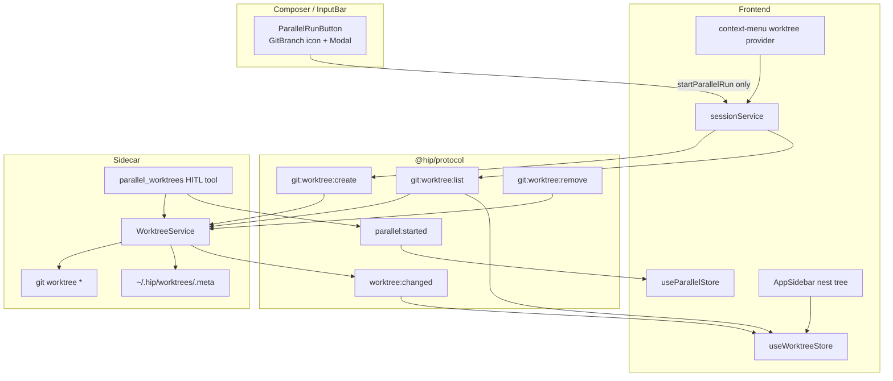
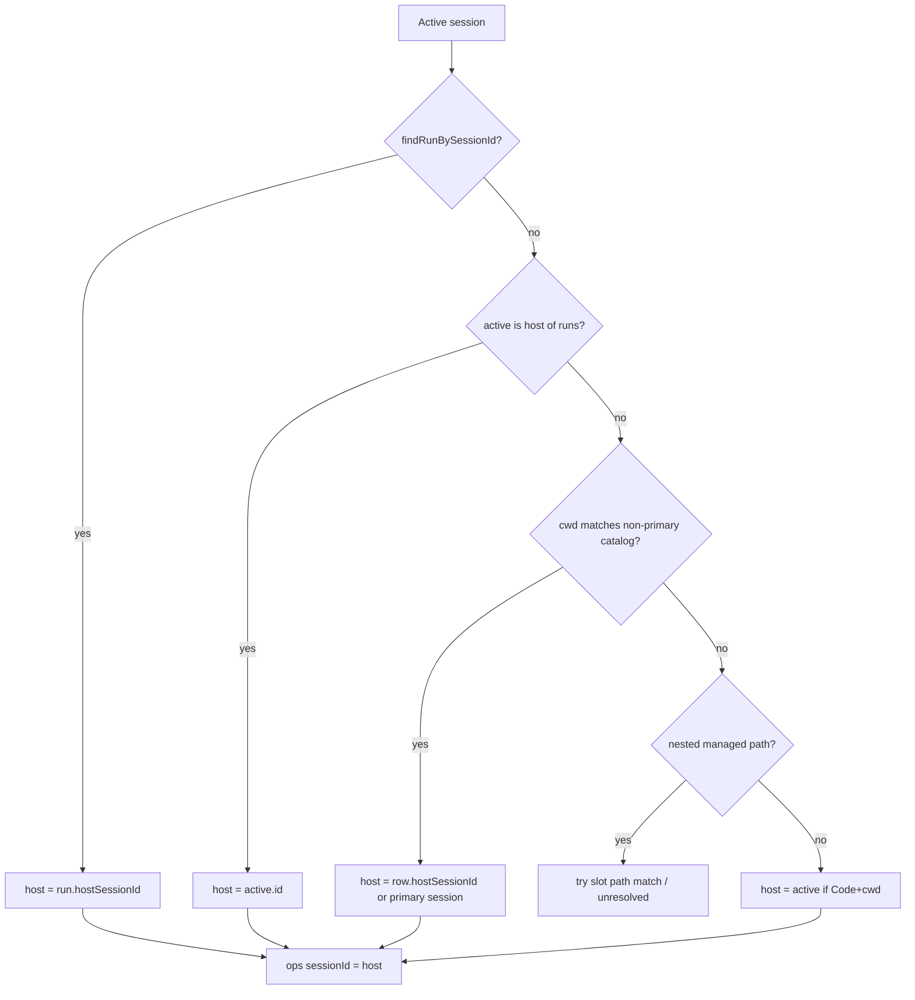
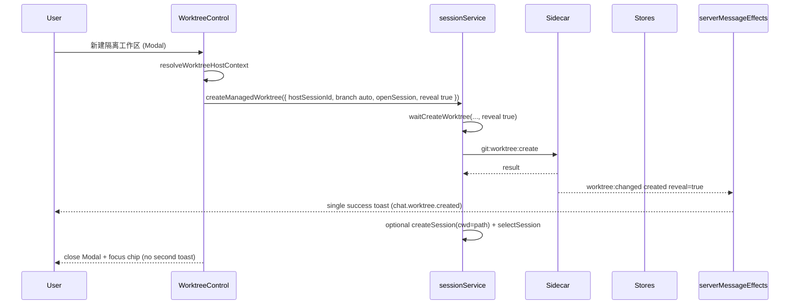
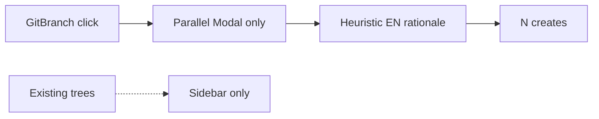
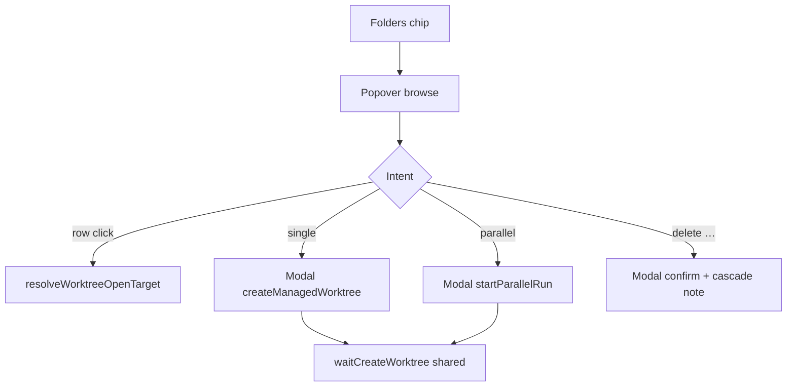

# Worktree Composer Control Upgrade — hip 输入框 Worktree 弹窗体验升级

| Field | Value |
|-------|-------|
| **Title** | hip Worktree 功能升级：输入框 Worktree 控制面重构 |
| **Author** | TBD |
| **Date** | 2026-07-19 |
| **Status** | Draft (user decisions locked — Code-only surface; unify create paths) |
| **Primary scope** | Composer 输入框 Worktree 控制面 UX + 文案 + 必要协议/服务接线 |
| **Workspace** | `/Users/lijiamin/data/my-github/hip` |
| **Builds on** | Worktree Studio spine (`WorktreeService`, `worktreeStore`, sidebar nest, `git:worktree:*`, `worktree:changed`); agent-decided parallel N; Orca-alignment behavior shipped in code (historical design doc removed from tree) |
| **Audience** | Product + frontend + sidecar |

---

## Overview

hip 已具备完整的 worktree **基础设施**：sidecar `WorktreeService` 统一 create/list/remove、managed 路径 `~/.hip/worktrees`、meta 文件、`worktree:changed` 事件、前端 `useWorktreeStore` 目录、侧边栏嵌套树、host fan-out（`sessionService.startParallelRun`）与 agent HITL 工具（`parallel_worktrees`）。

用户当前痛点集中在 **输入框旁的 Worktree 入口**——实现上即 `src/components/chat/ParallelRunButton.tsx`：一枚 `GitBranch` 图标按钮打开全屏式 `Modal`，仅支持「描述目标 → 启发式决定 N → 创建并行 worktree」。该表面的信息架构、交互形态和文案与用户对「工作区 / 隔离树」的心智模型严重错位。

本设计将输入框入口从 **「仅并行创建对话框」** 升级为 **「Worktree 控制面」（browse + create + switch + open + delete + parallel）**，复用现有 WorktreeService / protocol / store，**不** 从零重做 git worktree，也 **不** 复制完整 Orca Worktree Studio 壳。

**Revision focus (post-review):** host-session resolution algorithm, shell primitive (Popover browse + Modal forms), source-tag wire fix, switch/open target rules, closed v1 product defaults, cascade-honest delete copy, e2e testid continuity, shared create wait path.

---

## Background & Motivation

### Current architecture (grounded)



| Layer | Path | Today’s role |
|-------|------|--------------|
| Composer entry | `src/components/chat/ParallelRunButton.tsx` | **Only** host parallel fan-out modal |
| Input wiring | `src/components/chat/InputBar.tsx` | Code surface `leftSlot` includes `ParallelRunButton` |
| Chip pattern | `src/components/chat/ComposerChip.tsx` | Used by `ModelPicker` / `PermissionModePicker` / `PlanModeChip` — **WorktreeControl must reuse this** |
| Parallel store | `src/store/parallelStore.ts` | `runsForHost`, `findRunBySessionId`, slots; not a catalog |
| Catalog store | `src/store/worktreeStore.ts` | Managed + primary; hides ephemeral / `hip-bg-*` |
| Nesting | `src/lib/worktreeNesting.ts` | Slot/catalog sessions never top-level sidebar rows |
| Sidebar | `src/components/layout/AppSidebar.tsx` | Expand tree: parallel slots + catalog rows |
| Context menu | `src/components/context-menu/providers/worktree.ts` | Open / copy path / remove / force remove |
| Service | `packages/sidecar/src/session/worktree-service.ts` | Single create/list/remove pipeline |
| Handler create | `packages/sidecar/src/session/handlers/workspace.ts` | **Always** `source: 'protocol'` on `git:worktree:create` (verified) |
| Config | `packages/sidecar/src/session/worktree-config.ts` | Default `~/.hip/worktrees` |
| Preflight | `packages/sidecar/src/session/worktree-preflight.ts` | Dirty check; porcelain **not** on wire today |
| Protocol | `packages/protocol/src/messages.ts` | `git:worktree:{create,list,remove}` + `worktree:changed` + `parallel:started` |
| Agent tool | `packages/sidecar/src/session/tools/parallel-worktree.ts` | HITL n1–n4; hardcoded CN option labels; built from `tools/index.ts` |
| Heuristic | `src/lib/parallelCount.ts` | Local `suggestParallelCount`; rationale **English-only** |
| e2e | `e2e/specs/smooth-p5.spec.ts` | Depends on `parallel-run-button`, `parallel-run-prompt`, `parallel-run-suggestion` |
| CLI | `packages/cli/src/commands/worktree.ts` | create/list/remove |

### Diagnosis: input-box popup UX failures

Primary surface: **`ParallelRunButton`** (composer dock, Code surface only).

#### 1. Wrong product object (parallel ≠ worktree)

| Symptom | Evidence |
|---------|----------|
| Icon is `GitBranch` | Same metaphor as Studio **branch switcher** (`BranchSwitcher.tsx`) |
| Title/dialog only mention parallel | i18n `chat.parallel.*` — no browse / switch / single-isolate |
| Success path always creates N slots + sessions | `sessionService.startParallelRun` — never list existing trees |

User expectation: **see where I am, switch trees, create one isolation, maybe fan out**. Actual: **forced into a parallel-create form**.

#### 2. Modal vs lightweight control

- Uses full `Modal` for a composer-adjacent action.
- No browse of existing worktrees (unlike `ModelPicker` / `BranchSwitcher`).
- No keyboard-first list navigation.

#### 3. Copy system failures (zh-CN primary, mixed EN)

| Key / string | Problem |
|--------------|---------|
| `buttonTitle`: 「并行 worktree（由智能体决定数量）」 | Claims **agent**; host path is local heuristic only |
| `dialogHint`: 「不会自动启动模型」 | Engineer jargon |
| `agentSuggests` / rationale | False agency; English hardcodes in `parallelCount.ts` |
| HITL options | Hardcoded CN in sidecar — EN locale still Chinese |
| Context menu remove | No confirm; force unexplained |
| Catalog subtitle | Raw `source` enum leak |

#### 4. Missing interaction states

| State | Today |
|-------|-------|
| Loading list | N/A |
| Empty catalog | Sidebar hides chevron; popup no guidance |
| Non-git / no cwd | Button returns null without cwd; create fails later for non-git |
| Dirty remove | Preflight exists; UI toasts English error string; force is sibling menu |
| Switch / open | Catalog click **always selects host** (`CatalogWorktreeRow`) |

#### 5. Fragmented entry points

```text
Composer GitBranch  →  only parallel host fan-out
Agent HITL          →  parallel_worktrees
Sidebar nest        →  browse / open slots / catalog (partial)
Context menu        →  delete / copy / open
CLI                 →  create/list/remove (no UI)
```

Historical narrative (code behavior verified; commit messages not re-audited for this revision): composer parallel chip was dropped in favor of agent HITL, then host `ParallelRunButton` reappeared for smoothness P5 — a second, weaker parallel path rather than a true worktree hub.

#### 6. Create-flow product gaps

- No single-isolation create without parallel framing.
- Branch names always `hip-parallel-{runId}-{i}`.
- `autoSend: false` is good but next-step copy is weak.
- Partial parallel failure not surfaced per-slot in modal.

### Pain summary (user-facing)

1. 点开以为能管理/切换工作树，实际只能「再造一堆并行树」。
2. 文案同时撒谎（智能体）和夹生（worktree / 槽位 / 模型）。
3. 创建后不知道去哪继续；侧栏嵌套发现成本高。
4. 删除危险且无预检解释；强制删除并列无确认。
5. 与 Studio 分支切换图标撞车。

---

## Goals & Non-Goals

### Goals

| ID | Goal |
|----|------|
| **G1** | 输入框 Worktree 控制成为 **一级浏览 + 创建 + 切换** 入口（browse 用 Popover；表单/确认用 Modal） |
| **G2** | 信息架构清晰：当前工作区 → 已有隔离树列表 → 新建（单路 / 并行）→ 危险操作 |
| **G3** | **文案系统** 重写：zh-CN 为主，en/zh-TW 对齐；禁止协议枚举与英文 rationale 泄漏 |
| **G4** | 覆盖关键 UI 状态：loading / empty / non-git / creating / dirty-delete / error / ephemeral 隐藏说明 |
| **G5** | 接线现有 `WorktreeService` / `git:worktree:*` / `worktree:changed` / `useWorktreeStore`；协议缺口明确 |
| **G6** | 保留 agent `parallel_worktrees` HITL **入口** 与 host 并行探索 **入口**；创建语义尽快统一（D26）；HITL 文案 polish **不阻塞** first-ship chrome |
| **G7** | 首发可独立 review 的增量 PR；每 PR 可合并且不破既有 dogfood / `smooth-p5` |
| **G8** | 所有 list/create/remove 动作使用 **resolved host session**（见 § Host context） |
| **G9** | Host single + host parallel 共享 FE `waitCreateWorktree` / protocol create 路径（PR2 必做） |
| **G10** | Host parallel 与 agent `parallel_worktrees` **创建语义统一**（WorktreeService / source / reveal / 分支约定 / 错误面）— **不** 强制 UI 走 tool RPC（D26） |
| **G11** | WorktreeControl **仅 Code surface**（D25） |

### Non-Goals (first ship)

| Non-goal | Why |
|----------|-----|
| Full Orca terminal-centric Worktree Studio shell | Boil the ocean |
| CoW / fast-worktree engine | Performance later |
| Auto-merge / auto-PR / winner merge UX | Separate track |
| Server-side ParallelRun authority | Client store sufficient |
| Replacing session model | Sessions remain chat runtime |
| External worktree import inbox UI | Defer |
| User slider for N as primary UX | Heuristic only in v1 (D13) |
| Reworking sidebar topology / sidebar icon alignment | Composer-first; sidebar icon deferred |
| Multi-client worktree broadcast | Single-client WS |
| Durable free-typed `label` before protocol lands | Display via branch until PR7 |
| Opt-out of session cascade on delete | Cascade is source of truth (D15) |
| File-count dirty delete copy without wire porcelain | Soften until PR7 |
| Show WorktreeControl on Chat surface | **D25** — Code-only; hide on Chat |
| Force host UI through `parallel_worktrees` tool RPC | Unification is create/service semantics, not entry-point collapse |

---

## Proposed Design

### 0. Host context resolution (blocking algorithm)

Create/list/remove RPCs are keyed by `sessionId` whose sidecar session **`cwd` drives git worktree ops**. Context menu always passes nest **`hostSessionId`**. Composer control can open while the user is on:

- the **host** project session (cwd = primary),
- a **parallel slot** session (cwd = managed worktree),
- a **catalog-bound** Code session (cwd = managed worktree),
- or rarely an orphan managed-path session.

**All WorktreeControl actions MUST use a resolved host context — never pass an isolated session’s id as the git ops session without resolution.**

#### Pure helper (new: `src/lib/worktreeHostContext.ts`)

```ts
export interface WorktreeHostContext {
  /** Session id to pass to git:worktree:list|create|remove and startParallelRun hostSessionId. */
  hostSessionId: string
  /** Absolute primary/main tree path when known. */
  primaryPath?: string
  /** Active session cwd (may be isolated). */
  activeCwd?: string
  /** Active managed worktree path if user is on an isolation; undefined if on primary. */
  activeWorktreePath?: string
  isOnIsolated: boolean
  /** Parallel run containing active session, if any. */
  runId?: string
  /** True when host could not be resolved — disable create/delete. */
  unresolved: boolean
  unresolvedReason?: 'no_active' | 'no_host' | 'no_cwd'
}

/**
 * Resolve project host for Studio worktree ops.
 * Unit-test thoroughly — e2e remove already assumes ops session cwd is main repo.
 */
export function resolveWorktreeHostContext(input: {
  activeSession: { id: string; config: { cwd?: string; surface?: string } } | null
  sessions: Array<{ id: string; config: { cwd?: string } }>
  runs: ParallelRun[]          // useParallelStore.getState().runs
  catalog: CatalogWorktree[]   // Object.values(byId) or catalogForHost candidates
}): WorktreeHostContext
```

#### Resolution order

1. **No active session** → `{ unresolved: true, unresolvedReason: 'no_active' }`.
2. **Parallel store:** `findRunBySessionId(active.id)`  
   - If found and `run.hostSessionId` present → host = that id.  
   - `activeWorktreePath` = matching slot’s `worktreePath` if active is a slot session.
3. **Active is host of some run:** `runsForHost(active.id).length > 0` or any run with `hostSessionId === active.id` → host = active.id; `isOnIsolated = false` (even if catalog lists trees under it).
4. **Catalog / path:** if `active.config.cwd` matches a **non-primary** catalog path (pathKey equality):  
   - Prefer `row.hostSessionId` if set.  
   - Else find a session whose cwd equals **primary** catalog path for same `repoKey` (or first Code session with primary cwd).  
   - Else find any Code session with cwd **not** under managed worktree root that shares repo (best-effort: same primaryPath from catalog primary row).
5. **Managed path without catalog:** `isManagedWorktreePath(cwd)` true → try find host via any run whose slot path matches; else unresolved.
6. **Default:** treat active as host if it has cwd and is **not** nested (`!collectNestedWorktreeSessionIds` contains active) → host = active.id.
7. **Still unknown** → `{ unresolved: true, unresolvedReason: 'no_host' }`.

#### Derived fields

| Field | Rule |
|-------|------|
| `primaryPath` | Catalog row `isPrimary` for host’s repo; else host session `config.cwd` when `!isOnIsolated` |
| `activeWorktreePath` | If active cwd pathKey equals a non-primary managed path → that path; else undefined |
| `isOnIsolated` | `!!activeWorktreePath` |

#### UI when `unresolved`

- Chip still visible if Code + cwd (user can see path).
- Popover opens with **banner**: 「无法确定主工作区，创建/删除已禁用」.
- Create single / parallel / delete **disabled**.
- List may still show catalog rows filtered by path if any; refresh disabled or no-ops.
- Switch to a known host session from sidebar recovers.

#### Mandatory call sites

| Action | Uses |
|--------|------|
| `requestWorktreeList` | `hostSessionId` |
| `createManagedWorktree` | `hostSessionId` |
| `startParallelRun({ hostSessionId, baseCwd })` | `hostSessionId`; `baseCwd = primaryPath ?? host.cwd` |
| `removeWorktree` | `hostSessionId` + target `worktreePath` |
| Chip label “当前” | `isOnIsolated` + active vs primary paths |
| `catalogForHost` / `runsForHost` | `hostSessionId` |



---

### 1. Interaction model — Composer Worktree Control

Replace `ParallelRunButton` with **`WorktreeControl`**.

#### Placement & visibility (hide vs disable)

| Condition | Behavior |
|-----------|----------|
| Chat surface / not Code | **Hide** entirely — **D25 user lock**: Code-only; never mount on Chat |
| Code, no `config.cwd` | **Hide** (today `ParallelRunButton` returns null) |
| Code + cwd, `isProjectPathBlocked` | **Show chip disabled**; tooltip 「项目路径不可用」; open blocked |
| Code + cwd, host `unresolved` after open | Open allowed; create/delete disabled + banner |
| Code + cwd, empty catalog after list | Popover openable; show **empty CTA** (not non-git — see below) |
| Code + cwd, create fails as non-git | Modal/popover shows **non-git banner**; further create disabled until host/cwd changes |

Do **not** gate the chip solely on `projectPathBlocked` the same way as submit — blocked path disables **actions**, with explicit tooltip.

#### Non-git detection (v1 — wire constraint)

**Empty list ≠ non-git.** Today’s wire path:

- `WorktreeService.list` returns `{ ok: false, worktrees: [], error }` when porcelain fails (e.g. not a git repo).
- Handler `git:worktree:list` **discards** `ok`/`error` and only emits `{ type: 'git:worktree:list:result', sessionId, worktrees }` (array only; often empty).
- Protocol `git:worktree:list:result` has **no** `ok`/`error` fields.

Therefore on popover open, non-git is **indistinguishable from an empty managed catalog**.

| v1 rule | Behavior |
|---------|----------|
| List returns `[]` (or only primary) | Treat as **Empty** — empty CTA 「还没有隔离工作区」; create remains **enabled** |
| Single/parallel **create** fails with non-git / not-a-repo error | Set local UI flag `nonGit = true` → banner 「当前文件夹不是 git 仓库…」; disable further create; do **not** invent list-error UX |
| List transport timeout / wait fail | **Error** state (retry) — not non-git |
| Future (optional, not v1 ship) | Additive `ok?`/`error?` on `git:worktree:list:result` + handler plumb — out of first-ship scope to avoid PR3 creep |

**Implementers must not** show a non-git banner solely because the catalog is empty after list hydrate.

#### Shell decision (D17) — Popover browse + Modal forms

**There is no `Popover` component and no `@radix-ui/react-popover` in the repo today.** Composer pickers use `DropdownMenu modal={false}` for **simple lists** (`ModelPicker`, `PermissionModePicker`, `BranchSwitcher`). Form-heavy content inside Radix dropdowns fights `onSelect` close, focus loss, and nested Modal pointer-events locks.

**Chosen shell (v1):**

| Surface | Primitive | Rationale |
|---------|-----------|-----------|
| Trigger | `ComposerChip` + lucide **`Folders`** (D3) | Match ModelPicker leftSlot pattern |
| Browse hub (current + list + action buttons) | **New thin `Popover`** wrapping `@radix-ui/react-popover` in `src/components/ui/Popover.tsx` | Anchored, non-modal (`modal={false}` equivalent), survives multi-section layout; width ~320–360px |
| Single create form | **`Modal`** opened from popover action | Text fields + async create; close popover first |
| Parallel explore form | **`Modal`** (evolved today’s ParallelRunButton modal) | Known pattern; close popover first |
| Delete confirm | **`Modal`** | Danger + dirty progressive disclosure |

**Interaction rules:**

| Event | Behavior |
|-------|----------|
| Outside click / Escape on Popover | Close if not waiting on list only; if a child Modal is open, ignore (Modal owns dismiss) |
| Open create/parallel/delete Modal | **Close popover first**, then open Modal (avoids stacking pointer-events locks — same class of bug as BranchSwitcher comment) |
| Escape on Modal during `creating` | **Blocked** (busy); Cancel button disabled while `busy` (today’s ParallelRunButton pattern) |
| Focus return | After Modal close → focus `ComposerChip` trigger (`data-testid` stable — see e2e) |
| Nested Menu (`…` on row) | Use `DropdownMenu modal={false}` **inside** popover content; item that opens delete Modal closes both menus first |

**Fallback if Popover addition is blocked in review:** Alt E — single sectioned Modal hub (Browse | Create | Parallel). Documented in Alternatives; not preferred because every open interrupts typing more than an anchored popover list.

#### Trigger chip (D3, D11)

| Element | Spec |
|---------|------|
| Icon | lucide **`Folders`** (v1 locked). Sidebar may keep `GitBranch` on nest rows — **icon alignment deferred** (Non-Goal) |
| Label (D11) | Dynamic short: `主工作区` when `!isOnIsolated`; else isolated `label \|\| branch \|\| shortWorktreeLabel` |
| Tooltip | Full path of active cwd + one-line purpose |
| aria-expanded | true when popover open |
| Badge | Count of non-primary visible trees under host (optional) |
| testid | Keep **`parallel-run-button`** on the chip through PR5 for e2e (alias); may add `worktree-control-chip` in parallel |

#### Browse Popover IA

```text
┌─────────────────────────────────────────────┐
│ 当前 · 主工作区 · main                      │
│ ~/…/hip                               [复制] │
├─────────────────────────────────────────────┤
│ 隔离工作区                          [刷新]   │
│ ○ feat-auth · hip-parallel-ab12-0      […]  │
│ ○ hip-iso-x7k2                         […]  │
│ (空) 还没有隔离工作区                        │
├─────────────────────────────────────────────┤
│ ＋ 新建隔离工作区…     → opens Modal         │
│ ⧉ 并行探索…            → opens Modal         │
├─────────────────────────────────────────────┤
│ 在侧栏中管理 · 后台临时隔离不会出现在此列表   │
└─────────────────────────────────────────────┘
```

**Sections:** Current · List · Create actions · Footer.

#### Primary row click + secondary actions (D10, row IA)

**Row primary click** → `resolveWorktreeOpenTarget` (below).  
**Secondary:** overflow **`…`** menu per row (not five hover icons). Menu items reuse logic shared with `worktree` context-menu provider:

| Menu item | When | Action |
|-----------|------|--------|
| 打开对话 | always | same as open target; if `kind: 'none'`, offer create session at path |
| 在侧栏中显示 | always | expand host tree + `setPendingReveal(path)` |
| 复制路径 | always | clipboard |
| 标为优选 | only if parallel slot with `sessionId` | `selectParallelWinner` |
| 删除… | always (non-primary) | close menus → Delete Modal |

No right-click required in popover; sidebar keeps existing DeclarativeContextMenu.

#### Switch / open target algorithm (D10)

Pure helper `src/lib/worktreeOpenTarget.ts` — unit tested:

```ts
export type WorktreeOpenTarget =
  | { kind: 'select'; sessionId: string }
  | { kind: 'none'; reason: 'agent_task_only' | 'no_session'; 'primary' }

export function resolveWorktreeOpenTarget(input: {
  path: string
  /** Explicit host for primary / fallback select — required parameter, not prose-only. */
  hostSessionId: string
  isPrimary?: boolean
  /** From parallel slot when known */
  slotSessionId?: string
  slotTaskId?: string
  /** Meta field if sidecar ever writes it — unused in UI today */
  boundSessionId?: string
  /**
   * Domain sessions. `status` / `updatedAtMs` match sessionStore when present.
   * Both optional: missing status → not running; missing updatedAtMs → skip recency.
   */
  sessions: Array<{
    id: string
    title: string
    config: { cwd?: string }
    status?: 'idle' | 'running' | 'error' | string
    updatedAtMs?: number
  }>
  nestedSessionIds: Set<string>
}): WorktreeOpenTarget
```

**Ordered rules:**

1. If `isPrimary` → `{ kind: 'select', sessionId: input.hostSessionId }` (`hostSessionId` is an **explicit parameter**).
2. If `slotSessionId` present and session still exists in `sessions` → **select that session**.
3. If `boundSessionId` present and session exists → select it (**future**; sidecar does not write this today — do not invent writes in v1).
4. Among `sessions` with `pathKey(cwd) === pathKey(path)`:
   - Prefer id ∈ `nestedSessionIds` (slot-like).
   - If multiple: prefer `status === 'running'`; else if any have `updatedAtMs`, pick **max updatedAtMs**; else **stable sort by id** and take first (deterministic).
   - If `status` omitted on all → skip running preference; if `updatedAtMs` omitted on all → id sort only.
5. If only `slotTaskId` (agent HITL background worker, no session) → `{ kind: 'none', reason: 'agent_task_only' }` — toast 「该方案由后台任务运行，请从侧栏查看进度」; do **not** create a phantom session on bare click.
6. Else → `{ kind: 'none', reason: 'no_session' }` — toast with CTA 「在此工作区打开对话」 that creates Code session at path and selects it.

**Click also:** set `pendingRevealPath` and ensure host sidebar tree expanded (best-effort UX; not a second navigation). Does **not** change host selection when a slot session is selected.

---

### 2. Create flows

#### Create-path unification (D26 / G9 / G10) — user lock

**Product decision:** host parallel form and agent `parallel_worktrees` must **not** keep diverging create semantics long-term. Unify **creation**, not entry points.

| Layer | Host (composer / `startParallelRun`) | Agent (`parallel_worktrees` HITL) | Unified contract |
|-------|--------------------------------------|-----------------------------------|------------------|
| Entry | WorktreeControl → Parallel Modal | Tool + PermissionModal HITL | **Stay dual** (different UX triggers) |
| Disk create | Protocol `git:worktree:create` → handler → `WorktreeService.create` | Direct `WorktreeService.create` in tool | **Same service**; same opts shape |
| FE wait | `waitCreateWorktree` (PR2) | N/A (in-process) | Host **must** use wait helper |
| `reveal` | Parallel slots **`false`** (D23 wire) | Tool already passes **`reveal: false`** | Both suppress per-slot effects toast |
| `source` (after PR7) | `host_fanout` (parallel) / `protocol` (single) | `parallel` | Distinct sources, set **explicitly** — never silent default for product paths |
| Branch / pathKey | Align prefixes (below) | Today `hip-p-{runShort}-{i}` + `pathKey: runId/branch` | Shared naming rules |
| Errors | Create Modal toast / parallel summary | Tool return string | Map dirty / fail messages consistently where user-visible |

**What “unify” is NOT:** routing host UI through the tool RPC or collapsing HITL and host into one button.

**Shared branch / pathKey conventions (v1 product parallel):**

| Kind | Branch pattern | pathKey | Notes |
|------|----------------|---------|-------|
| Host parallel slot | `hip-p-{runShort}-{i}` | `{runId}/{branch}` | Align host `planParallelFanout` / `startParallelRun` with agent tool (today host uses `hip-parallel-*` — **change in PR2/PR5** to match agent) |
| Agent parallel slot | `hip-p-{runShort}-{i}` | `{runId}/{branch}` | Keep; already good |
| Single isolation | `hip-iso-{shortId}` | branch or `iso/{branch}` | Host-only product path |

**Sidecar internal helper (PR2, recommended):** extract a thin `createManagedProductWorktree(opts)` (or document that both call sites use identical `WorktreeService.create` field sets) used by:

1. `handlers/workspace.ts` `git:worktree:create` (pass-through `reveal` / later `source`/`label`)
2. `tools/parallel-worktree.ts` loop (already `create` + `reveal: false` + `source: 'parallel'`)

No second invent of path sanitize / meta / notify wiring.

#### Shared FE create wait path (G9)

```ts
// sessionService internal / exported for tests
async waitCreateWorktree(
  hostSessionId: string,
  params: {
    branch: string
    createBranch?: boolean
    baseRef?: string
    pathKey?: string
    label?: string
    source?: WorktreeSource  // after protocol lands — see § API
    /** Single create: true (default). Parallel slots: false (D23). */
    reveal?: boolean
  },
): Promise<{ ok: boolean; path?: string; id?: string; error?: string }>
```

- Sends `git:worktree:create` **including `reveal`** (PR2 wire — required, not optional), waits for matching `git:worktree:create:result`.
- On success: `requestWorktreeList(hostSessionId)`.
- **`createManagedWorktree`** and **`startParallelRun` loop** both call this — no duplicated wait logic (PR2 acceptance).
- Parallel fan-out branch/pathKey **must** follow the shared convention table (D26).

#### Success toast ownership (D23) — avoid double toast

**Ground truth today (broken for parallel until PR2 wire):**

- `WorktreeService.create` defaults `reveal: createOpts.reveal ?? true` and passes it into `worktree:changed`.
- Protocol client message `git:worktree:create` has **no** `reveal` field (server event `worktree:changed` already has `reveal?: boolean`).
- Handler always calls `WorktreeService.create({ cwd, branch, pathKey, source: 'protocol', hostSessionId })` — **never** passes `reveal` → every product create toastable with `reveal: true`.
- `serverMessageEffects` toasts `chat.worktree.created` when `kind === 'created' && reveal`.

**Frontend-only `waitCreateWorktree({ reveal: false })` is a no-op until protocol + handler plumb `reveal`.** D23 therefore **hard-requires wire pass-through in PR2** (not deferred to PR7).

| Rule | Spec |
|------|------|
| **Wire (PR2, blocking for D23)** | Additive `reveal?: boolean` on client `git:worktree:create`; handler `reveal: msg.reveal` (omit → service default **true**); unit/integration test that `reveal: false` yields `worktree:changed` without toastable reveal (or `reveal: false` on event) |
| **Single owner of success toast** | **`serverMessageEffects` only** for product creates that emit `worktree:changed` with `reveal: true` |
| **WorktreeControl / create Modal** | On success: close Modal, focus chip, optional session open — **do not** call `toast.success` for create ready |
| **`waitCreateWorktree`** | Sends `reveal` on the create message; single path **`reveal: true`**; parallel slots **`reveal: false`** |
| **Parallel fan-out** | **Chosen (b):** every slot `reveal: false`; host `startParallelRun` / Parallel Modal owns **one** summary success/error toast. Without PR2 wire, this is **unimplementable** — do not ship PR5 criterion 10 without it. |
| **Error toasts** | Still local (create Modal / parallel Modal) — effects do not toast create failures |

PR2 acceptance **must** include protocol + handler `reveal` pass-through + tests; PR4/PR5 must not reintroduce double success toasts.

#### 2a. Single isolation（新建隔离工作区）

**Product intent:** one clean tree without parallel framing.



**Form fields (v1 locked — D12, D9):**

| Field | v1 behavior |
|-------|-------------|
| 名称 / label | **Not shown as durable field.** Optional display preview of auto branch short name only |
| 分支名 | **Auto-only:** `hip-iso-{nanoid(6)}` (safe charset). **No free-typed branch in v1** — server remains authority; UI does not import sidecar `isSafeBranchName` |
| 基于 | HEAD fixed |
| 创建后 | **Default on:** 打开新对话 (`openSession: true`). Toggle to 「仅创建目录」 allowed |
| source (wire) | `protocol` (manual isolation) once optional source field exists; until then all protocol creates look like `protocol` — **do not display source enum in v1 chrome** (D18) |

#### 2b. Parallel explore（并行探索）

| Keep | Change |
|------|--------|
| `suggestParallelCount` + clamp 1–4 | Return `reasonCode`; UI maps i18n (D13: **no manual N steppers** in v1) |
| `autoSend: false` | Copy: 「只准备工作区，不会自动发消息」 |
| `startParallelRun` | Uses `waitCreateWorktree` per slot with **`reveal: false`**; one summary toast; `hostSessionId` + `baseCwd` from host context |
| Goal textarea | Prefill from composer draft |
| Shell | **Modal** (not nested in popover) |
| After success (D14) | **Keep today:** focus first ready slot session; set sidebar projects |

Optional later: advanced disclosure for N override — **out of v1**.

---

### 3. Delete / archive flow (cascade honesty — D15)

On `worktree:changed` `removed`, `serverMessageEffects` already runs `collectWorktreeCascadeDeleteIds` and deletes bound slot sessions. Context menu may also `deleteSession(slotSessionId)`.

**v1 confirm Modal — no false checkbox:**

```text
删除隔离工作区「{{label}}」？

路径：…
分支：…

关联的隔离对话可能会一并关闭（系统会自动清理绑定到该目录的对话）。

[若 dirty — after failed non-force or errorCode]
⚠ 检测到未提交更改。强制删除将永久丢弃这些更改。

[取消]  [删除]  or  [强制删除并丢弃更改]
```

| Rule | Spec |
|------|------|
| Default button | Non-force `removeWorktree(host, path, false)` |
| Dirty | Detect via `errorCode === 'WORKTREE_DIRTY'` (PR7) or interim `/dirty|uncommitted/i` on `error` string |
| Dirty copy v1 | **「检测到未提交更改」** — **no file count** until `dirtySummary` on wire (Issue 10) |
| Cascade | **Informational only** — do not promise sessions remain |
| Checkbox 「同时关闭关联对话」 | **Not in v1** — would lie when cascade always runs for slot bindings |
| Host protection | Unchanged: never cascade-delete host project session |

**Archive:** Non-goal.

---

### 4. UI states matrix

| State | Trigger | UI |
|-------|---------|-----|
| **Hidden** | Not Code / no cwd | No chip |
| **Disabled chip** | project path blocked | Chip disabled + tooltip |
| **Idle closed** | Default | Chip: D11 short label |
| **Loading** | Open popover → list | Skeleton; refresh spinner |
| **Ready** | list result with ≥1 non-primary row | Rows + create enabled (if !unresolved && !nonGit flag) |
| **Empty** | List hydrated; zero non-primary managed trees | Empty CTA → single create Modal; create **still enabled** (empty ≠ non-git) |
| **Unresolved host** | resolve failed | Banner; create/delete off |
| **Non-git** | **Only** after create (or other op) fails with not-a-repo / non-git error; local `nonGit` flag | Banner; create off. **Never** from empty `list:result` alone |
| **Creating** | Modal busy | Progress; dismiss blocked |
| **Created** | success | Effects toast (single create) or one summary toast (parallel); reveal; focus per D9/D14; **no double toast** (D23) |
| **Partial parallel** | some slots error | Footer lists failures; keep successes; one summary toast |
| **Dirty delete** | non-force fails | Upgrade to force button + warning (no N files) |
| **Ephemeral** | bg isolates | Never listed; footer hint |
| **Error** | list/create transport timeout | Inline + 重试 (not non-git) |

---

### 5. Copy system

#### Terminology (zh-CN primary) — D16

| Concept | zh-CN | en | Avoid in chrome |
|---------|-------|-----|-----------------|
| Product object | 隔离工作区 | Isolated workspace | bare “worktree” |
| Primary | 主工作区 | Main workspace | |
| Parallel | 并行探索 | Parallel explore | 并行 worktree |
| Track | 一路 / 方案 | Track / variant | 槽位 |
| Heuristic N | 建议路数 | Suggested tracks | 智能体建议 (host path) |
| Force delete | 强制删除（丢弃未提交更改） | Force delete (discard changes) | bare 强制删除 |
| autoSend false | 不会自动开始对话 | Won’t start chat automatically | 不会自动启动模型 |

Loanword: **zh chrome uses 隔离工作区**; “worktree” only in help/advanced/docs.

#### Namespace (PR1 final — no thrash)

Introduce **`chat.worktreeControl.*` as final keys in PR1**. Map temporary ParallelRunButton to these keys immediately. Leave old `chat.parallel.*` unused until PR5 cleanup (one deletion pass). Keep `rationale` English string on suggest for unit tests; UI **must not** render it.

```ts
// suggestParallelCount returns reasonCode for UI
export type ParallelSuggestReason =
  | 'empty' | 'compare' | 'three' | 'four' | 'single' | 'default'
```

#### Source labels (D18) — do not ship lying map

**Today:** handler hardcodes `source: 'protocol'` for all `git:worktree:create` (including `startParallelRun`). Agent tool uses `source: 'parallel'`. Therefore mapping `host_fanout` → 「并行探索」 would **lie** for host fan-out trees.

**v1 chrome:** show **branch / label / path only** — **no source enum subtitle** in WorktreeControl or sidebar catalog until wire fix lands.

**Wire fix (PR7 / protocol):** optional `source?: WorktreeSource` on `git:worktree:create`; handler passes through to `WorktreeService.create`. Call sites:

| Caller | source |
|--------|--------|
| Single create UI / CLI default | `protocol` |
| `startParallelRun` / waitCreateWorktree from fan-out | `host_fanout` |
| Agent `parallel_worktrees` | `parallel` (already) |
| `git_worktree_create` tool | `agent_tool` (already via service) |

Only **after** wire fix: optional humanized source subtitle via i18n map.

#### HITL i18n (G6 polish — non-blocking for first ship)

**Construction site:** `packages/sidecar/src/session/tools/index.ts` → `buildParallelWorktreeTools({ cwd, sessionId, requestChoice, ... })` when `profile.toolPolicy.allowParallelWorktrees`. Options’ `name` fields are shown by `PermissionModal` as server-provided strings.

**Chosen approach:** **client-side rewrite by `optionId`** (`n1`–`n4`, `reject`) in permission UI when `kind === 'parallel_worktrees'` (or title/kind match). App owns i18n; no Node i18n bundle required. Sidecar may keep CN strings as fallback labels.

- Minimal map can ship with PR1 terminology keys.
- Full HITL polish remains PR8; **not** required for success criterion 5 (composer chrome).

---

### 6. Wiring & protocol gaps

#### Already sufficient

| Capability | API |
|------------|-----|
| List | `requestWorktreeList` → store |
| Live updates | `worktree:changed` |
| Parallel create | `startParallelRun` (must use shared wait) |
| Remove + preflight | `removeWorktree` |
| Visibility | `isCatalogVisible` KD14 |
| Cascade | `collectWorktreeCascadeDeleteIds` |

#### Gaps

| Gap | Severity | Proposal |
|-----|----------|----------|
| Host context helper | **Critical** | `resolveWorktreeHostContext` — PR3 hard requirement |
| Open target helper | **Major** | `resolveWorktreeOpenTarget` — PR3 |
| Shared `waitCreateWorktree` | **Major** | PR2 frontend helper for single + parallel |
| **`reveal` on create wire** | **Major (D23)** | **PR2 (blocking)** — protocol + handler pass-through + test; not deferred to PR7 |
| Optional `source` on create | **Major** for honest labels | PR7; until then no source UI |
| Optional `label` on create | Low | PR7; v1 display uses branch |
| `errorCode` / `dirtySummary` on remove | Medium | PR7; PR6 string-match dirty without file count |
| List `dirty` | Low | Skip; check at delete time |
| List `ok`/`error` on wire | Low for v1 | **Not required first ship** — empty list ≠ non-git; create-fail sets non-git (see § Non-git detection). Optional later additive on `list:result` |
| `boundSessionId` writes | Low | Future; open target ready if present |
| Double create toast | Medium if ignored | **D23** — needs `reveal` wire (PR2) + effects/UI ownership |

**Protocol additive:**

```ts
// git:worktree:create — additive
{
  type: 'git:worktree:create'
  sessionId: string
  branch: string
  createBranch?: boolean
  baseRef?: string
  pathKey?: string
  label?: string              // PR7
  source?: WorktreeSource     // PR7 — handler default 'protocol'
  reveal?: boolean            // **PR2 (D23)** — omit/true → service default true; parallel false
}

// git:worktree:remove:result — additive
{
  type: 'git:worktree:remove:result'
  sessionId: string
  ok: boolean
  error?: string
  errorCode?: 'WORKTREE_DIRTY' | 'NOT_MANAGED' | 'NOT_FOUND' | 'UNKNOWN'
  dirtySummary?: string  // optional porcelain; enables file-count copy later
}

// Optional later (not v1): git:worktree:list:result
// { type: 'git:worktree:list:result'; sessionId; worktrees; ok?: boolean; error?: string }
```

---

### 7. Before / after flows

#### Before



#### After



---

### 8. Component structure

```text
src/components/ui/Popover.tsx              # thin Radix wrapper (PR3)
src/lib/worktreeHostContext.ts             # resolveWorktreeHostContext + tests
src/lib/worktreeOpenTarget.ts              # resolveWorktreeOpenTarget + tests
src/components/chat/
  WorktreeControl/
    WorktreeControl.tsx                    # ComposerChip + Popover shell
    WorktreeControl.test.tsx
    WorktreeList.tsx
    WorktreeCreateSingleModal.tsx
    WorktreeParallelModal.tsx              # evolved ParallelRunButton body
    WorktreeDeleteDialog.tsx
  ComposerChip.tsx                         # reuse as trigger
  ParallelRunButton.tsx                    # removed in PR5 after testid move
```

Shared delete helper used by context menu provider + delete dialog.

---

### 9. Accessibility

| Rule | Spec |
|------|------|
| Trigger | `aria-haspopup="dialog"`, `aria-expanded`, labelled by chip text |
| List | `role="listbox"` or list of `option`/`menuitem`; **ArrowUp/Down** move highlight; **Enter** opens target; **Home/End** jump |
| Typeahead | Optional v1.1; not required |
| `…` menu | Standard menu keyboard via DropdownMenu |
| Focus restore | Modal/Popover close → chip |
| Creating | `aria-busy` on confirm button |
| Live region | Toast already handles success/error |

---

### 10. Risks

| Risk | Severity | Mitigation |
|------|----------|------------|
| Scope creep | High | Non-goals + closed D11–D18 |
| Host mis-resolution | Critical | Pure helper + unit tests + unresolved banner |
| Popover/Modal pointer lock | Medium | Close popover before Modal; `modal={false}` |
| Dual create drift | Medium | **D26**: FE wait + sidecar product create helper; aligned branch/source/reveal |
| Source label lies | Major | No source UI until optional source on create |
| e2e mid-stack break | Major | Keep parallel testids until PR5 |
| Cascade vs checkbox lie | Major | Informational copy only |
| Partial parallel fail | Medium | Per-slot errors in Modal footer |

---

## API / Interface Changes

### Frontend

```ts
// sessionService
waitCreateWorktree(
  hostSessionId: string,
  params: {
    branch: string
    createBranch?: boolean
    baseRef?: string
    pathKey?: string
    label?: string
    source?: WorktreeSource
    /** Default true for single create (effects toast). Parallel slots: false (D23). */
    reveal?: boolean
  },
): Promise<CreateResult>

createManagedWorktree(opts: {
  hostSessionId: string
  branch: string              // auto-generated by caller
  createBranch?: boolean      // true for iso
  pathKey?: string
  label?: string              // ignored until protocol; do not pretend durable in UI
  source?: WorktreeSource     // 'protocol' when supported
  openSession?: boolean       // default true
  reveal?: boolean            // default true; UI must not toast success when true (D23)
}): Promise<{ ok: boolean; path?: string; id?: string; sessionId?: string; error?: string }>

// startParallelRun: waitCreateWorktree per slot with reveal: false;
// one summary toast; pass source: 'host_fanout' when supported
```

### Branch validation (v1)

**No frontend port of `isSafeBranchName`.** Auto-generate `hip-iso-{id}` / parallel `hip-parallel-{runId}-{i}` only. Server rejects unsafe names; show `error` toast.

### Protocol / sidecar

Additive fields above, **landed by PR**:

| Field | PR | Handler |
|-------|-----|---------|
| `reveal?: boolean` | **PR2** (D23 blocking) | `reveal: msg.reveal` → `WorktreeService.create` (omit → service default `true`) |
| `source?: WorktreeSource` | PR7 | `source: msg.source ?? 'protocol'` |
| `label?: string` | PR7 | pass through to create opts |
| remove `errorCode` / `dirtySummary` | PR7 | map `WorktreeDirtyError` |

**PR2 handler sketch (mechanical):**

```ts
const r = await svc.create({
  cwd,
  branch: msg.branch,
  pathKey: msg.pathKey,
  source: 'protocol', // PR7: msg.source ?? 'protocol'
  hostSessionId: msg.sessionId,
  ...(msg.reveal !== undefined ? { reveal: msg.reveal } : {}),
})
```

---

## Data Model Changes

None required for first ship beyond optional meta `source` correctness when create passes it.

v1 UI must **not** claim label durability before PR7.

---

## Alternatives Considered

### Alt A — Only rewrite copy of `ParallelRunButton`

Reject as sole fix: wrong IA remains.

### Alt B — Full Orca Studio panel

Defer: ignores composer pain; large scope.

### Alt C — Composer popover hub + modal forms (**chosen**)

Browse anchored; forms in Modal; reuses services.

### Alt D — Remove host fan-out; agent HITL only

Reject as sole entry: regresses host dogfood. **D26 keeps dual entry**, unifies **create** only.

### Alt E — Sectioned Modal hub (Browse \| Create \| Parallel)

| Pros | Cons |
|------|------|
| Reuses existing `Modal`; no new Popover dep | Every open is heavy; worse for “quick switch” |
| Avoids form-in-dropdown issues entirely | Same interrupt as today’s parallel-only modal for browse |

**Role:** **v1 fallback** if Popover addition is rejected in code review. Preferred path remains Alt C hybrid. If Alt E is activated, keep the same host/open/delete algorithms and testids.

---

## Security & Privacy Considerations

| Topic | Handling |
|-------|----------|
| Force delete | Confirm + dirty warning; never default force |
| Managed-dir gate | Sidecar rejects outside `HIP_WORKTREES_DIR` |
| Session cascade | Informational honesty; host protected |
| Path disclosure | Local desktop; tooltip full path OK |
| Secrets | No new network |

---

## Observability

Latency targets are **dogfood stopwatch / manual** expectations, not automated p95 SLOs:

| Op | Manual target |
|----|----------------|
| List on popover open | Comfortable &lt; ~300ms on mid repos |
| Single create | &lt; ~2s |
| Parallel N=2 | &lt; ~5s |
| Remove clean | &lt; ~2s |

Optional: debug-only duration log on list open if an existing debug flag is already used in chat — **not required**.

---

## Rollout Plan

No feature flags. Incremental PR merge; revert UI PR if needed.

**e2e continuity:** `e2e/specs/smooth-p5.spec.ts` must stay green across PR3–PR5. Keep `data-testid="parallel-run-button"`, `parallel-run-prompt`, `parallel-run-suggestion` (+ `data-suggest-n`) until the PR that intentionally migrates e2e.

**Testing:** unit host/open helpers; component WorktreeControl; existing store/nesting tests; dogfood non-git / dirty delete / N=1 and N=3.

---

## Key Decisions

| # | Decision | Choice | Rationale |
|---|----------|--------|-----------|
| **D1** | Primary surface | WorktreeControl hub replaces parallel-only button | User pain is IA |
| **D2** | Parallel entry remains | Host Modal + agent HITL (dual entry); create unified (D26) | UX triggers differ; disk create must not diverge |
| **D3** | Icon | lucide **`Folders`** on chip | Avoid BranchSwitcher clash; sidebar icon deferred |
| **D4** | Language | zh-CN primary; reasonCode for heuristic | Match i18n |
| **D5** | Single create | First-class Modal flow | n=1 parallel is poor metaphor |
| **D6** | Delete | Confirm Modal; progressive force; cascade note | Preflight exists; no lying checkbox |
| **D7** | Protocol | Additive `source`/`label`/`errorCode` | Compatibility |
| **D8** | Scope ceiling | No Orca shell / archive / import | Ship UX win |
| **D9** | Session on single create | Default **open new Code session** | Discoverability |
| **D10** | Open/switch | `resolveWorktreeOpenTarget` ordered rules | Fix host-only catalog click |
| **D11** | Chip label | Dynamic short (`主工作区` / isolated label); tooltip full path | Scannable |
| **D12** | Branch naming | Auto `hip-iso-{shortId}` only; no free-typed branch v1 | Server validates; no FE sanitize port |
| **D13** | Parallel N | Heuristic only; no steppers v1 | Align Non-Goals |
| **D14** | After parallel | Focus first ready slot (today) | No behavior surprise |
| **D15** | Cascade | Informational copy; no opt-out checkbox v1 | Cascade is source of truth |
| **D16** | Loanword | 隔离工作区 in chrome; worktree in help only | Clear CN UX |
| **D17** | Shell | Popover browse + Modal forms; close popover before Modal | Forms don’t fit DropdownMenu |
| **D18** | Source UI | **Hidden until create `source` wire**; then optional humanize | Avoid host_fanout lie |
| **D19** | HITL i18n | Client optionId→label map; non-blocking polish | App owns i18n |
| **D20** | Shared FE create | `waitCreateWorktree` for host single + host parallel | Prevent FE drift |
| **D21** | e2e testids | Keep parallel-* ids until PR5 migration | CI green mid-stack |
| **D22** | Trigger chrome | Reuse **`ComposerChip`** | Existing leftSlot pattern |
| **D23** | Success toast | Effects own single-create toast (`reveal: true`); parallel `reveal: false` + one summary toast; UI never double-toasts. **`reveal` protocol+handler land in PR2** (not PR7) | Wire required; FE-only flag is a no-op today |
| **D24** | Non-git detection | Empty list = Empty CTA; non-git only after create/op error | Wire drops list ok/error today |
| **D25** | Surface visibility | **Code only** — hide WorktreeControl on Chat | User decision 2026-07-19 |
| **D26** | Create-path unify | Host + agent share **WorktreeService create semantics** (reveal, source, branch/pathKey, errors); host FE uses `waitCreateWorktree`; agent keeps tool entry; **not** “host must call tool RPC” | User decision: 尽快统一到同一创建路径 |

---

## Open Questions

All product open questions for this design are **resolved** (D11–D18 design defaults + D25/D26 user locks):

1. **(Resolved D11)** Chip label — dynamic short label.  
2. **(Resolved D12)** Branch — auto only for single create.  
3. **(Resolved D13)** N — heuristic only.  
4. **(Resolved D14)** Post-parallel focus — first slot.  
5. **(Resolved D15)** Cascade — informational, no checkbox.  
6. **(Resolved by user → D25)** Chat surface WorktreeControl — **only Code**; hide on Chat; InputBar Code `leftSlot` only.  
7. **(Resolved D16)** Loanword policy.  
8. **(Resolved by user → D26)** Host parallel vs agent HITL — **unify create path semantics ASAP** (shared service/wait/source/reveal/branch conventions). Keep dual **entry** points (composer Modal vs tool HITL). Do **not** keep dual long-term create implementations.

---

## References

| Ref | Location |
|-----|----------|
| WorktreeService | `packages/sidecar/src/session/worktree-service.ts` |
| Handler create source | `packages/sidecar/src/session/handlers/workspace.ts` (`source: 'protocol'`) |
| Tool assembly | `packages/sidecar/src/session/tools/index.ts` → `buildParallelWorktreeTools` |
| parallel tool | `packages/sidecar/src/session/tools/parallel-worktree.ts` |
| Protocol | `packages/protocol/src/messages.ts`, `workspace-types.ts` |
| worktreeStore | `src/store/worktreeStore.ts` |
| parallelStore | `src/store/parallelStore.ts` (`findRunBySessionId`, `runsForHost`) |
| ParallelRunButton | `src/components/chat/ParallelRunButton.tsx` |
| ComposerChip | `src/components/chat/ComposerChip.tsx` |
| InputBar | `src/components/chat/InputBar.tsx` |
| Sidebar | `src/components/layout/AppSidebar.tsx` |
| Context menu | `src/components/context-menu/providers/worktree.ts` |
| Nesting | `src/lib/worktreeNesting.ts` |
| Heuristic | `src/lib/parallelCount.ts` |
| e2e P5 | `e2e/specs/smooth-p5.spec.ts` |
| Historical design | Removed from tree; behavior largely shipped — narrative not re-audited commit-by-commit |

---

## PR Plan

### PR1 — Copy & reasonCode foundation (final i18n keys)

| | |
|--|--|
| **Title** | `fix(i18n): worktreeControl copy system + suggestParallelCount reason codes` |
| **Files** | `src/lib/parallelCount.ts`, tests, `src/i18n/{zh-CN,en,zh-TW}.ts`, `ParallelRunButton.tsx` (map to **final** `chat.worktreeControl.*`), `translation-keys.test.ts` |
| **Deps** | None |
| **Description** | Introduce `reasonCode`; localize host path honestly (not “智能体”); **final** key namespace only (no second rename later). Optional: client permission optionId map stubs for parallel_worktrees. Keep English `rationale` for tests. |

### PR2 — Shared create path + **`reveal` wire** + D26 create semantics (blocking)

| | |
|--|--|
| **Title** | `feat(worktree): shared create path, reveal wire, host/agent create semantics` |
| **Files** | `packages/protocol/src/messages.ts` (`reveal?: boolean` on create), `packages/sidecar/src/session/handlers/workspace.ts`, optional thin product-create helper next to `worktree-service.ts`, `packages/sidecar/src/session/tools/parallel-worktree.ts` (call same helper; keep HITL entry), sidecar tests, `src/lib/parallelFanout.ts` (branch/`pathKey` → `hip-p-*` convention), `src/domain/sessionService.ts` (`waitCreateWorktree`, `createManagedWorktree`, `startParallelRun`), domain tests |
| **Deps** | None |
| **Acceptance** | **(Wire — D23)** (0a–0c) `reveal` on protocol + handler + test. **(FE — G9)** (1) `waitCreateWorktree` sends `reveal`; (2) `startParallelRun` uses it with `reveal: false` + one summary toast; (3) `createManagedWorktree` `reveal: true`, no local success toast; (4) list hydrate. **(D26 unify)** (5) Host parallel branch/`pathKey` matches agent convention (`hip-p-{runShort}-{i}`, `pathKey: runId/branch`); (6) Agent tool and protocol handler both create via **WorktreeService** with explicit `reveal` (agent: false; single product default true); (7) Document/assert no second ad-hoc `git worktree add` path for product parallel. Label/source field optional until PR7. |
| **Description** | Closes FE dual-path drift, toast ownership, and starts host↔agent create semantic unification without collapsing entry points. |

### PR3 — WorktreeControl popover browse + host/open helpers

| | |
|--|--|
| **Title** | `feat(chat): WorktreeControl popover browse with host context resolution` |
| **Files** | `src/components/ui/Popover.tsx`, `src/lib/worktreeHostContext.ts` + tests, `src/lib/worktreeOpenTarget.ts` + tests, `WorktreeControl/*`, `InputBar.tsx`, i18n, **keep `data-testid="parallel-run-button"` on chip**, deep-link parallel action still opens existing modal/testids, `e2e/specs/smooth-p5.spec.ts` remains green without selector changes |
| **Deps** | PR1 (copy); soft PR2 |
| **Hard requirements** | Host context helper mandatory; unresolved banner; open-target rules with full session fields (`status`, `updatedAtMs`, `hostSessionId`); ComposerChip + Folders icon; no source enum UI; **empty list ≠ non-git** (D24) — empty CTA only |
| **Description** | Browse + switch; create buttons may open legacy parallel modal; single create can wait for PR4. |

### PR4 — Single isolation create Modal

| | |
|--|--|
| **Title** | `feat(chat): single isolated workspace create modal` |
| **Files** | `WorktreeCreateSingleModal.tsx`, WorktreeControl, PR2 helper, tests |
| **Deps** | PR2, PR3 |
| **Acceptance** | Auto branch `hip-iso-*`; openSession default true; **label not durable**; **no local success toast** when `reveal: true` (effects toast only — D23); on create non-git error set non-git banner (D24). |
| **Description** | No free-typed branch. |

### PR5 — Parallel Modal embed + e2e testid ownership

| | |
|--|--|
| **Title** | `feat(chat): embed parallel explore modal; migrate smooth-p5 testids if needed` |
| **Files** | `WorktreeParallelModal.tsx`, remove/slim `ParallelRunButton.tsx`, `e2e/specs/smooth-p5.spec.ts` (**same PR** if testids move), WorktreeControl |
| **Deps** | PR3, PR1, **PR2 (hard — reveal wire + D26 host fan-out create path)** |
| **Acceptance** | One summary toast; no N× effects toasts; host parallel uses PR2 `waitCreateWorktree` + shared branch convention; Code-only control (D25). |
| **Description** | Parallel action closes popover → Modal; migrate `parallel-run-*` testids **atomically with e2e**. `autoSend: false`; D14 focus first slot. Does **not** reintroduce a second create loop. |

### PR6 — Delete confirm (cascade-honest; dirty without file count)

| | |
|--|--|
| **Title** | `feat(chat): worktree delete confirm with dirty progressive disclosure` |
| **Files** | `WorktreeDeleteDialog.tsx`, `providers/worktree.ts` shared helper, i18n, tests |
| **Deps** | PR3 |
| **Description** | Confirm always; informational cascade sentence; interim dirty string match; **no file count**; no cascade checkbox. |

### PR7 — Protocol: create `source`/`label`, remove `errorCode`/`dirtySummary` (D26 sources)

| | |
|--|--|
| **Title** | `feat(protocol): worktree create source/label + structured remove errors` |
| **Files** | `packages/protocol`, `handlers/workspace.ts`, `worktree-service.ts`, sessionService pass-through, `parallel-worktree.ts` (ensure `source: 'parallel'` via shared helper), sidecar tests, UI consume errorCode |
| **Deps** | Best after PR4/PR6; **after PR2** (`reveal` already landed — do not re-scope reveal here) |
| **Acceptance** | Host parallel sends **`source: 'host_fanout'`**; single create **`protocol`**; agent tool **`parallel`**; no product path relies on silent handler-only `protocol` default for fan-out. |
| **Description** | Completes D26 source honesty. DirtySummary enables richer delete copy later. **`reveal` out of scope** (PR2). |

### PR8 — HITL client optionId map + optional source subtitle

| | |
|--|--|
| **Title** | `fix(i18n): localize parallel_worktrees options via client optionId map` |
| **Files** | Permission UI path that renders options, i18n, optional sidebar subtitle **after** PR7 source wire, `tools/parallel-worktree.ts` comments |
| **Deps** | PR1 terminology; PR7 if showing source |
| **Description** | Non-blocking polish for EN locale HITL; document construction in `tools/index.ts`. Does **not** re-split create paths (D26 already locked in PR2/PR7). |

### Merge order

```text
PR1 ──┬──► PR3 ──► PR4
      │      │
PR2 ──┘      ├──► PR5  (hard dep PR2: reveal + D26 host create)
 (reveal +   └──► PR6 ──► PR7 (source host_fanout/parallel/protocol) ──► PR8
  D26 create)
```

---

## Success criteria (first ship)

1. Open composer Worktree control and **see existing isolation trees** without sidebar.  
2. **Create one isolation** without parallel copy; auto branch; default open session.  
3. **Parallel explore** with localized honest 「建议路数」 (not false 智能体).  
4. Delete requires confirm; dirty explains force **without** file-count requirement; cascade text honest.  
5. zh-CN **composer** chrome free of raw English heuristic + unexplained worktree/槽位/模型 jargon.  
6. No regression: agent tool behavior, sidebar nest, cascade delete, CLI, **`smooth-p5` e2e**.  
7. Host resolution works when active session is a slot.  
8. Host single + host parallel share `waitCreateWorktree` (G9).  
9. Empty catalog shows empty CTA (not non-git); non-git only after create error (D24).  
10. Single create produces **exactly one** success toast; parallel produces **one** summary toast (D23) — requires PR2 `reveal` protocol+handler pass-through before PR5.  
11. WorktreeControl **only on Code** (D25) — never on Chat.  
12. Host parallel and agent tool create use the **same WorktreeService semantics** (reveal/source/branch conventions) (D26) — dual entry, one create spine.  

HITL option language for EN locale is **polish** (PR8), not required for criterion 5.
