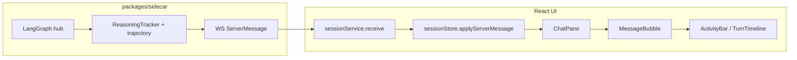
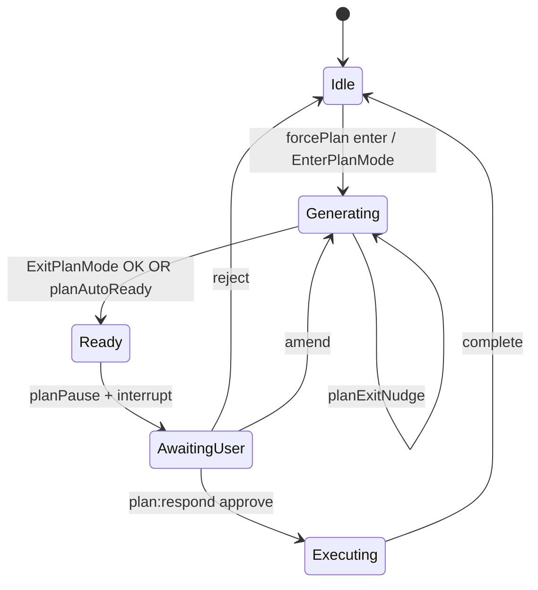
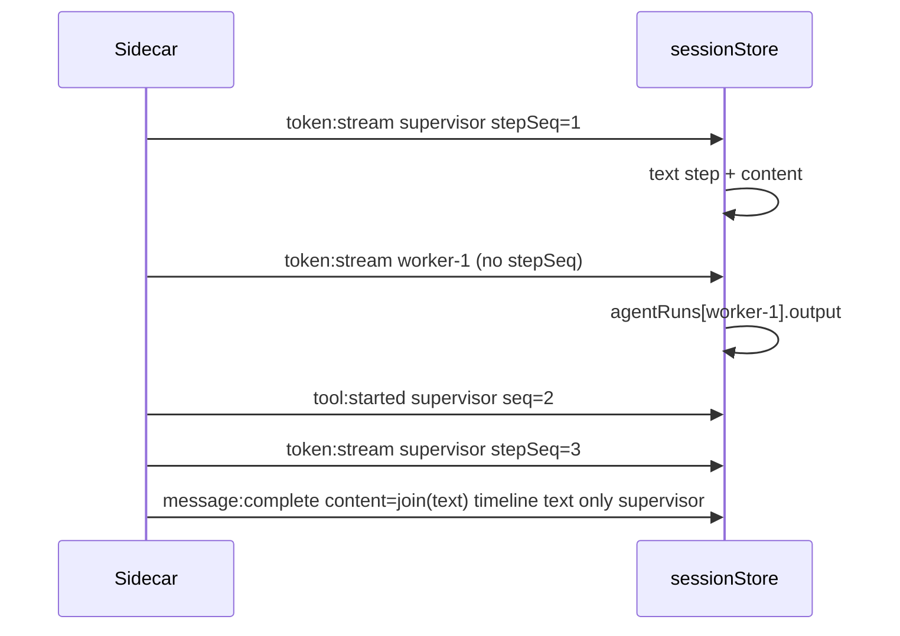
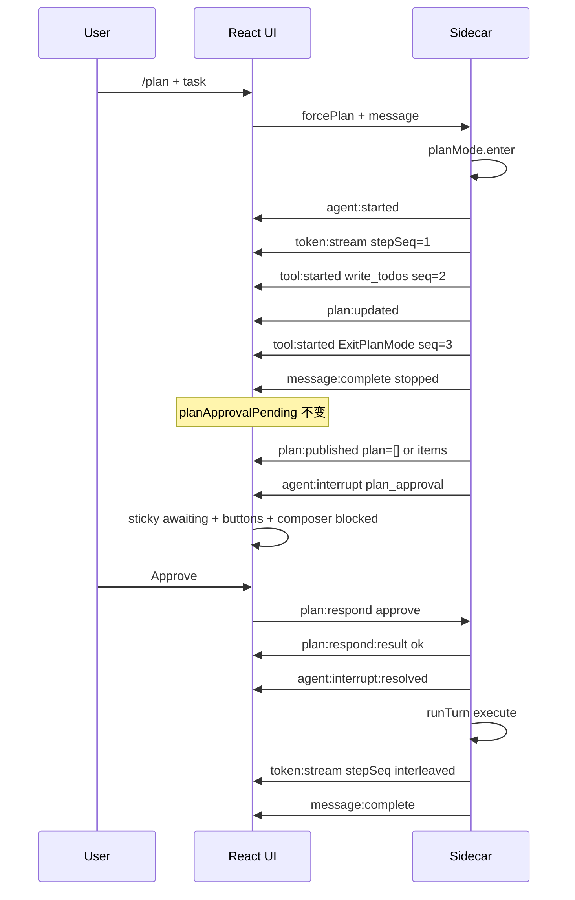
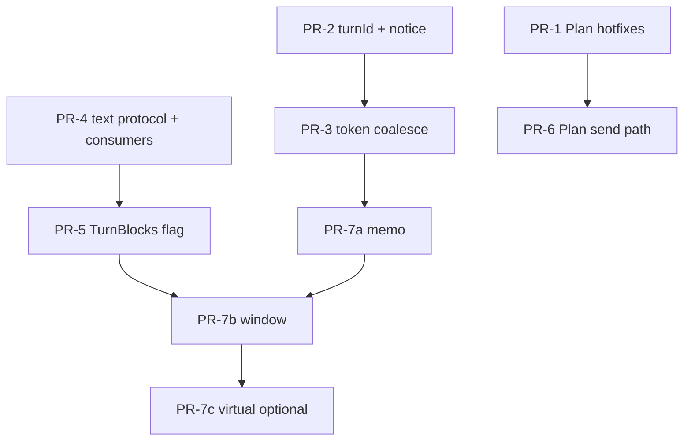

# 长对话交互体验与 Plan Mode 正确性整改设计

| Field | Value |
|-------|-------|
| **Title** | Long Conversation UX & Plan Mode Correctness |
| **Author** | hip (design) |
| **Date** | 2026-07-20 |
| **Status** | Draft (rev 3 — multi-agent text policy locked) |
| **Verified against** | hip `@47baeea9` (2026-07-20) |
| **Primary scope** | Transcript ordering · streaming performance · Plan mode state machine · approval UX |
| **Workspace** | hip (`/Users/lijiamin/data/my-github/hip`) |
| **Audience** | Senior frontend + sidecar engineers |

---

## Overview

用户反馈 hip 在**长对话**场景下交互体验差，界面中 **message / timeline / tool / reasoning 渲染顺序错乱**；同时 **规划模式（plan mode）** 的逻辑与审批弹窗行为不正确（`EnterPlanMode` / `ExitPlanMode` / plan approval 与 UI 状态机不一致）。

本设计基于 **hip 真实代码**、对照 **grok-build / opencode / kimi-code** 三套参考实现，并结合 AG-UI 等行业实践，给出：

1. **根因分析**（前端投影、渲染结构、sidecar 事件语义、plan 状态机各自的责任边界）
2. **可落地的整改方案**（含 **live 流式 wire 协议**、`TextBurstTracker` 算法、`StreamCoalescer` 键空间、plan 清状态矩阵）
3. **分 PR 交付计划**（可独立合并、依赖清晰）

**结论先行**：排序问题**不是单一层 bug**，而是「**timeline 不含 text 段 + MessageBubble 固定「过程在上 / 答案在下」布局 + 按 agent 重排 + 尾部消息不变式可被破坏**」的复合效应；plan mode 问题主要是 **「plan 就绪与 UI 可见条件脱节」**、**`message:complete` 清状态与 interrupt 竞态窗口**、以及 **在审批 UI 缺失时 soft-approve resume 成为隐藏通道**。

---

## Background & Motivation

### 当前架构（hip）



- **协议**：`packages/protocol` — `Message` 含 `content` + `timeline?: TimelineStep[]` + `toolCalls` + `agentRuns`
- **投影**：`src/domain/sessionStore.ts` — `applyServerMessage` 纯函数归并
- **渲染**：`ChatPane` → `MessageBubble` → `ActivityBar`（内嵌 `TurnTimeline`）+ 答案区 `MarkdownBody`
- **Plan**：sidecar `PlanMode` + tools `EnterPlanMode`/`ExitPlanMode` + graph 状态 `planningMode`/`planStatus`；UI 靠 `planApprovalPending` + sticky `ComposerPlanPanel`

### 用户可观察的痛点

| 症状 | 典型场景 |
|------|----------|
| 工具/思考与文字「上下颠倒 / 挤在一起」 | 多轮 tool-use：先说再搜再改再总结 |
| 长会话卡顿、滚动跳动 | 数十 turn + 高频 `token:stream` |
| 重新打开会话工具/过程丢失或顺序怪 | 历史加载 / finalize 替换 |
| Plan 审批卡不出现或点了无效 | `forcePlan` / ExitPlanMode / empty plan |
| 审批后仍被 plan 门控，或 chip 状态错 | forcePlan one-shot 与 UI 不同步 |

---

## Goals & Non-Goals

### Goals

1. **Turn 内时间序正确**：reasoning / tool / assistant text 按真实发生顺序呈现（**流式与回放一致** — 见 KD-1 与 §D1 流式协议）
2. **长对话可用**：高频流式不导致每 token 全列表重渲染；滚动跟底稳定；列表性能分阶段改进
3. **Plan mode 状态机可推理**：从 `/plan` → 工具门控 → `ExitPlanMode` → 审批 UI → approve/reject/amend → 执行，任意路径都有明确终态
4. **审批 UX 单一入口**：sticky panel 为主；不出现「有 interrupt 无审批卡」或「有审批卡但 sidecar 已不在 awaiting」
5. **兼容存量 session**：旧 timeline（无 text 步）仍可渲染；新字段向后兼容

### Non-Goals

- 重写整个 LangGraph hub 或迁移到 AG-UI 原生协议（可对齐语义，不换协议栈）
- 引入完整 event-sourcing 重放引擎（kimi-style L1–L4）作为 v1 必选项
- 改变 plan 文件落盘路径（`~/.hip/plans/`）或权限 jail 产品语义
- ACP 外部 agent 的 plan mode 完整对等（builtin 优先；ACP 另文）
- **Virtualization 作为正确性门禁**（PR-7 为可选 perf follow-up；成功标准 1/3/4/5 不依赖虚拟列表）

---

## Root Cause Analysis

> Verified against hip `@47baeea9` (2026-07-20).

### RC-1 — 数据模型：`TimelineStep` 不含 assistant text（Severity: **critical**）

**证据**

```133:135:packages/protocol/src/message-model.ts
export type TimelineStep =
  | { kind: 'reasoning'; stepSeq: number; agentId: string; role: AgentRole; content: string; truncated?: boolean }
  | { kind: 'tool'; stepSeq: number; agentId: string; role: AgentRole; callId: string }
```

`content` 是 **整 turn 拼在一起的纯文本**，与 tool 轮次无序关联。sidecar 多轮 agent 循环中，中间轮的 `onText` 与最终答案都进同一 `supervisorText` / `message.content`。

**Wire 缺口（live 交错的前置条件）**

```ts
// packages/protocol/src/messages.ts — 现状
| { type: 'token:stream'; sessionId; turnId; agentId; delta: string }  // 无 stepSeq
| { type: 'reasoning:delta'; sessionId; turnId; agentId; role; stepSeq: number; delta: string }
```

前端 live 路径无法知道 text₁ 在 tool 前结束、text₂ 在 tool 后开始——除非 wire 携带 `stepSeq`（或等价边界事件）。

**后果**

真实发生顺序 `text₁ → tool A → text₂ → tool B → reasoning → text₃` 只能渲染为：

```
[timeline: reasoning + tool A + tool B]
[content: text₁+text₂+text₃]   // 堆在底部
```

**行业对照**：kimi frames（text/think/tool 同层）；AG-UI `TEXT_MESSAGE_*` 与 `TOOL_CALL_*` 交错；grok-build 有序 `ConversationItem`。

---

### RC-2 — 渲染布局：`MessageBubble` 固定「过程轨 → 答案区」（Severity: **critical**）

**证据**：`MessageBubble.tsx:88–110` — `ActivityBar` 永远在 `MarkdownBody(content)` 之上。即使 timeline 内 tool/reasoning 按 `stepSeq` 正确，答案永远在全部过程之后。

---

### RC-3 — 按 agent 分桶后的全局序被打乱（Severity: **major**）

**证据** — `TurnTimeline.tsx:245–250`：`buildAgentSections` 强制 `supervisor` 排在其他 role 之前，即使子 agent 的 `firstSeq` 更早。

**默认整改**（KD-9）：transcript **单一全局 stepSeq 列表**；agent 以行内 badge 呈现，**不**再按 role 重排 sections。

---

### RC-4 — 尾部 assistant 不变式脆弱（Severity: **critical**）

设计注释（`sessionStore.ts:74–78`）要求 provisional 始终为 trailing assistant。

**破坏点**

1. `agent:notification` 直接 push 新 assistant（`sessionStore.ts:464–480`）
2. `appendAssistantDelta` / `finalizeAssistant` 只看 `messages[length-1]`（`98–105`, `137–139`）
3. supervisor 的 `token:stream` 走 tail 路径，subagent 才用 `turnId`（`202–213`）

---

### RC-5 — 流式合帧未接入；且现有 coalescer 不能安全合 reasoning（Severity: **critical** for perf / **critical** if mis-wired）

`StreamCoalescer`（`src/lib/streamCoalesce.ts`）仅测例使用；生产路径每条 `token:stream` 直接 `store.apply`（`sessionService.ts:226–227`）。

**合帧器能力边界**

| 能力 | 现状 |
|------|------|
| bucket key | `sessionId\0turnId\0agentId` 仅三元组 |
| flush | `flush(sessionId, turnId, agentId, text)` 单字符串 |
| stepSeq | **无** |
| kind (token vs reasoning) | **无** |
| schedule cancel | `ensureScheduled` 丢弃 cancel 句柄（bug） |

因此：**PR-3 只能安全合 `token:stream`（在 token 仍无 stepSeq 的过渡期，或合帧 key 含 stepSeq 之后）**。在 key 不含 `kind+stepSeq` 之前，**禁止**把 `reasoning:delta` 丢进同一 coalescer——会把不同 burst 的 delta 粘在一起，破坏 `upsertReasoning`（`sessionStore.ts:85–96`）。

`ChatPane` 无虚拟列表：`messages.map` 全量（`ChatPane.tsx:171`）。

---

### RC-6 — sidecar 轨迹：tool/reasoning 序大体正确，text 未进轨迹（Severity: **major**）

- `ReasoningTracker`：tool 前 close burst → `reasoning.stepSeq < tool.seq`（`tool-trace.ts:153–156`）✓  
- `trajectoryToTimeline` 按 stepSeq 排序 ✓  
- **无 text burst**；中间文本无法回放交错  
- plan 暂停：`finalizeAndPersist(stopped)` **先于** `plan:published` + `agent:interrupt`（`session-turn-runner.ts:1332–1367`）

---

### RC-7 — Plan approval：UI 门控过严 / 清扫过宽 / empty-plan 断层（Severity: **critical**）

**状态机（sidecar）**



**已验证事件序（plan ready）**：`message:complete(stopped)` → 可选 `plan:published` → `clearForcePlanFlag` → `agent:interrupt(plan_approval)`。

| 问题 | 证据 | 影响 |
|------|------|------|
| complete **总是** `planApprovalPending: false` | `sessionStore.ts:256–259` | 竞态窗口；乱序/丢包时丢审批 |
| `hasPlanApproval` 要求 `activeTurnPlan.length > 0` | `planApproval.ts:3–5` | 空 plan 无审批卡 |
| `selectLivePlan` 要求 pending **且** planItems | `todos.ts:97–99` | empty 永不到 `awaiting_approval` |
| `plan:published` 仅当 `finalState.plan` truthy | `session-turn-runner.ts:1338–1339` | 无 write_todos 时不 publish |
| ExitPlanMode 允许空文件 | `exit-plan-mode.ts:31–33` | 与上组合 = 无卡 |
| sticky 是唯一审批入口 | `ComposerPlanPanel`；`PlanApprovalCard` 未挂 ChatPane | 无 panel 则无按钮 |
| **非空 plan 时** InputBar 已 `sessionActionBlocked` | `InputBar.tsx:59–62` | soft-approve **不是**常见 Approve 按钮的第二 UX |
| **空 plan / 无卡时** composer 不 block → `sendMessage` → `resume` = soft-**approve** | `sessionService.ts:1985–1987` + `session-turn-ops.ts:102–140` | **主要伤害路径** |

**澄清（RC-7 措辞收紧）**：双轨「soft-approve resume vs `plan:respond`」在 **审批 UI 已显示且 composer 已 block** 时，用户几乎只能点按钮；双轨伤害主要发生在 **empty-plan / 审批 UI 缺失 / 程序化 resume**。修复优先级：**先 empty 可见 + 清状态矩阵**，再统一 send 通道（PR-6）。

**forcePlan**：就绪时 `clearForcePlanFlag(plan_ready)` 在 interrupt 之前 → `selectLivePlan` 用 `forcePlan && !pending` 推断 phase 时，pending 尚未 true 的一帧可能 phase 错乱。

---

### RC-8 — 长对话列表与自动滚动（Severity: **major** for perf）

- 无虚拟化；全量 Markdown  
- 自动滚动：`messages.length` + `lastActivity` + `followBottomRef`（`ChatPane.tsx:53–80`）  
- Jump：`querySelector([data-message-id])`（`ChatPane.tsx:87–101`）— 虚拟化后会失效除非保证 mount  
- `React.memo(MessageBubble)` **今日不存在**；Zustand 每次 apply 常换新 message 对象 → 裸 memo 收益有限，需 selector 隔离

---

### 责任分层小结

| 层 | 排序 | Plan |
|----|------|------|
| Sidecar 发射 | stepSeq 对 reasoning/tool **基本正确**；缺 text 步与 token stepSeq | 状态机完整；empty publish + complete-before-interrupt 易踩坑 |
| 协议/投影 | 尾部不变式、无 text wire | complete 清 pending；hasPlanApproval/selectLivePlan 过严 |
| 渲染 | **主因**：非交错布局 + agent 强制序 | sticky 单入口 OK；缺 empty awaiting |

---

## Reference Comparison

### grok-build（xAI）

| 主题 | 做法 | 对 hip 启示 |
|------|------|-------------|
| 对话状态 | `ChatStateActor` 串行 command；turn 有序 messages | 投影单写者；按 id 更新 |
| Plan | `Inactive/Pending/Active/ExitPending`；持久化 | hip 仅 bool + isActive |
| 审批 | 可滚动预览；**空 plan 仍开 empty-state** | hip 必须始终展示审批面 |
| 文档 | `crates/codegen/xai-grok-pager/docs/user-guide/19-plan-mode.md` | — |

### opencode

| 主题 | 做法 | 对 hip 启示 |
|------|------|-------------|
| 事件 | `durable: { aggregateID, seq, version }` | 长期可考虑 session event seq；v1 用 turn stepSeq |
| Plan | 无 Enter/ExitPlanMode 同构层；权限 HITL 为主 | 勿混淆 permission 与 plan approval |

### kimi-code

| 主题 | 做法 | 对 hip 启示 |
|------|------|-------------|
| Transcript | frames 有序 text/thinking/tool；`plan.enter`/`plan.exit` markers | 交错 frames 是正解 |
| 长会话 | recent turns 窗口 + 旧 step 折叠 | 窗口化先于 heavy virtual |
| ExitPlanMode | 读 plan 文件 → 用户确认 | 审批面要展示正文，不只 todos |

### AG-UI

- Start/Content/End 成对；messageId/toolCallId 关联  
- 前端禁止猜测消息结束；hip 的 `message:complete` 已是终结信号  
- Interrupt 作为 run outcome 一等公民  

---

## Proposed Design

### D1 — 统一 Turn Block 模型 + **Live 流式 wire 协议**（核心）

#### D1.1 数据模型

```ts
// packages/protocol — TimelineStep (additive)
export type TimelineStep =
  | { kind: 'reasoning'; stepSeq: number; agentId: string; role: AgentRole; content: string; truncated?: boolean }
  | { kind: 'tool'; stepSeq: number; agentId: string; role: AgentRole; callId: string }
  | { kind: 'text'; stepSeq: number; agentId: string; role: AgentRole; content: string; truncated?: boolean } // NEW
```

`Message.content` 在 complete 时设为 **仅 supervisor `kind:'text'` 步按 stepSeq 拼接**（见 §D1.1a / §D1.4）。搜索 / preview / 导出 / 标题生成继续读 `content`。

#### D1.1a 多 agent token 策略（KD-17 — **锁定 Choice A**）

对齐今日 hip 语义（`session-turn-runner.ts` `makeEmit`：`supervisorText` 仅 supervisor；`trajectory.output` 每 agent；FE：supervisor → `content`，subagent → `agentRuns[].output`）。

| 维度 | **Choice A（采用）** |
|------|----------------------|
| **text timeline 步** | **仅 supervisor 面**（hub：`agentId === 'supervisor'`；managed 独立 turn：`surfaceText` 写 textBursts，步 role=`supervisor`，AgentRun.role 仍可为 subagent） |
| **`contentFromTimeline`** | 拼接 timeline 中全部 text 步（filter `agentId/role === supervisor`） |
| **`token:stream.stepSeq`** | **hub supervisor** 与 **managed 独立 turn（D1.7 surface supervisor）** 带 `stepSeq` 并走 TextBurstTracker |
| **subagent / nested managed token** | **无 stepSeq**；`r.output += delta`；wire 仍发 `token:stream`；**不**写 text 步 |
| **managed 独立 turn** | 有 stepSeq + 持久化 textBursts（`surfaceText`）；complete/reload 与 live 一致；content 仍为 agent 叙述 |
| **FE live** | `stepSeq != null` → upsert text + content；`stepSeq == null` 且非 supervisor → `appendRunOutput(turnId, agentId)`；supervisor 无 stepSeq（ACP）→ content only |
| **SubAgentCard** | 继续读 `run.output`；**无**与 TurnBlocks text 双渲染（因无 subagent text 步） |
| **标题 / search** | 仍基于 `Message.content`（= supervisor 叙述） |
| **reasoning / tool steps** | 仍可来自任意 agent（既有 stepSeq 行为不变） |

**否决 Choice B（v1）**：全 agent text 步 + content 过滤 supervisor — 会强制 SubAgentCard 与 TurnBlocks 去重，改动面大，且改变 search 契约。未来若产品要「子 agent 叙述进主 transcript」可开 KD-17b。

**Invariant（多 agent text）**

```
∀ text step in timeline: agentId === 'supervisor' (or role === 'supervisor')
Message.content === contentFromTimeline(timeline) === join(supervisor text bursts)
∀ non-supervisor agent: narration lives only in agentRuns[agentId].output
```

#### D1.2 选定流式模型（KD-1）：**镜像 reasoning — `token:stream` 带 `stepSeq`（supervisor only）**

**不采用** complete-only 交错作为 Goal 1 的 v1。Alt E 见 Alternatives。

**Wire 变更（additive optional 字段）**

```ts
| {
    type: 'token:stream'
    sessionId: string
    turnId: string
    agentId: string
    delta: string
    stepSeq?: number       // NEW: required when agentId==='supervisor' on builtin hub after PR-4
    role?: AgentRole       // optional; default from agentId
  }
```

| 发射方 | stepSeq |
|--------|---------|
| Builtin hub supervisor | **必填**（TextBurstTracker，`agentId === 'supervisor'`） |
| Managed **独立 turn**（image agent 等，D1.7 surface supervisor） | **必填**（TextBurstTracker + `surfaceText` 持久化 text 步；wire `role:'supervisor'`） |
| Builtin subagent / nested managed / background | **省略**（legacy `run.output` 路径；不写 text 步） |
| ACP / 旧客户端 | 可省略 → FE content-only（若 agentId 当 supervisor）或 run.output |

#### D1.3 `TextBurstTracker` 算法（sidecar，对称 `ReasoningTracker`）

位置：`packages/sidecar/src/session/tool-trace.ts`（或并列新文件）。

**范围（KD-17）**：tracker 对 **hub supervisor** 与 **managed 独立 turn（surfaceText）** 调用 `push`/`close`。嵌套 subagent 的 `emit.token` **不**进入 TextBurstTracker。

```ts
/** Supervisor-only open text burst（实现可用 Map，但 v1 仅 supervisor 一键）。 */
class TextBurstTracker {
  private open = new Map<string /*agentId*/, { stepSeq: number; content: string }>()
  constructor(private nextSeq: () => number) {}

  push(agentId: string, delta: string): number {
    // caller 保证 agentId === 'supervisor'
    let b = this.open.get(agentId)
    if (!b) {
      b = { stepSeq: this.nextSeq(), content: '' }
      this.open.set(agentId, b)
    }
    b.content += delta
    return b.stepSeq
  }

  close(agentId: string): { stepSeq: number; content: string; truncated?: boolean } | undefined { /* clip + delete */ }

  closeAll(): ... // turn end
}
```

**关闭时机（supervisor，与 ReasoningTracker 对称）**

| 事件 | 顺序 |
|------|------|
| `onToolStart('supervisor')` | 1) close **text** 2) close **reasoning** 3) `toolSeq = nextSeq()` 4) emit tool:started |
| 新 reasoning 打开前 | 1) close **text** 2) reasoning.push |
| turn finalize | closeAll text + reasoning for supervisor |

**emit 伪代码（对齐 `makeEmit`）**

```ts
function emitToken(agentId: string, delta: string, role: AgentRole) {
  if (!delta) return
  const r = trajectory.get(agentId)
  if (r) r.output += delta                    // 所有 agent：run.output

  if (agentId === 'supervisor') {
    supervisorText += delta                   // 与今日一致；finalize 以 textBursts 权威覆盖
    const stepSeq = textTracker.push(agentId, delta)
    send({ type: 'token:stream', sessionId, turnId, agentId, delta, stepSeq, role })
  } else {
    // 子 agent：无 stepSeq，不写 textBursts
    send({ type: 'token:stream', sessionId, turnId, agentId, delta, role })
  }
}

function onToolStart(agentId: string) {
  if (agentId === 'supervisor') {
    const closedText = textTracker.close(agentId)
    if (closedText) trajectory.get(agentId)!.textBursts.push(closedText)
  }
  const closedReasoning = reasoningTracker.close(agentId)
  if (closedReasoning) trajectory.get(agentId)!.reasoningBursts.push(closedReasoning)
  // then nextSeq for tool
}
```

**Invariant（sidecar stepSeq）**

```
对于 supervisor 的任意 tool T：
  若 T 前存在 open text/reasoning，则其 stepSeq < T.seq
turn-global nextSeq() 单调；无重复 stepSeq
subagent tokens never claim nextSeq for text
```

#### D1.4 权威 `content` 与 timeline 不变量

```ts
/** 仅拼接 text 步；在 KD-17 下等价于 supervisor 叙述。 */
function contentFromTimeline(steps: TimelineStep[]): string {
  return steps
    .filter((s): s is Extract<TimelineStep, { kind: 'text' }> => s.kind === 'text')
    // 防御：即使错误写入非 supervisor text，也不进入 content（双保险）
    .filter((s) => s.agentId === 'supervisor' || s.role === 'supervisor')
    .sort((a, b) => a.stepSeq - b.stepSeq)
    .map((s) => s.content)
    .join('')
}
```

| 时机 | 规则 |
|------|------|
| **message:complete** | `timeline = trajectoryToTimeline(...)`：supervisor **textBursts** + 全 agent reasoning/tools；`content = contentFromTimeline(timeline)`；`agentRuns[].output` 仍来自各 agent `r.output`；**禁止**把 subagent 输出并进 `content` |
| **与 supervisorText** | complete 以 textBursts/`contentFromTimeline` 为准覆盖；`supervisorText` 仅流式缓冲，应与 bursts 一致（单测） |
| **标题生成** | 继续 `generateFirstTurnTitle(..., supervisorText/content, …)` — content 语义不变 |
| **DB persist** | 同一 `content` + `timeline` + runs |
| **session:loaded** | 原样 hydrate；**不得** strip 未知 `kind` |
| **流式中** | content 可滞后；search 流式滞后可接受 |
| **reload** | DB 权威 |

**`trajectoryToTimeline`**：

- text：仅 `supervisor.textBursts`（若误写其他 agent textBursts — **丢弃或 assert**）  
- reasoning + tool：全 agent  
- 统一 `sort(stepSeq)`

#### D1.5 前端 live 投影

```ts
case 'token:stream': {
  // 1. 按 turnId 定位消息（D2）
  const isSupervisor =
    msg.agentId === 'supervisor' ||
    message.agentRuns?.find(r => r.agentId === msg.agentId)?.role === 'supervisor'

  if (msg.stepSeq != null && isSupervisor) {
    // upsert timeline text + content += delta
    upsertTimelineText(turnId, { stepSeq: msg.stepSeq, agentId, role, delta })
    appendContentByTurnId(turnId, delta)
  } else if (isSupervisor) {
    // ACP / legacy supervisor: content only
    appendContentByTurnId(turnId, delta)
  } else {
    // subagent: run.output only — 永不写 text 步
    appendRunOutput(turnId, msg.agentId, delta)
  }
}
```

`upsertTimelineText`：同 `stepSeq` concatenate；否则 append。防御：非 supervisor 调用 no-op。

**complete**：`finalizeAssistantById` 整对象替换。



#### D1.6 渲染：`TurnBlocks`

- 全局 stepSeq：reasoning / **supervisor text** / tool（含 subagent tools）  
- Subagent 叙述：**不**在 TurnBlocks 以 text 步出现；仍用 SubAgentCard / run summary  
- Flag off：legacy ActivityBar + content；**禁止** text 步 + content 双渲染  

Agent chrome：badge；不 supervisor-first 重排 sections（KD-9）。

#### D1.7 Emit 站点清单（PR-4 必改）

| 站点 | 路径 | 变更 |
|------|------|------|
| Hub **supervisor** token | `makeEmit('supervisor')` | TextBurstTracker + **stepSeq**；`supervisorText` + `r.output` |
| **Subagent** token | `makeEmit(childId)` / subagent | **无** TextBurst / **无** stepSeq；仅 `r.output` + wire |
| Managed / image agent | managed turn | 若表面为 **独立 turn** 的 supervisor 语义 → 带 stepSeq；若嵌在父 turn 为 subagent → 无 stepSeq + run.output |
| Workflow runner | `workflow-runner.ts` | 仅当角色为 supervisor 时 stepSeq |
| ACP provider | acp-provider | 可无 stepSeq（legacy） |
| Finalize | persist / trajectoryToTimeline | **supervisor textBursts only** + `contentFromTimeline` |
| Background subagent | notification / run | 不写父 turn text 步 |

---

### D2 — 投影按 `turnId` 寻址 + notification 决策

| 函数 | 改动 |
|------|------|
| `appendAssistantDelta` | 必须 `turnId`；`find(m => m.id === turnId)` |
| `finalizeAssistant` | 按 `message.id` 替换；找不到则 append |
| `token:stream` | 始终用 `msg.turnId`；**分支见 D1.5 / KD-17** |
| supervisor content / subagent output | 保持今日职责分离 |

**Invariant v2**

```
running turn T ⇔ ∃ message.id === T
stream/tool/reasoning/complete 仅 mutate message.id === turnId
```

#### KD-13 — Notification 形态（锁定）

**选择**：`Message.role` 增加 **`'notice'`**。

- `agent:notification` → `{ role: 'notice', id: notif-…, content, timestamp }`  
- **永不** `role: 'assistant'`  
- ChatPane 渲染为 muted 系统行  

#### D2.1 Notice 与 “last message” 辅助函数（PR-2 必实现）

今日 `ChatPane` 用 `i === length-1` 判 streaming，trailing notice 会关掉真正 assistant 的流式 UI；`regenerateLastTurn` 只 pop `assistant`，trailing notice 会挡住 pop。

```ts
/** 自尾向前第一个 role==='assistant' 的下标；无则 -1 */
function lastAssistantIndex(messages: Message[]): number {
  for (let i = messages.length - 1; i >= 0; i--) {
    if (messages[i].role === 'assistant') return i
  }
  return -1
}

function isStreamingAssistant(messages: Message[], index: number, status: string): boolean {
  if (status !== 'running') return false
  if (messages[index]?.role !== 'assistant') return false
  return index === lastAssistantIndex(messages)
}

/** regenerate：丢掉尾部 assistant 与 notice，直到 user（或空） */
function popForRegenerate(messages: Message[]): Message[] {
  const next = [...messages]
  while (next.length > 0) {
    const r = next[next.length - 1].role
    if (r === 'assistant' || r === 'notice') next.pop()
    else break
  }
  return next
}

/** cancel finalize：只处理 last assistant，忽略 trailing notice */
function finalizeCancelledMessage(messages: Message[]): Message[] {
  const idx = lastAssistantIndex(messages)
  if (idx < 0) return messages
  // … coerce tools / drop empty provisional on messages[idx] only
}
```

| UI / 动作 | 规则 |
|-----------|------|
| `streaming` prop | `isStreamingAssistant(messages, i, status)` — **不是** `i === length-1` |
| `isLastAssistant` | `i === lastAssistantIndex(messages)` |
| regenerate | `popForRegenerate` |
| cancel / CANCELLED | `lastAssistantIndex` 上 finalize |

**单测**：notice 夹在流式 assistant 后 → streaming 仍 true；notice 后 regenerate → assistant 被 pop。

---

### D3 — 流式合帧 + 列表性能

#### D3a — StreamCoalescer：**分阶段正确接线**

##### PR-3 范围（**仅 token:stream**）

```
on token:stream:
  if msg.stepSeq != null:
    // supervisor interleaved text (KD-17)
    coalescer.push({ kind:'text', sessionId, turnId, agentId, stepSeq, role, delta })
  else if agent is supervisor (agentId==='supervisor' or role):
    // ACP/legacy supervisor content
    coalescer.push({ kind:'text-legacy', sessionId, turnId, agentId, stepSeq: -1, delta })
  else:
    // subagent run.output — 独立 kind，禁止与 content 合并
    coalescer.push({ kind:'run-output', sessionId, turnId, agentId, stepSeq: -1, delta })
on reasoning:delta:
  apply immediately  // PR-3 不合帧 reasoning
on tool:started|finished | message:complete | error | interrupt | permission:
  coalescer.flushTurn(sessionId, turnId) then apply event
```

`flush` 映射：`text`/`text-legacy` → content（+ text 步）；`run-output` → `appendRunOutput` only。
##### Coalescer v2 API（PR-3 可先实现 typed key，reasoning 仍可不 push）

```ts
type CoalesceKey = `${sessionId}\0${turnId}\0${agentId}\0${kind}\0${stepSeq}`

type StreamKind = 'text' | 'text-legacy' | 'run-output' | 'reasoning'

interface CoalesceBucket {
  sessionId: string; turnId: string; agentId: string
  kind: StreamKind
  stepSeq: number
  role?: AgentRole
  text: string
}

flush: (b: CoalesceBucket) => void
// text → upsertTimelineText + content (supervisor only)
// text-legacy → append content by turnId (supervisor ACP)
// run-output → appendRunOutput (subagent; never content/text steps)
// reasoning → upsertReasoning (仅当未来启用时)
```

**禁止**：同一 `(agentId, kind, stepSeq)` 以外的合并。  
**修复**：`ensureScheduled` 必须保存并调用 cancel（现 `void cancel` bug）。

##### 何时合帧 reasoning

**PR-3.1 / 与 PR-4 同车或紧随**：`reasoning:delta` 使用 `kind:'reasoning'+stepSeq` bucket。在此之前文档**不得**声称「合帧 reasoning 行为等价」。

#### D3b — 列表性能分层（PR-7 拆分）

| 阶段 | PR | 策略 | 正确性依赖 |
|------|-----|------|------------|
| **7a** | PR-7a | 合帧后：隔离 selector（active messages slice）；`memo` + **按 message.id 的引用稳定**（apply 时未变 message 保持同引用——或 memo 自定义比较 content/timeline/toolCalls） | 无 |
| **7b** | PR-7b | **窗口化**：mount 最近 N=**30**（chat/code 相同，KD-15）；顶部「加载更早」；未挂载消息不在 DOM | Jump 策略见下 |
| **7c** | PR-7c 可选 | `@tanstack/react-virtual` 仅在 7a/7b 指标仍不足后 | 需测量策略 |

**Virtualization 若做，必须**

1. **变高测量**：`measureElement` / ResizeObserver；禁止固定 estimate 作为唯一来源  
2. **Jump**：`messageId → index` 映射；目标若不在窗口则先 expand/load 再 `scrollToIndex` + highlight；**禁止**仅 `querySelector`  
3. **Follow-bottom**：始终 mount **end sentinel**（虚拟范围外 sticky 底锚）；流式时 `align: end` / `scrollToOffset(total)`  
4. **lastActivity**：合帧后仍触发 remeasure last item  
5. **测试**：search jump 到最旧消息；流式中 jump latest；长流 pin-bottom；滚轮 unpin  

**成功标准**：1/3/4/5 **不依赖** 7c；7a+合帧即可显著改善。

---

### D4 — Plan Mode 状态机与审批 UX

#### D4a — KD-11：v1 纯前端 `derivePlanUiPhase` + 金标决策表

**不**在 v1 引入 `session:planPhase` 事件（除非 resync 证明 derive 不够 — 见 D4c resync）。

```ts
type PlanUiPhase = 'off' | 'pending' | 'planning' | 'awaiting_approval' | 'executing' | 'done'

function derivePlanUiPhase(input: {
  forcePlan: boolean
  planApprovalPending: boolean
  status: 'idle' | 'running' | 'error'
  activeTurnPlan: PlanItem[] | null | undefined  // 可为空数组
  interruptContextKind?: 'plan_approval' | string
  lastMessageRole?: 'user' | 'assistant' | 'notice'
}): PlanUiPhase
```

**金标表（必须单测；每行单一 outcome）**

| forcePlan | pending | status | plan items | interrupt kind | → phase |
|-----------|---------|--------|------------|----------------|---------|
| T | F | running | [] / null | — | **planning** |
| T | F | idle | null | — | **off** |
| T | F | idle | [] | — | **off** |
| T | F | running | [..] | — | **planning**（forcePlan 起草中，有 todos） |
| F | T | idle | [] | plan_approval | **awaiting_approval** |
| F | T | idle | [..] | plan_approval | **awaiting_approval** |
| F | F | running | [..] | — | **executing** |
| F | F | idle | [..] | — | **done**（sticky 至下一 user turn） |
| F | F | * | null | — | **off** |

说明：

- **`forcePlan + idle + 无 activeTurnPlan` → `off`**：chip/config 已开但**无** sticky 空 planning 条；产品「待开 turn」仅靠 PlanModeChip `active`，不占用 `PlanUiPhase.pending`（避免与 planApproval 语义混淆）。若未来要 sticky「强制规划已开启」，用 `selectLivePlan` 的 `forcePlan && status==='running'` 空 items 路径，**不**在 idle 显示。
- **`forcePlan` 已 false + `planApprovalPending` true** ⇒ **永远** `awaiting_approval`。

`selectLivePlan` 与 `derivePlanUiPhase` 对齐：`awaiting_approval` 时 **允许 items: []**。
#### D4b — Empty-plan 审批（PR-1 验收清单 — 一次交付）

**全部必须同时满足**（缺一不算 PR-1 done）：

1. `hasPlanApproval`：`!!planApprovalPending`（**不**要求 items.length > 0）  
2. `selectLivePlan`：`pending` ⇒ `phase: 'awaiting_approval'`, `items: activeTurnPlan ?? []`, source 可 `'empty'`  
3. Sidecar：`isPlanApproval` 时 **始终** `plan:published` 且 `plan: finalState.plan ?? []`  
4. `PlanProgressPanel`：awaiting + items.length===0 ⇒ empty-state 文案（新 i18n `chat.planPanel.emptyAwaiting`）+ **Approve/Reject/Amend 按钮可见**  
5. `InputBar`：`hasPlanApproval` true ⇒ `sessionActionBlocked`（已有）— 用户**不会**卡在「composer 死锁且无按钮」  
6. complete **不**清 `planApprovalPending`（D4c）  

Soft-approve 语义产品改写留 PR-6；PR-1 已堵住 empty 时误走 resume 的主洞（因 pending+block）。

#### D4c — `planApprovalPending` 清状态矩阵

| 事件 | prior pending | 期望 pending | interrupt | 备注 |
|------|---------------|--------------|-----------|------|
| `message:complete` | T/F | **不变** | 不变 | **禁止**再清 pending（KD-7） |
| `agent:interrupt` plan_approval | * | **true** | set | 设 context |
| `agent:interrupt` 其他（非 plan_approval） | * | **false** | set | **总是清** plan pending：非 plan HITL 取代 plan 审批模式；单测覆盖 |
| `agent:interrupt:resolved` | * | **false** | null | 含 foreign resolve |
| `respondPlanOptimistic` | T | **false** | null | approve/amend→running；reject→idle |
| `plan:respond:result` ok:false | F（乐观已清） | **true** 回滚 | 恢复 | PR-6 |
| `appendUserMessage` | * | **false** | null | 新 user turn |
| `regenerateLastTurn` | * | **false** | null | 已有 |
| `CANCELLED` | * | **false** | — | 已有 |
| hard `error`（非 BUSY） | * | **false** | — | 含 `PLAN_REJECTED` |
| `BUSY` / `AGENT_BUSY` | * | **不变** | 不变 | soft |
| `session:loaded` | * | **false**（今日） | null | 见 resync |
| session delete | — | — | — | VM 移除 |

**测试**：重写 `sessionStore.test.ts` 中「complete ⇒ pending false」断言；改为 complete 保持 prior；interrupt 后 pending true；非 plan complete 不留下 orphan interrupt（interrupt 由 resolved/新 turn 清）。

#### D4c.1 Resync：刷新后恢复审批

今日：`planApprovalPending` 纯 UI；`session:loaded` 清零；sidecar 仍可能 `awaitingResume && planStatus==='ready'`。

**要求（PR-1 或 PR-1.1）**

- 在 `session:load` / attach / `ready` 后 resync：若 sidecar paused plan ready，**重放** `plan:published` + `agent:interrupt(plan_approval)`（或新增只读 `session:planState` 一次）  
- 实现落点：`Session` 序列化 paused 标志或 load 时检查 `awaitingResume`  
- 前端：`session:loaded` 后允许后续 interrupt 再置 pending  

#### D4d — Composer send 决策表（KD-8 / PR-6）

| InputBar submit 时 | 动作 |
|--------------------|------|
| `planApprovalPending` | **`respondPlan('amend', text)`** — **不** `resume`；append user 行与今日 amend 路径一致（sidecar amend 已 persist user） |
| `interrupt` 且 **非** plan approval | `resume(text)`（现状） |
| `pendingPermission` | block（已有） |
| running 无 interrupt | 正常 queue/send 策略（现状） |
| idle | `message` send |

**Soft-approve**：默认 **关闭**（KD-8）。若需 eval：设置 `plan.softApproveOnComposer: true` 时 pending 下 submit → `respondPlan('approve')` 并可选附言（或 resume 旧路径）。默认 dogfood/产品为 amend。

**E2E / harness**：更新依赖 soft-approve 的测试改为显式 `respondPlan('approve')`。

#### D4e — `plan:respond:result`（PR-6 **必选**，非可选）

```ts
| { type: 'plan:respond:result'; sessionId: string; ok: boolean; action: 'approve'|'reject'|'amend'; reason?: string }
```

- skip / 非 awaiting：`ok:false, reason:'not_awaiting'`  
- 前端：`respondPlan` 乐观清 UI；若 result ok:false → 恢复 `planApprovalPending`、`interrupt`、Panel `responded=false`；toast  

#### D4f — KD-12 PlanModeChip while running

**选择：toast-only v1**（实现简单）

- running 时 chip disabled 保持；点击（若启用）toast：`chat.plan.busyTitle`  
- **不**做 ExitPending 排队（defer；与 grok 对齐可作为 v2）  
- idle 时 `/plan-off` / chip 立即 `setForcePlan(false)`  

#### D4g — Plan 正文预览

- `plan:published` / interrupt context 可选 `markdown?: string`（ExitPlanMode 读到的 plan 文件，**clip** 至与 tool blob 同级上限，如 32KB）  
- 路径敏感：与 `~/.hip/plans/` 同类，不进过量日志  
- Panel 折叠「完整计划」  

---

### D5 — 端到端序列（整改后）



---

## API / Interface Changes

| 变更 | 说明 |
|------|------|
| `TimelineStep` + `kind:'text'` | D1 |
| `token:stream.stepSeq` (+ optional `role`) | D1.2 |
| `plan:published` 始终带 `plan: PlanItem[]`（可 `[]`）；optional `markdown?` | D4b/g |
| `plan:respond:result` | D4e **必选** PR-6 |
| `Message.role: 'notice'` | KD-13 |
| 无强制 `session:planPhase` v1 | KD-11 |

### TimelineStep 消费者清单（PR-4 **同车**，非「前端可 ignore」）

| 文件 | 现状风险 | PR-4 动作 |
|------|----------|-----------|
| `TurnTimeline.tsx` | non-reasoning 当 tool 读 `callId` | `kind==='text'` 分支 no-op 或预留；`kind==='tool'` 显式 |
| `turnAgents.ts:69–71` | else 当 tool | text：忽略 tools / 或记入 output |
| `activitySummary.ts` | last step tool\|reasoning | text → 可当 hasAssistantContent |
| `sessionDebugBundle.ts` `sanitizeTimeline` | else 全当 tool | text 分支 clip content |
| `timelineFilter.ts` | tool only | text 不 suppress |
| `sessionStore.ts` upsert | 仅 reasoning/tool 写入 | + upsert text |
| tests / fixtures | 穷举 | 加 text fixture |
| sidecar `trajectoryToTimeline` | 无 text | 实现 |
| type exhaustiveness | — | `assertNever(step.kind)` helper 或 satisfies |

**合并策略**：protocol 类型变更 + 全部 consumer **安全臂** 同一 PR-4；**渲染** text 在 PR-5（flag）。PR-4 后 flag off：text 步存在但不用于双份渲染（legacy 用 content）。

---

## Data Model Changes

### Message

```
Message {
  id, role: 'user'|'assistant'|'notice',
  content,                    // complete: contentFromTimeline
  timeline?: TimelineStep[],  // text|reasoning|tool
  toolCalls, agentRuns, ...
}
```

### 持久化 / Loader

| 路径 | 规则 |
|------|------|
| `messages.timeline` JSON | 原样；**保留未知 kind**（`JSON.parse` 后不 filter） |
| `session-message-codec` | 透传 timeline |
| 旧行无 text | UI legacy |
| 新行有 text | flag on → TurnBlocks；flag off → content only 布局 |

### 重连 / 中途 reload

| 场景 | 行为 |
|------|------|
| 流式中 disconnect | 现有 `resyncActiveIfRunning` → `session:loaded`；未完成 turn 变 interrupted（现语义） |
| 重连后 **无** 部分 text 步重放 | 可接受：volatile stream；以 DB 最终 complete 为准 |
| paused plan approval | D4c.1 重放 interrupt |

### SessionVM

```
planApprovalPending: boolean
activeTurnPlan: PlanItem[] | null  // 可 []
planMarkdown?: string
```

---

## Alternatives Considered

### Alt A — 仅修前端 sort  
**否决**：无法恢复多段 text。

### Alt B — 全量 kimi transcript ops  
**否决 v1**：过大；Block 模型是子集。

### Alt C — message:complete 合并 interrupt 单事件  
**部分采纳**：v1 先 complete 不清 pending；未来可加 `message:paused`。

### Alt D — 虚拟化优先  
**否决为唯一方案**：合帧 + 排序/plan 正确性优先。

### Alt E — 前端临时切分（无 sidecar TextBurst）

在每次 `tool:started` 时，把自上次边界以来累积的 `content` 快照为本地 provisional text 步（本地 stepSeq）。complete 用权威 timeline 整表替换。

| 优点 | 缺点 |
|------|------|
| 无 wire 变更 | stepSeq 与 sidecar 可能不一致；多 agent 难 |
| 实现快 | ACP/乱序 tool 时边界错 |

**否决为权威方案**；**不**作 Goal 1 的 v1。若 PR-4 延迟，可作实验 flag，但 **KD-1 仍要求 wire stepSeq**。

---

## Security & Privacy Considerations

| 风险 | 缓解 |
|------|------|
| plan markdown 进 interrupt | clip 同 tool blob；不进全量日志 |
| soft-approve 误执行 | PR-1 block empty；PR-6 默认 amend |
| `~/.hip/plans/` 路径敏感 | preview clip；与现 plan 文件权限一致 |
| 调试 bundle | text 步走 `sanitizeTimeline` clip |
| 虚拟列表焦点 | 审批控件在 sticky，非虚拟区 |

---

## Observability

| 信号 | 方式 |
|------|------|
| turn blocks histogram | debug bundle `timelineKinds` |
| `stream.coalesce` | 可选 perf mark |
| `plan.phase` via derive | 单测表 |
| `plan.approval.shown` / `empty_plan` | log + UI |
| `plan.respond.skip` / result | WS result |
| dogfood | empty ExitPlanMode；notification mid-turn |

---

## Rollout Plan

1. **PR-1** plan 正确性：无 flag，尽快上  
2. **PR-2** turnId：无 flag  
3. **PR-3** 仅 token 合帧：无 flag；**不含** reasoning 合帧直到 key 含 stepSeq  
4. **PR-4** protocol + consumer 安全臂；text 步开始写入 DB  
5. **PR-5** `transcript.interleavedBlocks` **默认 off** → dogfood on → 默认 on  
   - flag off + DB 有 text：**不**双渲染  
6. **PR-6** send 通道 + respond result  
7. **PR-7a/b** perf；**7c 可选**  
8. 回滚：flag off；sidecar text 步仍合法  

---

## Migration / Compatibility

| 数据 | 策略 |
|------|------|
| 无 text 步 | legacy 布局 |
| 有 text 步 + flag on | TurnBlocks |
| 有 text 步 + flag off | content 布局，忽略 text 步渲染 |
| supervisor token 无 stepSeq | legacy content append |
| subagent token（永无 text 步） | 仅 `run.output`；与 KD-17 一致 |
| 测试夹具 | 更新 complete/pending 期望 |

---

## Test Plan

### Unit

- token 按 turnId；notification(notice) 后 complete  
- text+tool+reasoning stepSeq 序；`contentFromTimeline` **仅 supervisor**  
- subagent token：**无** text 步；仅 `run.output`  
- hasPlanApproval 空 plan；selectLivePlan awaiting+[]  
- complete **不**清 pending；非 plan interrupt **总是**清 pending  
- derivePlanUiPhase 金标表（forcePlan+idle → **off**；forcePlan clear-before-interrupt → awaiting）  
- StreamCoalescer：同 key 合并；**不同 stepSeq 不合并**；reasoning 在 PR-3 不进桶  
- notice：streaming / regenerate helpers  
- TurnBlocks / legacy 双渲染禁止  
- send 决策表：plan pending → amend  

### Integration

- 多轮 tool text 交错 trajectory  
- forcePlan → empty ExitPlanMode → published [] → interrupt → panel  
- approve/reject/amend + respond:result false 回滚  
- resync paused plan  

### Manual dogfood

1. 50+ turn 流式 + 滚动  
2. `/plan` 审批执行  
3. ExitPlanMode 无 write_todos  
4. 审批中 composer（应 amend）  
5. notice 插入后主 turn  
6. 刷新仍 awaiting（resync）  
7. 拒绝 plan / 取消  

---

## Risks

| Risk | Sev | Mitigation |
|------|-----|------------|
| content 与 text 步不一致 | M | 单一 `contentFromTimeline` |
| 合帧延迟 | L | tool/interrupt 强制 flushTurn |
| PR-3 误合 reasoning | **C** | 范围锁定；测试禁跨 stepSeq |
| 虚拟化 jump 回归 | M | 7c 可选；测试门禁 |
| soft-approve 习惯 | M | 设置项 + 说明 |
| consumer 漏改编译 | M | PR-4 checklist + exhaustiveness |

---

## Open Questions

| # | 问题 | 决议 |
|---|------|------|
| Q1 | soft-approve 默认？ | **KD-8：默认关（composer=amend）** |
| Q2 | plan markdown 持久化？ | **KD-14：仅 interrupt/published 临时预览，不强制入 transcript 行** |
| Q3 | 虚拟 N？ | **KD-15：N=30 chat+code 相同；7b** |
| Q4 | supervisor 分组 UX？ | **KD-9：全局 stepSeq；badge；不 role 重排** |
| Q5 | planPhase 事件 vs derive？ | **KD-11：v1 derive + 金标表；resync 用重放 interrupt** |

（Open Questions 已全部关闭为 KD；无残留阻塞。）

---

## Key Decisions

| ID | Decision | Choice | Rationale |
|----|----------|--------|-----------|
| **KD-1** | 排序 + 流式真相 | turn-global `stepSeq`；**text 进 timeline**；**`token:stream.stepSeq` live 交错** | 流式=回放；否决 complete-only 作为 Goal 1 |
| **KD-2** | 渲染 | TurnBlocks；legacy 回退；flag off 不双渲染 | 兼容 |
| **KD-3** | 投影 | 一律 `message.id === turnId` | 灭 tail 竞态 |
| **KD-4** | 合帧 | PR-3 **仅 token**；key=`kind+stepSeq`；reasoning 另阶段 | 防 burst 粘连 |
| **KD-5** | 长列表 | 7a memo/selector → 7b 窗口 → 7c 虚拟可选 | 降风险 |
| **KD-6** | 审批可见 | pending 即显示；允许空 plan | 对齐 grok empty-state |
| **KD-7** | complete vs pending | complete **不清** approval | 灭竞态 |
| **KD-8** | composer@approval | 默认 **amend**；soft-approve 设置项 | 防误执行 |
| **KD-9** | agent 序 | 全局 stepSeq + badge；**不** supervisor-first sort | 时间序 |
| **KD-10** | 范围 | builtin 优先；ACP 另案 | 控范围 |
| **KD-11** | plan phase | **derivePlanUiPhase** + 金标表；无强制 phase 事件 | 可测、少协议 |
| **KD-12** | chip@running | **toast-only**；无 ExitPending v1 | 简单 |
| **KD-13** | notification | **`role:'notice'`** 非 assistant；**D2.1 helpers** | 保 streaming / regenerate 语义 |
| **KD-14** | plan markdown | 临时 preview + clip；不强制持久进 message | 隐私/体积 |
| **KD-15** | window N | **30** 统一 | 简单默认 |
| **KD-16** | plan respond 回执 | **`plan:respond:result` 每条 respond 路径必发**（ok true/false） | 乐观 UI 可回滚；禁 silent skip |
| **KD-17** | 多 agent text | **Choice A：仅 supervisor 写 text 步 / content**；subagent → run.output | 对齐现 emit；防双渲染 / 搜索污染 |
---

## PR Plan

> 每 PR dogfood gate；正确性成功标准 **不依赖** PR-7c。

### PR-1 — Plan approval 正确性热修

**标题**：`fix(plan): approval visibility, complete race, empty plan`

**验收清单（Issue 6）** — 全部通过才可合：

- [ ] `hasPlanApproval` 不要求 items  
- [ ] `selectLivePlan` awaiting + `items:[]`  
- [ ] sidecar `plan:published` with `plan: finalState.plan ?? []`  
- [ ] Panel empty awaiting UI + 三按钮  
- [ ] composer block when pending  
- [ ] `message:complete` 不清 `planApprovalPending`  
- [ ] 单测矩阵抽样 + 重写旧 complete→pending false  
- [ ] resync 重放 **或** 明确 follow-up PR-1.1 同发布列车  

**文件**：`planApproval.ts`, `todos.ts`, `sessionStore.ts`, `PlanProgressPanel.tsx`, i18n, `session-turn-runner.ts`, tests  

**依赖**：无 · **关联 KD**：6,7,11  

---

### PR-2 — turnId 寻址 + notice

**标题**：`fix(session): address stream/finalize by turnId; notice role`

**文件**：`sessionStore.ts`, protocol `Message.role`, ChatPane notice row, tests  

**依赖**：无（可与 PR-1 并行） · **KD**：3,13  

**含 D2.1**：`lastAssistantIndex` / `isStreamingAssistant` / `popForRegenerate` / cancel 忽略 notice tail + 单测  

**硬前置 PR-3**：是（合帧 flush 必须写对 turn）  

---

### PR-3 — StreamCoalescer 接线（仅 token）

**标题**：`perf(stream): coalesce token:stream with kind+stepSeq keys`

**范围**：

- 修 cancel bug  
- typed bucket；**仅** push token（legacy 或带 stepSeq）  
- **不** push reasoning  
- flushTurn on tool/complete/interrupt  

**依赖**：**PR-2 硬依赖** · **KD**：4  

---

### PR-4 — Protocol text 步 + TextBurst + **全 consumer 安全臂**

**标题**：`feat(protocol): text timeline steps + token stepSeq + consumer guards`

**含**：D1.1a **KD-17**、D1.2–D1.5、D1.7 emit 站点（supervisor-only stepSeq）、API 消费者安全臂、`trajectoryToTimeline`（supervisor text only）、persist `contentFromTimeline`  

**不含**：TurnBlocks 视觉（PR-5）  

**依赖**：无协议消费者可「稍后」— **同 PR 修编译** · **KD**：1, **17**  

**单测必含**：subagent token 不产生 text 步；`content ===` 仅 supervisor 叙述；`run.output` 仍累积 subagent  

---

### PR-5 — TurnBlocks UI

**标题**：`feat(chat): interleaved TurnBlocks (flagged)`

**文件**：MessageBubble, TurnBlocks/TurnTimeline, ActivityBar, flag 默认 **off**  

**依赖**：PR-4 · **KD**：2,9  

**Flag off + text 步**：不双渲染  

---

### PR-6 — Plan 通道硬化

**标题**：`fix(plan): send-path amend; plan:respond:result; chip toast`

**文件**：`sessionService.sendMessage` 决策表, `session-turn-ops`, `plan:respond:result`, PlanProgressPanel rollback, PlanModeChip, i18n, e2e harness  

**依赖**：PR-1 · **KD**：8,12,**16**（`plan:respond:result` 必选）  

---

### PR-7a — memo / selector 隔离  

**标题**：`perf(chat): isolate message renders`  

**依赖**：PR-3 建议  

### PR-7b — 窗口 N=30 + load earlier + jump 策略  

**标题**：`perf(chat): windowed transcript`  

**依赖**：PR-7a；理想 PR-5 后  

### PR-7c — virtual（可选）  

**标题**：`perf(chat): virtualize transcript`  

**依赖**：7a/7b 指标；**非**正确性门禁  

---

### PR 依赖图



---

## References

### hip（@47baeea9）

- `src/domain/sessionStore.ts`, `sessionService.ts`  
- `src/components/chat/MessageBubble.tsx`, `TurnTimeline.tsx`, `ChatPane.tsx`, `InputBar.tsx`  
- `src/components/chat/ComposerPlanPanel.tsx`, `PlanProgressPanel.tsx`, `planApproval.ts`  
- `src/lib/streamCoalesce.ts`, `todos.ts`, `turnAgents.ts`, `activitySummary.ts`, `sessionDebugBundle.ts`, `timelineFilter.ts`  
- `packages/protocol/src/message-model.ts`, `messages.ts`  
- `packages/sidecar/src/session/tool-trace.ts`, `session-turn-runner.ts`, `session-turn-ops.ts`, `graph.ts`, `plan-mode.ts`, `tools/enter-plan-mode.ts`, `exit-plan-mode.ts`  

### 参考

- grok-build plan-mode user guide；kimi `packages/transcript`；opencode durable seq  
- AG-UI Events；CopilotKit agent streams  

### 相关设计

- `docs/design/2026-07-19-acp-grok-build.md`  
- `docs/design/2026-07-19-acp-host-complete-fix.md`  

---

## Success Criteria

1. 多轮 tool-use：**流式与 complete 后** UI 序与 stepSeq 一致（含 text）  
2. 长会话流式可交互（合帧 + 7a；不强制虚拟化）  
3. forcePlan / EnterPlanMode：**始终**可操作审批面（含空 plan）  
4. 审批后执行不被 plan 误门控；reject 清理干净  
5. 旧 session / flag off 无双渲染回归  
6. 单测（含 derive 表、pending 矩阵、coalesce 键）+ sidecar e2e + dogfood 清单通过  
