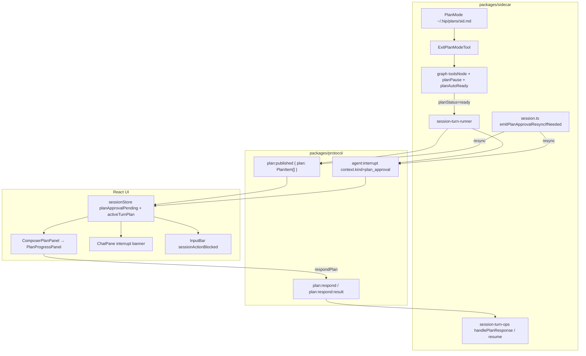
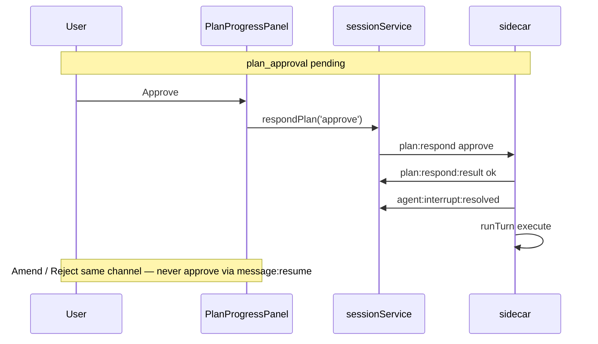
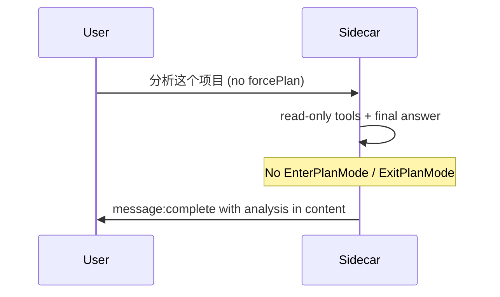
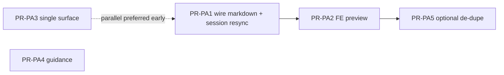

# Plan Mode Approval Surface UX — Product Correctness & Reference-Aligned Redesign

| Field | Value |
|-------|-------|
| **Title** | Plan Mode Approval Surface UX |
| **Author** | hip (design) |
| **Date** | 2026-07-20 |
| **Status** | Draft (rev 2 — review locks applied) |
| **Workspace** | hip (`/Users/lijiamin/data/my-github/hip`) |
| **Primary scope** | Single approval surface · plan.md body in UI · write_todos vs plan.md · empty/partial UX · interrupt exclusion · product guidance for plan mode |
| **Prior design** | [`docs/design/2026-07-20-long-conversation-plan-mode-ux.md`](./2026-07-20-long-conversation-plan-mode-ux.md) (D4 partially shipped) |
| **Audience** | Senior frontend + sidecar engineers |
| **Verified against** | hip `dev` branch (2026-07-20): dual-UI gate, empty ExitPlanMode gate, KD-7/8/16, plan resync |

---

## Overview

When the agent finishes plan mode (e.g. user task「分析这个项目…」), users still hit a **broken approval surface**: timeline shows only `ls` + `ExitPlanMode` with "Exited plan mode. Plan ready for review." and **no plan body**; the sticky panel can show **「计划 等待审批」+「未生成计划步骤」+ 批准/修改/拒绝**; composer locks with「请审阅上方的计划以继续」; historically a generic English interrupt banner with **继续** also appeared in parallel.

Much of the **state-machine correctness** work from the long-conversation design is **already shipped** on `dev` (KD-7 complete race, dual-UI gate, empty ExitPlanMode gate, empty-state i18n, resync, KD-8 sendMessage branches, `plan:respond:result`). This document does **not** re-design those as missing. It focuses on the **remaining product gaps**:

1. **Lock a single approval surface** — approve **only** via `plan:respond approve`; delete sidecar soft-approve-on-resume
2. **Make plan markdown first-class** in the UI (grok/kimi pattern) — wire today only carries `PlanItem[]`
3. **Define write_todos checklist vs `plan.md` narrative** — what shows where
4. **Empty / partial plan UX** after the sidecar gate (including planAutoReady)
5. **Interrupt vs plan_approval mutual exclusion + i18n** (hardcoded English questions in multiple call sites)
6. **Product guidance** for when forcePlan / plan mode is appropriate (analysis vs implementation)

**Solution sketch**: treat approval as a **document review** (markdown body + optional checklist), not a todo-only card. Ship additive `markdown` / `planPath` on `plan:published` (and durable pause marker); render a collapsible plan preview in the sticky `PlanProgressPanel`; kill residual dual CTAs; **`plan:respond` is the only approval mutation path**.

---

## Background & Motivation

### Current architecture (relevant slice)



| Layer | Role today |
|-------|------------|
| `PlanMode` (`plan-mode.ts`) | Active flag + `~/.hip/plans/<sessionId>.md` |
| `EnterPlanMode` / `ExitPlanMode` | Tools; Exit returns tool string, optional `## Plan:\n{content}` |
| `write_todos` | Structured `PlanItem[]` for execution tracking |
| `graph.ts` toolsNode | Empty ExitPlanMode **gate**: no `## Plan:` **and** no write_todos → rewrite Error, **do not** set `planStatus: ready` |
| `graph.ts` planAutoReady | If todos exist but agent **skipped** ExitPlanMode → still set `planStatus: ready` (todos-only entry) |
| `session-turn-runner` | On plan ready: `plan:published` + pause marker + `agent:interrupt(plan_approval)` |
| `session.ts` | `emitPlanApprovalResyncIfNeeded` rebuilds marker (today plan-only) and re-persists |
| FE sticky panel | `selectLivePlan` → `PlanProgressPanel` checklist + Approve/Amend/Reject |
| FE interrupt banner | `ChatPane`: shown only when `interrupt && !planApprovalPending` |
| FE composer | **Fully blocked** when `planApprovalPending` — no textarea (`InputBar` `sessionActionBlocked`) |

### User-reported pain (screenshot reality)

| Surface | What user sees | Problem |
|---------|----------------|---------|
| Interrupt banner | English "Review the plan above…" + 继续 | Dual CTA; English hardcoded; soft-approve-adjacent |
| Sticky panel | 「计划 等待审批」+ empty checklist + 批准/修改/拒绝 | Checklist empty; no narrative plan body |
| Composer | Locked:「请审阅上方的计划以继续」 | Correct block, but "above" has no plan body |
| Timeline | `ls` + ExitPlanMode "Exited plan mode…" | Plan body never rendered as first-class content |

### Already shipped (acknowledge — do not re-design)

| Item | Location / KD |
|------|----------------|
| `message:complete` does **not** clear `planApprovalPending` | `sessionStore.ts` KD-7 / D4c |
| Dual-UI gate: interrupt banner suppressed when `planApprovalPending` | `ChatPane.tsx` `showPlanApproval = Boolean(planSlice.planApprovalPending)` |
| Empty ExitPlanMode gate (no `## Plan:` and no write_todos → Error, no ready) | `graph.ts` toolsNode ~L605–625 |
| Empty awaiting i18n (`chat.planPanel.emptyAwaiting`) | en / zh-CN / … |
| Always `plan:published` on plan-approval path (even `plan: []`) | `session-turn-runner.ts` |
| Resync after `session:load` | `plan-approval-resync.ts` + `session.ts` D4c.1 |
| `hasPlanApproval` = `!!planApprovalPending` (no items requirement) | `planApproval.ts` |
| KD-8 sendMessage branches: pending → amend by default; `softApproveOnComposer` → resume | `sessionService.ts` — **programmatic only**; InputBar blocks real composer (see D1.1 / KD-PA-1) |
| `plan:respond:result` ack + FE rollback | KD-16 / D4e |
| InputBar **fully blocks** when plan approval pending (no textarea) | `InputBar.tsx` `sessionActionBlocked` |
| CLI auto HITL uses `plan:respond approve` | `packages/cli/src/client/turn-runner.ts` |

### Remaining product gaps (this design)

| # | Gap | Severity | Notes |
|---|-----|----------|-------|
| G1 | Soft-approve **resume** still lives in sidecar when `planStatus === 'ready'` | **High** | Any `message:resume` soft-approves in `session-turn-ops.ts`; FE composer is blocked so product users only hit this via multi-client / stray / programmatic resume |
| G2 | Plan **markdown body** never on wire as first-class field | **Critical** | Only inside ExitPlanMode tool result string when non-empty; UI checklist is `PlanItem[]` only — narrative-bearing and markdown-only plans look empty |
| G3 | Dual representation undefined in product UX | **High** | Agent instructed to write both plan.md **and** write_todos; panel only shows checklist |
| G4 | Partial / auto-ready paths | **Medium** | planAutoReady opens todos-only approval without Exit; markdown-only needs wire field (G2) |
| G5 | Hardcoded English plan questions at **multiple** call sites | **Medium** | `graph.planPause`, resync fallbacks, `session.ts` rebuild, runner `PAUSE_QUESTION` fallback |
| G6 | Analysis-only tasks poorly fit plan→approve→execute | **Product** | forcePlan / EnterPlanMode for "分析项目" yields empty or research-only plans |

---

## Goals & Non-Goals

### Goals

1. **One approval surface**: sticky `PlanProgressPanel` (awaiting phase) is the sole user CTA for plan approval. No 继续 / interrupt-continue dual path for `kind: plan_approval`.
2. **Approve only via `plan:respond approve`**: delete sidecar `soft_approve_resume`; deprecate product soft-approve-via-composer (composer stays blocked).
3. **Plan body first-class**: when `~/.hip/plans/<id>.md` has content at publish, FE shows a scrollable markdown preview in the approval surface.
4. **Clear dual representation**:
   - **Narrative** = plan.md markdown (design, context, approach)
   - **Checklist** = `write_todos` → `PlanItem[]` (execution tracker)
5. **Empty / partial UX** is intentional and consistent (including planAutoReady todos-only).
6. **i18n**: no user-visible English hardcodes on plan approval path; single token on wire; FE owns copy.
7. **Surgical protocol**: additive fields only; old clients ignore `markdown` and still work with checklist.
8. **Testable**: unit + e2e harness for dual-surface exclusion, markdown render/resync, resume-while-ready matrix, empty gate residual.

### Non-Goals

- Re-open KD-7/D4c complete race or full plan state machine rewrite (already shipped).
- Long-conversation TurnBlocks / `token:stream.stepSeq` (prior design PR-4/5).
- Inline line-range comments on plan (grok-build advanced) in v1 — freeform amend only.
- Multi-approach `options` picker (kimi ExitPlanMode options) in v1 — note as follow-up.
- Changing plan file path (`~/.hip/plans/`) or jail semantics.
- Full ACP agent plan-mode parity.
- Auto-extracting checklist from markdown (agent still owns write_todos).
- Re-enabling the composer during plan approval for soft-approve (explicitly rejected — see KD-PA-1).

---

## Reference Comparison

> External research repos (not vendored in hip):  
> `/Users/lijiamin/data/code-repository/github/grok-build`, `kimi-code`, `opencode`. Paths below are relative to those trees.

### grok-build (xAI pager)

| Theme | Behavior | hip today | hip target |
|-------|----------|-----------|------------|
| Approval surface | Dedicated scrollable **plan preview** + bottom action bar | Sticky checklist panel; no body | Sticky panel + markdown preview |
| Empty plan | Still opens surface with `EMPTY_PLAN_PLACEHOLDER` body; status "No plan written…" | Gate **blocks** empty Exit; empty awaiting only if residual race | Keep gate; residual empty → `emptyAwaiting` + three buttons; no dual banner |
| CTAs | `a` approve · `s` request changes · `q` quit | 批准 / 修改 / 拒绝 | Same three; no fourth 继续 |
| Plan source | File-backed `plan.md` content in `ExitPlanModeExtRequest.plan_content` | Tool string only | Wire `markdown` field |
| Comments | Line-range comments | N/A | Non-goal v1 |

Key files:  
`crates/codegen/xai-grok-pager/docs/user-guide/19-plan-mode.md`  
`crates/codegen/xai-grok-pager/src/views/plan_approval_view.rs`

### kimi-code (agent-core-v2)

| Theme | Behavior | hip today | hip target |
|-------|----------|-----------|------------|
| ExitPlanMode | Reads plan **file**; empty plan → **tool error**, no exit | Empty file allowed by tool; **graph gate** blocks ready if no markdown **and** no todos | Keep graph OR gate (KD-PA-2) |
| Review UI | `display.kind: 'plan_review'` with full plan string | Checklist-only | Markdown + checklist |
| Empty plan | Hard fail: write plan file first | Graph rewrites Exit result as Error | Align messaging with graph Error string |
| Options | Up to 3 alternative approaches | N/A | Follow-up |
| Research vs plan | Do **not** ExitPlanMode for pure research | Not enforced in product | Product guidance §D6 |

Key files:  
`packages/agent-core-v2/src/agent/plan/tools/exit-plan-mode.ts`  
`exit-plan-mode.md`  
`permissionPolicy/policies/exit-plan-mode-review-ask.ts`

### opencode

| Theme | Behavior | hip today | hip target |
|-------|----------|-----------|------------|
| Exit | `plan_exit` asks user via Question service: switch to **build agent**? | Same session, planStatus approved → execute | Keep single-session approve; no agent switch |
| Plan file | Path-relative plan file in question text | Hidden path in tool result only | Optional `planPath` in preview footer |
| CTAs | Yes / No (stay in plan agent) | Approve / Amend / Reject | Map: Yes≈Approve, No≈Amend stay in plan |

Key files:  
`packages/opencode/src/tool/plan.ts`, `plan-exit.txt`

### Synthesis (product rules for hip)

```
R1. Approval = document review (markdown) + optional execution checklist (PlanItem[]).
R2. Empty both → agent cannot open approval (Exit gate). Partial (one of two) OR planAutoReady todos → approval opens with clear empty half.
R3. Exactly one user CTA surface for plan_approval: sticky panel. Interrupt banner never for plan_approval.
R4. Approve only via plan:respond {approve}. Reject/amend via plan:respond. message:resume never approves.
R5. User-visible strings live in FE i18n; wire question for plan_approval is PLAN_APPROVAL_QUESTION_TOKEN everywhere.
```

---

## Proposed Design

### D1 — Single approval surface (lock-in)

#### D1.1 UI mutual exclusion + composer reality

| Condition | Interrupt banner (`data-testid="chat-interrupt"`) | Sticky plan panel | Composer (`InputBar`) |
|-----------|---------------------------------------------------|-------------------|------------------------|
| `planApprovalPending` | **Hidden** (already) | **Visible**, phase `awaiting_approval` | **Fully blocked** — no textarea; copy `chat.planApproval.reviewAbove` |
| Other interrupt (`!plan_approval`) | Visible + 继续 | Hidden / not awaiting | Unblocked → `message:resume` |
| Permission HITL | Permission UI elsewhere | N/A | Blocked; if both pending ever set, InputBar prefers permission copy (`pendingPermission ? … : planApproval`) — no change required |

**Invariants**:

```
planApprovalPending  ⇒  !render(interruptBanner)
planApprovalPending  ⇒  !composerEditable   // product UI; panel owns Approve/Amend/Reject + amend textarea
```

**Important**: Amend freeform text is collected **inside** `PlanProgressPanel` (nested `plan-approval-card` actions), **not** the main composer. KD-8 `sendMessage` branches when `planApprovalPending` are reachable only **programmatically** (unit tests, e2e hooks, multi-client). Normal users never type into the bar during approval.

#### D1.2 Soft-approve elimination (single locked decision — KD-PA-1)

**Target (authoritative — no dual story):**

| Entry | Behavior after this design |
|-------|----------------------------|
| `plan:respond approve` | **Only** approve path: exit plan mode, persist, execute |
| `plan:respond amend` | Stay in plan, `planStatus: generating`, append feedback |
| `plan:respond reject` | Cancel plan mode; `PLAN_REJECTED` |
| `message:resume` while `planStatus === 'ready'` and text **non-empty** | **Amend** (same base as `plan:respond amend`) — log `action: 'resume_as_amend'` |
| `message:resume` while ready and text **empty** (and no usable attachments for text) | **Structured error** — do **not** approve; e.g. `send({ type: 'error', code: 'PLAN_AWAITING_RESPONSE', message: '…' })` or resume result equivalent; leave pause intact |
| Desktop sticky panel buttons | `respondPlan(...)` only |
| CLI auto HITL | Already `plan:respond approve` — unchanged |
| `hip.toml [plan] softApproveOnComposer` | **Deprecated** (no product UI path; composer blocked). Config may still parse for back-compat; **FE ignores** the flag (remove resume branch). Eval/automation uses panel / `plan:respond` / e2e hooks |

**Sidecar change** (`session-turn-ops.ts` ~L103–142): **delete** the `soft_approve_resume` block that exits plan mode + `planStatus: 'approved'` + `runTurn` execute. Replace with amend-or-error as above.

**FE change** (`sessionService.sendMessage`): remove softApprove → resume branch. If somehow called while pending:

- non-empty text → `respondPlan('amend', text)` (today’s default)
- empty → no-op / toast (composer cannot send empty in product UI anyway)

**Not required**: emit `plan:respond:result` for resume-as-amend (different wire). Log only.

#### D1.3 Client matrix (after PA3)

| Client / entry | Expected action |
|----------------|-----------------|
| Desktop panel Approve / Reject / Amend | `plan:respond` |
| Desktop composer while pending | N/A — blocked |
| Desktop `softApproveOnComposer` | **No-op** (deprecated); do not resume |
| Desktop interrupt 继续 | Only when `!planApprovalPending`; non-plan resume |
| CLI auto HITL | `plan:respond approve` (already) |
| Programmatic `message:resume` + non-empty | Sidecar **amend** |
| Programmatic `message:resume` + empty | Sidecar **error**, still awaiting |
| Multi-client stray resume | Same as programmatic (cannot soft-approve) |
| e2e harness | Panel buttons / `respondPlan` (already) |

#### D1.4 Sequence



---

### D2 — Plan markdown as first-class wire + UI

#### D2.1 Protocol (additive)

Add three optional fields to the **existing** `plan:published` member of `ServerMessage` in `packages/protocol/src/messages.ts` (today ~L407):

```ts
// BEFORE
| { type: 'plan:published'; sessionId: string; turnId: string; plan: PlanItem[] }

// AFTER
| {
    type: 'plan:published'
    sessionId: string
    turnId: string
    plan: PlanItem[]
    /** plan.md body at publish time; JS string.length units; see clipPlanMarkdown */
    markdown?: string
    planPath?: string
    markdownTruncated?: boolean
  }
```

Protocol is TS-only union (no runtime decoder that strips unknown fields). Old clients ignore new keys.

**Interrupt context JSON** (string on `agent:interrupt.context`):

```ts
// Prefer lean context when plan:published already carries markdown (live + resync order).
{ kind: 'plan_approval', plan: PlanItem[] }
// Optional fallback fields if a client only sees interrupt (should not be needed after PA1):
// markdown?, planPath?, markdownTruncated?
```

**KD-PA-5 storage policy**: markdown is stored **once** on the durable pause marker + emitted on `plan:published`. Interrupt context **defaults to** `{ kind, plan }` only (FE processes published before interrupt on both live and resync). Avoids ~64KB duplicate on the wire.

#### D2.2 Clip algorithm (explicit)

```ts
// packages/sidecar/src/session/plan-markdown-wire.ts
/** Same magnitude as DELEGATE_BLOB_CAP / REASONING_CAP (32768), NOT TOOL_BLOB_CAP (4096). */
export const PLAN_MARKDOWN_WIRE_CAP = 32_768
const TRUNC_SUFFIX = '\n\n…(truncated)'

/**
 * Measure with JS string.length (UTF-16 code units), matching tool-trace clip().
 * Final text.length is always <= PLAN_MARKDOWN_WIRE_CAP.
 * Do NOT call bare clip() if a suffix is required — compose as below.
 */
export function clipPlanMarkdown(raw: string): { text: string; truncated: boolean } {
  if (!raw) return { text: '', truncated: false }
  if (raw.length <= PLAN_MARKDOWN_WIRE_CAP) return { text: raw, truncated: false }
  const budget = PLAN_MARKDOWN_WIRE_CAP - TRUNC_SUFFIX.length
  // budget > 0 because CAP >> suffix length
  return { text: raw.slice(0, budget) + TRUNC_SUFFIX, truncated: true }
}
```

#### D2.3 Sidecar emit path (publish)

At plan-approval publish (`session-turn-runner.ts`), while `planMode` is still active (ExitPlanMode does **not** call `exit()`):

```ts
const markdownRaw = await host.planMode.readPlan().catch(() => '')
const clipped = clipPlanMarkdown(markdownRaw)
const planPath = host.planMode.planFilePath ?? undefined
const plan = finalState.plan ?? []

send({
  type: 'plan:published',
  sessionId: host.id,
  turnId,
  plan,
  ...(clipped.text.trim()
    ? { markdown: clipped.text, markdownTruncated: clipped.truncated }
    : {}),
  ...(planPath ? { planPath } : {}),
})

host.persistPlanApprovalPause?.({
  turnId,
  plan,
  question: PLAN_APPROVAL_QUESTION_TOKEN,
  ...(clipped.text.trim()
    ? { markdown: clipped.text, markdownTruncated: clipped.truncated }
    : {}),
  ...(planPath ? { planPath } : {}),
})

send({
  type: 'agent:interrupt',
  sessionId: host.id,
  turnId,
  agentId: 'supervisor',
  question: PLAN_APPROVAL_QUESTION_TOKEN,
  context: JSON.stringify({ kind: 'plan_approval', plan }),
})
```

**Always** `readPlan()` at publish — works for ExitPlanMode path **and** planAutoReady (todos without Exit).

Extend host interface `persistPlanApprovalPause` marker type with optional markdown fields.

#### D2.4 Resync must preserve markdown (`session.ts` — critical)

Today `emitPlanApprovalResyncIfNeeded` rebuilds a **plan-only** marker and **re-persists**, wiping any rich durable marker:

```ts
// session.ts ~L1066–1073 TODAY (broken for markdown)
const marker = {
  turnId: this.paused.interruptTurnId ?? `plan-resync-${this.id}`,
  plan: this.paused.plan ?? [],
  question: 'Approve this plan?',
}
this.persistPlanApprovalPause(marker) // overwrites rich marker
emitPlanApprovalResync(send, this.id, marker)
```

**Target algorithm**:

```ts
emitPlanApprovalResyncIfNeeded(send): void {
  this.restorePlanApprovalPauseFromConfig()
  if (!awaiting ready plan pause) return

  const durable = readPlanApprovalPause(this._config)
  let markdown = durable?.markdown
  let planPath = durable?.planPath
  let markdownTruncated = durable?.markdownTruncated
  // Prefer re-read live file when plan mode still active / file on disk
  if (this.planMode?.isActive || this.planMode?.planFilePath) {
    const raw = await-or-sync read if available
    // if async, keep sync design: restore already happened; re-read in async helper
  }
  // Preferred v1 (sync-safe):
  // 1) If durable has markdown → use it
  // 2) Else try planMode.readPlan() if path known (async path: make emit async or pre-read in restore)
  // 3) Else markdown omitted

  const marker: PlanApprovalPauseMarker = {
    turnId: this.paused.interruptTurnId ?? durable?.turnId ?? `plan-resync-${this.id}`,
    plan: this.paused.plan ?? durable?.plan ?? [],
    question: PLAN_APPROVAL_QUESTION_TOKEN,
    ...(markdown?.trim() ? { markdown, markdownTruncated: Boolean(markdownTruncated) } : {}),
    ...(planPath ? { planPath } : {}),
  }

  // Never re-persist a stripped marker over a rich one:
  // only persist if durable missing fields that we filled, or turnId resolved.
  this.persistPlanApprovalPause(mergePreferringExistingMarkdown(durable, marker))
  emitPlanApprovalResync(send, this.id, marker)
}
```

**`emitPlanApprovalResync`** (module): emit `plan:published` **with** markdown fields from marker, then interrupt with lean context + `question: PLAN_APPROVAL_QUESTION_TOKEN`.

**In-memory `paused`**: optional `markdown?` on pause object is nice-to-have; durable marker + file re-read are sufficient for v1.

**Unit test (required)**: persist marker with markdown → `emitPlanApprovalResyncIfNeeded` → both `plan:published.markdown` present and durable marker still has markdown after call.

#### D2.5 FE store

```ts
// SessionVM additive
activeTurnPlanMarkdown?: string | null
activeTurnPlanPath?: string | null
activeTurnPlanMarkdownTruncated?: boolean
```

| Event | Plan items | Markdown fields |
|-------|------------|-----------------|
| `plan:published` | set | set if present; **clear** if omitted (new publish without body) |
| `plan:updated` | set | **keep** prior markdown |
| `respondPlanOptimistic` approve | **keep** (execute sticky) | **keep** until next user turn (D3.4 expand) |
| `respondPlanOptimistic` amend | keep items | **keep** until next `plan:published` replaces |
| `respondPlanOptimistic` reject / `PLAN_REJECTED` / interrupt resolved after reject | clear | **clear** |
| `appendUserMessage` | clear | **clear** |
| `session:loaded` | clear | **clear**; wait resync |
| `plan:respond:result` ok:false | restore via rollback | rollback should include markdown snapshot if we stash it (extend `planRespondRollback` optionally; if not stashed, resync/republish is rare — v1: stash markdown in rollback alongside interrupt) |

#### D2.6 UI components

**Primary surface**: extend `PlanProgressPanel` (sticky). **Do not** mount free-floating `PlanApprovalCard` in ChatPane (panel already nests `data-testid="plan-approval-card"` for actions).

```
┌─ PlanProgressPanel (awaiting_approval) ─────────────────┐
│ 📋 计划 · 等待审批                                        │
│                                                          │
│ ┌─ PlanMarkdownPreview (if markdown) ──────────────────┐ │
│ │ ## Context …                                         │ │
│ │ (scroll max-h-64 / expand)                           │ │
│ │ path footer · truncated notice                       │ │
│ └──────────────────────────────────────────────────────┘ │
│                                                          │
│ Checklist (if items.length)  or empty half-state copy    │
│                                                          │
│ [批准] [修改] [拒绝]                                      │
└──────────────────────────────────────────────────────────┘
```

| Component | Change |
|-----------|--------|
| `PlanProgressPanel` | Accept `markdown?`, `planPath?`, `truncated?`; render preview above checklist |
| `PlanMarkdownPreview` (**new**, small) | Chat **`MarkdownBody`** (not KnowledgeMarkdownBody) + max-height + expand; `data-testid="plan-markdown-preview"`. Mermaid/katex = follow-up if dogfood needs diagrams |
| `ComposerPlanPanel` | Pass markdown fields from session VM via `selectLivePlan` extension |
| `PlanApprovalCard` | Orphan / shared actions only — **no second mount** |
| `ChatPane` | Keep `!showPlanApproval` gate; defensive: never render raw `interrupt.question` when context kind is `plan_approval` |
| `InputBar` | Unchanged full block |

**`LivePlanView` additive**:

```ts
export interface LivePlanView {
  items: PlanItem[]
  phase: PlanPhase
  source: LivePlanSource
  progress: { done: number; total: number; current?: string }
  markdown?: string | null
  planPath?: string | null
  markdownTruncated?: boolean
}
```

#### D2.7 Timeline / tool result

ExitPlanMode tool result may still embed `## Plan:\n…` for the model. UI **must not** parse tool output for the approval surface. Optional PR-PA5: shorten UI-facing tool string when markdown is published separately.

---

### D3 — Checklist vs plan.md dual representation

#### D3.1 Definitions

| Artifact | Source | Lifecycle | Primary UX role |
|----------|--------|-----------|-----------------|
| **Narrative plan** | `Write`/`Edit` → `~/.hip/plans/<sid>.md` | Draft during planning; snapshotted at publish | **Approval review** |
| **Execution checklist** | `write_todos` → graph `plan` / `PlanItem[]` | Live during plan + execute | **Progress tracker** |

#### D3.2 Agent contract (prompts — surgical)

Existing `fullPlanReminder` already requires both Write plan file **and** write_todos. Clarify:

1. For **implementation** plans: prefer **both** narrative + todos.
2. Gate still allows XOR (KD-PA-2) for correctness.
3. Pure research / analysis: prefer **not** calling ExitPlanMode (D6).

**Approve with empty checklist**: execute starts with `plan: []`. Optional non-v1 follow-up: inject a light system nudge to materialize todos once. Out of v1 — stated so implementers do not invent it.

#### D3.3 Display matrix

| markdown | items | Approval panel shows |
|----------|-------|----------------------|
| non-empty | non-empty | Markdown preview + checklist |
| non-empty | empty | Markdown preview + `emptyChecklist` meta |
| empty | non-empty | Checklist only + `emptyMarkdown` meta |
| empty | empty | **Exit gate blocks** (no awaiting). Residual race: existing `emptyAwaiting` + three buttons |

#### D3.4 During execute (`phase: executing|done`)

Prefer checklist (progress). Collapse markdown by default; optional "查看计划正文" expand reading stored markdown until next user turn clears (D2.5 approve keeps markdown).

---

### D4 — Empty / partial plan UX after gate

#### D4.1 Gate (shipped) + planAutoReady

```ts
// graph.ts toolsNode — shipped Exit gate
if (ExitPlanMode && !Error) {
  if (!hasMarkdownPlan && !hasPlanItems) {
    // rewrite Error; planStatus NOT ready
  } else {
    planStatus = 'ready'
  }
}
```

**planAutoReady** (`graph.ts` ~L798–820): when agent produced write_todos but **skipped** ExitPlanMode, graph still sets `planStatus: 'ready'`. That path:

- Never produces ExitPlanMode tool output with `## Plan:`
- Still opens approval (todos-only) — **valid**
- Markdown is still recovered at publish via `readPlan()` if the file was written

Implementers must **not** assume approval always goes through ExitPlanMode tool + gate. Publish always `readPlan()` regardless of Exit vs auto-ready.

After Exit gate fails, agent continues with Error tool message → re-plan. **No approval UI**. Error string is model-facing English — OK.

#### D4.2 Partial open labels (i18n)

| Key | en (sketch) |
|-----|-------------|
| `chat.planPanel.emptyMarkdown` | No plan document was written. Review the checklist below. |
| `chat.planPanel.emptyChecklist` | No execution steps yet. The plan document above is what you approve. |
| `chat.planPanel.emptyAwaiting` | (existing) No plan was written yet. Approve to start anyway… |
| `chat.planPanel.markdownTruncated` | Plan document truncated for display. |

#### D4.3 CTA semantics

| Action | Behavior |
|--------|----------|
| **Approve** | Exit plan mode, persist checklist (may be `[]`), run execute turn |
| **Amend** | Feedback → stay `planningMode: plan`, `planStatus: generating` |
| **Reject** | Cancel plan mode; `PLAN_REJECTED` notice |

#### D4.4 Optional tighten

**KD-PA-2**: Tool allows empty file (write_todos-only OK). Graph requires **at least one of** markdown body marker (`## Plan:`) **or** todos (Exit path). planAutoReady requires todos. Matches shipped behavior.

---

### D5 — Interrupt vs plan_approval + i18n

#### D5.1 Single token everywhere

```ts
// packages/sidecar/src/session/plan-approval-token.ts (or next to doom-loop / plan-approval-resync)
export const PLAN_APPROVAL_QUESTION_TOKEN = 'plan_approval' as const
```

| Call site (today) | Target |
|-------------------|--------|
| `graph.ts` planPause question EN string | `PLAN_APPROVAL_QUESTION_TOKEN` |
| `session-turn-runner` `pendingQuestion ?? PAUSE_QUESTION` on plan-approval path | Prefer `pendingQuestion` from planPause (token); **never** `PAUSE_QUESTION` when `isPlanApproval` |
| `plan-approval-resync.ts` fallback `'Approve this plan?'` | `PLAN_APPROVAL_QUESTION_TOKEN` |
| `session.ts` rebuild `'Approve this plan?'` | `PLAN_APPROVAL_QUESTION_TOKEN` |
| Persist marker `question` | Always token |

#### D5.2 FE display

| Kind | `question` field | FE display |
|------|------------------|------------|
| `plan_approval` | `PLAN_APPROVAL_QUESTION_TOKEN` | Sticky panel i18n only (`chat.planApproval.*`) |
| doom / other pause | Keep `PAUSE_QUESTION` | Interrupt banner |

**Defensive**: FE must **never** render `interrupt.question` when context parses to `kind === 'plan_approval'` (even if `planApprovalPending` falsely false). Prefer hide banner when context kind is plan_approval **or** pending.

#### D5.3 Logging

`logInfo` already slices question to 200 chars — fine with token. Log `markdownLen` / `truncated` never full body.

---

### D6 — When plan mode is appropriate (product guidance)

Align with grok-build user guide + kimi ExitPlanMode docs. **No mandatory code gate in v1** unless cheap prompt-only.

#### Appropriate for forcePlan / EnterPlanMode

- Architectural ambiguity (auth, caching, real-time transport)
- Multi-file redesign where wrong approach wastes work
- Unclear requirements that need exploration **before** code

#### Not appropriate

- Pure **analysis / research** ("分析这个项目", "这段代码在干什么") — explore + answer; no ExitPlanMode
- Single obvious edits (typo, rename, small button)
- Bug fix with clear once-understood path
- "Start working on X" when user wants execution not a ceremony

#### Implementation levers (light)

| Lever | Change |
|-------|--------|
| EnterPlanMode tool description | "Do not use for pure research/analysis tasks that only need a written answer." |
| forcePlan / PLAN_EXIT_NUDGE | Surgical reminder line |
| UI chip tooltip / i18n | `chat.plan.whenToUse` short guidance |

**KD-PA-4**: Ship prompt + i18n guidance only in v1; no classifier auto-skipping ExitPlanMode.

---

### D7 — End-to-end target sequence

```mermaid
sequenceDiagram
  participant U as User
  participant UI as React
  participant SC as Sidecar
  U->>UI: /plan + implementation task
  UI->>SC: forcePlan + message
  SC->>SC: planMode.enter + explore + Write plan.md + write_todos
  SC->>SC: ExitPlanMode OR planAutoReady
  SC->>UI: message:complete stopped
  Note over UI: planApprovalPending unchanged (KD-7)
  SC->>UI: plan:published plan + markdown
  SC->>UI: agent:interrupt kind=plan_approval question=token
  UI->>UI: sticky panel markdown+checklist; no interrupt banner; composer blocked
  U->>UI: Approve
  UI->>SC: plan:respond approve
  SC->>UI: plan:respond:result ok + interrupt:resolved
  SC->>SC: execute turn
```

**Analysis path (no approval)**:



---

## API / Interface Changes

### Protocol (additive only)

```ts
// plan:published — add optional markdown?, planPath?, markdownTruncated?
// plan:respond / plan:respond:result — unchanged
// agent:interrupt — question = PLAN_APPROVAL_QUESTION_TOKEN; lean context { kind, plan }
```

### Pause marker

```ts
export type PlanApprovalPauseMarker = {
  turnId: string
  plan: PlanItem[]
  question: string  // always PLAN_APPROVAL_QUESTION_TOKEN for plan approval
  markdown?: string
  planPath?: string
  markdownTruncated?: boolean
}
```

### FE domain

```ts
// SessionVM — activeTurnPlanMarkdown?, activeTurnPlanPath?, activeTurnPlanMarkdownTruncated?
// LivePlanView — same optional fields
// planRespondRollback — optionally stash markdown for ok:false restore
```

### Sidecar helpers (new small)

```ts
// plan-markdown-wire.ts — PLAN_MARKDOWN_WIRE_CAP, clipPlanMarkdown
// plan-approval-token.ts — PLAN_APPROVAL_QUESTION_TOKEN
```

### Config

```toml
# hip.toml
[plan]
# DEPRECATED for product UI (composer is blocked during approval).
# Still parsed for back-compat; FE ignores. Eval/CLI use plan:respond.
# softApproveOnComposer = false
```

### Before / after UX

| Before | After |
|--------|-------|
| Checklist-only sticky panel | Markdown preview + checklist |
| Multiple EN question strings | Single token `plan_approval` |
| resume soft-approves in sidecar | resume → amend (non-empty) or error (empty); **never** approve |
| softApproveOnComposer product story | Deprecated; panel is only CTA |
| Resync drops markdown | session.ts preserves / re-reads body |

---

## Data Model Changes

### Session VM / pause marker

| Field | Persist? | Notes |
|-------|----------|-------|
| `activeTurnPlan` | Via events; pause marker | Existing |
| markdown on marker | SessionConfig internal key for pause lifetime | Clipped; KD-PA-8 — not forced into transcript Message rows |
| plan.md on disk | Yes under `~/.hip/plans/` | Unchanged; preferred re-read source on resync |

### SessionConfig size

- Marker may hold up to ~32KB markdown for pause lifetime.
- Acceptable for desktop SQLite/config; do not also put full markdown on interrupt context (D2.1).
- On approve/reject, clear marker via existing `withoutPlanApprovalPause`.

### Migration

- None for DB schema. Old markers without markdown: FE checklist-only; resync may re-read file if plan mode / path still valid.

### Privacy

- Markdown may contain pathnames / secrets. Same trust boundary as plan file and tool outputs. Clip for wire; log lengths only.

---

## Alternatives Considered

### Alt A — Parse ExitPlanMode tool output on FE for markdown

- **Pros**: No protocol change  
- **Cons**: Tool output clipped; dual language; ordering; empty Exit has no body; planAutoReady has no Exit tool; resync has no tool call  
- **Decision**: Reject. Additive wire field is cleaner.

### Alt B — Mount PlanApprovalCard in ChatPane (message-adjacent modal)

- **Pros**: Matches "review above" literally in transcript  
- **Cons**: Second surface vs sticky; scroll away  
- **Decision**: Reject for v1. Sticky remains sole surface.

### Alt C — Require markdown always (kimi strict); reject todos-only

- **Pros**: Always have narrative  
- **Cons**: Breaks write_todos-only flows, planAutoReady, existing e2e  
- **Decision**: Reject. Keep graph OR gate + planAutoReady.

### Alt D — Keep soft-approve via `message:resume` opt-in

- **Pros**: Matches early KD-8 wire path  
- **Cons**: Dual approve path; multi-client holes; composer is **blocked** so product flag is a lie; contradicts single-surface goal  
- **Decision**: **Superseded / rejected.** Delete `soft_approve_resume`; deprecate `softApproveOnComposer`.

### Alt D2 — Hard error on all resume-while-ready (no amend)

- **Pros**: Forces clients onto `plan:respond` only  
- **Cons**: Breaks programmatic multi-client “type feedback to revise” if someone sends resume with text; amend-via-resume is a safe compatibility bridge  
- **Decision**: Reject. Non-empty resume → amend; empty → error.

### Alt D3 — Re-enable composer when softApprove flag true → respondPlan('approve')

- **Pros**: Makes flag user-reachable  
- **Cons**: Two UIs for Approve (panel button + send); easy mis-click; empty-send / attachments ambiguity  
- **Decision**: Reject. Panel Approve is enough; CLI already uses plan:respond.

### Alt E — Full grok line-comments + options picker

- **Pros**: Best-in-class review  
- **Cons**: Large UI/protocol  
- **Decision**: Defer to follow-up RFC.

---

## Security & Privacy Considerations

| Topic | Treatment |
|-------|-----------|
| Plan markdown on wire | Clipped to 32_768 `string.length`; on `plan:published` + durable marker; lean interrupt context |
| SessionConfig growth | Up to ~32KB for pause lifetime; cleared on resolve |
| planPath | Absolute path under home; meta footer only |
| Logging | Lengths + truncated; no full plan body |
| Soft-approve | Removed — reduces accidental execute |
| Injection | Chat `MarkdownBody` (same trusted assistant path as chat). KnowledgeMarkdownBody / mermaid deferred |

---

## Observability

| Signal | Where |
|--------|-------|
| `plan:published` with `markdownLen`, `planItemCount`, `truncated` | session-turn-runner logInfo |
| `plan:respond` actions | existing |
| `resume_as_amend` / empty resume error | session-turn-ops (no `soft_approve_resume`) |
| Resync with/without markdown | plan-approval-resync + session.ts tests |
| FE: missing markdown when file non-empty | optional dev assert |

---

## Rollout Plan

**Recommended merge order for dogfood**: **PA3 ∥ PA1**, then **PA2**, then **PA4**. PA3 must not lag — multi-client resume soft-approve is High severity independent of markdown.

1. **PR-PA3** kill soft-approve + question token (can land first or parallel with PA1)
2. **PR-PA1** protocol + publish markdown + resync preserve (`session.ts`)
3. **PR-PA2** FE preview + half-states
4. **PR-PA4** product prompts + i18n guidance
5. Dogfood forcePlan implementation tasks + analysis without forcePlan
6. **Rollback**: FE feature-detect `markdown?` — omit render if absent. Soft-approve removal is not rolled back via config flag (flag deprecated). If emergency approve-from-resume needed, temporary hotfix only — not a product toggle.

No feature flag required for markdown (additive optional).

---

## Test Plan

### Unit

| Area | Cases |
|------|-------|
| `clipPlanMarkdown` | empty; short; over cap final `length <= CAP` and ends with suffix; truncated flag |
| `applyServerMessage` `plan:published` | with/without markdown; clear on user message; approve keeps markdown; reject clears |
| `selectLivePlan` | markdown + items matrix; awaiting empty |
| `ChatPane` gate | planApprovalPending hides interrupt; defensive hide when context kind plan_approval |
| `sendMessage` | pending → amend; **no** softApprove → resume branch |
| `session-turn-ops` resume | ready + non-empty → amend (not approved); ready + empty → error + still awaiting; **no** `soft_approve_resume` |
| `emitPlanApprovalResyncIfNeeded` | persist with markdown → resync emit includes markdown on `plan:published`; does not strip durable marker |
| graph gate | both empty → Error |
| planAutoReady | todos without Exit → ready; publish readPlan still runs |

### Integration / e2e harness

| Spec | Assert |
|------|--------|
| `harness-plan-approval.spec.ts` | seed markdown; `plan-markdown-preview` visible; interrupt absent; approve dismisses |
| New harness seeds | todos-only; markdown-only; both |
| Empty gate | sidecar unit: Exit without either → not ready |
| Resume while ready | non-empty does not execute as approve |

### Manual dogfood

1. forcePlan + "add feature X" → markdown body visible → panel Approve → execute  
2. forcePlan + analysis-like prompt → no dual banner; amend/reject or partial body  
3. Reload mid-approval → resync restores checklist **and** markdown when present  
4. ~~Soft-approve flag on → composer~~ **Removed** — use panel Approve; CLI auto-approve path smoke if needed  

---

## Risks

| Risk | Sev | Mitigation |
|------|-----|------------|
| Double UI if PlanApprovalCard remounted | **H** | Do not mount card in ChatPane |
| Large markdown jank in sticky | **M** | max-height + expand; 32_768 cap |
| resume-as-amend surprises automation that expected soft-approve | **M** | Document; update e2e; CLI already plan:respond |
| planMode inactive at publish → empty markdown | **H** | Read plan before any exit; unit test order |
| session.ts resync strips markdown | **H** | PA1 includes session.ts; never persist stripped over rich |
| Interrupt token shows if gate regresses | **L** | Token unreadable; defensive FE hide by context kind |
| Analysis tasks still enter plan ceremony | **M** | Prompt/i18n guidance (D6) |
| SessionConfig 32KB marker | **L** | Accept for pause lifetime; lean interrupt context |

---

## Open Questions

| # | Question | Resolution |
|---|----------|------------|
| Q1 | resume-while-ready: amend vs hard error? | **Non-empty amend; empty error** (KD-PA-1) |
| Q2 | softApproveOnComposer product path? | **Deprecated** (composer blocked; Alt D3 rejected) |
| Q3 | Show planPath to users? | Meta footer, truncated home path |
| Q4 | Persist markdown into session history messages? | **No** (KD-PA-8) |
| Q5 | kimi-style multi-options on Exit? | Follow-up |
| Q6 | Auto-skip plan mode for analysis intents? | No classifier v1 |
| Q7 | Nudge write_todos after approve with empty items? | Out of v1 |

---

## References

- hip prior: `docs/design/2026-07-20-long-conversation-plan-mode-ux.md` (D4, KD-6–8, KD-14, KD-16)
- hip code:  
  - `packages/sidecar/src/session/graph.ts` (gate, planPause, planAutoReady)  
  - `packages/sidecar/src/session/tools/exit-plan-mode.ts`  
  - `packages/sidecar/src/session/session-turn-runner.ts` (publish + interrupt)  
  - `packages/sidecar/src/session/session-turn-ops.ts` (soft-approve resume — to delete; handlePlanResponse)  
  - `packages/sidecar/src/session/session.ts` (`emitPlanApprovalResyncIfNeeded`)  
  - `packages/sidecar/src/session/plan-approval-resync.ts`  
  - `packages/sidecar/src/session/tool-trace.ts` (`TOOL_BLOB_CAP=4096`, `DELEGATE_BLOB_CAP`/`REASONING_CAP=32768`)  
  - `packages/protocol/src/messages.ts` (`plan:published`)  
  - `packages/cli/src/client/turn-runner.ts` (already plan:respond)  
  - `src/components/chat/{ChatPane,ComposerPlanPanel,PlanProgressPanel,PlanApprovalCard,InputBar,planApproval}.tsx`  
  - `src/lib/todos.ts` (`selectLivePlan`)  
  - `src/domain/sessionService.ts` (KD-8 send path — softApprove branch to remove)
- External (not in hip tree): grok-build `19-plan-mode.md`, `plan_approval_view.rs`; kimi-code exit-plan-mode + review-ask; opencode `plan.ts`

---

## Key Decisions

| ID | Decision | Choice | Rationale |
|----|----------|--------|-----------|
| **KD-PA-1** | Approve path | **Only** `plan:respond approve`. Delete sidecar `soft_approve_resume`. Resume-while-ready: non-empty → **amend**, empty → **error**. **Deprecate** `softApproveOnComposer` (composer blocked; no product path). | Single mutation path; closes multi-client hole; matches UI reality |
| **KD-PA-2** | Empty Exit gate | Keep OR of (markdown body **or** write_todos); planAutoReady remains valid todos-only entry | Matches shipped gate + e2e |
| **KD-PA-3** | plan_approval question | Single constant `PLAN_APPROVAL_QUESTION_TOKEN = 'plan_approval'` at planPause, runner, resync fallback, session rebuild, marker | Removes all EN hardcodes; FE never renders token as UX copy |
| **KD-PA-4** | Analysis vs plan | Prompt + i18n guidance only; no auto classifier | Surgical |
| **KD-PA-5** | Plan body transport | Additive `markdown` (+ path, truncated) on `plan:published` + durable marker; lean interrupt context `{kind,plan}` | First-class UI; resync-friendly; avoid double 32KB on wire |
| **KD-PA-6** | Approval chrome | **Single** sticky `PlanProgressPanel`; never dual interrupt 继续 | Aligns grok one-surface |
| **KD-PA-7** | Dual representation | Narrative = plan.md; Checklist = write_todos; show both with half-empty labels; prefer both in prompts | Clear product roles |
| **KD-PA-8** | Markdown persistence | Wire + pause marker (+ file on disk); not forced into Message rows | Privacy/volume; prior KD-14 |
| **KD-PA-9** | PlanApprovalCard in ChatPane | Do **not** mount; panel owns test id | Avoid dual CTAs |
| **KD-PA-10** | Clip size | `PLAN_MARKDOWN_WIRE_CAP = 32_768` via `string.length`; suffix **inside** cap; not `TOOL_BLOB_CAP` | Align DELEGATE/REASONING caps; explicit algorithm |
| **KD-PA-11** | Markdown renderer | Chat `MarkdownBody` v1; mermaid/katex follow-up | Surgical; parity with chat |
| **KD-PA-12** | Resync ownership | `session.ts` `emitPlanApprovalResyncIfNeeded` must preserve/re-read markdown; never strip rich marker | Success criterion §6 |

---

## PR Plan

### PR-PA1 — Wire markdown on plan:published + resync preserve

| | |
|--|--|
| **Title** | `feat(plan): publish plan.md markdown on plan:published and preserve on resync` |
| **Depends on** | None (builds on shipped D4b/D4c.1) |
| **Files** | `packages/protocol/src/messages.ts`; `packages/sidecar/src/session/plan-markdown-wire.ts` (new); `session-turn-runner.ts` (publish + marker); `plan-approval-resync.ts` (marker type + emit); **`session.ts`** (`emitPlanApprovalResyncIfNeeded`, `restorePlanApprovalPauseFromConfig` if needed); host `persistPlanApprovalPause` types; unit tests for clip + resync preserve |
| **Description** | Additive `markdown?`, `planPath?`, `markdownTruncated?` on `plan:published`. `clipPlanMarkdown` with 32_768 `string.length` and in-cap suffix. Always `readPlan()` at publish (Exit **and** planAutoReady). Persist rich marker. Fix `emitPlanApprovalResyncIfNeeded` so rebuild **never** overwrites a rich marker with plan-only; replay includes markdown on `plan:published`. Lean interrupt context `{kind, plan}`. Log lengths not body. |

### PR-PA2 — FE plan markdown preview + dual half-states

| | |
|--|--|
| **Title** | `feat(plan): sticky panel markdown preview and dual empty labels` |
| **Depends on** | PR-PA1 |
| **Files** | `src/domain/sessionStore.ts` (+ tests, clear matrix D2.5); `src/lib/todos.ts`; `src/components/chat/PlanProgressPanel.tsx`; new `PlanMarkdownPreview.tsx` (chat `MarkdownBody`); `ComposerPlanPanel.tsx`; `ChatPane.tsx` defensive context-kind hide; i18n en/zh-CN/zh-TW/ja/ko; e2e hooks seed + `harness-plan-approval.spec.ts` |
| **Description** | Store markdown fields; extend `LivePlanView`; collapsible preview above checklist; half-empty copy; approve keeps markdown until next user turn; harness asserts preview. Do not mount ChatPane card. |

### PR-PA3 — Single surface lock-in (delete soft-approve + question token)

| | |
|--|--|
| **Title** | `fix(plan): approve only via plan:respond; resume-as-amend; plan_approval token` |
| **Depends on** | None (parallel with PA1) |
| **Files** | `packages/sidecar/src/session/session-turn-ops.ts` (+ ops unit tests); `graph.ts` planPause; `session-turn-runner.ts` plan-approval question fallback; `plan-approval-resync.ts` fallback; **`session.ts`** rebuild question; new/shared `PLAN_APPROVAL_QUESTION_TOKEN`; `src/domain/sessionService.ts` remove softApprove→resume; `sessionService.test.ts` rewrite soft-approve tests; ChatPane gate regression if needed |
| **Description** (authoritative — implement exactly this): |
| | 1. Sidecar: **delete** `soft_approve_resume`. While `planStatus === 'ready'`: non-empty `message:resume` → **amend** (`resume_as_amend`); empty → structured error `PLAN_AWAITING_RESPONSE` (or equivalent), pause intact. |
| | 2. FE: remove `softApproveOnComposer` → resume branch; flag **deprecated** (parse OK, ignore). Product CTA remains panel buttons only. |
| | 3. All plan-approval question/marker/resync/rebuild sites use `PLAN_APPROVAL_QUESTION_TOKEN = 'plan_approval'`. |
| | 4. Tests: former soft_approve_resume expectations → amend/error matrix; client matrix smoke (CLI already plan:respond). |

### PR-PA4 — Product guidance (prompts + copy)

| | |
|--|--|
| **Title** | `docs(plan): when to use plan mode guidance in tools and i18n` |
| **Depends on** | None |
| **Files** | `enter-plan-mode.ts` description; `graph.ts` fullPlanReminder / PLAN_EXIT_NUDGE (surgical lines); ExitPlanMode description; i18n chip/tooltip keys if PlanModeChip exists |
| **Description** | Research/analysis exclusion language; prefer both narrative+todos for implementation. No classifier. |

### PR-PA5 (optional polish) — Timeline tool result de-dupe

| | |
|--|--|
| **Title** | `chore(plan): shorten ExitPlanMode tool transcript when markdown published` |
| **Depends on** | PR-PA1 + PR-PA2 |
| **Files** | `exit-plan-mode.ts` and/or toolsNode post-process |
| **Description** | Optional one-liner tool result when body is on `plan:published`. |

### Dependency graph



**Dogfood train**: land **PA3 and PA1 first** (order flexible), then PA2, then PA4.

---

## Success Criteria

1. With a non-empty plan.md at publish (Exit **or** planAutoReady), user sees **markdown body in sticky panel** without scrolling tool raw output.  
2. `planApprovalPending` never shows interrupt **继续** banner; FE never paints token as user copy.  
3. **No path soft-approves via resume**; approve only via `plan:respond approve`.  
4. Todos-only (incl. planAutoReady) and markdown-only partial plans show the correct half-empty labels.  
5. Empty both never opens approval via Exit gate (regression tests green).  
6. Reload mid-approval restores checklist **and** markdown when present (session.ts resync preserve).  
7. Analysis tasks without forcePlan complete without approval ceremony when agent follows prompts.  
8. Composer remains fully blocked during approval; panel is the only product CTA.

---

*End of design document.*
