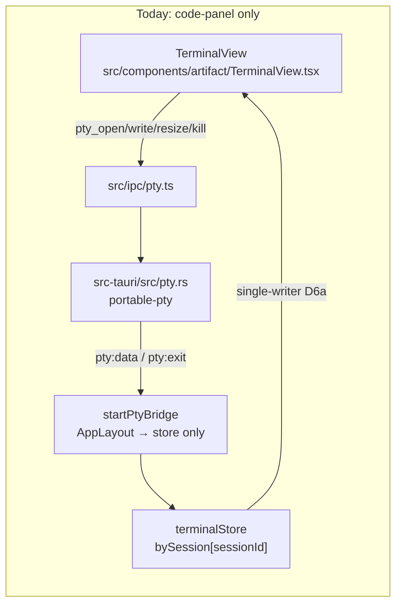
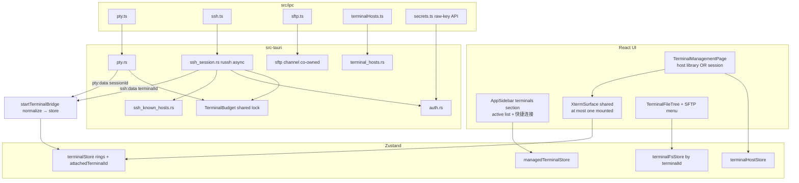
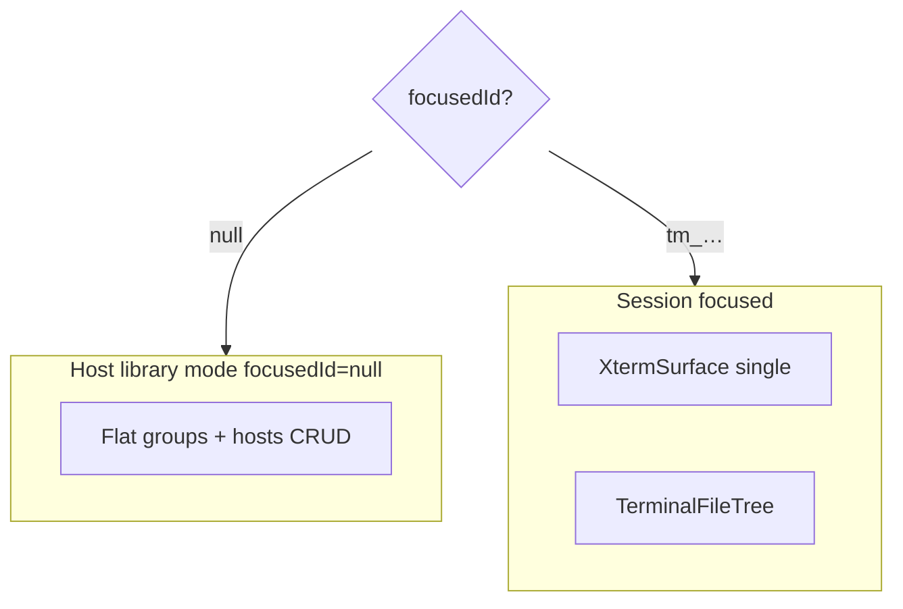
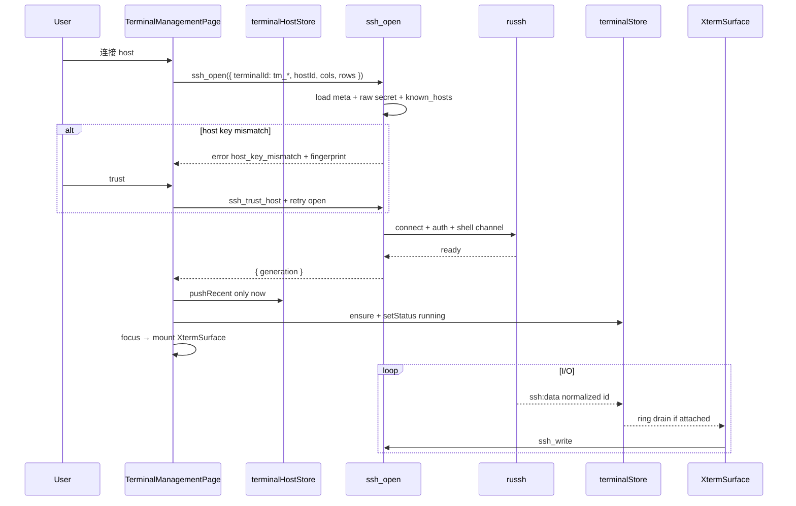
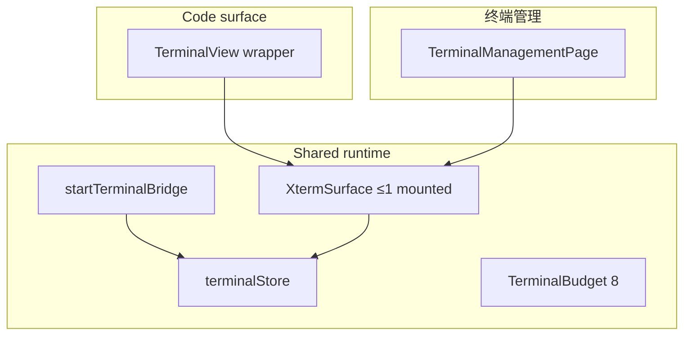
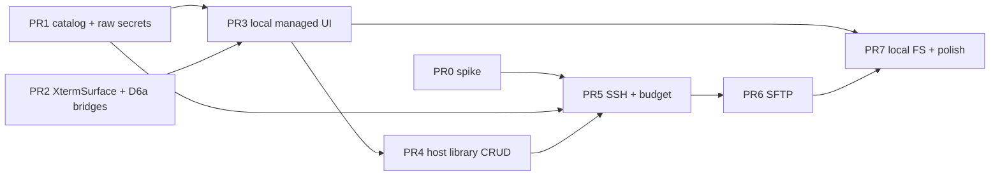

# 终端管理 (Terminal Management) — Local PTY + SSH/SFTP for hip

| Field | Value |
|-------|-------|
| **Title** | 终端管理：本地终端、远程 SSH/SFTP、连接分组与快捷连接（Termius-inspired） |
| **Author** | hip design (rev 3 — residual polish) |
| **Date** | 2026-07-20 |
| **Status** | Draft (rev 3) |
| **Primary scope** | Dedicated Terminal Management surface (`activeView: 'terminals'`); managed local + SSH sessions; SFTP/local file tree; saved hosts/groups; recent connections |
| **Workspace** | `/Users/lijiamin/data/my-github/hip` |
| **Builds on** | Code-panel PTY (`portable-pty`, `terminalStore`, `TerminalView`); secrets (`auth.json` / `set_secret`); FileTree + `fsStore`; sidebar placeholder for terminals; recycle-bin design style |
| **Audience** | Product + frontend + Tauri native |

---

## Overview

hip today has a **session-scoped code-panel terminal only**: when a Code session has a bound `cwd`, the right panel Terminal tab (`TerminalView`) opens a local shell via Tauri `portable-pty`. There is **no** dedicated multi-host terminal product surface. The left-nav **终端管理** entry (`sidebarSection` / `activeView === 'terminals'`) still renders `PlaceholderPage` with copy *「终端管理即将上线…」* (`placeholder.terminals`).

**Proposal:** ship a Termius-inspired **终端管理** product area that:

1. Opens **independent local terminals** (not bound to Chat/Code sessions).
2. Opens **remote SSH** interactive shells with **SFTP file tree** + upload/download.
3. **Saves hosts** (address, port, user, auth) with **flat folder groups**.
4. Lists **active managed terminals** under the sidebar section; right-click close/kill.
5. Provides **快捷连接** (last 5 recent launches) next to the section title.
6. Reuses the mature xterm + ring-buffer + PTY bridge stack; adds SSH/SFTP in **Rust/Tauri** with secure credential storage.

AI-in-terminal is **explicitly deferred**. Cloud host sync is out of scope (local-first only).

---

## Background & Motivation

### Current terminal stack (grounded)



| Layer | Path | Today |
|-------|------|-------|
| Feature flag | `src/components/artifact/terminalFeature.ts` | `CODE_TERMINAL = true` |
| UI | `TerminalView.tsx` | Lazy `@xterm/xterm` + `@xterm/addon-fit`; needs domain `sessionId` + session `cwd` |
| Store | `src/store/terminalStore.ts` | Per-id ring (5000 chunks / 2 MiB), `PtyStatus`, **`attachedSessionId` singular** single-writer (D6a) |
| Canvas / restart bridges | `terminalCanvasUi.ts`, `terminalRestartUi.ts` | **Process-global singletons** (no terminalId keying) |
| IPC | `src/ipc/pty.ts` | `pty_open/write/resize/kill`; bridge listens `pty:data`/`pty:exit` with payload field **`sessionId`**. Rust has `pty_list`; **frontend does not wrap it yet** |
| Rust | `src-tauri/src/pty.rs` | `MAX_PTY_SESSIONS = 8`; soft cap only counts **alive local PTY**; shell from `[terminal].shell` hip.toml |
| Settings | `GeneralSettings.tsx` | Default shell picker (`settings.terminalShell*`) |
| Context menu | `context-menu/providers/terminal.ts` | Restart / change folder / copy / paste for **code session** terminal via global canvas bridge |
| Theme | `terminalTheme.ts` | Follows `uiStore.theme` |
| Nav placeholder | `AppLayout` `renderMainContent` branch for `activeView === 'terminals'`; `AppSidebar` nav `section="terminals"` | `PlaceholderPage` |
| Soft cap UX | i18n `artifact.terminalView.softCap`; error substring `"Too many terminals"` | Max 8 open PTYs; copy says “关闭一个会话” |
| Secrets | `src-tauri/src/auth.rs`, `lib.rs` `set_secret` / `has_secrets` | Provider keys in `~/.hip/config/auth.json` (0o600). **`has_secrets` maps every key through `provider_key_env` → `HIP_MODEL_*`** — cannot detect arbitrary keys |
| Local FS tree | `FileTree.tsx` + `fsStore` + sidecar `fs:ls` / `workspace-fs.ts` | Session/draft scoped |
| Sidecar | `packages/sidecar/package.json` | No SSH deps; sidecar env inject walks **provider ids only** |

### Pain points

1. **No multi-host workspace** — users leave hip for Termius/iTerm/ssh for remote ops.
2. **Terminal is session-bound** — no scratch local shell without a Code project session.
3. **Placeholder nav** already ships the Terminal icon.
4. **No saved connections / recents**.
5. **No SFTP** tree/transfer.

### Industry practices (adapted)

| Practice | Source | hip adaptation |
|----------|--------|----------------|
| Host library + folders | Termius | Saved hosts + **flat** groups under `~/.hip` |
| Split: host list / terminal / files | Termius | Sidebar active shells + main host library or terminal + in-page files panel |
| Secure secret storage | Termius, product hip stance | **auth.json 0o600** (same as API keys; **not** a keychain migration target unless product reverses) |
| Known_hosts verification | OpenSSH | TOFU under `~/.hip/config/ssh_known_hosts.json` |
| Soft concurrent session cap | Existing hip PTY | **Unified** cap across code PTY + managed local + SSH, enforced in Rust |
| Local-first | hip product | No cloud sync |

---

## Goals & Non-Goals

### Goals

1. **终端管理 surface**: replace `PlaceholderPage` when `activeView === 'terminals'` with management + session workspace matching main product chrome.
2. **Local managed terminals**: shell without Chat/Code session; default cwd = home or user-picked; shell from `[terminal].shell`.
3. **Remote SSH terminals**: interactive shell (password or private key + optional passphrase).
4. **SFTP file tree** on remote; **local tree rooted at launch cwd** on local managed.
5. **SFTP upload/download** via context menu (drag-drop optional later).
6. **Saved hosts + flat groups**: CRUD; host fields host/port/user/auth method/label/groupId.
7. **Active managed list** under sidebar section + context-menu close/kill.
8. **快捷连接**: last **5** successful launches next to section title.
9. **Reuse** xterm, terminalStore ring, fit addon, theme, DeclarativeContextMenu under an explicit multi-terminal D6a contract.
10. **Secure credentials**: never store passwords in host JSON; dedicated raw-key secret IPC; load secrets only in Rust on connect.
11. **i18n**: zh-CN / zh-TW / en / ja / ko.

### Non-Goals (this phase)

- AI terminal agent / command suggestion / NLP.
- Mosh, serial, telnet, ProxyJump / jump hosts.
- Cloud sync of hosts / multi-device vault.
- Full IDE remote edit over SFTP — tree + transfer only.
- Port forwarding / SOCKS / X11.
- Replacing code-panel `TerminalView` (keep both; extract shared pieces).
- Keyboard-interactive / certificate / agent-forward auth (v1 = password + publickey only).
- Import full `~/.ssh/config`.
- OS keychain migration (product stance: auth.json is intentional for desktop secrets).
- Nested host groups.

---

## Key Decisions

| # | Decision | Rationale |
|---|----------|-----------|
| K1 | **Managed terminals are a parallel id space** `tm_<nanoid>` (prefix **required**). Code-panel PTY keeps domain `sessionId`s. Id generation: `tm_` + `nanoid()` on frontend; Rust **rejects** managed-only ops if id does not start with `tm_` where applicable; domain cleanup (`sessionService` → `ptyKill`) **never** enumerates managed ids. | Avoids agent lifecycle / soft-delete / worktree cascade coupling; collision-resistant vs domain ids. |
| K2 | **`terminalStore` keys any string terminal id**. `attachedSessionId` gains alias `attachedTerminalId` (same field). **D6a multi-terminal contract is mandatory** (see § D6a). | Rings already generic; attach remains singular. |
| K3 | **SSH + SFTP in Tauri/Rust**, not Node sidecar. | Secrets stay in Tauri; sidecar has no SSH deps and must not gain passwords. |
| K4 | **Primary stack: `russh` + `russh-sftp`**, gated by **PR0 spike**. v1 auth matrix: **`password` \| `publickey` only**. Keyboard-interactive / certs → clear error “暂不支持”. Tokio features and runtime model locked in § SSH runtime. | Spike before locking; avoid half-integrated async. |
| K5 | **Single authoritative `TerminalBudget` in Rust**: `alive_local_pty + alive_ssh ≤ 8`, checked under one lock in **both** `pty_open` and `ssh_open`. Reuse `soft_cap_allows` (existing id may reopen). Frontend pre-check optional UX only. Product rule: **code-panel PTYs consume the same budget**. | Eliminates races; no dual architectures. |
| K6 | **Host catalog** `~/.hip/config/terminal-hosts.json` (non-secret). Secrets: raw keys `hip.ssh.<hostId>.password` / `.passphrase` via **new raw secret IPC** (not `has_secrets`). Private key = **filesystem path** in host meta. | Separates catalog from secrets; fixes provider-only `has_secrets`. |
| K6b | **Secret lifecycle**: **only new Tauri command is `has_secret_keys`** (raw presence). Frontend aliases `setSecretRaw` / `deleteSecretRaw` map to **existing** `set_secret` / `delete_secret` (already raw — **do not** add duplicate Rust commands). Renderer **never** calls `get_secret` for SSH passwords (Rust `ssh_open` uses internal `get_secret_value`). Host delete → force-close sessions + delete both secret keys. Sidecar env inject remains **provider-id only**. | Matches real `lib.rs` / `sidecar` behavior; avoids mistaken `set_secret_raw` command. |
| K7 | **Host key TOFU** in `ssh_known_hosts.json`. Mismatch → block modal (SHA256 fingerprint, copy, trust update / cancel). | Security baseline. |
| K8 | **UI**: sidebar = active managed terminals + 快捷连接; main = host library (default) or focused terminal; files = **in-page** `PanelGroup` (not ArtifactPanel). | Avoids `codeOpen/chatOpen/knowledgeOpen` coupling. |
| K9 | **Extract `XtermSurface`** with props `terminalId`, `write`, `resize`, `open`, `backend`. Bridge store-only (D6a). | DRY; inject backend without dual xterm writers. |
| K10 | **Local tree**: `term_fs_ls(terminalId, path)` rooted at **launch cwd**; reject escape after canonicalize. Remote: `sftp_*` bound to alive SSH session. | No unrestricted whole-disk ls. |
| K11 | **Recents**: last 5 **successful** launches in catalog; dedupe; drop dangling hostIds on load; local missing cwd disabled. | Product “最近 5 次连接” with safe edge cases. |
| K12 | **`TERMINAL_MANAGEMENT` default `false`** until dogfood of first user-visible PR; flip true when shipping. Kill-switch restores PlaceholderPage **without** auto-killing native sessions. | Dark-launch safety. |
| K13 | No AI, cloud, Mosh in v1. | Product non-goals. |
| K14 | **`terminals` remains ephemeral `activeView`**. When flag on, remove `'terminals'` from `PlaceholderSidebarSection`. | Cold launch still Workbench. |
| K15 | SFTP streams in Rust; dialog-chosen local paths; overwrite policy explicit; cancel + temp rename. | Multi-GB safe. |
| K16 | Passwords never logged. | Privacy. |
| K17 | Command palette: 打开终端管理 / 新建本地终端 / 快捷连接. | Discoverability. |
| K18 | Code-panel behaviorally unchanged. | Surgical. |
| K19 | **Groups are flat** (no `parentId` / nesting). UI = group **list**, not tree. | Avoid overbuild. |
| K20 | **Host save-first**: 新建远程连接 always persists host then connects; no ad-hoc connect-without-save in v1. | Simplifies secrets + recents. |
| K21 | **Delete host with open sessions**: confirm → force-close those SSH sessions → delete catalog row + both secrets → filter recents. | Deterministic cleanup. |
| K22 | **Hybrid system-`ssh`-in-PTY rejected for v1** (see Alt 7). Spike → russh path. | Structured SFTP + TOFU need library control. |

---

## Proposed Design

### Architecture



### Identity model & lifecycle

| Kind | Id form | Backend | File tree root | Lifetime |
|------|---------|---------|----------------|----------|
| Code-panel local | domain `sessionId` (no `tm_` prefix) | `pty.rs` | session `cwd` (existing) | Tied to domain session; `sessionService` may `ptyKill` on delete |
| Managed local | `tm_<nanoid>` | `pty.rs` | **launch cwd** (fixed root for tree) | **Process-ephemeral** — not restored on app restart; catalog/recents persist |
| Managed SSH | `tm_<nanoid>` | `ssh_session.rs` | host `remotePath` or SFTP home | Process-ephemeral |

**Rules:**

1. Generate managed ids only as `` `tm_${nanoid()}` ``.
2. Domain session ids must not be minted with `tm_` prefix (existing nanoid/uuid session ids already differ).
3. `sessionService.deleteSession` / trash only operate on domain sessions; they must not iterate `managedTerminalStore`.
4. Soft-delete of code sessions frees PTY budget slots via existing kill path; managed list is independent.
5. UI badge optional: “N/8 终端占用（含代码面板）” via `interactive_terminal_list`.

### Soft cap — TerminalBudget (authoritative)

```text
// src-tauri: shared state
MAX_INTERACTIVE_TERMINALS = 8

alive = count_alive_pty() + count_alive_ssh()
// soft_cap_allows(alive, session_exists, MAX): allow if id already in map OR alive < MAX
```

| Rule | Detail |
|------|--------|
| Enforcer | **Rust only** — `pty_open` and `ssh_open` both call `TerminalBudget::try_acquire(id)` under one `Mutex` |
| **Lock order** | Always **Budget → PtyManager / SshManager** (never reverse). Check budget under Budget lock (or hold Budget while inserting into the session map); release Budget before long I/O. Avoids deadlock when concurrent local+SSH open. |
| Reopen | Existing alive id may resize/reconnect without consuming a new slot (same as `soft_cap_allows` today) |
| Frontend | Optional pre-check via `interactive_terminal_list` for disable buttons; **never** authoritative |
| Error string | Stable English: `"Too many terminals open (max 8)."` so existing substring map keeps working; UI maps to new i18n |
| Product | Code-panel + managed local + SSH share the pool. User with 7 code PTYs has 1 slot left for 终端管理 |

**i18n (K18 copy fix):**

- `terminals.softCap` / update `artifact.terminalView.softCap`:  
  - zh-CN: `打开的终端过多（最多 8 个，含代码面板终端）。请先关闭一个。`  
  - en: `Too many terminals open (max 8, including code-panel terminals). Close one first.`

Expose:

```ts
// preferred single command
interactiveTerminalList(): Promise<Array<{ id: string; kind: 'pty' | 'ssh' }>>
// or wrap pty_list + ssh_list
```

### D6a multi-terminal contract (mandatory)

Today: singular `attachedSessionId`; global `bindTerminalCanvas` / `bindTerminalRestarter`; only one code-panel `TerminalView` drains the ring.

**Contract for v1:**

1. **At most one attached writer:** `terminalStore.attachedTerminalId` (alias of `attachedSessionId`) is `string | null`. Only that id’s `XtermSurface` may call `term.write` from the store subscription.
2. **At most one mounted `XtermSurface` in the app** at a time for a given layout epoch:
   - Code surface: mounted only when `activeView` is chat/code and terminal tab active (`ArtifactPanel`).
   - Managed: mounted only when `activeView === 'terminals'` **and** `managedTerminalStore.focusedId != null`.
   - **View exclusivity:** `AppLayout` never mounts ArtifactPanel terminal and `TerminalManagementPage` session canvas simultaneously (terminals replaces main content; ArtifactPanel only for chat/code). Treat this as a **stated contract**, not an accident — tests should assert mutually exclusive mount conditions.
3. **Focus change protocol (managed):**
   ```
   onFocus(nextId):
     previous XtermSurface unmount → setAttached(null) → unbind canvas/restarter for previous
     mount XtermSurface(nextId) → ensureSession → attachDrainWrites(ring) → setAttached(nextId)
     bindTerminalCanvas(nextId, api) / bindTerminalRestarter(nextId, fn)
   ```
4. **Canvas / restarter bridges:** upgrade from process-global singleton to **keyed by terminalId**:
   ```ts
   // terminalCanvasUi.ts (rev)
   bindTerminalCanvas(terminalId: string, api: TerminalCanvasApi | null)
   getTerminalCanvasSelection(terminalId: string): string
   pasteToTerminalCanvas(terminalId: string, text: string): void
   ```
   Context menu providers pass `terminalId` from payload (code-panel `terminal` kind already has `sessionId`; managed uses `managedTerminal` / canvas payload with id). **No silent global default** when id missing.
5. **Keep-alive on unmount:** leaving `activeView === 'terminals'` **detaches** managed surface (unmount xterm, `setAttached(null)`) but **does not** kill PTY/SSH or clear rings — same keep-alive spirit as code-panel when switching tabs. Explicit close → kill + clear.
6. **Write path:** `XtermSurface` receives `write(data)` / `resize` / `open` callbacks from parent — parent binds `ptyWrite` vs `ssh_write`. xterm never dual-subscribes two stores.

```mermaid
sequenceDiagram
  participant U as User
  participant MS as managedTerminalStore
  participant XT as XtermSurface
  participant ST as terminalStore
  participant CV as canvasBridge keyed

  U->>MS: focus(tm_B)
  MS->>XT: unmount tm_A
  XT->>ST: setAttached(null)
  XT->>CV: bind(tm_A, null)
  MS->>XT: mount tm_B
  XT->>ST: attachDrainWrites(ring_B); setAttached(tm_B)
  XT->>CV: bind(tm_B, api)
```

### Navigation & shell integration

| Item | Change |
|------|--------|
| `PlaceholderSidebarSection` | When `TERMINAL_MANAGEMENT`: type becomes `'workbench' \| 'tasks' \| 'automation'` only — **remove `'terminals'`**. Update call sites/tests: `AppSidebar`, `AppSidebar.test`, `sidebarActions`, `sidebarActions.test`, `uiStore` |
| `enterTerminalsSection()` | New: leave knowledge if needed → `setSidebarSection('terminals')` + `setActiveView('terminals')` |
| `AppLayout.renderMainContent` | Flag on + `activeView === 'terminals'` → `<TerminalManagementPage />`; else PlaceholderPage |
| `MainToolbar` | Title `sidebar.nav.terminals`. **No toolbar back button** for terminals (same as workbench/tasks today — `MainToolbar` has no `main-toolbar-back` for settings/history either). Exit terminals via **sidebar rail** only. Do **not** expand `previousView` / `isSpecial` for terminals unless product later requests a back chrome PR with tests. Note: `setActiveView` today only tracks `previousView` for `settings` \| `history` \| `trash`; terminals stays ephemeral for cold-start stripping but is **not** special-for-back. |
| Right files | **In-page** PanelGroup only |



### UI states (implementable checklist)

| State | UI |
|-------|-----|
| Empty host library | `EmptyState`: “还没有保存的连接” + CTA **新建连接** / **新建本地终端** |
| Host form create/edit | Modal; password write-only; “已保存” via `has_secret_keys`; clear password action |
| Connecting | Session row spinner; xterm chrome “正在连接…”; cancel → close |
| Host key mismatch | Modal: hostname:port, **SHA256** fingerprint (base64 or hex colon form — pick OpenSSH-like `SHA256:…`), **复制指纹**, **信任并连接**, **取消** |
| Soft cap | Toast `terminals.softCap`; open buttons disabled when list length ≥ 8 (optimistic) |
| Exited / error | Banner + **重新连接**; ring retained until close |
| SSH drop mid-type | `ssh:exit` → status `exited`/`error`; further write/resize no-op with toast once |
| Quick connect empty | Popover text `terminals.quickConnectEmpty` |
| SFTP not yet (pre-PR5) | Files panel placeholder “文件树将在 SFTP 就绪后显示” for SSH sessions |
| Flag off | PlaceholderPage; native sessions not auto-killed |

### Sidebar: list + 快捷连接

When `sidebarSection === 'terminals'` and flag on:

1. **Header** (`listLabel` area — wire trailing action like knowledge/projects new buttons):
   - Title: use **`sidebar.list.terminals`** (“终端管理”) when section is terminals (today placeholder falls through to `sidebar.nav.terminals` — change listLabel branch).
   - Trailing: **快捷连接** `data-testid="terminals-quick-connect"` → `Popover` ≤5 recents.
2. **List**: active managed terminals (local vs SSH icon, title, status). Click → focus. Context menu `managedTerminal`: 关闭 / 复制标题.
3. **Header/footer actions**: `+ 本地终端`, `+ 新建连接` (opens HostFormDialog save-first).

### Recents rules (K11)

```ts
type RecentLaunch =
  | { type: 'local'; cwd: string; label?: string; at: number }
  | { type: 'ssh'; hostId: string; label: string; at: number }

// key: local → `local:${cwd}`; ssh → `ssh:${hostId}`
```

| Rule | Behavior |
|------|----------|
| Push | **Only after successful** `pty_open` / `ssh_open` (not on form submit alone) |
| Dedupe | Same key → move to front, update `at` / label |
| Cap | Keep 5 after insert |
| Host delete | Filter out matching `hostId` |
| Load | Drop SSH recents whose `hostId` not in catalog; keep local entries |
| Local missing cwd | Show row **disabled** + tooltip “目录不存在”; do not launch |
| Failed connect | Do **not** push |

### Host library

- **Flat groups** (`HostGroupList`, not nested tree): `{ id, name, sort }` — **no `parentId`**.
- Hosts: `{ id, label, groupId?: string, hostname, port, username, authMethod, privateKeyPath?, remotePath?, updatedAt }`.
- Actions: 连接 (**enabled after PR5**; disabled/stub in PR4 with “SSH 即将就绪”), 编辑, 删除 (K21), 新建分组, 新建连接 (K20 save-first).

**Host form fields:**

| Field | Notes |
|-------|-------|
| label | Display name |
| groupId | optional flat group |
| hostname / port / username | port default 22 |
| authMethod | `password` \| `privateKey` |
| password | write-only → frontend `setSecretRaw` → existing **`set_secret`**; “已保存” via **`has_secret_keys`**; clear → `deleteSecretRaw` → **`delete_secret`** |
| privateKeyPath | Prefer **absolute path from file picker**. Free-typed paths allowed; on `ssh_open` expand leading `~/` via `dirs::home_dir()` (crate already in Cargo.toml). Store expanded absolute path when possible after successful connect. Suggest default display `~/.ssh/id_ed25519` only as UI hint. |
| passphrase | optional raw secret (`set_secret`) |
| remotePath | optional SFTP start |

Edit without re-entering password: leave password field empty + has-secret true keeps previous.

### Connecting



Local: `pty_open(tm_*, cwd, cols, rows)` then pushRecent on success.

### XtermSurface (shared)

```ts
type XtermSurfaceProps = {
  terminalId: string
  backend: 'pty' | 'ssh'
  /** Parent supplies backend-specific IPC — surface does not import both blindly. */
  open: (cols: number, rows: number) => Promise<{ reused: boolean; generation: number }>
  write: (data: string) => Promise<void>
  resize: (cols: number, rows: number) => Promise<void>
  onRestart?: () => Promise<void>
}
```

- Lazy xterm + fit + css; single store subscription; `attachDrainWrites`.
- On unmount: dispose xterm, `setAttached(null)` if still attached to this id, unbind keyed canvas/restarter.
- Code-panel `TerminalView` = resolve domain session + cwd → `<XtermSurface backend="pty" … />`.

### File tree strategy

| Aspect | Local managed | Remote SSH |
|--------|---------------|------------|
| List | `term_fs_ls(terminalId, path)` | `sftp_ls(terminalId, path)` |
| Root | **launch cwd** stored on ManagedTerminal | `remotePath` or SFTP `.` |
| Escape | canonicalize; reject if not under root (symlink-aware realpath like workspace-fs) | `sanitize_remote_path` |
| Store | `terminalFsStore.byTerminal[id]` | same |
| Menu | copy path, refresh, open containing folder | download, upload into dir, copy remote path, refresh |

Cwd follow (OSC 7): **out of scope v1**; tree header shows “启动目录”.

### Local `term_fs_ls` algorithm

```text
term_fs_ls(terminalId, path):
  root = managed_session[terminalId].launch_cwd   // required
  target = canonicalize(join/resolve path)
  if !is_within(root, target): return Err("path escapes terminal root")
  // symlink: realpath(target) must stay within realpath(root)
  readdir; hide dotfiles (match workspace-fs); return FsEntry[]
```

No call without an open managed local session. Changing root requires new terminal (or explicit “更换文件夹” that restarts PTY + resets root).

### SFTP security algorithm

Pure helpers (unit-tested in PR6):

```text
// All public sftp_* entry points call normalize_remote_path once.

normalize_remote_path(session, input) -> Result<String>:
  // 1) Home / cwd special-cases BEFORE segment sanitization
  if input is empty OR input.trim() == "." OR input == "./":
    return sftp_realpath(session, ".")   // server home or session cwd
  // 2) Normalize separators
  reject NUL; replace \\ with /; collapse consecutive //
  max length e.g. 4096
  // 3) Segment checks on non-special inputs
  split on /; reject any segment == ".."
  allow "." only as the whole-path special case above (not as intermediate segment)
  reject intermediate segment == "."
  // 4) Prefer absolute via sftp realpath when path is relative
  if relative: return sftp_realpath(session, sanitized)
  return sanitized absolute

sanitize_remote_path(input) -> Result<String>:  // pure unit-test without session
  // same rules but without realpath; empty/"." left as sentinel Ok(".") for caller to realpath
  // reject ".." segments always

resolve_local_transfer_path(userChosen, op):
  must come from dialog (plugin-dialog open/save) OR app downloads dir
  canonicalize parent; reject if parent missing
  no automatic write next to auth.json without user dialog choice

overwrite_policy:
  default confirm in UI; Rust accepts force: bool
  if exists && !force → Err(AlreadyExists)

session_binding:
  every sftp_* requires alive SSH session for terminalId
  ssh_close drops sftp handle; subsequent ops → Err(SessionClosed)

channels:
  long-lived SFTP channel co-owned with shell session on same client
  (open SFTP subsystem channel at ssh_open success or lazily on first sftp_ls)
  concurrent shell I/O + one transfer at a time per session v1
  max concurrent transfers global = 2; extra ops queue or reject

download:
  write to temp file in same dir as destination → fsync → rename
  cancel → delete temp; emit sftp:progress phase=cancelled

upload:
  stream from local path; no full file in JS
  warn UI if local path is under ~/.hip/config (auth.json / keys) before invoke
```

```ts
// src/ipc/sftp.ts
sftpLs(terminalId, path): Promise<FsEntry[]>
sftpMkdir(terminalId, path): Promise<void>
sftpRemove(terminalId, path, isDir): Promise<void>
sftpDownload(terminalId, remotePath, localPath, opts?: { force?: boolean }): Promise<void>
sftpUpload(terminalId, localPath, remotePath, opts?: { force?: boolean }): Promise<void>
sftpCancel(terminalId, opId): Promise<void>
// event sftp:progress { terminalId, opId, phase, bytes, total? }
```

### Active list close

`managedTerminalStore.close(id)` → `pty_kill` or `ssh_close` → `terminalStore.clearSession` → clear fs → if focused, `focus(null)` host library mode.

### SSH runtime model (post-spike)

| Topic | Decision |
|-------|----------|
| Runtime | `tauri::async_runtime` (tokio) for SSH tasks; **expand** `Cargo.toml` tokio features: at least `rt`, `net`, `time`, `io-util`, `macros` (spike confirms exact set) |
| PTY coexistence | Keep portable-pty **thread + mpsc** as today; SSH manager is async tasks; both emit events on `AppHandle` |
| Coalesce | SSH reader coalesces like PTY: ~12 ms / 32 KiB pending, drop-oldest under backpressure (shared constants or copy) |
| Cargo feature | `ssh` feature on `hip_lib`, **default = on** for release after spike; emergency `default-features` off strips russh |
| Binary size | Spike records `cargo build --release` size before/after; fail review if unexplained >15% without product OK |
| Auth matrix v1 | password; publickey (ed25519, rsa); encrypted key + passphrase. **Not** keyboard-interactive, PKCS11, agent |
| Key path | On `ssh_open`, if `privateKeyPath` starts with `~/`, expand via `dirs::home_dir().join(rest)`; fail clearly if home unknown |

---

## API / Interface Changes

### Raw secret API (prior review Issue 1 fix)

**Problem:** `has_secrets` always runs `provider_key_env` (`lib.rs`), so `hip.ssh.*` never matches.

**Solution — one new command; set/delete stay as today:**

| Command | Behavior |
|---------|----------|
| `set_secret` | **unchanged** — already writes the **raw** key string (not provider-mapped) |
| `get_secret` | unchanged; **renderer must not use for SSH passwords** |
| `delete_secret` | **unchanged** — raw key delete |
| `has_secrets` | **unchanged** — provider ids only (`provider_key_env`) |
| **`has_secret_keys`** | **only new command** — `keys: string[]` looked up **as-is** in auth map (no `provider_key_env`) |
| `delete_secret_keys` | optional batch convenience; can loop `delete_secret` instead |

Frontend (`src/ipc/secrets.ts`) — **aliases only**, not new Tauri commands:

```ts
export function sshPasswordKey(hostId: string) {
  return `hip.ssh.${hostId}.password`
}
export function sshPassphraseKey(hostId: string) {
  return `hip.ssh.${hostId}.passphrase`
}
export function hasSecretKeys(keys: string[]): Promise<Record<string, boolean>> {
  return invoke('has_secret_keys', { keys }) // NEW command
}
/** Alias → existing set_secret (already raw). Do NOT invent set_secret_raw in Rust. */
export function setSecretRaw(key: string, value: string): Promise<void> {
  return invoke('set_secret', { key, value })
}
/** Alias → existing delete_secret. */
export function deleteSecretRaw(key: string): Promise<void> {
  return invoke('delete_secret', { key })
}
// NEVER export getSecret for SSH password to UI modules
```

**Sidecar:** env injection continues to map provider catalog ids only — SSH keys with `hip.ssh.` prefix are never selected.

**Host delete lifecycle:**

```text
deleteHost(id):
  close all managed SSH terminals with hostId == id (force)
  delete_secret(sshPasswordKey(id)); delete_secret(sshPassphraseKey(id))
  remove host from catalog; filter recents; save catalog
```

### Tauri commands

| Command | Purpose |
|---------|---------|
| `pty_open/write/resize/kill` | Local (domain + managed `tm_*`) — budget-checked |
| `pty_list` | Existing; wrap in frontend |
| `ssh_open/write/resize/close/list` | SSH — budget-checked |
| `interactive_terminal_list` | Union for UI badges |
| `sftp_*` + cancel | Bound to alive SSH |
| `terminal_hosts_list` / `terminal_hosts_save` | Catalog |
| `has_secret_keys` | Raw key presence |
| `term_fs_ls` | `{ terminalId, path }` root-scoped |
| `ssh_known_hosts_get` / `ssh_trust_host` / `ssh_remove_host_key` | TOFU |

### Events & bridge normalization

| Event | Payload (wire) | Bridge normalizes to |
|-------|----------------|----------------------|
| `pty:data` | `{ sessionId, data }` | `{ terminalId: sessionId, data }` |
| `pty:exit` | `{ sessionId, code, generation? }` | `{ terminalId, code, generation }` |
| `ssh:data` | `{ terminalId, data }` | same |
| `ssh:exit` | `{ terminalId, code?, generation, message? }` | **generation required** for restart races (parity with pty) |
| `sftp:progress` | `{ terminalId, opId, phase, bytes, total? }` | UI only |

```ts
// startTerminalBridge — single owner in AppLayout when CODE_TERMINAL || TERMINAL_MANAGEMENT
function normalizeTerminalId(payload: { sessionId?: string; terminalId?: string }): string | null {
  return payload.terminalId ?? payload.sessionId ?? null
}
// Unit-test both field shapes. Double-start prevented by one useEffect.
```

Dev-only: if event `terminalId !== attachedTerminalId`, debug log attach mismatch (data still rings for keep-alive).

### Frontend IPC modules

```
src/ipc/pty.ts           # + ptyList; startTerminalBridge alias
src/ipc/ssh.ts
src/ipc/sftp.ts
src/ipc/terminalHosts.ts
src/ipc/termFs.ts
src/ipc/secrets.ts       # hasSecretKeys + ssh*Key helpers; provider helpers unchanged
```

### Zustand stores

```ts
// terminalHostStore — groups flat, recents rules K11
// managedTerminalStore
interface ManagedTerminal {
  id: string            // tm_*
  kind: 'local' | 'ssh'
  title: string
  hostId?: string
  cwd?: string          // launch cwd / tree root (local)
  remotePath?: string
  createdAt: number
}
// status read from terminalStore.bySession[id]
```

### Components

```
src/components/terminals/
  feature.ts                 # TERMINAL_MANAGEMENT default false
  TerminalManagementPage.tsx
  HostLibrary.tsx
  HostFormDialog.tsx
  HostGroupList.tsx          # flat — not nested tree
  QuickConnectPopover.tsx
  ManagedTerminalSession.tsx
  TerminalFilesPanel.tsx
  TerminalFileTree.tsx
  HostKeyMismatchModal.tsx
  XtermSurface.tsx           # or artifact/
```

### Context menu kinds

```ts
managedTerminal: { terminalId: string; kind: 'local' | 'ssh'; title: string }
sftpEntry: { terminalId: string; path: string; name: string; isDir: boolean }
// terminal (code-panel): keep sessionId; canvas handlers keyed by sessionId
```

### i18n keys

```
sidebar.list.terminals          # section list header when terminals active
sidebar.quickConnect
terminals.*                     # title, newLocal, newRemote, hosts, groups, connect,
                                # editHost, deleteHost, quickConnectEmpty, auth*, hostKey*,
                                # sftp.*, softCap, close, emptyLibrary, emptyLibraryCta,
                                # connecting, reconnect, budgetBadge, trustHostKey, copyFingerprint
artifact.terminalView.softCap   # update to same meaning (含代码面板)
commandPalette.openTerminals
commandPalette.newLocalTerminal
```

---

## Data Model Changes

### Filesystem (`paths.rs`)

| Path | Content |
|------|---------|
| `~/.hip/config/terminal-hosts.json` | groups (flat), hosts, recents |
| `~/.hip/config/ssh_known_hosts.json` | TOFU pins |
| `~/.hip/config/auth.json` | includes `hip.ssh.*` raw keys |

**Write durability (PR1 / known_hosts writers):**

| File | Write pattern | Unix mode |
|------|---------------|-----------|
| `terminal-hosts.json` | Atomic temp + rename (same pattern as `auth.rs` / knowledge `atomic_write`) | **0o600** — catalog is non-password but contains host inventory + usernames; keep private |
| `ssh_known_hosts.json` | Atomic temp + rename | **0o600** |
| `auth.json` | Existing `auth.rs` atomic 0o600 | 0o600 |

Crash mid-write must not leave a half JSON body as the live path. Reuse shared helper if practical (`atomic_write` style).

```json
{
  "version": 1,
  "groups": [{ "id": "grp_1", "name": "生产", "sort": 0 }],
  "hosts": [{
    "id": "hst_1",
    "label": "ops-1",
    "groupId": "grp_1",
    "hostname": "10.0.0.8",
    "port": 22,
    "username": "deploy",
    "authMethod": "privateKey",
    "privateKeyPath": "/Users/me/.ssh/id_ed25519",
    "remotePath": "/var/www",
    "updatedAt": 1720000000000
  }],
  "recents": [
    { "type": "ssh", "hostId": "hst_1", "label": "ops-1", "at": 1720000001000 }
  ]
}
```

No SQLite migration. Managed sessions process-ephemeral.

### Storage estimates

| Item | Size |
|------|------|
| Host catalog | ~1–5 KB |
| Known hosts | ~100 B / host |
| Ring × 8 | ≤ 16 MiB worst case |

---

## Alternatives Considered

### Alt 1 — SSH in Node sidecar (`ssh2`)

Rejected (K3): secrets + bundle size.

### Alt 2 — System `ssh`/`sftp` CLI only

Rejected for structured SFTP + TOFU control; see Alt 7 for hybrid nuance.

### Alt 3 — Unify code-panel + managed under one manager

Rejected v1 (K18).

### Alt 4 — OS keychain (`keyring`) instead of auth.json

**Rejected as committed roadmap.** Product stance: API keys (and by extension desktop secrets) are intentional plaintext **0600** under `~/.hip/config`, **not** a keychain migration target. Keyring remains an **optional future** only if product reverses that stance — **not** scheduled as “v1.1”.

### Alt 5 — Hosts in hip.toml

Rejected (secrets risk, noisy diffs).

### Alt 6 — Raise soft cap

Keep **8** unified; revisit with metrics.

### Alt 7 — Hybrid: system `ssh` in portable-pty for interactive v1; russh later for SFTP

- **Pros:** Faster remote shell; reuses PTY path; lower tokio/russh risk for first remote demo.
- **Cons:** Two SSH stacks eventually; host-key UX poor; password automation awkward; SFTP still needs library; Windows OpenSSH path variance; delays TOFU product quality.
- **Rejected for v1 line** (K22). Prefer **PR0 spike** unblocking russh once; do not ship hybrid dual-stack. If spike fails hard, revisit Alt 7 with product sign-off as emergency valve only.

---

## Security & Privacy Considerations

| Threat | Severity | Mitigation |
|--------|----------|------------|
| Password in host JSON | **High** | Catalog non-secret only |
| `has_secrets` false negatives for SSH | **High** (fixed) | `has_secret_keys` raw API |
| Password in renderer | Medium | Never `get_secret` in UI for SSH; Rust loads on `ssh_open` |
| Sidecar env leak of SSH keys | Medium | Inject provider ids only; assert in design + test |
| MITM / host key change | **High** | TOFU + mismatch modal |
| SFTP path traversal | **High** | `sanitize_remote_path` + session bind |
| Local tree escape | Medium | Rooted `term_fs_ls` + realpath |
| Overwrite | Medium | confirm / force in Rust |
| Soft cap resource | Medium | Budget 8 in Rust |
| auth.json local ACL | Medium | 0o600 / config 0o700 |
| Upload of secrets paths | Low–Med | UI warn under `~/.hip/config` |
| Logging secrets | Medium | Redact |

---

## Observability

| Signal | How |
|--------|-----|
| ssh_open ok/err | `[ssh] open hostId=… ok\|err=` (no secrets) |
| Auth method | `password\|key` |
| Host key | `tofu_trust` / `mismatch` |
| SFTP | opId, bytes, duration |
| Soft cap | Rust log + toast; optional counter |
| Attach mismatch | dev log when event id ≠ attached |
| Generation mismatch | ignore stale `ssh:exit` / `pty:exit` like today |
| Bridge | Single `startTerminalBridge` if either flag on; log start once |

**Rollback:** flag off → PlaceholderPage; **do not** auto-kill open PTY/SSH (rings may orphan until process exit — acceptable; user can close from list only while flag on). Document that mid-session flag flip hides UI but leaves processes until app quit.

Tags: `[ssh]`, `[sftp]`, `[terminal-hosts]`, `[pty]`, `[terminal-budget]`.

---

## Rollout Plan

| Phase | User-visible | Backend | Owning PRs |
|-------|--------------|---------|------------|
| 0 | none | **Spike** russh auth + size + tokio features | PR0 |
| A | Flag off | Catalog IPC + `has_secret_keys` + atomic catalog/known_hosts writes | PR1 |
| B | Flag off (code-panel only) | XtermSurface extract + bridge normalize + keyed canvas | PR2 |
| C | Flag on dogfood: local terminals + host CRUD + quick connect | managed store; **no** `term_fs_ls` yet; budget still pty-only until D | PR3 + PR4 |
| D | SSH connect + TOFU | TerminalBudget unified (lock order Budget→managers); `~/` key path expand; ssh events | PR5 |
| E | SFTP tree + transfer | security algos (incl. `.`/empty → realpath) + tests | PR6 |
| F | Local file tree + palette + e2e + default flag true for release | **`term_fs_ls` rooted** + polish | PR7 |

```ts
// feature.ts — default false until first dogfood ship of PR3
export const TERMINAL_MANAGEMENT = false
```

---

## Open Questions

| Topic | Resolution |
|-------|------------|
| Final SSH crate | **russh** unless PR0 fails → escalate to product (ssh2 or Alt 7 emergency) |
| Keychain | **Not scheduled**; auth.json only (Alt 4) |
| Files panel | **In-page** (K8) |
| `~/.ssh/config` import | **No v1** |
| OSC 7 cwd | **No v1** |
| Soft cap | **Unified 8** (K5) |
| Delete host + sessions | **Force-close** (K21) |
| Ad-hoc connect without save | **No** — save-first (K20) |

No blocking open product questions for UI scaffolding after K19–K22.

---

## Risks

| Risk | Severity | Mitigation |
|------|----------|------------|
| russh/auth/runtime | High | **PR0 spike gate** before PR5 coding of SSH |
| Binary size | Med | Measure in spike; `ssh` cargo feature |
| Soft cap blocks managed when code PTYs full | Med | Clear copy (含代码面板); budget badge |
| D6a dual writer / wrong paste target | High | Contract + keyed bridges + exclusive mount tests |
| Dual event field names | Med | Normalize helper + unit tests |
| SFTP traversal / orphan session | High | Algorithms + tests in PR6 |
| Extract TerminalView regressions | Med | CODE_TERMINAL tests green in PR2 |
| Secret orphan | Low | delete both keys on host delete |
| Flag-off orphan processes | Low | Document; kill on app quit via existing managers |

---

## References

- Recycle Bin design: `docs/design/recycle-bin-2026-07-19.md`
- PTY: `src-tauri/src/pty.rs`, `src/ipc/pty.ts`, `src/store/terminalStore.ts`
- Terminal UI: `TerminalView.tsx`, `terminalTheme.ts`, `terminalFeature.ts`, `terminalCanvasUi.ts`, `terminalRestartUi.ts`
- Bridge: `src/routes/AppLayout.tsx` (`startPtyBridge`)
- Sidebar: `AppSidebar.tsx`, `sidebarActions.ts`, `PlaceholderPage.tsx`
- uiStore: `activeView: 'terminals'`, `PlaceholderSidebarSection`, `isEphemeralActiveView`
- Secrets: `auth.rs`, `lib.rs` (`set_secret`, **`has_secrets` + `provider_key_env`**), `src/ipc/secrets.ts`
- File tree: `FileTree.tsx`, `fsStore.ts`, `workspace-fs.ts` (`resolveRealWithin` pattern)
- Context menus: `providers/terminal.ts`, `fileEntry.ts`, `types.ts`
- Settings: `GeneralSettings.tsx`, `hip_config` `[terminal].shell`
- FsEntry: `packages/protocol/src/workspace-types.ts`
- Capabilities: `src-tauri/capabilities/default.json` (dialog open/save)

---

## Dependency choices (detail)

### SSH / SFTP

| Option | Verdict |
|--------|---------|
| russh + russh-sftp | **Primary after PR0** |
| ssh2 | Fallback if spike fails |
| Node ssh2 sidecar | Reject |
| Hybrid system ssh in PTY | Reject v1 (Alt 7) |

### Secret storage

| Option | Verdict |
|--------|---------|
| auth.json + raw key API | **v1** |
| keyring | Optional future only — **not** committed v1.1 |

### Local FS

| Option | Verdict |
|--------|---------|
| `term_fs_ls` rooted | **Primary** |

---

## Relation to existing session-bound TerminalView



- Extend, don’t replace code-panel.
- Parallel product surface for hosts.
- One store, one budget, two backends, one attach.

---

## PR Plan

### PR 0 — SSH spike gate (**before** production SSH work)

- **Title:** `spike(tauri): russh password/ed25519/passphrase + TOFU + binary size`
- **Files:** throwaway or `src-tauri/examples/` / feature-gated module; spike notes under `docs/design/` or PR description
- **Deps:** none
- **Description:** Prove macOS + Windows dogfood: password, ed25519, encrypted key+passphrase, TOFU mismatch, list tokio features required, record release binary size delta. **Pass/fail gate for PR 5.** If fail → product chooses ssh2 or Alt 7 emergency.

### PR 1 — Host catalog + **raw secret keys API** + flag scaffold

- **Title:** `feat(terminals): host catalog + has_secret_keys + TERMINAL_MANAGEMENT flag`
- **Files:**
  - `src-tauri/src/terminal_hosts.rs`, `paths.rs`, `lib.rs` (`has_secret_keys` only new secret cmd; register hosts commands)
  - Atomic `terminal_hosts_save` + known_hosts writers (temp+rename, Unix **0o600**)
  - `src/ipc/terminalHosts.ts`, `src/ipc/secrets.ts` (`hasSecretKeys`, `setSecretRaw`/`deleteSecretRaw` **aliases**, `sshPasswordKey`, tests that provider `has_secrets` still maps env keys)
  - `src/store/terminalHostStore.ts` + recents trim/dedupe/filter tests
  - `src/components/terminals/feature.ts` (`TERMINAL_MANAGEMENT = false`)
- **Deps:** none
- **Description:** Persist flat groups/hosts/recents with durable writes. Password presence checks use **`has_secret_keys`**. Do not add `set_secret_raw` in Rust. Provider path tests stay green.

### PR 2 — Extract `XtermSurface` + bridge normalize + keyed canvas bridges

- **Title:** `refactor(terminal): XtermSurface + keyed canvas/restarter + bridge id normalize`
- **Files:**
  - `XtermSurface.tsx`; `TerminalView.tsx` thin wrapper
  - `terminalCanvasUi.ts` / `terminalRestartUi.ts` keyed by id
  - `providers/terminal.ts` pass sessionId into keyed helpers
  - `src/ipc/pty.ts` — `startTerminalBridge`, `normalizeTerminalId`, tests for `sessionId` payload
  - `terminalStore` alias `attachedTerminalId`
  - `AppLayout` single bridge when `CODE_TERMINAL || TERMINAL_MANAGEMENT`
- **Deps:** none (∥ PR1)
- **Description:** No product behavior change for code-panel. D6a contract documented in code comments. Bridge still listens `pty:*` only until PR5.

### PR 3 — Local managed terminals shell (no file tree yet)

- **Title:** `feat(terminals): local managed terminals + sidebar list + quick connect`
- **Files:**
  - `TerminalManagementPage`, `ManagedTerminalSession`, `QuickConnectPopover`
  - `managedTerminalStore` (`tm_` ids)
  - `AppLayout` / `AppSidebar` / `sidebarActions` / `uiStore` type surgery (remove terminals from placeholder union when flag on)
  - Context menu `managedTerminal`
  - i18n for shell strings (5 locales)
  - Soft-cap copy update (含代码面板); optional budget badge using `pty_list` wrap
- **Deps:** **PR1** (recents persistence hard), **PR2** (XtermSurface)
- **Description:** Flag may be flipped true for dogfood. Open/close local shells; 快捷连接 local rules; keep-alive on leave view. **No** host library UI yet; **no** term_fs_ls yet.

### PR 4 — Host library CRUD UI (+ Connect disabled until SSH)

- **Title:** `feat(terminals): host library + form CRUD + secret lifecycle UI`
- **Files:**
  - `HostLibrary.tsx`, `HostFormDialog.tsx`, `HostGroupList.tsx`
  - Empty states; delete confirm (K21 force-close stub for SSH later)
  - `has_secret_keys` “已保存” / clear password
  - Connect button **disabled** or shows “SSH 即将就绪” until PR5
- **Deps:** PR1, PR3
- **Description:** Full saved hosts/groups CRUD before SSH. Sequencing hole closed.

### PR 5 — SSH sessions + TerminalBudget + known_hosts

- **Title:** `feat(tauri): SSH via russh + shared TerminalBudget + TOFU`
- **Files:**
  - `Cargo.toml` tokio features + russh; optional `ssh` feature
  - `terminal_budget.rs`, wire `pty_open` + `ssh_open`
  - **Lock order:** always **Budget → PtyManager / SshManager** (document in module rustdoc)
  - `ssh_session.rs`, `ssh_known_hosts.rs` (atomic 0o600 known_hosts writes)
  - `privateKeyPath`: expand leading `~/` with `dirs::home_dir()` on open
  - `src/ipc/ssh.ts`; bridge listens `ssh:*` with normalize + generation
  - `HostKeyMismatchModal`; `managedTerminalStore.openSsh`; **enable Connect** (was disabled in PR4)
  - Soft-cap unified error path
- **Deps:** PR0 pass, PR1, PR4
- **Description:** Password + publickey shell; no SFTP tree yet (panel placeholder).

### PR 6 — SFTP tree + transfer + security tests

- **Title:** `feat(terminals): SFTP tree + upload/download + path sanitize`
- **Files:**
  - `sftp.rs`; `src/ipc/sftp.ts`
  - `TerminalFileTree` remote; `sftpEntry` provider
  - Pure sanitize/resolve tests; cancel + temp rename
  - Progress UI
- **Deps:** PR5
- **Description:** Minimum ls + upload + download; mkdir/delete if timeboxed.

### PR 7 — Local file tree + palette + e2e + polish

- **Title:** `feat(terminals): term_fs_ls local tree + command palette + e2e smoke`
- **Files:**
  - `term_fs_ls` rooted algorithm + tests
  - `TerminalFilesPanel` local backend
  - Command palette entries
  - e2e: open section, local terminal, host form save, soft-cap message
  - Flag default **true** for release if dogfood OK; design status → Implemented
- **Deps:** PR3–6 (local tree can land after PR3 in parallel with SSH if desired — listed last to keep PR3 small; may merge earlier if PR5 delayed)
- **Description:** Completes file tree for local; polish EmptyStates; i18n final.

**Note:** If schedule prefers local tree earlier, PR7’s `term_fs_ls` slice may merge after PR3 without waiting for SSH — keep PR3 free of FS scope.

### PR dependency graph



---

*End of design document (rev 3).*
