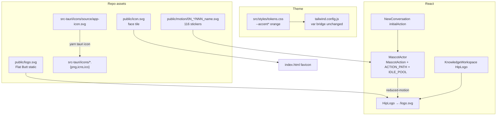
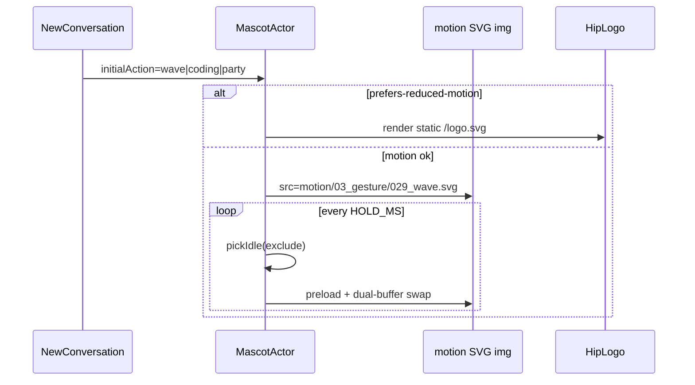
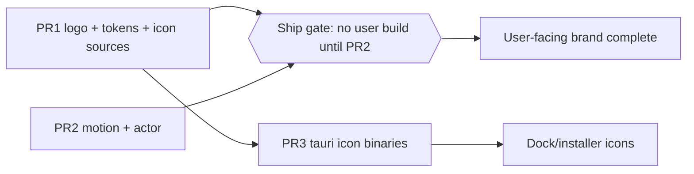

# 品牌 / Logo / 主题色 / 吉祥物动效全面替换 — Design Spec

| Field | Value |
|-------|-------|
| **Title** | hip 品牌资产全面替换：Flat Butt Mascot + 暖橙主题 + 116 贴纸动效 |
| **Author** | hip design |
| **Date** | 2026-07-21 |
| **Status** | Approved for implementation (rev 2 — design review consensus) |
| **Primary scope** | 静态 logo / favicon / 主题 accent tokens / `public/motion` / `MascotActor` 映射 / 旧绿吉祥物清理 |
| **Workspace** | `/Users/lijiamin/data/my-github/hip` |
| **Branch** | `dev` |
| **Source assets** | `/Users/lijiamin/Downloads/temp03/`（实现时拷入仓库；产品代码中不得保留该绝对路径） |
| **Audience** | Frontend + Tauri packaging |
| **Related** | `src/styles/tokens.css` · `src/components/login/MascotActor.tsx` · `src/components/login/HipLogo.tsx` · `public/` · `src-tauri/icons/` |

---

## Overview

hip 当前品牌是 **鼠尾草灰（Sage Gray）+ 绿色圆润吉祥物**（`#9faf8b` 全身角色 + 49 个 `public/motion/**/logo-*.svg` 动画）。产品与新资产包已决定全面换新：**Flat Butt（蜜桃形）暖橙吉祥物**（主色 `#FF9800`）+ **116 张 CSS 关键帧贴纸** + 配套主题 accent。

本 spec 规定：

1. 如何把 `butt_mascot_logo.svg` 与贴纸包**拷入仓库**并替换 `public/logo.svg` / `public/icon.svg` / 旧 motion。
2. 如何从 logo 提取 **AA 可达** 的 light/dark `--accent*` 令牌（**不能**直接把 logo 填充色 `#FF9800` 当 light 正文色）。
3. 旧 `MascotAction`（49 个 lifestyle/sports 语义）与新贴纸分类（emotion/gesture/work/…）的**映射策略**。
4. 清理范围、测试、可回滚的 PR 切分。

**不实现本 spec 的产品代码**——先评审落地顺序，再动手。

---

## Background & Motivation

### 现状（已核对代码）

| 层 | 路径 / 符号 | 现状 |
|----|-------------|------|
| 主题 accent | `src/styles/tokens.css` | Light: `#6b7c5c` / hover `#5d6d50` / strong `#556647`；Dark: `#a8b89a` 系；`--accent-subtle/active` **刻意中性灰** |
| Tailwind 桥 | `tailwind.config.js` | `accent.*` / `on-accent` 映射 CSS 变量，换 hex 即可，无需散落硬编码 |
| 静态 logo | `public/logo.svg` | 绿体 `#9faf8b`，viewBox `1320×1320` |
| Favicon | `public/icon.svg` + `index.html` | 圆角方块 + 简脸，底 `#9faf8b` |
| App icon 源 | `src-tauri/icons/source/app-icon.svg` | 与 favicon 同构图；注释写明 `yarn tauri icon …` 再生 |
| 静态组件 | `HipLogo.tsx` | `import.meta.env.BASE_URL` + `/logo.svg`；`LOGO_SCALE = 0.75` |
| 动效组件 | `MascotActor.tsx` | 49 `MascotAction`；`ACTION_PATH` → `motion/<cat>/logo-<id>.svg`；`IDLE_POOL`；`none\|crossfade\|slide`；reduced-motion → `HipLogo`；`BOTTOM_PAD_RATIO = 0.12` |
| 生产调用 | `NewConversation.tsx` | `initialAction`: holiday→`gift`，code→`code`，else→`wave`；`transition="slide"`；`size={360}` |
| 其它 logo | `KnowledgeWorkspace.tsx` | `<HipLogo size={32} decorative />` |
| 测试 | `MascotActor.test.tsx` / `HipLogo.test.tsx` | 硬编码路径如 `motion/lifestyle/logo-wave.svg`、`motion/work/logo-code.svg` |
| 旧 motion | `public/motion/{arts,celebration,…}/` | 49 SVG；`dist/` 为构建产物勿手改 |

> 注：`MascotActor` 注释中的 “login brand stages” 在当前 `src/` 无独立登录页消费方；`crossfade` 主要在单测与 API 保留。实际 UI 消费以 **空会话欢迎页** + **Knowledge 小 logo** 为主。

### 新资产（`/Users/lijiamin/Downloads/temp03/`）

| 资产 | 说明 |
|------|------|
| `butt_mascot_logo.svg` | 400×400；体 `#FF9800`；褶 `#E87E00`；黑描边/眼；白手套与巩膜 |
| `stickers/svg/01_emotion` … `09_sports` | **116** 张动效 SVG；命名 `NNN_name.svg`；内嵌 CSS keyframes；viewBox 400×400、width/height 512；`transform-origin ≈ 200px 290px`；`overflow:hidden` |
| 循环时长（实测） | **多数**主体循环 ≤3s（与 `MOTION.md` 目标一致）；**例外**：至少 `07_weather/079_sunny.svg`、`086_morning.svg` 主体动画为 **8s**。规范 ≠ 包内全强制。自动 idle **不得**放入长循环例外（见 §3.5–3.6） |
| `stickers/README.md` / `MOTION.md` | 清单与动效规范（**参考**，不必进 `public/`） |
| `generate_svg_pack.py` / `index.html` / `__pycache__` / `*.bak` | 生成器与预览 —— **默认不进产品树** |

体积（**SVG 内容字节合计**，非 `du` 目录块）：旧 `public/motion` **~231 KB** / 49 片；新包 **~293 KB** / 116 片。全量 116 对桌面 app 可接受；不必为体积砍半包。

### 痛点

1. 新旧角色造型完全不兼容（绿圆 vs 橙蜜桃），不能“只换色”沿用旧 SVG。
2. 旧 `MascotAction` 分类（arts/outdoor/pets…）与新包（emotion/work/status…）**语义轴不同**，硬 1:1 会丢语义或死路径。
3. logo 主色 `#FF9800` **不能**直接当 light `--accent`：白字对比约 **2.2:1**，远低于 AA。
4. Dark 的 `--warning: #ffb74d` 与 logo 橙系接近，有语义混淆风险。

---

## Goals & Non-Goals

### Goals

- [G1] 替换 `public/logo.svg` 为新 Flat Butt 静态全身 logo。
- [G2] 替换 `public/icon.svg` 与 Tauri **`icons/source/app-icon.svg` 源**为匹配新角色的简标（同构图）；**二进制** icons 再生见 PR3（可后置）。
- [G3] 更新 light/dark `--accent` / `--accent-hover` / `--accent-strong` / `--on-accent` 至暖橙品牌；在 **`--bg-app` 与 accent 填充**上 **text-accent / on-accent 满足 WCAG AA（≥4.5:1）**；dark hover **≠** dark `--warning`。
- [G4] 删除全部旧 `public/motion/**` 绿角色动画；装入新 116 SVG；`MascotActor` 路径与类型无死引用（含 **ACTION_PATH 存在性必测**）。
- [G5] 更新调用方 `initialAction` 与单测；reduced-motion 仍回退静态 logo。
- [G6] 仅提交产品运行时需要的文件；不从 Downloads 留绝对路径。
- [G7] **发布门闩**：不对用户发布“仅静态/token 已换、motion 仍为绿”的中间态（PR1+PR2 同 train）。

### Non-Goals

- [NG1] **中文/英文品牌文案**改写（除非某处字面写“绿色/鼠尾草吉祥物”——当前 i18n 与 greeting 无此依赖）。**默认不做文案 PR。**
- [NG2] 改 `--btn-primary` 中性 CTA 体系、role 色、`--success` / `--danger`（除非验收发现与橙 accent 冲突且无法靠 accent 自身解决）。
- [NG3] 把 Python 生成器、预览 `index.html`、`.bak`、`__pycache__` 并进 `public/` 或默认 monorepo 运行时路径。
- [NG4] 为贴纸引入 Lottie/Rive/视频等新运行时；继续 **SVG + 内嵌 CSS animation + ``**（与现架构一致）。
- [NG5] 按运行时状态（agent busy/error）自动选贴纸的智能映射引擎——可后续；本轮只做 idle 轮换 + 显式 `initialAction`。
- [NG6] 重做全应用插画/空状态插图（非 mascot 路径）。

---

## Proposed Design

### 架构总览



### 1. Logo 替换

#### 1.1 `public/logo.svg`

- **操作**：将 `butt_mascot_logo.svg` **复制**为 `public/logo.svg`（内容等价即可；保留 viewBox `0 0 400 400`）。
- **可选微调**（同一 PR 内、非必须）：
  - `title`/`desc` 可改为产品中立描述（如 “hip mascot”），避免英文 “butt” 出现在无障碍名（`HipLogo` 默认 `aria-label="hip"`，img 本身 `alt=""`，影响小）。
  - **不要**把路径写成 Downloads。
- **`HipLogo.tsx`**：路径契约不变（`/logo.svg`）。视觉验收时确认 `LOGO_SCALE = 0.75` 在 32px / 96px / 360px 级尺寸下不裁切；新角色更“扁宽”，若小尺寸显挤可把 scale 调到 `0.8–0.85`（**仅视觉确认后改一行**，不做抽象）。

#### 1.2 Favicon `public/icon.svg`（具体方案）

沿用现有 **圆角方块 + 简脸** 模式（见当前 `icon.svg` / `app-icon.svg`），避免把全身蜜桃塞进 16–32px favicon 糊成一团。

**瞳孔几何（明确二选一 — 本 spec 选定 A）：**

| 选项 | 说明 | 本 spec |
|------|------|---------|
| **A. 保留现 favicon 非对称瞳孔** | 现 `icon.svg`：巩膜约 (42,56)/(78,56)；瞳孔 **(34,48)/(86,64)** 呈“斜视”趣味；**仅把底砖 `#9faf8b` → `#FF9800`**，其余路径几何不动 | **✅ 采用** — 最快、与历史 tile 语言一致；web/Tauri 源若同文件复制则零分歧 |
| B. 按全身 logo 重画对称略上瞳 | 对齐 `butt_mascot_logo` 双眼对称、略偏上 | 否决（本轮）— 多一次主观构图，易与 app-icon 实现分叉 |

**构图规格（在选项 A 上执行）：**

| 元素 | 规格 |
|------|------|
| 画布 | `viewBox="0 0 120 120"`（与现 icon 一致） |
| 底砖 | `rect` rx=28，**fill `#FF9800`**（唯一必改色；小尺寸识别优先于 AA 正文色） |
| 巩膜 / 瞳孔 / 笑线 | **保持现有 path 坐标与 stroke**（不重算“约”值） |
| **不做** | 褶线、手套、手臂、全身缩略 |

`public/icon.svg` 与 `src-tauri/icons/source/app-icon.svg` **同一构图、同一文件内容**（app-icon 可保留 width/height 1024 外壳 + 内嵌 120 画布，或与现结构一致；**脸与底色必须与 favicon 同步**）。

#### 1.3 Tauri App Icons — 所有权拆分

| 项 | 决策 |
|----|------|
| **源 SVG 所有权** | **PR1** 更新 `src-tauri/icons/source/app-icon.svg`（与 `public/icon.svg` 同构图/同橙底），**不**在 PR1 跑 CLI、**不**改 png/icns/ico |
| **二进制再生所有权** | **PR3 only**：`yarn tauri icon src-tauri/icons/source/app-icon.svg`，提交生成的 png/icns/ico/android/ios |
| 手动替代 | 不推荐逐张手改 30+ png；仅 CLI 失败时 fallback |
| PR1 与 PR3 之间 | 开发中 Dock 可能仍显示旧绿图标，可接受；应用内 favicon + logo 已是新品牌 |

`tauri.conf.json` 路径不变，PR3 只覆盖文件内容。

---

### 2. 主题色替换

#### 2.1 从 logo 提取的品牌色板

| 角色 | Hex | 用途 |
|------|-----|------|
| Brand primary（角色填充） | `#FF9800` | logo / sticker / favicon 底；**暗色 accent 候选** |
| Brand crease / 深一档 | `#E87E00` | 装饰；**不足** light 正文 AA |
| Ink on character | `#000000` | 描边、瞳、嘴 |
| Glove / sclera | `#FFFFFF` | 角色内高对比 |

#### 2.2 推荐 token 值（实现写入 `tokens.css`）

**原则：**

1. Light `--accent` 在 **`--bg-app`（`#ffffff`）** 上：`text-accent` **且** `text-on-accent` on `bg-accent` ≥ **4.5:1**（见 §2.3 范围声明；**不**声称在所有 muted 表面上普适 AA）。
2. Dark `--accent` 在 `#0f0f0f` / `#111` 上清晰；`--on-accent` 近黑。
3. **`--accent-subtle` / `--accent-active` 保持中性灰**（与现设计注释一致：hover/chip 底不染品牌色，避免整 UI 变“橙雾”）。
4. **`--btn-primary*` 不改**（主 CTA 仍是中性反色按钮）。
5. Focus ring 继续 `var(--accent)` → 自然变橙。
6. **Dark accent 阶梯的任意一档都不得复用 dark `--warning` 的 hex**（现 warning = `#ffb74d`）。

| Token | Light（现 → 新） | Dark（现 → 新） |
|-------|------------------|-----------------|
| `--accent` | `#6b7c5c` → **`#C2410C`** | `#a8b89a` → **`#FF9800`** |
| `--accent-hover` | `#5d6d50` → **`#9A3412`** | `#b7c7a9` → **`#FFB300`**（≠ warning） |
| `--accent-strong` | `#556647` → **`#7C2D12`** | `#c6d4b8` → **`#FFCC80`** |
| `--accent-subtle` | `#f0f0f0` → **不变** | `#222222` → **不变** |
| `--accent-active` | `#e6e6e6` → **不变** | `#2e2e2e` → **不变** |
| `--on-accent` | `#ffffff` → **不变** | `#111111` → **不变** |
| `--warning` | `#9a5d10` → **不变** | `#ffb74d` → **不变**（本轮） |

**选型理由：**

- Light `#C2410C`（≈ Tailwind orange-700）对比白底 **~5.18:1**，可达 AA；比 logo `#FF9800`（~2.16）深两档，但仍明显偏橙而非棕。
- Light hover/strong 递进加深，用于 `text-accent-strong`、激活条。
- Dark 用 **logo 主色 `#FF9800`** 作 accent：在 `#0f0f0f` 上 **~8.9:1**，与角色像素一致。
- Dark hover 用 **`#FFB300`**（更亮一档的琥珀橙）：在暗底 ~10.7:1；**故意避开** Material/现网 dark warning `#ffb74d`，避免 `Avatar` 的 `linear-gradient(…, var(--accent), var(--accent-hover))` 末端与 warning 同色，也避免 `text-accent` hover 与 `text-warning` 不可分。
- Dark strong `#FFCC80`：更浅，专供 `text-accent-strong`；同样 ≠ warning。

#### 2.3 对比度表（WCAG 相对亮度估算）

**AA 门闩范围：** 下表约束 **`text-accent` / `on-accent` 在 `--bg-app` 与 accent 填充上** 的用法。产品主路径是 app 白/近黑底与 accent 填充，不是“任意 surface 上的任意 accent 字”。

| 前景 | 背景 | 比 | 用途 | AA 正文 4.5? |
|------|------|-----|------|--------------|
| `#C2410C` | `#ffffff`（`--bg-app`） | **5.18** | light `text-accent` | ✅ 门闩 |
| `#ffffff` | `#C2410C` | **5.18** | light `on-accent` on fill | ✅ |
| `#9A3412` | `#ffffff` | **7.31** | light hover text | ✅ |
| `#7C2D12` | `#ffffff` | **>7** | light strong text | ✅ |
| `#C2410C` | `#eeeeee`（`--bg-muted`） | **~4.46** | 偶发 muted 底上的 accent 字 | ⚠️ **略低于 4.5** — 非门闩；若审计失败改用 `text-accent-strong`（`#7C2D12` / hover `#9A3412` 在 muted 上 ≥5.8） |
| `#C2410C` | `#f0f0f0`（subtle） | **~4.54** | chip 邻域 | 贴线 / 可接受 |
| `#FF9800` | `#0f0f0f` | **8.89** | dark `text-accent` | ✅ |
| `#111111` | `#FF9800` | **8.76** | dark `on-accent` on fill | ✅ |
| `#FFB300` | `#0f0f0f` | **~10.7** | dark hover | ✅ |
| `#FFCC80` | `#0f0f0f` | **~13.0** | dark strong text | ✅ |
| `#FF9800` | `#ffffff` | **2.16** | ❌ 不可作 light 正文/白字底 | 否 |
| `#E87E00` | `#ffffff` | **~2.7–3.1** | ❌ 不可单独作 light accent | 否 |
| 现 `#6b7c5c` | `#ffffff` | **4.50** | 旧 sage（贴线 AA） | ✅ 贴线 |

> 实现后用浏览器 DevTools 或 axe 对 **app 底** 上的 `text-accent` / `bg-accent text-on-accent` 抽样；muted 边缘案例不作为否决 PR1 的条件，但写进目检清单。

#### 2.4 明确 **不** 改的 token

| Token 组 | 处理 |
|----------|------|
| Chrome 灰阶（`--bg-*` / `--border*` / `--text-*`） | 不变 |
| `--btn-primary` / `--btn-primary-hover` / `--on-btn-primary` | 不变 |
| `--success` / `--danger` | 不变 |
| `--warning`（light + dark） | **本轮不变**（dark hover 已避开 warning hex，不再依赖“事后改 warning”解碰撞） |
| `--role-*` | 不变（`--role-reviewer` 偏橙黄，与 accent 并存靠场景：角色徽章 vs 品牌焦点） |
| `--state-hover` / `--state-active` | 仍别名 subtle/active（中性） |
| Motion duration / ease | 不变 |

#### 2.5 与 `--warning` 冲突

| 模式 | warning | brand 阶梯 | 风险 | 缓解（**PR1 已定**） |
|------|---------|------------|------|----------------------|
| Light | `#9a5d10`（偏褐） | accent `#C2410C`（偏红橙） | 同属暖色 | **保持 warning 不变**；warning UI 伴随图标/文案 |
| Dark | `#ffb74d` | accent `#FF9800` / hover **`#FFB300`** / strong `#FFCC80` | 近色系但仍 **hex 全互异** | **禁止** accent 任一层 = `#ffb74d`；**不**在 PR1 改 warning。若目检仍混，单开 follow-up 把 dark warning 调到更黄的 `#FFC107`（非本 epic 阻塞项） |

**严重度：** Medium（近色系）→ 在修掉 hover≡warning 后降为 **Low–Med**。**Avatar 渐变** 末端为 `#FFB300`，不再是 warning 色。

---

### 3. 动效包替换

#### 3.1 落盘约定

```
public/motion/
  01_emotion/001_happy.svg
  …
  09_sports/116_coach.svg
```

- **保留分类目录**（与源包一致），便于对照 `stickers/README.md`、按批替换。
- **不扁平化**到单目录：116 文件单层可维护性差，且 URL 已含分类信息。
- 从 Downloads **仅拷贝** `stickers/svg/**/*.svg` → `public/motion/`。
- **删除** 整个旧树：`public/motion/{arts,celebration,fitness,lifestyle,outdoor,pets,sports,travel,work}/`。
- **不拷贝**：`generate_svg_pack.py`、`index.html`、`MOTION.md`、`README.md`、`__pycache__`、`*.bak`。
- 可选（非必须）：在 `docs/design/` 或内部 wiki 链到资产来源；产品运行时零依赖。

#### 3.2 关键决策：映射策略

| 方案 | 描述 | 优点 | 缺点 |
|------|------|------|------|
| **A. 全量重写 taxonomy** | `MascotAction` = 116 语义名；`ACTION_PATH` 全覆盖；`IDLE_POOL` 可引用任意 | 与资产 1:1；未来 `initialAction` 任意贴纸零成本 | 类型面大；需一次性改写 union |
| **B. 精简子集** | 只装 ~30 张；旧 action 映射到最近邻 | diff 小 | **违背“全面替换 + 116 包”产品意图**；再扩要二次搬资产 |
| **C. Hybrid（推荐）** | **全量 116 装入**；`MascotAction` + `ACTION_PATH` **覆盖 116**；**运行时 `IDLE_POOL` 精选 ~23 unique / ~24 weighted**；调用方只改少量 `initialAction` | 资产一次到位；idle 不嘈杂；类型完整可演进 | 首 PR 的 `ACTION_PATH` 表较长（机械、可脚本生成） |

**推荐：C。**

理由：

1. 体积可接受（新包 SVG 合计 ~293 KB），装全量避免“半吊子品牌包”。
2. 现生产调用 **仅** 3 个语义：`wave` / `code` / `gift`（见 `NewConversation`），无需 49 旧 action 兼容层。
3. 旧 49 名（`brush-teeth`、`pingpong`…）与新包不对齐；**兼容旧 union 无价值**，直接替换类型更干净（符合 surgical：删死类型，而非双轨）。
4. Idle 全随机 116 会包含 rage/dead/halloween 及 **长循环 weather** 等，空会话不合适 → **必须 curated IDLE_POOL**。

#### 3.3 新 `MascotAction` 命名

- 使用贴纸 **语义名**（文件名去掉 `NNN_` 与 `.svg`），**不用**数字 id 作类型成员。
- 例：`happy`、`wave`、`coding`、`coffee`、`jump_rope`（源文件 `104_jump_rope` → 建议统一 **snake_case** 与文件一致，避免旧 kebab `jump-rope` 混用）。

```ts
// 示意：完整 116 由实现生成；此处仅片段
export type MascotAction =
  | 'happy' | 'love' | /* … */ | 'wave' | 'thumbs_up' | /* … */
  | 'coding' | 'bug' | /* … */ | 'coffee' | /* … */
  | 'run' | 'jump_rope' | /* … */ | 'coach'

const ACTION_PATH: Record<MascotAction, string> = {
  happy: '01_emotion/001_happy.svg',
  wave: '03_gesture/029_wave.svg',
  coding: '04_work/043_coding.svg',
  coffee: '06_food/071_coffee.svg',
  birthday: '08_fun/090_birthday.svg',
  // …
}

function motionUrl(action: MascotAction): string {
  // 仍为 `${base}motion/${ACTION_PATH[action]}` —— 契约不变
}
```

可用一次性脚本从目录生成 `ACTION_PATH` 片段再人工粘贴，避免手滑；脚本 **不** 提交为运行时依赖（可放 `scripts/` 一次性或 PR 描述附命令）。

**完整性门闩（PR2 必做，非可选）：** 单测断言 `Object.values(ACTION_PATH)` 每一项在 `public/motion/` 下 `fs.existsSync`（或等价），且 `Object.keys(ACTION_PATH).length === 116`。`img.onerror` 会吞加载失败，**不能**只靠冒烟发现漏路径。

#### 3.4 调用方映射（旧 → 新）

| 旧 `MascotAction` / 语义 | 新 action | 路径 |
|--------------------------|-----------|------|
| `wave`（default / chat） | `wave` | `03_gesture/029_wave.svg` |
| `code`（code surface） | `coding` | `04_work/043_coding.svg` |
| `gift`（holiday tier） | `party`（用户已决） | `08_fun/089_party.svg` |
| （备选）礼物/生日感 | `birthday` | `08_fun/090_birthday.svg` |

`NewConversation.tsx`：

```ts
const mascotInitial =
  pick.tier === 'holiday' ? 'party' : surface === 'code' ? 'coding' : 'wave'
```

`MascotActor` 默认：`initialAction = 'wave'`（名保留，路径变）。

**无其它生产 `initialAction` 字面量**（已 grep）。测试内字面量同步改。

#### 3.5 推荐 `IDLE_POOL`（精选，可微调）

**计数语义：** 下表为 **~23 unique 语义名 / ~24 weighted 槽位**（`wave` 出现 2 次以加权；其余各 1）。“~24 冷静/常用”指 **weighted 长度**，不是 24 个互异文件。

加权可复制条目（与现 `wave` 双份同理）：

| 权重意图 | actions |
|----------|---------|
| 高频友好 | `wave`, `wave`, `happy`, `thumbs_up`, `clap`, `ok_hand` |
| 工作向 | `coding`, `thinking`, `coffee_work`, `idea`, `review` |
| 轻情绪 | `wink`, `cool`, `proud`, `relief`, `sparkle` |
| 状态/日常 | `online`, `done`, `coffee`, `stretch`, `yoga` |
| 偶尔趣味 | `music`, `dance`, `run`（各 1） |

**默认排除出 idle：**

- 强负向 / 不适：`dead`、`rage`、`cry`（可按口味保留 cry）、`fail`、`bug`、…
- 强节日 / 稀有：`halloween`、…
- **长循环 weather（实测主体 8s）及同类：`sunny`、`morning` 等** —— 不得进入自动轮换池

需要时由未来显式 `initialAction` 触发；若显式使用 8s 循环贴纸，在当前 `HOLD_MS`（4.2–7s）下**可能中途切镜**——可接受，或后续按 action 延长 hold（**本轮不做** per-action HOLD）。

#### 3.6 画布 / `BOTTOM_PAD_RATIO` / 转场

| 项 | 旧 | 新 | 动作 |
|----|----|----|------|
| viewBox | 多约 1000² | **400²**（显示宽高 512） | `object-contain` 已处理；无代码硬编码 viewBox |
| pivot | 各异 | **底中 ~200,290** | 贴纸内 CSS；React 不改 |
| 底透明带 | 注释称 ~12–15% | `overflow:hidden` + 角色偏中下 | **先保持 `BOTTOM_PAD_RATIO = 0.12`**；空会话目检若间距过大/过小，在 **0.06–0.14** 间调一常量 |
| 转场 | none / crossfade / slide | 保留 | 双缓冲逻辑与 action 集合解耦，**不重写动画机** |
| Hold 时间 | 4.2–7s | **多数**贴纸循环 ≤3s → 多环后切换合理；**例外** 8s 循环（sunny/morning 等）**不进 IDLE_POOL** | **保持 HOLD_MS 全局常量**；不为长循环单独改引擎（本轮） |
| reduced-motion | → HipLogo | 同 | 新静态 logo 自动生效 |



---

### 4. Cleanup

| 删除 | 保留 / 新增 |
|------|-------------|
| `public/motion/**` 旧 9 类 49 文件 | 新 `public/motion/0N_*/` 116 文件 |
| 旧绿 `public/logo.svg` 内容 | 新 logo 内容覆盖 |
| 旧 `public/icon.svg` / `source/app-icon.svg` 绿脸 | 新橙砖简脸（**PR1**）；二进制 icons 由 **PR3** 覆盖 |
| （PR3 再生后）旧 png/icns/ico 内容 | CLI 覆盖 |
| 代码中旧 path 字符串（测试） | 新 path |
| Downloads 绝对路径 | 无 |

- `dist/`：勿手改；`yarn build` / vite 会带上 `public/`。
- 不留 `ACTION_PATH` 指向不存在文件（**必测**，§5）。
- `HipLogo` 注释“全身吉祥物”仍成立，可顺手改一句“Flat Butt / 橙蜜桃” **可选**。
- **设计文档（非阻塞）**：`docs/design/2026-07-19-empty-greeting.md` 仍写 `initialAction` `gift`/`code`/`wave` —— 运行时无依赖；**PR2 描述记一条 optional follow-up**：把该 design doc 的 action 名刷成 `birthday`/`coding`/`wave`，避免后人照抄旧 union。
- **代码注释（非阻塞）**：`Avatar.tsx`（“Sage Gray gradient”）、`Button.tsx`（“never sage paint”）等品牌旧名注释 —— PR1 若正好触达可顺手改；**不**为注释单独开 PR。

---

### 5. Tests & Verification

#### 单元测试

| 文件 | 变更 |
|------|------|
| `MascotActor.test.tsx` | `data-mascot-action`：`wave` 仍可；`code`→`coding`；src regex：`motion/03_gesture/029_wave.svg`、`motion/04_work/043_coding.svg` |
| **`ACTION_PATH` 完整性（PR2 必做）** | 新建或并入 `MascotActor.test.tsx` / 旁路 test：导出或 `fs` 读 `public/motion`，断言 (1) `ACTION_PATH` 有 **116** 键；(2) **每个**相对路径 `public/motion/<path>` 存在；(3) 无重复 path。可用 Node `fs` + `path`（vitest 已支持） |
| `HipLogo.test.tsx` | 仍断言 `/logo.svg`——**通常无需改** |
| 其它 accent class 测试（`AgentCard` 等） | **不改断言类名**；仅视觉变橙 |

#### 手工 / 冒烟

1. `yarn tauri dev`：空会话 chat → wave 循环；切 code → coding 首帧；reduced-motion 系统设置 → 静态 logo。
2. Knowledge 空态 32px logo 可辨。
3. Light/Dark：设置侧栏 `text-accent-strong`、focus ring、选中条为橙；主 CTA 仍中性灰/白。
4. 浏览器 tab favicon（dev server）为新 icon。
5. （可选 PR）安装包 / Dock 图标。

#### 回归命令

```bash
yarn test src/components/login
yarn tsc
# 视觉：yarn tauri dev
```

---

## API / Interface Changes

### `MascotAction`（breaking，仅前端）

- **删除** 旧 49 成员（`guitar`、`brush-teeth`、`plane`…）。
- **新增** 116 语义成员（与贴纸 basename 对齐，snake_case）。
- `MascotActorProps.initialAction?: MascotAction` 签名不变，**值域变**。
- `HipLogo` props：**无变更**。
- CSS 变量名：**无变更**（只改值）。
- 无 protocol / sidecar / Rust 命令变更（icons 二进制除外）。

### 调用方补丁清单

| 文件 | 补丁 |
|------|------|
| `src/components/login/MascotActor.tsx` | type + ACTION_PATH + IDLE_POOL + 注释路径 |
| `src/components/chat/NewConversation.tsx` | `gift→party`, `code→coding` |
| `src/components/login/MascotActor.test.tsx` | action 名与 URL + **ACTION_PATH 文件存在性** |
| `src/styles/tokens.css` | accent hex + 注释“暖橙 / Flat Butt”（替换 Sage Gray 注释） |
| `public/logo.svg`, `public/icon.svg` | PR1 |
| `src-tauri/icons/source/app-icon.svg` | PR1 源 SVG only |
| `src-tauri/icons/*` 二进制 | PR3 only |
| `Avatar.tsx` / `Button.tsx` 注释 | 可选顺手，非必须 |

---

## Data Model Changes

- **无** 用户数据 / 配置 schema / DB 变更。
- 本地仅静态资源与 CSS 变量；升级后无需迁移。

---

## Alternatives Considered

### Alt-1：只换 logo 色，保留旧 motion 造型

- **否决**：旧 SVG 几何是绿 blob 角色，与蜜桃 mascot 不一致；“同色不同形”损害品牌。

### Alt-2：映射层保留旧 `MascotAction` 名，内部指向新文件

- 例：`code` → `04_work/043_coding.svg`，类型仍叫 `code`。
- **优点**：`NewConversation` 少改。
- **缺点**：类型谎言（`gift` 实际 birthday）；新贴纸无法表达；idle 池仍被旧名绑架。
- **否决**，采用诚实新名 + 三处字面量修改。

### Alt-3：仅装 curated 30 张（方案 B）

- **否决**：用户明确全面替换；后续加贴纸成本高于一次拷全。

### Alt-4：Light accent 也用 `#FF9800`，白字改黑字 `--on-accent`

- Light 橙底 + 黑字对比足够，但与现组件假设（`on-accent` 在 light 为白）及大量 `text-on-accent` 用法需审计。
- 更深的 `#C2410C` + 白字 **更贴现模式**，改动面更小。
- **采纳深橙 + 白字**。

### Alt-5：accent-subtle 改为淡橙 wash（如 `#FFF3E0`）

- 品牌感更强，但与 tokens 注释“刻意中性”及大面积 hover 冲突，易显脏。
- **本轮保持中性**；若品牌要“暖底”可单开视觉 PR。

---

## Security & Privacy Considerations

| 项 | 说明 |
|----|------|
| 威胁模型 | 静态 SVG 资源；无用户输入进 SVG 路径拼接（action 为编译期 union） |
| XSS | 继续用 `` 加载 SVG，**不** inline 到 DOM 为可执行 HTML；CSS animation 在 img 文档内，不触及页面 DOM |
| 供应链 | 资产来自本地设计包；审查无外部 `<script>` / `foreignObject` / 网络 URL（抽检若干 sticker） |
| 隐私 | 无 |
| 路径 | 禁止产品代码引用 `/Users/lijiamin/Downloads/...` |

---

## Observability

- 无新 metrics。
- 失败模式：错误 `src` → 破图；`img.onerror` 已在 preload 中吞掉，用户见空白帧。
- 验收依赖：单测路径 + 手工冒烟；可选 dev 下看 `data-mascot-action`。

---

## Rollout Plan

| 阶段 | 内容 | 回滚 |
|------|------|------|
| PR1 | 静态 logo + **web favicon** + **`app-icon.svg` 源** + theme tokens | revert CSS + logo/icon/app-icon 源 SVG |
| PR2 | motion 全量替换 + MascotActor 重写 + 调用方/测试 | revert 该 PR；旧 motion 从 git 恢复 |
| PR3 | **仅** Tauri 二进制 icon 再生（依赖 PR1 已更新的 `app-icon.svg`） | revert `src-tauri/icons/**` 生成物（保留 source） |

### 发布门闩（Ship gate）— 必须遵守

| 规则 | 说明 |
|------|------|
| **禁止单独向用户发布“仅 PR1”** | 默认用户路径：`NewConversation` 始终挂载 `MascotActor`（`size={360}`，`transition="slide"`），**非** reduced-motion。PR1 合入后若 PR2 未合，会出现 **橙 chrome + 绿 motion 循环** 的品牌撕裂（**High**）。 |
| **PR1 + PR2 = 同一 release train** | 可分两个 PR 方便 review，但必须 **同日 / 同版本串联合并**；合并 PR1 后 **不** 推用户构建，直到 PR2 落地。 |
| **PR3** | 可后置；仅影响 Dock/安装包图标，不造成应用内绿橙撕裂。 |
| Feature flag | **不需要**（开发期；靠合并门闩而非运行时开关）。 |

- 若 PR2 体积 review 压力大：同 PR 内 “assets commit + code commit” 两次提交仍一次合并，**优于** 让 PR1 单独进用户构建。
- reduced-motion / Knowledge 小 logo 在 PR1 后已是新品牌 —— **不能** 据此宣称“PR1 可独立对用户发布”。

---

## Risks

| 风险 | 严重度 | 缓解 |
|------|--------|------|
| **PR1 单独发布 → 橙 UI + 绿 motion** | **High** | **Ship gate**：PR1+PR2 同 release train；见 Rollout |
| Light 橙与 warning 褐并存辨识 | Med | 保持 warning；依赖图标；目检 |
| Dark accent 与 `#ffb74d` warning 近色 | Low–Med | hover/strong **已避开** warning hex；可选 follow-up 调 warning |
| Light `text-accent` 在 `--bg-muted` 上 ~4.46 | Low | 门闩只绑 bg-app；muted 用 strong 或接受贴线 |
| `BOTTOM_PAD_RATIO` 与新画布不匹配 | Low | 目检调常量 |
| 长循环贴纸被 idle 抽中导致中途切镜 | Low | idle 排除 sunny/morning 等；HOLD 保持全局 |
| 某 sticker CSS 在 WebView 不动画 | Low | 与旧包同技术；抽检 macOS WKWebView |
| Icon CLI 在 CI 环境不可用 | Low | 本地再生后提交二进制；CI 不强制跑 icon |
| IDLE_POOL 含不当表情 | Low | 精选池；排除强负向与长循环 |
| `ACTION_PATH` 手写漏文件 | Med | **必测** fs 存在性 + 116 键数 |

---

## Key Decisions

| # | 决策 | 理由 |
|---|------|------|
| KD1 | **映射方案 C（Hybrid）**：116 全装 + 类型全覆盖 + curated `IDLE_POOL`（~23 unique / ~24 weighted） | 一次到位；idle 可控；调用方仅 3 语义 |
| KD2 | **废弃旧 49 `MascotAction` 名**，改用贴纸语义 snake_case | 旧名与新包不对齐；生产调用极少，诚实重命名成本低 |
| KD3 | **保留 `public/motion/0N_category/` 目录** | 与源包/README 对齐；避免 116 扁平目录 |
| KD4 | Light accent **`#C2410C`**；Dark accent **`#FF9800`** / hover **`#FFB300`** / strong **`#FFCC80`**；subtle/active **中性**；**dark 任一层 ≠ `#ffb74d`** | AA（bg-app）；暗色贴 logo；避免 hover≡warning |
| KD5 | **不改** `btn-primary`、success/danger、**warning**（本轮） | 功能色与品牌色分离；碰撞靠 accent 阶梯规避 |
| KD6 | Favicon / app-icon 源：**橙底 + 保留现非对称瞳几何（只改底色）** | 最快、双端一致；非全身缩略 |
| KD7 | **PR1 写 `app-icon.svg` 源**；**PR3 只跑 `yarn tauri icon` 再生二进制** | 所有权清晰；避免 PR1/PR3 互相假设 |
| KD8 | **不提交** 生成器 / 预览 HTML / pyc | 产品只含运行时 SVG |
| KD9 | 中文品牌文案 **Non-Goal** | 无绿/sage 文案依赖 |
| KD10 | 转场状态机与全局 HOLD **保持**；长循环不进 idle | 降低回归面；承认包内非全 ≤3s |
| KD11 | **PR1+PR2 同 release train**；禁止仅 PR1 对用户发布 | 默认路径始终播 motion，非 reduced-motion 特例 |
| KD12 | **`ACTION_PATH` 文件存在性单测为 PR2 必做** | 静默破图；116 行机械表必须保险 |

---

## Open Questions

1. Holiday 首帧用 `birthday` 还是 `party`？ — **已决（用户 2026-07-21）：`party`**（`08_fun/089_party.svg`）。
2. ~~Dark warning 是否必须随 PR1 改？~~ **已决：本轮不改 warning**；仅当目检仍混时 follow-up → `#FFC107`。
3. 是否在 `scripts/` 落生成脚本？ — **已决：不留脚本**；PR 内一次性生成 `ACTION_PATH`，命令可写在 PR 描述。
4. App icon **二进制**再生是否必须进 MVP？ — **已决：PR3 后置**；**源 SVG 在 PR1 必须更新**。
5. `HipLogo` 的 `LOGO_SCALE` 是否上调？（等 PR1 目检。）

---

## References

- 现实现：`src/components/login/MascotActor.tsx`、`HipLogo.tsx`、`src/styles/tokens.css`、`tailwind.config.js`
- 调用：`src/components/chat/NewConversation.tsx`（`mascotInitial`）、`src/components/knowledge/KnowledgeWorkspace.tsx`
- 配置：`index.html` favicon；`src-tauri/tauri.conf.json` `bundle.icon`；`src-tauri/icons/source/app-icon.svg` 再生注释
- 源资产：`/Users/lijiamin/Downloads/temp03/butt_mascot_logo.svg`、`stickers/svg/**`、`stickers/README.md`、`stickers/MOTION.md`
- 设计文档体例：`docs/design/2026-07-21-windows-plugin-load-reliability.md`
- 规范意图落点：`docs/design/2026-07-21-brand-mascot-orange-refresh.md`（评审通过后从 scratch 拷入）

---

## PR Plan

### PR1 — 静态 Logo + Favicon + app-icon **源** + 暖橙 Accent Tokens

| 项 | 内容 |
|----|------|
| **Title** | `brand: replace logo/favicon/app-icon source and accent tokens with Flat Butt orange` |
| **Depends on** | 无 |
| **Ship with** | **必须与 PR2 同 release train**（见 Rollout 门闩）；可单独 review，**不可单独发用户包** |
| **Files** | `public/logo.svg`；`public/icon.svg`（**选项 A：只改底色 `#FF9800`，保留非对称瞳**）；**`src-tauri/icons/source/app-icon.svg`（同构图，仅源文件）**；`src/styles/tokens.css`（accent 阶梯含 dark hover `#FFB300`；注释去 Sage Gray）；可选 `HipLogo` `LOGO_SCALE`；可选 Avatar/Button 旧品牌注释 |
| **不改** | `MascotActor`、`public/motion/**`、**任何** Tauri 二进制 icons（png/icns/ico/…） |
| **Description** | 静态品牌与主题色换暖橙。主 CTA / role / success-danger / warning 不动。subtle/active 中性。附 light/dark 截图：accent 字、focus ring、Knowledge logo、favicon；确认 dark hover ≠ warning。 |
| **Test** | `yarn test src/components/login/HipLogo.test.tsx`；手工 dark/light + warning 并存 + Avatar 渐变目检 |
| **Rollback** | git revert；无数据迁移 |

### PR2 — Motion 全量替换 + MascotActor Taxonomy 重写

| 项 | 内容 |
|----|------|
| **Title** | `brand: replace mascot motion pack (116 stickers) and MascotAction map` |
| **Depends on** | **与 PR1 同 train**（逻辑上 PR1 先或同批；reduced-motion 回退依赖新 logo）。硬文件冲突面：`public/motion` |
| **Files** | 删除旧 `public/motion/{arts,…,work}/**`；新增 116 SVG；`MascotActor.tsx`；`NewConversation.tsx`；`MascotActor.test.tsx`（含 **ACTION_PATH 存在性必测**） |
| **不改** | tokens（PR1）；生成器不进仓 |
| **Description** | Hybrid C：全量资产 + ~23 unique / ~24 weighted idle；排除长循环 weather 与强负向。`wave` / `coding` / `party`。HOLD 与转场不变。PR 描述 optional：刷新 `docs/design/2026-07-19-empty-greeting.md` action 名。 |
| **Test** | `yarn test src/components/login`（**必须**含 116 path exists）；`yarn tauri dev` 空会话 slide + reduced-motion |
| **Rollback** | revert PR2；旧 49 motion 从 git 回滚 |

### PR3 — Tauri 桌面图标二进制再生（可后置）

| 项 | 内容 |
|----|------|
| **Title** | `brand: regenerate Tauri app icons from orange app-icon.svg` |
| **Depends on** | **PR1 已更新** `src-tauri/icons/source/app-icon.svg`（本 PR **不再**改源构图，只 CLI 再生） |
| **Files** | **仅** `yarn tauri icon src-tauri/icons/source/app-icon.svg` 生成的 `icons/**/*.png`、`icon.icns`、`icon.ico`、android/ios 树（**不**把源 SVG 所有权放本 PR） |
| **Description** | 二进制与 PR1 源一致；macOS Dock / Windows 快捷方式目检。 |
| **Test** | 本地 `yarn tauri dev` / 打包看窗口图标；无单测 |
| **Rollback** | revert 生成物树；source 保留 PR1 版本 |

### 建议落地顺序



1. 评审本 design doc（rev 2）→ 合入 `docs/design/2026-07-21-brand-mascot-orange-refresh.md`。  
2. 打开 PR1 与 PR2（可并行开发）；**合并后到用户构建之间必须两者都在**。  
3. PR3 任意时刻在 PR1 源就绪后执行。  
4. 每 PR 独立可审、可回滚；**可审 ≠ 可单独对用户发布**（PR1）。

---

## Implementation Checklist（供实现者，非本 design 的实现）

```bash
# PR1 资产（示例；在仓库根执行）
cp /Users/lijiamin/Downloads/temp03/butt_mascot_logo.svg public/logo.svg
# public/icon.svg：复制现文件，仅把 fill="#9faf8b" → "#FF9800"（非对称瞳保持）
# src-tauri/icons/source/app-icon.svg：与 favicon 同构图同步

# 主题：tokens.css accent 阶梯
# Light: #C2410C / #9A3412 / #7C2D12
# Dark:  #FF9800 / #FFB300 / #FFCC80   # 禁止 #FFB74D 作 accent-*

# PR2 资产
rm -rf public/motion
mkdir -p public/motion
cp -R /Users/lijiamin/Downloads/temp03/stickers/svg/* public/motion/

# 代码：MascotActor ACTION_PATH（116）+ IDLE_POOL；NewConversation；测试（含 fs exists）

# PR3 only
yarn tauri icon src-tauri/icons/source/app-icon.svg

yarn test src/components/login
yarn tsc
```

---

*End of design spec.*
