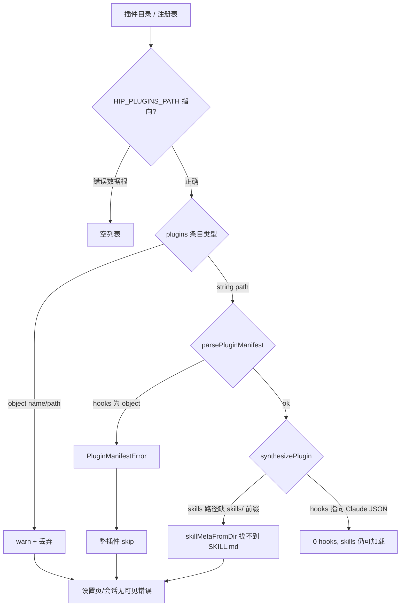

# Windows / Claude Code 插件加载可靠性 — Design Spec

| Field | Value |
|-------|-------|
| **Title** | hip 插件在 Windows 上加载失败：统一 `~/.hip`、注册表兼容与 Claude Code 清单互操作 |
| **Author** | hip design |
| **Date** | 2026-07-21 |
| **Status** | Implemented (rev 2 — D1: all platforms use `~/.hip`; PR1–PR4 landed 2026-07-21) |
| **Primary scope** | Plugin discovery / install / manifest parse / session load — sidecar + Tauri + UI copy |
| **Workspace** | `/Users/lijiamin/data/my-github/hip` |
| **Source of truth (incident)** | `docs/hip-plugin-windows-troubleshooting.md` |
| **Reference plugins** | [obra/superpowers](https://github.com/obra/superpowers) v6.1.1 |
| **Audience** | Sidecar + Tauri + frontend |

---

## Overview

用户在 Windows 上安装 `obra/superpowers`（或其它 Claude Code 生态插件）后，重启 hip 发现**插件未加载**；macOS 上「同样操作」可能看似正常。现场排查文档记录了四条手工修复（换目录、改 `hip-plugins.json`、改 hooks/skills 字段）。

本 spec 的结论是：那四条是**症状级 workaround**，不是产品解。根因是多层契约不一致 + **静默失败**，叠加 **Claude Code 插件格式 ≠ hip open-plugin 格式**。

**rev 2 路径决策：** 全平台统一数据根为 **`~/.hip`**（Windows 即 `%USERPROFILE%\.hip`）。项目仍在开发期，**不**做 `%APPDATA%\com.ljm.hip` → `~/.hip` 的迁移；旧 AppData 路径视为废弃，可忽略。

目标：官方安装与手动落盘在 Windows / macOS 上同一路径契约下可预期加载 skills；无法加载时给出可观测原因；hooks 互操作分阶段交付。

---

## Background & Incident Deconstruction

### 平台数据目录（问题一）— 当前实现分叉，产品改为统一

| 平台 | **现状（bug/债务）** | **目标（rev 2）** |
|------|----------------------|-------------------|
| macOS / Linux | `~/.hip` | `~/.hip`（不变） |
| Windows | `%APPDATA%\com.ljm.hip`（Tauri `app_data_dir`） | **`%USERPROFILE%\.hip`**（与 Unix 语义一致） |
| 覆盖 | `HIP_DATA_DIR` | 仍优先 `HIP_DATA_DIR`（E2E / isolation） |

插件目录 / 注册表（目标）：

| 用途 | 路径 |
|------|------|
| 插件包 | `~/.hip/plugins/<id>/` |
| 注册表 | `~/.hip/config/hip-plugins.json` |

权威实现（**均需改到统一规则**）：

- Rust: `src-tauri/src/paths.rs` → `hip_base_from` / `hip_base_dir` / `plugins_dir` / `plugins_config_path`
- CLI: `packages/cli/src/sidecar/hip-base.ts` `resolveHipBaseDir`
- Sidecar fallback: `plugin-store.ts` / `plugin-manager.ts`（今日已偏向 `homedir()/.hip`，与桌面 Tauri 不一致）

**现场现象解释：** 用户按文档/习惯把插件放进 `~\.hip\plugins\`，桌面版却读 AppData →「没加载」。统一后两边一致；UI/README 可继续写 `~/.hip`。

**开发期不做迁移：** 若本机曾写入 `%APPDATA%\com.ljm.hip`，不自动搬运；用户重新安装插件或手动拷贝即可。实现侧**删除** AppData 优先逻辑，不保留 dual-read。

### 注册表格式（问题二）— 读写方不一致

`hip-plugins.json` 的规范形状（protocol）：

```json
{
  "plugins": ["<absolute-plugin-dir>", "..."],
  "enabled": { "<slug>": true }
}
```

| 读路径 | 对 object entry 的处理 |
|--------|------------------------|
| Sidecar `packages/sidecar/src/config/plugins.ts` `readPluginsConfig` | **仅 string**；其它类型 `console.warn` 后丢弃 → 可能得到 `{ plugins: [] }` |
| Rust `src-tauri/src/plugins.rs` `read_plugins_config` | string **或** `{ "dir": "..." }`；**不认** `{ "name", "path" }` |
| Sidecar `PluginStore` | 同样只 filter string |

现场错误形状 `{ "name": "superpowers", "path": "..." }` 被**两边都静默跳过**。Rust 侧在 `register_plugin` 时会写回 string[]，但**不会主动规范化**磁盘上已损坏的 object 条目，除非用户再次触发 register。

### Manifest / 解析（问题三、四）— 更严重：格式族冲突

hip 约定：

- 插件根：`<dir>/.plugin/plugin.json`
- `skills`: string | string[]，相对插件根，**须真实存在**的目录路径
- `hooks`: **string**（指向 **CJS 模块**，导出 `Hook[]`，handler 为 function）或 inline `Hook[]`（inline 在 synthesizer 中实际无效）
- 任一 `PluginManifestError` → 整个插件在 `ConfigManager.loadPluginComponents` 中被 skip（仅 `console.warn`）

`obra/superpowers` 上游实际形态：

```
superpowers/
  .claude-plugin/plugin.json   ← name/version/description only，无 skills/hooks 列表
  skills/<name>/SKILL.md
  hooks/hooks.json             ← Claude Code 事件表：{"hooks":{"SessionStart":[{type:"command",...}]}}
```

**没有** hip 的 `.plugin/plugin.json`。  
Claude Code 的 `hooks` 是 **command 子进程** 协议，不是 hip 的 **in-process CJS function** 协议。

因此 troubleshooting 里「把 hooks 改成 `"hooks/hooks.json"`」只能让 **parser 不再抛错**；`synthesizeHooks` 仍会 `require` JSON 并因「非 Hook[] / handler 非 function」而得到 **0 hooks**。Skills 路径补 `skills/` 前缀对 hip 是必要的；但更优路径是 **清单缺省时自动扫描 `skills/*`**，而不是要求作者手写完整列表。

### 官方安装路径现状

`plugin:install:url` / `plugin_install` tool → `readOrGenerateManifest` → 无 `.plugin/plugin.json` 时调用 `generatePluginManifest`：

| 组件 | 当前行为 | 对 superpowers |
|------|----------|----------------|
| skills | 扫描 `skills/*/SKILL.md` → `./skills/<name>` | ✅ 正确 |
| hooks | 若存在 `hooks/` 任意文件 → 写死 `./hooks/hooks.cjs` | ❌ 文件不存在；即使改成 hooks.json 也与 synthesizer 协议不匹配 |
| mcp / agents | 有则引用 | N/A |

结论：**经 hip 官方 git 安装时 skills 本应可工作**；hooks 不会真正生效。现场失败多来自「数据根分叉 + 手写错误 manifest + 错误注册表」与静默 skip。

### 静默失败链



---

## Goals & Non-Goals

### Goals

1. **全平台统一数据根 `~/.hip`**：Tauri、CLI、`HIP_*` 默认 fallback、文档与 i18n 同一契约；Windows = `join(USERPROFILE|homedir, '.hip')`。
2. **注册表韧性**：兼容历史 object 条目（`dir` / `path`）；读时规范化；写时落盘为 string[]。
3. **清单韧性（hip-native + Claude-lite）**：
   - 识别 `.claude-plugin/plugin.json` 作为「元数据源」；
   - 缺 `skills` 或 bare skill id 时，安全解析到 `skills/<id>`；
   - `hooks` 为 Claude 事件对象 / 非 CJS 时 **不拖垮整个插件**（skills 仍加载）。
4. **安装路径正确**：`generatePluginManifest` 不再生成必然失效的 `hooks.cjs` 引用；对 Claude hooks 采用「省略」策略（见决策）。
5. **可观测**：插件跳过原因可到达 UI 或至少结构化日志。
6. **测试**：统一 base 的跨平台单元测试 + superpowers 形状 fixture（不依赖真网）。

### Non-Goals（本阶段）

- 完整实现 Claude Code `type: command` hooks 运行时 — **Phase B**。
- **从 `%APPDATA%\com.ljm.hip` 迁移用户数据**（开发期明确放弃；不 dual-read、不 import 工具）。
- 插件市场 UI / 在线商店。
- 修改上游 superpowers 仓库格式。
- 把 API keys 改回 keychain（与本问题无关）。

---

## Decisions

| ID | 决策 | 理由 |
|----|------|------|
| **D1** | **全平台数据根 = `~/.hip`**（Windows: `%USERPROFILE%\.hip`）。废弃 AppData `com.ljm.hip` 作为 hip 存储根 | 文档/脚本/用户心智已是 `~/.hip`；开发期无迁移成本；消除「装在 .hip 桌面读 AppData」类事故 |
| **D2** | `HIP_DATA_DIR` 仍最高优先（E2E / isolation）。默认解析：`home/.hip`，**不**再查 `APPDATA` / Tauri `app_data_dir` | 与 README / i18n 一致；Tauri 仅用于取 home，不取 app_data 作 hip 根 |
| **D3** | 所有 fallback（PluginStore、PluginManager、CLI、Rust）共用同一规则；实现可抽纯函数 + 对齐单测 | 消灭「一边 `.hip` 一边 AppData」 |
| **D4** | `readPluginsConfig`（sidecar）对齐 Rust：接受 string、`{dir}`、`{path}`；读后 `string[]`；启动可 **rewrite** 规范形状 | 消灭 object 静默空列表 |
| **D5** | Manifest 对 hooks **degrade, don't die**：非法 hooks → `hooks = undefined` + 诊断，**不** throw（name/version 仍严格） | 问题三曾导致整插件不可用 |
| **D6** | Skills：相对路径不存在时试 `skills/<value>`；无 skills 字段时扫描 `skills/*/SKILL.md` | bare id + Claude 约定目录 |
| **D7** | 若无 `.plugin/plugin.json` 而有 `.claude-plugin/plugin.json`：安装时生成 `.plugin/plugin.json`；运行时仍以 `.plugin` 为准 | 避免双源 |
| **D8** | Phase A hooks：Claude `hooks.json` / 事件 object → **不加载 hooks**（skills 可用）；Phase B command-hook adapter | troubleshooting「指向 hooks.json」不是终态 |
| **D9** | UI/i18n **可以**继续写 `~/.hip`（全平台正确）；设置页可展示解析后的绝对路径 | 不再需要平台分支文案 |
| **D10** | **不做** AppData → `~/.hip` 迁移或 dual-read | 产品确认开发期可丢弃旧 Windows 数据位置 |

---

## Proposed Architecture

### A. Path resolution single source

```text
resolveHipBaseDir(env, platform)  // platform 参数可保留，但默认规则与 platform 无关
  → if HIP_DATA_DIR set: resolve(HIP_DATA_DIR)
  → else: join(home, '.hip')
       home = env.HOME | env.USERPROFILE | os.homedir()

HIP_PLUGINS_DIR  = base/plugins
HIP_PLUGINS_PATH = base/config/hip-plugins.json
```

**删除 / 改写：**

| 位置 | 今日 | 目标 |
|------|------|------|
| `packages/cli/src/sidecar/hip-base.ts` | win32 → `APPDATA/com.ljm.hip`（及 `hip` alias） | 一律 `home/.hip` |
| `src-tauri/src/paths.rs` `hip_base_from` | windows → `app_data` | windows 与 unix 一样 `home/.hip` |
| `src-tauri/src/paths.rs` `hip_base_dir` | 取 `app.path().app_data_dir()` | 取 home（`HOME` / 等价）；**不**依赖 app_data 作根 |
| sidecar `plugin-store` / `plugin-manager` | 已 `homedir()/.hip` | 保持，并与上式对齐（可抽共享） |

Rust 单测中断言 `C:\AppData\com.ljm.hip` 的用例改为 `C:\Users\x\.hip`（或等价 home join）。

CLI `hip-base.test.ts` 同步改写 Windows 用例。

### B. Registry read/normalize

```typescript
// pseudo
function coercePluginEntry(entry: unknown): string | null {
  if (typeof entry === 'string' && entry.trim()) return entry
  if (entry && typeof entry === 'object') {
    const o = entry as Record<string, unknown>
    for (const k of ['dir', 'path', 'root']) {
      if (typeof o[k] === 'string' && (o[k] as string).trim()) return o[k] as string
    }
  }
  return null // + diagnostic
}
```

- 读：Rust + sidecar 同一语义。
- 写：`register_plugin` / `PluginStore.add` / install tool **只写 string[]**。
- 启动时：若检测到非 string 条目，**rewrite** 一次规范 JSON（保留 `enabled` / `entries`）。

### C. Manifest parse (parser.ts) — Phase A

| 输入 | 行为 |
|------|------|
| 缺 name/version | 仍 throw |
| `skills` 省略 | 扫描 `skills/*/SKILL.md` → 绝对路径列表 |
| `skills: ["brainstorming"]` 且根下不存在、`skills/brainstorming` 存在 | 解析到后者 |
| `hooks` string | resolve 路径；存在性由 synthesizer 处理 |
| `hooks` object（Claude 事件表） | **不 throw**；`hooks = undefined`；诊断 `hooks_unsupported_format` |
| `hooks` array | 保持现状 |
| 仅有 `.claude-plugin/plugin.json` | 运行时仍要求 `.plugin/plugin.json`；见 D7 安装路径 |

可选：`parsePluginManifest(pluginDir, { diagnostics })` 供设置页。

### D. Install / auto-generate (plugin-install.ts)

1. skills：保持扫描 `./skills/<name>`。
2. hooks：
   - 若存在 `hooks/hooks.cjs` 或 `hooks/index.cjs` → 引用；
   - 若仅有 Claude `hooks/hooks.json` → **不写 hooks 字段**；诊断 `hooks_deferred_claude_format`；
   - **禁止**写不存在的 `./hooks/hooks.cjs`。
3. 若存在 `.claude-plugin/plugin.json`，用其 name/version/description/author/license/keywords 填充，再叠加扫描。
4. 非法旧 manifest：Phase A parser degrade 后可直接 parse，不必强制覆盖用户文件。

### E. Runtime load (config-manager)

- 按 `plugins[]` 绝对路径加载。
- catch 时带 pluginDir；可选 `plugin:load:warning`。
- 未注册路径默认不进 session 的契约不变。

### F. Observability & UI

1. i18n 继续使用 `~/.hip` 即可（全平台正确）；可选展示绝对路径。
2. 设置 → 插件页：加载失败 reason code。
3. 结构化 warn：跳过条目 / 跳过插件带 id。

### G. Claude hooks Phase B（另 PR）

- 解析 Claude `hooks.json` → spawn command → 映射 `additionalContext`。
- `${CLAUDE_PLUGIN_ROOT}` / `HIP_PLUGIN_ROOT`；Windows `run-hook.cmd`。
- Phase A **不实现**。

---

## API / File Touch Map

| 区域 | 文件 | 变更 |
|------|------|------|
| **Path (核心)** | `packages/cli/src/sidecar/hip-base.ts` + `hip-base.test.ts` | 去掉 win32 AppData 分支；统一 `home/.hip` |
| **Path (核心)** | `src-tauri/src/paths.rs` | `hip_base_from` / `hip_base_dir` 统一 home；改/删 AppData 测试 |
| Path | `packages/sidecar/src/plugin/plugin-store.ts` | fallback 与统一规则一致（已接近） |
| Path | `packages/sidecar/src/plugin/plugin-manager.ts` | 同上 |
| Path / docs | README*、troubleshooting、注释中的 AppData 说明 | 改为 `~/.hip` 全平台 |
| Registry | `packages/sidecar/src/config/plugins.ts` | coerce object entries |
| Registry | `src-tauri/src/plugins.rs` | coerce `path`；可选 rewrite |
| Registry | `src-tauri/src/lib.rs` | startup normalize `hip-plugins.json` |
| Parser | `packages/sidecar/src/session/plugins/parser.ts` | hooks degrade；skills fallback；scan |
| Install | `packages/sidecar/src/session/plugin-install.ts` | hooks 生成策略；`.claude-plugin` |
| Synthesizer | `packages/sidecar/src/session/plugins/synthesizer.ts` | 无强制改 |
| UI | 插件设置（若有） | 绝对路径展示可选 |
| Docs | `docs/hip-plugin-windows-troubleshooting.md` | 急救步骤改为 `~/.hip`；指向本 spec |
| Tests | 上列 + parser/install fixtures | 见 Success Criteria |

---

## Success Criteria

1. **路径统一**：在 Windows 模拟（`USERPROFILE=C:\Users\Admin`，无 `HIP_DATA_DIR`）下，CLI / Rust / sidecar fallback 的 base **均为** `C:\Users\Admin\.hip`；**不**出现 `AppData\Roaming\com.ljm.hip`。
2. macOS 行为不变：`HOME=/Users/x` → `/Users/x/.hip`。
3. `HIP_DATA_DIR` 仍覆盖默认 base。
4. `hip-plugins.json` 含 `[{ "name":"superpowers","path":"..." }]` 时 sidecar 读到该路径；normalize 后磁盘为 string[]。
5. Fixture superpowers 形状：
   - 仅 `skills/*/SKILL.md` + `.claude-plugin/plugin.json` → install 生成合法 `.plugin/plugin.json`，skills 可加载；
   - `hooks: { SessionStart: [...] }` + bare skill names → **skills 仍加载**，hooks 空 + 诊断，不 throw。
6. `generatePluginManifest` 仅有 `hooks/hooks.json` 时 **不**写入缺失的 `hooks.cjs`。
7. 既有 path/parser/install 测试更新后全绿。

---

## PR Plan

### PR1 — 统一数据根 `~/.hip`（优先，解问题一）

- 改 `hip-base.ts`、`paths.rs` 及单测。
- 扫注释 / troubleshooting / 设计外文档中的 AppData 插件路径说明。
- **不做**数据迁移。
- **验收**：Success criteria 1–3。

### PR2 — Registry coerce + startup normalize

- Sidecar + Rust 统一 coerce `dir`/`path`。
- 启动 rewrite。
- **验收**：损坏注册表不再空列表。

### PR3 — Manifest degrade + skills 扫描/前缀（核心）

- `parser.ts` + `plugin-install.ts` + superpowers-shaped fixture。
- **验收**：Success criteria 5–6。

### PR4 — 可观测性

- 跳过原因到 UI/日志。
- **验收**：坏插件可见 reason code。

### PR5 —（可选）Claude command-hook adapter

- Phase B；独立补充设计。

---

## Risks & Mitigations

| Risk | Mitigation |
|------|------------|
| 开发者本机仍有数据在 AppData | 文档一句「现用 `~/.hip`；旧 AppData 不迁移」；自行拷贝 |
| Tauri 其它子系统仍假设 app_data | 全仓 grep `app_data_dir` / `com.ljm.hip` / `APPDATA` 与 hip 存储相关调用一并改 |
| Degrade hooks 误以为 SessionStart 生效 | UI/诊断标明 hooks 未加载 |
| 自动扫描 skills 过宽 | 仅 `skills/*/SKILL.md` |
| Windows home 来源不一致 | 固定优先级：`HOME` → `USERPROFILE` → `homedir()` / Rust 等价 |

---

## Manual emergency（修复发布前）

1. 插件放到 **`~/.hip/plugins/<id>/`**（Windows: `%USERPROFILE%\.hip\plugins\`）。
2. `~/.hip/config/hip-plugins.json` 的 `plugins` 为**字符串绝对路径**。
3. 优先应用内 URL/GitHub 安装；勿手写 Claude hooks object 进 `.plugin/plugin.json`。
4. 勿指望 `hooks` → `hooks/hooks.json` 跑通 SessionStart（Phase A skills-first）。

发布 PR1 后，急救文档中的 AppData 路径应删除或标为过时。

---

## Open Questions

1. Phase A 是否在 UI 显示「N skills · hooks 不兼容」？（建议 PR4）
2. bare skill id 是否写回规范化 `plugin.json`？（建议默认仅内存解析；install 生成时写规范路径）
3. Rust `hip_base_dir` 在无 `HOME`/`USERPROFILE` 时是否仍 fallback 到 Tauri path API 的 home，而非 app_data？（建议 **只要 home，不要 app_data**）

---

## Appendix: Code anchors

| Concern | Path |
|---------|------|
| Base dir (CLI) | `packages/cli/src/sidecar/hip-base.ts` |
| Base dir (Tauri) | `src-tauri/src/paths.rs` `hip_base_from` / `hip_base_dir` |
| Registry read (sidecar) | `packages/sidecar/src/config/plugins.ts` |
| Registry read/write (Rust) | `src-tauri/src/plugins.rs` |
| Manifest parse | `packages/sidecar/src/session/plugins/parser.ts` |
| Load orchestration | `packages/sidecar/src/session/config-manager.ts` |
| Hooks require CJS | `packages/sidecar/src/session/plugins/synthesizer.ts` `synthesizeHooks` |
| Auto-manifest | `packages/sidecar/src/session/plugin-install.ts` `generatePluginManifest` |
| Zip install register | `src-tauri/src/lib.rs` `install_plugin` |
| Protocol shape | `packages/protocol/src/plugins.ts` |
| Incident notes | `docs/hip-plugin-windows-troubleshooting.md` |
| Upstream Claude plugin | `.claude-plugin/plugin.json` + `hooks/hooks.json` in obra/superpowers |

---

## Changelog

| Rev | Change |
|-----|--------|
| 1 | 初稿：保留 Windows AppData 分叉；强调 path UX / registry / Claude interop |
| 2 | **D1 翻转**：全平台统一 `~/.hip`；明确不做 AppData 迁移；PR1 改为改 `hip-base` + `paths.rs` |
