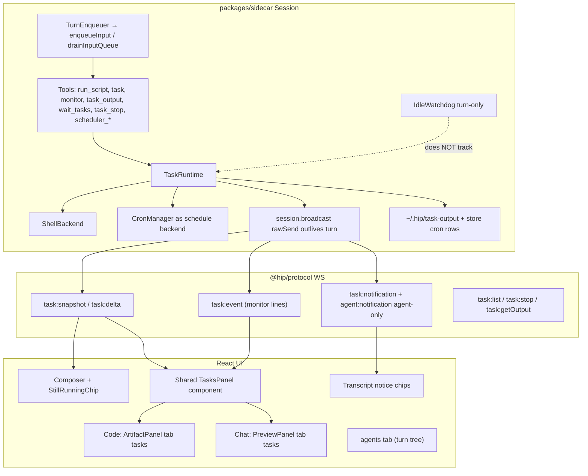
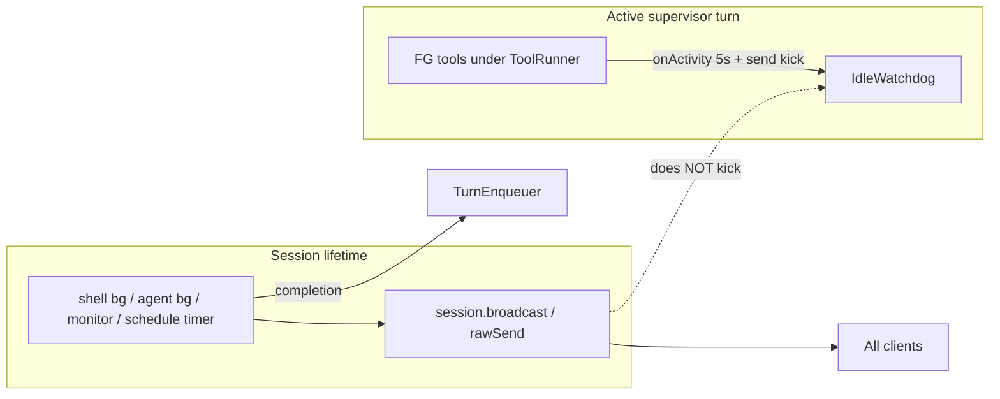
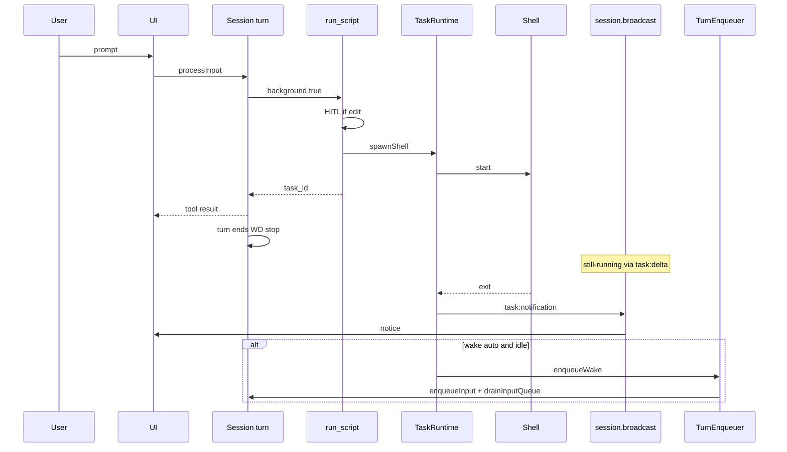
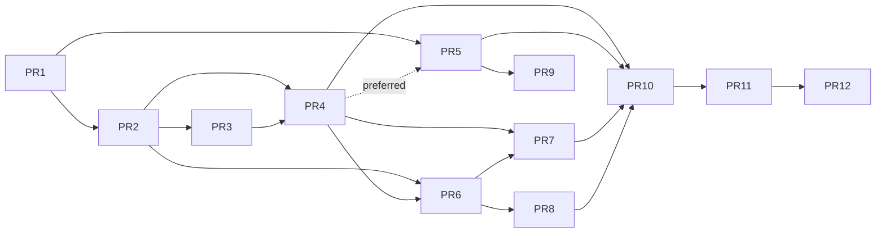

# Async Task Runtime, Shell Backgrounding, Monitor & Scheduler

| Field | Value |
| --- | --- |
| **Title** | Async Task Runtime + Right-Panel Tasks Surface |
| **Author** | (TBD) |
| **Date** | 2026-07-22 |
| **Status** | Implemented (rev 5 — PR1–PR12 landed in monorepo; dogfood via flags/defaults) |
| **Workspace** | `/Users/lijiamin/data/my-github/hip` |
| **Primary references** | grok-build `20-background-tasks.md`, hip `BackgroundManager`, `run_script`, IdleWatchdog, `Session.enqueueInput` |

---

## Overview

hip can only run long work by blocking the supervisor turn. Background **subagents** exist (`task` mode `background` → `BackgroundManager`), but **shell** work via `run_script` is always synchronous with a hard **120s** kill. There is no monitor/watch stream, no multi-task wait, and no scheduler that auto-fires agent turns. A production OOM stress-test conversation failed with:

```text
Idle timeout after 180000ms with no outbound activity
```

while the agent held the main turn on blocking PowerShell stress scripts. Root gap: long work has no first-class path outside turn idle accounting.

This design brings a **grok-build-aligned four-layer task runtime** into hip:

1. **Background shell commands** (`run_script` + `background: true` → `task_id`)
2. **Background subagents** (existing `task` / `task_output` / `task_stop`, unified under TaskRuntime)
3. **Monitor** (stdout line → UI/WS events only by default; rate-limited; optional persistent)
4. **Scheduler / loop** (interval prompts; evolve `CronManager` from inject-only reminders to wake-capable schedules via real `enqueueInput` / `drainInputQueue`)

The **right panel** is the primary UI surface for live, **session-scoped runtime** tasks on **both code and chat surfaces** (shared `TasksPanel`). Left-nav product meanings are **preserved** (todo tracking / automation placeholders stay placeholders in v1). Protocol, sidecar runtime, tools, idle/wake policy, security, destroy lifecycle, and a multi-PR plan are specified end-to-end.

---

## Background & Motivation

### Production incident

A long OOM stress-test conversation timed out under code-surface idle default **180s** (`DEFAULT_CODE_IDLE_TIMEOUT_MS`). The agent used synchronous `run_script` (PowerShell) for stress work. IdleWatchdog only kicks on **outbound WS messages** and **tool activity pulses** (`TOOL_ACTIVITY_INTERVAL_MS = 5_000`) while a tool is registered on the **current turn**. A single long blocking shell with no intermediate activity → idle abort.

### Current state (hip)

| Capability | Status | Key surfaces |
| --- | --- | --- |
| Background subagents | ✅ Partial | `BackgroundManager` (`background-manager.ts`), `runBackgroundSubagent` (`session-background.ts`), tools `task` / `task_output` / `task_stop` / `task_retry` / `task_batch` (`tools/subagent.ts`). IDs default `worker-N` (`session-turn-runner.ts` spawnSubagent) |
| Cap | ✅ Agent-only | `Session.MAX_BACKGROUND_TASKS = 10` passed as `BackgroundManager` `maxTasks` — **single global map size**, not per-kind |
| Worktree isolation for bg agents | ✅ | `background-worktree.ts`, `parallel_worktrees` |
| Shell `run_script` | ❌ Always FG | `tools/script.ts`: `spawn(cmd\|sh)`, **no** `background`, **no** `AbortSignal`, **120s** hard kill (`SCRIPT_TIMEOUT_MS`), **64KB** cap; Windows kill is `child.kill` only (orphans) |
| Multi-task wait | ❌ | Only internal `BackgroundManager.wait`; not a tool |
| Monitor / watch | ❌ | — |
| Scheduler that wakes turns | ❌ Partial | `CronManager` + `cron_*`: **inject-on-next-turn only** (`session-turn-runner.ts` `cronManager.tick()` → `<system-reminder>`). Does **not** call `enqueueInput` when idle |
| Turn admission | ✅ | `Session.enqueueInput` → in-memory `inputQueue` (+ optional durable `SessionInputQueue`); pump via `drainInputQueue` when `!running && !awaitingResume` |
| `deferred-queue.ts` | ⚠️ Unrelated | Tool-call / ToolMessage pairing inside the agent **graph** — **not** turn scheduling |
| Context injection | ✅ Agents only | `SubagentStatusInjector`, `SubagentNotificationFragment` |
| UI notice on complete | ✅ Agents only | WS `agent:notification` status `'completed'\|'failed'\|'killed'` → `sessionStore` role `notice` |
| Isolation notice misuse | ⚠️ | `runBackgroundSubagent` also emits `agent:notification` `status:'completed'` for worktree path mid-flight |
| IdleWatchdog | ✅ Turn-scoped | `idle-watchdog.ts`, `idle-timeout.ts` (code 180s / else 60s); turn wraps `send` with `watchdog.kick()` |
| Task output disk | ✅ Agents only | `~/.hip/task-output/<sessionId>/<taskId>/` |
| Session destroy | ⚠️ Leak risk | `destroy()` races promises then `clear()` — **does not** systematically `stop()` / kill OS processes |
| Multi-client | ✅ Agents | `originConnectionId`, `stopFromOrigin` / `stopBackgroundFrom` |
| Self-gated tools | ✅ | `SELF_GATED_TOOLS` includes `run_script`; ToolRunner **skips** `SessionApprovalCache` for `approval === 'self'` |
| Sticky options UI | Partial | `enableStickyApproval` adds allow_always/reject_always to HITL options; **self-gated path does not lookup/set cache today** |
| Full permission mode | Auto-allow | `permissionMode === 'full'` → no HITL for tools (and self-gated tools auto-allow) |
| Chat mode | No shell | `run_script` omitted when mode is `chat` / no `requestApproval` |
| Right panel code | ✅ | `ArtifactPanel`; tabs: `files \| agents \| outline \| timeline \| changes \| terminal` |
| Right panel chat | ✅ Different | `PreviewPanel`; `ChatTab = 'files' \| 'agents' \| 'outline'` only |
| Agents tab | Turn-scoped | `AgentDashboard` — latest turn tree, **not** durable runtime |
| Left nav | Placeholder | `tasks` copy: *todo / work-item tracking*; `automation` copy: *workflows and scheduled jobs* (`src/i18n/en.ts`) |
| System prompt | Agents-only bg | *“Background only: task mode background, then task_output/task_stop.”* |
| Config schema | ✅ | `packages/protocol/src/hip-config.ts` `HipConfig`; parse in `packages/sidecar/src/config/hip-config.ts` |

### Grok-build product model (source of truth)

From `crates/codegen/xai-grok-pager/docs/user-guide/20-background-tasks.md`:

- `run_terminal_command` + `background: true` → immediate `task_id`
- `get_command_or_subagent_output` (optional `timeout_ms` wait)
- `wait_commands_or_subagents` (`wait_any` / `wait_all`)
- `kill_command_or_subagent`
- `monitor` — each stdout line → conversation event; rate limit + auto-kill on sustained overload
- Scheduler + `/loop` — interval prompts; max 50; expire 7d; optional durable
- Tasks pane + still-running status line
- Windows process isolation via **Job Objects** in production terminal path

### Pain points

1. **Long shell cannot leave the turn** → IdleWatchdog / 120s hard kill.
2. **No streaming watch** for logs/CI without polling sleep loops.
3. **Cron is passive** — no auto-continue when due while session is idle.
4. **No unified runtime UI** — agents tab is turn-history; left-nav placeholders mean different products than process runtime.
5. **Windows process tree** — current FG path orphans grandchildren; bg servers make this worse.
6. **Destroy/disconnect** — map clear without kill leaks OS processes once shells exist.

---

## Goals & Non-Goals

### Goals

1. **Unified `TaskRuntime`** (evolve `BackgroundManager`) with kinds: `shell | agent | monitor | schedule`, implementable contract below.
2. **Background shell** via `run_script` with `background: true` (hip-idiomatic; grok mental model).
3. **Monitor tool** with line events, token-bucket rate limit, catch-up notices, auto-kill, session event budget, persistent mode.
4. **Wait / get-output / kill** tools covering all kinds (extend `task_output` / `task_stop`; add `wait_tasks`).
5. **Scheduler** that can **wake** the agent via **`Session.enqueueInput` + `drainInputQueue`** (not graph deferred-queue).
6. **Right-panel Tasks on code *and* chat** as primary live surface + still-running chip.
7. **Idle/wake policy**: bg work does not hold the main turn; completions can wake under config; out-of-turn send uses session broadcast.
8. **Security** matching real permission modes (chat / edit / full) and self-gated tool truth.
9. **Windows-first** shell backend with explicit kill ladder and destroy lifecycle.
10. **Feature-flagged** staged rollout; existing `task_*` + `worker-*` ids remain valid forever.

### Non-Goals

- Replacing user-facing PTY terminals (`TerminalView` / managed terminals) with agent shells (**see Alternatives E**).
- Cross-session shared process fabric / OS job daemon.
- Running durable schedules when **no hip session is open** (app-level runner deferred; KD-17).
- Changing ACP external-agent protocol (built-in sidecar tooling only).
- Auto-backgrounding mid-flight FG shells via UI hotkey (grok Ctrl+B) or auto-bg-on-timeout in v1.
- Productizing left-nav **todo tracking** in this project (left-nav `tasks` remains future work-item product).
- Redefining left-nav `tasks` to mean runtime process tasks.

---

## Proposed Design

### Architecture layers



---

## Implementation contract: TaskRuntime

### Type split (internal vs wire)

```ts
// Internal only — never serialized to WS
export type TaskKind = 'shell' | 'agent' | 'monitor' | 'schedule'
export type TaskStatus =
  | 'running'
  | 'completed'
  | 'failed'
  | 'killed'
  | 'lost'
  | 'scheduled'   // schedule definition waiting for next fire
  | 'suppressed'  // monitor auto-killed for volume

export interface TaskInternal {
  id: string
  kind: TaskKind
  description: string
  status: TaskStatus
  createdAt: number
  updatedAt: number
  detail?: string
  cwd?: string
  pid?: number | null
  exitCode?: number | null
  result?: string
  error?: string
  metrics?: {
    bytes?: number
    lines?: number
    fires?: number
    nextFireAt?: number
    suppressedLines?: number
  }
  originConnectionId?: string | null
  /** Correlation for debugging */
  originTurnId?: string | null
  originToolCallId?: string | null
  /** schedule definition — source of truth still CronManager; mirrored for snapshot */
  scheduleId?: string
  abortController: AbortController
  /** shell/monitor: kill hook (process tree) */
  kill?: () => Promise<void>
  outputChunks?: string[]
  outputSizeBytes?: number
}

// Wire — packages/protocol
export interface TaskSnapshot {
  id: string
  kind: TaskKind
  description: string
  status: TaskStatus
  createdAt: number
  updatedAt: number
  detail?: string
  pid?: number | null
  exitCode?: number | null
  metrics?: TaskInternal['metrics']
  originTurnId?: string | null
  logTail?: string // last ~2KB only; full log via task:getOutput
}
```

`abortController`, `kill`, and full `outputChunks` **never** appear on the wire.

### Class / method surface

Evolve `BackgroundManager` in place (or thin subclass used as drop-in) so existing agent call sites keep working:

```ts
class TaskRuntime {
  // ── Construction ──────────────────────────────────────────
  constructor(sessionId: string, opts: {
    caps: TaskCaps
    persistence?: BackgroundTaskPersistence
    broadcast: (msg: ServerMessage) => void  // session-level, no IdleWatchdog
  })

  // ── Agent path (compat) ───────────────────────────────────
  /** Same signature as today + optional kind default 'agent' */
  spawn(
    taskId: string,
    description: string,
    runner: (signal: AbortSignal) => Promise<void>,
    opts?: { originConnectionId?: string | null; kind?: 'agent'; originTurnId?: string | null },
  ): string

  // ── Kind-specific ─────────────────────────────────────────
  spawnShell(opts: SpawnShellOpts): { taskId: string } | { error: string }
  spawnMonitor(opts: SpawnMonitorOpts): { taskId: string } | { error: string }
  /** CronManager is backend; runtime registers mirror for UI/caps */
  upsertSchedule(opts: UpsertScheduleOpts): { taskId: string } | { error: string }
  deleteSchedule(taskId: string): boolean

  // ── Lifecycle ─────────────────────────────────────────────
  stop(taskId: string, reason?: string): string
  stopFromOrigin(connectionId: string, reason?: string): string[]
  /** Abort + kill every running shell/monitor/agent; cancel schedules if hard */
  async destroyAll(opts?: { killSchedules?: boolean }): Promise<void>
  clear(): void // only after destroyAll; map wipe

  completeTask(
    taskId: string,
    status: 'completed' | 'failed' | 'suppressed',
    result?: string,
    error?: string,
  ): boolean

  // ── Wait / output ─────────────────────────────────────────
  wait(taskId: string, timeoutMs?: number): Promise<string>
  waitMany(taskIds: string[], mode: 'wait_any' | 'wait_all', timeoutMs?: number): Promise<WaitManyResult>
  getOutput(taskId: string): string
  getOutputStructured(taskId: string): TaskOutputPayload
  appendOutput(taskId: string, chunk: string): void

  // ── Snapshots ─────────────────────────────────────────────
  listSnapshot(): TaskSnapshot[]
  runningCounts(): { shell: number; agent: number; monitor: number; schedule: number }
  reconcile(): string[] // running-on-disk → lost
}
```

**Agent id compat:** keep `worker-N` and any caller-supplied ids forever. Prefixes `shell-` / `mon-` / `sched-` apply only to new kinds. Display layer may show kind badges without rewriting ids.

### Concurrency caps (per-kind + global)

Today: single `tasks.size >= maxTasks` with `maxTasks = 10`.

**Target algorithm on every spawn:**

```ts
interface TaskCaps {
  agent: number    // default 10 — Session.MAX_BACKGROUND_TASKS
  shell: number    // default 20
  monitor: number  // default 10
  schedule: number // default 50  — counts *definitions* with status scheduled|running fire
  globalRunning: number // default 40 — sum of running shell+agent+monitor only
}
```

Rules:

1. Count **running** processes for shell/agent/monitor against per-kind and `globalRunning`.
2. **Schedule definitions** count against `schedule` max only (not `globalRunning`), whether status is `scheduled` or a fire is in flight.
3. In-flight schedule **fire** (bg subagent or main turn) counts as a normal **agent** (or turn) — subject to agent/global caps when spawning the fire worker.
4. `spawn()` for agents continues to enforce agent cap + globalRunning (replacing the single size-10 check).
5. Config overrides via `[taskRuntime]` in hip.toml (see Config).

#### Schedule fire when caps are full (normative)

When a due schedule would spawn a bg fire worker (`foreground: false`) and `spawnAgent` / `spawn` returns cap-exceeded (agent at max **or** `globalRunning` full):

| Choice | Behavior |
| --- | --- |
| **Default (ship)** | **Skip this fire.** Keep the schedule definition. For recurring: `nextFireAt` was already advanced by `tickDue()` — do **not** retry immediately; wait for the next interval. For one-shot that was deleted by tick: see tick contract — one-shot only deletes **after** successful fire handoff, or on skip re-insert with `nextFireAt = now + min(interval, 60s)` backoff once. |
| Buffer fire | **Not** used for schedule fires (avoids unbounded prompt pile-up). Wake buffer is only for TurnEnqueuer main-turn wakes. |
| Kill oldest agent | **Not** used — never pre-empt user/agent work for a schedule. |

On skip:

1. `logInfo('task-runtime', 'schedule_fire_skipped', { sessionId, scheduleId, reason: 'agent_cap' | 'global_cap' })`
2. Optional **throttled** notice (max 1 per schedule per 5 minutes) via `session.broadcast` `task:notification` is **not** used (not terminal); use `task:delta` with `metrics.skipCount` + Runtime panel badge, and at most one transcript `notice`: `"[scheduled task cron-…] fire skipped: agent concurrency full"`.
3. Timer keeps ticking (never block the 1s loop on spawn failure).

When `foreground: true` and session is busy (`running` / `awaitingResume`): use TurnEnqueuer wake buffer (existing). When idle but agent cap full is irrelevant for main-turn fires (main turn is not an agent bg slot); only `running` gate applies.

**PR2 acceptance:** split caps **must** land before shell bg (PR4) or shells share the agent-10 budget.

### Schedule ownership (single source of truth)

| Concern | Owner |
| --- | --- |
| Persist schedule rows, tick due times, jitter | **`CronManager`** (existing store API) |
| UI snapshot, stop/delete from Tasks panel, caps, unified list | **`TaskRuntime`** mirror entry `kind: 'schedule'`, `scheduleId === cron id` |
| Fire execution | **`TurnEnqueuer`** (below), not CronManager |

On create: `CronManager.create` → `TaskRuntime.upsertSchedule` mirrors id (`cron-*` kept; optional alias `sched-*` maps to same row).  
On delete/stop schedule: both maps updated.  
On session load: CronManager `ensureLoaded` + runtime rebuilds mirrors from `list()`.

**Do not** maintain two independent schedule lists.

### destroy / clear contract

Replace today’s “race promises + `clear()`” for process kinds:

```ts
async destroy(): Promise<void> { // Session.destroy
  this.cancel() // existing FG abort
  await this.taskRuntime.destroyAll({ killSchedules: true })
  // destroyAll: for each running meta → stop() which calls kill() for shell/monitor
  //             and abortController.abort() for agents; cancel schedule timers
  this.taskRuntime.clear()
  // ... existing dispose
}
```

| Event | Shell / monitor | Agent bg | Schedule definition |
| --- | --- | --- | --- |
| `Session.destroy` / hard delete | **Kill process tree** | abort | delete + cancel timer |
| Soft session switch (session still alive) | keep | keep | keep |
| Owner connection disconnect | **stopFromOrigin** (default on) | stopFromOrigin | keep (session-owned) |
| Last client disconnect | same as owner policy; if no clients, optional `killOnLastDisconnect` (default **true** for shell/monitor) | same | keep until destroy |
| App quit | destroy all sessions → kill all | kill | cancel |

`clear()` **must not** be called without prior `stop`/`kill` once shells exist. Unit tests assert `kill` invoked.

### Serialization / reconcile

- Persist `kind`, `pid`, `metrics`, correlation ids in `meta.json`.
- Missing `kind` on load → `'agent'`.
- `running` on disk after process death → `lost` (existing reconcile path).

---

## Shell backend (Windows-first)

### Current FG path (baseline)

```ts
// tools/script.ts today
const isWin = process.platform === 'win32'
const shell = isWin ? 'cmd' : 'sh'
const shellArgs = isWin ? ['/c', command] : ['-c', command]
spawn(shell, shellArgs, { cwd, env: process.env, detached: !isWin })
// timeout: process.kill(-pid) POSIX; child.kill Windows (orphans grandchildren)
```

### Spawn contract

| Field | Value |
| --- | --- |
| cwd | Session project cwd (`host._config.cwd`) |
| env | `process.env` + optional `PYTHONUNBUFFERED=1` for monitors; no secret scrubbing beyond OS env (same as today) |
| Tracked pid | **Root** process TaskRuntime owns (the shell we spawned) |
| POSIX | `detached: true`, new process group; kill: `SIGTERM` to `-pid`, then `SIGKILL` after **2s** grace |
| Windows | `detached: false`; `windowsHide: true`; **no** `CREATE_NEW_PROCESS_GROUP` required for v1 taskkill tree |

### Windows kill strategy ladder

| Tier | Mechanism | When |
| --- | --- | --- |
| **v1 (ship)** | `taskkill /PID <pid> /T /F` via `spawnSync`/`execFile` | Default; known degradation vs grok |
| **v1 fallback** | `child.kill()` if taskkill fails / pid gone | Log warning |
| **v2 aspirational** | Windows **Job Object** (`CreateJobObject` / `AssignProcessToJobObject` / `TerminateJobObject`) via native addon or `process_wrap`-style helper | Optional when native module available; **not** blocking v1 |

Document in tool description and risks: nested `start /B`, `Start-Process`, elevated children, and breakaway jobs can escape taskkill trees. Prefer Job Objects in v2 for grok parity.

### Background command wrapping

- `background: true` runs the **same** shell string as FG; tracked pid is the shell root.
- If the model backgrounds a short launcher that exits after `start /B` / `Start-Process`, the task may complete while the grandchild lives — **document** in system prompt: “run the long-lived process in the foreground of the shell (do not detach with start /B); use background:true on run_script instead.”
- Optional later: detect early exit with no output and warn in result text.

### PowerShell

- Default Windows shell remains **`cmd.exe /c`** for compat (KD-7).
- Opt-in: `HIP_SHELL=powershell` or `[taskRuntime] windowsShell = "powershell"` → `powershell.exe -NoProfile -NonInteractive -Command <command>` (Windows PowerShell 5.1).
- Optional `pwsh` if on PATH and `windowsShell = "pwsh"`.
- Call out grok-style `&` / ampersand semantics differences between 5.1 and pwsh in system prompt when PS is selected — do not invent hip-specific escaping beyond documenting model guidance.

### FG quality (pi-inspired)

1. Honor turn `AbortSignal` → kill tree.
2. Optional model `timeout_ms` (FG default 120_000, max 300_000).
3. **Timer-based** activity pulse every `TOOL_ACTIVITY_INTERVAL_MS` for the entire FG await (not only-on-data), so CPU-bound / silent stress tests keep IdleWatchdog alive while the tool is registered.
4. Also kick on stdout/stderr chunks when present.
5. Keep 64KB tool-return cap; bg full log on disk (cap e.g. 10MB, truncate head).

### Tests

- Unit: mock `taskkill` / `process.kill` invocations with a fake grandchild pid tree.
- Integration (POSIX CI): spawn `sh -c 'sleep 60 & wait'` patterns and ensure stop kills group.
- Windows CI: if unavailable, mock spawn; document manual QA checklist for `npm run dev` grandchild.

---

## Monitor

Aligned with grok (`monitor/types.rs`, `rate_limiter.rs`):

| Parameter | Type | Notes |
| --- | --- | --- |
| `command` | string | Shell command |
| `description` | string | Shown in events / panel |
| `timeout_ms` | number? | Default 10h non-persistent; max 10h |
| `persistent` | boolean? | Session lifetime; ignore timeout |

### Stream policy (normative)

| Destination | Default |
| --- | --- |
| Disk `output.log` + `events.jsonl` | Always |
| WS `task:event` | Yes, after per-monitor rate limit + session budget |
| Tasks panel UI | Yes (consumes `task:event` / log tail) |
| Transcript notice | **No** per line |
| Model context / next-turn inject | **No** by default (`wake.monitorEvents` and inject remain off). Model reads via `task_output` or explicit summary on monitor exit/auto-kill |
| stderr | **Merged** into the same line stream (both generate events) |

### Rate limits

- Per-monitor token bucket: capacity **10**, refill **1 / 2s** (match grok).
- Line truncation **500** chars; batch debounce **200ms**; batch cap **3000** chars.
- Auto-kill after **30s** continuous suppression; emit catch-up-style message with hip tool name: *“N events suppressed… use task_stop and restart monitor with a tighter filter.”*
- After suppression subsides, emit **one catch-up notice** with suppressed count before next allowed event (grok behavior).
- **Session-level budget**: max **30** monitor events/min across all monitors; excess dropped (drop-oldest WS buffer, max 100 pending events/session). Drop → increment metric, optional single notice per minute.

### Windows filters

System prompt: prefer `Get-Content -Wait` / `Select-String` when `win32`; avoid assuming `grep --line-buffered` / `tail -f` unless Git Bash is known.

---

## Scheduler (evolve CronManager)

### Tools

| Tool | Role |
| --- | --- |
| `scheduler_create` | Create/update (`interval` `60s\|Nm\|Nh\|Nd`, min 60s); `prompt`; `fire_immediately`; `durable`; `foreground` |
| `scheduler_list` | List with next fire |
| `scheduler_delete` | Cancel by id |
| `cron_*` | Deprecated aliases → same implementation |

### Default fire mode (KD-16)

- **`foreground: false` (default):** spawn **background subagent** with the scheduled prompt (isolated worker; does not need full supervisor transcript). Suitable for “check CI / run tests / summarize.”
- **`foreground: true`:** enqueue a **main conversation turn** so the prompt sees full session context (cron inject path + model). Use only when context is required.

### TurnEnqueuer (real APIs — not deferred-queue)

```ts
// packages/sidecar/src/session/turn-enqueuer.ts (conceptual)

type WakeSource = 'schedule' | 'shell_complete' | 'agent_complete' | 'monitor_exit'

class TurnEnqueuer {
  constructor(
    private session: {
      id: string
      running: boolean
      awaitingResume: boolean
      switchingAgent: boolean
      enqueueInput: (input: SessionInput) => void
      drainInputQueue: (send: SendFn) => Promise<void>
      broadcast: SendFn  // session-level
    },
    private getSend: () => SendFn, // multi-client fanout from session manager
    private opts: WakeConfig,
  ) {}

  /** Cap in-memory system wakes waiting behind a busy turn */
  static readonly MAX_QUEUED_WAKES = 10

  private wakeBuffer: SessionInput[] = []

  enqueueWake(source: WakeSource, content: string, scheduleId?: string): void {
    const input: SessionInput = {
      type: 'message',
      content,
      messageId: scheduleId
        ? `wake-${source}-${scheduleId}-${Date.now()}`
        : `wake-${source}-${Date.now()}`,
      connectionId: 'system:task-runtime',
    }
    if (this.session.running || this.session.awaitingResume || this.session.switchingAgent) {
      if (this.wakeBuffer.length >= TurnEnqueuer.MAX_QUEUED_WAKES) {
        this.wakeBuffer.shift() // drop oldest
      }
      this.wakeBuffer.push(input)
      return
    }
    this.session.enqueueInput(input)
    void this.session.drainInputQueue(this.getSend())
  }

  /**
   * Move buffered wakes into Session.inputQueue **and** pump.
   * MUST call drainInputQueue — enqueue-only leaves wakes stranded if the
   * caller assumed "Session always drains later."
   */
  async flushWakeBuffer(): Promise<void> {
    while (this.wakeBuffer.length && !this.session.running && !this.session.awaitingResume && !this.session.switchingAgent) {
      const next = this.wakeBuffer.shift()!
      this.session.enqueueInput(next)
    }
    if (!this.session.running && !this.session.awaitingResume && !this.session.switchingAgent) {
      await this.session.drainInputQueue(this.getSend())
    }
  }
}
```

**Not** `deferred-queue.ts` (tool pairing). The busy-turn buffer is a **separate** in-memory wake buffer + reuse of `enqueueInput` when idle.

#### Session hook (exact integration)

Wire `TurnEnqueuer` on `Session` as `readonly turnEnqueuer`. Call sites:

| Hook point | Code location (today) | Action |
| --- | --- | --- |
| After a drained turn finishes | End of each iteration of `Session.drainInputQueue` `finally` block (`session.ts` ~903–907), when `!running && !awaitingResume` | `await this.turnEnqueuer.flushWakeBuffer()` |
| After `runTurn` / `processInput` returns to idle without going through drain | Any path that sets `running = false` without draining (e.g. turn end inside `session-turn-runner` then returns to `processInput`) | Prefer single choke point: **only** `drainInputQueue` finally + explicit `await drainInputQueue` after FG `handleMessage` paths that already drain. Do **not** scatter flush calls. |
| Session.destroy | `destroy()` before tearing down timer | `wakeBuffer.length = 0` (drop); no drain |

`flushWakeBuffer` **itself** calls `drainInputQueue` (option a). Hook still required so buffered wakes run when the busy turn ends without a new user message.

**Required unit test (PR6 Done-when):**

1. Start a long FG turn (`running = true`).
2. `enqueueWake('shell_complete', '…')` → lands in `wakeBuffer`, not `inputQueue`.
3. End turn (`running = false`); invoke the production hook (`drainInputQueue` finally → `flushWakeBuffer`).
4. Assert: wake buffer empty, `processInput` invoked once with wake content, **no** second manual `drainInputQueue` from the test beyond what the hook does.

Counter-test: `flushWakeBuffer` implementation that only `enqueueInput`s without drain **fails** step 4 if no outer drain — pin the drain inside `flushWakeBuffer`.

### Synthetic message shape

| Mode | Transcript | Content shape |
| --- | --- | --- |
| Schedule `foreground: true` | Yes — user-visible system wake | Prefixed user message e.g. `[scheduled task sched-1] ${prompt}` (role `user` via normal `processInput` path so tools/hooks run). UI may style as notice-origin via messageId prefix. |
| Schedule `foreground: false` | Optional short notice *“Scheduled task fired”* (throttled); **no** full prompt dump every loop | Bg subagent via `runBackgroundSubagent` / TaskRuntime agent spawn; completion uses normal agent notification path |
| Shell/agent complete `wake.mode=notice` | Notice chip only | No new turn |
| Shell/agent complete `wake.mode=auto` | Synthetic user message with clipped result | `enqueueWake` as above |

### Interaction matrix

| Gate | Behavior |
| --- | --- |
| `awaitingResume` / plan approval | Buffer wake; do not pre-empt |
| `TurnStart` hook deny | Same as user message deny path |
| Permission mode → **chat** | See **Mode switch policy** below (do **not** kill running shells) |
| Re-entrancy | Fires may create new schedules; caps still apply; max 50 definitions |
| Session destroyed mid-timer | Clear interval; no enqueue; clear wake buffer |
| Multi-client | `connectionId: 'system:task-runtime'`; broadcast results to all session subscribers; does not use a human owner for stop-on-disconnect |
| Schedule fire + agent/global cap full | **Skip fire**, keep schedule, log + throttled notice (see caps section) |

### Mode switch policy (chat / edit / full) — KD-21

Switching `permissionMode` via `Session.setPermissionMode` / config (only accepted when `!running` today):

| Direction | Shell / monitor **already running** | New `run_script` / `monitor` | Schedules |
| --- | --- | --- | --- |
| → **chat** | **Keep running** (dev servers survive mode flip) | Tools **omitted** from registry — no new spawns | **Pause fires** (timer still advances `nextFireAt` or freezes — **freeze** `tickDue` while mode is chat so intervals do not silently skip; resume on leave chat). Definitions kept. |
| → **edit** | Unchanged | Self-gated HITL again | Fires resume |
| → **full** | Unchanged | Auto-allow | Fires resume |
| destroy / last disconnect | Kill per destroy policy | — | Cancel |

**Rationale:** kill-on-chat surprised users with live `npm run dev`. Registration pause is enough to restore read-only agent surface; OS processes remain user-visible in Runtime panel and stoppable via `task_stop` / panel Stop.

**Test:** spawn bg shell → switch to chat → pid still alive + Runtime shows running → `task_stop` kills; `run_script` absent from tools list in chat turn.

### CronManager tick contract (id-carrying) — PR8 / PR2

**Today:** `CronManager.tick(): string[]` pushes only `task.prompt`, and one-shot rows are **deleted inside tick** before the caller can correlate an id (`cron.ts` ~93–118). That is insufficient for Runtime metrics, fire-worker linkage, and notices.

**Target API:**

```ts
// packages/sidecar/src/session/cron.ts

export interface CronDueFire {
  id: string
  prompt: string
  /** from row / TaskRuntime mirror; default false */
  foreground: boolean
  scheduleType: 'once' | 'recurring'
}

/**
 * Collect due schedules. Recurring: advance nextFireAt (jitter) before return.
 * One-shot: mark due but do NOT delete until caller acknowledges
 * (`commitFire(id)` after successful handoff, or `skipFire(id)` on cap skip).
 */
tickDue(): CronDueFire[]

/** Legacy inject-only path (schedulerWake=false): prompts only for <system-reminder>. */
tick(): string[] {
  return this.tickDue().map((d) => d.prompt)
  // NOTE: when schedulerWake=false, turn-start inject may still use tick() and
  // must call commitFire for each one-shot after inject, or keep old delete-in-tick
  // behavior behind a flag. Prefer tickDue everywhere and map prompts at call site.
}

/** Delete one-shot or confirm recurring fire bookkeeping after handoff. */
commitFire(id: string): void

/** Cap-skip or failed handoff: for one-shot, restore/keep row with backoff nextFireAt. */
skipFire(id: string, reason: string): void
```

**Fire path (session 1s timer, `schedulerWake=true`):**

```ts
for (const due of cronManager.tickDue()) {
  runtime.mirrorOnFire(due.id) // metrics.fires++, lastFireAt
  if (due.foreground) {
    turnEnqueuer.enqueueWake(
      'schedule',
      `[scheduled task ${due.id}] ${due.prompt}`,
      due.id,
    )
    cronManager.commitFire(due.id)
    continue
  }
  // background subagent fire
  const spawned = runtime.spawnAgentFromSchedule(due)
  if ('error' in spawned) {
    cronManager.skipFire(due.id, spawned.error) // cap full etc.
    // log + throttled notice; do not throw — timer continues
    continue
  }
  runtime.linkFireWorker(due.id, spawned.taskId) // for task_stop on schedule
  cronManager.commitFire(due.id)
}
```

Schedule id is carried end-to-end: `CronDueFire.id` → wake `messageId` / worker meta `originToolCallId` or `scheduleId` → `task:delta` metrics.

### Timer owner

- One `setInterval` (1s) per Session (or shared scheduler process-wide keyed by sessionId) started when first schedule exists; stopped when none remain / destroy.
- Uses **`CronManager.tickDue()`** (id-carrying), then TurnEnqueuer / bg spawn — **not** only at turn start; **not** prompt-only `tick()` for the wake path.
- While `permissionMode === 'chat'`, timer may run but **`tickDue` is not applied** (freeze) until mode leaves chat.
- Legacy path: when `taskRuntime.schedulerWake = false`, keep today’s turn-start **inject** using `tick()` / prompt list only (no auto turn).

### Caps / expiry

- Max **50** schedules; auto-expire **7 days** from create; durable flag persists rows across session process restarts **for that session id** only.
- **No** run when session is not loaded (KD-17).
- Cap-skip behavior: see **Schedule fire when caps are full** above.

---

## IdleWatchdog interaction



### Rules (normative)

1. Starting **background** shell/agent/monitor returns the tool immediately → turn may end.
2. Background I/O **must not** call turn `watchdog.kick()`.
3. **Foreground** `run_script` / `wait_tasks` / FG `task` run **inside ToolRunner invoke** so existing `onActivity` pulses apply for the whole await; additionally install a local 5s timer if the tool path does not go through runner activity for any reason.
4. **Out-of-turn lifecycle events** use **`Session.broadcast`** (session-manager fanout `SendFn`) held on TaskRuntime — **not** the turn-wrapped `send` that kicks IdleWatchdog.  
   - Agent bg today captures spawn-time `send`; after turn ends, that closure may kick a **stopped** watchdog (no-op) but still reach clients if it closes over rawSend. **Normalize:** always inject `broadcast` at Session construction for TaskRuntime / background subagent completions.
5. Integration test: parent turn ends → shell still running → completion `task:notification` arrives → no interaction with a dead watchdog; UI store updates.

### wait_tasks

- Implemented as a normal LangChain tool invoke (registered tool) so ToolRunner activity applies.
- Internally `TaskRuntime.waitMany`; on timeout return partial statuses **without** killing children.
- Max 20 ids (match grok).

---

## Wake policy

| Event | Default (`wake.mode = "notice"`) | Optional (`wake.mode = "auto"`) |
| --- | --- | --- |
| Shell completed/failed | `task:notification` + transcript notice + next-turn `TaskStatusInjector` | If idle: `TurnEnqueuer.enqueueWake` with clipped result |
| Agent completed/failed | Keep `agent:notification` for agent kind + inject | Same auto path |
| Monitor line | UI/`task:event` only | Auto-turn only if `wake.monitorEvents` (**default false**) |
| Monitor exit / auto-kill | `task:notification` notice | Auto if idle + flag |
| Schedule fire | Always attempts fire (bg agent or main turn) | — |
| Schedule fire transcript spam | At most one compact notice per fire for fg; **silent** panel metrics for bg default | — |

Config: see **Config surface** below.

---

## Context injection

Extend injectors → **`TaskStatusInjector`** (running + recently completed across kinds). Clear completed after one successful parent injection (retain N=10 max). **Do not** dump monitor line bodies into system context.

---

## Right panel IA (primary UI)

### Product decision: left-nav vs runtime (Issue 1) — KD-13

| Nav item | Product meaning (existing i18n) | v1 behavior for this design |
| --- | --- | --- |
| Left-nav **Tasks** | *Todo / work-item tracking* (“follow up on todos and work items”) | **Unchanged placeholder.** Do **not** redirect to runtime Tasks panel. Future todo product keeps this slot. |
| Left-nav **Automation** | *Workflows and scheduled jobs* | **Unchanged placeholder in v1.** Later may open Automation full page that includes durable schedules; optional deep-link to session schedule filter — **not** required for runtime MVP. |
| Right panel **Runtime** tab | Live process/agent/monitor/schedule for **this session** | **Primary UI** — tab label **“Runtime”** in UI copy (internal `ArtifactTab` / `ChatTab` value may be `'tasks'` for code brevity, but **user-facing string is Runtime** to avoid colliding with left-nav Tasks). |
| Still-running chip | Session runtime counts | Opens right panel **Runtime** tab on current surface (code or chat). |

**i18n (PR5):**

- `artifact.runtime` = “Runtime” (not “Tasks”)
- `artifact.runtimeEmpty` = “No background work. Shells, monitors, and schedules started by the agent appear here.”
- Do **not** change `sidebar.nav.tasks` / `placeholder.tasks` copy as part of this project.

### Dual surface (Issue 10) — KD-14

```ts
// src/store/uiStore.ts
export type ArtifactTab =
  | 'files' | 'agents' | 'tasks' /* Runtime */ | 'outline' | 'timeline' | 'changes' | 'terminal'

export type ChatTab =
  | 'files' | 'agents' | 'tasks' /* Runtime */ | 'outline'
```

- Shared component `TasksPanel` used by `ArtifactPanel` and `PreviewPanel`.
- PR5 **must** ship both surfaces (not “if needed”).
- Feature flag `TASK_RUNTIME_PANEL` gates tab visibility on both.

### Agents tab relationship

- **Agents:** latest-turn collaboration tree.
- **Runtime:** durable work outliving a turn.
- Bg agents may appear in both; deep-link “Open in Runtime”.
- Filter isolation `agent:notification` worktree notices out of Runtime terminal state machine (Issue 15).

### Wireframe

```text
┌─ Right panel ─────────────────────────────────────────┐
│ Runtime                            [3 running]  [×]   │
│ [All] [Shell] [Agents] [Monitors] [Schedules]         │
├───────────────────────────────────────────────────────┤
│ ● shell-k2  npm run dev          running   12m  [■]   │
│ ● mon-9a    ERROR watch          128 lines      [■]   │
│ ○ worker-3  explore auth         completed      [↗]   │
│ ◷ cron-1    every 5m check CI    next 14:05     [■]   │
├───────────────────────────────────────────────────────┤
│ Selected output tail …                                │
│ [Stop] [Copy id]                                      │
└───────────────────────────────────────────────────────┘
```

Still-running chip (composer, both surfaces):

```text
◎ 1 shell · 2 monitors · 1 schedule · 1 agent still running
```

Click → expand right drawer if needed → set active tab Runtime on **current** surface (`code` → ArtifactPanel; `chat` → PreviewPanel).

---

## API / Interface Changes

### Tool API mapping (grok → hip)

| Grok | Hip | Notes |
| --- | --- | --- |
| `run_terminal_command` + `background` | `run_script` + `background` | + optional `timeout_ms` |
| `get_command_or_subagent_output` | `task_output` | + optional `timeout_ms` wait; structured return |
| `wait_commands_or_subagents` | `wait_tasks` | new |
| `kill_command_or_subagent` | `task_stop` | all kinds; schedule = cancel definition (+ kill in-flight fire if any) |
| `task` + `run_in_background` | `task` + `mode` | keep hip enum; ids `worker-*` |
| `monitor` | `monitor` | new; self-gated |
| `scheduler_*` | `scheduler_*` + `cron_*` aliases | CronManager backend |

### Tool return shapes (normative)

**`run_script` background success (tool result string, JSON text):**

```json
{
  "task_id": "shell-k2x9a1",
  "kind": "shell",
  "status": "running",
  "message": "Background shell started. Use task_output / wait_tasks; stop with task_stop."
}
```

**`task_output` / structured:**

```json
{
  "task_id": "shell-k2x9a1",
  "kind": "shell",
  "status": "completed",
  "exit_code": 0,
  "output": "...tail or full under cap...",
  "bytes": 12345,
  "truncated": false
}
```

Agent kind keeps mostly textual result for backward compat; if JSON parse fails, treat as plain text result (today’s behavior). Prefer:

```json
{
  "task_id": "worker-1",
  "kind": "agent",
  "status": "completed",
  "output": "<agent final text>"
}
```

Monitor:

```json
{
  "task_id": "mon-9a",
  "kind": "monitor",
  "status": "running",
  "lines": 128,
  "suppressed_lines": 40,
  "output": "...recent lines..."
}
```

**`wait_tasks`:**

```json
{
  "mode": "wait_all",
  "timed_out": false,
  "tasks": [ /* TaskOutputPayload[] */ ]
}
```

**`task_stop` on schedule:** cancels definition (CronManager.delete + runtime mirror); if a fire agent is running for that schedule, also stop that agent id (tracked as `metrics` / child id on mirror). Return: `stopped schedule cron-1 (and fire worker-4)`.

### Tool registration / policy matrix

| Tool | chat | edit | full | Classification |
| --- | --- | --- | --- | --- |
| `run_script` (fg/bg) | **omitted** | self-gated HITL | auto-allow | keep `SELF_GATED_TOOLS` |
| `monitor` | **omitted** | self-gated HITL | auto-allow | **add to `SELF_GATED_TOOLS`** |
| `wait_tasks` | allowed (read) | allowed | allowed | medium/read-like; no HITL |
| `task_output` / `task_stop` | allowed | allowed | allowed | existing medium; stop is control not execute |
| `task` / `task_batch` | existing rules | existing | existing | unchanged |
| `scheduler_*` / `cron_*` | **omitted** or list-only | allowed | allowed | create is medium; no shell execute by itself |
| `scheduler` fire → `run_script` inside worker | inherits worker mode | HITL per mode | auto | same as tools in that agent |

### Sticky approval (truthful)

- Today self-gated tools **do not** use `SessionApprovalCache` (ToolRunner skips cache when `approval === 'self'`).
- Design **does not claim** sticky works for shells until implemented.
- **Optional PR (security follow-up):** wire self-gated path to `lookup`/`set` with **command-scoped** keys only:

```ts
approvalCache.lookup('run_script', { command })
approvalCache.set('run_script', { command }, decision)
// NEVER tool-only scope for run_script / monitor — allow_always on tool alone would approve any command
```

- UI may still show allow_always options; without cache wire-up they behave as allow_once unless we implement the follow-up.

### System prompt updates

Replace agents-only bg guidance with:

- Long shell → `run_script` + `background: true`; do not `start /B` / detach inside the command.
- Streams → `monitor` with tight filters; lines are **not** auto-injected into context — use `task_output`.
- Periodic checks → `scheduler_create` (not sleep loops / not FG poll).
- Use `wait_tasks` / `task_output` instead of sleep-poll.
- Windows filter guidance when platform is win32.

---

## Protocol WS messages

### Client → server

Add to `ClientMessage` **and** `CLIENT_MESSAGE_TYPES` in `message-guard.ts`:

```ts
| { type: 'task:list'; sessionId: string }
| { type: 'task:stop'; sessionId: string; taskId: string; reason?: string }
| { type: 'task:getOutput'; sessionId: string; taskId: string; offsetBytes?: number }
```

### Server → client

```ts
| {
    type: 'task:snapshot'
    sessionId: string
    tasks: TaskSnapshot[]
    runningCounts: { shell: number; agent: number; monitor: number; schedule: number }
  }
| { type: 'task:delta'; sessionId: string; task: TaskSnapshot }
| {
    type: 'task:event'
    sessionId: string
    taskId: string
    description: string
    line: string
    seq: number
  }
| {
    type: 'task:notification'
    sessionId: string
    taskId: string
    kind: TaskKind
    description: string
    status: 'completed' | 'failed' | 'killed' | 'suppressed' | 'lost'
    // NOTE: no 'fired' — schedule fires use task:delta metrics + optional throttled notice
    result?: string
    error?: string
    originTurnId?: string | null
    originToolCallId?: string | null
  }
```

### Compatibility matrix

| Message | Policy |
| --- | --- |
| `agent:notification` | **Agent kind terminal only** (`completed\|failed\|killed`). Do **not** extend with `lost`/`suppressed`/`fired`. UI store keeps existing exhaustiveness. |
| Worktree isolation notice | Keep as today **or** migrate to `task:delta` detail; Runtime panel **ignores** `agent:notification` unless task id is in runtime registry as agent **and** status transition is terminal from `running`. Prefer emitting isolation only as delta `detail`, not terminal notification (fix mid-flight `completed`). |
| `task:notification` | All kinds’ true terminal transitions; UI maps to notice chips with kind-aware copy. |
| `subagent:background` / `subagent:resume` | Remain agent-only control plane; Runtime stop uses `task:stop` which routes agent ids to same stop as `task_stop` tool. No duplicate spawn API. |
| Unknown kinds in UI | Forward-compat: show as “other”, do not crash (PR5 store). |

### Subscription / volume

- On `session:load` / session open: server pushes `task:snapshot` (no separate subscribe required).
- `task:list` client message forces refresh snapshot.
- `task:event`: session-broadcast to all connections for that session; server applies rate limits + session budget; client TasksPanel coalesces; if panel unmounted, store keeps ring buffer max 200 lines/task.
- Drop-oldest if WS outbound buffer exceeds threshold (implementation detail in sidecar WS layer).

---

## Data Model Changes

### Disk

```text
~/.hip/task-output/<sessionId>/<taskId>/
  meta.json      # + kind, pid, metrics, originTurnId, scheduleId
  output.log
  events.jsonl   # monitor
```

### Store

Cron table gains nullable `durable`, `foreground`, `expiresAt` (defaults: false, false, created+7d).

### Migration

1. meta without kind → agent.
2. cron rows → schedule mirrors on load.
3. No hard break of `worker-*` ids.

---

## Sequence: background shell → complete → wake



---

## Security & Privacy Considerations

### Permission mode × tool

| Mode | run_script bg | monitor | scheduler create | wait/task_output/stop |
| --- | --- | --- | --- | --- |
| **chat** | Tool **not registered** | **Not registered** | **Not registered** (or list/delete only if we expose read) | Registered (stop/list ok) |
| **edit** | Self-gated HITL every call unless sticky follow-up wired with `{command}` | Self-gated HITL | Allowed (no direct shell) | Allowed |
| **full** | **No HITL** (auto-allow) — explicit | Auto-allow | Allowed | Allowed |

Bg shells **inherit session permissionMode** for any nested tooling only if an agent is involved; raw shell does not escalate to full.

### Other threats

| Threat | Severity | Mitigation |
| --- | --- | --- |
| Monitor floods model | High | Lines not model-visible by default; session event budget |
| Monitor floods UI/WS | High | Per-monitor bucket + session 30/min + drop-oldest |
| Process orphans | High | destroyAll kill ladder; stopFromOrigin |
| Sticky tool-wide allow | High | If sticky implemented: **command-scoped only** |
| Schedule abuse | Medium | max 50, 7d expiry, user delete |
| Multi-client kill | Medium | originConnectionId + last-client policy |

---

## Observability

- `logInfo('task-runtime', …)` on spawn/stop/complete/auto-kill/wake enqueue/drop.
- Metrics: running counts, auto-kills, wake buffer drops, monitor drops.
- LangSmith: optional span on wake turns only.
- Crash: reconcile → lost + `task:notification`.

---

## Config surface

Add to **`packages/protocol/src/hip-config.ts`** `HipConfig` and parse in **`packages/sidecar/src/config/hip-config.ts`** (same camelCase/snake_case rules as `[agentLoop]`):

```toml
[taskRuntime]
enabled = false
shellBackground = false
monitor = false
schedulerWake = false
maxAgent = 10
maxShell = 20
maxMonitor = 10
maxSchedule = 50
globalRunning = 40
windowsShell = "cmd"          # cmd | powershell | pwsh
fgTimeoutMs = 120000
fgMaxTimeoutMs = 300000
bgOutputCapBytes = 10485760
killOnLastDisconnect = true

[taskRuntime.wake]
mode = "notice"               # notice | auto
monitorEvents = false
autoIdleOnly = true
resultClipChars = 4000
```

Env master: `HIP_TASK_RUNTIME=1` sets `enabled=true` (sub-flags still default off until dogfood). Nested flags require enabled.

---

## Alternatives Considered

### A. Pi-style FG only
Reject as sole fix; adopt AbortSignal/pulse for FG quality only.

### B. Left-nav as primary runtime UI
Reject — conflicts with todo-tracking copy; workbench pattern is right drawer.

### C. Poll-only without monitor
Reject — agents invent sleep loops.

### D. Global process daemon outside Session
Reject — breaks HITL/session ownership.

### E. Reuse TerminalView / user PTY as agent shell
**Reject.** User terminals (`TerminalView`, managed PTY bridge, `terminalStore`) are interactive human surfaces with separate lifecycle, host connections, and UI. Routing agent `run_script` through them would couple agent HITL to PTY UX, risk cross-talk with user keystrokes, and expand scope into terminal management. Agent shells stay sidecar `child_process` under TaskRuntime; users can still open a terminal tab independently.

### F. ACP external agent task APIs
Out of scope; when session uses external ACP agent, built-in tools may be unavailable — no change in this design.

---

## Risks

| Risk | Severity | Mitigation |
| --- | --- | --- |
| Model ignores background | High | Prompt + tool schema; no auto-bg v1 |
| taskkill misses grandchildren | High | Prompt anti-detach; v2 Job Objects; tests |
| Wake burns tokens | High | Default notice; schedule bg default |
| Runtime vs left-nav “Tasks” confusion | Med | User-facing **Runtime** label (KD-13) |
| Caps too low if PR2 skipped | High | PR2 acceptance gate before PR4 |
| Out-of-turn send kicks dead WD | Med | session.broadcast only |
| Isolation notice as completion | Med | Filter rules + fix mid-flight completed |

---

## Open Questions

*(Product answers resolved 2026-07-22 — see KD-25, KD-26.)*

1. ~~**Default `wake.mode` for GA**~~ → **`shell` / `agent` auto** (completions enqueue main agent). Schedules always fire via TurnEnqueuer. Monitor lines still not model-injected by default. v1 may ship notice-first behind flag until PR11 enables auto as GA default if dogfood is clean; **product target is auto**.
2. ~~**PowerShell default on Windows**~~ → **Keep `cmd` for v1** (explicit PowerShell only when the agent invokes it).
3. **Composer `/loop` slash** timing — tools-only first; slash later (still open, non-blocking).
4. **Job Object native module** ownership (Rust tauri helper vs node addon) for v2 (still open, non-blocking).
5. **Automation left-nav** full page timeline — separate product RFC (still open, non-blocking).

---

## Rollout Plan

### Feature flags

| Flag | Layer | Notes |
| --- | --- | --- |
| `taskRuntime.enabled` / `HIP_TASK_RUNTIME` | Sidecar master | |
| `shellBackground` | Sidecar | gates `background` param |
| `monitor` | Sidecar | gates monitor tool |
| `schedulerWake` | Sidecar | false = legacy cron inject-only |
| `TASK_RUNTIME_PANEL` | UI | code + chat tabs |
| `wake.mode` | Sidecar | notice → optional auto |

### Rollback

Flags off → omit tools/params; hide Runtime tab; agent bg path unchanged.

---

## References

- hip: `packages/sidecar/src/session/background-manager.ts`, `session-background.ts`
- hip: `packages/sidecar/src/session/tools/script.ts`, `tools/subagent.ts`, `tools/helpers.ts` (`SELF_GATED_TOOLS`)
- hip: `packages/sidecar/src/session/idle-watchdog.ts`, `idle-timeout.ts`
- hip: `packages/sidecar/src/session/cron.ts`, `session-turn-runner.ts`, `session.ts` (`enqueueInput`, `drainInputQueue`, `destroy`, `MAX_BACKGROUND_TASKS`)
- hip: `packages/sidecar/src/session/session-input.ts`, `deferred-queue` (tool pairing only)
- hip: `packages/sidecar/src/session/tool-runner/tool-runner.ts`, `approval-cache.ts`, `permission-manager.ts`
- hip: `packages/protocol/src/messages.ts`, `message-guard.ts`, `hip-config.ts`
- hip: `packages/sidecar/src/config/hip-config.ts`
- hip: `src/routes/AppLayout.tsx`, `ArtifactPanel.tsx`, `PreviewPanel.tsx`, `AgentDashboard.tsx`, `uiStore.ts`, `src/i18n/en.ts`
- grok-build: `20-background-tasks.md`, monitor rate_limiter, bash Job Object / process_wrap notes
- pi: `packages/coding-agent/src/core/tools/bash.ts`

---

## Key Decisions

| ID | Decision | Rationale |
| --- | --- | --- |
| KD-1 | Evolve `BackgroundManager` → `TaskRuntime` with kinds `shell\|agent\|monitor\|schedule` | Reuse spawn/stop/wait/output/persistence/reconcile/ownership |
| KD-2 | **Right-panel Runtime tab** is primary live UI (user-facing name **Runtime**) | Workbench drawer; avoid left-nav collision |
| KD-3 | Keep hip tool names; add grok capabilities | Migration cost |
| KD-4 | Bg work outside IdleWatchdog; FG timer pulse under ToolRunner | Fixes incident without disabling idle safety |
| KD-5 | Default wake `notice`; schedules fire via TurnEnqueuer; monitor lines not auto-wake / not model-inject | Token safety |
| KD-6 | HITL for shell/monitor in **edit**; **full = no HITL**; **chat = tools omitted**; sticky not claimed until command-scoped cache wired | Match code |
| KD-7 | Windows v1: `cmd` + **taskkill /T** ladder; Job Objects **v2** | Ship without native addon; honest degradation |
| KD-8 | `cron_*` aliases; **CronManager remains schedule persistence backend**; TaskRuntime mirrors | Single source of truth |
| KD-9 | Feature-flag every layer | Staged rollout |
| KD-10 | Agents tab turn-scoped; Runtime durable | Clear mental model |
| KD-11 | No auto-bg-on-FG-timeout in v1 | Reduce surprise |
| KD-12 | Persist under `~/.hip/task-output` extended meta | Existing path |
| KD-13 | **Left-nav `tasks` stays todo-tracking placeholder; do not redirect to Runtime** | Existing i18n product meaning |
| KD-14 | **Chat + code both get Runtime tab in v1** (`ChatTab` + `ArtifactTab`) | Session-scoped work; chip must land somewhere on chat |
| KD-15 | **Monitor lines = UI/WS/disk only; model via task_output** | Prevent context burn |
| KD-16 | **Schedule default `foreground: false` (bg subagent fire)** | Less disruptive; full context opt-in |
| KD-17 | **Durable schedules do not run when session is not open** | Non-goal app runner |
| KD-18 | **`Session.broadcast` for out-of-turn task events; destroyAll kills process trees** | Correctness + no leaks |
| KD-19 | **Per-kind caps in PR2 before shell bg**; agent ids stay `worker-*` | Avoid 10-slot collision; compat |
| KD-20 | **TurnEnqueuer uses `enqueueInput`/`drainInputQueue`, not deferred-queue** | Real admission path |
| KD-21 | **Chat mode: pause new shell/monitor + freeze schedule fires; do not kill running processes** | Avoid surprising dev-server death on mode flip; stop remains explicit |
| KD-22 | **`CronManager.tickDue()` returns `{id,prompt,foreground}`; commit/skip fire** | Prompt-only tick cannot drive Runtime or fire-worker linkage |
| KD-23 | **`flushWakeBuffer` always drains; Session hook at `drainInputQueue` finally** | Prevent stranded wakes |
| KD-24 | **Schedule fire on cap full: skip fire, keep schedule, no timer block** | Predictable backoff via next interval |
| KD-25 | **GA wake target: shell/agent completion = auto enqueue** (monitor lines still UI-only) | User product decision 2026-07-22; schedules always enqueue |
| KD-26 | **Windows agent shell stays `cmd` in v1** | Match existing `run_script`; PowerShell only when agent invokes it |

---

## PR Plan

Each PR independently reviewable; flags default off unless noted.

### PR1 — Protocol + wire types
**Deps:** none  
- `TaskKind`, `TaskStatus`, `TaskSnapshot`, `TaskOutputPayload` in protocol  
- WS: `task:list|stop|getOutput|snapshot|delta|event|notification`  
- `CLIENT_MESSAGE_TYPES` + guards + contract tests  
- **Do not** extend `agent:notification` status union  
**Done when:** protocol tests green; no runtime behavior change.

### PR2 — TaskRuntime core + split caps + destroyAll
**Deps:** PR1  
- `TaskRuntime` method surface; kind on meta; persistence v2  
- **Per-kind + globalRunning caps** (acceptance: agent 10, shell 20 independent)  
- Schedule mirror hooks (no wake yet)  
- Optional early: `CronManager.tickDue` / `commitFire` / `skipFire` stubs used only by tests (full fire path in PR8)  
- `destroyAll` stops/kills before `clear`; tests  
- `session.broadcast` injection point  
- Agent `spawn` compat `worker-*`  
**Done when:** existing bg agent tests green; cap unit tests; destroyAll invokes kill mocks.

### PR3 — Shell backend + FG quality (incident mitigation)
**Deps:** PR2 optional but preferred for broadcast; can land with kill helpers only  
- `shell-backend.ts`: POSIX group kill, Windows taskkill ladder  
- FG `run_script`: AbortSignal, **timer** activity pulse, optional `timeout_ms`  
- Grandchild kill unit tests (mock)  
**Done when:** silent long FG no longer idle-timeouts under ToolRunner; cancel kills process.

### PR4 — Background shell + wait_tasks + tool returns
**Deps:** **PR2 caps required**, PR3  
- `background: true`; structured returns; `task_output` timeout wait; `wait_tasks`  
- `task_stop` multi-kind  
- System prompt  
- Flag `shellBackground`  
**Done when:** integration: turn ends while shell runs; completion via broadcast; wait timeout leaves children alive.

### PR5 — Runtime UI both surfaces + chip
**Deps:** PR1; live data from PR4 preferred  
- Shared `TasksPanel`; `ArtifactTab` + **`ChatTab` include tasks**  
- User-facing **Runtime** i18n; left-nav placeholders **untouched**  
- Store forward-compat unknown kinds  
- StillRunningChip → open Runtime on **current** surface  
- If PR4 not merged: Done when works against mock snapshot fixture  
**Done when:** code + chat tests for empty/running; chip navigation.

### PR6 — Wake policy + TurnEnqueuer skeleton + injector
**Deps:** PR2, PR4  
- `TurnEnqueuer` on real `enqueueInput`/`drainInputQueue`  
- Wake buffer max 10  
- **`flushWakeBuffer` must `await drainInputQueue`** (KD-23)  
- Session hook: `drainInputQueue` `finally` → `flushWakeBuffer` when idle  
- Unit test: buffered wake starts a turn after busy turn with **no** extra test-side drain  
- `TaskStatusInjector`  
- Config wake section  
- Default notice; auto unit-tested behind flag  
- **Skeleton used by PR8** (schedule consumer)  
**Done when:** no pre-empt under running/awaitingResume; buffer→turn test green; flush-without-drain would fail the test.

### PR7 — Monitor + rate limit + session budget
**Deps:** PR4, PR6  
- monitor tool + SELF_GATED; catch-up + auto-kill messages  
- `task:event`; model non-inject default  
- Flag `monitor`  
**Done when:** overload auto-kill test; session budget drops events.

### PR8 — Scheduler wake
**Deps:** PR6 TurnEnqueuer  
- **`CronManager.tickDue(): CronDueFire[]` + `commitFire` / `skipFire`** (KD-22); keep `tick(): string[]` as thin map for legacy inject  
- Session 1s timer calls `tickDue` → id-carrying fire path (fg `enqueueWake` / bg `spawnAgentFromSchedule`)  
- Cap-full: **skip fire**, keep schedule, log + throttled notice (KD-24); timer never blocks  
- Chat mode: freeze `tickDue` application; do not kill shells (KD-21)  
- `scheduler_*` tools; cron aliases  
- Flag `schedulerWake`  
**Done when:**  
  - idle fire / mid-turn buffer / destroy mid-timer / multi-client broadcast  
  - two schedules with **identical prompts** fire distinct ids and link distinct workers  
  - agent cap full → skip, schedule still listed, next interval still scheduled  
  - mode→chat keeps bg shell alive; schedule fires pause

### PR9 — Deep-links + isolation notice cleanup
**Deps:** PR5  
- Agents ↔ Runtime links  
- Stop emitting mid-flight worktree as terminal `agent:notification` completed (use delta/detail)  
- Command palette “Show runtime”  

### PR10 — Dogfood defaults + docs + config schema
**Deps:** PR4–PR8  
- `HipConfig.taskRuntime` in protocol + hip-config parser  
- README sample; enable shell bg + panel in dogfood  
- Manual QA: OOM stress as **bg** shell  
- Windows kill checklist  

### PR11 — Optional auto-wake GA decision
**Deps:** PR10 dogfood metrics  

### PR12 — Cleanup + Windows CI strategy
**Deps:** above  
- Mock taskkill in CI; document Job Object v2 spike  
- Remove dead dual paths  

### Dependency graph



**Parallel tracks after PR2:** UI (PR5) ∥ shell (PR3–4) ∥ wake skeleton (PR6) then monitor/scheduler.

---

*End of design document (rev 3).*
