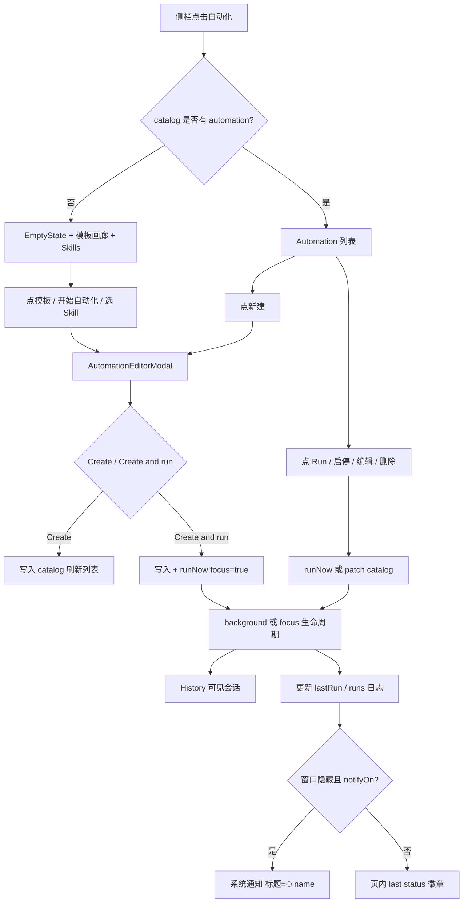
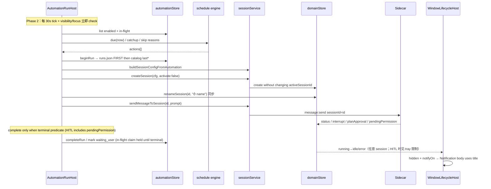
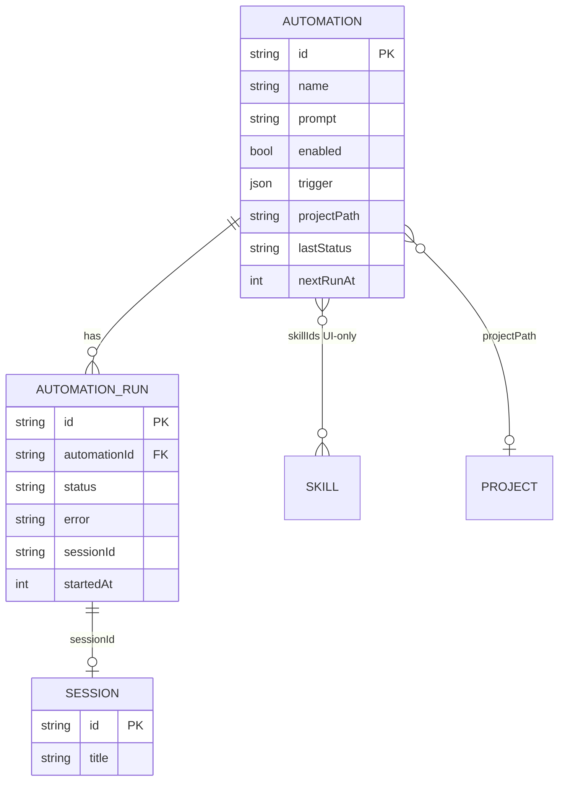

# hip 自动化页面（Automation Page）— 产品与技术设计

| 字段 | 值 |
|------|-----|
| **Title** | hip Automation Page（自动化页面） |
| **Author** | hip design (agent-assisted) |
| **Date** | 2026-07-27 |
| **Status** | Draft |
| **Audience** | 熟悉 hip 代码库的高级工程师 |
| **Revision** | R3 — recover 终态映射 + post-list 时机；failBeforeSession 必须 releaseInFlight |

---

## Overview

hip 侧栏已有 `automation` 导航入口，但 `AppLayout` 仅渲染 `PlaceholderPage`。产品目标是提供桌面端本地的**自动化**能力：用户可定义名称、提示词、触发方式（手动 / 每日 / 每周）、可选项目目录与 agent/model，并在到点或手动时创建会话、发送提示词、在历史中查看结果。

本设计参考 GitHub Copilot Automations 的信息架构（空态模板画廊 → 新建模态 → 列表 + 运行状态），但映射为 hip 的桌面本地身份：不承诺云端执行；调度仅在 **hip 进程存活**（含 hide-to-tray）时生效；数据落盘在 `~/.hip/automations/`，沿用 work-items 的 JSON catalog + Tauri IPC 模式。v1 刻意收窄：单 prompt 触发一次会话回合，不编排 session-scoped Workflow DAG，也不复用 sidecar 内 agent 创建的 `CronManager`（会话级 cron）。

**端到端可实现性前提（R1–R2）**：后台 fire 必须使用完整 **background session lifecycle**（`createSession(..., { activate: false })` + `sendMessageToSession`）+ **sync in-flight claim** + **orphan recovery on load** + HITL 谓词（含 `pendingPermission`）+ `buildSessionConfigFromAutomation`；不能只修 `sendMessage`。

---

## Background & Motivation

### 现状

| 区域 | 现状 |
|------|------|
| 导航 | `ActiveView` / `SidebarSection` 已含 `'automation'`；`isPlaceholderSidebarSection('automation') === true` |
| UI | `AppLayout.tsx` L212–219 → `PlaceholderPage`（`testId="placeholder-automation"`） |
| i18n | `sidebar.nav.automation`、`placeholder.automation`（en / zh-CN / zh-TW / ja / ko） |
| 入口 | `sidebarActions.ts` 的 `enterPlaceholderSection('automation')`；侧栏 `sidebar-nav-automation` |

### 可复用积木

1. **Skills** — `skillsStore` / `ipc/skills` / `SkillMeta`；技能目录 `~/.hip/skills/`
2. **Sessions** — `sessionService.createSession` + `sendMessage`；**今日两者都会影响 active session**（见 API 缺口）
3. **Workflow orchestrator** — 会话内 DAG（`workflowStore` / sidecar orchestrator）；**与 Automation 概念分离**
4. **Tray / background** — hide-to-tray（**默认 close=quit**）、`notifyOnAgentComplete`（`WindowLifecycleHost`）
5. **Projects** — `projectPathStore`、session `config.cwd`
6. **Agents / models** — `configFromDraft` / `resolveModelConfig` / `resolveValidAcpAgentId` / `activeModelKey`
7. **页面范式** — `WorkItemsPage` + feature flag `WORK_ITEM_TRACKING` + `~/.hip/work-items/catalog.json`

### 今日 session API 缺口（验证）

| API | 行为 | 对自动化的影响 |
|-----|------|----------------|
| `domainStore.createSession(id, config)` | **始终** `activeSessionId: id`（`sessionStore.ts` ≈ L873–875） | 后台 fire 会静默抢走当前对话的 active 指针 |
| `SessionService.createSession` | 调 store create + `rememberActiveForSurface(id)` + `session:create` | `rememberActiveForSurface` 仅在 `activeView` 为 chat/code 时写 surface pointer；但 **activeSessionId 仍被改写** |
| `SessionService.sendMessage` | 只向 **active** session 发 `message:send` | 不能向后台 session 投递 |
| `selectSession` | 设 active + **`setActiveView(surface)`** + sidebar section | `focus: true` 会离开 AutomationsPage |

因此「不抢焦点」= 必须同时解决 **create 不 activate** 与 **send 按 sessionId**。

### 痛点

- 用户无法把「重复性 AI 工作」固化为可复用定义
- 侧栏占位文案已承诺「工作流与定时任务」，却无路径
- agent 会话内 `scheduler_*` 工具存在，但对非对话用户不可见、难管理
- 默认 quit-on-close 与「定时需进程存活」产品叙事冲突，需显式 UX

### 概念边界（必须坚持）

```
Automation  = 产品级「定时/手动 job 定义」（本设计）
Workflow    = 会话内多节点 DAG 运行
CronManager = sidecar 会话级 cron（agent tool 创建）
TaskRuntime schedule kind = 运行时任务快照，非产品 UI 实体
```

v1：Automation **只** 触发「创建 session + 发送 prompt」；未来可扩展为触发 workflow，但不得把三者混成同一存储模型。

---

## Goals & Non-Goals

### Goals

1. 将侧栏自动化入口从 placeholder 升级为真实页面（feature flag 可回滚）
2. CRUD：创建 / 编辑 / 启用禁用 / 删除自动化
3. v1 触发器：`manual` | `daily` | `weekly`（本地时区）
4. 手动运行：立刻 **后台或前台** 创建会话并发送 prompt（见 KD-13 focus 策略）
5. 空态：模板画廊 + Skills → **prompt 种子**入口（诚实披露，见 Skill 节）
6. 列表态：名称、触发徽章、启停、上次运行状态、下次运行、快捷 Run、**miss/skip 原因**
7. 运行记录：最近 N 次 run（sessionId 关联），可跳转到该会话
8. 存储：`~/.hip/automations/` 下 JSON + Tauri invoke（对齐 work-items）
9. 通知：复用 tray / `notifyOnAgentComplete`；**run 前同步 renameSession** 保证标题可读
10. 分阶段：P1 UI+CRUD+Manual → P2 本地调度 → P3 更富触发/通知

### Non-Goals（v1 / Phase 1–2）

- 云端执行 / 「Run in the cloud」对等能力
- GitHub / webhook / 文件 watch 事件触发
- 应用**完全退出**后仍准时触发（无独立 OS daemon；无 v1 master「允许后台自动化」开关——见 OQ 推迟）
- 多节点 Workflow 编排 UI
- 与 sidecar `CronManager` 双向同步
- 自动化专用 agent 权限沙箱（沿用会话 permissionMode）
- 跨设备同步
- Skill 运行时强制绑定 / 自动 inject `use_skill` 工具保证（v1 仅为 prompt seed）
- 软删除进 trash（v1 **硬删**）
- 通知 onclick 深链到 session（Phase 2+ 可选；v1 仅 `showMainWindow`）

---

## Proposed Design

### 信息架构

```
侧栏「自动化」
└── AutomationsPage
    ├── [空态 Empty / Setup Gallery]
    │   ├── Header + 「开始自动化」CTA
    │   ├── Template 卡片网格（cadence badge + constraints）
    │   └── Skills 区（搜索 + 从技能创建 · prompt 种子）
    ├── [有数据 List]
    │   ├── Toolbar：搜索 / 新建 / 筛选（全部|启用|禁用）
    │   ├── ScheduleHealthBanner（tray/login 未就绪时）
    │   ├── AutomationRow 列表
    │   └── 右侧或抽屉：详情 + 最近 runs
    ├── AutomationEditorModal（新建 / 编辑）
    └── AutomationRunHost（不可见）：调度 tick + 执行编排
```

**与 Copilot 映射**

| Copilot | hip v1 |
|---------|--------|
| Set up automations 空态 | `AutomationEmptyState` + 模板 |
| Start automating | 打开 `AutomationEditorModal`（空白 draft） |
| Template cards | `AUTOMATION_TEMPLATES` → 预填 modal（含 `requiresProject` 等约束） |
| New automation modal | `AutomationEditorModal`（Radix `Modal`） |
| Run in the cloud toggle | **不展示**；副文案「本机运行，需 hip 在线/托盘」 |
| Select project | 可选项目路径；无项目 → `surface: 'chat'`；代码类模板 **强制** 项目 |
| Model / Autopilot | 同 draft：`modelKey` / `agentId`；空 → 全局 active model |
| Skills search | `skillsStore`；选中 → **prompt seed only** + disclaimer |
| 运行历史 | `AutomationRun` + `selectSession` 跳转 |

### 用户流程



### 运行时序列（修正后）



---

### 规范算法：`runNow` / `onTick`（实现唯一真源）

以下为 **normative** 伪代码。实现与测试必须对齐；UI 不得另写并行路径。

```ts
// ─── Shared completion predicate ─────────────────────────────
// SessionVM.status is only 'idle' | 'running' | 'error'.
// HITL fields (any of these ⇒ waiting_user, regardless of status):
//   - interrupt / planApprovalPending — agent:interrupt often leaves status idle
//   - pendingPermission — permission:request does NOT flip status off running
//     (sessionStore ≈ L477–480); must be checked BEFORE status === 'running'
type TerminalKind = 'succeeded' | 'failed' | 'waiting_user' | 'in_flight'

function classifySessionForAutomation(s: SessionVM | undefined): TerminalKind {
  if (!s) return 'failed'
  if (s.status === 'error') return 'failed'
  // Order matters: ACP tool HITL keeps status 'running' with pendingPermission set.
  if (s.pendingPermission || s.interrupt || s.planApprovalPending) {
    return 'waiting_user'
  }
  if (s.status === 'running') return 'in_flight'
  // status === 'idle' and no HITL
  return 'succeeded'
}

// ─── In-flight claim (sync, memory-only) ─────────────────────
// Disk run.status is NOT the claim — see recoverOrphanRuns on load.
// inFlight: Set<automationId>  — includes waiting_user (single-flight until terminal)
// globalInFlight: number       — same membership
// claim MUST happen before any await in runNow (closes TOCTOU with void onTick).

const inFlight = new Set<string>()
let globalInFlight = 0

function tryClaimInFlight(
  automationId: string,
  opts: { trigger: string },
): { ok: true } | { ok: false; error: 'skip_previous_running' | 'skip_global_cap' } {
  if (inFlight.has(automationId)) {
    return { ok: false, error: 'skip_previous_running' }
  }
  // Manual Run: only per-auto single-flight (user-initiated must not lose to global cap)
  if (opts.trigger !== 'manual' && globalInFlight >= 2) {
    return { ok: false, error: 'skip_global_cap' }
  }
  inFlight.add(automationId)
  globalInFlight++
  return { ok: true }
}

function releaseInFlight(automationId: string): void {
  if (!inFlight.has(automationId)) return
  inFlight.delete(automationId)
  globalInFlight = Math.max(0, globalInFlight - 1)
}

// Serialize all runNow bodies (like workItemStore saveChain) so even after claim,
// await points cannot interleave two creates for different code paths on same id.
// Per-automation is enforced by claim; this chain serializes disk/session side effects.
let runNowChain: Promise<void> = Promise.resolve()

function enqueueRunNow(fn: () => Promise<void>): Promise<void> {
  const next = runNowChain.then(fn, fn)
  runNowChain = next.then(
    () => undefined,
    () => undefined,
  )
  return next
}

// ─── Config resolution (async when project path needs probe) ─
async function buildSessionConfigFromAutomation(a: Automation): Promise<
  | { ok: true; config: SessionConfig }
  | { ok: false; error: string }
> {
  // 1. Project gate — never create on 'unknown'; probe first (projectPathStore TTL)
  if (a.projectPath?.trim()) {
    let st = projectPathStore.statusOf(a.projectPath)
    if (st === 'unknown') {
      // ensureChecked is fire-and-forget today; run path AWAITS a one-shot probe
      await projectPathStore.probe?.(a.projectPath)
        // If probe helper not exported, inline: await isDirectory(path) then markOk/missing
      st = projectPathStore.statusOf(a.projectPath)
    }
    if (st === 'unknown' || st === 'missing') {
      return { ok: false, error: 'project_missing' }
    }
  }
  const surface: 'chat' | 'code' = a.projectPath ? 'code' : 'chat'
  if (surface === 'code' && !a.projectPath?.trim()) {
    return { ok: false, error: 'project_required' }
  }

  // 2. Mirror configFromDraft model/agent path
  const agents = hipConfigStore.config.agents ?? []
  const externalAgentId = resolveValidAcpAgentId(a.agentId, agents) // stale → omit
  let base: SessionConfig = surface === 'code'
    ? { ...DEFAULT_CONFIG, surface, cwd: a.projectPath! }
    : { ...DEFAULT_CONFIG, surface }

  // 3. permissionMode — KD-14
  const permissionMode =
    a.permissionMode ??
    (surface === 'code' ? 'edit' : 'chat')
  base = { ...base, permissionMode }

  // 4. ACP agent: hip model fields unused
  if (externalAgentId) {
    return {
      ok: true,
      config: normalizeSessionConfig({
        ...base,
        agentId: externalAgentId,
        language: currentLanguage(),
      }),
    }
  }

  // 5. Model key: explicit provider/model → key; else global activeModel
  const { catalog, config: providersCfg } = providersStore
  const modelKey =
    a.llmProvider && a.model
      ? `${a.llmProvider}/${a.model}`
      : activeModelKey(providersCfg)
  if (!modelKey) {
    return { ok: false, error: 'no_model_configured' }
  }
  const { llmProvider, model, baseURL } = resolveModelConfig(catalog, providersCfg, modelKey)
  if (!llmProvider || !model) {
    return { ok: false, error: 'model_unresolvable' }
  }
  const effort = clampEffortForKey(catalog, modelKey, a.effort)
  return {
    ok: true,
    config: normalizeSessionConfig({
      ...base,
      llmProvider,
      model,
      ...(baseURL ? { baseURL } : {}),
      ...(effort ? { effort } : {}),
      language: currentLanguage(),
    }),
  }
}

// ─── Dual-file write order (single-writer) ───────────────────
// Rule: runs.json is source of truth for history; catalog last* is denormalized cache.
// On every mutation that touches both:
//   1) mutate in-memory runs + await saveAutomationRuns (runs FIRST)
//   2) patch automation last* + nextRunAt + await saveAutomations
// On load recovery: if catalog.lastSessionId/run disagrees with latest run for that id,
//   re-derive last* from runs log (runs win).

const GLOBAL_RUNS_MAX = 500
const PER_AUTO_RUNS_MAX = 50

function truncateRuns(runs: AutomationRun[]): AutomationRun[] {
  // 1) Per-automation: keep newest PER_AUTO_RUNS_MAX by startedAt
  const byAuto = new Map<string, AutomationRun[]>()
  for (const r of runs) {
    const list = byAuto.get(r.automationId) ?? []
    list.push(r)
    byAuto.set(r.automationId, list)
  }
  let kept: AutomationRun[] = []
  for (const list of byAuto.values()) {
    list.sort((a, b) => b.startedAt - a.startedAt)
    kept.push(...list.slice(0, PER_AUTO_RUNS_MAX))
  }
  // 2) Global cap: newest GLOBAL_RUNS_MAX overall
  kept.sort((a, b) => b.startedAt - a.startedAt)
  return kept.slice(0, GLOBAL_RUNS_MAX)
}

// ─── runNow (public entry always goes through enqueueRunNow) ─
function runNow(
  automationId: string,
  opts: {
    focus?: boolean           // KD-13
    trigger: 'manual' | 'schedule' | 'catchup'
    nowMs?: number            // injectable clock
  },
): Promise<void> {
  return enqueueRunNow(() => runNowBody(automationId, opts))
}

async function runNowBody(
  automationId: string,
  opts: {
    focus?: boolean
    trigger: 'manual' | 'schedule' | 'catchup'
    nowMs?: number
  },
): Promise<void> {
  const now = opts.nowMs ?? Date.now()
  const a = store.get(automationId)
  if (!a) return

  // ── SYNC claim BEFORE any await (closes TOCTOU with concurrent onTick/manual) ──
  const claim = tryClaimInFlight(automationId, { trigger: opts.trigger })
  if (!claim.ok) {
    await store.recordSkip(automationId, {
      trigger: opts.trigger,
      error: claim.error,
      now,
    }) // does NOT claim; release not needed
    return
  }

  let runId: string | null = null
  let watchRegistered = false
  try {
    // Skill soft-check: v1 never blocks on skillIds

    const built = await buildSessionConfigFromAutomation(a)
    if (!built.ok) {
      // failBeforeSession MUST releaseInFlight (see release contract below)
      await store.failBeforeSession(automationId, {
        trigger: opts.trigger,
        error: built.error,
        now,
      })
      if (opts.trigger === 'manual') toast.error(i18n.t(`automation.errors.${built.error}`))
      return
    }

    runId = mintRunId()
    await store.beginRun({
      id: runId,
      automationId,
      status: 'running',
      trigger: opts.trigger,
      startedAt: now,
    }) // → runs.json then catalog lastStatus=running

    // Background lifecycle — MUST NOT steal active chat when focus=false
    const sessionId = sessionService.createSession(built.config, {
      activate: opts.focus === true,
    })
    // Always set title BEFORE send so tray notification copy is useful
    domainStore.renameSession(sessionId, formatAutomationSessionTitle(a.name))

    if (opts.focus) {
      sessionService.selectSession(sessionId)
    }

    sessionService.sendMessageToSession(sessionId, a.prompt)
    store.attachSessionToRun(runId, sessionId)
    // Claim STAYS held until completeRun (including waiting_user).
    store.registerWatch(runId, sessionId, automationId)
    watchRegistered = true
  } catch (e) {
    if (runId) {
      await store.completeRun(runId, {
        status: 'failed',
        error: e instanceof Error ? e.message : 'run_threw',
        finishedAt: Date.now(),
      }) // completeRun → releaseInFlight
    } else {
      releaseInFlight(automationId)
    }
    return
  }
  // success path with watch: claim released only from completeRun (terminal)
  void watchRegistered
}

// ─── releaseInFlight contract (normative) ────────────────────
// Callers that hold a claim MUST release via exactly one of:
//   • completeRun(runId, ...)     — terminal success/fail/skip-with-run-row
//   • failBeforeSession(...)      — config/project/model fail BEFORE session create
//   • catch path releaseInFlight  — threw before runId/watch (above)
// MUST NOT release:
//   • patchRunStatus(..., 'waiting_user')
//   • registerWatch / attachSessionToRun
//   • recordSkip for skip_previous_running / skip_global_cap (those never claimed)
//
// failBeforeSession implementation MUST end with releaseInFlight(automationId)
// after dual-file write (or if no run row written). Unit test required (PR3b).

// ─── Startup / crash recovery ────────────────────────────────
// WHEN (normative timing — do NOT recover on empty cold sessions):
//   1. catalog+runs loaded into automationStore
//   2. Host waits for first session catalog hydrate:
//        sessionService receives `session:list:result` (see sessionService.ts ≈ L371)
//        OR Host effect: connection ready && listAppliedOnce === true
//   3. Then recoverOrphanRuns() once; optional second pass on reconnect list
//   Empty domainStore.sessions BEFORE list is NOT authoritative — skip recover
//   (or no-op) until listAppliedOnce. Flag: automationStore.sessionListReady.

async function recoverOrphanRuns(nowMs: number = Date.now()): Promise<void> {
  if (!store.sessionListReady) {
    // Cold start: sessions not yet applied — DO NOT force-fail open runs
    return
  }
  // Memory inFlight starts empty every process — never treat disk running as claim
  // without a live non-terminal session.
  const open = store.runs.filter((r) =>
    r.status === 'running' || r.status === 'waiting_user' || r.status === 'pending',
  )
  for (const r of open) {
    const session = r.sessionId
      ? domainStore.sessions.find((s) => s.id === r.sessionId)
      : undefined
    const kind = classifySessionForAutomation(session)

    // Branch table (normative):
    // | Session | classify      | Action                                              |
    // |---------|---------------|-----------------------------------------------------|
    // | live    | in_flight     | re-claim + registerWatch                            |
    // | live    | waiting_user  | re-claim + patch waiting_user + registerWatch       |
    // | live    | succeeded     | completeRun succeeded (agent finished while down)   |
    // | live    | failed        | completeRun failed / s.error?.message               |
    // | missing | (any)         | completeRun failed / process_interrupted            |

    if (session && kind === 'in_flight') {
      if (!inFlight.has(r.automationId)) {
        inFlight.add(r.automationId)
        globalInFlight++
      }
      store.registerWatch(r.id, r.sessionId!, r.automationId)
      continue
    }
    if (session && kind === 'waiting_user') {
      if (!inFlight.has(r.automationId)) {
        inFlight.add(r.automationId)
        globalInFlight++
      }
      if (r.status !== 'waiting_user') {
        await store.patchRunStatus(r.id, 'waiting_user')
      }
      store.registerWatch(r.id, r.sessionId!, r.automationId)
      continue
    }
    if (session && kind === 'succeeded') {
      await store.completeRun(r.id, {
        status: 'succeeded',
        error: null,
        finishedAt: nowMs,
      })
      continue
    }
    if (session && kind === 'failed') {
      await store.completeRun(r.id, {
        status: 'failed',
        error: session.error?.message || session.error?.code || 'session_error',
        finishedAt: nowMs,
      })
      continue
    }
    // session missing (or classify failed with !session)
    await store.completeRun(r.id, {
      status: 'failed',
      error: 'process_interrupted',
      finishedAt: nowMs,
    })
  }
}

// Host / sessionService hook (sketch):
// on 'session:list:result' → store.markSessionListReady() → void recoverOrphanRuns()
// on reconnect list → recoverOrphanRuns() again (idempotent for already-terminal runs)

// ─── onTick (Phase 2 host) ───────────────────────────────────
function onTick(nowMs: number = Date.now()): void {
  // Also called on window focus / visibilitychange
  // void runNow is OK: tryClaimInFlight is sync; enqueueRunNow serializes bodies
  const enabled = store.automations.filter((a) => a.enabled && a.trigger.kind !== 'manual')
  for (const a of enabled) {
    const decision = evaluateSchedule(a, nowMs)
    if (decision.action === 'noop') continue
    if (decision.action === 'skip_miss') {
      void store.recordSkip(a.id, {
        trigger: 'catchup',
        error: decision.reason ?? 'missed_over_6h', // may be app_was_quit on cold start
        now: nowMs,
        rollNextRunAt: true,
      })
      continue
    }
    void runNow(a.id, {
      focus: false,
      trigger: decision.action === 'fire_catchup' ? 'catchup' : 'schedule',
      nowMs,
    })
  }
}

function evaluateSchedule(
  a: Automation,
  now: number,
  opts?: { coldStart?: boolean },
): ScheduleDecision {
  if (a.nextRunAt == null) {
    const next = computeNextRunAt(a.trigger, now)
    store.patchNextRunAt(a.id, next)
    return { action: 'noop' }
  }
  if (a.nextRunAt > now) return { action: 'noop' }
  const lag = now - a.nextRunAt
  if (lag < 6 * 3600_000) {
    return { action: lag > 30_000 ? 'fire_catchup' : 'fire_due' }
  }
  // Cold start after long quit: use app_was_quit for list UX; mid-session miss stays missed_over_6h
  return {
    action: 'skip_miss',
    reason: opts?.coldStart ? 'app_was_quit' : 'missed_over_6h',
  }
}

// Host first onTick after recoverOrphanRuns uses coldStart: true once per process.
```

**完成后写路径**（Host 订阅）：

```ts
function onSessionSample(runId: string, sessionId: string, automationId: string): void {
  const s = domainStore.sessions.find((x) => x.id === sessionId)
  const kind = classifySessionForAutomation(s)
  if (kind === 'in_flight') return
  if (kind === 'waiting_user') {
    store.patchRunStatus(runId, 'waiting_user') // runs then catalog; claim STAYS
    return // keep subscription
  }
  void store.completeRun(runId, {
    status: kind === 'succeeded' ? 'succeeded' : 'failed',
    error: kind === 'failed' ? (s?.error?.message ?? 'session_error') : null,
    finishedAt: Date.now(),
  }) // → dual-file + releaseInFlight(automationId) + nextRunAt roll
}
```

**测试必须覆盖**：

- 用户有 active chat A → schedule fire → `activeSessionId` 仍为 A
- `focus: true` → active 变为新 session 且 `activeView` 为 chat/code
- HITL：`idle + interrupt` → `waiting_user`；`running + pendingPermission` → `waiting_user`（不标 succeeded）
- 两路并发 `runNow`（tick+manual 或 double tick）→ **恰好一个** session；另一 `skip_previous_running`
- claim → `failBeforeSession`（no_model / project_missing）→ **`inFlight` 为空** → 第二次 `runNow` 可 claim
- 双文件：beginRun 后 mock crash before catalog save → load 后 last* 从 runs 恢复
- `recoverOrphanRuns` **before** `sessionListReady` → no-op（不误杀 open runs）
- recover：seed `running` + **missing** session（list ready）→ `failed`/`process_interrupted`
- recover：seed `running` + live session **idle 无 HITL** → `succeeded`（非 process_interrupted）
- recover：seed `running` + live session **error** → `failed` + session error message
- recover：seed `waiting_user` + live HITL → re-attach claim + watch

---

### 组件树与路由

```
src/components/automation/
  feature.ts                 # AUTOMATION_PAGE = true as const
  AutomationsPage.tsx
  AutomationEmptyState.tsx
  AutomationList.tsx
  AutomationRow.tsx
  AutomationEditorModal.tsx
  AutomationRunHistory.tsx
  AutomationScheduleBanner.tsx  # tray / launch-at-login 提示
  AutomationTemplates.ts
  AutomationRunHost.tsx         # clock injectable

src/domain/automations/
  types.ts
  ids.ts
  normalize.ts
  schedule.ts                   # + test matrix（DST / 6h / skip）
  buildSessionConfig.ts         # buildSessionConfigFromAutomation
  runLifecycle.ts               # classifySessionForAutomation, truncateRuns
  templates.ts
  index.ts

src/store/automationStore.ts
src/ipc/automations.ts

src-tauri/src/automations.rs
src-tauri/src/paths.rs
```

**AppLayout**：

```tsx
import { AUTOMATION_PAGE } from '@/components/automation/feature'
import { AutomationsPage } from '@/components/automation/AutomationsPage'
import { AutomationRunHost } from '@/components/automation/AutomationRunHost'

// root shell (alongside WindowLifecycleHost):
// {AUTOMATION_PAGE ? <AutomationRunHost /> : null}

if (activeView === 'automation') {
  if (AUTOMATION_PAGE) return <AutomationsPage />
  return <PlaceholderPage titleKey="sidebar.nav.automation" ... />
}
```

### Feature flag 与 uiStore 类型手术（对齐 work-items）

```ts
// src/components/automation/feature.ts
export const AUTOMATION_PAGE = true as const  // rollback: false as const
```

```ts
// uiStore.ts — PlaceholderSidebarSection must mirror tasks/terminals:
export type PlaceholderSidebarSection =
  | 'workbench'
  | (typeof AUTOMATION_PAGE extends true ? never : 'automation')
  | (typeof TERMINAL_MANAGEMENT extends true ? never : 'terminals')
  | (typeof WORK_ITEM_TRACKING extends true ? never : 'tasks')

export function isPlaceholderSidebarSection(s: SidebarSection): s is PlaceholderSidebarSection {
  if (s === 'terminals') return !TERMINAL_MANAGEMENT
  if (s === 'tasks') return !WORK_ITEM_TRACKING
  if (s === 'automation') return !AUTOMATION_PAGE
  return s === 'workbench'
}
```

**PR4 必须更新的测试**：

- `uiStore.test.ts`：`isPlaceholderSidebarSection('automation')` 随 flag 翻转（今日断言 `true`）
- `AppLayout.test.tsx`：flag on → `automations-page`；flag off → `placeholder-automation`
- `AppSidebar.test.tsx`：导航调用 `enterAutomationsSection` 而非 `enterPlaceholderSection('automation')`

`sidebarActions`：新增 `enterAutomationsSection()`（对齐 `enterWorkItemsSection`）。

> 注：`TERMINAL_MANAGEMENT` 现状未必 `as const`；自动化 **优先** `true as const` 以得到条件类型收窄（与 `WORK_ITEM_TRACKING` 一致）。

### 调度策略（桌面）与 quit 产品叙事

| 场景 | 行为 |
|------|------|
| 窗口可见 | tick 正常；due → fire（`focus: false`） |
| Hide to tray | 进程存活，tick 正常；完成通知走 `notifyOnAgentComplete` |
| 完全 Quit | **不触发**；下次启动 `evaluateSchedule` miss 策略 |
| Launch at login + 托盘自启 | 进程起后 tick；可 catch-up 或 skip_miss |
| 退出确认 `countActiveWork` | 自动化会话计入 running sessions — **正确**；exit-confirm 文案保持通用「有任务在运行」，不特判 |

**默认 close=quit 的 UX 义务（Phase 1 编辑器 + Phase 2 banner）**：

1. **启用 daily/weekly**（`setEnabled` 或 Create 时 trigger≠manual）时：
   - 读取 `hipConfig.window`：`closeAction`、`trayEnabled`、`launchAtLogin`
   - 若 `closeAction === 'quit'` 或 tray 关闭：展示 **sticky `AutomationScheduleBanner`**（非一次性 toast）
   - Banner CTA：`setActiveView('settings')` + `settingsPage: 'window'`（deep-link）
   - 文案 i18n：`automation.banner.needTray` — 说明定时仅在 hip 运行/托盘时生效；建议「关闭时隐藏到托盘」+「登录时启动」
2. **不强制** 改用户 close 策略（不静默写 hip.toml）；仅提示
3. **列表**：`lastStatus === 'skipped'` 且 `lastError` 为 `missed_over_6h` 或 `app_was_quit` 时显示灰徽章 + tooltip  
   - `app_was_quit`：**仅**进程冷启动后第一次 `evaluateSchedule(..., { coldStart: true })` 在 lag≥6h 时写入  
   - 进程存活期间的 miss（用户关调度很久但 app 仍开）→ `missed_over_6h`
4. Phase 2 **不**增加 Settings 总开关（推迟 OQ4）；进程在即调度在

**Missed-run 策略**：

- `nextRunAt < now` 且 lag **< 6h** → **至多补跑 1 次**（`catchup`），然后从 `now` 滚 `nextRunAt`（不连环补多个 daily slot）
- lag **≥ 6h** → `skipped` + `error: app_was_quit | missed_over_6h`，滚 `nextRunAt`，不 fire
- per-auto 单飞（含 `waiting_user`）；全局 in-flight **2**（**手动 Run 仅受 per-auto 单飞约束**）
- 内存 `tryClaimInFlight` 同步 claim；**磁盘 `running` 不是 claim**（见 `recoverOrphanRuns`）

### 执行模型细节（摘要；细节以规范算法为准）

1. **Session 创建**  
   - 每次 fire **新建** session  
   - `createSession(config, { activate: focus })`  
   - **同步** `renameSession(id, formatAutomationSessionTitle(name))` 再 send  
   - config 仅经 `buildSessionConfigFromAutomation`

2. **发送**  
   - `sendMessageToSession(sessionId, prompt)`：`appendUserMessage` + `message:send`  
   - `focus: false` 时 **禁止** 改 `activeSessionId` / `activeView` / surface pointers

3. **完成谓词**（顺序见 `classifySessionForAutomation`）  
   - `failed` ⇔ session 缺失或 `status === 'error'`  
   - `waiting_user` ⇔ `pendingPermission || interrupt || planApprovalPending`（**任意 status**；ACP `permission:request` 时常仍为 `running`）  
   - `in_flight` ⇔ `status === 'running'` 且无 HITL  
   - `succeeded` ⇔ 否则（典型 `idle` 且无 HITL）  
   - per-auto claim **在 waiting_user 期间不释放**

4. **通知**  
   - 复用 `WindowLifecycleHost`（任意 session running→idle/error）  
   - 依赖同步 rename，避免标题停在「新对话」  
   - onclick 仍 `showMainWindow` only（v1）  
   - **已知限制（v1）**：`agent:interrupt` 会把 status 置 idle → tray 可能弹出「任务完成」，而 automation 实为 `waiting_user`。列表徽章 / runs 为 HITL 真源。  
   - **Phase 2 可选**：`WindowLifecycleHost` 在 `interrupt || pendingPermission || planApprovalPending` 时 **抑制** complete 通知（小补丁，非 blocker）

5. **History**  
   - 正常 session；title 前缀 `⏱`  
   - protocol `source/automationId` 延后（KD-12）

### 模板目录（hip 向 + 约束）

| id | 名称（zh） | cadence | requiresProject | 提示词意图 / 警告 |
|----|-----------|---------|-----------------|-------------------|
| `daily-standup` | 每日站会草稿 | daily | no | 基于 memory/会话习惯生成要点；不假设 work-items API |
| `weekly-review` | 周复盘 | weekly | no | 同上 |
| `code-review` | 代码审查 | daily | **yes** | 审查 cwd diff；无项目禁止 Create |
| `deps-audit` | 依赖审计建议 | weekly | **yes** | 需工具读 package 清单 |
| `doc-refresh` | 文档刷新 | weekly | **yes** | 对照代码改 README 草稿 |
| `inbox-triage` | 待办梳理 | daily | no | **soft-warn**：agent **不会**自动加载 work-items catalog；prompt 引导用户粘贴或描述待办 |
| `perf-pass` | 性能改进建议 | weekly | **yes** | 对仓库提出假设 |
| `skill-bootstrap` | 从技能开始 | manual | no | 仅 Skills 区填充；见 Skill 诚实模型 |

模板元数据：

```ts
type AutomationTemplate = {
  id: string
  nameKey: string
  descriptionKey: string
  cadence: AutomationTriggerKind
  defaultTrigger: AutomationTrigger
  promptKey: string
  requiresProject: boolean
  softWarnings?: Array<'no_work_items_context' | 'needs_edit_permission'>
}
```

Editor：`requiresProject && !projectPath` → 禁用 Create，inline error。

### Skill → Automation（诚实模型）

**v1 产品定义：prompt seed only**，不保证技能被执行。

| 能力 | v1 |
|------|-----|
| 预填 name / prompt 文案 | ✅ |
| 写入 `skillIds` UI 元数据 | ✅（runtime **不读**） |
| 自动 enable skill in hip.toml | ❌ |
| 保证 system prompt 列出该 skill | ❌ |
| 保证 `use_skill` 可用 | ❌ |
| path-gated skill 自动匹配 cwd | ❌ |

**UI 规则**：

1. Skills 列表：`userInvocable !== false`；**disabled**（`skillsStore.enabled[id] === false`）灰色且 **不可「从技能创建」**（禁用点击）
2. 创建表单顶部 disclaimer：`automation.skills.seedOnlyHint` — 「仅把技能说明写入提示词；执行仍依赖 agent 是否加载该技能」
3. 列表 chip：
   - skill 已删除 / 缺失 → 警告 chip「技能不可用」；**不阻止 Run**（prompt 原文仍在）
   - skill 存在但 disabled → 警告 chip「技能已关闭」；**不阻止 Run**
4. Run 时 **不** 因 skillIds 失败；失败仅来自 model/project 等硬依赖
5. Prompt 模板推荐使用产品 slash 习惯（若 InputBar 对 `/skill-name` 有约定则写入；否则自然语言 + skill name/description）

### 托盘 / 调度健康 Banner

见「调度策略」；组件 `AutomationScheduleBanner`：

- 显示条件：存在任意 `enabled && trigger.kind !== 'manual'` 且 window 策略不利于后台
- 持久：每次进入自动化页评估；用户可 dismiss session-only（memory），不写「永不再显示」除非显式

### UI 细节（设计系统）

- 布局对齐 `WorkItemsPage`
- 空态 `EmptyState` + primary CTA
- 列表：`Switch`、Run、状态点（含 `waiting_user` / `skipped`）
- `Modal` 编辑器
- data-testid：`automations-page`、`automation-editor-modal`、`automation-row-{id}`、`automation-run-btn`、`automation-schedule-banner`

### i18n

`automation.*`（en + zh-CN 必做）：

```
automation.title / emptyTitle / emptyDesc / startCta
automation.templates.*
automation.skillsHeading / skillsSearch / seedOnlyHint / skillMissing / skillDisabled
automation.editor.* / localOnlyHint / projectRequired
automation.banner.needTray / openWindowSettings
automation.list.* / status.running|succeeded|failed|skipped|waiting_user
automation.run.history / openSession / noRuns / skipReasons.*
automation.errors.project_missing|no_model_configured|model_unresolvable|...
automation.sessionTitle   # e.g. "⏱ {{name}}"
```

---

## API / Interface Changes

### Domain types

```ts
export type AutomationTriggerKind = 'manual' | 'daily' | 'weekly'

export type AutomationTrigger =
  | { kind: 'manual' }
  | { kind: 'daily'; hour: number; minute: number }
  | { kind: 'weekly'; weekday: number; hour: number; minute: number }
  // weekday: 0=Sunday … 6=Saturday（Date.getDay）；UI 用 i18n 星期名，不假设周起始日

export type AutomationRunStatus =
  | 'pending'
  | 'running'
  | 'waiting_user'   // HITL; NOT terminal
  | 'succeeded'
  | 'failed'
  | 'skipped'
  | 'cancelled'

export type Automation = {
  id: string
  name: string
  prompt: string
  enabled: boolean
  trigger: AutomationTrigger
  projectPath?: string | null
  /** Optional pin; empty → resolve via activeModelKey at run time */
  llmProvider?: string
  model?: string
  agentId?: string
  effort?: string
  permissionMode?: 'chat' | 'edit' | 'full'
  /** UI metadata only — runtime does not enforce (skill seed honesty) */
  skillIds?: string[]
  templateId?: string | null
  createdAt: number
  updatedAt: number
  lastRunAt?: number | null
  lastStatus?: AutomationRunStatus | null
  lastError?: string | null
  lastSessionId?: string | null
  nextRunAt?: number | null
}

export type AutomationRun = {
  id: string
  automationId: string
  status: AutomationRunStatus
  trigger: 'manual' | 'schedule' | 'catchup'
  sessionId?: string | null
  startedAt: number
  finishedAt?: number | null
  error?: string | null
  // skip_previous_running | skip_global_cap | missed_over_6h | app_was_quit
  // | project_missing | process_interrupted | no_model_configured | ...
}

export type AutomationsCatalogV1 = { version: 1; automations: Automation[] }
export type AutomationRunsLogV1 = { version: 1; runs: AutomationRun[] }
```

### Store

| 方法 | 说明 |
|------|------|
| `load()` | 读 catalog + runs；**runs 为准** reconcile last*；**不**在 list 前 recover |
| `markSessionListReady()` | 由 Host/`session:list:result` 调用一次（及 reconnect） |
| `recoverOrphanRuns()` | 仅 `sessionListReady`；分支表见规范算法 |
| `saveCatalog` / `saveRuns` | 各自 enqueue；跨文件变更走 `mutateRunThenCatalog` |
| `create` / `update` / `remove` | remove = **硬删** v1；runs 可保留孤儿 |
| `setEnabled` | 若打开 schedule → 触发 banner 评估 |
| `runNow` | `enqueueRunNow` + sync `tryClaimInFlight` + body |
| `beginRun` | 双文件；**不** release claim |
| `completeRun` | 双文件 + **`releaseInFlight` MUST** |
| `failBeforeSession` | 写 skip/fail 行（或仅 last*）+ **`releaseInFlight` MUST** |
| `recordSkip`（未 claim） | 不 release |
| `patchRunStatus(waiting_user)` | **不** release |
| `registerWatch` / Host | 订阅 session；终态走 completeRun |

### IPC

```ts
listAutomations(): Promise<AutomationsCatalogV1>
saveAutomations(catalog: AutomationsCatalogV1): Promise<void>
listAutomationRuns(): Promise<AutomationRunsLogV1>
saveAutomationRuns(log: AutomationRunsLogV1): Promise<void>
```

路径：`~/.hip/automations/catalog.json`、`runs.json`；原子写 + `0o600`；corrupt → backup + 空默认。

### sessionService / domainStore（background lifecycle）

```ts
// sessionStore
createSession(id: string, config: SessionConfig, opts?: { activate?: boolean }): string
// activate default true — back-compat for all existing callers
// activate:false → prepend session, DO NOT set activeSessionId

// sessionService
createSession(
  config?: SessionConfig,
  opts?: { activate?: boolean },
): string
// activate:false → store.create(..., {activate:false}); skip rememberActiveForSurface
// activate:true (default) → today's behavior

sendMessageToSession(
  sessionId: string,
  content: string,
  attachments?: LocalAttachment[],
): void
// appendUserMessage + message:send; never reads activeSessionId
// does NOT call selectSession / setActiveView

// focus path (callers compose):
// createSession(cfg, { activate: true })  OR  create + selectSession
// renameSession before send always
```

**测试清单（PR3a）**：

1. active chat 保持：background create + send 后 `activeSessionId` 不变  
2. surface pointers（chatSessionId/codeSessionId）在 `activeView==='automation'` 且 activate:false 时不变  
3. sendMessageToSession 向非 active session 投递 wire  
4. activate:true 路径回归：与旧 createSession 行为一致  

### Protocol

v1 不改；可选后续 `source?: 'automation'`。

---

## Data Model Changes

### ER



### 落盘

```
~/.hip/
  automations/
    catalog.json
    runs.json
  work-items/          # sibling product content
  terminal-hosts…      # sibling（PR7 README 数据布局可并列说明）
  knowledge/           # sibling FS content
  config/hip.toml
  db/hip.db            # sidecar sessions — NOT automation catalog
```

**双文件一致性**：

| 规则 | 说明 |
|------|------|
| 写序 | **runs first → catalog second**（见规范算法） |
| 读序 | load 两者；以该 automation 最新 run 覆盖 catalog last* 若不一致 |
| 截断 | `truncateRuns`：**先** per-auto 50 最新，**再** 全局 500 最新（两道过滤，非「或」） |
| last* 去留 | 保留 denorm 供列表 O(1) 渲染；以 runs 为 SoT 修复 |
| Orphan | 见 recover 分支表：live succeeded/failed 如实终态；missing → `process_interrupted`；live HITL/in_flight → re-attach |
| Recover timing | **仅** `sessionListReady` 后（post `session:list:result`）；空 list 冷启动不 recover |
| Claim | **仅内存** `inFlight`；启动为空；磁盘 `running` ≠ claim |
| Release | `completeRun` **与** `failBeforeSession` MUST `releaseInFlight` |

### schedule 测试矩阵（PR1 必写）

| 用例 | 期望 |
|------|------|
| daily 10:00，now=10:00:00 | due / fire_due |
| daily 10:00，now=15:59 lag&lt;6h | fire_catchup once |
| daily 10:00，now=17:00 lag≥6h | skip_miss，nextRunAt 滚到明日 10:00 |
| 多日未开 app | 仅 1 次 catch-up 或 1 次 skip，不 N 连发 |
| weekly weekday=0 周日 | 与 `getDay()===0` 对齐 |
| DST spring-forward 缺失小时 | 不抛错；落在本地 Date 构造结果；单测固定 TZ fixture |
| DST fall-back 重复小时 | 同一 local time 只 fire 一次（nextRunAt 单调推进） |
| previous running | skip_previous_running |
| manual trigger | nextRunAt=null，onTick noop |

实现：`schedule.ts` 接受 `nowMs` + 可选 `tzOffset` 或用 fake timers；**不引入 luxon** 除非矩阵失败。

---

## Alternatives Considered

### A. 复用 sidecar CronManager / TaskRuntime schedule

- **结论**：否决（session 绑定、删除即丢）

### B. 仅用 Zustand persist（localStorage）

- **结论**：否决（无 HIP_DATA_DIR / 0o600）

### C. 独立 OS 调度器（launchd / Task Scheduler）

- **结论**：v1 否决；Phase 3 与 F 比较

### D. 每次 fire 复用同一 session 多轮

- **结论**：v1 否决（新 session）

### E. 调度放在 Rust 线程 vs FE Host

- **结论**：Phase 2 FE Host + injectable clock；节流再下沉

### F. Sidecar-global automation scheduler（新增）

- **做法**：sidecar 进程内全局调度器读同一 `automations/catalog.json`（或经 FE 同步的副本），due 时发 WS 事件让 FE 执行 `runNow`，或 sidecar 直接 `session:create`+`message:send`
- **优点**：比 webview timer 更抗后台节流；仍要求 **hip 总进程**（含 sidecar）存活——**不能**替代 quit 后触发
- **缺点**：catalog 所有权（Rust 文件 vs sidecar）冲突风险；session 创建路径今日在 FE；双写复杂度
- **结论**：**v1 否决**；Phase 3 作为「抗节流」候选，与 OS wake（C）并列评估：  
  - 仅抗 throttle → 优先 F  
  - 需 quit 后唤醒 → 需要 C（+ 冷启动密钥时序）

---

## Security & Privacy Considerations

| 威胁 | 严重度 | 缓解 |
|------|--------|------|
| prompt 敏感落盘 | Medium | 0o600；非 toml；非云 |
| 无人值守改仓库 | High | KD-14 默认 code→edit / chat→chat；UI 警告 full |
| 技能注入 | Medium | seed-only；disabled skill 不可从列表创建 |
| 费用齐射 | Medium | 全局 cap 2（schedule）；per-auto 单飞；miss 单次 catch-up |
| 通知标题泄露任务名 | Low | 与 chat 标题同级；用户自选 name |

---

## Observability

| 信号 | 方式 |
|------|------|
| tick / due / skip | `console.debug('[automation]', …)` |
| run 生命周期 | runs.json + UI |
| 失败 | lastError；手动 Run toast |
| 不一致修复 | load 时 reconcile 计数 debug |

**延迟**：手动 Run UI → running &lt; 200ms；调度精度 ±30s。  
**容量**：≤200 autos；runs 截断后 ≤500 条。

---

## Rollout Plan

### Phase 1 — UI + CRUD + Manual run

- flag、页面、模态、模板约束、skills seed + disclaimer  
- IPC + store + **background session lifecycle** + `runNow`  
- Schedule banner（启用 daily/weekly 时）  
- **无** 30s tick  

### Phase 2 — Local scheduler

- `AutomationRunHost` + injectable `nowMs`  
- miss/catchup、并发、waiting_user UI  
- runs 历史面板  
- 强化 tray 文案  

### Phase 3

- 事件触发、protocol source、OS wake 与/或 sidecar-global（F）、通知深链、软删 trash、master 后台开关  

### 回滚

- `AUTOMATION_PAGE = false as const` → placeholder；磁盘保留  

### 用户发布说明

- 定时需 hip 运行或托盘隐藏（**默认关闭窗口会退出，定时不会跑**）  
- 建议开启完成通知  
- 从技能创建 = 提示词种子，非强制调用  

---

## Risks

| ID | 风险 | 严重度 | 缓解 |
|----|------|--------|------|
| R1 | createSession 抢 activeSessionId | High | `activate:false` + 测试 |
| R1b | sendMessage 仅 active | High | `sendMessageToSession` |
| R1c | runNow TOCTOU 双开 session | High | sync `tryClaimInFlight` + `enqueueRunNow` |
| R2 | 与 CronManager 混淆 | Medium | 文案与存储分离 |
| R3 | webview timer 节流 | Medium | focus/visibility tick；Phase 3 候选 F |
| R4 | HITL 误标成功 | High | 谓词含 `pendingPermission`/`interrupt`/`planApprovalPending` |
| R4b | 磁盘 stuck `running` 永久 skip | High | recover 分支表 + post-list 时机；claim 仅内存 |
| R4c | recover 误标 succeeded 为 failed | High | live+succeeded → completeRun succeeded |
| R4d | failBeforeSession 泄漏 claim | High | failBeforeSession MUST releaseInFlight + 测试 |
| R5 | 费用并发 | Medium | cap + 单飞 + 单次 catch-up |
| R6 | project 路径 unknown/失效 | Medium | probe 后 gate；unknown→fail |
| R7 | 默认 quit 导致 silent miss | High | banner + `app_was_quit`/`missed_over_6h` |
| R8 | 双文件不一致 | Medium | runs-first + load reconcile |
| R9 | skill 预期过高 | Medium | seed-only disclaimer |
| R10 | 通知标题「新对话」 | Low | 同步 renameSession |
| R11 | tray「完成」在 interrupt HITL | Low | v1 已知；列表为真源；P2 可 suppress |

---

## Key Decisions

| # | 决策 | 理由 |
|---|------|------|
| KD-1 | Automation ≠ Workflow ≠ session Cron | 生命周期不同 |
| KD-2 | `~/.hip/automations/*.json` + Tauri IPC | 对齐 work-items |
| KD-3 | v1 触发器 manual / daily / weekly | 范围可控 |
| KD-4 | Quit 不触发；tray 存活可触发；**启用 schedule 时强提示 tray** | 诚实 + 默认识别 quit |
| KD-5 | 每次 fire 新建 session | History 清晰 |
| KD-6 | 无 Cloud toggle；local-only hint | 桌面身份 |
| KD-7 | Phase 2 FE Host；Phase 3 可评估 F/C | 速度 vs 抗节流 |
| KD-8 | `AUTOMATION_PAGE` + 条件类型手术 | 可回滚 |
| KD-9 | **Background session lifecycle**：`createSession(..., {activate})` + `sendMessageToSession` + 同步 `renameSession` | 仅 send 不够 |
| KD-10 | per-auto 单飞（含 waiting_user）；schedule 全局 cap 2；miss 6h 单次 catch-up；**sync claim + runNow 队列** | 成本、惊群、TOCTOU |
| KD-11 | 模板约束 + Skill **prompt seed only** | 避免假能力 |
| KD-12 | protocol source 延后 | 减协议面 |
| KD-13 | **Focus 策略**：Create and run / 列表手动 Run → `focus: true`；纯 schedule/catchup → `focus: false` | 用户发起应对齐视线；后台不打断 |
| KD-14 | **permissionMode 默认**：有 project/code → `edit`；纯 chat → `chat`；用户可改 | 与 `SESSION_CONFIG_DEFAULTS` 及安全表一致 |
| KD-15 | **HITL**：`waiting_user` 非终态；谓词优先检查 `pendingPermission \|\| interrupt \|\| planApprovalPending` | 覆盖 ACP tool HITL（status 仍可为 running）与 interrupt/plan |
| KD-16 | **双文件**：runs SoT，写 runs→catalog；截断 per-auto 50 然后 global 500 | 可恢复一致性 |
| KD-17 | v1 **硬删** automation；**无** Settings 总开关 | 缩小 Phase 1–2 范围（原 OQ3/OQ4） |
| KD-18 | **Claim 仅内存**；`recoverOrphanRuns` **post `session:list:result`**；分支：re-attach / succeeded / failed / process_interrupted | 防误杀与永久 skip |
| KD-20 | **`failBeforeSession` MUST `releaseInFlight`**（与 `completeRun` 同级） | 防 no_model 后永久 skip_previous_running |
| KD-19 | **Skip codes**：冷启动 lag≥6h → `app_was_quit`；其余 lag≥6h → `missed_over_6h` | 列表文案可区分 |

---

## Open Questions

| # | 问题 | 状态 |
|---|------|------|
| ~~OQ1~~ | Create and run / 手动 Run focus | **已关闭 → KD-13** |
| ~~OQ2~~ | permissionMode 默认 | **已关闭 → KD-14** |
| ~~OQ3~~ | 软删除 trash | **推迟 Phase 3**；v1 硬删（KD-17） |
| ~~OQ4~~ | Settings「允许后台自动化」总开关 | **推迟 Phase 3**；v1 无开关（KD-17） |
| OQ5 | weekly 周起始展示 | 数据 0=周日；**UI 仅 i18n 星期名**，不改语义 |
| OQ6 | 自定义 interval（每 N 小时） | 非 v1 |
| OQ7 | Phase 3 抗节流选 F 还是 OS wake C | 待数据（R3 是否真实发生） |

---

## References

- 占位：`src/routes/AppLayout.tsx`、`src/components/layout/PlaceholderPage.tsx`
- 导航：`src/store/uiStore.ts`、`src/components/layout/sidebarActions.ts`
- 范式：`src/components/work-items/*`、`src/store/workItemStore.ts`、`src-tauri/src/work_items.rs`
- 会话：`sessionService.createSession` / `sendMessage` / `selectSession` / `configFromDraft`；`sessionStore.createSession`（强制 activate）
- HITL：`SessionVM.pendingPermission`（`permission:request` 不改 status，≈ L477–480）；`interrupt` / `planApprovalPending`（`agent:interrupt` 常置 idle）
- Session list：`sessionService` 在 `session:list:result` 上 restore tabs（≈ L371）— recover 挂此之后
- 模型：`src/lib/modelKey.ts`（`resolveModelConfig`、`activeModelKey`）
- Skills：`skillsStore`、`packages/protocol/src/skills.ts`
- Tray：`WindowLifecycleHost.tsx`、README close/tray（默认 quit）；notify 不区分 HITL
- 对照非复用：`packages/sidecar/src/session/cron.ts`
- 路径：`src-tauri/src/paths.rs`
- 并发范式：`workItemStore` `saveChain`（automation `enqueueRunNow` 对齐）

---

## PR Plan

### PR1 — Domain types + schedule matrix + flag 脚手架

- **Title**: `feat(automation): domain types, schedule helpers, feature flag`
- **Files**:
  - `src/domain/automations/{types,ids,normalize,schedule,runLifecycle,index}.ts` + **schedule 测试矩阵**
  - `src/components/automation/feature.ts`（`AUTOMATION_PAGE = false as const` 直至 PR4）
  - `truncateRuns` 单测
- **Deps**: 无
- **Desc**: 纯领域层；`classifySessionForAutomation`（**含 pendingPermission 优先**）+ schedule 矩阵 + `truncateRuns`。

### PR2 — Rust IPC + paths + frontend ipc

- **Title**: `feat(automation): persist catalog/runs under ~/.hip/automations`
- **Files**: `src-tauri/src/automations.rs`、`paths.rs`、`lib.rs`；`src/ipc/automations.ts` + tests
- **Deps**: PR1
- **Desc**: list/save；corrupt 备份；0o600。

### PR3a — Background session lifecycle APIs

- **Title**: `feat(session): createSession activate option + sendMessageToSession`
- **Files**:
  - `src/domain/sessionStore.ts` — `createSession(id, config, { activate? })`
  - `src/domain/sessionService.ts` — 透传 activate；`sendMessageToSession`
  - 全量回归测试 + **active 保持** 新测
- **Deps**: 无（可与 PR1/2 并行）
- **Desc**: 不引入 automation 产品代码；通用能力。

### PR3b — automationStore + buildSessionConfig + runNow + recovery

- **Title**: `feat(automation): store CRUD, claim lock, runNow, orphan recovery`
- **Files**:
  - `src/domain/automations/buildSessionConfig.ts` + tests（mock providers；project probe）
  - `src/store/automationStore.ts` + tests：
    - 双文件序、truncate、reconcile
    - **sync tryClaimInFlight TOCTOU**（并发 runNow → 单 session）
    - **failBeforeSession releases claim**（第二次 runNow 可 claim）
    - **recoverOrphanRuns** 分支表：missing / succeeded / failed / re-attach；`!sessionListReady` no-op
  - Host 或 sessionService 钩子：`session:list:result` → `markSessionListReady` → recover
  - 同步 `renameSession` 于 runNow
- **Deps**: PR1, PR2, PR3a
- **Desc**: 规范算法落地（claim + release 契约 + post-list recover）；无 UI；无 scheduler tick。

### PR4 — AutomationsPage UI + flag on + uiStore 手术

- **Title**: `feat(automation): AutomationsPage UI and nav wiring`
- **Files**:
  - `src/components/automation/*`（含 banner、templates 约束、skill disclaimer）
  - `AppLayout.tsx`、`uiStore.ts`（PlaceholderSidebarSection 条件类型）、`sidebarActions.ts`
  - `uiStore.test.ts`、`AppLayout.test.tsx`、`AppSidebar.test.tsx` 更新
  - i18n en + zh-CN
  - `feature.ts` → `true as const`
- **Deps**: PR3b
- **Desc**: 替换 placeholder；手动 Run / Create and run（KD-13 focus）；模板 requiresProject。

### PR5 — Run history UI + open session

- **Title**: `feat(automation): run history panel and session deep-link`
- **Files**: `AutomationRunHistory.tsx`；i18n；skip reason 展示
- **Deps**: PR4
- **Desc**: 点击 `selectSession`；waiting_user / skipped 文案。

### PR6 — AutomationRunHost scheduler

- **Title**: `feat(automation): local schedule host with injectable clock`
- **Files**:
  - `AutomationRunHost.tsx`（`nowMs` / `setInterval` 可注入）
  - host 单测：fake clock 推进 due，不 sleep 30s
  - e2e hook：`window.__hipE2E?.automationTick?.(now)` 或 env
  - Schedule banner 与 tray 文案强化
- **Deps**: PR4（可与 PR5 并行）
- **Desc**: onTick + coldStart `app_was_quit`；void runNow 依赖 sync claim；**list ready 后** `recoverOrphanRuns`；可选 tray HITL suppress。

### PR7 — Polish：命令面板、e2e、五语、README 数据布局

- **Title**: `chore(automation): command palette, e2e smoke, i18n, data-layout docs`
- **Files**: `buildGlobalCommands.ts`；e2e helper（`HIP_DATA_DIR`）；ja/ko/zh-TW；README 并列 automations / work-items / knowledge / terminal-hosts
- **Deps**: PR4+；理想含 PR6
- **Desc**: 可发现性与回归；e2e **强制 due via hook**，不真等 30s。

### 合并顺序

```
PR1 ──┬──► PR2 ──┐
      │          ├──► PR3b ──► PR4 ──┬──► PR5 ──┐
PR3a ─┴──────────┘                  └──► PR6 ──┴──► PR7
```

Phase 3（事件 / OS wake / sidecar-global F / trash / master switch）单独立项。
