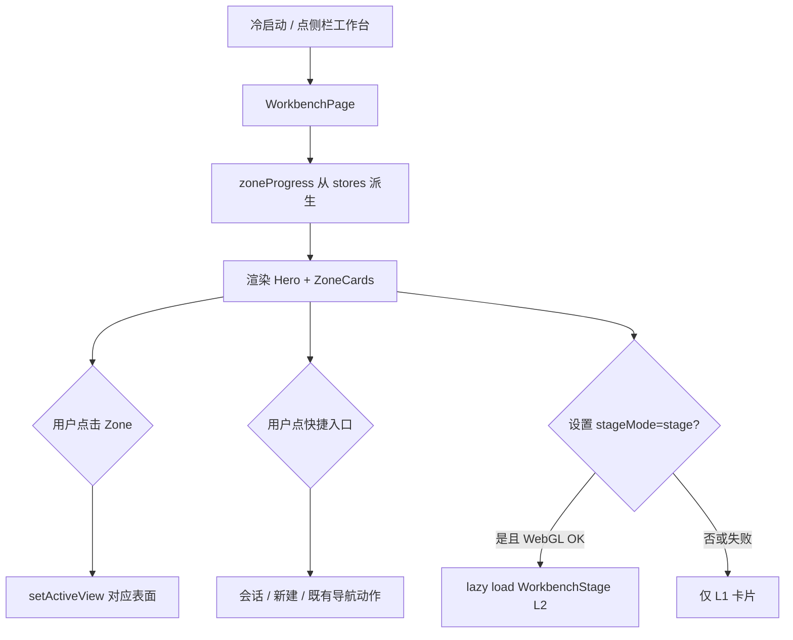

# hip 工作台（Workbench）— 动态卡通进度 · 产品与技术 Spec

| 字段 | 值 |
|------|-----|
| **Title** | hip Workbench · Cartoon Progress Visualization |
| **Author** | hip design (agent-assisted) |
| **Date** | 2026-07-29 |
| **Status** | Implemented（仅 L1 卡片；Three 舞台已移除） |
| **Audience** | 熟悉 hip 代码库的工程师 + 产品 |
| **Revision** | R4 — 删除 L2 舞台模式 / three 依赖；保留卡片 + 设置 |
| **Prototype** | [`prototypes/workbench-cartoon-progress.html`](./prototypes/workbench-cartoon-progress.html) |

---

## Overview

hip 冷启动默认落在 **工作台**（`activeView === 'workbench'` / `sidebarSection === 'workbench'`），但主区仅渲染 `PlaceholderPage`：

> 「工作台即将上线，用于总览与快捷入口。」

本 Spec 定义工作台 v1：**跨功能区的进度总览 + 快捷入口**，并用 **Flat Butt 动态卡通** 表达各区任务状态。卡通是装饰与情感层，**不得**成为唯一信息通道。

默认视觉档位为 **L1（CSS + 既有 `MascotActor` / `public/motion/*`）**；**L2（Three.js 等距舞台）** 为可选增强，设置开启且 WebGL 可用时才加载，失败必须静默回退 L1。

**一句话**：工作台是「各工位的进度地图」，不是第三个任务系统。

---

## Background & Motivation

### 现状

| 区域 | 现状 |
|------|------|
| 导航 | `ActiveView` / `SidebarSection` 已含 `'workbench'`；冷启动强制 workbench（`applyColdLaunchShell`） |
| UI | `AppLayout.tsx` → `PlaceholderPage`（`testId="placeholder-workbench"`） |
| i18n | `sidebar.nav.workbench`、`placeholder.workbench`（en / zh-CN / zh-TW / ja / ko） |
| 占位判定 | `isPlaceholderSidebarSection('workbench') === true`（**始终** placeholder，无 feature flag） |
| 品牌资产 | `HipLogo`、`MascotActor`、`public/motion/**`（含 work/status 语义动作） |
| 忙碌汇总 | `countActiveWork()`（running sessions + TaskRuntime shell/agent/monitor/schedule） |
| 相关表面 | chat/code sessions、tasks（`WORK_ITEM_TRACKING`）、automation（`AUTOMATION_PAGE`）、knowledge、terminals（`TERMINAL_MANAGEMENT`）、workflow store |

### 痛点

1. 冷启动首页无信息密度，用户无法回答「现在系统在忙什么」。
2. 各功能区进度分散在侧栏与独立页面，缺少统一扫描面。
3. 已有吉祥物与 motion 资产主要用于登录/空会话，未服务「工作中」状态。
4. 纯数字墙不符合 hip 克制但有温度的品牌方言。

### 可复用积木

| 积木 | 路径 / 符号 |
|------|-------------|
| 占位壳 | `PlaceholderPage`、`EmptyState` |
| 吉祥物 | `MascotActor`、`MascotAction`、`ACTION_PATH` |
| 空态问候 | `src/lib/emptyGreeting*.ts`（Hero 文案可对齐，不强制 LLM） |
| 活跃工作 | `src/lib/activeWork.ts` → `countActiveWork` |
| 导航 | `useUiStore.setActiveView` / `setSidebarSection`、`sidebarActions` |
| Feature flags | `WORK_ITEM_TRACKING`、`AUTOMATION_PAGE`、`TERMINAL_MANAGEMENT` |
| 视觉 token | `src/styles/tokens.css`（中性灰 + 暖橙 accent + role colors） |
| 任务运行时 | `taskRuntimeStore`、`domain` sessions、`workItemStore`、`automationStore`、`workflowStore`、`terminalStore` / managed terminals |

### 概念边界（必须坚持）

```
Workbench     = 跨表面的只读总览 + 跳转枢纽（本 Spec）
Work Items    = 任务实体 CRUD（tasks 页）
Automation    = 定时/手动 job 定义（automation 页）
Workflow      = 会话内 DAG
Session/Chat  = 对话与 agent turn
```

工作台 **不** 新建任务/自动化实体；**不** 成为第二个列表源 of truth。  
进度数字一律从既有 store **派生**（`zoneProgress` 纯函数）。

---

## Goals & Non-Goals

### Goals

1. 用真实页面替换 workbench `PlaceholderPage`（可 feature flag 回滚）。
2. 展示 **功能工位区（Zone）** 的状态与主指标：会话 / 任务 / 自动化 / 知识 / 终端 / 工作流。
3. Zone **按 feature flag 显隐**；无数据源的区不展示空壳承诺。
4. 每区用 **状态机** + 可选 **0–1 progress** + Flat Butt **动作映射** 表达进度。
5. 点击 Zone / 快捷入口 → `setActiveView`（及必要的 session/surface 行为）跳转既有表面。
6. Hero：问候 + 全局忙碌度 mascot（派生自各 Zone 聚合状态）。
7. 默认 **L1 卡片模式**；设置项可选 **L2 舞台模式**（Three.js，async chunk）。
8. 完整 a11y：名称 / 状态 / 指标可读；`prefers-reduced-motion` 与设置可关动画。
9. i18n（en / zh-CN / zh-TW / ja / ko）与单测覆盖派生逻辑与页面挂载。
10. 分阶段：P1 骨架+L1 → P2 动效/Hero 打磨 → P3 L2 Three（可选）。

### Non-Goals（v1 / Phase 1–2）

- 在工作台内 CRUD 任务 / 自动化 / 知识文档
- 实时协作光标、远程用户 presence
- 全身 3D 骨骼吉祥物或重做品牌 IP
- 默认开启 Three.js / 将 three 打入主 bundle
- 用 3D/卡通替代表格级数据探索
- 新的后端协议或 sidecar 进度推送通道（v1 仅 FE store 派生）
- 自定义 Zone 布局拖拽（v1 固定网格）
- 工作台专属通知中心（沿用既有 tray / 页面）

---

## Proposed Design

### 信息架构

```
侧栏「工作台」
└── WorkbenchPage
    ├── WorkbenchHero
    │   ├── 全局 MascotActor（聚合状态）
    │   ├── 问候标题 / 副文案
    │   └── 汇总 pills：运行中 / 需关注 / 完成（可选）
    ├── WorkbenchZones
    │   └── ZoneCard × N（feature-flag 过滤后）
    │       ├── Mascot + 进度环（L1）
    │       ├── 主指标 / 次指标
    │       └── 状态徽章 → 点击跳转
    ├── WorkbenchShortcuts（快捷入口）
    │   ├── 继续上次会话
    │   ├── 新建对话 / 打开知识 / …
    │   └── （仅已启用表面）
    └── [Phase 3] WorkbenchStage（L2，lazy）
        ├── WebGL canvas（装饰）
        └── DOM overlay（数字与焦点，与 ZoneCard 同源数据）
```

Wireframe：

```
┌──────────────────────────────────────────────────────────────┐
│ Hero: [Mascot]  下午好 — 有 3 个区域在推进     [3跑][1阻][1完] │
├────────────────────────────────────┬─────────────────────────┤
│  Zone 网格（2–3 列）                 │  快捷入口 / 最近动态     │
│  ┌────┐ ┌────┐ ┌────┐              │  · 继续 xxx             │
│  │会话│ │任务│ │自动│              │  · 新建对话             │
│  └────┘ └────┘ └────┘              │  · 打开知识             │
│  ┌────┐ ┌────┐ ┌────┐              │                         │
│  │知识│ │终端│ │流程│              │                         │
│  └────┘ └────┘ └────┘              │                         │
└────────────────────────────────────┴─────────────────────────┘
```

窄屏：单列 Zone；Shortcuts 折到 Zones 下方。

### 用户流程



### Zone 目录（v1）

| ZoneId | 显示名 key | 启用条件 | 跳转 `ActiveView` | 主指标语义 |
|--------|------------|----------|-------------------|------------|
| `sessions` | `workbench.zone.sessions` | **始终** | `chat`（或最近 surface） | running turns / sessions |
| `tasks` | `workbench.zone.tasks` | `WORK_ITEM_TRACKING` | `tasks` | 进行中 / 完成比 |
| `automations` | `workbench.zone.automations` | `AUTOMATION_PAGE` | `automation` | 运行中 / 最近失败 |
| `knowledge` | `workbench.zone.knowledge` | **始终** | `knowledge` | 最近写入 / 已同步 |
| `terminals` | `workbench.zone.terminals` | `TERMINAL_MANAGEMENT` | `terminals` | 活跃 shell 数 |
| `workflows` | `workbench.zone.workflows` | 存在 workflow 运行态 API 时；否则 **P1 可隐藏** | 见 KD-11 | DAG 进度 / 上次结果 |

**默认决策（KD-2）**：Zone 集合 = 上表按 flag 过滤；不固定死 6 格。  
空网格（极端：全部 flag 关）仍至少有 `sessions` + `knowledge` + Hero + Shortcuts。

### 状态机

```
        ┌──────────────────────────────────┐
        │                                  │
        ▼                                  │
     idle ──────► running ──────► done ────┘
        │            │  │
        │            │  └──────► fail
        │            └──────► blocked
        └──────────────────────────────────
```

| ZoneState | 含义 | 视觉 | 默认 `MascotAction` |
|-----------|------|------|---------------------|
| `idle` | 无在途工作 | 呼吸 / 静 | `sleepy` |
| `running` | 有在途工作 | 循环动作 + 进度环 | `coding` / `loading` |
| `blocked` | 需用户处理（HITL、到期、失败待看） | 警告点 | `deadline` / `wait` |
| `done` | 近期成功收尾（短暂） | 庆祝 ≤1.2s 后可回 idle | `success` / `cheer` |
| `fail` | 明确失败未处理 | 抖动 + danger | `fail` / `bug` |

**优先级（单区聚合）**：`fail` > `blocked` > `running` > `done` > `idle`。  
**全局 Hero 聚合**：对可见 Zone 取最高优先级状态。

`done` 的「近期」窗口 v1 建议 **15 分钟**（常量 `WORKBENCH_DONE_WINDOW_MS`），超时归 `idle`（避免永久庆祝）。

### Progress 语义

| Zone | `progress: number \| null` | 计算（规范） |
|------|----------------------------|--------------|
| sessions | `null` 或活跃比 | v1：**优先 null**；主指标用「N 个运行中」。若未来有 turn 内子进度再填 0–1 |
| tasks | `doneCount / max(total,1)` | 仅统计非取消项；`total===0` → progress `null`，state `idle` |
| automations | `null` | v1 用状态 + 「失败数 / 下次运行」文案；不做假百分比 |
| knowledge | `null` | v1：`idle` 已同步；若有「写入中」信号则 `running` |
| terminals | `null` | 主指标：活跃 shell 数 |
| workflows | `completedNodes / totalNodes` | 无活跃 run → `null` |

**规则**：不可信或不可算时 **必须** `progress === null`，UI 隐藏环或显示不确定态，禁止编造 0–100。

### 数据派生（SoT）

```ts
// 纯函数，便于单测 — 不写 store
function buildZoneModels(input: WorkbenchSnapshot): ZoneModel[]
function aggregateHero(zones: ZoneModel[]): HeroModel
function mascotForZone(zone: ZoneModel): MascotAction
```

`WorkbenchSnapshot` 由 React hooks 从各 store **浅订阅**拼装；派生逻辑保持纯。

#### 各区输入（P1 最低集）

| Zone | 输入字段（逻辑） | store / lib |
|------|------------------|-------------|
| sessions | `sessions.filter(s => s.status==='running').length`；`countActiveWork()` | `domain` sessionStore、`activeWork` |
| tasks | open / doing / blocked / done 计数 | `workItemStore`（字段名以实现为准） |
| automations | enabled 数；in-flight / last fail | `automationStore` + runs 摘要 |
| knowledge | 最近编辑时间；是否有 pending write（若无则恒 idle/synced） | `knowledgeStore` |
| terminals | 活跃 session / running shell | managed terminal + `taskRuntimeStore` shell counts |
| workflows | active run node counts | `workflowStore` |

实现时若某 store 暂缺字段：**降级为 idle + 「—」次指标**，不得抛错撑破页面。

### 视觉档位

| Level | 名称 | 触发 | 内容 |
|-------|------|------|------|
| **L0** | 静止 | `prefers-reduced-motion: reduce` **或** 设置 `workbench.reduceMotion` | 静态 mascot 帧；无环动画；状态仍用图标/文案 |
| **L1** | 卡片（**默认**） | 默认 | `ZoneCard` + `MascotActor` + CSS 进度环 + 状态徽章 |
| **L2** | 舞台 | 设置 `workbench.stageMode === 'stage'` 且 WebGL OK | 单场景 Three 工位岛；DOM overlay 同源 |

切换 L1↔L2 **不改变** `ZoneModel` 数据，只改变呈现。

### L1 ZoneCard 结构

```
┌─────────────────────────────┐
│ 会话              [运行中]   │
│      [progress ring]        │
│      [MascotActor]          │
│  3 个 turn                  │
│  2 会话活跃 · 72%（可选）    │
│  打开会话 →                 │
└─────────────────────────────┘
```

| 交互 | 行为 |
|------|------|
| Hover | 抬升 1–2px；running 时可微加速动画 |
| Click / Enter | 导航到 `hrefView`；可选 focus 最近 session |
| Focus-visible | 与 token focus ring 一致 |
| 状态变化 | mascot crossfade ≤ 300ms；`done` 庆祝 ≤ 1.2s |

角色色：Zone 顶条 / 环色使用既有 role / 语义色（sessions 紫、tasks 绿、automations 琥珀、knowledge 蓝、terminals 青、workflows 紫红），**禁止**大面积品牌橙铺底。

### L2 Three 舞台（Phase 3）

#### 定位

- Three **仅装饰层**；业务数字、按钮、键盘焦点在 DOM。
- 单 `WebGLRenderer`、单 scene、多 island；禁止每 Zone 一个 WebGL 上下文。
- `import('three')` 动态加载；未开启 stage 时 **零** three 代码路径进主路径执行。

#### 推荐混合渲染（KD-8）

| 层 | 技术 |
|----|------|
| 台座 / 色环 / 进度弧 / 地面 / 轻粒子 | Three |
| 吉祥物动作 | **DOM `MascotActor`** 按投影坐标叠在岛上（优先）或 Canvas 静态贴图（降级） |

SVG 内 CSS 动画 **栅格化后不动**；因此 L2 不把 animated SVG 当唯一动作源。

#### 场景规格

| 项 | 规范 |
|----|------|
| Camera | `OrthographicCamera` 等距俯视 |
| Lights | Ambient + Directional（可选 fill）；无 bloom / SSR |
| 面数 | < 5k |
| 粒子 | 仅 `running`；总数 < 80 |
| DPR | `min(devicePixelRatio, 2)` |
| 空闲 | 页面不可见或无 running → 降 rAF 至 ≤10fps 或 pause |
| 点击 | Raycaster → zoneId；与 DOM 热区 dual path |
| 失败 | WebGL 上下文失败 / 初始化 throw → 写 debug 日志、强制 L1、可选 toast 一次 |

#### 依赖

```bash
yarn add three
yarn add -D @types/three
```

**不**默认引入 `@react-three/fiber`（KD-9：vanilla three + `useWorkbenchStage` hook，降低抽象层）。

#### 生命周期

```
mount stageMode=stage
  → dynamic import three
  → init renderer / scene / islands
  → rAF loop
visibility hidden | unmount | stageMode=cards
  → cancel rAF
  → dispose geometries, materials, textures, renderer
  → release WebGL context
```

### 设置项

| Key | 类型 | 默认 | 存储 |
|-----|------|------|------|
| `workbench.stageMode` | `'cards' \| 'stage'` | `'cards'` | `hipConfig` / UI prefs（与现有 settings 模式对齐） |
| `workbench.reduceMotion` | `boolean` | `false`（仍尊重系统 prefers） | 同上 |
| `workbench.showCartoon` | `boolean` | `true` | 关则 Zone 仅数字+徽章 |

设置 UI 位置建议：**Settings → General → Workbench**（或 Window 邻近），文案需 i18n。

### 组件与文件布局

```
src/components/workbench/
  feature.ts                 # WORKBENCH_PAGE = true/false
  WorkbenchPage.tsx
  WorkbenchHero.tsx
  WorkbenchZones.tsx
  ZoneCard.tsx
  WorkbenchShortcuts.tsx
  zoneProgress.ts            # 纯派生 + 单测
  mascotForZone.ts           # ZoneState/ZoneId → MascotAction
  workbenchTypes.ts
  WorkbenchStage.tsx         # Phase 3 lazy
  useWorkbenchStage.ts       # Phase 3
  WorkbenchPage.test.tsx
  zoneProgress.test.ts
```

挂载：

```tsx
// AppLayout renderMainContent
if (activeView === 'workbench') {
  if (WORKBENCH_PAGE) return <WorkbenchPage />
  return <PlaceholderPage … testId="placeholder-workbench" />
}
```

`isPlaceholderSidebarSection('workbench')` 在 flag 开启时返回 `false`（类型手术对齐 automation/tasks）。

### 领域类型（规范）

```ts
export type ZoneId =
  | 'sessions'
  | 'tasks'
  | 'automations'
  | 'knowledge'
  | 'terminals'
  | 'workflows'

export type ZoneState = 'idle' | 'running' | 'blocked' | 'done' | 'fail'

export type WorkbenchStageMode = 'cards' | 'stage'

export interface ZoneModel {
  id: ZoneId
  state: ZoneState
  labelKey: string
  /** 0–1；不可算则为 null */
  progress: number | null
  /** 已格式化或 i18n 插值参数 — 实现二选一，推荐 raw + format 在组件内 */
  primaryMetricKey: string
  primaryMetricValues?: Record<string, string | number>
  secondaryMetricKey?: string
  secondaryMetricValues?: Record<string, string | number>
  hrefView: ActiveView
  /** 跳转后可选：activate last session 等 */
  hrefHint?: 'last-session' | 'none'
  accentCssVar: string
  mascotAction: MascotAction
  enabled: boolean
}

export interface HeroModel {
  state: ZoneState
  mascotAction: MascotAction
  titleKey: string
  subtitleKey: string
  runningCount: number
  attentionCount: number // blocked + fail
  doneCount: number
}
```

---

## API / Interface Changes

### Frontend only（P1–P2）

| 变更 | 说明 |
|------|------|
| `AppLayout` | workbench 分支挂 `WorkbenchPage` |
| `uiStore.isPlaceholderSidebarSection` | workbench 受 `WORKBENCH_PAGE` 控制 |
| Settings | 新增 workbench 相关 prefs |
| i18n | `workbench.*` 键族 |

### 无协议 / 无 Rust IPC（v1）

进度全部由现有 FE store 派生。不新增 `~/.hip` 文件、不新增 Tauri command。

### Phase 3

| 变更 | 说明 |
|------|------|
| `package.json` | 依赖 `three` |
| Vite | three 单独 async chunk（动态 import 自然产生） |

---

## Accessibility

| 要求 | 规范 |
|------|------|
| ZoneCard | `button` 或 `a` 语义；`aria-label` 含名称+状态+主指标 |
| 进度 | 环为装饰 `aria-hidden`；数值在可见文本中 |
| 动效 | `prefers-reduced-motion: reduce` → L0；设置可强制 L0 |
| L2 | canvas `aria-hidden`；焦点只在 DOM overlay / 卡片等价控件 |
| 对比度 | 状态徽章与正文符合既有 token AA |
| 键盘 | Tab 顺序：Hero 操作（若有）→ Zones → Shortcuts |

---

## Performance Budget

| 指标 | 目标 |
|------|------|
| P1 首屏（L1） | 无新增重依赖；mascot SVG 按需，与空会话同级 |
| store 订阅 | 分区浅比较；避免 `WorkbenchPage` 任意 session message 级 re-render |
| L2 包体 | three async chunk；gzip 增量约百 KB 级，**不进** critical path |
| L2 面数 / 粒子 | <5k / <80 |
| L2 不可见 | pause rAF |
| 内存 | 离页 dispose；无 WebGL 泄漏（手动测 hide tray / 反复进出 workbench） |

---

## Alternatives Considered

### A. 仅数字仪表盘（无卡通）

- **优点**：实现快、无动效争议  
- **缺点**：浪费品牌资产，冷启动亲和力弱  
- **结论**：否决为唯一方案；数字仍保留，卡通为默认开

### B. 默认 Three.js 舞台

- **优点**：记忆点强  
- **缺点**：包体、WebView GPU、a11y、与克制方言冲突  
- **结论**：否决为默认；仅 opt-in L2

### C. 每 Zone 独立 canvas / R3F 场景

- **优点**：封装独立  
- **缺点**：多 WebGL 上下文在桌面 WebView 上脆弱  
- **结论**：否决

### D. 工作台内嵌完整 Tasks/Automation 列表

- **优点**：少跳转  
- **缺点**：与「枢纽」定位冲突，维护双 UI  
- **结论**：v1 否决；只做摘要 + 跳转

### E. Canvas2D 自研代替 Three（L2）

- **优点**：无 three 依赖  
- **缺点**：等距、光照、命中测试自研成本  
- **结论**：L2 仍用 three；若 three 不可接受可砍掉整个 L2

---

## Security & Privacy Considerations

| 威胁 | 严重度 | 缓解 |
|------|--------|------|
| Hero/Zone 文案泄露会话标题敏感信息 | Low–Med | 快捷「继续上次」可用截断标题；Zone 主指标避免完整 prompt |
| L2 截图/录屏暴露项目名 | Low | 与主 UI 同级；无额外云上传 |
| 依赖 three 供应链 | Low | 锁版本；仅 opt-in 加载 |

无新增密钥、无网络进度拉取。

---

## Observability

| 信号 | 方式 |
|------|------|
| 页面挂载 | 既有路由 / 无强制 telemetry |
| L2 init 失败 | `console.debug('[workbench.stage]', err)`；回退 L1 |
| 派生异常 | zone builder try/catch 单区降级 + debug |

**延迟**：store 更新 → Zone 重绘应在同一帧批内（React 18）；无额外 debounce 除非 perf 实测需要（tasks 高频写时可 100ms coalesce）。

---

## Rollout Plan

### Phase 1 — 骨架 + L1（必须）

- `WORKBENCH_PAGE` flag（先 `false`，合并前转 `true` 或分 PR）
- `WorkbenchPage` / Hero / ZoneCard / Shortcuts
- `zoneProgress` + 单测
- AppLayout 挂载；placeholder 回退路径
- i18n 全语言键
- 无 three

### Phase 2 — 动效与内容打磨

- 状态过渡、done 窗口、Hero 文案矩阵
- Shortcuts：继续上次会话（接 session 列表）
- reduced-motion / showCartoon 设置
- 可选：复用 `emptyGreeting` 日时段问候（**无**强制 live LLM）

### Phase 3 — L2 Three 舞台（可选）

- `stageMode` 设置
- `WorkbenchStage` lazy + dispose
- DOM overlay 对齐
- 自动降级与 perf 校验

### 回滚

- `WORKBENCH_PAGE = false as const` → 恢复 `PlaceholderPage`
- L2 问题：强制 `stageMode='cards'` 或移除 three 动态入口

### 用户发布说明（建议）

- 工作台展示各功能忙碌状态，点击进入对应模块  
- 可在设置关闭卡通或改用 3D 舞台（若 Phase 3 已发布）  
- 3D 舞台需更好 GPU；异常时自动回卡片

---

## Risks

| ID | 风险 | 严重度 | 缓解 |
|----|------|--------|------|
| R1 | store 字段不齐导致空白/错误 | Med | 单区降级；单测 fixture |
| R2 | 任意 session token 流导致整页重渲染 | Med | 细粒度 selector；只订 status/counts |
| R3 | mascot 动作与状态不同步 | Low | `mascotForZone` 单测表 |
| R4 | L2 WebGL 泄漏 / 进托盘仍 rAF | High（P3） | visibility pause + dispose 测试清单 |
| R5 | L2 包体拖慢首启 | Med | 动态 import；默认 cards |
| R6 | 与 placeholder 测试/e2e 假设冲突 | Med | 更新 `AppLayout.test`、cold launch e2e |
| R7 | 文案过度承诺未启用功能 | Med | flag 过滤 Zone |
| R8 | done 状态粘住 | Low | `WORKBENCH_DONE_WINDOW_MS` |
| R9 | 设计方言变「嘉年华」 | Med | 空闲安静；running 才加强动效（KD-5） |

---

## Key Decisions

| # | 决策 | 理由 |
|---|------|------|
| **KD-1** | 工作台 = 只读总览 + 跳转枢纽，不建新 SoT | 避免双列表 |
| **KD-2** | Zone 按 feature flag 显隐，不固定 6 格 | 诚实能力面 |
| **KD-3** | 状态机优先，progress 可 null | 防假百分比 |
| **KD-4** | 默认 L1；L2 opt-in | 性能与克制 |
| **KD-5** | 空闲安静，running 才加强动效 | 品牌方言 |
| **KD-6** | 单主角色 Flat Butt + 动作/台座色区分 | 资产统一 |
| **KD-7** | 卡通可关；数字文案始终在 | a11y + 专业用户 |
| **KD-8** | L2 混合：Three 岛 + DOM Mascot（优先） | 动作资产零浪费 |
| **KD-9** | vanilla three，不默认 R3F | 少抽象 |
| **KD-10** | 无新 IPC / 无新协议（v1） | 范围可控 |
| **KD-11** | workflows Zone：无稳定运行态 API 则 P1 隐藏 | 避免空壳 |
| **KD-12** | `WORKBENCH_PAGE` flag 可回滚 | 对齐 automation/tasks 模式 |
| **KD-13** | Hero 问候 P1 用静态时段模板；不强制 emptyGreeting LLM | 可靠、零费用 |
| **KD-14** | three 仅 async chunk | 保护冷启动 |
| **KD-15** | 聚合优先级 fail > blocked > running > done > idle | 注意力引导 |

---

## Open Questions

| # | 问题 | 倾向 | 状态 |
|---|------|------|------|
| OQ1 | 「继续上次会话」进 chat 还是恢复 last surface（chat/code）？ | last surface | Open |
| OQ2 | tasks progress 分母是否含 cancelled？ | 否 | **建议关闭 → 不含** |
| OQ3 | automations 是否 Phase 2 再加成功率环？ | P2+ | Open |
| OQ4 | L2 是否进 Settings 实验标记 copy（「实验性」）？ | 是 | Open |
| OQ5 | workbench 是否需要 e2e `@smoke` 冷启动断言非 placeholder？ | 是（flag on 后） | Open |
| OQ6 | 最近动态流（timeline）是否 P1？ | **P2**；P1 仅 Shortcuts | **建议关闭** |

---

## Acceptance Criteria

### Phase 1

- [x] 冷启动 `activeView=workbench` 且 `WORKBENCH_PAGE` 时渲染 `WorkbenchPage`（`data-testid="workbench-page"`）
- [x] flag off 时仍为 `placeholder-workbench`（`WORKBENCH_PAGE` 分支保留）
- [x] 可见 Zone 均有：名称、状态、主指标、可键盘激活的跳转
- [x] `zoneProgress` 纯函数单测覆盖：全 idle、混合 running/blocked/fail、flag 过滤
- [x] `prefers-reduced-motion` 下 `WorkbenchMascot` 回退静态 `HipLogo`
- [x] i18n 五语言键齐全（`translation-keys.test`）
- [x] `AppLayout` 单测更新

### Phase 2

- [x] done 窗口到期回 idle（`WORKBENCH_DONE_WINDOW_MS` + zoneProgress）
- [x] 设置可关闭卡通 / 减少动效 / 舞台模式（`uiStore` + General Settings）
- [x] Shortcuts「继续上次」按 active / 最近 `updatedAtMs` 会话
- [x] 空闲 Hero 时段问候（`heroGreeting`）

### Phase 3

- [x] three 仅 lazy `import()` / React.lazy（默认 cards 不挂载舞台）
- [x] stage 开启后可见岛与选中；unmount dispose
- [x] WebGL / 运行时失败 → ErrorBoundary + 回退 cards

---

## PR Plan

### PR1 — Feature flag + 类型 + 纯派生

- **Title**: `feat(workbench): zone types, progress pure functions, feature flag`
- **Files**:
  - `src/components/workbench/feature.ts`
  - `src/components/workbench/workbenchTypes.ts`
  - `src/components/workbench/zoneProgress.ts`
  - `src/components/workbench/mascotForZone.ts`
  - `src/components/workbench/zoneProgress.test.ts`
  - `src/components/workbench/mascotForZone.test.ts`
- **Deps**: 无
- **Desc**: 无 UI 挂载；flag 默认 `false`。

### PR2 — WorkbenchPage L1 UI + AppLayout

- **Title**: `feat(workbench): WorkbenchPage cards and AppLayout mount`
- **Files**:
  - `WorkbenchPage.tsx` / `Hero` / `Zones` / `ZoneCard` / `Shortcuts`
  - `AppLayout.tsx` + tests
  - `uiStore` placeholder 类型手术（若需要）
  - i18n 五语言
- **Deps**: PR1
- **Desc**: L1 完整可点跳转；flag 可在本 PR 末或 PR3 打开。

### PR3 — 设置项 + reduced-motion + 打开 flag

- **Title**: `feat(workbench): prefs, a11y motion, enable WORKBENCH_PAGE`
- **Files**: settings 面板、prefs store、相关测试
- **Deps**: PR2

### PR4 —（可选）L2 Three stage

- **Title**: `feat(workbench): optional Three.js stage mode`
- **Files**: `WorkbenchStage.tsx`、`useWorkbenchStage.ts`、`package.json`、设置 copy
- **Deps**: PR3
- **Desc**: async import；失败回退；dispose 测试或手工清单。

---

## References

- 占位：`src/routes/AppLayout.tsx`、`src/components/layout/PlaceholderPage.tsx`
- 导航 / 冷启动：`src/store/uiStore.ts`（`applyColdLaunchShell`、`isPlaceholderSidebarSection`）
- 吉祥物：`src/components/login/MascotActor.tsx`、`public/motion/**`
- 活跃工作：`src/lib/activeWork.ts`
- 问候：`src/lib/emptyGreeting.ts` 及 `emptyGreeting.*`
- Feature 范式：`src/components/work-items/feature.ts`、`src/components/automation/feature.ts`、`src/components/terminals/feature.ts`
- Token：`src/styles/tokens.css`
- 自动化 Spec 体例：`docs/design/2026-07-27-automation-page.md`
- 可交互原型：`docs/design/prototypes/workbench-cartoon-progress.html`  
  - 预览：`npx --yes serve docs/design/prototypes -p 5179`  
  - 打开：`http://localhost:5179/workbench-cartoon-progress.html`  
  - **勿** `file://`（ESM / import map 会失败）  
  - Three 本地 vendor：`docs/design/prototypes/vendor/`

---

## Revision History

| Rev | 日期 | 说明 |
|-----|------|------|
| R0 | 2026-07-29 | 视觉提案 + HTML 原型 |
| R1 | 2026-07-29 | 收敛为正式 Spec：KD、AC、PR Plan、L1 默认 / L2 可选 |
