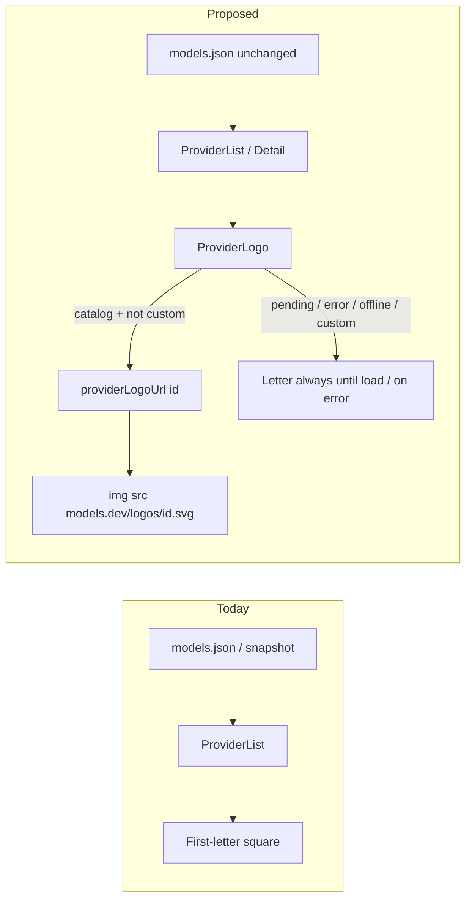
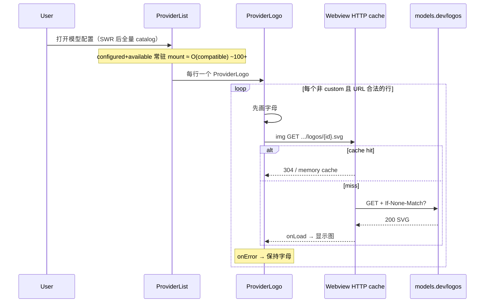
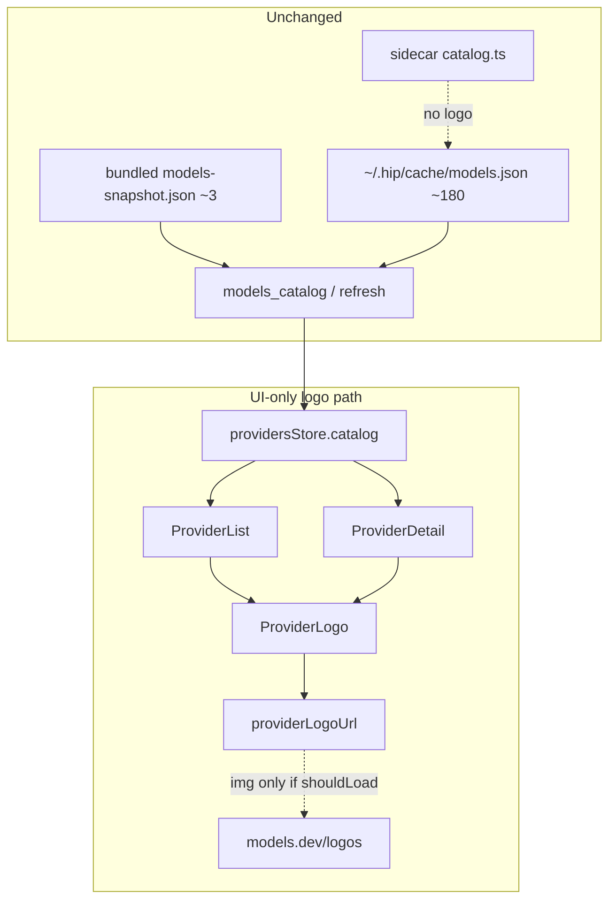

# Spec: 模型配置 Provider Logos（models.dev）

| Field | Value |
|-------|-------|
| **Title** | Provider logos from models.dev for 模型配置 (Model Config) |
| **Author** | TBD |
| **Date** | 2026-08-06 |
| **Status** | Draft (rev 2 — review issues addressed) |
| **Scope** | UI `ProviderLogo` · `ProviderList` / `ProviderDetail` · URL helper · tests（**不**改 catalog schema / sidecar） |
| **Related** | `src/components/account/ModelConfig.tsx` · `ProviderList.tsx` · `ProviderDetail.tsx` · `src/ipc/catalog.ts` · `src-tauri` catalog SWR · `src/lib/siteFavicon.ts` · `SiteFavicon` |
| **External** | Catalog: `https://models.dev/api.json` · Logos: `https://models.dev/logos/{providerId}.svg` |

---

## Overview

hip 的 **模型配置** 页从 models.dev catalog 列出 provider，但 catalog JSON **不含** icon/logo 字段；UI 在 `ProviderList` / `ProviderDetail` 用 **首字母方块** 占位。models.dev 在 catalog 之外单独托管 monochrome SVG：`https://models.dev/logos/{providerId}.svg`（未知 ID 仍返回 200 + 默认 sparkles SVG，**不能**靠 HTTP 失败判断缺失）。

全量 catalog 约 **180** 个 provider（磁盘缓存 / SWR 成功后）；**首启**仅有 bundled `models-snapshot.json`（当前 **3** 个：deepseek / openai / anthropic），刷新后才接近全量。列表中 **compatible 常驻挂载** 约 ~160+ 行（incompatible 折叠时不挂载）。

本设计提出 **手术式、UI-only** 方案：新增纯函数 `providerLogoUrl` + 共享组件 `ProviderLogo`，用 webview 已有 CSP（`img-src … https:`）在行 **mount** 时加载远程 SVG；加载中仍显示字母，失败/离线/custom 保持字母。对齐 `SiteFavicon` 模式但补齐 error-state 生命周期。**不**把 base64 塞进 `models.json`；**不**在 app boot 预拉 logo；sidecar 不参与。

---

## Background & Motivation

### 当前状态（代码已核实）

| 层 | 路径 | 现状 |
|----|------|------|
| Catalog 类型 | `src/ipc/catalog.ts` `CatalogProvider` | 仅 `id/name/env/npm?/api?/models/custom?`，**无 icon** |
| 磁盘缓存 | `~/.hip/cache/models.json`（SWR 后约 180 providers） | provider 级 keys 典型为 `api/doc/env/id/models/name/npm`，**无 logo** |
| 首启 snapshot | `src-tauri/resources/models-snapshot.json` | **3** providers（deepseek/openai/anthropic）；非全量 |
| 本地/刷新 | `src-tauri/src/lib.rs`：`MODELS_URL`、`models_catalog`（本地）、`models_catalog_refresh` / `download_catalog`（SWR） | `HIP_MODELS_URL` 可覆盖 catalog；与 logo 无关 |
| 前端协调 | `src/store/providersStore.ts` | catalog + hip.toml + keys；SWR revalidate；custom 经 `mergeCustom` 设 `custom: true` |
| Sidecar | `packages/sidecar/src/config/catalog.ts` | 同 models.json；**不需要 logo** |
| 列表 UI | `ProviderList.tsx` L49–56 | `p.name.charAt(0).toUpperCase()`，`h-6 w-6`；active 时 `bg-accent-subtle text-accent-strong`，否则 `bg-surface-muted text-ink-secondary` |
| 详情 UI | `ProviderDetail.tsx` L270–272 | 同首字母，`h-8 w-8` |
| 设置页 purpose 卡 | `ModelConfig.tsx` 内 `ModelPurposeCard` | 生产路径使用 **purpose 卡**（非 `CurrentModelHero`） |
| Hero（测试/遗留） | `CurrentModelHero.tsx` | 仅自身 + 单测引用；`Avatar` initials；**非** Model Config 生产树 |
| 既有图标模式 | `src/lib/siteFavicon.ts` + `SiteFavicon` | URL 候选 + `` + 图标回退；CSP 允许 `https:` |

### models.dev logo 实测（2026-08-06）

- `GET https://models.dev/logos/openai.svg` → `200`，`content-type: image/svg+xml`，`access-control-allow-origin: *`，Cloudflare + etag；`cache-control: public, max-age=0, must-revalidate`（条件请求为主）。
- 主流 provider（openai / anthropic / deepseek / groq / openrouter）SVG 使用 **`fill="currentColor"`** 单色路径。
- **默认 sparkles**（未知 ID）：`fill="none"` + **`stroke="currentColor"`**（非 fill-only）；与当前 `ollama.svg` 内容相同（同 MD5）。
- **未知 ID 仍 200**：因此 **不可** 用 status≠200 或 onError 区分「无品牌 logo」；custom 必须 **根本不请求**。catalog 内无独立品牌图的 id 会显示同一 sparkles（假品牌感）——见 Risks / KD-3 补注。

### 痛点

1. 配置页视觉密度高、provider 多，纯字母难扫读。
2. models.dev 已提供官方 logo，hip 只缺接线。
3. 若错误地对 custom 也请求 logo，会全部显示同一默认 SVG，比字母更糟。
4. catalog 孤儿 id 若也显示 sparkles，同样比字母差（v1 接受上游；见 Issue 残差风险）。



---

## Goals & Non-Goals

### Goals

| ID | Goal | 可验收信号 |
|----|------|------------|
| G1 | 配置列表与详情头显示 models.dev logo | `ProviderList` / `ProviderDetail` 可见 SVG；DOM `src` 或组件测 |
| G2 | **不**在 app boot 预拉 logo；**无**额外 prefetch 逻辑 | 打开 Model Config 才因 **行 mount** 触发 img；无 180 全库预取 API。**注意**：SWR 后 compatible 行常驻挂载 → 打开页可出现 **O(compatible)≈100+** 次 img 请求（见 Fetch 策略）；G2 约束的是「无额外预取」，不是「仅视口内」 |
| G3 | 离线 / CDN 失败优雅降级；加载期无空盒闪烁 | 断网或 onError → 首字母；**pending 期间亦显示字母**（onLoad 后换图） |
| G4 | Custom provider 永不打 logo CDN | `custom: true` 时无 ``、无网络 |
| G5 | 深色主题可读 | dark 下 fill 与 stroke monochrome logo 对比度可接受 |
| G6 | 可测、可复用；error state 随 `src` 重置 | 单测含「src 变化清除 failed」 |

### Non-Goals

- **不**扩展 `CatalogProvider` / `models.json` 字段（无 base64、无 icon URL 列）。
- **不**改 sidecar catalog 读取或任何 agent 路径。
- **不** v1 做 Rust 磁盘 logo 缓存 / 新 Tauri command（见 Alternatives；可作 P2）。
- **不** v1 改 CSP（`img-src` 已含 `https:`；`connect-src` **不**为 logo 放开）。
- **不** v1 做列表虚拟化 / IntersectionObserver 限流（可选 P2 缓解；见 Fetch）。
- **不** v1 维护 catalog 默认-logo skip-list 或 content-hash 检测 sparkles（避免维护债 / 与 KD-1 冲突）。
- **不** v1 强制覆盖 chat `ModelPicker`、`ModelSelectField`、`ModelPurposeCard`（Phase 2 可选真实表面）。
- **不** 把生产范围押在 `CurrentModelHero`（当前仅测试引用，见 Phase 2）。
- **不** 自建 logo CDN 或打包全量 SVG 进 app bundle。

---

## Proposed Design

### 架构选择摘要

| 维度 | 决策 | 理由 |
|------|------|------|
| 传输 | Renderer **``** | CSP 已允许；对齐 `SiteFavicon`；零 Rust；浏览器缓存/etag |
| 磁盘缓存 | **v1 不做** `~/.hip/cache/logos/` | 最小代码；离线靠字母 |
| Catalog | **不改** | logo 与 api.json 解耦 |
| 触发 | **行 mount**（非 boot prefetch） | Phase 1 接受 O(compatible) 并发 img；`loading="lazy"` 仅礼貌性、**不**当正确性依赖 |
| Custom | 跳过 URL | 未知 ID 恒 200 |
| 加载 UX | **字母垫底 → onLoad 显示图** | 避免空盒 CLS；与今日始终可见字母一致 |
| failed 生命周期 | **`src` 变化时重置 failed** | 共享组件可复用；不复制 SiteFavicon 的 index 不重置缺口 |

### URL 约定

```ts
// src/lib/providerLogo.ts（新建）

/** Default logo base; keep in sync with models.dev hosting. */
export const DEFAULT_MODELS_LOGO_BASE = 'https://models.dev/logos'

/**
 * Absolute SVG URL for a catalog provider id.
 * Returns '' when id is empty or unsafe (path separators / traversal).
 */
export function providerLogoUrl(
  providerId: string,
  base: string = DEFAULT_MODELS_LOGO_BASE,
): string {
  const id = providerId.trim()
  if (!id || id.includes('/') || id.includes('..') || id.includes('\\')) {
    return ''
  }
  const root = base.replace(/\/$/, '')
  return `${root}/${encodeURIComponent(id)}.svg`
}

/**
 * Whether this provider should attempt a remote logo.
 * Single gate: custom skip + same validation as providerLogoUrl
 * (empty URL ⇒ no remote). Callers may also use Boolean(providerLogoUrl(id)).
 */
export function shouldLoadProviderLogo(
  p: { id: string; custom?: boolean },
  base?: string,
): boolean {
  if (p.custom) return false
  return Boolean(providerLogoUrl(p.id, base ?? DEFAULT_MODELS_LOGO_BASE))
}
```

**契约：** UI 侧「是否发 img」以 **`src` 非空** 为准（`shouldLoadProviderLogo` ≡ custom 否且 `providerLogoUrl` 非空）。禁止两套校验分叉。

**Env 覆盖 `HIP_MODELS_LOGO_BASE`（可选、低优先级）：**

- Catalog 已有 `HIP_MODELS_URL`（Rust）。Logo 与 JSON 不同 path。
- v1：**前端硬编码** `DEFAULT_MODELS_LOGO_BASE`；测试 / 镜像用组件 prop `logoBase`。
- 整站镜像与 Rust 暴露 env：**不做 v1**。

### 组件：`ProviderLogo`（契约）

位置：`src/components/ui/ProviderLogo.tsx`。

**必须满足的行为：**

1. **Remote gate：** `src = shouldLoadProviderLogo(...) ? providerLogoUrl(...) : ''`；`src === ''` → 仅字母，无 ``。
2. **failed 重置：** `useEffect(() => { setFailed(false); setLoaded(false) }, [src])`（或等价：以 `src` 为 key 的内部状态）。**禁止**仅依赖调用方 `key={providerId}` 作为唯一正确性手段（调用方 key 可作为额外保险，但不能替代组件内重置）。
3. **加载 UX（选定方案 2：字母垫底直到 onLoad）：**
   - 始终渲染与今日同结构的字母层（尺寸盒稳定，无 CLS）。
   - 当 `src` 非空且 `!failed` 时叠加 ``（可用 absolute 叠在字母上，或 `opacity-0` 直到 loaded）。
   - `onLoad` → 显示图、隐藏字母（或字母 `opacity-0`）。
   - `onError` → `failed=true`，仅字母（与 custom / 无 src 相同）。
4. **主题：** img 使用 `dark:brightness-0 dark:invert`（覆盖 fill 与 stroke monochrome）。
5. **网络礼貌：** `loading="lazy"`、`decoding="async"`、`referrerPolicy="no-referrer"`；lazy **不**保证视口外不请求（Tauri webview 行为未在仓库内证明）——正确性不依赖 lazy。
6. **a11y：** 装饰性 `alt=""` + `aria-hidden`（旁侧已有 provider 名）。

```tsx
// 行为契约草图（实现可微调 class，语义不可弱化）
type ProviderLogoProps = {
  providerId: string
  name: string
  custom?: boolean
  /** Pixel box; list=24 (h-6), detail=32 (h-8). */
  size?: number
  /**
   * Surface + text tokens for the letter fallback (and box chrome).
   * Call site must pass active/inactive styles — component does not know selection.
   * Example list: isActive ? 'bg-accent-subtle text-accent-strong' : 'bg-surface-muted text-ink-secondary'
   */
  className?: string
  logoBase?: string
}

export function ProviderLogo({
  providerId,
  name,
  custom,
  size = 24,
  className,
  logoBase,
}: ProviderLogoProps) {
  const src = shouldLoadProviderLogo({ id: providerId, custom }, logoBase)
    ? providerLogoUrl(providerId, logoBase)
    : ''
  const [failed, setFailed] = useState(false)
  const [loaded, setLoaded] = useState(false)

  // REQUIRED: clear error/load state when URL identity changes (shared-component contract).
  useEffect(() => {
    setFailed(false)
    setLoaded(false)
  }, [src])

  const letter = (name || providerId || '?').charAt(0).toUpperCase()
  const showImg = Boolean(src) && !failed

  return (
    <span
      className={cn(
        'relative inline-flex shrink-0 items-center justify-center overflow-hidden rounded-md text-caption font-medium',
        className, // call site supplies bg-* + text-* (active vs inactive)
      )}
      style={{ width: size, height: size }}
      data-testid={showImg && loaded ? 'provider-logo' : 'provider-logo-fallback'}
      aria-hidden
    >
      {/* Letter always present until successful load — avoids empty-box flash / CLS */}
      <span
        className={cn(
          'flex h-full w-full items-center justify-center',
          showImg && loaded && 'opacity-0',
        )}
      >
        {letter}
      </span>
      {showImg && (
         setLoaded(true)}
          onError={() => setFailed(true)}
          className={cn(
            'absolute inset-0 h-full w-full object-contain p-0.5',
            !loaded && 'opacity-0',
            'dark:brightness-0 dark:invert',
          )}
        />
      )}
    </span>
  )
}
```

**与 `Avatar`：** 无 onError、`object-cover` → 不用 Avatar 扛 logo。

**与 `SiteFavicon`：** 单 URL + 字母垫底 + **src 变化重置 state**（刻意不复制 index 不重置的缺口）。

### 接入点 Phase 1 — 精确接线

**1. `ProviderList.tsx` `renderRow`（替换 L49–56 字母 span）：**

```tsx
<ProviderLogo
  providerId={p.id}
  name={p.name}
  custom={p.custom}
  size={24}
  className={cn(
    isActive ? 'bg-accent-subtle text-accent-strong' : 'bg-surface-muted text-ink-secondary',
  )}
/>
```

- 行按钮仍 `key={p.id}`（列表稳定；**不**替代组件内 `src` 重置）。
- 不在 logo 外包第二层 `bg-surface-muted`（背景只在 `className` 一处）。

**2. `ProviderDetail.tsx` header（替换 L270–272）：**

```tsx
<ProviderLogo
  providerId={provider.id}
  name={provider.name}
  custom={provider.custom}
  size={32}
  className="bg-surface-muted text-ink-secondary text-body font-medium"
/>
```

- `ModelConfig` 已对 detail 使用 `key={active.id}` 时 remount 安全；组件内重置仍是契约要求。

保持 gap、key 状态点、Ban 图标布局不变。

### 接入点 Phase 2（可选，真实生产表面）

| 表面 | 状态 | 建议 |
|------|------|------|
| chat `ModelPicker` | 生产使用 | **首选** Phase 2：仅对 **已展示分组/行** 挂 logo；配置过的 provider 数量通常 ≪ 全 catalog |
| `ModelSelectField` | 生产使用 | 按需；选项列表打开时再 mount |
| `ModelPurposeCard`（`ModelConfig.tsx`） | 生产使用 | 设置着陆卡：base / embedding / rerank 各一，最多 3 个 logo |
| `CurrentModelHero` | **仅单测 / 组件文件**；**不在** `ModelConfig` 生产树 | **不作为 Phase 2 目标**；若未来恢复引用再接，或删死代码时另议 |
| `EndpointModelDialog` | 按需 | 可选 |

**Out of scope：** sidecar、协议、secrets。

### Fetch / 缓存策略



| 策略 | v1 | 说明 |
|------|----|------|
| 触发 | **组件 mount** | **非**「仅视口」：compatible 列表全部 map 挂载 → **O(compatible)** 次 img 意图（incompatible 折叠则不挂） |
| 虚拟化 / IO 限流 | **否** | Non-goal；可选 P2：virtualize、`IntersectionObserver`、或「仅 configured+selected 显示 logo」 |
| `loading="lazy"` | 建议加上 | **礼貌性**；Tauri webview 是否严格按视口推迟 **未在仓库验证**。正确性与 G2 不依赖 lazy |
| 预取 / boot | **否** | 禁止 app 启动时扫 180 个 logo |
| TTL | 浏览器 + CDN etag | `max-age=0, must-revalidate` → 每会话可能大量条件请求；可接受装饰成本 |
| 磁盘 `~/.hip/cache/logos/` | **否（v1）** | P2 |
| failed 记忆 | 组件 state + **`src` 变化重置** | 不在 session 级记 permanent fail（v1） |

**手工验收（PR3）：** 全量 disk catalog 下打开模型配置 / base-model 对话框，确认 UI 仍流畅、无 app 级超时；DevTools/代理侧可观察请求量级 ~O(compatible)，属预期。

### 主题（Dark / Light）

事实：`` **不会** 继承父级 CSS `color` 到 SVG `currentColor`。

| 方案 | 评价 | 采用 |
|------|------|------|
| A. `dark:brightness-0 dark:invert` | 一行 Tailwind；适合 fill **与** stroke monochrome | **v1** |
| B. `mask-image` + `bg-current` | 主题色完美；remote mask 兼容性风险 | 备选 |
| C. fetch + inline SVG | 需改 CSP 或 Tauri | 否 |
| D. 浅色底永不 invert | 破坏 dark 一体感 | 否 |

**手工：** dark 下检查 openai/anthropic（fill）**以及** 任一默认 sparkles 资产 id（stroke-only，如 catalog 中仍为默认图的 id）是否可见，避免 invert 后「看不见」。

多色 logo 未来：invert 失真 → 小尺寸可容忍；勿预建白名单。

### 数据流与边界



---

## API / Interface Changes

### 新增（前端）

| 符号 | 文件 | 说明 |
|------|------|------|
| `DEFAULT_MODELS_LOGO_BASE` | `src/lib/providerLogo.ts` | 常量 |
| `providerLogoUrl(id, base?)` | 同上 | 纯函数；非法 id → `''` |
| `shouldLoadProviderLogo(p, base?)` | 同上 | custom 否且 URL 非空 |
| `ProviderLogo` | `src/components/ui/ProviderLogo.tsx` | 展示组件 |

### 修改（前端，Phase 1）

| 文件 | 变更 |
|------|------|
| `ProviderList.tsx` | 字母 span → `ProviderLogo` + active `className` 接线 |
| `ProviderDetail.tsx` | header → `ProviderLogo` size 32 |

### 不变更

- `CatalogProvider` / `fetchCatalog` / `refreshCatalog`
- `src-tauri` commands、CSP
- `packages/sidecar/**`、`packages/protocol/**`
- `Avatar.tsx`、`CurrentModelHero.tsx`（Phase 1 / 2 默认不碰 Hero）

### 测试用 props

`logoBase` 指向假 host；happy-dom 模拟 `onLoad` / `onError`。

---

## Data Model Changes

**无。** 不修改 `models.json` schema、hip.toml、auth、SQLite。

运维：清 webview 缓存可强制刷新 logo；与 `models_catalog_refresh` 无关。

---

## Alternatives Considered

### A1. Rust 拉取 + `~/.hip/cache/logos/{id}.svg` + data URL

真离线二次有图、可 content-hash 默认 sparkles → 字母；成本为 IPC/校验/并发。**P2**，需产品确认 offline/privacy。

### A2. Renderer `fetch` SVG → blob/inline

需扩大 `connect-src`。**否。**

### A3. logo 写入 catalog 缓存

膨胀 + 毒化 SWR。**否。**

### A4. 打包静态 logo 字典

维护与体积。**否。**

### A5. 仅用 `Avatar` + `src`

无 onError / 错误 cover。**否。**

### A6. 列表虚拟化或仅 configured 显示 logo（v1）

可降并发；加复杂度 / 改变「全表品牌感」。**非 v1**；记 P2 缓解。

### A7. content-hash 默认 sparkles → 强制字母

诚实 UX；需读 body（与 KD-1 img-only 冲突，或进 Rust P2）。**非 v1。**

---

## Security & Privacy Considerations

| 主题 | 分析 | 缓解 |
|------|------|------|
| CSP | `img-src` 已允许 https | **不改 CSP** |
| 路径注入 | 恶意 id | `providerLogoUrl` 拒绝 `/`、`..`；`encodeURIComponent`；`shouldLoad` 共用 |
| Custom 指纹 | 自定义 id 打 CDN | **custom 永不请求** |
| 浏览指纹 | 打开配置页暴露 **mounted catalog id** 集合（≈ 全部 compatible） | 可接受；`referrerPolicy=no-referrer`；P2 磁盘缓存减重复 |
| SVG XSS | 不 inline 不可信 SVG | 仅 `` |
| 供应链 | CDN 换图 | 装饰 only |

---

## Observability

- 无新 metrics。
- onError 静默回退；默认不加 console 噪声。
- 不计入 modelConfig error toast。

---

## Rollout Plan

1. Phase 1：helper + 组件 + List/Detail。
2. 无 feature flag（失败/pending 均为字母）。
3. 回滚：revert UI；无数据迁移。
4. Phase 2：真实表面独立 PR。

---

## Risks

| 风险 | 严重度 | 缓解 |
|------|--------|------|
| CDN 宕机 / 断网 | 低 | 字母垫底 + onError；功能不依赖 logo |
| **打开配置页 O(compatible) 并发 img**（~100+）+ etag 重验证 | 中 | 接受 v1；无 boot 预取；lazy 礼貌；手工流畅度检查；P2 虚拟化/仅 configured |
| **catalog 无品牌图 id 显示默认 sparkles**（假 logo，差于字母） | 中 | v1 不维护 skip-list；文档明示；P2 hash/Rust 可选；custom 已跳过 |
| Tauri 上 `loading="lazy"` 弱/无效 | 低 | 不依赖其正确性；最坏 = 全量并发，仍是装饰请求 |
| Dark 下 stroke-only 默认图对比度 | 低 | 手工矩阵含 sparkles id + invert |
| Dark invert 弄花多色 logo | 低 | 现状 monochrome |
| happy-dom img 行为 | 低 | mock onLoad/onError |

---

## Key Decisions

| ID | 决策 | 理由 |
|----|------|------|
| KD-1 | **UI-only ``**，不新增 Tauri logo command（v1） | CSP 已放行；对齐 SiteFavicon；最小改动 |
| KD-2 | **不修改** `models.json` / `CatalogProvider` | 上游无 icon；避免膨胀 |
| KD-3 | **Custom → 永不请求 CDN**；catalog 默认 sparkles **v1 接受** | custom 假 logo 不可接受；catalog 孤儿假 logo 为上游残差，skip-list 维护债 > 收益（P2 可 hash） |
| KD-4 | **Mount 触发、禁止 boot 预取**；接受 O(compatible) 并发；不虚拟化 v1 | 简单优先；G2 = 无额外预取，非视口过滤 |
| KD-5 | **主题 `dark:brightness-0 dark:invert`** | fill/stroke monochrome 在 `` 下均无法继承 color |
| KD-6 | **Phase 1 = List + Detail header**；Phase 2 = `ModelPicker` / `ModelSelectField` / `ModelPurposeCard`；**不含** 死路径 `CurrentModelHero` | 对准生产表面 |
| KD-7 | 磁盘 logo 缓存 = **P2** | 离线品牌图非阻塞 |
| KD-8 | **共享 `ProviderLogo` + 统一 URL gate**；**src 变化重置 failed/loaded** | 可测可复用；不复制 SiteFavicon 状态缺口 |
| KD-9 | sidecar / protocol 零改动 | 纯展示 |
| KD-10 | **加载 UX = 字母垫底直至 onLoad** | 无空盒 CLS；与今日始终有字母一致 |

---

## Open Questions

| # | 问题 | 建议默认 |
|---|------|----------|
| Q1 | Phase 2 优先顺序？ | `ModelPicker` → `ModelPurposeCard` → `ModelSelectField`；**不**做 Hero |
| Q2 | `HIP_MODELS_LOGO_BASE`？ | v1 否；prop `logoBase` |
| Q3 | catalog 默认 sparkles skip-list / hash？ | **v1 否**；接受假 logo 残差；P2 再议 |
| Q4 | active 行 logo 背景？ | **是**：List 传入 `className={cn(isActive ? 'bg-accent-subtle text-accent-strong' : 'bg-surface-muted text-ink-secondary')}`（已写入 Phase 1 接线） |

---

## References

- `src/components/account/ProviderList.tsx` — 首字母列表 + active 色
- `src/components/account/ProviderDetail.tsx` — 详情头
- `src/components/account/ModelConfig.tsx` — `ModelPurposeCard`（生产）；`key={active.id}` detail remount
- `src/components/account/CurrentModelHero.tsx` — 非生产挂载
- `src/ipc/catalog.ts` — catalog 类型与 fetch
- `src-tauri/src/lib.rs` — MODELS_URL / download / SWR
- `src-tauri/resources/models-snapshot.json` — 首启 3 providers
- `src-tauri/tauri.conf.json` — CSP
- `src/lib/siteFavicon.ts` + `SearchSourcesPanel.tsx` `SiteFavicon`
- `src/components/ui/Avatar.tsx`
- `src-tauri/src/paths.rs` — `cache_dir`
- models.dev logos CDN

---

## Testing Plan

| 层级 | 内容 |
|------|------|
| 单元 | `providerLogoUrl`：正常 id、trim、空串、`../`、`a/b`、`\\`、encode、base 去尾 `/` |
| 单元 | `shouldLoadProviderLogo`：custom；空 id；**path-like id → false**（与 URL 空一致） |
| 组件 | custom → 无 img / 字母；合法 id → 有 `provider-logo-img` 且 src 正确 |
| 组件 | **onError → 仅字母**；**改 src（rerender 新 providerId）→ failed 清除并可再试 img** |
| 组件 | **未 onLoad 前字母可见**（fallback 层）；onLoad 后图可见 |
| 集成（可选） | ProviderList 一行 fixture：`data-provider-id` + active className 背景 token |
| 手工 PR3 | 全量 catalog 打开配置页：流畅度；在线 openai/anthropic；断网字母；custom 字母 |
| 手工 PR3 | **dark**：openai/anthropic + **默认 sparkles 类 id**（stroke）均可见 |
| 手工 | 不依赖 lazy 是否推迟屏外请求 |
| 非目标 | 付费 LLM、sidecar、全量 e2e |

建议文件：

- `src/lib/providerLogo.test.ts`
- `src/components/ui/ProviderLogo.test.tsx`

---

## PR Plan

Phase 1 总 diff 小：团队若偏好极小 PR 可保持 PR1→PR2→PR3；**亦可合并 PR1+PR2 为单 PR「helper + ProviderLogo」**，再 PR3 接线。顺序依赖不变。

### PR1 — URL helper + 单元测试

| | |
|--|--|
| **Title** | `feat(ui): add providerLogoUrl helper for models.dev logos` |
| **Files** | `src/lib/providerLogo.ts`、`src/lib/providerLogo.test.ts` |
| **Depends on** | — |
| **Description** | `DEFAULT_MODELS_LOGO_BASE`、`providerLogoUrl`、`shouldLoadProviderLogo`（与 URL 校验统一）。可与 PR2 合并。 |

### PR2 — `ProviderLogo` 组件 + 回退 / 生命周期测试

| | |
|--|--|
| **Title** | `feat(ui): ProviderLogo with letter underlay and load fallback` |
| **Files** | `src/components/ui/ProviderLogo.tsx`、`…/ProviderLogo.test.tsx` |
| **Depends on** | PR1（或与 PR1 同 PR） |
| **Description** | 字母垫底、onLoad 显图、onError 回退、**src 变化重置 failed/loaded**、dark invert、lazy/referrerPolicy、size/className/logoBase。不接入页面。 |

### PR3 — 接入模型配置 List + Detail（主交付）

| | |
|--|--|
| **Title** | `feat(model-config): show models.dev provider logos in list and detail` |
| **Files** | `ProviderList.tsx`、`ProviderDetail.tsx`；必要时 `ModelConfig.test.tsx` |
| **Depends on** | PR2（或合并后的 helper+component PR） |
| **Description** | 按 Phase 1 精确接线（含 **active `className`**）。手工：全量 catalog 流畅度、dark fill+stroke、离线/custom 字母。 |

### PR4（可选 Phase 2）— 真实生产表面

| | |
|--|--|
| **Title** | `feat(ui): provider logos in ModelPicker / purpose cards` |
| **Files** | `ModelPicker.tsx`、`ModelConfig.tsx`（`ModelPurposeCard`）、可选 `ModelSelectField.tsx` + 测试 |
| **Depends on** | PR2；**建议 PR3 之后**（先稳主配置列表） |
| **Description** | **不包含** `CurrentModelHero`（非生产）。优先 ModelPicker 已展示行与 purpose 卡（≤3）。 |

### PR5（可选 P2）— Rust 磁盘缓存

| | |
|--|--|
| **Title** | `feat(tauri): disk-cache models.dev provider logos under ~/.hip/cache/logos` |
| **Files** | tauri command、ipc、`ProviderLogo` 数据源、可选 sparkles hash |
| **Depends on** | PR3 稳定 + **产品确认** offline/privacy |
| **Description** | 仅在明确需要时做；仍不写 models.json。 |

---

*End of design document (rev 2).*
