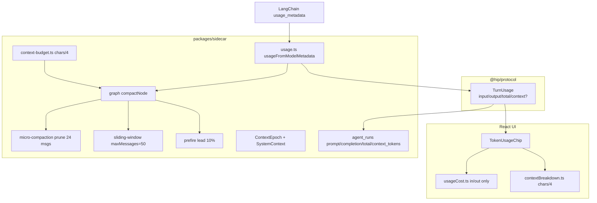
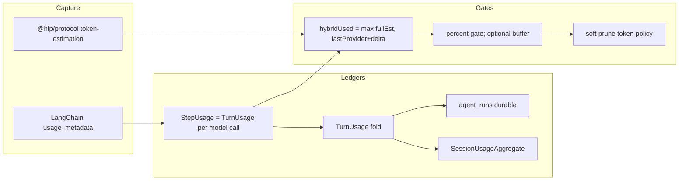
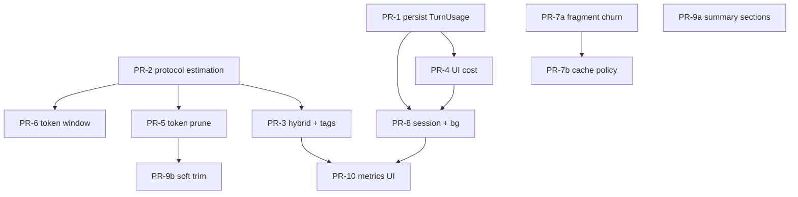

# Spec: hip Token 使用效率与测算改进

| Field | Value |
|-------|-------|
| **Title** | hip Token 使用效率与测算改进 |
| **Author** | TBD |
| **Date** | 2026-08-06 |
| **Status** | Draft (rev 2.1 — review approved; open questions closed) |
| **Scope** | protocol `TurnUsage` · sidecar estimation/gates/prune/cache · UI cost & breakdown · session aggregates |
| **Related** | [2026-08-05-long-engineering-task-spec.md](./2026-08-05-long-engineering-task-spec.md) · [2026-08-06-long-task-implementation-plan.md](./2026-08-06-long-task-implementation-plan.md) |
| **Comparators** | OpenCode (`/Users/lijiamin/data/code-repository/github/opencode`) · Grok Build (`/Users/lijiamin/data/code-repository/github/grok-build`) |

---

## Overview

hip 已具备 context budget 门控（85%/70%）、micro-compaction prune、prefire two-pass、ContextEpoch baseline、tool-output spill 与 UI fill%/cost 展示，以及 LLM compact 的 **token keep-tail**（`selectKeepUnitsByTokenBudget` / `targetKeepPercent`）。但在 **token 测算精度** 与 **token 使用效率** 上仍落后于 OpenCode 与 Grok Build 的账本深度：缺少 cache/reasoning 分桶与 durable modelId、成本按当前模型重算、本地估计低估（schema/image）、**sliding-window / micro-prune 仍按 message 计数**、无 provider-visible cache breakpoints、background usage noop、session 级用量未投影。

本 spec 提出 **手术式演进**：扩展 `TurnUsage` 并 **完整 round-trip 持久化**；共享 estimator 放在 `@hip/protocol`；增强 hybrid pressure（hip 自有，受 GB ledger/估计与 hip 现有 `max(estimate, lastPrompt)` 启发）；门控默认保持 85%，absolute buffer **默认 0**（可配置，语义对齐 OC `usable` 可选路径）；强化 soft prune / token-aware sliding window；Anthropic-first cache-policy hooks；session ledger 投影。

**不**重写 compaction 为 full-replace；**不**强制 tiktoken（sidecar 已依赖 `gpt-tokenizer` 作可选 P2，见 A5）。

---

## Background & Motivation

### 当前 hip 架构（token 相关）



| 层 | 路径 | 职责 |
|----|------|------|
| Estimation | `packages/sidecar/src/session/context-budget.ts` | `CHARS_PER_TOKEN=4`；`estimateText/Messages/Tools/PromptTokens`；`effectiveUsedTokens`；`exceedsThreshold` |
| Usage capture | `packages/sidecar/src/session/usage.ts` | 从 LangChain `usage_metadata` 建 `TurnUsage`；`addUsage`/`sumUsage` |
| Gates | `graph.ts` compactNode · `context-policy.ts` · `hip.toml [context]` | 85% auto / 70% subagent / 50% **token** keep-tail / prefire 10% / memory flush / 40KB tool spill |
| LLM compact keep | `compaction.ts` + `selectKeepUnitsByTokenBudget` | **已有** targetKeepTokens 按 token 选 keep 轮次（非 G6 缺口） |
| Prune | `micro-compaction.ts` | 默认 on；keepRecent≈**24 messages** 清旧 tool body |
| Sliding window | `context/sliding-window.ts` | **message-count** 50，非 token（G6 主缺口） |
| Epoch | `context-epoch.ts` · `system-context.ts` | durable baseline + revision fencing；**降低 prefix churn**，本身 **不** 发 provider `cache_control` |
| Protocol | `packages/protocol/src/message-model.ts` | `TurnUsage { input, output, total, context? }` |
| Durable store | `persistence/schema.ts` · `store.ts` | `agent_runs`: `prompt_tokens`, `completion_tokens`, `total_tokens`, `context_tokens`；`Message.usage` = `sumUsage(agentRuns)` |
| Event projection | `message-parsers.ts` `parseUsage` · `ProjectedUsage` | 仅 in/out/total；**已丢 contextTokens** |
| UI | `src/lib/usageCost.ts` · `contextBreakdown.ts` · `src/domain/hooks.ts` | fill% 分区；cumulative $ = in×rate_in + out×rate_out / 1e6 × **当前模型** |

### 痛点（已在代码中可验证）

1. **账本字段不足 + 持久化窄**：capture 无 cache/reasoning；`agent_runs` 四列 token；reload 后无法诚实 by-model cost。
2. **成本不诚实**：UI 用当前 catalog 模型价 × 历史 cumulative。
3. **mid-turn 压力**：`lastPromptTokens` 仅在 LLM 返回后更新。注：`compact→agent→tools→compact` 环路上，tools 后 `isOverCompactBudget` 已会 `estimatePromptTokens(messages+system+tools)`，tool 洪峰 **并非完全不可见**；缺口是 **full local estimate 相对 last provider context 低估**（system/tools/images/schema）时 `max(estimate, lastPrompt)` 粘在 lastPrompt，无法反映「lastPrompt + 新 tool 增量」。
4. **估计偏差**：tool schema 固定 400 chars；无 image（765）；UI 与 sidecar 各一份 chars/4。
5. **压力门控偏 %**：无 absolute headroom 配置（OC 用 `usable = window − reserved`）；**默认不应**在 85% 上再减 20k（见 KD-3）。
6. **效率策略弱**：sliding window 按消息数；micro-prune 按 message index；无 Anthropic `cache_control` / OpenAI `promptCacheKey`。
7. **可观测性薄**：session 行无 usage 投影；bg `usage: () => {}`（`session-background.ts`）；breakdown 粗。

### 与长任务工作的关系

长任务计划（M1 protect structures、M4 metrics）关注 **compact 后目标不丢** 与 dogfood 指标。本 spec **互补**：测算诚实、门控精度、少花 token / 提高 cache，不重复 Goal/verification/worktree。

---

## Goals & Non-Goals

### Goals

| ID | Goal | 可验收信号 |
|----|------|------------|
| G-A | **诚实 accounting**：cache / reasoning 分桶；incomplete 可标记；**持久化 round-trip** | fixture 单测 + reload 后字段仍在 |
| G-B | **更准的 fill 门控**：hybrid mid-turn；可选 absolute buffer | dogfood 基线后 overflow 下降；默认行为不剧烈变 |
| G-C | **更准的本地估计**：tool schemaJson / image / 共享 estimator | UI/sidecar 同算法 |
| G-D | **更高 token 效率**：token-aware sliding window + token prune；cache breakpoints；稳 prefix | cache_read 占比可测上升（有 key 时） |
| G-E | **session 级 ledger + 观测** | O(1) cumulative；loop tags 可数 overflow |
| G-F | **成本诚实** | capture-time modelId + nonCached 计费；incomplete → lower-bound + `*` |

### Non-Goals

- **不**在 v1 强制引入 tiktoken / WASM tokenizer（chars/4 + provider hybrid；可选 gpt-tokenizer 见 A5）。
- **不**把 compaction 整体重写为 Grok full-replace。
- **不**重写 ContextEpoch / SystemContext（只减 churn + 挂 cache 断点）。
- **不**实现多租户 billing / 发票。
- **不**改 API key 存储模型。
- **不**把 UI Work Items 与 Goal 并表。
- **不**要求每个 provider 100% cache 字段覆盖；**缺 cache 字段 = omit，不是 incomplete**（KD-14）。

---

## Gap Analysis

| 维度 | hip | OpenCode | Grok Build | 差距 ID |
|------|-----|----------|------------|---------|
| **Estimation** | chars/4；tools fixed 400；无 image；UI 复制 | util token；keep.tokens / usable | **单一** `xai-token-estimation`：BYTES=4、IMAGE=765、`exceeds_threshold(_with_headroom)` | G4, G5, G13 |
| **Accounting schema** | `TurnUsage` in/out/total/context?；agent_runs 四列 | Session/message `tokens: { input, output, reasoning, cache: { read, write } }`（`packages/core/src/session/info.ts` 等）；LLM 层另有 breakdown 形状 | `UsageTotals`：input/output/cached_read/cache_creation/reasoning + cost ticks | G1 |
| **Cost** | UI in/out × **当前**模型 | cache tiers、microcents lake | cost_usd_ticks；partial/incomplete scrub | G2 |
| **Mid-turn pressure** | `max(estimatePrompt, lastPromptTokens)` 在 compact 节点；estimate 可含 tools 后 messages | prompt 构建计数 + overflow | 账本完整 + 估计 crate；**无**已验证的同名 `estimated_tokens_since_model` API（见 §3 归因） | G3 |
| **Pressure gates** | % of window（85/70） | `usable = context − reserved(~min(20k, maxOutput))`；`count >= usable`（`overflow.ts`） | % + optional headroom 公式 | G15 |
| **Prune** | keep **24 messages** | PRUNE_PROTECT=40k / PRUNE_MINIMUM=20k / `skill` | soft trim + hard clear | G11 |
| **Compact keep** | **LLM path 已有** `selectKeepUnitsByTokenBudget` + targetKeep%；**滑动窗/微 prune 仍 message-count** | keep.tokens tail；durable history + projected view | layered soft→…→full-replace | G6（收窄） |
| **Compact template** | `[对话摘要]` + protect structures | Objective / Work State / Next Move / Relevant Files | 多模板 | G14 |
| **Cache policy** | Epoch 减 churn；**无** `cache_control` / promptCacheKey | `cache-policy.ts` auto breakpoints | model/normalize cache 相关 | G7 |
| **Subagent usage** | foreground `usageByAgent` fold；**bg emit usage noop** | ACP usage_update | pin-scoped fold；incomplete | G8 |
| **Session aggregate** | 扫 messages / agent_runs | session row tokens/cost 投影 | dual ledger prompt vs session | G9 |
| **Context breakdown** | user/asst/skills/tools/other | session-context-usage UI | system/tools/skills/MCP/messages | G10 |
| **Memory flush headroom** | bool 钩子 | — | headroom 绑定 flush | G12 |
| **Telemetry** | loop.compact / prefire 部分 | ACP usage_update | CompactionTriggered 等 | G16 |
| **Honesty** | 缺字段静默 0 | optional + projection | never invent；incomplete fail-closed | G1, G8 |

**G6 精确表述**：缺口是 **`applySlidingWindow`（maxMessages=50）与 micro-compaction（keepRecent=24）** 非 token 维度；**不是**「hip 没有 token keep」。LLM compact 的 keep-tail 已 token 化，实现时勿重 litigate M1 keep。

**严重度**：G1/G2（账单+持久化）≈ G3/G15（门控，默认谨慎）> G4/G5 > G7 > G6/G11 > G8/G9/G16 > G10/G13/G14。

---

## Proposed Design

### 总览



原则：

1. Provider 实测优先；估计补洞；**billing 不发明 token**。
2. **缺 cache 细节 = omit**；**incomplete 仅** fold/timeout/kill/partial 失败（KD-14）。
3. 单一算法源：`packages/protocol/src/token-estimation/`。
4. 可选字段 + **全路径持久化**；legacy null。
5. 默认门控行为接近今日 85%；激进 buffer 需 flag + dogfood 基线。

---

### 1. 数据模型与持久化

#### 1.1 Protocol：`TurnUsage`（及别名）

**文件**：`packages/protocol/src/message-model.ts`

```typescript
/** One model-call or folded multi-step slice. StepUsage is an alias for the same shape. */
export type StepUsage = TurnUsage

export interface TurnUsage {
  inputTokens: number
  outputTokens: number
  totalTokens: number
  /** Single-request context size for fill % (last step within agent; max across agents). */
  contextTokens?: number

  cacheReadTokens?: number
  cacheWriteTokens?: number
  /** When known: non-cached input. Prefer for cost (see §1.5). */
  nonCachedInputTokens?: number
  reasoningTokens?: number

  /** Locked at capture — required for honest cost after reload. */
  modelId?: string
  providerId?: string

  /** Fold/timeout/kill/missing nested spend — NOT "cache fields absent". */
  incomplete?: boolean
}
```

`StepUsage` ≡ 单次 model call 的 `TurnUsage`；`addUsage` 把 steps fold 成 agent/turn 级。

#### 1.2 累加规则

| 字段 | `addUsage` / `sumUsage` |
|------|-------------------------|
| input/output/total/cache*/reasoning/nonCached | **sum** |
| contextTokens | agent 内 **last** 正值 step；跨 agent **max** |
| incomplete | **OR** |
| modelId/providerId on **turn blob** | last non-empty（展示用） |
| **Session `byModel`** | **每个 step 按该 step 的 modelId fold**，禁止只用 turn 末 model |

#### 1.3 Capture：`usageFromModelMetadata`

```typescript
export function usageFromModelMetadata(
  u: LangChainUsageMetadata | null | undefined,
  estimatedContextTokens?: number,
  meta?: { modelId?: string; providerId?: string },
): TurnUsage | undefined
```

**modelId 线程（硬要求）**：每个调用点传入 **与本次 LLM 绑定相同** 的 `getActiveModel()` / runner binding：

| 调用点 | 文件 | 现状 | 改动 |
|--------|------|------|------|
| graph agent path | `graph.ts` ~751 | metadata + estimate only | + `ctx.providerId/modelId` |
| multi-agent | `multi-agent-graph.ts` ~141 | 同上 | + binding |
| 其他 `emit.usage` | 见 §7 | — | 同规则 |

**Provider 映射（best-effort，经 LangChain）**：

| 线索 | → 字段 |
|------|--------|
| `input_token_details.cache_read` / `cache_creation` / `cached_tokens` | cacheRead / cacheWrite |
| top-level `cache_read_input_tokens` / `cache_creation_input_tokens` | 同上 |
| `output_token_details.reasoning` / `reasoning_tokens` | reasoningTokens |
| 能算 nonCached 时 | `nonCachedInputTokens = input − cacheRead − cacheWrite`（≥0） |
| 无 cache 细节 | **omit** cache* / nonCached（**不**设 incomplete） |

**Fixtures（PR-1 必交）**：至少 2–3 份录制/合成的 `usage_metadata` JSON：

1. Anthropic Messages 经 hip `anthropic-messages` / LangChain（含 cache 字段若可得，否则文档标明「本环境无 cache 键」）。
2. OpenAI-compat 路径（`prompt_tokens_details.cached_tokens` 形状）。
3. Minimal：仅 in/out/total（证明 omit 不污染 incomplete）。

可选：每个 provider 首次见到未映射 detail 键时 debug log 一次。

**Invariant（test/debug）**：`nonCached + cacheRead + cacheWrite ≈ input`（±1）；`reasoning ≤ output`。生产 warn，不抛。

#### 1.4 持久化 / 迁移（PR-1 阻塞项 — 解决 G-F）

今日事实：

- 写入：`store.ts` INSERT `agent_runs(..., prompt_tokens, completion_tokens, total_tokens, context_tokens, ...)`
- 读取：拼 `TurnUsage`；`Message.usage = sumUsage(runs)`
- 事件：`parseUsage` → `ProjectedUsage` **仅** in/out/total（已丢 contextTokens）

**选定方案：`agent_runs.usage_json TEXT`（推荐）+ 保留四列 billing 作热路径索引/兼容**

| 列 | 用途 |
|----|------|
| 现有 prompt/completion/total/context_tokens | 继续写；UI/旧工具兼容 |
| **`usage_json` TEXT NULL** | 完整 `TurnUsage` JSON（含 cache/reasoning/modelId/incomplete/context） |
| 可选后续 | 若查询频繁再拆列；v1 不强制 |

**Migration**：

```sql
ALTER TABLE agent_runs ADD COLUMN usage_json TEXT;
-- optional later:
-- ALTER TABLE sessions ADD COLUMN usage_json TEXT;  -- SessionUsageAggregate
```

历史行：`usage_json` NULL → load 时仅四列；cache*/modelId **unknown**（omit）；cost honesty **best-effort until migration + new turns**。

**Round-trip checklist（PR-1 验收）**：

| 路径 | 必须 |
|------|------|
| `store` insert/load agent_runs | 写读 `usage_json`；sumUsage 后 message.usage 含扩展字段 |
| `parseUsage` / `ProjectedUsage` | 扩展为与 `TurnUsage` 对齐的可选字段；**恢复 contextTokens** |
| message-updater / projector | step_ended 等带 usage 的事件不丢新字段 |
| event-store snapshot `usageByAgent` | 序列化完整 TurnUsage |
| UI reload | 能读 modelId + cache*（若曾写入） |

**成本诚实门槛**：PR-4（honest cost UI）**硬依赖** PR-1 持久化落地；进程内-only modelId **不**算完成 G-F。

#### 1.5 Cost 公式

```typescript
function billableInput(u: TurnUsage): {
  nonCached: number
  cacheRead: number
  cacheWrite: number
} {
  const cr = u.cacheReadTokens ?? 0
  const cw = u.cacheWriteTokens ?? 0
  if (u.nonCachedInputTokens != null) {
    return { nonCached: u.nonCachedInputTokens, cacheRead: cr, cacheWrite: cw }
  }
  // Fallback: do NOT charge full input*inputRate + cache* again
  return {
    nonCached: Math.max(0, u.inputTokens - cr - cw),
    cacheRead: cr,
    cacheWrite: cw,
  }
}

// cost =
//   nonCached * rate.input
// + cacheRead * (rate.cacheRead ?? rate.input * costCacheReadMultiplier)
// + cacheWrite * (rate.cacheWrite ?? rate.input * costCacheWriteMultiplier)
// + output * rate.output
//  all / 1e6
```

- **byModel**：每个 **step** 用自己的 modelId 查 catalog；session 合计 = Σ steps。
- **legacy 无 modelId**：fallback 当前 session 模型，并计 `partial` 展示。
- **incomplete（KD-15）**：显示 **lower-bound $** + `*` / tooltip「usage incomplete」；不 scrub 到 null（避免空白误导），也不假装精确。

Catalog：若 models.dev 有 cache 价则用；否则全局乘子 `costCacheReadMultiplier=0.1`、`costCacheWriteMultiplier=1.25`（可配）。

---

### 2. 统一 Estimator（`@hip/protocol`）

#### 2.1 位置（KD-4）

**优先**：`packages/protocol/src/token-estimation/`（纯函数，无 Node/LangChain）

```
packages/protocol/src/token-estimation/
  constants.ts
  estimate.ts
  threshold.ts
  index.ts
```

- sidecar `context-budget.ts` re-export / thin wrapper 保 import 兼容。
- UI `contextBreakdown.ts` 改 import `@hip/protocol`。
- **不**新建 `packages/token-estimation` 除非 protocol 体积成为问题。
- 注：sidecar 已依赖 **`gpt-tokenizer`**，本设计 v1 不用；见 A5。

#### 2.2 API

```typescript
export const CHARS_PER_TOKEN = 4
export const IMAGE_TOKEN_ESTIMATE = 765
export const TOOL_SCHEMA_OVERHEAD_CHARS = 400

export function estimateTextTokens(text: string): number // ceil(len/4) — hip 现状 KD-10
export function estimateImageTokens(n: number): number
export function estimateToolsTokens(tools: { name; description?; schemaJson? }[]): number
export function exceedsThreshold(used, window, pct): boolean // 现语义
/**
 * Optional headroom. Default product path uses buffer=0 (KD-3).
 * Integer: used*100 >= window*pct - buffer*100
 */
export function exceedsThresholdWithBuffer(used, window, pct, bufferTokens): boolean
/** OC-inspired usable width for optional gate mode. */
export function usableContextTokens(window, maxOutput, bufferCap = 20_000): number
```

---

### 3. Mid-turn Hybrid Fill

#### 3.1 归因（修正）

Hybrid **不是**已验证的 GB 公开 API 名。GB 贡献的是 `UsageTotals`/incomplete 账本与 `xai-token-estimation`。Hybrid 是 **hip 对现有 `effectiveUsedTokens` 的扩展**：在 full re-estimate 偏低时，用 `lastProviderContext + delta(new msgs only)` 抬升压力。文档不再写「GB estimated_tokens_since_model 已验证」。

#### 3.2 今日图拓扑（事实）

`START → compact → agent → tools → compact → …`  
`isOverCompactBudget` 已在 tools 之后对 **完整 messages+system+tools** 做 estimate 并 `max(..., lastPromptTokens)`。Hybrid 解决的是 **estimate 系统性低估** 时粘在 lastPrompt 的问题，不是「tools 后完全不算」。

#### 3.3 所有权

```typescript
// On GraphCtx (per graph invoke / agent graph) — primary
interface ContextPressureState {
  lastProviderContextTokens: number  // seed from host.lastPromptTokens at turn start
  /** Tokens from messages appended since last model response only */
  estimatedTokensSinceModel: number
  lastModelMessageCount: number      // or last message id watermark
}

// SessionTurnHost mirrors lastProvider into lastPromptTokens for injectors
// Subagent graphs: own GraphCtx pressure; do not share supervisor delta
```

#### 3.4 更新规则（防双计）

| 事件 | 动作 |
|------|------|
| LLM usage | `lastProvider = context/input`；`delta = 0`；watermark = messages.length |
| Tool result / 新 message | `delta += estimate(new message only)`（spill 后按可见 stub） |
| Micro-prune stub | `delta -= estimate(old) - estimate(stub)` 或 clamp ≥0；**不要**同时把全量 messages 再加进 delta |
| `hybridUsed` | `max(estimatePromptTokens(full), lastProvider + delta, lastProvider)` |
| Compact 完成 | 用 post-compact full estimate 重置；清 delta |

**禁止**：`hybridUsed = fullEstimate + delta`（双计 tool body）。

#### 3.5 与 `MIN_STEPS_BETWEEN_LLM_COMPACT`（=4）

```mermaid
sequenceDiagram
  participant C as compactNode
  participant A as agentNode
  participant T as toolsNode
  Note over C: pressure seed from host
  C->>C: prune; hybridUsed; if overBudget and steps>=4 → LLM compact
  C->>C: if hybrid approaching prefire band → maybeStartPrefire even if overBudget but throttled
  A->>A: LLM; usage → lastProvider=0 delta
  T->>T: tool results → delta += est(new)
  T->>C: next compact
```

**策略（KD-16）**：

1. **Prune / micro-compaction**：每步可跑（现状），不受 steps 闸。
2. **Prefire**：当 `hybridUsed` 进入 prefire 带（auto% − lead）或已 overBudget 但 `stepsSince < 4` 时，**仍允许** `maybeStartPrefire`（今日 `if (!overBudget) maybeStartPrefire` 会在 overBudget 时跳过 — 改为「未 LLM-compact 成功时也可 prefire」）。
3. **LLM compact**：仍尊重 `MIN_STEPS_BETWEEN_LLM_COMPACT`，避免每 tool 轮摘要；成功指标改为「压力可见 + prefire/prune 提前」，**不**要求 throttle 下立即 LLM compact。
4. 单测：`lastProvider=P`，tools 增 N tokens，即使 fullEstimate 人为偏低，`hybridUsed >= P+N`。

---

### 4. 门控数学（KD-3 修订）

#### 4.1 默认：保持 85%，buffer = 0

```
fire_llm_compact ⇔ exceedsThreshold(used, window, autoCompactPercent)
// buffer default 0 → no double headroom
```

`outputBufferTokens` 默认 **0**；仅当配置 >0 或启用 `gateMode = "percent_minus_buffer"` 时使用 `exceedsThresholdWithBuffer`。

#### 4.2 可选模式（hip.toml）

| `gateMode` | 语义 |
|------------|------|
| `"percent"`（**默认**） | 今日：`used >= window * pct/100` |
| `"percent_minus_buffer"` | `used*100 >= window*pct - buffer*100`（GB headroom 形；**慎用**） |
| `"usable"` | OC 形：`usable = window - min(buffer, maxOutput)`；`used >= usable * (pct/100)` 或配置 `usableFireAtPercent=100` 表示 `used >= usable` |

**推荐实验路径**：dogfood 时试 `gateMode=usable` + `outputBufferTokens=min(20000, maxOutput)`，**不要**默认 `percent` + 20k buffer。

#### 4.3 Worked examples（触发 fill ≈ used/window）

假设 `maxOutput` 已知且 `bufferCap = min(20000, maxOutput)`。

| window | mode | params | 触发 used | 约 fill% |
|--------|------|--------|-----------|----------|
| 128k | percent (default) | 85%, buf=0 | 108_800 | **85%** |
| 128k | percent_minus_buffer | 85%, buf=20k | 88_800 | **~69%**（过激，不默认） |
| 128k | usable | buf=20k, fire at 100% usable | 108_000 | **~84.4%** |
| 128k | usable | buf=20k, fire at 85% of usable | 91_800 | **~71.7%** |
| 32k | percent | 85%, buf=0 | 27_200 | **85%** |
| 32k | percent_minus_buffer | 85%, buf=20k | 7_200 | **~22.5%**（危险） |
| 32k | usable | buf=min(20k,maxOut) e.g. 8k | 24_000 if fire@usable | **75%** |
| 200k | percent | 85%, buf=0 | 170_000 | **85%** |
| 200k | usable | buf=20k fire@usable | 180_000 | **90%** |

实现：`resolveOutputBuffer(model)` = `min(configured, maxOutput ?? configured, floor(window * 0.15))` 仅在 buffer>0 时使用。

---

### 5. Soft Prune / Sliding window

#### 5.1 Token prune（PR-5；默认 on 但需 dogfood）

常量：`PRUNE_PROTECT_TOKENS=40_000`，`PRUNE_MINIMUM_TOKENS=20_000`。

**优先级（KD-17）**：

1. **Unresolved tool-pair 保护**（现 phases 1–2）  
2. **`isSkillToolName` 保护**（与 UI 共用同一 helper：`name === 'skill' \| 'use_skill' \| includes('skill')` — 放 protocol 或 sidecar 共享模块，prune 与 breakdown 共用）  
3. **Newest→oldest token 窗口** PRUNE_PROTECT  
4. 释放量 < PRUNE_MINIMUM → 跳过本轮 prune  

#### 5.2 Sliding window token-aware（PR-6）

`applySlidingWindow` 增加 `maxTokens?`；触发：`messages.length > maxMessages` **或** `estimateMessagesTokens > maxTokens`。`maxMessages` 硬顶保留。

#### 5.3 Soft trim（独立 PR，默认 off）

fill > softTrimPercent（50）时 head+tail 截断旧 assistant 文本 — **不与** structured summary 同 PR。

---

### 6. Cache 友好与 Cache Policy

#### 6.1 Epoch 澄清

ContextEpoch **减少 prefix churn**，是 cache 命中的前提之一；**不是** provider caching 本身。必须另做 `cache_control` / `prompt_cache_key` 才能 provider-visible。

#### 6.2 Choke point（PR-7）

| 优先级 | 路径 | 动作 |
|--------|------|------|
| 1 | **Anthropic Messages 自定义路径** `anthropic-messages.ts`（及等价 raw body 构建） | 在序列化前对 last tool / last system / latest user 打 `cache_control: ephemeral` |
| 2 | OpenAI-compat client | `prompt_cache_key = sessionId`（feature-detect；不支持则 no-op） |
| 3 | 纯 LangChain 默认包装 | 不保证；文档 no-op |

`cachePolicy = auto | none`；unsupported → **静默 no-op**。

**Fragment churn**（TokenBudgetInjector / CurrentTime）可 **独立小 PR** 先于或并行 breakpoints：zone 边界才改 budget 文案；time 移出 cached prefix。

---

### 7. Subagent / Background Usage

#### 7.1 `GraphEmit.usage` 站点清单

| 站点 | 行为 | 目标 |
|------|------|------|
| `graph.ts` agent | `usageFromModelMetadata` → `ctx.emit.usage` | + modelId；写 pressure |
| `multi-agent-graph.ts` | 同上 | 同上 |
| `session-turn-runner.ts` `makeEmit` | `addUsage` → `usageByAgent`；更新 `host.lastPromptTokens` | 保持；扩展字段透传 |
| **`session-background.ts`** | **`usage: () => {}` DROP** | 见下 |
| `session-turn-ops.ts` retry/default | 多处 noop emit | 若跑模型须接真实 emit 或返回值 |
| `subagent` NOOP_EMIT | 默认 noop | foreground 由 turn-runner 覆盖 |
| 测试 harness | noop | 保持 |

#### 7.2 Background 规则

1. **`runSubagent` 返回值**携带 `usage?: TurnUsage`（不依赖 emit 副作用）。  
2. 完成时：**single-writer** fold 进 `SessionUsageAggregate`（串行化在 session 锁 / queue 上；并发 bg 用累加器 mutex）。  
3. Parent turn 已关闭：不改写该 turn 的 `contextTokens`；session 累计仍加 billing。  
4. Timeout / kill / 无 metadata：`incomplete=true` on session aggregate；可选 notice。  
5. Synthetic `bg-turn-*` 消息：可选 `usage` 字段便于 UI；若无 message，仅 session aggregate。  
6. Prompt 级：bg 进行中结束用户 turn → turn 可标 incomplete **或** 仅 session incomplete（推荐 **session-only incomplete**，避免主 turn $ 一直闪 `*`）。

---

### 8. API / UI

| 元素 | 目标 |
|------|------|
| Chip fill% | 不变 zones；可选 usable 警戒线 |
| Cumulative $ | Σ per **persisted** step modelId；incomplete → lower-bound + `*` |
| Tooltip | cache/reasoning 若有 |
| `/context` 面板 | P2；sidecar `context:breakdown` 事件 |

---

### 9. Observability（P0 即挂钩）

不要等 PR-10 才有数：

| 已有 | P0 扩展 |
|------|---------|
| `loop.compact` / `loop.prefire` | tags: `reason`, `mode`, `used`, `hybrid?`, `throttled?` |
| overflow recovery 路径（`compaction-overflow` 等） | **counter + journal 列**：`overflow_recoveries`, `llm_compacts`, `prunes` |
| msm dogfood | **P0b 前** 冻结基线一行 journal |

PR-10 再加 by_type / breakdown UI。

---

### 10. 配置面（协议 + env）

**`packages/protocol` `ContextConfig` 扩展**（与读取 PR 同合）：

```typescript
export interface ContextConfig {
  // existing...
  autoCompactPercent?: number
  subagentCompactPercent?: number
  targetKeepPercent?: number
  prefireLeadPercent?: number
  twoPass?: boolean
  memoryFlushBeforeCompact?: boolean
  toolOutputMaxBytes?: number

  /** Default 0 — see KD-3 */
  outputBufferTokens?: number
  /** percent | percent_minus_buffer | usable */
  gateMode?: 'percent' | 'percent_minus_buffer' | 'usable'
  hybridFill?: boolean // default true after P0b flag period; or default true with kill switch
  pruneProtectTokens?: number
  pruneMinimumTokens?: number
  softTrimPercent?: number // 0 = off
  cachePolicy?: 'auto' | 'none'
  promptCacheKey?: 'session' | 'none'
  estimatorImageTokens?: number
  costCacheReadMultiplier?: number
  costCacheWriteMultiplier?: number
}
```

| TOML / camelCase | Env |
|------------------|-----|
| `outputBufferTokens` | `HIP_CONTEXT_OUTPUT_BUFFER_TOKENS` |
| `gateMode` | `HIP_CONTEXT_GATE_MODE` |
| `hybridFill` | `HIP_CONTEXT_HYBRID_FILL` (0/1) |
| `pruneProtectTokens` | `HIP_CONTEXT_PRUNE_PROTECT_TOKENS` |
| `pruneMinimumTokens` | `HIP_CONTEXT_PRUNE_MINIMUM_TOKENS` |
| `softTrimPercent` | `HIP_CONTEXT_SOFT_TRIM_PERCENT` |
| `cachePolicy` | `HIP_CONTEXT_CACHE_POLICY` |
| `promptCacheKey` | `HIP_CONTEXT_PROMPT_CACHE_KEY` |
| `costCacheReadMultiplier` | `HIP_CONTEXT_COST_CACHE_READ_MULT` |
| `costCacheWriteMultiplier` | `HIP_CONTEXT_COST_CACHE_WRITE_MULT` |

`resolveContextPolicy` + `hip-config` snake_case 别名 + contract tests 同 PR 更新。

---

## Prioritized Fix Plan

### P0a — Accounting schema + persist + fixtures

| 工作 | 成功指标 |
|------|----------|
| TurnUsage 扩展；usage_json migration；parseUsage/ProjectedUsage | reload round-trip |
| usageFromModelMetadata + modelId 线程 + fixtures | 单测绿 |
| incomplete 语义文档化 | cache omit ≠ incomplete |

### P0b — Hybrid + 可选 buffer + **基线**

| 工作 | 成功指标 |
|------|----------|
| 记录 msm overflow/compact **基线** | journal 一行 |
| ContextPressureState + hybrid；prefire 在 throttle 下仍可 | 单测 P+N |
| `gateMode`/`outputBufferTokens` 默认 percent/0 | 默认 dogfood 行为 ≈ 今日 |
| loop.compact / overflow **计数 tags** | 可对比基线 |

### P0c — Honest cost UI

| 工作 | 成功指标 |
|------|----------|
| computeCost nonCached 公式；by modelId | 切换模型 $ 不跳；reload 仍准（依赖 P0a） |
| incomplete → `$x.xx*` | 可见 |

### P0d — Background usage fold

| 工作 | 成功指标 |
|------|----------|
| runSubagent 返回 usage；session aggregate single-writer | bg 完成后 session $↑ |
| timeout → incomplete | 标记 |

### P1

共享 estimator 落地（可与 P0a 并行但路径定为 protocol）；token prune；token sliding window；cache-policy Anthropic-first；fragment churn；session 列投影完善。

### P2

Soft trim；structured summary sections；`/context` breakdown；gpt-tokenizer 可选；flush headroom；富 metrics UI。

### 成功指标（修正）

| Metric | 条件 |
|--------|------|
| Overflow recoveries | **相对 P0b 冻结基线**；目标 −50% 仅在启用 usable/buffer 实验或 hybrid+prune 后评估 |
| Estimate vs provider p50 error | <15% on fixtures |
| Cost vs dashboard | ±20% 或 incomplete 已标 |
| Estimator drift UI/sidecar | 0（同包） |

---

## Alternatives Considered

### A1. 强制 tiktoken / 模型 tokenizer

拒绝 v1（包体与多模型成本）；gate 仍应以 provider 为准。

### A2. Full-replace compaction 重写

拒绝；回归面过大。

### A3. 仅 UI 美化 cost

拒绝；门控与 persist 仍错。

### A4. 默认 percent−20k buffer

**拒绝作为默认**（Issue 2）；见 KD-3 与 worked examples。

### A5. 使用已 vendored 的 `gpt-tokenizer` 改善文本估计

| 优点 | 缺点 |
|------|------|
| 无新 WASM；sidecar 已有依赖 | 对非 GPT 模型仍偏；UI 未必想依赖；与 chars/4 双轨 |

**决定**：v1 仍 chars/4；P2 可选 `estimator = "gpt-tokenizer" | "chars4"` 仅 sidecar 门控旁路实验。

### A6. 默认采用 OC `usable` 绝对门控

| 优点 | 缺点 |
|------|------|
| 更接近 overflow 物理含义 | 改变 85% 用户心智；maxOutput 不准时抖 |

**决定**：实现为 **`gateMode=usable` 可选**；默认保持 `percent` + buffer 0。

---

## Key Decisions

| ID | Decision | Rationale |
|----|----------|-----------|
| **KD-1** | v1 chars/4 + provider hybrid；不强制 tiktoken | 快；与 OC/GB 启发式一致 |
| **KD-2** | TurnUsage 可选扩展 + **usage_json 持久化** | reload 后诚实 cost；legacy null |
| **KD-3** | 默认 **percent @ 85%, outputBufferTokens=0**；可选 usable / percent_minus_buffer | 避免 85%−20k 双 headroom（~69% 误触发） |
| **KD-4** | Estimator 放 **`packages/protocol/src/token-estimation/`** | UI+sidecar 已共享 protocol；零新包 |
| **KD-5** | 成本按 **step modelId** + nonCached 公式 | 防 input+cache 双计；防当前模型污染 |
| **KD-6** | Cache policy 默认 auto；**Anthropic-first choke point** | ROI；避免半套 LangChain 钩子 |
| **KD-7** | Prune token 窗口 + pair/skill 优先 | OC 启发；安全优先 |
| **KD-8** | Sliding window token-aware；LLM keep-tail 已有不重做 | 收窄 G6 |
| **KD-9** | 不重写 compaction 引擎 | 长任务 M1 对齐 |
| **KD-10** | 文本 estimate 保持 **ceil** | 无声改变阈值 |
| **KD-11** | Session aggregate 投影 + **single-writer** | 并发 bg 安全 |
| **KD-12** | Bg fold 到 session；丢数 → incomplete | fail-closed |
| **KD-13** | Hybrid 为 hip 扩展；不宣称 GB 同名 API | 证据诚实 |
| **KD-14** | 缺 cache 字段 = **omit**；incomplete 仅 fold/失败 | 避免全局 $ 带 `*` |
| **KD-15** | incomplete 成本 = **lower-bound + `*`** | 关闭 Open Q2 |
| **KD-16** | LLM compact 仍 throttle；hybrid over-budget 时 **仍 prefire**；prune 每步 | 成功标准可达成 |
| **KD-17** | Prune 优先级 pair > skill > token window | 防误删 |
| **KD-18** | PR-4 硬依赖 PR-1 持久化 | 无 durable modelId 不算诚实 cost |
| **KD-19** | Hybrid 默认 **on**（kill switch env）；buffer 默认 **off/0** | 风险分离 |
| **KD-20** | P0 拆 P0a–d；PR-9 拆 template / soft-trim | 可合并粒度 |
| **KD-21** | Chip 主表面不显示 cache hit rate；仅 hover tooltip | 避免喧宾夺主；operator 仍可查 |
| **KD-22** | 历史 $ 默认 capture-time；不按当前 catalog 重算 | 切换模型后 $ 不跳变；诚实 accounting |

---

## Security & Privacy

| 风险 | 缓解 |
|------|------|
| promptCacheKey=sessionId 关联 | 仅用户配置的 LLM；不上 hip 云 |
| usage_json 体积 | 仅计数；无 tool body |
| $ 误导 | incomplete `*`；estimated cache rate 标注 |

---

## Risks & Mitigations

| 风险 | Sev | Mitigation |
|------|-----|------------|
| Provider 映射错 | High | fixtures；omit 未知；invariant warn |
| 误开 percent_minus_buffer 20k | High | 默认 0；小窗口 worked example；config 文档警告 |
| Hybrid 双计 | Med | delta = new msgs only；单测 |
| Token prune 打 cache | Med | PRUNE_MINIMUM；dogfood 后再默认激进参数 |
| parseUsage 继续丢字段 | High | PR-1 checklist |
| 与长任务 PR 冲突 | Med | protect/metrics 接口协调 |

---

## Rollout Plan

| Flag | Default |
|------|---------|
| usage_json 写 | on（新 turns） |
| hybridFill | on；`HIP_CONTEXT_HYBRID_FILL=0` kill |
| outputBufferTokens | **0** |
| gateMode | **percent** |
| token prune protect | on（参数可调） |
| cachePolicy | auto（Anthropic path） |
| softTrim | off |
| session usage_json | migration 后 on |

阶段：P0a → 基线 journal → P0b → P0c → P0d → P1…；rollback 靠 env/TOML。

---

## Open Questions

（产品决策已闭合，无阻塞项）

1. ~~Chip cache hit rate~~ → **仅 tooltip**（用户确认 2026-08-06）。  
2. ~~incomplete $~~ → **已关闭 KD-15**（lower-bound + `*`）。  
3. ~~历史 session 按当前价重算~~ → **默认不重算**（capture-time modelId + 当时价；用户确认 2026-08-06）。  
4. cache 乘子是否 per-provider 表？→ v1 全局默认；后续可扩展。  
5. ceil vs trunc major 统一？→ 保持 ceil（KD-10）。  
6. ACP 外部 agent 是否同 TurnUsage？→ 是，best-effort 映射。  
7. SessionUsageAggregate 是否进 event-store？→ 优先 sessions.usage_json；snapshot 可选。

---

## References

### hip

- `packages/protocol/src/message-model.ts` · `hip-config.ts` `ContextConfig`
- `packages/sidecar/src/session/context-budget.ts` · `usage.ts` · `graph.ts` · `compaction.ts` · `micro-compaction.ts` · `context/sliding-window.ts` · `prefire.ts` · `context-epoch.ts` · `context-injector.ts` · `session-background.ts` · `session-turn-runner.ts` · `multi-agent-graph.ts` · `anthropic-messages.ts`
- `packages/sidecar/src/persistence/schema.ts` · `store.ts` · `message-parsers.ts` · `message-types.ts`（`ProjectedUsage`）
- `src/lib/usageCost.ts` · `src/domain/hooks.ts`
- 长任务 design docs（M1 protect · M4 metrics）

### OpenCode

- Session tokens：`packages/core/src/session/info.ts`（`tokens.input/output/reasoning/cache.read|write`）
- `packages/llm/src/cache-policy.ts`
- `packages/opencode/src/session/compaction.ts`（PRUNE_*）
- `packages/opencode/src/session/overflow.ts`（COMPACTION_BUFFER / usable）
- （LLM 层 breakdown 形状若存在，作启发而非 1:1 强制 hip schema）

### Grok Build

- `crates/codegen/xai-token-estimation/src/lib.rs`
- `crates/codegen/xai-chat-state/src/usage.rs`（UsageTotals / incomplete / subagent fold）
- Hybrid mid-turn：**hip 自研扩展**，非 GB 已验证同名 API

---

## PR Plan

### PR-1: `feat(protocol+sidecar): TurnUsage extend + usage_json persist + fixtures`

- **Files**: `message-model.ts`；`usage.ts`；`schema` migration `usage_json`；`store.ts` insert/load；`parseUsage` / `ProjectedUsage` / projector / updater；`graph.ts` + `multi-agent-graph.ts` modelId；fixture JSON tests
- **Dependencies**: none
- **Description**: 完整 round-trip；legacy null；**阻塞 PR-4**。含 contextTokens 在 ProjectedUsage 修复。

### PR-2: `feat(protocol): token-estimation module + ContextConfig buffer/gateMode`

- **Files**: `packages/protocol/src/token-estimation/*`；export；`context-budget.ts` re-export；`ContextConfig` + hip-config + resolveContextPolicy + env 名 + contract tests；`exceedsThresholdWithBuffer` / `usableContextTokens`
- **Dependencies**: none（可与 PR-1 并行）
- **Description**: 共享估计；**默认 buffer=0 / gateMode=percent**。

### PR-3: `feat(sidecar): hybrid mid-turn pressure + prefire-when-throttled + baseline metrics tags`

- **Files**: `graph.ts` GraphCtx pressure；toolsNode delta；`session-turn-runner` seed；`prefire` 条件；loop.compact tags；overflow counter；journal 基线说明
- **Dependencies**: PR-2 优选（也可用现有 estimateTextTokens 先做，但 buffer helpers 来自 PR-2）
- **Description**: hybridUsed 无双计；MIN_STEPS 下 prefire；**不**默认打开激进 buffer。

### PR-4: `feat(ui): honest cost by modelId + incomplete star`

- **Files**: `usageCost.ts`；`hooks.ts`；TokenUsageChip
- **Dependencies**: **PR-1**（KD-18）
- **Description**: nonCached 公式；reload 后 $ 稳定。

### PR-5: `feat(sidecar): token micro-prune protect window`

- **Files**: `micro-compaction.ts`；policy/config；shared `isSkillToolName`
- **Dependencies**: PR-2
- **Description**: 优先级 pair > skill > window；PRUNE_MINIMUM。

### PR-6: `feat(sidecar): token-aware sliding window`

- **Files**: `sliding-window.ts`；`graph.ts`
- **Dependencies**: PR-2
- **Description**: maxTokens 触发；maxMessages 硬顶。

### PR-7a: `fix(sidecar): reduce token-budget/time prefix churn`

- **Files**: `context-injector.ts` / fragments
- **Dependencies**: none
- **Description**: 独立于 breakpoints。

### PR-7b: `feat(sidecar): Anthropic cache_control + optional OpenAI prompt_cache_key`

- **Files**: `cache-policy.ts`；`anthropic-messages.ts`；OpenAI binding feature-detect
- **Dependencies**: 7a 优选
- **Description**: 单 choke point；unsupported no-op。

### PR-8: `feat(sidecar): session usage aggregate + background usage fold`

- **Files**: `session-background.ts`；subagent return usage；sessions.usage_json；single-writer；`usage:updated` 事件
- **Dependencies**: PR-1；UI 读 aggregate 可跟 PR-4
- **Description**: bg 不再 drop usage；incomplete 规则。

### PR-9a: `feat(sidecar): structured compact summary sections`

- **Files**: `compaction.ts` summarizer prompts
- **Dependencies**: 长任务 protect 已合
- **Description**: Objective / Work State / Next Move / Relevant Files + protect。

### PR-9b: `feat(sidecar): optional soft trim (default off)`

- **Files**: soft-trim module；config
- **Dependencies**: PR-5 协调
- **Description**: 与 9a 分离。

### PR-10: `feat(obs+ui): rich token metrics + context breakdown event`

- **Files**: loop-events；可选 UI 面板
- **Dependencies**: PR-1–3, PR-8
- **Description**: by_type；breakdown；对照 P0b 基线。



---

## Revision History

| Date | Note |
|------|------|
| 2026-08-06 | Initial draft |
| 2026-08-06 | rev 2: design review — persist path, KD-3 buffer default, hybrid ownership, GB/OC citation fixes, G6 narrow, P0a–d, cost formula, prune precedence, cache choke point, new KDs |
| 2026-08-06 | rev 2.1: user closed open Q1/Q3 → KD-21 tooltip-only cache %, KD-22 no historical reprice |
