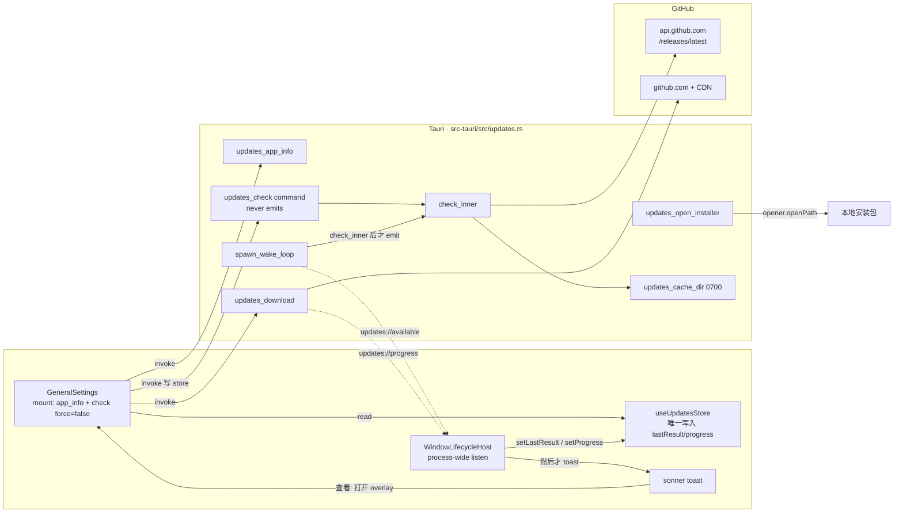
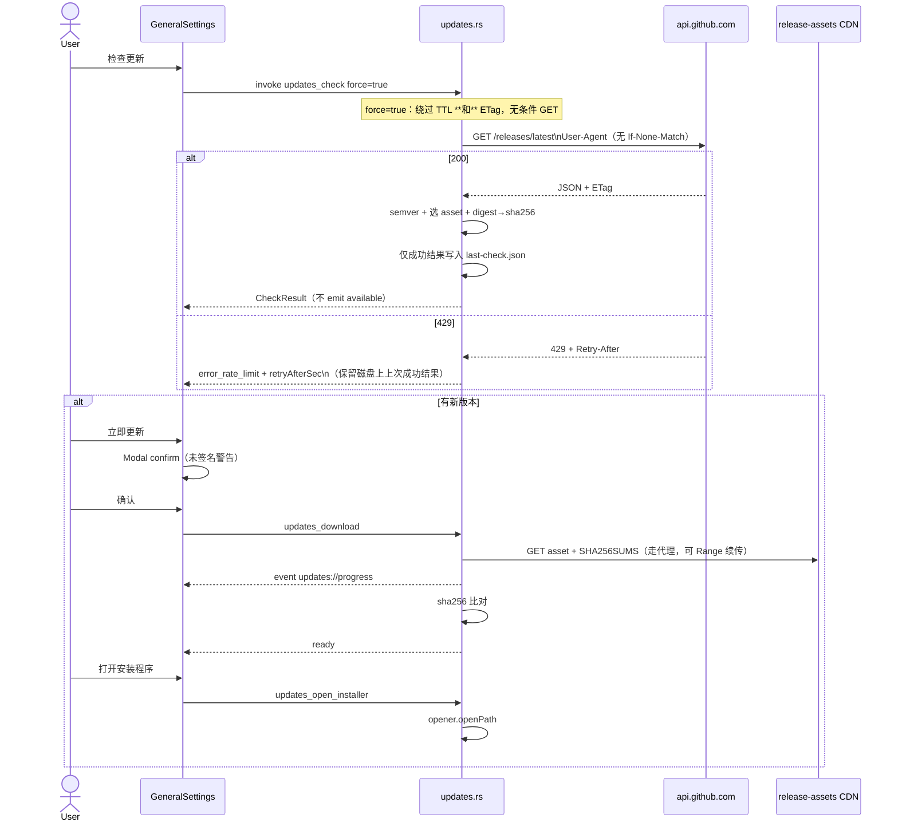
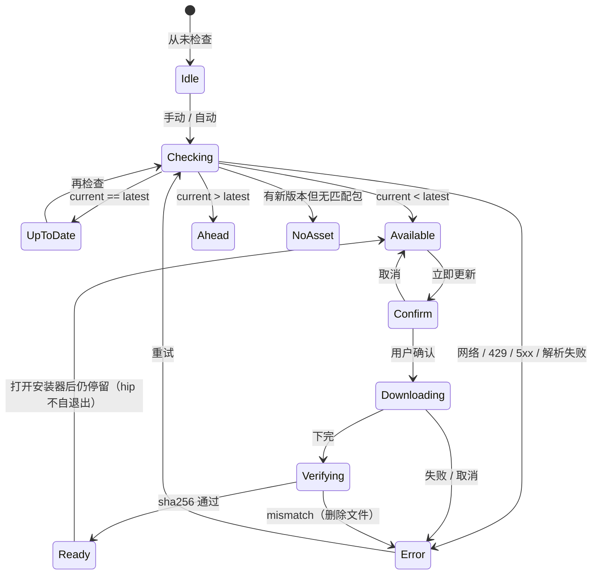

# 通用设置 · 版本查看 / 最新版本校验 / 自动检查更新

- 系列：`docs/design/app-update-settings/`
- 配套：`app-update-settings-plan.md`（执行计划：PR 拆解、文件级任务、测试与验收）；`app-update-settings-preview.html`（通用设置区块多状态交互原型，浏览器直接打开）
- 作者：hip design (agent)
- 日期：2026-08-23
- 状态：Draft
- 产品原话「自动更新开关」在 UI / KD-2 落地为 **「自动检查更新」**（只检查，不下载、不安装）
- 更新源（产品指定）：[`https://github.com/limin411/hip/releases`](https://github.com/limin411/hip/releases)
- 前置基线（2026-08-23 已核对代码 / 线上 Release）：
  - 产品版本 **1.0.1**，三处协同：`package.json` / `src-tauri/Cargo.toml` / `src-tauri/tauri.conf.json`（见 `docs/release.md`）
  - **无 updater**：`tauri-plugin-updater` 未出现在 `Cargo.toml` / `tauri.conf.json` / capabilities；`hip.toml` 无 `[updates]`；`HipConfig`（`packages/protocol/src/hip-config.ts`）最后一节是 `proxy?: ProxyConfig`
  - 当前版本已注入 sidecar（`src-tauri/src/sidecar.rs` `appVersion` ← `app.package_info().version`），**UI 未展示**。`AppSidebar.test.tsx` 断言 `sidebar-app-version` 不在文档中 —— **v1 不加侧栏版本徽章**
  - 设置 IA：`src/components/account/settingsNav.ts`。**通用设置** = `GeneralSettings.tsx`；「窗口与后台」是独立页 `WindowSettings.tsx`。本功能落在 **通用设置**，不进 Window 页
  - CSP：`tauri.conf.json` `connect-src 'self' ws://localhost:* ws://127.0.0.1:*` —— **前端不能直连 GitHub**，必须走 Tauri command（`reqwest` 已在 Cargo.toml：`rustls-tls` + `stream`）
  - 线上 latest（仅此一发）：`GET https://api.github.com/repos/limin411/hip/releases/latest` → tag `v1.0.1`。资源：`hip.app.tar.gz`（~57 MB）、`hip_1.0.1_aarch64.dmg`（~57 MB）、`hip_1.0.1_x64-setup.exe`（~38 MB）、`SHA256SUMS.txt`。**无 `latest.json`、无 Tauri updater 签名**。Release notes 明示 macOS CI **未签名**（`HIP_SKIP_SIGN=1`）

---

## Overview

hip 桌面端今天无法在 UI 中看到自己的版本，也无法对照 GitHub Releases 判断是否过期。产品要求在 **设置 → 通用** 增加三件事：当前版本查看、最新版本校验、自动更新开关（落地文案 **「自动检查更新」**）；更新源为 `https://github.com/limin411/hip/releases`。

v1 **不**接入 `tauri-plugin-updater`（缺少 `latest.json` 与 minisign 公钥，且 CI 产物未签名）。实现路径：Rust 命令用 GitHub Releases API 做 semver 比较 → 缓存到 `~/.hip/cache/updates/` → 用户确认后下载对应平台安装包 → 用 `SHA256SUMS.txt`（或 API `digest`）校验 → 用已有 `tauri-plugin-opener` 打开安装程序。自动检查开关默认 **关**；打开后只做 **24h 周期检查 + 应用内提示**，下载/安装永远要用户点一次。调度器 **只在 Rust**，前端不跑 24h interval。

---

## Background & Motivation

### 当前状态

| 层 | 现状 | 痛点 |
|---|---|---|
| 版本 | 1.0.1 写在三个清单文件里；sidecar 能读到 `appVersion`；UI 零展示 | 用户无法确认自己跑的是哪一版 |
| 更新 | 无 updater 插件、无 `[updates]`、无检查命令 | 只能自己去 GitHub 翻 Releases |
| 网络 | `reqwest` 已用于 `download_catalog`（models.dev）、voice 模型下载、ripgrep 二进制；voice 已按 `[proxy]` 走代理 | GitHub 在国内常需代理；CSP 禁止前端 fetch |
| 产物 | `.github/workflows/build.yml` 在 `v*` tag 打 macOS `.dmg` + `hip.app.tar.gz`、Windows NSIS `.exe`；CI `HIP_SKIP_SIGN=1` | 静默替换可执行文件会撞 Gatekeeper / SmartScreen，且没有 updater 签名链 |
| 设置 UI | `GeneralSettings` 行式：左标题+描述、右 Dropdown/Switch/input；代理区块（Switch + 展开字段）是最接近的类比 | 新区块应复用同一视觉语言，不要新开「关于」页 |

### 为什么现在做

1. 已经有公开 Release（v1.0.1，2026-08-19 发布），检查更新有真实对端。
2. 用户在通用设置里找「我是哪一版 / 有没有新版」是合理预期；侧栏徽章会被现有测试拦住，且不是本次需求。
3. 诚实面对未签名产物：v1 做成「校验 + 打开安装器」，比假装 in-place auto-update 安全。

---

## Goals & Non-Goals

### Goals（v1）

1. **当前版本查看**：通用设置展示正在运行的 app 版本（`package_info().version`，禁止硬编码）。
2. **最新版本校验**：对照 GitHub `releases/latest` 的 `tag_name`（`vX.Y.Z`）做 semver 比较。提供手动「检查更新」；自动检查策略见下方开关语义。
3. **自动检查更新开关**（产品口头「自动更新」）：写入 `~/.hip/config/hip.toml` 的 `[updates]`。默认 **关**。打开 = Rust 在启动 ~5s 后及之后每 1h wake、距上次 **成功** 检查 ≥24h 才打 GitHub；发现新版本则 toast。**不**自动下载、**不**自动安装。运行中拨动开关立即生效（见 KD-13）。
4. **立即更新路径**：仅当匹配平台 asset **且** 已解析到 sha256 时显示可点的「立即更新」。下载 → SHA-256 校验 → 打开 dmg / NSIS。无匹配包、无校验和、校验失败、开发会话 → 「在 GitHub 打开」，不装错包。
5. 所有 GitHub HTTP 走 Rust；尊重 `[proxy]`；无 GitHub token。

### Non-Goals（v1）

- **静默 in-place 替换** / `tauri-plugin-updater` / `latest.json` + minisign —— 放 **v1.5**，依赖发布流水线改动（见 Alternatives）。
- 自动下载后台包（开关打开仍只检查）。v1.5 可加 `autoDownload`，安装仍需确认。
- 侧栏 / 关于对话框 / 启动闪屏版本徽章。
- Linux 安装包（今天不是产品目标；Linux 上仍显示版本，检查允许，安装回退到网页）。
- Intel Mac / Windows ARM 专用包（CI 今天只出 `hip_*_aarch64.dmg` + Windows x64 NSIS）。UI 必须诚实说「没有适合当前机器的安装包」。**Windows ARM 也不回退到 x64 NSIS**（KD-14）。
- 预发布（prerelease）频道、beta 开关、多渠道（stable/beta/dev）。
- 存储 GitHub PAT、镜像站配置、自建更新服务器。
- 修复既有 `[trash]` 未进入 Rust `HipConfig` 导致 `set_hip_config` 可能丢字段的问题（旁路债，不在本系列改）。

---

## Key Decisions

| # | 决策 | 理由 |
|---|---|---|
| KD-1 | v1 走 **GitHub Releases API + 打开安装器**，不接 `tauri-plugin-updater` | 线上无 `latest.json`、无 updater 签名；CI 未签名。假装静默替换会在 Gatekeeper 上失败，且绕过用户确认 |
| KD-2 | 「自动更新」开关 = **自动检查**（24h），**不是**自动下载/安装。默认 **off** | 对齐语音 / 托盘的 zero-surprise。未签名包不能在用户不知情时跑安装器 |
| KD-3 | 区块放在 `GeneralSettings` **代理行之后、右键菜单之前**，小节标题「版本与更新」 | 产品点名通用设置；代理同属「本机网络/运行时」；Window 页只管关闭/托盘 |
| KD-4 | 不加 `sidebar-app-version` | `AppSidebar.test.tsx` 明确禁止；需求是设置页 |
| KD-5 | 检查/下载全部 Rust `reqwest`，前端只 `invoke` | CSP `connect-src` 不含 github；与 `download_catalog` / voice 模型下载同构 |
| KD-6 | 检查结果缓存 `~/.hip/cache/updates/`（含 ETag），**不写 hip.toml** | hip.toml 是用户配置；TTL/ETag 是运行时状态。E2E 的 `HIP_DATA_DIR` 会自动隔离 |
| KD-7 | `[updates]` 仅全局 hip.toml，**项目 `.hip/hip.toml` 忽略该节** | 自动检查是机器偏好，不应被仓库覆盖 |
| KD-8 | 预发布默认忽略（打 `releases/latest`，该端点本就跳过 draft/prerelease） | 避免把 CI 中间 tag 推给正式用户 |
| KD-9 | 无 sha256 **拒绝下载**（检查阶段用 API `assets[].digest`；下载阶段再拉 `SHA256SUMS.txt`）。SUMS 与 digest **不一致则拒绝**，不选边。两者都没有 → `update_available` 但「立即更新」禁用，主按钮改为「在 GitHub 打开」 | 不安装未校验载荷；也不让用户点「立即更新」再失败。v1.0.1 线上 SUMS 与 digest 一致 |
| KD-10 | **Dev 安装门在命令包装层**：`cfg!(debug_assertions) && !cfg!(test)` 拒绝 `updates_download`，可用 `HIP_UPDATES_ALLOW_DEV_INSTALL=1` 覆盖。`cargo test` 走内部函数，不经过该门。UI 仍看 `debugBuild` | `yarn tauri dev` 禁止装发行包；release 构建 / 单测 happy path 不被误伤。不要把「任何 debug_assertions crate」当成 dev 会话 |
| KD-11 | 打开安装器后结束流程；hip **不**自己退出/替换 `.app` | 未签名 macOS 必须让用户过 Gatekeeper；Windows 必须过 SmartScreen。v1 不模拟 Sparkle |
| KD-12 | 无匹配平台包时：不下载错误架构，提供「打开 GitHub Release」 | 今天 Intel Mac 只有 aarch64 dmg + aarch64 `hip.app.tar.gz`，装错架构会直接坏 |
| KD-13 | 自动检查 **只由 Rust wake loop 拥有**。每次 wake **重新**读 `auto_check`。开关 ON → 前端 `invoke('updates_check', { force: false })` 一次。`#[tauri::command] updates_check` **永不 emit**；只有 `spawn_wake_loop` 在 `check_inner` 之后 emit `updates://available`。前端：`useUpdatesStore` 是 `lastResult`/`progress` 的**唯一写入点**；Host listen 先 `setLastResult` 再决定是否 toast | 避免双头调度，也避免「查看」打开 idle 设置页或设置已打开时静默丢结果 |
| KD-14 | Windows aarch64 **不**回退到 `*_x64-setup.exe`。与 Intel Mac 一样走 `no_matching_asset` + 打开网页 | ARM64 虽常能跑 x64，但未签名 NSIS + 模拟层不在 v1 支持面。要做回退需单独改状态机与文案，实施时不得静默放行 |

---

## Proposed Design

### 架构总览



### 检查 / 下载时序



### 放置与视觉

`GeneralSettings.tsx` 现有顺序：语言 / 主题 / 代码块颜色 / 文档宽度 / 密度 / 终端… / 回收站 / **网络代理** / `ContextMenuSettings`。

新区块插在 **代理之后、右键菜单之前**（`data-testid="settings-updates"`）。真实页顺序是：语言 / 主题 / 代码块 / 文档宽度 / 密度 / 终端… / 回收站 / **代理** / **本区块** / 右键菜单。预览 HTML 为可读性折叠了中间行，用一条 caption 标明位置。

1. 小节标题行（无右侧控件）：`settings.updates.section` = 「版本与更新」。其下一条 meta：`settings.updates.source` = 「更新来源：GitHub Releases」。
2. **当前版本** 行：左标题+描述，右等宽数字 `1.0.1`（`tabular-nums`）。开发会话在版本旁加 meta「开发构建」。
3. **检查更新** 行：左为状态文案（见状态机）+ `settings.updates.lastChecked`（有过成功检查才显示），右为 `Button variant="outline" size="sm"`「检查更新」。
   - `status===update_available` **且** `asset.sha256` 有值 **且** `!debugBuild` → 同排再出 primary「立即更新」。
   - 有新版本但无 sha256 / `debugBuild` / `no_matching_asset` → **不**出可点的「立即更新」，主 CTA 改为 outline「在 GitHub 打开」。
4. 新版本详情（`update_available` 或 `no_matching_asset`）：最新 tag、发布日期、notes 截断（约 280 字 / 8 行）。
5. **自动检查更新** 行：复用现有 `Switch` 组件（`h-5 w-9`、`rounded-full` 轨道、开 = `bg-accent`）。**不要**把 Switch 改成 `rounded-sm`。`rounded-sm` 只用于按钮/输入。描述写明「仅检查，不会自动下载或安装」。

行样式对齐现有：`flex items-center justify-between gap-6 px-8 py-4`，标题 `text-body font-medium text-ink`，描述 `mt-0.5 text-meta leading-relaxed text-ink-tertiary`。Primary 按钮是 **软单色** `bg-btn-primary`（`#3a3a3a`），不是品牌橙。动效仅 `duration-chrome`（100ms fade）。

高保真交互见 `docs/design/app-update-settings/app-update-settings-preview.html`。

### 状态机



| 状态 | UI（zh-CN） | UI（en） |
|---|---|---|
| `idle` | 尚未检查更新 | Not checked yet |
| `checking` | 正在检查… | Checking… |
| `up_to_date` | 已是最新版本 | You’re up to date |
| `update_available` | 发现新版本 {{tag}}（{{date}}） | Update available: {{tag}} ({{date}}) |
| `current_ahead` | 当前版本新于线上（开发 / 本地构建） | Newer than the latest release (dev / local build) |
| `no_matching_asset` | 有新版本 {{tag}}，但没有适合当前系统（{{os}}/{{arch}}）的安装包 | {{tag}} is out, but no installer matches this system ({{os}}/{{arch}}) |
| `error_network` | 无法连接 GitHub。可开启通用设置中的网络代理后重试 | Couldn’t reach GitHub. Enable a proxy in General settings and retry |
| `error_rate_limit` | GitHub 请求过于频繁，请稍后再试 | GitHub rate limit reached. Try again later |
| `error_http` | 检查更新失败（HTTP {{status}}） | Update check failed (HTTP {{status}}) |
| `error_parse` | 无法解析 GitHub 返回 | Couldn’t parse the GitHub response |
| `error_hash` | 安装包校验失败，已删除损坏文件 | Installer failed integrity check and was discarded |
| `error_host` | 更新服务器地址不在允许列表（请升级 hip） | Update host is not on the allowlist (upgrade hip) |
| `downloading` | 正在下载 {{name}}… {{pct}}% | Downloading {{name}}… {{pct}}% |
| `verifying` | 正在校验 SHA-256… | Verifying SHA-256… |
| `ready` | 已下载并校验，可以打开安装程序 | Downloaded and verified. Open the installer |
| `dev_blocked` | 开发会话中不安装发行包 | Dev session — won’t install a release build |

错误态 **UI 保留**上次成功的 tag/notes（从内存或磁盘成功缓存读），状态行用 `text-danger`，不清空版本号。磁盘 `last-check.json` **只在检查成功时覆盖**（失败不把 ETag/body 写成错误），见缓存节。

#### Rust 检查结果 vs 前端 UI 状态（一张表写完）

`updates_check` **只**返回 `UpdateCheckStatus`（`up_to_date | update_available | current_ahead | no_matching_asset | error`）。下列状态由 **前端**拥有，禁止塞进 Rust check 结果：`idle`、`checking`、`downloading`、`verifying`、`ready`、`dev_blocked`。

| 来源 | 如何映射到 UI |
|---|---|
| 尚未 `invoke` 成功过 | `idle` |
| invoke 进行中 | `checking` |
| `status` | 1:1 用上表 `up_to_date` / `update_available` / `current_ahead` / `no_matching_asset` |
| `status==error` + `errorKind` | `error_network` / `error_rate_limit` / `error_http` / `error_parse` / `error_host`（1:1） |
| `updates://progress.phase` | `downloading` / `verifying` / `ready`；hash 失败 → `error_hash`（这是下载错误，不是 check status） |
| `debugBuild==true` | **叠加** `dev_blocked`：不论 `status`，禁用「立即更新」 |

Asset 决策（`cmp` = current vs latest semver；**互斥，永不返回两个 status**）：

| cmp | 平台 glob | `assets[].digest` / 解析出的 sha256 | `UpdateCheckStatus` | 「立即更新」 |
|---|---|---|---|---|
| Eq | — | — | `up_to_date` | 无 |
| Gt | — | — | `current_ahead` | 无 |
| Lt | 未命中 | — | `no_matching_asset`（仍带 `latestTag` + `htmlUrl`） | 无；主 CTA「在 GitHub 打开」 |
| Lt | 命中 | 有（64 hex） | `update_available` + 填 `asset.sha256` | 有（`debugBuild` 时仍禁用） |
| Lt | 命中 | 无 | `update_available`，`asset.sha256` 缺省 | **禁用**；主 CTA「在 GitHub 打开」+ `noHash` 说明 |

### Semver 规则

输入：当前 `package_info().version`（无 `v`，如 `1.0.1`）；远端 `tag_name`（常为 `v1.0.1`）。

1. 去掉首尾空白；去掉前缀 `v`/`V`。
2. 按 `+` 丢掉 build metadata。
3. 按第一个 `-` 分成 `core` 与 `prerelease`（可空）。
4. `core` 解析为 `major.minor.patch` 三个 `u64`（缺段当 0；多余段忽略）。解析失败 → `error_parse`，不瞎比。
5. 比较：major → minor → patch；全等时 **无 prerelease 的一方更大**（`1.0.1` > `1.0.1-dev`）。
6. 结论：semver 函数只返回 `cmp ∈ {Lt, Eq, Gt}`（非法输入另走 parse error）。**不要**在 semver 函数里直接返回 `update_available`。
   - `Eq` → `up_to_date`
   - `Gt` → `current_ahead`
   - **`Lt` 的最终 `UpdateCheckStatus` 见上方 Asset 决策表**（无匹配包 → `no_matching_asset`；有包 → `update_available` ± sha256）。跳过决策表会把 aarch64 dmg 推给 Intel / 把 x64 NSIS 推给 Win ARM（违反 KD-12/14）。

`GET /repos/.../releases/latest` 返回 **按 published_at 的最新非 prerelease**，**不是** semver 最大值。v1 接受这一点（本仓库 tag 线是线性的 `vX.Y.Z`）。若将来同时挂着更高 semver 的旧 tag 与新发的低版本，检查会跟着 GitHub 的 latest，不自己扫 `/releases` 分页。

当前构建若是 `1.0.1` 而 latest 也是 `1.0.1`，显示已最新。

### 平台 asset 选择

用 Rust `std::env::consts::{OS, ARCH}`（`macos`/`windows`/`linux` + `aarch64`/`x86_64`），不要用前端 UA 猜。

| 运行时 | 匹配规则（文件名，大小写不敏感） | 2026-08-23 线上事实 |
|---|---|---|
| macOS aarch64 | 优先 `hip_*_aarch64.dmg`；没有 dmg 再考虑 `hip.app.tar.gz`（仅作为「打开网页」的说明，v1 **不**把 tar.gz 当安装器打开） | 有 `hip_1.0.1_aarch64.dmg` |
| macOS x86_64 | `hip_*_x64.dmg` / `hip_*_x86_64.dmg` / `hip_*_intel.dmg` | **没有**。不要把 aarch64 dmg 给 Intel |
| Windows x86_64 | `hip_*_x64-setup.exe` / `*_x64-setup.exe` | 有 `hip_1.0.1_x64-setup.exe` |
| Windows aarch64 | **只**匹配 `hip_*_arm64-setup.exe` / `*_arm64-setup.exe`。**禁止**把 x64 NSIS 当回退 | **没有** arm64 包。与 Intel Mac 一样 → `no_matching_asset` + 打开网页（KD-14） |
| Linux | 无 | 非产品目标 |

`hip.app.tar.gz` 是 CI 为避免 Actions 打扁 `.app` 而打的包（`build.yml` `tar … hip.app.tar.gz`），架构随 `macos-latest`（今天是 aarch64），不是通用安装器，也不是 Tauri updater bundle（无签名、无 `latest.json`）。

无匹配 → `no_matching_asset`，主按钮改为 outline「在 GitHub 打开」。

### 「立即更新」确认文案

`Modal variant="confirm"`。必须包含：

- 将下载的文件名与大约大小（API `size`）
- **未签名警告**（macOS Gatekeeper / Windows SmartScreen）—— 复制 Release body 的约束，不当成小字免责
- 开发会话：不进入下载，只提供打开网页

确认后才 `updates_download`。进度条在设置区块内（voice 模型下载同款：已下/总大小 + %）。可取消。

续传（GitHub release `"immutable": false`，同 tag 资源可被替换）：

- 每个 `.partial` 旁写 `*.partial.meta.json`：`{ tag, assetName, expectedSize, sha256, etag? }`。
- 续传前若任一项与当前 check 结果不同 → **删除** `.partial` + meta，整段重下。
- `expectedSize` 未知时 **禁止** `Range`（整段 GET）。
- 校验失败删除完整文件、`.partial` 和 meta。

打开安装器：`tauri_plugin_opener::OpenerExt::open_path`（与 `voice.rs` 打开模型目录、`knowledge.rs` 打开路径相同）。成功后 toast：安装程序已打开；macOS 被拦截时到「系统设置 → 隐私与安全性」允许。**不** `window_quit`。

Rust 前缀检查过、opener ACL 失败（例如 `HIP_DATA_DIR=/opt/hip-e2e` 不在 `$HOME/**`）→ 前端 toast 错误，**不 panic**。v1 不把 capabilities 放宽到 `/**`；E2E 不点安装。可选 follow-up：把解析后的 `hip_base_dir` 加进 opener allow（Tauri ACL 未必能动态插路径）。

### 自动检查策略（单一所有者：Rust）

**禁止** 前端 `setInterval` 打 GitHub。架构图里 `WindowLifecycleHost` 只 `listen`，不 `invoke` 周期检查。

Rust（`lib.rs` setup 或 `updates::spawn_wake_loop(app)`）：

1. 启动后 sleep **5s**（不挡首屏），然后进入每 **1h** 的 wake。
2. **每一次** wake（含首次）调用 `load_hip_config(app)` 读 **全局** `~/.hip/config/hip.toml` 的 `updates.auto_check`（该 loader 从不读项目 `.hip/hip.toml`）。
3. `auto_check != Some(true)` → return，**零 HTTP**（缺省/省略 = 关）。
4. 否则：距上次 **成功** 检查（`last-check.json.checkedAt`）< 24h → 不打网络。否则调用 **`check_inner(force=false)`**（走 TTL + ETag）。**不要**走 `#[tauri::command] updates_check`（命令禁止 emit，见 API）。
5. 仅当这次 `check_inner` 的 `status` 为 `update_available` 或 `no_matching_asset` 时，wake loop 才 `app.emit("updates://available", result)`。
6. Snooze（Rust 写盘，前端不 IPC）：emit **当时** 写入 `promptedTag` + `promptedAt`。再次 emit 仅当 `tag != promptedTag` **或** `now - promptedAt >= 24h`。前端「稍后」只关掉 toast，不写文件。
7. Host 收到事件：**永远先** `useUpdatesStore.getState().setLastResult(payload)`（设置页已打开时也要写，否则 24h 内无 toast 也无 UI 更新）。**然后** 若 `overlay==='settings' && settingsPage==='general'` 则 **跳过 toast**（v1 **不做** IntersectionObserver）。「查看」只负责打开 overlay；状态来自 store，不是来自 toast payload 的第二份拷贝。

运行中拨动开关：

- **ON：** `updateSection('updates', { autoCheck: true })` persist 后，`GeneralSettings` 立刻 `invoke('updates_check', { force: false })` **一次** 并把返回值 `setLastResult`（不必等到下一小时）。这次走 **命令**，**不** emit（KD-13）。用户已在设置页上，状态行来自 store。
- **OFF：** 只 persist。下一 wake 第 3 步 no-op。无需 `AbortHandle`。

手动「检查更新」`force=true`：

- 绕过 **TTL 和 ETag**（无条件 GET）。这才是用户说的「检查更新」——parser 修了之后不能靠 304 把旧解析结果锁到整个 v1.0.1 生命周期。
- 仍发 User-Agent。
- **不** emit `updates://available`（状态行已够）。
- 429：填 `retryAfterSec`，UI 在该秒数内 disable「检查更新」。

拨开自动检查 **本身不** 表示有新版本；预览 / 实现都不得在 `idle` / `up_to_date` 下因开关 ON 而弹「发现新版本」toast。

### 开发会话

`updates_app_info.debugBuild`：

```
debugBuild = cfg!(debug_assertions) && std::env::var("HIP_UPDATES_ALLOW_DEV_INSTALL").ok().as_deref() != Some("1")
```

`yarn tauri dev` → true。`yarn tauri build` / dogfood release → false。

- 版本照常显示。
- 检查允许。
- UI：「立即更新」disabled + `dev_blocked`；「在 GitHub 打开」可用。
- **命令包装层** `updates_download`：`if cfg!(debug_assertions) && !cfg!(test) && env 未开 ALLOW` → `Err("dev_blocked")`。
- Hash / Range / allowlist / path-prefix 测试调用 **内部函数**（`download_asset_inner` 等），不走 command 包装。另做一条 command 测试，在模拟 dev 下断言拒绝。
- `HIP_UPDATES_ALLOW_DEV_INSTALL=1`：给需要在 debug 构建里手测安装器的人，默认文档不鼓励。

### 代理与 HTTP 客户端（两个 client，禁止整段拷贝 voice）

从 `voice.rs::download_http_client` **只抽取** 代理选择：`[proxy].enabled == true` 时 `https` → `http` → `all` 作为 `reqwest::Proxy::all`；否则走环境变量代理。抽出 `fn proxy_client_builder(app) -> ClientBuilder`，**不**设置 timeout。

voice 自己的 `timeout(2 * 3600)` / `connect_timeout(30s)` 适合 57MB 模型，会让 **20s 预算的检查挂数小时**。更新模块：

| Client | connect | 总超时 | 其它 |
|---|---|---|---|
| 检查（latest JSON） | 10s | 20s | 见 GitHub HTTP |
| 下载（asset + SUMS） | 10–30s | **无**短总超时 | **stall：60s 无字节 → error**；取消用 voice 同款 `AtomicBool` |

检查与下载必须走同一套代理选择，但 **不是** 同一个 `Client` 实例/超时。

---

## API / Interface Changes

### Tauri 命令

新模块 `src-tauri/src/updates.rs`，在 `lib.rs` `invoke_handler` 注册。自定义命令走 `core:default`，不必加 capabilities 插件权；打开路径已有 `opener:allow-open-path`（含 `$HOME/.hip/**`）。

```ts
/** 与 package_info 对齐，禁止前端硬编码 */
type AppVersionInfo = {
  version: string        // "1.0.1"
  debugBuild: boolean
  os: 'macos' | 'windows' | 'linux' | string
  arch: 'aarch64' | 'x86_64' | string
}

type UpdateCheckStatus =
  | 'up_to_date'
  | 'update_available'
  | 'current_ahead'
  | 'no_matching_asset'
  | 'error'

type UpdateCheckResult = {
  status: UpdateCheckStatus
  currentVersion: string
  latestTag?: string           // "v1.0.2"
  latestVersion?: string       // "1.0.2" 去 v
  publishedAt?: string         // ISO-8601
  notesExcerpt?: string
  htmlUrl?: string             // 该 tag 的 GitHub 页
  asset?: {
    name: string
    size: number
    contentType?: string
    browserDownloadUrl: string
    sha256?: string            // 小写 hex。缺省 ⇒ 拒绝下载、UI 禁用「立即更新」
  }
  cacheHit: boolean
  checkedAt: string            // ISO-8601
  latencyMs: number
  errorKind?: 'network' | 'rate_limit' | 'http' | 'parse' | 'host'
  errorMessage?: string        // 可展示短句，无 token / 无本地路径用户名以外的东西
  retryAfterSec?: number       // 仅 429；UI disable 检查按钮
  debugBuild: boolean
}

type UpdateProgress = {
  phase: 'downloading' | 'verifying' | 'ready' | 'error' | 'cancelled'
  downloaded: number
  total?: number
  assetName: string
  errorKind?: string
}

// invoke names
'updates_app_info'            // () -> AppVersionInfo
'updates_check'               // { force?: boolean } -> UpdateCheckResult
                              // 包装层：return check_inner(...); 禁止 emit
'updates_download'            // { tag: string, assetName: string } -> { path: string }
'updates_cancel_download'     // () -> void
'updates_open_installer'      // { path: string } -> void
'updates_open_release_page'   // { url: string } -> void  host 必须是 github.com
```

Rust 分层（emit 陷阱）：

```
check_inner(app, force) -> UpdateCheckResult   // 纯检查 + 缓存；无 emit
#[tauri::command] updates_check → check_inner  // 永不 emit
spawn_wake_loop → check_inner → 或许 emit("updates://available")
```

事件（`app.emit`，前端 `listen`，对齐 `window://open-settings`）：

| 事件 | 谁 emit | payload |
|---|---|---|
| `updates://available` | **仅** `spawn_wake_loop` | `UpdateCheckResult` |
| `updates://progress` | `updates_download` 路径 | `UpdateProgress` |

v1 **不**做 `updates_snapshot` 命令。进程内 zustand + 设置页 mount 的 `force:false` 缓存读取足够。

### 前端 store 胶水（PR-4/5 硬合同）

`src/store/updatesStore.ts` 是 `lastResult` / `progress` / `checking` / `appInfo` 的 **唯一写入点**。`WindowLifecycleHost` 与 `GeneralSettings` **只读** store（Host 在 listen 回调里调用 store action，也算写入通道，但组件本地 `useState` 不得再持有一份 lastResult）。

进程级 listen（Host 挂载期内，**不要**只挂在设置树里——关掉设置再打开会丢下载进度）：

```
updates://available  →  store.setLastResult(payload)
                     →  若 overlay!=='settings' || settingsPage!=='general'
                        则 sonner toast（「查看」→ openSettingsOverlay + setSettingsPage('general')）
updates://progress   →  store.setProgress(payload)
```

`GeneralSettings`：

1. **订阅** `useUpdatesStore`（`lastResult` / `progress` / `appInfo`），禁止把检查结果只放在组件 `useState`。
2. **mount**（`useEffect` 一次）：`invoke('updates_app_info')` → `setAppInfo`；`invoke('updates_check', { force: false })` → `setLastResult`。TTL 未过期时这是读 `last-check.json`（<20 ms，不打 GitHub）。这样不经过 toast、冷启动直接打开设置也能看到上次结果，而不是 `idle`。
3. 「检查更新」：`force: true` → `setLastResult`。
4. 开关 ON：persist 后 `force: false` → `setLastResult`（不依赖 toast）。
5. 设置已打开时 wake emit：Host 仍 `setLastResult` → 已订阅的设置行立刻从 `idle`/旧状态翻到新版本；只跳过 toast。

「查看」打开 overlay 后：store 里已有 payload（Host 先写后 toast），mount hydration 再打一次 `force:false` 是幂等缓存命中，不会把状态打回 `idle`。

`updates_open_release_page`：只允许 `https://github.com/limin411/hip/releases` 前缀（含 `/tag/…`）。拒绝其它 host。底层 `opener.openUrl`。

`updates_open_installer`：路径必须在 `{updates_cache_dir}` 下（`HIP_DATA_DIR` 感知），canonical 后做前缀检查，防 `../../` 。opener 失败见上一节（toast，不 panic）。

### 前端调用

```ts
import { invoke } from '@tauri-apps/api/core'
import { useUpdatesStore } from '@/store/updatesStore'

const info = await invoke<AppVersionInfo>('updates_app_info')
useUpdatesStore.getState().setAppInfo(info)
const result = await invoke<UpdateCheckResult>('updates_check', { force: true })
useUpdatesStore.getState().setLastResult(result)
```

**不要** `fetch('https://api.github.com/...')`——CSP 会拦，也绕过代理/UA/ETag。
**不要** 在 `updates_check` 的 Rust 包装层 `app.emit`。

### i18n keys

写入 `src/i18n/{en,zh-CN,zh-TW,ja,ko}.ts` 的 `settings.updates.*`。`translation-keys.test.ts` 五语言 key 集合必须一致。

| key | zh-CN | en |
|---|---|---|
| `settings.updates.section` | 版本与更新 | Version & updates |
| `settings.updates.current` | 当前版本 | Current version |
| `settings.updates.currentDesc` | 正在运行的 hip 版本（来自应用清单，非手动填写） | Running hip version from the app manifest |
| `settings.updates.devBadge` | 开发构建 | Dev build |
| `settings.updates.check` | 检查更新 | Check for updates |
| `settings.updates.checking` | 正在检查… | Checking… |
| `settings.updates.idle` | 尚未检查更新 | Not checked yet |
| `settings.updates.upToDate` | 已是最新版本 | You’re up to date |
| `settings.updates.available` | 发现新版本 {{tag}}（{{date}}） | Update available: {{tag}} ({{date}}) |
| `settings.updates.ahead` | 当前版本新于线上（开发 / 本地构建） | Newer than the latest release (dev / local build) |
| `settings.updates.noAsset` | 有新版本 {{tag}}，但没有适合当前系统（{{os}}/{{arch}}）的安装包 | {{tag}} is out, but no installer matches this system ({{os}}/{{arch}}) |
| `settings.updates.errorNetwork` | 无法连接 GitHub。可在上方开启网络代理后重试 | Couldn’t reach GitHub. Enable the network proxy above and retry |
| `settings.updates.errorRateLimit` | GitHub 请求过于频繁，请稍后再试 | GitHub rate limit reached. Try again later |
| `settings.updates.errorHttp` | 检查更新失败（HTTP {{status}}） | Update check failed (HTTP {{status}}) |
| `settings.updates.errorParse` | 无法解析 GitHub 返回 | Couldn’t parse the GitHub response |
| `settings.updates.errorHost` | 更新服务器地址不在允许列表（请升级 hip） | Update host is not on the allowlist (upgrade hip) |
| `settings.updates.errorHash` | 安装包校验失败，已删除损坏文件 | Installer failed integrity check and was discarded |
| `settings.updates.noHash` | 找到新版本，但 GitHub 未提供校验和，无法在应用内下载 | A newer release exists, but no checksum is available — download it from GitHub |
| `settings.updates.install` | 立即更新 | Update now |
| `settings.updates.openRelease` | 在 GitHub 打开 | Open on GitHub |
| `settings.updates.openInstaller` | 打开安装程序 | Open installer |
| `settings.updates.cancel` | 取消 | Cancel |
| `settings.updates.auto` | 自动检查更新 | Automatic update checks |
| `settings.updates.autoDesc` | 开启后每 24 小时检查一次 GitHub Releases。发现新版本会通知你；不会自动下载或安装 | When on, hip checks GitHub Releases every 24 hours. You’ll be notified; nothing is downloaded or installed automatically |
| `settings.updates.unsignedTitle` | 安装包未签名 | Installer is unsigned |
| `settings.updates.unsignedBody` | GitHub Actions 构建的 macOS 包未签名（HIP_SKIP_SIGN=1），Gatekeeper 可能拦截。Windows SmartScreen 也可能告警。下载约 {{size}}，校验 SHA-256 后会打开安装程序，hip 不会自行退出。 | CI macOS builds are unsigned (HIP_SKIP_SIGN=1); Gatekeeper may block them. Windows SmartScreen may warn. About {{size}} will be downloaded, SHA-256-verified, then opened. hip will not quit itself. |
| `settings.updates.confirmTitle` | 下载 {{name}}？ | Download {{name}}? |
| `settings.updates.confirmAction` | 下载并校验 | Download & verify |
| `settings.updates.devBlocked` | 开发会话中不安装发行包。可打开 GitHub Releases 查看。 | Dev session — won’t install a release build. You can open GitHub Releases. |
| `settings.updates.downloading` | 正在下载 {{name}}… | Downloading {{name}}… |
| `settings.updates.verifying` | 正在校验 SHA-256… | Verifying SHA-256… |
| `settings.updates.ready` | 已下载并校验 | Downloaded and verified |
| `settings.updates.opened` | 安装程序已打开 | Installer opened |
| `settings.updates.gatekeeperHint` | 若 macOS 提示「无法验证开发者」，打开「系统设置 → 隐私与安全性」允许这次打开。 | If macOS says the developer cannot be verified, allow it in System Settings → Privacy & Security. |
| `settings.updates.toastTitle` | 发现新版本 {{tag}} | hip {{tag}} is available |
| `settings.updates.toastAction` | 查看 | View |
| `settings.updates.toastSnooze` | 稍后 | Later |
| `settings.updates.lastChecked` | 上次检查：{{time}} | Last checked: {{time}} |
| `settings.updates.notesLabel` | 更新说明 | Release notes |
| `settings.updates.source` | 更新来源：GitHub Releases | Source: GitHub Releases |

ja / ko / zh-TW 由实施 PR 按同样 key 补齐（不得先漏再补，`translation-keys.test.ts` 会红）。

`data-testid`（沿用 `GeneralSettings.test.tsx`）：

- `settings-updates`
- `settings-updates-version`
- `settings-updates-check`
- `settings-updates-install`
- `settings-updates-open-release`
- `settings-updates-open-installer`
- `settings-updates-auto`
- `settings-updates-status`
- `settings-updates-notes`
- `settings-updates-progress`
- `settings-updates-cancel`
- `settings-updates-confirm`

---

## Data Model Changes

### hip.toml `[updates]`

只存用户偏好，不存检查结果。

```toml
# ── Version checks (Settings → General → Version & updates) ─────────
# Opt-in: default autoCheck=false when omitted — no GitHub traffic until
# the user turns this on or clicks “Check for updates”.
# ON = check GitHub Releases every 24h and notify; never auto-download.
# [updates]
# autoCheck = false
```

JSON（`set_hip_config` camelCase）/ TOML（snake_case + camelCase alias）与 `proxy` 完全同构：

```ts
// packages/protocol/src/hip-config.ts
export interface UpdatesConfig {
  /** Master switch for periodic GitHub checks. Default false. */
  autoCheck?: boolean
}

export interface HipConfig {
  // ...existing...
  proxy?: ProxyConfig
  updates?: UpdatesConfig
}
```

Rust：

```rust
// hip_config.rs JSON 镜像
#[derive(Serialize, Deserialize, Clone, Debug, PartialEq, Eq)]
#[serde(rename_all = "camelCase")]
pub(crate) struct UpdatesConfig {
    #[serde(default, skip_serializing_if = "Option::is_none")]
    pub(crate) auto_check: Option<bool>,
}

// TOML 镜像
#[derive(Serialize, Deserialize, Clone, Debug, PartialEq, Eq)]
#[serde(rename_all = "snake_case")]
pub(crate) struct TomlUpdatesConfig {
    #[serde(default, skip_serializing_if = "Option::is_none", alias = "autoCheck")]
    pub(crate) auto_check: Option<bool>,
}
```

`HipConfig` / `TomlHipConfig` 增加 `updates` 字段，`From` 双向映射，`set_hip_config` 重写必须保留（照 `proxy` 注释：「Preserved on set_hip_config rewrites」）。

PR-1 必须改到的字面量（漏一处 `cargo test` 红）：

- `src-tauri/src/lib.rs`：所有 `HipConfig { ... }`（今天 `proxy: None` 出现 **12** 处）。
- `src-tauri/src/hip_config.rs`：`load_hip_config` NotFound 默认（约 L755）+ `voice_round_trips_toml_with_terminal_and_window`（约 L1130）等，共 **2+** 处；以及 `From<HipConfig> for TomlHipConfig` / 反向（约 L1076–1120）各加一行 `updates`。
- 不要只搜 `lib.rs`。

Sidecar `packages/sidecar/src/config/hip-config.ts`：

- `validateConfig` 增加 `normalizeUpdates`（`autoCheck` / `auto_check`），让 `readHipConfig` 能读到全局节。
- sidecar **今天也不 parse `voice`**；加 `updates` 时不要顺手「把每个节都 merge」。
- **`deepMergeConfig` 不要加 `if (project.updates) merged.updates = ...`。** 现有 merge 已经不 overlay `proxy` / `window`。实现 KD-7 的方式是 **根本不写 merge 分支**，不是 spread 项目对象再删掉 `updates`。加一条测试：`project [updates] does not override global`。
- `[updates]` 不进 `[window]`。

`docs/examples/hip.toml.example` 在 `[proxy]` 后追加注释示例。

**雷区：** Rust `HipConfig` 今天没有 `trash`，但 UI 会 `updateSection('trash', …)`，`set_hip_config` 会丢掉该节。本系列 **不修** trash；`[updates]` 不要学这个缺口。

### 运行时缓存（不进 git / 不进 hip.toml）

**不要** `cache_dir().join("updates")` 完事。`paths::hip_subdir` 只把 **`config`** chmod 0700；`cache_dir()` 是裸 `create_dir_all`（常见 0755）。`ensure_private_dir` 今天是 `paths.rs` 里的 **private** fn，只给 whisper/voice scratch 用。

PR-2 **必须**改 `src-tauri/src/paths.rs`：

- `pub(crate) fn ensure_private_dir`
- `pub fn updates_cache_dir(app) -> Option<PathBuf>`（`cache_dir` 旁；内部 `ensure_private_dir`，Unix **0700**）

Unix 单测目录 mode == 0700。`last-check.json`、安装包、`.partial`、meta：**0600**。禁止在 `updates.rs` 再抄一份 chmod 后却仍 `cache_dir().join("updates")`。`HIP_DATA_DIR` 隔离仍然成立。

`last-check.json`（原子写，tmp+rename）：

```json
{
  "parserVersion": 1,
  "etag": "W/\"abc\"",
  "checkedAt": "2026-08-23T12:00:00Z",
  "result": { "...成功的 UpdateCheckResult，不含 debugBuild..." },
  "promptedTag": "v1.0.2",
  "promptedAt": "2026-08-23T12:00:01Z"
}
```

规则：

- **只在检查成功时写 `etag` / `result` / `checkedAt`。** 429 / 5xx / parse / network **不得**覆盖上次成功缓存（否则丢掉 If-None-Match 与上次好状态）。`promptedTag/At` 在 emit 时单独更新。
- `parserVersion !== 1`（或缺失）→ 当 cache miss：不发 If-None-Match，强制完整 GET（parser 修了 glob / SHA 行匹配后不能 304 到旧结构）。
- 磁盘上有 ETag 但 `result` 损坏/缺失：自动检查若收到 304，**立刻再 GET 一次且不带 If-None-Match**，再写入。
- `force=true`：不读 TTL、不发 If-None-Match（见上）。

下载：`hip_1.0.2_aarch64.dmg.partial` + `hip_1.0.2_aarch64.dmg.partial.meta.json`（`{ tag, assetName, expectedSize, sha256, etag? }`）。校验通过后去掉 `.partial`。最多保留 1 个完成包 + 当前 partial；新 tag 开始时删掉其它 tag 的旧包。同 tag 但 meta 与当前 check 不一致 → 删 partial 重来，禁止把两个 payload Range 拼在一起。

### GitHub HTTP

```
GET https://api.github.com/repos/limin411/hip/releases/latest
Accept: application/vnd.github+json
X-GitHub-Api-Version: 2022-11-28
User-Agent: hip/<version> (+https://github.com/limin411/hip)
If-None-Match: <etag>    # 仅 force=false 且 cache 同时有 etag + 完好 result；force=true 省略
```

仓库 id **写死** `limin411/hip`（产品指定的更新源）。不要做成可配置 URL（SSRF 面）。

**Redirect 机制（新代码，禁止抄 `provider_logo.rs` / voice / ripgrep 的默认跟随）：**

`reqwest` 0.12 的 `redirect::Policy::custom` **只在跳转尝试时调用，不会检查原始 URL**。必须把校验抽成 `assert_allowed(url) -> Result`，在 **两处**调用：

1. **`client.get(url)` 之前**（原始 URL，含以后有人复用这个 client 传进非 allowlist 地址）。
2. **`Policy::custom` 闭包内**（每一跳）。

```rust
fn assert_allowed(url: &Url) -> Result<(), UpdateError> {
    if url.scheme() != "https" { return Err(host_err()); }
    if !ALLOWED_HOSTS.contains(&url.host_str().unwrap_or("")) { return Err(host_err()); }
    Ok(())
}

// before get:
assert_allowed(&url)?;
client.get(url).send().await

ClientBuilder::redirect(reqwest::redirect::Policy::custom(|attempt| {
    match assert_allowed(attempt.url()) {
        Ok(()) => attempt.follow(),
        Err(_) => attempt.error("host not allowlisted"),
    }
}))
```

单测：`assert_allowed("http://evil.test/...")` 作为 **原始 URL** 失败（不只作为 hop）。拒绝时日志只写 **host**（不写完整 URL/query），返回 `errorKind: 'host'`。若 GitHub 以后新增 CDN host：发 allowlist 补丁，**禁止**为通关而关掉 hop check。

Allowlist：

- `api.github.com`
- `github.com`
- `objects.githubusercontent.com`
- `release-assets.githubusercontent.com`
- `github-releases.githubusercontent.com`

禁止 HTTP 明文。

未认证限额 **60 req/h/IP**。自动检查 + 成功缓存后稳态 ≪ 1 req/h。`force=true` 每次是 **一次完整 GET**（也算进 60/h）。429：解析 `Retry-After` → `retryAfterSec`；日志只记 `x-ratelimit-remaining` 的整数。UI 在窗口内 disable「检查更新」。

**sha256 两阶段（KD-9）：**

1. **检查（无额外 SUMS 请求）**：从 latest JSON 的 `assets[].digest`（`sha256:<hex>`）填 `asset.sha256`。没有 digest → 仍可 `update_available`，但 UI 禁用下载。检查阶段不加第三次 HTTP，避免砸限额。
2. **下载：** 先 GET 同 tag 的 `SHA256SUMS.txt`（同 allowlist + 代理 + stall）。GNU 格式 `<hex>  <filename>` 或 `<hex> *<filename>`。
   - SUMS 有该文件名 **且** 与 digest 一致 → 用该 hex。
   - SUMS 缺失/无该行 → 用检查时的 digest。
   - SUMS 与 digest **不一致** → **拒绝**（不选边），不写大文件（若已下则删），`error_hash`。
   - 两者都没有 → 不下载。

校验：`sha2` crate。大小写不敏感。失败：删文件 + partial + meta，`error_hash`。

---

## Alternatives Considered

### A. `tauri-plugin-updater` + `latest.json` + minisign（v1.5 候选）

Tauri 标准 in-place 更新：Release 附 `latest.json`（平台 URL + 签名），客户端验公钥后替换并重启。

- 优点：真正的自动安装、进度、签名链、macOS 可用 Sparkle 语义。
- 缺点（今天）：要改 `.github/workflows/build.yml` 产 `latest.json`；要生成并保管 minisign 私钥；**仍无法解决 CI 未签名**——unsigned `.app` 替换后 Gatekeeper 一样拦。必须先做 Developer ID 签名/公证，才能谈静默更新。
- 结论：**v1 不做**。文档化在 `docs/release.md` 的 follow-up。等签名流水线就绪再开 v1.5 PR。

### B. 只打开 GitHub Release 网页，不下载

「检查更新」后用 opener 打开 `html_url`。

- 优点：无 57MB 下载、无 SHA 逻辑、无 Gatekeeper 文案。
- 缺点：用户要自己挑对平台包；国内打开 GitHub 网页也难；产品要的「立即更新」几乎是空的。
- 结论：作为 **无匹配 asset / 校验失败 / 开发会话** 的回退，不是主路径。主路径仍下载 + SHA256 + 打开安装器。

### C. 前端直连 GitHub API

`fetch` latest，CSP 加 `https://api.github.com`。

- 优点：少一个 Rust 模块。
- 缺点：CSP 现在有意收紧；前端拿不到 `[proxy]`；User-Agent/ETag/host pin 分散；release asset 跳转 CDN 还要再放宽 `connect-src`。
- 结论：否决。与 `download_catalog` 同走 Rust。

### D. 开关默认打开

- 优点：更多人收到新版本。
- 缺点：启动就打 GitHub，和语音/托盘 opt-in 不一致；未签名提示若伴随「自动更新」字样会被理解成会自己装。
- 结论：默认 **关**（KD-2）。

### E. Windows ARM 回退到 x64 NSIS

ARM64 Windows 通常能跑 x64 安装器（模拟）。CI 今天只有 `hip_*_x64-setup.exe`。

- 优点：ARM 机器上能装上。
- 缺点：未签名 NSIS + 模拟层不在 v1 支持面；与 Intel Mac「绝不装错架构」的诚实文案不一致；实施时容易被「顺手 glob 放宽」带进 main。
- 结论：**拒绝回退**（KD-14）。`windows + aarch64` → `no_matching_asset` + 打开网页。若以后要允许，必须改本表与 i18n，不得在 PR-2 里静默放行。

---

## Security & Privacy Considerations

| 威胁 | 严重度 | 缓解 |
|---|---|---|
| 供应链：伪造 Release / 中间人替换 dmg | **高** | 仅 HTTPS；host allowlist；SHA256SUMS 或 GitHub `digest`；无校验不打开。不信任网页爬虫 |
| 未签名安装器被静默执行 | **高** | v1 永不静默执行。确认框写明未签名。打开用系统安装器 UI，不 `exec` 静默参数 |
| SSRF：可配置更新 URL / 开放跳转 | **中** | 仓库与 API URL 写死。`Policy::custom` 每跳 https+allowlist。下载 URL 必须来自刚取得的 latest JSON 的 `browser_download_url`，禁止前端传入任意 URL。拒绝时只 log host |
| 路径穿越：`open_installer(path)` | **中** | 限制在 `cache/updates/` canonical 前缀 |
| 同 tag 资源被替换后 Range 拼包 | **中** | `.partial.meta.json` 钉住 tag/size/sha256；不一致则重下 |
| 世界可读的 57MB 安装包 | **低** | `updates_cache_dir` 0700 + 文件 0600；不信任 `cache_dir()` |
| GitHub token 泄漏 | **低** | 不读、不存、不发 `Authorization`。公开仓库 60/h 足够 |
| 隐私：检查请求把本机版本发给 GitHub | **低** | UA 含 `hip/<version>`（GitHub 要求 UA）。不发机器 id、用户名、项目路径。日志不写 home 目录展开后的用户名以外信息；路径用 `~/.hip/...` |
| 代理凭证 | **低** | 复用已有 `[proxy]`；不新造代理 UI |
| 开发会话误装正式包 | **中** | `debugBuild` 禁用安装路径 |
| 装错架构（Intel 装 aarch64 dmg / Win ARM 装 x64） | **中** | 严格 glob；Win ARM 不回退 x64（KD-14） |

Threat model 假设：GitHub 本身是信任根（加上 asset digest）。没有第三公钥。v1.5 的 minisign 才把信任根收到 hip 仓库里的 pubkey。

---

## Observability

复用 `tauri_info!` / `tauri_debug!`（`src-tauri/src/logging.rs`，`~/.hip/logs/tauri.log`）。tag = `"updates"`。

成功检查：`status`, `current`, `latest`, `cache_hit`, `latency_ms`, `etag_present`（布尔，不写 ETag 值也行），`x-ratelimit-remaining`（整数）。  
失败：`error_kind`, HTTP status, `latency_ms`，拒绝跳转时的 **host**。  
下载：asset name, bytes, `latency_ms`, hash_ok，是否 resume。  

禁止：access token、完整 home 路径、Release notes 全文（可能很长）。

无独立 metrics 后端。E2E / dogfood 靠日志 + UI testid。

延迟预算：

| 操作 | 目标 |
|---|---|
| `updates_app_info` | < 20 ms（纯内存） |
| 检查，缓存未过期 | < 20 ms（读 JSON） |
| 检查，304（仅 `force=false`） | < 1.5 s 典型，超时 20 s |
| 检查，200 / `force=true` GET | < 3 s 典型，超时 20 s |
| 下载 stall | 60 s 无字节 → error |
| SHA-256 57 MB | 0.5–2 s（一次读） |
| 下载 38–57 MB | 视网络；每 200 ms 或 256 KiB emit 进度 |

磁盘：cache JSON < 16 KB；安装包 38–57 MB，LRU=1。

---

## Rollout Plan

无独立 feature flag（版本信息应对所有人可见；检查默认不联网）。

1. **PR 落地顺序**见文末 PR Plan。配置字段先合，UI 后合：旧客户端忽略未知 TOML 节；新客户端缺省 `autoCheck=false`。
2. 发布说明：`CHANGELOG` 写「设置 → 通用可检查 GitHub 更新；默认不自动检查；安装包仍未签名」。
3. 回滚：revert UI PR 即可；`[updates]` 留在 toml 无害。下载中的 cache 可手删 `~/.hip/cache/updates/`。
4. 若 GitHub API 大面积故障：手动检查显示 `error_network`，不循环重试打爆 60/h。
5. v1.5（签名 + updater 插件）单独系列，不在本开关里暗开关。

---

## Open Questions

仅保留真正的产品分叉。下列已拍板，不再开放：开关默认值（off）、v1 是否下载（下载+校验，网页是回退）、是否做静默安装（否）、是否侧栏徽章（否）、Windows ARM 是否回退 x64 NSIS（否，KD-14）、自动检查调度所有者（Rust wake loop，KD-13）。

1. **v1.5 签名流水线排期**（不挡 v1）：何时在 CI 注入 Developer ID / notarize，以及是否同时产 `latest.json`。需要维护者密钥，本 spec 不假设时间点。
2. **是否补 Intel Mac / Windows ARM 包**（发布问题，不是设置 UI）：无包走 `no_matching_asset`。若要做，改 `build.yml` matrix，不改本状态机。

---

## References

- 产品更新源：https://github.com/limin411/hip/releases
- API latest（2026-08-23 核实）：https://api.github.com/repos/limin411/hip/releases/latest → `v1.0.1`
- `docs/release.md` — 版本协同、CI unsigned、打包命令
- `.github/workflows/build.yml` — `HIP_SKIP_SIGN=1`，macOS `hip.app.tar.gz` + `hip_*.dmg`，Windows NSIS
- `src/components/account/GeneralSettings.tsx` — 行式设置 + 代理区块
- `src/components/account/settingsNav.ts` — 通用 vs 窗口
- `packages/protocol/src/hip-config.ts` — `HipConfig.proxy` 为最后一节
- `src-tauri/src/hip_config.rs` — JSON camelCase / TOML snake_case 镜像与 `set_hip_config` 保字段
- `packages/sidecar/src/config/hip-config.ts` — `validateConfig` / `normalizeProxy`；**必须同步加 `updates`**
- `src-tauri/src/lib.rs` `download_catalog` — reqwest GET + 校验 + cache
- `src-tauri/src/voice.rs` `download_http_client` — **只借鉴** `[proxy]` 选择顺序；**不要**拷贝 2h timeout
- `src/components/window/WindowLifecycleHost.tsx` + `src/ipc/windowPolicy.ts` — `listen` 模式（本功能 toast 挂这里）
- `src-tauri/src/ripgrep.rs` — GitHub release 下载 + `sha256_hex` + `USER_AGENT`
- `src-tauri/tauri.conf.json` CSP `connect-src`
- `src/components/layout/AppSidebar.test.tsx` — 禁止 `sidebar-app-version`
- `src/styles/tokens.css` / `src/components/ui/{Button,Switch,Modal}.tsx`
- `src/i18n/translation-keys.test.ts` — 五语言 key 对齐
- `e2e/specs/settings-smoke.spec.ts` — 通用页存在
- 同类设计：`docs/design/computer-use/`（通用设置新区块 + preview 惯例）

---

## 测试要求（实施时必须带上）

### Rust (`cargo test`)

- semver：`1.0.1` vs `v1.0.2` / 相等 / `1.0.2-dev` vs `1.0.1` / `1.0.1-dev` vs `1.0.1` / 非法字符串。
- asset 选择：fixture JSON 覆盖 mac aarch64 / mac x86_64 / win x64 / **win aarch64 不命中 x64 exe** / linux。
- SHA256SUMS 解析；mismatch 删除文件；SUMS ≠ digest → 拒绝。
- 无 SUMS 时用 `digest`；两者皆无 → 不下载。
- `.partial.meta.json` 字段变化 → 不 Range，重下。
- 429 → `rate_limit` + `retryAfterSec`；非 JSON / HTML → `parse`；失败 **不**覆盖成功缓存。
- `parserVersion` 不匹配 → 不带 If-None-Match。
- `force=true` 请求头无 `If-None-Match`。
- 304 且 `result` 损坏 → 无条件重 GET。
- host allowlist：`assert_allowed` 拒绝 `http://evil.test` 作为 **原始 URL** 以及作为 hop；`updates_check` 命令路径不 emit。
- `open_installer` 拒绝 `cache/updates/../config/auth.json`。
- `[updates]` TOML 往返 + `set_hip_config` 不丢 `proxy`/`window`/`updates`。
- sidecar：`project [updates] does not override global`。
- `updates_download` 包装层在 debug∧!test 下拒绝；inner 函数在 test 下可跑完整校验。
- wake loop：`autoCheck` 省略 ⇒ 注入的 `HttpClient` 在前 N 秒 **零** 次 build（假 clock）。

### 前端 (`yarn test`)

- `updatesStore`：Host 模拟 `updates://available` 后 `lastResult` 有值；`GeneralSettings` 读 store 而非 idle。
- `GeneralSettings` mount 调用 `updates_app_info` + `updates_check({ force: false })` 并 `setLastResult`。
- `GeneralSettings.test.tsx`：渲染版本 testid；点检查调用 `updates_check`；开关 `updateSection('updates', …)` functional merge 保留其它字段；ON 时立刻 `updates_check({ force: false })`。
- 状态：`idle` / `checking` / `up_to_date` / `update_available` / `no_matching_asset` / `current_ahead` / `error_*`（含 http/parse/hash/host）/ `dev_blocked`。
- `update_available` 且无 `asset.sha256`：立即更新 disabled，主 CTA 为打开 GitHub。
- 确认框含未签名文案。
- 开发会话：安装按钮 disabled。
- `src/ipc/updates.test.ts`：invoke 封装。
- i18n key 五语言。
- Host：`updates://available` 在 `settings/general` overlay 时不 toast **但仍 `setLastResult`**；假 clock 下 24h snooze。进度 listen 在 Host，卸载设置页后 `progress` 仍在 store。

### E2E

- `settings-smoke.spec.ts`：通用页出现「版本」或 testid `settings-updates`（locale 用 testid 更稳）。
- 不在 E2E 打真实 GitHub（限流 + 网络脆）。Rust/Vitest mock 足够。

---

## PR Plan

增量、每 PR 可独立审查合并。禁止在未合配置镜像之前先写 UI。PR-1..5 **不得** 加入 `tauri-plugin-updater` / `latest.json` / minisign 文件。

硬门：PR-4 的「立即更新」主路径 **要求 PR-3 已在同一列车**（stacked PRs，或 UI PR 在两个 Rust PR 之后）。**禁止** 合入一个把「立即更新」做成纯打开网页的 PR-4 —— 那会教用户错误语义（与 KD-1 相反）。PR-2+PR-3 可合并为一个 Rust PR（共享 allowlist / proxy builder），仍建议先合 PR-1。

### PR-1 — `[updates]` 配置贯通（无 UI、无网络）

- **标题：** `feat(config): add [updates] autoCheck to hip.toml`
- **文件：**
  - `packages/protocol/src/hip-config.ts`
  - `src-tauri/src/hip_config.rs`（JSON + TOML struct、**两处** `From`、NotFound 默认字面量、既有 round-trip 测试 + 新 `updates` 往返）
  - `src-tauri/src/lib.rs`（**全部** `HipConfig { ... }` 补 `updates: None`，今天 `proxy: None` ×12）
  - `packages/sidecar/src/config/hip-config.ts`（`normalizeUpdates`；**不要**给 `deepMergeConfig` 加 `project.updates` 赋值）
  - sidecar 测试：`project [updates] does not override global`
  - `docs/examples/hip.toml.example`
- **依赖：** 无
- **说明：** 只加配置。缺省 = 不自动检查。验证 `set_hip_config` 不丢 `proxy`/`window`/`voice`/`updates`。`[updates]` 不进 `[window]`。

### PR-2 — Rust 检查命令 + 缓存 + semver + 选包

- **标题：** `feat(updates): GitHub latest check via Tauri command`
- **文件：**
  - `src-tauri/src/paths.rs`：`ensure_private_dir` 升为 `pub(crate)`；新增 `updates_cache_dir`（0700）；Unix mode 单测
  - `src-tauri/src/updates.rs`（新）：`check_inner`、`updates_app_info`、`updates_check`（包装层不 emit）、`proxy_client_builder`（无 timeout）、`assert_allowed` + `Policy::custom`
  - `src-tauri/src/lib.rs`（`mod updates` + 注册两命令）
- **依赖：** PR-1（建议先合，toggle 才有字段；检查逻辑可不读 `autoCheck`）
- **说明：** 成功才写 `last-check.json`（含 `parserVersion`）。`force=true` 无 ETag。Win ARM 不匹配 x64 exe。检查 client 10s/20s。**不下包、不 spawn wake。** fixture JSON，不打外网。`assert_allowed` 测原始 URL。

### PR-3 — 下载、SHA-256、打开安装器

- **标题：** `feat(updates): download GitHub asset, verify sha256, open installer`
- **文件：**
  - `src-tauri/src/updates.rs`（download / cancel / progress / open；`.partial.meta.json`；stall 60s）
  - `src-tauri/src/lib.rs`（注册命令）
- **依赖：** PR-2
- **说明：** 下载 URL 只来自 cache 里的 latest 结果，禁前端任意 URL。SUMS 与 digest 不一致则拒绝。`updates_download` 包装：`debug_assertions && !test` 拒绝，除非 `HIP_UPDATES_ALLOW_DEV_INSTALL=1`。测试走 inner 函数。opener 失败返回 `Err` 字符串。

### PR-4 — 通用设置 UI + i18n + 单测

- **标题：** `feat(settings): Version & updates block on General settings`
- **文件：**
  - `src/ipc/updates.ts` + `src/ipc/updates.test.ts`
  - `src/store/updatesStore.ts`
  - `src/components/account/GeneralSettings.tsx`
  - `src/components/account/GeneralSettings.test.tsx`
  - `src/i18n/{en,zh-CN,zh-TW,ja,ko}.ts`
  - 复用 `Button` / `Switch` / `Modal`（不改组件）
- **依赖：** PR-1 + **PR-2 + PR-3（硬依赖）**
- **说明：** 区块在代理之后。无侧栏徽章。testid 齐全。五语言同步。`updatesStore` 是 lastResult/progress 唯一写入点。`GeneralSettings` **订阅 store**；mount 调 `updates_app_info` + `updates_check({ force: false })`。测试矩阵必须含 `no_matching_asset`、`current_ahead`、无 sha256 禁用安装、确认框未签名文案、`error_hash`、mount hydration。开关 ON → 一次 `force:false` check → `setLastResult`。没有 `updates_download` 就 **不要合** 本 PR。

### PR-5 — 启动自动检查 + toast + E2E 烟测

- **标题：** `feat(updates): 24h auto-check and in-app prompt`
- **文件：**
  - `src-tauri/src/updates.rs` + `lib.rs` setup：`spawn_wake_loop`（`check_inner` 后才 emit；命令路径仍不 emit）
  - `src/ipc/updates.ts`：`listenUpdatesAvailable` / `listenUpdatesProgress`
  - `src/components/window/WindowLifecycleHost.tsx`（进程级 listen：`setLastResult`/`setProgress` 然后才 toast；**不是** `AppLayout`）
  - `src/store/updatesStore.ts`（若 PR-4 已建：补 Host 写入约定的测试）
  - `e2e/specs/settings-smoke.spec.ts`
- **依赖：** PR-4
- **说明：** 单测注入 `HttpClient` + 假 clock：`autoCheck` 省略 ⇒ 前 N 秒 **零** 次 client build。Host 在 settings/general 已打开时仍写 store、只跳过 toast。Snooze 由 Rust 在 emit 时写 `promptedTag/At`；「稍后」无 IPC。E2E 只断言 `settings-updates` testid，不点检查、不打 GitHub。

### PR-6（非 v1，另开系列）— 签名产物 + `tauri-plugin-updater`

- **标题：** `feat(release): signed artifacts and tauri updater (v1.5)`
- **文件：** `.github/workflows/build.yml`、`docs/release.md`、`src-tauri/tauri.conf.json` plugins、pubkey 资源
- **依赖：** Developer ID / notarize 密钥；本 spec 的 v1 已上线
- **说明：** 不在 v1 范围。到时再写独立 spec。**不要**把这些文件塞进 PR-1..5。
