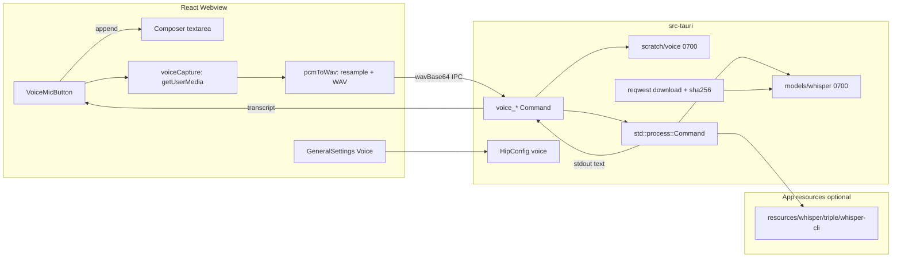
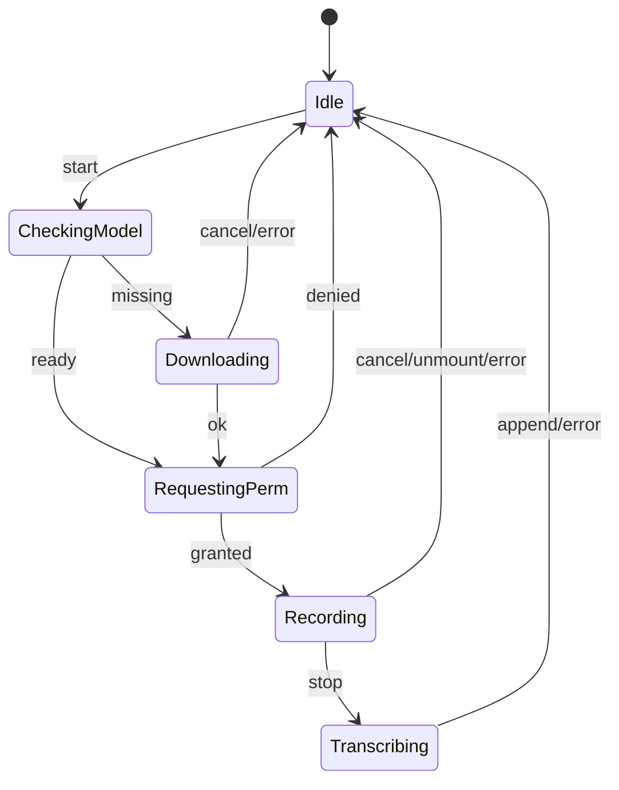

# Design Spec: Composer 语音输入（whisper.cpp）+ 通用设置多输入源

| Field | Value |
|-------|--------|
| **Title** | Composer Voice Input (whisper.cpp) + Multi Input Source |
| **Author** | TBD |
| **Date** | 2026-07-26 |
| **Status** | Reviewed (R2, 0 open issues) — ready for implementation |
| **Audience** | hip core（React UI / Tauri Rust / packaging / protocol） |
| **Related** | [ggml-org/whisper.cpp](https://github.com/ggml-org/whisper.cpp)；`src/components/chat/Composer.tsx`；`src/components/account/GeneralSettings.tsx`；`packages/protocol/src/hip-config.ts`；`src-tauri/src/hip_config.rs`；`docs/examples/hip.toml.example`；`docs/design/composer-execution-mode.md`（文档风格参考） |
| **Code names** | Product: 语音输入 / 听写；engineering: `voice` / `VOICE_INPUT` / `whisper` |
| **Flag** | `VOICE_INPUT` compile-time flag（`src/components/chat/voiceFeature.ts`），first_merge = **false**；hip.toml `[voice].enabled` 为运行时总开关 |

---

## 1. Overview

hip 是本地优先的 Tauri v2 桌面 AI 工作台，当前 Composer（`src/components/chat/Composer.tsx`）仅支持键盘文本与附件，**没有任何麦克风 / ASR 能力**。本方案在 Composer 输入框增加 **语音听写（voice-to-text）**：用户 **toggle** 麦克风录制短句，经 **本机 whisper.cpp** 转写后，将最终文本 **追加** 到现有 textarea，不改变发送/停止/权限等既有语义。

架构要点：

1. **采集**：Webview `getUserMedia` → **AudioWorklet（或 ScriptProcessor 回退）** 取 Float32 PCM → **重采样到 16 kHz mono** → **纯 TS WAV 头编码**（**禁止**把 MediaRecorder 当 v1 编码器）。
2. **转写**：WAV 经 **base64 IPC** 交给 Rust；Rust 落盘 `~/.hip/scratch/voice/` 后用 **`std::process::Command`** 起本机 `whisper-cli`（**不**走 shell plugin / `externalBin`，避免破坏现有打包）。
3. **打包**：二进制放在 **`resources/whisper/`**（可选拷贝）；**永不**写入 `tauri.conf.json` 的 `externalBin`（该数组缺文件会使 Tauri 构建失败，且 `package-macos.sh` 对 sidecar 是硬依赖）。
4. **设置**：`[voice]` 持久化设备 **id + label + groupId**，重启后 **rebinding**；模型按需下载到 `~/.hip/models/whisper/`。

v1 目标：**隐私优先、可离线、短句听写、可测、主构建不依赖 whisper 二进制**。

---

## 2. Background & Motivation

### 2.1 现状（已对照仓库校验）

| 层 | 状态 |
|----|------|
| Composer / InputBar | textarea + send/stop；右侧仅 `TokenUsageChip` + send/stop（`Composer.tsx`） |
| General Settings | 语言 / 主题 / 密度 / 终端 / 回收站 / 窗口托盘；无音频 |
| HipConfig | Protocol 有 `window`/`terminal`/`trash` 等；Rust `hip_config.rs` 有 `terminal`/`window`/`plan`/`acp`/`langsmith`，**无** `voice`（且 Rust 侧仍缺部分 TS 段如 `trash`——`set_hip_config` 重写是已知 footgun） |
| 原生能力 | sidecar spawn、PTY、SSH、dialog、tray、knowledge SQLite；**无** audio crate |
| 仓库检索 | 无 `getUserMedia` / `MediaRecorder` / `whisper` / `microphone` 集成 |
| 打包 | `externalBin: ["binaries/sidecar"]` **仅** sidecar；`package-macos.sh` 要求 `binaries/sidecar-<triple>` 存在后 codesign `--deep` |
| 权限 | `entitlements.plist` 无 microphone；**无** 源码树 `Info.plist` 的 `NSMicrophoneUsageDescription`；`hardenedRuntime: true`（已开）；**未**启用 App Sandbox |
| FS 插件 | **无** `tauri-plugin-fs` / `@tauri-apps/plugin-fs`（Cargo / capabilities / FE 均未依赖） |
| paths | 有 `scratch_dir`；**无** `models_dir` |
| CSP | 无 `media-src`；模型下载走 Rust reqwest → **不改** CSP |

### 2.2 痛点

1. 长 prompt 只能打字；中文/多语言用户期望听写。
2. 本地优先工作台不宜默认云端 ASR。
3. 多麦克风用户需要显式选择输入源。
4. 模型体积大，不能默认塞进主 DMG；二进制打包不能拖垮无语音开发者的日常 `tauri dev` / CI。

### 2.3 外部参考（whisper.cpp）

| 组件 | 用途 |
|------|------|
| `whisper-cli` | 文件转写（**flac / mp3 / ogg / wav**）；v1 主路径，**输入必须是这些格式之一**（webm 不在列表） |
| `whisper-stream` / `whisper-server` | v2 可选 |
| ggml 模型 | tiny / base / small / …（Hugging Face `ggerganov/whisper.cpp`） |
| 加速 | Apple Silicon Metal、CUDA、Vulkan、CPU |
| 典型输入 | **16 kHz mono PCM/WAV** |

---

## 3. Goals & Non-Goals

### Goals（v1）

1. Composer **听写按钮（toggle）** + 快捷键 **`Mod+Shift+M`（仅 toggle，无 hold）**，结果 **append** 到输入框。
2. ASR 主引擎为本机 whisper.cpp CLI；默认 **音频不离机**。
3. Settings → General：**输入设备选择**（系统默认 + 列表 + 刷新），持久化并在重启后 **尽量 rebind 到同一物理设备**（见 §6.4）。
4. 模型首次使用下载（可取消、进度、tiny/base/small）；落盘 `~/.hip/models/whisper/`；支持 **手动放入** 同目录（设置「打开模型目录」）。
5. macOS / Windows 麦克风权限与 **本地处理** 系统提示文案就绪。
6. `VOICE_INPUT = false` first merge；运行时 `[voice].enabled` 可关。
7. i18n：en / zh-CN / zh-TW / ja / ko。
8. 单测 + e2e mock（CI **无**真 mic、**无** HF 下载）。
9. **主 app 构建在缺少 whisper 二进制时仍成功**；仅语音功能降级。

### Non-Goals（v1）

| Non-goal | 说明 |
|----------|------|
| 云端 Whisper 默认路径 | 可选 v1.1 |
| TTS / 语音命令 / 自动发送 | 不做 |
| Streaming partial | v2 |
| 常驻 `whisper-server` | v2 |
| Linux 一等支持 | best-effort |
| Node sidecar 内 ASR | 不做 |
| `MediaRecorder` → webm 再转码 | 不做（无 ffmpeg 捆绑假设） |
| 将 whisper 列入 `externalBin` | **明确不做**（见 D16） |
| 引入 `tauri-plugin-fs` | v1 不做 |

---

## 4. Key Decisions

| # | Decision | Rationale |
|---|----------|-----------|
| **D1** | **ASR = 本机 `whisper-cli` 子进程**（非 FFI、非云端、非 Node sidecar） | 故障隔离；版本可钉；不污染 agent loop |
| **D2** | **采集 = getUserMedia + AudioWorklet/ScriptProcessor PCM → 16 kHz mono → 纯 TS WAV**；**禁止 MediaRecorder 作 v1 编码器** | MediaRecorder 产出 webm/opus，whisper-cli 不支持；hip 无现成转码链 |
| **D3** | **交互 = Toggle only**；快捷键 **`Mod+Shift+M`**；Escape 取消录音。**无 hold 快捷键（v1.1）** | 发现性；避免与 D3/OpenQ 矛盾 |
| **D4** | **final-only** transcript | 文件模式天然 final |
| **D5** | Mic 在 Composer 右侧：`TokenUsageChip` 与 Send 之间 | 与「写入输入」相邻 |
| **D6** | **append** 文本（末尾补空格规则见 §6.5） | 不误清 draft |
| **D7** | 配置段 **`[voice]`** | 避免 speech/TTS 混淆 |
| **D8** | 默认模型 **`base` 多语**；可选 tiny/small；下载前 **磁盘空间预检**（预留 ≥ 文件大小 + 50MB） | 质量/体积平衡 |
| **D9** | 语言默认 **`auto`**；CLI **永远传 `-l`**（省略则 whisper 默认 `en`） | 多语 + 避免静默英文化 |
| **D10** | `VOICE_INPUT = false` first merge | craft 文化 |
| **D11** | 模型不进安装包；HF 下载 + **手动放置** fallback | 体积 + 离线/网络差地区 |
| **D12** | `inputDisabled` → mic 禁用；running 时仍可起草 | 与 locked textarea 一致 |
| **D13** | 临时 WAV 在 `scratch/voice`；**finally 删除**；目录 **0700** | 隐私 |
| **D14** | sidecar 不参与 ASR | 职责分离 |
| **D15** | **编码管线锁定**：AudioWorklet PCM→resample→WAV（见 §6.3.1）；单元测试不依赖 mic | 实现可落地 |
| **D16** | **打包 = `resources/whisper/<triple>/whisper-cli` 可选拷贝 + Rust 路径解析**；**不**使用 `externalBin`；spawn 用 **`std::process::Command`**（绝对路径） | 避免缺文件炸掉 Tauri/package 脚本；不改 shell capabilities |
| **D17** | 设备偏好持久化 **`{ inputDeviceId, inputDeviceLabel, inputDeviceGroupId }`** + rebind 算法 | 兑现「重启后记住」 |
| **D18** | e2e / 排障：`HIP_VOICE_MOCK=1`（**仅 Rust 读**）；FE **不**读 `process.env.HIP_*` | 符合仓库现状 |
| **D19** | command palette：**v1 注册**「开始/停止听写」（`registerComposerHandlers`） | 低成本可达性 |

---

## 5. Alternatives Considered

### 5.1 ASR 运行位置

| 方案 | 结论 |
|------|------|
| **A. 外挂 CLI 子进程（采用）** | 隔离、可钉版本 |
| B. Rust FFI `whisper-rs` | v2 若延迟不达标再评估 |
| C. 云端 API | 非 v1 默认 |

### 5.2 音频采集位置

| 方案 | 优点 | 缺点 | 结论 |
|------|------|------|------|
| **Webview getUserMedia（采用）** | 实现面小；与设备选择同源 | WKWebView 权限/枚举历史上有坑；deviceId 跨重启不稳 | **v1** + rebind + dogfood gate |
| Native cpal | 设备稳 | 新 crate + 权限桥 | **escape hatch**：授权后设备列表仍空 → 记 issue 升级 v1.1 |
| whisper-stream 直接开 mic | 少一层 | 与 Settings 难统一 | 否 |

### 5.3 编码策略

| 方案 | 结论 |
|------|------|
| **AudioWorklet/PCM → 16k WAV（采用）** | 与 whisper 输入契约对齐；纯 TS 可单测 |
| MediaRecorder webm | **拒绝**（格式不兼容，且无捆绑 ffmpeg） |
| MediaRecorder → 本机 ffmpeg | 拒绝（依赖外部 ffmpeg） |

### 5.4 打包策略

| 方案 | 结论 |
|------|------|
| **resources/ 可选目录 + 非 externalBin（采用）** | 缺二进制时 `yarn tauri build` 仍绿 |
| externalBin + 条件 conf 生成 | 可行但易与 sidecar 脚本纠缠；v1 不用 |
| externalBin + stub 二进制 | 增加 codesign 噪音；次选 |
| 总是强制构建 whisper | 拖垮开发者；否 |

### 5.5 实时性

Toggle + shortcut；无 always-on；无 streaming partials（v2）。

---

## 6. Proposed Design

### 6.1 架构总览



### 6.2 端到端时序（start → insert）

```mermaid
sequenceDiagram
  actor User
  participant Mic as VoiceMicButton
  participant Cap as voiceCapture
  participant Enc as pcmToWav
  participant IPC as voice.ts
  participant Rust as voice.rs
  participant Disk as scratch/models
  participant W as whisper-cli

  User->>Mic: toggle start
  Mic->>IPC: voice_model_status / ensure
  alt model missing
    Mic->>User: confirm download dialog
    IPC->>Rust: voice_download_model
    Rust->>Disk: .partial → sha256 → rename
  end
  Mic->>Cap: getUserMedia(constraints)
  Cap->>Cap: AudioWorklet collect Float32
  Note over Mic,Cap: recording UI; tracks live
  User->>Mic: toggle stop / max duration
  Cap->>Enc: frames + inputSampleRate
  Enc->>Enc: mono mix + resample 16k + WAV header
  Enc->>IPC: voice_transcribe({ wavBase64, language, model })
  Note over Enc,IPC: drop JS buffers after invoke resolves
  IPC->>Rust: decode base64 (max 4 MiB)
  Rust->>Disk: write rec-uuid.wav (0700 dir)
  Rust->>W: Command argv -m -f -l -nt -np -t
  W-->>Rust: stdout UTF-8 text
  Rust->>Disk: delete wav (finally)
  Rust-->>IPC: { text, durationMs, audioMs, model }
  IPC-->>Mic: transcript
  Mic->>Mic: appendTranscript; focus textarea
  Note over Cap: finally track.stop() all tracks
```

### 6.3 模块划分

| 模块 | 路径（拟） | 职责 |
|------|------------|------|
| Feature flag | `src/components/chat/voiceFeature.ts` | `VOICE_INPUT = false` |
| PCM capture | `src/domain/voice/voiceCapture.ts` | getUserMedia、AudioWorklet 节点、stop/cancel、`track.stop()` finally |
| WAV encode | `src/domain/voice/pcmToWav.ts` | **纯函数**：downsample + mono + WAV；**无 DOM** |
| Device rebind | `src/domain/voice/resolveInputDevice.ts` | id/label/groupId 匹配算法 |
| Append | `src/domain/voice/appendTranscript.ts` | 纯函数 |
| IPC | `src/ipc/voice.ts` | invoke 封装；**无** plugin-fs |
| UI | `VoiceMicButton.tsx` + `useVoiceDictation.ts` | 状态机、shortcut、palette handler |
| Settings | `VoiceSettingsSection.tsx`（或嵌入 GeneralSettings） | 设备/语言/模型/打开目录/下载进度 |
| Protocol | `hip-config.ts` `VoiceConfig` | 含 label/groupId 字段 |
| Rust | `voice.rs` + `paths.rs` + `hip_config.rs` | spawn、download、config preserve |
| Packaging | `scripts/make-whisper-bin.*` + package 脚本可选步骤 | **不**改 externalBin 默认列表 |
| macOS | **`src-tauri/Info.plist`** | `NSMicrophoneUsageDescription` |
| i18n | `src/i18n/*` | `voice.*` / `settings.voice*` |

**明确不碰**：`packages/sidecar` agent loop、session WS 协议、auth.json、`capabilities` shell allowlist（无需为 whisper 扩 shell）。

### 6.3.1 采集与编码管线（实现契约）

**禁止**：`new MediaRecorder(stream)` 作为 v1 转写输入源。

#### API 形状

```ts
// src/domain/voice/pcmToWav.ts — pure, unit-tested
export const TARGET_SAMPLE_RATE = 16_000

/** Linear-resample interleaved Float32 mono (or average channels) → Int16 LE PCM. */
export function resampleToMono16k(
  input: Float32Array,
  inputSampleRate: number,
  channels: number,
): Int16Array

/** Build RIFF/WAVE bytes: PCM 16-bit mono 16 kHz. */
export function encodeWavPcm16Mono(pcm: Int16Array, sampleRate?: number): Uint8Array

export function wavToBase64(wav: Uint8Array): string
```

```ts
// src/domain/voice/voiceCapture.ts
export type CaptureHandle = {
  stop: () => Promise<{ wavBase64: string; audioMs: number }>
  cancel: () => void // stop tracks, discard frames, no encode
}

export async function startVoiceCapture(opts: {
  deviceId: string | 'default'
  maxDurationSec: number
  onLevel?: (rms: number) => void // optional UI meter
}): Promise<CaptureHandle>
```

#### 运行时步骤

1. `getUserMedia({ audio: deviceId === 'default' ? true : { deviceId: { exact: deviceId } }, video: false })`。  
   - `OverconstrainedError` → toast + 回退 default 一次。
2. `AudioContext`（默认 sampleRate，常见 44.1/48 kHz）+ `MediaStreamSource`。
3. **优先** `audioWorklet.addModule` 加载 inline/blob worklet：每 render quantum post Float32 到主线程 ring buffer。  
   **回退** `ScriptProcessorNode`（若 worklet 在某 WebView 失败）——同样只作 PCM 收集。
4. Stop：断开节点 → **`stream.getTracks().forEach(t => t.stop())`**（**所有错误路径 finally 必做**，避免 macOS 橙点卡住）→ `resampleToMono16k` → `encodeWavPcm16Mono` → base64。
5. 主线程在 `voice_transcribe` settle 后将 `wav`/`base64` 引用置空以便 GC；**永不** `console.log` base64。

#### 单测（无 mic）

- 合成 440 Hz 正弦 @ 48 kHz stereo → 16 k mono；校验 WAV magic `RIFF`/`WAVE`/`fmt `、`sampleRate===16000`、`numChannels===1`、`bitsPerSample===16`、data 长度。
- 已是 16 k mono 的 identity 路径。
- 空 buffer / 过短 audioMs。

### 6.4 多输入源（Settings → General）

#### UI 布局

对齐「左 label+desc / 右 control」：

```
语音输入
用于 Composer 听写的麦克风。
                         [ 系统默认 ▾ ]  [刷新]

识别语言                   [ 自动 ▾ ]
识别模型                   [ Base（推荐）▾ ]
模型状态                   已就绪 | 未下载（约 148 MB）[下载]
                           [打开模型目录]
```

`data-testid`：

- `settings-voice-device` / `settings-voice-device-trigger` / `settings-voice-device-default` / `settings-voice-device-item`
- `settings-voice-language` / `settings-voice-model`
- `settings-voice-refresh-devices`
- `settings-voice-model-status` / `settings-voice-download` / `settings-voice-open-models-dir`
- `settings-voice-permission-hint`（权限拒绝时）

#### 配置形状（设备指纹）

```ts
export interface VoiceConfig {
  enabled?: boolean
  /** "default" | MediaDevices deviceId */
  inputDeviceId?: string
  /** Persisted for rebind across restarts (may be empty if never granted). */
  inputDeviceLabel?: string
  inputDeviceGroupId?: string
  language?: VoiceLanguage
  model?: VoiceModelId
  maxDurationSec?: number
}
```

TOML：

```toml
[voice]
enabled = true
input_device_id = "default"          # alias inputDeviceId
input_device_label = ""
input_device_group_id = ""
language = "auto"
model = "base"
max_duration_sec = 60
```

#### 设备 rebind 算法（v1 必须实现）

```ts
// resolveInputDevice.ts
export function resolveInputDevice(
  preferred: { id?: string; label?: string; groupId?: string },
  devices: VoiceInputDevice[], // current enumerate result
): { deviceId: string; matched: 'id' | 'groupId' | 'label' | 'default'; stale: boolean } {
  if (!preferred.id || preferred.id === 'default') {
    return { deviceId: 'default', matched: 'default', stale: false }
  }
  if (devices.some((d) => d.id === preferred.id)) {
    return { deviceId: preferred.id, matched: 'id', stale: false }
  }
  if (preferred.groupId) {
    const byGroup = devices.find((d) => d.groupId && d.groupId === preferred.groupId)
    if (byGroup) return { deviceId: byGroup.id, matched: 'groupId', stale: true }
  }
  if (preferred.label?.trim()) {
    const exact = devices.find((d) => d.label === preferred.label)
    if (exact) return { deviceId: exact.id, matched: 'label', stale: true }
    const fuzzy = devices.find(
      (d) => d.label && preferred.label &&
        (d.label.includes(preferred.label) || preferred.label.includes(d.label)),
    )
    if (fuzzy) return { deviceId: fuzzy.id, matched: 'label', stale: true }
  }
  return { deviceId: 'default', matched: 'default', stale: true }
}
```

- **stale + matched≠default**：后台 `updateSection('voice', …)` **写回新 id**（保留 label/groupId）；可选轻 toast `voice.deviceRebound`。
- **stale + default**：toast `voice.deviceFallback` **一次/会话**；**不**自动清 label（用户可再插回设备）。
- 用户在设置里**显式**选设备时：同时写入 id + 当前 label + groupId。

#### Settings 打开流程（强制顺序）

1. 若 `VOICE_INPUT`：渲染 Voice 区块（即使 binary 缺失——显示引擎不可用）。
2. **权限 prime（推荐）**：用户点「刷新」或展开设备下拉时：
   - `await navigator.mediaDevices.getUserMedia({ audio: true })` 再立刻 `track.stop()`（仅用于解锁 label）；
   - 失败 → 展示 `settings-voice-permission-hint` + 打开系统设置引导（不阻塞其它 voice 设置项）。
3. `enumerateDevices()` → filter `audioinput`。
4. 空列表 + 已授权：文案「未检测到麦克风」+ cpal escape 提示（仅文档/日志，v1 无 cpal UI）。
5. 应用 `resolveInputDevice` 显示当前选中项。

#### 热插拔

- `navigator.mediaDevices.addEventListener('devicechange', …)` 在 Settings 挂载期刷新列表。
- 录音中 `inactive` / 错误 → cancel、toast `voice.deviceLost`。

#### 原生枚举 escape（v1.1 触发条件）

**Trigger**：macOS/Windows 上 `getUserMedia` 已 granted，但 `enumerateDevices` 音频输入持续为空，或 rebind 在 dogfood 中失败率高。→ 引入 `cpal` + `voice_list_input_devices`。**v1 不实现 cpal**，但在 Risks / dogfood 清单中列为升级条件。

### 6.5 Composer 交互

#### 状态机



#### 按钮

- 位置：`TokenUsageChip` 与 Send/Stop **之间**。
- **直接内嵌**于 `Composer`（`VOICE_INPUT && …`）；**无** `rightExtras` API。
- `data-testid="composer-voice-mic"`；`data-state=idle|recording|transcribing|unavailable`。
- disabled：`inputDisabled` | `voice.enabled===false` | 平台无 mediaDevices。
- binary 缺失：可点 → toast `voice.binaryMissing`（或 `unavailable` + tooltip）。
- running/reconnecting：**不**因 running 禁用（可起草）。

#### 插入规则

```ts
function appendTranscript(prev: string, text: string): string {
  const t = text.trim()
  if (!t) return prev
  if (!prev) return t
  if (/\s$/.test(prev)) return prev + t
  return prev + ' ' + t
}
```

空识别：toast `voice.emptyTranscript`。

#### 快捷键与生命周期

| 快捷键 | 行为 |
|--------|------|
| `Mod+Shift+M` | Toggle 听写 |
| `Escape` | 仅当 `recording`：cancel（不转写）；**不**抢其它 Escape（先检查 recording） |

**Shortcut / start 门禁**（任一为真则忽略）：

- `useCommandPaletteStore` open
- slash palette / file mention palette open（InputBar 既有状态需通过 ref/callback 或轻量 store 暴露给 hook；或 shortcut 仅在 `document.activeElement === textarea` 且无 aria 弹层时）
- `inputDisabled`

**Unmount / session switch**：

- `useEffect` cleanup：`capture.cancel()` → stop tracks → **不**调用 transcribe；丢弃 ring buffer。
- 不在 unmount 路径写 composer。

**Command palette（D19）**：

- 命令 id：`composer.voice.toggle`；调用与 mic 按钮同一 `toggle()`。
- 仅当 `VOICE_INPUT && voice.enabled` 注册。

#### 时长

- 默认 max **60s**（clamp 5–120）；到时 stop→transcribe。
- 最短 **~0.4s**；过短 discard + toast。

### 6.6 模型管理

#### 存储与权限

```
~/.hip/models/whisper/     # create 0700 on Unix
  ggml-tiny.bin
  ggml-base.bin
  ggml-small.bin
  ggml-base.bin.partial    # in-flight
~/.hip/scratch/voice/      # create 0700 on Unix
  rec-<uuid>.wav
```

```rust
// paths.rs — force 0700 like config/run (NOT only those two)
pub fn whisper_models_dir(app: &AppHandle) -> Option<PathBuf> { /* create + 0700 */ }
pub fn voice_scratch_dir(app: &AppHandle) -> Option<PathBuf> { /* create + 0700 */ }
```

启动时：删除 `scratch/voice` 下 mtime > 1h 的残留；删除孤儿 `*.partial`（可选，或仅过期）。

#### 下载契约（PR3 实现清单）

**来源**：Hugging Face 仓库 [`ggerganov/whisper.cpp`](https://huggingface.co/ggerganov/whisper.cpp)（与 upstream `models/download-ggml-model.sh` 一致）。

| model id | 文件名 | 主 URL | 约体积 | 校验 |
|----------|--------|--------|--------|------|
| `tiny` | `ggml-tiny.bin` | `https://huggingface.co/ggerganov/whisper.cpp/resolve/main/ggml-tiny.bin` | ~75 MiB | **SHA-256 全量钉在代码常量**（见下） |
| `base` | `ggml-base.bin` | `…/ggml-base.bin` | ~148 MiB | 同上 |
| `small` | `ggml-small.bin` | `…/ggml-small.bin` | ~466 MiB | 同上 |

**哈希钉扎流程（PR3 必做）**：

1. 实现者在可信网络用 `curl -L` 拉上述 URL，`shasum -a 256` 写入 `src-tauri/src/voice_models.rs` 常量表 `MODEL_SPECS`。
2. 表字段：`id`, `filename`, `urls: &[&str]`（主 HF + 可选镜像，如同 CDN 失败时的 `https://hf-mirror.com/…` **仅当**产品同意；默认只 HF）, `sha256_hex`, `approx_bytes`。
3. **上游 git 短 SHA（README 表）不作唯一校验**——用完整 SHA-256。
4. User-Agent：`hip-voice/1.0 (+https://github.com/…；本地 ASR 模型下载)`。
5. 复用 `marketplace.rs` 的 **reqwest** 模式（流式读 body、错误映射）；单 flight `Mutex` per model id。
6. 流程：磁盘空间预检 → 写 `filename.partial` → 边下边 update progress event → 完成算 sha256 → 不匹配则删 partial 并 `voice.download_hash_mismatch` → 匹配则 **atomic rename** 到最终名 → `ready`。
7. 取消：`voice_cancel_download` 设 flag，删 partial。
8. **手动安装**：用户把正确文件名放进 models 目录 → `voice_model_status` 校验 sha256（可选：仅检查文件存在 + 大小容差；**推荐仍校验 hash**，失败则标 `corrupt`）。
9. Settings：**「打开模型目录」** 用现有 opener（`$HOME/.hip/**` 已允许）——**v1 必做**（关闭原 Open Q2）。

**错误码**：`network` / `hash_mismatch` / `disk_full` / `cancelled` / `http_status`。

> 注：完整 SHA-256 字符串在 PR3 落地时填入；本设计锁定 **流程与 URL 模板**，禁止「运行时信任任意 URL」。

#### 首次听写流程

1. mic → `voice_model_status`。
2. missing → **Composer 确认 Modal**（大小、HF 来源、本地处理、可取消）。
3. 进度：事件 `voice://download-progress`；**Settings 亦常驻显示**同一状态（可从设置页单独下载）。
4. 完成后若用户未离开 idle intent → 自动开始录音。

### 6.7 whisper-cli 调用与二进制解析

#### Spawn API（锁定）

```rust
// voice.rs — NOT app.shell().sidecar
let mut cmd = std::process::Command::new(&bin_path);
cmd.args([
  "-m", model_path,
  "-f", wav_path,
  "-l", lang,           // never omit; use "auto" or explicit
  "-nt",
  "-np",
  "-t", &threads.to_string(),
])
.stdout(Stdio::piped())
.stderr(Stdio::piped())
.current_dir(/* optional */)
.kill_on_drop(true);
// timeout 30s → kill
```

- **解析 stdout**：UTF-8；trim；去掉空行；**不**使用 `-oj`（JSON 旁路文件增加清理面）。
- stderr 仅在 debug 级别记长度/尾部，不默认记全文。
- 并发：全局 `Mutex`；第二请求 → `voice.busy`。
- 超时默认 30s。

**钉扎 CLI 版本**：CI / `make-whisper-bin` 使用固定 git tag/commit（例：`v1.7.5` 或 commit SHA，PR6 写入 `scripts/whisper-version.txt`）。构建选项：

- `aarch64-apple-darwin`：`GGML_METAL=ON`，**尽量静态/少 dylib**；若产生 `@rpath` dylib，必须一并拷入 `resources/whisper/<triple>/` 并 deep-sign。
- Windows：CPU 默认；CUDA 非 v1。

#### 二进制解析顺序（无 externalBin）

1. `HIP_WHISPER_BIN`（绝对路径，dev/测试）
2. `resource_dir/join("whisper").join(target_triple).join("whisper-cli")`（Windows `.exe`）
3. （可选）`resource_dir/join("whisper").join("whisper-cli")` 无 triple 子目录
4. 缺失 → `voice_binary_status.available=false`；**不**失败启动

`target_triple` 在 build 时 `env!("TARGET")` 或 Tauri 等价 API。

#### 与 sidecar 类比

Sidecar 使用 `externalBin` + `scripts/sidecar-launcher` + `resources/hip-sidecar/*`，因 Node 运行时复杂。whisper **若**保持 **单一可执行文件（静态或自带 rpath 相对库）**，则 **不需要** launcher。若 Metal 构建被迫带 dylib，则模仿 sidecar 做 `resources/whisper/<triple>/` 目录布局 + 同目录库，仍 **不**进 `externalBin`。

#### Codesign / notarization

- `package-macos.sh` 在现有 deep sign **之前**，若存在 `resources/whisper/**`，确保可执行 bit + 随 `.app` 一起被 `--deep` 签名。
- 不修改 `entitlements.plist`（无 App Sandbox → 无需 `device.audio-input`）。
- Hardened Runtime **已是 true**（`tauri.conf.json`）；新增二进制须同样兼容（无未声明 JIT 等）。

### 6.8 平台权限

#### macOS（锁定文件）

**新增** `src-tauri/Info.plist`（Tauri v2 会 merge 进生成的 Info.plist）：

```xml
<?xml version="1.0" encoding="UTF-8"?>
<!DOCTYPE plist PUBLIC "-//Apple//DTD PLIST 1.0//EN"
  "http://www.apple.com/DTDs/PropertyList-1.0.dtd">
<plist version="1.0">
<dict>
  <key>NSMicrophoneUsageDescription</key>
  <string>hip uses the microphone for composer dictation. Audio is processed on this Mac with a local speech model and is not uploaded for recognition.</string>
</dict>
</plist>
```

- **禁止**任何「发送到云端 / OpenAI」类措辞（避免与过时 debug bundle 文案一致）。
- 可选：`src-tauri/zh-Hans.lproj/InfoPlist.strings`（及 zh-Hant）覆盖同一 key 的中文系统弹窗。
- Dogfood：卸权限后重装/重置 TCC，确认首次弹窗文案。

#### Windows

- WebView2 宿主权限提示；系统「麦克风隐私」关闭时 toast 引导设置。
- 无需改 entitlements 类文件。

#### CSP

不变；下载不在 webview。

---

## 7. API / Interface Changes

### 7.1 HipConfig（protocol）

见 §6.4 `VoiceConfig`（含 `inputDeviceLabel` / `inputDeviceGroupId`）。

`HipConfig.voice?: VoiceConfig`。

### 7.2 PR1 验收清单（preserve-on-rewrite）

必须全部勾选：

- [ ] TS `VoiceConfig` + `HipConfig.voice`
- [ ] Rust `VoiceConfig`（`#[serde(rename_all = "camelCase")]`）字段与 TS 对齐
- [ ] `TomlVoiceConfig`（snake_case + camelCase alias：`input_device_id` / `inputDeviceId` 等）
- [ ] `TomlHipConfig.voice` + `HipConfig.voice`
- [ ] `From<HipConfig> for TomlHipConfig` **与** `From<TomlHipConfig> for HipConfig` 均映射 `voice`
- [ ] `get_hip_config` 空文件默认结构 **不丢** 其它段；含 `voice: None`
- [ ] `hipConfig.contract.test.ts` round-trip `voice`
- [ ] Rust 单测：写入 `voice` + 已有 `terminal`/`window` → 再读仍在（防 strip）
- [ ] `docs/examples/hip.toml.example` 注释段

> 已知：Rust HipConfig 仍可能 strip 其它仅存在于 TS 的段（如 `trash`）——**voice PR 不扩大修复范围**，但测试必须保证 **voice 自身与 terminal/window 不被互相 strip**。

### 7.3 Tauri commands

| Command | Args | Returns |
|---------|------|---------|
| `voice_runtime_status` | — | `{ mock: bool, binaryAvailable: bool, binaryPath?: string, voiceEnvDisabled: bool }` |
| `voice_model_status` | `{ model?: VoiceModelId }` | `{ model, ready, path?, bytesOnDisk?, corrupt?: bool }` |
| `voice_download_model` | `{ model }` | `{ path }` + progress events |
| `voice_cancel_download` | `{ model }` | `()` |
| `voice_transcribe` | `{ wavBase64: string, language?: string, model?: VoiceModelId }` | `{ text, durationMs, audioMs?, model }` |
| `voice_binary_status` | — | 可并入 runtime_status |
| `voice_open_models_dir` | — | `()` opener |

**删除/不做 v1**：`voice_write_scratch`（FE 路径）、任何 plugin-fs 依赖、`voice_list_input_devices`（除非 escape hatch 触发）。

#### IPC 载荷（锁定）

- **唯一 v1 路径**：`wavBase64`（标准 base64，无 data-URL 前缀）。
- Rust **硬上限**：解码后 **≤ 4 MiB**（60s 16-bit mono 16 kHz ≈ 1.92 MiB raw ≈ 2.56 MiB base64；留余量）。超限 → `voice.payload_too_large`。
- 解码后立即写入 scratch 文件，**drop** `Vec<u8>` base64 缓冲。
- 不在日志中打印 base64 或 transcript 正文。

### 7.4 FE IPC

```ts
export async function voiceTranscribe(args: {
  wavBase64: string
  language?: string
  model?: VoiceModelId
}) {
  return invoke<VoiceTranscriptResult>('voice_transcribe', args)
}

export async function voiceRuntimeStatus() {
  return invoke<VoiceRuntimeStatus>('voice_runtime_status')
}
```

### 7.5 Composer 集成（无 rightExtras）

```tsx
// Composer.tsx — only
{VOICE_INPUT && (
  <VoiceMicButton
    value={value}
    onChange={onChange}
    disabled={locked}
    inputRef={inputRef}
  />
)}
```

`useVoiceDictation` 封装在 `VoiceMicButton` 内部或同文件 hook。

---

## 8. Data Model Changes

- 仅 `hip.toml`；无 DB migration。
- 磁盘模型/scratch 见 §6.6。
- 无 transcript 历史库。

---

## 9. Feature Flag Strategy

```ts
// src/components/chat/voiceFeature.ts
export const VOICE_INPUT = false
```

| 层级 | 行为 |
|------|------|
| `VOICE_INPUT === false` | 无 mic、无 shortcut、Settings Voice **隐藏** |
| flag on && `enabled===false` | Settings 可见；Composer 无 mic |
| 两者 true | 全功能 |
| `HIP_VOICE_MOCK=1` | **仅 Rust**：transcribe 固定返回；不要求二进制/模型 |
| `HIP_VOICE=0` | **仅 Rust**：`voice_runtime_status.voiceEnvDisabled=true`；FE 通过 invoke 得知后隐藏/禁用（**FE 不直接读 env**） |

**e2e**：

- 推荐：**e2e 专用构建** 将 `VOICE_INPUT` 以 Vite define / 测试入口设为 true，**或** 在 e2e 分支临时 true（与 craft bake-in 前测法一致）。
- 运行时始终 `HIP_VOICE_MOCK=1` + 隔离 `HIP_DATA_DIR`。
- **不**声称 FE `process.env.HIP_VOICE`。

Bake-in = PR8 将常量改为 `true`。

---

## 10. Latency & UX Targets

| 指标 | 目标 | 状态 |
|------|------|------|
| ≤3s 音频 E2E @ base | **≤ 2.0s** on **Apple Silicon + Metal 构建** | **目标**；PR6 dogfood **实测后**写入 CHANGELOG；未达标不阻塞功能合并，阻塞「宣传 2s」文案 |
| CPU-only / Intel | ≤ 5s best-effort | 同左 |
| spawn 开销 | 记录 `spawn_ms`；冷启动加载整模属预期 | |
| UI 开始录音 | ≤ 200ms（已授权） | |
| 并发 | 1 transcribe | |

**成功标准 #6** 改为：dogfood **记录** `voice.transcribe_ms`；Metal 包冲击 2s；未达标则列 v1.1 server/FFI。

---

## 11. Packaging & Licensing

### 11.1 二进制（锁定：resources，非 externalBin）

| 项 | 策略 |
|----|------|
| 路径 | `src-tauri/resources/whisper/<target-triple>/whisper-cli` |
| tauri.conf | `bundle.resources` 增加可选 glob，例如仅当目录存在时由 **package 脚本** 拷入；**默认 git 不提交大二进制** |
| externalBin | **保持仅 sidecar**——**永不**添加 whisper |
| 脚本 | `scripts/make-whisper-bin.sh` / `.ps1`；`scripts/whisper-version.txt` 钉 commit |
| package-macos.sh | `HIP_BUNDLE_WHISPER=1` 时调用 make-whisper 并拷贝 resources；**默认 0 不失败** |
| package-windows | 同上 |
| 日常 dev | 无 whisper 亦可 `yarn tauri dev`；语音点 mic → binary missing toast |

### 11.2 许可

- whisper.cpp MIT → `NOTICE`
- 模型：OpenAI Whisper 权重条款 + HF 来源说明（设置「关于模型」+ README）

---

## 12. Security & Privacy Considerations

| 威胁 | 严重度 | 缓解 |
|------|--------|------|
| 音频上传 | 高 | 本地-only ASR；仅模型下载出网 |
| WAV 残留 | 中 | finally 删；启动清扫；**0700** scratch/voice |
| base64 堆驻留 | 中 | invoke 后 drop；Rust 写盘后 drop；**永不 log** |
| transcript 日志 | 中 | 默认只 `chars`/`durationMs`/`model`/`err` |
| 模型 MITM | 中 | HTTPS + **SHA-256** 钉扎 |
| 命令注入 | 中 | argv 数组；路径 jail 在 scratch/models |
| 麦克风指示灯卡住 | 中 | **所有路径** `track.stop()` |
| 目录权限 | 中 | models/whisper 与 scratch/voice **显式 0700**（不同于今日仅 config/run） |
| 超大 IPC | 低 | 4 MiB 解码上限 + 时长上限 |

---

## 13. Observability

**日志行 schema**（Rust `tauri_info!("voice", …)` 风格，字段稳定便于 dogfood grep）：

```
voice event=transcribe_ok audio_ms=2100 infer_ms=850 spawn_ms=120 model=base lang=auto chars=42
voice event=transcribe_err err=timeout audio_ms=3000 model=base
voice event=download_ok model=base bytes=147951465
voice event=device_rebind from=id to=label
```

- 读法：开发者查看 `logs/app.log` 或 macOS 控制台过滤 `voice event=`。
- 无云端 telemetry。
- Toast：仅 error / fallback / empty / binary missing。

---

## 14. i18n

键：`voice.*`、`settings.voice*`（device / language / model / refresh / openModelsDir / permissionHint / deviceRebound / download*）。五语同步 + `translation-keys.test.ts`。

系统 Info.plist 英文默认 + 可选 zh strings（§6.8）。

---

## 15. Test Plan

### 15.1 单元

| 区域 | 内容 |
|------|------|
| `pcmToWav` / `resampleToMono16k` | 合成 PCM、WAV 头、采样率（**无 mic**） |
| `appendTranscript` | 边界 |
| `resolveInputDevice` | id / groupId / label / fuzzy / default |
| `resolveVoiceConfig` | clamp、非法 model |
| `VoiceMicButton` | 状态；disabled；mock hook |
| hipConfig | round-trip voice + preserve terminal |
| Rust voice | stdout trim；payload limit；mock transcribe；path jail；timeout kill |

### 15.2 集成（Vitest）

- mock `voice_transcribe` → append。
- mock `enumerateDevices` + rebind。

### 15.3 e2e

- `HIP_VOICE_MOCK=1`；`VOICE_INPUT=true` 测试构建；无真 mic / 无 HF。
- 用例：mic 可见 → 点击（mock 瞬间结束）→ textarea 含 mock 文本；设置 default 设备与 language 持久化。

### 15.4 手工 dogfood gate（**PR8 入口条件**）

- [ ] macOS 13/14/15：首次 `NSMicrophoneUsageDescription` 为 **本地** 文案
- [ ] 3s 中文短句；记录 `voice event=transcribe_ok` 行
- [ ] USB 麦拔出中断
- [ ] 无 `resources/whisper` 的构建：app 可启动，mic toast binary missing
- [ ] 设备切换 + 重启 rebind
- [ ] Windows WebView2 权限路径
- [ ] 手动放置模型文件可就绪

**cpal 升级触发**：授权后设备列表空（见 §6.4）。

---

## 16. Rollout Plan

| 阶段 | 内容 | 回滚 |
|------|------|------|
| PR1–7 flag false | 代码合入 | git revert |
| 内测包 flag true 临时 + `HIP_BUNDLE_WHISPER=1` | dogfood checklist | 卸包 |
| PR8 bake-in | `VOICE_INPUT=true` | flag false 热修 |

---

## 17. Risks

| 风险 | 严重度 | 缓解 |
|------|--------|------|
| WKWebView getUserMedia 坑 | 中 | Info.plist；dogfood 多版本；cpal escape 条件 |
| deviceId 不稳 | 中 | **D17 rebind** |
| 冷启动整模加载 | 中 | 记 spawn_ms；v2 server |
| 下载网络 | 中 | hash；手动目录；错误码 |
| Metal dylib | 中 | resources 目录布局 + deep sign |
| 2s SLO 乐观 | 低 | 降为 dogfood 目标非硬门禁功能 |

---

## 18. Open Questions

1. ~~hold 快捷键~~ → **否（v1）**；仅 toggle。  
2. ~~打开模型目录~~ → **是（v1）**。  
3. yue/方言进列表？→ v1 仅 `auto|zh|en|ja|ko`。  
4. ~~command palette~~ → **是（v1）** `composer.voice.toggle`。  
5. Linux 一等？→ best-effort。  
6. 是否启用 hf-mirror 等第三方镜像默认列表？→ **默认否**；需要产品/合规确认后再加。

---

## 19. Implementation Anchors

```
packages/protocol/src/hip-config.ts
packages/protocol/src/hipConfig.contract.test.ts
src-tauri/src/hip_config.rs
src-tauri/src/voice.rs
src-tauri/src/voice_models.rs          # URL + sha256 constants
src-tauri/src/paths.rs
src-tauri/src/lib.rs                   # generate_handler voice::*
src-tauri/Info.plist                   # NSMicrophoneUsageDescription ONLY local copy
src-tauri/tauri.conf.json              # resources glob only; NO externalBin whisper
scripts/make-whisper-bin.sh
scripts/whisper-version.txt
scripts/package-macos.sh               # optional HIP_BUNDLE_WHISPER=1
src/ipc/voice.ts
src/domain/voice/pcmToWav.ts
src/domain/voice/voiceCapture.ts
src/domain/voice/resolveInputDevice.ts
src/domain/voice/appendTranscript.ts
src/components/chat/voiceFeature.ts
src/components/chat/VoiceMicButton.tsx
src/components/chat/useVoiceDictation.ts
src/components/chat/Composer.tsx
src/components/account/GeneralSettings.tsx | VoiceSettingsSection.tsx
src/i18n/*.ts
e2e/specs/voice-dictation.spec.ts
```

**不**修改：`capabilities/default.json` shell allowlist（除非未来误用 shell plugin——v1 不用）。

---

## 20. Success Criteria

1. Flag 开 + 模型就绪 + 二进制可用 → Composer 听写 append 成功。  
2. Settings 可选麦；重启后 **经 rebind 算法** 尽量恢复同一物理设备（id 变化时靠 label/groupId）；无法匹配时 fallback default 有提示。  
3. 听写路径音频 **不**经云端 ASR API。  
4. CI 绿：无真 mic、无 HF。  
5. 权限拒绝 / 无二进制 / 设备丢失 / payload 过大 → 可理解反馈。  
6. Dogfood 记录延迟；Metal 包 **争取** ≤2s（非未测先写死的对外 SLA）。  
7. 默认/`HIP_BUNDLE_WHISPER` 未设时，主包装建 **不**因缺 whisper 失败。

---

## 21. References

- [ggml-org/whisper.cpp](https://github.com/ggml-org/whisper.cpp) / [HF ggerganov/whisper.cpp](https://huggingface.co/ggerganov/whisper.cpp)
- hip：`Composer.tsx`、`GeneralSettings.tsx`、`hip-config.ts`、`hip_config.rs`、`paths.rs`、`sidecar.rs`、`marketplace.rs`（reqwest）、`package-macos.sh`、`entitlements.plist`、`tauri.conf.json`（hardenedRuntime）
- craft flags：`craftFeature.ts`、work-items `feature.ts`

---

## PR Plan

### PR1 — Protocol + HipConfig `[voice]`

| 项 | 内容 |
|----|------|
| **Title** | `feat(config): add [voice] section to HipConfig` |
| **Files** | protocol `hip-config.ts`；contract test；`hip_config.rs`（§7.2 清单）；`hip.toml.example` |
| **Deps** | 无 |
| **Desc** | VoiceConfig 含 device label/groupId；双向 From；preserve terminal/window 单测。无 UI/commands。 |

### PR2 — Rust voice skeleton + mock + paths

| 项 | 内容 |
|----|------|
| **Title** | `feat(tauri): voice_transcribe mock + scratch/models paths` |
| **Files** | `voice.rs`；`paths.rs`（0700）；`lib.rs`；`HIP_VOICE_MOCK` / `HIP_VOICE`；`voice_runtime_status` |
| **Deps** | PR1 |
| **Desc** | base64 解码上限；spawn 探测路径但可无二进制；mock 固定文本。无下载、无 packaging。 |

### PR3 — Model download contract

| 项 | 内容 |
|----|------|
| **Title** | `feat(tauri): whisper model download with sha256` |
| **Files** | `voice_models.rs`；download/cancel/progress；marketplace-like reqwest |
| **Deps** | PR2 |
| **Desc** | 完整 URL+sha256 常量；partial→rename；open models dir command；磁盘预检。 |

### PR4 — FE WAV pipeline + mic（flag off）

| 项 | 内容 |
|----|------|
| **Title** | `feat(ui): voice capture PCM→WAV + composer mic (flag off)` |
| **Files** | `pcmToWav.ts`+tests；`voiceCapture.ts`；`VoiceMicButton`；`useVoiceDictation`；`Composer.tsx`；`ipc/voice.ts`；i18n |
| **Deps** | PR2（mock 可跑通） |
| **Desc** | **无 MediaRecorder**；单元测试 WAV；unmount cancel；shortcut 门禁。不依赖真实二进制。 |

### PR5 — Settings 设备 rebind + 语言/模型

| 项 | 内容 |
|----|------|
| **Title** | `feat(settings): voice device rebind + language/model` |
| **Files** | `VoiceSettingsSection` / GeneralSettings；`resolveInputDevice`+tests；open models dir UI；download 进度 |
| **Deps** | PR1；PR3（下载 UI）；与 PR4 可部分并行 |
| **Desc** | 权限 prime；空列表 UX；binary missing 提示。 |

### PR6a — Info.plist + binary resolve（无 CI 矩阵）

| 项 | 内容 |
|----|------|
| **Title** | `feat(tauri): mic usage plist + whisper resources path resolve` |
| **Files** | **`src-tauri/Info.plist`** 本地文案；`voice.rs` 路径解析；文档 |
| **Deps** | PR2 |
| **Desc** | 无 externalBin 变更；无强制二进制。Windows 隐私说明 README。 |

### PR6b — Optional whisper build/package scripts

| 项 | 内容 |
|----|------|
| **Title** | `build: optional whisper-cli resources + package-macos hook` |
| **Files** | `make-whisper-bin.*`；`whisper-version.txt`；`package-macos.sh` `HIP_BUNDLE_WHISPER`；codesign 说明；NOTICE |
| **Deps** | PR6a |
| **Desc** | 默认不构建 whisper；CI 可选 job 产出 artifact。钉 commit；Metal aarch64。 |

### PR7 — e2e mock

| 项 | 内容 |
|----|------|
| **Title** | `test(e2e): voice dictation with HIP_VOICE_MOCK` |
| **Files** | e2e specs/helpers；VOICE_INPUT test build 说明 |
| **Deps** | PR4、PR5、PR2 |
| **Desc** | CI 无 mic/HF。 |

### PR8 — Bake-in

| 项 | 内容 |
|----|------|
| **Title** | `feat(voice): enable VOICE_INPUT by default` |
| **Files** | `voiceFeature.ts`；CHANGELOG；README |
| **Deps** | PR3–PR7 + **§15.4 dogfood checklist 全绿** + PR6b 至少 aarch64 内测包 |
| **Desc** | 唯一 bake-in；回滚 flag false。 |

**合并节奏**：PR1 → PR2 →（PR3 ∥ PR4 ∥ PR6a）→ PR5 → PR6b → PR7 → dogfood → PR8。

---

## Out-of-scope follow-ups（v1.1+）

- `whisper-server` / streaming partials  
- cpal 枚举与采集（escape 触发后）  
- hold 快捷键  
- 云端 ASR fallback  
- 光标处插入  
- 自定义快捷键  
- medium/large / Core ML  
- agent tool `transcribe_audio`  
- Linux CI 矩阵  
- `tauri-plugin-fs` 流式写盘  
