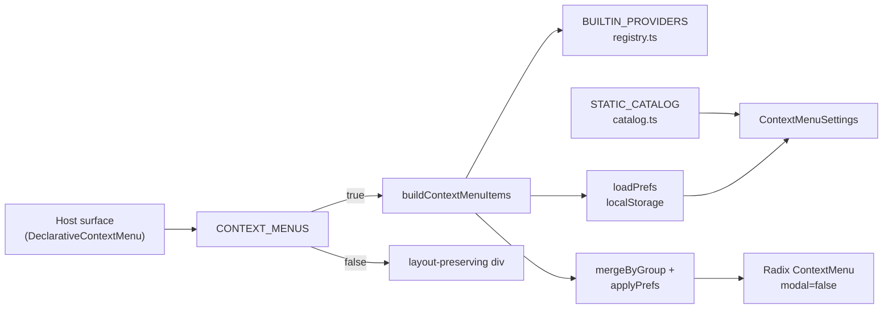
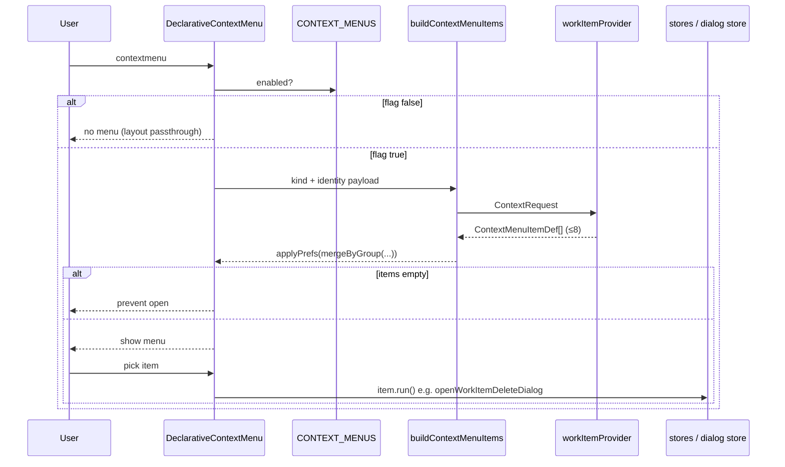
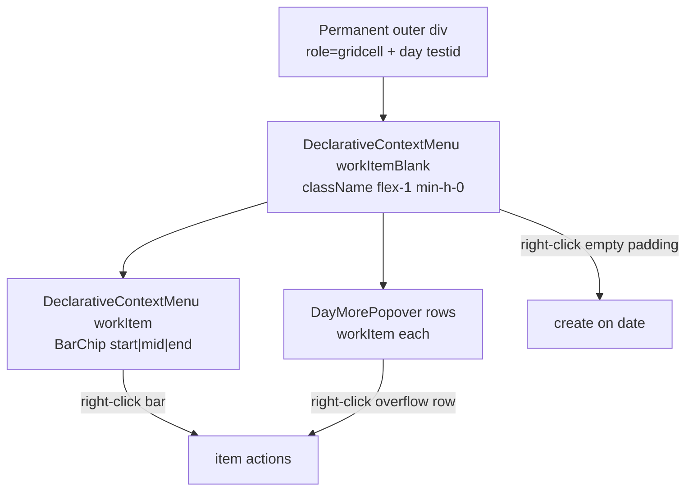
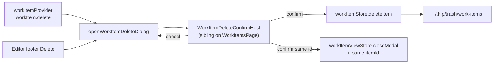

# Full-app right-click context menu system — UX-first completion plan

| Field | Value |
|-------|-------|
| **Title** | Full-app right-click context menu system (UX-first completion) |
| **Author** | TBD |
| **Date** | 2026-07-26 |
| **Status** | Accepted (R3) — P0 implementation landed on `dev` (PR1–PR5 combined) |
| **Audience** | hip product / frontend / e2e maintainers |
| **Related** | `src/components/context-menu/*`; `src/components/context-menu/README.md`; `docs/design/work-items-calendar-list.md`; e2e `context-menu-*.spec.ts` |
| **Code names** | Context menus; `CONTEXT_MENUS`; `ContextKind` / `DeclarativeContextMenu` |
| **Flag** | `CONTEXT_MENUS` in `src/components/context-menu/feature.ts` (currently `true`). No secondary cutover flag — new surfaces ship under the existing flag. Rollback = set flag `false` or git revert of surface PRs. |

---

## Overview

Hip already has a **registry-driven** right-click system: hosts wrap objects with `DeclarativeContextMenu` (or `ControlledContextMenu` for point-anchored cases), providers in `providers/*` emit items, `buildContextMenuItems` merges by group and applies prefs, and Settings (`ContextMenuSettings`) lets users hide/reorder catalogued actions. Many high-value surfaces are wired (chat messages, code blocks, artifact files/diffs/tools/terminals, history, knowledge tree, settings agent/skill/MCP cards).

This document plans **completion of remaining high-UX-value gaps** without redesigning the framework: Work Items, Recycle Bin, plugin card host wiring, Settings kind list completeness, the missing `agent` group in `GROUP_ORDER`, optional reserved kinds (`chatEmpty`, `artifactChrome`), and later polish (knowledge doc chrome, conversation outline). Success = right-click on every primary **object** yields 3–8 high-value actions with kebab/button parity, empty menus never open, and Settings reflects every shipped kind.

---

## Background & Motivation

### Current architecture (shipped — reuse only)



| Layer | Location | Behavior today |
|-------|----------|----------------|
| Flag | `feature.ts` | `CONTEXT_MENUS = true`; hosts no-op open when false; layout `className` still applied |
| Host | `DeclarativeContextMenu.tsx` | Builds items on open; **refuses empty menus**; always `modal={false}` |
| Controlled | `ControlledContextMenu.tsx` | Point-anchored (xterm canvas) |
| Registry | `registry.ts` | `BUILTIN_PROVIDERS` flatMap → `mergeByGroup` → `applyPrefs` |
| Types | `types.ts` | `ContextKind`, `ContextPayloadMap`, `ContextGroupId`, prefs v1 |
| Catalog | `catalog.ts` | Static meta for Settings hide/reorder |
| Groups | `groupOrder.ts` | `GROUP_ORDER` ranks separators; **missing `agent`** (used by `diffHunk` / `terminal.sendSelectionToChat`) |
| Prefs | `prefs.ts` | `hip.contextMenu.prefs.v1` in localStorage |
| Settings | `ContextMenuSettings.tsx` | `KIND_SECTION_ORDER` incomplete vs catalog (knowledge*, managedTerminal, sftp, termFs absent) |
| Nesting | `nesting.test.tsx` | Innermost host wins |
| E2E | `e2e/helpers/context-menu.ts`, `context-menu-*.spec.ts` | Synthesised right-click; item ids via `data-testid` |

### Existing `ContextKind` inventory (verified)

| Kind | Provider | Catalog | Host wired |
|------|----------|---------|------------|
| `message` | yes | yes | `MessageBubble` |
| `codeBlock` | yes | yes | `CodeBlock` |
| `sessionHistory` | yes | yes | sidebar + `SessionHistory` |
| `worktree` | yes | yes | sidebar |
| `fileEntry` | yes | yes | `FileTree` |
| `filePreview` | yes | yes | `FilePreview` |
| `toolCall` | yes | yes | `ToolCallRow` |
| `subAgent` | yes | yes | `SubAgentCard` |
| `diffFile` / `diffHunk` | yes | yes | `DiffDisplay` |
| `checkpoint` | yes | yes | `TimelineView` |
| `commit` | yes | yes | `ChangesView` |
| `terminal` | yes | yes | `TerminalView` + `XtermSurface` (controlled) |
| `managedTerminal` | yes | yes | `ManagedTerminalSession` |
| `sftpEntry` / `termFsEntry` | yes | yes | `TerminalFileTree` |
| `agentConfig` / `skillConfig` / `mcpServer` | yes | yes | Agent / Skill / MCP cards |
| `plugin` | **yes** | **yes** | **NO host** — `PluginCard` / `MarketPluginCard` not wrapped |
| `knowledgeNode` / `knowledgeSpace` / `knowledgeTree` | yes | yes | SpaceTree / sidebar / workspace blank |
| `chatEmpty` | **no** | **no** | reserved in types only (tests use as dummy kind) |
| `artifactChrome` | **no** | **no** | reserved in types only |

### Gaps (high UX value — verified in code)

1. **Work Items** (`activeView: 'tasks'`) — `src/components/work-items/*` has calendar bars, list rows, day cells; **zero** `DeclarativeContextMenu`. Domain actions live in `workItemStore` (`complete` / `reopen` / `setStatus` / `cancel` / `archive` / `unarchive` / `deleteItem`) and modal bus `workItemViewStore.requestEdit` / `requestCreate`. Soft-delete confirm today is **only** inside `WorkItemEditorModal`.
2. **Recycle bin** (`RecycleBinPage.tsx`) — restore + hard-delete exist as **buttons**; no context menu on `recycle-bin-row`.
3. **Plugin cards** — `pluginProvider` + catalog `plugin.uninstall` exist; `PluginCard` / `MarketPluginCard` in `PluginConfigView.tsx` are plain divs with buttons only.
4. **`chatEmpty`** — typed (`{ sessionId: string | null }`); no provider/catalog/host.
5. **`artifactChrome`** — typed (`{ tab: string }`); low value; tab chrome already has buttons.
6. **Knowledge doc canvas** — tree has menus; `KnowledgeDocCanvas` / `InlineDocTitle` / `DocEditor` (CodeMirror) have no doc-level or selection menus.
7. **ConversationOutline** — click-to-jump only (`jumpToTranscriptMessage`).
8. **Settings `KIND_SECTION_ORDER` / `KIND_LABEL_KEY`** — missing `managedTerminal`, `sftpEntry`, `termFsEntry`, `knowledgeNode`, `knowledgeSpace`, `knowledgeTree` (catalog already has items; they appear as unordered extras via `catalogKinds()` fallback).
9. **`GROUP_ORDER` missing `agent`** — `diffHunk.annotate`, `diffHunk.quoteToComposer`, `terminal.sendSelectionToChat` use `group: 'agent'`; unknown groups rank as `GROUP_ORDER.length` (after `danger` / `extensions`). Works by accident for sparse menus; wrong for Settings baseline and multi-group menus.

### Pain points

- Users right-click Work Items / Trash and get **nothing** (or OS menu if not consumed — host docs note empty open still consumes browser `contextmenu` only when a host is present).
- Plugin uninstall is discoverable only via card footer button; inconsistent with Agent/Skill/MCP.
- Settings hide/reorder UX is incomplete for kinds already shipping in production.
- `agent` group rank is unstable relative to intentional taxonomy.

---

## Goals & Non-Goals

### Goals

1. **Object-first menus** on every primary object the user can click: work items (list + calendar), trash rows, installed plugin cards; keep existing surfaces green.
2. **Framework reuse only** — new kinds = types + payload + provider + catalog + host wrap; no new menu UI library.
3. **Parity** with existing buttons/modals/store methods (same confirm dialogs where destructive).
4. **3–8 high-value actions** per object (hard cap 8 via § Overflow policy); cold / rare actions stay in command palette or existing modals.
5. **Danger last**; destructive actions require confirm (Modal / existing dialog store).
6. **Empty menus must not open** (existing host guarantee).
7. Settings `KIND_SECTION_ORDER` + i18n kind labels cover **all catalogued kinds**.
8. `GROUP_ORDER` includes `agent` in a stable, intentional position.
9. Unit tests per provider + host wiring tests; e2e smoke for new P0 surfaces.
10. Rollout remains gated by `CONTEXT_MENUS` only.

### Non-Goals (explicit)

| Non-goal | Notes |
|----------|-------|
| Redesign registry / prefs schema | Prefs stay v1 (`disabledIds` + `orderByKind`) |
| Third-party / untrusted plugin UI provider registration | README + D-rule: in-app extras only |
| Titlebar / window chrome menus | Explicit non-target |
| CodeMirror selection menus (knowledge source editor) | P2 research; editor owns native context events |
| Full command-palette duplication | Menus are shortcuts to object actions, not a second palette |
| Multi-select bulk context menus | Trash empty-all stays toolbar; no multi-row selection menus in v1 |
| Drag-and-drop replacing menus | Orthogonal |
| Implementing every reserved kind at once | `knowledgeDoc` / outline = later phase |
| **`artifactChrome` host** | Reserved type only; **deferred / won’t** for this plan (D14). No provider, catalog, or host. |
| Changing soft-delete retention / trash IPC | Reuse existing restore / hard-delete paths |
| Hiding kebab/hover buttons when menus exist | Buttons stay for discoverability (settings list pattern) |
| Work-item **link CRUD** / links editor UI | Domain `item.links` may be populated offline or later UI; this plan only **navigates when already set**. No link editor in menus. |
| Genericize `trash.deleteForeverBody` i18n | Pre-existing session-centric copy inherited by menu path; optional follow-up, not required here |

---

## Key Decisions

| # | Decision | Rationale |
|---|----------|-----------|
| D1 | **Do not redesign the context-menu framework** | Shipped system is sound; gaps are missing kinds/hosts. |
| D2 | **Right-click targets objects, not pages**; nesting = innermost only | Matches `nesting.test.tsx` and product UX principles. |
| D3 | **3–8 actions per object**; cold items stay in palette/modal** | Avoid kitchen-sink menus. |
| D4 | **Handler parity**: providers call the same store/dialog paths as buttons | No forked delete/restore semantics. |
| D5 | **Danger group last**; destructive → confirm Modal (or existing dialog store) | Soft-delete work items need confirm (today only in editor modal); hard-delete trash already has Modal. |
| D6 | **Empty menus must not open** | Existing `DeclarativeContextMenu` contract; hosts only wrap nodes that can produce items. |
| D7 | **No third-party UI provider registration in v1** | README rule; builtins stay in `BUILTIN_PROVIDERS`. |
| D8 | **No titlebar / window chrome menus** | Drag region + OS conventions. |
| D9 | **NEW kind `workItem`** for calendar bars + list rows | Distinct domain object; not a generic list row. |
| D10 | **NEW kind `workItemBlank`** (or payload-gated `workItem` blank) for day cell / list empty create | Blank area create with optional date; keep item menus pure. Prefer **separate kind** `workItemBlank` so Settings can hide create without hiding item actions. |
| D11 | **NEW kind `trashEntry`** with unified payload across session / knowledge / workItem sources | Mirrors `RecycleBinPage` `UnifiedRow`; host passes source-specific restore/hard-delete callbacks (settings-list pattern). |
| D12 | **Wire `plugin` on installed cards with view + uninstall** | Custom `PluginCard`: `onView` + `onUninstall` (skillConfig parity). Market cards only when `downloadState === 'downloaded'` (uninstall; view only if a detail path exists). Undownloaded: **no menu**. |
| D13 | **`chatEmpty` is optional P1** — skip P0 | If revived: `insertComposerText` / `hasComposerInserter` from `composerBridge.ts`; never wrap composer inputs. |
| D14 | **`artifactChrome` — reserved type only; no provider/host** | Low value; panel tabs already clickable. Deferred/won’t for this plan (Non-Goals). Later cleanup may delete the type when tests no longer use it as a dummy kind. |
| D15 | **Add `'agent'` to `GROUP_ORDER` after `clipboard` and to the named `ContextGroupId` union** | Intentional rank for annotate/quote/send-to-chat; avoids stringly groups. Clipboard-before-agent preserved. PR1 asserts Settings baseline order. |
| D16 | **Sync `KIND_SECTION_ORDER` + `KIND_LABEL_KEY` + i18n to all catalog kinds** | Including knowledge*, managedTerminal, sftp, termFs, and new kinds as they ship. |
| D17 | **Soft-delete confirm = dialog-store path (sessionHistory pattern)** | Provider `workItem.delete` → `openWorkItemDeleteDialog(itemId, title)` only. **No `onSoftDelete` payload callback.** Page-level `WorkItemDeleteConfirmHost` mounts the Modal (sibling of editor, not nested). Editor footer opens the same store. Confirm closes editor if it was open for that id (see § Soft-delete). |
| D18 | **Status/archive matrix + hard cap ≤8** | See § Status-transition matrix and § Overflow policy. Hide complete/setInProgress when `cancelled`; hide cancel when `done`. **Drop order locked (R3):** `cancel` → `setInProgress` → url → knowledge → session → archive (core-4 never). |
| D19 | **Link navigation only when `item.links.*` already set; exact APIs** | Session: `void selectSessionFromSidebar(id)`. Knowledge: leave tasks → knowledge view → `openSpace(spaceId, { selectDocId })`. URL: `@tauri-apps/plugin-opener` `open` with `window.open` fallback (no shared `openExternalUrl` exists today — local helper in provider is fine). **No link CRUD in this plan** (editor has no links UI today). |
| D20 | **knowledgeDoc + outline = Phase 2+** | Tree already covers rename/delete/reveal; doc canvas is polish. |
| D21 | **Ship under existing `CONTEXT_MENUS`** | No secondary flag. Feature-off still layout-safe. Shared `types`/`catalog`/`registry` changes are serialized via PR3.5 (see PR Plan). |
| D22 | **Host layout pattern**: outer permanent chrome, inner `DeclarativeContextMenu` with flex classes | Matches AgentCard / SessionHistory so `CONTEXT_MENUS=false` does not collapse layout. |
| D23 | **i18n**: reuse domain keys where labels already exist (`workItems.actions.*`, `trash.*`, `settings.plugins.*`); add `contextMenu.<kind>.*` only when no stable product string | Settings catalog prefers `labelKey` that Settings already translates. |
| D24 | **E2E**: extend helpers; new smoke cases for workItem + trashEntry; plugin optional if settings already hard | Follow `openContextMenu` + `contextMenuKindSelector` patterns. |
| D25 | **Calendar hosts: day outer / bar inner; mid·end bars same menu; DayMorePopover rows are P0** | a11y/testid on permanent outer day chrome; menu wrappers do not steal `role="gridcell"` / day testid. |

---

## Proposed Design

### High-level flow (unchanged runtime)



### Per-surface menus

#### 1. Work Items — kind `workItem`

**Hosts**

| Surface | File | Target node | testid / attrs |
|---------|------|-------------|----------------|
| List row | `WorkItemListView.tsx` | permanent outer row chrome; menu as flex fill | keep `work-item-row-{id}` on outer |
| Calendar day cell | `WorkItemMonthCalendar.tsx` | permanent outer `role="gridcell"` chrome; **inner** `DeclarativeContextMenu kind="workItemBlank"` fills cell | keep `data-testid="work-item-day-{ymd}"` + `role="gridcell"` + `data-date` on **outer** (not on menu wrapper) |
| Calendar bar (start / mid / end) | `BarChip` | wrap each bar button; **same menu for mid/end** (do not special-case `showTitle`) | existing `work-item-bar-{id}` on every segment |
| Day overflow list | `DayMorePopover` rows | **P0** wrap each unique item row | add `data-testid="work-item-day-more-item-{id}"` |

**Payload** (identity-only — provider imports stores/dialogs like `sessionHistoryProvider`):

```ts
// types.ts — ContextPayloadMap.workItem
workItem: {
  itemId: string
  title: string
  status: WorkItemStatus
  archived: boolean // archivedAt != null
  /** Present only for navigation items; usually empty — no link editor UI today */
  links: WorkItemLinks
}
```

**Canonical `run()` paths (locked — D17 / D19):**

| Action | Implementation |
|--------|----------------|
| open | `useWorkItemViewStore.getState().requestEdit(itemId)` |
| complete / reopen / setInProgress / cancel | `useWorkItemStore.getState().complete\|reopen\|setStatus\|cancel(itemId)` |
| archive / unarchive | `useWorkItemStore.getState().archive\|unarchive(itemId)` |
| **delete** | `openWorkItemDeleteDialog(itemId, title)` — **never** `deleteItem` directly |
| copyTitle | `void ctx.copyText(title)` |
| openSession | `void selectSessionFromSidebar(links.sessionId!)` (`sidebarActions.ts` — leaves special views / selects session) |
| openKnowledge | See exact sequence below |
| openUrl | local helper: `import { open } from '@tauri-apps/plugin-opener'` then `open(url).catch(() => window.open(url, '_blank', 'noopener,noreferrer'))` — **no** shared `openExternalUrl` export exists (only private copies in `PluginConfigView` / SearchSources) |

**Knowledge open sequence** (provider or thin helper under `work-items/`):

```ts
// Mirrors openSpaceFromSidebar + selectDocId (sidebarActions only opens space id today).
async function openWorkItemKnowledgeLink(spaceId: string, docId: string): Promise<void> {
  if (useUiStore.getState().activeView === 'tasks') {
    await leaveWorkItems()
  }
  useUiStore.getState().openKnowledgeView()
  useUiStore.getState().setSidebarSection('knowledge')
  const kb = useKnowledgeStore.getState()
  if (!kb.loaded) await kb.loadSpaces()
  await useKnowledgeStore.getState().openSpace(spaceId, { selectDocId: docId })
}
```

**Note:** `WorkItemEditorModal` / list views currently have **no links UI**. Navigation items appear only when `item.links.*` is already populated (manual catalog edit, future UI, or future features). This plan does **not** add link CRUD.

##### Status-transition matrix (D18)

Visible status/archive items by current state (`✓` = show). Always also: `open`, `copyTitle`, `delete` (not shown in matrix).

| status \\ field | complete | reopen | setInProgress | cancel | archive | unarchive |
|-----------------|----------|--------|---------------|--------|---------|-----------|
| `todo` (not archived) | ✓ | | ✓ | ✓ | ✓ | |
| `in_progress` (not archived) | ✓ | | | ✓ | ✓ | |
| `done` (not archived) | | ✓ | | | ✓ | |
| `cancelled` (not archived) | | | | | ✓ | |
| any + **archived** | (same as status row for complete/reopen/…) | | | | | ✓ (instead of archive) |

Rules locked for menus (stricter than raw store transitions):

- **complete XOR reopen** — reopen only when `status === 'done'`; complete only when `status` is `todo` or `in_progress` (not `done`, not `cancelled`).
- **setInProgress** only when `status === 'todo'` (not when cancelled or done).
- **cancel** only when `status` is `todo` or `in_progress` (hide for `done` and `cancelled`).
- **archive XOR unarchive** from `archivedAt`.
- Cancelled items: **reopen path** is out of menu scope (user can open editor to change status). Store may still allow more transitions; menu does not surface them.

##### Overflow policy (hard cap ≤8 — D18 / Goal 4)

**Single locked rule (R3):** build candidates in band order, then drop non-core items until length ≤ 8. **Core-4 never drops.** Prefer keeping navigation links over status extras (`setInProgress` / `cancel`) when over cap — status extras are also available via the editor; links are the rare discoverability win.

**Build order (append only if eligible):**

1. **Core-4 (always):** `open`, complete|reopen (one), `copyTitle`, `delete`
2. **Status band:** `setInProgress` (if eligible), `cancel` (if eligible), archive|unarchive (one)
3. **Nav band (fixed order):** `openSession` → `openKnowledge` → `openUrl` (only if link present)

**Drop order among non-core** (first removed → last removed; stop when length ≤ 8):

```
cancel → setInProgress → openUrl → openKnowledge → openSession → archive|unarchive
// core-4 never appears in this list
```

Equivalent algorithm:

```
candidates = [open, complete|reopen, copyTitle, delete]           // core-4
append eligible setInProgress, cancel, archive|unarchive          // status band
append present links in order session, knowledge, url            // nav band
DROP_ORDER = [cancel, setInProgress, openUrl, openKnowledge, openSession, archive|unarchive]
while candidates.length > 8:
  remove the first id in DROP_ORDER that is still in candidates
```

**Worked example — `todo`, not archived, all 3 links (10 candidates → 8):**

Candidates before drop:  
`open, complete, copyTitle, delete, setInProgress, cancel, archive, openSession, openKnowledge, openUrl`

Drops: `cancel`, then `setInProgress` (status-first per DROP_ORDER).

**Golden menu ids (provider unit test must lock this array, any group order after mergeByGroup):**

```ts
[
  'workItem.open',
  'workItem.complete',
  'workItem.copyTitle',
  'workItem.delete',
  'workItem.archive',
  'workItem.openSession',
  'workItem.openKnowledge',
  'workItem.openUrl',
]
// length === 8; no setInProgress; no cancel
```

**Expected counts (consistent with DROP_ORDER only):**

| Case | Count | Resulting ids (logical; mergeByGroup may reorder groups) |
|------|-------|----------------------------------------------------------|
| Common open todo, no links | 7 | open, complete, setInProgress, cancel, archive, copyTitle, delete |
| done, no links | 5 | open, reopen, archive, copyTitle, delete |
| cancelled, no links | 4 | open, archive, copyTitle, delete |
| todo + all 3 links | **8** | open, complete, copyTitle, delete, **archive**, openSession, openKnowledge, openUrl |

No alternate “prefer nav first / drop status last” prose. If product later wants the opposite, change **only** `DROP_ORDER` and the golden array together.
**Items reference table**

| id | Group | When (see matrix + overflow) | Action |
|----|-------|------------------------------|--------|
| `workItem.open` | primary | always (core) | `requestEdit` |
| `workItem.complete` | primary | todo \| in_progress | `complete` |
| `workItem.reopen` | primary | done | `reopen` |
| `workItem.setInProgress` | edit | todo only; may drop under cap | `setStatus('in_progress')` |
| `workItem.cancel` | edit | todo \| in_progress; may drop under cap | `cancel` |
| `workItem.archive` | edit | !archived | `archive` |
| `workItem.unarchive` | edit | archived | `unarchive` |
| `workItem.openSession` | navigation | `links.sessionId`; may drop under cap | `selectSessionFromSidebar` |
| `workItem.openKnowledge` | navigation | `links.knowledge`; may drop under cap | knowledge sequence above |
| `workItem.openUrl` | navigation | `links.url`; may drop under cap | opener + fallback |
| `workItem.copyTitle` | clipboard | always (core) | `ctx.copyText` |
| `workItem.delete` | danger | always (core) | `openWorkItemDeleteDialog` |

##### Blank create — kind `workItemBlank`

```ts
// types.ts — ContextPayloadMap.workItemBlank
workItemBlank: {
  /** Local YYYY-MM-DD; omit either to mean "today" after normalize */
  startOn?: string
  endOn?: string
}
```

Provider normalizes missing dates with `localTodayYmd()` (same as day-add / double-click). Then:

`useWorkItemViewStore.getState().requestCreate({ startOn, endOn })`.

| Host | Payload |
|------|---------|
| Day cell (inner menu) | `{ startOn: cell.ymd, endOn: cell.ymd }` |
| List empty state (optional) | `{}` → today–today |

Items:

| id | Group | Action |
|----|-------|--------|
| `workItemBlank.create` | primary | `requestCreate` after date normalize |

Double-click day already creates — menu is discoverability parity. Do **not** wrap the entire calendar grid.

##### Calendar nesting (D25)



`DeclarativeContextMenu` always inserts a wrapper `div`. Therefore:

1. Keep **a11y + day testids on the permanent outer** (AgentCard pattern).
2. Put layout/flex classes on the menu host `className`.
3. Innermost bar/overflow host wins over day blank (existing nesting contract).

##### Soft-delete confirm (canonical — D17)

Align with `sessionMenuDialogStore` / `SessionMenuDialogHost`:

| Piece | Location |
|-------|----------|
| Store | `src/components/work-items/workItemDeleteDialogStore.ts` — `openWorkItemDeleteDialog(itemId, title)`, `closeWorkItemDeleteDialog()`, `useWorkItemDeleteDialog()` |
| Host Modal | `WorkItemDeleteConfirmHost` mounted on **`WorkItemsPage` as a sibling** of `WorkItemEditorModal` (not nested inside the editor). Same idea as `SessionMenuDialogHost` on `AppLayout`. |
| Menu | `workItemProvider` → `openWorkItemDeleteDialog(itemId, title)` |
| Editor | Footer Delete button → same `openWorkItemDeleteDialog` (remove local `deleteOpen` state) |

**After confirm:**

1. `await useWorkItemStore.getState().deleteItem(itemId)`.
2. `closeWorkItemDeleteDialog()`.
3. If `workItemViewStore` editor is open for the **same** `itemId`, `closeModal()` so the form does not linger on a deleted id (store already closes when edit target vanishes; host should still close dialog + rely on that effect — **explicitly call `closeModal()` on confirm** for snappy UX).
4. If editor was open for a **different** id, leave it open.
5. Menu-only delete (editor closed): no editor work.
6. Optional toast; do not force trash navigation.

**Modal stacking (PR3 manual QA):** editor open → Delete → confirm dialog usable (focus trap) → Cancel returns to editor; Confirm closes confirm **and** editor when same id. Prefer sibling host with default Modal z-index stacking (second open on top). Body copy: `t('workItems.deleteConfirm')`.

#### 2. Recycle bin — kind `trashEntry`

**Host:** `RecycleBinPage.tsx` row (`data-testid="recycle-bin-row"`).

**Payload:**

```ts
trashEntry: {
  key: string // e.g. session:id / knowledge:id / workItem:id
  source: 'session' | 'knowledge' | 'workItem'
  id: string
  title: string
  onRestore: () => void
  onHardDelete: () => void // opens existing hard-delete Modal via setHardDeleteKey
}
```

**Items:**

| id | Group | Action |
|----|-------|--------|
| `trashEntry.restore` | primary | `onRestore` (same branch logic as restore button) |
| `trashEntry.copyTitle` | clipboard | `ctx.copyText(title)` |
| `trashEntry.deleteForever` | danger | `onHardDelete` → existing confirm Modal |

Keep toolbar “Empty recycle bin” as page-level only (not a row menu).

#### 3. Plugin cards — existing kind `plugin` (D12)

**Host:** `PluginCard` in `PluginConfigView.tsx` (custom/local plugins) — **PR2 includes view + uninstall**.

```tsx
// Pattern mirrors AgentCard / skillConfig
<div data-testid="plugin-card" className={marketCardShell}>
  <DeclarativeContextMenu
    kind="plugin"
    payload={{
      pluginId: plugin.id,
      onView: () => onView(plugin),
      onUninstall: onDelete,
    }}
    className="flex h-full min-h-0 flex-1 flex-col"
  >
    {/* existing card body — View + Uninstall buttons stay for discoverability */}
  </DeclarativeContextMenu>
</div>
```

**Payload + provider (extend in PR2):**

```ts
plugin: {
  pluginId: string
  onUninstall: () => void
  onView?: () => void // present on custom PluginCard
}
```

| id | Group | When | Action |
|----|-------|------|--------|
| `plugin.view` | primary | `onView` provided | `onView()` |
| `plugin.uninstall` | danger | always | `onUninstall()` |

Catalog: add `{ id: 'plugin.view', labelKey: 'settings.plugins.view', kind: 'plugin', group: 'primary' }`.

**Market downloaded cards:** wrap with uninstall only (`onUninstall`); omit `onView` unless a detail modal path is wired. Undownloaded: **do not wrap**.

#### 4. `chatEmpty` (optional P1 — skip P0)

**Default:** do not ship in P0 (Open Question 1).

If revived, host only non-input chrome (e.g. greeting/mascot region in `NewConversation`, or empty transcript chrome in `ChatPane`). **Never** wrap `<textarea>`, `Composer`, or `InputBar`.

**Payload:** `{ sessionId: string | null }` (already typed).

| id | Group | Action |
|----|-------|--------|
| `chatEmpty.newConversation` | primary | `newConversationFromSidebar(surface)` or `sessionService.newConversation` for current surface |
| `chatEmpty.pasteToComposer` | clipboard | `const t = await readText(); if (t) insertComposerText(t)` — use `insertComposerText` / `insertComposerTextWhenReady` from `src/components/command-palette/composerBridge.ts`. **Hide or disable** when `!hasComposerInserter()` |

#### 5. `artifactChrome` (deferred / won’t)

No provider, no catalog, no host (Non-Goals + D14). Type may remain as a test dummy.
#### 6. Knowledge doc (Phase 2) — kind `knowledgeDoc`

**Host:** paper chrome around `InlineDocTitle` / `KnowledgeDocCanvas` header (not CodeMirror contenteditable).

**Items (sketch):** rename (reuse workspace rename modal), copy wiki link, reveal in tree, soft-delete with confirm. Payload callback pattern like `knowledgeNode`.

#### 7. Conversation outline (Phase 2) — kind `outlineTurn` or reuse `message`

**Host:** outline row button.

**Items:** jump (primary, same as click), copy label, copy message id. Prefer thin payload `{ messageId, label }` to avoid loading full Message.

#### 8. Framework hygiene (Phase 0 / PR1)

**`ContextGroupId` union** (`types.ts`) — add named `'agent'` (today only the open `| string` escape hatch):

```ts
export type ContextGroupId =
  | 'primary'
  | 'edit'
  | 'clipboard'
  | 'agent' // NEW
  | 'navigation'
  | 'session'
  | 'workspace'
  | 'git'
  | 'debug'
  | 'danger'
  | 'extensions'
  | string
```

**`GROUP_ORDER`** (`groupOrder.ts`):

```ts
export const GROUP_ORDER: ContextGroupId[] = [
  'primary',
  'edit',
  'clipboard',
  'agent',      // NEW — after clipboard (D15)
  'navigation',
  'session',
  'workspace',
  'git',
  'debug',
  'danger',
  'extensions',
]
```

**PR1 tests (required):**

- `sortMetaByGroup` on **terminal** catalog meta: ranks satisfy `clipboard < agent < navigation` (and agent before workspace). Documents user-visible Settings default order change for `terminal.sendSelectionToChat` (moves before `openFiles` / `changeFolder` for users without custom `orderByKind`).
- `sortMetaByGroup` on **diffHunk** meta: `diffHunk.copy` then agent items.
- DiffHunk-only live menus: clipboard-before-agent relative order unchanged.
**`KIND_SECTION_ORDER` + labels** — full list after Phase 0–1:

```ts
const KIND_SECTION_ORDER: ContextKind[] = [
  'message',
  'codeBlock',
  'sessionHistory',
  'worktree',
  'fileEntry',
  'filePreview',
  'toolCall',
  'subAgent',
  'diffFile',
  'diffHunk',
  'checkpoint',
  'commit',
  'terminal',
  'managedTerminal',
  'sftpEntry',
  'termFsEntry',
  'agentConfig',
  'skillConfig',
  'mcpServer',
  'plugin',
  'knowledgeNode',
  'knowledgeSpace',
  'knowledgeTree',
  // Phase 1+
  'workItem',
  'workItemBlank',
  'trashEntry',
  // optional
  // 'chatEmpty',
  // 'knowledgeDoc',
]
```

i18n under `settings.contextMenu.kinds.*` for each (en + zh-CN + zh-TW + ja + ko).

### Soft-delete / confirm pattern diagram


---

## API / Interface Changes

### Types (`types.ts`)

Add kinds + named group + payloads:

```ts
export type ContextKind =
  | /* existing */
  | 'workItem'
  | 'workItemBlank'
  | 'trashEntry'
  // chatEmpty / artifactChrome already present
  // optional later: | 'knowledgeDoc' | 'outlineTurn'

// ContextGroupId: add 'agent' to the named union (PR1) — see § Framework hygiene

export type ContextPayloadMap = {
  // ...existing...
  workItem: {
    itemId: string
    title: string
    status: WorkItemStatus
    archived: boolean
    links: WorkItemLinks
  }
  workItemBlank: {
    startOn?: string
    endOn?: string
  }
  trashEntry: {
    key: string
    source: 'session' | 'knowledge' | 'workItem'
    id: string
    title: string
    onRestore: () => void
    onHardDelete: () => void
  }
  plugin: {
    pluginId: string
    onUninstall: () => void
    onView?: () => void // PR2 — custom cards
  }
  // chatEmpty: { sessionId: string | null } — already present
}
```

### Registry (`registry.ts`)

PR3.5 registers stub providers (return `[]` or create-only / restore stubs as cataloged). Surface PRs replace stub bodies and wire hosts — **avoid parallel edits to `types.ts` / `catalog.ts` / `registry.ts`**.

```ts
import { workItemProvider } from './providers/workItem'
import { workItemBlankProvider } from './providers/workItemBlank'
import { trashEntryProvider } from './providers/trashEntry'

const BUILTIN_PROVIDERS: ContextProvider[] = [
  // ...existing
  workItemProvider,
  workItemBlankProvider,
  trashEntryProvider,
]
```
### Catalog entries (new)

```ts
// workItem
{ id: 'workItem.open', labelKey: 'contextMenu.workItem.open', kind: 'workItem', group: 'primary' },
{ id: 'workItem.complete', labelKey: 'workItems.actions.complete', kind: 'workItem', group: 'primary' },
{ id: 'workItem.reopen', labelKey: 'workItems.actions.reopen', kind: 'workItem', group: 'primary' },
{ id: 'workItem.setInProgress', labelKey: 'contextMenu.workItem.setInProgress', kind: 'workItem', group: 'edit' },
{ id: 'workItem.cancel', labelKey: 'workItems.actions.cancel', kind: 'workItem', group: 'edit' },
{ id: 'workItem.archive', labelKey: 'workItems.actions.archive', kind: 'workItem', group: 'edit' },
{ id: 'workItem.unarchive', labelKey: 'workItems.actions.unarchive', kind: 'workItem', group: 'edit' },
{ id: 'workItem.openSession', labelKey: 'contextMenu.workItem.openSession', kind: 'workItem', group: 'navigation' },
{ id: 'workItem.openKnowledge', labelKey: 'contextMenu.workItem.openKnowledge', kind: 'workItem', group: 'navigation' },
{ id: 'workItem.openUrl', labelKey: 'contextMenu.workItem.openUrl', kind: 'workItem', group: 'navigation' },
{ id: 'workItem.copyTitle', labelKey: 'contextMenu.workItem.copyTitle', kind: 'workItem', group: 'clipboard' },
{ id: 'workItem.delete', labelKey: 'workItems.actions.delete', kind: 'workItem', group: 'danger', danger: true },

// workItemBlank
{ id: 'workItemBlank.create', labelKey: 'workItems.newItem', kind: 'workItemBlank', group: 'primary' },

// trashEntry
{ id: 'trashEntry.restore', labelKey: 'trash.restore', kind: 'trashEntry', group: 'primary' },
{ id: 'trashEntry.copyTitle', labelKey: 'contextMenu.trashEntry.copyTitle', kind: 'trashEntry', group: 'clipboard' },
{ id: 'trashEntry.deleteForever', labelKey: 'trash.deleteForever', kind: 'trashEntry', group: 'danger', danger: true },

// plugin.view (PR2)
{ id: 'plugin.view', labelKey: 'settings.plugins.view', kind: 'plugin', group: 'primary' },
```

**Note:** `trash.deleteForeverBody` i18n remains session-centric (“conversation”) for knowledge/workItem rows — **pre-existing product debt**. Menu reuses the same Modal; no copy fix required in this plan (optional follow-up to genericize by `source`).

### Host wiring files (summary)

| Kind | Files to edit |
|------|----------------|
| Framework (PR1) | `types.ts` (`ContextGroupId`), `groupOrder.ts`, `ContextMenuSettings.tsx`, i18n kind labels |
| Plugin (PR2) | `PluginConfigView.tsx`, `providers/plugin.ts`, `catalog.ts` (`plugin.view`) |
| Shared kinds (PR3.5) | `types.ts` payloads, `catalog.ts`, `registry.ts`, stub provider files |
| Delete dialog (PR3) | `workItemDeleteDialogStore.ts`, `WorkItemDeleteConfirmHost`, `WorkItemEditorModal`, `WorkItemsPage` |
| workItem hosts (PR4) | real `providers/workItem.ts` + `workItemBlank.ts`, `WorkItemListView`, `WorkItemMonthCalendar` (day outer, BarChip, DayMorePopover) |
| trashEntry host (PR5) | real `providers/trashEntry.ts`, `RecycleBinPage.tsx` |
| chatEmpty (PR6 optional) | `providers/chatEmpty.ts`, non-input host only |

### i18n keys (new)

```
settings.contextMenu.kinds.managedTerminal
settings.contextMenu.kinds.sftpEntry
settings.contextMenu.kinds.termFsEntry
settings.contextMenu.kinds.knowledgeNode
settings.contextMenu.kinds.knowledgeSpace
settings.contextMenu.kinds.knowledgeTree
settings.contextMenu.kinds.workItem
settings.contextMenu.kinds.workItemBlank
settings.contextMenu.kinds.trashEntry
# optional settings.contextMenu.kinds.chatEmpty

contextMenu.workItem.open
contextMenu.workItem.setInProgress
contextMenu.workItem.openSession
contextMenu.workItem.openKnowledge
contextMenu.workItem.openUrl
contextMenu.workItem.copyTitle
contextMenu.trashEntry.copyTitle
# optional contextMenu.chatEmpty.*
```

Reuse without new keys where possible: `workItems.actions.*`, `workItems.newItem`, `trash.restore`, `trash.deleteForever`, `settings.plugins.uninstall`, `settings.plugins.view`.

### Tests

| Layer | Files |
|-------|-------|
| Provider unit | `providers/workItem.test.ts`, `workItemBlank.test.ts`, `trashEntry.test.ts`, optional `chatEmpty.test.ts` |
| Catalog | extend `catalog.test.ts` with new ids + `plugin.view` |
| Group order | PR1: `sortMetaByGroup` terminal + diffHunk; agent between clipboard and navigation |
| Settings | `ContextMenuSettings.test.tsx` — kind sections; new kinds when catalog present |
| Host wiring | list/calendar/popover, plugin card, recycle bin (mock DeclarativeContextMenu pattern) |
| Delete dialog | open/confirm → `deleteItem` once; confirm closes editor when same id; cancel leaves editor open |
| E2E | work items row + bar + day-more; trash row; non-destructive ids only in smoke |

**Provider test checklist (workItem):**

- wrong kind → `[]`
- matrix: todo / in_progress / done / cancelled × archived visibility
- overflow hard cap: every fixture `items.length <= 8` and core-4 always present
- **overflow golden (todo + 3 links, not archived):** exact id set equals  
  `['workItem.open','workItem.complete','workItem.copyTitle','workItem.delete','workItem.archive','workItem.openSession','workItem.openKnowledge','workItem.openUrl']`  
  (assert with `expect(new Set(ids)).toEqual(new Set(golden))` or sort both; **must not** include `setInProgress` / `cancel`)
- no links → no navigation items
- delete `run` calls `openWorkItemDeleteDialog` only (spy); **never** `deleteItem`
- copyTitle calls `ctx.copyText`
- workItemBlank missing dates → `localTodayYmd()` normalize before `requestCreate`
---

## Data Model Changes

**None on disk.** Context menu prefs remain:

```ts
type ContextMenuPrefs = {
  version: 1
  disabledIds: string[]
  orderByKind?: Partial<Record<ContextKind, string[]>>
}
```

New item ids appear in Settings; existing user `disabledIds` / `orderByKind` unaffected. No migration.

Adding `agent` to `GROUP_ORDER` changes **default** Settings baseline for kinds that include agent items (notably **terminal** and **diffHunk**). Live canvas menus that force clipboard-group packing are unaffected; multi-group Settings order for `terminal.sendSelectionToChat` moves **before** navigation/workspace items. Users with custom `orderByKind[kind]` are unchanged. PR1 documents this in the PR description and locks order via unit tests.

Work item / trash **domain data** unchanged (`WorkItem`, trash IPC). No link fields are added or required.
---

## Alternatives Considered

### 1. Encode work-item actions as generic `listRow` kind

**Rejected** — weak typing, hard Settings labels, conflates trash/history/tasks.

### 2. Host callbacks for every work-item action (including `onSoftDelete`)

**Rejected for soft-delete** — dual-spec risk. **Locked (D17):** identity payload + provider imports (sessionHistory style). Delete opens `workItemDeleteDialogStore`; mutations use `workItemStore`; open uses `workItemViewStore`. Host only supplies payload fields and mounts dialog/editor hosts. Trash remains callback-rich because restore/hard-delete branch on `UnifiedRow` local state.
### 3. Skip `workItemBlank`; only double-click / + button for create

**Rejected for P0 completeness** — day blank right-click is natural calendar UX; single-item menu is fine (D6 still open with one item).

### 4. Put `agent` group after `debug` (near danger)

**Rejected** — agent actions are constructive (quote/annotate), not debug; after clipboard matches mental model and current relative ordering.

### 5. Implement CodeMirror selection menu via ControlledContextMenu

**Deferred** — high cost, conflicts with editor native menu/IME; knowledge tree already covers doc object actions.

### 6. Secondary feature flag `CONTEXT_MENUS_WORK_ITEMS`

**Rejected** — overkill; `CONTEXT_MENUS` + PR revert is enough (D21).

### 7. Drop reserved `chatEmpty` / `artifactChrome` types now

**Mixed** — `artifactChrome` leave unused; `chatEmpty` keep for optional P1. Deleting types churns tests that use `chatEmpty` as dummy kind (`DeclarativeContextMenu.test.tsx`, `ControlledContextMenu.test.tsx`) — not worth cleanup in this plan.

### 8. One mega-PR for all surfaces

**Rejected** — phased PRs reduce review risk. Shared registry files are serialized via **PR3.5** (types/catalog/stubs) so host PRs do not conflict.

### 9. Parallel PR4 ∥ PR5 both editing types/catalog/registry

**Rejected** — merge conflict risk. PR3.5 owns shared skeleton; PR4/PR5 only replace provider bodies + hosts (or stack PR5 after PR4 if 3.5 is skipped).
---

## Security & Privacy Considerations

| Topic | Assessment |
|-------|------------|
| Threat model | Local single-user desktop; menus invoke existing privileged IPC already available via UI buttons |
| Clipboard | `ctx.copyText` / `readText` — same trust boundary as today |
| External URL from work item links | Provider-local opener: `@tauri-apps/plugin-opener` `open` + `window.open` fallback (same pattern as private `openExternalUrl` in `PluginConfigView`; no shell) |
| Soft-delete / hard-delete | Confirm gates via dialog store / existing trash Modal; no direct `deleteItem` from menu |
| Plugin uninstall | Same confirm as button (`PluginConfig` flow) — menu triggers existing `onDelete` / `onUninstall`; view opens existing detail modal |
| Prefs | localStorage only; no secrets |
| XSS | Labels from i18n + React text; titles copied as plain text |

---

## Observability

| Signal | Approach |
|--------|----------|
| Duplicate item ids | Existing DEV `console.warn` in `mergeByGroup` |
| Provider errors in `run()` | Host swallows unhandled rejections (DeclarativeContextMenu contract); domain toasts for user-visible failures |
| Empty menu attempts | No open; no metric required |
| E2E flakiness | Reuse synthesised right-click helper; assert `data-context-menu-kind` |
| Perf | Item build is O(providers × items) on open only; keep providers pure and early-return |

No new metrics backend required.

---

## Rollout Plan

1. **Phase 0** — PR1 hygiene (`agent` group + Settings kinds) and PR2 plugin view+uninstall (parallel-safe).
2. **Phase 1 prep** — PR3 delete dialog host; PR3.5 shared kinds/catalog/stub providers.
3. **Phase 1 surfaces** — PR4 work items hosts; PR5 trash hosts (no shared-file collision after 3.5).
4. **Phase 1.5 optional** — PR6 `chatEmpty` only if non-input host + `composerBridge` paste path is clean.
5. **Phase 2** — PR7 knowledgeDoc + outline; PR8 e2e/docs.
6. **Rollback** — `CONTEXT_MENUS = false` or revert individual surface PRs.
7. **No mid-flight secondary flags.**

### Risks

| Risk | Severity | Mitigation |
|------|----------|------------|
| Day cell + bar nesting wrong host wins | Medium | D25: permanent outer gridcell; innermost bar wins; e2e on bar + day padding |
| Soft-delete without confirm from menu | **High** | D17: provider only opens dialog store; unit spy on `deleteItem` |
| Editor + delete Modal focus/z-index | Medium | Sibling host (not nested); PR3 manual QA matrix |
| Calendar bar menu vs click open conflict | Low | Contextmenu ≠ click |
| Plugin switch/button inside menu trigger | Medium | AgentCard pattern |
| Settings kind list growth | Low | Scrollable sections |
| `agent` GROUP_ORDER Settings baseline change | Low–Med | PR1 unit tests + PR description note |
| Work item action explosion (>8) | Medium | Overflow algorithm; matrix drops cancelled noise |
| Links almost never appear | Low | Document domain-only links; no CRUD in plan |
| PR4∥PR5 registry merge conflicts | Medium | PR3.5 serialization |
| chatEmpty wrapping composer | **High** if shipped | Skip P0; name `insertComposerText` if revived |
| trash hard-delete body says “conversation” | Low | Out of scope; optional follow-up |
---

## Open Questions

1. **`chatEmpty` ship or skip?** Default: **skip P0**. If revived: host non-input only; paste via `insertComposerText` / `hasComposerInserter` (`composerBridge.ts`); disable paste when no inserter.
2. **Plugin market undownloaded cards:** **no menu** until multi-action (locked recommendation).
3. **Work item “set in progress”** — included for `todo` (D18 matrix); may drop under 8-cap when many links present. Product can remove from matrix later without framework change.
4. **After soft-delete from menu:** toast with “Open recycle bin” link? Optional polish.
5. **`knowledgeDoc` wiki link format** for copy — confirm `[[title]]` vs path before Phase 2.
6. **Remove `artifactChrome` type** in a later cleanup? Not blocking.
7. **Genericize `trash.deleteForeverBody`** by source? Optional follow-up; not required for trashEntry menus.

---

## References

- `src/components/context-menu/README.md` — registration rules, empty menus, modal={false}
- `src/components/context-menu/types.ts` — kinds / payloads
- `src/components/context-menu/registry.ts` — `BUILTIN_PROVIDERS`, `buildContextMenuItems`
- `src/components/context-menu/groupOrder.ts` — `GROUP_ORDER`
- `src/components/context-menu/ContextMenuSettings.tsx` — `KIND_SECTION_ORDER`
- `src/components/account/AgentCard.tsx` — host layout pattern
- `src/components/account/PluginConfigView.tsx` — unwired plugin cards
- `src/components/work-items/*` + `src/store/workItemStore.ts` + `workItemViewStore`
- `src/components/history/RecycleBinPage.tsx`
- `src/components/history/sessionMenuDialogStore.ts` + `SessionMenuDialogHost.tsx` — dialog-store template for D17
- `src/components/layout/sidebarActions.ts` — `selectSessionFromSidebar`, `openSpaceFromSidebar`, `leaveWorkItems`
- `src/components/command-palette/composerBridge.ts` — `insertComposerText`, `hasComposerInserter`
- `docs/design/work-items-calendar-list.md` — work item IA / modal / delete
- e2e: `e2e/helpers/context-menu.ts`, `e2e/specs/context-menu-smoke.spec.ts`, `context-menu-core.spec.ts`, `context-menu-panel.spec.ts`

---

## PR Plan

Each PR is reviewable and mergeable. **Shared files (`types.ts`, `catalog.ts`, `registry.ts`) are owned by PR1/PR2/PR3.5 only** so host PRs do not collide. If PR3.5 is skipped, **stack PR5 after PR4** instead of parallelizing.

### PR1 — Framework hygiene: `agent` group + Settings kind completeness

- **PR title:** `fix(context-menu): add agent group order and complete Settings kind sections`
- **Files/components affected:**
  - `src/components/context-menu/types.ts` — add `'agent'` to named `ContextGroupId` union
  - `src/components/context-menu/groupOrder.ts` — insert `agent` after `clipboard`
  - `src/components/context-menu/ContextMenuSettings.tsx` (`KIND_SECTION_ORDER`, `KIND_LABEL_KEY`)
  - `src/i18n/{en,zh-CN,zh-TW,ja,ko}.ts` — kind labels for managedTerminal, sftpEntry, termFsEntry, knowledgeNode, knowledgeSpace, knowledgeTree
  - Tests: `sortMetaByGroup` on terminal + diffHunk catalog (assert `clipboard < agent < navigation`); `ContextMenuSettings.test.tsx`
- **Dependencies:** none
- **Description:** Intentional `agent` ranking + Settings completeness. **PR description must note** Settings default order change for terminal (`sendSelectionToChat` before openFiles/changeFolder). No new providers or hosts.

### PR2 — Wire plugin cards: view + uninstall

- **PR title:** `feat(context-menu): plugin card view and uninstall menus`
- **Files/components affected:**
  - `providers/plugin.ts` — emit `plugin.view` when `onView` present; keep uninstall
  - `catalog.ts` — `plugin.view` meta
  - `types.ts` — optional `onView` on plugin payload
  - `PluginConfigView.tsx` — wrap `PluginCard` (and downloaded market cards for uninstall)
  - Tests: provider + wiring (mirror AgentCard / skillConfig)
- **Dependencies:** none (can land **before or with** PR1 — truly independent). Touches `types`/`catalog` lightly; coordinate if concurrent with PR3.5.
- **Description:** Custom cards: view + uninstall. Market downloaded: uninstall. Undownloaded: no wrap. Buttons remain.

### PR3 — Work item soft-delete confirm shared dialog

- **PR title:** `feat(work-items): shared soft-delete confirm for menu and modal`
- **Files/components affected:**
  - New: `workItemDeleteDialogStore.ts` (`openWorkItemDeleteDialog` / close / hook)
  - New: `WorkItemDeleteConfirmHost.tsx` (sibling Modal, not nested in editor)
  - `WorkItemEditorModal.tsx` — footer Delete → store; remove local `deleteOpen`
  - `WorkItemsPage.tsx` — mount host next to editor modal
  - Unit tests + **manual QA checklist** in PR body: editor open → delete → focus OK → cancel returns to editor; confirm deletes + closes both when same id
- **Dependencies:** none (prep for PR4). Independent of PR1/PR2.
- **Description:** sessionHistory-style dialog store. Canonical path for D17 before any menu ships.

### PR3.5 — Shared kinds skeleton (`workItem`, `workItemBlank`, `trashEntry`)

- **PR title:** `feat(context-menu): register workItem, workItemBlank, and trashEntry kinds`
- **Files/components affected:**
  - `types.ts` — kinds + full payloads
  - `catalog.ts` — all static meta for the three kinds
  - `registry.ts` — register three providers
  - Stub providers returning matrix-correct empty-or-create items as needed for catalog-only Settings, **or** full provider logic without hosts (prefer full provider logic if small)
  - Settings KIND order + i18n kind labels for the three kinds
  - Catalog/registry unit tests
- **Dependencies:** PR1 recommended (Settings order). **Blocks shared-file edits in PR4/PR5.**
- **Description:** One owner for types/catalog/registry so PR4 (work-item hosts) and PR5 (trash hosts) only touch surface files + provider refinements if any.

### PR4 — Work Items host wiring + provider completeness

- **PR title:** `feat(context-menu): work item and calendar blank menus`
- **Files/components affected:**
  - `providers/workItem.ts` / `workItemBlank.ts` — full matrix, overflow, dialog-store delete, navigation helpers
  - `WorkItemListView.tsx`, `WorkItemMonthCalendar.tsx` (outer day chrome, BarChip mid/end, DayMorePopover P0)
  - i18n `contextMenu.workItem.*` as needed
  - Provider + host wiring tests; e2e `context-menu-work-items.spec.ts` (row, bar, day-more; non-destructive)
- **Dependencies:** **PR3** (delete dialog), **PR3.5** (kinds registered)
- **Description:** Object menus on list/calendar; blank day create; ≤8 overflow; delete → dialog store only.

### PR5 — Recycle bin host wiring

- **PR title:** `feat(context-menu): recycle bin row menus`
- **Files/components affected:**
  - `providers/trashEntry.ts` (if not fully filled in PR3.5)
  - `RecycleBinPage.tsx` — wrap rows; callbacks to existing restore / `setHardDeleteKey`
  - e2e: open menu on trash row; assert item ids (no hard-delete side effect in smoke)
- **Dependencies:** **PR3.5** (kinds). **Does not edit types/catalog/registry** if 3.5 complete. Can parallelize with PR4 after 3.5. If 3.5 skipped: **stack after PR4**.
- **Description:** Restore / copy title / permanent delete (existing Modal). Inherits session-centric hard-delete body copy (no i18n fix required).

### PR6 — Optional `chatEmpty` (only if host validated)

- **PR title:** `feat(context-menu): empty chat surface menu`
- **Files/components affected:**
  - `providers/chatEmpty.ts` + catalog
  - Non-input host only; paste via `insertComposerText` / `hasComposerInserter`
  - i18n + tests
- **Dependencies:** none
- **Description:** Minimal new-conversation + paste. **Skip** if cannot avoid wrapping inputs (Open Question 1).

### PR7 — Phase 2 polish: knowledgeDoc + outline

- **PR title:** `feat(context-menu): knowledge doc chrome and outline turn menus`
- **Files/components affected:**
  - New kinds/providers as designed
  - `KnowledgeWorkspace` / `KnowledgeDocCanvas` / `InlineDocTitle`; `ConversationOutline`
  - e2e if fixtures allow
- **Dependencies:** PR1; knowledge tree menus already shipped; plugin.view already in PR2
- **Description:** Doc-level actions without fighting CodeMirror; outline jump/copy.

### PR8 — E2E consolidation + docs

- **PR title:** `test(context-menu): expand smoke coverage and README surface table`
- **Files/components affected:**
  - e2e smoke/core specs
  - `src/components/context-menu/README.md` — new kinds; plugin = view+uninstall; workItem/trash
- **Dependencies:** PR2–PR5 (or gate tests)
- **Description:** CI coverage for P0 surfaces; future-kind checklist.

---

### Suggested merge order

```text
PR1 (hygiene)          ──► (Settings ready for new kinds)
PR2 (plugins)          ──► PR8          [parallel with PR1]
PR3 (delete dialog)    ──► PR4
PR3.5 (kinds skeleton) ──► PR4
                       ──► PR5          [parallel with PR4 after 3.5]
PR4 (work item hosts)  ──► PR8
PR5 (trash hosts)      ──► PR8
PR6 (chatEmpty, optional)
PR7 (phase 2, after P0 stable)
```

**Do not** land PR4 and PR5 both editing `types.ts` / `catalog.ts` / `registry.ts` in parallel. PR3.5 (or strict PR4→PR5 stacking) is mandatory for conflict control.
