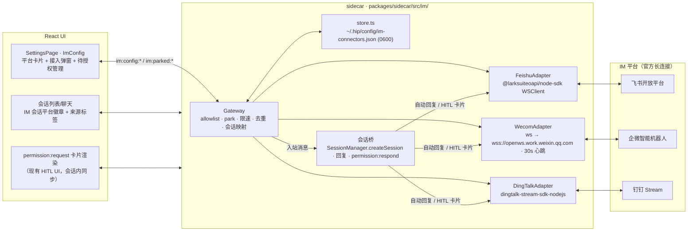

# 设置 · IM 连接器（飞书 / 企业微信 / 钉钉 · 双向对话）

- 系列：`docs/design/im-connectors/`
- 配套：`im-connectors-plan.md`（执行计划：PR 拆解、文件级任务、测试与验收）；`im-connectors-preview.html`（设置页多状态交互原型，浏览器直接打开）
- 作者：hip design (agent)
- 日期：2026-08-23
- 状态：Draft
- 产品原话演进：第一版「IM 连接器（微信/企微/飞书），单向通知」→ 评审后改为 **去掉微信，一步到位做双向对话**。落地为 **设置 → Agents 组新增「IM 连接器」页**：连接 飞书 / 企业微信 / 钉钉 的官方机器人，用户在 IM 里直接与 hip 智能体对话（发消息 → 智能体干活 → 自动回复），HITL 授权以 IM 交互卡片完成。
- 前置基线（2026-08-23 已核对代码 / 外部文档）：
  - 设置 IA：`src/components/account/settingsNav.ts`（`SETTINGS_NAV_GROUPS`）；页面 id 注册在 `src/store/uiStore.ts`（`SettingsPageId` + `SETTINGS_PAGE_IDS` + `normalizeSettingsPage`）；新增 `im` 页归入 agents 组
  - **网关归属 sidecar**：sidecar 是长驻 Node 进程，拥有 `SessionManager.createSession`（`packages/sidecar/src/session/session-manager.ts`）、`SessionLifecycleContext`（handlers/types.ts）、WS 服务器；`ws@^8` 已是直接依赖；`permission:respond` / `permission:resolved` 协议消息已存在（HITL 卡片按钮可直接复用，无需新协议）
  - sidecar 自管配置文件先例：`~/.hip/config/hip-plugins.json`（`plugin-store.ts`，`HIP_PLUGINS_PATH` 环境覆盖）→ IM 连接器走同款 `HIP_IM_PATH`
  - 协议面：`packages/protocol/src/messages.ts` 的 `ClientMessage`/`ServerMessage` 联合 + `message-route.ts` 的 `classify`（`:result` 后缀 unicast / 其余 broadcast）——新增 `im:*` 消息按此惯例
  - 权限机制：session 已有 `permissionMode`（`session:setPermissionMode`）；automation 的 `AutomationPermissionMode = chat | edit | full` 是现成的模式语义参考
  - 外部平台基线（2026-08 检索确认）：**三平台均有官方双向通道且无需公网服务器**（详见 §Background）：
    - 飞书：自建应用机器人 + **长连接模式**（`@larksuiteoapi/node-sdk` WSClient，`im.message.receive_v1`、`card.action.trigger`，3s 内 ack）
    - 企业微信：**智能机器人 · 长连接模式**（`wss://openws.work.weixin.qq.com`，BotID+Secret，`aibot_subscribe`/`aibot_msg_callback`/`aibot_respond_msg`/`aibot_send_msg`，30s 心跳，免加解密）
    - 钉钉：企业内部应用机器人 + **Stream 模式**（`dingtalk-stream-sdk-nodejs`，`/v1.0/im/bot/messages/get`，sessionWebhook 回复）
    - 微信个人号：**无官方双向/推送 API**（第三方协议有公开封号案例；iLink 仅被动回复且早期）→ 本轮**整体移除微信**，不做卡片、不做引导

---

## Overview

hip 桌面端今天只能本机对话。产品要求把 hip 连进 IM：设置页添加「IM 连接器」后，用户在 **飞书 / 企业微信 / 钉钉** 里 @ 机器人或单聊机器人，就能像在桌面端一样给智能体派活；智能体跑完自动回复到对应会话；需要授权时，IM 里收到**交互卡片**，点按钮即完成确认（允许一次 / 总是允许 / 拒绝）。

核心是一个**运行在 sidecar 的 IM 网关**（对齐 openworker `coworker/connectors/` 的 adapter + gateway 架构）：三个平台适配器各自维持一条**官方长连接**（免公网 IP、免内网穿透、免回调加解密），入站消息经**授权名单（allowlist）**过滤后桥接进 hip 会话；出站回复按平台渲染（markdown / 交互卡片）。凭证与授权存 `~/.hip/config/im-connectors.json`（0600）。

一句话产品承诺：**连上即对话，授权即干活，卡片即确认。**

---

## Background & Motivation

### 当前状态

| 层 | 现状 | 痛点 |
|---|---|---|
| 对话入口 | 仅桌面 UI / CLI | 离开电脑无法派活；长任务/自动化场景需要远程可达 |
| HITL 授权 | 只能窗口内点确认 | 「需要你确认」是远程场景最痛的卡点 |
| 本地通知 | `WindowLifecycleHost` Phase-3 OS 通知（隐藏时） | 手机端不可达 |
| sidecar | 长驻进程；已有 `ws-server`、`SessionManager`、`permission:respond`、插件文件存储先例 | IM 网关可整体落在 sidecar，Rust **零改动** |
| 设置 UI | agents 组含 mcp/skill/plugins/hooks；MCP 页有「列表 + 弹窗 + 状态徽章」模式 | 新页复用 |

### 平台通道调研（2026-08 检索确认）

**为什么三平台都能做、且不用公网服务器**：

| 平台 | 双向通道 | 免公网 | 交互卡片（HITL） | 主动推送 | 准入门槛 |
|---|---|---|---|---|---|
| 飞书 | 自建应用机器人 · **长连接**（WebSocket，SDK 内置鉴权） | ✅ 只需能访问公网 | ✅ `card.action.trigger` + 卡片更新 | ✅ `im/v1/message` | 开发者后台创建应用（个人开发者可注册）+ 发布自建应用 |
| 企业微信 | **智能机器人 · 长连接**（`wss://openws.work.weixin.qq.com`，BotID+Secret） | ✅ 无需固定公网 IP | ✅ 模板卡片 `aibot_respond_update_msg` | ✅ `aibot_send_msg` | 企业微信管理后台开启「API 模式 → 长连接」（需企业管理员） |
| 钉钉 | 企业内部应用机器人 · **Stream 模式** | ✅ 相比 webhook 免公网回调 | ✅ actionCard + 卡片回调 | ✅ 机器人消息推送 | 钉钉开发者后台创建企业内部应用（需企业开发者权限） |
| 微信个人号 | ❌ 无官方双向/推送 API | — | — | — | 已移除 |

**关键结论**：

1. **长连接是桌面 app 的双向唯一正解**：本机无公网 IP，webhook 回调模式（需要公网 HTTPS + 加解密）不适用；三平台官方长连接/Stream 模式把「回调网关」这个云基础设施问题彻底消掉了。
2. **飞书门槛最低**（个人可注册开发者、创建自建应用），企微/钉钉需企业身份——这是平台事实，UI 与文档如实呈现，不替代、不伪造。
3. **同类产品验证过的交互模式**（KaminDeng/agent_notifier：飞书卡片一键确认/选择/输入；openworker：adapter + gateway + allowlist + 会话映射）：入站消息 → 统一事件 → 智能体回复；HITL 用卡片按钮回流。本 spec 的网关形态直接对齐。
4. 平台细节坑（写进实现约束）：飞书事件 **3s 内需 ack**（先入队、快速响应）；企微长连接 **30s 心跳**、**单机器人同时只允许一条有效连接**、长连接模式**免加解密**；企微消息回调带 `msgid`/`req_id`（去重与回复透传）；钉钉 Stream 需 Node ≥18（sidecar 满足）。

### 为什么现在做

1. 三平台官方长连接通道 2025-2026 均已就绪（企微 2026-05 上线长连接是最后一环），**现在做不需要任何云基础设施**。
2. sidecar 架构天然容纳网关：会话创建、权限机制、WS 基建、文件存储全部现成，Rust 与协议核心零破坏。
3. 桌面 agent 的「远程派活 + 远程确认」是高频刚需，IM 是零安装的客户端。

---

## Goals & Non-Goals

### Goals（本轮）

1. **连接器管理**：设置新增「IM 连接器」页，支持 飞书 / 企业微信 / 钉钉 三种连接器：分步接入指引（开发者后台创建应用/机器人 → 填凭证 → 保存）、连接状态（连接中/已连接/错误+原因）、启用开关、删除。凭证字段掩码、不回显。
2. **双向对话**：用户在 IM 单聊/群聊 @ 机器人发消息 → 桥接进 hip 会话（每 `(连接器, 会话)` 一个 hip 会话）→ 智能体执行 → 最终回复自动发回 IM（markdown，按平台渲染）。会话在桌面 UI 同步可见（平台徽章）。
3. **IM 交互卡片完成 HITL**：IM 会话遇到权限请求 → 推交互卡片（飞书 card / 企微模板卡片 / 钉钉 actionCard），按钮 = 允许一次 / 总是允许 / 拒绝；点击即回流 `permission:respond`，卡片更新为「已处理」。
4. **授权与安全**（默认最严）：连接器默认 **allowlist 为空 = 任何人不能对话**；未授权入站消息进「待授权」列表，机主在设置页逐个允许/拒绝；连接器级权限模式默认 `confirm`（所有工具调用走卡片确认），可切 `auto`（直接执行，高风险提示）。入站限速（10 条/分/用户）、消息长度上限（4000 字符）、按消息 id 去重（5 分钟窗口）。
5. **凭证安全**：`~/.hip/config/im-connectors.json` 0600 存储（app_secret 等）；`im:config:list` 不回传密钥；日志脱敏。
6. **可靠性**：断线自动重连（指数退避）；「机器人忙」语义（同会话并发入站排队深度 1，超出回复「正在处理上一条」）；平台错误码友好映射（凭证错误 / 未发布 / 机器人被移出群）。

### Non-Goals（本轮）

- **微信**：任何形态（含个人号第三方协议、iLink、公众号）——**已从产品移除**。
- 桌面发起的任务**主动推送**到任意 IM 会话（推送目标选择 UI）：三平台通道均支持（企微 `aibot_send_msg` 等），作为下一系列「IM 通知」复用本轮网关；本轮只保证 IM 发起的会话内回复 + HITL 卡片。
- 流式消息（企微长连接支持主动推流式刷新、飞书新流式卡片）：v1 发最终消息，不接流。
- `send_message` 工具（智能体在 IM 会话外主动发消息）、文件/图片/语音消息、跨平台同一用户身份映射、多机器人实例（同一平台多凭证并发连接——协议上允许，本轮 UI 每平台限 1 个）。
- 群内「仅 @ 才响应」的细粒度策略：入站一律处理（allowlist 已限制人和群）。
- Rust 层任何改动（网关与存储全在 sidecar；仅设置页 UI 走既有 ws 协议）。

---

## Key Decisions

| # | 决策 | 理由 |
|---|---|---|
| KD-1 | **移除微信**（卡片、引导、代码均不出现） | 无官方个人号双向/推送 API；第三方协议有公开封号案例；产品明确「去掉微信」 |
| KD-2 | **网关整体放 sidecar**（`packages/sidecar/src/im/`），Rust 零改动 | 会话创建（SessionManager）、权限机制（permission:respond）、WS 基建、文件存储全在 sidecar；三平台官方 SDK 均为 Node 生态（`@larksuiteoapi/node-sdk` / `dingtalk-stream-sdk-nodejs` / 企微裸 WS 协议） |
| KD-3 | **三平台一律走官方长连接**（飞书 WSClient / 企微 `openws.work.weixin.qq.com` / 钉钉 Stream），不做 webhook 回调模式 | 本机无公网 IP；长连接免回调加解密、免穿透；平台官方推荐本地开发场景 |
| KD-4 | 连接器 = **双向机器人**一种形态；不保留单向 webhook 通知形态 | 双向通道自带主动推送能力（企微 `aibot_send_msg`、飞书 `im/v1/message`），通知场景被自然覆盖，产品面收敛为一种心智 |
| KD-5 | **每 (连接器, IM 会话) 一个 hip 会话**：`im:{platform}:{chatId}`，origin 元数据挂 session；桌面 UI 以平台徽章区分 | 群聊/单聊天然隔离；会话列表复用；销毁/回收走既有 session 生命周期 |
| KD-6 | 回复 = **最终助手消息自动发回 IM**（markdown，按平台渲染）；不新增 `send_message` 工具 | 智能体回合输出即回复，心智与桌面一致；工具形态留给后续主动推送系列 |
| KD-7 | **allowlist 默认空 = 无人可对话**；未授权入站 → park 列表；设置页逐个授权；绝不自动授权 | openworker 同款纪律；hip 会话可执行 shell，入站面必须最严 |
| KD-8 | 权限模式连接器级默认 `confirm`（工具调用走 HITL 卡片），可切 `auto`；复用 `session:setPermissionMode` 机制 | automation 的 chat/edit/full 语义为参考；IM 远程场景 confirm 是安全底线，auto 需显式高风险确认 |
| KD-9 | HITL 卡片按钮回流 **`permission:respond`**（sidecar 内部调用），`permission:resolved` 广播让 UI 同步清状态；卡片随后更新为「已处理」 | 协议零新增；多端（IM 卡 / 桌面 UI / CLI）同一竞争语义（first accepted wins）自动成立 |
| KD-10 | 凭证存 `~/.hip/config/im-connectors.json`（sidecar 写文件 chmod 0600，`HIP_IM_PATH` 环境覆盖），不进 hip.toml / auth.json | 与 plugin-store 同构；app_secret/BotSecret 即凭证，不进用户可见 toml；不进 auth.json（LLM 密钥域） |
| KD-11 | 入站处理纪律：先快速 ack（飞书 3s 窗口）→ 入内存队列 → 去重（消息 id，5min TTL）→ 限速（10 条/分/用户）→ allowlist → 桥接；「机器人忙」排队深度 1 | 对齐平台重推机制与 Dify 踩坑记录（重复回调导致重复回复）；防轰炸 |
| KD-12 | 设置页 UI：agents 组新页 `im`（hooks 之后，icon `MessageSquare`）；卡片 = 三平台 + 接入分步指引弹窗（凭证表单 + 状态）；另附「待授权」管理区块 | 产品点名设置页；平台侧创建应用的步骤必须内置（用户不看文档也能接上） |
| KD-13 | 会话标题：群聊用群名、单聊用对方名，后缀 `（IM）`；入站消息在 hip 会话内以来源标签帧包装（`[飞书 · 群名 · 张三] 消息内容`） | openworker `tagged_text` 同款；让智能体知道自己在跟谁说话、回复会去哪 |
| KD-14 | 网关生命周期 = sidecar 生命周期：hip 退出即 IM 离线（连接器状态 `offline`）；重连指数退避 | 桌面 app 无云驻留，诚实呈现；后续「IM 通知」系列同此约束 |
| KD-15 | 三平台适配器统一契约 `BaseImAdapter`：`connect/disconnect/send/updateCard` + 入站 `handleMessage(ImMessageEvent)` | openworker `BasePlatformAdapter` 同款；新增平台只写适配器，网关与会话桥零改 |

---

## Proposed Design

### 架构总览



### 数据模型（`~/.hip/config/im-connectors.json`）

```jsonc
{
  "version": 1,
  "connectors": [
    {
      "id": "uuid",
      "platform": "feishu",                    // "feishu" | "wecom" | "dingtalk"
      "name": "我的飞书机器人",
      "enabled": true,
      "credentials": {                         // 平台各异；list 接口不回传
        "appId": "cli_xxx", "appSecret": "xxx"              // feishu
        // | { "botId": "xxx", "secret": "xxx" }             // wecom（长连接专用 Secret）
        // | { "clientId": "xxx", "clientSecret": "xxx" }    // dingtalk
      },
      "permissionMode": "confirm",             // "confirm" | "auto"
      "allowlist": [                            // 默认 []
        { "kind": "user", "id": "ou_xxx", "name": "张三", "role": "owner" },
        { "kind": "chat", "id": "oc_xxx", "name": "运维群" }
      ],
      "parked": [                               // 未授权入站缓存（内存 + 落盘）
        { "kind": "user", "id": "ou_yyy", "name": "李四", "firstSeenAt": 1756000000 }
      ],
      "status": "connected",                    // "disconnected"|"connecting"|"connected"|"error"
      "lastError": null,                        // 错误码友好映射文案 key + 原始码
      "createdAt": 1756000000,
      "updatedAt": 1756000000
    }
  ]
}
```

### 统一事件契约（`types.ts`）

对齐 openworker 但裁剪到 hip 需要的最小面：

```ts
interface ImMessageEvent {
  connectorId: string
  platform: 'feishu' | 'wecom' | 'dingtalk'
  messageId: string          // 去重键（平台消息 id）
  chatId: string             // 会话键（企微单聊无 chatid → 用 from.userid 合成）
  chatName?: string          // 群名/对方名（适配器尽力解析，空则回退 id）
  chatKind: 'dm' | 'group'
  senderId: string           // 平台用户 id（allowlist 键）
  senderName?: string
  text: string               // 纯文本（各适配器从富文本抽取）
  replyToken: unknown        // 回复句柄（飞书 chat_id / 企微 req_id / 钉钉 sessionWebhook）
  interactive?: {            // 卡片按钮回流（HITL）
    actionId: string         // "allow_once" | "allow_always" | "reject_once"
    cardMessageId?: string   // 用于把卡片更新为「已处理」
  }
}

interface BaseImAdapter {
  connect(): Promise<void>
  disconnect(): Promise<void>
  send(chat: ImChatTarget, payload: ImOutbound): Promise<SendResult>   // text/markdown/card
  updateCard(chat: ImChatTarget, cardMessageId: string, patch: CardPatch): Promise<void>
  setMessageHandler(h: (e: ImMessageEvent) => void): void
}
```

### 网关流水线（`gateway.ts`）

入站消息处理顺序（KD-11）：

1. **快速 ack**：适配器内先把事件交网关（异步入队即返回，满足飞书 3s 窗口；企微长连接需 `req_id` 透传回复）
2. **去重**：`(connectorId, messageId)` 内存 LRU，5min TTL；重复静默丢弃
3. **限速**：按 `(connectorId, senderId)` 滑窗 10 条/分；超限回复「消息太频繁」一次
4. **授权**：sender 或 chat 命中 allowlist → 放行；否则进 parked（内存 + 落盘）、静默丢弃并触发 `im:parked:updated` 广播（UI 提示「有人找你」）
5. **会话映射**：`sessionId = im:{platform}:{chatId}`；不存在 → `SessionManager.createSession`（权限模式 = 连接器 permissionMode、默认 agent + active model、标题 KD-13），发送 `session:created` 带 origin 元数据
6. **并发**：会话 running → 排队深度 1；队列满 → 回复「正在处理上一条消息，请稍后」
7. **入站帧**：以 `[平台 · 会话名 · 发送者] 文本` 注入会话用户消息（openworker tagged_text 同款）
8. **回复**：监听回合完成 → 取最终助手文本 → `adapter.send(markdown)`；回合报错 → 发送错误摘要
9. **HITL**：IM 会话出现 `permission:request` → 渲染平台卡片（按钮 allow_once / allow_always / reject_once）→ 卡片按钮入站（`interactive.actionId`）→ 网关调 `permission:respond` → `permission:resolved` 广播 → `updateCard` 为「已处理」

### 平台适配器要点

| 平台 | 依赖 | 连接 | 发送 | HITL 卡片 | 注意 |
|---|---|---|---|---|---|
| 飞书 | `@larksuiteoapi/node-sdk`（新增直接依赖） | `Lark.WSClient` + `EventDispatcher`，注册 `im.message.receive_v1`、`card.action.trigger` | `im.v1.message.create`（receive_id_type=chat_id；text / post 渲染 markdown） | interactive card 按钮 + `message.patch` 更新 | 3s ack；长连接仅企业自建应用；卡片新回调结构 |
| 企业微信 | 裸 `ws`（已有依赖） | `wss://openws.work.weixin.qq.com` → `aibot_subscribe`（BotID+Secret）→ 30s 心跳 ping | `aibot_respond_msg`（markdown / 模板卡片；`req_id` 透传） | 模板卡片按钮 → `aibot_event_callback` → `aibot_respond_update_msg` | 单机器人单连接（重连踢旧连接）；长连接免加解密；单聊无 chatid 时用 `from.userid` 合成会话键 |
| 钉钉 | `dingtalk-stream-sdk-nodejs`（新增直接依赖） | `DWClient(clientId, clientSecret)`，注册 `/v1.0/im/bot/messages/get` | sessionWebhook（text / markdown） | actionCard 按钮 + Stream 卡片回调；不可用则降级「回复 1/2/3 确认」文本 | 需企业内部应用 + Stream 模式发布 |

### 协议新增（`packages/protocol/src/messages.ts`）

ClientMessage：
- `im:config:list` / `im:config:upsert`（含 credentials 写入）/ `im:config:delete` → 各自 `:result`
- `im:test`（向「自己的单聊」发一条测试消息）→ `im:test:result`
- `im:parked:list` / `im:parked:resolve`（allow | deny）→ `:result` / 广播 `im:parked:updated`

ServerMessage：
- `im:gateway:status`（连接器状态变更，broadcast）
- `im:parked:updated`（broadcast）
- `session:created` 增补可选 `origin?: { kind: 'im'; platform; connectorId; chatId; chatName? }`（兼容既有消费方，仅追加字段）

路由：`:result` 后缀天然 unicast；`im:gateway:status` / `im:parked:updated` 走 broadcast（`message-route.ts` 无需新规则，默认分支已覆盖）。

### 设置页 UI（`src/components/account/ImConfig.tsx`）

- 页头：标题「IM 连接器」+ 说明（双向对话能力 + 离线边界：hip 退出即离线）。
- 平台卡片 ×3（飞书 / 企微 / 钉钉）：品牌图标、能力摘要、准入门槛提示（飞书「个人可注册」、企微「需企业管理员」、钉钉「需企业开发者」）、已连接实例（名称 + 状态点 + 启用开关 + 编辑/删除）、「连接」按钮。
- 接入弹窗（`ImConnectorModal.tsx`）：分步指引（Step 1 开发者后台创建应用/机器人并开启长连接/Stream，含图示文案；Step 2 填凭证；Step 3 保存后自动连接 + 状态反馈 + 「发送测试消息」）。
- 「待授权」区块：parked 列表（谁、什么会话、时间），允许/拒绝按钮；空时隐藏。
- 权限模式选择：confirm（默认，推荐）/ auto（高风险确认对话框）。
- 状态徽章：离线（灰）/ 连接中（黄）/ 已连接（绿）/ 错误（红 + 悬浮原因，友好映射：凭证无效、应用未发布、机器人被移出群等）。

### 前端 store（`src/store/imConnectorsStore.ts`）

zustand：`connectors / loaded / load / upsert / remove / test / gatewayStatus / parked / loadParked / resolveParked`；`im:gateway:status` 与 `im:parked:updated` 广播由 store 订阅更新。

### 桌面会话视图联动

- 会话列表：IM 会话显示平台徽章 + 会话名（群名/对方名）。
- 聊天流：入站消息显示来源标签（`[飞书 · 张三]`），出站自动回复正常渲染。
- HITL：IM 卡片确认后，桌面端同会话的权限请求 UI 因 `permission:resolved`（broadcast）自动清除——多端一致，零新代码。

---

## Alternatives

1. **回调（webhook）模式 + 用户自备内网穿透**：企微自建应用 / 飞书回调地址的历史形态。需要公网 URL、回调加解密、穿透稳定性，对桌面产品不可接受。**不选**（长连接是平台官方推荐的本地接入方式）。
2. **网关放 Rust**：reqwest 无 WS 能力，需新引入 tokio-tungstenite + 三平台 SDK 均无 Rust 官方长连接实现（飞书有部分 Rust SDK 但生态弱），且会话桥需要跨进程往返。**不选**。
3. **官方云端 relay（hip 托管回调）**：openworker 的 Slack relay 模式。引入云服务与隐私面，违反 hip 本地优先。**不选**（备而不用，写入 Future Work 供企业版考量）。
4. **保留单向 webhook 通知形态**：三平台双向通道已自带主动推送，保留双形态徒增目录与测试面。**不选**（KD-4）。
5. **入站不 require allowlist、默认机主全放行**：hip 会话可执行 shell，入站默认必须最严。**不选**（KD-7）。

---

## Risks & Mitigations

| 风险 | 缓解 |
|---|---|
| 平台 SDK / 协议变动（如企微长连接刚上线不久） | 适配器隔离在 `BaseImAdapter` 契约内；每适配器单独测试；企微按官方文档实现裸 WS（无 SDK 依赖面） |
| 机器人被未授权用户试探 | allowlist 默认空 + park；未授权静默丢弃（不回复，避免信息泄露）；限速 |
| 消息轰炸 / 重复回复 | 去重 + 限速 + 排队深度 1 |
| 群聊多话题混杂 | 一个群一个会话（v1 简单模型）；话题拆分放后续 |
| hip 退出即离线，用户误以为 7×24 | UI 状态徽章「离线」+ 页头说明；连接器状态随 sidecar 生命周期广播 |
| 平台侧创建应用步骤繁琐导致放弃 | 弹窗内置分步指引 + 每步配图/文案；测试消息一键验证 |
| 凭证泄露 | 0600 存储、list 不回传、日志脱敏、UI 掩码 |
| 飞书 3s ack 超时重推 | 事件处理第一步即入队返回；去重兜底重推 |

---

## Future Work

- **IM 通知系列**：桌面发起的任务（含 automation 运行）完成/失败/待授权 → 推送到指定 IM 会话（企微 `aibot_send_msg` 等主动推送通道已具备，需目标选择 UI 与事件订阅）。
- 流式回复（企微长连接主动推流、飞书流式卡片）、`send_message` 工具、文件/图片/语音、群话题映射、多机器人实例、跨平台身份映射、官方云端 relay（企业版）。

---

## 外部参考资料

- 飞书 使用长连接接收事件（官方）：<https://open.feishu.cn/document/server-docs/event-subscription-guide/event-subscription-configure-/request-url-configuration-case>
- 飞书 Node SDK 处理事件 / 卡片回调：<https://open.feishu.cn/document/server-side-sdk/nodejs-sdk/handling-events>
- 企业微信 智能机器人长连接（官方，2026-05）：<https://developer.work.weixin.qq.com/document/path/101463>
- 企业微信 智能机器人 接收消息（回调/API 模式）：<https://developer.work.weixin.qq.com/document/path/100719>
- 钉钉 Stream 模式 Node SDK（官方）：<https://github.com/open-dingtalk/dingtalk-stream-sdk-nodejs>
- openworker 连接器架构（参考实现）：`/Users/lijiamin/data/code-repository/github/openworker/coworker/connectors/`（`base.py` / `gateway.py` / `descriptors.py`）
- KaminDeng/agent_notifier（飞书卡片 HITL 交互验证）：<https://github.com/KaminDeng/agent_notifier>
