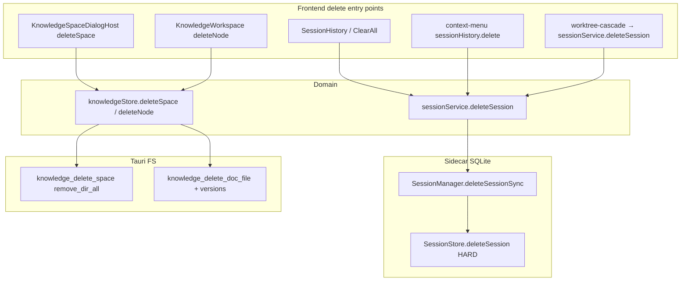
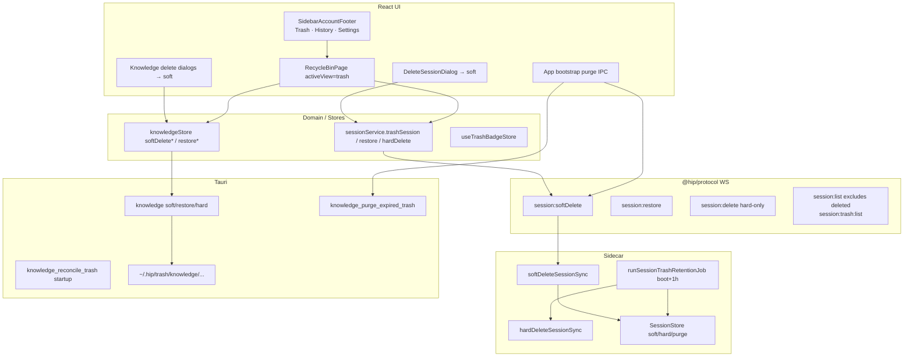
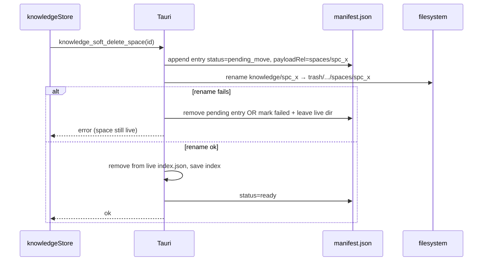
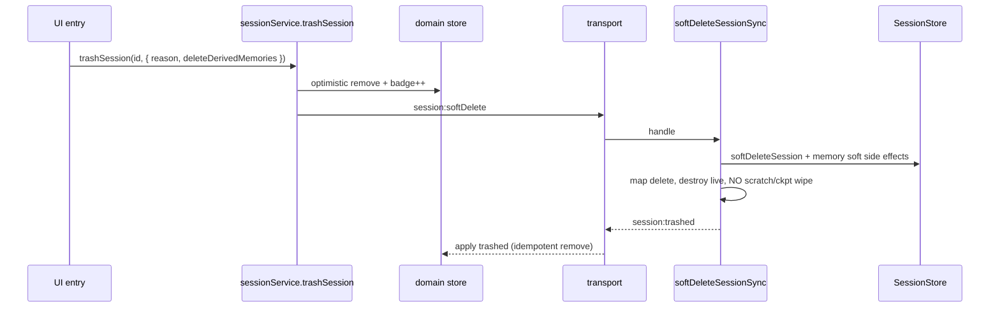
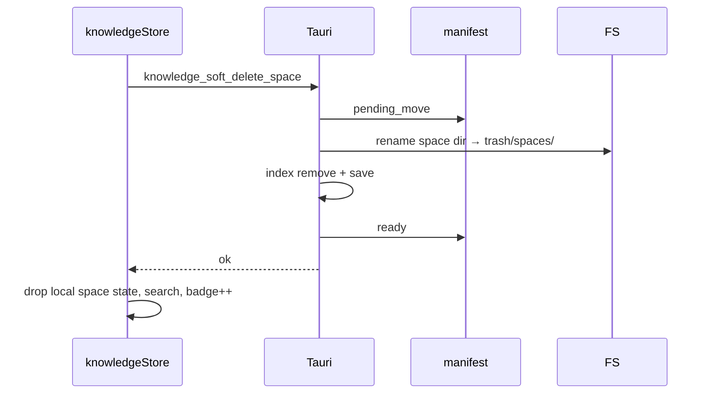
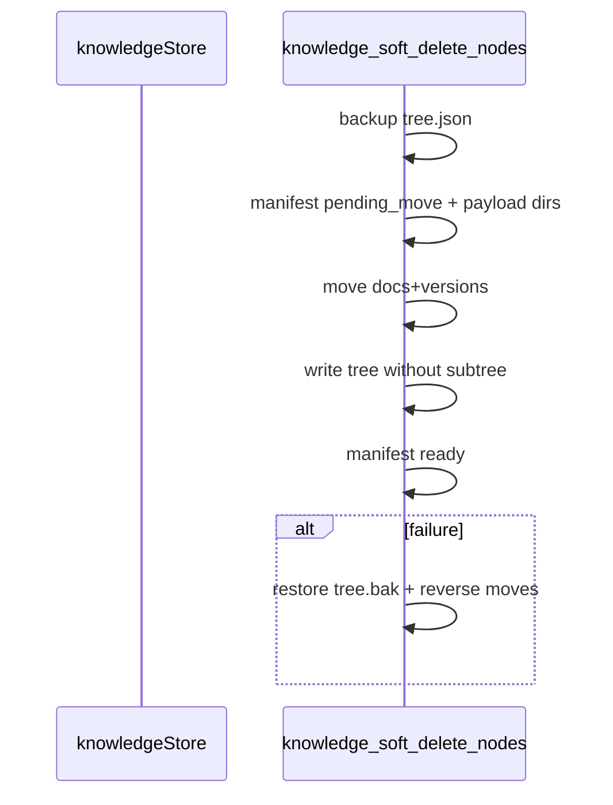

# Recycle Bin (回收站) — Soft-Delete for Chat / Code / Knowledge

| Field | Value |
|-------|-------|
| **Title** | Unified Recycle Bin above History: soft-delete + 7-day retention for Chat, Code, and Knowledge |
| **Author** | TBD |
| **Date** | 2026-07-19 |
| **Status** | Implemented (rev 3 design; PRs 1–5 on `dev`) |
| **Primary scope** | Soft-delete data model (sessions + knowledge), unified trash UI in left sidebar, restore / permanent delete / empty / auto-purge |
| **Workspace** | `/Users/lijiamin/data/my-github/hip` |
| **Builds on** | Memory soft-delete + `runTrashRetentionJob` (reference pattern only); session hard-delete pipeline; knowledge filesystem CRUD; `SidebarAccountFooter` history entry |
| **Audience** | Product + frontend + sidecar + Tauri native |

---

## Overview

hip today permanently destroys user content on delete:

- **Chat / Code sessions** — `session:delete` → `SessionStore.deleteSession` hard-purges SQLite rows (messages, agent runs, events, FTS, session-scoped memory) and drops scratch dirs / live ACP sessions (`packages/sidecar/src/persistence/store.ts`, `session-manager.ts`). UI copy is explicit: *「此操作无法撤销」* (`history.deleteSessionConfirmBody`).
- **Knowledge spaces / docs** — Tauri `knowledge_delete_space` removes the space from `index.json` and `fs::remove_dir_all` on `~/.hip/knowledge/<spaceId>`; doc delete removes `.md` + version history (`src-tauri/src/knowledge.rs`). UI: *「将永久删除该空间及其全部文档」*.

This is a local-first desktop workbench; accidental deletes are irreversible and costly (long agent transcripts, knowledge trees with assets). Industry products (Notion Trash, Google Drive Trash, Slack “edit history / retention”, macOS Trash, VS Code Local History) all use a **soft-delete + time-bounded retention** model.

**Proposal:** introduce a product-level **回收站 (Recycle Bin)** entry in the left sidebar footer **immediately above** `历史会话` (`SidebarAccountFooter` → History). User deletes from Chat, Code, and Knowledge become soft-deletes that land in the recycle bin; items auto hard-purge after a **configurable retention** (default **7 days**, Settings → General); users can restore, permanently delete one item, or empty the bin. Memory already has its own soft-delete/trash (Settings → Memory, 30-day default) — that path stays; the new recycle bin is the user-facing home for **sessions + knowledge**, with an optional deep-link note to Memory trash (not dual-listed in v1).

**Atomic soft+UI rule (rev 2):** product delete paths and “可恢复” copy must **not** flip to soft until a shippable restore surface (footer + Recycle Bin page for that content kind) lands in the **same** merge unit. Backend soft APIs may land first while UI still hard-deletes.

---

## Background & Motivation

### Current delete surfaces (grounded)



| Layer | Path | Today |
|-------|------|-------|
| Sidebar footer | `src/components/layout/SidebarAccountFooter.tsx` | History + Settings only |
| History page | `src/components/history/SessionHistory.tsx` | Hard delete + Clear all |
| Delete dialog | `DeleteSessionDialog.tsx` | "cannot be undone" + optional derived-memory wipe |
| Session audit | `src/lib/sessionDelete.ts` | `reason`: user / clearAll / worktree-cascade / … |
| Protocol | `packages/protocol/src/messages.ts` | `session:delete` permanent |
| Session store | `packages/sidecar/src/persistence/store.ts` | Sprint C privacy true-delete |
| Schema | `sessions(id, title, config, created_at, updated_at)` — **no deleted flag** | `user_version = 20` (next migration = **21**) |
| List | `listSessions()` selects all rows | no trash filter |
| Knowledge root | `~/.hip/knowledge` via `paths::knowledge_dir` | hard remove |
| Memory trash (existing) | `memory_items.status='deleted'`, `runTrashRetentionJob`, Settings Memory UI | **30 days**, separate product surface; primitive `MemoryStore.deleteBySourceSession(id, { soft: true })` already exists |

### Pain points

1. **Irreversible** long-running Chat/Code transcripts and knowledge spaces.
2. **Inconsistent safety models** — Memory already soft-deletes; sessions/KB do not.
3. **Clear all** can wipe dozens of sessions with one confirm (`ClearAllSessionsDialog`).
4. **Worktree cascade** hard-deletes nested sessions without recovery.
5. No user-visible place to recover after a misclick in the sidebar context menu.

### Industry practices (adapted to local-first desktop)

| Practice | Source | hip adaptation |
|----------|--------|----------------|
| Soft-delete by default; hard only from trash | Notion, Drive | Default user delete → trash; permanent only in recycle bin or after retention |
| Fixed retention with countdown | Drive 30d, Notion trash, macOS (until Empty) | **Default 7 days**, Settings-configurable; show remaining days in UI |
| Unified trash surface | Drive / Notion | One recycle bin for sessions + knowledge (v1) |
| Separate system trash for OS files | macOS Trash | Knowledge soft-delete stays **inside** `~/.hip` (not Finder Trash) so restore is app-owned |
| Startup / idle purge | Memory `runStartupDecayOnce` | Session purge on sidecar boot; knowledge purge on **app launch** (not only Knowledge view) |
| Optional "also delete related" | Session derived memories checkbox | Persist intent at soft-delete; honor on eventual hard purge |
| Permanent path for privacy | Slack retention / GDPR | "Empty trash" + "Delete forever" + CLI hard delete |

---

## Goals & Non-Goals

### Goals

1. **Soft-delete by default** for user-initiated deletes of:
   - Chat sessions (`surface: chat`)
   - Code sessions (`surface: code`), including **clear-all** and **worktree-cascade** (same soft path as single delete)
   - Knowledge **spaces** and **document/folder nodes** (subtree)
2. **Recycle Bin** entry in left sidebar footer **above** 历史会话, with badge count (cap `99+`).
3. **Restore** restores content to its original surface (session → active lists; space → knowledge index; doc → tree).
4. **Permanent delete** single item and **Empty recycle bin**.
5. **Auto hard-purge** after the configured retention period (default **7 days**) from write-once `deleted_at` / manifest `deletedAt`, regardless of which product surface the user is on (Chat-only weeks still purge knowledge trash on next app launch).
6. **Settings-configurable retention** (General): user can change product recycle-bin retention days; default 7. Sessions and knowledge share one product retention value (Memory keeps its own 30d default).
7. Reuse existing patterns: audit logs (`[session-delete]` / `[session-trash]`), i18n tri-locale, memory trash retention job shape, Tauri invoke + WS protocol, `hip.toml` via `useHipConfigStore` / `HipConfig`.
8. Copy changes: delete confirms say **moved to recycle bin**, not "cannot be undone" — **only after** restore UI for that kind is shippable.
9. Soft default is **atomic with restore UI** for each content kind (no soft-without-UI window).

### Non-Goals (v1)

- Soft-delete for **Memory items** inside the new recycle bin (keep Settings → Memory trash).
- Soft-delete for **skills / plugins / MCP servers / agents** (settings entities).
- Moving knowledge into the **macOS/Windows OS trash**.
- Cloud sync of trash or multi-device recycle bin.
- **Undo toast** after soft-delete (5–10s); recycle bin alone is sufficient for v1.
- Per-item custom retention (one global product retention, not per-entry).
- Undelete of **git worktree directories** themselves (worktree remove still permanent on disk; only the hip **session** rows soft-delete).
- Partial message-level undelete inside a session (session is the unit).
- Perfect multi-window knowledge badge sync (single-window desktop is enough; knowledge badge eventually consistent).

---

## Key Decisions

| # | Decision | Rationale |
|---|----------|-----------|
| K1 | **Sessions soft-delete via `deleted_at INTEGER NULL` + `delete_derived_memories INTEGER NOT NULL DEFAULT 0` on `sessions`** (migration user_version **21**). Keep all child rows in place until hard purge. | Minimal schema change; restores are O(1) UPDATE; avoids copying large message blobs. Persists checkbox intent for deferred hard purge (Issue 3). |
| K2 | **Knowledge soft-delete via filesystem quarantine** under `~/.hip/trash/knowledge/` + manifest with durable status machine (`pending_move` → `ready`). | Knowledge is FS-first; quarantine prevents agent/tool reads of “deleted” docs under live roots. |
| K3 | **Unified recycle bin view** (`activeView: 'trash'`) listing both sessions and knowledge items with type filters. | Product request: one entry above History. |
| K4 | **Product recycle-bin retention default = 7 days**, **user-configurable in Settings → General** (and persisted under `[trash] retentionDays` in `hip.toml`). Clamp e.g. **1–365** days. Memory stays at its own `trashRetentionDays` default 30 — **do not** reuse that field. Store/purge APIs take `retentionDays` (or `cutoffMs`) as a **parameter from day one** so Settings can plug in without store rewrites. | User decision (rev 3); default matches original 7-day product ask. |
| K5 | **Purge triggers (both backends):** (a) sidecar boot → session purge; (b) Tauri setup / app ready + frontend bootstrap → knowledge purge; (c) 1h interval while app running (frontend or sidecar for sessions; frontend IPC for knowledge); (d) opportunistic on trash UI open. | Desktop may stay on Chat for weeks; knowledge purge must not require Knowledge view. Retention is best-effort if the app never launches (same as Memory). |
| K6 | **Soft-delete tears down live runtime** (cancel turn, dispose ACP, kill PTY, remove from in-memory map) but **does not** SQLite-cascade, **does not** `removeScratchDir`, **does not** `deleteCheckpointRefs`. Hard path keeps today’s full cascade. | Two manager methods: `softDeleteSessionSync` vs `hardDeleteSessionSync` (existing body). |
| K7 | **All product session deletes soft by default:** single user delete, **Clear all**, **worktree-cascade**, context menu. Hard only: recycle bin “Delete forever”, Empty trash, retention job, CLI `session:delete`. | Consistency; Empty trash is the privacy escape. Stronger clear-all copy: “N 项将移入回收站”. |
| K8 | **Derived memories at soft-delete:** if checkbox → `MemoryStore.deleteBySourceSession(id, { soft: true })` + hard-delete `memory_stage1`; else leave project/global memories and **do not** null `source_session_id`. Persist `delete_derived_memories` on session row. **On hard purge:** if flag → hard-delete by `source_session_id` (including already soft-deleted); else null `source_session_id` as today. Session-scoped `memory_items`: soft-delete on session soft-delete; hard-delete on session hard purge. | Honors user intent after deferred hard purge (up to configured retention); uses existing soft primitive. |
| K9 | **Sidebar placement:** footer button **above** History in `SidebarAccountFooter`. | Matches request. |
| K10 | **Worktree cascade soft-deletes sessions**; does **not** resurrect git worktree dirs. Confirm copy **must** state sessions go to trash and worktree dirs are not restored. Restore may show missing-project banner. | Honest about irreversible FS/git ops. |
| K11 | **Knowledge space name conflict on restore:** auto-suffix `Name (restored)`, then `Name (restored 2)` … up to 50 attempts; then fail with toast. No blocking dialog in v1. | Deterministic; uses `isSpaceNameTaken`. |
| K12 | **v1 does not list Memory trash** in the unified bin; optional footer note / Settings link. | Avoid dual retention policies. |
| K13 | **Soft default atomic with restore UI** per content kind. Backend APIs land first with UI still hard; flip soft + copy only when Recycle Bin can list/restore that kind. | Prevents soft-without-UI hole. |
| K14 | **Mutations on trashed sessions forbidden** via `assertSessionActive(id)` (or `getSession` returns null when trashed). Only restore / hard-delete / trash-list allowed. | Soft-delete keeps rows; without guards, load/send/rename would reanimate trash. |
| K15 | **Trash is a special/ephemeral `activeView`** like history: `isSpecial`, `isEphemeralActiveView`, previousView, MainToolbar back. | Prevents navigation bugs. |
| K16 | **Badge:** optimistic count + refresh on trash open / window focus; display cap **`99+`**. Multi-window knowledge badge eventually consistent. | Lightweight; fits desktop single-window primary. |
| K17 | **Scratch retention:** leave scratch dir in place until hard purge (no move). | Simpler restore; disk same order of magnitude. |
| K18 | **Knowledge parent-missing restore (v1):** **block** with “请先恢复父节点/空间” — no auto-root. | Simpler, correct. |
| K19 | **v1 ships sessions + knowledge** (reject sessions-only deferral as product default). If knowledge subtree quarantine slips schedule, **fallback scope** is space-only soft-delete first (docs still hard) — implementer may cut scope only with product sign-off; full design targets both. | Product request includes 知识库; space-only is emergency schedule valve, not preferred. |
| K20 | **Command palette:** include “Open Recycle Bin” / 打开回收站. | Low cost; discoverability. |
| K21 | **Retention clock:** purge predicate is strictly `deletedAt < now - retentionDays` (session `deleted_at`, knowledge manifest `deletedAt`). Both are **write-once** at soft-delete; list/open must not refresh them. Restore clears `deleted_at`; a later re-delete starts a **new** retention window from the new soft-delete time. Empty trash does not alter remaining items’ clocks. Changing Settings retention applies to **future purge cutoffs only** (does not rewrite stored `deletedAt`); shorter retention may immediately make more items eligible; longer retention keeps items longer. UI “剩余 N 天” uses current configured `retentionDays`. | Contrast Memory which purges on `updated_at` while deleted. |
| K22 | **No Undo toast in v1.** Soft-delete relies solely on Recycle Bin for recovery. | User decision (rev 3); avoids dual recovery UX. |

---

## Proposed Design

### Architecture



### Soft-delete data model

#### A. Sessions (Chat + Code) — SQLite

**Migration user_version 21:**

```sql
ALTER TABLE sessions ADD COLUMN deleted_at INTEGER;
-- NULL = active; set to epoch-ms on soft-delete (write-once until restore)
ALTER TABLE sessions ADD COLUMN delete_derived_memories INTEGER NOT NULL DEFAULT 0;
-- 1 if user checked "also delete long-term memories" at soft-delete time
CREATE INDEX IF NOT EXISTS idx_sessions_deleted_at
  ON sessions(deleted_at) WHERE deleted_at IS NOT NULL;
```

Optional audit column (nice-to-have, can defer):

```sql
ALTER TABLE sessions ADD COLUMN delete_reason TEXT; -- user|clearAll|worktree-cascade|...
```

**Semantics:**

| Op | Behavior |
|----|----------|
| Soft-delete | `UPDATE sessions SET deleted_at=?, delete_derived_memories=?, updated_at=? WHERE id=? AND deleted_at IS NULL`; emit `session:trashed` |
| List active | `listSessions()` / search: `WHERE deleted_at IS NULL` |
| List trash | `listTrashedSessions()` where `deleted_at IS NOT NULL`, order by `deleted_at DESC` |
| Restore | `UPDATE … SET deleted_at=NULL, delete_derived_memories=0`; emit `session:restored` with summary |
| Hard delete | existing `deleteSession` cascade, using **stored** `delete_derived_memories` when reason is trash-permanent / trash-empty / trash-retention (or explicit opts override) |
| Purge job | `purgeTrashedOlderThan(cutoffMs)` or `purgeTrashedOlderThan({ retentionDays, now? })` → `SELECT id, delete_derived_memories FROM sessions WHERE deleted_at IS NOT NULL AND deleted_at < cutoff` then hard-delete each. **Callers pass retention**; store does not hardcode 7. |

**Memory interactions (explicit):**

| Moment | Session-scoped `memory_items` | Derived (`source_session_id`) | `memory_stage1` |
|--------|-------------------------------|-------------------------------|-----------------|
| Soft-delete | Soft-delete (`status=deleted`) so they leave active Memory lists | If `delete_derived_memories`: `deleteBySourceSession(id, { soft: true })`; else leave + keep `source_session_id` | Hard-delete always (staging only) |
| Hard purge | Hard-delete (existing session-scope cleanup) | If flag: hard-delete by `source_session_id` (including soft rows); else `source_session_id=NULL` | Already gone |
| Restore session | Restore soft-deleted session-scoped items for that `session_id` back to `active` | Soft-deleted derived items stay deleted unless user restores them from Memory trash separately (v1: do **not** auto-restore derived memories) | N/A |

#### SessionManager API split (Issue 8)

```ts
// packages/sidecar — conceptual
softDeleteSessionSync(id, send, opts?: {
  deleteDerivedMemories?: boolean
  reason?: string
}): void {
  // 1. audit logInfo('session-trash', 'soft', …)
  // 2. capture live Session, resolve cwd/title/surface
  // 3. store.softDeleteSession(id, { deleteDerivedMemories, reason })
  // 4. memory: session-scoped soft + optional derived soft; hard stage1
  // 5. this.sessions.delete(id)  — drop live map
  // 6. NO removeScratchDir
  // 7. NO deleteCheckpointRefs
  // 8. send({ type: 'session:trashed', sessionId: id, deletedAt })
  // 9. void live?.destroy()  — fire-and-forget
}

hardDeleteSessionSync(id, send, opts?: {
  deleteDerivedMemories?: boolean  // if omitted, read from row
  reason?: string
}): void {
  // Existing deleteSessionSync body:
  // store.deleteSession (cascade) + removeScratchDir + deleteCheckpointRefs
  // + session:deleted + live.destroy()
  // When called from trash purge/empty/forever: pass stored delete_derived_memories
}
```

- Protocol `session:softDelete` → `softDeleteSessionSync`
- Protocol `session:delete` → `hardDeleteSessionSync` only (CLI + trash permanent + internal purge)
- Existing tests (`session-manager-scratch.test.ts` expects scratch gone on `session:delete`) **keep hard semantics**

#### Mutations against trashed sessions (Issue 5)

Central helper in store/manager:

```ts
function assertSessionActive(store: SessionStore, id: string): void {
  const row = store.getSessionRow(id) // includes deleted_at
  if (!row) throw notFound
  if (row.deleted_at != null) throw sessionTrashedError(id)
}
```

| Handler class | Trashed session |
|---------------|-----------------|
| `session:load`, `message:send`, rename, setCwd, setModel, checkpoints, diff, extract scheduling, worktree ops keyed by session | **Reject** (`session:error` or silent no-op with log) |
| `session:restore` | Allowed |
| `session:delete` (hard) | Allowed |
| `session:trash:list` | N/A |
| `session:softDelete` when already trashed | Idempotent no-op success |

**Multi-client:**

- Soft-delete broadcasts `session:trashed` → every client removes id from domain list (same as `session:deleted` path in `sessionStore` / effects).
- Client that still had the session selected: reconcile to newest same-surface or New Conversation (existing delete reconciliation).
- Restore broadcasts `session:restored` + summary → clients merge into list **without** auto-select.
- Reconnect `session:list` only returns active rows → trashed never reappear in History.

#### Protocol (`packages/protocol/src/messages.ts`) — canonical

```ts
// Client → server
| { type: 'session:softDelete'; sessionId: string; deleteDerivedMemories?: boolean; reason?: string }
| { type: 'session:restore'; sessionId: string }
| { type: 'session:delete'; sessionId: string; deleteDerivedMemories?: boolean; reason?: string }
  // HARD only — never soft. CLI + trash permanent + purge.
| { type: 'session:trash:list' }
| { type: 'session:trash:empty' }

// Server → client
| { type: 'session:trashed'; sessionId: string; deletedAt: number }
| { type: 'session:restored'; sessionId: string; summary: SessionSummary }
| { type: 'session:trash:list:result'; sessions: TrashedSessionSummary[] }
| { type: 'session:deleted'; sessionId: string } // hard only (existing)
```

**No `hard?: boolean` on `session:delete`.** Soft and hard are separate messages.

Update `message-guard.ts`, CLI help text when documenting, consumers of protocol package.

#### B. Knowledge — filesystem quarantine

**Layout:**

```
~/.hip/
  knowledge/                 # live spaces
    index.json
    spc_xxx/
      meta.json
      tree.json
      docs/
      assets/
      versions/
  trash/
    knowledge/
      manifest.json          # TrashManifest { version: 1, entries: TrashKnowledgeEntry[] }
      spaces/
        spc_xxx/             # full space dir after successful move
      docs/
        <entryId>/           # one entry per doc or folder soft-delete
          meta.json          # title, spaceId, parentId, order, entity ids
          treeFragment.json  # nodes for folder subtree restore
          docs/
            doc_yyy.md
          versions/
            doc_yyy/...
```

**Manifest entry:**

```ts
type TrashEntryStatus = 'pending_move' | 'ready' | 'pending_restore' | 'pending_hard_delete'

type TrashKnowledgeEntry = {
  id: string                 // trash entry id (uuid)
  status: TrashEntryStatus
  kind: 'space' | 'doc' | 'folder'
  entityId: string           // spc_* / nod_* / doc_*
  spaceId: string
  title: string
  deletedAt: number          // write-once epoch-ms
  payloadRel: string         // relative under trash/knowledge/
  /** Folder/doc: serialized subtree for restore */
  treeFragment?: KnowledgeTreeNode[]
  parentId?: string | null   // original parent in live tree
  order?: number
  deleteReason?: 'user' | 'empty' | 'cascade-space'
}
```

##### Durable state machine (Issue 7)

**Space soft-delete:**



**Doc / folder soft-delete** — **single Tauri command** `knowledge_soft_delete_nodes(spaceId, nodeIds)` that:

1. Loads tree + validates ids.
2. Computes subtree (`removeNodeSubtree` logic ported or passed fragment from TS after compute — prefer **all-in-Tauri** or **TS computes fragment + Tauri applies atomically**).
3. Writes manifest entries `pending_move` with payload dirs under `trash/knowledge/docs/<entryId>/`.
4. Moves each `docs/doc_*.md` + versions into payload.
5. Writes updated `tree.json` without those nodes.
6. Marks entries `ready`.
7. On any step failure: roll back moves (best-effort) and restore previous tree from backup written at step 0 (`tree.json.bak` in space, deleted on success).

**Startup reconcile** `knowledge_reconcile_trash()` (called from same app-launch path as purge):

| Condition | Action |
|-----------|--------|
| Entry `pending_move`, live dir still present, trash payload absent | Retry move or roll back: delete manifest entry, leave live intact |
| Entry `pending_move`, trash payload present, still in live index | Remove from live index; set `ready` |
| Entry `pending_move`, neither side consistent | Log error; leave for manual adopt |
| Dir under `trash/knowledge/spaces/*` without manifest | Adopt as `ready` entry (title from meta.json if present) or move to `trash/knowledge/orphans/` |
| Entry `ready` but payload missing | Drop manifest entry (already gone) |
| Live `docs/*.md` not in tree | **Leave** (pre-existing orphans; out of scope) |

##### Restore checklist (Issue 12)

| Kind | Files / index | Search (MiniSearch) | Link index | recent / spaceDocCounts |
|------|---------------|---------------------|------------|-------------------------|
| **Space** | Move dir back; insert meta into `index.json`; name auto-suffix if taken (K11) | `rebuildSearchIndex()` or full space reindex | `knowledgeLinkIndexReplaceAll` / rebuild for space | Restore counts via tree walk; recent entries for that space were dropped on delete — leave dropped (no resurrect stale recent) |
| **Doc** | Ensure space live; parent exists else **block** (K18); move md + versions back; insert node into tree | `removeSearchDoc` was on delete → re-upsert doc payload | `knowledgeLinkIndexUpsert` for doc | If was active, no auto-open; dropRecent already applied |
| **Folder** | Same as doc for each child doc in `treeFragment`; reinsert folder + children preserving relative order; parent must exist | Re-upsert all docs in fragment | Upsert each doc | Same |

**Assets:** space-level `assets/` move with whole space (good). Single-doc soft-delete does **not** move space assets (docs may still reference assets that remain — acceptable; broken image if asset-only cleanup later). Folder soft-delete same as docs.

**Payload example (folder with 2 docs):**

```
trash/knowledge/docs/tentry_abc/
  meta.json          # { kind, spaceId, entityId: nod_folder, parentId, title, deletedAt }
  treeFragment.json  # [folder node, doc1, doc2] with parent links relative to folder
  docs/
    doc_1.md
    doc_2.md
  versions/
    doc_1/...
    doc_2/...
```

##### Hard purge / empty

- Delete payload dirs + remove manifest rows for selected entries or all `ready` entries.
- Expired: `status === 'ready' && deletedAt < cutoff` where `cutoff = now - retentionDays * DAY_MS` from product trash config (parameterized; same source as session purge).

---

### Unified Recycle Bin UI

#### Placement

`SidebarAccountFooter` order (top → bottom):

1. **回收站** — **new**, above History  
2. **历史会话**  
3. **设置**

Badge on 回收站: total trash count; hide when 0; display **`99+`** when ≥ 100.

#### Navigation checklist (Issue 6)

| Item | Requirement |
|------|-------------|
| `ActiveView` | `+= 'trash'` |
| `isEphemeralActiveView('trash')` | `true` (with settings/history/knowledge) |
| `isSpecial` in `setActiveView` | includes `'trash'` (same previousView behavior as history) |
| `AppLayout` | `if (activeView === 'trash') return <RecycleBinPage />` |
| `SidebarAccountFooter` | `active?: 'trash' \| 'history' \| 'settings'`; button `data-testid="account-trash-button"` |
| `openTrashFromChrome` | leave knowledge flush (mirror history) |
| Command palette | “Open Recycle Bin” (K20) |
| Tests | parallel `uiStore.test.ts` previousView / ephemeral cases for trash |

#### RecycleBinPage

Reuse History layout (`PAGE_SIZE = 20`):

| Element | Behavior |
|---------|----------|
| Title | 回收站 |
| Subtitle | 条目将在删除 **{{retentionDays}}** 天后永久清除（当前配置；默认 7） |
| Filters | All / 对话 / 编码 / 知识库 |
| Search | title / space name |
| Row | icon, title, kind badge, deleted relative time, **剩余 N 天** (N from configured retention) |
| Row actions | 恢复 · 永久删除 |
| Toolbar | 清空回收站 |
| Empty | 回收站为空 |

```ts
type TrashListItem =
  | {
      kind: 'session'
      id: string
      title: string
      surface: 'chat' | 'code'
      deletedAt: number
      preview?: string
      cwd?: string
    }
  | {
      kind: 'knowledge'
      id: string            // trash entry id
      entityKind: 'space' | 'doc' | 'folder'
      title: string
      spaceId: string
      spaceName?: string
      deletedAt: number
    }
```

#### Badge freshness (Issue 11)

```ts
// useTrashBadgeStore (lightweight)
{
  sessionCount: number
  knowledgeCount: number
  total: number  // derived, cap display in UI
  setFromLists(s, k): void
  adjustSessions(delta): void
  adjustKnowledge(delta): void
  refresh(): Promise<void>  // session:trash:list + knowledge_list_trash
}
```

- Soft-delete / restore / empty: optimistic `adjust*`
- On RecycleBinPage mount, app focus (debounced), and after connect: `refresh()`
- Multi-window: knowledge counts eventually consistent until focus refresh

#### Dialogs / copy

| Dialog | Copy (zh-CN) |
|--------|----------------|
| Soft-delete session | 「{{title}}」将移入回收站，{{days}} 天内可恢复。 |
| Soft-delete space | 「{{name}}」将移入回收站，{{days}} 天内可恢复。 |
| Clear-all | 将 **{{count}}** 条会话移入回收站（范围：{{scope}}）。可在回收站恢复或永久删除。 |
| Worktree cascade / worktree delete confirm | 相关会话将移入回收站。**不会**恢复已删除的 git worktree 目录。 |
| Permanent delete | 将永久删除「{{title}}」，此操作无法撤销。 |
| Empty trash | 将永久删除回收站中的全部条目… |

Do **not** ship soft copy until soft+UI is live (K13).

---

### Restore flow

```mermaid
sequenceDiagram
  participant U as User
  participant RB as RecycleBinPage
  participant SS as sessionService
  participant SC as Sidecar
  participant KT as Tauri knowledge

  U->>RB: Restore session
  RB->>SS: restoreSession(id)
  SS->>SC: session:restore
  SC->>SC: assert trashed; deleted_at = NULL
  SC-->>SS: session:restored + summary
  SS->>SS: merge into domain sessions; badge--
  Note over SS: No auto-select; toast 已恢复

  U->>RB: Restore knowledge
  RB->>KT: knowledge_restore_trash_entry
  KT->>KT: parent check / name suffix / move back
  RB->>RB: loadSpaces / reindex as needed; badge--
```

**Edge cases:**

| Case | Behavior |
|------|----------|
| Restore session not trashed | No-op / error toast |
| Restore after hard purge | 条目已不存在 |
| Knowledge doc/folder, parent missing or space trashed | **Block** — 请先恢复父节点/空间 |
| Space name conflict | Auto-suffix (K11) |
| Soft-delete twice | Idempotent |
| Concurrent restore + purge | Transaction / atomic rename; loser gets not-found |
| Active session soft-deleted | Drop from list; surface fallback (existing reconciliation) |

---

### Permanent delete & empty

- Single hard: `session:delete` / `knowledge_hard_delete_trash_entry`
- Empty: `session:trash:empty` + `knowledge_empty_trash` (Promise.all)
- Confirm modals required
- Audit reasons: `trash-permanent` / `trash-empty` / `trash-retention`
- Session hard path reads `delete_derived_memories` from row when opts omit it

---

### Retention policy & purge (desktop)

**Default:** 7 days. **Configurable** via Settings → General (K4). Shared by sessions + knowledge product trash.

```ts
// packages/protocol — HipConfig
export interface TrashConfig {
  /** Days before soft-deleted items hard-purge. Default 7. Clamp 1–365. */
  retentionDays?: number
}
// HipConfig.trash?: TrashConfig

export const TRASH_RETENTION_DAYS_DEFAULT = 7
export const TRASH_RETENTION_DAYS_MIN = 1
export const TRASH_RETENTION_DAYS_MAX = 365

export function resolveTrashRetentionDays(cfg?: TrashConfig | null): number {
  const n = cfg?.retentionDays ?? TRASH_RETENTION_DAYS_DEFAULT
  if (!Number.isFinite(n)) return TRASH_RETENTION_DAYS_DEFAULT
  return Math.min(TRASH_RETENTION_DAYS_MAX, Math.max(TRASH_RETENTION_DAYS_MIN, Math.floor(n)))
}

function cutoffMs(retentionDays: number, now = Date.now()) {
  return now - retentionDays * 24 * 60 * 60 * 1000
}
// Purge: deletedAt < cutoffMs(retentionDays)  (NOT updated_at)
```

**hip.toml:**

```toml
[trash]
retentionDays = 7
```

Do **not** reuse `memory.trashRetentionDays` (separate domain, default 30).

#### Store / purge API shape (parameterized from PR 1)

```ts
// SessionStore — no hardcoded 7
purgeTrashedOlderThan(cutoffMs: number): number
// or convenience:
purgeTrashedByRetention(retentionDays: number, now?: number): number

// knowledge_purge_expired_trash args
{ retentionDays?: number }  // omit → default 7 server-side for safety
```

Housekeeping / UI resolve days via `resolveTrashRetentionDays(hipConfig.trash)` then pass in.

| Trigger | Sessions | Knowledge |
|---------|----------|-----------|
| Sidecar boot | `runSessionTrashRetentionJob(store, retentionDays)` next to memory startup | — |
| Tauri app setup / main window ready | — | reconcile then `knowledge_purge_expired_trash({ retentionDays })` |
| Frontend app bootstrap (connect / AppLayout mount) | optional purgeExpired with current config | invoke purge with current config |
| 1h interval while running | Sidecar interval re-reads config each tick (or cached with config-reload) | Frontend timer with current `useHipConfigStore` value |
| Trash UI open | Both, with current retention | Both |
| Settings retention change | Immediate optional purge with new cutoff (nice-to-have); next job uses new value | Same |

**If app never launches past retention:** purge runs on next launch — same best-effort as Memory.

#### Settings UI (General)

Touch points:

| Layer | Change |
|-------|--------|
| Protocol | `TrashConfig` + `HipConfig.trash?` in `packages/protocol/src/hip-config.ts` |
| Config load/save | Existing hip.toml pipeline (`useHipConfigStore.updateSection('trash', { retentionDays })` pattern like `terminal`) |
| UI | `GeneralSettings.tsx` — new row “回收站保留天数” / “Recycle bin retention” with numeric control or select (7 / 14 / 30 + custom clamped) |
| Sidecar | Read `HipConfig.trash` when starting housekeeping; re-read on config reload if already supported |
| Knowledge purge IPC | Accept `retentionDays` from frontend (frontend already has hip config) |
| RecycleBinPage | Subtitle + days-left use configured value |
| i18n | `settings.trashRetention`, `settings.trashRetentionDesc`, option labels |

**No v1 Undo toast** (K22).

**Housekeeping interval:** implement in SessionManager (or small `housekeeping.ts`) with:

```ts
private trashInterval: NodeJS.Timeout | null = null
private sessionTrashJobsStarted = false

startTrashHousekeeping(getRetentionDays: () => number) {
  if (this.sessionTrashJobsStarted) return
  this.sessionTrashJobsStarted = true
  const run = () => runSessionTrashRetentionJob(this.store, getRetentionDays())
  run()
  this.trashInterval = setInterval(run, HOUR_MS)
}
stopTrashHousekeeping() {
  if (this.trashInterval) clearInterval(this.trashInterval)
  this.trashInterval = null
}
// call stop on sidecar shutdown path
```

---

## API / Interface Changes

### Protocol

| Message | Direction | Notes |
|---------|-----------|-------|
| `session:softDelete` | C→S | Soft only |
| `session:restore` | C→S | |
| `session:trash:list` | C→S | |
| `session:trash:empty` | C→S | Hard all trashed sessions |
| `session:trash:purgeExpired` | C→S | Optional `{ retentionDays?: number }`; also run internally with config |
| `session:trashed` | S→C | Broadcast |
| `session:restored` | S→C | Broadcast + summary |
| `session:trash:list:result` | S→C | Unicast |
| `session:delete` | C→S | **Hard only** (unchanged meaning) |

### Config types (`@hip/protocol`)

```ts
export interface TrashConfig { retentionDays?: number }
// on HipConfig: trash?: TrashConfig
// defaults/helpers: TRASH_RETENTION_DAYS_DEFAULT = 7, resolveTrashRetentionDays()
```

### Tauri commands

| Command | Purpose |
|---------|---------|
| `knowledge_soft_delete_space` | Quarantine space (state machine) |
| `knowledge_soft_delete_nodes` | Atomic tree + payload move |
| `knowledge_list_trash` | Ready entries |
| `knowledge_restore_trash_entry` | Restore by entry id |
| `knowledge_hard_delete_trash_entry` | Permanent |
| `knowledge_empty_trash` | All knowledge trash |
| `knowledge_purge_expired_trash` | Retention — args `{ retentionDays?: number }` |
| `knowledge_reconcile_trash` | Startup reconcile |

IPC: `src/ipc/knowledge.ts`. Paths: `paths::trash_dir`.

### Frontend

```ts
// sessionService — all product deletes use trashSession
trashSession(id, opts?: { deleteDerivedMemories?: boolean; reason?: string; meta?: object }): void
restoreSession(id: string): void
hardDeleteSession(id, opts?): void
emptySessionTrash(): void
// clear-all + worktree-cascade call trashSession, NOT hardDeleteSession

// knowledgeStore
softDeleteSpace / softDeleteNode
listTrash / restoreTrashEntry / hardDeleteTrashEntry / emptyTrash
```

### i18n keys (en / zh-CN / zh-TW)

```
nav.trash
trash.title | subtitle | empty | searchPlaceholder
trash.subtitle: "Items are permanently deleted after {{days}} days."
trash.filterAll | filterChat | filterCode | filterKnowledge
trash.restore | deleteForever | emptyTrash
trash.emptyTrashConfirmTitle | Body | Action
trash.deleteForeverConfirmTitle | Body
trash.daysLeft
trash.restoredToast | movedToast
trash.parentMissing
trash.nameSuffixed  // optional toast when (restored) applied
history.deleteSessionConfirmBody  // soft copy
history.clearAllConfirmBody       // soft copy
knowledge.space.deleteBody        // soft copy
chat.worktree.deleteCascadeBody   // sessions→trash; worktree dir permanent
commandPalette.openTrash
settings.trashRetention           // "Recycle bin retention"
settings.trashRetentionDesc       // "Soft-deleted Chat, Code, and Knowledge items are permanently removed after this many days. Default 7."
settings.trashRetentionUnit       // "days"
```

---

## Data Model Changes

### SQLite

- `sessions.deleted_at`, `sessions.delete_derived_memories`
- All user-facing session SQL: `WHERE deleted_at IS NULL`
- Migration 21 only; no backfill

### Filesystem

- `~/.hip/trash/` via `paths::trash_dir`
- Knowledge quarantine + manifest status machine

### Migration / shipping rule

1. Schema + APIs can land while UI still hard-deletes.
2. **Do not** enable soft product paths or soft copy without Recycle Bin list/restore for that kind (K13).
3. Feature complete when sessions + knowledge soft+UI+purge all ship (target v1; see K19 fallback).

### Storage

| Content | Soft-delete cost |
|---------|------------------|
| Session | Same SQLite size until purge |
| Knowledge | Path move only |
| Manifest | ~1–2 KB / entry |

---

## Alternatives Considered

### Alt 1 — Copy session rows into `session_trash` and hard-delete original

- **Pros:** Active table lean.  
- **Cons:** Copy messages/runs/events is heavy and error-prone.  
- **Rejected.**

### Alt 2 — UI undo toast only (60s) or toast + trash

- **Pros:** Trivial short recovery.  
- **Cons:** Toast alone fails multi-day recovery; toast + trash is dual UX noise.  
- **Rejected** as sole mechanism; **v1 also rejects Undo toast entirely (K22)** — Recycle Bin only.

### Alt 3 — Polymorphic trash table without FS move for knowledge

- **Pros:** Unified SQL query.  
- **Cons:** Files remain under live roots → tool reads.  
- **Rejected** for knowledge.

### Alt 4 — OS Trash APIs for knowledge

- **Pros:** Familiar Finder restore.  
- **Cons:** Platform inconsistency; app-owned restore better.  
- **Rejected.**

### Alt 5 — Include Memory items in unified recycle bin

- **Pros:** One trash.  
- **Cons:** 30d retention, embeddings, shipped Settings UI.  
- **Deferred** (link only).

### Alt 6 — Sessions-only recycle bin in v1; knowledge stays hard-delete

- **Pros:** Ships recovery for longest transcripts faster; avoids FS quarantine/reconcile risk (highest engineering risk).  
- **Cons:** Inconsistent safety vs product request for 知识库; users still lose spaces permanently.  
- **Rejected as product default (K19).** Accepted only as **emergency schedule valve**: if folder/doc quarantine blocks release, ship **space-only** soft-delete first (docs remain hard) with explicit product sign-off — not full knowledge hard forever.

---

## Security & Privacy Considerations

| Threat / concern | Severity | Mitigation |
|------------------|----------|------------|
| Soft-delete retains secrets longer | Medium | Empty trash + retention cap; hard path from trash |
| Trashed sessions still in SQLite | Medium | Trusted `~/.hip`; same as active data |
| Path traversal in quarantine | High if bugs | `safe_join` / `is_knowledge_id` on all trash paths |
| Agent tools reading trashed knowledge | Medium | Files leave live `knowledge/` tree |
| Accidental empty trash | High UX | Confirm modal |
| Mutations reanimating trash | Medium | `assertSessionActive` (K14) |
| Audit gaps | Medium | `[session-trash]` + reasons including clearAll/cascade |
| Multi-client races | Low–Med | Broadcast trashed/restored; list excludes trash |

`HIP_DATA_DIR`: trash under same base.

---

## Observability

| Signal | How |
|--------|-----|
| Soft / restore / hard / empty / purge | `logInfo('session-trash', …)` / knowledge structured logs |
| Purge job | `purgedSessions`, `purgedKnowledge`, `cutoff` at INFO |
| Reconcile | counts of adopted/rolled-back pending entries |
| UI | extend `[hip][session-delete]` phases: `trash`, `restore`, `hard` |
| Metrics | Not required v1 |

Tags: `[session-trash]`, `[knowledge-trash]`.

---

## Rollout Plan

### Atomic soft+UI (Issue 1)

| Phase | UI default | Backend | User-visible restore |
|-------|------------|---------|----------------------|
| A | Hard | Soft APIs optional / unused | None |
| B | Soft sessions | Soft + hard | Recycle Bin lists sessions |
| C | Soft knowledge | Quarantine + purge on launch | Recycle Bin lists knowledge |
| D | Soft all entry points already in B | — | e2e + docs |

Kill-switch: UI calls `hardDeleteSession` / hard knowledge delete; hide footer entry.

### Rollback

- `deleted_at` null-compatible.
- Recovery tool for knowledge: **`knowledge_list_trash` + `knowledge_restore_trash_entry`** (no separate one-shot myth). Orphan adopt via `knowledge_reconcile_trash` (startup) / future dev-only adopt.
- Schema column can remain if UI kill-switched.

### Testing

| Layer | Coverage |
|-------|----------|
| Store | soft/restore/list filter/purge; `delete_derived_memories` on hard |
| Manager | soft no scratch wipe; hard still wipes; assertSessionActive rejects send/load |
| Frontend | footer order; previousView/ephemeral; clear-all soft; cascade soft; badge |
| Knowledge | state machine unit tests; reconcile cases; restore parent block; name suffix |
| e2e | soft→trash→restore session; space; empty; purge-expired (clock inject) |

---

## Open Questions

**None blocking implementation.** User decisions (rev 3) and prior review lock-ins:

| Topic | Resolution |
|-------|------------|
| Undo toast | **No** in v1 (K22) — recycle bin only |
| Retention configurability | **Yes** — Settings → General, default 7 days (K4); purge APIs parameterized from PR 1 |
| Clear-all / cascade | Soft (K7 / K10) |
| Badge 99+ | Yes (K16) |
| Command palette | Yes (K20) |
| Scratch on soft | Retain until hard (K17) |
| Parent-missing restore | Block (K18) |
| Name collision | Auto-suffix (K11) |
| Sessions with 0 messages | Soft all (consistent) |
| Space-only knowledge fallback | Emergency schedule valve only (K19) — product sign-off if needed later |

---

## Risks

| Risk | Severity | Mitigation |
|------|----------|------------|
| Soft-without-UI if PR order wrong | High | K13 + 5-PR plan |
| Knowledge purge only if Knowledge opened | High | App-launch purge (K5) |
| Lost `deleteDerivedMemories` intent | High | Persist column (K1/K8) |
| Mutation on trashed session | High | assertSessionActive (K14) |
| List SQL forgetting `deleted_at IS NULL` | High | Centralize helpers; tests |
| Partial knowledge move crash | Med | Manifest state machine + reconcile (Issue 7) |
| User expects worktree FS restore | Med | Mandatory confirm copy (K10) |
| Double Memory vs product trash mental model | Low | Settings link only |
| Knowledge folder quarantine schedule | Med | K19 emergency space-only valve |

---

## References

- Memory soft-delete: `packages/sidecar/src/memory/store.ts` (`softDelete` / `restoreItem` / `purgeDeletedOlderThan` / `emptyTrash` / **`deleteBySourceSession(..., { soft: true })`**)
- Memory retention: `packages/sidecar/src/memory/trash.ts`, `MemoryService.runStartupDecayOnce`
- Session hard-delete: `packages/sidecar/src/persistence/store.ts` `deleteSession`, `SessionManager.deleteSessionSync`
- Protocol: `packages/protocol/src/messages.ts` `session:delete` / `session:deleted`
- History UI: `src/components/history/SessionHistory.tsx`, `DeleteSessionDialog.tsx`, `ClearAllSessionsDialog.tsx`
- Sidebar footer: `src/components/layout/SidebarAccountFooter.tsx`
- uiStore special/ephemeral: `src/store/uiStore.ts` (`isEphemeralActiveView`, `setActiveView` previousView)
- Knowledge delete: `src-tauri/src/knowledge.rs` `knowledge_delete_space`, `knowledge_delete_doc_file`
- Paths: `src-tauri/src/paths.rs` (`knowledge_dir`; add `trash_dir`)
- Cascade: `src/domain/serverMessageEffects.ts` worktree-cascade → `deleteSession`
- Schema version: `packages/sidecar/src/persistence/schema.ts` (`user_version = 20` today)

---

## Appendix A — Sequence diagrams (implementer)

### A1. Soft-delete session (user / clear-all / cascade)



### A2. Soft-delete knowledge space



### A3. Soft-delete folder (multi-doc)



### A4. Restore folder with missing parent

```mermaid
sequenceDiagram
  participant RB as RecycleBinPage
  participant T as Tauri
  RB->>T: knowledge_restore_trash_entry(entryId)
  T->>T: load entry + live tree
  alt parentId missing in tree
    T-->>RB: error parent_missing
    RB->>RB: toast 请先恢复父节点/空间
  else parent ok
    T->>T: move files back; insert treeFragment
    T->>T: drop manifest entry
    T-->>RB: ok
  end
```

### A5. Purge expired (both backends)

```mermaid
sequenceDiagram
  participant Boot as App / sidecar boot
  participant SJob as session retention job
  participant KJob as knowledge_purge_expired_trash
  participant Hard as hardDeleteSessionSync

  Boot->>SJob: retentionDays = resolveTrashRetentionDays(config)
  SJob->>SJob: cutoff = now - retentionDays; select deleted_at < cutoff
  loop each id
    SJob->>Hard: reason=trash-retention, use row delete_derived_memories
  end
  Boot->>KJob: reconcile then purge ready && deletedAt < cutoff(retentionDays)
  KJob->>KJob: rm payload + manifest rows
```

---

## PR Plan (rev 3 — 5 PRs)

### PR 1 — Session schema + store soft/hard/purge (**start here**)

- **Title:** `feat(sidecar): sessions soft-delete columns + store API`
- **Files:** `packages/sidecar/src/persistence/schema.ts` (v21), `store.ts`, `store.test.ts`
- **Deps:** none
- **Changes:**
  - `deleted_at`, `delete_derived_memories`
  - `softDeleteSession`, `restoreSession`, `listTrashedSessions`
  - **`purgeTrashedOlderThan(cutoffMs: number)`** (and/or `purgeTrashedByRetention(retentionDays, now?)`) — **accept retention/cutoff as parameter; do not hardcode 7**
  - Active list/search exclude trash; hard `deleteSession` honors stored flag when provided
  - Unit tests: soft/restore/list/purge with various retention cutoffs; memory soft primitive hooks as feasible
- **Note:** Settings UI comes later (PR 3); callers may pass `7` until config lands. Parameterized API avoids a second store rewrite.

### PR 2 — Protocol + manager soft/hard + housekeeping

- **Title:** `feat(protocol,sidecar): session softDelete/restore + trash retention job`
- **Files:** `packages/protocol/*` (messages + optional early `TrashConfig` helpers), `message-guard*`; `session-manager.ts`, handlers; `session/trash-retention.ts` or `housekeeping.ts`; boot + interval + shutdown clear; tests (`scratch` still hard-only on `session:delete`); `assertSessionActive` on mutating handlers
- **Deps:** PR 1
- **Changes:** Canonical messages (no `hard?` flag); `softDeleteSessionSync` / `hardDeleteSessionSync`; purge on boot + 1h via `getRetentionDays()` (default 7 until config wire); CLI still uses hard `session:delete`. Prefer defining `TrashConfig` + `resolveTrashRetentionDays` here or in PR 3 with HipConfig — either is fine if store stays parameterized.

### PR 3 — Recycle Bin UI + soft default for **all** session entry points + **Settings retention**

- **Title:** `feat(ui): Recycle Bin above History + soft-delete all session deletes + retention setting`
- **Files:** `SidebarAccountFooter`, `sidebarActions`, `uiStore` (+ ephemeral/special/tests), `AppLayout`, `RecycleBinPage`, `sessionService`, `sessionStore`, `serverMessageEffects` (cascade → `trashSession`), `SessionHistory` / clear-all / dialogs / context-menu, `useTrashBadgeStore`, **`GeneralSettings.tsx`**, **`hip-config.ts` `TrashConfig`**, `useHipConfigStore` / hip.toml `[trash]`, i18n (trash + settings.trashRetention*), command palette, unit tests
- **Deps:** PR 2
- **Changes:**
  - Footer + `activeView: 'trash'`; soft copy; **user, clear-all, worktree-cascade, context menu** all soft
  - restore/hard/empty for sessions; badge; **no soft without this page**
  - **Settings → General: retention days control** (default 7, clamp 1–365); persist `[trash] retentionDays`
  - Wire session purge/housekeeping + RecycleBinPage subtitle/days-left to resolved config
  - **No Undo toast**

### PR 4 — Knowledge quarantine + soft default + launch purge

- **Title:** `feat(knowledge): trash quarantine, reconcile, app-launch purge`
- **Files:** `paths.rs` `trash_dir`; `knowledge.rs` soft/restore/hard/empty/purge/reconcile; `lib.rs`; IPC; `knowledgeStore` + dialogs copy; app bootstrap invoke purge/reconcile **with `retentionDays` from hip config**; Rust + Vitest tests
- **Deps:** PR 3 for unified page hooks preferred; can land APIs slightly earlier but **UI soft switch only with list/restore on RecycleBinPage** (extend page in this PR or tiny follow-up same release train)
- **Changes:** State machine + reconcile; soft space + nodes; restore checklist; **Tauri setup + AppLayout bootstrap purge** with parameterized retention; schedule risk = folder subtree (space-only valve K19).

### PR 5 — Unified polish, e2e, docs, CLI notes

- **Title:** `feat(trash): unified filters, countdown, e2e, docs`
- **Files:** RecycleBinPage filters/merge, days-left, Memory settings link, e2e specs (incl. retention setting → purge eligibility if cheap), README/product docs, CLI help that `session:delete` is permanent and UI soft-deletes
- **Deps:** PR 3–4
- **Changes:** End-to-end acceptance; docs for `[trash] retentionDays`; no Undo toast.

---

## Success criteria

1. Delete Chat/Code from History, sidebar, clear-all, or worktree-cascade → trash → restore with messages intact.  
2. Delete knowledge space (and doc/folder when in scope) → trash → restore with tree/docs/assets as designed.  
3. Item older than configured retention (default 7 days) gone after purge on app launch even if user only used Chat.  
4. Settings → General can change retention; purge uses new value; Recycle Bin “days left” reflects config.  
5. Empty trash permanently removes all visible items.  
6. Soft paths never claim 无法撤销; hard paths still do. No Undo toast.  
7. Soft never ships without Recycle Bin restore for that kind.  
8. Trashed sessions reject load/send/rename.  
9. Memory Settings trash still works independently.  
10. Unit + e2e without paid LLM.
