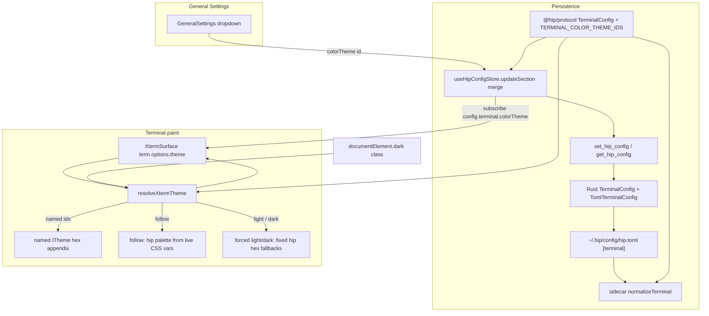
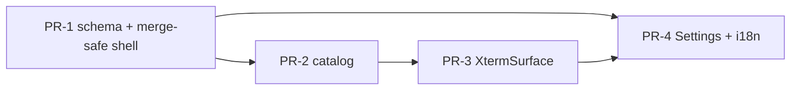

# Terminal Color Theme Options in General Settings

| Field | Value |
|------|-------|
| **Title** | Terminal color theme options in 通用设置 (General Settings) |
| **Author** | Engineering |
| **Date** | 2026-07-24 |
| **Status** | Draft (r2 — design review addressed) |
| **Audience** | Frontend / Tauri / protocol engineers familiar with hip settings + xterm |
| **Workspace** | `/Users/lijiamin/data/my-github/hip` |
| **Related** | `GeneralSettings.tsx`, `terminalTheme.ts`, `XtermSurface.tsx`, `[terminal]` hip.toml, D6a shared xterm host |
| **Revision** | 2026-07-24 r2 — PR-1 merge-safe shell; shared `TERMINAL_COLOR_THEME_IDS`; frozen hex appendix; KD-8/load/MO clarifications |

---

## Overview

hip’s integrated terminal (xterm) currently derives its palette solely from the app chrome dark class: `buildXtermTheme(isDarkDom())` in `src/components/artifact/terminalTheme.ts`, reapplied by a `MutationObserver` and a `useUiStore` theme effect inside `XtermSurface`. Users cannot keep a dark app chrome with a light terminal (or pick a familiar palette such as Solarized / Dracula) without changing the whole app theme.

This design adds a **Terminal color** (`终端颜色`) dropdown in General Settings that persists under the existing `[terminal]` section of `hip.toml` as `colorTheme`. The preference is resolved by a single catalog + resolver used by all `XtermSurface` consumers (code-panel Terminal tab and Terminal Management). Default remains **follow app theme** (`follow`), preserving today’s behavior when the field is omitted.

---

## Background & Motivation

### Current state (verified)

| Layer | Path | Behavior today |
|-------|------|----------------|
| Settings UI | `src/components/account/GeneralSettings.tsx` | Language, app theme, density, terminal **shell** (gated by `CODE_TERMINAL`), trash retention. Shell via `updateSection('terminal', { shell })` (**wholesale replace**). |
| Multi-field section pattern | `src/components/account/AcpSettings.tsx` | `patchAcp` uses functional merge: `(prev) => ({ ...(prev ?? {}), ...patch })` — **mirror this for terminal**. |
| Sole FE writer of `terminal` | repo grep | Only `GeneralSettings.tsx` calls `updateSection('terminal', …)` today. |
| Feature gate | `src/components/artifact/terminalFeature.ts` | `CODE_TERMINAL = true`. Terminal Management: `src/components/terminals/feature.ts` (`TERMINAL_MANAGEMENT = true`). |
| Config TS | `packages/protocol/src/hip-config.ts` | `TerminalConfig { shell?: TerminalShellPref }`; `HipConfig.terminal?`. Re-exported via `packages/protocol/src/index.ts` (`export * from './hip-config.js'`). |
| Config Rust | `src-tauri/src/hip_config.rs` | `TerminalConfig { shell: Option<String> }` + `TomlTerminalConfig`; **typed rewrite** on `set_hip_config` — unknown keys are **stripped**. Round-trip test: `terminal_survives_json_toml_roundtrip` in `src-tauri/src/lib.rs` (shell only today). ACP test also covers snake_case + camelCase alias fixtures — **terminal must match that bar**. |
| Config sidecar | `packages/sidecar/src/config/hip-config.ts` | Already imports types from `@hip/protocol`. `normalizeTerminal` only accepts known `shell` values; drops unknowns. |
| Theme builder | `src/components/artifact/terminalTheme.ts` | `resolveXtermTheme`: follow (CSS vars), forced light/dark (fixed hex), named presets (Appendix A). |
| Xterm host | `src/components/artifact/XtermSurface.tsx` | Creates `Terminal({ theme: buildXtermTheme() })`; `MutationObserver` on `document.documentElement` class; effect on `useUiStore.theme` (~L282–286). Boot effect deps: `[terminalId, cwd]` only. |
| Consumers | `TerminalView.tsx`, `ManagedTerminalSession.tsx` | Both mount shared `XtermSurface` (D6a single-writer). |
| App chrome theme | `src/store/uiStore.ts` | `theme: 'light' \| 'dark' \| 'system'` — **localStorage / uiStore**, not hip.toml. |
| hipConfig boot | `src/store/providersStore.ts` L128–129; `src/App.tsx` | `providersStore.load()` calls `useHipConfigStore.getState().load()` during app boot before main UI. |
| i18n | `src/i18n/en.ts`, `zh-CN.ts`, … | `settings.terminalShell*` already present; all five locales + `translation-keys.test.ts`. |

### Pain points

1. **No independent terminal palette** — terminal always tracks app light/dark.
2. **No familiar terminal presets** — power users expect Solarized / Dracula / One Dark, not only hip chrome tokens.
3. **Persistence split** — shell lives in hip.toml; if terminal color were put only in uiStore, terminal-related prefs would diverge. Prefer `[terminal]` consistency.
4. **Section replace hazard** — `updateSection('terminal', { shell })` **replaces** the whole section object (not deep-merge). Adding a second field without a functional updater will clobber sibling keys.

### Why now

Both code-panel and managed terminals already share one theme entry point (`buildXtermTheme` → `XtermSurface`). A small schema + catalog extension yields global UX with low surface area.

---

## Goals & Non-Goals

### Goals

1. Expose **Terminal color** in 通用设置 as a dropdown (same row pattern as shell / app theme).
2. Persist preference in `[terminal].colorTheme` (hip.toml) with **default `follow`** when omitted.
3. Ship a small fixed catalog: follow / hip light / hip dark / popular named presets (hex frozen in Appendix A).
4. Live-apply theme changes to the mounted xterm **without restart**.
5. Work for **all** `XtermSurface` consumers.
6. Full-stack config survival: protocol + Rust TOML/JSON round-trip (incl. aliases) + sidecar normalize.
7. Backward compatible: missing / unknown id → current follow-DOM behavior.
8. Fix terminal section updates to **merge** fields so shell and colorTheme do not clobber each other — **in the same PR that introduces the second field to the stack**, not deferred to the settings UI PR.

### Non-Goals (v1)

| Non-goal | Rationale |
|----------|-----------|
| Per-ANSI custom color picker | Speculative complexity; catalog covers familiar needs |
| Per-terminal / per-session theme override | Global pref matches shell pref product shape |
| Host-level or SSH-server theme | Coloring is client-side xterm only |
| Font size / font family / cursor style settings | Separate product ask |
| Changing app chrome theme from terminal settings | Already have `settings.theme` |
| Opacity / background image / glass terminal | Out of scope |
| Feature flag / dark launch | Pure additive default-compatible; kill by omitting UI if needed |
| Sidecar runtime use of colorTheme | FE-only at paint time; sidecar only must **not strip** on parse |

---

## Key Decisions

| ID | Decision | Rationale |
|----|----------|-----------|
| **KD-1** | Field name: `colorTheme` (not `theme`) | Avoid collision with app chrome `theme` in uiStore / `settings.theme` and mental model. TOML: `color_theme` with camelCase alias (same pattern as `fs_bridge` / `fsBridge`). |
| **KD-2** | Persist under existing `[terminal]` | Terminal-related prefs stay together; shell already there; no new top-level section. |
| **KD-3** | Default id: `follow` when field missing | Preserves current `isDarkDom()` behavior; no migration of existing configs. |
| **KD-4** | Catalog is a FE constant map → xterm `ITheme` | Named presets are static hex (Appendix A). **`follow`** uses live DOM CSS vars (`useDomTokens: true`) so brand tokens track chrome. **Forced `light` / `dark`** use fixed hip hex fallbacks (`useDomTokens: false`) so app chrome light/dark cannot clobber an independent terminal preference. |
| **KD-5** | Single resolver: `resolveXtermTheme(pref)` used only by `XtermSurface` / `terminalTheme.ts` | One paint path for code panel + managed terminals; no per-consumer branching. |
| **KD-6** | Functional merge on `updateSection('terminal', …)`; **land with PR-1** | `updateSection` replaces section value wholesale. Sole FE writer today is `GeneralSettings` (verified). Mirror `AcpSettings.patchAcp`. Merge-safe shell updater + clobber test ship in **PR-1** so the field cannot be wiped the moment schema exists. Color dropdown remains PR-4. |
| **KD-7** | Settings row visible when `CODE_TERMINAL \|\| TERMINAL_MANAGEMENT` | Color applies to all xterm hosts; shell stays CODE_TERMINAL-only (PTY default shell). |
| **KD-8** | Always re-resolve on DOM class / uiTheme / colorTheme changes | For non-`follow` prefs the palette is independent of `darkDom` (resolver ignores it). Keep MutationObserver always registered; re-resolve is cheap. Conditional observer is **not** required. |
| **KD-9** | Unknown ids: treat as `follow` (FE); sidecar omit | Matches shell unknown handling; never crash xterm. |
| **KD-10** | No feature flag | Backward-compatible default; scope is small. |
| **KD-11** | Single source of truth for id list: `@hip/protocol` exports `TERMINAL_COLOR_THEME_IDS` | FE + sidecar import the same const; avoids triplication skew when adding Nord later. i18n still per-locale but keys must equal id strings. |

---

## Proposed Design

### Product UX

**Placement:** 通用设置 (`GeneralSettings`), **immediately after** the existing Default terminal (shell) row when shell is shown; if only `TERMINAL_MANAGEMENT` is on and shell is hidden, place Terminal color after density (before trash retention).

**Control type:** Same as shell / app theme:
- Label + description (left)
- `DropdownMenu` + `Check` icons (right)
- Shared `selectTriggerCls`

**Labels (i18n examples):**

| Key | en | zh-CN |
|-----|----|-------|
| `settings.terminalColor` | Terminal color | 终端颜色 |
| `settings.terminalColorDesc` | Color palette for integrated terminals. Independent of app theme. | 集成终端的配色方案，与应用主题独立。 |
| `settings.terminalColors.follow` | Match app theme | 跟随应用主题 |
| `settings.terminalColors.light` | Light | 亮色 |
| `settings.terminalColors.dark` | Dark | 暗色 |
| `settings.terminalColors.solarized-dark` | Solarized Dark | Solarized Dark |
| `settings.terminalColors.solarized-light` | Solarized Light | Solarized Light |
| `settings.terminalColors.dracula` | Dracula | Dracula |
| `settings.terminalColors.one-dark` | One Dark | One Dark |

**Default selection:** `follow` (Match app theme / 跟随应用主题).

**Option order (v1 catalog):** same order as `TERMINAL_COLOR_THEME_IDS` in `@hip/protocol`:

1. `follow`
2. `light`
3. `dark`
4. `solarized-dark`
5. `solarized-light`
6. `dracula`
7. `one-dark`

**testids:**
- Row: `settings-terminal-color`
- Trigger: `settings-terminal-color-trigger`
- Items: `settings-terminal-color-{id}`

**No restart required** (unlike shell, which restarts PTY). Description must not claim restart is needed.

**i18n hyphenated keys (PR-4 footgun):** Locale objects must quote hyphenated ids; keep id strings identical to `TerminalColorThemeId` (no camelCase conversion):

```ts
// en.ts / zh-CN.ts — excerpt
terminalColors: {
  follow: 'Match app theme', // zh-CN: '跟随应用主题'
  light: 'Light',
  dark: 'Dark',
  'solarized-dark': 'Solarized Dark',
  'solarized-light': 'Solarized Light',
  dracula: 'Dracula',
  'one-dark': 'One Dark',
},
```

### Architecture



Note: DOM class always triggers re-resolve; only `follow` **depends** on `darkDom` / live CSS vars for the chosen palette. Forced `light` / `dark` ignore document tokens (`useDomTokens: false`).

### Config schema

#### Protocol (`packages/protocol/src/hip-config.ts`) — single source of truth for ids

`@hip/protocol` already re-exports `hip-config` via `packages/protocol/src/index.ts`. Export both the union type **and** an ordered const array so FE and sidecar share one list:

```ts
/**
 * Integrated terminal (xterm) color preference.
 * Independent of app chrome theme (`uiStore.theme`).
 * - `follow`: match document dark class (current default behavior)
 * - `light` / `dark`: fixed hip token-derived palettes
 * - named presets: static catalog entries (see design Appendix A)
 */
export const TERMINAL_COLOR_THEME_IDS = [
  'follow',
  'light',
  'dark',
  'solarized-dark',
  'solarized-light',
  'dracula',
  'one-dark',
] as const

export type TerminalColorThemeId = (typeof TERMINAL_COLOR_THEME_IDS)[number]

/** Runtime membership (sidecar normalize + FE normalize). */
export function isTerminalColorThemeId(v: string): v is TerminalColorThemeId {
  return (TERMINAL_COLOR_THEME_IDS as readonly string[]).includes(v)
}

/**
 * Optional `[terminal]` section in hip.toml.
 *
 * ```toml
 * [terminal]
 * shell = "zsh"
 * color_theme = "dracula"   # or colorTheme
 * ```
 */
export interface TerminalConfig {
  /** Default shell for new / restarted PTY sessions. */
  shell?: TerminalShellPref
  /**
   * xterm color palette id. Omitted / unknown → `follow`.
   * JSON/TS: `colorTheme`. TOML: `color_theme` (camelCase alias accepted).
   */
  colorTheme?: TerminalColorThemeId
}
```

**Adding a future preset (e.g. Nord):** extend `TERMINAL_COLOR_THEME_IDS` in protocol → TypeScript forces FE catalog + i18n updates; sidecar membership is automatic via import. Checklist still: protocol const, FE `NAMED` map + Appendix, five locales, design if product-facing.

**Contract test** (`hipConfig.contract.test.ts`): round-trip `{ shell: 'cmd', colorTheme: 'dracula' }`. Optional: assert `TERMINAL_COLOR_THEME_IDS` is non-empty and includes `follow`.

#### Rust (`src-tauri/src/hip_config.rs`)

```rust
// TerminalConfig (JSON camelCase via rename_all)
pub(crate) struct TerminalConfig {
    pub(crate) shell: Option<String>,
    #[serde(default, skip_serializing_if = "Option::is_none")]
    pub(crate) color_theme: Option<String>, // JSON key: "colorTheme"
}

// TomlTerminalConfig (snake_case + alias)
pub(crate) struct TomlTerminalConfig {
    pub(crate) shell: Option<String>,
    #[serde(default, skip_serializing_if = "Option::is_none", alias = "colorTheme")]
    pub(crate) color_theme: Option<String>,
}
```

Update `From` impls both ways to map `shell` **and** `color_theme`.

**Rust tests (match `acp_survives_json_toml_roundtrip` bar)** — extend / replace `terminal_survives_json_toml_roundtrip` in `src-tauri/src/lib.rs`:

1. **JSON → TOML → JSON round-trip** with **both** `shell` and `colorTheme` set; assert:
   - JSON emits `"colorTheme"`
   - TOML emits `color_theme` (snake_case) under `[terminal]`
   - round-trip restores both fields
2. **Raw TOML snake_case fixture:**
   ```toml
   version = 1
   [terminal]
   shell = "zsh"
   color_theme = "dracula"
   ```
   → loads `shell=zsh`, `color_theme=dracula`
3. **Raw TOML camelCase alias fixture:**
   ```toml
   version = 1
   [terminal]
   shell = "bash"
   colorTheme = "one-dark"
   ```
   → loads via `alias = "colorTheme"`

> **Severity: High if missed** — Without Rust field, first settings save strips hand-edited `color_theme` from hip.toml (same class of bug already guarded for shell / acp / plan).

#### Sidecar (`packages/sidecar/src/config/hip-config.ts`)

Import the shared list; do **not** maintain a parallel Set of string literals:

```ts
import {
  type TerminalConfig,
  type TerminalShellPref,
  type TerminalColorThemeId,
  isTerminalColorThemeId,
  // or: TERMINAL_COLOR_THEME_IDS + membership helper
} from '@hip/protocol'

function normalizeTerminal(raw: Record<string, unknown>): TerminalConfig {
  const out: TerminalConfig = {}
  // shell … existing TERMINAL_SHELL_PREFS check …
  const ct = raw.colorTheme ?? raw.color_theme
  if (typeof ct === 'string') {
    const id = ct.trim().toLowerCase()
    if (isTerminalColorThemeId(id)) {
      out.colorTheme = id
    }
  }
  return out
}
```

Add parse tests mirroring shell cases:
- valid `color_theme = "dracula"`
- valid camelCase `colorTheme = "one-dark"`
- unknown id → field omitted (section may still have shell)

### Theme catalog & resolution

#### File layout

Keep resolution in `src/components/artifact/terminalTheme.ts` (or split `terminalThemeCatalog.ts` only if the file grows past ~200 LOC — prefer single file first).

**Ids:** re-export from protocol for UI convenience; do not redefine the array.

```ts
import type { ITheme } from '@xterm/xterm'
import {
  type TerminalColorThemeId,
  TERMINAL_COLOR_THEME_IDS,
  isTerminalColorThemeId,
} from '@hip/protocol'

export { TERMINAL_COLOR_THEME_IDS } // re-export for GeneralSettings dropdown

export function normalizeTerminalColorThemeId(
  raw: string | undefined | null,
): TerminalColorThemeId {
  if (!raw) return 'follow'
  const id = raw.trim().toLowerCase()
  return isTerminalColorThemeId(id) ? id : 'follow'
}

/** Hip light/dark builders. `useDomTokens` controls CSS-var vs fixed hex. */
export function buildHipXtermTheme(
  dark = isDarkDom(),
  opts?: { useDomTokens?: boolean },
): ITheme { /* current bodies */ }

/** Back-compat: hip light/dark only (does not read colorTheme pref); always useDomTokens. */
export function buildXtermTheme(dark = isDarkDom()): ITheme {
  return buildHipXtermTheme(dark, { useDomTokens: true })
}

/**
 * Named presets — hex values locked in design Appendix A.
 * Source URLs must appear as code comments above each entry.
 */
const NAMED: Record<
  Exclude<TerminalColorThemeId, 'follow' | 'light' | 'dark'>,
  ITheme
> = {
  'solarized-dark': { /* Appendix A.1 */ },
  'solarized-light': { /* Appendix A.2 */ },
  dracula: { /* Appendix A.3 */ },
  'one-dark': { /* Appendix A.4 */ },
}

export function resolveXtermTheme(
  pref: TerminalColorThemeId | undefined | null,
  darkDom: boolean = isDarkDom(),
): ITheme {
  const id = normalizeTerminalColorThemeId(pref ?? undefined)
  switch (id) {
    case 'follow':
      // Track app chrome tokens from the live DOM.
      return buildHipXtermTheme(darkDom, { useDomTokens: true })
    case 'light':
      // Forced hip light — never read light/dark from the current app theme.
      return buildHipXtermTheme(false, { useDomTokens: false })
    case 'dark':
      // Forced hip dark — independent of documentElement.dark / CSS vars.
      return buildHipXtermTheme(true, { useDomTokens: false })
    default:
      return NAMED[id]
  }
}
```

#### Named palette requirements

Each catalog entry must set at least:

- `background`, `foreground`, `cursor`, `cursorAccent`
- `selectionBackground` (and `selectionForeground` when contrast needs it)
- Full 16 ANSI: `black`…`white`, `brightBlack`…`brightWhite`

Implementers **must** use the frozen tables in **Appendix A** (not invent hex). Comment each map with its source URL.

#### Hip light/dark

- **`follow`**: CSS-var-based builders (`--bg-app`, `--text-primary`, `--danger`, etc.) so the terminal stays brand-aligned when chrome tokens change (`useDomTokens: true`).
- **Forced `light` / `dark`**: same palette *structure* as hip light/dark, but **fixed hex fallbacks only** (`useDomTokens: false`). Do **not** read live CSS vars — otherwise a light app theme overrides “Terminal color → Dark” (and vice versa).

### XtermSurface wiring

Today (simplified):

```ts
const theme = useUiStore((s) => s.theme)
// boot: theme: buildXtermTheme()
// mo: buildXtermTheme(isDarkDom())
// effect([theme]): buildXtermTheme(isDarkDom())
// boot effect deps: [terminalId, cwd] only
```

Target:

```ts
const uiTheme = useUiStore((s) => s.theme)
const colorTheme = useHipConfigStore(
  (s) => normalizeTerminalColorThemeId(s.config.terminal?.colorTheme),
)

// Inside boot async after term created:
// INVARIANT: MO / any non-React callback MUST read latest pref via getState().
// Closing over `colorTheme` from the render that started the boot effect is stale
// when the user changes settings without remounting (boot deps are [terminalId, cwd]).
const applyTheme = () => {
  if (!term) return
  const pref = useHipConfigStore.getState().config.terminal?.colorTheme
  term.options.theme = resolveXtermTheme(pref, isDarkDom())
}
applyTheme()

mo = new MutationObserver(applyTheme)
mo.observe(document.documentElement, { attributes: true, attributeFilter: ['class'] })

// React path: settings-driven + app theme toggles that also set class / uiTheme
useEffect(() => {
  const term = termRef.current
  if (!term) return
  term.options.theme = resolveXtermTheme(colorTheme, isDarkDom())
}, [uiTheme, colorTheme])
```

**hipConfig load timing (verified):**

- App boot: `App.tsx` → `providersStore.load()` → `useHipConfigStore.getState().load()` (`providersStore.ts` L128–129). By the time UI (and any `XtermSurface`) mounts, hipConfig is typically already loaded unless load failed.
- `GeneralSettings` also calls `load()` if `!loaded` — secondary safety, not the primary load site.
- **XtermSurface must not call `load()` itself.**
- Defensive default remains: `undefined` / missing → `follow` (equals current paint). Optional: include `loaded` in the theme effect deps if a failed load is later retried and config appears.

**Shell / colorTheme merge fix** — lands in **PR-1** for shell; color setter lands with PR-4 UI:

```ts
// PR-1: fix existing shell writer immediately (mirror AcpSettings.patchAcp)
const setTerminalShell = (shell: TerminalShellPref) => {
  void updateSection('terminal', (prev) => ({ ...(prev ?? {}), shell }))
}

// PR-4: color dropdown
const setTerminalColorTheme = (colorTheme: TerminalColorThemeId) => {
  void updateSection('terminal', (prev) => ({ ...(prev ?? {}), colorTheme }))
}
```

**Sole writer audit:** Grep confirms only `GeneralSettings.tsx` writes `updateSection('terminal', …)`. Fixing that one site is sufficient. If a future writer is added, it must use the same merge pattern (document in code comment near the setter).

### Sequence: user changes terminal color

```mermaid
sequenceDiagram
  participant U as User
  participant GS as GeneralSettings
  participant HCS as hipConfigStore
  participant R as Rust set_hip_config
  participant XS as XtermSurface
  participant XT as xterm Terminal

  U->>GS: Select "Dracula"
  GS->>HCS: updateSection('terminal', merge colorTheme)
  HCS->>HCS: Zustand config.terminal.colorTheme = dracula
  HCS->>R: setHipConfig(full config)
  R->>R: Serialize [terminal] shell + color_theme
  HCS-->>XS: selector colorTheme changes
  XS->>XT: term.options.theme = resolveXtermTheme('dracula')
  Note over XT: Visible immediately; scrollback colors already written stay<br/>as prior SGR; new output uses new theme defaults
```

**Note on scrollback:** xterm applies theme to default colors; already-emitted SGR sequences keep their cells. This is standard (VS Code / iTerm behavior) and acceptable for v1. No buffer rewrite.

### Settings UI sketch

```tsx
import { TERMINAL_COLOR_THEME_IDS } from '@hip/protocol'
// or re-export from terminalTheme

{(CODE_TERMINAL || TERMINAL_MANAGEMENT) ? (
  <div className="flex items-center justify-between gap-6 px-8 py-4" data-testid="settings-terminal-color">
    <div className="min-w-0 flex-1">
      <div className="text-body font-medium text-ink">{t('settings.terminalColor')}</div>
      <div className="mt-0.5 text-meta leading-relaxed text-ink-tertiary">
        {t('settings.terminalColorDesc')}
      </div>
    </div>
    <div className="relative shrink-0">
      <DropdownMenu modal={false}>
        <DropdownMenuTrigger asChild>
          <button type="button" className={selectTriggerCls} data-testid="settings-terminal-color-trigger">
            <span>{t(`settings.terminalColors.${terminalColorTheme}`)}</span>
            <ChevronDown size={14} strokeWidth={1.75} className="shrink-0 text-ink-tertiary" />
          </button>
        </DropdownMenuTrigger>
        <DropdownMenuContent align="end">
          {TERMINAL_COLOR_THEME_IDS.map((id) => (
            <DropdownMenuItem
              key={id}
              data-testid={`settings-terminal-color-${id}`}
              onSelect={() => setTerminalColorTheme(id)}
            >
              <Check size={14} className={cn('shrink-0', terminalColorTheme === id ? 'opacity-100' : 'opacity-0')} />
              <span>{t(`settings.terminalColors.${id}`)}</span>
            </DropdownMenuItem>
          ))}
        </DropdownMenuContent>
      </DropdownMenu>
    </div>
  </div>
) : null}
```

---

## API / Interface Changes

| Surface | Change |
|---------|--------|
| `@hip/protocol` `TerminalConfig` | + `colorTheme?: TerminalColorThemeId` |
| `@hip/protocol` | + `TerminalColorThemeId`, `TERMINAL_COLOR_THEME_IDS`, `isTerminalColorThemeId` |
| Rust `TerminalConfig` / `TomlTerminalConfig` | + `color_theme` / JSON `colorTheme` + alias |
| Sidecar `normalizeTerminal` | Accept + validate via shared protocol helper |
| `terminalTheme.ts` | + named hex catalog (Appendix A), `normalizeTerminalColorThemeId`, `resolveXtermTheme`; re-export id list; keep `buildXtermTheme` as hip helper |
| `XtermSurface.tsx` | Subscribe `colorTheme`; `resolveXtermTheme`; MO uses `getState()` |
| `GeneralSettings.tsx` | PR-1: merge-safe shell; PR-4: color row + merge-safe color setter |
| i18n en / zh-CN / zh-TW / ja / ko | New keys under `settings.*` (quoted hyphenated ids) |
| hip.toml | Optional `color_theme` under `[terminal]` |

No IPC protocol version bump beyond existing HipConfig JSON shape (additive optional field).

No Rust command surface changes beyond serialization of HipConfig.

---

## Data Model Changes

### hip.toml example

```toml
version = 1

[terminal]
shell = "zsh"
color_theme = "dracula"
```

### Writers

| Writer | Action |
|--------|--------|
| FE `GeneralSettings` | **Sole** FE writer of `terminal` today (verified). Merge-safe shell in PR-1; color in PR-4. |
| Rust `set_hip_config` | Full-file rewrite from typed config — must include `color_theme`. |
| Sidecar parse | Normalize only; no runtime paint. |

### Migration

- **None.** Missing field ⇒ `follow`.
- Unknown string ⇒ treated as `follow` (FE); omitted by sidecar normalize.
- No DB / session migration.

### Storage estimates

- One string id (~16 bytes) per user config file. Negligible.

---

## Alternatives Considered

### A1. Store terminal color in `uiStore` (with app theme)

| Pros | Cons |
|------|------|
| Live update without hipConfig load | Splits terminal prefs (shell in toml, color in uiStore) |
| No Rust/sidecar schema work | Violates “prefer consistent persistence for terminal-related prefs” |
| | Hand-edit / backup of hip.toml would not capture color |

**Rejected** in favor of `[terminal].colorTheme`.

### A2. Only light / dark / follow — no named presets

| Pros | Cons |
|------|------|
| Smaller catalog | Misses primary product ask (“or other color themes”) |
| Less i18n / tests | Easy to add presets once plumbing exists |

**Rejected** as v1 product; catalog of ~4 named themes is low cost once resolver exists.

### A3. Full custom ANSI color picker

| Pros | Cons |
|------|------|
| Maximum flexibility | Large UI, validation, persistence of 16+ colors |
| | Speculative; not requested as v1 |

**Deferred** to a future revision if demand appears.

### A4. New top-level `[appearance]` or `[terminalUi]` section

| Pros | Cons |
|------|------|
| Separation of chrome vs terminal | Extra section for one field; shell already under `[terminal]` |

**Rejected** — extend `[terminal]`.

### A5. CSS variables for all named themes

| Pros | Cons |
|------|------|
| Theming consistency with Tailwind | Named themes are not part of app design system; static ITheme is simpler and matches xterm API |

**Rejected** for named presets. For hip palettes: `follow` keeps CSS vars; forced `light`/`dark` use fixed hex (`useDomTokens: false`).

---

## Security & Privacy Considerations

| Topic | Assessment |
|-------|------------|
| Threat model | Preference is non-secret UI chrome; no auth impact |
| hip.toml | Already user-writable; no secrets in `colorTheme` |
| XSS / injection | Theme ids are enum-validated via shared protocol helper; hex colors are compile-time constants, not user HTML |
| TOML injection | Serde typed write; no string interpolation of theme into shell |
| Privacy | No telemetry required for v1 |

---

## Observability

| Signal | Plan |
|--------|------|
| Logging | None required in production path (hot path on theme apply). Optional `console.debug` only if debugging. |
| Metrics | Not needed for local preference. |
| Errors | Invalid id silently falls back to `follow` (same as bad shell). Persist failures surface via existing `hipConfigStore.error`. |
| QA | Unit tests + manual dogfood matrix (follow + named × light/dark app chrome). |

---

## Rollout Plan

1. **No feature flag** — default `follow` is behavior-preserving.
2. **PR-1 first:** schema (protocol + Rust + sidecar) **and** merge-safe shell updater so sibling fields cannot be wiped once `colorTheme` exists anywhere (hand-edit or future UI).
3. Land resolver + XtermSurface wiring (can ship before UI; no user-visible change until settings row).
4. Land General Settings + i18n last (**hard-depends on PR-3** for paint so saved prefs are visible).
5. **Rollback:** revert settings UI PR; or omit `colorTheme`; existing follow path remains. If catalog breaks paint, `resolveXtermTheme` hard-fallback to `buildHipXtermTheme(isDarkDom())`.

### Risks

| Risk | Severity | Mitigation |
|------|----------|------------|
| Rust omits `color_theme` on rewrite | **High** | JSON+TOML+alias tests matching acp pattern; land Rust with protocol |
| Section clobber (shell wipes colorTheme) | **High** | **PR-1** functional merge shell updater + clobber regression test; sole writer is GeneralSettings |
| Theme flash on config load | Low | Boot preload via providersStore; undefined → follow equals current boot path |
| Named palette contrast poor | Low | Frozen Appendix A palettes; bg ≠ fg smoke tests |
| i18n key drift / unquoted hyphen keys | Medium | Quoted keys snippet; `translation-keys.test.ts` parity; all locales same PR |
| PR-4 before PR-3: saved pref with no paint | Medium | **Hard-depend PR-4 on PR-3**; do not ship dropdown that writes unpainted prefs |
| Id list skew FE vs sidecar | Medium | Single export from `@hip/protocol` (KD-11) |
| Stale MO closure over colorTheme | Medium | Document invariant: MO uses `getState()` only |

---

## Tests Plan

| Area | File | Cases |
|------|------|-------|
| Protocol | `packages/protocol/src/hipConfig.contract.test.ts` | Round-trip `{ shell, colorTheme }`; `TERMINAL_COLOR_THEME_IDS` / `isTerminalColorThemeId` |
| Sidecar | `packages/sidecar/src/config/hip-config.test.ts` | Parse `color_theme` / `colorTheme`; ignore unknown; shell+colorTheme together |
| Rust | `src-tauri/src/lib.rs` | JSON→TOML→JSON both fields; snake_case fixture; camelCase alias fixture (mirror acp test structure) |
| Resolver | `src/components/artifact/terminalTheme.test.ts` | normalize unknown→follow; follow respects darkDom; light/dark ignore darkDom flip; each named id `background !== foreground`; every `TERMINAL_COLOR_THEME_IDS` entry resolvable |
| Settings (PR-1) | `src/components/account/GeneralSettings.test.tsx` | Shell persist uses functional updater; **clobber test**: mock prev `{ colorTheme: 'dracula' }`, change shell, assert updater result still has `colorTheme` (or spy that updater is a function and apply it to prev). Update existing expectation that currently expects object form `{ shell: 'powershell' }`. |
| Settings (PR-4) | same file | Color row renders; select persists colorTheme via merge updater; color update preserves shell |
| Xterm (optional light) | `TerminalView.test.tsx` or thin unit | Mock store colorTheme; assert theme apply if test harness allows; note MO path uses getState |

Manual dogfood:

1. App dark + terminal light → readable light terminal, dark chrome.
2. App light + terminal dark.
3. Select Dracula → both code-panel Terminal and managed terminal update live.
4. Restart app → preference restored from hip.toml.
5. Hand-edit `color_theme = "one-dark"`, reload → selected.
6. Change shell after color → color remains (**PR-1 must already guarantee this**).
7. Hand-edit `colorTheme = "dracula"` (camelCase), reload → selected (Rust alias).

---

## Open Questions

| ID | Question | Default if unresolved |
|----|----------|----------------------|
| OQ-1 | Exact named preset list for v1 — add Nord / Monokai? | Ship 4 named (Solarized×2, Dracula, One Dark). Expanding = edit `TERMINAL_COLOR_THEME_IDS` in protocol + FE hex map + five locales (single-source ids reduce skew). |
| OQ-2 | Show mini color swatches in dropdown? | No in v1 (text labels only; matches shell row craft) |
| OQ-3 | Should `follow` label say “Match app theme” or “Auto”? | “Match app theme” / “跟随应用主题” |
| OQ-4 | Persist even when value is `follow` (explicit) vs omit? | Explicit write of `follow` is OK; both normalize to follow |

---

## References

- `src/components/account/GeneralSettings.tsx` — settings row patterns; sole `terminal` writer
- `src/components/account/AcpSettings.tsx` — `patchAcp` functional merge pattern to mirror
- `src/components/artifact/terminalTheme.ts` — current dual palette
- `src/components/artifact/XtermSurface.tsx` — theme apply + observers; boot deps `[terminalId, cwd]`
- `packages/protocol/src/hip-config.ts` / `index.ts` — `TerminalConfig` re-export surface
- `src-tauri/src/hip_config.rs` — typed TerminalConfig (must extend)
- `src-tauri/src/lib.rs` — `terminal_survives_json_toml_roundtrip`, `acp_survives_json_toml_roundtrip` (alias test pattern)
- `packages/sidecar/src/config/hip-config.ts` — `normalizeTerminal`
- `src/store/hipConfigStore.ts` — `updateSection` replaces section value
- `src/store/providersStore.ts` L128–129 — hipConfig load on app boot
- `@xterm/xterm` `ITheme` — palette shape
- App chrome theme: `src/store/uiStore.ts` (`theme: light|dark|system`)
- Sources for Appendix A: ethanschoonover.com/solarized; draculatheme.com/spec; Atom One Dark community ports

---

## PR Plan

Incremental, each independently reviewable and mergeable. **Order is dependency order.**

### PR-1: Schema + merge-safe shell updater (foundation)

- **Title:** `feat(config): terminal.colorTheme schema + merge-safe shell updates`
- **Files / components:**
  - `packages/protocol/src/hip-config.ts` — `TERMINAL_COLOR_THEME_IDS`, `TerminalColorThemeId`, `isTerminalColorThemeId`, extend `TerminalConfig`
  - `packages/protocol/src/hipConfig.contract.test.ts`
  - `packages/sidecar/src/config/hip-config.ts` — `normalizeTerminal` using protocol helper
  - `packages/sidecar/src/config/hip-config.test.ts`
  - `src-tauri/src/hip_config.rs` — JSON + TOML structs + `From` impls
  - `src-tauri/src/lib.rs` — extend terminal round-trip **and** snake_case + camelCase alias fixtures (mirror acp); update all `TerminalConfig { shell: … }` literals
  - `src/components/account/GeneralSettings.tsx` — **only** change shell setter to functional merge (mirror `AcpSettings.patchAcp`); no color UI yet
  - `src/components/account/GeneralSettings.test.tsx` — update shell persist test from object form → functional updater; add clobber regression (prev with `colorTheme` survives shell change)
- **Dependencies:** none
- **Description:** Additive optional field + safe multi-field writes. No color dropdown. Ensures `set_hip_config` never strips `color_theme`, and the only FE writer cannot wipe siblings. Unknown ids ignored by sidecar normalize.

### PR-2: Theme catalog + resolver

- **Title:** `feat(terminal): resolve xterm themes from colorTheme catalog`
- **Files / components:**
  - `src/components/artifact/terminalTheme.ts` — import ids from protocol; Appendix A hex maps; `normalizeTerminalColorThemeId`; `resolveXtermTheme`; keep hip builders
  - `src/components/artifact/terminalTheme.test.ts`
- **Dependencies:** PR-1 (type + id list from `@hip/protocol`)
- **Description:** Pure FE module. Hex values **must** match Appendix A with source URL comments. Existing `buildXtermTheme(dark)` remains for hip light/dark. No XtermSurface change yet — tests prove resolver contracts (incl. bg ≠ fg per named id).

### PR-3: Wire XtermSurface to hipConfig colorTheme

- **Title:** `feat(terminal): live-apply terminal colorTheme in XtermSurface`
- **Files / components:**
  - `src/components/artifact/XtermSurface.tsx` — subscribe `useHipConfigStore` + `resolveXtermTheme`; MO/`applyTheme` uses `getState()`; React effect on `[uiTheme, colorTheme]`
  - Optionally light tests if cheap
- **Dependencies:** PR-2 (and PR-1 types)
- **Description:** All consumers (code panel + managed) pick up preference. Missing field → follow (current visuals). Does not call `load()`; relies on boot preload. Live update when store or DOM class changes.

### PR-4: General Settings UI + i18n

- **Title:** `feat(settings): Terminal color dropdown in 通用设置`
- **Files / components:**
  - `src/components/account/GeneralSettings.tsx` — color row, gate `CODE_TERMINAL \|\| TERMINAL_MANAGEMENT`, merge colorTheme setter (shell already merge-safe from PR-1)
  - `src/components/account/GeneralSettings.test.tsx` — color select + preserve shell
  - `src/i18n/en.ts`, `zh-CN.ts`, `zh-TW.ts`, `ja.ts`, `ko.ts` — quoted hyphenated keys under `settings.terminalColors`
  - `src/i18n/translation-keys.test.ts` if new parity assertions needed
- **Dependencies:** **PR-1 (hard)** + **PR-3 (hard)** — do not ship a dropdown that persists prefs with no paint path. (PR-2 is implied via PR-3.)
- **Description:** Product-facing completion. Preference saved and visible immediately. No alternate “settings-only before paint” path.

### Suggested merge graph



**Required order:** PR-1 → PR-2 → PR-3 → PR-4.  
PR-4 **must not** merge without PR-3: shipping a saved preference with no visible effect causes support confusion. Prefer hard dependency in review checklist.

---

## Success Criteria

1. User can open 通用设置 and set **终端颜色** independently of app **主题**.
2. Preference survives app restart via hip.toml (snake_case and camelCase hand-edits).
3. Mounted terminals recolor without restart.
4. Code-panel and managed terminals share the same palette.
5. Omitted config behaves exactly as today (follow DOM dark class).
6. Changing shell does not wipe colorTheme and vice versa (**true as soon as PR-1 lands** for shell→sibling safety).
7. Rust JSON/TOML/alias round-trip retains `colorTheme` alongside `shell`.
8. FE and sidecar validate ids from the same `@hip/protocol` export.

---

## Appendix A — Frozen named palette hex tables (implement as-is)

These values are design-locked for PR-2. Map each block into xterm `ITheme` fields. Keep source URLs as comments above each entry in code.

### A.1 Solarized Dark

**Source:** Ethan Schoonover, Solarized — https://ethanschoonover.com/solarized/  
**Mapping notes:** dark bg = `base03`, fg = `base0`; ANSI black = `base02`, bright black = `base01`; white = `base2`, bright white = `base3`; accents per official yellow/orange/red/magenta/violet/blue/cyan/green. Cursor = fg; cursorAccent = bg; selectionBackground ≈ `base02` with alpha or solid `#073642`.

| ITheme field | Hex |
|--------------|-----|
| background | `#002b36` (base03) |
| foreground | `#839496` (base0) |
| cursor | `#839496` |
| cursorAccent | `#002b36` |
| selectionBackground | `#073642` (base02) |
| selectionForeground | `#93a1a1` (base1) |
| black | `#073642` (base02) |
| red | `#dc322f` |
| green | `#859900` |
| yellow | `#b58900` |
| blue | `#268bd2` |
| magenta | `#d33682` |
| cyan | `#2aa198` |
| white | `#eee8d5` (base2) |
| brightBlack | `#586e75` (base01) |
| brightRed | `#cb4b16` (orange) |
| brightGreen | `#859900` |
| brightYellow | `#b58900` |
| brightBlue | `#268bd2` |
| brightMagenta | `#6c71c4` (violet) |
| brightCyan | `#2aa198` |
| brightWhite | `#fdf6e3` (base3) |

### A.2 Solarized Light

**Source:** same as A.1  
**Mapping notes:** light bg = `base3`, fg = `base00`; invert monotone roles per Solarized dual-mode.

| ITheme field | Hex |
|--------------|-----|
| background | `#fdf6e3` (base3) |
| foreground | `#657b83` (base00) |
| cursor | `#657b83` |
| cursorAccent | `#fdf6e3` |
| selectionBackground | `#eee8d5` (base2) |
| selectionForeground | `#586e75` (base01) |
| black | `#073642` (base02) |
| red | `#dc322f` |
| green | `#859900` |
| yellow | `#b58900` |
| blue | `#268bd2` |
| magenta | `#d33682` |
| cyan | `#2aa198` |
| white | `#eee8d5` (base2) |
| brightBlack | `#586e75` (base01) |
| brightRed | `#cb4b16` (orange) |
| brightGreen | `#859900` |
| brightYellow | `#b58900` |
| brightBlue | `#268bd2` |
| brightMagenta | `#6c71c4` (violet) |
| brightCyan | `#2aa198` |
| brightWhite | `#002b36` (base03) |

### A.3 Dracula

**Source:** Dracula Theme Spec — https://draculatheme.com/spec and ANSI CSS — https://draculatheme.com/dracula-css  

| ITheme field | Hex |
|--------------|-----|
| background | `#282a36` |
| foreground | `#f8f8f2` |
| cursor | `#f8f8f2` |
| cursorAccent | `#282a36` |
| selectionBackground | `#44475a` |
| selectionForeground | `#f8f8f2` |
| black | `#21222c` |
| red | `#ff5555` |
| green | `#50fa7b` |
| yellow | `#f1fa8c` |
| blue | `#bd93f9` |
| magenta | `#ff79c6` |
| cyan | `#8be9fd` |
| white | `#f8f8f2` |
| brightBlack | `#6272a4` |
| brightRed | `#ff6e6e` |
| brightGreen | `#69ff94` |
| brightYellow | `#ffffa5` |
| brightBlue | `#d6acff` |
| brightMagenta | `#ff92df` |
| brightCyan | `#a4ffff` |
| brightWhite | `#ffffff` |

*(Bright ANSI: use Dracula’s standard bright variants as published on draculatheme.com/dracula-css when available; if a bright channel is unspecified there, use the table above.)*

### A.4 One Dark

**Source:** Atom One Dark community terminal ports (e.g. Ghostty style config / joshdick onedark.vim lineage). Background/fg from Atom One Dark syntax (`#282c34` / `#abb2bf`). ANSI 16 aligned with common One Dark terminal palettes:

| ITheme field | Hex |
|--------------|-----|
| background | `#282c34` |
| foreground | `#abb2bf` |
| cursor | `#528bff` |
| cursorAccent | `#282c34` |
| selectionBackground | `#3e4451` |
| selectionForeground | `#abb2bf` |
| black | `#21252b` |
| red | `#e06c75` |
| green | `#98c379` |
| yellow | `#e5c07b` |
| blue | `#61afef` |
| magenta | `#c678dd` |
| cyan | `#56b6c2` |
| white | `#abb2bf` |
| brightBlack | `#5c6370` |
| brightRed | `#e06c75` |
| brightGreen | `#98c379` |
| brightYellow | `#e5c07b` |
| brightBlue | `#61afef` |
| brightMagenta | `#c678dd` |
| brightCyan | `#56b6c2` |
| brightWhite | `#ffffff` |

### A.5 Contrast smoke (tests)

For every named id in Appendix A and for hip light/dark:

- `theme.background !== theme.foreground`
- all 16 ANSI keys present and non-empty strings
