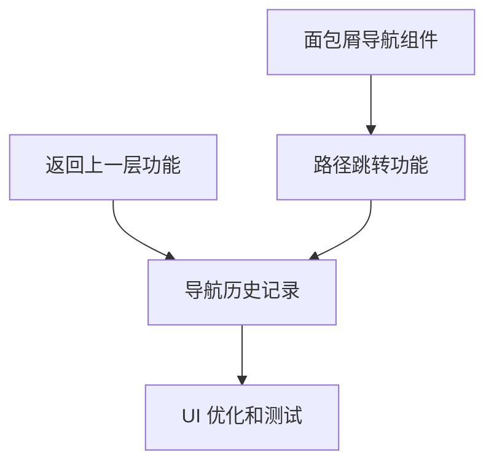

# 终端文件面板导航增强执行计划

- 系列：`docs/design/terminal-file-navigation/`
- 配套：`terminal-file-navigation-spec.md`（需求规格）
- 状态：待评审
- 日期：2026-08-27

---

## 1. 任务分解

### T1 面包屑导航组件（P0）

**任务描述：** 创建面包屑导航组件，显示当前路径层级结构

**子任务：**
1. 创建 `TerminalBreadcrumb.tsx` 组件
2. 实现路径解析逻辑
3. 实现面包屑渲染
4. 添加点击导航功能
5. 添加路径折叠逻辑

**预计工时：** 4 小时

**验收标准：**
- [ ] 面包屑正确显示当前路径
- [ ] 点击面包屑片段可导航到对应目录
- [ ] 路径过长时自动折叠中间部分
- [ ] 鼠标悬停显示完整路径

### T2 返回上一层功能（P0）

**任务描述：** 实现返回上一层目录功能

**子任务：**
1. 在工具栏添加"返回上一层"按钮
2. 实现父目录路径计算
3. 实现导航逻辑
4. 添加快捷键支持（Alt+↑）
5. 处理边界情况（根目录禁用）

**预计工时：** 3 小时

**验收标准：**
- [ ] 点击按钮可返回父目录
- [ ] 根目录时按钮禁用
- [ ] 快捷键 Alt+↑ 可返回父目录
- [ ] 导航后面包屑同步更新

### T3 路径跳转功能（P1）

**任务描述：** 实现路径输入框，支持直接输入路径跳转

**子任务：**
1. 创建 `PathInput.tsx` 组件
2. 实现路径输入框
3. 实现路径解析和标准化
4. 实现特殊路径处理（~、.、..）
5. 添加快捷键支持（Ctrl+L）

**预计工时：** 5 小时

**验收标准：**
- [ ] 点击面包屑或按 Ctrl+L 激活路径输入
- [ ] 输入路径后按 Enter 可跳转
- [ ] 支持绝对路径和相对路径
- [ ] 支持特殊路径（~、.、..）
- [ ] 输入错误路径时显示错误提示

### T4 导航历史记录（P2）

**任务描述：** 实现导航历史记录，支持后退/前进

**子任务：**
1. 扩展 `terminalFsStore.ts`，添加历史记录状态
2. 实现历史记录入栈逻辑
3. 实现后退/前进功能
4. 添加历史记录下拉菜单
5. 添加书签功能

**预计工时：** 6 小时

**验收标准：**
- [ ] 导航历史自动记录
- [ ] 后退/前进按钮可用
- [ ] 快捷键 Alt+←/→ 可后退/前进
- [ ] 历史记录下拉菜单可查看历史
- [ ] 书签功能可用

### T5 UI 优化和测试（P2）

**任务描述：** 优化 UI 交互，编写测试

**子任务：**
1. 优化面包屑样式
2. 优化路径输入框样式
3. 编写单元测试
4. 编写集成测试
5. 用户测试和反馈收集

**预计工时：** 4 小时

**验收标准：**
- [ ] UI 符合设计规范
- [ ] 测试覆盖率 > 80%
- [ ] 无关键 bug
- [ ] 用户体验良好

---

## 2. 实现阶段

### 阶段 1：基础导航（P0）

**目标：** 实现面包屑导航和返回上一层功能

**任务：**
- [ ] T1 面包屑导航组件
- [ ] T2 返回上一层功能

**预计工时：** 7 小时

**里程碑：** 用户可通过面包屑和返回按钮导航文件系统

### 阶段 2：路径跳转（P1）

**目标：** 实现路径输入框和快捷键

**任务：**
- [ ] T3 路径跳转功能

**预计工时：** 5 小时

**里程碑：** 用户可通过输入路径快速跳转

### 阶段 3：历史记录和优化（P2）

**目标：** 实现历史记录和 UI 优化

**任务：**
- [ ] T4 导航历史记录
- [ ] T5 UI 优化和测试

**预计工时：** 10 小时

**里程碑：** 完整的导航体验，包括历史记录和书签

---

## 3. 技术实现细节

### 3.1 状态管理扩展

```typescript
// terminalFsStore.ts 新增字段
interface TerminalFsSlice {
  // 现有字段...
  
  // 导航状态
  navigationHistory: string[]  // 导航历史
  historyIndex: number         // 当前历史索引
  bookmarks: Array<{ name: string; path: string }>  // 书签
  isPathInputActive: boolean   // 路径输入框是否激活
}

// 新增 action
interface TerminalFsStore {
  // 现有 action...
  
  // 导航 action
  pushHistory: (terminalId: string, path: string) => void
  goBack: (terminalId: string) => string | null
  goForward: (terminalId: string) => string | null
  addBookmark: (terminalId: string, name: string, path: string) => void
  removeBookmark: (terminalId: string, path: string) => void
  setPathInputActive: (terminalId: string, active: boolean) => void
}
```

### 3.2 路径工具函数

```typescript
// lib/pathUtils.ts
export function getParentPath(path: string): string {
  if (!path || path === '/') return '/'
  const normalized = path.replace(/\/+$/, '')
  const lastSlash = normalized.lastIndexOf('/')
  if (lastSlash <= 0) return '/'
  return normalized.slice(0, lastSlash)
}

export function normalizePath(path: string, basePath?: string): string {
  // 处理特殊路径
  if (path === '~') {
    return getHomeDirectory()
  }
  if (path === '.') {
    return basePath || '/'
  }
  if (path === '..') {
    return basePath ? getParentPath(basePath) : '/'
  }
  
  // 标准化路径
  let normalized = path.replace(/\\/g, '/')
  if (!normalized.startsWith('/')) {
    // 相对路径
    normalized = basePath ? `${basePath}/${normalized}` : `/${normalized}`
  }
  
  // 解析 . 和 ..
  const parts = normalized.split('/').filter(Boolean)
  const resolved: string[] = []
  for (const part of parts) {
    if (part === '.') continue
    if (part === '..') {
      resolved.pop()
    } else {
      resolved.push(part)
    }
  }
  
  return '/' + resolved.join('/')
}

export function splitPath(path: string): Array<{ name: string; path: string }> {
  if (!path || path === '/') return []
  const parts = path.split('/').filter(Boolean)
  return parts.map((part, index) => ({
    name: part,
    path: '/' + parts.slice(0, index + 1).join('/')
  }))
}
```

### 3.3 快捷键处理

```typescript
// hooks/useTerminalFileNavigation.ts
export function useTerminalFileNavigation(terminalId: string, backend: TerminalFileTreeBackend) {
  const navigateToParent = useCallback(() => {
    const currentPath = useTerminalFsStore.getState().byTerminal[terminalId]?.rootPath
    if (!currentPath || currentPath === '/') return
    const parentPath = getParentPath(currentPath)
    if (backend === 'local') {
      void loadLocalDir(terminalId, parentPath)
    } else {
      void loadSftpDir(terminalId, parentPath)
    }
    useTerminalFsStore.getState().setRootPath(terminalId, parentPath)
    useTerminalFsStore.getState().pushHistory(terminalId, parentPath)
  }, [terminalId, backend])

  const goBack = useCallback(() => {
    const path = useTerminalFsStore.getState().goBack(terminalId)
    if (path) {
      if (backend === 'local') {
        void loadLocalDir(terminalId, path)
      } else {
        void loadSftpDir(terminalId, path)
      }
      useTerminalFsStore.getState().setRootPath(terminalId, path)
    }
  }, [terminalId, backend])

  const goForward = useCallback(() => {
    const path = useTerminalFsStore.getState().goForward(terminalId)
    if (path) {
      if (backend === 'local') {
        void loadLocalDir(terminalId, path)
      } else {
        void loadSftpDir(terminalId, path)
      }
      useTerminalFsStore.getState().setRootPath(terminalId, path)
    }
  }, [terminalId, backend])

  const activatePathInput = useCallback(() => {
    useTerminalFsStore.getState().setPathInputActive(terminalId, true)
  }, [terminalId])

  // 注册快捷键
  useEffect(() => {
    const handleKeyDown = (e: KeyboardEvent) => {
      if (e.altKey && e.key === 'ArrowUp') {
        e.preventDefault()
        navigateToParent()
      } else if (e.altKey && e.key === 'ArrowLeft') {
        e.preventDefault()
        goBack()
      } else if (e.altKey && e.key === 'ArrowRight') {
        e.preventDefault()
        goForward()
      } else if (e.ctrlKey && e.key === 'l') {
        e.preventDefault()
        activatePathInput()
      }
    }

    window.addEventListener('keydown', handleKeyDown)
    return () => window.removeEventListener('keydown', handleKeyDown)
  }, [navigateToParent, goBack, goForward, activatePathInput])

  return {
    navigateToParent,
    goBack,
    goForward,
    activatePathInput
  }
}
```

---

## 4. 依赖关系



---

## 5. 风险缓解

| 风险 | 缓解措施 |
|------|----------|
| 路径解析错误 | 充分的单元测试，边界情况处理 |
| 性能问题 | 虚拟滚动，延迟加载 |
| 兼容性问题 | 充分的测试覆盖 |
| 用户体验不佳 | 用户测试，迭代优化 |

---

## 6. 验收标准

### 6.1 功能验收

- [ ] 面包屑导航正确显示路径
- [ ] 点击面包屑可导航
- [ ] 返回上一层按钮可用
- [ ] 路径输入框可跳转
- [ ] 快捷键可用
- [ ] 导航历史记录

### 6.2 性能验收

- [ ] 导航响应时间 < 100ms
- [ ] 内存占用合理
- [ ] 无内存泄漏

### 6.3 测试验收

- [ ] 单元测试覆盖率 > 80%
- [ ] 集成测试通过
- [ ] 用户测试反馈良好

---

## 7. 时间安排

| 阶段 | 任务 | 预计工时 | 开始日期 | 结束日期 |
|------|------|----------|----------|----------|
| 阶段 1 | T1 面包屑导航组件 | 4h | 2026-08-28 | 2026-08-28 |
| 阶段 1 | T2 返回上一层功能 | 3h | 2026-08-28 | 2026-08-28 |
| 阶段 2 | T3 路径跳转功能 | 5h | 2026-08-29 | 2026-08-29 |
| 阶段 3 | T4 导航历史记录 | 6h | 2026-08-30 | 2026-08-30 |
| 阶段 3 | T5 UI 优化和测试 | 4h | 2026-08-30 | 2026-08-30 |

**总计：** 22 小时

---

## 8. 相关文档

1. [终端文件面板导航增强 Spec](./terminal-file-navigation-spec.md)
2. [终端能力现代化升级 Spec](../terminal-capability-upgrade/terminal-capability-upgrade-spec.md)
3. [运维助手全面改进 Spec](../terminal-agent-comprehensive-improvement/terminal-agent-comprehensive-improvement-spec.md)
