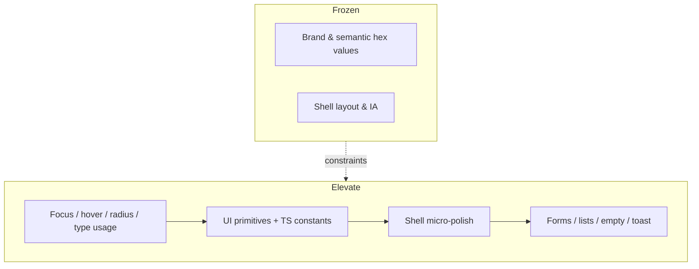
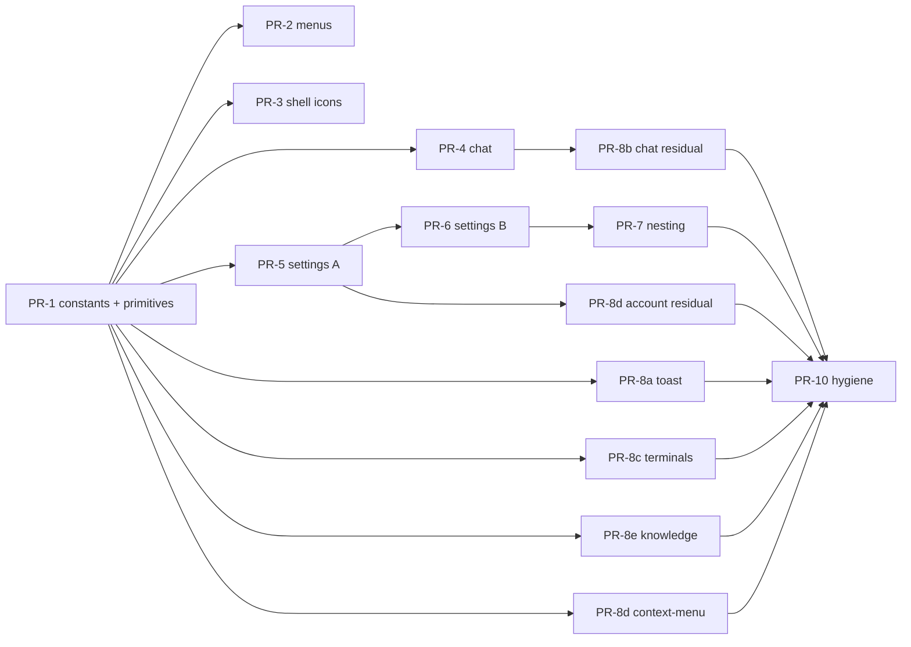

# hip Visual Craft Elevation — Design Document

| Field | Value |
| --- | --- |
| **Title** | Visual Craft Elevation (no rebrand, no re-layout) |
| **Author** | Design Systems / Frontend (placeholder) |
| **Date** | 2026-07-22 |
| **Status** | Draft (rev 3 — open questions resolved) |
| **Product** | hip — Tauri desktop AI workbench |
| **Constraints** | Theme color *hexes* fixed · Shell layout fixed · Visual craft elevation only |

---

## Overview

hip already has a strong monochrome chrome foundation: CSS tokens in `src/styles/tokens.css`, Tailwind semantic colors, a disciplined type ladder, flat chrome (shadows only for floating layers), motion tiers, and density knobs. The product does **not** need a rebrand or shell redesign. What separates “good internal tool” from “Linear / Raycast / Arc-level craft” is **consistency of micro-rules** — focus geometry, hover language, radius assignment, icon stroke, menu density, surface nesting, and empty/error state finish.

This document is a **surgical visual elevation program**. It freezes brand color **hex values** and shell geometry, then specifies measurable token/component rules so every surface feels like it was cut from one metal. Accent may still be *repositioned* (e.g. removed from dense chrome focus rings, kept on field borders and selection rails)—that is craft, not rebrand.

Implementation is incremental (TS focus constants → primitives → parallel shell/chat/menu work → settings batches → nesting → toast + package greps), each PR independently reviewable with **allowlist-oriented** acceptance gates and a one-line **Done when**.

---

## Background & Motivation

### Current state (what already works)

| Layer | Location | Strength |
| --- | --- | --- |
| Semantic colors | `tokens.css` + `tailwind.config.js` | Monochrome surfaces, warm-orange accent (light `#c2410c` / dark `#ff9800`), AA-tuned status colors |
| Type ladder | `tailwind.config.js` `fontSize` | `caption`→`page` with per-step leading |
| Radius | `borderRadius` | Clamped: sm 4 · md/DEFAULT 6 · lg 8 · xl+ 12 |
| Elevation | `boxShadow` | Flat chrome; only `panel` / `menu` / `overlay` cast shadow |
| Motion | CSS vars + Tailwind | chrome 140ms · content 240ms · celebrate 450ms; reduced-motion covered |
| Density | `html[data-density]` | `--row-h-sidebar`, `--row-pad-y-session`, `--trail-min-h`, `--meta-gap` |
| Glass | `glass-surface`, vibrancy datasets | macOS sidebar / Win Mica aware |
| Shared chrome | `titlebarChrome.ts`, `SIDEBAR_ACTIVE_RAIL` | Titlebar icons + active rail already codified |
| Button primitive | `Button.tsx` + `Button.test.tsx` | Primary already monochrome inverse + ink focus; tests guard brand fill |

### Pain points (why craft still plateaus)

1. **Focus is polyglot** — five+ live dialects: soft Field (`ring-accent/10`), hard accent (`ring-accent/60|50|25|40`, inset), solid `ring-focus-ring`, ink rings, thin/inset ad hoc. Keyboard navigation feels like different products per page.
2. **Hover is polyglot** — `hover:bg-state-hover` (canonical), `hover:bg-surface-muted`, and `hover:bg-accent-subtle` all mean “interactable,” with different visual weight. **`Button` secondary still uses `hover:bg-surface-muted`** (conflicts with a naive “ban surface-muted hover” unless explicitly migrated).
3. **Primitives are under-adopted** — settings and terminal forms re-declare input classes instead of `Input` / `Textarea`.
4. **Menu cousins diverge** — `DropdownMenuItem` `py-1.5` + `focus:bg-state-hover` vs `ContextMenuItem` `py-2` + `focus:bg-surface-muted`.
5. **Icon stroke is ad hoc** — titlebar 1.75, empty 1.5, Acp badge 2.25, Composer send/stop 2, many Lucide defaults (2).
6. **Radius off-token** — `SegmentedControl` uses `rounded-[5px]`.
7. **Nested borders** — Memory/MCP/Skill card stacks create grid noise (*avoid 网格感*).
8. **Finish gaps** — unrounded chips/error banner; Sonner `richColors` (`sonner` ^2.0.7); Switch thumb hardcodes `bg-white` + raw shadow.

None of these require new features or moving panels. They require **one dialect, enforced**.

---

## Goals & Non-Goals

### Goals

1. **Two intentional focus families** (Field + Chrome) plus fill-only menus — not five accidents.
2. **One hover dialect** for interactive fills (`state-hover`), including `Button` secondary/outline.
3. **One icon stroke rule** with a short, explicit exception table.
4. **Radius assignment rules** mapped to component roles.
5. **Surface nesting discipline** with concrete before/after for Memory / MCP / Skills.
6. **Primitive-first forms** — migrate forked field classes onto `Input` / `Textarea` / exported class strings.
7. **Shell polish only where geometry is unchanged.**
8. **Allowlist acceptance gates** that `rg` (or a tiny script) can verify without subjective classification.

### Non-Goals

- Changing any brand/accent **hex values**, light/dark semantic palette identity, or role colors.
- Rearranging shell regions (sidebar width IA, main/toolbar/composer stacking, panel order).
- New features, IA, density modes beyond existing comfortable/compact.
- Introducing a new design-token package, Storybook, or component library rewrite.
- Marketing rebrand, illustration system, or mascot redesign.

### Hard constraints (non-negotiable)

| # | Constraint | Enforcement |
| --- | --- | --- |
| 1 | Theme **color hexes** unchanged | Do not edit `--accent*`, `--bg-*`, `--text-*`, `--success/danger/warning`, role colors in `tokens.css`. **Accent usage may change** (e.g. chrome focus rings migrate from `ring-focus-ring` → `ring-ink/20`; Field still uses accent border + soft ring). Reviewers must not reject “removing brand from focus rings” as a constraint violation—see KD-2 and Alternative C. |
| 2 | Overall layout unchanged | No changes to `AppLayout` panel proportions, sidebar `w-[260px]`, rail IA, composer dock position. In-region padding tweaks OK if major regions do not reflow. |
| 3 | Visual refinement only | No new user-facing capabilities. |

---

## Design Principles

1. **Quiet by default, loud on purpose** — Accent is for *current*, *field focus border*, *selection rails*, and rare status—not every keyboard ring. Primary buttons stay monochrome inverse (`btn-primary`).
2. **One decision, everywhere** — Shared TS string constants; divergence requires a written exception (file:line allowlist if CI needs it).
3. **Borders create structure, not texture** — Prefer surface steps over stacked hairlines.
4. **Geometry is on a lattice** — Heights 28/32/36; radii 4/6/8/12/full only.
5. **Focus is geometry, not decoration** — Fields: soft glow. Chrome: quiet ink ring. Menus: fill only, **never ring**.
6. **Motion is functional** — Existing tiers; keep reduced-motion.
7. **Density is a token** — Extend CSS density vars; don’t invent one-off row heights.
8. **Minimum mechanism** — Prefer TS class exports over unused CSS variables; optional lint only in hygiene PR.



---

## Current Audit Findings

Severity: **P0** must-fix · **P1** high leverage · **P2** polish.

### A1. Focus dialect fragmentation — P0

| Dialect | Example locations | Problem |
| --- | --- | --- |
| Soft field (canonical) | `Input.tsx`, `Textarea.tsx`, history search | `border-accent` + `ring-[3px] ring-accent/10` |
| Hard accent ring | Settings forks, `HostFormDialog`, `MessageActions`, `ContextMenuSettings` | `focus:ring-2 focus:ring-accent/60` (+ `/50`) — often `:focus` not `:focus-visible` |
| Intermediate accent | `KnowledgeWorkspace` search `/25`, citation chips bare `ring-accent` | Gray zone between Field and ban |
| Full focus-ring | `titlebarChrome`, sidebar rows, settings nav, many lists | `ring-2 ring-focus-ring` — noisy on dense chrome |
| Ink ring | `Button` variants | Near-Chrome; standardize to shared constant |
| Inset / thin | `HookConfig`, `AcpProviderPicker`, resize handle | ad hoc |

**Debt signal:** no shared constant; engineers copy nearest string. Primitive layer is closer to target than call sites.

### A2. Hover dialect fragmentation — P1

- Canonical: `hover:bg-state-hover`.
- Live: `hover:bg-surface-muted` on icon buttons, **`Button` secondary**, `MessageActions`, jump-to-latest, `ProviderList`, `ContextMenuSettings`, terminals chrome.
- Live: `hover:bg-accent-subtle` (alias of state-hover today—wrong name for new code).
- Related: `Badge` default `hover:bg-surface-subtle` (soft chip hierarchy—migrate interactive Badge hover to `state-hover` for gate simplicity).

### A3. Menu / popover cousins — P1

| Control | Item pad | Item focus bg |
| --- | --- | --- |
| `DropdownMenu` | `px-2.5 py-1.5` | `state-hover` |
| `ContextMenu` | `px-2.5 py-2` | `surface-muted` |

Must share item metrics + fill-only focus.

### A4. Icon stroke & size — P1

| Context | Current | Target |
| --- | --- | --- |
| Titlebar | 16 / 1.75 | Keep |
| Settings nav | 16 / 1.75 | Keep |
| Sidebar nav | 16 / default 2 | 16 / **1.75** |
| Empty states | 28 / 1.5 | Keep (exception) |
| Dense trees | 13–15 / 1.75 | Keep |
| Acp badge | 12 / **2.25** | **1.75** |
| Composer send/stop | 15/12 / **2** | **1.75** |

### A5. Radius off-token — P1

`SegmentedControl` `rounded-[5px]` → `rounded` (6px).

### A6. Nested border warehouse — P1

Heavy: `MemoryConfig.tsx`, `McpConfig.tsx`, `PluginConfigView.tsx`, `SkillConfig.tsx`, `AgentEditor.tsx`.

### A7–A11. Finish / Switch / Toast / tertiary / input forks — P0–P2

Unchanged from rev 1; verified against code. Additional forks: `HostFormDialog.tsx` (`inputCls` same as settings).

### What is already excellent (do not “fix”)

Flat shadow policy; `SIDEBAR_ACTIVE_RAIL`; composer dual variant; type ladder + `cn()` merge; titlebar constants; reduced-motion; markdown prose system; Button monochrome primary tests.

---

## Proposed Design

### 1. Token & utility layer (no color rebrand)

**Do not add unused CSS focus geometry vars.** Enforcement is TypeScript string constants (KD-exports). Wire CSS vars only if a second non-TS consumer appears later.

#### 1.1 Focus families (allowlist)

| Family | Constant | Spec | Use |
| --- | --- | --- | --- |
| **Field** | `focusField` | `focus-visible:outline-none focus-visible:border-accent focus-visible:ring-[3px] focus-visible:ring-accent/10` | `<input>`, `<textarea>`, native search fields |
| **Field-within** | `focusFieldWithin` | `focus-within:border-accent focus-within:ring-[3px] focus-within:ring-accent/10` (+ existing border/transition) | Composer **card** shell, multi-control field wrappers |
| **Chrome** | `focusChrome` | `focus-visible:outline-none focus-visible:ring-2 focus-visible:ring-ink/20` | Icon buttons, list rows, tabs, chips, segmented, titlebar, Switch track focus |
| **Danger** | (inline on Button) | `focus-visible:ring-2 focus-visible:ring-danger/40` (and soft variant `/30`) | Danger buttons only |
| **Menu fill** | (in menu item classes) | `focus:bg-state-hover` — **no ring classes** | Dropdown / context / cmdk rows / listbox options under Radix roving focus |

**Forbidden as *keyboard focus* chrome (focus-prefixed classes):** any `focus:ring-accent*`, `focus-visible:ring-accent*` except Field’s exact `/10`, `focus-within:ring-accent*` except Field-within `/10`; any `ring-focus-ring*`; `ring-inset` accent focus variants.

**Non-focus `ring-accent/*` is not automatically debt.** Selection, jump-highlight, and drop-target rings keep accent by design—listed in **Appendix B**. Program-end greps target **focus-ish prefixes only** (Acceptance Criteria), not bare `ring-accent/`.

**Selection ≠ focus (allowed non-focus rings — see Appendix B):**

| Pattern | Location | Role |
| --- | --- | --- |
| `SIDEBAR_ACTIVE_RAIL` `before:bg-accent` | `sidebarActiveRail.ts` | Nav/list **selection** |
| Selected segment/chip fills | SegmentedControl, chips | Selection fill |
| `ring-2 ring-accent` while selected | `workflow/DagEditor.tsx` | Canvas **selection** |
| `bg-accent-subtle ring-1 ring-accent/40` | `ChatPane.tsx` (~L384, `highlightedId`) | Search/jump **highlight** (not keyboard focus) |
| `ring-1 ring-accent/30` + accent tint | `SpaceIconPicker.tsx` | Selected / active icon **selection** |
| `ring-1 ring-accent/40 bg-accent/5` | `SpaceTree.tsx` drop-target | Drag **drop target** |
| Match `text-accent` | Command palette marks | Search signal |

**SpaceTree keyboard focus (migrate — not allowlisted):**

```tsx
// SpaceTree.tsx today (~L432):
isFocused && !isActiveDoc && 'bg-state-hover ring-1 ring-accent/25'

// PR-8e target — tree row keyboard focus = fill + Chrome (no accent focus ring):
isFocused && !isActiveDoc && cn('bg-state-hover', focusChrome)
// If the row is not a focusable control that should show a ring, fill-only is OK:
// isFocused && !isActiveDoc && 'bg-state-hover'
```

Drop-target classes on the same node stay Appendix B (`ring-accent/40`).

```ts
// src/components/ui/focusClasses.ts
export const focusField =
  'focus-visible:outline-none focus-visible:border-accent focus-visible:ring-[3px] focus-visible:ring-accent/10'

export const focusFieldWithin =
  'focus-within:border-accent focus-within:ring-[3px] focus-within:ring-accent/10'

export const focusChrome =
  'focus-visible:outline-none focus-visible:ring-2 focus-visible:ring-ink/20'
```

**Button focus:** all non-danger variants use `focusChrome` (replace ad hoc `ring-ink/25` with the shared constant—optical difference is negligible; one string wins).

**Primary CTA:** no accent focus ring (KD-1 closed). Accent stays off primary fill (existing Button tests).

#### 1.2 Hover / active dialect

| State | Class | Rule |
| --- | --- | --- |
| Hover fill (default) | `hover:bg-state-hover` | Icon buttons, list rows, chips, **Badge**, **`Button` secondary / outline / ghost**, jump FAB, provider rows, dashed CTAs |
| Card lift (KD-3b) | `hover:bg-surface-subtle` | **Only** large bordered **card shells**: element has `rounded-lg` or `rounded-xl` **and** `border` (or `border-border`) **and** is a whole-card hover target (Agent/MCP/Skill/FixedAgent cards). Not for chips, icon buttons, Badge, or list rows. |
| Resting secondary | `bg-surface-subtle` | Unchanged resting fill; only **hover** migrates muted → state-hover |
| Active / selected | `bg-state-active` / rails | unchanged patterns |
| Press | `active:scale-[0.985]` | Button / Badge only |

**Banned strings (repo-wide in `src/components`, zero exceptions at program end):**

- `hover:bg-surface-muted`
- `hover:bg-accent-subtle`

**Not banned:** `hover:bg-surface-subtle` — but **only** under KD-3b card-lift. Review: if a hit lacks card shell markers, migrate to `state-hover`.

Static chips/code may keep **resting** `bg-surface-muted` without a `hover:` prefix.

**Badge:** interactive hover → `hover:bg-state-hover` (not surface-subtle).

#### 1.3 Radius role map

| Role | Token | px | Examples |
| --- | --- | --- | --- |
| Control inner | `rounded-md` / `rounded` | 6 | Button sm/md, Input, chips, menu items |
| Control large | `rounded-lg` | 8 | Button lg, CodeBlock, menus |
| Floating | `rounded-xl` | 12 | Modal, palette |
| Pill | `rounded-full` | — | Send, jump FAB |
| Forbidden | arbitrary | 5… | `rounded-[5px]` |

#### 1.4 Spacing rhythm (inside regions only)

Unchanged from rev 1 (sidebar density vars, composer `px-4 py-2.5`, transcript gap 20px).

#### 1.5 Typography usage

Unchanged ladder rules (caption→page).

#### 1.6 Icon system + exceptions

```ts
export const chromeIconProps = { size: 16 as const, strokeWidth: 1.75 as const, 'aria-hidden': true as const }
export const metaIconProps = { size: 14 as const, strokeWidth: 1.75 as const, 'aria-hidden': true as const }
export const emptyIconProps = { size: 28 as const, strokeWidth: 1.5 as const }
```

| Rule | Stroke |
| --- | --- |
| Interactive chrome icons (nav, titlebar, toolbar, composer actions, tree chevrons, menu icons) | **1.75** |
| Empty-state illustration icons | **1.5** |
| Lucide default (2) on chrome | **Forbidden** |
| Documented exceptions | See table |

**Exception table (closed set):**

| Case | Allowed stroke | Rationale |
| --- | --- | --- |
| `EmptyState` / empty illustration | 1.5 | Softer decorative weight |
| 10–11px pure status glyphs if 1.75 disappears at small size | 2.0 max | Legibility only; prefer 1.75 first |
| Non-UI canvas (DAG node selection ring is fill/ring, not Lucide stroke) | — | Selection semantics |

**Not exceptions:** AcpProviderPicker badge (must become 1.75); Composer ArrowUp/Square (must become 1.75).

#### 1.7 Shadow

Unchanged policy. Remove misleading `shadow-sm` classes. Switch thumb: no raw rgba—use `shadow-[0_1px_2px_rgba(0,0,0,0.12)]` only if still needed after tokenized approach below; prefer ring separation (see §2.5).

---

### 2. Component-level polish specs

#### 2.1 `ui/Input` & `ui/Textarea` — export + migration geometry

Export constants matching component defaults:

```ts
// Input.tsx
export const inputClassName = cn(
  'h-9 w-full rounded-md border border-border bg-surface px-3 text-body text-ink',
  'placeholder:text-ink-tertiary transition-[border-color,box-shadow] duration-chrome',
  focusField,
)
```

**Field padding migration (explicit):**

| Situation | Rule |
| --- | --- |
| Plain fields | Use `<Input />` or `inputClassName` (`px-3`) |
| Legacy forks with `px-2.5` | Accept **+2px** horizontal padding delta as intentional lattice alignment; no product risk under hard constraint #2 |
| Icon-affixed search (leading icon) | Keep outer wrapper; input uses `inputClassName` **plus** local override `pl-9 pr-8` (or `className` merge). Do **not** invent a second global padding token |
| Parent shells with `rounded-lg` | Input stays `rounded-md` (control lattice). Parent may be `rounded-lg`; child control does not inherit `rounded-lg` unless it is a single full-bleed search without chrome (exception: rare) |

**Codemod example — `AgentToolbar` search:**

```tsx
// before
className="h-9 w-full rounded-lg border ... pl-9 pr-8 ... focus:ring-2 focus:ring-accent/60"
// after
className={cn(inputClassName, 'rounded-md pl-9 pr-8')} // icon gutters local; Field focus from inputClassName
```

**Codemod example — Memory / generic `inputCls`:**

```tsx
// before
const inputCls = 'h-9 w-full ... px-2.5 ... focus:ring-2 focus:ring-accent/60'
// after
import { Input, inputClassName } from '@/components/ui/Input'
// prefer <Input className={extra} /> or className={cn(inputClassName, extra)}
```

Same for `textareaClassName` / `<Textarea />`.

#### 2.2 `ui/Button` (KD-hover closed)

| Variant | Resting | Hover | Focus |
| --- | --- | --- | --- |
| primary | `bg-btn-primary` | `hover:bg-btn-primary-hover` | `focusChrome` |
| secondary | `bg-surface-subtle` | **`hover:bg-state-hover`** (was `surface-muted`) | `focusChrome` |
| ghost | transparent | `hover:bg-state-hover` | `focusChrome` |
| outline | border | `hover:bg-state-hover` | `focusChrome` |
| danger / dangerSoft | semantic | keep | danger rings |

Update `Button.test.tsx` if it ever asserts secondary hover (today it does not assert hover class).

#### 2.3 Menus

Unify item to Dropdown metrics + `focus:bg-state-hover` + **no ring**. Context min-width may stay 160.

#### 2.4 SegmentedControl

`rounded-[5px]` → `rounded`; hover full `state-hover`; focus `focusChrome`.

#### 2.5 Switch — thumb contrast method

| Part | Spec |
| --- | --- |
| Track off | `bg-border-strong` |
| Track on | `bg-accent` (state signal — allowed) |
| Thumb | `bg-surface` + separation ring: `ring-1 ring-black/5 dark:ring-white/10` (no new brand color) |
| Thumb shadow | Drop raw rgba if ring provides separation; else keep single soft shadow using black alpha only |
| Focus | `focusChrome` only — **no** `ring-focus-ring` |

**PR-1 QA method (required):** screenshot or eyeball Switch off+on in **light and dark**. Pass if thumb edge is visible against both track states without measuring WCAG on the thumb (thumb is not text). If off-state thumb blends into track, increase ring alpha one step (`ring-black/10` / `ring-white/15`)—still monochrome alpha.

#### 2.6–2.8 Modal / EmptyState / Badge

As rev 1; Badge interactive hover → `state-hover` if hover styles remain.

#### 2.9 Composer

| Element | Spec |
| --- | --- |
| Card shell | `focusFieldWithin` (not raw duplicated classes) |
| Flat dock | no field chrome |
| Chips | always `rounded-md` |
| Send / Stop icons | `strokeWidth={1.75}` |
| Blocked InputBar | muted surface strip, no double border |

#### 2.10 Message / transcript

Attachments `rounded-md`; error `rounded-lg`; jump `hover:bg-state-hover` + chevron 1.75; MessageActions focus/hover → Chrome + state-hover.

#### 2.11 Sidebar & titlebar

Nav icons 1.75; version drop `/70`; focus → `focusChrome` via shared strings / titlebarChrome.

#### 2.12 Command palette

Row icons 14 / 1.75; match marks `text-accent` OK.

#### 2.13 Settings nesting — **concrete PR-7 targets**

**Global rule:** Level-1 section uses **either** outer `border` **or** muted fill—not both stacked with an inner full `border` card that only groups more controls.

##### MemoryConfig (`MemoryConfig.tsx`) — target structure

| Section (by existing regions) | Keep | Change |
| --- | --- | --- |
| Top summary / status block (~L533 `rounded-xl border … bg-surface-muted/40`) | One shell | **Drop border** OR drop muted fill—prefer **muted fill only** (`rounded-xl bg-surface-muted/40`, no border) |
| Collapsible config block (~L593 border + muted) | One shell | Same: **fill XOR border** |
| Inline stats row (~L631) | Optional border | Prefer `bg-surface` + top divider from parent; avoid third nested box |
| Main list section (~L676 `divide-y rounded-xl border`) | **Keep** single bordered shell + `divide-y` | Do **not** wrap each row in another border |
| Empty / dashed placeholders (~L822, L842) | Keep **one** dashed empty per region | Remove dashed when list has rows |
| List shell (~L849) | Keep outer border + inner `divide-y` | No per-row cards |
| Advanced section (~L1032) | Keep one `rounded-xl border` | Inner advanced gates: `border-t` dividers only—not nested `rounded-lg border` cards |

**Done when (Memory):** no element with `rounded-* border` whose **parent section** already has `rounded-* border` for pure grouping (inputs may still have their own control borders).

##### McpConfig (`McpConfig.tsx`) — target structure

| Region | Keep | Change |
| --- | --- | --- |
| Server **grid cards** (`rounded-lg border` / `rounded-xl border` per card) | **One** border per card | Card hover → **KD-3b** `hover:bg-surface-subtle` (card lift). Icon buttons **inside** cards → `hover:bg-state-hover` |
| Nested detail inside expanded card (~L467 `rounded-lg border bg-surface-subtle`) | — | **Remove inner border**; use `bg-surface-subtle p-3 rounded-md` only |
| Dashed “add server” tile | Keep single dashed CTA | Focus → Chrome; hover → state-hover |
| Radio / select rows with border | Keep | Focus already near ink—use `focusChrome` |

##### SkillConfig (`SkillConfig.tsx`) — target structure

| Region | Keep | Change |
| --- | --- | --- |
| Skill cards (`rounded-lg border … p-4`) | One border per card | Icon button hover/focus → state-hover + Chrome |
| Dashed empty install (~L171) | One dashed empty | OK as empty target |
| No second border inside card for toolbar | — | Toolbar is plain flex, not nested card |

#### 2.14 Toast (Sonner ^2.0.7) — binding + semantics

**Decision (KD-toast):** Drop `richColors`. Tokenized surfaces + semantic left borders in the **same** PR.

```tsx
// src/components/ui/ToasterHost.tsx (preferred) or main.tsx
import { Toaster } from 'sonner'
import { useUiStore } from '@/store/uiStore'
import { useEffect, useState } from 'react'

export function ToasterHost() {
  const themePref = useUiStore((s) => s.theme)
  const [mode, setMode] = useState<'light' | 'dark'>(() =>
    document.documentElement.classList.contains('dark') ? 'dark' : 'light',
  )
  useEffect(() => {
    const sync = () =>
      setMode(document.documentElement.classList.contains('dark') ? 'dark' : 'light')
    sync()
    const obs = new MutationObserver(sync)
    obs.observe(document.documentElement, { attributes: true, attributeFilter: ['class'] })
    return () => obs.disconnect()
  }, [themePref])

  return (
    <Toaster
      position="bottom-right"
      theme={mode}
      // richColors intentionally omitted
      toastOptions={{
        classNames: {
          toast:
            'border border-border bg-surface text-ink shadow-menu',
          title: 'text-body font-medium text-ink',
          description: 'text-meta text-ink-secondary',
          success: 'border-l-2 border-l-success',
          error: 'border-l-2 border-l-danger',
          warning: 'border-l-2 border-l-warning',
        },
      }}
    />
  )
}
```

**PR smoke:** trigger one `toast.success` and one `toast.error` in light + dark (manual dogfood). Confirm Sonner v2 `classNames.success|error` apply; if API differs slightly, map via `toastOptions.unstyled` only as last resort—prefer documented Sonner classNames.

---

### 3. Motion & micro-interaction

Unchanged (no new entrance animations on settings).

### 4. Accessibility

| Concern | Rule |
| --- | --- |
| Focus visibility | Field, Field-within, Chrome, Danger, or Menu-fill only |
| Contrast | No further tertiary opacity stacks (`/70` ban on UI text) |
| Accent hex | Frozen |
| Reduced motion | Keep |
| Hit targets | Titlebar `size-7`; rows ≥24px interactive |
| focus vs focus-visible | Prefer focus-visible on chrome; menus use Radix `:focus` fill |

---

## Data Model / API Changes

None. New pure modules: `focusClasses.ts`, optional `iconChrome.ts`, optional `ToasterHost.tsx`.

---

## Alternatives Considered

### A — Full token recolor  
Rejected (constraint #1).

### B — Soft elevation everywhere  
Rejected (flat chrome + vibrancy).

### C — Solid accent focus rings everywhere  
Rejected for dense chrome. Accent for selection + Field border only.

### D — Big-bang rewrite  
Rejected (unreviewable).

### E — `@layer components` CSS classes as primary enforcement

Ship `.focus-field`, `.focus-chrome` in `tokens.css` / `@layer components` and use those class names in JSX.

- **Pros:** One CSS source; works outside React.
- **Cons:** Repo pattern is Tailwind utility strings + CVA (`Button`); CSS component classes fight `cn()` / tailwind-merge workflows already tuned for utilities; harder tree-shake visibility in reviews.
- **Decision:** Rejected as **primary**. TS string exports win. CSS layer only if a non-TS surface needs it later.

### F — ESLint / restricted-syntax as primary enforcement

Custom ESLint rule banning `ring-accent/60`, `ring-focus-ring`, `hover:bg-surface-muted`, etc.

- **Pros:** Mechanical; blocks regressions.
- **Cons:** Custom rule cost; false positives on selection rings / DAG; slower than constants for migration phase.
- **Decision:** **Secondary.** Land optional `no-restricted-syntax` (or a 20-line `scripts/check-visual-dialects.mjs` grepping allowlist) in **final hygiene PR (PR-10)**, not as the migration vehicle. Primary enforcement = shared constants + PR Done-when greps.

### G — Codemod PR vs manual migration

- Automated codemod for exact `inputCls` string: **encouraged** inside settings PRs.
- Full-repo codemod of all focus rings: **rejected** as big-bang (Alternative D). Package-scoped greps + manual PR batches stay.

---

## Key Decisions

1. **Freeze palette hexes and shell geometry; elevate craft via dialect unification.** Accent **usage** on focus may quiet down without hex edits (constraint clarification).

2. **Focus allowlist only:** Field, Field-within, Chrome, Danger rings, Menu fill-only. No `ring-focus-ring*` on chrome. No **focus-prefixed** intermediate `ring-accent/*` except Field `/10`. Non-focus selection/highlight rings live in Appendix B and are out of the focus gate.

3. **Hover = `state-hover` for chrome interactive fills**, including `Button` secondary/outline/ghost and Badge. Resting secondary stays `bg-surface-subtle`. Ban `hover:bg-surface-muted` and `hover:bg-accent-subtle` under `src/components`.

3b. **Card-lift exception:** large bordered card shells may use `hover:bg-surface-subtle` (not a third accidental dialect—named KD-3b). Chips, icon buttons, Badge, list rows, Button variants must **not** use it.

4. **Menu / listbox options = background fill under `:focus`, never focus rings.** Do not apply `focusChrome` to `DropdownMenuItem` / `ContextMenuItem`.

5. **Dropdown and Context menu items share density** (`py-1.5`) and `focus:bg-state-hover`.

6. **Icon chrome stroke 1.75**; empty 1.5; closed exception table only. Composer send/stop and Acp badge are in scope (not exceptions).

7. **Settings/forms use `<Input>` / `inputClassName` (or Textarea equivalents).** Prefer component; class string allowed for odd native cases. Default padding is `px-3`; icon fields override gutters locally.

8. **Primary Button: monochrome inverse + Chrome focus—no accent focus ring, no accent fill** (promoted from OQ1).

9. **Toast: drop `richColors`; theme from `documentElement` dark class via ToasterHost; semantic left borders in same PR** (promoted from OQ2).

10. **Border nesting:** max one structural section border; concrete Memory/MCP/Skill targets in §2.13.

11. **No unused focus CSS variables** — TS exports only until a second consumer needs vars.

12. **Enforcement:** TS constants primary; optional grep script / lint in hygiene PR (Alts E/F).

---

## Security & Privacy

N/A beyond existing UI. No new telemetry.

---

## Observability & test ops

- Per-PR visual checklist (light/dark, density, keyboard, reduced-motion).
- Pure class/CSS rollback per PR.
- Optional `eval-ui-visual-capture.spec.ts` after large primitive PRs.
- **Known unit tests to run/adjust in PR-1:**
  - `src/components/ui/Button.test.tsx` (monochrome primary guards; extend if secondary hover asserted later)
  - `src/components/ui/SegmentedControl.test.tsx` (radius / classes if present)
  - **Add** `src/components/ui/focusClasses.test.ts`: assert `focusField` / `focusChrome` / `focusFieldWithin` string equality and that `Input` default className includes `focusField` fragments (prevent drift)

---

## Risks

| Risk | Severity | Mitigation |
| --- | --- | --- |
| Grep gates incomplete | High | Allowlist rules in Acceptance (not partial ban regex alone) |
| Button secondary hover change | Low | Explicit KD-3; optical delta small |
| Settings PR noise (Memory/MCP large) | Med | Style-only commits; no logic edits; split A/B batches |
| Toast semantic loss | Med | Left borders same PR; smoke success+error |
| Switch thumb contrast | Low | Ring separation + dual-theme QA method |
| Over-reducing borders | Med | Concrete §2.13 checklists |
| Accidental hex edit | High | Reject tokens.css color-block diffs |
| Layout shift from `px-2.5`→`px-3` | Low | Documented; icon fields keep pl/pr overrides |
| DAG / selection `ring-accent` false positive in lint | Low | Focus greps use focus-ish prefixes only; Appendix B for non-focus rings |
| Accidental third hover dialect (`surface-subtle`) | Low | KD-3b card-lift only; Badge/chips/buttons use state-hover |

---

## Rollout Plan



**Parallelism after PR-1:** PR-2, PR-3, PR-4, PR-5, **PR-8a**, **PR-8c**, **PR-8e**, and context-menu work in **PR-8d** may proceed **in parallel** (depend on PR-1). PR-8b waits on PR-4; account residual in PR-8d waits on PR-5. PR-6 waits on PR-5; PR-7 waits on PR-6. PR-10 joins all residual branches + PR-7.

Rollback: revert single PR. No data migrations.

### Visual QA checklist (every PR)

- [ ] Light + dark  
- [ ] Comfortable + compact density (if shell rows touched)  
- [ ] Keyboard Tab: sidebar → main → composer → modal  
- [ ] No layout change: sidebar 260px, panel defaults, composer dock  
- [ ] Accent **hex** block in tokens.css unchanged  
- [ ] `prefers-reduced-motion` OK  

---

## Acceptance Criteria (program-level)

### Allowlist model (replaces naive ban-only gate #1)

**Allowed focus-related class patterns under `src/components`:**

1. Imports/usages of `focusField`, `focusFieldWithin`, `focusChrome` constants, **or** their **exact** class substrings:
   - Field: `focus-visible:ring-[3px]` + `focus-visible:ring-accent/10` + `focus-visible:border-accent`
   - Field-within: `focus-within:ring-[3px]` + `focus-within:ring-accent/10` + `focus-within:border-accent`
   - Chrome: `focus-visible:ring-2` + `focus-visible:ring-ink/20`
   - Danger: `focus-visible:ring-danger/40` or `/30`
   - Menu items: `focus:bg-state-hover` without any `ring-*` on the same element class string
2. Resize-handle thin ring may use `focus-visible:ring-1 focus-visible:ring-ink/20` (document as Chrome-thin) — migrate `ring-accent/40` on `AppLayout` handle to ink.

**Forbidden focus debt (must be zero at program end):**

```bash
# Run from repo root. Focus gates use focus-ish prefixes only —
# do NOT ban bare ring-accent/ (selection/highlight; see Appendix B).

# Solid accent focus token on chrome
rg -n "ring-focus-ring" src/components --glob '!**/*.{test,spec}.*'

# Any focus-prefixed accent ring that is NOT Field/Field-within /10
rg -n "focus(-visible|-within)?:ring-accent|focus-visible:ring-accent/|focus-within:ring-accent/|focus:ring-accent" \
  src/components --glob '!**/*.{test,spec}.*' \
  | rg -v "ring-accent/10"

# Hover dialect bans (H1)
rg -n "hover:bg-surface-muted|hover:bg-accent-subtle" src/components --glob '!**/*.{test,spec}.*'

# Off-token radius
rg -n "rounded-\\[5px\\]" src/components
```

**Interpretation:**

- **Focus debt** = `focus:` / `focus-visible:` / `focus-within:` + accent ring (except `/10` Field), or any `ring-focus-ring*`.
- **Not focus debt** = bare `ring-1 ring-accent/40` (ChatPane highlight), `ring-accent/30` (SpaceIconPicker selection), DAG `ring-2 ring-accent`, drop-target rings — Appendix B.
- SpaceTree `isFocused && … ring-accent/25` is **focus debt** until migrated (recipe in §1.1 / PR-8e)—even though it is not focus-prefixed today; catch with a package-specific grep in PR-8e:

```bash
rg -n "isFocused.*ring-accent|ring-accent/25" src/components/knowledge/SpaceTree.tsx
```

- Optional polish (not a program-end hard gate): unify selection ring opacities (`/30` vs `/40`)—out of scope unless someone wants a follow-up.

### Other gates

| # | Gate | Verifiable how |
| --- | --- | --- |
| H1 | Hover ban | `hover:bg-surface-muted` and `hover:bg-accent-subtle` → **0** in `src/components` |
| H2 | Button secondary | `Button.tsx` secondary contains `hover:bg-state-hover`, not `surface-muted` |
| H3 | Card-lift discipline | `hover:bg-surface-subtle` only on KD-3b card shells; Badge / Button / icon-btn / list rows must use `state-hover` (manual PR review + spot `rg hover:bg-surface-subtle`) |
| R1 | Radius | `rounded-[5px]` → 0 |
| I1 | New chrome icons | PR checklist: interactive Lucide uses 1.75 or shared props |
| I2 | Targeted strokes | Composer send/stop 1.75; Acp badge 1.75 (assert in PR-4 / PR-6 file review) |
| C1 | Colors | No hex edits to brand tokens |
| T1 | Toast | No `richColors`; ToasterHost theme bound; success+error left border classes present |
| F1 | Focus debt greps | Focus-prefix commands above → 0; SpaceTree isFocused accent ring gone |

### Visual gates

| Surface | Pass |
| --- | --- |
| Sidebar | Icons match titlebar weight; version not washed out; active rail unchanged |
| Composer | Chips rounded; send/stop 1.75; blocked dock not double-bordered |
| Message | Attachments rounded; error rounded-lg; MessageActions Chrome focus |
| Settings | Fields use Field focus; sections match §2.13 targets |
| Menus | Context ≈ Dropdown item density; fill-only focus |
| Toast | Token surface; semantic left bar readable light/dark |

### Before / after

| Aspect | Before | After |
| --- | --- | --- |
| Focus dialects | 5+ | Allowlist only |
| Button secondary hover | surface-muted | state-hover |
| Menu item pad | 6 vs 8 vertical | 6 both |
| Icon stroke | mixed | 1.75 chrome / 1.5 empty |
| Nested cards | 2–3 deep common | ≤1 structural per Memory/MCP/Skill targets |

---

## Open Questions

**All resolved.** No open product/design questions block implementation.

| # | Question | Resolution |
| --- | --- | --- |
| OQ1–3 | Primary Button focus; toast; Input export | Closed earlier as KD-7 / KD-8 / KD-9 |
| OQ4 | DAG selection `ring-accent` | **Allowlist** — keep selection ring as-is under Appendix B; out of critical path for this craft program. Optional `data-[selected]` rename is a later workflow concern, not program-done. |
| OQ5 | EmptyState adoption (PR-9) | **Skip for now** — leave EmptyState out of the active plan; finish dialect unification first. PR-9 is deferred, not part of program completion. |

---

## References

- `src/styles/tokens.css`, `tailwind.config.js`
- `src/components/ui/*`, `layout/titlebarChrome.ts`, `sidebarActiveRail.ts`
- `src/components/chat/*`, `account/*`, `terminals/HostFormDialog.tsx`
- `src/components/context-menu/ContextMenuSettings.tsx`
- `src/main.tsx` (Toaster), package `sonner` ^2.0.7
- `src/components/ui/Button.test.tsx`

---

## Implementation Spec Details

### Forbidden → replacement

| Forbidden | Replacement |
| --- | --- |
| `focus:ring-2 focus:ring-accent/60` (any opacity ≠ Field) | `focusField` / `<Input>` |
| `focus-visible:ring-accent/25` etc. on fields | Field (`/10` + border-accent) |
| `focus-visible:ring-accent/*` on chrome | `focusChrome` |
| `focus-visible:ring-focus-ring` | `focusChrome` |
| Native `<input type="checkbox\|radio">` `focus:ring-accent/*` | Checked paint via `accent-accent` (or existing accent checked styles) + **`focus-visible:ring-ink/20` (Chrome)**; never `focus:ring-accent/*` |
| `hover:bg-surface-muted` / `hover:bg-accent-subtle` | `hover:bg-state-hover` |
| `hover:bg-surface-subtle` on chips/Badge/icon buttons/rows | `hover:bg-state-hover` (card shells only keep surface-subtle — KD-3b) |
| SpaceTree `isFocused … ring-accent/25` | `bg-state-hover` + `focusChrome` or fill-only (see §1.1) |
| `rounded-[5px]` | `rounded` |
| `shadow-sm` semantic | remove |
| Chrome Lucide stroke 2 / 2.25 | 1.75 |
| `text-ink-tertiary/70` UI text | `text-ink-tertiary` |
| `richColors` | ToasterHost token classes |

### Critical file touch list (expanded)

| Phase | Files |
| --- | --- |
| Constants | `focusClasses.ts` (new), `focusClasses.test.ts` (new), `Input.tsx`, `Textarea.tsx`, `Button.tsx`, `Button.test.tsx`, `Switch.tsx`, `SegmentedControl.tsx`, `SegmentedControl.test.tsx`, `Badge.tsx` (hover → state-hover) |
| Menus | `DropdownMenu.tsx`, `ContextMenu.tsx`, `Popover.tsx`, `Modal.tsx`, `titlebarChrome.ts` |
| Shell | `AppSidebar.tsx`, `SidebarAccountFooter.tsx`, `SettingsPanel.tsx`, `MainToolbar.tsx` (via titlebar) |
| Chat | `Composer.tsx` (incl. send/stop stroke), `ComposerChip.tsx`, `InputBar.tsx`, `MessageBubble.tsx`, `ChatPane.tsx`, `MessageActions.tsx`, `FolderPill.tsx`, `CodeBlock.tsx` |
| Settings A | `AgentEditor.tsx`, `AgentToolbar.tsx`, `AddProviderDialog.tsx`, `EndpointModelDialog.tsx`, `ProviderDetail.tsx`, `GeneralSettings.tsx`, `ProviderList.tsx` |
| Settings B | `McpConfig.tsx`, `MemoryConfig.tsx`, `SkillConfig.tsx`, `PluginConfigView.tsx`, `HookConfig.tsx`, `AgentCard.tsx`, `FixedAgentCard.tsx`, `AcpProviderPicker.tsx` (focus + stroke 2.25), `ModelConfig.tsx`, `MarketplaceSourceModal.tsx` |
| Nesting | Memory / MCP / Skill per §2.13 |
| Toast | `ToasterHost.tsx` (new), `main.tsx` |
| Residuals by package | See PR-8b–8e |

---

## Appendix A — Baseline inventory (measurable progress)

Approximate live debt at design time (non-test `src/components`; re-count when starting PR-1):

| Pattern | Notes |
| --- | --- |
| `ring-focus-ring` | High tens of hits (sidebar, titlebar, settings nav, outlines) |
| `focus:ring-accent` / `ring-accent/60` forks | Settings + HostFormDialog + MessageActions + ContextMenuSettings + Acp |
| Focus-prefixed `ring-accent/*` ≠ `/10` | Settings forks, HostFormDialog, MessageActions, KnowledgeWorkspace search field, ContextMenuSettings |
| Non-focus `ring-accent/*` (Appendix B — keep) | ChatPane highlight `/40`, SpaceIconPicker `/30`, SpaceTree drop `/40`, DAG bare |
| SpaceTree `isFocused` + `ring-accent/25` | Migrate in PR-8e (focus debt) |
| `hover:bg-surface-muted` | Button secondary + ~dozens of call sites |
| `hover:bg-surface-subtle` | Card shells OK (KD-3b); Badge/icon-btn debt if present |
| `rounded-[5px]` | SegmentedControl (1) |
| Composer `strokeWidth={2}` | Send + Stop |
| Acp `strokeWidth={2.25}` | Badge icon |

Track to zero (except Appendix B) at program end.

## Appendix B — Selection / non-focus allowlist (program end)

These patterns are **not** focus debt. Focus greps (focus-ish prefixes) ignore them. Do **not** “clean up” them under PR-10 zero-dialect unless product asks.

| Pattern | Location | Why allowed |
| --- | --- | --- |
| `ring-2 ring-accent` (selected) | `workflow/DagEditor.tsx` | Canvas **selection** |
| Active rail `before:bg-accent` | `sidebarActiveRail.ts` | Selection indicator |
| Match `text-accent` | Command palette marks | Search signal |
| `bg-accent-subtle ring-1 ring-accent/40` | `chat/ChatPane.tsx` (~L384, `highlightedId === m.id`) | Jump/search **highlight** |
| `ring-1 ring-accent/30` (+ `bg-accent/10`) | `knowledge/SpaceIconPicker.tsx` (selected / active) | Icon **selection** |
| `ring-1 ring-accent/40 bg-accent/5` | `knowledge/SpaceTree.tsx` (drop target) | Drag **drop target** |

**Explicitly not in Appendix B (must migrate):**

| Pattern | Location | Migration |
| --- | --- | --- |
| `isFocused && … ring-1 ring-accent/25` | `knowledge/SpaceTree.tsx` (~L432) | `bg-state-hover` + `focusChrome` or fill-only — PR-8e |
| Any `focus*:ring-accent` except Field `/10` | call sites | Field or Chrome |

If a final lint script is added, hardcode Appendix B paths/patterns; include SpaceTree isFocused as a **must-fix** assert.

---

## PR Plan

### PR-1 — Focus constants + primitive alignment

- **Title:** `style(ui): focus allowlist constants, Button hover, Switch thumb`
- **Files:** `focusClasses.ts`, `focusClasses.test.ts`, `Input.tsx`, `Textarea.tsx`, `Button.tsx`, `Button.test.tsx`, `Switch.tsx`, `SegmentedControl.tsx` (+ test), `Badge.tsx` if needed
- **Dependencies:** none
- **Changes:** Export Field / Field-within / Chrome; Input/Textarea re-export; Button secondary → `hover:bg-state-hover` + shared focusChrome; Badge hover → `state-hover` (not surface-subtle); Segmented radius; Switch thumb + Chrome focus. No brand hex edits.
- **Done when:** `focusClasses.test.ts` green; Button tests green; Segmented has no `rounded-[5px]`; Switch uses `focusChrome` + thumb ring method; secondary + Badge use `hover:bg-state-hover`.

### PR-2 — Menu cousins + titlebar / modal focus

- **Title:** `style(ui): unify menu density; chrome focus on titlebar`
- **Files:** `DropdownMenu.tsx`, `ContextMenu.tsx`, `Popover.tsx`, `Modal.tsx`, `titlebarChrome.ts`
- **Dependencies:** PR-1
- **Changes:** Context item → `py-1.5` + `focus:bg-state-hover` (no ring); titlebar `ring-focus-ring` → Chrome.
- **Done when:** Dropdown and Context item class strings match on pad + focus fill; titlebarChrome uses `ring-ink/20` / `focusChrome`.

### PR-3 — Shell iconography & sidebar focus

- **Title:** `style(layout): sidebar icon stroke 1.75 and Chrome focus`
- **Files:** `AppSidebar.tsx`, `SidebarAccountFooter.tsx`, `SettingsPanel.tsx`, optional `iconChrome.ts`
- **Dependencies:** **PR-1 only** (parallel with PR-2/4)
- **Changes:** Nav icons 1.75; version tertiary; all `ring-focus-ring` in these files → Chrome; no width/IA change.
- **Done when:** No `ring-focus-ring` in listed files; no bare size-16 Lucide without 1.75 in AppSidebar nav; version not `/70`.

### PR-4 — Chat composer, transcript, message actions

- **Title:** `style(chat): chips, error banner, send/stop stroke, MessageActions dialect`
- **Files:** `Composer.tsx`, `ComposerChip.tsx`, `InputBar.tsx`, `MessageBubble.tsx`, `ChatPane.tsx`, `MessageActions.tsx`, `FolderPill.tsx`, `CodeBlock.tsx` (if hover/focus)
- **Dependencies:** PR-1 (parallel with PR-2/3)
- **Changes:** Chip radii; blocked dock; error rounded-lg; jump hover; **send/stop stroke 1.75**; MessageActions/FolderPill → state-hover + Chrome/Field as appropriate; card uses `focusFieldWithin`. **Keep** ChatPane `highlightedId` ring (`ring-accent/40`) — Appendix B selection/highlight, not focus debt.
- **Done when:** No focus-prefixed accent rings or `hover:bg-surface-muted` in `src/components/chat/`; Composer strokes 1.75; chips always rounded; jump highlight still visible.

### PR-5 — Settings forms batch A + ProviderList

- **Title:** `style(settings): migrate core forms to Field focus`
- **Files:** `AgentEditor.tsx`, `AgentToolbar.tsx`, `AddProviderDialog.tsx`, `EndpointModelDialog.tsx`, `ProviderDetail.tsx`, `GeneralSettings.tsx`, `ProviderList.tsx`
- **Dependencies:** PR-1
- **Changes:** Replace inputCls forks; icon search gutters local; hovers → state-hover. Large files: style-only.
- **Done when:** No `focus:ring-accent` / `ring-accent/60` in batch A files; searches use Field.

### PR-6 — Settings forms batch B + Acp stroke

- **Title:** `style(settings): MCP/memory/skills/plugins/hooks + Acp focus/stroke`
- **Files:** `McpConfig.tsx`, `MemoryConfig.tsx`, `SkillConfig.tsx`, `PluginConfigView.tsx`, `HookConfig.tsx`, `AgentCard.tsx`, `FixedAgentCard.tsx`, `AcpProviderPicker.tsx`, `ModelConfig.tsx`, `MarketplaceSourceModal.tsx`
- **Dependencies:** PR-5
- **Changes:** Field migration; Acp focus Chrome + badge stroke 1.75; remove shadow-sm noise; card shells keep KD-3b `hover:bg-surface-subtle`; icon buttons inside cards → `state-hover`.
- **Done when:** No focus-prefix accent debt or banned hover strings in batch B; Acp badge stroke 1.75; card-lift only on full cards.

### PR-7 — Surface nesting (Memory / MCP / Skills)

- **Title:** `style(settings): apply nesting targets for Memory/MCP/Skills`
- **Files:** `MemoryConfig.tsx`, `McpConfig.tsx`, `SkillConfig.tsx` (and Plugin only if still double-boxed after PR-6)
- **Dependencies:** PR-6
- **Changes:** Execute §2.13 tables only—no logic.
- **Done when:** Each row of §2.13 Memory/MCP/Skill tables checked off in PR description with light/dark screenshots.

### PR-8a — Toast only

- **Title:** `style(chrome): tokenized Sonner ToasterHost`
- **Files:** `ToasterHost.tsx` (new), `main.tsx`
- **Dependencies:** PR-1 (theme store already exists)
- **Changes:** Drop richColors; theme observer; semantic left borders; smoke success+error.
- **Done when:** Gate T1; manual light/dark smoke noted in PR.

### PR-8b — Chat residual package (if any after PR-4)

- **Title:** `style(chat): residual dialect grep cleanup`
- **Files:** remaining hits under `src/components/chat/`
- **Dependencies:** PR-4
- **Done when:** chat package clean on program greps.

### PR-8c — Terminals package

- **Title:** `style(terminals): Field focus + Chrome hover/focus`
- **Files:** `HostFormDialog.tsx`, `ManagedTerminalSession.tsx`, `QuickConnectPopover.tsx`, `HostGroupList.tsx`, other terminal grep hits
- **Dependencies:** PR-1
- **Done when:** terminals package clean on program greps.

### PR-8d — Context-menu + account residual

- **Title:** `style(context-menu/account): residual dialect cleanup`
- **Files:** `ContextMenuSettings.tsx` (incl. native checkbox focus), any remaining `account/*` hits
- **Dependencies:** PR-5 for account residual; **PR-1** sufficient to start context-menu
- **Changes:** Native checkbox/radio → `accent-accent` (checked) + Chrome `focus-visible:ring-ink/20` (never `focus:ring-accent/*`); row focus → Chrome / state-hover.
- **Done when:** those trees clean on focus-prefix greps; no `focus:ring-accent` on checkboxes.

### PR-8e — Knowledge residual

- **Title:** `style(knowledge): Field focus, SpaceTree isFocused, icon stroke`
- **Files:** `KnowledgeWorkspace.tsx` (search field → Field), `DocOutline.tsx`, `SpaceIconPicker.tsx` (**keep** selection rings — Appendix B), `SpaceTree.tsx` (**migrate** `isFocused` accent ring; **keep** drop-target ring), tree grips stroke 2 → 1.75 where chrome
- **Dependencies:** **PR-1 only**
- **Changes:**
  - Search input: Field family (`focus-visible:border-accent` + `ring-[3px] ring-accent/10`), not `/25`.
  - SpaceTree `isFocused`: drop `ring-1 ring-accent/25`; use `bg-state-hover` + `focusChrome` (or fill-only).
  - SpaceTree drop-target `ring-accent/40` + SpaceIconPicker `ring-accent/30`: **leave** (Appendix B).
- **Done when:** `rg isFocused.*ring-accent|ring-accent/25` clean on SpaceTree; no focus-prefix accent debt in knowledge; Appendix B selection rings still present.

### PR-9 — EmptyState adoption — **deferred / skip for now**

- **Title:** `style(ui): adopt EmptyState in quiet empties` *(not scheduled)*
- **Status:** **Skipped for this program** (user decision). Finish dialect unification (PR-1…PR-8 + PR-10) first. May be revisited later as a separate polish track; **not required** for visual-craft program completion.
- **Dependencies:** n/a
- **Done when:** n/a — do not block program-end on EmptyState adoption.

### PR-10 — Hygiene: measurable zero + optional lint

- **Title:** `chore(style): visual dialect grep script / optional eslint restriction`
- **Files:** `scripts/check-visual-dialects.mjs` (or package script), optional ESLint; fix stragglers including `AppLayout` resize ring, artifact panels, history if any
- **Dependencies:** PR-7 + PR-8a–8e (**not** PR-9)
- **Done when:** Focus-prefix greps (Acceptance) → 0; SpaceTree isFocused accent gone; Appendix B patterns still present (incl. DAG selection rings); script documents focus-prefix + Appendix B exclusions (never bare `ring-accent/` ban); `package.json` script `check:visual-dialects` optional. **EmptyState / PR-9 is not part of this Done-when.**

---

## Revision Summary

**Rev 3** (re-review + open questions resolved):

- Focus gates narrowed to **focus-ish prefixes** only; bare selection/highlight `ring-accent/*` no longer program-end banned.
- Appendix B expanded: ChatPane jump highlight, SpaceIconPicker selection, SpaceTree drop-target; SpaceTree `isFocused` migrate recipe in §1.1 + PR-8e.
- Rollout mermaid: PR-8a / 8c / 8e hang off PR-1; 8b off PR-4; 8d account off PR-5.
- KD-3b card-lift: `hover:bg-surface-subtle` allowed only on large bordered card shells; Badge/chips/buttons → state-hover; H3 gate.
- Native checkbox/radio → Chrome focus + `accent-accent` checked (forbidden table + PR-8d).
- **User resolutions:** DAG selection stay on Appendix B allowlist; **PR-9 EmptyState deferred/skipped** — program complete after PR-1…PR-8 + PR-10.

**Rev 2:** Allowlist framing, OQ→KD, Button secondary, PR-8 split, nesting tables, ToasterHost, etc.
