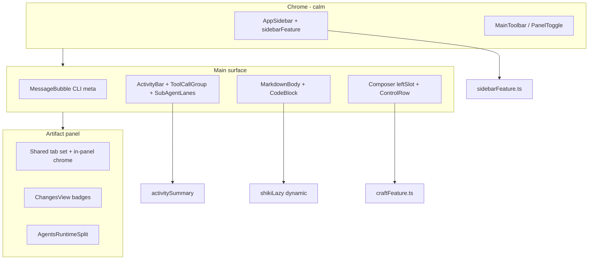
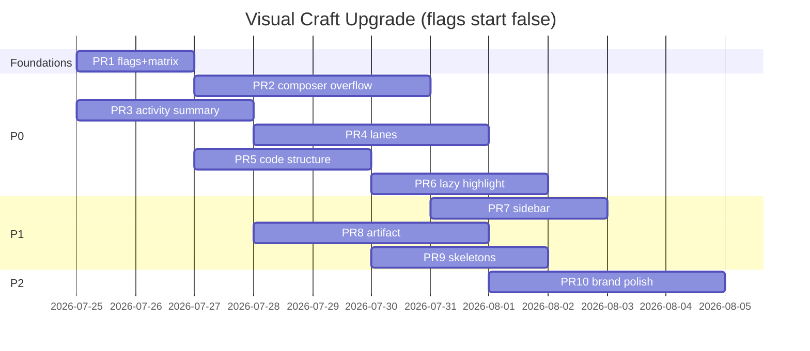
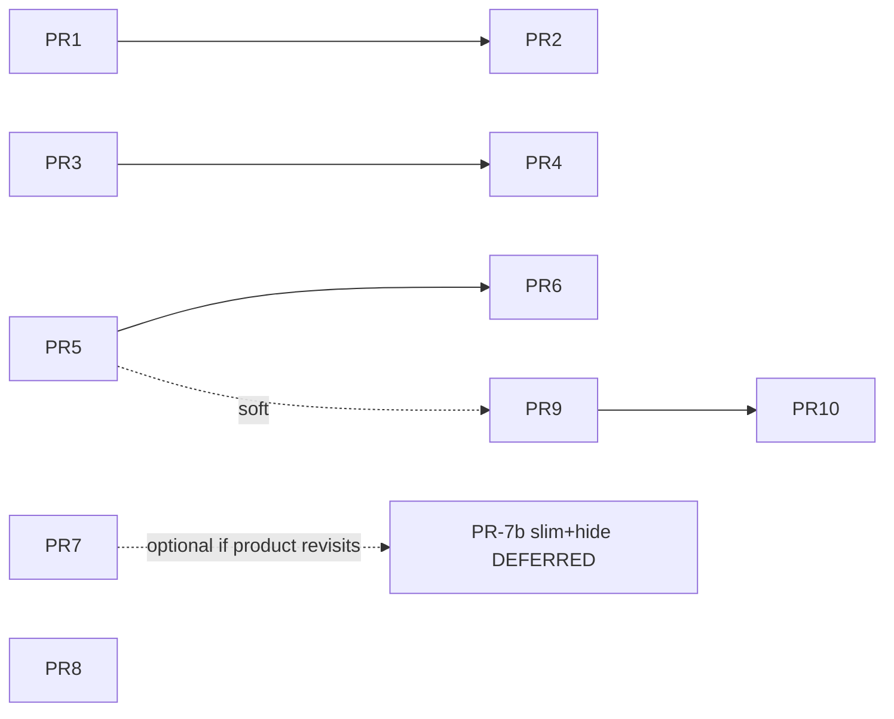

# hip Visual Craft Upgrade Spec Plan

| 字段 | 值 |
|------|-----|
| **Title** | hip Visual Craft Upgrade — 实现就绪规格计划 |
| **Author** | Engineering (craft / UI) |
| **Date** | 2026-07-24 |
| **Status** | Approved — product OQs resolved 2026-07-24 |
| **Audience** | 前端 / 桌面 UI 工程师；熟悉 `src/components/**` 与现有 craft elevation 栈 |
| **Workspace** | `/Users/lijiamin/data/my-github/hip` |
| **Related** | 多阶段 craft elevation（`style(ui): elevate craft…`、`unify focus/hover…`）；`revert(ui): remove composer Tune popover`（`76570f2d`） |
| **Revision** | 2026-07-24 r3 — product: professional-calm; unfinished nav stays visible (SIDEBAR_NAV_SLIM false); PR-7b deferred; start PR-1 |

---

## Overview

hip 已具备成熟的视觉方言：单色 chrome + 暖橙 Flat Butt accent、完整字号阶梯、`data-density` 密度、统一 hover/focus、motion 三档、玻璃材质、扁平阴影哲学、CLI 风格 transcript、以及 `EmptyState` / `MascotActor` / `Skeleton` 等 craft 原语。本计划**不重做设计系统**，而是在既有栈上做**外科手术式**体验升级，解决审计中最影响主路径感知的问题。

优先解决三块 P0：**Composer 控件密度**、**Agent 过程叙事（summary + lanes）**、**Chat 代码块 craft**。随后 P1 处理侧栏 IA、Artifact 面板、主路径 skeleton；P2 补关键时刻品牌与 Settings / Knowledge 收尾。

**所有 feature flag 的 first-merge 默认均为 `false`**（零行为变化地基），产品默认与 bake-in 条件见权威表（§ Feature Flag Registry）。产品已确认：**professional-calm**；未完成侧栏 nav **保持可见**（`SIDEBAR_NAV_SLIM` 维持 `false`，不排程 hide）。其余 OQ（mascot 尺寸等）仍可后续翻转。

---

## Background & Motivation

### 当前状态（已成熟 — 禁止推倒重来）

| 维度 | 现状（代码真相源） |
|------|-------------------|
| Token | `src/styles/tokens.css`：`--accent` 暖橙、中性 hover/active、`--duration-chrome\|content\|celebrate`、`--row-h-sidebar` / `--trail-min-h` / `--meta-gap` |
| Tailwind | `tailwind.config.js`：`text-caption→page`、`state.hover`、`shadow-panel/menu/overlay` 克制阴影 |
| Focus | `src/components/ui/focusClasses.ts`：`focusField` / `focusFieldWithin` / `focusChrome` |
| Hover | `scripts/check-visual-dialects.mjs`：禁止 `hover:bg-surface-muted` / `hover:bg-accent-subtle` |
| Composer | `Composer.tsx` `leftSlot` + `ComposerChip`（`h-7`）；`InputBar.tsx` / `NewConversation.tsx` 全量平铺 |
| Transcript | CLI meta 行（role + time），`MessageBubble.tsx`；`TRANSCRIPT_VIRTUALIZE` + `measureElement` |
| Process | `ActivityBar` + `TurnTimeline` + `ToolCallGroup`（`TOOL_GROUP_THRESHOLD = 5`）+ `SubAgentCard` |
| Code | `CodeBlock.tsx`：`syntaxHighlight` 默认 `false`；知识路径动态 `import('@/lib/shikiLazy')` |
| Feature flags | 编译期常量：`chat/feature.ts`、`terminals/feature.ts`、`artifact/terminalFeature.ts` |
| Mascot | 116 stickers；`NewConversation` `size={360}`；`prefers-reduced-motion` → `HipLogo` |
| i18n | `en` / `zh-CN` / `zh-TW` / `ja` / `ko` + `translation-keys.test.ts` |
| Cold launch | `applyColdLaunchShell()` → `activeView`/`sidebarSection` = `'workbench'`（`uiStore.ts`） |

### 痛点（审计结论）

1. **Composer 过密**：code 活跃会话 8 个 leftSlot 控件；Tune 曾引入 progressive disclosure 后又被整段 revert。
2. **过程叙事同质**：并行子代理纵向堆叠；完成态 summary 缺 edit/shell；running 图标重复。
3. **代码块 craft 不足**：无 fold/badge 升级路径；高亮不能 always-on。
4. **侧栏 IA**：占位 nav 与主功能同权；version chrome 偏重。
5. **Artifact**：无面板内 tab；Agents 首屏偏通用。
6. **Skeleton 稀疏**：主路径 session/knowledge/file tree 几乎无 soft loading。

### 历史教训 — `76570f2d` postmortem

**Commit message 要旨**：`revert(ui): remove composer Tune popover` — *Restore flat primary controls on InputBar and NewConversation; chips are always visible again. Drop ComposerControlRow and e2e/unit paths that opened the Tune panel.*

| 事实 | 含义 |
|------|------|
| 删除 `ComposerControlRow.tsx`（~86 LOC）与 `composer-tune` 打开路径 | 产品/实现选择回到「chip 常驻可见」 |
| e2e 曾适配 Tune 后又回退 | 隐藏控件的测试成本真实存在 |
| 未留下详细 product RFC | 失败表面至少包括：可发现性 + 测试脆弱 + 全量二次挂载复杂度 |

**本升级相对该失败的差异（不仅是改名）**：

1. **非默认 pin**：permission≠edit / plan on / effort≠default 时 chip **常驻主条**（eval 路径无需先猜 overflow）。
2. **Overflow 可空则隐藏**；**禁止 pin+overflow 双挂载**（单一 testid 实例）。
3. **强制 e2e helper** `ensureComposerControlVisible`，覆盖所有 chip 消费点；pointer 合成与现 `openPermissionMenu` 对齐。
4. **`COMPOSER_OVERFLOW` first_merge=`false`** + kill-switch；翻转前 dogfood 清单。
5. 命名 **More / 更多**，testid `composer-overflow*`，**禁止** 再引入 `tune` i18n key 或 testid。

---

## Goals & Non-Goals

### Goals

1. Composer progressive disclosure：默认 2–3 primary；非默认 pin；其余 overflow；**单实例挂载**。
2. Activity：**复用** `ToolCallGroup` 分章 + **更丰富完成 summary** + 并行 **lanes**；减少同质 spin。
3. CodeBlock：结构增强 + 可选懒高亮；**均有 flag，first_merge false**。
4. Sidebar 降噪：version 降级 + worktree 层级清晰；**未完成 nav 保持可见**（`SIDEBAR_NAV_SLIM=false` 为 first_merge 与当前产品意图）。
5. Artifact tab chrome + badge；主路径 skeleton；关键 mascot（P2）。
6. Flag 可回滚、e2e/unit 可验收、方言检查绿。

### Non-Goals

- ❌ 不推翻 design tokens / 圆角 / 阴影哲学  
- ❌ 不做多品牌主题 / 整 UI 卡通化  
- ❌ 不改掉 CLI-style transcript  
- ❌ 不为单次使用引入抽象；不把 shiki 拉进聊天静态图  
- ❌ **不在本升级中发明新的「统一章」组件树**（见 KD-14）  
- ❌ **不在 P0 实现 chat fence `filePath` 解析**（无生产者；见 KD-18）  
- ❌ 不做用户可配置的 primary 控件集合持久化  

---

## Feature Flag Registry（权威 — 全文唯一默认源）

> **实现与 PR 描述只引用本表。** API 代码片段、Rollout、PR Plan 不得另写冲突默认值。

| Flag | 模块文件 | `first_merge_default` | `intended_product_default` | Bake-in 条件 |
|------|----------|----------------------|----------------------------|--------------|
| `COMPOSER_OVERFLOW` | `src/components/chat/craftFeature.ts` | **`false`** | `true` | e2e helper 全迁移绿 + dogfood 清单；eval-plan/permissions/smoke/visual/harness-plan-entry 绿 |
| `ACTIVITY_LANES` | `src/components/chat/craftFeature.ts` | **`false`** | `true` | `ActivityBar`/`MessageBubble`/`SubAgentCard` unit + harness-delegation 抽样绿 |
| `CODEBLOCK_STRUCTURE_CRAFT` | `src/components/chat/craftFeature.ts` | **`false`** | `true` | `CodeBlock` unit + ChatPane virtualizer fold remeasure 测试 |
| `CODEBLOCK_LAZY_HIGHLIGHT` | `src/components/chat/craftFeature.ts` | **`false`** | `true`（更晚） | 见 § CodeBlock lazy 性能合同；默认保持 false 至 budget 签核 |
| `SIDEBAR_NAV_SLIM` | `src/components/layout/sidebarFeature.ts` | **`false`** | **`false`**（产品 2026-07-24：未完成 nav **保持可见**） | **不 bake-in hide**。若未来产品改 hide：须新 PR（原 PR-7b，现 **deferred**）且同 PR 改 `applyColdLaunchShell` → `chats` |

**规则**

- PR-1 引入 flag 文件时 **所有值 = `first_merge_default`（false）** → 零 UI 变化。  
- 某 flag 翻 `true` 的 PR **必须** 在描述中引用本表 bake-in 行，并附对应测试。  
- `flag === false` 时：行为与 2026-07-24 现网等价（像素/交互）。

---

## Proposed Design

### 架构总览



### Phase 0 — 地基

| 交付 | 说明 |
|------|------|
| `src/components/chat/craftFeature.ts` | 上表 chat 侧 flags，全部 `false` |
| `src/components/layout/sidebarFeature.ts` | `SIDEBAR_NAV_SLIM = false` |
| `composerControlMatrix.ts` + unit | 纯矩阵 + availability 过滤契约 |
| i18n | **仅** PR 实际渲染时加 key（见 Appendix A）；PR-1 可不加 orphan keys |

**成功标准**

- [ ] 全 flag `false` 时 UI 与现网等价  
- [ ] `yarn tsc` / matrix unit 绿  

---

### Phase 1 — P0 Composer 控件密度

#### UX：默认可见控件矩阵（逻辑 ID）

| 表面 | primary | pinned（仅当条件成立 **且** available） | overflow 候选（available ∧ ¬pinned） |
|------|---------|----------------------------------------|--------------------------------------|
| code + !external | agent, model, attach | permission if ≠edit；plan if forcePlan；effort if ≠default；worktree if active non-primary context | effort, permission, plan, guidance, worktree |
| code + external | agent, attach | permission if ≠edit | permission, guidance, worktree |
| chat | agent, model, attach | effort if ≠default | effort |
| NewConversation code | 同 code，但无 guidance/worktree（`sessionBound=false`） | 同 pin 规则中适用项 | effort, permission, plan |
| NewConversation chat | 同 chat | 同 chat | effort |

Pin 条件（与 `daf5efdb` InputBar 一致，可在 `composerControlMatrix` 测）：

```ts
pinPermission = isCode && resolvePermissionMode(...) !== 'edit'
pinPlan       = isCode && !externalPrimary && forcePlan
pinEffort     = !externalPrimary && hasEffortLevels && resolved !== defaultEffort(levels)
pinWorktree   = isCode && sessionBound && hasActiveWorktreeContext(...)
```

#### 挂载与可用性契约（API 级 — 解决双实例 / 空 overflow）

```ts
// src/components/chat/composerControlMatrix.ts

export type ControlId =
  | 'agent' | 'model' | 'effort' | 'permission' | 'plan'
  | 'guidance' | 'worktree' | 'attach'

export interface ComposerControlFlags {
  surface: 'chat' | 'code'
  externalPrimary: boolean
  permissionMode: 'chat' | 'edit' | 'full'
  forcePlan: boolean
  effortIsDefault: boolean
  hasEffortLevels: boolean
  pinWorktree: boolean
  sessionBound: boolean
  /**
   * Runtime availability after picker self-null rules.
   * Call site computes from same predicates as components:
   * - effort: hasEffortLevels
   * - guidance: sessionBound && code && cwd && guidance text present
   * - worktree: sessionBound && worktree UI applicable
   * Missing key ⇒ treat as true for always-mounted controls (agent/model/attach/permission/plan).
   */
  available?: Partial<Record<ControlId, boolean>>
}

export interface ResolvedComposerControls {
  primary: ControlId[]
  pinned: ControlId[]
  /** Secondary IDs to mount inside overflow only — disjoint from primary∪pinned */
  overflow: ControlId[]
}

/**
 * Contract:
 * 1. primary ∩ pinned = ∅; primary ∩ overflow = ∅; pinned ∩ overflow = ∅
 * 2. Each ControlId appears in at most one of the three arrays
 * 3. Filter out ids where available[id] === false
 * 4. UI: render Overflow trigger iff overflow.length > 0
 * 5. React: mount each ControlId exactly once (no pin+overflow duplicate pickers)
 */
export function resolveComposerControls(flags: ComposerControlFlags): ResolvedComposerControls
```

**UI 规则**

| 规则 | 说明 |
|------|------|
| Overflow 空 | **不渲染** `composer-overflow` 触发器 |
| Pin 排他 | 已 pin 的 ID **只**在主条挂载；overflow 面板 **不含** 该 React 实例（用户改回默认后，下一 render 进入 overflow） |
| Chip testid | 文档内任意时刻 **至多一个** `[data-testid="permission-chip"]` 等（unit + e2e 断言） |
| 几何 | 一律 `ComposerChip` `h-7` + active `bg-state-hover text-ink` |
| 容器 | `Popover`（与旧 Tune 同级交互需求）；testid `composer-overflow` / `composer-overflow-panel` |
| 图标/文案 | `Ellipsis` + `chat.composer.more`；**禁止** `tune` keys |

**a11y（Overflow）**

- Trigger：`aria-haspopup="dialog"`（或 `menu` 若用 menu 语义）、`aria-expanded`、`aria-controls` → panel id  
- Panel：`aria-label` / 标题节点 `chat.composer.moreTitle`；`Escape` 关闭（Radix Popover 默认）  
- Focus：打开后 focus 首个可聚焦控件；关闭回 trigger；chip 使用既有 `focusChrome` / chip ring  
- 不引入新 focus 方言  

#### 组件结构

```
ComposerControlRow  (flag COMPOSER_OVERFLOW)
  ├─ composer-controls-primary   → mount primary IDs
  ├─ composer-controls-pinned    → mount pinned IDs (optional)
  └─ Overflow trigger            → only if overflow.length > 0
       └─ panel: mount overflow IDs as full-width rows
flag off:
  leftSlot = flat fragment of all current controls (现网)
```

#### E2E helper 合同（PR-2 强制）

```ts
// e2e/helpers/composer-overflow.ts （新；长期替代 composer-tune 的控件职责）
/**
 * Ensure a composer chip is visible and unique in the document.
 * - If COMPOSER_OVERFLOW off or chip already visible: return it
 * - Else open [data-testid=composer-overflow] (pointerdown+click synthesis —
 *   parity with openPermissionMenu in eval-permissions.ts; bare click is flaky on Radix)
 * - waitUntil: exactly one matching testid, displayed
 * - returns WebdriverIO element
 */
export async function ensureComposerControlVisible(
  testId: string,
): Promise<WebdriverIO.Element>
```

**必须迁移到 helper（或间接经已改写的 eval-plan / eval-permissions）的调用点**：

| 位置 | 现状 |
|------|------|
| `e2e/helpers/eval-plan.ts` → `enablePlanModeUi` | 直接 `$('plan-mode-chip')` |
| `e2e/helpers/eval-permissions.ts` → `openPermissionMenu` | 直接 `$('permission-chip')` + pointer 合成 |
| `e2e/page-objects/ChatPage.ts` → `permissionChip` / `modelChip` | getter 应经 ensure 或文档要求调用方 ensure |
| `e2e/specs/eval-ui-smoke.spec.ts` | 直接 permission-chip |
| `e2e/specs/eval-ui-visual-capture.spec.ts` | 直接 permission-chip |
| `e2e/specs/harness-plan-entry.spec.ts` | 直接 plan-mode-chip + enablePlanModeUi |
| `e2e/specs/composer-widgets.spec.ts` | 控件可见性断言 |
| `e2e/helpers/eval-run.ts` | 经 enablePlanModeUi（间接） |
| `e2e/specs/live-plan-deepseek-dogfood.spec.ts` | 经 enablePlanModeUi |

`e2e/helpers/composer-tune.ts` 现仅 `expandActivityTrailIfCollapsed`：PR-2 或后续 **rename/split** → `e2e/helpers/activity-trail.ts`，避免长期 `tune` 路径（nit，可同 PR 或 PR-2b）。

#### 文件触达

`ComposerControlRow.tsx`（重建）、`composerControlMatrix.ts`+test、`InputBar.tsx`+test、`NewConversation.tsx`+test、`craftFeature.ts`、pickers 只读、i18n（PR-2 keys）、e2e 上表。

#### 验收

- [ ] flag off ≡ 现网  
- [ ] flag on：默认 ≤3 primary；pin 规则单测；overflow 空时无触发器  
- [ ] 任意 chip testid 全局唯一  
- [ ] 上表 e2e 路径全绿  
- [ ] `check-visual-dialects.mjs` OK  

#### Dogfood（翻转 `COMPOSER_OVERFLOW=true` 前）

- [ ] 宽屏 / 窄窗 / compact density  
- [ ] 切换 permission full→edit、开关 plan、改 effort 默认与非默认  
- [ ] external ACP primary 隐藏 model/effort/plan  
- [ ] NewConversation card 变体  

---

### Phase 2 — P0 Agent 过程叙事

#### 范围对齐（章节降级 — KD-14）

**不做**新的 think/read/edit/run/delegate/plan「统一章」组件树。

| 能力 | 实现落点 | PR |
|------|----------|-----|
| Category 分章 | **保持** `groupToolCalls` + `TOOL_GROUP_THRESHOLD = 5` + `ToolCallGroup`；不改阈值除非另有数据 | 已有 |
| Thinking | **保持** `ThinkingDisclosure` | 已有 |
| Plan | **保持** TodoChecklist / PlanProgressPanel | 已有 |
| 完成 summary 层级 | 扩展 `activitySummary`：`categorySummary` 含 edit/shell；可选 `elapsed` | **PR-3** |
| Spinner 纪律 | ActivityBar / ToolCallRow 微规则 | **PR-3** |
| 并行 lanes | `SubAgentLanes` + 单开详情 | **PR-4** |
| Interleaved | **不**按 category 重切 `TRANSCRIPT_INTERLEAVED_BLOCKS` 流；lanes 仅作用于 `MessageBubble` 的 nested `SubAgentCard` 区域（ActivityBar children） | PR-4 |

Phase 2 成功标准 = PR-3 + PR-4 之和；**无 orphan「章节 PR」**。

#### Trail 状态（summary 文案）

折叠摘要拼接优先级（`formatParts`）：

1. 状态词 Completed / Stopped / partial  
2. Plan `done/total`  
3. Category：优先 edit + shell，再 read/search/browse（扩展字段）  
4. parallelAgents  
5. elapsed（可选并入）  

Running：保持单一 motion 源（有 role 时 AgentBadge pulse，无 Loader2 叠 pulse）。

#### 并行代理 Lanes（PR-4）

```
ActivityBar (fold chrome only)
  summary button
  expanded body:
    TurnTimeline / tools (existing)
    SubAgentLanes  ← owned by MessageBubble (or dedicated child), NOT reimplemented inside ActivityBar logic
```

**状态所有权**

| 项 | 规格 |
|----|------|
| 组件 | 新建 `SubAgentLanes.tsx`（或 `MessageBubble` 内联小子树）；`MessageBubble` 在 `nested.length >= 2 && ACTIVITY_LANES` 时渲染 |
| `selectedAgentId` | **local state**，键为该 message 的 process chrome 实例；**非** global store |
| 默认选中 | 第一个 `status==='running'`，否则第一个 nested |
| ActivityBar collapse | `open===false` 时 **clear** selection（或忽略；推荐 clear 以免展开时突兀） |
| Turn settle | 不强制清 selection；用户可继续查看完成 lane |
| 单代理 | `nested.length === 1` → 现 `SubAgentCard` 直出 |
| `showTools` | 保持 `streaming \|\| agent.status === 'running'` |
| Running lane 指示 | role-color 1.5px pulse dot，**不用**第二 Loader2 |

**a11y（lanes）**

- Lane strip：`role="tablist"`（或 `radiogroup`）；每 lane `role="tab"` / `aria-selected`  
- 键盘：Left/Right 或 roving tabindex；Enter/Space 选中  
- 详情区 `role="tabpanel"` + `aria-labelledby`  
- reduced-motion：无 slide，仅 `duration-chrome` opacity  

#### 文件触达

PR-3：`activitySummary.ts`+test、`ActivityBar.tsx`+test、i18n  
PR-4：`MessageBubble.tsx`、`SubAgentLanes.tsx`（新）、`SubAgentCard.tsx`、`craftFeature.ts`、tests、e2e harness-delegation  

#### 验收

- [ ] PR-3：完成摘要含 edit/shell；spinner 纪律单测  
- [ ] PR-4 flag off：纵向堆叠；flag on：`subagent-lanes` + 单开  
- [ ] interleaved 答案文本不因 lanes 丢失  

---

### Phase 3 — P0 Chat CodeBlock craft

#### 双 flag

| Flag | 控制 |
|------|------|
| `CODEBLOCK_STRUCTURE_CRAFT` | lang badge 样式、**长 fence 折叠** |
| `CODEBLOCK_LAZY_HIGHLIGHT` | 可见 + 完成后 `shikiLazy` |

二者 first_merge 均为 **false**。结构与懒高亮可独立 bake-in。

#### 行为矩阵

| 场景 | structure flag | lazy flag | 行为 |
|------|----------------|-----------|------|
| 任意 flag off | — | — | 与现网 `CodeBlock` 等价（caption 语言串 + copy） |
| structure on，streaming 中的 assistant fence | on | * | **不折叠**（`foldLong` 仅 `!isStreamingMessage`） |
| structure on，已完成，行数 ≥ 24 | on | * | 默认折前 12 行；expand 全文；copy **始终全文** |
| lazy on + 完成 + 进入视口 | * | on | dynamic shiki；失败回退 plain |
| lazy on + 未完成 / 不可见 | * | on | 不高亮 |
| Knowledge `syntaxHighlight={true}` | * | * | 父级强制；立即高亮路径不变 |
| code 长度 > 50_000 **UTF-16 code units** (`code.length`) | * | on | **跳过** highlight |

**不在 P0 做**：从 fence info 解析 `filePath`（无 chat 生产者）。`filePath?: string` 仅作为**可选 prop** 留给 knowledge/tool 覆盖；PR-5/6 **不**实现解析器。

#### Virtualization / fold 合同

- Chat：`TRANSCRIPT_VIRTUALIZE` + `measureElement`（`ChatPane.tsx` / `feature.ts`）  
- Expand/collapse **必须**触发既有 measure 路径（ResizeObserver / `measureElement` 已观察内容高度变化则自然更新；单测：toggle fold 后 virtualizer 总高度变化）  
- Jump-to-message：expand 若发生在视口上方，允许一次布局跳动；不引入复杂 scroll anchoring（文档接受）  
- Streaming：禁止对未完成 fence 默认 fold，避免流式增高反复折断  

#### Lazy Shiki 性能合同（PR-6）

| 参数 | 值 |
|------|-----|
| IntersectionObserver | `root: transcript scroll parent or null`；`rootMargin: '80px 0px'`；`threshold: 0.01` |
| Completed | 该 `CodeBlock` 所在 assistant message **`streaming !== true`**（由 props 或上下文传入 `isStreaming?: boolean`） |
| 并发 | 模块级 semaphore **max 3** `highlightCode` in-flight；超额排队 |
| Cancel | unmount / deps change → 既有 `cancelled` flag；排队项可丢弃 |
| 跳过 | `code.length > 50_000`（UTF-16 length） |
| 离视口 | **保留** highlighted HTML（防闪） |
| 内存 | 进程内 **LRU 最多 32** 个 `(hash(code,lang,theme) → html)`；超限驱逐最久未用；组件卸载不强制清 LRU |
| 快速滚动 | 仅 intersection 为 true 时入队；离开视口且仍排队未开始则 cancel 排队 |
| Bake-in checklist（人工） | ① 50 条消息含 ≥10 大 fence 快滑无持续 jank ② chat 静态图无 shiki ③ flag false 零差异 |
| Perf budget | **Bake-in 前** 由实现者记录：首屏打开长会话 P95 滚动帧相对 flag off **不明显回退**（不设虚假 ms 数；知识侧可参考 `knowledge-perf-budgets` 方法论） |

#### CodeBlock props（向后兼容）

```ts
export type CodeBlockProps = ComponentPropsWithoutRef<'pre'> & {
  node?: unknown
  syntaxHighlight?: boolean  // parent force (knowledge); default false
  /** Optional path label — producer must pass; chat P0 does not parse fences */
  filePath?: string
  /** When structure flag on: allow fold. Default true under flag. */
  foldLong?: boolean
  /** Message still streaming — disables fold + lazy highlight */
  isStreaming?: boolean
}
```

`MarkdownBody` 可透传 `isStreaming` 当从 `MessageBubble` 传入时；最小改动：MessageBubble → MarkdownBody → pre 组件 props（若成本高，structure fold 可先仅用「非最后一条 streaming 消息」启发式，但优先显式 prop）。

#### 文件触达

PR-5：`CodeBlock.tsx`+test、`craftFeature` structure flag、i18n fold、可选 ChatPane measure 测试  
PR-6：lazy 路径、semaphore/LRU in `shikiLazy` 或旁路模块、flag lazy  

#### 验收

- [ ] 双 flag off ≡ 现网  
- [ ] structure on：fold/expand + remeasure 测  
- [ ] lazy 合同单测（mock observer / semaphore）  
- [ ] 无 chat 静态 shiki  

---

### Phase 4 — P1 Sidebar IA

#### 产品决策 + 工程默认（KD-7 / KD-16）

| 项 | 当前产品意图（2026-07-24） |
|----|---------------------------|
| `SIDEBAR_NAV_SLIM` | **`false`** — workbench / tasks / automation **保持可见**（first_merge 与 intended 一致） |
| 冷启动 | **保持** `applyColdLaunchShell` → `workbench`（不因本 upgrade 改动） |
| Version chrome | PR-7：降级到 footer / 更低对比（视觉 only） |
| Worktree 行样式 | PR-7：强化 indent / meta，主从层级清晰 |
| Hide / PR-7b | **Deferred / optional** — 仅当产品日后 revisit hide 时再开；**禁止** 只 hide 不改冷启动 |

**PR-7 范围**：version 降级 + worktree 视觉 + 引入 `sidebarFeature.ts`（保持 `false`）。**不**排程 PR-7b hide。

#### 文件

`AppSidebar.tsx`、`SidebarAccountFooter.tsx`、`sidebarFeature.ts`、可选 `uiStore.ts`（仅 product flip PR）、tests、e2e app-launch  

---

### Phase 5 — P1 Artifact 面板

#### Tab 同步契约

```ts
// 共享纯函数 — PanelToggle 与 ArtifactPanel 共用
function visibleArtifactTabs(args: {
  surface: 'code' | 'chat'
  isGitRepo: boolean
  codeTerminal: boolean
}): Array<{ value: ArtifactTab | ChatTab; labelKey: string }>
// code: outline, files, agents, timeline?, changes?, terminal?
// chat: outline, files, agents  （chat 用 chatActiveTab / setChatActiveTab）
```

| 规则 | 说明 |
|------|------|
| 写入 | 面板内 tab 与 `PanelToggle` **均**调用 `setTab` / `setChatActiveTab` + 打开面板 |
| 读 | `activeTab` / `chatActiveTab` + `resolveEffectiveTab`（git-gate、terminal flag、tasks→agents） |
| 布局 | 优先单行塞进 titlebar 下方 **第二行** toolbar（`h-8`/`h-9`，`border-b border-border`，`text-meta`），**不**挤爆 `--titlebar-height` 拖拽行 |
| Knowledge / terminals | PanelToggle 分支 **不变**；本 Phase **不**给 knowledge/terminals 做 in-panel multi-tab |
| a11y | 优先复用 `src/components/ui/Tabs.tsx`；`aria-label` from i18n；键盘左右切换 |

Change badge：`useDiffStore` uncommitted file count → Changes tab 旁 caption 数字。

Agents 首屏：empty copy 收紧；live 时一行 summary 可复用 `buildActivitySummary` 字段。

#### 文件

`ArtifactPanel.tsx`、`PanelToggle.tsx`、共享 tab 列表 helper、`ChangesView`/`DiffDisplay` 微调、`AgentDashboard.tsx`、tests、e2e diff-workspace  

---

### Phase 6 — P1 Skeletons

#### Knowledge 精确状态

| 谓词 | UI |
|------|-----|
| `!loaded` | **仅** skeleton；**无** Create CTA、无 empty 文案 |
| `loaded && spaces.length === 0` | friendly EmptyState + Create |
| `loaded && spaces.length > 0 && mode !== 'workspace'` | select-space empty（现有 copy） |
| `mode === 'workspace'` | `KnowledgeWorkspace` |

#### 其他路径 — 可实现谓词

**Session 切换（`ChatPane`）**

`useActiveMessages()` 返回数组，**无**独立 loading flag。采用**短过渡 skeleton**，避免空会话永久 skeleton：

| 规则 | 说明 |
|------|------|
| 触发 | `activeSessionId` **变化**（含 `null → id`）时，本地 `switching=true`，渲染 `SkeletonText` 2–3 行 |
| 结束 | 下一帧 `requestAnimationFrame`（双 rAF 亦可）或 **≤80ms** `setTimeout` 后 `switching=false`，显示真实 transcript |
| 空会话 | `messages.length === 0` 且非 switching → **空 transcript**（非 skeleton、非 infinite） |
| 禁止 | 用 `messages.length === 0` 单独作为 loading 信号（会把新会话当成加载中） |

**File tree 根 hydrate（`FileTree`）**

`fsStore` 的 `status: 'loading'` 仅用于 **file preview**（`PreviewState`），**不**覆盖目录列表。`entriesByDir` 在 `setEntries` 后才有键。PR-9 显式谓词：

| 规则 | 说明 |
|------|------|
| 显示 4× `Skeleton` 行 | `cwd`（session root）已设置 **且** `entriesByDir[cwd] === undefined` **且** 已对该 path 发起过 `ls`/list 请求（组件 mount 或 cwd 变更时置 `rootListRequested=true`） |
| 显示真实树 / 空目录 | `entriesByDir[cwd]` 为数组（可 `length === 0`） |
| 禁止 | 将 `preview.status === 'loading'` 当作 tree hydrate 信号 |
| 可选增强 | 仅当竞态严重时再加 `dirLoading: Record<path, boolean>`；**默认不**扩展 store schema |

**Transcript load earlier**

可选顶/底细条 skeleton；不阻塞。

规则：复用 `ui/Skeleton`；无新动画方言；PR-9 **软依赖** PR-5（若 structure fold 已开，改 ChatPane 时注意 measure）。

---

### Phase 7 — P2 品牌 / Settings / Knowledge

#### 品牌默认（KD-19 — 产品已确认）

- **professional-calm**（产品 2026-07-24）：chrome 无 mascot；**完成 settle mascot 不在默认路径**  
- NewConversation **保持** 现有 mascot（尺寸 **暂不改 360**，见 OQ-4）  
- Permission / turn-complete sticker：**默认不做**  
- reduced-motion 既有路径保留  

#### Knowledge graph

```ts
stroke: e.kind === 'embed' ? 'var(--warning)' : 'var(--border)'
```

去掉 `--color-warning` / `#ca8a04` / `#888` 硬编码回退。

#### Settings

`CurrentModelHero` catalog 加载 skeleton；长列表对齐 `PluginConfigView`。

---

## API / Interface Changes

### craftFeature.ts（first_merge 值 — 必须与 Registry 一致）

```ts
// src/components/chat/craftFeature.ts
export const COMPOSER_OVERFLOW = false
export const ACTIVITY_LANES = false
export const CODEBLOCK_STRUCTURE_CRAFT = false
export const CODEBLOCK_LAZY_HIGHLIGHT = false
```

### sidebarFeature.ts

```ts
// src/components/layout/sidebarFeature.ts
export const SIDEBAR_NAV_SLIM = false
```

### composerControlMatrix

见 Phase 1 契约（互斥数组 + availability + 空 overflow 不渲染）。

### CodeBlock

见 Phase 3；`filePath` 可选、P0 无解析。

### activitySummary

```ts
| { type: 'categorySummary'; search: number; read: number; browse: number;
    edit: number; shell: number }
| { type: 'elapsed'; ms: number }
```

---

## Data Model Changes

无持久化 schema / sidecar 协议变更。无用户 pin 偏好 localStorage。

---

## Alternatives Considered

### Composer

| 方案 | 结论 |
|------|------|
| A. 原样恢复 Tune | ❌ 刚 revert |
| B. Overflow + pin + 单实例 + helper | ✅ |
| C. 永远平铺 | ❌ 不解决密度 |
| D. 稀有控件仅 Command Palette | ❌ 不可作唯一入口 |
| E. **仅 compact / 窄宽时 overflow** | ❌ 拒绝（简单性）：双模式增加矩阵与 e2e 分叉；若 dogfood 强烈反弹可再 RFC。Wide 屏仍用同一 progressive disclosure，靠 pin 保高频状态可见 |

### Highlight

Always-on ❌；**Lazy + flag** ✅；Never（structure-only）= lazy off 回退。

### 并行代理

纵向全开 ❌；**Lanes + 单开** ✅；仅 summary 不可展开 ❌。

### 未完成 nav

| 方案 | 结论（产品 2026-07-24） |
|------|------------------------|
| 隐藏 unfinished nav | ❌ 当前不采用 |
| **保持显示 + version 降级 + worktree 层级** | ✅ 当前产品意图 / PR-7 |
| 日后 slim + 冷启动 chats | **Deferred**（PR-7b optional，非本计划必做） |

### 章节

新建统一章组件 ❌；**复用 ToolCallGroup + summary** ✅。

---

## Security & Privacy

| 主题 | 说明 |
|------|------|
| 范围 | 纯 UI；无新 IPC |
| Shiki HTML | 仅 highlighter 产出；plain fence in；CSP 已限制页面脚本注入面（Tauri/web CSP 既有策略，本变更不放宽） |
| Path 展示 | 仅显式 prop；P0 不解析用户 fence |

---

## Observability

- 懒高亮失败：dev `console.debug` 可选  
- E2E 套件见 PR Plan  
- `check-visual-dialects.mjs`  
- 无新后端遥测  

---

## Rollout Plan

严格按 **Feature Flag Registry**：

1. 合并 PR 时 flag = `first_merge_default`（全 false，除明确 bake-in PR）  
2. Bake-in PR：只翻一个 flag（或 slim+coldlaunch 绑定翻）  
3. 回滚：flag → false 热修  



Gantt 为**示意顺序**，不承诺人天/日历；容量由团队自定。

---

## Risks & Mitigations

| ID | 风险 | 严重度 | 缓解 |
|----|------|--------|------|
| R1 | Overflow 重蹈 Tune | High | pin、单实例、More 命名、flag、dogfood、postmortem 差异列表 |
| R2 | E2E 找不到 chip | High | **强制** ensure helper + 全调用点清单 |
| R3 | 懒高亮 jank | Med | semaphore 3、LRU 32、50k skip、default false |
| R4 | Lanes × interleaved | Med | lanes 仅 nested 区；flag |
| R5 | Slim × workbench 死端 | Low（当前） | 产品决定 nav **保持可见**；slim 维持 false；若未来 hide 必同 PR 改冷启动 |
| R6 | 方言检查 | Low | state-hover / focus 家族 |
| R7 | i18n | Low | 按 PR 加 key；禁 tune keys |
| R8 | Fold × virtualizer | Med | structure flag；!streaming；remeasure 测 |
| R9 | 双挂载 Radix/testid | High | 矩阵互斥 + e2e unique 断言 |

---

## Key Decisions

| # | 决策 | 理由 |
|---|------|------|
| KD-1 | 不恢复 Tune 命名/旧 testid；用 Overflow More | `76570f2d` |
| KD-2 | 非默认 pin 到主条 | 可发现性 + eval |
| KD-3 | primary = Agent + Model + Attach | 最高频 |
| KD-4 | 并行 → lanes + 单开 | 降噪可调试 |
| KD-5 | Chat Shiki 仅 lazy + flag，first_merge false | perf / 包体 |
| KD-6 | 结构 chrome（fold/badge）也走 **`CODEBLOCK_STRUCTURE_CRAFT` flag**，first_merge false | 避免未测 virtualizer 的默认行为变化；与「flag off 等价现网」一致 |
| KD-7 | **Sidebar slim 保持 false**（first_merge **与** 当前产品意图）；PR-7 仅 version + worktree；**不**默认 hide | 产品 2026-07-24：unfinished nav 保持可见 |
| KD-8 | 不改 CLI transcript / tokens / 阴影 | 产品语言已定 |
| KD-9 | Flags：chat → `craftFeature.ts`；sidebar → `sidebarFeature.ts`；编译期 const | 与现模式一致；分模块避免 layout 依赖 chat |
| KD-10 | Mascot 仅关键时刻；P2 默认仍冷静；尺寸暂不改 | 防卡通化 |
| KD-11 | 新字符串五语言；**禁 `tune` keys**；key 在首渲染 PR 添加 | 防 orphan / 回归 |
| KD-12 | Chip 统一 ComposerChip h-7 | 方言 |
| **KD-13** | **Flag 权威表**；API/PR 禁止冲突默认 | Issue 1 |
| **KD-14** | **不新建统一「章」组件**；复用 ToolCallGroup；Phase2=PR3+PR4 | Issue 4 |
| **KD-15** | **Overflow：availability 过滤；空则隐藏触发器；pinned∩overflow=∅ 单实例** | Issue 2 |
| **KD-16** | **Slim 维持 false**；hide 仅未来 optional PR-7b 且须同改冷启动 → chats | 产品决议 + Issue 7 安全约束 |
| **KD-17** | **PR-2 强制 ensureComposerControlVisible + 全调用点迁移** | Issue 3 |
| **KD-18** | **P0 不实现 fence path 解析**；`filePath` 仅可选 prop | Issue 10 |
| **KD-19** | **品牌默认 professional-calm**（产品已确认）；完成 settle mascot **不在默认路径**；NewConversation 尺寸暂 360 | 产品 2026-07-24 |

---

## Open Questions

1. **专业冷静 vs 品牌温暖** — **Resolved (2026-07-24)**：**professional-calm**。完成 settle mascot **不在默认路径**（KD-19）。  
2. **未完成 nav：隐藏 vs 预览 vs 保持** — **Resolved (2026-07-24)**：**保持可见** workbench/tasks/automation。`SIDEBAR_NAV_SLIM` 维持 `false`；PR-7 只做 version 降级 + worktree 层级。**不**排程 hide / PR-7b，除非产品日后 revisit。  
3. **冷启动** — 当前不变（`workbench`）。仅在未来 slim=true 时要求 → `chats`（KD-16 安全约束）。  
4. **NewConversation mascot 尺寸** — 暂保持 360（未决，可后续调）。  
5. **Worktree 是否 pin** — 工程默认：仅 non-primary worktree context 时 pin。  
6. **Lazy highlight bake-in budget** — 见性能合同；不阻塞 PR-6 暗发布。  
7. **用户自定义 primary 集合** — 不做。  

---

## 分阶段成功标准

| Phase | 成功标准 |
|-------|----------|
| 0 | Flags false；matrix 单测；零 UI 变化 |
| 1 | 契约 + e2e helper；flag on 可狗粮 |
| 2 | PR-3 summary + PR-4 lanes（无独立章节交付物） |
| 3 | structure/lazy 双 flag 合同 |
| 4 | version/worktree 可合；slim 安全 |
| 5 | 共享 tab 集合 + 第二行 chrome |
| 6 | Knowledge 三态；session/file tree skeleton |
| 7 | token 对齐；冷静品牌默认 |

### 全局验收

- [ ] `node scripts/check-visual-dialects.mjs`  
- [ ] `yarn tsc`  
- [ ] 相关 unit  
- [ ] e2e：composer-widgets、eval-ui-smoke、eval-ui-visual-capture、harness-plan-entry、eval-plan/permissions 路径、smooth 抽样、harness-delegation、diff-workspace、app-launch  
- [ ] compact / dark / reduced-motion / narrow  

---

## Appendix A — i18n keys by PR

> 在**首次渲染该字符串的 PR** 中加入五语言；PR-1 **不**预置 orphan keys。  
> **禁止** 重新引入 `chat.composer.tune` / `tuneTitle` / `tuneHint`。

| PR | Key | English source |
|----|-----|----------------|
| PR-2 | `chat.composer.more` | More |
| PR-2 | `chat.composer.moreTitle` | More controls |
| PR-2 | `chat.composer.moreHint` | Permission, plan, effort, and workspace controls |
| PR-3 | `chat.activity.catEdit` | {{count}} edits |
| PR-3 | `chat.activity.catShell` | {{count}} commands |
| PR-3 | （复用）`chat.activity.elapsed` 若尚未用于 summary | {{time}} |
| PR-4 | `chat.subagent.lanesAria` | Parallel sub-agents |
| PR-5 | `chat.codeBlock.expand` | Show {{count}} more lines |
| PR-5 | `chat.codeBlock.collapse` | Show less |
| PR-8 | 若 badge 需 aria | `artifact.changesBadge` | {{count}} files |
| PR-7 | 仅 preview 模式需要时 | `sidebar.navComingSoon` | Coming soon |
| PR-10 | 按实际 copy | settings/knowledge 微调 |

---

## Appendix B — Pin logic reference (`daf5efdb`)

Recovered from `git show daf5efdb:src/components/chat/InputBar.tsx`（Tune 时代）：

- `pinPermission = isCode && permissionMode !== 'edit'`  
- `pinPlan = isCode && !externalPrimary && forcePlan`  
- `pinEffort = !externalPrimary && effortLevels && resolvedEffort !== defaultEffort(effortLevels)`  
- code primary：`SessionAgentPicker`, `ModelPicker`, `AttachmentButton`  
- code secondary in popover：Effort, Permission, Plan, ProjectGuidance, Worktree  
- chat：primary 同上；secondary Effort only  

本设计在此基础上增加：**availability 过滤、pinned∩overflow 互斥单实例、空 overflow 隐藏**。

---

## References

- `src/styles/tokens.css`, `tailwind.config.js`, `scripts/check-visual-dialects.mjs`  
- `src/components/chat/{InputBar,Composer,ComposerChip,NewConversation,ActivityBar,TurnTimeline,CodeBlock,MarkdownBody,MessageBubble,feature,EffortLevelPicker,ProjectGuidanceChip}.*`  
- `src/components/artifact/{ToolCallRow,ToolCallGroup,SubAgentCard,ArtifactPanel,ChangesView,DiffDisplay,AgentsRuntimeSplit,AgentDashboard,FileTree}.*`  
- `src/components/layout/{AppSidebar,PlaceholderPage,PanelToggle,SidebarAccountFooter}.*`  
- `src/store/uiStore.ts` — `applyColdLaunchShell`, `isPlaceholderSidebarSection`  
- `src/lib/{activitySummary,toolGroups,shikiLazy}.ts`  
- `src/components/ui/{EmptyState,Skeleton,focusClasses,Tabs}.*`  
- Git: `76570f2d`, `daf5efdb`, `e9aae804`, `77f73a5c`, `35ecfa35`  
- E2E: `composer-tune.ts`, `eval-permissions.ts`, `eval-plan.ts`, call sites listed in Phase 1  

---

## PR Plan

### PR-1 — Flags + composer control matrix

- **Title**: `feat(ui): craft upgrade flags and composer control matrix`
- **Files**: `src/components/chat/craftFeature.ts`, `src/components/layout/sidebarFeature.ts`, `composerControlMatrix.ts`+`.test.ts`
- **Deps**: 无  
- **Description**: 全 flag = Registry `first_merge_default`（**false**）。矩阵实现互斥 + availability。**不加** orphan i18n。零 UI 变化。

### PR-2 — Composer overflow

- **Title**: `feat(composer): overflow controls with non-default pin and e2e helper`
- **Files**: `ComposerControlRow.tsx`, `InputBar.tsx`+test, `NewConversation.tsx`+test, `ComposerChip.tsx`（仅必要时）, `craftFeature` 保持 false 或本 PR 内仍 false（**推荐本 PR 合入时仍 false**，bake-in 另 PR-2b 翻 true）, i18n more*, `e2e/helpers/composer-overflow.ts`, 迁移 eval-plan/permissions/ChatPage/eval-ui-smoke/visual-capture/harness-plan-entry/composer-widgets；可选 rename `composer-tune.ts` → `activity-trail.ts`
- **Deps**: PR-1  
- **Description**: flag 可测路径；实现挂载契约；**强制** ensure helper 全站 chip 入口。Bake-in 翻 true 可同 PR 若 e2e 全绿，否则 PR-2b。

### PR-3 — Activity summary + spinner discipline

- **Title**: `feat(chat): richer activity summary and quieter running indicators`
- **Files**: `activitySummary.ts`+test, `ActivityBar.tsx`+test, i18n catEdit/catShell  
- **Deps**: 无（可与 PR-1 并行）  
- **Description**: **无新章节组件**；扩展 `categorySummary`（**required** `edit`/`shell` 字段）+ spinner 纪律。**无 feature flag**（可接受）。**字符串/快照风险**：同 PR 必须更新 `activitySummary.test.ts` / `ActivityBar.test.tsx` 中对 summary 文案的断言；e2e **避免**对 `activity-bar-summary` 全文精确匹配，改为断言结构（status icon / `data-status`）或在 counts>0 时检查 catEdit/catShell 片段。

### PR-4 — Parallel agent lanes

- **Title**: `feat(chat): render parallel sub-agents as lanes`
- **Files**: `SubAgentLanes.tsx`（新）, `MessageBubble.tsx`, `SubAgentCard.tsx`+tests, `craftFeature` ACTIVITY_LANES, e2e harness-delegation  
- **Deps**: PR-3 推荐  
- **Description**: 状态所有权见 Phase 2；first_merge false。

### PR-5 — CodeBlock structure（flagged）

- **Title**: `feat(chat): flagged code block fold and lang badge`
- **Files**: `CodeBlock.tsx`+test, `craftFeature` STRUCTURE, i18n expand/collapse, ChatPane measure 测试（fold toggle）  
- **Deps**: 无  
- **Description**: **无** fence path 解析；fold 仅 `!isStreaming`；flag default false。

### PR-6 — Lazy Shiki（flagged）

- **Title**: `feat(chat): optional lazy Shiki for visible completed fences`
- **Files**: `CodeBlock.tsx`, `shikiLazy.ts` 或 `shikiHighlightPool.ts`, craftFeature LAZY, tests  
- **Deps**: PR-5  
- **Description**: Observer/semaphore/LRU/50k 合同；default false。

### PR-7 — Sidebar polish（safe first merge）

- **Title**: `style(sidebar): demote version chrome and clarify worktree rows`
- **Files**: `AppSidebar.tsx`+test, `SidebarAccountFooter.tsx`, `sidebarFeature.ts`（false）, 样式 only  
- **Deps**: 无  
- **Description**: version 降级 + worktree 层级；**不** hide nav（`SIDEBAR_NAV_SLIM` 保持 false，与产品意图一致）。  
- **PR-7b（optional / deferred）**: 仅当产品日后要求 hide unfinished nav 时：`SIDEBAR_NAV_SLIM=true` + **同 PR** `applyColdLaunchShell` → `chats` + `uiStore` 测试。**当前不排程、非本 upgrade 必做。**

### PR-8 — Artifact tab chrome

- **Title**: `feat(artifact): in-panel tabs synced with PanelToggle`
- **Files**: shared tab helper, `ArtifactPanel.tsx`, `PanelToggle.tsx`, Changes badge, `AgentDashboard` copy, tests  
- **Deps**: 无  
- **Description**: 第二行 tab；chat/code 分集合；知识/终端 PanelToggle 不变。

### PR-9 — Main-path skeletons

- **Title**: `feat(ui): skeletons for session, knowledge, and file tree hydrate`
- **Files**: `ChatPane.tsx`, `KnowledgePage.tsx`（三态）, `FileTree.tsx`  
- **Deps**: **软依赖 PR-5**（virtualizer/fold 冲突风险；rebase 时注意）  
- **Description**: Knowledge 三态（`!loaded` 无 CTA）。ChatPane：session id 变更短过渡 skeleton（双 rAF/≤80ms），空会话不 skeleton。FileTree：`entriesByDir[cwd] === undefined` 且已 request ls 时 4 行 skeleton — **不用** preview `status==='loading'`。

### PR-10 — Brand + settings/knowledge polish

- **Title**: `style(ui): settings/knowledge token polish; calm brand default`
- **Files**: `CurrentModelHero`, Agent grid skeletons, `KnowledgeGraphCanvas` strokes, 可选 PermissionModal（默认不做 mascot）  
- **Deps**: PR-9 可选  
- **Description**: KD-19 冷静默认；graph `var(--warning)`/`var(--border)`。

### 依赖图



**建议顺序**：**从 PR-1 开始实现** → PR-2；并行 PR-3→PR-4、PR-5→PR-6；PR-7 / PR-8 / PR-9 并行；PR-10 收尾。**PR-7b 不排入当前计划**（deferred）。

---

*实现时以 Feature Flag Registry 与 KD-13…19 为准。产品 OQ-1/OQ-2 已于 2026-07-24 决议；其余 OQ 可后续翻转，不重开架构。**Next: PR-1**。*
