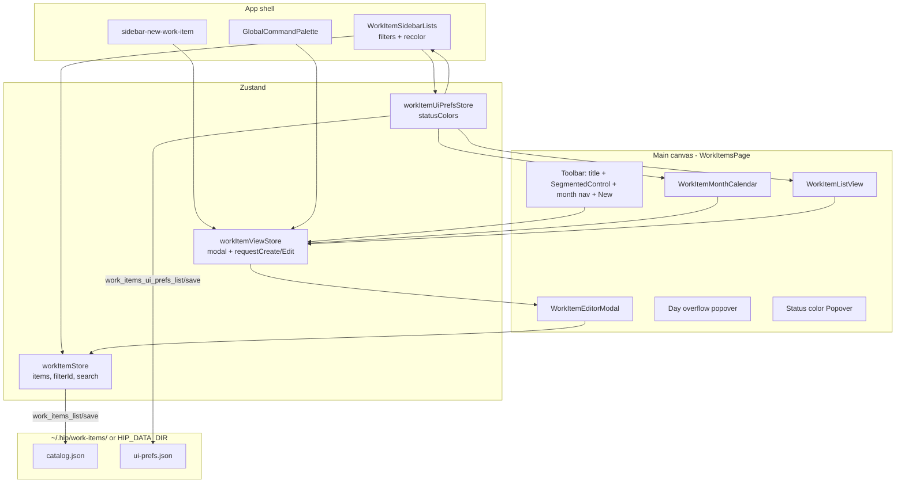
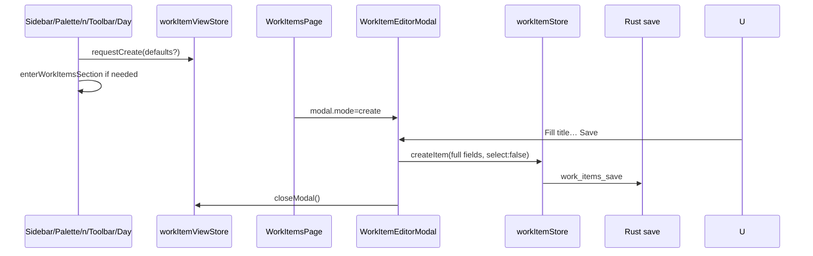
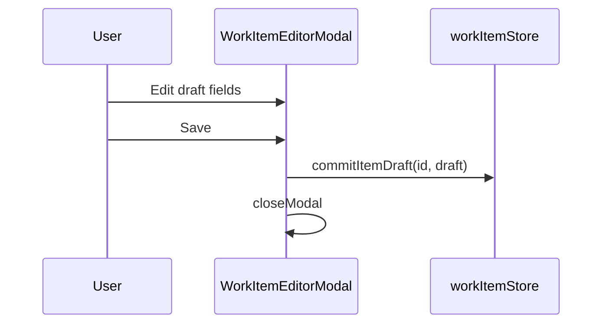
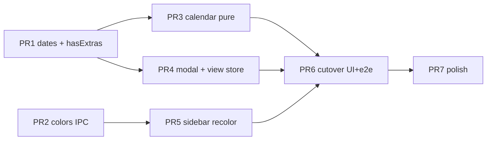

# Work-item tracking redesign — calendar-first + list mode + modal CRUD

| Field | Value |
|-------|-------|
| **Title** | Work-item tracking redesign (calendar-first) |
| **Author** | TBD |
| **Date** | 2026-07-25 |
| **Status** | Draft (R2.1 — residual nits addressed) |
| **Audience** | hip product / frontend / Tauri / local-storage maintainers |
| **Related** | `tmp/work-items-calendar-design.html` (approved visual/IA); `tmp/work-item-tracking-spec.md` (v1 foundation, largely shipped); `src/components/work-items/*`; `src/domain/work-items/*`; `src/store/workItemStore.ts`; `src/ipc/workItems.ts`; `src-tauri/src/work_items.rs`; `src-tauri/src/paths.rs`; `src-tauri/src/lib.rs` |
| **Code names** | Product: 事项追踪; engineering: `WorkItem` / `wi_*` / `WORK_ITEM_TRACKING` |
| **Flag** | `WORK_ITEM_TRACKING` remains `true`. **No secondary cutover flag** — calendar UI ships only in a single cutover PR that includes e2e (see D19, PR Plan). Rollback = git revert of that PR. |

---

## Overview

Work Item Tracking is already a first-class surface (`activeView: 'tasks'`, catalog at `~/.hip/work-items/catalog.json`, smart-filter sidebar, soft-delete trash). The current UI is a **master-detail** list + detail pane (`WorkItemsPage` → `WorkItemListPane` + `WorkItemDetailPane`), with optional schedule dates (`startOn` / `endOn` nullable) and no calendar.

This redesign reorients the product around a **month calendar default**, a **list mode** toggle, and **modal create / view-edit** (no side detail pane). Every item gets required schedule dates (missing dates default to **today** local `YYYY-MM-DD`). Color is bound to **status** (and archived), user-recolorable from the sidebar. User-defined lists remain removed from IA (system inbox kept for disk compatibility only).

The approved interaction direction is the interactive mockup at `tmp/work-items-calendar-design.html`. This document maps that mockup onto concrete domain, store, UI, IPC, and Rust changes, with a phased PR plan. **Domain/prefs land first without layout change; user-visible cutover is one intentional PR that includes e2e.**

---

## Background & Motivation

### Current state (shipped)

| Layer | Location | Behavior today |
|-------|----------|----------------|
| Flag | `src/components/work-items/feature.ts` | `WORK_ITEM_TRACKING = true` |
| Page | `WorkItemsPage.tsx` | Master-detail; loads catalog on mount; j/k selection; `n` creates + focuses title |
| List | `WorkItemListPane.tsx` / `WorkItemRow.tsx` | Search + filter; row select → detail |
| Detail | `WorkItemDetailPane.tsx` | Live `updateItem` on field change; tags; notes debounce; archive → `setFilter('archived')`; delete → soft-delete + `openTrashFromChrome()` |
| Sidebar | `WorkItemSidebarLists.tsx` | Smart filters only: 全部 / 待处理 / 进行中 / 已完成 / 已归档; **no counts** today |
| Create entry points | `AppSidebar` `sidebar-new-work-item`; command palette `newWorkItem`; page `n`; list empty CTA | All call `createItem()` immediately (append + select + save) |
| Store | `workItemStore.ts` | Default `filterId: 'todo'`; `selectedId`; `hasExtras` treats any non-null date as extras; list CRUD for disk compat |
| Domain | `types.ts`, `normalize.ts`, `filter.ts`, `sort.ts` | Nullable `startOn`/`endOn`; legacy `dueOn` → `endOn`; `sortWorkItems` via `compareWorkItems` |
| IPC / Rust | `workItems.ts`, `work_items.rs`, `paths.rs`, `lib.rs` | list/save; soft-delete trash; validate optional dates; path under `HIP_DATA_DIR`/`~/.hip` |
| Catalog writers | Only UI via `work_items_save` / soft-delete (no sidecar CLI writer of catalog) | Grep-confirmed: commands registered in `lib.rs` only for this surface |
| i18n | `workItems.*` in zh-CN / en / ja / ko / zh-TW | Status, filters, fields, delete confirm |
| E2E | `e2e/helpers/work-items.ts`, `e2e/specs/work-items-*.spec.ts` | Detail-pane testids; `createWorkItemFromSidebar` waits for title input after shell create; filter reset to `todo`; archive waits for filter chip; delete expects recycle bin |

### Pain points

1. **Schedule is second-class** — dates are optional meta on a list/detail form; multi-day work is hard to see at a glance.
2. **Default filter is “待处理”** — users enter a narrow slice instead of a full month overview (locked product decision: open on **全部** + month calendar).
3. **Master-detail density** — detail pane competes with list for width; calendar needs full main canvas.
4. **Color has no model** — sidebar uses a generic accent rail; mockup uses status color dots + multi-day bars.
5. **Unscheduled items** — product no longer wants a null-date bucket; every item must sit on the calendar.

### What already aligns

- Smart filters only (lists UI removed) — matches product decision #3.
- `startOn` / `endOn` date-only range + legacy `dueOn` migration — decision #7.
- Soft-delete recycle bin, no cancel-item primary UI in sidebar (cancel remains domain status; not a smart filter).
- Existing `Modal` (`src/components/ui/Modal.tsx`) + `SegmentedControl` + `Popover` — reuse for dialogs, view switch, recolor.

---

## Goals & Non-Goals

### Goals

1. Entering 事项追踪 opens **全部** filter on a **month calendar** (default) — default filter change lands **only at cutover** (D1, D20).
2. Toolbar **月历 | 列表** segmented switch; month nav only in calendar mode.
3. **Modal** create and view/edit (reuse `Modal` / Radix Dialog); no `window.prompt` / `window.confirm`.
4. **Dates required**: every item has valid `startOn`/`endOn`; missing → today; create defaults both to today (or day cell date when creating from a calendar day).
5. **Status colors**: system defaults; user recolor via sidebar hover control; 「全部」 shows stacked multi-status colors (no recolor control).
6. Calendar: multi-day span bars, overflow `+N more`, v1 **without** drag-resize.
7. List mode: same filters + search; status color dots; sort via existing **`sortWorkItems` / `compareWorkItems`** (primary key `startOn` once dates always set); click row → same modal.
8. All create entry points (sidebar, palette, `n`, empty CTA, day-add, toolbar) open the create modal via one shared API (D16).
9. Cutover PR ships green work-items e2e on main (D19).

### Non-Goals (explicit)

| Non-goal | Notes |
|----------|-------|
| Drag-to-reschedule / resize bars | v1.1+ |
| Week / day / agenda views | Optional later |
| System calendar sync (CalDAV / EventKit / Google) | Out of scope |
| Per-item color override | Color = status (or archived), not list/item |
| Restoring user lists in IA | Catalog may keep inbox + orphan user lists on disk; no UI |
| Time-of-day | Date-only `YYYY-MM-DD` only |
| Restoring cancelled as a smart filter | Domain status remains; no sidebar filter (unchanged) |
| Real-time multi-user / cloud sync | Local-first catalog only |
| AI / agent create work items | Still out of work-items scope |
| **Calendar search (v1)** | Search applies **only in list mode**. Calendar always uses `filterItems(..., search='')`. Query string is **sticky** when switching view modes (cleared only by user). See D21. |
| **Sidebar item counts (v1)** | Mockup shows counts; product v1 **omits counts** to avoid predicate drift and extra layout work. Color dots + recolor only. See D22. |
| **Calendar grid full keyboard day navigation (v1)** | Tab/click primary; optional j/k only in list mode. Optional **PR7 polish** only if cheap. See keyboard matrix. |
| **Monday-first week (v1)** | Sunday-first locked to match mockup (D17). Locale week-start is a follow-up. |

---

## Key Decisions

| # | Decision | Rationale |
|---|----------|-----------|
| D1 | **Default view = calendar + filter `all`** | Locked product IA. **Store default `filterId: 'all'` and e2e reset change only in cutover PR** (D20) — not in PR1. |
| D2 | **Modal CRUD replaces master-detail** | Full width for calendar/list; matches mockup; reuses `Modal.tsx`. |
| D3 | **Create-on-save for new items (after cutover)** | Avoid empty-shell items. Pre-cutover paths still use immediate `createItem`; after cutover, modal Save is the only UI create. |
| D4 | **Edit modal: form-local draft, single commit on Save** | One `commitItemDraft` / batched `updateItem` + at most one `save()`. Cancel discards. Archive/delete are separate explicit actions (D18). |
| D5 | **Dates always present after frontend normalize** | Fill missing on load/create/save with local today. Rust does **not** invent today. Interim TS may keep `string \| null`; **non-null types land in polish PR** (D23). |
| D5b | **`hasExtras` ignores schedule-only defaults (PR1 mandatory)** | Dates alone must not prevent empty-shell discard while master-detail still creates shells. See § Empty-shell discard policy. |
| D6 | **Status colors in `~/.hip/work-items/ui-prefs.json`** | Not catalog, not `hip.toml`. Path via `paths.rs` + `HIP_DATA_DIR`. |
| D7 | **Archived color from `archivedAt`** | Bars/rows use archived color when `archivedAt != null`, else status color. Never `status === 'archived'`. |
| D8 | **`cancelled` fixed distinct color, no recolor** | `CANCELLED_STATUS_COLOR = '#a78bfa'` (muted violet) — **not** the same hex as archived `#94a3b8`. Not in recolor map or legend as user-editable. |
| D9 | **`selectedId` demoted after cutover** | Page uses modal session, not master-detail selection. |
| D10 | **Reuse `SegmentedControl` for 月历 \| 列表** | Existing chrome. |
| D11 | **Calendar pure domain under `src/domain/work-items/calendar.ts`** | Unit-tested without React. |
| D12 | **v1 overflow: `+N more` → day popover** | Click item → edit modal. |
| D13 | **No drag in v1** | Reschedule via modal dates only. |
| D14 | **Keep list CRUD store methods** | UI already list-free; no cleanup required for redesign. |
| D15 | **Modal status = primary statuses + Archive action** | Do not add `'archived'` to `WorkItemStatus`. Unit test: `colorKeyForItem` never keys off `status === 'archived'`. |
| D16 | **Shared create-modal bus: `workItemViewStore`** | `requestCreate(defaults?)` / `requestEdit(itemId)` / `closeModal()`. All entry points use it (AppSidebar, palette, `n`, empty CTA, day-add, toolbar). Modal mounts on `WorkItemsPage` (or tasks-view host) and reads this store. **`leaveWorkItems` (and any path leaving `activeView: 'tasks'`) must `closeModal()`** so form-local drafts do not resurrect on re-entry. |
| D17 | **Week starts Sunday (v1)** | Match mockup. Mon-first is follow-up, not open product block. |
| D18 | **Archive / delete modal side effects** | See § Archive & delete behavior (locked). |
| D19 | **Cutover = UI rewrite + e2e in one PR** | Never merge calendar page without green work-items e2e. No intermediate hybrid on main for dogfood without e2e. |
| D20 | **`filterId` default `'all'` only at cutover** | PR1 does not change store default. Avoid mid-migration surprise for list/detail users. |
| D21 | **Search is list-only; query sticky across view switches** | Calendar ignores `search`. Switching modes does not clear search. |
| D22 | **No sidebar counts in v1** | Color dots + recolor only. If added later, `countFor` **must** use `matchesFilter` (never mockup’s status-only archived). |
| D23 | **Non-null `startOn`/`endOn` types in polish PR** | After cutover stable + frontend always writes both; same PR as Rust hard-require optional. |
| D24 | **Do not persist `viewMode`** | Each entry defaults to calendar. List mode is session-ephemeral unless we add later. |
| D25 | **Tags remain in editor modal** | Already productized in detail pane; mockup omit is incomplete. Links optional collapsed section if height is tight. |
| D26 | **List row complete checkbox kept** | stopPropagation so row open-modal still works. |
| D27 | **No secondary feature flag for calendar** | Conditional on D19 (e2e in cutover). |

---

## Proposed Design

### High-level architecture



### Component map (mockup → code)

| Mockup region | Component | Notes |
|---------------|-----------|-------|
| Sidebar filters + recolor | `WorkItemSidebarLists.tsx` | Status color dots; recolor → `Popover`; hide recolor on `all`. **No counts v1** (D22). |
| Toolbar title / subtitle | `WorkItemsPage` header | Title = active filter i18n; subtitle depends on viewMode |
| 月历 \| 列表 switch | `SegmentedControl` | `viewMode: 'calendar' \| 'list'`; testid `work-item-view-mode` |
| Month nav ‹ 今日 › | `WorkItemMonthNav` | Hidden when `viewMode === 'list'` |
| + 新建事项 | Primary button | `workItemViewStore.requestCreate({ startOn, endOn: today })` |
| Calendar grid | `WorkItemMonthCalendar` | Month matrix; bars; day-add; +N more |
| List panel | `WorkItemListView` (evolve list pane/row) | No selection chrome; row click → `requestEdit`; status dot; checkbox |
| Legend | Under toolbar | todo / in_progress / done / archived only (not cancelled) |
| Item modal | `WorkItemEditorModal` | Replaces detail pane as primary editor |
| Color popover | `WorkItemStatusColorPopover` | Mockup `PALETTE` |
| Detail empty state | **Remove** at cutover | No master-detail empty pane |

**Deprecated after cutover:**

- Master-detail layout; always-visible `WorkItemDetailPane`
- `NARROW_MQ` list/detail mobile split (`mobileShowDetail`)

### Empty-shell discard policy (PR1 — critical)

Today:

```ts
// workItemStore.ts hasExtras
notes.trim() !== '' || item.startOn != null || item.endOn != null || tags | links...
```

After PR1, `defaultItem` always sets dates → **every shell has “extras”** → finalize promotes to `Untitled` instead of discard.

**Required PR1 change:**

```ts
/**
 * True when the item has user-meaningful content beyond an empty title
 * and a pure default schedule.
 *
 * Schedule alone does NOT count as extras when both dates equal `todayYmd`
 * (the automatic create default). Any other range (including single non-today
 * day or multi-day) counts as extras so undated-migration fills still keep
 * notes-less titled work — wait: empty title + non-default range → Untitled.
 */
function hasExtras(item: WorkItem, notes: string, todayYmd: string): boolean {
  if (notes.trim() !== '') return true
  if (item.tags.length > 0) return true
  if (item.links.sessionId || item.links.knowledge || item.links.url) return true
  const start = item.startOn
  const end = item.endOn
  // Non-default schedule counts as content (user picked a day / range).
  if (start != null || end != null) {
    const ensured = ensureScheduleDates({ startOn: start, endOn: end }, todayYmd)
    if (ensured.startOn !== todayYmd || ensured.endOn !== todayYmd) return true
  }
  return false
}
```

**Implications:**

| Phase | Create path | Discard behavior |
|-------|-------------|------------------|
| PR1–pre-cutover | Immediate `createItem()` + detail | Empty title + only today–today + no notes/tags/links → **discard** on finalize (tests updated) |
| Post-cutover | Modal create-on-save | Empty shells not inserted; discard mainly for legacy paths / tests |

**PR1 must update** `workItemStore.test.ts` (“discards empty title with no extras” still passes with default dates; “Untitled when extras” covers non-default range or notes).

### `createItem` contract

#### Pre-cutover (PR1 only changes dates + hasExtras)

- Still: append + set `selectedId` + save (sidebar/palette/`n` unchanged).
- `defaultItem`: both dates = `localTodayYmd()` unless partial overrides.
- Status still defaults `todo` unless partial.

#### Post-cutover (cutover PR)

```ts
/**
 * Persist a new work item. UI modal is the only product create path and
 * always passes a non-empty title + explicit schedule.
 *
 * @param partial.title required for UI saves (trimmed non-empty). Tests may
 *   still call with title for fixtures.
 * @param options.select default false after cutover (no master-detail).
 * @param options.skipSave rare; default false — one enqueueSave.
 */
createItem(
  partial: Partial<WorkItem> & { title?: string },
  options?: { select?: boolean },
): Promise<string>
```

Rules:

1. **Dates:** always `ensureScheduleDates` on merged fields with `localTodayYmd()`.
2. **Status default for modal create:** if `partial.status` omitted, derive from active smart filter: `todo` \| `in_progress` \| `done` when `filterId` is that value; else `todo`. Never default to archived via status; archive is separate.
3. **listId:** still `listIdFromFilter` → inbox when filter is smart (unchanged). Partial `listId` honored if list exists.
4. **selectedId:** default **do not select** after cutover (`select: false`). Unit tests that need selection pass `select: true` or set explicitly.
5. **Empty title:** modal blocks Save. Programmatic `createItem({})` with empty title still allowed for pre-cutover tests only until cutover deletes those tests; post-cutover store may assert non-empty title or keep discard-on-finalize for any residual select path.
6. **Single save** after one append (no double save).

Modal Save (create):

```ts
await createItem({
  title,
  startOn,
  endOn,
  status, // from form (filter-defaulted at open)
  priority,
  notes,
  tags,
}, { select: false })
```

### Shared modal bus (`workItemViewStore`)

```ts
// src/store/workItemViewStore.ts
export type CreateDefaults = {
  startOn: string
  endOn: string
  status?: WorkItemStatus
}

export type WorkItemModalSession =
  | { mode: 'closed' }
  | { mode: 'create'; defaults: CreateDefaults }
  | { mode: 'edit'; itemId: string }

type WorkItemViewStore = {
  modal: WorkItemModalSession
  viewMode: 'calendar' | 'list' // session only; not persisted (D24)
  calendarCursor: { year: number; monthIndex: number }
  /** List-mode keyboard highlight only; not master-detail selection. */
  highlightId: string | null

  requestCreate: (defaults?: Partial<CreateDefaults>) => void
  requestEdit: (itemId: string) => void
  closeModal: () => void
  setViewMode: (m: 'calendar' | 'list') => void
  setCalendarCursor: (c: { year: number; monthIndex: number }) => void
  setHighlightId: (id: string | null) => void
}

// requestCreate fills:
//   startOn/endOn = defaults ?? localTodayYmd()
//   status = defaults.status ?? statusFromFilter(workItemStore.filterId)
```

**Leave path (required — D16):**

Today `leaveWorkItems()` in `src/components/layout/sidebarActions.ts` only `flushSave()`s the catalog. After cutover it must also clear the modal session:

```ts
// leaveWorkItems (cutover)
export async function leaveWorkItems(): Promise<void> {
  if (useUiStore.getState().activeView !== 'tasks') return
  useWorkItemViewStore.getState().closeModal() // discard form-local draft; do not resurrect on re-entry
  useWorkItemViewStore.getState().setHighlightId(null)
  try {
    await useWorkItemStore.getState().flushSave()
  } catch { /* … */ }
}
```

Any other path that leaves `activeView: 'tasks'` already goes through `leaveWorkItems` / `leaveActiveSurfaceIfNeeded` (toolbar back, nav history, section switches) — keep that invariant. **Do not** close the modal inside `enterWorkItemsSection` when the caller just called `requestCreate` (sidebar/palette new-item): order is `enterWorkItemsSection()` then `requestCreate()`, so leave-close only runs when actually leaving.

If page is not mounted yet, `requestCreate` still sets modal session; `WorkItemsPage` on mount opens modal if `mode !== 'closed'`.

**Entry points (all after cutover):**

| Entry | File | Action |
|-------|------|--------|
| Toolbar 新建 | `WorkItemsPage` | `requestCreate()` |
| Day cell + / dblclick | `WorkItemMonthCalendar` | `requestCreate({ startOn: ymd, endOn: ymd })` |
| Keyboard `n` | `WorkItemsPage` | `requestCreate()` (not `createItem`) |
| Empty list CTA | `WorkItemListView` | `requestCreate()` |
| Sidebar new | `AppSidebar.tsx` | `enterWorkItemsSection()` then `requestCreate()` |
| Command palette | `GlobalCommandPalette.tsx` | same as sidebar |

### Store state changes (`workItemStore`)

| Field / API | Today | After PR1 | After cutover |
|-------------|-------|-----------|---------------|
| `filterId` default | `'todo'` | **unchanged `'todo'`** | **`'all'`** (D20) |
| `selectedId` | Selection | Unchanged | Unused by page; methods may remain |
| `search` | List+detail | Unchanged | List mode only (D21) |
| `createItem` | Shell + select | Dates default today; still select | Contract above; no select by default |
| `defaultItem` | null dates | today/today | same |
| `hasExtras` | any date = extras | **schedule-only today ignored** (D5b) | still correct |
| `commitItemDraft` | n/a | n/a | **new** preferred API (see below) |
| List CRUD | Present | Unchanged | Unchanged |

#### Atomic edit Save (D4 / Issue 13)

```ts
/**
 * Apply a full form draft in one set() + one save().
 * Status goes through applyStatus for completedAt invariants.
 * Does not handle archiveAt or soft-delete.
 * Callers (Save / Archive) must reject empty title before calling —
 * prefer UI block + focus; do not auto-promote to UNTITLED on archive.
 */
commitItemDraft(
  id: string,
  draft: {
    title: string
    startOn: string
    endOn: string
    status: WorkItemStatus
    priority: WorkItemPriority
    notes: string
    tags: string[]
  },
): Promise<void>
```

Implementation sketch: read item → `applyStatus` if status changed → merge fields with `ensureScheduleDates` → single `set` → `save()`. Avoids multiple `updateItem` + `setStatus` disk writes and flicker.

**Archive empty-title rule (D18):** Modal Archive button runs the same title check as Save (`title.trim() !== ''`). If empty → focus title, no `commitItemDraft`, no `archive()`.

### `workItemUiPrefsStore` (new)

```ts
export type WorkItemStatusColorKey = 'todo' | 'in_progress' | 'done' | 'archived'

export type WorkItemUiPrefsV1 = {
  version: 1
  statusColors: Record<WorkItemStatusColorKey, string> // #RRGGBB
}

export const DEFAULT_STATUS_COLORS: WorkItemUiPrefsV1['statusColors'] = {
  todo: '#3b82f6',
  in_progress: '#f59e0b',
  done: '#22c55e',
  archived: '#94a3b8',
}

/** Fixed; not user-editable; distinct from archived. */
export const CANCELLED_STATUS_COLOR = '#a78bfa'
```

IPC + Rust path: see § API / Interface Changes and PR2 file list.

### Archive & delete behavior (locked — D18)

Applies to **editor modal** after cutover (and e2e expectations).

| Action | When applied | Side effects |
|--------|--------------|--------------|
| **Save** | Explicit Save button | `commitItemDraft` only; closes optional (prefer close after successful create; edit may close) |
| **Archive** | Immediate on button (edit mode only) | **Empty title:** if `title.trim() === ''`, **block** (same as Save) — focus title, do **not** archive or write. Otherwise flush draft via `commitItemDraft` then `archive(id)`. **Do not** `setFilter('archived')`. Prefer **close modal + stay on current filter**. Unarchive: apply `unarchive` (flush first only if form dirty with non-empty title); close optional. |
| **Delete** | Confirm nested `Modal` | Soft-delete via `deleteItem`; **close editor**; **stay on work-items page** (do **not** call `openTrashFromChrome`). Optional toast later; not required v1. |
| **Cancel** | Ghost button / Escape | Discard form draft; close; no catalog write |

**E2E impact:** `archiveSelected` must not wait for archived filter chip; `deleteSelected` must not expect `recycle-bin-page`. Update helpers in cutover PR.

**Rationale for not jumping filter on archive:** calendar-first users archiving from a day bar should not lose month context. Archived items disappear from `all` filter (correct) after close.

### Interaction sequences

#### Create (any entry → shared bus)



#### Edit Save



#### Create from day cell

`requestCreate({ startOn: cellYmd, endOn: cellYmd })`. Double-click day: same (ship with cutover; low cost).

### Keyboard matrix (v1)

| Key | Context | Behavior |
|-----|---------|----------|
| `n` / `N` | Page focused, not in editable, modal closed | `requestCreate()` → focus title in modal |
| `/` | List mode, modal closed | Focus list search input |
| `/` | Calendar mode | **No-op** (or same focus search but search unused until list — prefer no-op) |
| `j` / `k` / arrows | List mode, modal closed | Move `workItemViewStore.highlightId` among visible rows; does **not** open modal |
| `Enter` | List mode + `highlightId` set | `requestEdit(highlightId)` |
| `j` / `k` | Calendar mode | **No-op v1** (grid keyboard deferred) |
| `Escape` | Modal open | Close modal (Radix); if delete confirm nested, close that first |
| `Escape` | Modal closed | No deselect (no selection model) |
| Space / `c` | List highlight (optional) | Toggle complete — **nice-to-have**; not required if checkbox click suffices |

**Focus restore:** on modal close, return focus to the control that opened it (bar / row / New button) via `requestAnimationFrame` + stored `HTMLElement` ref or `data-return-focus` id. Minimum: focus page container.

### Narrow / mobile layout

After cutover there is **no** list|detail mobile stack:

- Calendar and list are always **full width** of the main column (sidebar remains app chrome).
- Day cell `min-height` may drop from ~108px to ~72px under `max-width: 719px`; `MAX_BARS` may drop from 3 → 2 on narrow.
- Month nav wraps under the title row if needed; SegmentedControl stays visible.
- Editor uses existing `Modal` (`max-w-lg`, `max-h-[85vh]`) — not a separate mobile route; full-screen modal not required v1.
- Horizontal overflow: calendar grid `min-width: 0` with equal columns; accept tighter day labels (day number only).

### Calendar rendering algorithm (v1)

Port mockup logic to pure TS (`src/domain/work-items/calendar.ts`) + presentational React.

#### Month matrix

```ts
export type MonthCell = {
  y: number
  m: number // 0-based
  d: number
  out: boolean
  ymd: string
}

/** Sunday-first grid (D17). */
export function buildMonthMatrix(year: number, monthIndex: number): MonthCell[]
```

Rules (mockup `monthMatrix`):

1. Pad leading days so first column is Sunday (`Date.getDay()`).
2. Fill in-month days.
3. Pad trailing until `length % 7 === 0` and at least 42 cells when needed.
4. `ymd` via local calendar formatting (`localTodayYmd` style).

Day headers: i18n short weekday names (Sunday-first order).

#### Multi-day bars

```ts
export type BarKind = 'single' | 'start' | 'mid' | 'end'

export type DayBar = {
  itemId: string
  kind: BarKind
  title: string
  colorKey: WorkItemStatusColorKey | 'cancelled'
  done: boolean
  archived: boolean
}

export function placeBarsForMonth(
  items: readonly WorkItem[],
  monthYear: number,
  monthIndex: number,
  todayYmd: string,
): Map<string /* ymd */, DayBar[]>
```

Algorithm:

1. Items already filtered by caller with `filterItems(items, filterId, todayYmd, /* search always '' for calendar */)`.
2. `ensureScheduleDates` → span days; emit start/mid/end/single.
3. **No lane packing.** Mid/end: non-clickable bridges (`pointer-events: none`); only start/single clickable with title.
4. Per day: first `MAX_BARS` (3 desktop / 2 narrow); else `+N more`.

**Sort within a day:** `compareWorkItems` (same as list).

**Out-of-month pad cells:** paint spill bars; day-add allowed with that cell’s ymd.

#### Overflow `+N more`

Popover lists all items for that date → click → `requestEdit` + close popover.

### List view parity

| Concern | Behavior |
|---------|----------|
| Filter | Same `filterId` smart filters |
| Search | `matchesSearch` on title/notes/tags; list panel only |
| Sort | **`sortWorkItems` / `compareWorkItems`** (startOn ?? endOn, then endOn, priority, updatedAt, id) |
| Row chrome | Color rail + status-dot; title; status pill; range; optional priority |
| Click | `requestEdit` |
| Empty | EmptyState + CTA `requestCreate` |
| Complete toggle | **Keep** checkbox; `stopPropagation` (D26) |

### Sidebar recolor

- Keys: `todo`, `in_progress`, `done`, `archived` only.
- `all`: multi-color / conic dot; **no** recolor control.
- CSS vars: `--wi-c-todo`, etc. on page root.
- Dark/light: `color-mix(in srgb, var(--bar-color) 22%, var(--surface))`; inset 3px rail.
- **A11y:** status text pill + title + strike for done; color not sole signal.
- **No counts** (D22).

### Modal fields and actions

| Field | Create default | Edit | Validation |
|-------|----------------|------|------------|
| Title | empty | item.title | Required on Save; max `WORK_ITEM_TITLE_MAX` |
| startOn | today or day cell | ensured | Required YMD |
| endOn | same as start | ensured | Required; swap if inverted on commit |
| Status | from filter (todo/in_progress/done) else todo | item.status | Primary statuses; include cancelled option if item already cancelled |
| Priority | none | item.priority | Existing enum |
| Notes | empty | item.notes | Form-local; UTF-8 clamp on commit |
| Tags | empty | item.tags | **In modal** (D25) |
| Archive | hidden | Immediate per D18 | After draft flush |
| Delete | hidden | Soft-delete per D18 | Confirm `Modal` |

**Footer:** Delete (edit) | spacer | Cancel | Save.

### Date enforcement

#### Frontend

```ts
export function ensureScheduleDates(
  item: Pick<WorkItem, 'startOn' | 'endOn'>,
  today: string,
): { startOn: string; endOn: string } {
  let start = item.startOn && isValidDueOn(item.startOn) ? item.startOn : null
  let end = item.endOn && isValidDueOn(item.endOn) ? item.endOn : null
  if (!start && !end) return { startOn: today, endOn: today }
  if (!start) start = end!
  if (!end) end = start!
  if (start > end) return { startOn: end, endOn: start }
  return { startOn: start, endOn: end }
}
```

1. **On catalog load:** normalize fills missing via `localTodayYmd()`.
2. **`defaultItem` / create:** both today unless partial.
3. **`updateItem` / `commitItemDraft`:** never persist null dates.
4. **Types:** `string | null` until polish PR (D23) → `string`.

#### Rust

1. Load: accept optional dates; migrate `dueOn` → `endOn`; swap inverted; **do not invent today**.
2. Save validation staged:
   - After PR1: frontend always writes both.
   - Polish PR: hard-require both dates in `validate_catalog` **only if** no other catalog writers (confirmed: only Tauri UI commands write `catalog.json`; no packages/sidecar writer). Document: external hand-edits with null dates must open once in app after PR1 before polish hard-require, or keep load accepting null forever (yes — load always soft).
3. Invalid YMD still rejected on save.

### Color resolution helper

```ts
export function colorKeyForItem(item: WorkItem): WorkItemStatusColorKey | 'cancelled' {
  if (item.archivedAt != null) return 'archived'
  if (item.status === 'cancelled') return 'cancelled'
  if (item.status === 'todo' || item.status === 'in_progress' || item.status === 'done') {
    return item.status
  }
  return 'todo'
}

export function resolveItemColor(
  item: WorkItem,
  colors: WorkItemUiPrefsV1['statusColors'],
): string {
  const key = colorKeyForItem(item)
  if (key === 'cancelled') return CANCELLED_STATUS_COLOR
  return colors[key]
}
```

**Test:** `colorKeyForItem` never returns archived for `status` string tricks; only `archivedAt`.

---

## API / Interface Changes

### IPC (new)

| Command | Payload | Response |
|---------|---------|----------|
| `work_items_ui_prefs_list` | none | `WorkItemUiPrefsV1` (defaults if missing/corrupt) |
| `work_items_ui_prefs_save` | `{ prefs: WorkItemUiPrefsV1 }` | `void` (validate hex + keys) |

Corrupt prefs: **prefer defaults without backup** (chrome-only; lighter than catalog).

### IPC (unchanged)

- `work_items_list` / `work_items_save`
- soft-delete / trash commands

### Domain exports (new)

```ts
// schedule.ts (PR1) — home of date helpers; re-exported from domain index
ensureScheduleDates, /* + any shared YMD helpers if split from filter */
// calendar.ts (PR3) — imports ensureScheduleDates from schedule (does NOT redefine it)
buildMonthMatrix, placeBarsForMonth, daysBetween, addDaysYmd
// statusColors.ts
DEFAULT_STATUS_COLORS, CANCELLED_STATUS_COLOR, PALETTE,
colorKeyForItem, resolveItemColor, normalizeUiPrefs
```

### UI public testids

| testid | Role |
|--------|------|
| `work-items-page` | Root (keep) |
| `work-item-view-mode` | Segmented control |
| `work-item-view-mode-calendar` / `-list` | Segments (SegmentedControl auto suffix) |
| `work-item-month-nav` | Month controls |
| `work-item-month-label` | Label |
| `work-item-month-today` | Jump to today |
| `work-item-calendar` | Grid |
| `work-item-day-{ymd}` | Day cell |
| `work-item-day-add-{ymd}` | + on day |
| `work-item-bar-{id}` | Clickable bar |
| `work-item-day-more-{ymd}` | Overflow |
| `work-item-list-view` | List root |
| `work-item-row-{id}` | Row (keep) |
| `work-item-editor-modal` | Modal root |
| `work-item-title-input` | Keep for e2e |
| `work-item-start-input` / `end-input` | Keep |
| `work-item-status-select` / `priority-select` | Keep |
| `work-item-notes` | Keep |
| `work-item-editor-save` / `cancel` / `delete` | Actions |
| `work-item-archive` / `work-item-unarchive` | Keep semantics |
| `sidebar-work-item-filter-{id}` | Keep |
| `sidebar-work-item-recolor-{id}` | Recolor trigger |

---

## Data Model Changes

### Catalog (`catalog.json`)

No version bump. Tighten date presence via normalize:

```ts
// Target after D23
startOn: string
endOn: string // startOn <= endOn
```

Migration: load → ensure dates → first save rewrites. **Silent today-fill** for previously undated items — release note.

### UI prefs (`ui-prefs.json`)

Path: `{work_items_dir}/ui-prefs.json` via new `work_items_ui_prefs_path` in `paths.rs`.

```json
{
  "version": 1,
  "statusColors": {
    "todo": "#3b82f6",
    "in_progress": "#f59e0b",
    "done": "#22c55e",
    "archived": "#94a3b8"
  }
}
```

Validation: optional keys; invalid hex → default for that key; atomic write via `atomic_write_private` (0o600).

---

## Alternatives Considered

### 1. Keep master-detail; add calendar as third pane

Rejected — width starvation; contradicts locked mockup.

### 2. Persist status colors in `hip.toml`

Rejected — rewrite footguns; not agent config.

### 3. Persist colors in `catalog.json`

Rejected — mixes content with presentation.

### 4. Persist colors in `localStorage` (`hip-ui`)

Rejected as primary — weaker `HIP_DATA_DIR` e2e/backup cohesion. Acceptable emergency fallback only.

### 5. Optimistic create on modal open

Rejected long-term — empty shells + finalize races. Create-on-save after cutover.

### 6. Lane-packed calendar

Deferred — mockup uses simple stack.

### 7. Secondary `WORK_ITEM_CALENDAR_UI` flag

Rejected **if** cutover includes e2e (D19/D27). Would only be justified for multi-PR UI dogfood without e2e — we refuse that path.

### 8. Split e2e PR after UI cutover

Rejected — reds main CI. E2e is part of cutover.

---

## Security & Privacy Considerations

| Topic | Assessment |
|-------|------------|
| Data location | Catalog + prefs under work-items dir / `HIP_DATA_DIR` |
| File mode | `atomic_write_private` 0o600 for prefs + catalog |
| XSS | React text nodes; no HTML from titles/notes |
| Color prefs | Hex only |
| IPC | Validate prefs shape; reject oversized bodies |
| Threat model | Local single-user desktop |

---

## Observability

| Signal | Approach |
|--------|----------|
| Load/save errors | Store `error` banner |
| Prefs load failure | Defaults + Rust `eprintln` |
| Performance | ≪5k items; month paint O(items × span days); cap absurd spans (>366d) as data error if needed |
| Latency | First paint calendar <100ms after in-memory catalog |

---

## Rollout Plan

1. **PRs 1–4** land domain/prefs/modal/helpers **without** replacing `WorkItemsPage` layout (master-detail remains). PR4 may mount modal unused in prod or only behind test harness.
2. **Single cutover PR** (merged former PR6+PR7+PR8): list restyle + calendar + page rewrite + view store wiring + AppSidebar/palette + **e2e green** + `filterId` default `all`.
3. **Polish PR:** i18n leftovers, a11y, non-null types, optional Rust hard-require dates.
4. **Rollback:** revert cutover PR. Date-filling from PR1 is backward compatible with old UI.
5. **No mid-cutover hybrid** on main (list-modal + detail pane) for dogfood without e2e.

### Risks

| Risk | Severity | Mitigation |
|------|----------|------------|
| PR1 dates break empty-shell discard | **High** | D5b `hasExtras` + unit tests mandatory in PR1 |
| Cutover without e2e reds main | **High** | D19: e2e inside cutover PR |
| Silent “today” on old undated items | Medium | Release note |
| Mid/end bar non-clickable confusion | Low | +N more / start title |
| Dark theme bar contrast | Medium | color-mix with surface; QA light/dark |
| Form-local crash mid-edit | Medium | Explicit Save; accept |
| External hand-edited null dates after hard-require | Low | Load still soft; document polish timing |

---

## Open Questions

Only residual follow-ups (not coding blockers):

1. **Monday-first week for some locales** — follow-up after v1 Sunday-first (D17).
2. **Persist viewMode** — deferred; D24 says no for v1.
3. **Toast after delete** with “Open recycle bin” link — optional polish; not required for cutover e2e.

All former recommendations (tags, checkbox, delete without trash nav, search sticky, counts out, cancelled color, etc.) are now Key Decisions.

---

## References

- Mockup: `tmp/work-items-calendar-design.html`
- Prior design: `tmp/work-item-tracking-spec.md`
- UI: `src/components/work-items/`
- Domain: `src/domain/work-items/`
- Stores: `src/store/workItemStore.ts` (+ new view/prefs stores)
- Create entry points: `src/components/layout/AppSidebar.tsx`, command palette
- IPC: `src/ipc/workItems.ts`
- Rust: `src-tauri/src/work_items.rs`, `work_items_trash.rs`, `paths.rs`, `lib.rs`, `atomic_write.rs`
- UI primitives: `Modal.tsx`, `SegmentedControl.tsx`, `Popover.tsx`
- E2E: `e2e/helpers/work-items.ts`, `e2e/specs/work-items-*.spec.ts`
- i18n: `src/i18n/{en,zh-CN,zh-TW,ja,ko}.ts` → `workItems.*`

---

## PR Plan

Each pre-cutover PR is independently mergeable without breaking e2e. **Cutover is one intentional PR** that may be large but includes e2e so main stays green.

### PR1 — Required schedule dates + hasExtras fix

- **Title:** `work-items: require startOn/endOn (default today) + fix hasExtras discard`
- **Files:**
  - `src/domain/work-items/normalize.ts`, `normalize.test.ts`
  - `src/domain/work-items/schedule.ts` — **`ensureScheduleDates` lives here from PR1** (not only in calendar.ts)
  - `src/domain/work-items/index.ts` — re-export schedule helpers
  - `src/store/workItemStore.ts`, `workItemStore.test.ts` (**hasExtras + finalize tests**)
  - Docs on types only; **do not** change `filterId` default
- **Dependencies:** none
- **Description:** Fill missing dates on normalize/load; `defaultItem` → today/today; `updateItem` cannot clear to null; **redefine `hasExtras` so today–today schedule alone is not extras**; unit tests keep discard behavior for empty shells. **No UI layout change. No filter default change.**

### PR2 — Status colors prefs (disk + IPC + store)

- **Title:** `work-items: status color ui-prefs load/save`
- **Files:**
  - `src-tauri/src/paths.rs` — `work_items_ui_prefs_path`; unit test parallel to `work_items_catalog_lives_under_base_not_config`
  - `src-tauri/src/work_items_ui_prefs.rs` (or functions in `work_items.rs`)
  - `src-tauri/src/lib.rs` — `generate_handler!` registration
  - Reuse `atomic_write_private` for save
  - `src/ipc/workItems.ts` — list/save prefs
  - `src/domain/work-items/statusColors.ts` + tests (`colorKeyForItem`, normalize, cancelled ≠ archived hex)
  - `src/store/workItemUiPrefsStore.ts` + tests
- **Dependencies:** none (parallel with PR1)
- **Description:** `ui-prefs.json` next to catalog; missing/corrupt → defaults (no backup required); invalid hex → per-key default.

### PR3 — Calendar pure algorithm

- **Title:** `work-items: month matrix + bar placement helpers`
- **Files:** `src/domain/work-items/calendar.ts`, `calendar.test.ts`, `index.ts` exports
- **Dependencies:** PR1 (`ensureScheduleDates` from `schedule.ts`)
- **Description:** Sunday-first matrix; `placeBarsForMonth`; day arithmetic with noon-local; overflow slice; unit tests with frozen dates. Sort bars with `compareWorkItems`. **Import** `ensureScheduleDates` from `schedule.ts` — do not redefine.

### PR4 — Editor modal + `commitItemDraft` + view store (no page cutover)

- **Title:** `work-items: editor modal, view store, commitItemDraft`
- **Files:**
  - `src/store/workItemViewStore.ts` (+ tests) — includes `highlightId` / `setHighlightId`, modal session
  - `src/store/workItemStore.ts` — `commitItemDraft`; prepare post-cutover `createItem` options but keep select default true until cutover if needed for tests
  - `src/components/work-items/WorkItemEditorModal.tsx` (+ tests) — archive blocks empty title
  - Shared field extraction from `WorkItemDetailPane.tsx`
  - i18n: modal titles, save/cancel
- **Dependencies:** PR1
- **Description:** Form-local draft; create-on-save API ready; archive/delete per D18 (empty title blocks archive like Save). **Do not** rewire AppSidebar/palette/`WorkItemsPage` yet — modal may be unmounted in prod or only used from tests. Detail pane remains primary.

### PR5 — Sidebar status dots + recolor

- **Title:** `work-items: sidebar status colors + recolor popover`
- **Files:** `WorkItemSidebarLists.tsx` + tests; `WorkItemStatusColorPopover.tsx`; i18n aria
- **Dependencies:** PR2
- **Description:** Color dots; conic for 全部; hover recolor; **no counts**. Works with existing list/detail.

### PR6 — Cutover: calendar UI + list modal + shell entry points + e2e

- **Title:** `work-items: calendar-first cutover (UI + e2e)`
- **Files:**
  - New: `WorkItemMonthCalendar.tsx`, `WorkItemMonthNav.tsx`, day overflow popover
  - `WorkItemsPage.tsx` rewrite (layout, keyboard matrix, viewMode)
  - `WorkItemListView` / row restyle (status dots; click → `requestEdit`; checkbox)
  - Wire `WorkItemEditorModal` from view store
  - `AppSidebar.tsx`, `GlobalCommandPalette.tsx` — `requestCreate` not `createItem`
  - `src/components/layout/sidebarActions.ts` — `leaveWorkItems` calls `closeModal()` + clear `highlightId` before `flushSave`
  - `workItemStore` default `filterId: 'all'`; `createItem` post-cutover contract (`select` default false)
  - Remove master-detail / detail pane from page; narrow split gone
  - `WorkItemsPage.test.tsx` rewrite; `sidebarActions` leave tests assert modal closed
  - **E2E:** `e2e/helpers/work-items.ts` + all `e2e/specs/work-items-*.spec.ts`
    - create: open modal → set fields → save
    - filter reset default **`all`**
    - archive: no filter chip jump
    - delete: no forced recycle-bin navigation
    - optional: day-add create; view mode switch smoke
- **Dependencies:** PR1–PR5
- **Description:** **Single intentional cutover.** User-visible calendar-first UX + green e2e. May be large; do not split e2e into a follow-up PR on main. No secondary flag.

### PR7 — Polish (i18n, a11y, non-null types, Rust hard-require)

- **Title:** `work-items: calendar redesign polish`
- **Files:** locale files; focus restore; contrast; `types.ts` non-null dates; normalize return types; store tests; Rust `validate_catalog` require start+end; delete unused `WorkItemDetailPane` if fully dead
- **Dependencies:** PR6 (cutover stable)
- **Description:** D23 types; load still accepts null from disk and fills; save hard-requires both dates (UI-only writer). Optional calendar focus polish.



---

## Appendix A — Mockup vs product status model

| Mockup | Product |
|--------|---------|
| `status: 'archived'` as enum | `archivedAt: number \| null` + workflow status |
| Filter archived by status | `matchesFilter(..., 'archived')` uses `archivedAt` |
| Status select includes archived | Modal: workflow statuses + Archive button |
| Counts by status | **Not in v1**; if added, use `matchesFilter` only |

Implementers **must not** add `'archived'` to `WorkItemStatus`.

## Appendix B — E2E / filter default (cutover only)

- `openWorkItemsFromMenu` / `enterWorkItems`: reset filter to **`all`** (product default), not `todo`.
- Create helpers: wait for `work-item-editor-modal` + title input; click `work-item-editor-save` after fields.
- Remove assumptions: always-mounted detail pane, `data-item-id` on detail, archive filter auto-switch, delete → recycle bin page.

## Appendix C — Suggested CSS bar rules (from mockup)

- Clickable bar: left inset 3px status color; background `color-mix(..., 22%, surface)`
- `done`: line-through + reduced opacity
- `archived`: further reduced opacity
- `span-mid` / `span-end`: no text, no pointer events
- Day min-height ~108px desktop / ~72px narrow; `MAX_BARS = 3` / `2`

## Appendix D — Revision history

| Rev | Date | Notes |
|-----|------|-------|
| Draft | 2026-07-25 | Initial design |
| R2 | 2026-07-25 | Review: hasExtras, cutover+e2e merge, create bus, createItem contract, archive/delete locks, filter default ownership, keyboard, mobile, search/counts non-goals, cancelled color, PR file lists, promote open Q → decisions |
| R2.1 | 2026-07-25 | Residual nits: PR9→PR7 wording; leaveWorkItems closes modal; highlightId on view store; ensureScheduleDates in schedule.ts; archive blocks empty title |
