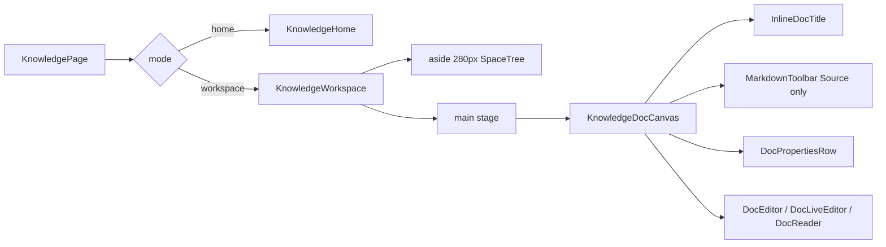
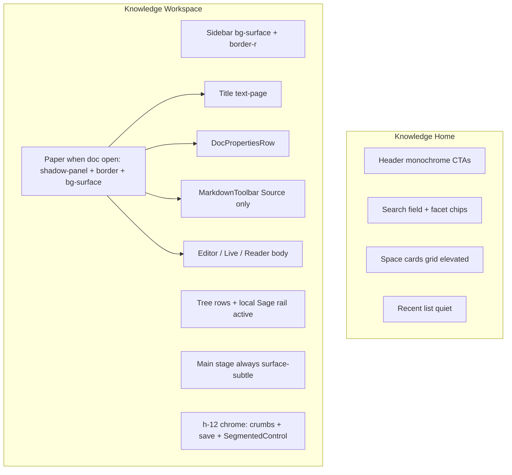
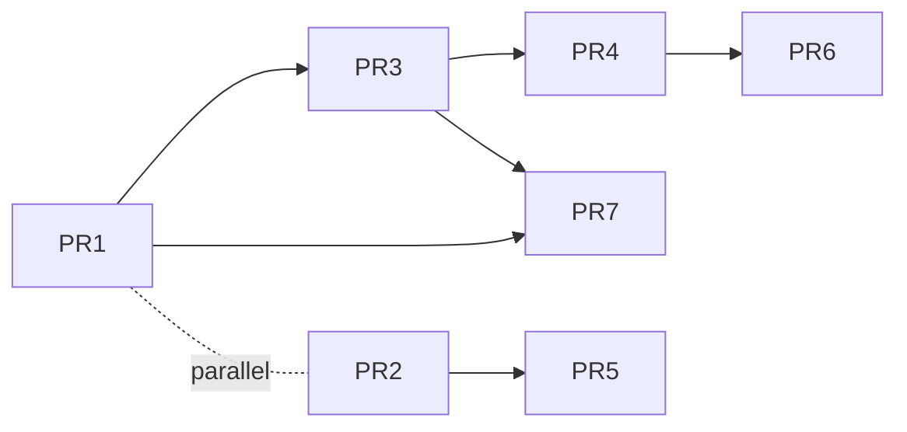

# Knowledge Base Visual Design Upgrade (Frontend Only)

| Field | Value |
|-------|-------|
| **Author** | Knowledge visual upgrade |
| **Date** | 2026-07-18 |
| **Status** | Draft (rev 2 — review issues addressed) |
| **Scope** | Frontend visual: `src/components/knowledge/*` + optional pure helper under `src/domain/knowledge/` for search highlight; tokens/Tailwind only if required; **no** store schema / IPC / sidecar / Rust |
| **Related** | `docs/visual-design-upgrade.md`, `src/styles/tokens.css`, `tailwind.config.js`, `src/components/ui/*`, `e2e/specs/knowledge-*.spec.ts` |
| **Product principle** | Chrome quieter; content clearer; personality at key moments — do not turn KB into a file-manager shell |

---

## Overview

hip’s Knowledge Base is a local-first Markdown surface (`src/components/knowledge/`). Functionally it is solid — spaces, tree, Source/Live/Preview, search, templates, versions — but visually it still reads as **“file manager + editor shell”**, not a knowledge product. The document canvas is only a max-width column of padding; home cards are flat list tiles; the workspace sidebar shares the same surface as the stage (1px gradient edge only); the markdown toolbar fades to 80% opacity; properties and secondary modals feel like afterthoughts.

This design upgrades **visual craft only**. It tightens hierarchy, paper elevation, selection grammar, toolbar grouping, search result polish, empty states, and secondary list craft — under the existing monochrome + sparse Sage Gray system from `docs/visual-design-upgrade.md`. AI integration, RAG, backlinks, graph, TOC, editable tags, and density-for-editor remain out of scope. Work ships as incremental, independently reviewable PRs after design consensus, with a **single sequential critical path** for all `KnowledgeWorkspace.tsx` hunks to avoid multi-branch thrash.

---

## Background & Motivation

### Current architecture (unchanged by this work)



| Layer | Path | Role today |
|-------|------|------------|
| Page shell | `KnowledgePage.tsx` | `mode` home vs workspace; error banner |
| Home | `KnowledgeHome.tsx` | Spaces grid, recent, global search + facet chips |
| Workspace | `KnowledgeWorkspace.tsx` | Sidebar tree + main chrome (crumbs, mode toggle, menus) + doc stage |
| Tree | `SpaceTree.tsx` | Pointer DnD, roving focus, active wash `bg-accent/10` |
| Canvas | `KnowledgeDocCanvas.tsx` | `max-w-3xl` + horizontal padding only — **no paper surface** |
| Title | `InlineDocTitle.tsx` | `text-page` (28px) title input / h1 |
| Toolbar | `MarkdownToolbar.tsx` | Ghost icons, `opacity-80` until hover |
| Meta | `DocPropertiesRow.tsx` | Read-only status/tag chips from frontmatter (Source + Preview only today) |
| Modals | `TemplatePickerModal.tsx`, versions list in `KnowledgeWorkspace` | Plain list / bordered rows |
| Tokens | `tokens.css` + `tailwind.config.js` | Monochrome chrome, Sage accent, 3 shadow tiers, motion/density vars |
| Domain / IPC | `src/domain/knowledge/*`, `src/ipc/knowledge.ts`, `src-tauri/src/knowledge.rs` | **Do not change** store/IPC/Rust; optional pure highlight helper only |

### Pain points (visual)

1. **Home** — Flat space cards (`rounded-lg border … hover:bg-surface-subtle`), generic `BookOpen` well, weak hierarchy, plain search field; does not feel like a knowledge library.
2. **Workspace** — Sidebar and main both `bg-surface`; only a soft 1px gradient edge separates them. Tree reads as IDE file browser. Crowded `h-12` toolbar. Document is padding-only column — no paper, no deliberate title→meta→toolbar→body rhythm.
3. **Toolbar** — `opacity-80` + ghost icons feels unfinished; attach button lives outside the toolbar group.
4. **Properties** — Muted chips with no deliberate relationship to title rhythm; Source currently places properties **below** the toolbar.
5. **Secondary UIs** — Template picker and version history are functional lists without craft.
6. **System doc coverage** — `docs/visual-design-upgrade.md` only lightly touches Knowledge (empty tiers + AppSidebar space rows + density exclusion for editor). Residuals from that doc alone do not fix canvas/home/tree product perception.

### Strengths to preserve

- Existing empty ladder already applied: home/workspace friendly + HipLogo via children; doc empty professional (`DocReader`).
- Space `icon?: string` already displayed when present (emoji string) — no picker product needed.
- Tree active wash is intentional “Scheme A” (not hard `bg-accent-active` slab) — tests lock this in `SpaceTree.test.tsx`.
- SegmentedControl for Source/Live/Preview is a solid chrome control.
- `text-page` reserved for document H1 only (`tailwind.config.js` comment).

---

## Goals & Non-Goals

### Goals

1. **P0 — Document paper**: Elevate `KnowledgeDocCanvas` into a readable paper surface with clear **title → meta → toolbar (Source) → body** rhythm (Source / Live / Preview).
2. **P0 — Home space cards**: Identity, hierarchy, restrained hover elevation; display existing `space.icon` (already wired).
3. **P0 — Workspace chrome separation**: Quieter stage vs content; tree rows content-ized; selected doc aligned with Sage rail grammar without breaking Scheme A tests’ intent.
4. **P1 — Toolbar craft**: Full opacity, grouped controls, attach co-located; Source vs Live chrome consistency (Live: no MD toolbar; properties per KD13).
5. **P1 — Search polish**: Snippet hierarchy; low-risk keyword highlight in snippet/title with a safe pure helper.
6. **P1 — Empty/onboarding polish**: Home, tree empty, no-doc workspace — spacing and media only (folded into PRs that already touch those files).
7. **P2 — Secondary modals**: Template picker + version history list visual polish (no new features).

### Non-Goals

| Out | Why |
|-----|-----|
| AI chat ↔ knowledge, RAG, @doc mentions | Functional product work; deferred |
| Backlinks panel, graph view, TOC | New features; pure stubs discouraged — defer |
| Editable tags/status UI | Functional; chip visual polish OK; Live properties are **display-only** (KD13) |
| Space icon **picker** | Functional feature; display-only if data exists |
| Backend / sidecar / Rust / knowledge **store** schema changes | Not required for pure visual |
| Density mode for knowledge editor | Explicitly out of visual-design-upgrade v1 |
| Sage-filled primary CTAs, sage-tinted global hover, large gradients, glassmorphism buttons, heavy card shadow walls | Product law |
| Drive-by refactors outside knowledge visual surfaces | `AGENTS.md` surgical rule |

### Constraints (MUST)

- Monochrome chrome; Sage (`--accent` / `--accent-strong`) used sparingly
- Primary buttons stay monochrome inverse (`Button` primary) — **never** sage-filled CTAs
- Hover stays neutral gray (`hover:bg-state-hover` / elevation), not sage-tinted
- Three shadow tiers only: `shadow-panel` / `shadow-menu` / `shadow-overlay` (Tailwind default shadows remain flattened to none)
- Prefer existing tokens + Tailwind; any new token needs justification
- Surgical diffs; match existing style; no speculative AI features
- New user-visible strings: en / zh-CN / zh-TW parity in the **same** PR (`translation-keys.test.ts`)
- Empty personality ladder; HipLogo only via call-site composition (no `ui/` → `login/` import)
- Update Vitest in the **same PR** as class/testid changes that tests assert
- **Hard merge rule:** at most one open PR that edits `KnowledgeWorkspace.tsx` at a time (see PR Plan)

---

## Key Decisions

| # | Decision | Rationale |
|---|----------|-----------|
| **KD1** | **Paper owns elevation; workspace `main` is always `bg-surface-subtle`; paper mounts only when a doc is open** | Content clearer: paper is the hero; chrome stays quiet. No-doc empty centers on quiet stage without an empty paper frame. |
| **KD2** | **One paper grammar for Source / Live / Preview** — same outer paper; mode-specific chrome (toolbar only on Source) | Avoid mode-dependent layout thrash; users keep spatial orientation. |
| **KD3** | **Tree active doc = soft Sage wash + 2px left rail via knowledge-local classes only** — **do not** import or compose `SIDEBAR_ACTIVE_RAIL` as-is (`bg-surface` would fight `bg-accent/10`) | Aligns with AppSidebar rail grammar without abandoning Scheme A soft wash. Hover remains neutral. |
| **KD4** | **No new color tokens** for v1; optional layout tokens only if repeated magic numbers appear 3+ times | System is complete for this surface. Prefer Tailwind utilities. |
| **KD5** | **Home card hover uses `shadow-panel` only** (rest: flat `border-border`; no hover border class swap) | Cards are content surfaces; brand stays in icon well. Avoid no-op `hover:border-border`. |
| **KD6** | **Toolbar: remove `opacity-80`**; quiet bar under title/meta; Source stack **reorder** to title → meta → toolbar → body | Unfinished ghost chrome is the top editor polish complaint; meta belongs with title, not below format chrome. |
| **KD7** | **Search highlight is client-side mark on existing `snippet`/`title`** — no search index API change; match unit = full trimmed query string; **no RegExp** (substring via `indexOf` on lowercased strings) | Safe for metacharacters (`C++`, `(draft)`); low-risk vs MiniSearch tokenization. |
| **KD8** | **Reuse `EmptyState` tiers already in place** — polish spacing/className only; fold into PRs that already touch each surface | Friendly home/workspace already correct; no thin standalone empty PR. |
| **KD9** | **No i18n keys unless copy is truly new** | Visual upgrade should not invent microcopy. |
| **KD10** | **PR sequencing: single Workspace critical path PR1→PR3→PR4→PR6; Home PR2∥PR1; Search PR5 after PR2; optional PR7 guardrails** | Prevents multi-branch thrash on `KnowledgeWorkspace.tsx` (~800 lines). |
| **KD11** | **Always extract `splitHighlight` / `highlightSearchText` under `src/domain/knowledge/` + unit tests** (even with a single call site) | Edge cases (empty q, metacharacters, CJK, multi-hit) must be locked; pure function is not premature abstraction. |
| **KD12** | **Scroll ownership unchanged**: Source/Live internal scroller vs Preview outer stage; paper overflow is mode-specific (see paper chrome contract) | Paper must not break existing overflow contracts. |
| **KD13** | **Ship Live `DocPropertiesRow` in PR4** — display-only chips from `draftBody`, same component as Source/Preview; no edit UI | Mode parity for frontmatter identity; chips hide when empty; not a new feature surface. |

---

## Proposed Design

### Visual architecture



### Design system alignment

| Rule from `visual-design-upgrade.md` | Knowledge application |
|--------------------------------------|------------------------|
| Chrome quieter; content clearer | Stage `surface-subtle`; paper elevated |
| Sage sparingly | Active tree rail + fallback BookOpen `text-accent-strong`; filter chips already use soft accent active — keep |
| Hover neutral | Card elevation / tree `state-hover`; never sage-tinted hover fill |
| 3 shadow tiers | Paper + home card hover → `shadow-panel` only; menus/modals unchanged |
| Empty ladder | Keep friendly + HipLogo children; professional for empty doc body |
| Density | Not applied to knowledge editor type scale |

---

### 1. Document paper surface — `KnowledgeDocCanvas` (P0)

#### Today

```tsx
// KnowledgeDocCanvas.tsx
<div className={cn(
  'mx-auto flex min-h-0 w-full max-w-3xl flex-col px-10 sm:px-12',
  className,
)}>
```

- No background, border, radius, or elevation.
- Title padding (`pt-8 pb-3`) lives on `InlineDocTitle`; toolbar and properties hang loose.

#### Target structure

```tsx
/**
 * Document paper column: elevated reading surface.
 * Scroll ownership stays in KnowledgeWorkspace (edit: CM/Live scroller; preview: outer stage).
 *
 * Mode overflow is applied by the parent via className on the canvas or a thin
 * `variant` prop — see paper chrome contract below. Default classes omit overflow
 * so Workspace can pass mode-specific overflow without fighting the primitive.
 */
export function KnowledgeDocCanvas({
  children,
  className,
  paperClassName,
}: {
  children: ReactNode
  className?: string
  /** Classes on the elevated paper shell (overflow, flex grow). */
  paperClassName?: string
}) {
  return (
    <div
      data-testid="knowledge-doc-canvas"
      className={cn(
        // Outer: center paper. Prefer horizontal gutter; keep vertical pad modest
        // so short windows still give CM a usable height budget.
        'mx-auto flex min-h-0 w-full max-w-3xl flex-col px-4 sm:px-6 py-3 sm:py-4',
        className,
      )}
    >
      <div
        data-testid="knowledge-doc-paper"
        className={cn(
          'flex min-h-0 flex-1 flex-col',
          'rounded-xl border border-border bg-surface shadow-panel',
          'px-8 sm:px-10',
          paperClassName,
        )}
      >
        {children}
      </div>
    </div>
  )
}
```

#### Paper chrome contract (normative — overflow / corners / height)

| Mode | Paper `paperClassName` (or equivalent) | Scroll owner | Corner / clip |
|------|------------------------------------------|--------------|---------------|
| **Source** | `min-h-0 flex-1 overflow-hidden` | CodeMirror `.cm-scroller` | `overflow-hidden` clips children to `rounded-xl` so CM does not paint past corners |
| **Live** | `min-h-0 flex-1 overflow-hidden` | DocLiveEditor root `overflow-y-auto` | Same clip; Live scroller is **inside** paper |
| **Preview** | `overflow-visible` (grow with content); **do not** put `overflow-hidden` on paper | Stage outer: `overflow-y-auto pb-24` (keep today) | Corners remain clean because content is block flow inside padded paper; no nested editor scroller |

**Height budget**

- Outer vertical pad is **`py-3 sm:py-4`** (not `py-6`) so short laptop windows keep ~24–32px more editor height than a generous pad.
- Paper uses `flex-1 min-h-0` under Source/Live parents that already pass `className="min-h-0 flex-1"` on the canvas.
- Title / meta / toolbar are `shrink-0`; body editor region is `min-h-0 flex-1`.

**QA checklist (paper)**

1. Source: CM height non-zero; scroll inside editor, not the stage.
2. Live: long doc scrolls inside Live host; paper corners clean.
3. Preview: long doc scrolls on **stage**; paper grows; no double scrollbar.
4. Mode switch Source ↔ Live ↔ Preview: no collapsed paper (height 0).
5. Dark + light: `shadow-panel` visible, not a heavy wall.

#### Stage background — `KnowledgeWorkspace` main (KD1)

| State | Main classes |
|-------|----------------|
| **Today** | `main className="flex min-w-0 flex-1 flex-col bg-surface"` |
| **Target** | `… bg-surface-subtle` **always** while workspace is mounted |

Paper mounts only in Source / Live / Preview branches when `activeDocId` is set. No-doc empty: centered `EmptyState` on subtle stage — **no** empty paper frame.

Sidebar remains `bg-surface` with a clearer edge — see §3.

#### Source stack order (normative reorder — KD6)

**Today (Source DOM in `KnowledgeWorkspace.tsx`):**

```tsx
<KnowledgeDocCanvas className="min-h-0 flex-1">
  <InlineDocTitle … />
  <div className="flex items-center gap-1">
    <MarkdownToolbar … />
    <Button /* attach */ />
  </div>
  <DocPropertiesRow body={draftBody} />
  <DocEditor … />
</KnowledgeDocCanvas>
```

**Target (Source) — intentional reorder in PR4:**

```tsx
<KnowledgeDocCanvas
  className="min-h-0 flex-1"
  paperClassName="min-h-0 flex-1 overflow-hidden"
>
  <InlineDocTitle
    docId={activeDocId}
    title={…}
    onCommit={…}
    // spacing: pt-7 sm:pt-8 pb-2
  />
  <DocPropertiesRow body={draftBody} />
  <div
    className="mt-3 mb-2 flex shrink-0 items-center gap-0.5 rounded-lg border border-border/80 bg-surface-muted/60 px-1 py-0.5"
  >
    <MarkdownToolbar className="mb-0 border-0 bg-transparent p-0 opacity-100" … />
    <span className="mx-0.5 h-4 w-px bg-border" aria-hidden />
    <Button /* attach — same plate */ … />
  </div>
  <DocEditor className / wrapper: min-h-0 flex-1 … />
</KnowledgeDocCanvas>
```

| Region | Component | Spacing target |
|--------|-----------|----------------|
| Title | `InlineDocTitle` | `pt-7 sm:pt-8 pb-2` |
| Meta | `DocPropertiesRow` | `mt-1`; hidden when empty |
| Toolbar row | Source only: toolbar + attach plate | `mt-3 mb-2` |
| Body | Editor / Live / Reader | `mt-2 min-h-0 flex-1` (Source/Live); Preview flow layout |

**Preview** (unchanged order vs today — title → properties → reader):

```tsx
<div className="min-h-0 flex-1 overflow-y-auto pb-24">
  <KnowledgeDocCanvas paperClassName="overflow-visible pb-10">
    <InlineDocTitle readOnly … />
    <DocPropertiesRow body={docBody} />
    <DocReader … />
  </KnowledgeDocCanvas>
</div>
```

**Live** (KD13 — add properties; no toolbar):

```tsx
<KnowledgeDocCanvas className="min-h-0 flex-1" paperClassName="min-h-0 flex-1 overflow-hidden">
  <InlineDocTitle … />
  <DocPropertiesRow body={draftBody} />
  <Suspense>… DocLiveEditor …</Suspense>
</KnowledgeDocCanvas>
```

#### Scroll contract (normative — KD12)

| Mode | Scroll owner | Paper behavior |
|------|--------------|----------------|
| Source | CodeMirror `.cm-scroller` | Paper `min-h-0 flex-1 overflow-hidden`; CM height 100% inside |
| Live | DocLiveEditor overflow-y | Same |
| Preview | Stage outer `overflow-y-auto` | Paper grows; `overflow-visible` |

**Risk (high):** wrapping an extra paper div can break `flex-1 min-h-0` chains. Mitigation: keep outer canvas + paper as `flex min-h-0 flex-col`; Workspace parents pass `className="min-h-0 flex-1"`; PR1 e2e smoke (below).

#### Dark mode

`shadow-panel` already has dark tokens in `tokens.css`. Paper `bg-surface` on `bg-surface-subtle` stage works in both themes without new vars.

---

### 2. Home space cards — `KnowledgeHome` (P0)

#### Today (card root)

```
group relative flex min-h-[8rem] flex-col rounded-lg border border-border bg-surface
transition-colors hover:bg-surface-subtle
```

Icon well: `h-10 w-10 rounded-lg bg-surface-muted`; fallback `BookOpen text-accent-strong`.

#### Target card (KD5)

```tsx
className={cn(
  'group relative flex min-h-[9rem] flex-col',
  'rounded-xl border border-border bg-surface',
  'transition-shadow duration-[var(--duration-chrome)] ease-[var(--ease-standard)]',
  'hover:shadow-panel',
  'focus-within:shadow-panel',
)}
```

| Element | Spec |
|---------|------|
| Icon well | `h-11 w-11 rounded-xl bg-surface-muted`; emoji `text-xl`; fallback BookOpen `size={20}` `text-accent-strong` |
| Name | `text-title font-semibold tracking-tight` (16px) — step up from body |
| Meta line | Keep doc count · relative time; `text-meta text-ink-tertiary` |
| Menu trigger | Keep opacity-0 → group-hover; icon button `hover:bg-state-hover` only |
| Grid | Keep `grid-cols-1 sm:2 xl:3`; gap `gap-3.5` |
| Hover | **Elevation only** (`shadow-panel`); rest border stays `border-border` — no sage wash, no no-op border class |

**Do not:** sage left rail on every card. **Do not:** sage-filled Create Space button.

#### Header / search (light polish)

| Control | Target |
|---------|--------|
| Page title | Keep `text-stat` |
| Search input | `h-11 rounded-xl` + focus ring aligned with tree filter (`focus-visible:ring-2 focus-visible:ring-accent/25`) |
| Facet chips active | Keep `bg-accent-strong/15 text-accent-strong` |
| Import / Create | Keep secondary + primary monochrome |

#### Home empty (folded into PR2)

Keep `EmptyState` friendly + HipLogo; ensure `py-16` breathing room; no dashed border.

#### Recent list

Keep quiet list grammar. No box around recent column.

---

### 3. Workspace chrome + tree — `KnowledgeWorkspace` / `SpaceTree` (P0)

#### Sidebar vs main separation

**Today:** both `bg-surface`; gradient 1px edge.

**Target:**

| Region | Classes |
|--------|---------|
| `aside` | `w-[280px] shrink-0 flex flex-col bg-surface border-r border-border/70` — **remove** absolute gradient edge div |
| `main` | `bg-surface-subtle` (already from PR1) |

`border-r` is more reliable across vibrancy modes than a soft gradient.

#### Space identity header (sidebar top)

Micro-polish only: keep icon well; section label may migrate `text-[11px]` → `text-caption` if equivalent.

#### Tree rows — content-ized (KD3)

**Today active doc:**

```
bg-accent/10 font-medium text-accent-strong
```

**Target active doc — knowledge-local constant only:**

```tsx
// In SpaceTree.tsx (or knowledge-local export). DO NOT import SIDEBAR_ACTIVE_RAIL.
// SIDEBAR_ACTIVE_RAIL includes bg-surface which fights bg-accent/10.
const TREE_ACTIVE_DOC =
  'relative bg-accent/10 font-medium text-ink ' +
  'before:absolute before:inset-y-1.5 before:left-0 before:w-0.5 before:rounded-full before:bg-accent'

isActiveDoc ? TREE_ACTIVE_DOC : 'text-ink hover:bg-state-hover'
```

Notes:

- Title text: `text-ink` so the **rail** carries brand. Keep active FileText icon well accent treatment.
- Focus-not-active: keep `bg-state-hover ring-1 ring-accent/25`.
- Folder open icon well: keep soft `bg-accent-strong/10`.
- Drop indicators: keep accent borders/rings (functional DnD).
- **Tests:** update `SpaceTree.test.tsx`: soft wash + not inset slab; assert rail fragment (`before:bg-accent` / `before:w-0.5`); drop strict row-level `text-accent-strong` if removed.

#### Tree empty (folded into PR3)

Slightly larger icon well (`h-11 w-11`); keep Lucide Library (not HipLogo); copy unchanged (`knowledge.tree.empty`).

#### Main chrome bar (`h-12`)

Keep single row:

| Zone | Treatment |
|------|-----------|
| Breadcrumbs | Keep; last crumb `font-medium text-ink` |
| Save status | Keep success/warning dots |
| SegmentedControl | Keep `size="sm"` monochrome selected |
| Doc menu | Align hit target `h-8 w-8 rounded-lg` with sidebar icon buttons |

Avoid a second toolbar row.

#### Workspace no-doc empty (folded into PR1)

Keep friendly `EmptyState` + HipLogo + new-doc action; benefits from `bg-surface-subtle` stage automatically.

---

### 4. Toolbar + properties — Source chrome (P1)

#### `MarkdownToolbar` today

```
-mx-1 mb-1 flex … opacity-80 … hover:opacity-100
ToolBtn: Button ghost h-7 w-7
```

#### Target toolbar chrome

| Change | Detail |
|--------|--------|
| Remove `opacity-80` | Always readable |
| Quiet chrome plate | Owned by **Workspace wrapper** (preferred) so attach shares the plate without large API growth |
| Optional `className` on toolbar | Strip default plate when nested: `border-0 bg-transparent p-0 mb-0` |
| Icon size | Keep 14; `text-ink-secondary hover:text-ink` |
| Attach | Same plate, after a vertical divider |

PR4 **must**:

1. Reorder Source stack to **title → meta → toolbar+attach → body** (see JSX above).
2. Co-locate attach in the toolbar plate.
3. Polish `DocPropertiesRow` chip classes.
4. Add Live `DocPropertiesRow` (KD13).

#### Live mode chrome (KD13)

Live has no markdown toolbar (correct). **Ship** `DocPropertiesRow body={draftBody}` after title for parity. Display-only; empty → `null`. Not an editable tags/status UI.

#### `DocPropertiesRow`

| Element | Target |
|---------|--------|
| Container | `flex flex-wrap items-center gap-1.5 mt-1` |
| Status chip | `rounded-full border border-border bg-surface-muted px-2.5 py-0.5 text-caption text-ink-secondary` |
| Tag chips | `rounded-full bg-surface-muted px-2.5 py-0.5 text-caption text-ink-secondary` |
| Empty | Still return `null` |

No edit affordance (non-goal).

---

### 5. Search result polish — `KnowledgeHome` (P1)

#### Today hit row

- FileText icon + title (`text-body`) + path (`text-meta tertiary`) + snippet (`text-meta secondary`, `line-clamp-2`)
- No keyword highlight

#### Target hierarchy

```
[icon] Title (text-body font-medium text-ink)     ← primary
       path (text-caption text-ink-tertiary)     ← secondary
       snippet (text-meta text-ink-secondary)    ← tertiary, line-clamp-2
```

#### Keyword highlight algorithm (normative — KD7 / KD11)

**File:** `src/domain/knowledge/highlightSearchText.ts` (always extract + unit test).

**Match unit (v1):** the full `query.trim()` string as a single substring — **not** MiniSearch tokens, **not** multi-word splitting.

**Implementation contract — no `RegExp`:**

```ts
export type HighlightPart =
  | { type: 'text'; value: string }
  | { type: 'mark'; value: string }

/**
 * Case-insensitive substring split. No RegExp — safe for C++, (draft), etc.
 * - empty/whitespace query → single text part (caller should skip highlight UI)
 * - match unit = full trimmed query
 * - preserves original casing in output parts
 * - finds all non-overlapping occurrences left-to-right
 */
export function splitHighlight(text: string, query: string): HighlightPart[] {
  const q = query.trim()
  if (!q || !text) return [{ type: 'text', value: text }]
  const lowerText = text.toLowerCase()
  const lowerQ = q.toLowerCase()
  const parts: HighlightPart[] = []
  let start = 0
  while (start < text.length) {
    const idx = lowerText.indexOf(lowerQ, start)
    if (idx < 0) {
      parts.push({ type: 'text', value: text.slice(start) })
      break
    }
    if (idx > start) parts.push({ type: 'text', value: text.slice(start, idx) })
    parts.push({ type: 'mark', value: text.slice(idx, idx + q.length) })
    start = idx + q.length
  }
  return parts.length ? parts : [{ type: 'text', value: text }]
}
```

| Rule | Detail |
|------|--------|
| Query source | `searchQuery.trim()` — **skip highlight** when empty (facet-only search) |
| Apply to | `hit.title` + `hit.snippet` only (not path) |
| XSS | React text nodes + `<mark>{value}</mark>` only — no `dangerouslySetInnerHTML` |
| Styling | `mark`: `rounded-sm bg-accent/15 text-inherit` (not color-only meaning) |
| Cap | Domain search already limits ~30 hits; no mark-count cap required for v1 |
| Min length | v1: any non-empty trimmed q; if noisy in practice, raise to `q.length >= 2` later |

**Unit tests (`highlightSearchText.test.ts`) — required:**

| Case | Expect |
|------|--------|
| empty / whitespace query | single text part, full string |
| no match | single text part |
| ASCII case-insensitive | marks lower/upper variants |
| metacharacters `C++`, `(draft)`, `a.b` | treat as literal substrings |
| CJK query | substring match works (no word boundaries) |
| multiple occurrences | multiple mark parts, non-overlapping |
| match at start / end | correct slices |

Render:

```tsx
{parts.map((p, i) =>
  p.type === 'mark' ? (
    <mark key={i} className="rounded-sm bg-accent/15 text-inherit">
      {p.value}
    </mark>
  ) : (
    <span key={i}>{p.value}</span>
  ),
)}
```

**Do not change** `search.ts` snippet builder for v1.

#### Search empty / indexing

Keep existing copy + testids. Do **not** swap bare empty `<p>` for `EmptyState` unless tests are updated in the same PR (default: leave).

---

### 6. Empty / onboarding polish (P1 — folded; no standalone PR)

| Surface | Target | Lands in |
|---------|--------|----------|
| Home empty | friendly + HipLogo; `py-16` | **PR2** |
| Workspace no-doc | friendly + HipLogo; subtle stage | **PR1** |
| Tree empty | larger Library well | **PR3** |
| Doc empty body | professional; paper frame helps | **PR1** (automatic) |
| Filter empty | keep | — |

**No new strings** by default.

---

### 7. Template picker + version history (P2)

#### `TemplatePickerModal`

| Element | Target |
|---------|--------|
| Empty template row | `rounded-lg border border-border bg-surface px-3 py-3 hover:bg-state-hover` |
| Template rows | Same border grammar; icon well `rounded-lg bg-surface-muted` |
| Delete | opacity-0 group-hover; danger on hover |
| Gap | `gap-2` between rows |

#### Version history list (`KnowledgeWorkspace` modal)

| Element | Target |
|---------|--------|
| Row | `rounded-lg border border-border bg-surface px-3 py-2.5` |
| Primary | Absolute timestamp `text-body font-medium` |
| Secondary | kind · size `text-meta text-ink-tertiary` |
| Restore | `Button size="sm" variant="secondary"` keep |

No new restore UX.

---

## API / Interface Changes

| API | Change |
|-----|--------|
| `KnowledgeDocCanvas` | Inner paper; `data-testid`s; optional `paperClassName` for mode overflow |
| `MarkdownToolbar` | Optional `className?: string`; remove opacity fade |
| `DocPropertiesRow` | Class polish only |
| `SpaceTree` | Local active classes; tests update |
| `splitHighlight` / `highlightSearchText` | **New** pure helper `src/domain/knowledge/highlightSearchText.ts` + unit tests |
| Live path in Workspace | Mount `DocPropertiesRow` (KD13) |
| Source path in Workspace | **Reorder** title → meta → toolbar → body |
| Store / IPC / Rust | **None** |

No prop renames beyond optional composition props above.

---

## Data Model Changes

**None.** No schema, migration, or filesystem format changes.

`icon?: string` on `KnowledgeSpace` continues to be optional display data.

---

## Token usage

### Prefer existing

| Token / utility | Use |
|-----------------|-----|
| `bg-surface` / `bg-surface-subtle` / `bg-surface-muted` | Paper / stage / chrome plate |
| `border-border` | Paper, cards, toolbar plate, sidebar edge |
| `text-ink` / `secondary` / `tertiary` | Hierarchy |
| `text-accent-strong` / `bg-accent/10` / `before:bg-accent` | Sparse brand |
| `shadow-panel` | Paper + home card hover |
| `hover:bg-state-hover` | Lists, tree inactive hover |
| `duration-[var(--duration-chrome)]` | Card hover transition |
| `text-page` / `text-title` / `text-stat` / `text-body` / `text-meta` / `text-caption` | Type scale |
| `rounded-xl` / `rounded-lg` | Paper/cards vs rows |

### New tokens

**None required for v1 (KD4).**

Do **not** add sage-tinted hover tokens.

---

## Alternatives Considered

### A1. Full-bleed editor (no paper)

Keep max-width padding only; invest only in toolbar/home.

| Pros | Cons |
|------|------|
| Smaller diff; zero scroll risk | Fails the core “knowledge product” perception goal; P0 canvas pain remains |

**Rejected** as primary approach; paper is the highest-leverage change.

### A2. Sidebar as `bg-surface-muted` slab + hard border

| Pros | Cons |
|------|------|
| Strong IDE separation | Reads more as file manager; conflicts with soft chrome law |

**Rejected** in favor of stage-subtle + paper elevation (content-first separation).

### A3. Tree selection = AppSidebar rail only (no wash)

| Pros | Cons |
|------|------|
| Exact chrome grammar match | Denser tree; rail-only easy to miss; breaks Scheme A soft-wash intent |

**Rejected** pure form; **accepted hybrid** with **local** classes (KD3).

### A4. Heavy Notion-like page with cover images / full-bleed emoji headers

| Pros | Cons |
|------|------|
| Strong “notes app” identity | Out of monochrome restraint; scope creep |

**Rejected.**

### A5. Status quo — only residuals from `docs/visual-design-upgrade.md`

Ship nothing discrete for Knowledge beyond what the global visual upgrade already scheduled: empty-state tiers + HipLogo composition, AppSidebar knowledge **space** row Sage rails, density **exclusion** for the knowledge editor.

| Pros | Cons |
|------|------|
| Zero extra PR stream; no paper/flex risk | Leaves canvas padding-only, home flat cards, toolbar opacity-80, tree file-browser feel, secondary modals uncrafted — the pains that motivated this doc |

**Rejected** as sufficient. Global residuals are **prerequisites / adjacent**, not a substitute for this KB visual stream.

---

## Security & Privacy Considerations

| Topic | Assessment |
|-------|------------|
| XSS via search highlight | `splitHighlight` returns strings; render as React text / `<mark>` children only — never HTML inject; **no RegExp** |
| Secrets in snippets | Unchanged; local search already surfaces body previews |
| Auth / IPC | No changes |
| File system | No changes |

Threat model delta: **negligible** if highlight stays React-escaped and RegExp-free.

---

## Observability

No new metrics or logging. Visual-only.

Manual QA checklist per PR:

- Light + dark themes
- Vibrancy solid vs mac-sidebar (paper/stage contrast)
- Source / Live / Preview mode switch without layout jump
- Large doc scroll (Source CM + Preview stage) — paper chrome contract
- Tree DnD drop indicators still visible
- Reduced motion: only short `transition-shadow` on cards

---

## Test impact

### Vitest

| File | Impact |
|------|--------|
| `SpaceTree.test.tsx` | **Update** active class assertions (rail + wash; `text-ink` vs `text-accent-strong`) |
| `InlineDocTitle.test.tsx` | May still assert `text-page`; padding class changes OK if not asserted |
| `DocReader.test.tsx` | Unlikely; empty still `knowledge-doc-empty` |
| `DocEditor.test.tsx` | Unlikely |
| **New:** `src/domain/knowledge/highlightSearchText.test.ts` | **Required** in PR5 (cases above) |
| `translation-keys.test.ts` | Only if new keys (default: none) |

**testid stability:** keep all existing `data-testid`s. New optional:

- `knowledge-doc-canvas`
- `knowledge-doc-paper`

Do not rename existing ids (`knowledge-space-card`, `knowledge-md-toolbar`, `knowledge-tree-doc-*`, `knowledge-version-row`, etc.).

### E2E impact

Repo knowledge e2e suite (helpers: `e2e/helpers/knowledge.ts`):

| Spec | Relevance |
|------|-----------|
| `e2e/specs/knowledge-editor.spec.ts` | **High** for PR1 paper/flex + PR4 Source stack |
| `e2e/specs/knowledge-live.spec.ts` | **High** for PR1 Live paper overflow |
| `e2e/specs/knowledge-preview.spec.ts` | **High** for PR1 Preview stage scroll |
| `e2e/specs/knowledge-home.spec.ts` | PR2 cards / PR5 search (if selectors use testids) |
| `e2e/specs/knowledge-tree-crud.spec.ts` | PR3 tree chrome (behavior unchanged) |
| `e2e/specs/knowledge-nav.spec.ts` | Workspace nav / back home |
| `e2e/specs/knowledge-advanced.spec.ts` | Versions / advanced surfaces (PR6 classes) |
| `e2e/specs/knowledge-lifecycle.spec.ts` | Lifecycle smoke |
| `e2e/specs/knowledge-phase1.spec.ts` | Phase1 coverage |
| `e2e/specs/knowledge-wiki.spec.ts` | Unrelated to visual stack order |

**Expectations**

- **Preserve** existing `data-testid`s used by helpers — no e2e rewrites expected for class-only changes.
- **PR1 (paper)** is highest e2e risk (height/scroll). Recommended smoke after PR1: `knowledge-editor`, `knowledge-live`, `knowledge-preview`.
- Class-only PRs (home cards, tree rail, modal rows) need not change e2e unless a selector relies on DOM structure beyond testids (none planned).
- Source **reorder** (PR4) should not break e2e if toolbar/editor testids stay on the same components.

---

## Rollout Plan

| Phase | Mechanism |
|-------|-----------|
| Ship | Incremental PRs below; no remote feature flag |
| Kill-switch | Revert the single PR; Workspace path is linear so reverts stay simple |
| Order | **Hard rule:** ≤1 open PR that touches `KnowledgeWorkspace.tsx` |
| Parallel | Home stream (PR2 → PR5) and TemplatePicker-only work may parallelize with Workspace stream |
| Rollback | Each PR independently revertable |

---

## Risks

| Risk | Severity | Mitigation |
|------|----------|------------|
| Paper flex/scroll regression (CM height 0) | **High** | Paper chrome contract; modest outer `py`; PR1 e2e smoke editor/live/preview |
| Preview `overflow-hidden` by mistake | **High** | Mode-specific `paperClassName`; QA checklist |
| Concurrent Workspace PR thrash | **Medium** | KD10 linear path + merge rule |
| Active tree color change breaks visual memory | Low | Hybrid wash+rail; update unit tests same PR |
| Card `shadow-panel` heavy in dense grid | Low | Hover-only elevation |
| Live DocPropertiesRow on YAML-heavy docs | Low | Same as Source; chips hide when empty (KD13) |
| Highlight false positives on short queries | Low | Full-query substring only; optional min length later |
| Vibrancy: stage subtle vs transparent body | Medium | Opaque `bg-surface-subtle` on main |

---

## Open Questions

1. ~~**Live DocPropertiesRow parity**~~ — **Resolved KD13: ship in PR4.**
2. **Sidebar edge: border-r vs keep gradient** — Design picks `border-r border-border/70` in PR3; push back only if vibrancy QA fails.
3. **Active tree title color: ink vs accent-strong** — Design picks **ink + rail**; confirm with screenshot in PR3 review.
4. **Search empty → EmptyState** — Default **no**; leave bare empty copy.
5. ~~**Paper when no doc?**~~ — **Resolved KD1: no.**

---

## References

- `docs/visual-design-upgrade.md` — global visual law, empty ladder, Sage rail, shadow tiers, density exclusion for KB editor
- `src/styles/tokens.css` — color, shadow-panel, motion, density vars
- `tailwind.config.js` — font scale including `page`, boxShadow flatten
- `src/components/layout/sidebarActiveRail.ts` — reference only; **do not compose as-is** for tree
- `src/components/knowledge/*` — surfaces listed above
- `src/domain/knowledge/types.ts` — `KnowledgeSpace.icon?`
- `src/domain/knowledge/search.ts` — hit + snippet construction
- `e2e/specs/knowledge-*.spec.ts`, `e2e/helpers/knowledge.ts`
- `src/components/ui/{Button,EmptyState,SegmentedControl,Modal}.tsx`
- `AGENTS.md` / `Claude.md` — surgical changes, test commands

---

## Component-level before / after (quick reference)

### KnowledgeDocCanvas

| | Before | After |
|---|--------|--------|
| Structure | Single padded column | Outer pad + inner paper |
| Elevation | none | `shadow-panel` |
| Overflow | n/a | Source/Live `overflow-hidden`; Preview grow |
| Stage (parent main) | `bg-surface` | always `bg-surface-subtle` |

### KnowledgeHome card

| | Before | After |
|---|--------|--------|
| Radius | `rounded-lg` | `rounded-xl` |
| Hover | `bg-surface-subtle` | `shadow-panel` only |
| Title | `text-body font-semibold` | `text-title font-semibold` |
| Icon | 40px | 44px well |

### SpaceTree active doc

| | Before | After |
|---|--------|--------|
| Fill | `bg-accent/10` | keep |
| Rail | none | local `before:` 2px `bg-accent` |
| Text | `text-accent-strong` | `text-ink` |
| Constant | n/a | knowledge-local — not `SIDEBAR_ACTIVE_RAIL` |

### MarkdownToolbar / Source stack

| | Before | After |
|---|--------|--------|
| Opacity | 80% default | 100% |
| Plate | transparent | muted bordered bar + attach |
| Order | title → toolbar → props → body | **title → props → toolbar → body** |

---

## PR Plan

Incremental PRs. Update Vitest in the same PR as asserted class changes. Prefer no i18n churn.

### Workspace ownership map (hard rule)

At most **one open PR** may edit `KnowledgeWorkspace.tsx`. Hunk ownership:

| PR | `KnowledgeWorkspace.tsx` hunks only |
|----|-------------------------------------|
| **PR1** | `main` → `bg-surface-subtle`; Source/Live/Preview wrappers for paper flex + mode `paperClassName` / overflow; no-doc empty spacing if needed |
| **PR3** | `aside` edge: remove gradient, add `border-r border-border/70`; optional identity micro-polish; **not** toolbar/versions |
| **PR4** | Source stack **reorder** + toolbar plate wrapper + attach; Live `DocPropertiesRow`; **not** aside/versions |
| **PR6** | Versions list row classes only (modal body) |

Home (`KnowledgeHome.tsx`) and `SpaceTree.tsx` / `TemplatePickerModal.tsx` may parallelize with the Workspace path when they do not touch Workspace.

### PR1 — Document paper surface + workspace stage + no-doc empty

- **PR title:** `style(knowledge): elevate document canvas to paper surface`
- **Files/components affected:**
  - `src/components/knowledge/KnowledgeDocCanvas.tsx`
  - `src/components/knowledge/KnowledgeWorkspace.tsx` — **owns:** `main` bg, mode wrappers / `paperClassName`, no-doc empty spacing
  - `src/components/knowledge/InlineDocTitle.tsx` (title padding rhythm only)
  - Optional canvas testid smoke test
- **Dependencies:** None (foundation)
- **Description:** Inner paper (`rounded-xl border bg-surface shadow-panel`), modest outer gutter (`py-3 sm:py-4`), stage always subtle (KD1), paper chrome contract (Source/Live `overflow-hidden`, Preview grow). Preserve scroll ownership (KD12). **No** Source stack reorder yet (still title→toolbar→props until PR4). Manual QA + recommended e2e smoke: `knowledge-editor`, `knowledge-live`, `knowledge-preview`.

### PR2 — Home space cards + home empty + light search field

- **PR title:** `style(knowledge): polish home space cards and search field`
- **Files/components affected:**
  - `src/components/knowledge/KnowledgeHome.tsx` — cards, search field, home empty spacing (ex-PR6 home slice)
- **Dependencies:** None; **may land parallel to PR1**
- **Description:** Card hover `shadow-panel` only (KD5), icon well, title step-up, search input height/radius, home empty `py-16`. No search highlight yet. Preserve testids.

### PR3 — Sidebar edge + tree selection + tree empty

- **PR title:** `style(knowledge): tree active rail and workspace chrome separation`
- **Files/components affected:**
  - `src/components/knowledge/SpaceTree.tsx` + `SpaceTree.test.tsx`
  - `src/components/knowledge/KnowledgeWorkspace.tsx` — **owns only:** aside `border-r`, remove gradient edge
- **Dependencies:** **PR1** (stage bg already present; sequential Workspace merge)
- **Description:** Local `TREE_ACTIVE_DOC` wash + rail (KD3); do not compose `SIDEBAR_ACTIVE_RAIL`; tree empty spacing; update unit tests. No DnD logic changes.

### PR4 — Source reorder + toolbar plate + properties + Live meta

- **PR title:** `style(knowledge): source stack rhythm, toolbar chrome, live properties`
- **Files/components affected:**
  - `src/components/knowledge/MarkdownToolbar.tsx`
  - `src/components/knowledge/DocPropertiesRow.tsx`
  - `src/components/knowledge/KnowledgeWorkspace.tsx` — **owns:** Source reorder title→meta→toolbar→body; toolbar+attach plate; Live `DocPropertiesRow` (KD13)
- **Dependencies:** **PR1**, and **PR3 merged** (Workspace sequential)
- **Description:** Explicit Source DOM reorder (KD6); remove toolbar opacity; quiet plate + attach; chip polish; ship Live properties. No mdEdit / CM logic changes. Spot-check e2e editor if stack selectors exist (expect testid-stable).

### PR5 — Search hit hierarchy + keyword highlight

- **PR title:** `style(knowledge): search result hierarchy and snippet highlight`
- **Files/components affected:**
  - `src/components/knowledge/KnowledgeHome.tsx`
  - `src/domain/knowledge/highlightSearchText.ts` + `highlightSearchText.test.ts` (**required**)
- **Dependencies:** **PR2** (same home file; land after PR2 to avoid home thrash)
- **Description:** Title/path/snippet hierarchy; `splitHighlight` with indexOf algorithm (no RegExp); unit tests for empty/metachar/CJK/multi. No `search.ts` / index changes. May parallelize with Workspace PR3/PR4 **after** PR2.

### PR6 — Template picker + version history list craft

- **PR title:** `style(knowledge): template picker and version list visual polish`
- **Files/components affected:**
  - `src/components/knowledge/TemplatePickerModal.tsx` (may start anytime after design approval)
  - `src/components/knowledge/KnowledgeWorkspace.tsx` — **owns only:** versions list row classes
- **Dependencies:** Workspace versions hunk **after PR4** (sequential Workspace). TemplatePicker-only commits may land earlier if split; prefer one PR for review simplicity.
- **Description:** Card-like rows, spacing, icon wells. No restore/save behavior changes; preserve version testids.

### PR7 — Guardrails (optional, thin)

- **PR title:** `test(knowledge): visual class guardrails for paper and tree active`
- **Files/components affected:**
  - Targeted tests only (canvas testids; tree rail fragment) if not already locked in PR1/PR3
  - Optionally a short Knowledge note under `docs/visual-design-upgrade.md` (doc sync only — not required)
- **Dependencies:** PR1 + PR3
- **Description:** Lock critical class fragments. Skip if PR1/PR3 tests already sufficient.

### Suggested merge graph



| Stream | Order |
|--------|--------|
| **Workspace (serial)** | PR1 → PR3 → PR4 → PR6 |
| **Home (serial)** | PR2 → PR5 |
| **Parallel** | Home stream ∥ Workspace stream after PR1 starts |
| **Optional** | PR7 after PR1+PR3 |

Critical path for “feels like knowledge product”: **PR1 → PR4** and **PR2**.
