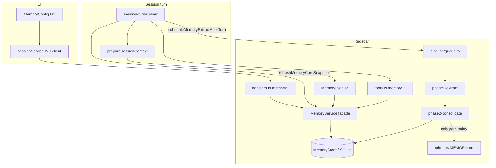
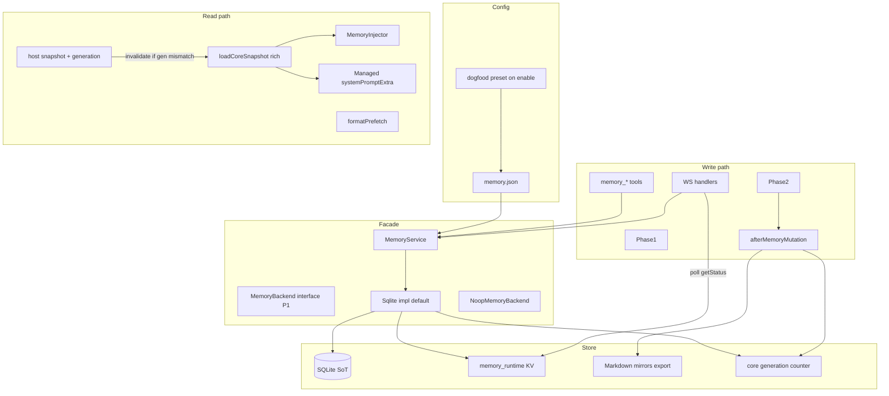
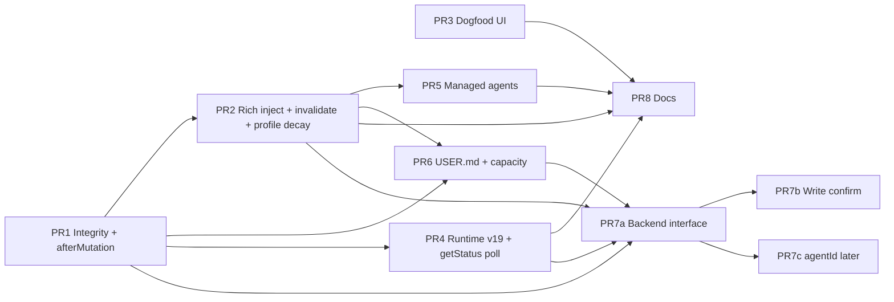

# hip Memory System: Long-term Completeness Fix

| Field | Value |
|-------|--------|
| **Author** | TBD |
| **Date** | 2026-07-18 |
| **Status** | Draft (revised post-review) |
| **Audience** | Senior engineers familiar with hip sidecar + protocol |
| **Related code** | `packages/protocol/src/memory-types.ts`, `packages/sidecar/src/memory/**`, `src/components/account/MemoryConfig.tsx`, session wiring in `session-turn-runner.ts` / `session-tooling.ts` / `session-context.ts` |

---

## Overview

hip already ships a sophisticated cross-session memory stack: SQLite items + FTS (+ optional hybrid embeddings), Phase1 extract → Phase2 consolidate, markdown mirrors, agent tools, citations, decay, and trash. In practice the **product loop is broken**: enabling `useMemories` / `generateMemories` can still leave `memory_items=0` and empty injection; mirrors under `~/.hip/memories/` desync from SQLite; core injection is too thin (summaries + pinned titles only); extract gates and in-process throttle silently starve dogfood; managed/external agent paths skip memory; the host freezes an empty core for the whole session after extract; and the UI lacks extract status observability.

This design fixes usability first (P0), then layers a complete long-term architecture (P1–P2): SQLite as sole source of truth with mirror integrity, richer core injection with **cache invalidation** after mutations, a stable User Profile block, durable throttle, **poll-first** pipeline status (optional WS push later), capacity budget, optional write confirmation, a pluggable `MemoryBackend` interface, optional per-agent buckets, and product documentation. Implementation stays surgical—extend `MemoryService` and existing protocol/WS surfaces rather than rewriting the pipeline.

---

## Background & Motivation

### Current architecture (as implemented)



**Persistence** in `packages/sidecar/src/persistence/schema.ts` (current tip **`PRAGMA user_version = 18`**):

| Table | Schema version landed | Role |
|-------|----------------------|------|
| `memory_items` | 16 | Durable facts (scope global/project/session; kinds preference/convention/lesson/workflow/profile) |
| `memory_summaries` | 16 | Compressed markdown summaries per global/project |
| `memory_stage1` | 16 | Phase1 raw extract rows pending consolidate |
| `memory_jobs` | 16 | Lease/watermark job table — **exists, zero runtime usage** outside schema/tests |
| `memory_citations` | 17 | Citation support |
| `memory_embedding_meta` / `memory_embedding_rows` | 18 | Optional hybrid embed mirror (BLOB rows; vec0 optional) |

This design adds **`memory_runtime` at user_version 19** (see Data Model).

**Config** (`~/.hip/config/memory.json`, mode 0600) via `MemoryFileConfig` / `MEMORY_FILE_CONFIG_DEFAULTS` in `packages/protocol/src/memory-types.ts`:

- Cold-start privacy: `useMemories: false`, `generateMemories: false`
- Aggressive dogfood gates when generate is on: `idleMinutes: 15`, `minExtractIntervalHours: 6`, `minUserTurns: 2`, `minUserChars: 80`, `maxExtractsPerDay: 20`
- Core budget: `maxCoreSummaryChars: 1500` (further capped by `getMemoryCoreBudget` to ≤1500 / ~0.5% of context tokens)
- Prefetch budget: `maxPrefetchChars: 2500`

**Injection path** (internal supervisor only — `!host.agentProv.isExternalAgent()`):

1. `refreshMemoryCoreSnapshot` freezes core by project key (`inject.ts`). **Empty-string snapshots are valid freezes** — the host does **not** reload solely because the snapshot is falsy (`inject.test.ts`).
2. `MemoryService.loadCoreSnapshot` loads **global+project summaries** + **pinned item titles only** (`service.ts` ~158–190)
3. `MemoryInjector` appends frozen core + optional FTS/hybrid prefetch snippets
4. Registered **last** after `ProjectAgentsMdInjector` so AGENTS.md wins on conflict (Option A)

**Critical product-loop gap (freeze):** Extract runs **after** a turn (`scheduleMemoryExtractAfterTurn`). Phase2 can populate SQLite while the host still holds a frozen empty (or stale) core for the rest of the session/cwd. Richer `loadCoreSnapshot` alone does **not** fix mid-session “next turn shows new items” without **cache invalidation** (KD-13).

**Generation path**:

1. After turn: `scheduleMemoryExtractAfterTurn` → idle debounce → `maybeEnqueueMemoryExtract`
2. Throttle state is **in-process only**: `lastExtractSuccessAt: Map`, `extractCountByDay` in `pipeline/queue.ts`
3. Phase1 empty LLM output → `succeeded_no_output` still **counts as success** for daily + interval throttle
4. Phase2 writes items/summaries and is the **only** production caller of `writeMemoryMirror` — and only for **one** scope (`sumScope` from consolidate `projectKeyHash`), even when post-pass items include both global and project scopes
5. `createDefaultMemoryLlmClient` returns **null** when no API key → queue silently skips (`no_llm`) with no UI

**Parallel “project memory” path** (orthogonal and confusing):

- `ProjectAgentsMdInjector` also injects cwd `MEMORY.md` / `.hip/MEMORY.md` as “Project memory” — repo-local notes, not the SQLite memory system
- Mirrors live under `~/.hip/memories/global|projects/<hash>/MEMORY.md` (export only)

### Observed pain points (dogfood on this machine)

| # | Symptom | Root cause in code |
|---|---------|-------------------|
| 1 | `useMemories`+`generateMemories` on, `extractModel` set, still `memory_items=0` | Gates + empty Phase1 OK + interval throttle; no UI feedback; possible `no_llm` |
| 2 | Mirrors contain historical items SQLite no longer has | Mirror rewrite only on Phase2; user tool/UI delete/upsert never rewrites |
| 3 | Core inject feels empty even with items | Summaries empty + pinned titles only; unpinned active items never in core; **host freeze of empty core** |
| 4 | Wait forever for extract | `idleMinutes=15` + `minExtractIntervalHours=6` defaults |
| 5 | Restart “resets” extract spacing | Throttle maps not durable |
| 6 | Managed/external agents never see memory | Inject gated on internal agent path only; invoker has no system-extra / memory tools |
| 7 | Hybrid search “off and useless” | Default `hybridSearchEnabled: false`; requires `embeddingModel` |
| 8 | README silent on memory | No product docs |
| 9 | Profile mixed into items | `kind: 'profile'` exists; no USER block; decay skips only **pinned**, not profile |

### Reference systems (local clones)

| System | Useful ideas | Caution |
|--------|--------------|---------|
| **Hermes** | MEMORY.md + USER.md split; frozen session snapshot; capacity % in prompt; tool errors when over budget; agent self-curates | File-first SoT; hip already invested in SQLite+FTS; pure freeze breaks mid-session extract |
| **DeerFlow** | Pluggable `MemoryManager` (9 methods); middleware debounce (~30s); per-agent isolation; tool vs middleware modes; staleness review | Don't import Python framework; port *interface shape* only |
| **OpenHands** | User confirmation before write (`repo.md` style) | Optional, config-gated |
| **Codex** | Dropped complex unused memory tables (migration 0035) | Prefer shipping a working thin loop over more tables; leave dead `memory_jobs` for a later cleanup |

---

## Goals & Non-Goals

### Goals

1. **Closing the product loop**: enable use+generate → extract runs with **visible status** (including `no_llm`) → items land in SQLite → **host cache invalidates** → core inject surfaces useful text → mirrors match DB.
2. **Integrity**: SQLite is sole SoT; mirrors are derived export with reconcile guarantees across **all affected scopes**.
3. **Richer core injection**: profile/USER block + top-N active item bodies + capacity indicator; AGENTS.md priority preserved.
4. **Dogfood presets**: progressive defaults when user enables both flags (privacy-safe cold install unchanged); surface missing API key.
5. **Observability**: last extract status, skip reasons, counts, index status in UI + structured logs (P0 = **poll** `memory:getStatus`).
6. **Durable throttle** via `memory_runtime` (not process memory alone).
7. **Managed (and safe external) read path**: concrete invoker/runner fields for core inject; search-only tools optional.
8. **Long-term extensibility**: capacity budget, optional write confirmation, `MemoryBackend` interface, optional `agentId` bucket, docs.

### Non-Goals

- Implementing full external providers (mem0, honcho, etc.) — interface + local + noop only.
- Replacing Phase1/Phase2 with a completely different pipeline in P0.
- Keychain migration for API keys (remain plaintext 0600 under `~/.hip`).
- Making hybrid search default-on (privacy/cost).
- Unifying repo-local `MEMORY.md` (project guidance) into SQLite — document the boundary instead of merging.
- Multi-user cloud memory sync.
- Dropping unused `memory_jobs` table in this project (follow-up only).

---

## Key Decisions

| ID | Decision | Rationale |
|----|----------|-----------|
| **KD-1** | **SQLite is sole source of truth** for injection, tools, and UI. Markdown under `~/.hip/memories/` is **export/human-readable only**. | Injection already reads DB (`loadCoreSnapshot` / FTS). Mirrors are incomplete writers today; treating files as SoT would reintroduce dual-write bugs. Hermes file model is inspirational for UX, not for SoT. |
| **KD-2** | **Every mutation rewrites affected mirrors** (upsert, soft/hard delete, restore, empty trash, import, Phase2, decay archive). Startup runs **reconcile: DB → rewrite all known mirrors**; optional **import-from-mirror** when DB empty and mirror non-empty. Phase2 rewrites **global + every touched projectKeyHash**, not only summary scope. | Fixes desync root cause: only Phase2 called `writeMemoryMirror`, and only for one scope. |
| **KD-3** | **Core inject = Profile + Summaries + Pinned (full body) + Top-N active item bodies (ranked) + capacity line**. Titles-only pinned list is insufficient. Escape hatch: `coreInjectionMode: 'legacy' \| 'rich'` (default `rich`). | Matches Hermes “full curated entries”; prefetch remains dynamic FTS. Budget still hard-capped. |
| **KD-4** | **User Profile is a first-class layer** (`kind=profile`, global) with decay exemption in the same PR that surfaces profile in core; `USER.md` mirror can follow in PR6. | Stable personal prefs must not decay while shown in core. Hermes USER.md proven pattern. |
| **KD-5** | **Cold defaults stay privacy-off**; enabling both use+generate applies **dogfood preset** with `minExtractIntervalHours: 0.25` and `idleMinutes: 2` when values still equal cold defaults. Keep daily cap. | Default-off for cold install; “enable” must actually produce memories without extract-every-idle cost. |
| **KD-6** | **Persist extract throttle in new `memory_runtime` KV table** (user_version 19). Do **not** overload `memory_jobs` (lease/watermark shape; unused entirely). Follow-up: drop or adopt `memory_jobs` separately. | Restarts currently reset maps; dedicated KV fits day-count + per-session last status JSON. |
| **KD-7** | **Managed agents get read-only inject** via new `systemPromptExtra` + optional `extraTools` on invoker/runner. Default scopes = parent session scopes. External agents: default off (`useMemoriesWithExternal: false`). | Subagents skip MemoryInjector and parent `memory_*` tools today; need concrete API deltas, not task-string hacks alone. |
| **KD-8** | **Extend `MemoryService` facade first**; extract `MemoryBackend` interface only after P0 stabilizes (separate PR). | Avoid Codex-style unused complexity; keep handlers/tools stable through P0. |
| **KD-9** | **Capacity is soft-then-hard**: core inject shows usage % (post-truncate); tool `memory_add`/`replace` return **string** errors over store budget (Hermes-style). | Prevents unbounded growth; tools today return strings, not JSON objects. |
| **KD-10** | **Write confirmation** is config-gated, default off; ships in its own PR after P0 (not bundled with backend interface). | OpenHands-inspired; not required for dogfood completeness. |
| **KD-11** | **Do not auto-import project-cwd `MEMORY.md` into SQLite**. Import-from-mirror only from `~/.hip/memories/**`. | Dual inject already exists; merging without care corrupts scopes. |
| **KD-12** | **`throttleOnEmptyExtract` default `false`**: `succeeded_no_output` increments daily cost counter and records status, but does **not** set `lastSuccessAt` for interval spacing. Status surfaces distinctly in UI. | Prevents 6h silence after useless extract; cost still tracked. |
| **KD-13** | **Core snapshot invalidation (freeze+reload hybrid)**: Keep freeze-by-project-key for prefix-cache friendliness, but **reload when** (1) project key changes, (2) host `memoryCoreGeneration` ≠ store generation, (3) cached snapshot is empty **and** store generation advanced, or (4) explicit force. Bump generation after Phase2 success, any MemoryService mutation, config change affecting inject, import/mirror reconcile. | Pure Hermes freeze breaks mid-session extract; every-turn reload works but chaffs prefix cache. Generation counter is cheap and testable. |
| **KD-14** | **P0 observability is poll-first**: UI polls `memory:getStatus` (interval + on Memory settings focus + after turns if cheap). Background queue **persists** status to `memory_runtime`; no required `SendFn` in queue for P0. Optional P1: register `onPipelineEvent` broadcast from `SessionManager` for live toasts. | Queue has no `send` today; inventing a full event bus blocks dogfood. Status strip works with poll. |

---

## P0 Engineer Checklist

Before coding, implementers must satisfy:

| # | Decision | Spec location |
|---|----------|---------------|
| 1 | Freeze policy = generation invalidation (KD-13), not every-turn reload | §3.1 |
| 2 | Observability = poll `memory:getStatus` P0; push optional P1 (KD-14) | §5 |
| 3 | Ranking formula + kind weights + tie-break | §3.2 |
| 4 | Phase2 multi-scope mirror rewrite via `afterMemoryMutation`; honor `exportMarkdownMirror: false` | §2 |
| 5 | Managed agent API: merge `extraTools` **before** `toolNames` / `buildManagedAgentPrompt` | §7 |
| 6 | All new config keys in defaults / `isOptionalMemoryKey` + tests | API section |
| 7 | Schema: `memory_runtime` at user_version **19** | Data Model |
| 8 | Dogfood interval **0.25h**; surface `no_llm` in UI | §4, §5 |
| 9 | Profile decay exemption in PR2 with profile section | PR2 |
| 10 | Integration matrix A1.1 updated for rich inject in PR2 | PR2 |
| 11 | **Real** process-local `coreGeneration` in PR1 (no stub); L2 persist in PR4 | §3.1, PR1/PR4 |
| 12 | `getStatus.capacity` only when `projectKeyHash` provided | §5 |

---

## Proposed Design

### 1. Target architecture



### 2. Mirror ↔ DB integrity (P0 / KD-1, KD-2)

#### Source of truth rules

| Artifact | Role | Who writes | Who reads for agent |
|----------|------|------------|---------------------|
| SQLite `memory_*` | **SoT** | Service, pipeline, tools, handlers | Injection, tools, UI list |
| `~/.hip/memories/**/MEMORY.md` | Export / human edit optional import | Always rewritten from DB on mutations + startup | Never for inject (except one-shot import) |
| `~/.hip/memories/global/USER.md` (new, PR6) | Profile export mirror | Same as above for profile layer | Never for inject directly |
| cwd `MEMORY.md` / `.hip/MEMORY.md` | Project guidance notes | User / git | `ProjectAgentsMdInjector` only |

#### Single mutation hook: `afterMemoryMutation`

Phase2, decay, and trash **bypass** `MemoryService.upsert` and call `store.upsertItem` directly today. Do **not** require every low-level store write to know mirrors. Instead:

```ts
/** Scopes touched by a logical mutation. Always rewrite these mirrors from DB. */
export type MemoryMutationScopes = {
  global?: boolean
  projectKeyHashes?: string[]
}

/**
 * Single chokepoint used by MemoryService, Phase2 end, decay/trash when active set
 * changes, and import. Always bumps core generation (KD-13), even when mirrors are off.
 */
export function afterMemoryMutation(
  svc: MemoryService, // or { store, config, bumpGeneration }
  scopes: MemoryMutationScopes,
): void {
  // 1) ALWAYS bumpCoreGeneration() (process-local L1 in PR1; L2 in PR4)
  // 2) IF config.exportMarkdownMirror === false → skip all mirror disk I/O
  //    (same early-return semantics as writeMemoryMirror today)
  // 3) ELSE rewrite mirrors for scopes (global + each project hash)
  // 4) log event 'mirror_rewrite' (or omit when skipped)
}
```

**`exportMarkdownMirror: false`:** `afterMemoryMutation` and `rewriteMirrorsFromDb` **must not write** mirror files when the flag is false. Generation bump still runs so inject invalidation works without mirrors (tests with `exportMarkdownMirror: false` must not create files under `memoriesDir`).

Helpers (pure mirror I/O can still take `store` for tests):

```ts
export function rewriteMirrorsFromDb(opts: {
  store: MemoryStore
  config: MemoryFileConfig
  /** When set, only these scopes; when omit, global + all project hashes present in DB */
  scopes?: MemoryMutationScopes
  memoriesDir?: string
}): { written: string[]; skipped: boolean }
// When !config.exportMarkdownMirror → return { written: [], skipped: true } immediately.

export function detectMirrorDesync(opts: { /* … */ }): {
  inSync: boolean
  mirrorOnlyIds: string[]
  dbOnlyIds: string[]
  mirrorPath: string
}

export function importFromMirror(opts: {
  store: MemoryStore
  projectKeyHash?: string
  conflict: 'keep' | 'overwrite'
  memoriesDir?: string // must resolve under memoriesRootDir only
}): { imported: number; skipped: number }
```

#### Call sites (complete)

| Call site | Scopes to pass |
|-----------|----------------|
| `MemoryService.upsert` | item scope (global and/or projectKeyHash) |
| `softDelete` / `hardDelete` / `restore` | item's scope |
| `emptyTrash` | all scopes that had deleted items (or global + all projects — rewrite all is OK) |
| `importJsonl` | global + all distinct projectKeyHash in imported set |
| **Phase2 end** | `global: true` if any upsert/archive had `scope==='global'`; **union of all projectKeyHashes** on touched items **and** summary scope — **not** summary-only |
| `runDecayJob` if any item archived | scopes of archived items |
| `runTrashRetentionJob` if hard-purged | affected scopes (or full reconcile) |
| `runStartupMaintenanceOnce` | full reconcile (all known projects + global) |

**Desync detection**: on startup, if `detectMirrorDesync` reports `mirrorOnlyIds.length > 0` and DB has active items, log `mirror_desync` + set status flag. Default auto-repair = rewrite from DB (DB wins). Import-from-mirror only when DB active count is 0 for that scope and `importMirrorIfDbEmpty !== false`. Import paths restricted to `~/.hip/memories` (never cwd MEMORY.md).

**Tests**: delete item → mirror drops id; Phase2 mixed global+project → **both** mirrors match DB; startup with stale mirror → rewritten; `exportMarkdownMirror: false` → no mirror files written, generation still increments.

### 3. Richer core injection (P0 / KD-3, KD-4, KD-13)

#### 3.1 Host freeze / invalidation policy

Extend host fields (on session host object in turn runner):

```ts
host.memoryCoreSnapshot?: string
host.memoryCoreIds?: string[]
host.memorySnapshotProjectKey?: string
host.memoryCoreGeneration?: number // last generation baked into host snapshot
```

**Core generation storage (phased — no no-op stubs):**

| Phase | Storage | Behavior |
|-------|---------|----------|
| **PR1 (required for dogfood mid-session loop)** | **Process-local L1** on `MemoryService` (private field `coreGeneration = 0`) or module singleton for the service instance | `getCoreGeneration()` / `bumpCoreGeneration()` are **real** (increment + return). Called from every `afterMemoryMutation` (incl. Phase2). Restart resets to 0 — acceptable; host cache also dies with process. |
| **PR4** | **L2 persist** `memory_runtime` key `core_generation` → `{ n: number }` | Hydrate L1 from DB on service construct / first get; bump writes L1 then best-effort L2. Cross-restart continuity is nice-to-have, not required for Success #3. |

```ts
// MemoryService — ship in PR1, not a stub
private coreGeneration = 0

getCoreGeneration(): number {
  return this.coreGeneration
}
bumpCoreGeneration(): number {
  this.coreGeneration += 1
  // PR4+: persist to memory_runtime; ignore write errors
  return this.coreGeneration
}
// afterMemoryMutation always calls bumpCoreGeneration()
```

**Do not** ship a no-op “bump stub” in PR1. Without a real counter, PR2’s refresh logic cannot recover empty freezes after Phase2 in the same process.

Update `refreshMemoryCoreSnapshot`:

```ts
export type RefreshMemoryCoreSnapshotArgs = {
  useMemories: boolean
  cwd?: string
  hostSnapshot?: string
  hostCoreIds?: string[]
  hostProjectKey?: string
  hostGeneration?: number
  storeGeneration: number // from svc.getCoreGeneration()
  load: (projectKeyHash: string) => MemoryInjectBlock
  resolveKey: (cwd: string) => { projectKeyHash: string }
}

// Reload when ANY of:
// 1) hostProjectKey !== projectKeyHash
// 2) hostGeneration !== storeGeneration
// 3) (hostSnapshot === '' || hostSnapshot === undefined) && storeGeneration > (hostGeneration ?? -1)
//    — recovers empty freeze after first successful extract without forcing every-turn reload
// Else return cached host snapshot.
```

**Hermes tradeoff**: mid-session tool `memory_add` will bump generation → next turn reloads core (inject updates). Within a single turn, frozen core stays stable (prefix cache for that turn's multi-step loop). Prefetch remains dynamic per turn.

**Tests** (`inject.test.ts`): after simulated generation bump, same project key reloads; without bump, cache hits; empty snapshot + generation advanced → reloads.

#### 3.2 Current vs proposed `loadCoreSnapshot`

**Current**:

```
## Memory (core)
### Global / Project summaries
### Pinned
- title only
```

**Proposed** (`coreInjectionMode: 'rich'`, default):

```
## Memory (core) [42% — 630/1500 chars]
### User profile
- **…**: body
### Summaries
#### Global
…
#### Project
…
### Pinned
- **title**: body (truncated)
### Active
- **[project/lesson] title**: body snippet
```

`coreInjectionMode: 'legacy'` restores titles-only pinned + summaries only (rollback escape hatch).

#### 3.3 Ranking formula (deterministic)

Load candidates: `status='active'`, scopes `global ∪ project(projectKeyHash)`, exclude session-scoped from core.

Partition:

1. **Profile** = `kind === 'profile' && scope === 'global'`
2. **Pinned** = `pinned === true` and not already in profile set
3. **Active pool** = remaining active items

Score for active pool (and for ordering within pinned if over budget):

```
kindWeight(kind) =
  profile:     0.25   // only if somehow in pool
  preference:  0.20
  convention:  0.15
  workflow:    0.10
  lesson:      0.05
  default:     0.05

recencyBoost = 0.30 * exp(-ageDays / 30)
  where ageDays = max(0, (now - (lastUsedAt ?? updatedAt)) / 86_400_000)
  // half-life-ish 30 days; clamp result to [0, 0.30]

useCountBoost = min(0.15, Math.log1p(useCount) * 0.05)

score = confidence * 0.40 + recencyBoost + useCountBoost + kindWeight(kind)
// confidence assumed already in [0,1]; clamp score finite

sort key: score DESC, updatedAt DESC, id ASC
```

Take top `coreMaxItems` (default **12**) from active pool after pinned+profile reservations.

**Unit test vector table** (fixed `now`):

| id | kind | conf | useCount | ageDays | expected rank order |
|----|------|------|----------|---------|---------------------|
| a | preference | 0.9 | 0 | 0 | 1 |
| b | lesson | 0.9 | 0 | 0 | after a (kind) |
| c | preference | 0.5 | 10 | 0 | between by score math |
| … | | | | | |

#### 3.4 Fill order and truncation (capacity)

Budget `B = getMemoryCoreBudget(maxCoreSummaryChars, contextWindowTokens)`.

**Fill priority (stop when remaining budget < 40 chars):**

1. Header line with provisional capacity (rewrite at end with final used/B)
2. User profile section — reserve up to `min(400, floor(0.25 * B))` chars for profile bodies; overflow truncate per-item with `…`
3. Summaries (global then project) — as today, truncated
4. Pinned bodies — each body max `coreItemBodyChars` (default **280**); skip if cannot fit title line
5. Active top-N — same per-item cap
6. Final header: `## Memory (core) [P% — used/B chars]` where `used` is **post-truncate** total body length (including header), `P = floor(100 * used / B)`

**Capacity % is post-truncate** (what the model actually receives).

Citation `ids`: all item ids whose **body** appears (profile + pinned + active).

### 4. Dogfood / progressive defaults (P0 / KD-5)

Cold install remains:

```ts
useMemories: false
generateMemories: false
idleMinutes: 15
minExtractIntervalHours: 6
// …
```

**Exported constant** from `@hip/protocol`:

```ts
export const DOGFOOD_MEMORY_PRESET: Partial<MemoryFileConfig> = {
  idleMinutes: 2,
  minExtractIntervalHours: 0.25, // 15 minutes — resolved Open Q1
}
```

**Merge rules on enable-both** (UI path preferred; server may mirror):

When previous config had `useMemories===false && generateMemories===false` and client requests both true:

| Key | Apply preset if… |
|-----|------------------|
| `idleMinutes` | current value equals cold default `15` |
| `minExtractIntervalHours` | current value equals cold default `6` |
| Other keys | never auto-overwrite |

If user already set `idleMinutes: 0` for e2e, leave it.

**LLM availability (Issue 11):** On enable-both and on status strip when `generateMemories`:

1. Resolve extract client the same way as queue (`createDefaultMemoryLlmClient({ extractModel })`).
2. If null → status `lastPhase1Reason: 'no_llm'` (or dedicated `llmAvailable: false`) and UI CTA: “Configure a provider API key (Settings → Providers). Extract uses extract model or the active provider’s cheap model.”
3. Document: **extractModel is optional** when active provider has a key; missing key is fatal for generate.

**Advanced UI**: expose idleMinutes, minExtractIntervalHours, minUserTurns, minUserChars, maxExtractsPerDay.

### 5. Observability (P0 poll / KD-14)

#### Runtime status model

```ts
export type MemoryExtractSkipReason =
  | 'incognito'
  | 'generate_disabled'
  | 'not_idle'
  | 'min_content'
  | 'empty_transcript'
  | 'no_llm'
  | 'rate_limited'
  | 'interval_throttle'
  | 'inflight'
  | 'unknown'

export type MemoryPipelineStatus = {
  lastPhase1At?: number
  lastPhase1Status?: 'succeeded' | 'succeeded_no_output' | 'skipped' | 'failed'
  lastPhase1Reason?: string
  lastPhase1SessionId?: string
  lastPhase2At?: number
  lastPhase2Status?: 'succeeded' | 'succeeded_no_output' | 'skipped' | 'failed'
  lastPhase2Reason?: string
  extractsToday: number
  maxExtractsPerDay: number
  llmAvailable: boolean
  itemCounts: { active: number; deleted: number; archived: number }
  summaryCounts: { global: number; project: number }
  stage1Pending: number
  coreGeneration: number
  mirrorDesync?: boolean
  index?: { embedded: number; total: number; modelKey?: string; vecEnabled: boolean }
  /**
   * Optional. Only present when the client requested scoped capacity
   * (see memory:getStatus). Never invent a global-only capacity that
   * misrepresents project inject size.
   */
  capacity?: { usedChars: number; budgetChars: number; percent: number }
}
```

**Capacity on status (scope required):** Core capacity depends on `projectKeyHash` + `contextWindowTokens` (`loadCoreSnapshot` / `getMemoryCoreBudget`). Therefore:

- **Default `memory:getStatus`:** **omit** `capacity` (or leave undefined). Status strip shows item counts, pipeline last run, llmAvailable, index — not a misleading global %.
- **Optional scoped request** (preferred when UI wants a meter for the open project):

```ts
| { type: 'memory:getStatus'; projectKeyHash?: string; contextWindowTokens?: number }
// server may set capacity by running loadCoreSnapshot(projectKeyHash, contextWindowTokens)
// using default 128_000 tokens only when contextWindowTokens omitted *and* projectKeyHash provided
```

- Inject header continues to show post-truncate capacity for the **actual** turn context (authoritative for the model).
- Do **not** compute “global-only” capacity without documenting it as approximate; design prefers omit unless scoped.

#### Delivery mechanism (concrete)

| Mode | When | How |
|------|------|-----|
| **P0 (required)** | Always | Queue writes status to `memory_runtime` key `pipeline_status` after every Phase1/Phase2 attempt (including skips). UI calls `memory:getStatus` on Memory settings mount, every 5s while generate on and panel visible, and after `memory:setConfig`. |
| **P1 (optional)** | Later | `SessionManager` registers `setPipelineEventSink((ev) => broadcast(ev))` on queue module; emit expanded `memory:pipeline` to connected clients. |

**Do not block P0 on SendFn in queue.**

#### Protocol

```ts
// client
| { type: 'memory:getStatus'; projectKeyHash?: string; contextWindowTokens?: number }
// server
| { type: 'memory:status'; status: MemoryPipelineStatus }
// capacity filled only when projectKeyHash (or equivalent cwd resolution) provided

// Existing memory:pipeline — expand carefully when P1 push lands:
// Today: status: 'started' | 'succeeded' | 'failed' | 'noop'
// Add optional fields; map succeeded_no_output → status:'succeeded' + detail:'no_output'
// OR add 'succeeded_no_output' to union with message-guard + frontend handling.
// Prefer detail flag for backward compat in P0 if any client already switches on status.
```

**Touchpoints for `memory:getStatus`:**

- `packages/protocol/src/messages.ts` (client + server unions)
- `packages/protocol/src/message-guard.ts` (`CLIENT_MESSAGE_TYPES` / parse)
- `packages/sidecar/src/memory/handlers.ts` (`MEMORY_MESSAGE_TYPES` + case)
- `packages/sidecar/src/server/message-route.ts` if unicast classification lists types
- Frontend `sessionService` method + `MemoryConfig.tsx` poll

#### Structured log event names (greppable)

```ts
type MemoryLogEvent =
  | 'phase1_skip'
  | 'phase1_done'
  | 'phase2_skip'
  | 'phase2_done'
  | 'mirror_rewrite'
  | 'mirror_desync'
  | 'mirror_import'
  | 'core_invalidate'
  | 'throttle_persist'
```

Format: `console.info('[memory]', JSON.stringify({ event, …fields }))`.

#### UI status strip

When use or generate on:

- Active / trash counts  
- Last extract: status + relative time + reason (`no_llm` → CTA)  
- Extracts today / max  
- LLM available boolean  
- Index coverage  
- Mirror desync warning + “Rewrite mirrors”  
- Capacity % of core budget **only when** status poll includes `projectKeyHash` (e.g. current project); otherwise omit meter or show inject-time value from last turn if UI caches it  

i18n en/zh for all new strings.

### 6. Durable extract throttle (P0 / KD-6, KD-12)

**Decision: `memory_runtime` only** (not `memory_jobs`).

```sql
-- migration version < 19
CREATE TABLE IF NOT EXISTS memory_runtime (
  key TEXT PRIMARY KEY,
  value_json TEXT NOT NULL,
  updated_at INTEGER NOT NULL
);
```

Keys:

| Key | Value shape |
|-----|-------------|
| `extract_day` | `{ day: 'YYYY-MM-DD', count: number }` |
| `extract_session:<sessionId>` | `{ lastSuccessAt?: number, lastStatus, lastReason?, updatedAt }` |
| `pipeline_status` | `MemoryPipelineStatus` snapshot (or subset) |
| `core_generation` | `{ n: number }` — **L2 only from PR4**; PR1 uses process-local L1 only |

API in `queue.ts` (takes `MemoryStore` or service):

```ts
function loadDailyCount(store: MemoryStore, now?: number): number
function assertUnderDailyExtractLimit(store: MemoryStore, config: MemoryFileConfig, now?: number): boolean
function recordExtractOutcome(store: MemoryStore, sessionId: string, outcome: {
  status: Phase1ExtractStatus
  reason?: string
  now?: number
}): void
// On succeeded | succeeded_no_output: increment daily count
// On succeeded only OR (succeeded_no_output && config.throttleOnEmptyExtract): set lastSuccessAt
// Always update pipeline_status + extract_session row
```

In-memory maps remain as L1 cache; hydrate from DB on first use; tests can still `resetPhase1Queue` and use temp DB.

### 7. Memory path for managed / external agents (P0 / KD-7)

#### Diagnosis (verified)

- Supervisor path registers `MemoryInjector`; external path skips entire injector stack.
- `dispatchAgent` → `invoker.invoke` → `runManagedAgent` builds tools via `buildTools` **without** memory tools.
- Invoker narrows parent tools to `mcp__*` only — parent `memory_*` never reach children (`session-tooling.test.ts`).
- `RunManagedAgentArgs` / `InvokerExtras` have **no** system prefix field; system is `buildManagedAgentPrompt({ cwd, persona: prompt, … })`.

#### Exact API surface

```ts
// packages/sidecar/src/session/agents/invoker.ts — InvokerExtras
export interface InvokerExtras {
  // …existing…
  /** Appended to managed agent system prompt (e.g. frozen memory core). */
  systemPromptExtra?: string
  /** Extra tools merged after buildTools (e.g. memory_search only). */
  extraTools?: StructuredToolInterface[]
}

// packages/sidecar/src/session/internal-runner.ts — RunManagedAgentArgs
export interface RunManagedAgentArgs {
  // …existing…
  systemPromptExtra?: string
  extraTools?: StructuredToolInterface[]
}

// packages/sidecar/src/session/agents/invoker.ts — RunInternalArgs same fields; pass-through
```

**Tools**:

```ts
// tools.ts
export function buildMemorySearchToolOnly(
  svc: MemoryService,
  ctx: { sessionId: string; cwd?: string },
): StructuredToolInterface
// scopes: global ∪ project(resolveProjectKey(cwd)) ∪ session(sessionId)
// — same as parent memory_search; default decision for Open Q2
```

**Mandatory assembly order in `runManagedAgent`** (matches current structure; do not build `toolNames` before merging extras):

```ts
// 1) Built-ins under allowlist (explore), MCP/skills already narrowed by caller
const builtIns = buildTools(cwd, undefined, cwd, undefined, {
  mcpTools,
  skills,
  requestApproval,
  permissionMode,
  webSearchEnabled: true,
  sessionId: args.sessionId,
  networkPolicy,
  ...(allowedTools?.length ? { allowedTools } : {}),
})

// 2) Append extraTools AFTER allowlist filter (bypass built-in allowlist by design)
const tools = [...builtIns, ...(args.extraTools ?? [])]

// 3) toolNames MUST include extraTools so buildManagedAgentPrompt lists them
//    ("Your available tools are: …"). Omitting this step registers memory_search
//    on GraphCtx but the model never sees the name — broken UX.
const toolNames = tools.map((t) => t.name)

const base = buildManagedAgentPrompt({
  cwd,
  persona: prompt,
  toolNames,
  skills,
  permissionMode,
  mcpCatalog: toolNames.includes('mcp_search') ? mcpManager.toolCatalog() : undefined,
})
const system = args.systemPromptExtra?.trim()
  ? `${base}\n\n${args.systemPromptExtra.trim()}`
  : base

// 4) GraphCtx.tools = tools (same array as toolNames source)
const ctx: GraphCtx = { …, tools, … }
// SystemMessage(system)
```

**Tests (PR5):** with `extraTools: [memory_search]` and explore `allowedTools` set (without `memory_search` in the list): (1) final `tools` includes `memory_search`; (2) system prompt string contains `memory_search`; (3) `buildTools` alone does not include it (bypass verified).

**`dispatchAgent` wiring** (`session-turn-runner.ts`):

```ts
const memoryExtra =
  useMemories && memoryCoreSnapshot
    ? `${MEMORY_HEADER}\n\n${memoryCoreSnapshot}`
    : undefined
const searchTool =
  useMemories &&
  host.memoryService &&
  memoryToolsForSubagents !== 'none' // default 'search'
    ? [buildMemorySearchToolOnly(host.memoryService, { sessionId: host.id, cwd })]
    : []
// if memoryToolsForSubagents === 'all', use buildMemoryTools (discouraged default)

await invoker.invoke(agentId, task, emit, signal, hooks, {
  …existing,
  systemPromptExtra: memoryExtra,
  extraTools: searchTool,
})
```

**Explore / allowedTools interaction:** `extraTools` are **appended after** `buildTools` allowlist filtering (step 2 above), so they are **not** subject to explore `allowedTools`. Caller (parent) decides policy via `memoryToolsForSubagents`. Still subject to permission/guardian if any. Document that explore agents receive search only when parent sets useMemories and `memoryToolsForSubagents !== 'none'`.

**Default scopes decision (closes soft OQ):** parent session scopes — global ∪ project(parent cwd) ∪ session(parent sessionId). Child cwd if different is ignored for memory scope in P0 (rare).

**External agents P0:** document limitation. Flag `useMemoriesWithExternal` reserved; no implementation until adapter audit.

### 8. User Profile layer (P1 / KD-4)

**PR2 (minimal, correctness):**

- Section “User profile” in `loadCoreSnapshot` from `kind=profile` + `scope=global`
- **`isDecayCandidate` returns false when `item.kind === 'profile'`** (in addition to pinned) — few lines in `evolution.ts`
- Phase1/2 prompts: durable user prefs → kind=profile

**PR6 (complete UX):**

- `~/.hip/memories/global/USER.md` export rewrite
- Capacity store caps
- Optional UI filter “Profile”

No new `memory_profile` table unless multi-field UX later (Codex caution).

### 9. Capacity budget (P1 / KD-9)

| Budget | Default | Applies to |
|--------|---------|------------|
| Core inject chars | `getMemoryCoreBudget(...)` | Frozen system block |
| Store soft cap | `maxActiveItems: 200`, `maxActiveItemChars: 50_000` | Tool / UI writes |

**Tool error style** (match existing `tools.ts` strings):

```
Error: Memory store at 198/200 items (or 49,000/50,000 chars). Consolidate or remove entries, then retry. usage=items:198/200;chars:49000/50000
```

Do **not** return raw JSON objects from tools unless we change the whole tools pattern.

### 10. Optional write confirmation (P1 / KD-10) — separate PR

```ts
requireWriteConfirmation?: boolean // default false
```

In-memory pending map on `MemoryService`, TTL 10 min; WS `memory:confirmWrite`. **Not in P0.**

### 11. Pluggable MemoryBackend (P1 / KD-8) — separate PR after P0

DeerFlow-style contract **behind** stable `MemoryService` methods after P0 lands. Default `backend: 'sqlite'`; `noop` kill-switch. External stub throws UnsupportedError.

Do not block dogfood on interface extraction.

### 12. Per-agent memory buckets (P2) — separate PR / later milestone

```sql
-- later migration, e.g. user_version 20+
ALTER TABLE memory_items ADD COLUMN agent_id TEXT;
-- filter in SQL WHERE; FTS unchanged (no FTS rebuild required)
```

`perAgentMemory` default false. **Not bundled with backend interface.**

### 13. Staleness review / consolidate UX (P2)

Surface stale candidates using `maxUnusedDays`; manual consolidate already exists; show status from `getStatus` after consolidate.

### 14. Knowledge vs Memory boundary

| | **Memory** | **Knowledge** (if/when) | **Project guidance** |
|--|------------|-------------------------|----------------------|
| Purpose | Small durable prefs/lessons | Large corpus / RAG | Repo instructions |
| SoT | SQLite | Separate | AGENTS.md, cwd MEMORY.md |
| Inject | Bounded core + prefetch | Tool/search | ProjectAgentsMdInjector |

### 15. Healthy dogfood sequence (target)

```mermaid
sequenceDiagram
  participant U as User
  participant UI as MemoryConfig
  participant TR as TurnRunner
  participant Q as ExtractQueue
  participant P1 as Phase1
  participant P2 as Phase2
  participant DB as SQLite
  participant RT as memory_runtime
  participant M as Mirrors
  participant Host as Host freeze cache

  U->>UI: Enable use+generate (dogfood preset)
  UI->>UI: Check llmAvailable; CTA if no_llm
  U->>TR: chat turns
  TR->>Q: schedule after idleMinutes=2
  Q->>P1: extract
  P1->>DB: stage1
  P1->>RT: pipeline_status
  Q->>P2: consolidate
  P2->>DB: items + summary
  P2->>M: afterMemoryMutation all scopes
  P2->>RT: bump core_generation
  UI->>RT: poll getStatus (sees success)
  U->>TR: next turn same session
  TR->>Host: refreshMemoryCoreSnapshot gen mismatch
  Host->>DB: loadCoreSnapshot rich
  TR->>U: model sees item bodies
```

---

## API / Interface Changes

### Protocol (`packages/protocol`)

**`MemoryFileConfig` — full new keys** (must wire defaults + merge):

```ts
export interface MemoryFileConfig {
  // …existing fields…

  /** 'rich' = profile+bodies+capacity; 'legacy' = summaries+pinned titles only */
  coreInjectionMode?: 'legacy' | 'rich' // default 'rich' in MEMORY_FILE_CONFIG_DEFAULTS
  coreMaxItems?: number                 // default 12
  coreItemBodyChars?: number            // default 280
  maxActiveItems?: number               // default 200
  maxActiveItemChars?: number           // default 50_000
  throttleOnEmptyExtract?: boolean      // default false
  importMirrorIfDbEmpty?: boolean       // default true
  requireWriteConfirmation?: boolean    // default false
  memoryToolsForSubagents?: 'none' | 'search' | 'all' // default 'search'
  useMemoriesWithExternal?: boolean     // default false
  perAgentMemory?: boolean              // default false
  backend?: 'sqlite' | 'noop'           // default 'sqlite'
}
```

**Config merge requirements** (`packages/sidecar/src/memory/config.ts`):

1. Add every key above to `MEMORY_FILE_CONFIG_DEFAULTS` in `memory-types.ts` **or** to `isOptionalMemoryKey` — **prefer defaults** for keys with non-undefined semantics.
2. Extend `config.test.ts` round-trip: set each new key → save → load → equal.
3. Export `DOGFOOD_MEMORY_PRESET` from protocol; merge rules in §4.

Without (1), `setConfig` **silently drops** unknown keys today.

**New messages:**

```ts
| { type: 'memory:getStatus'; projectKeyHash?: string; contextWindowTokens?: number }
| { type: 'memory:rewriteMirrors'; projectKeyHash?: string }
| { type: 'memory:importMirror'; projectKeyHash?: string; conflict?: 'keep' | 'overwrite' }
// P1:
| { type: 'memory:confirmWrite'; pendingId: string; accept: boolean }

| { type: 'memory:status'; status: MemoryPipelineStatus } // capacity only if projectKeyHash provided
| { type: 'memory:rewriteMirrors:result'; written: string[]; error?: string }
| { type: 'memory:importMirror:result'; imported: number; skipped: number; error?: string }
```

### Sidecar

| File | Change |
|------|--------|
| `mirror.ts` | rewrite/detect/import helpers |
| `service.ts` | rich `loadCoreSnapshot`; **process-local** generation (PR1) + L2 (PR4); `afterMemoryMutation` (respect `exportMarkdownMirror`); status |
| `inject.ts` | generation-aware `refreshMemoryCoreSnapshot` |
| `queue.ts` | durable throttle, persist status, hydrate from DB |
| `phase2-consolidate.ts` | multi-scope `afterMemoryMutation` |
| `evolution.ts` | profile skip decay; `afterMemoryMutation` if archives |
| `handlers.ts` | getStatus (scoped capacity); rewrite/import |
| `tools.ts` | capacity string errors; `buildMemorySearchToolOnly` |
| `schema.ts` | user_version 19 `memory_runtime` |
| `invoker.ts` / `internal-runner.ts` | `systemPromptExtra`, `extraTools`; **merge extras before toolNames/prompt** |
| `session-turn-runner.ts` | invalidation fields; managed wiring; schedule extract |
| `message-route.ts` | if needed for new types |
| `config.ts` | defaults / optional keys |

### UI

`MemoryConfig.tsx`: status strip + poll, advanced gates, enable-both preset + `no_llm` CTA, mirror actions. Locales en/zh.

---

## Data Model Changes

### Schema migration

**Current tip: user_version 18.**  

**P0 migration:**

```sql
-- if (version < 19)
CREATE TABLE IF NOT EXISTS memory_runtime (
  key TEXT PRIMARY KEY,
  value_json TEXT NOT NULL,
  updated_at INTEGER NOT NULL
);
PRAGMA user_version = 19;
```

**P2 (later):** `agent_id` column on `memory_items`; filter in WHERE; **no FTS rebuild** (FTS content is title+content only).

**`memory_jobs`:** leave in place; open follow-up issue to drop or implement real job leases. Do not use for throttle.

### Mirror format

Keep HTML comment ids for import round-trip. USER.md in PR6.

### Backfill

1. Startup maintenance: rewrite mirrors from DB (DB wins).  
2. Empty DB + non-empty mirror + `importMirrorIfDbEmpty`: import once.  
3. Both non-empty and desync: banner; user chooses Rewrite (DB) or Import (overwrite policy).

---

## Alternatives Considered

### A1. File-first SoT (Hermes model)

- **Pros**: Human-editable, simple capacity.  
- **Cons**: Loses FTS/hybrid/trash/citations.  
- **Decision**: Reject as SoT; borrow UX only.

### A2. Only fix inject without mirrors/throttle

- **Decision**: Reject; dogfood still fails.

### A3. Auto-lower gates in cold defaults

- **Decision**: Reject; privacy/cost surprise. Preset on enable-both only.

### A4. Full mem0 now

- **Decision**: Reject; stub interface later only.

### A5. Document in-memory throttle reset

- **Decision**: Reject; persist `memory_runtime`.

### A6. Every-turn core reload vs freeze + invalidation

| Option | Pros | Cons |
|--------|------|------|
| Reload every turn | Simple; always fresh | Weaker prefix cache; extra SQL every turn |
| Pure freeze (Hermes) | Stable prefix | **Broken** mid-session extract loop |
| **Freeze + generation invalidation (chosen)** | Fresh after extract/mutate; cache hits otherwise | Slightly more host fields |

**Decision: KD-13.**

### A7. Status poll-only vs WS push for pipeline events

| Option | Pros | Cons |
|--------|------|------|
| **Poll getStatus (P0 chosen)** | No queue SendFn; works with current architecture | Seconds of lag; no toast unless polled |
| Push `memory:pipeline` from queue | Live UX | Needs SessionManager sink / broadcast design |
| Host-bound extract with session send | Natural send | Couples extract to one session connection |

**Decision: poll P0; optional push P1 (KD-14).**

---

## Security & Privacy Considerations

| Threat | Severity | Mitigation |
|--------|----------|------------|
| Secrets stored in memory | High | `redactSecrets` on upsert + Phase1; tools SAFETY_NOTE |
| Prompt injection via memory | High | Store-time `scanMemoryContent`; inject header “data not instructions”; AGENTS.md priority. **Inject trusts DB contents already scanned/redacted at write**; all writers must go through redact/scan (Phase2 already redacts LLM output). |
| Richest core = more untrusted text in system | Med | Same store-time scan; hard budget 1500; threat-scan on inject not required if write path complete |
| Mirror files world-readable | Med | atomicWrite 0600 |
| Subagent search leaks global prefs | Med | **Accept for P0** (same as supervisor search scopes); document; option `memoryToolsForSubagents: 'none'`. Scopes = parent global∪project∪session only—not foreign projects. |
| External agent exfil | Med | Default off |
| Extract sends transcript to third party | Med | User opts into generate; needs API key |
| Import-from-mirror reintroduces deleted secrets | Med | Import only `~/.hip/memories` (0600 local); never cwd MEMORY.md; only when DB empty by default; user-triggered otherwise |
| Write without awareness | Low–Med | Optional confirm later; generate default off |

Incognito: preserve force-off.

---

## Observability

| Signal | Where |
|--------|-------|
| Phase1/2 outcomes | `memory_runtime` + structured logs (`phase1_*`, `phase2_*`) |
| Counts / gen / llmAvailable | `memory:getStatus` poll |
| Index | existing `memory:indexStatus` |
| Mirror | `mirror_desync` / `mirror_rewrite` logs + status flag |
| Capacity | status + inject header (post-truncate %) |

LangSmith: opt-in only; no hardcode keys.

---

## Rollout Plan

### Feature flags / config

- Gated by use/generate where applicable  
- `backend: noop` kill-switch (after PR7a)  
- `coreInjectionMode: 'legacy'` rollback for inject  
- Dogfood preset only on false→both true with default gates  
- Subagent tools default `search`; external off  

### Schema

- Additive `memory_runtime` v19; rollback-safe (orphaned table OK)

### Performance targets

| Path | Target |
|------|--------|
| `loadCoreSnapshot` | < 5 ms typical |
| `afterMemoryMutation` (one scope) | < 50 ms |
| Startup full reconcile | < 200 ms ≤20 projects |
| Core size | ≤ budget B (≤1500 default) |

---

## Open Questions

1. ~~Dogfood `minExtractIntervalHours`~~ → **Resolved: 0.25** (advanced may set 0).
2. ~~Managed search scopes~~ → **Resolved: parent session scopes**.
3. **Profile storage long-term**: stay on kind=profile items only, or single USER document later? Default: items-only until UX needs more.
4. **External ACP inject**: which adapters support system prefix? Needs adapter audit before enabling default.
5. **Import mirror UX**: auto on empty DB (default true) vs button-only — design: auto empty-DB + button for force.
6. **Capacity units**: both item count and chars (implemented as both).

---

## Risks

| Risk | Severity | Mitigation |
|------|----------|------------|
| Richer core confuses models / tokens | Med | Hard truncate; legacy mode; capacity line |
| Generation bump thrash from tool spam | Low | Bump coalesced; reload once next turn |
| Dogfood extract spend | Med | maxExtractsPerDay=20; interval 0.25h |
| Subagent preamble duplicates parent | Low | Core only, no prefetch on children |
| Backend interface churn | Med | Separate PR after P0 |
| Mirror rewrite loses manual edits | Med | Docs + import path + desync banner |
| Poll lag hides extract | Low | 5s poll when panel open; logs |

---

## References

### hip

- `packages/protocol/src/memory-types.ts`, `messages.ts`, `message-guard.ts`
- `packages/sidecar/src/memory/service.ts`, `inject.ts`, `mirror.ts`, `config.ts`
- `packages/sidecar/src/memory/pipeline/queue.ts`, `phase1-extract.ts`, `phase2-consolidate.ts`, `evolution.ts`
- `packages/sidecar/src/memory/tools.ts`, `handlers.ts`, `process.e2e.test.ts`, `integration.matrix.test.ts`
- `packages/sidecar/src/session/session-turn-runner.ts`, `project-agents-md.ts`
- `packages/sidecar/src/session/agents/invoker.ts`, `internal-runner.ts`
- `packages/sidecar/src/persistence/schema.ts` (v16–18 memory; next 19)
- `src/components/account/MemoryConfig.tsx`

### External

- Hermes memory docs (USER.md, capacity, freeze)
- DeerFlow MemoryManager pluggable backends
- OpenHands write confirmation
- Codex unused-table caution

---

## Testing Strategy

| Layer | Coverage |
|-------|----------|
| Unit | ranking vectors; generation invalidation (process-local bump); multi-scope Phase2 mirrors; `exportMarkdownMirror: false` no write; durable throttle day rollover + empty extract; profile decay skip; config round-trip new keys; tool capacity string; managed `extraTools` appear in toolNames/prompt |
| Integration | Update **A1.1** for rich inject (bodies not titles-only); matrix paths for flags |
| Process e2e | enable generate → mock LLM → items>0 → bump gen → core non-empty mid-session → delete → mirror |
| UI | status poll, no_llm CTA, enable-both preset |
| i18n | en/zh keys |

---

## PR Plan

Independently mergeable; ~8–9 PRs after split.

### PR1 — Mirror ↔ DB integrity + `afterMemoryMutation` + process-local generation

- **Title**: `fix(memory): reconcile markdown mirrors with SQLite as SoT`
- **Files**: `mirror.ts`, `mirror.test.ts`, `service.ts` (`afterMemoryMutation`, **real** `getCoreGeneration`/`bumpCoreGeneration` process-local), `phase2-consolidate.ts` (**multi-scope** rewrite), `evolution.ts`/`trash.ts` if active set changes, `handlers.ts` (rewrite/import WS), startup maintenance, `process.e2e.test.ts`
- **Dependencies**: none
- **Description**: DB-wins rewrite via single `afterMemoryMutation` (honor `exportMarkdownMirror: false` — skip disk, still bump gen); Phase2 rewrites all touched scopes; startup reconcile; desync detect; import-from-mirror when empty. **Ship real in-process `coreGeneration` counter in PR1** (not a no-op stub)—required so PR2 mid-session reload works before schema v19. Tests: delete + mixed-scope consolidate; `exportMarkdownMirror: false` writes no files but generation increments.

### PR2 — Richer core injection + freeze invalidation + profile decay skip

- **Title**: `feat(memory): rich core inject, generation invalidation, profile decay exemption`
- **Files**: `service.ts` (`loadCoreSnapshot` ranking + fill order), `budget.ts` if needed, `inject.ts` + host fields in turn runner (uses **PR1** `getCoreGeneration`), `evolution.ts` (profile skip), protocol (`coreInjectionMode`, `coreMaxItems`, `coreItemBodyChars` + **config.ts merge**), `inject.test.ts`, `service.test.ts`, **`integration.matrix.test.ts` A1.1**, process e2e mid-session reload
- **Dependencies**: **PR1** (real generation counter + `afterMemoryMutation` bump)
- **Recommended order**: PR1 first (mutation hook + **process-local generation**), then PR2 (rich load + refresh uses generation)
- **Description**: Bodies + profile section + capacity header; KD-13 invalidation against PR1 counter; profile not decayed; update A1.1 expectations; `coreInjectionMode: legacy` escape hatch.

### PR3 — Dogfood preset + advanced gates UI + no_llm CTA

- **Title**: `feat(memory): dogfood preset on enable-both and advanced extract gates`
- **Files**: `MemoryConfig.tsx`, `DOGFOOD_MEMORY_PRESET` in protocol, locales en/zh, config tests, optional server-side enable transition
- **Dependencies**: none (parallel with PR1/PR2)
- **Description**: Preset idle=2, interval=0.25 when defaults; advanced settings; on enable/status show configure-key CTA when LLM unavailable (may call getStatus if PR4 landed, else local probe via config + providers store).

### PR4 — Durable throttle + pipeline status (schema v19) + poll UI

- **Title**: `feat(memory): memory_runtime throttle and memory:getStatus poll`
- **Files**: `schema.ts` (**user_version 19**), `queue.ts`, `handlers.ts`, `messages.ts`, `message-guard.ts`, `message-route.ts` if needed, `MemoryConfig.tsx` status strip + 5s poll, locales, tests; `service.ts` hydrate/persist `core_generation` L2
- **Dependencies**: schema migration required (hard dependency on careful open.ts path); soft on PR3 for UI layout; builds on PR1 L1 generation
- **Description**: Persist daily count + per-session outcomes; **persist `core_generation` to `memory_runtime` (L2)** while keeping PR1 L1 cache; KD-12 empty extract; `memory:getStatus` (capacity only if `projectKeyHash` provided); structured log events; **no** required WS push from queue. Optional note for P1 push sink.
- **Does not include**: full `MemoryBackend` extraction.

### PR5 — Managed agent read-only memory path

- **Title**: `feat(memory): systemPromptExtra and memory_search for managed agents`
- **Files**: `invoker.ts`, `internal-runner.ts` (**assembly order**: merge `extraTools` → `toolNames` → `buildManagedAgentPrompt` → `systemPromptExtra`), `session-turn-runner.ts` (`dispatchAgent`), `tools.ts` (`buildMemorySearchToolOnly`), invoker/internal-runner tests, config `memoryToolsForSubagents`
- **Dependencies**: **PR2** (rich core text worth injecting)
- **Description**: Concrete extras fields; **toolNames includes memory_search**; append core as system extra; search-only tools with parent scopes; test explore allowlist + extraTools; document external limitation.

### PR6 — USER.md mirror + store capacity tool errors

- **Title**: `feat(memory): USER.md export and tool store capacity errors`
- **Files**: `mirror.ts` (USER.md), `tools.ts` / `service.ts` capacity checks, protocol maxActive*, UI capacity if not in PR4, tests
- **Dependencies**: PR1 (mirror rewrite path); PR2 (profile section already in core)
- **Description**: Profile export file; Hermes-style string errors on over-budget add/replace. (Decay exemption already in PR2.)

### PR7a — MemoryBackend interface + noop (no behavior change)

- **Title**: `refactor(memory): extract MemoryBackend interface with sqlite default and noop`
- **Files**: `backend.ts`, thin `MemoryService` delegate, config `backend`, tests that noop disables inject/extract
- **Dependencies**: PR1–PR6 preferred so interface matches stable methods
- **Description**: Interface extraction only; default sqlite preserves behavior; noop kill-switch.

### PR7b — Optional write confirmation

- **Title**: `feat(memory): optional write confirmation for memory mutations`
- **Files**: protocol confirm messages, `service.ts` pending map, `handlers.ts`, UI modal, locales, tests
- **Dependencies**: PR7a optional; can hang off MemoryService alone after PR4
- **Description**: Config-gated confirm; default off.

### PR7c — Per-agent memory bucket (deferrable)

- **Title**: `feat(memory): optional agent_id memory buckets`
- **Files**: schema migration (e.g. v20), store filters, inject filter, config `perAgentMemory`, tests
- **Dependencies**: PR7a optional; default flag false
- **Description**: Isolation for custom agents; FTS unchanged. **May ship after docs / as later milestone** if dogfood bar is met without it.

### PR8 — Product docs + boundary copy

- **Title**: `docs(memory): README section and docs/memory.md`
- **Files**: `README.md`, `docs/memory.md`, UI intro strings en/zh
- **Dependencies**: best after PR2–PR5 so docs match behavior
- **Description**: Enable flow, privacy, freeze/invalidation, gates, mirrors SoT, hybrid, tools, troubleshooting empty memory / no_llm, managed agents.

---

### PR dependency graph



**Suggested merge sequence**: PR1 → PR2 → PR3 ∥ PR4 → PR5 → PR6 → PR7a → PR7b → (PR7c optional) → PR8  

**Dogfood success needs**: PR1 + PR2 + PR3 + PR4 (and Issue 1 invalidation is inside PR2).

---

## Success Criteria

1. Fresh dogfood: enable both → if no API key, **visible `no_llm` CTA** (not silence); with key + chat ≥2 user turns with durable prefs → within ~2 min idle → `memory_items ≥ 1` **or** visible `succeeded_no_output` with reason.
2. After UI delete, mirror under `~/.hip/memories/**` no longer lists that id; Phase2 mixed scopes update **both** mirrors.
3. With active items, **next turn in the same session** (after generation bump) system prompt contains item **body** text — not only titles; empty freeze does not stick after extract.
4. Restart sidecar mid-day does not incorrectly zero `extractsToday`.
5. Managed subagent system prompt contains core memory when useMemories; optional `memory_search` tool when configured.
6. UI status strip shows last extract status, item counts, llmAvailable without opening SQLite (poll).
7. README documents memory privacy, enable path, SoT, and freeze policy.
8. Tests green without paid LLM; A1.1 updated for rich inject; config round-trip for new keys.
