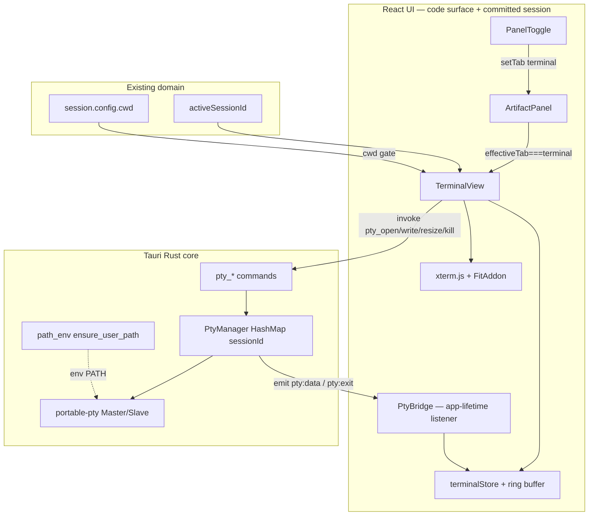

# hip 右侧面板终端（Code Surface Only）技术方案

| 字段 | 值 |
|------|-----|
| 作者 | TBD |
| 日期 | 2026-07-10 |
| 状态 | PR-1 + PR-2 已实现（UI 空壳 + Rust PTY）；PR-3+ 未实现；`CODE_TERMINAL=false` 暗发 |
| 相关代码 | `src/routes/AppLayout.tsx`, `src/components/artifact/ArtifactPanel.tsx`, `src/components/layout/PanelToggle.tsx`, `src/store/uiStore.ts`, `src/store/useFsScope.ts`, `src/ipc/dialog.ts`, `src/components/theme/ThemeProvider.tsx`, `src-tauri/src/path_env.rs`, `src-tauri/src/lib.rs`, `src-tauri/capabilities/default.json` |
| 竞品参考 | `docs/research/2026-07-05-claude-desktop.md`, `docs/research/2026-07-05-codex-desktop.md`, `docs/research/2026-07-05-competitive-feature-gap-analysis.md` |
| 前置能力 | 无 xterm / node-pty / 交互式 PTY；`tauri-plugin-shell` 仅用于 sidecar 与 `open()` URL；`src/` 内尚无 `@tauri-apps/api/event` 用法 |

---

## Overview

hip 是 Tauri 桌面 AI 工作台。Code surface 右侧已有 `ArtifactPanel`（files / agents / timeline / changes / dag），但**没有**用户可交互的本地终端。竞品（Claude Desktop Code、Codex Desktop）普遍把 terminal 放进 coding workspace；hip 文案中也已出现「use git in a terminal」类提示（`artifact.diffView.moreFiles`），用户却只能离开应用开系统终端。

本方案在 **code surface 的右侧 `ArtifactPanel` 中新增 `terminal` 标签页**，提供真正的交互式 TTY（PTY + xterm.js）。**严格限定仅 code surface 可用**；chat 的 `PreviewPanel`、settings、history **不得**出现终端入口。v1 不做 agent 自动跑命令、不做沙箱、不做多终端分屏。

**前置条件（与现有右栏一致）：** 必须有 **已 commit 的 code session**（`activeSessionId`）。`codeOpen = activeView === 'code' && activeSession?.codePanelOpen`——无 session 时不挂载 `ArtifactPanel` / `PanelToggle`，故 **v1 不支持仅 draft、无 session 的终端**。

推荐后端：**Rust 侧 `portable-pty` + Tauri commands/events**（方案 A），前端 **xterm.js + FitAddon**，cwd 锚定 **`session.config.cwd`**。后台 keep-alive 时，用 **per-session 内存 ring buffer** 保留输出并在 reattach 时 rehydrate xterm（D6a）。

---

## Background & Motivation

### 现状（代码核实）

| 能力 | 状态 | 位置 |
|------|------|------|
| 右侧栏开合 | code：`codeOpen = activeView === 'code' && activeSession?.codePanelOpen` → `ArtifactPanel`；chat：`chatOpen` → `PreviewPanel` | `AppLayout.tsx` L42–44, L115 |
| Code 面板 tab | `ArtifactTab = 'files' \| 'agents' \| 'timeline' \| 'changes' \| 'dag'`（**无 terminal**） | `uiStore.ts` L5 |
| Tab 全局性 | `activeTab` 在 `useUiStore`，**非 per-session**；`partialize` 仅 `codeSessionId` + `theme`（`activeTab` **不**持久化） | `uiStore.ts` L21–22, L130 |
| Tab 切换入口 | `PanelToggle`：code 五 tab；chat 仅 files/agents；`!activeSessionId` → `return null`；git 门控 timeline/changes | `PanelToggle.tsx` L35–52 |
| 项目目录 | 会话：`SessionConfig.cwd`；draft：`draft.cwd`（project mode，用于 NewConversation / FileTree 草稿流）；统一 scope：`useFsScope` | `session-config.ts`, `useFsScope.ts` |
| 选目录 | `pickDirectory()`（`src/ipc/dialog.ts`）+ `sessionService.setProjectDir` | `FileTree.tsx` L74–78 |
| Shell 插件 | `tauri-plugin-shell`：sidecar 执行 + `shell:allow-open`（URL/外链），**非交互 PTY** | `capabilities/default.json`, `Cargo.toml` |
| PATH 修复 | GUI 启动 PATH 过窄；`path_env::ensure_user_path()` 在进程级合并 **login-shell PATH**（探测用 `-lic`）∪ 当前 PATH ∪ common dirs | `path_env.rs` |
| 前端终端 UI | **无** `@xterm/*`、无 node-pty | `package.json` |
| Global Tauri | `withGlobalTauri: true` | `tauri.conf.json` |
| 竞品缺口 | 分屏工作台缺 terminal | `docs/research/*` |

> **PATH 注脚：** `ensure_user_path()` 已在 app 启动时把 login-shell 的 PATH 合并进 hip 进程；PTY 子进程仍继承该 process env。产品决议（D11）仍使用 **login 交互 shell（`-il`）** 以贴近 Terminal.app——rc 可能再次改 PATH（接受的重复 source 代价）；`path_env` 保证即便 rc 失败也有可用 PATH 基线。

右侧面板渲染边界：

```42:115:src/routes/AppLayout.tsx
  const codeOpen = activeView === 'code' && activeSession?.codePanelOpen === true
  const chatOpen = activeView === 'chat' && activeSession?.chatPanelOpen === true
  // ...
                  {codeOpen ? <ArtifactPanel /> : <PreviewPanel />}
```

cwd 解析（与 FileTree 同源；**终端仅在有 active session 时可达**）：

```18:22:src/store/useFsScope.ts
export function fsScopeOf(active: SessionVM | null, draft: Draft | null): FsScope {
  if (active) return { scopeId: active.id, cwd: active.config.cwd, isDraft: false, chatDraft: false }
  if (draft?.mode === 'project' && draft.cwd) return { scopeId: draft.cwd, cwd: draft.cwd, isDraft: true, chatDraft: false }
  return { scopeId: null, cwd: undefined, isDraft: false, chatDraft: draft?.mode === 'chat' }
}
```

### 痛点

| 严重度 | 问题 |
|--------|------|
| High | Code 工作流缺少「跑命令 / 看输出」闭环；用户被迫切出 hip |
| High | Agent 改完代码后，用户无法在同一 cwd 验证 `yarn test` / `cargo test` 等 |
| Med | 竞品（Claude Code / Codex）已有 integrated terminal，差距明确 |
| Med | 现有 shell 插件无法承载交互式 shell（无 stdin 回环、无 resize、无 ANSI 完整语义） |
| Low | 全局 `activeTab` 与多 session 并存时，切 session 可能停在错误 tab（既有问题，terminal 会放大） |

### 产品约束（用户给定）

1. Terminal **只在右侧面板**。
2. **仅 code surface / scene**；chat、settings、history 不可用。
3. **先技术方案审核，不实现**。

---

## Goals & Non-Goals

### Goals（v1）

1. 在 code `ArtifactPanel` 增加 **`terminal` tab**（推荐，见 D1）。
2. 真实交互式 PTY：stdin/stdout/stderr 合并流、ANSI、resize、基础 scrollback。
3. **cwd = `session.config.cwd`**（committed code session）；无 cwd 时 empty state +「选择项目文件夹」（复用 `pickDirectory` + `setProjectDir`）。
4. **硬门控**：`PanelToggle` / `ArtifactPanel` 仅在 `activeView === 'code'` 且存在 `activeSession` 时暴露 terminal；`ChatTab` 类型与 `PreviewPanel` **永不**包含 terminal。
5. 主题同步 light/dark（`ThemeProvider` 的 `document.documentElement` `dark` class / `useUiStore.theme`）。
6. 生命周期：1 PTY / session；关面板 / 切 tab **keep-alive** + **ring buffer 保留输出**（D6/D6a）；session 删除 / app 正常退出 / 显式 Restart 才 kill。
7. i18n：`en` / `zh-CN` / `zh-TW` 下 `artifact.terminal*` 文案。
8. 安全：v1 明确「用户驱动任意命令执行」风险；**不**自动执行 agent 建议命令。
9. 可暗发：模块级 feature flag（对齐 `GLOBAL_COMMAND_PALETTE`）。
10. 可增量 PR 落地（见文末 PR Plan）。

### Non-Goals（v1 明确不做）

| 项 | 原因 |
|----|------|
| Chat / settings / history 终端 | 产品硬约束 |
| **无 session 的 draft-only 终端** | 右栏今天就要求 `activeSession`；draft 终端需另改布局（见「已决：committed session」） |
| Agent 自动注入 / 执行 shell 命令 | 安全与权限模型未就绪；避免 silent RCE 路径 |
| OS 级沙箱 / seatbelt / container | 工程量大；v1 以 workspace cwd 为弱约束 |
| 多终端 tab / split terminal | 复杂度高；先 1 PTY / session |
| SSH 远程终端 | 超出本地 workbench 范围 |
| 持久化终端 scrollback / 历史到磁盘 | 隐私与存储策略未定 |
| 替换 sidecar 的非交互工具执行 | Sidecar bash tools 与交互 TTY 职责分离 |
| **Windows 正式 PTY 支持** | v1：**Unix-first**；**仍显示** terminal tab（不平台隐藏）；`pty_open` 失败 → toast（D18）；ConPTY polish 为 follow-up |
| **后台 keep-alive 角标** | v1 **无**角标 / 多 session「仍在运行」提示（D19） |
| **首次打开无沙箱信任文案** | v1 **不要** first-run modal / banner / 强制 tooltip（D20） |
| 完整 e2e 模拟真实 PTY 交互 | WebDriver 难稳定测 ANSI/焦点；见 Testing |
| 外置系统终端（Terminal.app）代替 in-panel | 违反产品约束 #1；集成弱 |

---

## Key Decisions

| # | 决策 | 选择 | 理由 |
|---|------|------|------|
| D1 | UI 位置 | **`ArtifactTab` 增加 `'terminal'`**，与 files/agents 等同级 | 符合现有 PanelToggle + ArtifactPanel 模式；不引入底部 bar |
| D2 | 后端 | **A) Tauri Rust PTY（`portable-pty`）+ events** | 低延迟、生命周期贴 app、与 PATH/`ExitRequested` 一致；不污染 sidecar |
| D3 | 前端渲染 | **`@xterm/xterm` + `@xterm/addon-fit`**（可选 web-links） | 业界默认；FitAddon 适配 resizable 右栏 |
| D4 | 门控 | **仅 `activeView === 'code'` + committed session**；`ChatTab` 不扩展 | 编译期 + 结构（`codeOpen`）双保险 |
| D5 | PTY 粒度 | **1 个 PTY / sessionId**（非 global） | 多 session cwd/环境隔离；与 `fsStore`/`diffStore` bySession 一致 |
| D6 | 面板关闭 | **关右栏 / 切 tab：keep-alive PTY**（不 kill） | 后台 `yarn dev` 不中断；仅 session 删除 / app 正常退出 / Restart 才 kill |
| D6a | Detach 输出 | **进程级 `pty:data` 订阅 + per-session 内存 ring buffer（对齐 D15 行预算），reattach 时 rehydrate xterm** | 避免「进程活着但输出全丢」；见下节 |
| D7 | 无 cwd | **不 spawn**；empty + `pickDirectory` → `setProjectDir` | 对齐 FileTree；避免落到 `$HOME` |
| D8 | cwd 变更 | **自动 kill 旧 PTY + 清 ring + 可见时 reopen**；**无确认对话框** | 产品拍板；与 `setProjectDir` 清 fs/diff 一致 |
| D9 | Feature flag | **`CODE_TERMINAL = false` 模块常量暗发** | 对齐 `GLOBAL_COMMAND_PALETTE`；不改 hipConfig |
| D10 | 安全姿态 v1 | **无沙箱；用户责任；无 agent 自动执行**；**无**强制 first-run 信任文案 | 与 Terminal.app 同级信任；产品不要额外说明（D20） |
| D11 | Shell | **Login 交互 shell：`$SHELL -il`**（平台等价）；fallback `/bin/zsh -il` → `/bin/bash -il` | 产品拍板：贴近 Terminal.app；PATH 仍继承 `path_env`；接受 rc 可能重复 source |
| D12 | `activeTab` 全局 | **v1 保持全局**；切 session 停在 terminal 且新 session 无 cwd → empty | 避免 per-session tab 大 refactor |
| D13 | 与 sidecar | **终端不经 sidecar WS** | 字节流与 agent 协议解耦 |
| D14 | allowlist | **PTY 由 Rust 直接 spawn；不扩展 `shell:allow-execute`** | 保持 shell 白名单仅 sidecar |
| D15 | Scrollback / ring | **约 5000 行**（xterm `scrollback` 与 ring 同源预算）；**仅内存、不落盘** | 调试 vs 内存 |
| D16 | 并发 PTY 软上限 | **最多 8 个活跃 PTY**；超出 `pty_open` 返回明确错误 | 防多 session keep-alive 堆积 |
| D17 | kill 钩子 | **仅在 `sessionService.deleteSession` 调 `pty_kill` 一次** | `closeSession` 已委托 `deleteSession`；避免 double-kill |
| D18 | Windows | **v1 不支持真实 PTY**；**仍显示 terminal tab**；`pty_open` 失败 → **toast**（不隐藏入口） | 产品拍板；ConPTY follow-up |
| D19 | 后台角标 | **v1 无** keep-alive / 他 session 运行中角标 | 产品拍板；软上限错误文案足够 |
| D20 | First-run trust | **v1 不要** modal / banner / 强制 tooltip 无沙箱说明 | 产品拍板 |

---

## Proposed Design

### 架构总览



### 时序：打开 terminal tab

```mermaid
sequenceDiagram
  participant U as User
  participant PT as PanelToggle
  participant UI as uiStore
  participant AP as ArtifactPanel
  participant TV as TerminalView
  participant BR as PtyBridge
  participant TS as terminalStore
  participant R as Rust PtyManager

  Note over BR: App 启动后（flag on）注册全局 listen
  U->>PT: 选择 Terminal
  PT->>UI: setTab('terminal')
  PT->>PT: setSessionCodePanelOpen(id, true)
  AP->>TV: mount (effectiveTab===terminal)
  TV->>TV: cwd = activeSession.config.cwd
  alt no cwd
    TV-->>U: empty + pickDirectory
  else has cwd
    TV->>TV: fit → cols/rows
    TV->>R: invoke('pty_open', { sessionId, cwd, cols, rows })
    R->>R: validate cwd is dir; soft cap; spawn or reuse
    R-->>TV: { reused }
    TV->>TV: attach 协议：snapshot → setAttached → rehydrate → drain tail
    R-->>BR: pty:data (持续)
    BR->>BR: 仅 append ring（永不 term.write）
    BR->>TS: terminalStore 更新
    TS->>TV: 若 attachedSessionId 匹配则唯一 path 写 xterm
    U->>TV: keystrokes
    TV->>R: pty_write
    U->>TV: resize
    TV->>R: pty_resize
  end
```

### D6a：Keep-alive 与 ring buffer（强制规格）

**问题：** D6 保持后端 PTY 存活，但若仅在 `TerminalView` mount 时 `listen`，unmount 期间 `pty:data` **无人消费**，后台 `yarn dev` 输出永久丢失；同时 dispose xterm 会丢掉 UI scrollback。

**v1 决策（D6a）——推荐且默认：**

1. **`PtyBridge`（app 生命周期，非 per-view）**  
   - 在 flag 开启且进入 app shell 后（例如 `AppLayout` 或 `sessionService.connect` 旁）注册**一次** `listen('pty:data')` / `listen('pty:exit')`。  
   - 按 `sessionId` **只**写入 `terminalStore` 的 **ring buffer**（字节或已解码字符串块列表；预算对齐 **~5000 行** 或等价字符上限，例如 2–4 MiB/session 硬顶，先到先丢最旧）。  
   - **`PtyBridge` 永不持有 / 调用 `Terminal` 实例**（不 `term.write`）。  
2. **Single writer to xterm（规范，禁止双写）**  
   - 数据流唯一：`pty:data` → Bridge → `store.appendRing(sessionId, chunk)` →（可选 notify）→ **仅当** `TerminalView` 的 `attachedSessionId === sessionId` 时，由 **View 内单一订阅** 调用 `term.write`。  
   - **禁止** Bridge 直写 xterm 与 View 再订 store **并行** 两路 `term.write`（否则双重打印）。  
   - 用户键盘走 `term.onData` → `pty_write`，与输出路径无关。  
3. **Attach 协议（原子性，防丢 chunk / 防重复）** — 在 attach 同步段内按序执行：  
   1. `const snapshot = ring.length`（或 `ringBytes` / generation token）。  
   2. `setAttached(sessionId)`（此后 live append 的订阅可开始 `term.write`；实现须保证订阅在 rehydrate 期间用 **cursor**，见下）。  
   3. `term.reset()`；rehydrate **`ring[0..snapshot)`**（只写快照前缀）。  
   4. **Drain tail：** 若此时 `ring.length > snapshot`，再 `term.write` **`ring[snapshot..]`**（attach 期间新到的块）。  
   5. 将 View 的 **write cursor** 设为 `ring.length`；之后订阅只写 `cursor..` 的新 append，写完推进 cursor。  
   - 等价实现：attach generation token，过期订阅忽略；或 rehydrate 全量 ring 后置 cursor=length（须在 setAttached 之后、且 rehydrate 期间暂停 cursor 推进，避免与 tail 重复）。  
   - **禁止**「先 rehydrate 全量 → 再 setAttached」且无 drain：中间窗口的 chunk 会只进 ring、不到 xterm。  
4. **unmount**  
   - dispose xterm；**不** kill PTY；**不**清 ring；`setAttached(null)` + 取消 View 订阅。  
5. **session delete / `pty_kill` / cwd 变更 kill**  
   - 清空该 session 的 ring + UI status。  
6. **禁止** v1 采用「detach 即丢输出、仅保留进程存活」作为默认。  
7. **测试（PR-3 必过）：** 单元测「rehydrate / attach 期间 `appendRing`」——输出到 xterm **不丢、不重复**（模拟 attach 中途 1+ 次 append）。
### UI 集成点

#### 1. `ArtifactTab` 扩展

```ts
// src/store/uiStore.ts
export type ArtifactTab = 'files' | 'agents' | 'timeline' | 'changes' | 'dag' | 'terminal'
// ChatTab 保持：'files' | 'agents'  — 禁止加 terminal
```

#### 2. `PanelToggle`（仅 code）

```ts
const codeTabs: PanelTabOption[] = [
  { value: 'files', label: t('artifact.files') },
  { value: 'agents', label: t('artifact.agents') },
  { value: 'timeline', label: t('artifact.timeline'), gated: true },
  { value: 'changes', label: t('artifact.changes'), gated: true },
  { value: 'dag', label: 'DAG' },
  ...(CODE_TERMINAL ? [{ value: 'terminal' as const, label: t('artifact.terminal') }] : []),
]
// chatTabs 不变 — 无 terminal
// 已有：if (!activeSessionId) return null
```

#### 3. `ArtifactPanel`

- `tabLabel`：`terminal` → `t('artifact.terminal')`
- 内容区：`effectiveTab === 'terminal' && <TerminalView />`
- **不**纳入 `GIT_GATED`
- Header：v1 **Restart**（`pty_kill` + 清 ring + `pty_open`）；复制选中可选
- Flag off + `activeTab === 'terminal'` → 与 `GIT_GATED` 相同模式 fallback **`files`**

#### 4. 新组件 `TerminalView`

路径：`src/components/artifact/TerminalView.tsx`（+ 测 empty/门控，不测真实 PTY）

| 职责 | 说明 |
|------|------|
| 前置 | 仅在 `ArtifactPanel` 内；依赖 `activeSessionId` |
| cwd | `useActiveSession()?.config.cwd`（或 `useFsScope` 在 session 路径下） |
| 无 cwd | empty + 按钮调用 **`pickDirectory`（`@/ipc/dialog`）→ `sessionService.setProjectDir(sessionId, dir)`**（与 `FileTree` L74–78 相同，不另造流） |
| xterm | mount 创建；unmount dispose **前端**；**不** kill 后端 PTY |
| CSS | **必须** `import '@xterm/xterm/css/xterm.css'`（Vite CSS 导入；现有 CSP `style-src 'self' 'unsafe-inline'` 足够） |
| 连接 | `pty_open`；**无** view 级 `listen('pty:data')`；live 输出 **只**经 store 订阅 → 唯一 `term.write`（见 D6a） |
| 输入 | `onData` → `pty_write`（每键一次 invoke；v1 可接受，见吞吐节） |
| 尺寸 | FitAddon + ResizeObserver；**先 measure 再 `pty_open`/`pty_resize`** |
| 主题 | 订阅 `useUiStore.theme` + `ThemeProvider` 的 `dark` class（`MutationObserver` 或 theme effect 内 `term.options.theme = …`），**禁止**仅 mount 时读一次 |
| Flag | 菜单级门控；残留 tab fallback `files` |

#### TerminalView mount 序列（实现清单）

1. 解析 `sessionId`；无 session → 不应挂载（父级保证）。  
2. 解析 `cwd`；无 → 渲染 empty + `pickDirectory`/`setProjectDir`，**stop**。  
3. 创建 container ref；`import('@xterm/xterm')` + FitAddon（可静态 import；懒加载属 PR-4 可选）。  
4. `import '@xterm/xterm/css/xterm.css'`。  
5. `new Terminal({ scrollback: 5000, … })`；`loadAddon(fit)`；`open(container)`。  
6. 应用主题（`document.documentElement.classList.contains('dark')`）。  
7. `fitAddon.fit()` → 读 `cols`/`rows`（若 0，下一帧再 fit）。  
8. `await ptyOpen(sessionId, cwd, cols, rows)`。  
9. **Attach 协议（D6a §3，顺序固定）：**  
   - `snapshot = ring.length`  
   - 订阅 store 增量（仅 `sessionId` 匹配时 `term.write`；用 **cursor**，初始暂不推进或挂起至步骤完成）  
   - `setAttached(sessionId)`  
   - rehydrate `ring[0..snapshot)`  
   - drain：`ring[snapshot..]` → `term.write`；`cursor = ring.length`  
10. （无第二路 bridge 回调写 xterm。）  
11. `term.onData(data => ptyWrite(sessionId, data))`。  
12. `ResizeObserver` debounce ~50ms → `fit` + `pty_resize`。  
13. cleanup：`setAttached(null)`；取消 store 订阅；`term.dispose()`；unobserve；**不** `pty_kill`。
#### 5. Surface / session 切换行为

| 场景 | 行为 |
|------|------|
| code → chat | 右栏 → `PreviewPanel` 或关；**PTY + ring keep-alive**；`activeTab` 可仍为 `terminal`（chat 不读） |
| chat → code | 若 `activeTab === 'terminal'` 且 flag on → 显示终端并 rehydrate |
| code → settings/history | `rightOpen` false；PTY + ring keep-alive |
| 切换 code session A→B | xterm dispose/重建或 reset；**attach B**（rehydrate B 的 ring）；**A 的 PTY 与 ring 继续运行**，直到 A 被 delete / app 退出 / 对 A Restart。**v1 不在 blur/切走 session 时 auto-kill**（见 D5/D6；受 D16 软上限约束） |
| 删除/关闭 session | **`deleteSession` 路径**单次 `pty_kill` + 清 ring/store（`closeSession` → `deleteSession`，勿双调） |
| `setProjectDir` 改 cwd | kill 旧 PTY + 清 ring；若当前 tab 是 terminal 且可见 → 自动 `pty_open` 新 cwd |
| App `ExitRequested` / window close | Rust `PtyManager::kill_all()`（与 sidecar 同钩子） |

---

### 后端设计（方案 A 详述）

#### 依赖

`src-tauri/Cargo.toml`：

```toml
portable-pty = "0.9"   # 实现时用 crates.io 当前 0.9.x；验证 Unix spawn + resize API
```

可选：`base64`；已有 `tokio` sync。

**不**扩展 `tauri-plugin-shell` 的 `allow-execute` 去跑 `/bin/zsh`。

#### 模块布局

```
src-tauri/src/
  pty.rs          # PtyManager + commands + coalesced reader
  lib.rs          # manage state + generate_handler + ExitRequested kill_all
  path_env.rs     # 已有；PTY 继承 process PATH
```

#### 状态

```rust
// 伪代码
pub struct PtySession {
    session_id: String,
    cwd: PathBuf,
    // portable-pty master + reader thread
    // child / process group id
}

pub struct PtyManager {
    sessions: Mutex<HashMap<String, PtySession>>, // key = sessionId
}
```

#### Shell spawn recipe（macOS / Linux）

```text
1. shell = env SHELL if non-empty else first existing of [/bin/zsh, /bin/bash]
2. argv  = [shell, "-il"]             # login + interactive (D11 产品决议)
   # -i: interactive；-l: login（source profile/rc，贴近 Terminal.app）
   # 若某 shell 拒收组合，平台等价：zsh/bash 均支持 -il
3. cwd   = validated absolute directory (must exist, is_dir)
4. env   = process env after ensure_user_path()
           + TERM=xterm-256color
           + COLORTERM=truecolor (optional)
           # NO hip API keys / auth.json secrets
           # 注：login rc 可能再次改 PATH；与 path_env 基线并存（接受）
5. spawn via portable-pty CommandBuilder; put child in its own process group when possible
6. On kill/kill_all: kill process group (best-effort) then drop master
```

**Windows（D18）：** UI **仍展示** terminal tab（`CODE_TERMINAL` 不按 OS 隐藏）。`pty_open` 立即 `Err("Terminal is not supported on Windows in this version")`（或 `cfg(not(unix))` 桩）；前端 **toast** `artifact.terminalView.unsupportedPlatform`。不在 v1 宣称 ConPTY 可用。

#### Commands

| Command | 参数 | 行为 |
|---------|------|------|
| `pty_open` | `{ sessionId, cwd, cols, rows }` | 校验 `cwd` 存在且为目录；若 map 大小 ≥ **8** 且 session 无已有条目 → Err soft-cap；已有且 cwd 相同且 alive → reuse + resize；cwd 不同 → kill 后重建；spawn **`$SHELL -il`**（D11） |
| `pty_write` | `{ sessionId, data: string }` | 写 master；未知 session → Err |
| `pty_resize` | `{ sessionId, cols, rows }` | `master.resize` |
| `pty_kill` | `{ sessionId }` | 杀进程组 + 移除 map；幂等 |
| `pty_list`（可选） | — | debug：active sessionIds |

`pty_open` **信任前端 sessionId** 作为 key（单用户桌面）；可选 soft check：不强制对照 sidecar 的 session 表（Rust 无 session 权威源）。cwd 存在性在 Rust 侧强制。

#### Events

| Event | Payload | 说明 |
|-------|---------|------|
| `pty:data` | `{ sessionId: string, data: string }` | **`data` = base64(raw bytes)**，避免非法 UTF-8 / 控制字符经 JSON 损坏 |
| `pty:exit` | `{ sessionId: string, code: number \| null }` | 前端 status=exited + Restart |

#### Throughput & framing（PR-2 必做）

| 项 | v1 规格 |
|----|---------|
| Read buffer | 每次从 master 读 **8–64 KiB**（建议 16 KiB） |
| Coalesce | 合并窗口 **8–16 ms** 或累计 ≥ **32 KiB** 先到先发；减少 event 洪水 |
| Emit 编码 | 合并后的 chunk → base64 → 单次 `emit("pty:data")` |
| 队列上限 | 每 session 待发队列 **≤ 64 chunks** 或 **≤ 1 MiB**；满则 **丢弃最旧** 并 **最多 log 一次** `pty queue overflow`（不刷屏） |
| Reader 阻塞 | 优先不阻塞在 WebView；overflow 时丢数据保进程存活 |
| `pty_write` | 每键 `invoke`；接受 ~1–5 ms IPC；v1 **不**批处理键盘（复杂度高） |
| Payload 上限 | 单 event base64 后建议 **≤ 256 KiB**；超大 chunk 在 coalesce 前切开 |
| 压力验收 | 手动：`yes` 数秒、大文件 `cat`、并行 build；UI 可滚动、不永久卡死；允许短暂丢中间输出若 overflow |

#### 环境变量

- 继承 `ensure_user_path()` 后的 process `PATH`（已含 login 探测结果）
- `TERM` / `COLORTERM` 如上
- **不**注入 hip secrets

#### App 退出与孤儿进程

**正常退出：** 在 `RunEvent::ExitRequested` 中，sidecar kill **旁**调用 `PtyManager::kill_all()`（`lib.rs` 现有注释已说明该钩子**不**处理 SIGKILL）。

**崩溃 / SIGKILL / 强杀：** 与 sidecar 相同——**无** `HIP_PARENT_WATCH` 等价物挂在用户 shell 上。v1 **接受**与 sidecar 对等的孤儿风险，并做：

| 措施 | 说明 |
|------|------|
| Process group | spawn 后 `setpgid`；`kill_all` / `pty_kill` 对 **整组**发信号（Unix best-effort） |
| 文档 | 产品/README：强杀 hip 可能留下后台 `yarn dev`；可用 Activity Monitor 清理 |
| QA | 手动 force-quit hip，检查是否仍有 shell/子进程；记录结果 |
| 非 v1 | Linux `PR_SET_PDEATHSIG`、macOS 更强 job 控制 — follow-up |

---

### 前端数据层

`src/store/terminalStore.ts`（内存，不 persist）：

```ts
type PtyStatus = 'idle' | 'starting' | 'running' | 'exited' | 'error'

interface SessionPtyUi {
  status: PtyStatus
  cwd?: string
  lastError?: string
  exitCode?: number | null
  /** Ring of base64 or decoded chunks; budget ~5000 lines / hard byte cap */
  ring: string[]
  ringBytes: number
  attached: boolean
}

// bySessionId + appendRing / setExit / clearSession / setAttached
// View 侧维护 write cursor（或 generation）；Bridge 只调 appendRing/setExit
```

`src/ipc/pty.ts`（对齐 `detect.ts`；**拥有** listen 注册与 unlisten 模式）：

```ts
import { invoke } from '@tauri-apps/api/core'
import { listen, type UnlistenFn } from '@tauri-apps/api/event'

export function ptyOpen(sessionId: string, cwd: string, cols: number, rows: number) {
  return invoke<{ reused: boolean }>('pty_open', { sessionId, cwd, cols, rows })
}
export function ptyWrite(sessionId: string, data: string) {
  return invoke('pty_write', { sessionId, data })
}
export function ptyResize(sessionId: string, cols: number, rows: number) {
  return invoke('pty_resize', { sessionId, cols, rows })
}
export function ptyKill(sessionId: string) {
  return invoke('pty_kill', { sessionId })
}

/** App-lifetime bridge; call once when CODE_TERMINAL enabled.
 *  ONLY mutates terminalStore (appendRing / setExit). Never receives a Terminal. */
export async function startPtyBridge(): Promise<() => void> {
  const u1 = await listen<{ sessionId: string; data: string }>('pty:data', (e) => {
    useTerminalStore.getState().appendRing(e.payload.sessionId, base64ToBytes(e.payload.data))
  })
  const u2 = await listen<{ sessionId: string; code: number | null }>('pty:exit', (e) => {
    useTerminalStore.getState().setExit(e.payload.sessionId, e.payload.code)
  })
  return () => { u1(); u2() }
}
```

**挂载策略：** `PtyBridge` 全局且 **只写 store**；`TerminalView` 负责 xterm + **唯一** `term.write` 路径（attach 协议 + store 订阅）与 `pty_open`。
### xterm 配置（建议默认）

| 项 | 值 |
|----|-----|
| CSS | `import '@xterm/xterm/css/xterm.css'` |
| `scrollback` | 5000 |
| `cursorBlink` | true |
| `fontFamily` | 系统 mono 栈 |
| `fontSize` | 12–13 |
| `theme` | light/dark 两套；随 `dark` class 更新 |
| `convertEol` | 按平台实测；macOS 通常 false |

Fit：container `h-full w-full overflow-hidden` + `data-no-drag`；ResizeObserver debounce ~50ms。

### Feature flag

```ts
// src/components/artifact/terminalFeature.ts
/** Dark-launch switch for code-surface terminal tab. */
export const CODE_TERMINAL = false
```

门控点：

1. `PanelToggle` 菜单项  
2. `ArtifactPanel` 渲染分支  
3. `activeTab === 'terminal' && !CODE_TERMINAL` → fallback `files`  
4. `PtyBridge` 仅 flag true 时启动  
5. Rust commands **始终注册**（未调用无害），简化后端测试  

### 与 session 生命周期挂钩

| 现有 API | 终端动作 |
|----------|----------|
| **`sessionService.deleteSession`** | **唯一**前端 kill 点：`pty_kill` + `terminalStore.clearSession` |
| `sessionService.closeSession` | 内部已调 `deleteSession` → **不要**再 kill 一次 |
| `sessionService.setProjectDir` | `pty_kill` + 清 ring；terminal 可见则 reopen |
| `setSurface` / `selectSession` | 不 kill；仅 attach 切换 |
| App exit | Rust `kill_all` |

```183:188:src/domain/sessionService.ts
  setProjectDir(id: string, cwd: string): void {
    useDomainStore.getState().apply({ type: 'session:cwd', sessionId: id, cwd }) // optimistic
    useFsStore.getState().clearSession(id)
    useDiffStore.getState().clearSession(id)
    this.transport.send({ type: 'session:setCwd', sessionId: id, cwd })
  }
```

在此路径追加 PTY kill/reopen 与 fs/diff clear 并列。

---

## API / Interface Changes

### 前端类型

```ts
// before
export type ArtifactTab = 'files' | 'agents' | 'timeline' | 'changes' | 'dag'
export type ChatTab = 'files' | 'agents'

// after
export type ArtifactTab = 'files' | 'agents' | 'timeline' | 'changes' | 'dag' | 'terminal'
export type ChatTab = 'files' | 'agents' // unchanged
```

### Tauri commands（新）

```ts
pty_open(args: { sessionId: string; cwd: string; cols: number; rows: number }): Promise<{ reused: boolean }>
pty_write(args: { sessionId: string; data: string }): Promise<void>
pty_resize(args: { sessionId: string; cols: number; rows: number }): Promise<void>
pty_kill(args: { sessionId: string }): Promise<void>
```

### Events（新）

```ts
// listen('pty:data')
{ sessionId: string; data: string } // base64 of raw bytes

// listen('pty:exit')
{ sessionId: string; code: number | null }
```

### Capabilities

**实现指引（与现网一致）：**

- hip 现有大量 app 自定义 command（`which_binaries`、`set_secret`、`get_hip_config`…）仅通过 `generate_handler!` 注册，`capabilities/default.json` 为 `core:default` + plugin allows（含 `shell:allow-execute` **仅** sidecar），**无** per-command app permission 列表。  
- **镜像该模式：** 先注册 `pty_*` 到 `generate_handler!`；**仅当**生产包 `invoke` 被 ACL 拒绝时再补 capability 条目。  
- **不要**发明新的 permission 体系；**不要**扩展 `shell:allow-execute` 到任意 shell 路径。  
- **验收：** 打包后 smoke：`pty_open` 不被 ACL 拒绝。

### CSP 与 withGlobalTauri

- CSP（`tauri.conf.json`）：`style-src 'self' 'unsafe-inline'` 覆盖 xterm CSS/inline；`script-src 'self'`。  
- **`withGlobalTauri: true`：** XSS 可直接触达 `window.__TAURI__` / `invoke`。v1 XSS 边界 = **CSP + 无加载远程不可信 HTML**；终端 API 不额外暴露给 web 源。保持 CSP 收紧；不在本特性放宽 `connect-src` / `script-src`。

---

## Data Model Changes

| 层 | 变更 |
|----|------|
| Protocol / sidecar WS | **无**（D13） |
| `SessionConfig` | **无**新字段；复用 `cwd` |
| `uiStore` | `ArtifactTab` 扩展；`activeTab` 默认仍 `agents` |
| `terminalStore` | **新**（status + ring）；内存，不 persist |
| 磁盘 | 无 scrollback 持久化 |
| 迁移 | 无 |

---

## Alternatives Considered

### A) Tauri Rust PTY + events（**推荐**）

| 优点 | 缺点 |
|------|------|
| 低延迟本地 IPC | 需维护 Rust PTY 代码 |
| 与 app 生命周期/`path_env`/退出钩子一致 | Windows 正式支持延后 |
| 不占用 sidecar 事件循环 | base64 + coalesce 需仔细做 |
| 安全边界清晰 | — |

### B) Sidecar（Node）拥有 PTY，经现有 WS

| 优点 | 缺点 |
|------|------|
| TS / `node-pty` | 污染 agent 热路径与协议背压 |
| — | sidecar 崩溃带走终端；native addon 打包成本 |

**拒绝 v1。**

### C) WebView + `tauri-plugin-shell` 有限执行

| 优点 | 缺点 |
|------|------|
| 零新依赖 | **无真正 TTY**；白名单不适合任意命令 |

**拒绝。**（含「spawn + stdin_write 冒充终端」——同样无 raw TTY。）

### D) 底部面板 / 独立 window

**拒绝 v1**（产品约束 #1）。

### E) 轻量自研 terminal 而非 xterm

**拒绝。**

### F) 打开系统 Terminal.app 于 cwd

| 优点 | 缺点 |
|------|------|
| 实现极简（`shell:allow-open` / `open`） | **不在右侧面板内**；违反产品约束 #1；无 in-app scrollback/主题/session 绑定 |

**拒绝**作为 v1 替代；最多未来作「在外部打开」辅助动作（非本方案范围）。

---

## Security & Privacy Considerations

### 威胁模型（v1）

| 威胁 | 严重度 | v1 缓解 | 后续 |
|------|--------|---------|------|
| 用户任意命令（本机权限） | 接受的产品风险 | code+session+cwd 门控；与 Terminal.app 同级；**无**强制 first-run 文案（D20） | 设置页说明（非 v1） |
| XSS → `pty_write` / `pty_open` | High | CSP + 无远程不可信 HTML；知悉 `withGlobalTauri: true` | 收紧 global Tauri / 权限 |
| Agent 自动执行 shell | High | **无** agent→pty 桥 | HITL |
| 前端伪造任意 `cwd` | Med | Rust：`cwd` 必须存在且为目录；单用户 confused-deputy 风险有限 | 可选对照 session 配置（需把 cwd 权威拷进 Rust） |
| 密钥进 scrollback | Med | ring 仅内存；session delete 清空；不落盘、不 log 内容 | 隐私清屏 |
| 用户 `cd` 逃逸 workspace | Med | 接受（完整 shell） | 难做可靠限制 |
| PTY 泄漏 / 僵尸 | Med | deleteSession kill + ExitRequested kill_all + process group | QA force-quit |
| 崩溃孤儿 shell | Med | **接受**（与 sidecar 无 ExitRequested 时对等）；process group 降低正常 kill 残留 | PDEATHSIG follow-up |
| 多 session 资源耗尽 | Med | **软上限 8**（D16） | 可配置 |
| 串流串台 | Med | event 带 `sessionId`；bridge 分发 | 测试 |

### 产品声明（实现侧）

- 能力事实：终端以用户本机权限运行；v1 **无**沙箱。  
- **UI（D20）：** v1 **不**展示 first-run modal / banner / 强制信任 tooltip；无需为「告知无沙箱」单独加文案流程。

### 能力面

- 不扩展 shell plugin 任意 execute  
- 不把 API keys 注入 PTY env  
- 不把 `pty:data` 内容写入 `~/.hip` 日志  

---

## Observability

| 信号 | 方式 |
|------|------|
| `pty_open` 成功/reuse/失败/soft-cap | 一行摘要（**无**用户输入内容） |
| spawn / cwd 校验失败 | `Result` 字符串 → toast |
| queue overflow | **最多 log 一次** / session |
| 活跃 PTY 数 | `pty_list` 可选 |
| 前端 | `console.error` on invoke failure；禁止 per-keystroke log |
| Metrics | v1 无 |

---

## Rollout Plan

1. PR 合入期间 `CODE_TERMINAL = false`。  
2. **内部 dogfood 从 PR-3 合入后开始**（此时才有真实 PTY+xterm；PR-1  alone 不可 dogfood）。开发者本地将 flag 临时改 `true` 或 dev 覆盖。  
3. PR-5 将 flag 置 `true` 公开。  
4. 回滚：flag → `false`；kill 路径不依赖 flag。  
5. 无 hipConfig 远程开关。

---

## i18n

三语：`src/i18n/en.ts` / `zh-CN.ts` / `zh-TW.ts`

```ts
artifact: {
  terminal: 'Terminal', // zh: 终端
  terminalView: {
    noCwd: 'No project folder',
    noCwdDesc: 'Bind a project folder before opening the terminal',
    selectFolder: 'Select Folder', // 可复用 artifact.selectFolder
    exited: 'Shell exited ({{code}})',
    exitedNull: 'Shell exited',
    restart: 'Restart',
    starting: 'Starting shell…',
    error: 'Could not start terminal',
    unsupportedPlatform: 'Terminal is not supported on this platform yet',
    softCap: 'Too many terminals open (max 8). Close a session first.',
    // v1 不需要 trustTitle/trustBody（D20：不要 first-run 信任说明）
  },
}
```

---

## Testing

### 门控矩阵（必测）

| # | 场景 | 期望 |
|---|------|------|
| G1 | `activeView=chat`，`PanelToggle` 菜单 | **无** `panel-tab-terminal`；仅 files/agents |
| G2 | `ChatTab` / `PreviewPanel` 类型与渲染 | 永不出现 `'terminal'` |
| G3 | `CODE_TERMINAL=false`，`activeTab` 强设 `'terminal'` | `ArtifactPanel` fallback **files**（同 GIT_GATED 模式） |
| G4 | `CODE_TERMINAL=true`，code + session，菜单 | 有 Terminal 项；选中后 `panel-view-terminal` |
| G5 | code→chat→code，`activeTab` 仍为 terminal | 回到 code 再显示 terminal（flag on） |
| G6 | settings/history | 无右栏 terminal UI；PTY keep-alive（生命周期单测/手动） |
| G7 | 无 `activeSessionId` | `PanelToggle` null；无 ArtifactPanel → 无终端入口 |
| G8 | 设置 tab 的代码路径 | 仅 PanelToggle（flag on）可 `setTab('terminal')` |

### 分层

| 层级 | 覆盖 |
|------|------|
| Unit — store/gating | 上表 G1–G4、G7–G8；`ArtifactTab` 含 terminal；`ChatTab` 不含 |
| Unit — `terminalStore` | ring append/evict、clearSession、status；**attach 期间 append 不丢不重**（D6a §7：snapshot/setAttached/rehydrate/drain + cursor） |
| Unit — `ipc/pty` | mock invoke/listen；bridge **只**调 store，不碰 Terminal |
| Component | `TerminalView` 无 cwd empty；mock `pickDirectory`/`setProjectDir` |
| Component | `ArtifactPanel` terminal testid + flag fallback |
| Rust | cwd 校验、reuse、kill 幂等、soft cap、coalesce 单元逻辑 |
| Integration | mock `pty:data` → ring → View 单写 rehydrate；断言无双写 |
| E2E | 可选 smoke：`panel-view-terminal` 可见；**不**强制交互键入 |
| Manual | 见下 |

### Manual QA 清单

- macOS：`ls`、颜色、`vim` 短暂、`yarn test`、resize  
- 切到 files tab 再回 terminal：**输出仍在**（ring rehydrate）  
- 后台 `yes` / 大 `cat`：UI 不永久卡死  
- 多 session：A 跑命令，切 B，回 A 仍可见 ring  
- 改 cwd：旧 shell 死、新 shell 在新目录  
- 关 session：无僵尸（`ps`）  
- 正常退出 app：无残留  
- force-quit：记录孤儿情况（已知限制）  
- flag off 回归  

**难 e2e：** ANSI、IME、SIGWINCH、Windows。

---

## Risks

| 风险 | 严重度 | 缓解 |
|------|--------|------|
| PTY 跨平台 | High | Unix-first；Windows 明确错误（D18） |
| Event 洪水卡 UI | High | coalesce + queue 丢旧（Throughput 节） |
| Detach 丢输出 | High | **D6a ring buffer**（已决，非可选） |
| 全局 `activeTab` UX | Med | empty/fallback；follow-up per-session tab |
| Keep-alive 堆积 | Med | D16 软上限 8；delete 必 kill |
| 崩溃孤儿进程 | Med | 接受 + process group；文档 |
| xterm 包体 | Low | PR-4 可选动态 import |
| 二进制 JSON 损坏 | Med | base64 |
| 拖拽抢焦点 | Low | `data-no-drag` |
| `withGlobalTauri` + XSS | Med | CSP；不放宽 |

---

## Open Questions

**产品 Open Qs（2026-07-10）已拍板**，实现不得再当成分叉。下表为权威决议。

### 已决（产品 + 工程）

| 项 | 决议 | 决策号 |
|----|------|--------|
| **Shell 启动** | **Login 交互：`$SHELL -il`**（fallback zsh/bash `-il`）。PATH 仍继承 `path_env`；接受 login rc 可能重复 source。 | D11 |
| **后台角标** | **v1 无** keep-alive / 他 session 运行中角标或提示。 | D19 |
| **改 cwd** | **自动 kill + 清 ring + 可见时 reopen**；**无**确认对话框。 | D8 |
| **Windows UI** | **显示** terminal tab；`pty_open` 失败 **toast**（不隐藏入口）。 | D18 |
| **First-run trust** | **不要**额外无沙箱 modal / banner / 强制 tooltip。 | D20 |
| **Draft-only 终端** | **v1 不做**；需 committed `activeSession`；PTY key = `sessionId`。 | D4 |
| **Detach 输出** | **D6a** ring + single-writer attach 协议。 | D6a |
| **kill 钩子** | 仅 `deleteSession` 一次。 | D17 |

### 仍开放（非阻塞；有工程默认）

| # | 问题 | v1 工程默认 | 备注 |
|---|------|-------------|------|
| Q3 | `CODE_TERMINAL` 何时默认 `true`？ | **PR-5** 独立合入；dogfood ≥ PR-3 之后 | 流程项，非功能分叉 |
| Q4 | 快捷键 `Ctrl+\`` / `Cmd+J`？ | **v1 仅菜单**；快捷键 PR-4 **可选** | 产品未强制 |
| Q7 | Header 是否显示完整 cwd？ | FileTree 式 **basename**；完整 path 可用 `title` tooltip | 像素级 polish |
| Q9 | 与 agent bash 独立性文案？ | **v1 无** subtitle | 可选后续 |
---

## References

- 布局：`src/routes/AppLayout.tsx`
- Code 面板：`src/components/artifact/ArtifactPanel.tsx`、`PanelToggle.tsx`
- Tab：`src/store/uiStore.ts`（注：源码注释仍写 “four-tab”，实际五 tab；terminal 为第六）
- cwd：`useFsScope.ts`、`session-config.ts`、`sessionService.setProjectDir`
- 选目录：`src/ipc/dialog.ts` `pickDirectory`、`FileTree.tsx`
- 主题：`src/components/theme/ThemeProvider.tsx`
- PATH：`src-tauri/src/path_env.rs`（login PATH 已进程级合并）
- 退出：`src-tauri/src/lib.rs` `ExitRequested`（sidecar kill 旁挂 `kill_all`）
- Capabilities：`src-tauri/capabilities/default.json`；`withGlobalTauri` / CSP：`tauri.conf.json`
- Flag 先例：`src/components/command-palette/feature.ts`
- IPC：`src/ipc/detect.ts`；事件封装新建于 `src/ipc/pty.ts`
- 设计文风：`docs/superpowers/specs/2026-07-10-command-palette-design.md`
- 竞品：`docs/research/2026-07-05-claude-desktop.md`
- 库：`portable-pty` **0.9.x**、`@xterm/xterm`、`@xterm/addon-fit`

---

## PR Plan

按依赖顺序；**PR-1 → PR-2 → PR-3** 串行优先。**内部 dogfood 从 PR-3 之后开始**；PR-5 公开 flag。

### PR-1: 类型门控 + feature flag + i18n + 空壳 UI

- **标题：** `feat(terminal): code-only tab shell, flag, and i18n (no PTY yet)`
- **影响文件：**
  - `src/store/uiStore.ts`（`ArtifactTab` + tests）
  - `src/components/layout/PanelToggle.tsx`（+ 门控测试 G1/G4）
  - `src/components/artifact/ArtifactPanel.tsx` / `ArtifactPanel.test.tsx`（G3 fallback）
  - `src/components/artifact/terminalFeature.ts`（`CODE_TERMINAL = false`）
  - `src/components/artifact/TerminalView.tsx`（empty + folder pick 接线可先做；无 xterm）
  - `src/i18n/en.ts` / `zh-CN.ts` / `zh-TW.ts`
- **依赖：** 无
- **变更摘要：** 扩展 `ArtifactTab`；不改 `ChatTab`；flag 门控；无 cwd empty + `pickDirectory`/`setProjectDir`；三语
- **可合并标准：** vitest 绿；G1–G4/G7 相关单测；**不可 dogfood 真实 shell**

### PR-2: Rust PTY 核心 + framing + kill_all

- **标题：** `feat(terminal): portable-pty manager, coalesced events, ExitRequested kill_all`
- **影响文件：**
  - `src-tauri/Cargo.toml`（`portable-pty` 0.9.x）
  - `src-tauri/src/pty.rs`
  - `src-tauri/src/lib.rs`（state、`generate_handler!`、`ExitRequested` → `kill_all`）
  - `capabilities/default.json` **仅当**生产 invoke 被拒时再改
  - Rust unit tests（cwd 校验、reuse、kill 幂等、soft cap、coalesce）
- **依赖：** 无强制依赖 PR-1；建议并行或紧随
- **变更摘要：**
  - Shell spawn recipe：**`$SHELL -il`**（D11 login 交互）；cwd 存在性；软上限 8
  - **Throughput：** 16 KiB read、8–16 ms coalesce、queue 上限丢旧
  - process group kill best-effort
  - Windows：命令 Err 桩；**UI 仍可出现 tab**（前端 toast，D18）
- **可合并标准：** `cargo test`；手动 invoke smoke；**压力：** `yes` / 大 `cat` 不导致进程崩溃；ExitRequested 路径有代码钩子

### PR-3: 前端 xterm + PtyBridge/ring + ipc + session hooks

- **标题：** `feat(terminal): xterm, ring-buffer bridge, pty IPC, deleteSession kill`
- **影响文件：**
  - `package.json`（`@xterm/xterm`、`@xterm/addon-fit`）
  - `src/ipc/pty.ts` + tests
  - `src/store/terminalStore.ts` + tests（ring）
  - `src/components/artifact/TerminalView.tsx`（完整 mount 序列 + **功能性 Restart**）
  - `src/routes/AppLayout.tsx` 或等价处启动 `PtyBridge`（flag on）
  - `src/domain/sessionService.ts`：**仅 `deleteSession`** + `setProjectDir` 钩子
  - sessionService tests
- **依赖：** **PR-1**、**PR-2**
- **变更摘要：**
  - xterm CSS/fit/主题订阅/resize/write
  - D6a：single-writer + attach 协议 + ring rehydrate/drain
  - 单测：attach 中途 append 不丢不重
  - 功能性 exited UI + Restart（可用、非视觉打磨）
  - **不**在此 PR 做懒加载/快捷键/主题像素级 polish
- **可合并标准：** 本地 `CODE_TERMINAL=true` dogfood：开 tab、敲命令、切 tab 回看输出仍在、resize、关 session 无僵尸；D6a 单测绿  
- **Dogfood 起点：** 本 PR 合入后

### PR-4: 体验打磨 + 门控测试补强 + 可选快捷键

- **标题：** `polish(terminal): theme tokens, gating matrix, optional hotkey/lazy import`
- **影响文件：**
  - `TerminalView` 主题/间距/exited 视觉
  - 门控矩阵测试补全（G5–G8）
  - 可选 lazy `import()` xterm
  - 可选 hotkey（仍开放 Q4；未确认则跳过）
  - **不做**后台角标（D19）、**不做** first-run trust UI（D20）
- **依赖：** PR-3
- **变更摘要：** **不再**重做 Restart 功能；仅 polish 与测试
- **可合并标准：** 主题切换可读；门控矩阵全绿

### PR-5: 公开暗发开关

- **标题：** `feat(terminal): enable CODE_TERMINAL by default`
- **影响文件：** `terminalFeature.ts` → `true`
- **依赖：** **PR-3**（建议 PR-4 + dogfood 反馈后再合）
- **变更摘要：** 一行 flag；release note：code+session only、login shell、无沙箱、Windows 上 tab 可见但 open 失败 toast
- **回滚：** `false`

---

## 实施优先级建议（给排期）

1. 产品 Open Qs 已拍板（D8/D11/D18–D20）；剩余 Q3/Q4/Q7/Q9 不阻塞开工。  
2. 合并 PR-1（低风险门控）。  
3. PR-2（含 **`-il` spawn**）+ PR-3 关键路径；**PR-3 后 dogfood**。  
4. PR-4 polish → PR-5 公开发布开关。  
