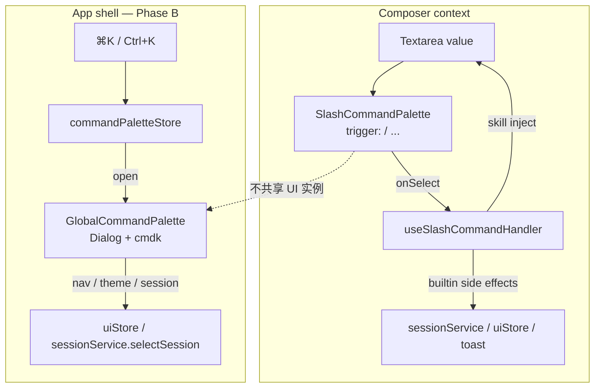
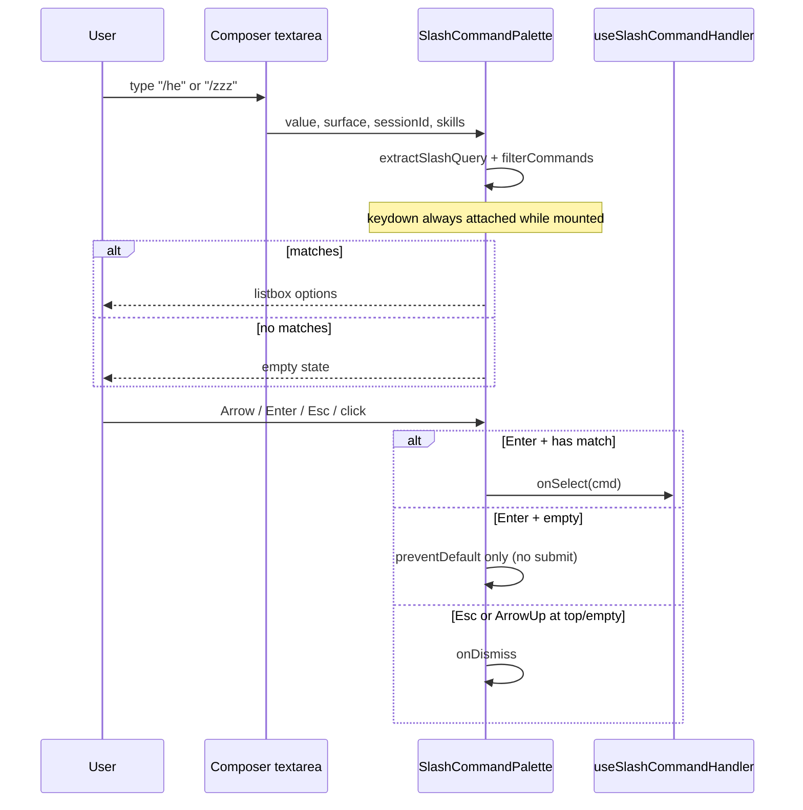
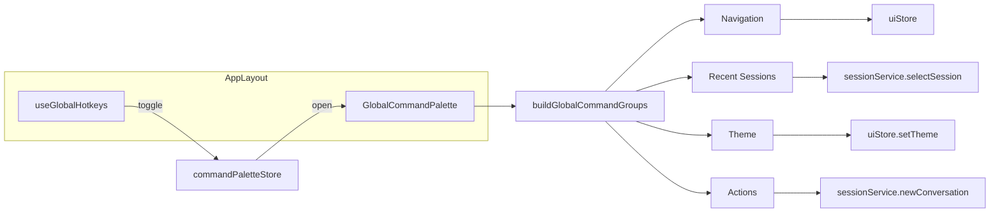

# hip 命令面板（Command Palette）产品与技术方案

| 字段 | 值 |
|------|-----|
| 作者 | TBD |
| 日期 | 2026-07-10 |
| 状态 | Phase A 已实现；Phase B 骨架+PR-5（导航/主题/动作、移除 /config）已合入；flag 关闭；会话组待 PR-6 |
| 相关代码 | `src/components/chat/SlashCommandPalette.tsx`, `useSlashCommandHandler.ts`, `InputBar.tsx`, `NewConversation.tsx` |
| 外部参考 | hermes-agent（本地路径，**非本仓库**）`apps/desktop/src/app/command-palette/` |

---

## Overview

hip 当前仅在 composer 中提供 **slash 命令面板**（用户输入 `/` 触发），用于内置会话命令与 skill 注入。它不是应用级 ⌘K 启动器，且存在若干正确性、焦点与无障碍缺陷。

本设计将产品明确拆成两层：

1. **Slash palette（上下文面板）**：绑定 composer，面向 session / skill / agent 命令——**Phase A 立即实现**。
2. **Global command palette（应用级启动器）**：⌘K 导航、设置、主题、会话切换等——**Phase B 完整设计但默认延后**，待产品优先级确认后再开工。

Phase A 以手术式修复为主：不引入 `cmdk`，保留现有自定义实现与 ~1450 行既有 slash 测试资产。Phase B 若落地，采用 `cmdk` + 已有 `@radix-ui/react-dialog`，结构参考 hermes（外部代码树）。

---

## Background & Motivation

### 现状（已在代码中核实）

| 能力 | 状态 |
|------|------|
| Slash 触发 | `extractSlashQuery`：`/(?:^|\s)\/(\S*)$/` — 行首或空白后的 `/`（比文件头注释略宽） |
| 内置命令 | `help` / `clear` / `config` / `diff`(code) / `compact`(code+session) / `init`(code) |
| Skills | `useSkillsStore`；**consumer**（`InputBar` / `NewConversation`）过滤 `userInvocable !== false` 后再传入 palette；`buildCommandList` 本身不过滤 |
| 挂载点 | `InputBar.tsx`、`NewConversation.tsx`；外层 `query !== null && <SlashCommandPalette />` |
| 执行 | `useSlashCommandHandler`：builtin 副作用 或 `applyCommand` 注入文本 |
| 全局 ⌘K | **不存在**（`src/` 内无全局 keybind；`src-tauri/` 无 ⌘K accelerator） |
| 依赖 | 有 `@radix-ui/react-dialog`、`Modal.tsx`、`sonner`（`main.tsx` Toaster）；**无** `cmdk` |

核心实现：

```8:26:src/components/chat/SlashCommandPalette.tsx
export interface SlashCommand {
  id: string
  name: string
  description: string
  kind: 'builtin' | 'skill' | 'mcp-prompt'
  availableIn: ('chat' | 'code')[]
  requiresSession?: boolean
  onSelect?: () => void
}

export const BUILTIN_COMMANDS: SlashCommand[] = [
  { id: 'help', name: 'help', description: 'Show available commands', kind: 'builtin', availableIn: ['chat', 'code'] },
  // ...
]
```

过滤与键盘（当前行为）：

- `filterCommands`：`startsWith`(0) > `includes`(1) > description includes(2)
- `document` capture-phase `keydown`：ArrowUp/Down、Enter、Escape
- **仅当 `filtered.length > 0` 时注册 listener**（`if (filtered.length === 0) return`）
- ArrowUp 在第一项时调用 `onDismiss`
- `filtered.length === 0` 时 `return null`（无 empty state）
- `activeIndex` 仅在 `query` 变化时重置为 0
- Enter 使用 `if (filtered[activeIndex]) onSelect(...)` — **OOB 时静默 no-op**，不会调用 `undefined`

### 痛点（按严重度）

| 严重度 | 问题 | 位置 / 失败模式 |
|--------|------|----------------|
| High | `activeIndex` 在 filtered 收缩时可 OOB；**Enter 变成静默 no-op**（不选中、用户困惑） | `SlashCommandPalette.tsx`；guard 存在故非 crash |
| High | 无匹配时 **keydown 未挂载**；`/zzz` + Enter 落到 Composer → **提交 slash 垃圾文本** | keydown effect early-return + Composer Enter→submit |
| High | `/help` 在 `sessionId == null`（生产路径：`NewConversation`，见 `AppLayout`）静默失败 | `useSlashCommandHandler.ts` L83–99 |
| Med | `key={cmd.id}` 跨 kind 可碰撞（builtin id 与 skill id） | L166 |
| Med | 选项是 `<button>`，mousedown 默认抢焦点，textarea 失焦 | L165–170 |
| Med | 无 empty state；用户不知「无匹配」与「面板关闭」的区别 | L156 |
| Med | 无 `scrollIntoView`，长列表键盘导航时活动项不可见 | — |
| Low | a11y：`listbox`/`option`/`aria-selected` 有；**焦点在 textarea**，无 combobox 接线；listbox 上挂 `aria-activedescendant` 对 SR **几乎无用** | L159–169 |
| Product | 无全局命令启动器；导航依赖侧栏点击 | — |

### 测试资产

- `SlashCommandPalette.logic.test.tsx`（~557 行）
- `useSlashCommandHandler.test.tsx`（~261 行）
- `InputBar.slash.test.tsx`（~635 行）
- 既有断言：`sessionId == null` 时 help **不** `appendMessage`——修复时需**改写该期望**（仍不 append，但断言 toast）。
- E2E：`e2e/page-objects/ChatPage.ts` 使用 `slash-cmd-${name}`；Phase A **保留**该 testid 约定以免破坏 e2e。

### 参考：hermes-agent（外部）

路径（本机参考树，**不在 hip 仓库内**）：
`/Users/lijiamin/data/code-repository/github/hermes-agent/apps/desktop/src/app/command-palette/`

- 全局 Dialog + `cmdk`（`shouldFilter={false}`，自研 `rankGroups`）
- 嵌套 page（theme / pets 等）
- store：`$commandPaletteOpen` / `$commandPalettePage`（nanostores）
- 触发：Cmd+K / Cmd+P

hip Phase B 借鉴其**结构**（store + groups + nested page + 自研 ranking），不必一次搬完整功能集。

---

## Goals & Non-Goals

### Goals

**Phase A（必须交付）**

1. 修复 `activeIndex` 越界导致的 Enter 静默 no-op（按下方**单一算法**）。
2. 无匹配时显示 empty state（面板仍打开），且 **keydown 始终挂载**（见 D13 / A.3）。
3. Empty + Enter：**必须** `preventDefault` + `stopImmediatePropagation`，**不得**触发 Composer submit / `sendMessage`。
4. `/help` 在无 session 时 toast 可见反馈（内容策略见 D14）。
5. 稳定 React key：`kind:id`。
6. 选项 `onMouseDown` preventDefault，保持 composer 焦点。
7. 活动项 `scrollIntoView({ block: 'nearest' })`。
8. **键盘 + DOM 语义** a11y：稳定 option `id`、`aria-selected`、listbox `aria-label`（**不**把 SR 完整 combobox 列为 Phase A 交付）。
9. 测试覆盖上述行为；全量既有 slash 测试保持绿（允许按新行为更新断言）。

**Phase B（设计完整，默认延后）**

1. 全局 ⌘K / Ctrl+K 命令面板（导航、主题、会话、设置入口）。
2. 与 slash palette **职责隔离**，不合并为单一组件。
3. 模块级常量开关（非 hipConfig schema）。

### Non-Goals

| 项 | 原因 |
|----|------|
| 消息全文 / 模糊搜索会话内容 | 需要检索索引与不同 UX |
| MCP prompts（`kind: 'mcp-prompt'`）v1 实现 | 类型预留，协议/数据源未就绪 |
| Phase A 引入 `cmdk` | 自定义实现足够小 |
| Phase A 升级为完整 fuzzy 排序 | 命令规模小；三级匹配够用 |
| 统一 slash + global 为同一 UI 实例 | 触发上下文不同 |
| 自定义全局快捷键编辑器 | Phase B 硬编码 ⌘K |
| 服务端命令注册协议 | 前端硬编码 + skills store |
| **builtin / skill 的 description 全文 i18n** | Phase A 仅 i18n 面板 chrome（empty / listLabel / helpTitle）；`BUILTIN_COMMANDS` 描述保持英文硬编码（与当前 UI 一致） |
| **Phase A 屏幕阅读器完整 combobox** | 需把 `aria-activedescendant` / `aria-controls` / `aria-expanded` 接到**聚焦的 textarea**，并改 Composer 接线；另立 follow-up |
| **listbox 上装饰性 `aria-activedescendant` 作为 SR 目标** | 焦点不在 listbox 时对常见 AT 无效；可选 DOM 属性，非验收项 |

---

## Key Decisions

| # | 决策 | 选择 | 理由 |
|---|------|------|------|
| D1 | 交付范围 | **Phase A 立即；Phase B 延后但规格完整** | 正确性非谈判；全局启动器可独立排期 |
| D2 | Phase A 依赖 | **保留自定义 palette，不引入 cmdk** | ~190 行 + 成熟测试 |
| D3 | Phase B 依赖 | **cmdk + `@radix-ui/react-dialog` 薄封装** | 已有 Dialog；排序自研 |
| D4 | `activeIndex` | **单一算法：query 重置 0 + 派生 `safeIndex` + filtered 变化 clamp；Enter/高亮用 `safeIndex`** | 见 A.2；禁止多套可选 recipe |
| D5 | Empty state UI | **query 有效且 filtered 空时仍渲染面板** | 区分未触发 / 无匹配 |
| D6 | `/help` 无 session | **`toast.message`；有 session 仍 `appendMessage`** | 生产路径 `NewConversation` 无消息流；已有 sonner |
| D7 | React key | **`${cmd.kind}:${cmd.id}`** | 跨 kind 稳定 |
| D8 | a11y 目标 | **Phase A = 键盘可用 + DOM 语义（option id / aria-selected / listbox aria-label）；不交付 SR combobox** | 焦点在 textarea；listbox-only `aria-activedescendant` **非**验收项 |
| D9 | Ranking | **保持三级匹配** | 列表短 |
| D10 | 产品拆分 | **Slash ≠ Global** | 触发与数据源不同 |
| D11 | 焦点 | **mousedown preventDefault + 既有 `focusInput()`** | 修 click 抢焦点 |
| D12 | Phase B 注册 | **静态 `buildGlobalCommandGroups(ctx)` + Zustand** | 与 hip store 风格一致 |
| D13 | Empty + Enter | **capture keydown 在 empty 时也挂载；Enter 只拦不选、不 submit** | 修 `/zzz` 提交脚枪；见 A.3 |
| D14 | Toast help 内容 | **仅 `/${name}` 行；最多 12 条 +「+K more」；不含 description** | toast 底部空间有限；session 路径仍可用完整 `name — description` |
| D15 | data-testid | **保留 `slash-cmd-${name}`**（E2E 依赖） | Phase A 不改 e2e 选择器；React key 用 kind:id 防碰撞即可 |
| D16 | Phase B 会话 | **`useSessions()` → 按 `updatedAtMs` desc 取前 10；`run` → `sessionService.selectSession(id)`** | `SessionVM` 是域模型；`selectSession` 已处理 view / open tab / lazy load |
| D17 | Phase B flag | **模块常量 `GLOBAL_COMMAND_PALETTE = false`** | 不发明 hipConfig 字段 |
| D18 | ⌘K 与 slash 并存 | **打开 global 时 dismiss slash（清 query 前缀）** | 避免双浮层 + 焦点陷阱冲突 |
| D19 | Path-like 文本 | **`extractSlashQuery` 仅匹配 `/(?:^|\s)\/([^\s/]*)$`**（token 内不得再含 `/`） | Empty Enter 拦截后，`check /tmp/file` 等路径不应误开 palette；保留 `/tmp` 单段仍为 slash query |

---

## Proposed Design

### 产品拆分



**边界规则：**

- Slash 不出现「切换 Theme」类 app 导航（`/config` 是历史例外，保留）。
- Global 不注入 skill 文本到 composer。
- 可共享纯过滤 util，但组件与 store 分离；Phase A **不**抽取。

---

## Phase A — Slash palette 正确性与打磨

### A.1 架构（保持现状，小改）



### A.2 `activeIndex` — **规定算法（唯一实现）**

**问题：** 仅 `useEffect(() => setActiveIndex(0), [query])` 不够。skills 异步到达、surface 切换等使 `filtered` 变短时，`activeIndex` 可 ≥ `length`。当前 Enter 有 `if (filtered[activeIndex])`，故是**静默 no-op**，不是选中 `undefined`。

**规定实现（必须全部采用，非可选菜单）：**

```tsx
const [activeIndex, setActiveIndex] = useState(0)

// 1) 用户改 query：重置到第一项（保留现有 UX）
useEffect(() => {
  setActiveIndex(0)
}, [query])

// 2) filtered 列表收缩/变化：clamp 状态（filtered 已 useMemo，依赖数组引用稳定）
useEffect(() => {
  setActiveIndex((i) =>
    filtered.length === 0 ? 0 : Math.min(i, filtered.length - 1),
  )
}, [filtered])

// 3) 派生安全下标：渲染高亮、Enter、ArrowUp 边界一律用它
const safeIndex =
  filtered.length === 0 ? 0 : Math.min(activeIndex, filtered.length - 1)

// 4) keydown（见 A.3：empty 也注册）
// ArrowDown: setActiveIndex(i => Math.min(i + 1, filtered.length - 1))  // length 0 时 min(_, -1) 需特殊：length===0 则 no-op
// ArrowUp:   if (filtered.length === 0 || safeIndex <= 0) onDismiss?.()
//            else setActiveIndex(i => i - 1)
// Enter:     preventDefault + stopImmediatePropagation;
//            if (filtered[safeIndex]) onSelect(filtered[safeIndex])
// Escape:    onDismiss?.()
```

**约束：**

| 规则 | 说明 |
|------|------|
| 禁止 | 再引入第三套「可选 ref」作为实现要求 |
| 允许 | 测试用 ref 只读同步 `safeIndex`（非必须） |
| effect 依赖 | `[filtered]` OK（`useMemo` 产出）；勿用每次 render 新数组 |
| query vs clamp | query effect 置 0；clamp effect 在 length 变短时收敛；二者可同 tick，最终 `safeIndex` 仍正确 |
| ArrowDown 空列表 | `filtered.length === 0` 时 no-op（不要 `Math.min(i+1, -1)`） |

### A.3 Empty state + **键盘契约（关键）**

**根因：** 今日两处 early-exit 耦合：

```ts
useEffect(() => {
  if (filtered.length === 0) return  // 不注册 listener
  ...
}, [...])
if (query === null || filtered.length === 0) return null
```

仅改 UI 而不改 listener → 用户看到「无匹配」仍可 Enter 提交 `/zzz`（比今天更糟）。

**规定：**

1. **卸载条件仅** `query === null`（组件因外层 `query !== null` 挂载时，内部也可 `if (query === null) return null` 作防御）。
2. **`filtered.length === 0` 仍渲染** empty 容器（`data-testid="slash-palette-empty"`）。
3. **keydown effect：删除 `if (filtered.length === 0) return`。** 组件挂载期间始终 `document.addEventListener('keydown', handler, true)`。
4. Empty 分支键位：

| 键 | 行为 |
|----|------|
| Escape | `preventDefault` + `stopImmediatePropagation` → `onDismiss` |
| ArrowUp | 同上 → `onDismiss`（与「第一项再上」一致） |
| ArrowDown | `preventDefault` + stop；**no-op**（不改 index） |
| Enter（无 shift） | `preventDefault` + `stopImmediatePropagation`；**不** `onSelect`；**不**落到 Composer submit |

5. 有匹配时键位保持现状（Down/Up 导航、Enter 选 `filtered[safeIndex]`、Esc dismiss）。

**UI 草图：**

```tsx
// 外层 InputBar / NewConversation 保持：
// {query !== null && <SlashCommandPalette ... />}

// 内部：
if (query === null) return null

return (
  <div
    role="listbox"
    aria-label={t('chat.slash.listLabel')}
    data-testid="slash-palette"
    className="absolute bottom-full ... max-h-48 overflow-y-auto z-50"
  >
    {filtered.length === 0 ? (
      <div
        data-testid="slash-palette-empty"
        className="px-3 py-4 text-center text-meta text-ink-secondary"
        role="presentation"
      >
        {t('chat.slash.noMatch')}
      </div>
    ) : (
      filtered.map((cmd, i) => (/* options */))
    )}
  </div>
)
```

`SlashCommandPalette` 使用 `useTranslation()` 读取 chrome 文案（与项目其它组件一致）。

### A.4 `/help` 无 session

**生产事实：** `AppLayout` 在 `activeSessionId == null` 时挂载 `NewConversation`；null-session `/help` 是主路径，不是边角。

**i18n 接线：** 在 `useSlashCommandHandler` 内调用 `useTranslation()`（hook 允许），**不要**假定全局 `t` 已注入。测试中沿用 react-i18next mock 或让 `t` 回传 key。

**内容策略（锁定 D14）：**

```ts
import { toast } from 'sonner'
import { useTranslation } from 'react-i18next'

const HELP_TOAST_MAX = 12

function formatHelpToastBody(commands: SlashCommand[]): string {
  const names = commands.map((c) => `/${c.name}`)
  if (names.length <= HELP_TOAST_MAX) return names.join('\n')
  const head = names.slice(0, HELP_TOAST_MAX)
  const rest = names.length - HELP_TOAST_MAX
  return [...head, `+${rest} more`].join('\n')
}

function formatHelpMessageBody(commands: SlashCommand[]): string {
  // session 路径：保持现有完整列表（name — description），便于读 transcript
  const lines = ['Available commands:']
  for (const c of commands) {
    lines.push(`/${c.name} — ${c.description}`)
  }
  return lines.join('\n')
}

// 在 handleCommandSelect 内：
if (cmd.id === 'help') {
  if (sessionId) {
    useDomainStore.getState().appendMessage(sessionId, {
      id: nanoid(),
      role: 'assistant',
      content: formatHelpMessageBody(availableCommands),
      timestamp: Date.now(),
    })
  } else {
    toast.message(t('chat.slash.helpTitle'), {
      description: formatHelpToastBody(availableCommands),
    })
  }
  setText('')
  focusInput()
  return
}
```

说明：

- Toast **仅 name**、**最多 12 行** + `+K more`。
- `appendMessage` 路径保持完整 `name — description`（含英文 builtin 描述 — Phase A 不 i18n 命令描述）。
- 备选 banner / 临时 session：**拒绝**（见 Alternatives）。

**测试：**

```ts
// useSlashCommandHandler.test.tsx
const toastMessage = vi.fn()
vi.mock('sonner', () => ({
  toast: { message: (...a: unknown[]) => toastMessage(...a) },
  Toaster: () => null,
}))
```

- 保留：null session **不** `appendMessage`。
- 新增：`toast.message` 被调用；description **不含** ` — ` 描述片段（仅 `/${name}`）。
- `NewConversation` 集成：真实路由下 `activeId == null`（**不要** mock 成 `'s1'` 测 toast 路径）。

### A.5 Key 与 testid

```tsx
key={`${cmd.kind}:${cmd.id}`}
id={`slash-opt-${cmd.kind}-${cmd.id}`} // DOM 稳定 id；供未来 combobox 接线
data-testid={`slash-cmd-${cmd.name}`}  // 保留，兼容 e2e/page-objects/ChatPage.ts
```

**同名 skill/builtin：** Phase A 不过滤；React key 用 kind 区分。testid 同名时 e2e/`getByTestId` 可能歧义——**接受**（当前 fixture 无冲突）；若未来冲突，另开 e2e 修订（非 Phase A）。

### A.6 焦点与滚动

```tsx
<button
  type="button"
  onMouseDown={(e) => e.preventDefault()}
  onClick={() => onSelect(cmd)}
  ref={i === safeIndex ? activeRef : undefined}
  ...
/>

useEffect(() => {
  if (filtered.length === 0) return
  activeRef.current?.scrollIntoView({ block: 'nearest' })
}, [safeIndex, filtered])
```

测试：`vi.spyOn(Element.prototype, 'scrollIntoView')`（happy-dom 需 mock）。

### A.7 a11y（Phase A — 诚实范围）

**Phase A 交付（键盘 + DOM 语义）：**

| 项 | 要求 | 验收 |
|----|------|------|
| 键盘合同 | A.2 + A.3 全键位 | 单测 + 集成「Enter 不 submit」 |
| `role="listbox"` / `option` | 保留 | DOM |
| `aria-selected` | 活动项 true | 既有测 |
| 稳定 option `id` | `slash-opt-${kind}-${id}` | DOM |
| listbox `aria-label` | `t('chat.slash.listLabel')` | DOM |

**Phase A 明确非目标 / 不验收：**

| 项 | 原因 |
|----|------|
| listbox 上的 `aria-activedescendant` | 焦点在 textarea；对常见 SR **无效**；若实现仅为装饰，不写进 Goal/Test 必过项 |
| textarea `role="combobox"` + `aria-controls` + `aria-expanded` + 焦点元素上的 `aria-activedescendant` | 需 Composer/InputBar 接线（约数行 props 透传），另立 a11y follow-up |
| 完整 AT 阅读体验 | 超出手术式修复 |

**Follow-up（Open Question，非 Phase A PR）：** 若要做最小 SR 收益，向 `Composer` 透传：

```ts
// 可选未来 API — 本期不实现
aria-expanded={query !== null}
aria-controls="slash-palette"  // listbox id
aria-activedescendant={activeOptionId}
```

### A.8 Ranking

**不变：** startsWith → includes → description includes → drop；再 `name.localeCompare`。

### A.9 国际化

**PR-1 一次性写入**全部 Phase A chrome key（避免 PR-1/PR-2 双改 i18n 冲突）：

```ts
// chat.slash — en / zh-CN / zh-TW 三端同步
slash: {
  listLabel: 'Commands',      // zh: 命令
  noMatch: 'No matching commands', // zh: 无匹配命令
  helpTitle: 'Available commands', // zh: 可用命令
}
```

`translation-keys.test.ts` 强制三语 key 对齐。

**不在 Phase A：** 翻译 `BUILTIN_COMMANDS[].description` 或 skill 描述（toast/help 列表中的英文描述在 session 路径仍原样出现）。

### A.10 文件改动清单（Phase A）

| 文件 | 变更 |
|------|------|
| `src/components/chat/SlashCommandPalette.tsx` | empty UI；**始终挂 keydown**；safeIndex 算法；key；mousedown；scrollIntoView；listbox aria-label |
| `src/components/chat/useSlashCommandHandler.ts` | help 无 session → toast；`useTranslation`；formatHelp* helpers |
| `src/components/chat/SlashCommandPalette.logic.test.tsx` | empty 键位、clamp、scroll mock |
| `src/components/chat/useSlashCommandHandler.test.tsx` | `vi.mock('sonner')`；toast 内容断言 |
| `src/components/chat/InputBar.slash.test.tsx` | empty + Enter **不** sendMessage |
| `src/components/chat/NewConversation.test.tsx` | null session help → toast（勿 mock session id） |
| `src/i18n/{en,zh-CN,zh-TW}.ts` | **PR-1 写齐** `chat.slash.*` |

**不改：** sidecar、protocol、`SkillArgInput`、`buildCommandList` 过滤语义、Composer a11y 接线、e2e testid 约定。

---

## Phase B — 全局 Command Palette（Deferred）

> **状态：规格完整，默认不进入当前实现排期。**

### B.1 产品定位

| | Slash palette | Global command palette |
|--|---------------|------------------------|
| 触发 | 输入 `/` | ⌘K / Ctrl+K（⌘P 见 Open Questions） |
| UI | composer 上方 popover | 居中 Dialog |
| 搜索框 | textarea 后缀 | 独立 `Command.Input` |
| 内容 | builtin + skills | 导航 / 会话 / 主题 / actions |
| 生命周期 | 随 query | `commandPaletteStore.open` |

### B.2 架构



### B.3 Store

`src/store/commandPaletteStore.ts`（Zustand，**不** persist）：

```ts
interface CommandPaletteState {
  open: boolean
  page: string | null // v1 可恒为 null
  setOpen: (open: boolean) => void
  toggle: () => void
  openPage: (page: string) => void
  close: () => void
}
```

挂载：`AppLayout` 渲染 `<GlobalCommandPalette />` + `useGlobalHotkeys()`。

### B.4 快捷键与冲突

**已核实：** hip `src/` 无其它全局 ⌘K；`src-tauri` 无冲突 accelerator。

```ts
// useGlobalHotkeys.ts
useEffect(() => {
  const onKey = (e: KeyboardEvent) => {
    const mod = e.metaKey || e.ctrlKey
    if (!mod || e.key.toLowerCase() !== 'k') return
    e.preventDefault()
    const store = useCommandPaletteStore.getState()
    const next = !store.open
    if (next) {
      // D18：打开 global 时收起 slash（若 composer 处于 slash 查询）
      dismissActiveSlashIfAny() // 实现：对当前 focused composer 清 query，或通过小型 callback/store 信号
    }
    store.setOpen(next) // toggle
  }
  window.addEventListener('keydown', onKey)
  return () => window.removeEventListener('keydown', onKey)
}, [])
```

| 场景 | 策略 |
|------|------|
| slash 打开 + ⌘K | **先 dismiss slash**（清 `/…` 前缀或整段 slash token），再开 global |
| global 已开 + ⌘K | toggle 关闭（VS Code 风格） |
| 其它 Modal 打开 | Radix trap 内仍可 toggle；可接受 |
| Ctrl+K 与「删至行尾」肌肉记忆 | 产品注记：chat composer 场景优先命令面板；**不**做 readline 仿真 |
| 浏览器地址栏 ⌘K | Tauri 窗口焦点内可拦截；失焦不处理 |

`dismissActiveSlashIfAny` 最小实现选项（择一，PR-4 定稿）：

- **推荐：** global 打开时不碰 draft；Dialog 焦点陷阱使 slash keydown 无效——但 slash UI 仍可见。**更推荐 D18 严格版：** 在 `setOpen(true)` 前 `useDraftStore`/InputBar 本地 state 若 `extractSlashQuery != null` 则调用与 `handleDismiss` 相同的清 token 逻辑。跨 InputBar 本地 state 时，可用 `commandPaletteStore` 的 `open` 订阅：InputBar/NewConversation `useEffect` 在 `open===true` 时若 query 非 null 则 dismiss。

### B.5 命令分组（v1）

```ts
import type { SessionVM } from '@/domain'
import type { ActiveView, Theme } from '@/store/uiStore'

type GlobalCommand = {
  id: string
  label: string
  keywords?: string[]
  group: 'navigation' | 'sessions' | 'theme' | 'actions'
  run: () => void
}

type GlobalCommandContext = {
  /** 全量会话；由调用方 useSessions() 传入 */
  sessions: SessionVM[]
  activeView: ActiveView
  theme: Theme
}

const RECENT_SESSION_LIMIT = 10

function buildGlobalCommandGroups(ctx: GlobalCommandContext): {
  heading: string
  items: GlobalCommand[]
}[] {
  const recent = [...ctx.sessions]
    .sort((a, b) => b.updatedAtMs - a.updatedAtMs)
    .slice(0, RECENT_SESSION_LIMIT)

  // sessions 组：
  // run: () => sessionService.selectSession(s.id)
  // label: s.title || s.id
  // 不使用 openSessionIds（那是 tab 顺序，非 recency）
  ...
}
```

| Group | 示例 | 挂钩 |
|-------|------|------|
| Navigation | 办公 / 编码 / 设置 / 历史 | `uiStore.setActiveView` |
| Actions | 新建对话 | `sessionService.newConversation` |
| Theme | Light / Dark / System | `uiStore.setTheme` |
| Sessions | 最近 10 条 | **`sessionService.selectSession(id)`**（内部已 `setActiveView(surfaceOf(config))`、`addOpenSession`、lazy `session:load`） |

**v1 不做：** nested marketplace、skill 列表、模型切换、插件管理。

### B.6 UI 结构

```
src/components/command-palette/
  GlobalCommandPalette.tsx
  buildGlobalCommands.ts
  rankGlobalCommands.ts
  useGlobalHotkeys.ts
  GlobalCommandPalette.test.tsx
  feature.ts                 // export const GLOBAL_COMMAND_PALETTE = false
```

样式：hip tokens；`max-w-lg`；`max-h-[min(420px,70vh)]`。Spotlight 式 header（搜索框），**不**复用 `Modal` 重型标题栏。

### B.7 Ranking

`cmdk` `shouldFilter={false}`；自研 AND + exact/prefix/word/substring/keyword 分；组按最高分排序。

### B.8 共享

Phase A **不**抽公共模块。Phase B 若与 slash 重复过滤逻辑再抽 `src/lib/commandFilter.ts`。

### B.9 Feature flag

```ts
// src/components/command-palette/feature.ts
/** Dark-launch switch. No hipConfig schema. Flip when product enables. */
export const GLOBAL_COMMAND_PALETTE = false
```

`AppLayout`：`GLOBAL_COMMAND_PALETTE && <GlobalCommandPalette />` + hotkeys 同门闩。

---

## API / Interface Changes

### Phase A

`SlashCommand` / `SlashCommandPaletteProps` **形状不变**。

| 行为 | Before | After |
|------|--------|-------|
| 无匹配 UI | `return null` | empty state |
| 无匹配 keydown | **不注册** → Enter 可 submit | **始终注册** → Enter 拦截不 submit |
| OOB Enter | 静默 no-op | clamp 后可选中末项或合法项 |
| help + null session | 静默 clear | toast（names only, cap 12） |
| option key | `cmd.id` | `` `${kind}:${id}` `` |
| mousedown | 抢焦点 | preventDefault |

### Phase B（新）

```ts
export const useCommandPaletteStore: ...
export function buildGlobalCommandGroups(ctx: GlobalCommandContext): PaletteGroup[]
export function rankGroups(groups: PaletteGroup[], query: string): PaletteGroup[]
export const GLOBAL_COMMAND_PALETTE: boolean
// sessions: SessionVM[]; open via sessionService.selectSession
```

无 protocol / sidecar 变更。

---

## Data Model Changes

无持久化 schema。Phase B 仅内存 store。

---

## Alternatives Considered

### Alt 1：Phase A 引入 cmdk 重写 slash

拒绝：重写成本与 textarea 模型摩擦大。

### Alt 2：仅 Phase B，忽略 slash 缺陷

拒绝：每日路径 bug 优先。

### Alt 3：合并 slash + global registry UI

拒绝：上下文污染。

### Alt 4：help 无 session 时创建临时 session

拒绝：污染会话列表与后端。

### Alt 5：Phase A 完整 combobox（textarea role）

延后：Composer 回归面大；见 A.7 follow-up。

### Alt 6：Empty / help 用「内联 palette 页脚」代替 empty 容器或 toast

- **做法 A：** 无匹配时仍 `return null`，仅在 Composer 旁显示一行 hint——键盘仍需 listener，且 discoverability 差。
- **做法 B：** 选中 `/help` 时在 palette 内展开 footer 列表，不 toast。
- **优点：** 不依赖 sonner 布局。
- **缺点：** help 在选中后应关闭 palette（现有 clear input 语义）；footer 与「选中即执行」模型冲突；empty 仍必须挂 keydown。
- **结论：** Empty 用面板内 empty state（A.3）；help 无 session 用 toast（D6）。**拒绝**用 footer 替代 toast 作为默认。

---

## Security & Privacy Considerations

| 风险 | 严重度 | 缓解 |
|------|--------|------|
| Slash 展示 skill 名/描述 | Low | 仅本地 store |
| Global 展示会话标题 | Low | 已在 History 暴露 |
| clear / init / compact 等副作用 | Med | 不扩大权限；`requiresSession` 保留 |
| toast 过长 | Low | **D14 已 cap** |
| 空匹配 Enter 误提交用户输入 | Med（UX / 数据） | **D13：必须拦截**（非传统安全边界，但是用户数据误发送） |
| Phase B 快捷键 | Low | 仅窗口内监听 |

无认证 / API key 变更。

---

## Observability

本地 UI；无 analytics。E2E 可扩 empty / help toast（`ChatPage.slashPalette`）。避免新增 debug `console.log`。

---

## Rollout Plan

### Phase A

1. PR 顺序：**PR-1 → PR-2 →（可选）PR-3**（**不**并行改 i18n）。
2. 无 feature flag。
3. 回归：`yarn test`；手动 chat/code、NewConversation `/help`、`/zzz`+Enter 不发送、长列表滚动、点击不丢焦点。
4. 回滚：`git revert`。

### Phase B

1. `GLOBAL_COMMAND_PALETTE = false` 合入；产品开启时改 `true`。
2. 回滚：关常量或 revert。

---

## Risks

| 风险 | 严重度 | 缓解 |
|------|--------|------|
| empty UI 无 keydown → **Enter 提交 slash 文本** | **High** | A.3 强制始终挂 listener；集成测禁止 sendMessage |
| help 测试期望变更导致 CI 红 | Low | PR-2 同步改断言 + `vi.mock('sonner')` |
| toast 多行难读 | Med | D14 names-only + cap 12 |
| capture keydown vs Composer Enter | Med | `stopImmediatePropagation`；集成测 |
| i18n 三语不同步 | Low | PR-1 一次写入；`translation-keys.test.ts` |
| Phase B ⌘K 与 slash 双浮层 | Med | D18 dismiss slash |
| skills 与 builtin 同名 testid | Low | D15 接受；E2E fixture 当前无冲突 |
| 装饰性 ARIA 假安全感 | Low | D8 / A.7 明确不验收 listbox-only activedescendant |

---

## Test Plan

### Phase A

**单元 / 组件（Vitest + happy-dom）**

1. `filterCommands` — 无变更回归。
2. `activeIndex` 算法：3 项 → 选 index 2 → 缩为 1 项 → 高亮 index 0 或 clamp 后末项；Enter 选中合法项（非静默）。
3. **Empty 键盘（关键）：**
   - `value="/zzz"` → `slash-palette-empty` 可见。
   - Escape → `onDismiss`。
   - ArrowUp → `onDismiss`。
   - ArrowDown → 不抛错、仍 empty。
   - Enter → **不** `onSelect`；集成路径 **不**调用 `sessionService.sendMessage` / 不 commit draft。
4. Key：同 id 不同 kind 两行共存。
5. mousedown：断言 `preventDefault` 被调用（或焦点保留，视 happy-dom 能力）。
6. scrollIntoView：mock 后 ArrowDown 触发。
7. a11y（诚实）：listbox 有 `aria-label`；option 有稳定 `id` 与 `aria-selected`。**不**要求 listbox `aria-activedescendant` 作为必过项。
8. help + session：`appendMessage` 含 `name — description`。
9. help + null session：不 append；`toast.message` 调用；description 为 `/${name}` 行且无 ` — `；>12 条时含 `+N more`。
10. 既有 surface / requiresSession / skill / dismiss 全绿。

**集成重点**

| 路径 | 断言 |
|------|------|
| InputBar | `/zzz` + Enter → **不** `sendMessage`；empty 可见 |
| NewConversation（**真实** `activeId == null`） | `/help` → toast；不 append |

**手动**

- NewConversation `/help` toast。
- 长 skill 列表键盘滚动。
- 点击 skill 后可继续输入参数。

### Phase B

1. `buildGlobalCommandGroups`：`SessionVM[]` 按 `updatedAtMs` 截断 10；`run` 绑 `selectSession`。
2. `rankGroups` AND / 排序。
3. store toggle；flag false 时不挂载。
4. ⌘K 开/关；打开时 slash dismiss（若可测）。
5. 选设置 → `setActiveView('settings')`；选会话 → `selectSession`。

---

## Open Questions

| # | 问题 | 决议（2026-07-10） |
|---|------|-------------------|
| 1 | Composer combobox a11y follow-up | **单独立项**；非 Phase A。textarea 上 `aria-expanded` / `aria-controls` / `aria-activedescendant` 另开 a11y 任务。 |
| 2 | Phase B 是否绑定 ⌘P | **不绑定**；⌘P 留给未来 quick-open。Phase B 仅 ⌘K / Ctrl+K。 |
| 3 | `/config` 是否长期保留 | **不保留**。Phase A 仍提供 `/config`；Phase B 落地「打开设置」后 **从 slash 移除** `/config`（BUILTIN + handler + 测试）。 |
| 4 | empty「Did you mean」 | **v1 不做**。 |
| 5 | Global 会话 N / 数据源 | **已决 D16**：10 条，`updatedAtMs` desc，全量 `SessionVM[]`。 |
| 6 | dismiss slash 跨挂载 | **PR-4 定稿**：订阅 `commandPaletteStore.open`；`open===true` 时 InputBar/NewConversation 若 slash query 非 null 则走 `handleDismiss`。 |

---

## References

- 现有实现：`src/components/chat/SlashCommandPalette.tsx`、`useSlashCommandHandler.ts`、`InputBar.tsx`、`NewConversation.tsx`
- 挂载：`src/routes/AppLayout.tsx`（`activeSessionId == null` → `NewConversation`）
- 会话：`SessionVM`（`src/domain/sessionStore.ts`）；打开 `sessionService.selectSession`
- UI：`src/store/uiStore.ts`；`src/components/ui/Modal.tsx`
- Toast：`sonner`（`src/main.tsx` Toaster；`AgentManagement.tsx` / 其 test 的 `vi.mock('sonner')` 模式）
- E2E：`e2e/page-objects/ChatPage.ts`（`slash-cmd-${name}`）
- 设计文风：`docs/superpowers/specs/2026-07-08-session-history-delete-design.md`
- **外部** hermes-agent command-palette（非 monorepo 路径）

---

## PR Plan

按依赖顺序；**PR-1 与 PR-2 串行**（共享 `chat.slash` i18n，禁止并行改三语文件）。

### PR-1: Slash palette 正确性核心（含全部 Phase A i18n chrome）

- **标题：** `fix(slash): empty-state keyboard, clamp activeIndex, keys, focus & scroll`
- **影响文件：**
  - `src/components/chat/SlashCommandPalette.tsx`
  - `src/components/chat/SlashCommandPalette.logic.test.tsx`
  - `src/components/chat/InputBar.slash.test.tsx`（empty+Enter 不 submit 可放此 PR）
  - `src/i18n/en.ts` / `zh-CN.ts` / `zh-TW.ts`（**写齐** `listLabel` / `noMatch` / `helpTitle`）
- **依赖：** 无
- **变更摘要：**
  - **始终挂载** capture keydown（删 `filtered.length === 0` early-return）
  - empty state UI + Esc/Up dismiss、Enter 拦截
  - 规定 activeIndex 算法（query 重置 + clamp + safeIndex）
  - `key={kind:id}`、option `id`、mousedown preventDefault、scrollIntoView
  - listbox `aria-label`；option `aria-selected`（**不**把 listbox activedescendant 作必过）
  - 单测 + InputBar：`/zzz`+Enter 不 `sendMessage`
- **说明：** PR 体积偏大但是**同一正确性主题**（empty 键盘与 empty UI 不可拆，否则中间态更糟）。

### PR-2: `/help` 无 session → toast

- **标题：** `fix(slash): show help via toast when no active session`
- **影响文件：**
  - `src/components/chat/useSlashCommandHandler.ts`
  - `src/components/chat/useSlashCommandHandler.test.tsx`（**`vi.mock('sonner')`**）
  - `src/components/chat/NewConversation.test.tsx`（null session 路径）
- **依赖：** **PR-1**（复用已合入的 `chat.slash.helpTitle`；**不再改 i18n 文件**）
- **变更摘要：**
  - session → `appendMessage` 完整列表
  - null session → `toast.message` + names-only cap 12
  - `useTranslation` 于 handler
  - 更新「不 append」测试 + toast 断言

### PR-3: 集成回归补强（可选）

- **标题：** `test(slash): NewConversation help toast and InputBar empty-enter guard`
- **影响文件：**
  - `src/components/chat/NewConversation.test.tsx`（若 PR-2 未覆盖全）
  - `src/components/chat/InputBar.slash.test.tsx`（若 PR-1 未放集成断言）
- **依赖：** PR-1、PR-2
- **变更摘要：**
  - **help toast：仅 NewConversation + 真实 null session**（InputBar 生产路径总有 session，不必在此测 toast）
  - empty Enter 不 submit：InputBar
  - 可整并进 PR-1/2 则取消本 PR

### PR-4（Phase B，延后）: store + hotkey + 空壳 + flag

- **标题：** `feat(command-palette): store, ⌘K hotkey, shell Dialog, feature flag`
- **影响文件：**
  - `src/store/commandPaletteStore.ts` + test
  - `src/components/command-palette/*`（含 `feature.ts`：`GLOBAL_COMMAND_PALETTE = false`）
  - `src/routes/AppLayout.tsx`
  - `package.json`（`cmdk`）
- **依赖：** 产品确认 Phase B
- **变更摘要：** flag 门闩；Esc/toggle；**打开时 dismiss slash**（D18）

### PR-5（Phase B，延后）: 导航 / 主题 / actions + 移除 slash `/config`

- **标题：** `feat(command-palette): navigation, theme, actions; drop slash /config`
- **依赖：** PR-4
- **变更摘要：**
  - `setActiveView` / `setTheme` / `newConversation`
  - 全局「打开设置」就绪后：**删除** slash `BUILTIN_COMMANDS` 中的 `config`、handler 分支及相关测试（产品决议：不双轨）

### PR-6（Phase B，延后）: 最近会话 + ranking

- **标题：** `feat(command-palette): recent SessionVM list and ranked search`
- **依赖：** PR-5
- **变更摘要：**
  - `sessions` 按 `updatedAtMs` desc 取 10
  - `run: () => sessionService.selectSession(id)`
  - `shouldFilter={false}` + 自研 rank

---

## 实施优先级建议（给排期）

1. **本迭代必做：** PR-1 → PR-2（+ PR-3 若有缺口）。
2. **下迭代候选：** 产品评审 Phase B → PR-4 → PR-5 → PR-6。
3. **明确不做（本窗口）：** MCP prompts、消息全文搜索、slash 引入 cmdk、完整 combobox、builtin description i18n。
