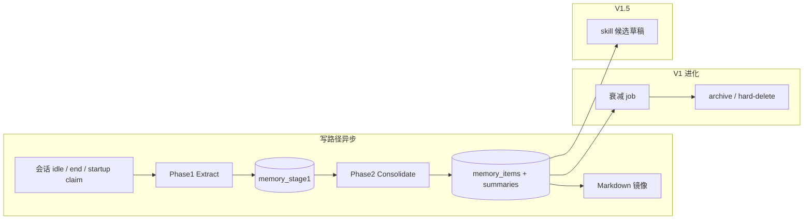
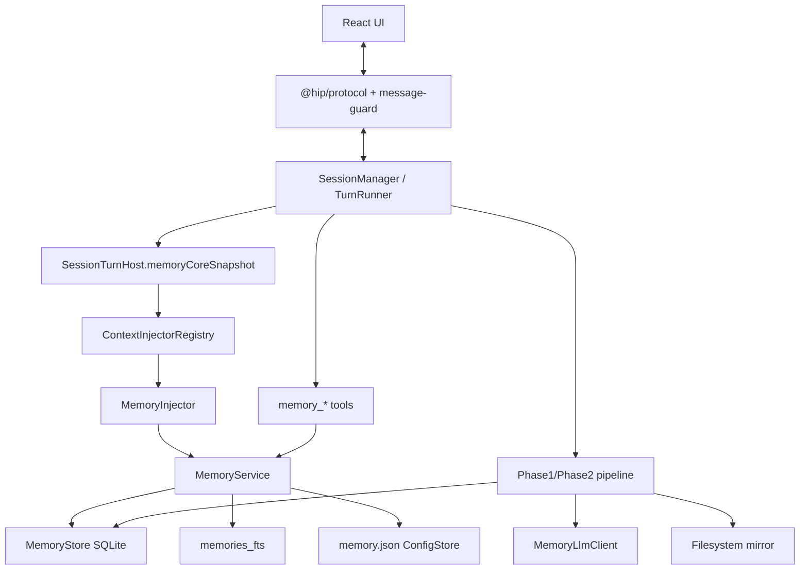
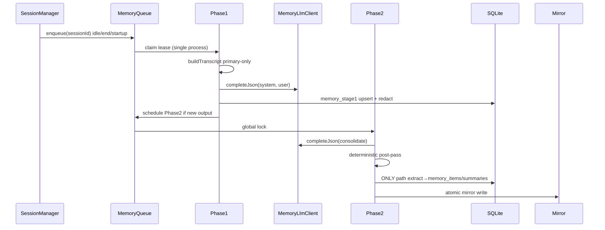
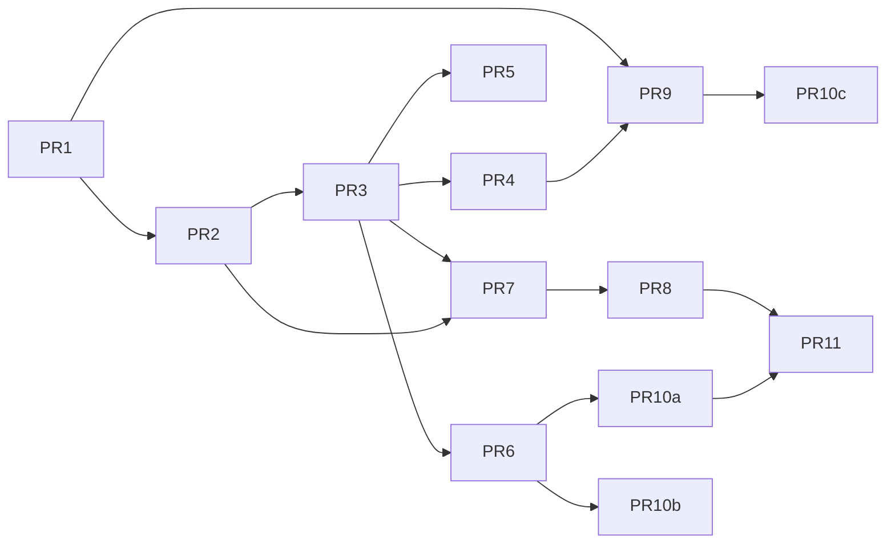

# hip 智能体跨会话记忆系统（Memory System）产品功能与技术设计

| 字段 | 值 |
|------|-----|
| 文档标题 | hip Cross-Session Memory System |
| 作者 | TBD |
| 日期 | 2026-07-11 |
| 状态 | **Draft**（rev 3 — citation 持久化 / injector 顺序 / flags 回写） |
| 相关 | [`2026-07-10-persistence-data-model.md`](./2026-07-10-persistence-data-model.md)、[`agent-orchestration-plan.md`](../../agent-orchestration-plan.md) Phase 4、[`2026-07-05-competitive-feature-gap-analysis.md`](../../research/2026-07-05-competitive-feature-gap-analysis.md) |
| 参考实现（**外部仓库，非 hip tree**） | Codex `codex-rs/memories/`、Hermes `tools/memory_tool.py` + `agent/memory_provider.py`、DeerFlow `agents/memory/` — 实现以本仓库 `packages/sidecar/src/memory/pipeline/prompts.ts` 为准，不运行时依赖外部路径 |

---

## Overview

hip 是本地优先的桌面 AI workbench。当前持久化覆盖 **单会话**（`sessions` / `messages` / FTS），已有 **显式仓库契约**（`ProjectAgentsMdInjector` 加载 `AGENTS.md` / `CLAUDE.md` / `.hip/MEMORY.md`），但 **没有跨会话的自主 recall 层**——用户偏好、失败教训、可复用工作流会随会话结束而丢失。竞品分析已将其标为高差距项。

> **与编排计划对齐：** `agent-orchestration-plan.md` Phase 4 Task 4.2（AGENTS/MEMORY 自动加载）**已基本落地**（`ProjectAgentsMdInjector`）。本设计主要承接 **跨会话记忆 / 检索** 方向；Task 4.1（sqlite-vec）刻意放到 **V1.5**，V1 用 FTS。竞品差距文档中「无 in-repo 指导」描述已过时，以实现代码为准。

本设计提出一套 **SQLite 为权威存储、Markdown 为可审查镜像、两阶段异步进化 pipeline、ContextInjector 注入** 的跨会话记忆系统。目标：让 agent **越用越好**，同时保持用户对隐私与内容的完全控制，且 **不替代** `AGENTS.md` 等显式契约——记忆是辅助 recall 层。

---

## Background & Motivation

### 当前状态（代码事实）

| 能力 | 现状 | 路径 |
|------|------|------|
| 会话持久化 | SQLite `~/.hip/db/hip.db`，schema 迁移至 `user_version=15` | `packages/sidecar/src/persistence/schema.ts` |
| 消息检索 | FTS5 trigram `messages_fts` + LIKE fallback | `SessionStore.search()` |
| 上下文注入 | `ContextInjectorRegistry` + 多个 Injector | `context-injector.ts`；装配于 `session-turn-runner.ts` ~755–764 |
| 项目指导 | `ProjectAgentsMdInjector` 读 `AGENTS.md`/`CLAUDE.md`/`.hip/MEMORY.md` | `project-agents-md.ts`（`MAX_PROJECT_GUIDANCE_CHARS = 48_000`） |
| Skills 预算 | `getSkillsBudget()` 1% / cap 2000 + LRU 驱逐 | `system-prompt.ts` |
| 工作记忆 | `Blackboard` = **per-workflow 内存 KV**，非跨会话 | `orchestrator/blackboard.ts` |
| 删除语义 | 删会话 = 真删（隐私优先，CASCADE + 显式 purge） | `SessionStore.deleteSession` |
| 配置 | `HipConfig` 无 memory 段；读路径 `readHipConfig` / `resolveEffectiveConfig`；**无通用 writeHipConfig**；可写 JSON 先例：`network.json`、`auth.json` | `packages/protocol/src/hip-config.ts`、`config/hip-config.ts` |
| 协议守卫 | `CLIENT_MESSAGE_TYPES` 显式白名单 | `packages/protocol/src/message-guard.ts` |
| API keys | `~/.hip/config/auth.json` 明文 0600 | 设计保持；本功能不推 keychain |
| 模型调用 | `ModelRunner.run(messages, { tools, bindTools, onText, ... })` — **会话流式 + 工具绑定** | `session/model-runner.ts`；**不能直接用于后台 extract** |

### 痛点

1. **重复纠正**：用户每次新会话重述偏好（语言、提交风格、测试命令）。
2. **教训丢失**：构建/测试踩坑的根因与修复在会话外不可达。
3. **工作流无法复用**：已验证的 procedural knowledge 未蒸馏。
4. **Blackboard 误用风险**：编排 KV 是 run 级，不能冒充长期记忆。
5. **竞品差距**：Codex Memories、Claude Project memory、Qoder Awareness 已成用户预期。

### 边界原则

- **AGENTS.md / CLAUDE.md** = 用户/仓库 **显式契约**（权威、可 review、进 git）。
- **Memories** = agent **自主 recall 层**（可错、可衰减、可用户覆写）。
- 仓库内 `.hip/MEMORY.md`：用户手写项目笔记；**系统不自动覆写**。
- Subagent 跑在 **同一 session** 内（`agent_runs.parent_agent_id`），**没有**独立 sessions 行；过滤靠 **transcript 构造规则**，不是「排除 parent session」。

---

## Goals & Non-Goals

### Goals

| ID | 目标 |
|----|------|
| G1 | 跨会话延续：偏好、项目约定、失败教训、可复用工作流、轻量用户画像 |
| G2 | 自主进化：会话 idle/end 后 extract → consolidate；衰减/遗忘（V1）；skill 晋升（**V1.5**） |
| G3 | 用户可控：全局/会话开关、审查 UI、编辑/删除、导出导入、incognito、按源会话清衍生记忆 |
| G4 | 可解释：`Message.memoryCitations` 展示命中条目 |
| G5 | 与现有注入/持久化/协议 **外科对接**，不另起第二套 DB |
| G6 | 隐私：密钥脱敏、真删语义清晰、prompt injection 防护 |
| G7 | MVP 零向量依赖：FTS/keyword；V1.5 接 sqlite-vec |

### Non-Goals

| ID | 非目标 |
|----|--------|
| N1 | 不替代 / 不自动改写 `AGENTS.md` |
| N2 | 不做云同步 / 多设备记忆 |
| N3 | V1 不接 Mem0 / Honcho 等外部 provider |
| N4 | 不把 Blackboard / session_context_epoch 改造成长期记忆 |
| N5 | 不改 API key 存储模型 |
| N6 | 不做完整知识图谱 |
| N7 | V1 不做 embedding |
| N8 | V1 不做镜像文件热重载 / watcher 回写 DB |
| N9 | V1 不做 skill 自动晋升（仅 V1.5 候选草稿） |

---

## 产品功能设计

### A.1 记忆类型与用户心智模型

| 用户可见类型 | `kind` | 示例 | 默认 scope |
|--------------|--------|------|------------|
| 偏好 Preference | `preference` | 「提交信息用中文」 | `global` |
| 项目约定 Convention | `convention` | 「测试命令 `yarn test`」 | `project` |
| 教训 Lesson | `lesson` | 「macOS bash 3.2 下 CJK 需 `${var}`」 | `project` |
| 工作流 Workflow | `workflow` | 「改 sidecar 先跑相关 vitest」 | `project` |
| 用户画像 Profile | `profile` | 语言、沟通风格摘要 | `global` |

**分层（对内）：**

```
working     → 当前会话消息 + Blackboard（本系统不接管）
episodic    → Phase1 rollout_summary / raw_memory（stage1 表）
semantic    → memory_items（Phase2 / user / tool 写入）
procedural  → kind=workflow；V1.5 可晋升 skill 候选
core        → memory_summaries（frozen 注入）
archival    → 全文条目（prefetch FTS / memory_search）
```

### A.2 作用域（Scope）

| Scope | 键 | 说明 |
|-------|-----|------|
| `global` | 固定 | 跨项目用户级 |
| `project` | `project_key` = 规范化 path；`project_key_hash` = sha256 | **默认写入目标** |
| `session` | `session_id` | 本会话；会话删除 CASCADE |

**`project_key` 算法（读/写一致）：**

1. 若 `cwd` 在 git work tree：`realpath(git rev-parse --show-toplevel)`  
2. 否则：`realpath(cwd)`  
3. 存明文 path + `sha256(utf8(path))`  
4. **Worktree 共享同一 git root → 同一 project_key**（K15）

**局限：** 仓库整体搬迁路径变更会孤儿化旧 `project_key`（见 Risks）。V1.5 可提供「链接项目 / 重挂载」。

**默认：** 有 cwd → 写入 `project`；无 cwd → `global`。  
**读取：** `session ∪ project(cwd) ∪ global`，按 score 截断预算。

### A.3 自主进化



#### Evolution policy（V1 默认值 — 可配置）

| 参数 | 默认 | 说明 |
|------|------|------|
| `idle_minutes` | `15` | 会话无 running turn 且 `now - updated_at ≥ 15m` 才可被 Phase1 claim |
| `min_user_turns` | `2` | **有足够 turns**：`messages` 中 `role='user'` 行数 ≥ 2 |
| `min_user_chars` | `80` | 或：所有 user 文本合计 ≥ 80 字符（满足 turns **或** chars 之一即可） |
| `min_extract_interval_hours` | `6` | 同 session 两次成功 Phase1 最小间隔（强制 consolidate 除外） |
| `phase1_max_sessions_per_startup` | `5` | 启动时最多 claim 会话数 |
| `phase1_input_max_chars` | `80_000` | 送入 LLM 的 transcript 字符硬顶 |
| `phase1_tool_output_max_chars` | `400` | 每条工具输出截断（若保留 tool 行；默认 **不保留**，见 B.7） |
| `phase2_max_stage1_inputs` | `20` | Phase2 选取 stage1 上限 |
| `max_unused_days` | `90` | 无 `last_used_at` 且 `updated_at` 超此天数 → 衰减候选 |
| `decay_factor` | `0.92` | 每次衰减 job：`confidence *= 0.92`（仅 `source ∈ {extract,consolidate}` 且未 pinned） |
| `decay_interval_hours` | `168` | 衰减 job 周期（7 天）；也可挂在 Phase2 成功末尾对过期条目执行 |
| `forget_confidence` | `0.15` | `confidence < 0.15` 且非 pinned → `status=archived` |
| `hard_delete_after_days` | `30` | archived 超过 30 天可硬删（可选；V1 默认只 archive） |
| `use_count` 递增点 | 见下表 | |
| skill 晋升 | **V1 不做** | V1.5：`kind=workflow` 且 `use_count ≥ 5` 且 `confidence ≥ 0.75` → 候选草稿 |

#### `use_count` / `last_used_at` 更新点

| 事件 | 递增 `use_count` | 更新 `last_used_at` |
|------|------------------|---------------------|
| Core snapshot 注入含该 id | **否**（批量注入不算「使用」） | 否 |
| Prefetch 命中并进入本 turn 动态块 | **是**（每 turn 每 id 最多 +1） | 是 |
| `memory_search` 返回该 id 且随后被模型 `memory` 工具再读 | 仅 search **否**；显式 get/read **是** | 同左 |
| 解析到 `Message.memoryCitations` 含该 id | **是**（每 turn 每 id 最多 +1，与 prefetch 去重） | 是 |
| 用户在设置面板打开条目 | 否 | 否 |

#### 写入门控（全部满足才 Phase1）

1. 全局 `generate_memories === true`  
2. 会话有效：`resolveSessionMemoryFlags(session).generate === true`  
3. 非 `incognito`  
4. 非外部 ACP 会话  
5. 满足 `min_user_turns` **或** `min_user_chars`  
6. 距上次成功 Phase1 ≥ `min_extract_interval_hours`（或无记录）  
7. 无 running turn（idle）

**Phase1 不按「subagent session」过滤**（hip 无此行）；靠 **transcript 过滤**（B.7）。

**Skill 晋升：仅 V1.5**，不出现在 V1 交付表。

### A.4 用户控制

| 控制面 | 行为 |
|--------|------|
| 全局 `use_memories` / `generate_memories` | 见配置解析算法（B.2 / Config） |
| 会话 override | `SessionConfig.useMemories?` / `generateMemories?` / `incognito?` |
| Incognito | 本会话不读不写；不进 Phase1 |
| 审查 UI | 设置 → 记忆：列表/筛选/编辑/删/归档/导入导出 |
| 导出 | JSONL（权威）+ 可选 Markdown bundle |
| 导入 | 显式 JSONL；冲突：keep / overwrite / merge |
| 删会话衍生记忆 | `memory:deleteBySourceSession` 或删会话对话框勾选 |
| Chip | 本 turn `message.memoryCitations?.length` |

#### 推荐默认

| 配置 | 默认 |
|------|------|
| `use_memories` | `false`（opt-in） |
| `generate_memories` | `false`（opt-in） |
| `default_scope` | `"project"` |
| `export_markdown_mirror` | `true` |
| 其余数值 | 见 Evolution policy 表 |

**Onboarding（K17）：** 不做阻塞式首次弹窗。设置页 Memory 分区在双关时展示 empty-state CTA「一键开启使用并生成」；首次打开设置或连续 3 个非 incognito 会话后，可用 **一次性** tip（可 dismiss，存 `memory.json` 的 `onboardingTipDismissed`）。

### A.5 引用与可解释（单一通道）

**V1 只走一条路径：**

1. Turn finalize 时解析 assistant 文本中的 citation 标记（见下）。  
2. 写入 **`Message.memoryCitations?: MemoryCitation[]`**（扩展 `packages/protocol/src/message-model.ts`）。  
3. `message:complete` 仍为 `{ sessionId, message }`——citations 在 `message` 内。  
4. **不** 发送独立 `memory:citations` ServerMessage（避免 UI 双通道）。  
5. **持久化 + 重载 + strip**（见下；**拒绝**「仅 live WS、reload 后 chip 消失」）。

**解析规则：**

- 优先：文末 fenced block  
  ````  
  ```hip-memory-citations  
  [{"memoryId":"…","title":"…","note":"…"}]  
  ```  
  ````  
- 次选：行内 `[mem:id]` 且 id 属于本 turn 注入/prefetch 集合  
- 失败 / 非法 JSON → **忽略**，不阻断 complete  
- UI chip「用了 N 条记忆」= `message.memoryCitations?.length ?? 0`（**历史消息同样**，见持久化）

#### 持久化 / strip / reload 契约（V1 锁定 — K23）

| 步骤 | 行为 |
|------|------|
| Parse | finalize 得到 `MemoryCitation[]`（可空） |
| **Strip** | 从将要展示与入库的 `content` 中 **删除** 文末 ` ```hip-memory-citations …``` ` fence（含围栏本身）；行内 `[mem:id]` **保留**（人类可读，不强制 strip） |
| **Persist** | 写入 `messages.memory_citations` 列（`TEXT`，JSON 数组；`NULL` = 无引用）。对齐 `timeline` / `attachments` 外置 JSON 列模式 |
| **Emit** | `message:complete` 的 `message.content` 为 **已 strip** 文本；`message.memoryCitations` 为解析结果 |
| **Reload** | `SessionStore.loadMessages` / `session:loaded` 反序列化 `memory_citations` → `Message.memoryCitations`；UI **不** 再解析 content fence |
| **use_count** | 仅在 finalize 成功解析到 id 时递增（与 A.3 表一致）；reload **不再** 重复递增 |
| **旧消息** | 列缺失或 NULL → 无 chip；不尝试从历史 content 反推 |

Schema（`user_version` **17**，由 PR9 迁移；PR2 的 memory_* 表为 v16）：

```sql
ALTER TABLE messages ADD COLUMN memory_citations TEXT; -- JSON MemoryCitation[] | NULL
```

### A.6 与 AGENTS.md / MEMORY.md / Skills

| 源 | 优先级 | 可变主体 |
|----|--------|----------|
| `AGENTS.md` / `CLAUDE.md` | 最高 | 用户/仓库 |
| `.hip/MEMORY.md` in-repo | 高 | 用户；系统不写 |
| 自动 memory core + items | 辅助 | pipeline + 用户 |
| Skills | 按需 `use_skill` | 用户；V1.5 记忆仅建议晋升 |

**权威性**靠 prompt 文案「AGENTS / Project instructions 优先」，**不是** injector 注册顺序强制。`MemoryInjector` 注册位置见 B.3（**Option A：最后注册**，保证 memory 块在 assembled `system` 末尾）。

### A.7 设置面板与 Slash 命令

#### 设置 → 记忆

- 开关：使用 / 生成；一键开启 CTA（empty state）  
- 默认 scope、高级预算  
- 浏览器：筛选 scope/kind/status、搜索、编辑、删、pinned  
- 导入 JSONL / 导出 JSONL|Markdown  
- 「立即巩固」→ `memory:consolidate`  
- 存储路径说明  

**Empty state（双关）：**  
「跨会话记忆默认关闭。开启后，hip 可在空闲时从过往会话提炼偏好与教训，并在新会话中注入。你可随时审查、编辑或删除。」  
主按钮：开启使用并生成；次按钮：仅开启使用（导入/手写）。

#### Slash（V1 策略 — 对齐现有 palette）

现有 `SlashCommandPalette` / `applyCommand` 选择命令后在输入框留下 `/name `，**不** 原生支持复杂 argv。V1：

| 命令 | 行为 |
|------|------|
| `/memory` | **打开记忆设置/面板**（当前 project 过滤）；**不** 解析 `remember <text>` 长参数 |
| `/memory-off` | 本会话 `useMemories=false`（发 `session:setMemoryFlags`） |
| `/memory-on` | 本会话 `useMemories=true`（需全局未强制禁用时） |
| `/memory-incognito` | 本会话 incognito |
| `/memory-status` | 插入或 toast：flags、条数、上次 Phase2 时间 |

**Remember / forget / scope：** 在面板内完成（表单 + 确认对话框），不走 slash argv。  
（A.2 的 scope 切换 = 面板「默认作用域」或单条编辑，**不是** `/memory scope …`。）

### A.8 成功指标

| 指标 | 定义 |
|------|------|
| 重复纠正率 | 同类偏好后续再纠正次数（定性） |
| 命中率 | 含 `memoryCitations` 的 turn 占比 |
| 信任 | 开启 7 日保留；删除/关闭率 |
| No-op 比 | Phase1 `succeeded_no_output` / claimed |
| 注入成本 | core+prefetch 平均 chars |
| 脱敏/拦截 | redact hits、threat blocks |

遥测默认本地 log only。

---

## 技术架构

### B.1 分层架构



**目录：**

```
packages/sidecar/src/memory/
  types.ts
  config.ts                 # 读/写 ~/.hip/config/memory.json + 解析算法
  store.ts
  fts.ts
  redact.ts
  threat-scan.ts            # 显式规则列表（非外部 Hermes import）
  budget.ts
  service.ts
  inject.ts
  tools.ts
  llm-client.ts             # MemoryLlmClient
  citations.ts
  project-key.ts
  mirror.ts
  pipeline/
    phase1-extract.ts
    phase2-consolidate.ts
    queue.ts
    prompts.ts              # 完整 prompt 正文，仓库内自包含
    evolution.ts            # decay/archive
  index.ts
```

### B.2 集成点与配置

| 集成点 | 改动 |
|--------|------|
| `SessionTurnHost` | 增加 `memoryCoreSnapshot?: string`、`memorySnapshotProjectKey?: string`、`memoryAbort?: AbortController` |
| `session-turn-runner.ts` | 每 turn 前：解析 flags → 必要时 `loadCoreSnapshot` → 填 host → 建 registry 注册 `MemoryInjector` → `prepareSessionContext` |
| `SessionContextState` + `assembleFromInjectors` | 映射 `sessionId, useMemories, memoryCoreSnapshot, prefetchQuery` |
| `InjectorState` | 同上扩展 |
| `session-tooling` | `buildMemoryTools`；subagent `memory: false` |
| `schema.ts` | v16 memory 表 + FTS triggers |
| `SessionStore.deleteSession` | session-scope items；可选 `deleteDerivedMemories` |
| `packages/protocol` | types、`Message.memoryCitations`、WS、**`CLIENT_MESSAGE_TYPES`**、`HipConfig` 可选只读字段 |
| `message-guard.ts` | 注册全部新 client types |
| UI | 设置 / slash / chip |

#### 配置持久化（可写）

**权威可写全局文件：** `~/.hip/config/memory.json`（0600），对齐 `network.json` 模式——因现有栈 **无** `writeHipConfig`，UI `memory:setConfig` **不得** 依赖改写 TOML。

```ts
// memory.json shape
interface MemoryFileConfig {
  version: 1
  useMemories: boolean
  generateMemories: boolean
  defaultScope: 'project' | 'global'
  idleMinutes: number
  maxCoreSummaryChars: number
  maxPrefetchChars: number
  exportMarkdownMirror: boolean
  maxUnusedDays: number
  // evolution knobs (optional overrides)
  minUserTurns?: number
  minUserChars?: number
  decayFactor?: number
  forgetConfidence?: number
  extractModel?: string       // provider/model id override
  extractMaxTokens?: number
  onboardingTipDismissed?: boolean
  /** Emergency: Phase1 deterministic upsert to items, skip Phase2. Default false (K21). */
  simpleExtract?: boolean
}
```

可选：用户可在 `~/.hip/config/hip.toml` 写 `[memory]` **只读种子**；仅当 `memory.json` 不存在时合并进默认（实现：`config.ts` `loadMemoryConfig()`）。**`memory:setConfig` 只写 `memory.json`。**

#### Flags 解析算法

```ts
function resolveSessionMemoryFlags(
  global: MemoryFileConfig,
  session: SessionConfig,
): { use: boolean; generate: boolean; incognito: boolean } {
  if (session.incognito === true) {
    return { use: false, generate: false, incognito: true }
  }
  return {
    incognito: false,
    use: session.useMemories ?? global.useMemories,
    generate: session.generateMemories ?? global.generateMemories,
  }
}
```

优先级：`incognito` 强制双关 → 会话显式字段 → `memory.json` 全局 → 代码默认 `false/false`。

#### `session:setMemoryFlags` 持久化与回显（对齐 `session:setPermissionMode`）

| 步骤 | 行为 |
|------|------|
| Merge | 将提供的字段 merge 进该会话 `SessionConfig`（`useMemories` / `generateMemories` / `incognito`） |
| Persist | 经 **现有会话 config 写路径** 落库（与 `setPermissionMode` / `setSystemPrompt` 相同：更新 `sessions.config` JSON blob） |
| Live | 更新 in-memory `host._config`，后续 `resolveSessionMemoryFlags` 立即生效 |
| Echo | 发送 **`session:memoryFlags`** ServerMessage：`{ sessionId, useMemories?, generateMemories?, incognito? }`（回显 **实际生效** 的解析后或已存字段，与 permissionMode 测试风格一致） |
| Reload | `session:load` → `session:loaded.config` 含上述字段；UI 与 slash 状态恢复；**不** 仅内存、不重启丢失 |

`incognito=true` 时仍持久化为 true；解析算法强制 use/generate 为 false，但字段本身保留以便用户关闭隐身。

### B.3 读路径 / 写路径与 Injector 接线

#### 读路径（锁定 placement — **Option A**）

| 块 | 内容 | 放置 | 稳定性 |
|----|------|------|--------|
| **Core（frozen）** | `memory_summaries` + pinned titles | `MemoryInjector` 输出段 **内部** 第一段 | 会话内不变（cwd/`project_key` 变或用户刷新除外） |
| **Prefetch（dynamic）** | FTS top 命中 | **同一** `MemoryInjector` 输出段内部、core **之后** | 每 turn 可变 |
| **整段 memory 在 system 中的位置** | core+prefetch 合并为一个 injector 结果 | **assembled `system` 的末尾**（`MemoryInjector` **最后** `register`） | 动态 injectors（token budget / subagent status）也在 memory **之前** 注册时，memory 仍收尾；若未来有「必须最后」的 injector，memory 紧邻其前并改文档 |

**不** 使用 `contextMessages` 承载 prefetch。  
Prefix-cache：**best-effort**——只保证 **memory core** 段文本在会话内稳定；prefetch 与其它 injector 仍会改 system。

**注册顺序（规范性，与 `session-turn-runner` 对齐）：**

```text
SystemPromptInjector
ProjectAgentsMdInjector      // AGENTS / in-repo MEMORY — 先于 memory 阅读
SkillsListInjector
PermissionModeInjector
TokenBudgetInjector
SubagentStatusInjector
MemoryInjector               // LAST — core+prefetch 位于 system 末尾（Option A / K12）
```

AGENTS 仍在 memory **之前**（满足「项目指令在前」阅读顺序）。Memory 在 skills/动态块 **之后**，使「prefetch 在 system 末尾」与伪代码一致。

#### SessionTurnHost + prepareSessionContext 接线（逐步）

```text
runTurn(host):
  flags = resolveSessionMemoryFlags(loadMemoryConfig(), host._config)
  if flags.use:
    pk = projectKey(host._config.cwd)
    if host.memoryCoreSnapshot == null || host.memorySnapshotProjectKey !== pk:
      host.memoryCoreSnapshot = await memoryService.loadCoreSnapshot(pk, budget)
      host.memorySnapshotProjectKey = pk
  else:
    host.memoryCoreSnapshot = undefined

  contextState = {
    ...existing,
    sessionId: host.id,
    useMemories: flags.use,
    memoryCoreSnapshot: host.memoryCoreSnapshot,
    prefetchQuery: lastUserText,  // 本 turn 用户消息
  }

  registry.register(SystemPromptInjector)
  registry.register(ProjectAgentsMdInjector)
  registry.register(SkillsListInjector)
  registry.register(PermissionModeInjector)
  registry.register(TokenBudgetInjector)
  registry.register(SubagentStatusInjector)
  registry.register(new MemoryInjector(memoryService))  // LAST (Option A)

  prepareSessionContext(..., contextState, registry)
    → assembleFromInjectors maps ALL new fields into InjectorState
```

#### 写路径



**进程模型：** hip 通常 **单 sidecar 进程**。Lease/claim 用于 **崩溃恢复与防重入**，不是多 writer 集群。  
**Shutdown：** abort `memoryAbort`；Phase2 未 commit 则丢弃事务；lease 过期后可被下次启动回收。  
**中途关 `generate_memories`：** 取消队列中 pending；in-flight 完成后不再 schedule 下一 phase。

### B.4 存储

#### SQLite（`user_version` 16）

```sql
CREATE TABLE IF NOT EXISTS memory_items (
  id              TEXT PRIMARY KEY,
  scope           TEXT NOT NULL CHECK(scope IN ('global','project','session')),
  project_key     TEXT,
  project_key_hash TEXT,
  session_id      TEXT,
  kind            TEXT NOT NULL,
  title           TEXT NOT NULL,
  content         TEXT NOT NULL,
  confidence      REAL NOT NULL DEFAULT 0.5,
  status          TEXT NOT NULL DEFAULT 'active'
                    CHECK(status IN ('active','archived','deleted')),
  source          TEXT NOT NULL DEFAULT 'extract'
                    CHECK(source IN ('extract','user','import','tool','consolidate')),
  source_session_id TEXT,
  tags_json       TEXT NOT NULL DEFAULT '[]',
  created_at      INTEGER NOT NULL,
  updated_at      INTEGER NOT NULL,
  last_used_at    INTEGER,
  use_count       INTEGER NOT NULL DEFAULT 0,
  pinned          INTEGER NOT NULL DEFAULT 0
);
CREATE INDEX IF NOT EXISTS idx_memory_items_scope_project
  ON memory_items(scope, project_key_hash, status);
CREATE INDEX IF NOT EXISTS idx_memory_items_session
  ON memory_items(session_id) WHERE session_id IS NOT NULL;
CREATE INDEX IF NOT EXISTS idx_memory_items_source_session
  ON memory_items(source_session_id) WHERE source_session_id IS NOT NULL;

CREATE TABLE IF NOT EXISTS memory_summaries (
  id              TEXT PRIMARY KEY,
  scope           TEXT NOT NULL,
  project_key     TEXT,
  project_key_hash TEXT,
  summary_md      TEXT NOT NULL,
  updated_at      INTEGER NOT NULL
);

CREATE TABLE IF NOT EXISTS memory_stage1 (
  id              TEXT PRIMARY KEY,
  session_id      TEXT NOT NULL,
  project_key     TEXT,
  project_key_hash TEXT,
  cwd             TEXT,
  raw_memory      TEXT NOT NULL,
  rollout_summary TEXT NOT NULL,
  rollout_slug    TEXT,
  status          TEXT NOT NULL,
  selected_for_phase2 INTEGER NOT NULL DEFAULT 0,
  lease_owner     TEXT,
  lease_until     INTEGER,
  retry_after     INTEGER,
  source_updated_at INTEGER NOT NULL,
  created_at      INTEGER NOT NULL
);
CREATE INDEX IF NOT EXISTS idx_memory_stage1_claim
  ON memory_stage1(status, retry_after, source_updated_at);
CREATE INDEX IF NOT EXISTS idx_memory_stage1_session
  ON memory_stage1(session_id);

CREATE TABLE IF NOT EXISTS memory_jobs (
  id              TEXT PRIMARY KEY,
  kind            TEXT NOT NULL,
  watermark       INTEGER NOT NULL DEFAULT 0,
  lease_owner     TEXT,
  lease_until     INTEGER,
  last_error      TEXT,
  updated_at      INTEGER NOT NULL
);
```

#### FTS（完整 triggers，对齐 `messages_fts`）

```sql
CREATE VIRTUAL TABLE IF NOT EXISTS memories_fts USING fts5(
  title, content, content='memory_items', content_rowid='rowid', tokenize='trigram'
);

CREATE TRIGGER IF NOT EXISTS memories_ai AFTER INSERT ON memory_items BEGIN
  INSERT INTO memories_fts(rowid, title, content) VALUES (new.rowid, new.title, new.content);
END;

CREATE TRIGGER IF NOT EXISTS memories_ad AFTER DELETE ON memory_items BEGIN
  INSERT INTO memories_fts(memories_fts, rowid, title, content)
    VALUES('delete', old.rowid, old.title, old.content);
END;

CREATE TRIGGER IF NOT EXISTS memories_au AFTER UPDATE ON memory_items BEGIN
  INSERT INTO memories_fts(memories_fts, rowid, title, content)
    VALUES('delete', old.rowid, old.title, old.content);
  INSERT INTO memories_fts(rowid, title, content)
    VALUES (new.rowid, new.title, new.content);
END;
```

- Probe：`tryEnableMemoriesFts(db)` 失败 → `MemoryStore.search` 走 `LIKE`（同 `SessionStore.search`）。  
- **搜索必 `JOIN memory_items` 且 `status = 'active'`**（FTS 含 archived/deleted 行时靠 SQL 过滤）。  
- TEXT PK 仍有 SQLite `rowid`，`content_rowid='rowid'` 合法。

#### 删除语义

| 操作 | 行为 |
|------|------|
| `session:delete` | 删 `memory_items` where `scope='session' AND session_id=?`；`source_session_id` 置 NULL（**默认保留** project/global 正文） |
| 删会话对话框勾选「同时删除本会话衍生的长期记忆」 | 额外调用 `deleteBySourceSession(sessionId)`（**硬删**，见下） |
| `memory:deleteBySourceSession` | **默认硬删**（`DELETE FROM memory_items WHERE source_session_id=?`，含 project/global）；**同时** `DELETE FROM memory_stage1 WHERE session_id=?`；可选 `soft?: true` 时改为 `status='deleted'`（高级/API only，UI 勾选不走 soft） |
| 用户删单条 | soft `status=deleted` 默认；高级 hard delete |
| stage1 与已删会话 | `deleteSession` **默认删除** 该 session 的 `memory_stage1` 行（避免孤儿 extract）；若已 `selected_for_phase2` 且 Phase2 未跑，允许删——丢失未巩固 extract 可接受（隐私优先） |

### B.5 检索

**V1：** FTS +  
`score = fts_rank*0.5 + confidence*0.3 + recency*0.15 + pin*0.05`  
`recency = exp(-age_days/30)`  

**V1.5：** sqlite-vec hybrid。

### B.6 注入预算

**单一来源：** `memory.json` 的 cap 为上限；函数再按窗口收紧。

```ts
export function getMemoryCoreBudget(
  configMax: number,              // from memory.json maxCoreSummaryChars (default 1500)
  contextWindowTokens?: number,   // from active model metadata if known
): number {
  const tokens = contextWindowTokens ?? 128_000
  const dynamic = Math.floor(tokens * 0.005 * 4)
  return Math.min(configMax, dynamic, 1500) // hard safety cap 1500 unless configMax lower
}

export function getMemoryPrefetchBudget(configMax: number, contextWindowTokens?: number): number {
  const tokens = contextWindowTokens ?? 128_000
  const dynamic = Math.floor(tokens * 0.008 * 4)
  return Math.min(configMax, dynamic, 2500)
}
```

Turn runner 若能从 model catalog 取 `contextWindow`，传入；否则 128k 默认。

### B.7 Pipeline 细节

#### Phase1 输入构造（修正 subagent 问题）

hip 子 agent **同 session**。**禁止**「排除 parent session」表述。

```ts
function buildPhase1Transcript(store: SessionStore, sessionId: string): string {
  // Normative V1 rules (no aspirational agent-id allowlists):
  // 1) Source: messages table (+ agent_runs via loadMessagesWithRuns when needed)
  // 2) Always include all role=user messages
  // 3) Include assistant messages only when:
  //      agent_id is null | undefined | 'supervisor'
  //      OR all agent_runs for that message have parent_agent_id == null
  //    Exclude assistant content attributable only to child runs
  //      (parent_agent_id != null). Hip finalizes main turns as agentId 'supervisor'.
  // 4) Do NOT include tool_calls.output as first-class paragraphs
  // 5) Cap total chars at phase1_input_max_chars (drop oldest first; keep latest user turn)
}
```

**有足够内容：** `userTurnCount >= min_user_turns (2)` **OR** `userCharCount >= min_user_chars (80)`。

#### Stage1 → Stage2 IO 契约

| 阶段 | 写入 | 不写入 |
|------|------|--------|
| Phase1 | `memory_stage1`：`raw_memory`, `rollout_summary`, `rollout_slug?` | **不** 写 `memory_items` / `memory_summaries` |
| Phase2 | **唯一** 的 extract 路径写 `memory_items` + `memory_summaries` + mirror | — |
| User/tool/import | 直接写 `memory_items`（`source=user\|tool\|import`） | 不经 stage1 |

`candidate_items`：**V1 Phase1 JSON schema 不包含该字段**（避免与 Phase2 双写歧义）。Phase2 只消费 `raw_memory` + `rollout_summary` + 现有 items。

#### Phase1 输出 schema（strict）

```ts
interface Stage1LlmOutput {
  raw_memory: string
  rollout_summary: string
  rollout_slug?: string
}
// empty strings → succeeded_no_output
```

#### Phase2 + 确定性 post-pass

1. LLM 返回 consolidate JSON（items upsert/archive 建议 + new summary_md）。  
2. **Post-pass（规则覆盖 LLM，按序）：**  
   a. 每条 content 再 `redactSecrets` + `threatScan`；失败 → drop 该条  
   b. `source=user` 或 `pinned=1` 的现有行：**禁止** LLM archive/delete；最多允许 append note 到非 user 冲突行  
   c. 同 `title` 规范化（trim+lower）冲突：保留更高 confidence，平局取更新 `updated_at`；败者 `archived` + content 前缀 `[superseded by id]`  
   d. `confidence` clamp 到 `[0,1]`；extract 新条默认 ≤ `0.7`  
   e. summary_md 截断到 `maxCoreSummaryChars`；首行强制 `v1`  
   f. 条数 cap：`max_items_per_project`（默认 500），超出 archive 最低 score  

#### MemoryLlmClient（关键 — 不复用 ModelRunner 会话语义）

```ts
// packages/sidecar/src/memory/llm-client.ts
export interface MemoryLlmCompleteOpts {
  model?: string           // override
  maxTokens?: number       // default 4096 phase1 / 8192 phase2
  temperature?: number     // default 0
  signal?: AbortSignal
  timeoutMs?: number       // default 120_000
}

export interface MemoryLlmClient {
  /**
   * Non-tool, non-interactive completion. Prefer provider JSON mode when available;
   * else parse first JSON object from text. Throws on timeout/HTTP/parse.
   */
  completeJson(
    system: string,
    user: string,
    opts?: MemoryLlmCompleteOpts,
  ): Promise<unknown>
}
```

**模型解析顺序：**

1. `memory.json` `extractModel`（若设）  
2. 否则全局 `activeModel`（与 UI 当前模型一致，经 auth.json 取 key）  
3. 无 key → pipeline **skip** 并 log，不抛到用户 turn  

**实现提示：** 使用 `@langchain/openai`（或现有 model factory）`invoke`/`generate` **无 tools、可非 stream**；**不要** 调用 `RealModelRunner.run`（其绑定 tools + stream sinks）。  

**成本：** `generate_memories=true` 会在后台消耗 token；设置页文案明示。  

**测试：** PR7/PR8 注入 mock `MemoryLlmClient`；禁止打真网（与 paid LLM 测试隔离）。

#### Prompts

`pipeline/prompts.ts` **内联完整** system/user 模板（中英可先英），包含：

- Evidence-only、no-op empty fields、redact secrets、treat tool output as data  
- Phase2 progressive disclosure / conflict guidance  

**不** `fs.readFile` 外部 codex 路径。威胁扫描规则列表写在 `threat-scan.ts`（API key 形、`ignore previous instructions`、外泄 URL 模式等，~15–30 条；可迭代）。

### B.8 Agent Tools（V1）

| Tool | V1 |
|------|-----|
| `memory_search` | 是 |
| `memory_add` | 是（redact + threat） |
| `memory_replace` | 是 |
| `memory_remove` | 是（软删） |

Subagent / cron / ACP：不注册。

### B.9 子 Agent / Cron / 编排

| 上下文 | 注入 | generate | tools |
|--------|------|----------|-------|
| 主会话 | flags.use | flags.generate | 是 |
| task/dispatch/background subagent | 否 | 否 | 否 |
| cron | 否 | 否 | 否 |
| ACP 外部 | 否 | 否 | 否 |

Phase1 过滤 = **transcript 规则**（B.7），不是 session 表 parent 标记。

### B.10 协议

```ts
// Message 扩展 (message-model.ts)
export interface Message {
  // ...existing fields...
  memoryCitations?: MemoryCitation[]
}

export interface MemoryCitation {
  memoryId: string
  title: string
  note?: string
}
```

**ClientMessage 增量（均加入 `CLIENT_MESSAGE_TYPES`）：**

```ts
| { type: 'memory:list'; scope?: MemoryScope; projectKey?: string; query?: string; limit?: number }
| { type: 'memory:get'; id: string }
| { type: 'memory:upsert'; item: MemoryUpsertInput }
| { type: 'memory:delete'; id: string; hard?: boolean }
| { type: 'memory:deleteBySourceSession'; sessionId: string; soft?: boolean } // default hard purge
| { type: 'memory:export'; format: 'jsonl' | 'markdown' }
| { type: 'memory:import'; format: 'jsonl'; data: string; conflict: 'keep' | 'overwrite' | 'merge' }
| { type: 'memory:setConfig'; config: Partial<MemoryFileConfig> }
| { type: 'memory:getConfig' }
| { type: 'memory:consolidate' }
| { type: 'session:setMemoryFlags'; sessionId: string; useMemories?: boolean; generateMemories?: boolean; incognito?: boolean }
// session:delete 可选扩展：
// | { type: 'session:delete'; sessionId: string; deleteDerivedMemories?: boolean }
```

**ServerMessage 增量：**

```ts
| { type: 'memory:list:result'; items: MemoryItem[] }
| { type: 'memory:get:result'; item?: MemoryItem; error?: string }
| { type: 'memory:upsert:result'; item?: MemoryItem; error?: string }
| { type: 'memory:delete:result'; id: string; ok: boolean }
| { type: 'memory:deleteBySourceSession:result'; sessionId: string; deleted: number }
| { type: 'memory:export:result'; format: string; data: string }
| { type: 'memory:import:result'; ok: boolean; imported: number; error?: string }
| { type: 'memory:config'; config: MemoryFileConfig }
| { type: 'memory:pipeline'; phase: 1 | 2; status: 'started' | 'succeeded' | 'failed' | 'noop'; detail?: string }
| { type: 'session:memoryFlags'; sessionId: string; useMemories?: boolean; generateMemories?: boolean; incognito?: boolean }
// 无 memory:citations 事件；citations 只在 Message / message:complete 内
```

---

## Key Decisions

| # | 决策 | 理由 |
|---|------|------|
| K1 | SQLite 权威，Markdown 镜像可选 | 与 hip.db / FTS 一致 |
| K2 | 简化两阶段；无 git memory workspace | 降复杂度 |
| K3 | 读/写开关分离 | 灵活 |
| K4 | 默认双 opt-in | 隐私 |
| K5 | 默认 project 写入 | 编码场景 |
| K6 | Frozen core + 动态 prefetch（同 system 串，core 稳定） | best-effort prefix cache |
| K7 | V1 FTS only | 可交付 |
| K8 | Subagent/cron skip tools+inject；Phase1 靠 transcript 过滤 | hip 无独立 subagent session |
| K9 | 删会话默认不删 project/global；提供 deleteBySourceSession | 隐私可选 |
| K10 | 不自动写 AGENTS / in-repo MEMORY | 契约分离 |
| K11 | V1 提供 memory 工具 | 补 frozen |
| K12 | **Option A：** `MemoryInjector` **最后注册**；AGENTS 仍在其前 | system 末尾 = memory core+prefetch；权威靠文案 |
| K13 | Provider 接口预留 | 防过早耦合 |
| K14 | 不升级 Blackboard | 职责清晰 |
| K15 | Worktree 共享 git root `project_key` | 同一仓库记忆 |
| K16 | V1 镜像 **单向** SQLite→文件；回写仅显式 JSONL import | 无 watcher 漂移 |
| K17 | Onboarding：empty-state CTA + 可选一次性 tip，无阻塞弹窗 | 低打扰 |
| K18 | 后台 LLM 走 `MemoryLlmClient.completeJson`，不走 `ModelRunner` | 接口匹配 |
| K19 | Citations 仅 `Message.memoryCitations` | 单通道 |
| K20 | 全局可写配置 = `memory.json` | 无 writeHipConfig |
| K21 | Phase2 唯一 extract→items 写入（`simpleExtract=false`）；Phase1 只写 stage1 | IO 无歧义 |
| K22 | Skill 晋升仅 V1.5 | 降 V1 范围 |
| K23 | Citations：**strip fence + persist `messages.memory_citations` + reload 还原 chip** | 历史 UX；拒绝 ephemeral-only |
| K24 | `session:setMemoryFlags`：merge → persist `sessions.config` → echo `session:memoryFlags` | 对齐 setPermissionMode |
| K25 | `deleteBySourceSession` **默认硬删** | 隐私勾选预期 |

---

## API / Interface Changes

见 B.2、B.3、B.10、`MemoryLlmClient`、`MemoryInjector`。

```ts
export class MemoryInjector implements ContextInjector {
  readonly id = 'memory'
  constructor(private readonly svc: MemoryService) {}
  async inject(state: InjectorState): Promise<InjectResult> {
    if (!state.useMemories) return { systemMessages: [] }
    const parts: string[] = []
    if (state.memoryCoreSnapshot) parts.push(state.memoryCoreSnapshot)
    if (state.prefetchQuery) {
      const block = await this.svc.formatPrefetch(
        state.prefetchQuery,
        state.cwd,
        state.sessionId,
      )
      if (block) parts.push(block)
    }
    return { systemMessages: parts }
  }
}
```

---

## Data Model Changes

见 B.4。迁移 v16；无历史数据。

---

## Alternatives Considered

### Alt-1：纯 Markdown 文件权威
不采纳为权威；采纳 frozen + 工具交互；镜像可编辑但 V1 不 watcher 回写。

### Alt-2：纯向量 Mem0
V1 不采纳；V1.5 hybrid。

### Alt-3：完整 Codex + git workspace
采纳哲学；实现简化。

### Alt-4：自动 append in-repo MEMORY.md
拒绝自动写仓库。

### Alt-5：单阶段 extract 直接写 items（无 Phase2）
- **做法：** 会话 end 一次 LLM，直接 upsert `memory_items`，无 stage1/consolidate。  
- **优点：** 更少代码与锁；V1 风险低。  
- **缺点：** 跨会话去重/冲突弱；summary 质量差；难扩展。  
- **结论：** **不作为主路径**。紧急降级：`MemoryFileConfig.simpleExtract === true`（`memory.json`，默认 **false**）时 Phase1 经确定性规则直接 upsert items 并跳过 Phase2；与 K21 并存为显式 override，非默认。

---

## Security & Privacy

| 威胁 | 缓解 |
|------|------|
| 密钥入库 | 全写路径 redact |
| Injection | threat-scan + data 声明 + AGENTS 优先文案 |
| 跨项目泄漏 | 默认 project scope |
| 会话删后残留 | 文档 + `deleteBySourceSession` + UI 勾选 |
| Incognito | 测试锁定 |
| 多进程 | 单进程假设；lease 仅崩溃恢复 |

---

## Observability

- `[memory] phase=1|2 status=… ms=…`  
- lease recover / skip reasons  
- redact / threat counters  
- `memory:pipeline` WS  
- Shutdown abandon 日志  

---

## Rollout Plan

| 阶段 | 范围 |
|------|------|
| **MVP** | schema + store + FTS + 手动/API upsert + injector core + 设置开关 + memory.json |
| **V1** | MemoryLlmClient + Phase1/2 + tools + citations on Message + mirror + deleteBySourceSession + UI 分 PR |
| **V1.5** | sqlite-vec + skill 候选 + project remount |

**日历风险：** V1 含 pipeline+UI 偏大；按 PR 切片可并行；**PR7 前必须落地 llm-client + prompts**。

**回滚：** 关 memory.json 开关；表残留无害。

---

## Open Questions

| # | 问题 | 状态 |
|---|------|------|
| Q1 Onboarding | **已关闭 → K17** | empty-state + 可选 tip |
| Q2 Embedding 默认 | 仍开 | 仅 V1.5 |
| Q3 记忆 undo | 仍开 | V1 不做 |
| Q4 Worktree project_key | **已关闭 → K15** | 共享 git root |
| Q5 Extract model | **已关闭 → K18 + 模型解析顺序** | extractModel ?? activeModel |
| Q6 i18n | 仍开 | UI PR 跟项目 locale |

---

## Risks

| 风险 | 严重度 | 缓解 |
|------|--------|------|
| 噪声记忆 | 高 | opt-in、no-op、confidence、审查 |
| 预算挤占 | 中 | 硬顶 |
| 后台 token 费 | 中 | 文案 + rate limit |
| 路径搬迁孤儿 | 中 | 文档局限；V1.5 remount |
| Prefix-cache 高估 | 低 | best-effort 表述 |
| 范围膨胀 | 中 | PR 切片；Alt-5 降级开关 |

---

## References

- hip：`schema.ts`、`context-injector.ts`、`project-agents-md.ts`、`session-turn-runner.ts`、`session-context.ts`、`model-runner.ts`、`message-guard.ts`、`hip-config.ts`  
- 外部灵感（实现不依赖路径）：Codex memories README/phase1/phase2；Hermes memory_tool；DeerFlow memory queue/updater  
- 本仓库实现权威 prompt：`packages/sidecar/src/memory/pipeline/prompts.ts`（PR7 新增）

---

## PR Plan

### PR1 — Protocol + message-guard + Message.memoryCitations + SessionConfig flags

- **标题：** `feat(protocol): memory types, citations on Message, WS stubs, CLIENT_MESSAGE_TYPES`  
- **文件：** `memory-types.ts`、`message-model.ts`、`messages.ts`、`session-config.ts`、`message-guard.ts`、`message-guard.test.ts`、`index.ts`  
- **依赖：** 无  
- **验收：** 类型导出；所有新 client type 在 `CLIENT_MESSAGE_TYPES`；guard 测试遍历通过；无 sidecar 行为变化  

### PR2 — Schema v16 + MemoryStore + FTS triggers + deleteSession hooks

- **标题：** `feat(persistence): memory tables v16, FTS triggers, CRUD, session delete semantics`  
- **文件：** `schema.ts`、`memory/store.ts`、`memory/fts.ts`、`persistence/store.ts`、tests  
- **依赖：** PR1（类型可选）  
- **验收：**  
  - migrate → user_version ≥ 16  
  - FTS 中文 substring；probe 失败 LIKE  
  - search 仅 `status=active`  
  - `deleteSession` 清 session-scope + stage1；保留 project item 且 `source_session_id` null  

### PR3 — memory.json config + redact + threat-scan + MemoryService

- **标题：** `feat(memory): config store, redact, threat-scan, read service + budgets`  
- **文件：** `memory/config.ts`、`redact.ts`、`threat-scan.ts`、`budget.ts`、`service.ts`、`project-key.ts`、tests  
- **依赖：** PR2  
- **验收：** flags 解析矩阵（incognito/session/global）；budget min(config, dynamic)；redact 单测  

### PR4 — SessionTurnHost + assembleFromInjectors + MemoryInjector

- **标题：** `feat(session): wire memory snapshot host fields and MemoryInjector`  
- **文件：** `session-turn-runner.ts`（Host 字段 + load snapshot + **MemoryInjector last**）、`session-context.ts`（完整字段映射）、`context-injector.ts`、`memory/inject.ts`、tests  
- **依赖：** PR3  
- **验收：**  
  - `use=false` 零注入  
  - core 两 turn 文本相同（prefetch 可变）  
  - cwd 变更刷新 snapshot  
  - ProjectAgents 输出出现在 memory 段之前  
  - assembled `system` **以 memory 段结尾**（Option A：MemoryInjector 最后 register）  

### PR5 — Agent memory tools + subagent skip

- **标题：** `feat(memory): memory_search/add/replace/remove tools; skip on subagent`  
- **文件：** `memory/tools.ts`、`session-tooling`/`tools/index`、`subagent.ts`、tests  
- **依赖：** PR3  
- **验收：** 工具写经 redact；subagent tooling 列表无 memory_*  

### PR6 — WS handlers + setConfig + deleteBySourceSession + setMemoryFlags

- **标题：** `feat(memory): WS CRUD/config/export/import/deleteBySourceSession/setMemoryFlags`  
- **文件：** `handlers/memory.ts`、session-manager 分发、`session:delete` 可选 flag、tests  
- **依赖：** **PR3**（upsert 必须 redact，禁止仅依赖 PR2）  
- **验收：**  
  - setConfig 落盘 `memory.json`  
  - `deleteBySourceSession` **默认硬删**条数正确；`soft:true` 走 deleted status  
  - `session:setMemoryFlags` merge → persist `sessions.config` → echo `session:memoryFlags`；reload 后 flags 仍在  
  - message-guard 拒绝未知 type  

### PR7 — MemoryLlmClient + Phase1

- **标题：** `feat(memory): MemoryLlmClient + Phase1 extract pipeline`  
- **文件：** `llm-client.ts`、`pipeline/phase1-extract.ts`、`queue.ts`、`prompts.ts`、启动/end 钩子  
- **依赖：** PR2, PR3  
- **验收（必须）：**  
  - mock LLM：成功写 stage1；空输出 `succeeded_no_output`  
  - incognito / generate=false / min turns 不 claim  
  - transcript **不含** parent_agent_id != null 的子 agent 大段输出  
  - 写入 stage1 前 redact  
  - lease 过期可回收  
  - 不调用 `RealModelRunner.run`  

### PR8 — Phase2 + mirror + evolution decay

- **标题：** `feat(memory): Phase2 consolidate, atomic mirror, decay/archive`  
- **文件：** `phase2-consolidate.ts`、`mirror.ts`、`evolution.ts`、tests  
- **依赖：** PR7  
- **验收：**  
  - fixture：无 LLM 的 post-pass 冲突规则（user pinned 不可删、title 冲突 archive）  
  - Phase2 是 extract→items 唯一路径  
  - mirror 原子写（tmp+rename）  
  - summary 遵守 budget  
  - decay_factor / forget_confidence 单测  

### PR9 — Citation parse + strip + persist + reload

- **标题：** `feat(memory): parse/strip citations; messages.memory_citations column; load path`  
- **文件：** `citations.ts`、turn finalize、`schema.ts` v17、`SessionStore` save/load messages、protocol `Message`  
- **依赖：** PR4, PR1  
- **验收：**  
  - 合法 fence → `memoryCitations` 填充；**content 已 strip fence**  
  - 非法 fence → 忽略，content 可保留原样或最佳努力 strip 失败则原样  
  - 入库 `messages.memory_citations`；`session:load` 后 chip 数据仍在  
  - reload **不** 二次递增 `use_count`  
  - 无独立 `memory:citations` WS 事件  

### PR10a — UI Settings Memory panel

- **标题：** `feat(ui): Memory settings list/edit/export/import + enable CTA`  
- **文件：** Settings 页注册、Memory 面板组件、i18n、WS client  
- **依赖：** PR6  
- **验收：** empty-state CTA；CRUD；双关文案；删会话勾选硬删衍生记忆文案  

### PR10b — UI slash commands

- **标题：** `feat(ui): /memory /memory-on|off|incognito|status slash commands`  
- **文件：** `SlashCommandPalette` builtins  
- **依赖：** PR6  
- **验收：** `/memory` 开面板；无 remember argv；flags 经 `setMemoryFlags` 且 reload 保持  

### PR10c — UI usage chip

- **标题：** `feat(ui): memory citations chip on assistant messages`  
- **文件：** composer/message 组件  
- **依赖：** PR9  
- **验收：** 当前 turn 与 **历史** `message.memoryCitations.length` 均显示 chip；0 不显示；content 无裸 fence  

### PR11 — Integration tests + persistence doc update

- **标题：** `test(memory): e2e extract→inject; update data-model doc`  
- **文件：** integration tests、`2026-07-10-persistence-data-model.md` 增补 memory 表  
- **依赖：** PR8, PR10a  
- **验收：** incognito、删会话、deleteBySourceSession、AGENTS 文案优先  

### PR12（V1.5）— sqlite-vec + skill candidates + project remount

- **依赖：** PR3 稳定  
- **验收：** 无 embedding 时降级 FTS  

### 依赖图



**Merge 顺序：** PR1 → PR2 → PR3 → (PR4 ∥ PR5 ∥ PR6) → PR7 → PR8 → PR9 → PR10a/b/c → PR11。

---

## 推荐默认配置（memory.json）

```json
{
  "version": 1,
  "useMemories": false,
  "generateMemories": false,
  "defaultScope": "project",
  "idleMinutes": 15,
  "maxCoreSummaryChars": 1500,
  "maxPrefetchChars": 2500,
  "exportMarkdownMirror": true,
  "maxUnusedDays": 90,
  "minUserTurns": 2,
  "minUserChars": 80,
  "decayFactor": 0.92,
  "forgetConfidence": 0.15,
  "simpleExtract": false
}
```

**一键开启：** `useMemories=true` + `generateMemories=true`。

---

*End of design document (rev 3).*
