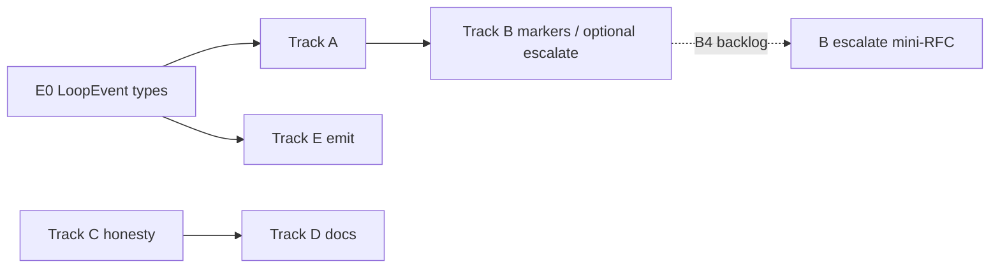
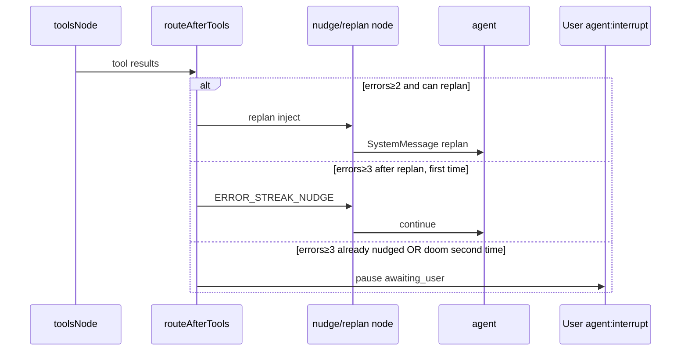
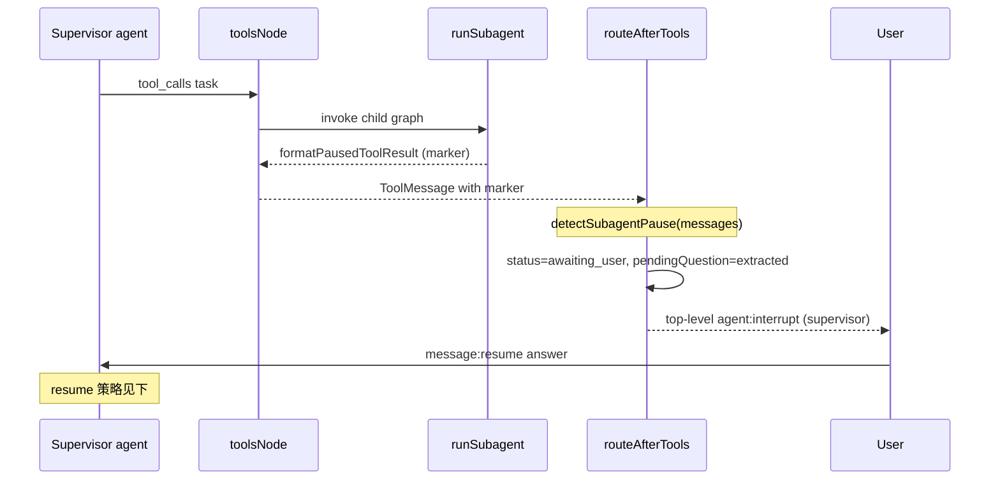
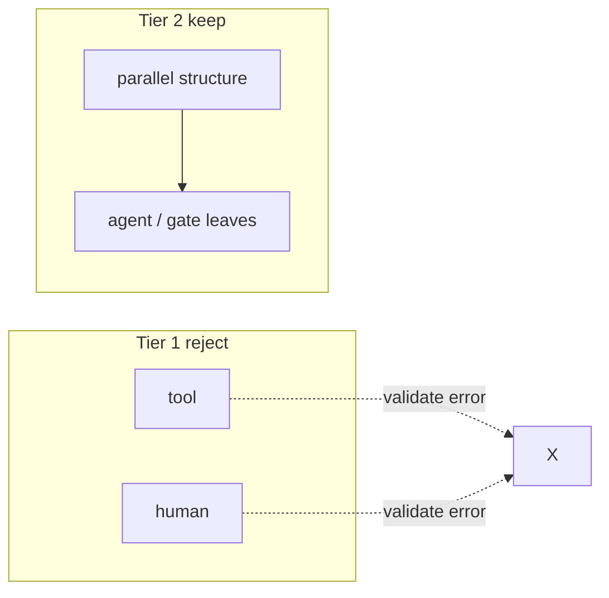

# hip Core Agent Runtime — Multi-Track Evolution Design

| Field | Value |
|-------|--------|
| **Title** | hip Core Agent Runtime Multi-Track Evolution / 核心 Agent 运行时多轨演进 |
| **Author** | (TBD) |
| **Date** | 2026-07-13 |
| **Status** | Accepted for implementation (rev 2.2 — user OQ answers incorporated) |
| **Scope** | `packages/sidecar` agent loop · subagent · orchestrator DAG · protocol narrative · observability |
| **Audience** | Senior engineers owning sidecar / protocol |

---

## Overview

hip 的产品默认路径是 **Supervisor ReAct 环**（`packages/sidecar/src/session/graph.ts` 的 `buildGraph`），通过 `task` / `dispatch_agent` / `task_batch` 做子代理委派；**显式** `pendingWorkflowDef` 才会进入 DAG orchestrator。协议层声明了 `tool` / `parallel` / `human` 等节点类型，其中 **launch 路径仅执行 `agent` + `gate`**；`ParallelNode` 在 `reduce.ts` 中有完整 fan-out/merge 语义（结构节点），`ToolNode` / `HumanNode` 则是纯 fail-closed 假能力。`orchMode` 在产品路径已被忽略（UI 开关已移除，API 仍 deprecated 保留）；`planner.ts` 的 adaptive / replan 逻辑有单测但未接入主图；子代理 HITL 暂停不会向父会话升级。

本设计将演进拆成 **5 条价值流（Track）**，在典型单人/小团队 staffing 下 **最多 2–3 条并发**（见 K1 rev）。每条有清晰边界、独立价值、验收标准与合并单元。目标：

1. 主 ReAct 环抗卡死 / replan / 预算可见；
2. 子代理结果可判别、默认路径不可误判为成功；escalate 有完整状态机（opt-in，backlog 到产品 RFC 落地后）；
3. DAG：**分层诚实**——删除/拒绝 tool+human；保留并文档化 parallel 结构语义；
4. 一条产品叙事统一 task / handoff / workflow 入口；
5. 环级可观测（内部 LoopEvent 优先），为导出打底。

```mermaid
flowchart TB
  subgraph ProductDefault["产品默认路径"]
    UI[React UI] --> WS[WS Server]
    WS --> STR[session-turn-runner]
    STR --> BG[buildGraph ReAct]
    BG --> TR[ToolRunner + Hooks]
    BG --> SA[task / dispatch_agent]
  end

  subgraph ExplicitDAG["显式 DAG 路径"]
    STR -->|pendingWorkflowDef| WR[workflow-runner]
    WR --> EX[orchestrator/executor]
    EX --> NR[node-runner agent|gate leaves]
    EX --> RD[reduce parallel merge]
  end

  subgraph Optional["可选 / 非默认"]
    MAG[multi-agent-graph handoff]
    DAR[dynamic-agent-registry]
  end

  SA --> BG
  EX -.->|worker shortcut| SA
```

---

## Background & Motivation

### 当前架构（已对照代码核实）

| 路径 | 入口 | 关键文件 | 行为 |
|------|------|----------|------|
| **默认 ReAct** | `processInput` → `runTurn` | `session-turn-runner.ts`, `graph.ts` | compact → agent → tools → nudge/pause/planPause/compact；step cap；doom-loop |
| **子代理** | `task` / `dispatch_agent` / `task_batch` | `tools/subagent.ts`, `subagent.ts` | FIXED_AGENTS；`MAX_DEPTH=3`；`CHILD_MAX_STEPS=25` / explore=40；BackgroundManager；HITL 不升级 |
| **Managed agents** | dispatch / image agents | `internal-runner.ts` | **同一模式**：`awaiting_user` → partial + `[sub-agent paused — open question: …]` |
| **DAG** | `pendingWorkflowDef` only | `orchestrator/*`, `workflow-runner.ts` | reduce event-sourced；launch **仅** agent+gate；`ParallelNode` 由 reduce flatten/merge；tool/human launch fail-closed |
| **Handoff graph** | 非默认 | `multi-agent-graph.ts` | `handoff_to_*` Command 路由 |
| **CircuitBreaker** | `GraphCtx.circuitBreaker?` | `circuit-breaker.ts`, `graph.ts` agent 节点 | **产品路径从不注入**——死可选表面 |

**关键产品决策（已固化）**：

```typescript
// packages/sidecar/src/session/session-turn-runner.ts
export function resolveWorkflowDefForTurn(...): WorkflowDef | null {
  void host.orchMode  // Ignore — user mode toggle is deprecated (D1).
  return host.pendingWorkflowDef
}
```

父级 `agent:interrupt` 仅在 **顶层** `app.invoke` 返回 `status === 'awaiting_user'` 时发出，且 `agentId: 'supervisor'`（`session-turn-runner.ts`）。嵌套 `runSubagent` 阻塞在 `toolsNode` 的 tool promise 内——**没有** mid-tool 嵌套 interrupt 协议。

前端：`ModelPicker.test.tsx` 已断言 **无 orchMode 开关**；`sessionService.setOrchMode` 已 `@deprecated`。`hooks/README.md` 仍写 `message:send` + `orchMode: dag` 触发 `skipUserPromptSubmit`——与 D1 叙事冲突。

### 痛点

1. 双/三运行时故事 + 文档滞后（README deepagents Planner→Coder→Reviewer；hooks README orchMode）。
2. 协议假能力不均：`tool`/`human` 真假；`parallel` 有 reduce 实现却缺产品文档。
3. Loop：replan 未接线；CircuitBreaker 死代码；step 预算几乎不可见。
4. Subagent：pause 可被当成功；managed path 同源问题；escalate 无状态机。
5. 可观测：缺 loop 级 nudge/pause/replan 事件。

### 主流 OSS 对照摘要

| 项目 | 值得采用 | 故意不抄 /  nuance |
|------|----------|-------------------|
| **opencode** | `session/processor.ts` `DOOM_LOOP_THRESHOLD=3` + `permission.ask({ permission: "doom_loop" })` | 不抄 Effect 全栈 |
| **hermes-agent** | `iteration_budget.py` 父子独立 budget + `remaining`；默认 **90 / 50** | **不抄数字**——hip 为 800 / 25 / 40 |
| **codex** | `agent/control/spawn.rs` spawn 继承 **pattern-level**（环境/策略） | 不抄 collab residency；未逐行复审全部继承细节 |
| **oh-my-openagent** | `delegate-task/*` sync vs background + poller | 不抄 unstable-agent 复杂度 |
| **deer-flow** | `SubagentStatus` + `trace_id`；枚举为 PENDING/RUNNING/COMPLETED/FAILED/CANCELLED/TIMED_OUT | **无 `paused`**——hip 的 paused 是自有扩展 |
| **pi** | `agent-loop.ts` / `AgentEvent` | 不替换 LangGraph |
| **kimi-code** | `loop/events.ts` step/interrupt | 不引入 kosong |
| **langfuse** | traces/observations **导出形状** | 不自建服务端 |

---

## Goals & Non-Goals

### Goals

- **5 条价值流**，各自可独立 merge；staffing 上按 **最多 2–3 并发 workstream** 编排。
- 关闭：协议假能力（分层）、文档滞后、planner replan 未接线、子代理 pause 可误成功、环级不可观测。
- Surgical；默认路径仍是 ReAct + task。
- Protocol **additive-first**；破坏性收缩仅在 C 的 tool/human 诚实切片，且有 deprecate 窗口。

### Non-Goals

- 不替换 LangGraph。
- 不实现 Langfuse 服务端。
- 不把 handoff graph 升为默认。
- 不在本设计周期实现 mid-tool 嵌套 `agent:interrupt` 协议。
- 不默认开启 subagent escalate（K4）；B4 进 backlog 直至 mini RFC 验收。
- Track A **只接线 `decideReplan`**，**不**接线 adaptive `shouldPlanComplex`，**不**在本轨解决 `planner.PlanMode` 与 `plan-mode.PlanMode` 命名碰撞的全量 rename（见 A.3）。

---

## Proposed Design — Five Value Streams



---

# Track A — Agent Loop Hardening

**主题**：replan 接线、doom 策略、step budget、CircuitBreaker 处置  
**独立价值**：主会话更少卡死、预算可预期。

## A.1 问题陈述

| 机制 | 现状 | 缺口 |
|------|------|------|
| Doom-loop | `doom-loop.ts` + `routeAfterTools` | 无配置策略；无 loop 事件 |
| Error streak | `ERROR_STREAK_LIMIT=3` | 与 `REPLAN_ERROR_THRESHOLD=2` 交互未定义 |
| Planner | `planner.ts` 仅被 `planner.test.ts` import | **未进 graph** |
| CircuitBreaker | `GraphCtx` optional；graph 内有调用 | **产品路径从不 `new CircuitBreaker`**——死表面 |
| Activity | `activity.ts` | remaining 对模型/UI 弱可见 |
| 命名 | `planner.PlanMode` vs `plan-mode.PlanMode` class | 接线时易 import 错类型 |

## A.2 目标设计

### A.2.1 `TurnReplanGuard` 存储

**决策：挂在 `GraphCtx`（turn-local），不进 LangGraph Annotation。**

```typescript
// GraphCtx 扩展（概念）— 仅 turn-local 控制状态
interface GraphCtx {
  // ...existing...
  replanGuard?: TurnReplanGuard  // 每 turn 在 session-turn-runner 构造一次
  toolErrorsThisTurn?: string[]  // 可选：由 toolsNode 追加；或 route 时从 messages 扫描
  // 注意：环事件 sink 不在 GraphCtx — 见 GraphEmit.loopSignal（E0 冻结）
}

// GraphEmit 扩展（E0 冻结 — 唯一放置点）
interface GraphEmit {
  // ...existing token/toolStarted/...
  /** Optional loop lifecycle sink; A/E call via ctx.emit.loopSignal?.(e) */
  loopSignal?(e: LoopEvent): void
}
```

理由：避免 Annotation 序列化/churn；guard 本就是 per-turn 不变量。**`loopSignal` 只挂在 `GraphEmit`**（与 `token` / `toolStarted` 同层），A/E 经 `ctx.emit.loopSignal?.(…)` 调用——禁止再在 GraphCtx 上复制一份。

### A.2.2 Replan × error-streak × doom 决策表

阈值：`REPLAN_ERROR_THRESHOLD = 2`，`ERROR_STREAK_LIMIT = 3`，`DOOM_LOOP_N = 3`。

| 条件 | 动作 | `nudgedSig` / guard |
|------|------|---------------------|
| trailing tool errors ≥ 2 且 `!replanGuard.hasReplanned` | 注入 `buildReplanPrompt`（走 **nudge 节点变体** 或 tools→agent 前 SystemMessage）；`markReplanned()` | **不**设 `nudgedSig = 'error-streak'`（保留 streak 机器给后续） |
| errors ≥ 3 且 **已** replan，且 `nudgedSig !== 'error-streak'` | 注入 `ERROR_STREAK_NUDGE`（现有 nudge 路径） | 设 `nudgedSig = 'error-streak'` |
| errors ≥ 3 且 `nudgedSig === 'error-streak'` | **pause**（现有行为） | 不变 |
| doom sig 连续 ≥ `DOOM_LOOP_N`，未 nudge 过该 sig | doom nudge | 设 `nudgedSig = lastSig` |
| doom sig 再重复且已 nudge | pause | 不变 |
| path-hit 阻断 | 保持现有 ToolMessage 拒绝 | 独立于 replan |
| replan 与 doom **同批**同时触发 | **doom 优先**（重复同一工具批次比「一般错误」更具体） | replan 本 turn 仍可在后续 error 路径触发 |
| ToolMessage 匹配 **subagent pause marker**（§B.2.1 `[hip:subagent_paused]`） | **不计入** `trailingErrorStreak` / replan error harvest / plan-mode `hasToolFailure` | 非工具失败；见 A↔B 契约 |

**互斥规则（一句话）**：同一 tools→route 周期内最多一种纠正注入（replan | error-streak nudge | doom nudge）；优先级 `doom > replan > error-streak`。

**A↔B 硬契约（rev 2.1）**：`isSubagentPausedText(content)` 为 true 的 ToolMessage **永远不是** loop-guard 意义上的 tool error。实现上：所有 `startsWith('Error')` / error harvest 路径先 `!isSubagentPausedText`（即便未来有人误用 `Error:` 前缀 marker，也必须 exclude）。B-core 采用 **非 Error 前缀** marker，从根上避免与 `trailingErrorStreak` 碰撞。

**实现落点**：扩展 `routeAfterTools` / `nudge` 函数；replan 注入可复用 nudge 节点但使用不同 SystemMessage 内容，或在 `toolsNode` 末尾追加 messages 并直接 `compact`→agent。推荐 **在 `routeAfterTools` 增加 `'replan'` 边 → 新/复用 node 注入 prompt → agent**，以便测试断言节点转移。

### A.2.3 Doom-loop 策略配置

```toml
# ~/.hip/config/hip.toml （概念节；字段进 packages/protocol HipConfig）
[agentLoop]
# nudge_then_pause | pause_immediately | auto_continue
doomLoopStrategy = "nudge_then_pause"
```

```typescript
// packages/protocol/src/hip-config.ts 扩展
export interface AgentLoopConfig {
  /** @default 'nudge_then_pause' */
  doomLoopStrategy?: 'nudge_then_pause' | 'pause_immediately' | 'auto_continue'
}
export interface HipConfig {
  // ...
  agentLoop?: AgentLoopConfig
}
```

默认 = 今日行为。对标 opencode 的「用户可决策」通过 pause + 现有 `agent:interrupt`，**不**引入 Permission ruleset。

### A.2.4 Step budget 可见性

- `steps >= stepCap - 3` 时 **一次** SystemMessage warn（非每步）。
- 父子 cap 独立：父 `MAX_STEPS`（800）**不**含子步数——与 hermes 语义一致，**数字不抄** hermes 90/50。
- `ctx.emit.loopSignal?.({ type: 'loop.budget', ... })` 若 E0 已合（**仅** `GraphEmit`，见 E0）。

### A.2.5 CircuitBreaker — 明确决策

**决策 (b)：产品路径不注入；标记 experimental / test-only；不在 A 只写优先级文档。**

| 动作 | PR |
|------|-----|
| `GraphCtx.circuitBreaker` JSDoc：`/** @experimental test/harness only; product path never injects */` | **A3**（与 doom 配置同批或紧随） |
| 单测保持 `circuit-breaker.test.ts` + graph 单测可手动注入 | 现状 |
| 若 1–2 版本仍无产品注入需求 → 后续 cleanup PR 可移除字段 | **非本轨必须** |

**不**选择 (a) 注入：与 doom/error-streak/step cap 三重重叠，违反 simplicity，且无产品需求证明。

### A.2.6 序列（replan 路径）



## A.3 Non-Goals

- 不改 `MAX_STEPS` 默认 800。
- **不接线** `shouldPlanComplex` / adaptive plan mode。
- **不**全量 rename `planner.PlanMode`；若 graph 需 import planner，使用 **显式别名**：
  ```typescript
  import { decideReplan, TurnReplanGuard, type PlanMode as PlannerAggressiveness } from './planner.js'
  import type { PlanMode as PlanFileMode } from './plan-mode.js' // class instance on GraphCtx
  ```
  全量 rename 留给 follow-up（可选名 `ReactivePlanMode`）。
- 不实现 opencode Permission ruleset。
- 不实现子代理 HITL 升级（Track B）。
- **不**把 CircuitBreaker 接到产品 turn。

## A.4 OSS 引用

| 模式 | 路径 | hip |
|------|------|-----|
| Doom + 用户决策 | opencode `session/processor.ts` | 阈值 3；pause→interrupt |
| 独立 budget | hermes `iteration_budget.py` | 语义；数字 800/25/40 |
| step 中断原因 | kimi-code `loop/events.ts` | 可选 LoopEvent |
| 环 continue | pi `agentLoopContinue` | 概念 only |

## A.5 隔离边界

### 独占

```
packages/sidecar/src/session/doom-loop.ts
packages/sidecar/src/session/planner.ts
packages/sidecar/src/session/activity.ts
packages/sidecar/src/session/loop-control.ts   # 仅注释/可选读取 config
packages/sidecar/src/orchestrator/circuit-breaker.ts  # JSDoc experimental only
```

### 共享（有序）

| 文件 | 本轨 | 他轨 | 顺序 |
|------|------|------|------|
| `graph.ts` | replan 路由、doom 策略读 config、budget warn、experimental JSDoc on ctx；error-streak **排除** subagent pause marker | E：`ctx.emit.loopSignal` 调用点 | **E0 类型先** → **A 行为** → E1 可与 A 同 PR 薄埋点或 A 后；B-core 后若 A 已合，A 的 exclude 与 B marker 同测 |
| `session-turn-runner.ts` | 构造 `replanGuard` 放 GraphCtx | B escalate 后期可能改 pause 读 tool result | A 先；B4 backlog |
| `packages/protocol/hip-config.ts` | `agentLoop.doomLoopStrategy` | B：`agentLoop.childMaxSteps` 同节 | 同一 config RFC 小节，可同一 PR 或 A 先加节 B 加字段 |

## A.6 风险与缓解

| 风险 | Sev | 缓解 |
|------|-----|------|
| replan + error-streak 双注入 | Med | 决策表 + 单测 |
| 改变 pause 时机 | Med | 默认策略不变；golden |
| 错误 import PlanMode | Low | 别名 + A.3 non-goal |

## A.7 验收标准

- [ ] `decideReplan` 集成测试：≥2 tool errors → 恰好一次 replan 注入；guard 阻止第二次。
- [ ] 决策表：replan 后 streak 到 3 → nudge → 再 pause 有测试。
- [ ] **subagent pause ToolMessage 不触发 replan / error-streak**（与 B-core 交叉验收；fixture 可用 `[hip:subagent_paused]` 行）。
- [ ] 默认 doom = `nudge_then_pause` 与现有测试兼容。
- [ ] CircuitBreaker：代码/注释标明 experimental；产品路径仍无注入（测试断言 turn runner 不传）。
- [ ] 无 protocol 破坏性变更（hip-config additive）。

## A.8 轨内合并单元（并入全局 PR Plan）

见文末 **PR Plan** 的 **A-core / A-config**。

---

# Track B — SubAgent Parity

**主题**：结果判别、机器可读 pause 标记、后台生命周期、预算配置；escalate 为 **有完整 RFC 的 backlog**  
**独立价值**：委派结果不可被误判为成功；后台可停可读。

## B.1 问题陈述

`subagent.ts` 与 **`internal-runner.ts` L128–130** 同源：

```typescript
if (final.status === 'awaiting_user') {
  return q ? `${text}\n\n[sub-agent paused — open question: ${q}]` : text
}
```

- 无机器可读失败前缀 → `isUselessSubagentText` 在有足够 prose 时可能当成功。
- 父 `agent:interrupt` 只看 **顶层** graph status；子环在 tool 内——**不能**「直接复用 interrupt」而不经父 pause。
- `task_retry` 是 supervisor **工具**，不是 `message:resume` 自动 continuation。
- `workflow-runner` worker 走 `runSubagent`——同样 silent partial。

## B.2 目标设计

### B.2.1 `SubagentOutcome` + 稳定 marker（默认路径必须）

**Marker 合同（rev 2.1 — 选定 (a) 非 Error 前缀）**

禁止使用 `Error: sub-agent paused:`：会与 `trailingErrorStreak` / plan-mode `startsWith('Error')` / Track A replan harvest 碰撞（见 §A.2.2 A↔B 契约）。

```typescript
// subagent-result.ts
/** First-line only; never starts with "Error" — loop guards must not treat as tool failure. */
export const SUBAGENT_PAUSE_MARKER = '[hip:subagent_paused]'

export type SubagentOutcome =
  | { kind: 'completed'; text: string }
  | { kind: 'paused'; text: string; question: string }
  | { kind: 'failed'; error: string }
  | { kind: 'empty_reconstructed'; text: string }

/**
 * Tool 字符串契约（inline_partial 与 escalate 共用）：
 * - 第一行：`[hip:subagent_paused] <question>`
 * - 随后可选 partial prose（多行）
 * 解析：仅看 first line 是否 startsWith(SUBAGENT_PAUSE_MARKER)
 */
export function formatPausedToolResult(question: string, partial?: string): string {
  const head = `${SUBAGENT_PAUSE_MARKER} ${question.trim()}`
  const body = partial?.trim()
  return body ? `${head}\n${body}` : head
}

export function isSubagentPausedText(content: string): boolean {
  const first = content.split('\n', 1)[0] ?? ''
  return first.startsWith(SUBAGENT_PAUSE_MARKER)
}
```

**Wire format example**

```text
[hip:subagent_paused] Which API should we target?
I found two candidates in src/api.ts but need a decision.
```

- `isUselessSubagentText`：**不**把 paused 当 empty-success；新 helper `isSubagentPausedText` 供 tools 层与 graph loop guards 共用（可放 `subagent-result.ts`，A 的 doom/replan 路径 import 同一函数，避免双份正则）。
- **即使 `inline_partial`**，tool 返回值也必须带 first-line marker（行为收紧、**非** parent interrupt）。
- 旧文案 `[sub-agent paused — open question: …]` 在 B-core 替换；依赖旧串的测试更新。
- Supervisor「非成功」判据 = `isSubagentPausedText`，**不是** `Error:` 前缀。

### B.2.2 范围：task + managed + workflow worker

| 路径 | 文件 | B 责任 |
|------|------|--------|
| `task` / `task_batch` / background | `subagent.ts`, `tools/subagent.ts` | Outcome + marker + tools 包装 |
| `dispatch_agent` / managed | **`internal-runner.ts`** | **同 marker / Outcome 适配**（本轨拥有） |
| workflow `worker` | `workflow-runner.ts` / `orchestrator-adapter` 经 `runSubagent` | 自动吃到 `runSubagent` 变更；acceptance 含一条 worker 或 adapter 测试 |
| `task_retry` | `tools/subagent.ts` | 保持；文档化与 resume 关系 |

### B.2.3 Mini product RFC — HITL escalate（B4 backlog，实现前必过）

**默认：`inline_partial` + pause marker。`escalate` opt-in，配置 `agentLoop.subagentHitl = "inline_partial" | "escalate"`。**

#### 控制流（选定方案：**结构化 tool result + 父 `routeAfterTools` → `pause`**）

**不**在 tool 执行中途发嵌套 `agent:interrupt`（与 Option Z / 现架构不符）。



| 项 | 规范 |
|----|------|
| **Tool result** | **第一行** `startsWith('[hip:subagent_paused]')`；`pendingQuestion` = first line 去掉 marker 后的 trim 文本。**禁止** `Error:` 前缀；禁止「marker 埋在 partial 后面」 |
| **父 graph** | `escalate` 时：`routeAfterTools` 若任一新 ToolMessage `isSubagentPausedText` → **pause**（`pendingQuestion` 取自 marker 行） |
| **与 doom/plan 优先级（B4 冻结，无 OR）** | `planPause`（plan ready）→ **`subagent_pause`** → doom/error-streak 纠正路径。即：同批若 plan ready 仍走 planPause；否则 escalate 下 subagent pause **先于** doom nudge/pause；非 escalate 时 subagent pause **只**作为 tool text，不抢 route |
| **父 ownership** | pause 仍是 **supervisor** 顶层 status；`session-turn-runner` 现有 interrupt 路径，**无需** mid-tool interrupt |
| **agentId / UI** | `agent:interrupt` 保持 `agentId: 'supervisor'`（兼容现 UI）；`context` 字段（若协议已有 optional context）带 JSON：`{ kind: 'subagent_pause', childAgentId?, taskDescription?, question }`。若 `context` 今日未透传，B4 做 **additive** protocol 扩展 |
| **Storage across resume** | Session `paused: TurnBase` 已存 messages（含带 marker 的 ToolMessage）。**不**单独持久化 child graph checkpoint（v1） |

#### Resume 映射（选定 **(a) 为主，(b) 为显式工具**）

| 步骤 | 行为 |
|------|------|
| 用户 `message:resume` | 现有 resume：用户答案成为 HumanMessage 附加到 **父** messages，父 graph 继续 |
| 父模型职责 | 读到 paused tool result + 用户答案后，**自行** `task` 重派 或 `task_retry` 或直接作答 |
| **不**自动 | v1 **不**静默 `continueSubagent(existingMessages + answer)`——避免隐藏副作用；文档写明 |
| 可选后续 (b) | 若产品要无模型重派：新内部 API `continueSubagent` + resume hook；**另开 RFC**，非 B4 v1 |

#### 与 `task_retry` 关系

- `task_retry(agent_id)` 仍由模型在 resume 后**显式**调用。
- escalate **不**把 resume 自动绑定到 retry。

#### B4 开工门禁（编码前必须全部勾选）

- [ ] mini-RFC 本节无未决 OR（优先级已冻结：planPause > subagent_pause > doom）。
- [ ] marker 仍为 `[hip:subagent_paused]` first-line only。
- [ ] A-core 的 error-streak/replan 已 exclude `isSubagentPausedText`（或同 PR 补齐）。

#### 验收（B4 才要求）

- [ ] escalate 开：child pause → 父 turn `awaiting_user` + interrupt；tool result first line = marker。
- [ ] escalate 关：不强制父 pause；仍有 marker（B-core）。
- [ ] 同批 tool results 含 pause + 可 doom 的重复调用时：escalate 下 **先** subagent_pause，不先进 doom nudge。
- [ ] internal-runner 同源 marker。
- [ ] 无 mid-tool 二次 interrupt。

### B.2.4 后台生命周期

- `BackgroundTaskMeta` ↔ `meta.json` 一致；`task_stop` / `task_output` 回归。
- 不引入 deer-flow 的 `paused` 到 BG enum，除非 escalate 后台任务（**非目标**）。

### B.2.5 预算配置

```toml
[agentLoop]
childMaxSteps = 25
exploreChildMaxSteps = 40
subagentHitl = "inline_partial"  # or "escalate" when B4 ships
```

```typescript
export interface AgentLoopConfig {
  doomLoopStrategy?: 'nudge_then_pause' | 'pause_immediately' | 'auto_continue'
  childMaxSteps?: number
  exploreChildMaxSteps?: number
  subagentHitl?: 'inline_partial' | 'escalate'
}
```

默认保持 `loop-control.ts` 常量。

## B.3 Non-Goals

- 不实现跨会话 subagent 迁移。
- 不合并 task 与 dispatch_agent。
- 不实现 codex collab 协议。
- **B4 escalate 自动 continue child graph** 非 v1。
- 后台 subagent 的 escalate **非目标**（background 保持 completed/failed/killed）。

## B.4 OSS 引用

| 模式 | 路径 | hip |
|------|------|-----|
| Spawn 继承 | codex `spawn.rs`（pattern） | 已有 cascade；测之 |
| Status + trace_id | deer-flow `executor.py` | Outcome；**paused 为 hip 自有** |
| BG/sync | oh-my-openagent `delegate-task/*` | BackgroundManager |
| 子预算 | hermes budget | 可配置；数字独立 |

## B.5 隔离边界

### 独占

```
packages/sidecar/src/session/subagent.ts
packages/sidecar/src/session/subagent-result.ts
packages/sidecar/src/session/subagent-batch.ts
packages/sidecar/src/session/tools/subagent.ts
packages/sidecar/src/session/background-manager.ts
packages/sidecar/src/session/internal-runner.ts   # marker/outcome parity
```

### 共享（有序）

| 文件 | 本轨 | 他轨 | 顺序 |
|------|------|------|------|
| `graph.ts` | **B4 only**：pause marker 检测 → pause | A 拥有 replan/doom | **A-core 先**；B4 backlog 在 A 后 |
| `session-turn-runner.ts` | B4：interrupt `context` 可选字段 | A：replanGuard | A 先 |
| `tool-trace.ts` / `subagent.ts` | B 改返回 | E2 parent 链接 | **B-core 先于 E2**，或 E2 只读 agentId 字段 |
| `hip-config` `agentLoop` | child steps + hitl | A doom | 同节 additive |

## B.6 风险与缓解

| 风险 | Sev | 缓解 |
|------|-----|------|
| marker 破坏「非空即成功」测试 | Med | 更新测试；marker 稳定 |
| B4 范围膨胀 | High | backlog + 本 RFC 门禁 |
| internal-runner 遗漏 | Med | B 边界显式包含 |

## B.7 验收标准（B-core，不含 B4）

- [ ] `formatPausedToolResult` / first-line marker 单测；**不以** `Error:` 开头。
- [ ] `task` 与 `internal-runner` pause 输出 first line 为 `[hip:subagent_paused] …`。
- [ ] `isSubagentPausedText` 为 true 时 tools 层不当作无用空成功 / 不当作 completed。
- [ ] **交叉（A↔B）**：父 turn 仅有一个 paused child tool result 时，**不**增加 error-streak、**不**单独触发 replan（graph 单测）。
- [ ] `task_batch` 单失败不 abort 全部。
- [ ] Background stop/output round-trip。
- [ ] workflow worker 经 `runSubagent` 的 pause marker 有断言（单测或轻集成）。

## B.8 轨内单元

见 PR Plan：**B-core**、**B-bg**、**B-config**；**B4-escalate backlog**。

---

# Track C — DAG Honesty

**主题**：分层对齐协议与执行器；validate fail-fast；文档  
**独立价值**：消除 tool/human 假能力；parallel 有诚实文档。

## C.1 问题陈述（修正）

| 节点 | reduce | launch (`node-runner` / `executor`) | 判定 |
|------|--------|--------------------------------------|------|
| `agent` | yes | **执行** | 真能力 |
| `gate` | yes | **执行** | 真能力 |
| `parallel` | **flatten 子节点 + merge all/any/vote**（`reduce.ts`，大量 `reduce.test.ts`） | 容器本身 **skip**（不 launch）；叶子 agent/gate **会** launch | **结构真能力**，非死代码 |
| `tool` | 无特殊 | fail-closed | **假能力** |
| `human` | 无特殊 | fail-closed（`node-runner.test.ts` rejects） | **假能力** |

前端：`src/components/workflow/DagEditor.tsx` 仍可编辑 tool/human/parallel；`workflowStore.test.ts` 构造 `type: 'tool'`。C1 审计 **必须含 `src/`**。

## C.2 目标设计 — 三层 Honesty

### Tier 1 — tool + human（硬拒绝）

1. `validate.ts`：**run 前**拒绝 `type: 'tool' | 'human'`，错误信息指向「用 ReAct pause / task，勿用 DAG human」。
2. Protocol：`@deprecated` JSDoc 一版；**优先不硬删 union** 若 `@hip/protocol` 有外部消费者——一 release 后可选 shrink。
3. DagEditor：隐藏或禁用 tool/human 调色板（可与 D 协作，C 可只做 validate）。

### Tier 2 — parallel（保留 + 文档）

1. **不删除** `ParallelNode` merge 逻辑与测试。
2. 文档：parallel 是 **结构 fan-out**；叶子须为 agent/gate；executor 不 launch parallel 容器本身。
3. validate：parallel 的叶子若含 tool/human → fail；允许 agent/gate/嵌套 parallel。
4. 产品：多入口 DAG / TeamRunner 线性链仍可用；并行研究用 parallel 或 supervisor `task_batch`（叙事上两者并存，文档对照）。

### Tier 3 — 产品已签核：不需要 HumanNode

- **OQ#1 已决（rev 2.2）**：产品 **不需要** DAG `HumanNode`。HITL 保留在 ReAct `planPause` / `agent:interrupt`。
- **不**开 human-in-DAG C-bis RFC。
- 实现裸 `ToolNode` 仍非优先；与 human 一并在 deprecate 窗口后由 **C-shrink** 从 union hard-delete。



### C.2.1 Durable

- 保持 skipped 事件补发。
- 非法 def 在 validate 失败，不在 launch 中途。
- `DynamicAgentRegistry` 注释：precompiled lookup，非 self-modifying graph。

### C.2.2 兼容 / 版本

| 阶段 | 行为 |
|------|------|
| C-validate | validate 拒绝 tool/human；类型仍在 union（`@deprecated`） |
| 一发布周期（deprecate 窗口） | 前端 DagEditor 去掉 tool/human；日志 warn |
| **C-shrink（已获产品签核）** | deprecate 窗口结束后 **MAY hard-delete `tool` 与 `human` 类型**（OQ#1：HumanNode 不需要）。**保留** `parallel`。审计确认无外部 `@hip/protocol` 消费者依赖后再合 |

**Gate（rev 2.2）**：OQ#1 **已签核** — HumanNode not required；C-shrink **可以**在 deprecate 窗口后移除 tool+human。仍须完成 C-audit 消费方清单与一 release deprecate，**不得**跳过窗口直接删类型。

## C.3 Non-Goals

- 不恢复 `orchMode=dag` 默认。
- **不**实现 human-in-DAG（OQ#1：产品不需要）。
- **不**为 honesty 删除 ParallelNode reduce。

## C.4 OSS 引用

| 模式 | 路径 | hip |
|------|------|-----|
| lead vs subagent 分包 | deer-flow agents/subagents | DAG agent = 受管 invoke |
| Team 线性糖 | hip `teams/team-runner.ts` | 保留 |
| checkpoint | durable-executor + deer-flow checkpointer 思想 | 文档 resume |

## C.5 隔离边界

```
packages/protocol/src/orchestration-types.ts
packages/protocol/src/workflow-protocol.ts
packages/sidecar/src/orchestrator/validate.ts
packages/sidecar/src/orchestrator/node-runner.ts   # 错误信息 only
packages/sidecar/src/orchestrator/reduce.ts         # 只读保护 — 不删 parallel
packages/sidecar/src/session/builtin-workflows.ts
packages/sidecar/src/session/dynamic-agent-registry.ts
src/components/workflow/**                          # C1 审计 + 可选 UI 禁用
src/store/workflowStore*
```

**高触达**：`reduce.test.ts` ParallelNode——**禁止** C-core 为「诚实」而改 merge 语义。

## C.6 风险与缓解

| 风险 | Sev | 缓解 |
|------|-----|------|
| 误删 parallel | High | Tier 2 明确 keep |
| 前端仍可画 tool 节点 | Med | validate + DagEditor |
| 外部 protocol 消费者 | Med | deprecate 窗口 |

## C.7 验收标准

- [ ] C1 审计清单含 sidecar + `src/` + fixtures。
- [ ] tool/human：validate 失败；parallel+agent 叶子 e2e 仍绿。
- [ ] reduce ParallelNode 测试全绿、无语义回退。
- [ ] 文档区分三层节点。

## C.8 轨内单元

**C-audit**、**C-validate**（含 deprecate JSDoc）；**C-shrink backlog**；**C5 durable UI backlog**。

---

# Track D — Unified Delegation Narrative

**主题**：文档与废弃 API 诚实化  
**独立价值**：降低误用。

## D.1 问题陈述

| 机制 | 应写定位 |
|------|----------|
| task / dispatch / task_batch | 默认委派 |
| workflow:run / pendingWorkflowDef | 显式 DAG（agent+gate+**parallel 结构**） |
| orchMode | 已废弃；**UI 开关已移除**；API/store 仍 echo |
| handoff graph | 实验、非默认 |
| hooks README | 仍提 orchMode:dag — **错误** |

## D.2 目标设计

### 产品叙事

> **默认**：Supervisor ReAct。隔离用 `task` / `dispatch_agent`；并行子任务用 `task_batch`。  
> **高级**：显式 `WorkflowDef`：agent、gate、以及 **parallel 结构 fan-out**（叶子 agent/gate）。  
> **实验**：multi-agent handoff 图。

### D3 修订范围

**不是**「添加 hide orchMode toggle」——测试已证明 toggle 不存在。

D3 = **核查清单**：

- [ ] 无残留 orchMode 用户可见开关（`ModelPicker` 等）。
- [ ] `setOrchMode` 仅 deprecated API / 测试。
- [ ] `hooks/README.md` 删除或改写 `orchMode: dag` 行：改为 `pendingWorkflowDef` / workflow turn 路径如何 `skipUserPromptSubmit`。
- [ ] README 架构段重写。

## D.3 Non-Goals

- 不删除 `OrchestrationMode` 类型。
- 不删 multi-agent-graph 代码。

## D.4 OSS

deer-flow lead/subagent 分包叙事；opencode 单 processor 默认环。

## D.5 隔离边界

```
README.md
docs/**
packages/sidecar/src/session/hooks/README.md   # 明确进 D1/D2
packages/sidecar/src/session/session.ts        # deprecated 文案
packages/sidecar/src/session/handlers/session.ts
packages/sidecar/src/session/multi-agent-graph.ts  # 文件头
packages/sidecar/src/session/builtin-workflows.ts
src/domain/sessionService.ts                  # 已有 deprecated — 核查
```

**不碰** graph 算法、executor 算法。

## D.6–D.7

风险：文档再漂 → 保留 `resolveWorkflowDefForTurn` contract test。  
验收：README/hooks README/三入口表与代码一致；orchMode UI 核查通过。

---

# Track E — Observability / Hooks / Tracing

## E.1 问题

缺 loop 级事件；SessionEvent 已有 step/tool——需 **映射** 防双流。

## E.2 目标设计

### E.2.1 LoopEvent + bus 语义

```typescript
// session/loop-events.ts
export type LoopEvent =
  | { type: 'loop.step'; sessionId: string; turnId: string; agentId: string; step: number; maxSteps: number }
  | { type: 'loop.nudge'; sessionId: string; turnId: string; reason: 'doom' | 'error_streak' | 'path_hit' | 'replan' }
  | { type: 'loop.replan'; sessionId: string; turnId: string; reason: string }
  | { type: 'loop.pause'; sessionId: string; turnId: string; question: string; kind?: 'doom' | 'plan' | 'subagent_pause' }
  | { type: 'loop.budget'; sessionId: string; turnId: string; remaining: number; total: number }
  | { type: 'loop.end'; sessionId: string; turnId: string; reason: 'completed' | 'max_steps' | 'interrupt' | 'abort' | 'circuit_breaker' }

export type LoopEventSink = (e: LoopEvent) => void  // sync, best-effort
```

**放置点冻结（rev 2.1）**：`loopSignal` **仅**作为 `GraphEmit` 可选方法（`ctx.emit.loopSignal?.(e)`）。**不**挂在 `GraphCtx` 顶层。E0 改 `GraphEmit` 类型；session-turn-runner 构造 emit 时注入 sink。

| 语义 | 规范 |
|------|------|
| 并发 | **同步**调用；`loopSignal` 实现不得抛（emit 侧 try/catch） |
| abort | abort 后允许最终 `loop.end` reason=abort；之后 no-op |
| 与 SessionEvent | `loop.step` ≈ 可选增强，**默认不双写** `step_started`（已有 session 路径负责）；LoopEvent 专注 nudge/replan/pause/budget/end |
| 性能验收 | 无「&lt;1ms」硬指标；单测 mock sink 被调用；无额外 await |

### E.2.2 WS `loop:event`

**Backlog 无限期（E4）**——**OQ#4 已决（rev 2.2）**：前端 **暂不**消费 `loop:event`。E4 保持 backlog，直至产品重新评估 UI 需求；默认仅 JSONL / debug-logger / 内部 `GraphEmit.loopSignal`。

### E.2.3 Hooks

- subagent `hooks` + `parentAgentId` 集成测试。
- hooks README 的 orchMode 行 **归 Track D 清单**，E 不重复改叙事。

### E.2.4 TraceExport

langfuse-ish observations；默认截断同 `TOOL_BLOB_CAP`；**不**默认把 `~/.hip/task-output` 全文复制进 trace。

## E.3 Non-Goals

- 不部署 Langfuse。
- 不强制前端可视化（E4 backlog）。

## E.4 OSS

pi AgentEvent；kimi-code loop events；deer-flow trace_id；langfuse schema 概念。

## E.5 隔离

| 文件 | 顺序 |
|------|------|
| `loop-events.ts` 新 | E0 最先 |
| `graph.ts` emit | A 行为稳定后或与 A 同作者薄加 |
| `subagent.ts` parent 链接 | B-core 后 E2 |
| `messages.ts` loop:event | E4 backlog |

## E.6–E.7

风险：事件洪水 → 仅 lifecycle。  
验收：sink 序列可测；无硬 1ms；SessionEvent 映射表写在 hooks 或 loop-events 注释。

---

## Cross-Track Coordination

### Staffing（Issue 14）

| 模式 | 说明 |
|------|------|
| 价值流 | 5 条 |
| **最大并发 workstream** | **2–3** |
| **默认执行序（产品确认 rev 2.2）** | **全量按 PR Plan 单元 1→13 顺序推进**（见文末 PR Plan 表）。Staffing 不足时仍可在无文件冲突的相邻单元间短暂并行，但 **合并序以 1→13 为准**。Backlog（B4 / E4 / C-shrink / C5 / CB-remove）不插队进 1–13 |

### 依赖矩阵

| | A | B | C | D | E |
|--|---|---|---|---|---|
| A | — | B4 需 A 后 graph pause 检测 | 无 | 文档可引用 | A 调 E0 sink |
| B | B4 after A | — | 无 | 叙事 | B-core before E2 |
| C | 无 | 无 | — | C 后 D DAG 段 | 无 |
| D | 无 | 无 | 软等 C-validate | — | hooks README 归 D |
| E | E0 first | E2 after B-core | 无 | 无 | — |

### 共享文件排序（总表）

| 文件 | 排序 |
|------|------|
| `loop-events.ts` + **`GraphEmit.loopSignal` only**（非 GraphCtx） | E0 |
| `hip-config` `agentLoop` | A-config / B-config（同节） |
| `graph.ts` | E0 类型 → **A-core**（含 pause-marker exclude） → E1 埋点 → **B4**（backlog） |
| `subagent-result.ts` marker + `isSubagentPausedText` | **B-core**；A-core 可先 stub helper 或 B-core 先合 shared helper |
| `subagent.ts` | **B-core** → E2 |
| `orchestration-types` / validate | C-validate（parallel keep） |
| README / hooks README | D |

### 冻结契约

| 契约 | Owner |
|------|-------|
| `LoopEvent` + **`GraphEmit.loopSignal?` only** | E0 |
| `SUBAGENT_PAUSE_MARKER = '[hip:subagent_paused]'` first-line | B-core |
| `isSubagentPausedText` excluded from error-streak/replan/plan failure | A↔B |
| `agentLoop` HipConfig 节 | A+B config |
| Workflow validate: reject tool/human, keep parallel | C |
| `resolveWorkflowDefForTurn` ignores orchMode | 已冻结 |
| escalate v1 = tool marker + parent pause；route 优先级 planPause > subagent_pause > doom | B RFC / B4 gate |
| CircuitBreaker experimental 不注入 | A |

---

## API / Interface Changes

| 变更 | Track | 破坏性 |
|------|-------|--------|
| `HipConfig.agentLoop` | A/B | 无 |
| `SUBAGENT_PAUSE_MARKER` = `[hip:subagent_paused]` first-line | B | 软（替换旧 pause 文案） |
| validate 拒绝 tool/human | C | 对非法 def 变严 |
| `@deprecated` tool/human types | C | 无 |
| `loop:event` WS | E4 backlog | 无 |
| interrupt `context` JSON | B4 backlog | additive |

---

## Data Model Changes

| 存储 | 变更 |
|------|------|
| hip.toml `agentLoop` | 新可选节 |
| SQLite | 无强制 migration |
| task-output | B-bg 一致化 only |
| traces JSONL | E 可选 |

---

## Alternatives Considered

1. **Runtime 大重写** — 否。  
2. **默认切 DAG/handoff** — 否（逆 D1）。  
3. **只写文档** — 否。  
4. **一次实现全部 DAG 节点** — 否；parallel **已**部分实现故保留；tool/human 假能力 → validate 拒绝，deprecate 后 C-shrink 删除（OQ#1 不需要 HumanNode）。  
5. **mid-tool 嵌套 interrupt** — 否；改 tool result + 父 pause。  
6. **产品路径注入 CircuitBreaker** — 否（与 doom 重叠）。

---

## Security & Privacy

| 威胁 | 缓解 |
|------|------|
| Trace 敏感内容 | clip；不默认复制 task-output 全文 |
| escalate 问题含工具片段 | **继承父 session 可见性**；与 supervisor 同级 UI；不新增网络出口 |
| auto_continue 烧 token | 非默认 |
| Hooks 超时 | 已有 5s + reentrancy |

---

## Observability

见 Track E。合并门禁：**default-preserving PR** 必须 `doom` / subagent / graph golden 测试无 flag 全绿。

---

## Rollout Plan

1. **执行序（产品确认）**：按文末 **PR Plan 单元 1→13 全量顺序推进**；合并门禁见各 unit 的 default-preserving 列。  
2. 配置默认 = 今日行为。  
3. **Backlog 不插队**：B4-escalate、**E4-ws（OQ#4：暂无 UI 消费者）**、C-shrink（OQ#1 已签核，仍须 deprecate 窗口）、C5-ui、CB-remove。  
4. C-validate 直接 reject tool/human（仅影响非法 DAG；默认 ReAct 无感）。  
5. Rollback：去掉 `agentLoop` 配置即可。

---

## Open Questions

| # | 问题 | 状态 | 决议 / 说明 |
|---|------|------|-------------|
| **1** | DAG 是否需要 `HumanNode`？C-shrink 能否删类型？ | **已决（rev 2.2）** | **不需要 HumanNode**。产品 HITL 留在 ReAct planPause / `agent:interrupt`。deprecate 窗口后 C-shrink **MAY hard-delete tool 与 human**（保留 parallel）。 |
| **2** | B4 escalate：resume 后是否自动 `continueSubagent`？ | **仍开放** | v1 = 否（父 resume + 模型重派/task_retry）；若要自动续跑 child 另开 RFC。 |
| **3** | `MAX_STEPS=800` 是否单独数值 RFC？ | **仍开放** | 本设计不改默认数字。 |
| **4** | 前端是否消费 `loop:event`？ | **已决（rev 2.2）** | **暂不消费**。E4 无限期 backlog，直至产品重评。可观测以内部 LoopEvent + JSONL 为准。 |
| **5** | multi-agent-graph 是否迁 `experimental/`？ | **仍开放** | 叙事上已标 non-default；目录迁移可选。 |
| **6** | CircuitBreaker 两版本后是否物理删除 `GraphCtx` 字段？ | **仍开放** | 现决策为 experimental / 不注入；CB-remove 仍为可选 cleanup。 |

---

## Key Decisions

| # | 决策 | 理由 |
|---|------|------|
| K1 | **五价值流；执行按 PR Plan 1→13 顺序**；staffing 最多 2–3 并发且不打乱合并序 | 产品确认全量推进；架构独立 ≠ 五线乱序 merge |
| K2 | 不重写 LangGraph | 成本与绑定深度 |
| K3 | **DAG 分层诚实**：reject tool/human；**保留 ParallelNode**；deprecate 后 **C-shrink 可删 tool+human**（OQ#1 已签核） | Parallel 真能力；HumanNode 产品不需要 |
| K4 | Subagent 默认 `inline_partial` + **强制 first-line `[hip:subagent_paused]`**（**非** `Error:` 前缀）；escalate opt-in 且 **B4 backlog** | 可判别且不触发 parent error-streak/replan；完整 interrupt 后置 |
| K5 | 只接线 `decideReplan`；adaptive plan non-goal；PlanMode 用 import 别名 | 降 scope / 防类型混用 |
| K6 | 可观测：内部 LoopEvent + `GraphEmit.loopSignal`；**E4 WS 无限期 backlog**（OQ#4 暂无 UI） | 防协议膨胀 |
| K7 | 父子 iteration 预算独立；数字不抄 hermes | 已有 CHILD_* |
| K8 | 软依赖仍成立：E0→A；C-validate→D DAG 文档；B-core→E2；B4 after A——**合并序以 1→13 为准** | 减冲突 |
| K9 | handoff 非默认 | 共享消息 vs 隔离子环 |
| K10 | OSS 模式级采用 | 无新重依赖 |
| K11 | **escalate = 结构化 tool result + 父 route pause**；非 mid-tool interrupt | 贴合 Option Z |
| K12 | **CircuitBreaker：不注入产品路径；experimental/test-only** | 死代码不应「只写文档」；也不盲目接线 |
| K13 | B 拥有 **internal-runner** pause marker parity | 同源 bug |
| K14 | `agentLoop` 统一配置节 | 防 A3/B5 形状分裂 |
| K15 | **Pause marker 非 Error 前缀**；loop guards 仍 exclude `isSubagentPausedText` | 避免与 `trailingErrorStreak` / plan `startsWith('Error')` 碰撞 |
| K16 | **`loopSignal` 仅在 `GraphEmit`**，不在 GraphCtx | 与现有 emit 回调一致，防 E0/A 双写 |
| K17 | B4 route 优先级冻结：**planPause > subagent_pause > doom** | 消除 soft-OR |
| K18 | **HumanNode 不需要**；HITL 仅 ReAct；C-shrink 可在 deprecate 后删 tool+human | OQ#1 产品签核 |
| K19 | **无 loop:event UI 消费者（当前）**；E4 不排入 1–13 | OQ#4 产品签核 |

---

## Risks Summary

| ID | 风险 | Sev | 缓解 |
|----|------|-----|------|
| R1 | graph.ts 多轨冲突 | High | 共享文件排序；B4 backlog |
| R2 | protocol C vs E | Med | 分区 |
| R3 | 行为回归 | High | default-preserving 门禁 |
| R4 | 文档漂移 | Med | D + contract tests |
| R5 | B4 产品范围 | High | RFC 门禁 + backlog |
| R6 | 误删 ParallelNode | High | K3 Tier 2 |

---

## References

### hip

- `graph.ts`, `session-turn-runner.ts`, `doom-loop.ts`, `planner.ts`, `loop-control.ts`, `activity.ts`
- `subagent.ts`, `internal-runner.ts`, `tools/subagent.ts`, `subagent-result.ts`, `background-manager.ts`
- `multi-agent-graph.ts`, `workflow-runner.ts`, `orchestrator-adapter.ts`
- `orchestrator/{executor,node-runner,reduce,durable-executor,circuit-breaker,validate}.ts`
- `protocol/{workflow-protocol,orchestration-types,hooks,messages,session-events,providers-agents,hip-config}.ts`
- `src/components/workflow/DagEditor.tsx`, `src/store/workflowStore.test.ts`
- `src/components/chat/ModelPicker.test.tsx`, `src/domain/sessionService.ts`
- `session/hooks/README.md`, `README.md`

### OSS

- opencode `packages/opencode/src/session/processor.ts`
- hermes-agent `agent/iteration_budget.py`（defaults 90/50 ≠ hip）
- codex `codex-rs/core/src/agent/control/spawn.rs`（pattern-level）
- oh-my-openagent `packages/omo-opencode/src/tools/delegate-task/*`
- deer-flow `.../subagents/executor.py`（无 paused 状态）
- pi `packages/agent/src/{agent-loop.ts,types.ts}`
- kimi-code `packages/agent-core/src/loop/{events.ts,run-turn.ts}`
- langfuse clickhouse migrations traces/observations

---

## PR Plan

**原则**：合并为 **~13 个 merge unit**；标注 **default-preserving**；backlog 明确。

### 默认执行序（rev 2.2 产品确认）

**全量按下方表格序号 1→13 顺序推进并合并。** 不跳号；仅当某 unit 与下一 unit 无共享文件冲突且 review 带宽允许时，可开发并行，但 **merge 仍按序号**。Backlog 表不得插入 1–13 之间。

### 合并门禁（每个 default-preserving PR）

- [ ] 无配置 flag 时现有 doom / graph / subagent golden 测试绿  
- [ ] 无 protocol breaking（additive only，除非 C-validate 仅拒非法 DAG）

### 全局序列（1→13）

| # | PR 标题 | 文件/组件 | 依赖 | 描述 | Default-preserving |
|---|--------|-----------|------|------|-------------------|
| **1 E0** | `feat(observability): LoopEvent types + GraphEmit.loopSignal` | `loop-events.ts`, **`GraphEmit.loopSignal?` only**, tests | 无 | 冻结环事件；**不**加 GraphCtx 字段；无 WS | ✅ |
| **2 C-audit** | `chore(orchestrator): audit workflow node consumers` | 审计清单（sidecar+src+fixtures） | 无 | 列出 tool/human/parallel 用法；**不改行为** | ✅ |
| **3 D-docs** | `docs: unified delegation narrative + hooks README orchMode fix` | `README.md`, `hooks/README.md`, multi-agent 头注释, builtin-workflows 注释 | 无（C 后可补 DAG 段） | 三入口表；删 hooks orchMode 假叙事；**核查无 orchMode UI** | ✅ |
| **4 A-core** | `feat(loop): wire decideReplan + decision table vs error-streak/doom` | `graph.ts`, `planner.ts`, GraphCtx replanGuard, `isSubagentPausedText` exclude in streak/replan/plan failure, tests | E0 建议；可依赖 B-core helper 或先内联相同 first-line 规则 | 决策表；**pause marker ≠ tool error** | ✅ |
| **5 C-validate** | `feat(orchestrator): reject tool/human nodes; document parallel` | `validate.ts`, protocol `@deprecated` JSDoc, docs, tests | C-audit | **保留** ParallelNode reduce；叶子校验 | ✅*（合法 DAG 无感） |
| **6 B-core** | `feat(subagent): Outcome helpers + [hip:subagent_paused] marker` | `subagent-result.ts`, `subagent.ts`, `internal-runner.ts`, `tools/subagent.ts`, tests | 无（与 A-core 交叉测 exclude） | first-line **非 Error** marker；交叉验收单 pause 不触发 replan/streak | ⚠️ 文案收紧 |
| **7 E1** | `feat(observability): emit loop nudge/replan/pause/end from graph` | `graph.ts`, loop sink, tests | E0, A-core | 薄埋点 | ✅ |
| **8 B-bg** | `fix(background): meta/persist alignment + stop/output tests` | `background-manager.ts`, tests | 无 | 可与 6 并行若人手够 | ✅ |
| **9 A-config** | `feat(config): agentLoop.doomLoopStrategy + CircuitBreaker experimental` | `hip-config.ts`, doom 读 config, circuit-breaker JSDoc, graph, tests | A-core | 默认 nudge_then_pause；**不**注入 CircuitBreaker | ✅ |
| **10 B-config** | `feat(config): agentLoop childMaxSteps + subagentHitl placeholder` | `hip-config.ts`, `loop-control` 读 config, tests | B-core | 默认 25/40；hitl 仅 inline_partial 生效 | ✅ |
| **11 E2** | `feat(observability): subagent parent observation links + JSONL export` | `subagent.ts`, tool-trace, export, debug-logger | E0, B-core | parentId；默认截断 | ✅ |
| **12 D-api** | `chore: orchMode deprecated API audit + optional response flag` | handlers/session, sessionService 核查, tests | D-docs | 无 UI 工作；API 诚实 | ✅ |
| **13 C-frontend**（可选同 5） | `fix(ui): disable tool/human in DagEditor palette` | `DagEditor.tsx`, tests | C-validate | 防假节点 | ✅ |

\* C-validate 对 **已含 tool/human 的 def** 变严——属故意诚实。

### Backlog（不进当前交付波次）

| ID | 标题 | 依赖 | 说明 |
|----|------|------|------|
| **B4-escalate** | opt-in escalate：route 检测 marker → 父 pause + interrupt context；优先级 planPause > subagent_pause > doom | A-core, B-core, B4 门禁清单 | 见 §B.2.3 |
| **E4-ws** | `loop:event` ServerMessage | E1；**OQ#4 已决：暂无 UI** | **无限期 backlog**，直至产品重评前端消费 |
| **C-shrink** | hard-remove **tool + human** from union | C-validate + **一 release deprecate**；**OQ#1 已签核允许** | 勿动 parallel；窗口结束后可合 |
| **C5-ui** | durable workflow snapshot UI | C-validate | 可选产品 |
| **CB-remove** | 删除 GraphCtx.circuitBreaker 字段 | 两版本 experimental | 可选 cleanup（OQ#6 仍开放） |

### 已合并的原切片对照

| 旧 | 新 |
|----|-----|
| A1+A2 | **A-core** |
| A3+A4（doom 策略 + CB 决策） | **A-config** |
| B1+B2 | **B-core** |
| B3 | **B-bg** |
| B5 | **B-config** |
| C1 | **C-audit** |
| C2+C3 | **C-validate** |
| C4 + D1 + hooks | **D-docs**（+ C 文档在 C-validate） |
| D2+D3 | **D-api**（D3=核查非加 UI） |
| E3+E2 | **E2** 合并 export |
| E4, B4, C5 | **backlog** |

---

## Revision History

| Date | Note |
|------|------|
| 2026-07-13 | Initial multi-track draft |
| 2026-07-13 | **Rev 2**：审查修订——B escalate RFC、ParallelNode 分层、共享文件序、replan 决策表、PR 压至 ~13、CircuitBreaker 决策、PlanMode 别名、internal-runner 范围、pause marker、OSS nuance、LoopEvent bus、hooks README、staffing 2–3、安全 escalate 行 |
| 2026-07-13 | **Rev 2.1**：Issue 16 marker → `[hip:subagent_paused]` first-line + A exclude；Issue 17 `loopSignal` 仅 GraphEmit；Issue 18 B4 优先级 planPause > subagent_pause > doom；K15–K17 |
| 2026-07-13 | **Rev 2.2**：OQ#1 HumanNode 不需要 / C-shrink 可删 tool+human；OQ#4 暂无 loop:event UI / E4 无限期 backlog；执行序全量 PR 1→13；K18–K19；Status → Accepted for implementation |
