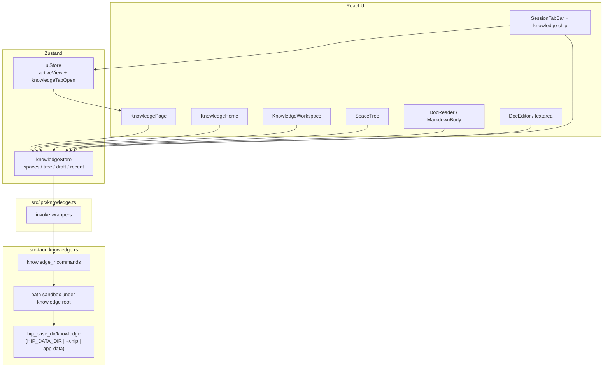
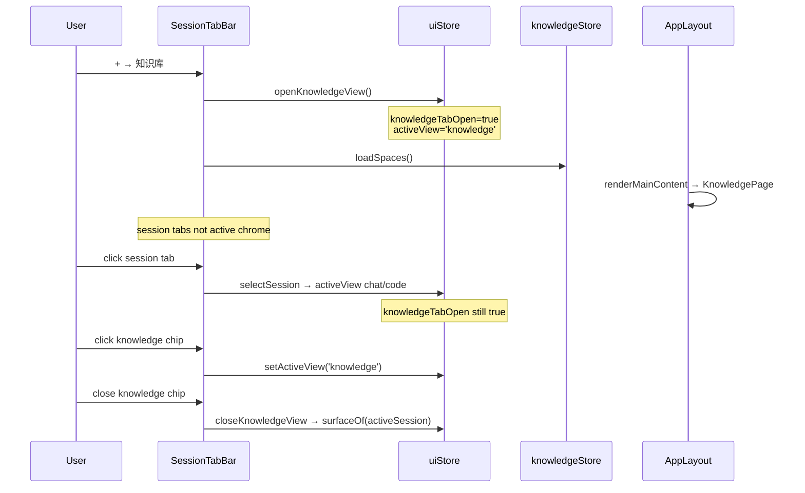
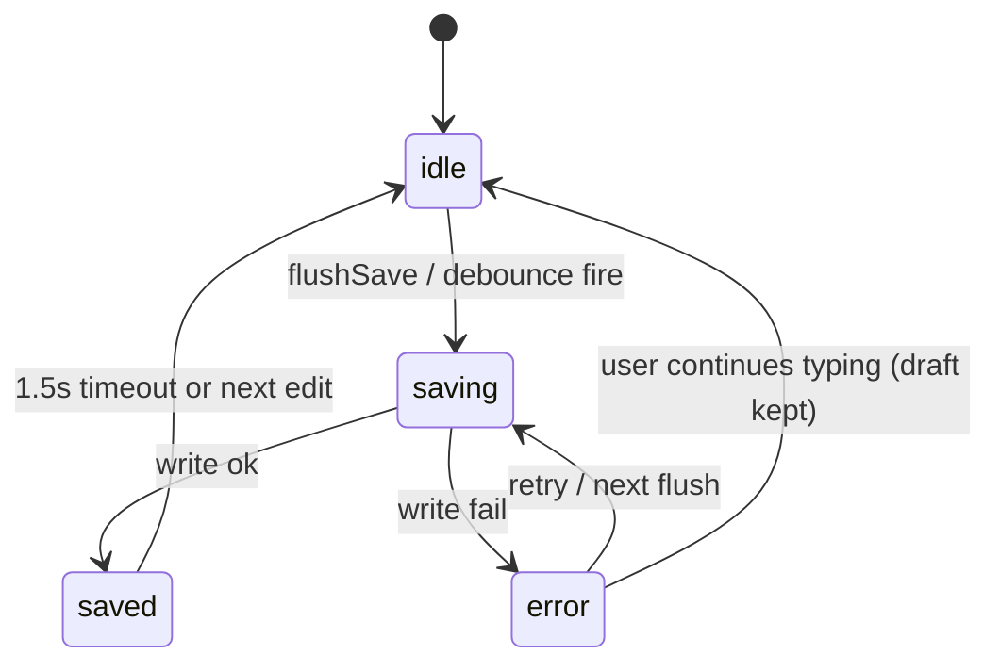

# Knowledge Base — Design Document

| Field | Value |
|-------|-------|
| **Title** | Local-first Markdown Knowledge Base (P0 + P1) |
| **Author** | hip engineering (design consolidation) |
| **Date** | 2026-07-13 |
| **Status** | Draft (post-review revision) |
| **Spec** | [`docs/superpowers/specs/2026-07-13-knowledge-base-spec.md`](docs/superpowers/specs/2026-07-13-knowledge-base-spec.md) |
| **Plan** | [`docs/superpowers/plans/2026-07-13-knowledge-base.md`](docs/superpowers/plans/2026-07-13-knowledge-base.md) |
| **Prototype** | [`docs/prototypes/knowledge-base/index.html`](docs/prototypes/knowledge-base/index.html) |

---

## Overview

hip is a Tauri v2 desktop AI workbench with Chat and Code session surfaces, plus Memory for automatic agent recall. Users lack a **first-class, user-authored knowledge asset layer**: multi-space organization, a folder tree, and editable Markdown documents that persist independently of any conversation.

This design delivers a **local-first Markdown knowledge base** opened from the title-bar `+` menu. It is a parallel work surface (`activeView: 'knowledge'`) with a pseudo tab chip, not a session. Data lives under the hip data root (`$HIP_DATA_DIR` or `~/.hip` on Unix / app-data on Windows) at `knowledge/`, accessed only through sandboxed Tauri Rust commands (same pattern as skills). Reading reuses `MarkdownBody`; editing is a controlled `textarea` with debounced save.

**Locked product scope for this delivery:** no AI features inside the knowledge UI, no chat/session injection or `@` document attachment, and no relationship graph / bidirectional-link system.

---

## Background & Motivation

### Current state (verified in codebase)

| Area | Reality | Verified |
|------|---------|----------|
| `+` menu | `SessionTabBar` offers only 新对话 / 代码项目 (`src/components/tabs/SessionTabBar.tsx`) | Yes |
| Views | `ActiveView = 'chat' \| 'code' \| 'settings' \| 'history'` (`src/store/uiStore.ts`) | Yes |
| Special chrome | Settings/history replace the tab bar (`TitleBar.isSpecialView`); knowledge must **not** use this path | Yes |
| Session select | `sessionService.selectSession` sets `activeView` to chat/code (`src/domain/sessionService.ts`) | Yes |
| Restore on list | `applyRestoredOpenTabs` early-returns only for settings/history; knowledge must be added | Yes — **must change** |
| Markdown | `MarkdownBody` + `react-markdown` + `remark-gfm` | Yes |
| Local data | `paths::hip_base_dir` honors `HIP_DATA_DIR`; Windows uses app-data | Yes |
| FS I/O pattern | Explicit `#[tauri::command]` + `invoke` (skills); **no** unrestricted `plugin-fs` | Yes |
| Capabilities | `default.json`: core/opener/shell/dialog only — custom invoke needs no FS plugin scope | Yes |
| Atomic write precedent | models catalog: tmp + rename in `lib.rs` | Yes |
| IDs / toasts / modals | `nanoid`, `sonner`, `Modal`, `EmptyState` | Yes |
| Right panel / PanelToggle | Gated on chat/code only → auto-hidden on knowledge | Yes |
| `activeView` persistence | Part of `hip-ui` partialize → rehydrate clamp required | Yes |

### Pain points

1. Knowledge created in chat evaporates with session lifecycle; Memory is system-owned, not “books.”
2. Code surface file tree is project-cwd scoped, not a personal knowledge library.
3. No durable multi-space doc tree with hip-native UI chrome.

### Why not sidecar / protocol

Skills and secrets already prove the **Tauri command** path for hip-owned files under the data root. Sidecar protocol expansion would couple knowledge to agent runtime, invite accidental AI/memory integration, and is unnecessary for CRUD on a few hundred Markdown files. Search stays in-process (title filter P0; MiniSearch P1).

---

## Goals & Non-Goals

### Goals (P0 unless noted)

| ID | Goal |
|----|------|
| G1 | `+` menu item「知识库」opens knowledge surface |
| G2 | Independent tab chip (`knowledgeTabOpen`); not a session id |
| G3 | Multi-space **create / rename / delete** with UI affordances; home with cards + recent list |
| G4 | Folder/doc tree: create / rename / delete / expand-collapse |
| G5 | Markdown read (`MarkdownBody`) + edit (`textarea`) + debounced persist |
| G6 | P0: title (and space-name) filter; P1: MiniSearch title+body |
| G7 | Persist under hip knowledge root; restart-safe |
| G8 | i18n en / zh-CN / zh-TW |

> **Note on stale spec §5:** Spec P1 still lists rename/delete; this design and G3/G4 lock **rename/delete for spaces and nodes in P0**. Implementers must ignore that stale P1 bullet.

### Non-goals (hard locks)

| ID | Non-goal |
|----|----------|
| NG1 | AI Q&A / summarize / auto-organize inside knowledge UI |
| NG2 | Session inject, `@` docs into prompt, context mount |
| NG3 | Relationship graph, wiki-links `[[…]]`, backlink panel |
| NG4 | Multiplayer / CRDT / cloud sync |
| NG5 | WYSIWYG (TipTap/Milkdown/Lexical) or Notion databases |
| NG6 | RBAC / sharing links |
| NG7 | Merge with Memory settings page |
| NG8 | Obsidian vault plugin ecosystem |
| NG9 | Unified `openTabs: SessionTab \| KnowledgeTab` refactor (deferred) |
| NG10 | Sidecar protocol messages for knowledge I/O |
| NG11 | Unscoped `tauri-plugin-fs` for knowledge |

---

## Completeness Audit (spec + plan)

### Fully specified

| Topic | Where | Notes |
|-------|-------|-------|
| Product positioning & non-goals | Spec §1 | Clear: not AI, not Memory, not graph |
| UX IA (home / workspace) | Spec §2, prototype | Three scenes aligned |
| On-disk layout | Spec §3.1, Plan “On-disk contract” | `index.json` + per-space `meta/tree/docs` |
| Tab model choice | Spec §3.2.1 Option A, Plan locked | Pseudo-chip |
| Task decomposition T1–T10 | Plan | File map, commits, PR batches |
| Rust command list | Plan T2 | **Ten** commands (see design table) |
| Store shape & actions | Plan T4 | Concrete state fields |
| i18n key list | Plan T8 | Namespace draft (extended for space rename) |
| Verification matrix | Plan | Maps G1–G8 / NG1–3 |
| Reuse MarkdownBody, sonner, Modal, lucide | Spec + code | Dependencies validated |
| Path helpers & HIP_DATA_DIR | Code `paths.rs` | Plan notes reuse; design binds it |
| Skills-style path sandbox | Code `skills::safe_join` / id guards | Pattern to mirror |

### Underspecified or contradictory

| # | Gap | Spec | Plan | Code | Severity |
|---|-----|------|------|------|----------|
| C1 | **Search P0 vs MVP MiniSearch** | §4.5 MiniSearch MVP; A6 title-only OK | Title P0, MiniSearch P1 | — | **Resolved: Plan wins** |
| C2 | **Rename/delete in P0 vs P1** | G4 vs §5 P1 | T4/T7 P0 | — | **Resolved: P0** (ignore stale §5) |
| C3 | **Recent docs** | P1 §5 | T4.8 P0 | — | **Resolved: P0** localStorage |
| C4 | **Domain model fields** | rootPath/spaceId/slug | Not on disk | — | **Resolved: drop** |
| C5 | **Service layer name** | knowledgeService.ts | Architecture says service; file map ipc | skills: store→ipc | **Resolved: store→ipc; plan text superseded** |
| C6 | **KnowledgeSearch.tsx** | Spec list | Not in file map | — | **Resolved: inline** |
| C7 | **Knowledge root path** | `~/.hip/knowledge` | Same | Must use hip_base | **Resolved: knowledge_dir** |
| C8 | **Persisted knowledge view** | — | Prefer not force boot | activeView persisted | **Resolved: rehydrate clamp** |
| C9 | **closeKnowledgeView restore** | Vague | previousView/session | previousView specials only | **Resolved: activeSession surfaceOf** (rev) |
| C10 | **Id validation** | Prefixes | nanoid | skills minimal | **Resolved: shared regex both sides** |
| C11 | **Corrupt tree.json** | Safe mode | — | — | Soft error P0 |
| C12 | **meta/index dual-write** | Both | Keep in sync | — | **Resolved: ordered rules** |
| C13 | **External editor** | No watch | — | — | last-write-wins P0 |
| C14 | **Editor layout** | Split or toggle | optional split | — | **Resolved: exclusive Edit/Read only P0** |
| C15 | **Autosave vs Done** | Both | 500ms + Done | — | Resolved: Tier A await + Tier B void flush |
| C16 | **Empty doc body** | — | empty md | — | `''` |
| C17 | **Order without DnD** | order field | DnD out | — | nextOrder only |
| C18 | **Command palette** | Optional | Optional | — | P1 |
| C19 | **Export/import** | P1 | T10 optional | dialog present | **PR5 only** (not PR4) |
| C20 | **Right panel on knowledge** | — | — | gated chat/code | OK |
| C21 | **PanelToggle** | — | — | null if not chat/code | OK |
| C22 | **knowledgeService vs tree** | — | pure tree | — | OK |
| C23 | **Space icon** | optional emoji | optional | — | optional; BookOpen fallback |
| C24 | **Multi-instance** | — | — | single window | last-write-wins |
| C25 | **Windows path** | `~/.hip` language | — | app-data | never hardcode |
| C26 | **Session tab dual-active** | — | — | active=id match only | **Resolved: gate on activeView** |
| C27 | **Space rename/delete UI** | G3 | store only | — | **Resolved: card/workspace ⋯ menus** |
| C28 | **openRecent orchestration** | open space+doc | vague | — | **Resolved: openRecent / openSpace opts** |
| C29 | **sessionService knowledge guard** | — | prefer not touch | applyRestoredOpenTabs | **Resolved: one-line guard required** |
| C30 | **PR2 half-entry** | — | optional stub | no knowledge branch | **Resolved: AppLayout stub mandatory in PR2** |

### Must decide before implementation (resolved)

1. Search P0 = title filter only ✅  
2. Rename/delete spaces **and** nodes = P0 with UI ✅  
3. Recent = P0 (localStorage) + `openRecent` ✅  
4. Root = `hip_base_dir/knowledge` ✅  
5. Tab = pseudo-chip; session tabs inactive when knowledge focused ✅  
6. I/O = Tauri commands only ✅  
7. Rehydrate clamp + mid-session `applyRestoredOpenTabs` knowledge guard ✅  
8. Id: shared prefix regex TS+Rust ✅  
9. Dual-write index-first on delete ✅  
10. Dirty leave = Tier A **await** `flushSave` + Tier B KnowledgePage `void flushSave` ✅  
11. `closeKnowledgeView(): Promise<void>` uses `surfaceOf` from `@/lib/sessions` ✅  
12. PR2 ships AppLayout + placeholder KnowledgePage with menu ✅  
13. Missing doc **must** drop stale recent entry (not optional) ✅  

---

## Proposed Design

### High-level architecture



> **Plan supersession:** Implementation plan architecture line mentioning `knowledgeService` is **superseded**. Do **not** create `src/domain/knowledgeService.ts` or `src/domain/knowledge/knowledgeService.ts`. Pattern is `knowledgeStore` → `src/ipc/knowledge.ts` → Tauri (mirrors `skillsStore` → `ipc/skills`).

### Navigation & tab model

**Locked:** pseudo-chip, not unified Tab union.

```ts
// uiStore extensions
type ActiveView = 'chat' | 'code' | 'settings' | 'history' | 'knowledge'

// Non-persisted (not in hip-ui partialize)
knowledgeTabOpen: boolean
openKnowledgeView(): void
/** Async: flushes draft then restores surface. Callers may void-fire (button onClick); tests should await. */
closeKnowledgeView(): Promise<void>
```

**Semantics:**

| Action | Effect |
|--------|--------|
| `+` → 知识库 | `knowledgeTabOpen = true`, `activeView = 'knowledge'`, fire-and-forget `knowledgeStore.loadSpaces()` |
| Click knowledge chip | `activeView = 'knowledge'` (chip stays open) |
| **Close knowledge chip** | See **closeKnowledgeView** algorithm below |
| Click session tab | Existing `selectSession` → `activeView` chat/code; **chip remains** if still open |
| Open settings/history from knowledge | Special-view: `previousView` becomes `'knowledge'`; Back returns to knowledge |
| Re-click `+` → 知识库 when chip already open | Focus only (`activeView = 'knowledge'`) |

**Critical: knowledge is not `isSpecialView`.** TitleBar continues to show `SessionTabBar` when `activeView === 'knowledge'`.

#### closeKnowledgeView (locked algorithm)

**Type:** `closeKnowledgeView(): Promise<void>` (not `void`). Implementation is `async`.

**Callers:**
- SessionTabBar close button: `onClick={() => { void closeKnowledgeView() }}` (void-fire the promise is OK for UI)
- Unit tests: `await useUiStore.getState().closeKnowledgeView()`

```ts
import { surfaceOf } from '@/lib/sessions' // NOT sessionService

async function closeKnowledgeView(): Promise<void> {
  // 1. Flush any in-progress doc edit before leaving the surface (true await barrier)
  await useKnowledgeStore.getState().flushSave()

  const ui = useUiStore.getState()
  ui.setKnowledgeTabOpen(false)

  if (ui.activeView !== 'knowledge') return

  // 2. Restore surface from the *currently selected domain session*, not chatSessionId preference
  const session = useDomainStore.getState().sessions.find(
    (s) => s.id === useDomainStore.getState().activeSessionId,
  )
  if (session) {
    const surface = surfaceOf(session.config) // 'chat' | 'code' — from @/lib/sessions
    useUiStore.getState().setActiveView(surface)
    // Do NOT call selectSession: domain activeSessionId is already correct
  } else {
    useUiStore.getState().setActiveView('chat')
  }
}
```

**Why not `chatSessionId` first:** Domain `activeSessionId` is independent of surface pointers. Preferring `chatSessionId` can show the chat shell while the domain still holds a code session (or vice versa). Preferring `surfaceOf(activeSession)` keeps chrome and domain selection aligned.

**Why not `previousView`:** That field only tracks settings/history special entry; knowledge is non-special.

#### Session tab “active” styling (no dual-active)

Today `SessionTabBar` uses `active={session.id === activeId}` based only on domain selection. When knowledge is focused, that paints the last session tab **and** the knowledge chip as selected.

**Required change** in `SessionTabBar` (pass into `SessionTab` or compute at bar):

```ts
const activeView = useUiStore((s) => s.activeView)
const sessionTabActive =
  session.id === activeId && (activeView === 'chat' || activeView === 'code')
```

Knowledge chip: `aria-selected={activeView === 'knowledge'}` and active chrome when true.

**Test:** With knowledge open and a session still selected in domain, only `knowledge-tab` has selected styling; session tabs do not.

#### sessionService.applyRestoredOpenTabs guard (required one-line)

Verified bug path: when `activeView === 'knowledge'` and `activeSessionId == null` (or missing from list), `applyRestoredOpenTabs` falls through:

```ts
// current — knowledge treated as chat
if (st.activeView === 'settings' || st.activeView === 'history') return
const surface: Surface = st.activeView === 'code' ? 'code' : 'chat'
// → may selectSession and yank user out of knowledge
```

**Required change** in `src/domain/sessionService.ts` `applyRestoredOpenTabs`:

```ts
if (
  st.activeView === 'settings' ||
  st.activeView === 'history' ||
  st.activeView === 'knowledge'
) {
  return
}
```

- Tabs list still pruned above this guard (keep that).
- Cold-start rehydrate clamp remains separately for persisted `activeView: 'knowledge'`.
- Unit test: knowledge open + no active session + `session:list:result` path does **not** call `selectSession` / does not leave knowledge.

#### Rehydrate clamp (P0)

```ts
// uiStore onRehydrateStorage (extend existing hook)
if (state.activeView === 'knowledge') {
  useUiStore.setState({ activeView: 'chat', knowledgeTabOpen: false })
}
```

Do **not** persist `knowledgeTabOpen` in P0.



### AppLayout integration

In `renderMainContent` (`src/routes/AppLayout.tsx`), order:

```ts
if (activeView === 'history') return <SessionHistory />
if (activeView === 'settings') return <SettingsPage />
if (activeView === 'knowledge') return <KnowledgePage />  // NEW — before session null check
return activeSessionId == null ? <NewConversation /> : (<>...</>)
```

Right artifact panel already gates on `activeView === 'code'|'chat'` → stays collapsed on knowledge. No PanelGroup structural change required.

**PR2 requirement:** Ship this branch with a minimal `KnowledgePage` placeholder (`data-testid="knowledge-page"`) so menu entry never lands without main content. PR3 replaces placeholder with full UI.

### Domain model (TypeScript)

```ts
// src/domain/knowledge/types.ts

export type KnowledgeNodeKind = 'folder' | 'doc'

export interface KnowledgeSpace {
  id: string           // spc_…
  name: string
  icon?: string        // emoji; optional
  createdAt: number    // epoch ms
  updatedAt: number
}

export interface KnowledgeIndex {
  version: 1
  spaces: KnowledgeSpace[]
}

export interface KnowledgeNode {
  id: string                 // nod_… or doc_…
  parentId: string | null
  kind: KnowledgeNodeKind
  title: string
  order: number
  createdAt: number
  updatedAt: number
  // Intentionally NO spaceId (tree is per-space file)
  // Intentionally NO slug (id is the file key)
}

export interface KnowledgeTreeFile {
  version: 1
  nodes: KnowledgeNode[]
}

export interface KnowledgeRecentItem {
  spaceId: string
  docId: string
  title: string
  spaceName: string
  at: number
}
```

**Id generation (frontend):**

```ts
import { nanoid } from 'nanoid'

const newSpaceId = () => `spc_${nanoid(12)}`
const newFolderId = () => `nod_${nanoid(12)}`
const newDocId = () => `doc_${nanoid(12)}`
```

**Id validation (locked — same rule in TS helpers and Rust):**

```text
KNOWLEDGE_ID_RE = /^(spc|nod|doc)_[A-Za-z0-9_-]{6,64}$/
```

- Reject anything else (including empty, path separators, `..`).
- Not “regex or skills-minimal” — **full prefix regex on both sides** for knowledge (stricter than skills on purpose because ids are opaque keys under a shared root).

### Pure tree helpers

File: `src/domain/knowledge/tree.ts` (no I/O)

| Function | Contract |
|----------|----------|
| `buildChildrenMap(nodes)` | `Map<parentId\|null, KnowledgeNode[]>` |
| `listChildren(nodes, parentId)` | Sort by `order` asc, then `title` localeCompare |
| `getPathTitles(nodes, nodeId)` | Root→node titles; missing parent stops |
| `insertNode(nodes, node)` | Immutable append |
| `renameNode(nodes, id, title)` | Update title + `updatedAt` |
| `removeNodeSubtree(nodes, id)` | Return `{ nodes, removedDocIds }` all descendants |
| `nextOrder(nodes, parentId)` | `max(child.order)+1` or `0` |
| `filterNodesByTitle(nodes, query)` | Case-insensitive substring on title; empty query → all |
| `assertTreeInvariants(nodes)` | Unique ids; parent exists or null; no cycles; valid kinds — **used in unit tests** |

### On-disk layout

```text
<hip_base>/knowledge/
  index.json
  <spaceId>/
    meta.json          # KnowledgeSpace JSON (single space)
    tree.json          # KnowledgeTreeFile
    docs/
      <docId>.md       # UTF-8 Markdown body only (no required frontmatter)
```

**`index.json`:**

```json
{
  "version": 1,
  "spaces": [
    {
      "id": "spc_xYzAbCdEfGhI",
      "name": "产品知识库",
      "icon": "📦",
      "createdAt": 1720000000000,
      "updatedAt": 1720000000000
    }
  ]
}
```

**`meta.json`:** same shape as one space object (not wrapped). Keep in sync with index entry on create/rename/icon change.

**`tree.json`:** only `kind === 'doc'` has `docs/<id>.md`.

**JSON wire format:** All Rust DTOs use `#[serde(rename_all = "camelCase")]`. Invoke args and responses are camelCase (`createdAt`, `parentId`, `spaceId`, `docId`, `activeSpaceId` never on disk nodes).

Example `knowledge_create_space` request/response:

```json
// request
{ "name": "产品知识库", "icon": "📦" }

// response
{
  "id": "spc_xYzAbCdEfGhI",
  "name": "产品知识库",
  "icon": "📦",
  "createdAt": 1720000000000,
  "updatedAt": 1720000000000
}
```

Example `knowledge_save_tree` request:

```json
{
  "spaceId": "spc_xYzAbCdEfGhI",
  "tree": {
    "version": 1,
    "nodes": [
      {
        "id": "doc_abc123def456",
        "parentId": null,
        "kind": "doc",
        "title": "未命名",
        "order": 0,
        "createdAt": 1720000000000,
        "updatedAt": 1720000000000
      }
    ]
  }
}
```

**Atomic write (all JSON + md):** write `<path>.tmp` (or `.${pid}.tmp`) in same directory → `rename` over target (same pattern as models catalog cache in `lib.rs`).

**Dual-write order (single rule each):**

1. **Space create:** mkdir space → write empty `tree.json` → write `meta.json` → create `docs/` → update `index.json` **last** (space appears in list only when ready).  
2. **Space rename/icon:** update `meta.json` then `index.json`.  
3. **Space delete:** write `index.json` with space removed **first**, then `remove_dir_all(spaceDir)`. Orphan dirs after crash are OK; P0 does not GC; P1 may optionally remove dirs not in index.  
4. **Doc create:** write empty `.md` then `knowledge_save_tree` (tree references doc only after file exists).  
5. **Doc/folder delete:** save updated tree first, then `knowledge_delete_doc_file` for each `removedDocIds` (orphan md OK; never leave tree entry without recovery path).

**Orphan handling P0:** ignore orphan `.md` not in tree; missing md for a doc node → read returns `""` (Ok); toast once in UI if desired.

**Tree trust model (P0):** `knowledge_save_tree` trusts the local UI client. Sandbox protects **paths** only. Duplicate ids, cycles, or huge trees are accepted risk for single-user desktop. **Mitigations:** TS `assertTreeInvariants` in unit tests; optional cheap Rust checks (unique ids, `kind` ∈ {folder,doc}, node count ≤ 5000) are nice-to-have not required for PR1 merge. See Security.

### Rust module

**Files:** `src-tauri/src/knowledge.rs`, register in `lib.rs`, add `paths::knowledge_dir`.

```rust
// paths.rs
pub fn knowledge_dir(app: &AppHandle) -> Option<PathBuf> {
    hip_subdir(app, "knowledge")
}
```

**Commands (ten):**

| Command | Args (camelCase) | Returns | Errors |
|---------|------------------|---------|--------|
| `knowledge_ensure_root` | — | `{ root: string }` optional | no home dir |
| `knowledge_list_spaces` | — | `KnowledgeSpace[]` | corrupt index → Err or empty after repair |
| `knowledge_create_space` | `{ name, icon? }` | `KnowledgeSpace` | empty name; illegal |
| `knowledge_update_space` | `{ id, name?, icon? }` | `KnowledgeSpace` | not found |
| `knowledge_delete_space` | `{ id }` | `()` | not found / illegal id |
| `knowledge_get_tree` | `{ spaceId }` | `KnowledgeTreeFile` | not found |
| `knowledge_save_tree` | `{ spaceId, tree }` | `()` | sandbox / serialize |
| `knowledge_read_doc` | `{ spaceId, docId }` | `string` body | missing file → **Ok("")** |
| `knowledge_write_doc` | `{ spaceId, docId, body }` | `()` | sandbox |
| `knowledge_delete_doc_file` | `{ spaceId, docId }` | `()` | ignore missing |

**Sandbox algorithm** (mirror `skills::safe_join` + absolute containment):

1. Resolve knowledge root via `knowledge_dir`  
2. Validate `spaceId` / `docId` against `KNOWLEDGE_ID_RE`  
3. Join relative segments with `safe_join` only  
4. When path exists, `canonicalize` and require under canonical root  
5. Reject any path that escapes  

**Do not** add `tauri-plugin-fs` for P0. **Never hardcode** `~/.hip`.

**Rust tests** (use `HIP_DATA_DIR` tempdir or pure path helpers):

| Test name (suggested) | Asserts |
|----------------------|---------|
| `reject_path_traversal_dotdot` | `../` and encoded escapes fail |
| `reject_illegal_ids` | empty, `/`, `..`, wrong prefix fail |
| `create_space_layout` | meta + tree + docs dir under root |
| `atomic_write_readable` | after write, target valid JSON/md |
| `delete_space_index_first` | after partial failure simulation, index has no stale entry (if testable) |

```bash
HIP_DATA_DIR=$(mktemp -d) cargo test knowledge
```

### Frontend IPC

`src/ipc/knowledge.ts` — thin typed wrappers, same style as `src/ipc/skills.ts`:

```ts
import { invoke } from '@tauri-apps/api/core'
import type { KnowledgeSpace, KnowledgeTreeFile } from '@/domain/knowledge/types'

export async function knowledgeEnsureRoot(): Promise<void> {
  await invoke('knowledge_ensure_root')
}

export async function knowledgeListSpaces(): Promise<KnowledgeSpace[]> {
  return invoke<KnowledgeSpace[]>('knowledge_list_spaces')
}

// create/update/delete space, get/save tree, read/write/delete doc — all camelCase args

export function knowledgeErrorMessage(err: unknown): string {
  if (err instanceof Error) return err.message
  if (typeof err === 'string') return err
  return String(err)
}
```

Unit tests mock `@tauri-apps/api/core` invoke (pattern in `skills.test.ts`).

### knowledgeStore

```ts
// src/store/knowledgeStore.ts
interface KnowledgeState {
  loaded: boolean
  spaces: KnowledgeSpace[]
  activeSpaceId: string | null
  nodes: KnowledgeNode[]
  activeDocId: string | null
  docBody: string       // last saved/loaded body
  draftBody: string     // editor buffer
  editing: boolean      // exclusive: true = Edit mode, false = Read/Done
  mode: 'home' | 'workspace'
  searchQuery: string
  recent: KnowledgeRecentItem[]
  expandedFolderIds: Record<string, boolean>  // UI-only
  busy: boolean         // tree/space mutations serialized
  error: string | null
  saveState: 'idle' | 'saving' | 'saved' | 'error'
}
```

**Actions (orchestration):**

| Action | Behavior |
|--------|----------|
| `loadSpaces` | ensure_root → list → set spaces, loaded; load recent from localStorage |
| `createSpace(name, icon?)` | await busy gate; ipc create → append spaces → optionally `openSpace` |
| `renameSpace(id, name, icon?)` | ipc update; patch `spaces[]`; if active, chip label updates |
| `deleteSpace(id)` | confirm at UI; ipc delete; filter spaces; if `id === activeSpaceId`, `openHome`; scrub recent entries for that space |
| `openSpace(id, opts?: { selectDocId?: string })` | **await flushSave**; get_tree; mode workspace; set activeSpaceId/nodes; if `selectDocId`, then `openDoc(selectDocId)` else clear active doc |
| `openRecent(item: KnowledgeRecentItem)` | `openSpace(item.spaceId, { selectDocId: item.docId })` — single orchestration entry for Home recent rows |
| `openHome` | **await flushSave**; mode home; clear activeDoc/editing (keep spaces/recent) |
| `createFolder(parentId)` / `createDoc(parentId, title)` | if `busy` return/await; set busy; insertNode + nextOrder; for doc write `""` then save_tree; clear busy; for doc open + edit optional |
| `renameNode` / `deleteNode` | await flush if needed; tree mutate under busy; on delete remove md files; if activeDoc removed, clear editor |
| `openDoc(id)` | **await flushSave** first; if id not in nodes → toast `knowledge.doc.loadFailed`, clear selection, **must** drop matching `spaceId+docId` from `recent` and persist `hip-knowledge-recent`; else read_doc; set body/draft; `pushRecent` **only on success** |
| `setEditing(bool)` | true: draft=docBody; false: await flushSave then editing false |
| `setDraftBody` | update draft; `scheduleSave` (500ms debounce) if editing |
| `saveDoc` / `flushSave` | cancel pending debounce; write_doc if draft !== docBody (or lastWritten); update docBody; saveState; **always return Promise** |
| `setSearchQuery` | local only |
| `pushRecent` | unshift unique by spaceId+docId; cap 20; persist `hip-knowledge-recent` |

#### openRecent / missing doc (locked)

```ts
async openRecent(item: KnowledgeRecentItem) {
  await this.openSpace(item.spaceId, { selectDocId: item.docId })
}

async openSpace(id: string, opts?: { selectDocId?: string }) {
  await this.flushSave()
  const tree = await knowledgeGetTree(id)
  set({ activeSpaceId: id, nodes: tree.nodes, mode: 'workspace', … })
  if (opts?.selectDocId) {
    await this.openDoc(opts.selectDocId)
  } else {
    set({ activeDocId: null, docBody: '', draftBody: '', editing: false })
  }
}

async openDoc(id: string) {
  await this.flushSave()
  const spaceId = get().activeSpaceId
  const node = get().nodes.find((n) => n.id === id && n.kind === 'doc')
  if (!node) {
    toast.error(t('knowledge.doc.loadFailed'))
    // REQUIRED: drop stale recent entry for this spaceId+docId and re-persist
    this.dropRecent(spaceId, id)
    set({ activeDocId: null, docBody: '', draftBody: '', editing: false })
    return
  }
  const body = await knowledgeReadDoc(spaceId!, id)
  set({ activeDocId: id, docBody: body, draftBody: body, editing: false })
  this.pushRecent({ … })  // only after successful read
}
```

**Concurrency:**

- `busy` serializes tree/space mutations; UI **disables** New Doc / New Folder / tree destructive actions while `busy`.
- Tree saves are **not** debounced; each mutation awaits prior busy work.
- Doc body writes: per-`docId` promise chain to avoid out-of-order content.

**Debounce + flush (locked) — two tiers:**

Store owns `scheduleSave` / `flushSave` (always returns `Promise<void>`).

**Tier A — true await barriers** (must `await flushSave()` before continuing navigation/mutation):

- `openDoc`, `openHome`, `openSpace`, `openRecent`
- `setEditing(false)` / Done button
- `closeKnowledgeView` (async uiStore action)
- blur handler may await (optional)

For these paths: do not continue until the promise settles. If save fails, still continue after toast (no blocking modal).

**Tier B — best-effort fire-and-forget** (React cannot await unmount / external view switches):

View transitions that leave knowledge **without** going through Tier A APIs still need a flush, but React effect cleanups and foreign `setActiveView` calls cannot block on async work. **Centralize** one best-effort flush:

```ts
// KnowledgePage.tsx — preferred single place
useEffect(() => {
  return () => {
    // Leaving knowledge surface (session tab, settings/history, chip close already awaited
    // in closeKnowledgeView — double flush is idempotent if draft === docBody)
    void useKnowledgeStore.getState().flushSave()
  }
}, [])
```

Optional additional `void flushSave()` in DocEditor cleanup is redundant if KnowledgePage owns it; pick **one** central site (KnowledgePage unmount preferred).

**Accepted residual risk (Low):** last keystrokes within the 500ms debounce window can still be lost if the process dies mid Tier-B flush, or if unmount races an in-flight write. Same class of risk as generic autosave; not a P0 blocker.

### UI components

```text
src/components/knowledge/
  KnowledgePage.tsx       # mode switch + error banner (+ PR2 placeholder)
  KnowledgeHome.tsx       # cards, recent, search, space ⋯ menus
  KnowledgeWorkspace.tsx  # two-column shell + space header menu
  SpaceTree.tsx           # expand/select/context actions
  DocReader.tsx           # MarkdownBody
  DocEditor.tsx           # textarea only (P0)
```

**Home**

- Hero title + create space (`Modal` with name input + optional emoji)  
- Search filters space **names** and recent **titles** (P0 A6 soft); not full-text  
- Space cards: icon, name, click → `openSpace(id)`  
- **Space card `⋯` menu (P0, required for G3):**  
  - Rename → Modal prefilled name → `renameSpace`  
  - Delete → destructive Modal (`knowledge.space.deleteConfirm`) → `deleteSpace`  
  - testids: `knowledge-space-menu`, `knowledge-space-rename`, `knowledge-space-delete`  
- Recent rows: title, spaceName → `openRecent(item)`  
- Empty: `EmptyState` with create CTA  
- testids: `knowledge-home`, `knowledge-space-card`, `knowledge-create-space`, `knowledge-recent-item`

**Workspace**

- Left (~240–280px): back to home (`openHome`), **space title + `⋯`** (rename/delete same as home), New Doc / New Folder (**disabled when `busy`**), `SpaceTree`  
- Tree: folders chevron toggle; docs file icon; selected `bg-state-active`; context menu rename/delete for nodes  
- Right: breadcrumb from `getPathTitles`; toolbar **Edit** / **Done**; save indicator  
- **Editor mode P0 (locked):** exclusive via `editing` flag only  
  - `editing === false` → `DocReader` (`MarkdownBody` of `docBody`)  
  - `editing === true` → `DocEditor` (`textarea` of `draftBody`)  
  - **No side-by-side split in P0** (defer; avoids competing layouts)  
- No doc selected: empty prompt to create/select  

**Visual tokens:** `border-border`, `bg-surface`, `text-ink*`, accent sage. Icons: `BookOpen`, `Folder`, `FileText`, `Plus`, `Pencil`, `Check`, `MoreHorizontal` from `lucide-react`.

### SessionTabBar changes

```tsx
// Session tabs: not visually active when knowledge (or settings/history) is focused
const sessionTabActive =
  session.id === activeId && (activeView === 'chat' || activeView === 'code')

// Chip after session tabs, before +. Menu: after code item, separator, 知识库.
{knowledgeTabOpen && (
  <div
    role="tab"
    data-testid="knowledge-tab"
    aria-selected={activeView === 'knowledge'}
    // sizing mirror SessionTab (h-[28px], rounded-md, BookOpen icon)
    // active chrome when activeView === 'knowledge'
  >
    <span className="truncate">{knowledgeChipLabel}</span>
    <button aria-label={t('tabs.closeKnowledge')} onClick={() => void closeKnowledgeView()} />
  </div>
)}

<DropdownMenuItem data-testid="new-session-kb" onClick={…}>
  {t('dropdown.newKnowledge')}
</DropdownMenuItem>
```

**Chip label:** SessionTabBar **does** subscribe to a thin slice of `knowledgeStore` (`mode`, `activeSpaceId`, `spaces`). Pure helper:

```ts
function knowledgeChipLabel(
  t: TFunction,
  mode: 'home' | 'workspace',
  spaces: KnowledgeSpace[],
  activeSpaceId: string | null,
): string {
  if (mode === 'workspace' && activeSpaceId) {
    const name = spaces.find((s) => s.id === activeSpaceId)?.name
    if (name) return name
  }
  return t('tabs.knowledge')
}
```

Fallback `t('tabs.knowledge')` when spaces not loaded. Acceptable coupling; keep selector narrow to limit re-renders.

### Search

**P0**

- Home: filter `spaces` by name; filter `recent` by title (A6 soft)  
- Workspace tree filter: optional if free; not required for PR3 merge  

**P1 MiniSearch**

- Dependency: `minisearch`  
- Index fields: `id` (`spaceId:docId`), `title`, `body`, `spaceName`, `path`  
- Build lazily; update on write/rename/delete  
- Results open via `openRecent`-style path  
- **No export bundled in MiniSearch PR**  
- No AI ranking  

### Error paths & edge cases

| Scenario | Behavior |
|----------|----------|
| Invoke fails (no Tauri / web test) | Store `error`; toast; mock invoke in tests |
| Empty space name | Disable create; reject in Rust |
| Delete space | Modal confirm; `deleteSpace`; if active → `openHome` |
| Delete folder with children | Confirm; subtree + md deletes |
| Save fails mid-edit | Keep `draftBody`; `saveState='error'`; toast; never clear buffer |
| Navigate via Tier A APIs (open*, Done, close chip) | **await flushSave**; if fail still navigate + toast (no blocking dialog) |
| Leave knowledge via session tab / settings / history | KnowledgePage unmount: **`void flushSave()`** best-effort (Tier B); residual race accepted Low |
| DocEditor unmount alone | Prefer KnowledgePage-centralized Tier B; do not claim true await in React cleanup |
| Missing tree.json | Empty tree after create path; read error → toast |
| Corrupt JSON | Err → toast + empty state |
| Missing doc on openDoc / openRecent | toast; empty reader; **must** drop stale `spaceId+docId` recent entry and persist |
| Duplicate open save | Serialize per docId |
| Rapid multi-create | `busy` serializes; buttons disabled |
| Very large MD | textarea; risk documented |
| Title with path chars | Allowed in title; never path segment |
| List refresh while knowledge open | `applyRestoredOpenTabs` returns early |
| Close chip with active code session | `activeView = 'code'` via surfaceOf |
| Close chip with no session | `activeView = 'chat'` |
| Dual chrome | Session tabs inactive when knowledge focused |

### i18n

Add keys from plan T8 **plus**:

```text
dropdown.newKnowledge
tabs.knowledge
tabs.closeKnowledge
knowledge.space.rename
knowledge.space.renameTitle
knowledge.space.delete
knowledge.space.deleteConfirm
knowledge.space.deleteConfirmBody
# …existing plan keys…
```

Three locales; `translation-keys.test.ts` parity; real zh copy.

### Testing strategy

| Layer | What |
|-------|------|
| `tree.test.ts` | insert, subtree delete, path, sort, filter, nextOrder, invariants |
| Rust `knowledge` | sandbox traversal, illegal ids, create layout, atomic write (`HIP_DATA_DIR`) |
| `ipc/knowledge` | mock invoke args camelCase |
| `knowledgeStore.test.ts` | load, create doc, save, recent cap, delete space, **openRecent missing doc**, busy serialize |
| `uiStore.test.ts` | open/close knowledge; **close restores surfaceOf(activeSession)**; rehydrate clamp |
| `sessionService` test | **knowledge activeView early-return** on restore path |
| `SessionTabBar.test.tsx` | menu item + chip; **session tab not active when knowledge focused** |
| `KnowledgeHome` / tree / editor | mock store; space rename/delete menus |
| `AppLayout.test.tsx` | knowledge branch renders KnowledgePage |
| Manual | plan T9.3 + G3 rename/delete space |

### Performance budgets (P0 assumptions)

| Metric | Target |
|--------|--------|
| Spaces | ≤ 50 |
| Nodes per space | ≤ 2_000 |
| Doc size | ≤ 500 KB typical; 2 MB practical textarea limit |
| Open space (tree load) | < 100 ms local SSD |
| Debounced doc save | 500 ms after last keystroke |
| Tree mutation | Full tree rewrite per op; serialized via `busy`; fine ≤2k nodes |
| Title filter | O(n) in-memory |

---

## API / Interface Changes

### New Tauri commands (10)

```text
knowledge_ensure_root,
knowledge_list_spaces,
knowledge_create_space,
knowledge_update_space,
knowledge_delete_space,
knowledge_get_tree,
knowledge_save_tree,
knowledge_read_doc,
knowledge_write_doc,
knowledge_delete_doc_file,
```

All DTOs: `#[serde(rename_all = "camelCase")]`.

### uiStore surface

```ts
type ActiveView = 'chat' | 'code' | 'settings' | 'history' | 'knowledge'

knowledgeTabOpen: boolean
setKnowledgeTabOpen(v: boolean): void
openKnowledgeView(): void
/** Returns Promise; UI may void-fire, tests await. Uses surfaceOf from @/lib/sessions. */
closeKnowledgeView(): Promise<void>
```

`setActiveView` special-case list **unchanged** (still only settings/history for `previousView`).

### sessionService (surgical)

```ts
// applyRestoredOpenTabs
if (st.activeView === 'settings' || st.activeView === 'history' || st.activeView === 'knowledge') return
```

### SessionTabBar

- Menu item + chip  
- Session `active` gated on chat/code `activeView`  
- Optional narrow knowledgeStore subscription for chip label  

### AppLayout

- `knowledge` branch → `KnowledgePage` (placeholder in PR2, full in PR3)

### No protocol / sidecar / packages/protocol changes

---

## Data Model Changes

### New on-disk schema

Versioned JSON (`version: 1`). No SQLite.

### Migration

- First open: `knowledge_ensure_root` → dir + `index.json` `{ version: 1, spaces: [] }`  
- No import from other products  
- Future `version: 2` reader upgrade in Rust  

### localStorage

| Key | Content |
|-----|---------|
| `hip-knowledge-recent` | `KnowledgeRecentItem[]` max 20 |
| `hip-ui` | activeView clamp only; **not** knowledgeTabOpen |

---

## Alternatives Considered

### 1. Unified Tab entity (`openTabs: Array<Session \| Knowledge>`)

- **Pros:** Cleaner long-term; multi knowledge tabs  
- **Cons:** Large refactor  
- **Decision:** Reject P0; pseudo-chip  

### 2. Sidecar protocol + SQLite FTS

- **Pros:** Shared with memory; scale  
- **Cons:** Protocol churn; agent lifecycle coupling  
- **Decision:** Reject until needed  

### 3. Pure directory hierarchy without tree.json

- **Pros:** External-editor friendly  
- **Cons:** Unstable ids/order  
- **Decision:** tree.json + id-keyed docs  

### 4. `tauri-plugin-fs` scoped allowlist

- **Pros:** Fewer commands  
- **Cons:** Capability complexity; inconsistent with skills  
- **Decision:** Explicit commands  

### 5. CodeMirror / TipTap in P0

- **Pros:** Editing UX  
- **Cons:** Bundle/theme time  
- **Decision:** textarea P0  

### 6. MiniSearch in P0

- **Pros:** Body search earlier  
- **Cons:** Index build cost before UI lands  
- **Decision:** P1  

---

## Security & Privacy Considerations

| Threat | Severity | Mitigation |
|--------|----------|------------|
| Path traversal via spaceId/docId | High | Shared id regex + `safe_join` + root containment |
| Symlink escape | Medium | Canonicalize when possible; reject outside root |
| Knowledge exfil via agent tools | High if later wired | **Do not** expose to sidecar/tools |
| XSS via Markdown | Low–Med | Existing react-markdown defaults (no raw HTML) |
| Sensitive docs plaintext at rest | Info | Same as skills/config; local machine |
| Filename from title | High if done | Never; id-only paths |
| Malicious/buggy full-tree write | Low (single user) | **Accepted P0:** trust local UI; TS invariant tests; optional Rust caps (see Tree trust model) |
| Zip import slip (P1+) | High | Reuse skills zip-slip extraction if import added |

Auth: none beyond OS user. No new secrets.

---

## Observability

| Signal | Approach |
|--------|----------|
| Errors | `console.error` + `toast.error` i18n |
| Save state | UI idle/saving/saved/error |
| Rust | `eprintln!("[tauri] knowledge …")` |
| Metrics / alerting | None P0 |

---

## Rollout Plan

1. **PR1** foundation — types, tree, Rust FS, ipc  
2. **PR2** state + entry + **AppLayout placeholder** + sessionService guard + i18n  
3. **PR3** full UI (G3 menus, dual-tab styling already in PR2, editor, tests)  
4. **PR4** MiniSearch **only**  
5. **PR5** optional export/import/CodeMirror  

**Feature flag:** not required.  
**Rollback:** revert PRs; orphan knowledge dir harmless.  
**Staging:** `HIP_DATA_DIR` isolation for E2E later.

---

## Open Questions

| # | Question | Recommendation | Blocks P0? |
|---|----------|----------------|------------|
| Q1 | Persist last `activeSpaceId`? | No P0; recent only | No |
| Q2 | Default new doc title locale? | UI passes `t('knowledge.doc.untitled')` | No |
| Q3 | Space icon picker? | Optional free emoji; BookOpen fallback | No |
| Q4 | Workspace tree filter P0? | Skip if busy | No |
| Q5 | Command palette open KB? | P1 optional | No |
| Q6 | Auto-select first doc on open space? | No | No |
| Q7 | Confirm dialog? | Existing `Modal` | No |

---

## Risks

| Risk | Severity | Mitigation |
|------|----------|------------|
| Route knowledge through `isSpecialView` | High | Explicit TitleBar note + tests |
| Hardcoded `~/.hip` | High | Always `paths::knowledge_dir` |
| Dual index/meta drift | Medium | Ordered dual-write helpers in Rust |
| Autosave leave race | Low–Med | Tier A await on store leave APIs; Tier B `void flushSave` on KnowledgePage unmount; residual debounce loss accepted |
| Dual-active tab chrome | Medium | session active gated on chat/code |
| List restore yanks knowledge | High | sessionService knowledge guard |
| PR2 half-entry without content | High | AppLayout + placeholder mandatory |
| Scope creep AI/inject/graph | High | PR checklist |
| Stale spec §5 defers rename/delete | Medium | Checklist: P0 includes rename/delete |
| Spec MiniSearch MVP wording | Medium | P1 lock |
| textarea large files | Low | Document limit |
| knowledgeStore sub in TabBar | Low | Narrow selector + pure label helper |

---

## Implementation notes (engineer checklist)

### File map (authoritative)

**Create**

```text
src/domain/knowledge/types.ts
src/domain/knowledge/tree.ts
src/domain/knowledge/tree.test.ts
src/domain/knowledge/ids.ts            # KNOWLEDGE_ID_RE + generators (shared with tests)
src/ipc/knowledge.ts
src/ipc/knowledge.test.ts
src/store/knowledgeStore.ts
src/store/knowledgeStore.test.ts
src/components/knowledge/KnowledgePage.tsx   # PR2 placeholder → PR3 full
src/components/knowledge/KnowledgeHome.tsx
src/components/knowledge/KnowledgeWorkspace.tsx
src/components/knowledge/SpaceTree.tsx
src/components/knowledge/DocReader.tsx
src/components/knowledge/DocEditor.tsx
src/components/knowledge/KnowledgeHome.test.tsx
src/components/knowledge/SpaceTree.test.tsx
src-tauri/src/knowledge.rs
```

**Modify**

```text
src/store/uiStore.ts
src/store/uiStore.test.ts
src/components/tabs/SessionTabBar.tsx
src/components/tabs/SessionTabBar.test.tsx
src/routes/AppLayout.tsx
src/routes/AppLayout.test.tsx
src/domain/sessionService.ts           # applyRestoredOpenTabs knowledge guard ONLY
src/domain/sessionService.test.ts      # corresponding test
src/i18n/en.ts
src/i18n/zh-CN.ts
src/i18n/zh-TW.ts
src-tauri/src/paths.rs                 # knowledge_dir
src-tauri/src/lib.rs                   # mod + commands
```

**Do not touch**

```text
packages/sidecar/**
packages/protocol/**                   # P0
src/components/account/MemoryConfig.tsx
docs/prototypes/**
# Do not add knowledgeService.ts
# Do not expand sessionService beyond the one-line knowledge early-return (+ tests)
```

### Default content for new doc

- File body: empty string  
- Title: localized untitled string from UI at create  

### Save state machine



### PR checklist (every knowledge PR)

- [ ] No AI / inject / graph affordances or protocol hooks  
- [ ] P0 includes **space and node** rename/delete (ignore stale spec §5 P1 bullet)  
- [ ] Never hardcode `~/.hip`; use `knowledge_dir` / `HIP_DATA_DIR`  
- [ ] camelCase serde on all knowledge DTOs  

---

## Key Decisions

| # | Decision | Rationale |
|---|----------|-----------|
| K1 | **Pseudo-chip** `knowledgeTabOpen` + `activeView: 'knowledge'` | Minimal change; plan lock |
| K2 | **Knowledge is not special TitleBar view** | Keep session tabs visible |
| K3 | **Storage under `hip_base_dir/knowledge`** via `paths::knowledge_dir` | HIP_DATA_DIR + Windows app-data |
| K4 | **Tauri Rust commands only** | Skills pattern; no protocol churn |
| K5 | **tree.json + `docs/<id>.md`** | Stable ids/order |
| K6 | **No spaceId/slug/rootPath on disk nodes** | Tree is per-space; id is file key |
| K7 | **Editor = exclusive textarea Read/Edit** | Zero deps; **no split P0** |
| K8 | **Search P0 title/name; MiniSearch P1** | Ship UI first; A6 soft |
| K9 | **Rename/delete + recent in P0** | G3/G4; UI menus required |
| K10 | **No AI / session inject / graph** | Product lock |
| K11 | **Cold start clamp** away from knowledge | Avoid half-restored surface |
| K12 | **closeKnowledgeView(): Promise\<void\> uses `surfaceOf` from `@/lib/sessions`** | Align chrome with domain selection; no selectSession; fallback `'chat'`; UI void-fires, tests await |
| K13 | **Store → ipc** (no knowledgeService.ts) | Mirrors skillsStore; plan text superseded |
| K14 | **Atomic temp+rename writes** | Crash-safe JSON/md |
| K15 | **Dirty leave: Tier A await + Tier B void flush; no modal** | Store leave APIs and closeKnowledgeView **await** flushSave; external view switches use centralized KnowledgePage unmount `void flushSave()` (React cannot true-await cleanup); residual race Low |
| K16 | **P0 no DnD reorder** | nextOrder on create only |
| K17 | **Types in `src/domain/knowledge`**, not protocol | No sidecar share yet |
| K18 | **PR-split foundation → state/entry → UI → search** | Reviewable slices |
| K19 | **Session tab active only when activeView is chat/code** | Prevent dual-active chrome with knowledge chip |
| K20 | **applyRestoredOpenTabs early-return for knowledge** | Prevent list/reconnect yanking user out of knowledge |
| K21 | **Space rename/delete UI on Home cards and Workspace header** | G3 not store-only |
| K22 | **`openRecent` / `openSpace(id, { selectDocId })`** | Single orchestration; missing doc toast + **must** drop matching recent entry and re-persist |
| K23 | **PR2 must ship AppLayout + KnowledgePage placeholder with menu** | Never merge live entry without main content |
| K24 | **Shared id regex both TS and Rust** | One validation bar |
| K25 | **camelCase serde on all knowledge DTOs** | Match skills / frontend types |
| K26 | **PR4 = MiniSearch only; export = PR5** | Keep P1 search reviewable |
| K27 | **Trust local tree.json writes P0** | Single-user; path sandbox only; TS invariant tests |

---

## PR Plan

### PR1 — Knowledge foundation: types, tree, Tauri FS, IPC

| Field | Content |
|-------|---------|
| **Title** | `feat(knowledge): domain types, tree helpers, and sandboxed FS commands` |
| **Depends on** | None |
| **Tasks** | Plan T1 + T2 + T3 |
| **Files** | Create: `src/domain/knowledge/{types,tree,tree.test,ids}.ts`, `src/ipc/knowledge.ts` + test, `src-tauri/src/knowledge.rs`. Modify: `paths.rs` (`knowledge_dir`), `lib.rs` |
| **Description** | Pure tree helpers + shared id regex; ten Rust commands with camelCase DTOs, sandbox, atomic writes; typed ipc. No UI entry. |
| **Merge criteria** | `yarn vitest run src/domain/knowledge src/ipc/knowledge` green; `HIP_DATA_DIR=$(mktemp -d) cargo test knowledge` green; tests include `reject_path_traversal_dotdot`, `reject_illegal_ids`, `create_space_layout`, `atomic_write_readable`; no hardcoded `~/.hip` |

### PR2 — State, tab entry, AppLayout stub, sessionService guard, i18n

| Field | Content |
|-------|---------|
| **Title** | `feat(knowledge): store, tab entry, AppLayout placeholder, and restore guard` |
| **Depends on** | PR1 |
| **Tasks** | Plan T4 + T5 + T6 + T8 + surgical sessionService + AppLayout stub |
| **Files** | Create: `knowledgeStore` + tests; `KnowledgePage.tsx` **placeholder** (`data-testid="knowledge-page"`, simple empty/loading chrome). Modify: `uiStore` + tests (closeKnowledgeView surfaceOf), `SessionTabBar` + tests (menu, chip, **session inactive when knowledge**), `AppLayout` + test, **`sessionService.ts` + test** (knowledge early-return), i18n three locales |
| **Description** | Full store orchestration including `openRecent` / flushSave; open/close view; menu + chip live; **main content shows placeholder KnowledgePage** (not chat bleed-through); restore guard; dual-tab styling; i18n including space rename/delete strings. |
| **Merge criteria** | **Must not** merge menu without AppLayout knowledge branch + placeholder; uiStore close restores `surfaceOf(activeSession)`; sessionService test for knowledge guard; SessionTabBar dual-active test; translation-keys parity; store tests for openRecent missing doc |

### PR3 — Knowledge UI shell (user-visible P0 complete)

| Field | Content |
|-------|---------|
| **Title** | `feat(knowledge): home, workspace, reader/editor, space CRUD UI` |
| **Depends on** | PR2 |
| **Tasks** | Plan T7 + T9 |
| **Files** | Full `src/components/knowledge/*`; replace placeholder; component tests; mark spec **P0 Implemented** only when criteria met |
| **Description** | Home (cards, **space ⋯ rename/delete**, recent → openRecent, title filter); Workspace (tree, node CRUD, exclusive Read/Edit, autosave); empty/error states. |
| **Merge criteria** | A1–A5, **A6 soft (home name/title filter)**, A7–A8; G1–G5, **G6 soft**, G7–G8, **G3 full CRUD UI**; no AI/inject/graph; restart persistence manual; no side-by-side editor; checklist item on rename/delete P0 |

### PR4 — Full-text search (P1)

| Field | Content |
|-------|---------|
| **Title** | `feat(knowledge): MiniSearch full-text index on home search` |
| **Depends on** | PR3 |
| **Tasks** | Plan T10 search core **only** |
| **Files** | `minisearch` dep; search helper; Home results UI; index invalidate on write; tests |
| **Description** | Body+title MiniSearch; open docs from results; title filter remains fallback while index builds. **No export.** |
| **Merge criteria** | Fixture body query finds doc; no sidecar; no export/import/CodeMirror |

### Optional PR5 — Export / import / CodeMirror

| Field | Content |
|-------|---------|
| **Title** | `feat(knowledge): export markdown and optional CodeMirror editor` |
| **Depends on** | PR3 |
| **Description** | Single-doc export dialog; folder import; CodeMirror only if textarea feedback demands. Out of P0/P1-search critical path. |

### Suggested commit order (within PRs)

1. domain types + tree + ids  
2. tauri knowledge FS  
3. ipc wrappers  
4. knowledgeStore  
5. uiStore flags + close algorithm  
6. sessionService knowledge guard  
7. i18n  
8. SessionTabBar entry + dual-active fix  
9. AppLayout placeholder  
10. Knowledge full UI  
11. tests / spec status  
12. (P1) MiniSearch only  

---

## References

- Spec: `docs/superpowers/specs/2026-07-13-knowledge-base-spec.md`  
- Plan: `docs/superpowers/plans/2026-07-13-knowledge-base.md` — **architecture `knowledgeService` wording superseded by this design (store→ipc)**  
- Prototype: `docs/prototypes/knowledge-base/index.html`  
- Path root: `src-tauri/src/paths.rs` (`hip_base_dir`, `HIP_DATA_DIR`)  
- Skills FS pattern: `src-tauri/src/skills.rs` (`safe_join`), `src-tauri/src/lib.rs`  
- Skills IPC/store: `src/ipc/skills.ts`, `src/store/skillsStore.ts`  
- UI shell: `src/store/uiStore.ts`, `TitleBar.tsx`, `SessionTabBar.tsx`, `AppLayout.tsx`  
- Session restore: `src/domain/sessionService.ts` (`applyRestoredOpenTabs`, `selectSession`)  
- Surface helper: `src/lib/sessions.ts` (`surfaceOf` → `'chat' \| 'code'`)  
- Markdown: `src/components/chat/MarkdownBody.tsx`  
- Modal / EmptyState: `src/components/ui/Modal.tsx`, `EmptyState.tsx`  
- Capabilities: `src-tauri/capabilities/default.json`  
- i18n parity: `src/i18n/translation-keys.test.ts`  

---

## Change log

| Date | Note |
|------|------|
| 2026-07-13 | Initial design from spec + plan + codebase verification; locked non-AI / non-inject / non-graph; resolved search/recent/model/rehydrate conflicts |
| 2026-07-13 | Post-review revision: closeKnowledgeView surfaceOf; dual-active tabs; space CRUD UI; openRecent; sessionService guard; PR2 AppLayout gate; camelCase serde; id regex lock; await flushSave; PR4 search-only; K19–K27 |
| 2026-07-13 | Round 2: must-drop stale recent; Tier A/B flush policy (no false await-on-unmount); surfaceOf → `@/lib/sessions`; closeKnowledgeView(): Promise\<void\> |
