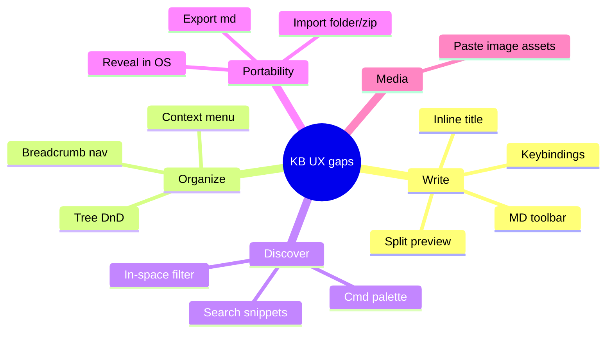
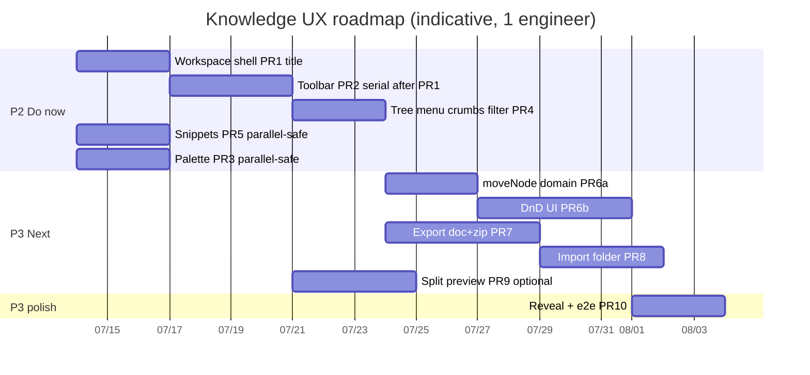
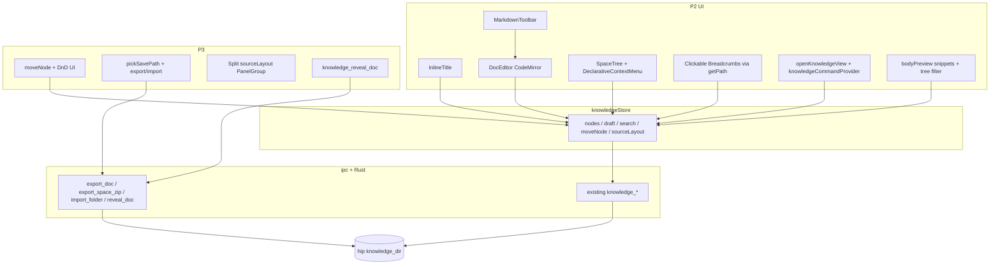
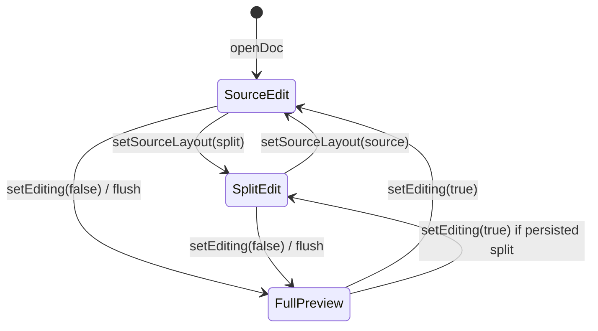

# 知识库 UX 大幅提升设计（对标 Notion 等）

| Field | Value |
|-------|-------|
| **Title** | Knowledge Base UX Uplift — High-Impact Optimizations (Notion-class, hip-fit) |
| **Author** | hip engineering (design) |
| **Date** | 2026-07-13 |
| **Status** | Draft (post-review revision) |
| **Scope** | Product + technical design for **post-P0/P1** knowledge UX; not a re-implementation of the current surface |
| **Prior locks** | [`2026-07-13-knowledge-base-spec.md`](docs/superpowers/specs/2026-07-13-knowledge-base-spec.md), [`2026-07-13-knowledge-base-design.md`](docs/superpowers/specs/2026-07-13-knowledge-base-design.md), [`2026-07-13-knowledge-editor-ux-spec.md`](docs/superpowers/specs/2026-07-13-knowledge-editor-ux-spec.md) |
| **Code base (verified)** | `src/components/knowledge/*`, `src/store/knowledgeStore.ts`, `src/domain/knowledge/*`, `src/ipc/knowledge.ts`, `src-tauri/src/knowledge.rs`, `src/components/command-palette/*`, `src/components/context-menu/*`, `src/ipc/dialog.ts`, `src-tauri/src/skills.rs` |

---

## Overview

hip 的知识库已具备 **本地优先 Markdown 知识空间** 的 P0+P1 闭环：`+` 入口伪标签、多空间首页、目录树 CRUD、CodeMirror 全高源码编辑（默认可写 + debounce 保存）、`MarkdownBody` 预览、MiniSearch 标题/正文检索、三语文案与 KE1–KE8 编辑路径 e2e。

相对 Notion / 飞书文档 / 语雀 / Obsidian / Craft / Apple Notes，用户感知的差距**不再是「能不能记」**，而是：

1. **写** — 仍像「源码框」，缺标题内联、格式化 affordance、文档内快捷键与分栏预览；
2. **理** — 树只有 hover 重命名/删除，无拖拽重排、无右键菜单、同级 `order` 只能 append；
3. **找** — 全局搜索有结果列表但无片段；工作区内无树过滤；命令面板几乎不感知知识库；
4. **出** — 无导出/导入，数据困在 `~/.hip/knowledge` 的 id 文件布局里。

本设计在**不推翻 Markdown 真源、不引入 Notion 块数据库/协作/知识库内 AI/图谱** 的硬约束下，给出对标竞品且与 hip 定位吻合的 **高 ROI UX 清单**、分阶段路线图，以及对 Top 能力的可实施技术设计与 PR 拆分。

---

## Background & Motivation

### 当前实现（代码事实，2026-07-13）

| 能力 | 现状 | 关键路径 |
|------|------|----------|
| 入口 / 表面 | `activeView: 'knowledge'` + `knowledgeTabOpen` 伪 chip；**打开必须** `uiStore.openKnowledgeView()`（同时设 chip + view） | `uiStore.ts` L194–195, `SessionTabBar.tsx` |
| 首页 | 空间卡片、最近打开、全局 MiniSearch | `KnowledgeHome.tsx` |
| 工作区 | 左树 + 右工具栏面包屑 + 编辑/预览切换；crumbs 用 `getPathTitles` → **仅 title 字符串** | `KnowledgeWorkspace.tsx` |
| 树 | 展开/选中/新建/hover 重命名删除；**无 DnD、无键盘导航、无 context menu** | `SpaceTree.tsx` |
| 编辑 | `@uiw/react-codemirror` + local `text` state + 反回灌约定；无 `onCreateEditor`、无工具条 | `DocEditor.tsx` |
| 预览 | 整页切换 `editing ? DocEditor : DocReader` | `KnowledgeWorkspace.tsx` |
| 保存 | store `draftBody` + 500ms debounce + blur/切文档 flush | `knowledgeStore.flushSave` |
| 搜索 | MiniSearch：`fields` 含 `body`，但 **`storeFields` 不含 body**（仅 spaceId/docId/title/spaceName/path）；命中无 snippet | `domain/knowledge/search.ts` L48–50 |
| 落盘 | `index.json` + `<spaceId>/{meta,tree,docs/<docId>.md}` | `src-tauri/src/knowledge.rs` |
| IPC | 10 个 `knowledge_*` 命令；**无 export/import/reveal** | `ipc/knowledge.ts` |
| 命令面板 | `when.views` 类型已含 `'knowledge'`；**无 nav-knowledge**；动态长尾靠 `CommandProvider`（如 `skillsCommandProvider`） | `buildGlobalCommands.ts`, `registry.ts` |
| 对话框 | **仅 open 选择器**（`pickDirectory` / `pickZipFile` / `pickAttachmentFiles`）+ e2e seams；**无 save dialog**；知识库未用 | `ipc/dialog.ts` |
| 压缩 | `zip` crate + `skills::extract_zip` / `safe_join`（含 zip-slip 测试）已存在 | `skills.rs`, `Cargo.toml` |
| Opener | `tauri-plugin-opener` + `opener:allow-open-path` 已初始化 | capabilities |

### 用户痛点（基于现状，而非泛化博客）

| # | 痛点 | 用户语言 |
|---|------|----------|
| P1 | 标题只在树里 Modal 改 | 「打开文档后看不到大标题，改名要去左边点」 |
| P2 | 加粗/列表/标题要手打 Markdown | 「飞书一点就有，这里像写代码」 |
| P3 | 整理树只能删了重建 | 「想把文档拖进文件夹、调整顺序」 |
| P4 | 工作区里找不到树内文档 | 「空间里文档多了，只能回首页搜」 |
| P5 | 无法备份/分享一篇或一个空间 | 「同事要一份 md / 我要迁到别的机器」 |
| P6 | 键盘流断裂 | 「Cmd+K 进不了知识库；没有 Cmd+N 新建」 |
| P7 | 预览要整页切换 | 「写表格时想边看渲染」 |
| P8 | 树操作 discoverability 差 | 「hover 才出重命名，右键没菜单」 |

### 产品定位回顾（不重开）

**知识库 = 本地优先的 Markdown 知识空间管理器**，与 Chat/Code 并列；不是 AI 问答台、不是会话附件柜、不是 Obsidian 图谱、不是 Notion 多维表。

---

## Goals & Non-Goals

### Goals

| ID | 目标 |
|----|------|
| UX1 | **写作摩擦显著下降** — 内联标题 + Markdown 工具条/快捷键；仍保持 MD 真源与现有保存语义 |
| UX2 | **组织摩擦显著下降** — 树拖拽移动/重排 + 右键菜单 + 可点击面包屑 |
| UX3 | **发现摩擦显著下降** — 命令面板接入知识库；工作区树过滤；搜索结果片段 |
| UX4 | **资产可携带** — 单文档导出 `.md`；空间导入/导出（zip 或文件夹） |
| UX5 | **预览可选增强** — 分栏 live preview（**可裁切**，不替换整页切换默认） |
| UX6 | **增量可合并** — Workspace 相关 PR **串行**；domain-only PR 可并行；不重写 on-disk 协议版本 |
| UX7 | **i18n + 测试** — 新文案 en/zh-CN/zh-TW；Vitest；关键路径 e2e 扩展 |
| UX8 | **设计语言一致** — 知识库 chrome/树/列表/编辑器与 FileTree、SessionHistory、AgentCard、`tokens.css` 同构；禁止另起皮肤 |

### Non-Goals（硬锁延续，本设计默认 **never**）

| ID | 非目标 | 说明 |
|----|--------|------|
| NG1 | 知识库内 AI 问答 / 摘要 / 自动整理 | Chat 表面负责 AI |
| NG2 | Chat/session 注入、@ 文档进 prompt | 另开产品线再议 |
| NG3 | 关系图谱 / wiki-links / backlinks 面板 | Obsidian 心智，非 hip 主路径 |
| NG4 | 多人协作 / CRDT / 云同步 | 本地单机 |
| NG5 | Notion 数据库 / 属性系统 / 看板主存 | 与 MD 真源冲突 |
| NG6 | 以 TipTap/块编辑器 **替代** Markdown 源码为唯一编辑面 | 可作为远期备选，非本路线默认 |
| NG7 | 合并 Memory 设置页 | Memory 保持独立 |
| NG8 | 完整 RBAC / 分享链接 / 租户 | 单机用户 |

### Soft non-goals（本轮 demote，非永久否决）

- 收藏/置顶、文档模板库、文件夹「封面页」、字数统计、版本历史 UI、自定义知识库根路径、虚拟列表万级树。
- **树键盘导航**（↑↓←→ / Home/End 焦点漫游）— P4 a11y 跟进；P2 右键菜单 + 点击仍是主路径，避免在 PR4 中重开为 scope。
- `duplicateNode` — 不在 P2/P3 交付清单。

---

## Gap Analysis（竞品 → hip）

评分：● 已有 / ◐ 部分 / ○ 缺失。**「Fit」** 仅评是否适合 hip 本地 MD + 桌面 AI 工作台。

### 对标矩阵

| 能力簇 | Notion | 飞书/语雀 | Obsidian | Craft/Notes | **hip 现状** | Fit | 本设计处置 |
|--------|--------|----------|----------|-------------|--------------|-----|-----------|
| 空间/库多根 | ● | ● | vault | ● | ● 多 space | 高 | 保持 |
| 树导航 + CRUD | ● | ● | 文件树 | ◐ | ● | 高 | 保持 |
| 拖拽整理树 | ● | ● | ● | ◐ | ○ | 高 | **P3 做** |
| 全文搜索 | ● | ● | ● | ● | ● MiniSearch | 高 | 增强 snippet/范围 |
| 即时搜索片段 | ● | ● | ● | ● | ○ | 高 | **P2 做** |
| 块级 WYSIWYG | ● | ● | 源码/Live | ● | ○ 源码+整页预览 | 中 | **不主推**；可选分栏 |
| MD 源码真源 | ○ | ○ | ● | ◐ | ● | **核心** | 保持 |
| 内联页面标题 | ● | ● | 文件名/H1 | ● | ○ 仅树 rename | 高 | **P2 做** |
| 格式化工具条 | ● | ● | 插件/快捷键 | ● | ○ | 高 | **P2 做** |
| `/` 斜杠命令（非 AI） | ● | ● | 插件 | ● | ○ | 中 | P4 轻量 |
| 分栏预览 | — | — | ● | — | ○ | 中高 | **P3 可选/可裁** |
| 双向链接/图谱 | ◐ | ○ | ● | ◐ | ○ | **低（锁）** | **Never** |
| 数据库/多维表 | ● | ◐ | 插件 | ○ | ○ | **低（锁）** | **Never** |
| 协作评论 | ● | ● | 插件 | ○ | ○ | 低 | Never |
| 导出/导入 MD | ● | ● | 原生 | ● | ○ | 高 | **P3 做**（原 P1 债有意后置） |
| 命令面板跳转 | ● | ◐ | ● | ◐ | ◐ 全局有、KB 无 | 高 | **P2 做** |
| 图片本地附件 | ● | ● | ● | ● | ○ 仅外链 | 中高 | P4 |
| AI 写进知识库 UI | ● | ● | 插件 | ○ | ○（锁） | 产品锁 | **Never 在 KB UI** |
| 最近打开 | ● | ● | ● | ● | ● localStorage | 高 | 保持 |
| 快捷键新建/保存 | ● | ● | ● | ● | ○（自动保存有） | 高 | **P2 做** |

### 差距归类（只保留 fit≥中）



---

## Prioritized Opportunity List

排序为 **序数排名**（非可复现公式）。Effort：S / M / L。Top 项与用户痛点 P1/P2/P4/P6/P8 及本地 MD 约束对齐。

| Rank | ID | 机会 | 用户痛 | 竞品模式 | hip 方案摘要 | Effort | Risk | Deps |
|------|-----|------|--------|----------|--------------|--------|------|------|
| 1 | O1 | **内联文档标题** | P1 | Notion/飞书页顶大标题 | 编辑区顶标题；blur/Enter → `renameNode` | S | 低 | 无 |
| 2 | O2 | **命令面板接入知识库** | P6 | Notion / Obsidian Quick Switcher | `openKnowledgeView` + `knowledgeCommandProvider` | S–M | 低 | palette registry |
| 3 | O3 | **MD 工具条 + 编辑快捷键** | P2 | 语雀/飞书工具条 | `mdEdit` + `onCreateEditor`；keymap 在 DocEditor 内 | M | 中：IME | O1 同编辑面 |
| 4 | O4 | **树右键菜单 + 可点面包屑** | P8 | 飞书树 | `DeclarativeContextMenu`；`getPath` 按 id | S | 低 | tree helper |
| 5 | O5 | **搜索 snippet + 工作区过滤** | P4 | 飞书搜索片段 | 索引存 `bodyPreview`；`filterTreeVisible` | S–M | 低 | search/tree |
| 6 | O6 | **树 DnD 移动/重排** | P3 | Notion/飞书 | pure `moveNode` + HTML5 UI 分 PR | M–L | 中 | tree helpers |
| 7 | O7 | **导出/导入** | P5 | 语雀导出；vault | `pickSavePath` + Rust export/import；复用 skills zip | M–L | 中 | dialog + Rust |
| 8 | O8 | **分栏 live preview** | P7 | Obsidian split | `editing` + `sourceLayout`；`PanelGroup` | M | 中 | DocEditor |
| 9 | O9 | **Reveal in Finder** | P5 弱 | Obsidian reveal | `knowledge_reveal_doc` + opener | S | 低 | Rust |
| 10 | O10 | **粘贴图片 → assets** | 写图文 | Notion/Obsidian | P4 | M–L | 中 | 新命令 |
| 11 | O11 | **轻量 `/` 插入块** | P2 | Notion slash（仅 MD） | P4 | M | 中 | O3 |
| 12 | O12 | **文档模板** | 冷启动 | Notion templates | P4 | M | 低 | — |
| 13 | O13 | **预览 TOC** | 长文 | 飞书大纲 | P4 | S–M | 低 | DocReader |
| 14 | O14 | **收藏/置顶** | 高频入口 | 语雀星标 | P4 | S–M | 低 | — |
| 15 | O15 | **文件夹落地页** | 空文件夹 | 语雀文件夹页 | P4；面包屑 click 定义见 C4 | S | 低 | — |

### 明确 Reject / Never（与 hip 冲突）

| 竞品能力 | 处置 | 理由 |
|----------|------|------|
| Notion Databases / Relations / Rollups | **Never** | 主存不是 MD；与 G5「Markdown 真源」冲突 |
| 全页 Block editor 替换源码 | **Never（默认）** | 序列化往返、推翻 CM + e2e 投资 |
| 知识库内 AI 写手/摘要按钮 | **Never** | 产品锁 NG1 |
| @文档注入会话 | **Never（本阶段）** | 产品锁 NG2 |
| Graph / `[[wikilinks]]` / backlinks | **Never** | 产品锁 NG3 |
| 实时协作 / CRDT / 云同步 | **Never** | 产品锁 NG4 |
| 评论线程 / 提及同事 | **Never** | 无账号协作模型 |
| 嵌入第三方网页全页 | Demote | 安全与离线一致性 |
| 自定义知识库根路径 | Demote → P4+ | 沙箱与迁移成本 |

---

## Recommended Roadmap



> Gantt 为 **示意容量**（单工程师量级），非发布承诺日期。

### 对「原 P1 可携带债」的显式说明

原 `knowledge-base-spec` P1 与 design C19 将 **单文档导出 / 导入文件夹** 列为「好用」项，但实现期未付清；editor-ux 亦将 export/DnD 标为正交后置。本设计将 **写作 + 发现（O1–O5）排在可携带（O7）之前**，是**有意的产品排序**：当前最大摩擦是「打开文档后不好写、不好找」，不是「不能备份」。O7 **仍在 P3 必做**（DnD + zip 与成功标准绑定）；**不是**永久 demote。利益相关方不应期望在 P2 polish 小版本里看到导出。

| Phase | 主题 | 做 | 不做 / 可裁 |
|-------|------|----|-------------|
| **P2 — Visual first** | 设计语言 | V0 baseline；V1 树对齐；V2 CM token 主题；V3–V5 随能力 PR 验收 | Notion 式渐变/插画/彩色 space 墙 |
| **P2 — Do now** | 写作 + 发现 | O1 标题；O2 面板；O3 工具条；O4 菜单+面包屑+过滤；O5 snippet | DnD、导入导出、分栏、图片、slash、模板、树键盘导航 |
| **P3 — Next** | 组织 + 可携带 | O6 DnD（6a+6b）；O7 导出/导入；O9 Reveal | — |
| **P3 — Optional** | 预览 | O8 分栏（**容量不够可整 PR 砍掉**，不挡 P3 成功标准） | — |
| **P4 — Later** | 媒体与润色 | O10–O15、树键盘 a11y | AI、图谱、块编辑器 |
| **Never for hip** | 见上表 | — | Databases、KB 内 AI、注入会话、图谱、CRDT、全量 WYSIWYG 替换 |

### 成功标准（可验证）

**P2 产品 + 测试门禁**

| 标准 | 验证 |
|------|------|
| 打开文档可见并可改标题 | Vitest `InlineDocTitle`；e2e：改标题后树节点文案更新 |
| 工具条 Bold 包选区 | `mdEdit.test.ts` 断言 `**…**`；手工 IME |
| Cmd+K → 知识库 | `buildGlobalCommands` / registry 单测；e2e 可选 |
| 搜索结果有 snippet 行 | `search.test.ts` + Home `data-testid="knowledge-search-snippet"` |
| 树过滤 | `filterTreeVisible` 单测（含重名祖先）；`knowledge-tree-filter` |
| 右键菜单 | testid 稳定项；重命名/删除仍走现有 modal |
| 磁盘仍为 md + tree.json | 无 schema migration |

**P3 产品门禁**

| 标准 | 验证 |
|------|------|
| 50+ 节点空间可拖拽整理 | `moveNode` 单测矩阵 + 手工 DnD |
| 单 doc 导出 md + 空间 zip 可再导入 | Rust 路径测试 + dialog seam e2e |
| 仍是可读 md 真源 | zip 内人类路径；内部 id 布局不变 |

---

## Proposed Design — Top Features

### 架构总览（增量）



---

### Feature A — 内联文档标题（O1）

#### UX

1. 打开文档后，编辑区顶部显示大标题（当前 `activeNode.title`），正文 CM 在其下。
2. 点击标题即可编辑；Enter 或 blur 提交；Esc 取消回滚。
3. 空标题不允许；trim 后空则恢复原标题或 `Untitled`（与 `renameNode` 一致）。
4. 预览态同样显示只读大标题（与正文 H1 解耦）。
5. 树节点与 recent 随现有 `renameNode` 更新。

```text
main
├─ toolbar (crumbs | saveState | edit/preview | source/split when editing)
└─ content shell
   ├─ InlineTitle   ← NEW (shrink-0, max-w-3xl 与正文对齐)
   ├─ MarkdownToolbar (editing only)
   └─ DocEditor / DocReader / split host
```

#### 技术

| 项 | 决策 |
|----|------|
| 组件 | `src/components/knowledge/InlineDocTitle.tsx` |
| 数据 | 读 `nodes` 中 `activeDocId` 的 `title`；提交 `renameNode(id, title)` |
| 不改 | 落盘协议；标题仍在 `tree.json` |
| 布局 | 标题 `shrink-0`；CM 仍为唯一纵向 scroller（编辑态） |

#### `createFolder` i18n（同 PR1 顺手）

```ts
// knowledgeStore — mirror createDoc
createFolder: (parentId: string | null, title: string) => Promise<void>

// KnowledgeWorkspace call site
void createFolder(parentForNew, t('knowledge.folder.untitled'))
// createDoc already:
void createDoc(parentForNew, t('knowledge.doc.untitled'))
```

- Store **不** import i18n。
- 新 key：`knowledge.folder.untitled`（en: `New folder` / zh-CN: `新建文件夹` / zh-TW: `新增資料夾`）。

#### 接口

```ts
export interface InlineDocTitleProps {
  docId: string
  title: string
  readOnly?: boolean
  onCommit: (title: string) => void | Promise<void>
}
```

无新 IPC。

---

### Feature B — Markdown 工具条 + 编辑快捷键（O3）

#### UX

编辑态工具条（InlineTitle 下）常见操作：

| 按钮 | 行为 | 快捷键 |
|------|------|--------|
| H1 / H2 / H3 | 当前行 ATX 标题 | Cmd+Alt+1/2/3 |
| Bold | `**…**` | Cmd+B |
| Italic | `*…*` | Cmd+I |
| Strikethrough | `~~…~~` | 可选 |
| Inline code | `` `…` `` | Cmd+E |
| Link | `[text](url)` | **工具条点击 only**（见 K11） |
| Bullet / Ordered | 行前 `- ` / `1. ` | Cmd+Shift+8 / 7 |
| Task | `- [ ] ` | — |
| Code fence | ``` 围栏 | — |
| Quote | 行前 `> ` | Cmd+Shift+. |

另：

- **Cmd+S** → `flushSave()`（全局/表面级，Workspace 绑定，非 CM 内部）。
- **Cmd+F** → CodeMirror search（`@codemirror/search`），仅编辑器聚焦。
- **Cmd+N** → workspace 内 `createDoc`（`activeView==='knowledge' && mode==='workspace'`；见 K15）。

#### 技术（锁定对接真实 DocEditor）

| 项 | 决策 |
|----|------|
| View 访问 | **`onCreateEditor={(view, state) => { viewRef.current = view }}`**（`@uiw/react-codemirror` 已有 prop；今日未用） |
| Toolbar 位置 | `MarkdownToolbar` 可在 Workspace，但 **只调用** `viewRef` + pure `mdEdit.*`；**禁止** 经 props 回灌 `value` |
| Keymap | **在 DocEditor 内部** `extensions` 注册 `Prec.highest(keymap.of([...]))`；不在 Workspace 挂 window listener |
| Helpers | `src/domain/knowledge/mdEdit.ts`：`wrapSelection`, `toggleLinePrefix`, `setAtxHeading` |
| 反回灌 | 保持现有 local `text` + `onDraftChange`；工具条 `dispatch` 后从 `view.state.doc` 推 `onDraftChange` |
| IME | `view.composing === true`（或 `compositionstart`/`compositionend`  debounced flag）时 **禁用** toolbar 按钮与 keymap 中的编辑命令 |
| 测试 | `mdEdit.test.ts` 用 `@codemirror/state` `EditorState`/`EditorView` headless；composition 以手工 + 注释测试计划为准 |

```ts
// DocEditor — sketch
const viewRef = useRef<EditorView | null>(null)
// extensions include knowledgeKeymap(handlers via refs)
// <CodeMirror onCreateEditor={(view) => { viewRef.current = view }} ... />
// export optional getView() for toolbar via ref imperative or lift viewRef to thin DocEditorShell
```

推荐结构：`DocEditor` 对外 `ref` 暴露 `{ getView(): EditorView | null }`（`useImperativeHandle`），Workspace 工具条 `docEditorRef.current?.getView()`。

#### 风险

| 风险 | 严重度 | 缓解 |
|------|--------|------|
| IME composition 中改文档 | 中 | `view.composing` 守卫；真机中文 |
| 多行列表切换错误 | 中 | 单测多行 |
| 工具条挤占高度 | 低 | 紧凑 icon 行 |

---

### Feature C — 命令面板 + 工作区发现（O2 + O5 + O4）

#### C1 命令面板（锁定打开路径 + provider）

**禁止** 仅 `setActiveView('knowledge')`。导航必须：

```ts
// nav-knowledge run:
ctx.openKnowledgeView() // uiStore: knowledgeTabOpen=true + activeView='knowledge'
if (!useKnowledgeStore.getState().loaded) {
  void useKnowledgeStore.getState().loadSpaces()
}
```

**静态命令**（`buildGlobalCommands`）：

| id | 行为 |
|----|------|
| `nav-knowledge` | `openKnowledgeView` + 条件 `loadSpaces` |
| `knowledge-go-home` | `when.views: ['knowledge']` → `openHome()` |
| `knowledge-new-doc` | `when.views: ['knowledge']` 且 workspace 有 `activeSpaceId` → `createDoc`；否则 toast「先打开空间」 |

**动态文档搜索** — **不要** 把长尾 hit 硬塞进 `buildGlobalCommands` 静态列表。新增：

```ts
// registry.ts — parallel to skillsCommandProvider
export function knowledgeCommandProvider(
  ctx: GlobalCommandContext,
  opts?: { force?: boolean },
): PaletteGroup[]
```

- **Search-only long tail**：`search.trim().length > 0`（或 `force`）时查询。
- 数据：`ctx.searchKnowledgeDocs?.(q)` → 读 module-level MiniSearch（与 store 共享 index；index 未 ready 返回空组 + 可选 description「索引构建中」）。
- 每条 command：`id: knowledge-doc-${spaceId}-${docId}`，`group: 'knowledge'`，`run` → `ctx.openKnowledgeDoc({ spaceId, docId, title, spaceName })` 内部：`openKnowledgeView()` + `openRecent(...)`。
- **P2 无 prefix 模式**（不做 `@`/`>` 式 knowledge mode）；走默认 fuzzy rank。
- `GlobalCommandContext` 扩展：

```ts
openKnowledgeView: () => void
openKnowledgeDoc: (item: { spaceId: string; docId: string; title: string; spaceName: string }) => void
searchKnowledgeDocs?: (q: string) => Array<{
  spaceId: string; docId: string; title: string; spaceName: string; path: string; snippet?: string
}>
knowledgeIndexReady?: boolean
// existing createDoc path may use:
knowledgeCreateDoc?: () => void
knowledgeOpenHome?: () => void
```

- `buildAllGroups` 调用 `knowledgeCommandProvider(ctxWithSearch)` 与 skills 并列。
- i18n：`commandPalette.navKnowledge`、`groupKnowledge` 等三语。
- 单测：registry 含 knowledge group；index 未 ready 不抛错。

#### C2 搜索 snippet（锁定 body 数据路径）

**问题（已核实）**：`storeFields` 当前为 `spaceId, docId, title, spaceName, path` — **不含 `body`**。命中对象无法取正文做窗口截取。

**锁定方案（P2）— 索引时写入 capped `bodyPreview`：**

```ts
// KnowledgeSearchDoc
export type KnowledgeSearchDoc = {
  id: string
  spaceId: string
  docId: string
  title: string
  body: string          // still indexed in fields for FTS
  bodyPreview: string   // NEW — stored; capped
  spaceName: string
  path: string
}

const BODY_PREVIEW_MAX = 2048 // chars; ~2KB

export function capBodyPreview(body: string, max = BODY_PREVIEW_MAX): string {
  if (body.length <= max) return body
  return body.slice(0, max)
}

// createKnowledgeIndex:
fields: ['title', 'body', 'spaceName', 'path'],
storeFields: ['spaceId', 'docId', 'title', 'spaceName', 'path', 'bodyPreview'],

// upsertSearchDoc callers (rebuild + indexCurrentDoc):
bodyPreview: capBodyPreview(body),

// KnowledgeSearchHit
export type KnowledgeSearchHit = {
  spaceId: string
  docId: string
  title: string
  spaceName: string
  path: string
  score: number
  snippet?: string
}

// searchKnowledge:
// 1) map stored fields including bodyPreview
// 2) snippet = buildSearchSnippet(bodyPreview, q)
```

```ts
/** Snippet from capped preview only — never re-reads full body. */
export function buildSearchSnippet(
  bodyPreview: string,
  query: string,
  opts?: { radius?: number; lead?: number },
): string | undefined {
  const radius = opts?.radius ?? 40
  const lead = opts?.lead ?? 80
  const windowed = windowAroundQuery(bodyPreview, query, { radius })
  // windowAroundQuery returns null/empty when no query token appears in preview
  // (common when FTS hit is only on body text past the 2KB cap, or title-only hit).
  if (windowed && windowed.trim()) return windowed
  const head = bodyPreview.trim()
  if (!head) return undefined // omit snippet line in UI (title/path still shown)
  return head.length <= lead ? head : `${head.slice(0, lead)}…`
}
```

**Accepted P2 limitation:** deep-body match highlighting is **best-effort under the 2KB `bodyPreview` cap**. Full `body` stays in MiniSearch `fields` so ranking still works; UI may show a leading excerpt that does not contain the query token, or no snippet line if preview is empty.

| 方案 | 内存 | 延迟 | P2 选择 |
|------|------|------|---------|
| A. `bodyPreview` in storeFields（2KB cap） | 中（N×2KB） | 搜索时 O(1) 截窗 | **锁定** |
| B. full `body` in storeFields | 高 | 同 A | 否（千篇长文时浪费） |
| C. 命中后 `knowledgeReadDoc` | 低 | 高（串行 IO） | 否 |
| D. 并行 `Map<id, body>` | 双份 | O(1) | 可选后备，不默认 |

- UI：Home 结果行 `text-meta` 展示 `snippet`（若 `undefined` 则不渲染 snippet 行）；testid `knowledge-search-snippet` 仅在有 snippet 时出现。
- **P2 不做** HTML mark 高亮；`src/lib/snippet.ts` 的 sentinel 协议留给 sidecar FTS，**不**强行复用。P4 若要 mark，再对齐。
- 单测：
  1. upsert 后 search 在 preview 内命中 → 非空 windowed `snippet`
  2. body 仅在 >2048 处含 query、preview 无 token → fallback leading excerpt（或 title-only 行无 snippet 若 preview 空）
  3. 超长 body cap 后仍可按 title 命中

#### C3 工作区树过滤

已有 `filterNodesByTitle(nodes, q)` → **仅返回匹配节点**，不含祖先，**不能**直接驱动树渲染。

**锁定算法 `filterTreeVisible`：**

```ts
/**
 * Visible set = title matches (case-insensitive substring) ∪ all ancestors of matches.
 * When q is empty, return null meaning "no filter".
 * Does not mutate order; callers still use listChildren + visible set.
 */
export function filterTreeVisible(
  nodes: KnowledgeNode[],
  query: string,
): Set<string> | null
```

实现关系：

1. `matched = filterNodesByTitle(nodes, q)`（复用现有 helper）。
2. 对每个 match 沿 `parentId` 走祖先，加入 set。
3. 渲染：`listChildren` 后 `.filter(n => visible.has(n.id))`。

**展开语义：**

| 状态 | 行为 |
|------|------|
| `treeFilter` 非空 | 对 visible 内 folder **强制视为展开**（不写回 `expandedFolderIds`，或写 ephemeral overlay） |
| 清空 filter | 恢复进入过滤前的 `expandedFolderIds` 快照（Workspace 在 `setTreeFilter` 首次非空时 snapshot） |
| 无匹配 | 树区 empty copy：`knowledge.tree.filterEmpty` |

**状态位置：** `treeFilter` 为 **`KnowledgeWorkspace` 本地 `useState`**（非 zustand）— 仅单消费者（见 K16）。

testid：`knowledge-tree-filter`。

#### C4 右键菜单 + 面包屑（id 路径）

**面包屑 — 禁止 title 反查。**

新增 pure helper：

```ts
/** Root-first ancestors + self. */
export function getPath(nodes: KnowledgeNode[], nodeId: string): KnowledgeNode[]
// getPathTitles can become: getPath(...).map(n => n.title)  // keep API, implement via getPath
```

Workspace：

```ts
const pathNodes = useMemo(
  () => (activeDocId ? getPath(nodes, activeDocId) : []),
  [nodes, activeDocId],
)
// render: pathNodes.map(n => button/span with key=n.id)
```

**点击行为（锁定）：**

| Crumb | 行为 |
|-------|------|
| 中间 `folder` | 将该 folder 及其祖先写入 `expandedFolderIds`；**不**打开文档；`activeDocId` 保持或 clear 均可 — **锁定：保持当前文档**，仅展开树并 scrollIntoView 该 folder（若易做） |
| 末级 `doc` | no-op（已是当前） |
| 空间名 | 已有；非 path 节点 |

单测：`getPath` 在同名 sibling 下仍返回正确 id 链。

**右键菜单 — 锁定 DeclarativeContextMenu（完整注册路径）**

与 settings skill/MCP 行一致：host 是 **registry-driven**（`DeclarativeContextMenu` + `ContextKind` + `ContextPayloadMap` + catalog meta + builtin provider）。**禁止** 另起裸 Radix 菜单导致 prefs/a11y 分叉。**P2 不做** “thin Radix escape hatch”——K19 固定走完整 kind 扩展（模板：`skillConfig`）。

##### Type system extension

```ts
// types.ts — extend ContextKind union
| 'knowledgeNode'

// ContextPayloadMap — callback style like skillConfig / agentConfig
knowledgeNode: {
  nodeId: string
  kind: 'folder' | 'doc'
  spaceId: string
  title: string
  /** Host (SpaceTree / Workspace) supplies; provider only wires run(). */
  onNewDoc: () => void
  onNewFolder: () => void
  onRename: () => void
  onDelete: () => void
  /** P3 only — optional; provider hides item when absent */
  onReveal?: () => void
}
```

##### Catalog + provider + registry (required PR4 work)

| 步骤 | 文件 | 内容 |
|------|------|------|
| 1 | `types.ts` | `ContextKind` + `ContextPayloadMap['knowledgeNode']` |
| 2 | `catalog.ts` | static meta entries（labelKey / group / danger） |
| 3 | `providers/knowledgeNode.ts` | `knowledgeNodeProvider` — `if (req.kind !== 'knowledgeNode') return []`；回调式 items |
| 4 | `registry.ts` | import + push into `BUILTIN_PROVIDERS` |
| 5 | `SpaceTree.tsx` | wrap row with `<DeclarativeContextMenu kind="knowledgeNode" payload={…} />` |
| 6 | i18n | `contextMenu.knowledgeNode.*` 或复用 `knowledge.tree.*` keys via provider `ctx.t` |
| 7 | tests | `providers/knowledgeNode.test.ts`（folder vs doc；无 onReveal 时不出现 reveal） |

**P2 不做** ContextMenuSettings 自定义排序 section（`KIND_SECTION_ORDER` / prefs）：默认 catalog 顺序即可；P4 若要用户可排再加 `settings.contextMenu.kinds.knowledgeNode`。

##### Menu items

| 阶段 | 菜单项 | catalog / item `id` | group | 条件 |
|------|--------|---------------------|-------|------|
| P2 | 新建文档 | `knowledgeNode.newDoc` | primary | folder 或 doc（相对 parent：folder=自身下；doc=同 parent）— **锁定：folder → 子级；doc → 与 doc 同 parent** |
| P2 | 新建文件夹 | `knowledgeNode.newFolder` | primary | 同上 parent 规则 |
| P2 | 重命名 | `knowledgeNode.rename` | edit | always |
| P2 | 删除 | `knowledgeNode.delete` | danger | always；`danger: true` |
| P3 | 在访达中显示 | `knowledgeNode.reveal` | navigation | `kind === 'doc'` 且 `onReveal` 已提供 |

Provider sketch（对齐 `skillConfigProvider`）：

```ts
export const knowledgeNodeProvider: ContextProvider = (req, ctx) => {
  if (req.kind !== 'knowledgeNode') return []
  const p = req.payload
  const items: ContextMenuItemDef[] = [
    { id: 'knowledgeNode.newDoc', label: ctx.t('knowledge.tree.newDoc'), group: 'primary', run: () => p.onNewDoc() },
    { id: 'knowledgeNode.newFolder', label: ctx.t('knowledge.tree.newFolder'), group: 'primary', run: () => p.onNewFolder() },
    { id: 'knowledgeNode.rename', label: ctx.t('knowledge.tree.rename'), group: 'edit', run: () => p.onRename() },
    { id: 'knowledgeNode.delete', label: ctx.t('knowledge.tree.delete'), group: 'danger', danger: true, run: () => p.onDelete() },
  ]
  if (p.kind === 'doc' && p.onReveal) {
    items.push({
      id: 'knowledgeNode.reveal',
      label: ctx.t('knowledge.tree.reveal'),
      group: 'navigation',
      run: () => p.onReveal!(),
    })
  }
  return items
}
```

P2 仍可保留 hover 快捷按钮（可选后续删）；右键为 discoverability 主路径。

---

### Feature D — 树拖拽移动与重排（O6）— P3

#### UX

- 拖文档/文件夹到另一文件夹或根；同级插入线指示 `order`。
- 禁止拖到自身或子孙。
- **拖到 doc 上** → 视为放到 **该 doc 的 parent** 且 order 紧贴该 doc 之后（不把 doc 当容器）。
- **文件夹与文档同级可交错**（不强制 folders-first）。
- **跨 space 移动：不做**（本阶段 out of scope）。
- **拖拽手柄**：行左侧 grip；整行 click 仍 open/toggle，避免与 HTML5 drag 打架。
- `busy` 时取消 drag / 忽略 drop。

#### 数据

`parentId` + `order` 已有，无 migration。

```ts
export function moveNode(
  nodes: KnowledgeNode[],
  id: string,
  newParentId: string | null,
  toIndex?: number,
  now = Date.now(),
): KnowledgeNode[]
```

校验：

1. id 存在。
2. `newParentId` 为 null **或** 存在且 `kind === 'folder'`。
3. `newParentId` 不在 id 子树内。
4. 重算旧/新 siblings 的 `order` 为 0..n-1。

Store：

```ts
moveNode: (id: string, parentId: string | null, toIndex?: number) => Promise<void>
// await flushSave → busy → knowledgeSaveTree → set nodes → reindexPaths(subtree)
```

**搜索 path 刷新（锁定）**：move 成功后，对 **被移动子树内所有 doc** 调用 `indexCurrentDoc` 更新 path（与 rename 单 doc 类似）；子树 doc 数 > 50 时可退化为 `rebuildSearchIndex` 当前 space（实现可选优化，测试不依赖）。

#### PR 拆分

| PR | 内容 |
|----|------|
| **PR6a** | `moveNode` pure + 单测矩阵 + store action + 无 UI（或 dev-only） |
| **PR6b** | SpaceTree HTML5 DnD UI + grip + drop indicator |

#### 技术选型

P3：**HTML5 DnD** 自研。不引入 `react-arborist`。失败后再评估 `@dnd-kit`。

#### 验收表（drop targets）

| 拖起 \ 目标 | 根空白 | folder 中心 | folder 边缘插入 | doc 行 | 自身/子孙 |
|-------------|--------|-------------|-----------------|--------|-----------|
| doc | append 根 | reparent into | sibling order | parent + after doc | reject |
| folder | append 根 | reparent into | sibling order | parent + after doc | reject |

---

### Feature E — 导出 / 导入（O7）— P3

#### UX

| 动作 | 入口 | 行为 |
|------|------|------|
| 导出当前文档 | 工具栏 ⋯ | `pickSavePath` → 写 body 为 `.md` |
| 导出当前空间 | 空间 ⋯ | `pickSavePath`（`.zip`）→ 人类可读路径 zip |
| 导入文件夹 | **首页** ⋯ / 按钮 | 选目录 → **始终新建 space**（K13） |
| 导入 zip | 首页 | 解压到 temp → 同文件夹规则 → 新建 space |

#### Dialog seam（今日缺口 — 锁定）

```ts
// src/ipc/dialog.ts — NEW
declare global {
  interface Window {
    __hipSavePath?: (opts: { defaultPath?: string; filters?: ... }) => Promise<string | null>
  }
}

/** Native save dialog; e2e via window.__hipSavePath */
export async function pickSavePath(opts: {
  defaultPath?: string
  title?: string
  filters?: { name: string; extensions: string[] }[]
}): Promise<string | null>
```

实现：`@tauri-apps/plugin-dialog` 的 `save()`（确认 API 与现 open 对称）。

#### IPC 契约（完整）

```ts
// knowledge_export_doc
// args: { spaceId: string, docId: string, destPath: string }
// behavior:
//   - validate ids (existing regex)
//   - read docs/<docId>.md
//   - write bytes to destPath (user-chosen absolute path)
//   - overwrite: if dest exists, overwrite (dialog already confirmed name)
//   - return: void | { bytesWritten: number }
// errors: invalid id, doc missing, IO permission, dest parent missing

// knowledge_export_space_zip
// args: { spaceId: string, destPath: string }
// behavior:
//   - materialize path(node) algorithm (below)
//   - write zip via zip crate ZipWriter (mirror skills test helpers style)
//   - optional hip-manifest.json (K12: optional, include for round-trip friendliness)
//   - cap: max 5000 docs; over → error string
// return: void

// knowledge_import_folder
// args: { sourcePath: string }  // always creates NEW space in v1
// behavior:
//   - walk sourcePath for .md (reject .. via safe_join from source root)
//   - create space named after folder basename
//   - create folders/docs + write bodies + tree.json
// return: { spaceId: string, importedDocs: number }

// knowledge_reveal_doc
// args: { spaceId: string, docId: string }
// behavior: resolve sandboxed path under knowledge_dir; opener open path / show item
// return: void
// NEVER put absolute path in toast/UI
```

TS wrappers in `ipc/knowledge.ts` 一一对应。

**UI 编排（不进 store 膨胀）**：Workspace/Home 事件处理函数内：

```ts
const dest = await pickSavePath({ defaultPath: `${sanitize(title)}.md`, filters: [...] })
if (!dest) return
await knowledgeExportDoc(spaceId, docId, dest)
toast.success(...)
```

#### 路径物化

```text
path(node) =
  parent==null ? sanitize(title) : path(parent) + "/" + sanitize(title)
doc file = path(doc) + ".md"
```

重名：`title`, `title (2)`, …  
sanitize：剥离 `<>:"/\|?*` 与控制字符。

#### 安全（锁定复用）

| 要求 | 实现 |
|------|------|
| Zip slip | **必须** 复用 `skills::safe_join` / `extract_zip` 模式；禁止第二套半吊子路径逻辑 |
| 导出写外部 | destPath 来自用户 dialog；校验为绝对路径；不写 knowledge 沙箱外 unless dialog |
| 导入读外部 | 所有 entry 相对 source root `safe_join` |
| Zip 写 | `zip` crate（已在 Cargo.toml）；**禁止** shell-out |

---

### Feature F — 分栏 Live Preview（O8）— P3 **可选/可裁**

#### 状态机（锁定，与 `editing` 对齐）

**不**用三态 `editorLayout` 替换 `editing`。采用：

```ts
// knowledgeStore
editing: boolean              // existing — true: CM mounted / draft ownership
sourceLayout: 'source' | 'split'  // only meaningful when editing === true
// localStorage key: hip-knowledge-source-layout
```



| 模式 | `editing` | `sourceLayout` | UI |
|------|-----------|----------------|-----|
| 源码全高 | true | `source` | DocEditor only |
| 分栏 | true | `split` | PanelGroup: left CM / right debounced MarkdownBody(draft) |
| 整页预览 | false | （忽略） | DocReader；工具条「编辑」 |

**转换规则：**

| 动作 | 行为 |
|------|------|
| `openDoc` | `editing=true`；`sourceLayout` 读 localStorage，默认 `source` |
| 点「预览」 | `await flushSave()`；`editing=false`（现有 `setEditing(false)`） |
| 点「编辑」 | `editing=true`；CM remount `key={docId-edit}` 以 `docBody` 为 initial（现有） |
| source ↔ split | **不** flush；**不** remount CM；仅改布局壳 |
| 切文档 | 现有 flush + remount |
| split 右侧预览 | 订阅 store `draftBody`，**debounce 150–200ms** 本地 state 再喂 `MarkdownBody`，避免每键 AST |
| CM 反回灌 | 不变：local text；`onDraftChange` → store |

**工具条控制优先级：**

1. 主按钮：**编辑 ↔ 预览**（现有 `knowledge-edit-toggle`）。
2. 仅当 `editing`：次级 `SegmentedControl` **源码 | 分栏**。

#### 分栏布局原语

使用 **`react-resizable-panels`** 的 `PanelGroup` / `Panel` / `PanelResizeHandle`（与 `AppLayout` / `ArtifactPanel` 相同）。  
**禁止** 使用 `useResizableBox`（那是 Modal 宽高拖拽）。

分栏时取消 `max-w-3xl` 约束或仅左栏限制。

**P3 不做** 左右 scroll-sync。

---

## API / Interface Changes

### Store（精简 — K16）

```ts
// ADD
moveNode: (id: string, parentId: string | null, toIndex?: number) => Promise<void>
createFolder: (parentId: string | null, title: string) => Promise<void>  // signature change
sourceLayout: 'source' | 'split'
setSourceLayout: (l: 'source' | 'split') => void

// DO NOT add to store (UI/ipc handlers instead):
// exportActiveDoc, exportActiveSpace, importFolderIntoSpace, treeFilter, duplicateNode
```

`treeFilter`：Workspace `useState`。  
Export/import：组件内 `pickSavePath` + `ipc/knowledge`。

### IPC

| 命令 | 阶段 | 说明 |
|------|------|------|
| 现有 10 个 `knowledge_*` | — | 不变 |
| `knowledge_export_doc` | P3 | 见 Feature E 契约 |
| `knowledge_export_space_zip` | P3 | 见上 |
| `knowledge_import_folder` | P3 | 见上；v1 总是新建 space |
| `knowledge_reveal_doc` | P3 | 统一命名；void；opener |

### Domain

| 文件 | 变更 |
|------|------|
| `tree.ts` | `getPath`, `filterTreeVisible`（wrap `filterNodesByTitle`）, `moveNode` |
| `search.ts` | `bodyPreview` storeField, `capBodyPreview`, hit `snippet` |
| `mdEdit.ts` | **新建** |
| `types.ts` | P2 不改 on-disk types |

### UI 文件地图

| 文件 | 变更 |
|------|------|
| `InlineDocTitle.tsx` | 新建 P2 |
| `MarkdownToolbar.tsx` | 新建 P2 |
| `DocEditor.tsx` | `onCreateEditor`, keymap, imperative getView |
| `KnowledgeWorkspace.tsx` | title/toolbar/crumbs/filter/export 菜单（**串行 PR 修改**） |
| `SpaceTree.tsx` | `DeclarativeContextMenu kind="knowledgeNode"`；P3 DnD |
| `context-menu/types.ts` | `'knowledgeNode'` kind + payload |
| `context-menu/catalog.ts` | `knowledgeNode.*` meta |
| `context-menu/providers/knowledgeNode.ts` | provider（skillConfig 模板） |
| `context-menu/registry.ts` | `BUILTIN_PROVIDERS` |
| `KnowledgeHome.tsx` | snippet（omit 行 if undefined）；import 入口 |
| `command-palette/registry.ts` | `knowledgeCommandProvider` |
| `buildGlobalCommands.ts` | nav-knowledge 等 |
| `ipc/dialog.ts` | `pickSavePath` + `__hipSavePath` |
| `ipc/knowledge.ts` + `knowledge.rs` | export/import/reveal |
| i18n ×3 | 全文案 |

---

## Data Model Changes

### P2

**无 on-disk schema 变更。**

| Key | 用途 |
|-----|------|
| `hip-knowledge-recent` | 已有 |
| `hip-knowledge-source-layout` | P3：`source` \| `split` |

内存索引：`KnowledgeSearchDoc.bodyPreview`（不写盘）。

### P3 Export

内部布局不变；导出物化人类路径。Manifest **可选**（K12）。

### Migration

无需迁移脚本。

---

## Alternatives Considered

### Alt 1 — TipTap/Milkdown 默认 WYSIWYG

拒绝作为默认路径（见 Never / K1）。

### Alt 2 — 仅快捷键、无工具条

拒绝单独作为 P2 完成线；可发现性不足。

### Alt 3 — `react-arborist` 替换 SpaceTree

P3 先自研 DnD；失败再评估。

### Alt 4 — SQLite FTS sidecar

P2/P3 保持 MiniSearch。

### Alt 5 — 标题 = H1 / frontmatter 唯一真源

拒绝；保持 tree.json title（K4）。

### Alt 6 — 文件系统优先 vault（无 tree.json）

| 优点 | 缺点 |
|------|------|
| 与 Obsidian 互操作、导入直观 | 重命名/排序/稳定 id 困难；**推翻**已落地 P0 tree.json 架构 |

**结论：拒绝。** 与 prior design 存储决策一致；可携带通过 **导出物化路径** 解决，而非切换真源模型。

### Alt 7 — 单文档导出仅前端、zip 仍走 Rust（增量）

| 优点 | 缺点 |
|------|------|
| PR7 可先交 `read_doc` + `pickSavePath` + 前端/小 write 命令，缩短首 PR | 两套写路径；最终仍要 Rust 统一权限模型 |

**结论：允许 PR7 拆为 7a/7b**（见 PR Plan）：7a 单 doc 导出闭环；7b 空间 zip。不把 zip 与单 doc 绑成不可分巨石，但 **安全写外部仍优先单一 `knowledge_export_doc` Rust 命令**（TS 只负责 dialog）。

---

## Security & Privacy Considerations

| 威胁 | 缓解 |
|------|------|
| 导出/导入路径穿越 | dialog 绝对路径；`skills::safe_join` 约束相对 entry |
| Zip slip | **强制** `extract_zip` / 同款 skip 逻辑 |
| Reveal 路径泄露 | UI/toast **永不**展示绝对路径；仅 opener |
| 命令面板打开 doc | 仅索引内 id + id regex |
| 无云同步 | 数据在用户机器；zip 分享用户自担 |

---

## Observability

| 信号 | 方式 |
|------|------|
| 保存失败 | toast + `saveState: 'error'` |
| 索引 | `indexStatus`；palette 显示 building |
| 导入 | toast：`Imported N documents` |
| 性能 | 手工 200 节点 / 50KB 文档；无远程 telemetry |

---

## Rollout Plan

| 阶段 | 策略 |
|------|------|
| 开发 | Workspace 串行；domain/palette/search 可并行 |
| Feature flag | 默认不需要；分栏靠 localStorage 默认 source |
| 回滚 | 前端 PR revert；Rust 命令可留无 UI |
| 兼容 | 旧 `knowledge/` 无感 |

---

## Open Questions

| # | 问题 | **决议（本修订锁定）** |
|---|------|------------------------|
| 1 | 链接快捷键 | **K11：工具条 only**；不绑 Cmd+Shift+U（减少记忆负担与冲突） |
| 2 | zip manifest | **K12：可选写入**；导入不依赖 |
| 3 | 导入目标 | **K13：v1 总是新建 space**（首页入口）；导入到当前 space = P4 |
| 4 | 分栏是否 P3 必做 | **K14：可选/可裁**；成功标准不依赖 PR9 |
| 5 | createFolder i18n | **已决**：`createFolder(parentId, title)` + UI `t(...)` |
| 6 | Cmd+N | **K15：是**，仅 knowledge workspace 聚焦时 |

---

## Key Decisions

| # | 决策 | 理由 |
|---|------|------|
| K1 | 继续 Markdown 源码真源 + CodeMirror；不做默认 WYSIWYG | 已实现投资、外部可编辑、产品锁 |
| K2 | P2 聚焦写作 + 发现（O1–O5） | 单位代码 UX 收益最高；无 on-disk 变更 |
| K3 | P3 做 DnD + 导入导出；分栏可裁 | 可携带与组织是下一档；分栏非门禁 |
| K4 | 标题在 tree.json，不强制 H1/frontmatter | 避免迁移与空文档歧义 |
| K5 | 全局 Cmd+K = 面板；编辑器链接不用 Cmd+K | 导航一致性 |
| K6 | DnD 自研 HTML5，不默认 arborist | Surgical；依赖克制 |
| K7 | 导出物化人类路径，内部仍 id 文件 | 稳定引用 + 可携带 |
| K8 | Never：DB/图谱/KB-AI/协作/会话注入 | 防范围膨胀 |
| K9 | 分栏 = `editing` + `sourceLayout`；默认 source；**不**三态替换 editing | 保留 flush/remount 语义与反回灌约定 |
| K10 | 搜索保持 MiniSearch；snippet 用 **storeFields.`bodyPreview`（2KB cap）**；无 token 时 fallback 文首 excerpt 或省略行 | 命中可算窗；控制内存；深匹配高亮 best-effort |
| K11 | 链接插入：工具条 only | 关闭 OQ1；避快捷键冲突 |
| K12 | zip manifest 可选 | 导入纯文件夹亦可 |
| K13 | 导入 v1 总是新建 space | 更安全、实现简单 |
| K14 | PR9 分栏可整 PR 裁切 | 容量滑点时保 DnD+zip |
| K15 | Cmd+N 在 knowledge workspace 新建文档 | 键盘流补齐 |
| K16 | store 只保留领域状态；export/filter 不进 zustand 大杂烩 | AGENTS 简洁；dialog 留 UI |
| K17 | 面包屑用 `getPath`（id 链），禁止 title 反查 | 同名节点正确 |
| K18 | 面板打开用 `openKnowledgeView` + `knowledgeCommandProvider` | chip 一致；对齐 skills provider 模式 |
| K19 | 树菜单用 DeclarativeContextMenu + **`ContextKind: 'knowledgeNode'`** 完整注册（types/catalog/provider/BUILTIN_PROVIDERS）；callback payload 对齐 skillConfig；P2 跳过 settings 排序 | 与 app 一致 a11y/prefs；类型系统不可省 |
| K20 | 导出：`pickSavePath` + Rust `knowledge_export_*`；复用 skills zip/safe_join | 补齐 dialog 缺口；防双实现 |
| K21 | Workspace 相关 UI PR **串行**；DnD 拆 6a/6b | 降冲突与审阅体积 |
| K22 | 原 P1 export 债有意排到 P3，写作/发现优先 | 产品排序透明 |
| K23 | **KB 不另起视觉体系** — 只用 `tokens.css` + `ui/*` + FileTree/History/AgentCard 模式 | 防止「第二笔记皮肤」 |
| K24 | **知识库 chrome 禁止 `shadow-panel`**（及随意 `shadow-*`）；阴影仅 menu/overlay/浮动 panel | 对齐 tailwind 扁平原则 |
| K25 | **树选中/图标对齐 FileTree**（`bg-accent-active` + `text-accent-strong`；folder `text-accent-strong`） | 同 app 一套树语言 |
| K26 | **DocEditor 禁止长期依赖 CM 默认 light/dark**；`theme="none"` + token `EditorView.theme`；字号走 `prose` 阶梯 | 编辑主路径每天摸到 |
| K27 | **模式切换用 SegmentedControl / ghost，不用 primary 实心** | 模式 ≠ CTA |
| K28 | Visual 切片 **PR0（V0+V1+V2）优先或与 PR1 并行**；V3–V5 写入后续 PR 验收标准 | 功能 PR 不放大不一致 |

---

## Visual Consistency Track（设计语言）

对标 **hip 自身**（非 Notion 营销页）。原则见 K23–K28。

| ID | 主题 | 内容 | Effort | 交付 |
|----|------|------|--------|------|
| **V0** | Visual baseline | 空间卡去 shadow、`rounded-lg` + `hover:bg-surface-subtle`；搜索框 Search 图标；分区标题降噪；未选文档/空正文 EmptyState；Edit/Preview → SegmentedControl | S–M | **PR0** |
| **V1** | 树语言 | SpaceTree 选中/图标 = FileTree；hover 文字链 → icon ghost（PR4 再换 DeclarativeContextMenu） | S | **PR0** |
| **V2** | DocEditor 主题 | CM `theme="none"` + CSS 变量；字号 prose；selection/caret/placeholder token | M | **PR0** |
| **V3** | 文档画布 | 统一 max-w + 垂直节奏；随内联标题/工具条 | S–M | PR1/PR2 验收 |
| **V4** | 侧栏 chrome | 新建 → icon `Button`；空间头克制 | S | PR0 + 后续 Workspace |
| **V5** | 列表行 | 搜索/最近：图标 + History 行 hover | S | PR0 partial；PR5 补 snippet |

**门禁（可测 + 目视）：**

- 知识库 chrome 无 `shadow-panel` / 随意 shadow
- 树选中 class 与 FileTree 同构 token
- DocEditor light/dark 背景/正文/选区来自 CSS 变量（非 CM 默认皮肤）
- 空态走 `EmptyState` 或等价构图，不出现孤立「—」

---

## Risks（汇总）

| 风险 | 严重度 | 阶段 | 缓解 |
|------|--------|------|------|
| 工具条/快捷键与 IME | 中 | P2 | `view.composing` + 真机 |
| DnD 边界与环 | 中 | P3 | pure 单测矩阵 + 验收表 |
| 导入路径安全 | 高 | P3 | 强制 skills helpers |
| 分栏性能 | 中 | P3 | debounce 预览 |
| Workspace 合并冲突 | 中 | P2 | 串行 PR1→2→4→… |
| move 后 path 索引陈旧 | 中 | P3 | 子树 reindex |
| 范围膨胀成第二 Obsidian | 高 | 全程 | Never 列表 + review 门禁 |
| createFolder 英文硬编码 | 低 | P2 | PR1 改签名 |

---

## References

- Spec: `docs/superpowers/specs/2026-07-13-knowledge-base-spec.md`
- Design (P0): `docs/superpowers/specs/2026-07-13-knowledge-base-design.md`
- Editor UX: `docs/superpowers/specs/2026-07-13-knowledge-editor-ux-spec.md`
- Plans: `docs/superpowers/plans/2026-07-13-knowledge-base.md`, `…-knowledge-editor-ux.md`
- Prototype: `docs/prototypes/knowledge-base/index.html`
- Code: `src/components/knowledge/*`, `src/store/knowledgeStore.ts`, `src/domain/knowledge/*`, `src-tauri/src/knowledge.rs`, `src-tauri/src/skills.rs`
- Palette: `buildGlobalCommands.ts`, `registry.ts` (`skillsCommandProvider`)
- Context menu: `src/components/context-menu/*`
- Dialog: `src/ipc/dialog.ts`（open only today）
- Snippet util (sidecar FTS marks): `src/lib/snippet.ts`（P2 不复用）

---

## PR Plan

**合并规则：** 凡改 `KnowledgeWorkspace.tsx` 的 PR **串行**。不改 Workspace 的 domain/palette/search PR 可与串行链并行。

### 示意时间线（单工程师）

| 列车 | PR | 估计 |
|------|-----|------|
| Train A P2 | PR5 ∥ PR3 ∥ (PR1→PR2→PR4) | **1.5–2.5 周** |
| Train B 组织 | PR6a → PR6b | ~1–1.5 周 |
| Train C 可携带 | PR7a → PR7b → PR8 | ~1.5–2 周 |
| Train D 预览 | PR9 **optional** | ~0.5–1 周 |
| Train E 抛光 | PR10a reveal；PR10b e2e | ~0.5–1 周 |

---

### PR0 — Visual baseline + tree + CM theme（可先于/并行 Train A）

- **Title:** `style(knowledge): align knowledge UI with hip design language`
- **Files:**  
  - `KnowledgeHome.tsx` — 卡片/搜索/列表行  
  - `KnowledgeWorkspace.tsx` — SegmentedControl、EmptyState、侧栏 icon 按钮、画布留白  
  - `SpaceTree.tsx` — FileTree 选中/图标；icon rename/delete  
  - `DocEditor.tsx` — token theme  
  - `DocReader.tsx` — 空态  
  - i18n en / zh-CN / zh-TW  
  - 相关 Vitest
- **Dependencies:** 无
- **Description:** V0+V1+V2+部分 V4/V5。无 on-disk/IPC 变更。为 PR1–5 定视觉基线。

### PR1 — 内联文档标题 + createFolder i18n

- **Title:** `feat(knowledge): inline document title on editor canvas`
- **Files:**  
  - `src/components/knowledge/InlineDocTitle.tsx` (+ test)  
  - `src/components/knowledge/KnowledgeWorkspace.tsx`  
  - `src/store/knowledgeStore.ts` — `createFolder(parentId, title: string)`  
  - `src/store/knowledgeStore.test.ts`  
  - i18n `knowledge.folder.untitled` ×3
- **Dependencies:** 无（**Workspace 串行链起点**）
- **Description:** 画布顶标题 commit → `renameNode`。预览只读标题。Folder 默认名经 UI 传入。无 IPC。

### PR2 — Markdown 工具条 + DocEditor keymap + Cmd+S

- **Title:** `feat(knowledge): markdown toolbar and editor keybindings`
- **Files:**  
  - `src/domain/knowledge/mdEdit.ts` (+ test)  
  - `src/components/knowledge/MarkdownToolbar.tsx`  
  - `src/components/knowledge/DocEditor.tsx` — `onCreateEditor`, internal keymap, `getView` ref  
  - `KnowledgeWorkspace.tsx` — 挂工具条、Cmd+S → `flushSave`  
  - i18n aria-labels
- **Dependencies:** **PR1**（串行 Workspace）
- **Description:** pure mdEdit + CM dispatch；IME `composing` 守卫；链接仅工具条。无 Cmd+K 抢全局。

### PR3 — 命令面板知识库（可并行）

- **Title:** `feat(knowledge): command palette openKnowledgeView and doc provider`
- **Files:**  
  - `src/components/command-palette/registry.ts` — `knowledgeCommandProvider`  
  - `src/components/command-palette/buildGlobalCommands.ts` — `nav-knowledge` 等  
  - `GlobalCommandPalette.tsx` / context 接线 — `openKnowledgeView`, `openKnowledgeDoc`, search hooks  
  - tests + i18n
- **Dependencies:** 无（避免改 Workspace 则可与 PR1 并行）
- **Description:** 导航必须 `openKnowledgeView`；动态 hit 走 provider；index building 空态；Cmd+N 可在此或 PR2 表面热键接线。

### PR4 — knowledgeNode context menu + getPath 面包屑 + 树过滤

- **Title:** `feat(knowledge): knowledgeNode context menu, id breadcrumbs, tree filter`
- **Files:**  
  - `src/domain/knowledge/tree.ts` — `getPath`, `filterTreeVisible` (+ tests；`getPathTitles` 经 getPath 实现)  
  - `src/components/context-menu/types.ts` — `ContextKind: 'knowledgeNode'` + payload map  
  - `src/components/context-menu/catalog.ts` — static meta for `knowledgeNode.*` ids  
  - `src/components/context-menu/providers/knowledgeNode.ts` (+ `knowledgeNode.test.ts`) — skillConfig-style callbacks  
  - `src/components/context-menu/registry.ts` — add to `BUILTIN_PROVIDERS`  
  - `src/components/knowledge/SpaceTree.tsx` — `DeclarativeContextMenu kind="knowledgeNode"` + payload handlers  
  - `KnowledgeWorkspace.tsx` — crumbs by id；local `treeFilter` state + snapshot expand；wire rename/delete/create into payload  
  - i18n `filterEmpty` / `knowledge.tree.reveal`（reveal 文案可先加，P2 provider 不露出项）
- **Dependencies:** **PR2**（串行 Workspace）
- **Description:** 完整 context-menu 类型注册（非可选）。P2 四项：newDoc/newFolder/rename/delete；parent 规则见 C4。Reveal 仅 P3 传 `onReveal`。P2 **不**加 ContextMenuSettings kind section。

### PR5 — 搜索 bodyPreview + snippet（可并行）

- **Title:** `feat(knowledge): search hit snippets via bodyPreview storeField`
- **Files:**  
  - `src/domain/knowledge/search.ts` (+ test) — `capBodyPreview`, `buildSearchSnippet` / `windowAroundQuery`  
  - `src/store/knowledgeStore.ts` — upsert/rebuild 填 `bodyPreview`  
  - `KnowledgeHome.tsx` — snippet 行（仅当 `hit.snippet` 有值）  
  - 无 Workspace 必改（若 Home only）
- **Dependencies:** 无
- **Description:** `storeFields` 增加 `bodyPreview`；`searchKnowledge` 经 `buildSearchSnippet`：优先 query 窗，**无 token 则 leading excerpt，preview 空则 omit**。单测含「匹配仅在 cap 之后」fallback。testid `knowledge-search-snippet`。

### PR6a — moveNode domain + store

- **Title:** `feat(knowledge): moveNode tree helper and store action`
- **Files:**  
  - `src/domain/knowledge/tree.ts` + `tree.test.ts`（环、drop on doc 语义在 pure 层用 parent+index 表达）  
  - `src/store/knowledgeStore.ts` — `moveNode` + 子树 path reindex  
  - `knowledgeStore.test.ts`
- **Dependencies:** 无强依赖；建议 Train A 后
- **Description:** 无 UI。验收算法表中的数据结构部分。

### PR6b — 树 DnD UI

- **Title:** `feat(knowledge): HTML5 tree drag-and-drop UI`
- **Files:**  
  - `SpaceTree.tsx` — grip、drop indicator、busy  
  - 少量 i18n a11y
- **Dependencies:** **PR6a**；建议 **PR4** 后（菜单/结构稳定）
- **Description:** 见 Feature D 验收表。无新 Rust。

### PR7a — pickSavePath + 单文档导出

- **Title:** `feat(knowledge): save dialog seam and export single document`
- **Files:**  
  - `src/ipc/dialog.ts` — `pickSavePath`, `__hipSavePath`  
  - `src-tauri/src/knowledge.rs` — `knowledge_export_doc`  
  - `lib.rs` 注册  
  - `src/ipc/knowledge.ts`  
  - Workspace/Home 菜单 handler（**若碰 Workspace，排在 PR4 之后串行**）  
  - Rust/TS 测试：非法 id、覆盖写
- **Dependencies:** Workspace 菜单部分 **after PR4**
- **Description:** 完整 args 契约见 Feature E。sanitize 文件名默认 path。

### PR7b — 空间 zip 导出

- **Title:** `feat(knowledge): export space as zip with readable paths`
- **Files:**  
  - `knowledge.rs` — `knowledge_export_space_zip`（ZipWriter；复用 skills 风格路径安全）  
  - ipc + UI 空间菜单  
  - 测试：路径穿越 entry 名、重名 title
- **Dependencies:** **PR7a**
- **Description:** 可选 manifest；doc cap 5000。

### PR8 — 导入 Markdown 文件夹

- **Title:** `feat(knowledge): import markdown folder as new space`
- **Files:**  
  - `knowledge.rs` — `knowledge_import_folder`  
  - 复用 `safe_join`；zip 导入可复用 `extract_zip` 到 temp 再 import  
  - Home UI + ipc + store `loadSpaces` / `rebuildSearchIndex`  
  - i18n + 测试
- **Dependencies:** **PR7b** 建议（共享 sanitize）；至少 PR7a 路径工具
- **Description:** **总是新建 space**（K13）。完成后打开新 space。

### PR9 — 分栏 live preview（OPTIONAL）

- **Title:** `feat(knowledge): optional split live preview layout`
- **Files:**  
  - `knowledgeStore` — `sourceLayout` / `setSourceLayout`  
  - `KnowledgeWorkspace.tsx` — `PanelGroup` 分栏  
  - debounce preview 组件  
  - i18n
- **Dependencies:** **PR2**（工具条行）；**可裁切**，不进 P3 门禁
- **Description:** 状态机见 Feature F。默认 source。使用 `react-resizable-panels`。

### PR10a — Reveal in OS

- **Title:** `feat(knowledge): knowledge_reveal_doc via opener`
- **Files:**  
  - `knowledge.rs` — `knowledge_reveal_doc`  
  - ipc  
  - Context menu 项（PR4 菜单扩展）  
  - 单测 id 校验；无路径 toast
- **Dependencies:** PR4（菜单）；可与 7/8 并行
- **Description:** 统一命令名 `knowledge_reveal_doc`；void。

### PR10b — e2e 扩展

- **Title:** `test(knowledge): e2e for title, filter, palette, export seam`
- **Files:**  
  - `e2e/specs/knowledge-*.spec.ts` / helpers  
  - dialog `__hipSavePath` fixture
- **Dependencies:** PR1–PR5 至少；export 测依赖 PR7a
- **Description:** 与 `knowledge-editor.spec.ts` 并列；避免与 reveal 绑成一巨石 PR。

### 合并列车（修订）

```text
Train A0 (visual, ~2–4d):
  PR0  V0+V1+V2 (+ partial V4/V5)

Train A (P2, 1.5–2.5w, 1 eng):
  Parallel:  PR3, PR5
  Serial:    PR1 → PR2 → PR4   (KnowledgeWorkspace owners; after or stacked on PR0)

Train B (organize):  PR6a → PR6b
Train C (portability): PR7a → PR7b → PR8
Train D (optional):  PR9   // drop if capacity slips
Train E (polish):    PR10a ∥ PR10b
```

P4（图片、slash、模板、TOC、收藏、树键盘 a11y）不在本 PR Plan 拆明细。

---

## Revision History

| Date | Change |
|------|--------|
| 2026-07-13 | Initial draft |
| 2026-07-13 | Post-review: snippet bodyPreview; getPath crumbs; editing×sourceLayout SM; openKnowledgeView+provider; pickSavePath+export contract; DocEditor onCreateEditor; serial Workspace PRs; DnD 6a/6b; closed OQs as K11–K22; store slim; DeclarativeContextMenu; filterTreeVisible; skills zip reuse; success gates |
| 2026-07-13 | Re-review polish: `buildSearchSnippet` fallback when match past 2KB cap; full `knowledgeNode` ContextKind/catalog/provider/registry registration (skillConfig template); PR4/PR5/K10/K19 tightened |
| 2026-07-13 | Visual track: UX8, K23–K28, V0–V5 table, PR0; design language aligned to FileTree/History/AgentCard |
