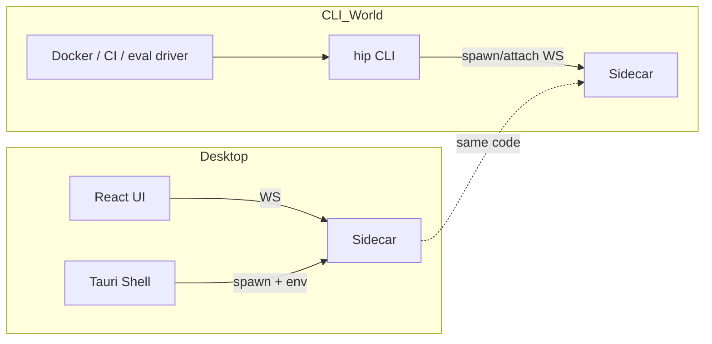
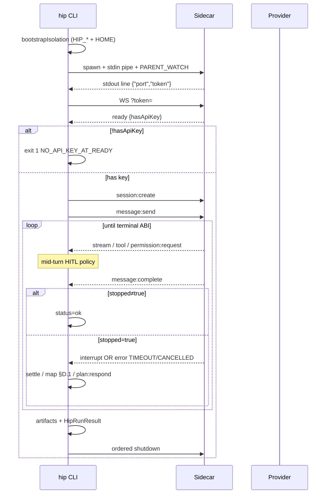
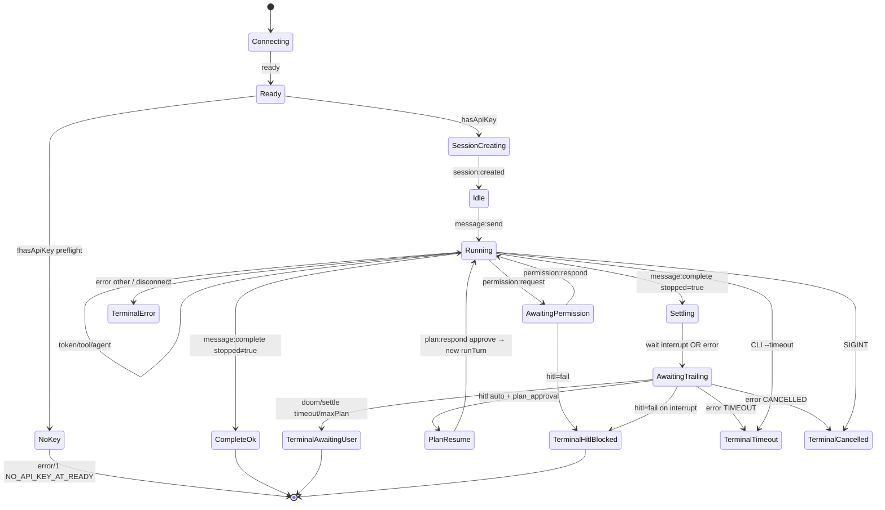
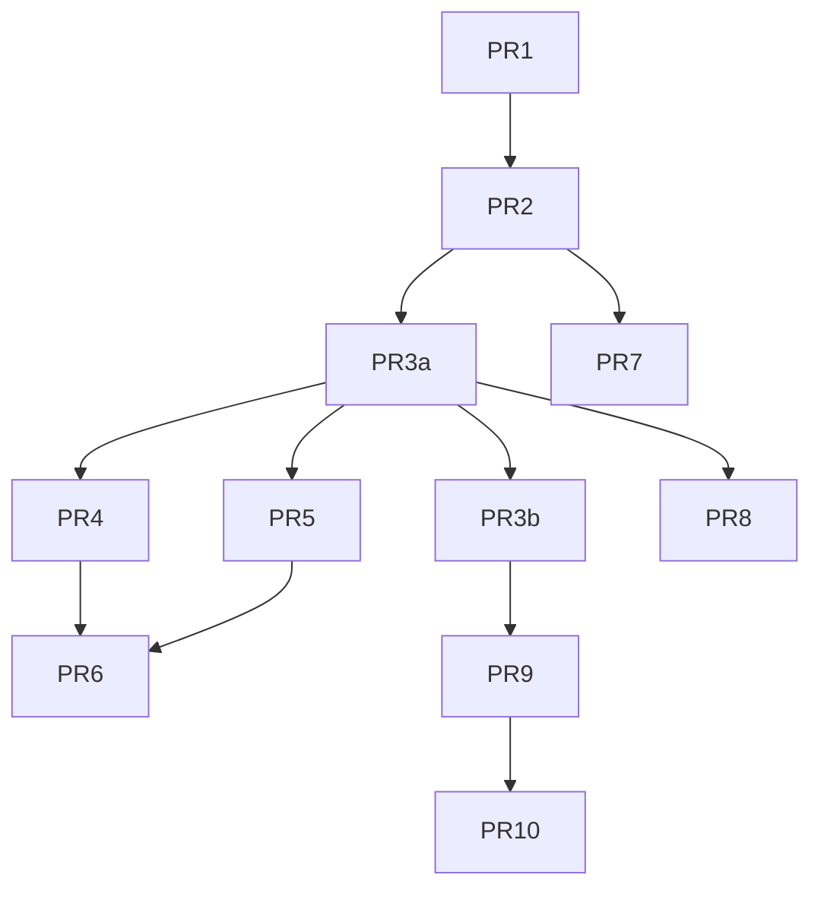

# hip CLI 完整设计方案

| 字段 | 值 |
|------|-----|
| **Title** | Complete CLI design for hip |
| **Author** | TBD |
| **Date** | 2026-07-14 |
| **Status** | Draft (revised post-review) |
| **Repo** | `/Users/lijiamin/data/my-github/hip` |
| **Audience** | senior engineers familiar with hip monorepo |
| **Revision** | R2 — HOME policy, settle error map, status names, agentId vs profile, hasApiKey preflight |

---

## Overview

hip 当前是 **Tauri 桌面 AI 工作台**：Rust shell 拉起 Node sidecar，React UI 经 WebSocket 驱动 agent。agent 逻辑、工具、session 持久化、HITL、workflow 全部在 `@hip/sidecar` 中，协议类型在 `@hip/protocol`。独立 sidecar 已可运行（`yarn sidecar:dev` / `scripts/dev.sh start sidecar`），但**没有正式的 headless / CLI 驱动**，因此无法干净地进入 Docker / SWE-bench 风格 harness、CI one-shot、或终端 REPL。

本设计提议新增 **`packages/cli`（`@hip/cli`）**，以 **薄客户端（thin client）** 形态复用现有 sidecar：CLI 负责 spawn/attach、会话编排、终端渲染与机器可读结果输出；**不 fork、不内嵌** agent loop。P0 交付 `hip run`（one-shot + **Harness ABI** JSON + 完整 isolation env + settle-aware turn runner）；后续再做 REPL、轻量 TUI、Docker 镜像 spike。明确 **不把 Tauri/React 打进 Docker**。

**Harness 正确性硬约束（R1）：** turn-runner **不得**在首个 `message:complete` 且 `stopped: true` 时报告 exit 0；必须消费 trailing `agent:interrupt` / 再跑 turn 或映射为非成功 status。

---

## Background & Motivation

### 当前架构（事实基线）

三进程模型（见 `README.md`）：

| Process | Runtime | Role |
|---------|---------|------|
| Tauri Shell | Rust `src-tauri/` | 窗口、sidecar 生命周期、原生能力（PTY、knowledge、dialogs） |
| Frontend | React + Vite `src/` | Tabs、chat、agent tree |
| Sidecar | Node `packages/sidecar/` | LangGraph runtime、WS server、SQLite |

关键实现锚点：

| 能力 | 代码位置 |
|------|----------|
| Sidecar 入口、stdout 握手 | `packages/sidecar/src/main.ts`：`{"port","token"}` + 可选 `HIP_PARENT_WATCH` |
| WS 绑定 | `packages/sidecar/src/server/ws-server.ts`：`127.0.0.1`、`?token=`；**任意** connection close → `cancelAllRunning()`（可多连，非“踢前一客户端”） |
| 协议 | `packages/protocol/src/messages.ts`：`ClientMessage` / `ServerMessage` |
| Session 配置 | `packages/protocol/src/session-config.ts`、`session-core.ts` |
| Auth | `packages/sidecar/src/config/auth-file.ts`：`HIP_AUTH_PATH` 或 `~/.hip/config/auth.json` |
| DB | **仅** `HIP_DB_PATH`（默认 `:memory:`）— **不**从 `HIP_DATA_DIR` 派生（`main.ts`） |
| 配置注入（桌面） | Tauri `src-tauri/src/sidecar.rs` 设置 `HIP_CONFIG_PATH`、`HIP_DB_PATH`、`HIP_MEMORY_CONFIG_PATH`、plugins、worktrees、scratch、`HIP_PARENT_WATCH` |
| 日志路径 | `debug-logger.ts`：**固定** `~/.hip/logs/`（**不**读 `HIP_DATA_DIR`） |
| Plan 文件 | `plan-mode.ts`：`~/.hip/plans/`；批准后另写 `cwd/.hip/plans/`（`session-turn-ops.ts`） |
| 暂停终态 | `session-turn-runner.ts` ~1030–1055：`awaiting_user` → **先** `message:complete{stopped:true}`，**再**可选 `plan:published`，**再** `agent:interrupt` |
| Plan 恢复 | `handlePlanResponse` → **新** `runTurn`（不是 mid-turn resume） |
| HITL | `permission-manager.ts`：full 仅 auto `requestApproval`（run_script 路径）；ACP 仍发 `permission:request` |
| 前端 WS 参考 | `src/ipc/ws-client.ts` |
| 粗糙原型 | `packages/sidecar/e2e-ws-test.ts`（无 token、无完整生命周期） |
| 外部评估日志 | `logs/run_evaluation/`；仓库 `@harness` 标签是 **WDIO UI E2E**，非 agent benchmark |

### 痛点

1. **Harness 无官方 driver**，且 naive “等 `message:complete` → exit 0” 会 **false success**（plan/doom pause）。  
2. **环境隔离不能只设 `HIP_DATA_DIR`**：sidecar 多数路径要 **显式** `HIP_DB_PATH` / `HIP_AUTH_PATH` / …  
3. **非交互 HITL 未产品化**：`full` + `disablePlan` 必要但不充分。  
4. **结果通道 / exit code** 需稳定 ABI。  
5. **WS close 取消全部 in-flight turn**——CLI 应独占 sidecar（spawn 优先）；attach 勿与桌面共享。

### 已达成共识

1. CLI = thin client over sidecar。  
2. 全量 TUI 低 ROI。  
3. Docker = sidecar + CLI，不跑 Tauri。  
4. 分阶段：P0 run/headless → P1 Docker → P2 REPL → P3 light TUI。

---

## Goals & Non-Goals

### Goals

1. **Headless one-shot** + **Harness ABI**（JSON fd 规则、status/exit 矩阵、settle 规则）。  
2. **Sidecar 复用**（spawn/attach + Tauri 同款握手）。  
3. **完整 isolation bootstrap**（temp dir + 全套 `HIP_*`，`--preset harness` 不污染 `~/.hip` 业务数据）。  
4. **Auth/config 对齐**（path 可覆盖）。  
5. **可测试**（fake WS 覆盖 complete→interrupt；无付费 LLM 默认）。  
6. **增量 PR**；**P0 验收 demo** 一句话可跑。

### Non-Goals

| 非目标 | 说明 |
|--------|------|
| CLI 内嵌 LangGraph | 逻辑只在 sidecar |
| Docker 内 Tauri/React | harness 不需要 GUI |
| P0 全桌面镜像 / 完整 TUI | P3 可选 |
| 多客户端 ownership 改造 | 文档化现实；spawn 隔离 |
| 把 hip 改成 ACP server | 长期 alternative |
| auth → keychain | plaintext 0600 by design |
| 改 sidecar 使 `HIP_DATA_DIR` 自动派生全部路径 | 可选未来；P0 CLI 显式设 env |

---

## Key Decisions

| # | 决策 | 理由 |
|---|------|------|
| K1 | 包名 **`@hip/cli`** / 路径 `packages/cli` / bin **`hip`**（发布时用 scoped 包，不抢全局 npm `hip` 包名） | **用户 2026-07-14 拍板**；monorepo + 未来发布一致 |
| K2 | Thin client：依赖 `@hip/protocol` + `ws`；**workspace dep `@hip/sidecar`** 仅用于 **解析 spawn 路径**，不 import 内部 API；**永不内嵌 SessionManager/agent** | **用户拍板**；单一 agent 真相源 |
| K3 | 传输 **WebSocket loopback + token**；stdio 控制面非 P0；**动态端口**（不固定、P0 不改 sidecar 绑端口） | **用户拍板**；协议已完整 |
| K4 | Spawn：`HIP_PARENT_WATCH=1` + **全程保持 stdin write end 打开** | `parent-watch.ts` |
| K5 | Headless 默认 `permissionMode: full` + `disablePlan: true` + **不调用 `agent:setProfile`**（保持默认 AgentProfile=`supervisor`）；**不**声称可消灭全部 `awaiting_user` | 必要不充分；runner 必须处理任意 interrupt。`agentId` 仅指 external ACP AgentConfig，**不是** plan/explore profile |
| K6 | **JSON 通道规范（冻结）**：见 [Harness ABI](#harness-abi-normative-p0) | 消除歧义 |
| K7 | **Exit/status 决策表（冻结）**：见 ABI；`stopped` 未解决 ≠ 0 | 防 false success |
| K8 | Docker = Node + ncc sidecar + CLI；**P1 spike**；install 用 focus/workspace 子集，非抄全 monorepo deps 当生产真理 | 镜像可构建优先 |
| K9 | **多连接现实**：任意 socket close → `cancelAllRunning`；消息 fan-out。Harness **必须 spawn 独占**；attach 文档禁止与桌面共享 | 对齐 `ws-server.ts` |
| K10 | `surface: 'code'` + 显式绝对 `cwd` | 代码任务 |
| K11 | **P0 交付范围**：**仅 headless harness**（`hip run` + spawn/isolation + settle/exit JSON ABI）；无 REPL/TUI；Docker 放 P1。安装：monorepo `yarn cli:dev` / `node packages/cli/dist/bin.js`；全局 brew 延期；npm 发布名为 `@hip/cli` | **用户拍板** P0 范围 |
| K12 | **Spawn 解析顺序** + 超时/宽限数字：见 [Spawn 解析](#spawn-entry-resolution)；`HIP_SIDECAR_BIN` 最高优先 | 可实现 |
| K13 | **Spawn 默认 full isolation**：创建 temp root 并写入 **完整 env 矩阵**；`:memory:` 仅 `--db memory` | 关闭 Open Q #1；防污染 |
| K13b | **`HOME` 策略（规范）**：`--preset harness` **始终** `HOME=$root`；默认 temp isolation（无 harness）**也** `HOME=$root`；仅 `--use-user-hip` 保留进程原 `HOME`。副作用：子进程 git/SSH 读隔离 HOME——harness 需显式挂载或 env 注入 | 收口 `~/.hip/logs` 与 `~/.hip/plans`；与门禁「HOME redirect」一致 |
| K14 | **`hitl: auto`（用户拍板）**：mid-turn `permission:request` 用 option 选择算法；`plan_approval` → auto approve（`maxPlanApprovals=1`）并等 **下一** terminal；其它 interrupt → exit 5 | 无人值守评测 + 防无限批准 |
| K15 | `hip version` 报告 CLI + 可解析的 sidecar package version | 排障 |
| K16 | Trace 默认 **redact** env-like 串（harness）；`--trace-raw` 关闭 | 密钥安全 |
| K17 | CLI 参数错误 status 名 **`invalid_args`**（exit 2），**不用** `usage`（避免与 `HipRunResult.usage` token 字段撞名） | 解析器清晰 |
| K18 | `ready.hasApiKey===false` → **preflight 失败** exit 1 / `NO_API_KEY_AT_READY`，在 `session:create` 之前（doctor/dry-run 除外） | 快速失败；与 sidecar 发送时 `NO_API_KEY` 互补 |

---

## Harness ABI (normative P0)

> 本节是 harness / CI 的 **冻结契约**。实现与 fake-WS 测试必须逐条覆盖。

### A. JSON 输出通道

| 条件 | 行为 |
|------|------|
| **`--output PATH`** | **仅**写 compact JSON 到该文件；**stdout/stderr 不出现**结果 JSON。人读 stream 仍可按 `--stream` 走 stderr/stdout（见下）。失败也必须写文件（`status` ≠ ok）。 |
| **`--json` 且无 `--output`** | **stdout 最后一行** 恰好一个 compact JSON object（单行、无 pretty）；其前 stdout 不得有人读助手文本——**强制** human stream → **stderr**（等价于 stream 文本走 stderr）。 |
| **二者皆无** | 不写 `HipRunResult`；仅 exit code + human stream。 |
| **二者皆有** | `--output` 优先；`--json` 不额外打印。 |

规则补充：

- 始终 `JSON.stringify` compact（无空格 pretty）。  
- 所有终态（ok / error / invalid_args / sidecar / timeout / cancelled / hitl_blocked / awaiting_user）**都**产出完整 `HipRunResult`（当启用 JSON 时）。  
- 进程 **exit code** 与 `HipRunResult.exitCode` **必须一致**。  
- 解析器：若用 stdout JSON，取 **最后一行** `JSON.parse`。

### B. Human stream 与 FD

| `--stream` | stdout | stderr |
|------------|--------|--------|
| `none` | 空（除非 `--json` 最后一行） | 可选诊断 |
| `text` | 助手 `token:stream`（若同时 `--json` 无 `--output` → 改 stderr） | 工具/元数据 |
| `tools` / `all` | 同上 | 工具、agent、reasoning 等 |

### C. Turn settle 规则（防 false success）

真实 sidecar 顺序（`session-turn-runner.ts`）：

```text
awaiting_user:
  1) message:complete { message.stopped: true, ... }
  2) [optional] plan:published
  3) agent:interrupt { question, context? }   // plan: context JSON { kind: 'plan_approval', plan }
```

`plan:respond` → `handlePlanResponse` → **新** `runTurn` → 再次可能 complete / error。

**Cancel / idle-timeout 真实序**（`session-turn-runner.ts` ~1088–1099）：

```text
1) message:complete { stopped: true }
2) error { code: 'CANCELLED' | 'TIMEOUT' }
```

（与 plan pause 的 complete→interrupt 不同：此处 trailing 是 **error**，不是 interrupt。）

**TurnRunner 算法：**

```
on ready(msg):
  hasApiKeyAtReady = msg.hasApiKey
  if !msg.hasApiKey && !opts.allowNoKey:   // doctor/dry-run 可 allow
    → terminal status=error, exit=1, code=NO_API_KEY_AT_READY
      // BEFORE session:create / message:send

on message:complete(msg):
  if msg.message.stopped !== true:
    → terminal SUCCESS (status=ok)   // 仅当无未处理 error
  else:
    enter SETTLE(window = min(2s, remaining --timeout))
    on agent:interrupt during SETTLE or already queued:
      record interrupt
      if hitl==auto AND parse context.kind=='plan_approval'
          AND planApprovalsUsed < maxPlanApprovals:
        send plan:respond { action: 'approve' }
        planApprovalsUsed++
        clear settle; wait for NEXT terminal (complete/error/…)
      else if hitl==auto AND parse context.kind=='plan_approval'
          AND planApprovalsUsed >= maxPlanApprovals:
        → terminal status=awaiting_user, exit=5  // 耗尽，非 hitl_blocked
      else if hitl==fail AND (plan_approval OR any interrupt):
        → terminal status=hitl_blocked, exit=5   // 策略拒绝可行动 HITL
      else if hitl==auto AND other interrupt (e.g. doom):
        → terminal status=awaiting_user, exit=5
      else if hitl==prompt AND TTY:
        提示用户后 plan:respond 或 cancel
    on error during SETTLE (or mid-run):
      → apply Error-code map (§D.1)   // TIMEOUT→4, CANCELLED→130, …
    on SETTLE timeout without interrupt AND without error:
      → terminal status=awaiting_user, exit=5
        // stopped 无后续事件也不得 exit 0

on process SIGINT/SIGTERM:
  → best-effort message:cancel; status=cancelled, exit=130
    // 即使 WS 在 complete/error 对到达前断开
```

**`hitl_blocked` vs `awaiting_user`（exit 均为 5）：**

| status | 何时使用 |
|--------|----------|
| **`hitl_blocked`** | 策略**拒绝**了本可行动的 HITL：`hitl=fail` 收到 `permission:request`，或 `hitl=fail` 收到 `plan_approval` interrupt |
| **`awaiting_user`** | 暂停/stopped **无成功解决路径**：settle 超时无 interrupt、doom/其它 interrupt 在 `hitl=auto` 下不继续、`maxPlanApprovals` 耗尽、`hitl=prompt` 但非 TTY 在已进入 pause 后无法恢复 |

Mid-turn（**complete 之前**）的 `permission:request`：**始终**由 HITL 策略处理，不结束 run；`hitl=fail` → 立即 `hitl_blocked`/5。

### D. Status → exit code 决策表

| `HipRunResult.status` | exit | 触发条件（摘要） |
|----------------------|------|------------------|
| `ok` | **0** | 最终 `message:complete` 且 `stopped` ≠ true，且无未映射为失败的 `error` |
| `error` | **1** | sidecar `error`（见 §D.1 非 TIMEOUT/CANCELLED）、preflight `NO_API_KEY_AT_READY`、未分类失败、模型错误等 |
| `invalid_args` | **2** | CLI 参数/配置错误、缺 prompt、非法 flag、非 TTY 却 `hitl=prompt` 且会阻塞（**勿命名为 `usage`**） |
| `sidecar` | **3** | spawn 失败、握手超时、WS 断连/auth 1008、child 异常退出 |
| `timeout` | **4** | CLI `--timeout` 到期 **或** sidecar `error.code==='TIMEOUT'`（idle watchdog 等） |
| `hitl_blocked` | **5** | 见上表：策略拒绝 permission / plan_approval |
| `awaiting_user` | **5** | 见上表：pause 未解决 / settle 超时 / maxPlanApprovals 耗尽 |
| `cancelled` | **130** | SIGINT/SIGTERM **或** sidecar `error.code==='CANCELLED'`（含 CLI `message:cancel` 关闭路径） |

#### D.1 Error-code map（mid-run 与 SETTLE 共用）

| `error.code`（sidecar 或 CLI 合成） | `status` | exit |
|--------------------------------------|----------|------|
| `TIMEOUT` | `timeout` | **4** |
| `CANCELLED` | `cancelled` | **130**（统一：CLI 发起 cancel、SIGINT、以及 sidecar 回报 CANCELLED 均 130） |
| `NO_API_KEY` / `NO_API_KEY_AT_READY` | `error` | **1** |
| `INCOMPATIBLE_MODEL` / `HOOK_DENIED` / `AGENT_ERROR` / `PLAN_REJECTED` / `INVALID_MESSAGE` / … | `error` | **1** |
| `HANDSHAKE_TIMEOUT` / `WS_AUTH_FAILED` / `SIDECAR_ENTRY_NOT_FOUND` | `sidecar` | **3** |

**子码**始终写入 `errors[].code`（保留 sidecar 原样 + CLI 合成码）。粗 exit 少量；harness 细判读 JSON。

Fake-WS 门禁补充：`complete(stopped)` → `error(TIMEOUT)` → exit **4**；`complete(stopped)` → `error(CANCELLED)` → exit **130**。

### E. `HipRunResult` schema（R2）

```typescript
export type HipRunStatus =
  | 'ok'
  | 'error'
  | 'invalid_args'   // exit 2 — CLI args; NOT token usage
  | 'sidecar'
  | 'timeout'
  | 'cancelled'
  | 'hitl_blocked'
  | 'awaiting_user'

export interface HipRunResult {
  schemaVersion: 1
  status: HipRunStatus
  exitCode: number
  sessionId: string
  hasApiKeyAtReady?: boolean
  turn?: {
    userMessageId: string
    assistantMessageId?: string
    stopped?: boolean
    /** 经历了多少次 message:complete（含 paused） */
    completeCount?: number
  }
  text: string
  interrupt?: {
    question: string
    contextKind?: string   // e.g. 'plan_approval'
    contextRaw?: string
  }
  usage?: {                // optional — 缺省勿当失败
    inputTokens: number
    outputTokens: number
    totalTokens: number
  }
  tools: Array<{
    callId: string
    name: string
    status: 'finished' | 'error' | 'running'
    error?: string
  }>
  errors: Array<{ code: string; message: string }>
  timing: {
    startedAt: string
    finishedAt: string
    durationMs: number
  }
  config: {
    cwd: string
    provider: string
    model: string            // requested
    modelResolved?: string   // 若可知
    permissionMode: string
    disablePlan: boolean
    agentId?: string
    preset?: string
    hitl: 'auto' | 'fail' | 'prompt'
  }
  git?: {
    isRepo: boolean
    dirtyBefore: boolean
    dirtyAfter?: boolean
    /** patch 相对 pre-run baseline（见 artifacts） */
    patchStatus: 'written' | 'skipped_not_repo' | 'skipped_no_git' | 'failed'
    patchError?: string
  } | null
  artifacts?: {
    dir?: string
    patch?: string
    diffSummary?: string
    trace?: string
    usage?: string
    result?: string
  }
}
```

#### 示例：ok

```json
{"schemaVersion":1,"status":"ok","exitCode":0,"sessionId":"…","text":"Done.","usage":{"inputTokens":10,"outputTokens":5,"totalTokens":15},"tools":[],"errors":[],"timing":{"startedAt":"…","finishedAt":"…","durationMs":1200},"config":{"cwd":"/w","provider":"deepseek","model":"deepseek-chat","permissionMode":"full","disablePlan":true,"hitl":"auto"},"git":{"isRepo":true,"dirtyBefore":false,"dirtyAfter":true,"patchStatus":"written"}}
```

#### 示例：awaiting_user（plan pause，fail/settle）

```json
{"schemaVersion":1,"status":"awaiting_user","exitCode":5,"sessionId":"…","text":"…","turn":{"userMessageId":"…","stopped":true,"completeCount":1},"interrupt":{"question":"…","contextKind":"plan_approval"},"tools":[],"errors":[],"timing":{"startedAt":"…","finishedAt":"…","durationMs":900},"config":{"cwd":"/w","provider":"deepseek","model":"deepseek-chat","permissionMode":"full","disablePlan":true,"hitl":"fail"}}
```

#### 示例：timeout（settle 后 sidecar TIMEOUT）/ hitl_blocked

```json
{"schemaVersion":1,"status":"timeout","exitCode":4,"sessionId":"…","text":"…","turn":{"stopped":true,"completeCount":1},"errors":[{"code":"TIMEOUT","message":"…"}],"config":{"cwd":"/w","provider":"deepseek","model":"deepseek-chat","permissionMode":"full","disablePlan":true,"hitl":"auto"}}
```

```json
{"schemaVersion":1,"status":"hitl_blocked","exitCode":5,"sessionId":"…","errors":[{"code":"HITL_FAIL","message":"permission:request rejected by hitl=fail"}],"config":{"cwd":"/w","provider":"deepseek","model":"deepseek-chat","permissionMode":"edit","disablePlan":true,"hitl":"fail"}}
```

### F. Patch / git baseline

1. Run 开始前：记录 `git rev-parse HEAD` 与 `git status --porcelain` → `dirtyBefore`。  
2. Baseline：**pre-run working tree 快照**——实现用 `git diff`（unstaged+staged vs HEAD）在结束后再 diff，或 `git add -N` 策略二选一；**规范**：artifact `patch.diff` = **post-run `git diff HEAD`** 减去无意义噪声时，driver 应用 `dirtyBefore` 判断是否“agent 引入”。更干净做法（推荐 P0）：若 `dirtyBefore`，在 result 中标记并 **仍导出 full `git diff HEAD`**，由 driver 负责；若 `!isRepo`，`git: null` 或 `patchStatus: skipped_not_repo`，不失败整个 run（除非 `--require-git`）。  
3. `git` 二进制缺失 → `skipped_no_git`。

### G. P0 验收 demo（单一成功标准）

```bash
# 在 monorepo 内；auth 指向有效 key 或 live skip
HIP_AUTH_PATH=$HOME/.hip/config/auth.json \
  yarn cli:dev -- run --preset harness --stream none \
  --json --output /tmp/hip-out/result.json \
  "Reply with exactly: pong" 
# expect: exit 0; result.json status=ok; 不写业务数据到用户 hip.db
# 无 key 时：exit 1 且 result.json status=error code NO_API_KEY_AT_READY（preflight，不发 session:create）
```

Fake-WS CI 门禁不依赖 live key。

---

## Product Positioning

### CLI vs Desktop



| 维度 | Desktop | CLI |
|------|---------|-----|
| 用户 | 交互式开发者 | 脚本、CI、eval harness |
| 交互 | HITL 模态、计划审批 | 非交互 settle + policy |
| 输出 | UI | stream + **Harness ABI** |
| 数据 | `~/.hip` / Tauri 注入 | spawn 默认 **temp 全套 HIP_*** |

### 用户画像

1. 本地开发者 one-shot  
2. CI 消费 JSON + exit  
3. Docker/SWE-bench 风格 driver  
4. attach 调试（需 token 来源，见下）

---

## Package Layout

```
packages/
  protocol/     @hip/protocol
  sidecar/      @hip/sidecar
  cli/          @hip/cli          # 新增
```

### package.json 要点

```json
{
  "name": "@hip/cli",
  "version": "0.1.0",
  "private": true,
  "type": "module",
  "bin": { "hip": "./dist/bin.js" },
  "scripts": {
    "dev": "tsx src/bin.ts",
    "build": "tsc -p tsconfig.json",
    "type-check": "tsc --noEmit",
    "test": "vitest run"
  },
  "dependencies": {
    "@hip/protocol": "*",
    "@hip/sidecar": "*",
    "ws": "^8",
    "commander": "^12"
  }
}
```

说明：`@hip/sidecar` 依赖用于 **`require.resolve` / package 根路径** 找 ncc `dist` 或 `src/main.ts`，**禁止** `import { SessionManager } from '…'`。

根 scripts：`cli:dev`、`cli:build`、`cli:test`。

### 源码树

```
packages/cli/src/
  bin.ts
  commands/{run,repl,session,config,doctor,version}.ts
  sidecar/{spawn,attach,lifecycle,resolve-entry,env-bootstrap}.ts
  client/{ws-client,turn-runner,hitl-policy,stream-renderer,result-builder,settle}.ts
  artifacts/{diff,export,redact}.ts
  presets/harness.ts
  types.ts
  index.ts                 # runHip() — P0.5/PR 可后置，类型先在 types
test/
  turn-runner.settle.test.ts      # complete(stopped)→interrupt 门禁
  hitl-optionid.test.ts
  isolation-env.test.ts
  spawn-parse.test.ts
  exit-matrix.test.ts
  result-schema.test.ts
  json-channel.test.ts
```

---

## Commands and UX

### 环境变量

| 变量 | 含义 | Sidecar 是否原生读取 |
|------|------|----------------------|
| `HIP_DB_PATH` | SQLite；默认 sidecar `:memory:` | **是**（唯一 DB 开关） |
| `HIP_AUTH_PATH` | auth.json | **是** |
| `HIP_CONFIG_PATH` | hip.toml | **是** |
| `HIP_MEMORY_CONFIG_PATH` | memory.json | **是** |
| `HIP_PLUGINS_PATH` / `HIP_PLUGINS_DIR` | 插件 | **是** |
| `HIP_WORKTREES_DIR` / `HIP_SCRATCH_ROOT` | worktree/scratch | **是** |
| `HIP_PARENT_WATCH` | stdin EOF 退出 | **是** |
| `HIP_DEBUG` | sidecar debug 日志 | **是**（日志仍在 `~/.hip/logs` 或 `HOME/.hip/logs`） |
| `HIP_DATA_DIR` | Tauri/E2E 数据根；**sidecar 不据此设 DB** | 部分（如 memory）；**CLI 用作 bootstrap 根** |
| `HIP_SIDECAR_BIN` | 覆盖 sidecar 可执行/入口 | CLI |
| `HIP_SIDECAR_URL` / `HIP_SIDECAR_TOKEN` | attach | CLI |
| `HIP_CLI_DEBUG` | CLI 自身日志 → stderr | CLI |
| `HIP_MODEL_*_API_KEY` | key 覆盖 | **是**（优先于 auth 文件） |
| `HOME` | 影响 `~/.hip/logs`、`~/.hip/plans` | 间接；Docker 建议 `HOME=$HIP_DATA_DIR` |

### Isolation bootstrap 矩阵（实现必须）

函数 `bootstrapIsolation(root: string, opts: { setHome: boolean }): NodeJS.ProcessEnv`：

| Concern | Env 赋值 | 何时 |
|---------|----------|------|
| 根 | `HIP_DATA_DIR=$root` | 始终 |
| DB | `HIP_DB_PATH=$root/db/hip.db`（除非 `--db memory` → `:memory:`） | 始终 |
| Config | `HIP_CONFIG_PATH=$root/config/hip.toml`（可从用户只读 copy 模板；无则最小 toml） | 始终 |
| Auth | **不复制 secret 进 root**；保留调用方 `HIP_AUTH_PATH` 或默认用户 auth（只读） | 始终 |
| Memory | `HIP_MEMORY_CONFIG_PATH=$root/config/memory.json`（harness：关闭 inject 的最小 json + session `incognito`） | 始终 |
| Plugins | `HIP_PLUGINS_PATH=$root/config/hip-plugins.json`（空 registry）、`HIP_PLUGINS_DIR=$root/plugins` | 始终 |
| Scratch / worktrees | `HIP_SCRATCH_ROOT=$root/scratch`、`HIP_WORKTREES_DIR=$root/worktrees` | 始终 |
| **HOME** | **`HOME=$root`**（使 `debug-logger` → `$root/.hip/logs`，`plan-mode` → `$root/.hip/plans`） | **`setHome===true`（规范默认，见下）** |

**`HOME` 策略（K13b，规范）：**

| 模式 | `setHome` | 说明 |
|------|-----------|------|
| `--preset harness` | **true（强制）** | 含 Docker entrypoint |
| 默认 temp isolation（K13） | **true** | 无 harness 也收口 logs/plans |
| `--use-user-hip` | **false** | 保留进程原 `HOME`；接受写入用户 `~/.hip/logs|plans` |
| `--keep-user-home`（可选 flag） | **false** | 高级：隔离 HIP_* 但保留 HOME（文档警告 residual leak） |

**副作用（必须写进 help）：** `HOME=$root` 时子进程（`run_script`、git）读不到用户全局 `~/.gitconfig` / SSH keys，除非 harness 显式挂载或设 `GIT_CONFIG_GLOBAL` / `GIT_SSH_COMMAND`。Auth 仍走 `HIP_AUTH_PATH`（通常仍指向用户只读 secret），**不**依赖 `HOME` 找 key。

**何时 bootstrap：**

- `--preset harness`：**始终** full matrix + `HOME=$root`（若用户未传 `HIP_DATA_DIR`，CLI 建 `os.tmpdir()/hip-run-<uuid>`）。  
- 默认 `hip run`（无 preset）：**同样** temp isolation + `HOME=$root`，除非 `--use-user-hip`。  
- Attach：不修改 foreign sidecar 的 env；仅连接。

### `hip run` flags（P0）

```text
hip run [prompt]
  -f, --file PATH
  -c, --cwd PATH                 # default process.cwd(); must be absolute after resolve
  --provider / --model / --base-url / --agent
  --permission-mode chat|edit|full   # default full
  --disable-plan | --force-plan      # default disable-plan on
  --incognito
  --system …
  --timeout SEC                  # 0 = none
  --json
  --output PATH                  # Harness ABI
  --out-dir DIR                  # artifacts
  --stream text|tools|all|none
  --preset harness|interactive|readonly
  --hitl auto|fail|prompt        # default auto for harness/full headless
  --sidecar spawn|attach|auto
  --port --token
  --sidecar-log PATH             # parse handshake {port,token} from log file
  --db file|memory               # default file under isolation root
  --use-user-hip                 # opt out of temp isolation
  --no-parent-watch              # debug only
  --max-plan-approvals N         # default 1 under hitl auto
  --trace-raw                    # disable redaction
  --require-git                  # fail if cwd not a repo
```

### Attach 与 token 发现

`scripts/dev.sh start sidecar`：stdin `/dev/null`、日志进 `logs/sidecar.log`，status **只打印 port**，**不**打印 token；token 在握手 JSON 行内。

**Token 来源（规范）：**

1. `--token` / `HIP_SIDECAR_TOKEN`  
2. `--sidecar-log PATH`：按行 buffer，`JSON.parse`，取最后一组合法 `{port,token}`（与 spawn 解析同形）  
3. 未来可选：扩展 `dev.sh status` 打印 token（**非 CLI P0 阻塞**；文档说明）  

无 token → WS close **1008** → CLI exit **3**，`errors[].code=WS_AUTH_FAILED`。

示例：

```bash
hip run --sidecar-log logs/sidecar.log "summarize README"
# 或
TOKEN=$(grep -o '{"port":[^}]*}' logs/sidecar.log | tail -1 | jq -r .token)
PORT=$(... | jq -r .port)
hip run --port "$PORT" --token "$TOKEN" "…"
```

### Presets

| Preset | 行为 |
|--------|------|
| `harness` | full isolation + **`HOME=$root`**；`permissionMode=full`；`disablePlan=true`；**不**发送 `agent:setProfile`（默认 AgentProfile=`supervisor`）；`agentId` 仅在显式 `--agent <acpId>` 时设置；`hitl=auto`；`incognito=true`；建议 `--stream none` + JSON；`maxPlanApprovals=1`；空 plugins |
| `interactive` | 可用 `--use-user-hip`；`permissionMode=edit`；`hitl=prompt`（非 TTY → exit 2 `invalid_args`） |
| `readonly` | `permissionMode=chat` |

**PermissionMode 语义（帮助文案必须准确）：**

| Mode | 内置工具 | run_script | 路径 jail |
|------|----------|------------|-----------|
| `chat` | 只读工具集（无 write/edit/run_script 注册） | 无 | jailed |
| `edit` | cwd 内 write/edit **无 HITL**；run_script **HITL** | HITL | jailed |
| `full` | write/edit/read un-jailed；run_script **auto via requestApproval** | auto | un-jailed |

`full` **≠** “零 `permission:request`”（ACP/subagent 仍会发）。

---

## Proposed Design

### 高层时序



### Turn 状态机（R1）



### HITL 策略（按事件源）

| 源 | `auto` | `fail` | `prompt` |
|----|--------|--------|----------|
| Builtin `requestApproval`（edit） | 依赖改 full 或 auto-respond | exit 5 | TTY 选择 |
| Builtin full | sidecar 直接 allow_once，**通常无事件** | n/a | n/a |
| `permission:request`（ACP/nested） | **OptionId 算法** 选 allow | exit 5 | TTY |
| `agent:interrupt` plan_approval | `plan:respond approve`，等下一 terminal | **`hitl_blocked`/5** | TTY approve/reject |
| `agent:interrupt` 其它（doom 等） | **`awaiting_user`/5** | **`hitl_blocked`/5**（fail 拒绝继续） | TTY |
| PermissionRequest **hooks** | sidecar 可能已 allow/deny；CLI 仅处理仍发出的 request | 同左 | 同左 |

**OptionId 选择算法（auto）：**

```
given options: PermissionOption[]
1. find first where kind starts with 'allow' (allow_once / allow_always) → use its optionId
2. else find optionId in {'allow_once','allow','once','approve'}
3. else if hitl=auto and no allow-like → treat as fail (exit 5), do not guess reject as success
```

覆盖 ACP mock 的 `optionId: 'once'` + `kind: 'allow_once'`（`mock-acp-agent.mjs`）。

### `disablePlan` 真实不变量

- `shouldPlan(..., { disablePlan: true })` → **false**（启发式 plan 入口关闭）。  
- **仍可能** `awaiting_user`：agent 工具 EnterPlanMode、**AgentProfile=`plan`**（经 `agent:setProfile`）、doom-loop pause 等。  
- **术语澄清（R2）：**  
  - `SessionConfig.agentId` = builtin（omit）**或 external ACP `AgentConfig.id`**——**不是** plan/explore/supervisor。  
  - Built-in plan/explore/supervisor 是 **AgentProfile**，默认 `activeProfileId = 'supervisor'`（`agent-profile-manager.ts`）；切换靠 WS **`agent:setProfile`**，不是 `agentId: 'plan'`。  
- Harness：**不**发送 `agent:setProfile`（保持 supervisor）；**不**发明 `agentId: 'plan'`；runner **必须**处理任意 interrupt。  
- 可选 P1：`--profile plan|explore|supervisor` → `agent:setProfile`（harness preset 禁止 plan）。  
- 集成测试矩阵（PR3a merge gate）：  
  1. clean complete → 0  
  2. complete(stopped)+interrupt(plan_approval)+auto approve+second ok → 0  
  3. complete(stopped)+interrupt(other)+auto → `awaiting_user`/5  
  4. permission:request ACP optionId once → auto resolves  
  5. settle timeout without interrupt → `awaiting_user`/5  
  6. complete(stopped)+error(TIMEOUT) → `timeout`/4  
  7. complete(stopped)+error(CANCELLED) → `cancelled`/130  
  8. ready.hasApiKey=false → `error`/1 `NO_API_KEY_AT_READY`（无 session:create）

### SessionConfig：CLI 覆盖 vs 协议默认

| 字段 | Protocol / normalize 默认 | CLI headless / harness |
|------|---------------------------|-------------------------|
| `permissionMode` | `edit` | **`full`** |
| `enableStickyApproval` | `true` | **`false`** |
| `disablePlan` | undefined/false | **`true`** |
| `forcePlan` | false | false（除非 flag） |
| `surface` | 推断 | **`code`** |
| `useEventSource` | true | true |
| `tools` | 调用方 | `[]`（sidecar 装配） |
| `cwd` | optional | **required absolute** |
| `incognito` | undefined | harness **true** |
| `agentId` | builtin（omit） | **omit**，除非 `--agent <externalAcpId>`；**绝不用** `'plan'` 表示 profile |

实现：构造完整对象后可 `normalizeSessionConfig`，但 **显式字段不得被默认覆盖**（normalize 只填 undefined）。  
Harness 在 `session:create` 后**不**发 `agent:setProfile`。

```typescript
function buildRunConfig(opts: RunOpts): SessionConfig {
  const cfg: SessionConfig = {
    llmProvider: opts.provider ?? defaults.providerID,
    model: opts.model ?? defaults.modelID,
    baseURL: opts.baseURL ?? defaults.baseURL,
    tools: [],
    cwd: path.resolve(opts.cwd ?? process.cwd()),
    // agentId: external ACP AgentConfig id only — NOT AgentProfile (plan/explore/supervisor)
    agentId: opts.agent,
    permissionMode: opts.permissionMode ?? 'full',
    disablePlan: opts.forcePlan ? false : (opts.disablePlan ?? true),
    forcePlan: opts.forcePlan ?? false,
    surface: 'code',
    useEventSource: true,
    enableStickyApproval: false,
    language: opts.language,
    systemPrompt: opts.systemPrompt,
    incognito: opts.incognito ?? opts.preset === 'harness',
  }
  return normalizeSessionConfig(cfg)
}
```

### Spawn entry resolution

**顺序：**

1. `HIP_SIDECAR_BIN` — 若可执行文件：直接 spawn；若 `.js`：`node path`  
2. monorepo dev：`tsx` + `packages/sidecar/src/main.ts`（从 `cwd` / CLI 路径向上找 monorepo root）— **优先于 ncc**，因当前 ncc bundle 对 `node:sqlite` 可能失败  
3. `path.join(dirname(resolve('@hip/sidecar/package.json')), 'dist/index.js')` 若存在 → `node` + ncc bundle（生产 / Docker 用 `HIP_SIDECAR_BIN` 或仅 dist）  
4. 失败 → exit 3，`errors.code=SIDECAR_ENTRY_NOT_FOUND`

**参数：**

| 项 | 值 |
|----|-----|
| Handshake timeout | **15s** |
| Parse | buffer until `\n`；trim；`JSON.parse`；需 `typeof port==='number' && typeof token==='string'`（对齐 Tauri `parse_info_line`） |
| Leading garbage | 忽略非匹配行（测例强制） |
| Token 回显 | 永不 print token 到 CLI stdout |
| Child stderr | 默认 tee 到 CLI stderr 若 `HIP_CLI_DEBUG` 或 `--stream all`；否则 ring-buffer 最近 64KiB 供失败诊断 |
| SIGTERM grace | **3s** 后 SIGKILL |
| Parent-watch | 默认 on；stdin **pipe**，CLI 持 write end **直至 shutdown 序列结束** |

### 有序关闭（spawn）

```
1. 若 turn running：message:cancel（best effort，等 ≤1s）
2. WebSocket close（触发 cancelAllRunning）
3. 关闭 child stdin write end（parent-watch EOF → child process.exit(0) 路径）
4. 若 child 仍存活：SIGTERM，等 3s，SIGKILL
5. 写 HipRunResult / 设 process.exitCode
```

**并行 harness：** 禁止共享同一 `HIP_DB_PATH` 文件；每 job 独立 isolation root。

**`--no-parent-watch`：** 仅调试；文档警告孤儿锁。

### Attach 关闭

仅步骤 1–2；**不**杀 child、不关 foreign stdin。

---

## API / Interface Changes

### 协议 P0：无强制变更

可选未来：`run:summary` ServerMessage — 非阻塞。

### Programmatic API

```typescript
export async function runHip(opts: HipRunOptions): Promise<HipRunResult>
```

P0 可以先内部用；**稳定 export** 可 PR 后置，但 `HipRunResult` 类型与 ABI 同版。

---

## Data Model Changes

无 SQLite schema 变更。

路径布局（isolation root）：

```text
$ROOT/
  config/hip.toml
  config/memory.json
  config/hip-plugins.json
  db/hip.db
  plugins/
  scratch/
  worktrees/
  # 若 HOME=$ROOT:
  .hip/logs/…
  .hip/plans/…
out/   # 通常挂载 --out-dir，可在 ROOT 外
```

---

## Harness / Docker Integration

### 要求（P1；非 copy-paste 可构建保证）

1. **生产 spawn** 使用 **ncc sidecar bundle**；CLI resolve 见上。  
2. **Install 策略（spike 验收）：**  
   - 优先：`yarn workspaces focus @hip/cli @hip/sidecar`（Yarn berry）或等价 minimal install；**或**  
   - multi-stage：builder 全量 install + build，runtime 只复制 `packages/cli/dist`、`packages/sidecar/dist`、`packages/protocol` 运行所需、node_modules 中 native 依赖（`node:sqlite` 内建、`sqlite-vec` prebuild）。  
3. **禁止**把“只 COPY 三 package + 根 package.json 全量 yarn install”写成已验证生产 Dockerfile——根 workspace 含 React/Tauri/WDIO，镜像膨胀且易碎。  
4. **Native：** 记录 Node 版本矩阵（≥22）；`sqlite-vec` 平台 triple。  
5. **Env：** entrypoint 设 `HOME=/hip-data` + 完整 isolation 矩阵。  
6. **PATH：** `ENTRYPOINT ["node","/opt/hip/packages/cli/dist/bin.js"]` 或 install bin 链到 `hip`。  
7. **Acceptance：** “镜像在 CI runner X 构建成功 + harness demo exit 0（mock 或 live）”。

### 说明性 Dockerfile 草稿（illustrative only）

```dockerfile
# ILLUSTRATIVE — validate in PR6 spike; not normative
FROM node:22-bookworm AS build
WORKDIR /src
# focus or full install — spike decides
COPY . .
RUN yarn install --frozen-lockfile \
 && yarn workspace @hip/sidecar build \
 && yarn workspace @hip/cli build

FROM node:22-bookworm-slim
# git + toolchain as harness needs
WORKDIR /opt/hip
COPY --from=build /src/packages/cli/dist ./packages/cli/dist
COPY --from=build /src/packages/sidecar/dist ./packages/sidecar/dist
COPY --from=build /src/packages/protocol ./packages/protocol
# + production node_modules subset (spike)
ENV HOME=/hip-data
ENV HIP_DATA_DIR=/hip-data
ENTRYPOINT ["node", "/opt/hip/packages/cli/dist/bin.js"]
```

### 与 `logs/run_evaluation/` 目录约定

Driver 管目录；CLI 保证 `result.json` + exit + 可选 `patch.diff`。标签 `full+disablePlan` 对齐 preset harness。

---

## Security & Privacy

| 风险 | 严重度 | 缓解 |
|------|--------|------|
| API key | High | 不日志化；auth status 布尔；Docker secret 只读 |
| WS token | Medium | 不打印；loopback only |
| full 写盘 | High | isolation cwd；文档 |
| ACP + hitl auto | High | **trusted agent only**；文档 |
| trace/patch 泄密 | Medium | **默认 redact**（K16）；`--trace-raw` |
| 多连接 cancel | Med | spawn 独占 |
| HOME 泄漏 logs | Low | `HOME=$ROOT` in harness |

---

## Observability

| 信号 | 机制 |
|------|------|
| Sidecar 日志 | **固定** `$HOME/.hip/logs/sidecar*.log`（`debug-logger.ts`）；**非** `HIP_DATA_DIR` 派生。Harness 设 `HOME` 隔离。 |
| CLI | `HIP_CLI_DEBUG=1` → stderr |
| Child stderr | ring-buffer + 失败时 dump |
| Trace artifact | redacted jsonl |
| Doctor | 握手 RTT、`hasApiKey`、entry resolve 路径 |

---

## Testing Strategy（PR3 merge gates）

| 测试 | 门禁 |
|------|------|
| complete clean → ok/0 | **是** |
| complete(stopped)→interrupt plan_approval→auto→second complete | **是** |
| complete(stopped)→interrupt other→auto→5 | **是** |
| complete(stopped)→settle timeout→5 | **是** |
| permission:request optionId `once` / kind allow_* | **是** |
| hitl fail on permission | **是** |
| exit matrix 参数化 | **是** |
| JSON channel：`--output` 无 stdout JSON；`--json` 最后一行 | **是** |
| handshake leading garbage + 15s timeout mock | **是** |
| isolation：harness 后 assert 未写用户 `HIP_DB_PATH`；**`HOME=$root` 时** logs/plans 仅在 `$root/.hip/**` | **是** |
| complete(stopped)→error(TIMEOUT)→exit 4；→error(CANCELLED)→130 | **是** |
| ready.hasApiKey=false → preflight NO_API_KEY_AT_READY / 无 session:create | **是** |
| hitl=fail on permission → status `hitl_blocked`（非 awaiting_user） | **是** |
| WS close cancel 路径 | **是** |
| Live LLM | 可选 `@live`，默认 skip |

`e2e-ws-test.ts`：CLI 落地后文档改指向 `hip run`；不强制删。

---

## Rollout Plan

| Phase | 交付 | 成功标准 |
|-------|------|----------|
| **P0** | CLI scaffold、spawn/attach、**isolation**、turn-runner settle ABI、`hip run`、JSON、harness preset | 验收 demo + fake-WS 门禁绿；**harness 不污染用户 hip.db** |
| **P0.5** | artifacts 打磨、`runHip` export | patch baseline 字段完整 |
| **P1** | Docker spike、doctor 增强、session list | 镜像 build + 容器 demo |
| **P2** | REPL | 多轮 |
| **P3** | light TUI | 可选 |

---

## Alternatives Considered

### A1. 仅 Bash / 扩展 `e2e-ws-test`

拒绝作为产品路径；内部临时脚本可，但无 ABI。

### A1b. 仅 library、无 bin

拒绝作唯一交付：harness 需要稳定 argv/exit；`runHip` 作为附加。

### A1c. 把 driver 放进 `@hip/sidecar` 测试树

可作内部，但不暴露用户 bin / Docker entry；拒绝作终点。

### A2. CLI 内嵌 SessionManager

拒绝（分叉）。

### A3. TUI 优先

拒绝。

### A4. ACP server 化 hip

长期可选；非 P0。

### A5. Docker 内 Tauri

拒绝。

### A6. 先改多客户端再 CLI

拒绝；spawn 隔离足够。

### A7. Stdio 控制面替代 WS

延期：需新 framing；容器 loopback WS 通常可用。

---

## Risks

| 风险 | 严重度 | 缓解 |
|------|--------|------|
| **false success on stopped complete** | **Critical** | Settle 规则 + 测试门禁 |
| Isolation 漏 env | High | bootstrap 矩阵 + HOME |
| ACP optionId 不匹配 | High | kind 算法 |
| full 破坏 git | High | baseline 字段 |
| Docker install 失败 | Med | P1 spike 要求 |
| 握手解析 | Med | newline buffer + tests |
| 并行 DB 锁 | Med | 每 job 独立路径 |

---

## Open Questions

| # | 状态 | 决议 / 残留 |
|---|------|-------------|
| Q1 DB 默认 | **决定** | spawn 默认 file DB under isolation；`--db memory` 显式 |
| Q2 tools: [] | **决定** | 保持空数组 |
| Q3 disablePlan 消除 plan 阻塞？ | **决定** | **否**；见不变量 + settle |
| Q4 全局名 / 包名 | **决定（用户 2026-07-14）** | 包名 **`@hip/cli`**，bin **`hip`**；P0 以 monorepo 运行为主，发布预留 scoped 名 |
| Q5 runHip 稳定？ | **决定** | schemaVersion 1；API unstable until 0.2 |
| Q6 sidecar 固定端口 | **决定（用户 2026-07-14）** | **动态端口** + stdout/token；P0 不改 sidecar 绑端口；attach 用 log/token |
| Q7 harness memory/plugins | **决定** | incognito + 空 plugins + 隔离 memory json |
| Q8 maxPlanApprovals 默认 | **决定** | 1（plan_approval auto 最多 1 次，再多 → exit 5） |
| Q9 P0 交付范围 | **决定（用户 2026-07-14）** | **Headless harness only**；REPL/TUI/Docker 后置 |
| Q10 默认 isolation | **决定（用户 2026-07-14）** | 默认 temp isolation + `HOME=$root`；`--use-user-hip` 才用用户目录 |
| Q11 headless plan HITL | **决定（用户 2026-07-14）** | `hitl=auto`：自动 approve `plan_approval`（max 1）；其它 interrupt → exit 5 |
| Q12 默认 permissionMode | **决定（用户 2026-07-14）** | headless 默认 **`full`** |
| Q13 架构边界 | **决定（用户 2026-07-14）** | CLI **永不**内嵌 agent；仅 thin client |

---

## References

- `packages/sidecar/src/main.ts`, `server/ws-server.ts`, `parent-watch.ts`
- `session/session-turn-runner.ts` (~1030–1055), `session-turn-ops.ts` (`handlePlanResponse`), `session-persist.ts`
- `session/permission-manager.ts`, `session/plan.ts`, `session/plan-mode.ts`
- `config/auth-file.ts`, `debug-logger.ts`
- `packages/protocol` messages / session-config / message-model
- `src-tauri/src/sidecar.rs`, `src/ipc/ws-client.ts`, `scripts/dev.sh`
- `external-acp.integration.test.ts`, `agents/__fixtures__/mock-acp-agent.mjs`

---

## PR Plan

### PR1 — scaffold `@hip/cli`

- **Title:** `feat(cli): scaffold @hip/cli workspace package`  
- **Files:** `packages/cli/**` skeleton, root scripts, `hip version`  
- **Deps:** 无  
- **Desc:** bin 入口；无 sidecar。

### PR2 — spawn/attach + entry resolve + handshake + isolation env bootstrap

- **Title:** `feat(cli): sidecar spawn/attach, entry resolve, isolation env bootstrap`  
- **Files:** `spawn.ts`, `resolve-entry.ts`, `env-bootstrap.ts`, `attach.ts`, `lifecycle.ts`, `ws-client.ts`; tests parse/isolation  
- **Deps:** PR1  
- **Desc:** 解析顺序、15s handshake、parent-watch pipe、**完整 HIP_* 矩阵**、`--sidecar-log`。`hip doctor` 真实握手。

### PR3a — turn-runner settle + status/exit matrix（无花哨 TTY）

- **Title:** `feat(cli): turn-runner with stopped/interrupt settle and exit matrix`  
- **Files:** `turn-runner.ts`, `settle.ts`, `hitl-policy.ts`, `result-builder.ts`, `types.ts`; **gate tests**  
- **Deps:** PR2  
- **Desc:** ABI C/D/E；fake WS 全门禁；`hip run` 最小 flags（`--stream none`、`--json`/`--output`、`--preset harness`）。

### PR3b — TTY stream + 完整 run UX flags

- **Title:** `feat(cli): hip run streaming renderer and UX flags`  
- **Files:** `stream-renderer.ts`, `commands/run.ts` 扩展  
- **Deps:** PR3a  
- **Desc:** `--stream text|tools|all`；与 JSON 通道规范共存。

### PR4 — artifacts（patch baseline、trace redact、usage）

- **Title:** `feat(cli): artifact export patch/trace/usage`  
- **Files:** `artifacts/*`  
- **Deps:** PR3a  
- **Desc:** git baseline 字段；redact 默认。

### PR5 — config/auth status + README CLI 小节 + 验收 demo 脚本

- **Title:** `docs(cli): auth status, README, harness demo script`  
- **Files:** `commands/config.ts`, root README, `scripts/hip-run-harness-demo.sh`  
- **Deps:** PR3a（isolation 已在 PR2/3a）  
- **Desc:** 不再把 isolation 延后；本 PR 文档化。

### PR6 — Docker spike（requirements + illustrative Dockerfile）

- **Title:** `feat(cli): Docker harness image spike`  
- **Files:** `packages/cli/docker/*`  
- **Deps:** PR4 + PR5 + 本地 harness demo 绿  
- **Desc:** 验证 install 策略；非承诺式巨型 monorepo copy。

### PR7 — session list/show/delete

- **Title:** `feat(cli): session list/show/delete`  
- **Deps:** PR2；文档要求 persistent DB（非 memory）  
- **Desc:** 薄协议封装。

### PR8 — `runHip()` public export

- **Title:** `feat(cli): export runHip() API`  
- **Deps:** PR3a（类型+runner）；artifacts 可选  
- **Desc:** Node driver import。

### PR9 — REPL

- **Deps:** PR3b  
- **Desc:** 多轮 + prompt HITL。

### PR10 — optional light TUI

- **Deps:** PR9  

### 依赖图



**P0 合并线：** PR1 → PR2 → PR3a（+ 建议 PR3b）→ 验收 demo。Artifacts/Docker 不阻塞 ABI 正确的 headless run。

---

## Summary（一页纸）

hip CLI 是 sidecar 的官方 thin client。R2 冻结 **Harness ABI**：JSON 通道、settle（含 complete→TIMEOUT/CANCELLED 映射）、`invalid_args` status、`hitl_blocked` vs `awaiting_user` 规则、`hasApiKey` preflight、完整 `HIP_*` + **强制 `HOME=$root`（harness/默认 isolation）**。`agentId` ≠ AgentProfile；默认不 `agent:setProfile`。PR：isolation in PR2 → turn-runner ABI in PR3a。
