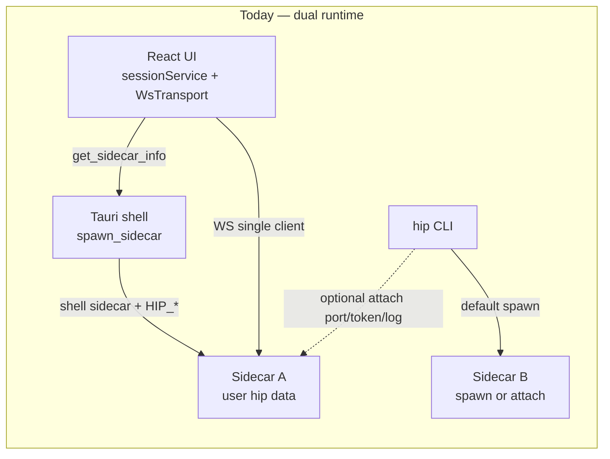
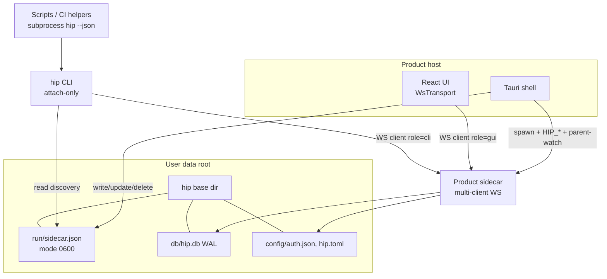

# hip CLI as Tauri Host Attach-Only Companion

| Field | Value |
|-------|--------|
| **Title** | hip CLI as Tauri host attach-only companion (no separate SDK product) |
| **Author** | _TBD_ |
| **Date** | 2026-07-18 |
| **Status** | Draft (rev 3 — post re-review) |
| **Supersedes** | README headless-CLI narrative; missing `docs/superpowers/specs/2026-07-14-hip-cli-design.md` (product path) |

---

## Overview

hip is a Tauri desktop AI workbench: a Rust shell owns a Node.js sidecar, and the React UI talks to that sidecar over a loopback WebSocket. Today the product CLI (`packages/cli`, bin `hip`) can **spawn its own sidecar** (default) or attach via explicit `--port`/`--token`/`--sidecar-log`. Spawning a second product process against `~/.hip/db/hip.db` races SQLite, fights Tauri’s parent-watch lifecycle, and the sidecar’s **single-client** WebSocket model cancels all in-flight turns when any connection closes — so concurrent GUI + CLI is unsafe.

This design locks the product model: **Tauri is the only host that may start the product sidecar bound to the user’s hip data root.** The `hip` CLI is an attach-only companion that discovers a running app via a stable runtime file, shares the same sidecar/SQLite/config root, and exposes a frozen subprocess JSON ABI (`hip … --json`) for scripts and tools. There is **no** separate published `@hip/sdk` product. Headless product usage without the desktop app is **out of scope**; if the app is not running, CLI fails with `APP_NOT_RUNNING`.

**Rev 2** hardens implementable multi-client ownership (session-level, matching `Session.cancel()`), an exhaustive event routing table, single fanout plumbing pattern, CLI waiter correlation, Windows discovery path, discovery race rules, HITL cross-client signals, required GUI correctness, and a split PR plan with multi-client as a hard gate before concurrent attach.

**Rev 3** corrects background-task ownership vs real `Session.cancel()` / `BackgroundManager`, makes `agent:interrupt:resolved` mandatory, requires `clients:changed` for live GUI presence, and makes Appendix B the sole classify authority.

---

## Background & Motivation

### Current architecture (verified in tree)



| Layer | Location | Behavior today |
|-------|----------|----------------|
| Tauri host | `src-tauri/src/sidecar.rs`, `lib.rs` | Spawns bundled/dev sidecar; injects `HIP_DB_PATH`, `HIP_CONFIG_PATH`, auth keys, `HIP_PARENT_WATCH=1`; parses stdout `{"port","token"}`; stores in `SidecarState`; exposes `get_sidecar_info`. Child is `tauri_plugin_shell::process::CommandChild` (has `.pid()`). |
| GUI transport | `src/domain/wsTransport.ts`, `sessionService.ts` | Polls `get_sidecar_info`, opens one WS; never shells out to CLI |
| Sidecar WS | `packages/sidecar/src/server/ws-server.ts` | Bind `127.0.0.1`; token query param; **on close → `sessionManager.cancelAllRunning()`** (explicit single-client comment) |
| Session cancel | `packages/sidecar/src/session/session.ts` | One `running` flag, one `abortController` per session; `cancel()` aborts controllers / clears resume; **session-level**, not per-message |
| Sidecar main | `packages/sidecar/src/main.ts` | Opens DB from `HIP_DB_PATH` (default `:memory:`), finds free port, writes handshake line to stdout |
| Persistence | `packages/sidecar/src/persistence/open.ts` | `PRAGMA journal_mode=WAL`, `busy_timeout=5000` on product `hip.db` |
| CLI connect | `packages/cli/src/sidecar/connect.ts` | Default `sidecar: 'spawn'`; attach only if mode attach/auto + port/token/log |
| CLI attach | `packages/cli/src/sidecar/attach.ts` | Env `HIP_SIDECAR_PORT`/`TOKEN`/`URL` or parse handshake from log — **no runtime discovery file** |
| CLI product paths | `user-hip.ts` | Maps env to `homedir()/.hip/...` — **does not mirror Windows `app_data_dir` or honor `HIP_DATA_DIR` for base layout** |
| Harness ABI | `packages/cli/src/types.ts` | `HipRunResult` `schemaVersion: 1`, frozen exit map `STATUS_EXIT` |
| Programmatic surface | `packages/cli/src/index.ts` | Exports `runHip`, `bootstrapIsolation`, connect helpers — SDK-like today |
| Doctor | `packages/cli/src/commands/doctor.ts` | Always spawns isolated in-memory sidecar |
| Data root (Tauri) | `src-tauri/src/paths.rs` | Unix: `$HOME/.hip`; Windows: `app.path().app_data_dir()` (identifier `com.ljm.hip` in `tauri.conf.json`); `HIP_DATA_DIR` overrides |
| README | root `README.md` | Documents headless CLI without Tauri and links missing 2026-07-14 design |

### Pain points

1. **Dual product runtime**: CLI spawn against user hip competes with Tauri for SQLite and for “who owns” the agent process.
2. **Unsafe multi-connect**: Any second WS client that disconnects triggers global `cancelAllRunning()`, cancelling GUI turns.
3. **No stable discovery**: Attach requires manual port/token or log scraping; Tauri keeps credentials only in process memory (`SidecarState`).
4. **Product narrative mismatch**: README sells headless harness as primary CLI path; product owner has reversed that for the product path.
5. **SDK ambiguity**: `packages/cli` `main` + `index.ts` exports look like a second product (`@hip/sdk` risk).
6. **Windows path skew**: CLI `user-hip.ts` and Tauri `hip_base_from` disagree on Windows → attach-only CLI cannot find discovery without a locked algorithm.

### Product decisions (locked — requirements)

1. **Tauri is the product host.** Only Tauri may start the product sidecar bound to the user’s hip data root.
2. **CLI requires a running Tauri app.** No GUI/app process ⇒ fail with clear error (`APP_NOT_RUNNING`). Headless product path out of scope.
3. **One external entry point: CLI binary.** No published `@hip/sdk`. Programmatic callers use `hip` with `--json` (subprocess ABI). Internal tests may import `packages/cli` modules.
4. **CLI and GUI share data** by attaching to the **same** sidecar. CLI must not open product SQLite itself and must not spawn a second product sidecar by default.
5. **GUI keeps its own WS client**; does not shell out to CLI or import `@hip/cli`.

---

## Goals & Non-Goals

### Goals

- Stable **discovery contract** so CLI can attach without user-supplied port/token in the common case (Unix + Windows).
- **Multi-client WebSocket** so GUI + one or more CLI connections coexist; disconnect policy does not cancel unrelated clients’ turns.
- Product **CLI attach-only** matrix; clear `APP_NOT_RUNNING`.
- **Freeze subprocess ABI** (`HipRunResult` / exit codes / `--json`) as the only programmatic product surface.
- **HITL** cross-client: no stuck GUI modals when CLI resolves; prefer GUI for `hitl=prompt` when possible.
- **Security**: discovery file mode `0600` (fail-closed if group/other-readable), loopback only, no remote CLI.
- **Migration**, tests, ordered **PR plan**.

### Non-Goals (product owner)

- Headless CLI/SDK without Tauri as a product path.
- Separate published `@hip/sdk` npm package.
- Full desktop feature parity in CLI (memory/plugins/MCP management may stay partial).
- Docker production CLI image (optional future; `packages/cli/docker` remains illustrative only).
- Changing GUI domain architecture to go through CLI.
- Remote/network multi-machine CLI attach.
- Per-message turn cancellation (Session model is session-abort only).

---

## Proposed Design

### Target architecture



**Capability split**

| Actor | May spawn product sidecar | May open product SQLite | May write discovery file |
|-------|---------------------------|-------------------------|---------------------------|
| Tauri | **Yes** (sole owner) | No (sidecar does) | **Yes** (owner) |
| Sidecar | N/A (is the process) | **Yes** | No (v1) |
| Product CLI | **No** | **No** | No |
| GUI | No | No | No |
| `HIP_CLI_DEV_SPAWN=1` | **Isolated temp only** — never product DB | Isolated only | N/A |

---

### Discovery contract

#### Path resolution (normative — closes Windows open question)

**Discovery relative path:** `run/sidecar.json` under the **hip base dir**.

**Resolve hip base dir (CLI + Tauri must agree):**

```
1. If process env HIP_DATA_DIR is set and non-empty:
     base = absolute(HIP_DATA_DIR)
2. Else if platform is Windows:
     base = first existing candidate among:
       a. %APPDATA%\com.ljm.hip          # Tauri app_data_dir for identifier com.ljm.hip
       b. %APPDATA%\hip                  # defensive alias if packaging ever differs
     If none exist, still prefer (a) as the canonical path for “not running”
     (doctor reports expected path even when missing).
3. Else (Unix/macOS):
     base = $HOME/.hip   (HOME from env, else os.homedir())
4. discovery = join(base, "run", "sidecar.json")
```

**Rationale:** Matches `paths::hip_base_from` / `hip_base_dir` (`src-tauri/src/paths.rs`) and `tauri.conf.json` `"identifier": "com.ljm.hip"`. Windows tests already pin app-data as `C:\AppData\com.ljm.hip`.

**Implementation requirement:** New shared helper in CLI, e.g. `packages/cli/src/sidecar/hip-base.ts` (`resolveHipBaseDir(env, platform)`), with unit tests that mirror Rust `hip_base_from` fixtures. Tauri continues to use `paths.rs`; no behavior change on Unix.

**Why not only read `hipDataDir` from the file?** Chicken-and-egg: CLI must locate the file first. Once found, CLI **must** compare resolved base to `hipDataDir` in the JSON (if present); mismatch → warn in doctor; attach still allowed if token works (operator may have moved env).

#### Schema (`schemaVersion: 1` — integer, not semver)

```json
{
  "schemaVersion": 1,
  "pid": 12345,
  "port": 54321,
  "token": "<uuid>",
  "startedAt": "2026-07-18T12:00:00.000Z",
  "hipDataDir": "C:\\Users\\me\\AppData\\Roaming\\com.ljm.hip",
  "appVersion": "0.1.0"
}
```

| Field | Required | Notes |
|-------|----------|--------|
| `schemaVersion` | yes | Must be exactly `1`. Any other value → `DISCOVERY_INVALID` (no “unknown major” wording — field is an integer constant). |
| `pid` | yes | **Sidecar child process id** from `CommandChild::pid()` after spawn (not Tauri host pid). |
| `port` | yes | Loopback WS port |
| `token` | yes | Same token as WS `?token=`; secret |
| `startedAt` | yes | ISO-8601 |
| `hipDataDir` | yes | Absolute path of data root this sidecar serves (Tauri writes `hip_base_dir`) |
| `appVersion` | optional | Desktop app version |

#### Permissions

- Directory `run/`: create `0700` on Unix (same intent as `config/`).
- File `sidecar.json`: write `0600`.
- **CLI fail-closed:** if file mode is group- or world-readable (Unix), refuse attach with `DISCOVERY_INSECURE` → status `sidecar` / exit 3, unless `HIP_CLI_ALLOW_INSECURE_DISCOVERY=1` (undocumented override for weird FS). If directory is not owner-only when checkable, same policy.
- Windows: rely on user profile ACLs for app-data; no POSIX mode check.

#### Write / delete ownership

| Event | Owner | Action |
|-------|--------|--------|
| Sidecar handshake success | **Tauri** | After parsing stdout info line, obtain **sidecar child pid** via `CommandChild::pid()`, write `run/sidecar.json` atomically (temp in same dir + rename) |
| Sidecar terminated | **Tauri** reader task | Clear `SidecarState` if generation current; **delete** discovery file if generation still current |
| App graceful quit | **Tauri** exit handler | Kill sidecar + delete discovery file |
| Restart sidecar | **Tauri** | Overwrite discovery file with new port/token/pid |

#### Stale detection and race rules (normative)

1. **PID is a heuristic only.** OS PID reuse can make a dead sidecar look alive. **Authoritative liveness = successful WS open + token auth + `ready` frame** (or connection refused / auth fail).
2. **pid field = sidecar child pid** via `CommandChild::pid()` (tauri-plugin-shell). Document in Tauri code comments.
3. **CLI algorithm:**
   1. Resolve discovery path (above).
   2. If file missing → `APP_NOT_RUNNING`.
   3. Parse JSON; if `schemaVersion !== 1` or missing port/token → `DISCOVERY_INVALID`.
   4. Optional: if `pid` present and `process.kill(pid, 0)` fails → treat as **stale candidate**. CLI may **unlink only if** (a) kill fails and (b) file content byte-identical to what was just read (avoid racing Tauri rewrite). Then return `APP_NOT_RUNNING`.
   5. Connect WS with short timeout (2s).
   6. **On `WS_AUTH_FAILED`:** re-read discovery file **once**; if port/token changed, reconnect **once**; else fail `WS_AUTH_FAILED` (suggest restart app).
   7. On connection refused after steps above → `APP_NOT_RUNNING`.
4. **Mid-restart window:** file deleted or old token is expected; CLI surface: “app restarting or not running; retry after desktop is ready.” No infinite retry in product CLI (scripts may loop).
5. **Concurrent readers** during atomic rename: OS guarantees readers see old or new file whole; no partial JSON assumed on POSIX rename.

**Env overrides** `HIP_SIDECAR_PORT`/`TOKEN`/`URL` remain for **dev/debug only** (not user README). Product default is discovery file.

**Explicit flags:** `--port` / `--token` / `--sidecar-log` stay for power users and tests.

---

### Multi-client WebSocket model

#### Problem recap

```75:76:packages/sidecar/src/server/ws-server.ts
    // Single-client model: the Tauri shell holds one WS. Closing it cancels all in-flight
    // turns (see SessionManager.cancelAllRunning). Multi-client would need per-connection ownership.
    ws.on('close', () => this.sessionManager.cancelAllRunning())
```

`Session.cancel()` is **session-level** (abort controllers + resume), not per userMessageId (`session.ts`). Any design based on `ownedTurnKeys: Set<sessionId:userMessageId>` is fiction relative to the code.

#### Connection registry

```ts
interface ClientConnection {
  id: string                 // uuid per WS
  role: 'gui' | 'cli' | 'unknown'
  send: SendFn               // unicast to this socket only
  connectedAt: number
}
```

- Query: `?token=…&client=gui|cli` (optional; default `unknown`). CLI sets `client=cli`; GUI sets `client=gui` (WsTransport change, small).
- Soft limit: **16** concurrent connections; excess closed with `1008` / log. Local DOS guard only.
- Registry on `WsServer` / `SessionManager`: `Map<id, ClientConnection>`.
- Default after PR1a/1b: multi-client **on**. Kill-switch `HIP_WS_MULTI_CLIENT=0` restores legacy “any close → cancelAllRunning()” for emergency rollback (off-by-default kill-switch).

#### Ownership model (normative — matches Session)

**Field on `Session` (in-memory only):**

```ts
/** Connection that currently owns the active turn / drain / HITL pause; null if idle or legacy. */
ownerConnectionId: string | null
```

**When set**

| Event | Action |
|-------|--------|
| `message:send` / steer / resume that starts or continues a turn from connection C | Set `ownerConnectionId = C` when turn becomes `running` or when input is accepted onto the drain path that will run |
| Input enqueued while busy | Tag queue entry with `connectionId`; when dequeued to start turn, set owner to that tag |
| Turn settles (complete / cancelled / error); session idle and queue empty | Clear `ownerConnectionId = null` |
| Enter HITL pause (`permission:request` or plan `agent:interrupt` awaiting response) | **Keep** current `ownerConnectionId` (originator of the turn) |
| Permission/plan **response** accepted from any connection | Do not change owner until turn settles (responder need not be owner) |

**Today’s code truth (do not restate incorrectly)**

- `Session.cancel()` (`session.ts`) only aborts `abortController` / `resumeAbortController` (and clears resume pause). It does **not** call `backgroundManager.stop()` / stop-all.
- `BackgroundManager.spawn` uses a **separate** `AbortController` per task (`background-manager.ts`); only `stop(taskId)` aborts it.
- Fire-and-forget `subagent:background` paths use local ACs not tied to `Session.cancel()`.
- `destroy()` waits/clears background tasks; **disconnect must not call `destroy()`** (session stays listed).
- Therefore “same as user `message:cancel`” means: **foreground turn aborts; background tasks keep running today.** Multi-client must **not** claim background dies via `Session.cancel()` alone.

**Background ownership (normative multi-client extension — PR1a)**

Tag every background task with `originConnectionId` at spawn (meta field or parallel map on `BackgroundManager` / session handler). Also tag fire-and-forget subagent ACs when introduced from a connection-scoped handler.

| Event | Action |
|-------|--------|
| Owner disconnect / `cancelOwnedBy(connId)` | (1) drop queued inputs from `connId`; (2) if `ownerConnectionId === connId`, call `s.cancel()` for foreground turn/HITL pause; (3) **stop all background tasks with `originConnectionId === connId`** via `backgroundManager.stop(taskId, 'owner_disconnect')` (and abort any connection-tagged fire-and-forget ACs). Session row remains. |
| Turn settles; bg tasks still running | Keep bg `originConnectionId`; **do not** clear bg ownership when clearing `ownerConnectionId` for the idle foreground. CLI exit after turn complete still stops that CLI’s bg work. |
| Non-owner `message:cancel` | Foreground cancel only (existing semantics); **v1 does not** stop other connections’ background tasks unless product later adds “cancel all work on session.” |
| GUI-started bg while CLI disconnects | Untouched (`originConnectionId` ≠ cli). |

**`cancelOwnedBy(connId)`**

```
for each session s:
  s.dropQueuedInputsFrom(connId)
  // Background first or after cancel — order not user-visible if both stop
  s.stopBackgroundFrom(connId)  // NEW: stop tasks tagged originConnectionId === connId
  if s.ownerConnectionId === connId:
    s.cancel()  // existing Session.cancel() — foreground only
  // Sessions / bg owned by others: untouched
```

**Disconnect policies**

| Disconnecting client | Policy |
|----------------------|--------|
| **CLI** | `cancelOwnedBy(cliConnId)` only (foreground if owner **and** CLI-origin background). Do **not** `cancelAllRunning()`. Do not delete sessions. Do not stop sidecar. |
| **GUI** | `cancelOwnedBy(guiConnId)` only. CLI-owned turns and CLI-origin bg continue. |
| **Last connection** | Sidecar stays up; Tauri parent-watch is lifecycle authority. Orphan policy: last-client disconnect still runs `cancelOwnedBy` for that client (stops its bg); work owned by already-gone clients should already have been stopped. |
| **Tauri kills sidecar** | All clients drop; discovery removed. |

**`message:cancel` from non-owner**

- **v1 rule:** Allow cancel from **any** authenticated connection for that `sessionId` (user intent to stop wins — same-trust local model). Optionally log `cancelledBy !== owner`.
- Scope: **foreground turn only** (call `Session.cancel()`). Does **not** bulk-kill background unless we later unify “session stop all work.”
- Rationale: GUI user must be able to stop a runaway CLI turn; CLI must be able to stop if GUI is stuck. Same-trust desktop.

**Turns with no owner (`ownerConnectionId === null`)**

- Pre-multi-client rehydrate / edge race: `cancelOwnedBy` does **not** cancel foreground.
- Background with `originConnectionId === connId` **is still stopped** on that connection’s disconnect (bg ownership is independent of foreground owner).
- Process shutdown / kill-switch single-client mode: still use `cancelAllRunning()` for foreground; kill-switch path should also stop-all background for parity with process teardown intent (or document kill-switch as foreground-only emergency — prefer stop-all bg under kill-switch single-client restore).

**Required PR1a test matrix**

1. CLI disconnect while its turn runs on S → S foreground cancelled; GUI idle session T untouched.  
2. CLI enqueued messages not yet drained → dropped on CLI disconnect; not executed later.  
3. GUI turn running when CLI disconnects → GUI turn continues.  
4. **Background:** CLI-spawned `backgroundManager` task still running after turn idle (`ownerConnectionId` null) → CLI disconnect **stops** that task via `originConnectionId` tag (not via `Session.cancel()` alone). GUI-spawned bg on same session **continues**.  
5. Permission/plan pause owned by CLI → cancel on CLI disconnect (session cancel clears pause).  
6. `message:cancel` from GUI on CLI-owned session → foreground cancels; CLI-origin bg **still running** unless/until CLI disconnect (document; optional follow-up to expand cancel).  
7. Idle sessions (null owner) with no CLI-origin bg → not cancelled on CLI disconnect.

#### Event routing — three classes

| Class | Delivery | Definition |
|-------|----------|------------|
| **connect-only** | The connecting socket once | `ready` |
| **unicast (RPC)** | Only the requesting connection’s `send` | Direct answers to a client RPC (`*:result`, correlated probes, RPC-path `error`) |
| **broadcast (lifecycle + stream)** | All open connections | Session lifecycle, turn streams, HITL prompts/resolutions, global config mirrors, catalog changes |

**Authority:** Implementers **must** implement `classify(msg)` using **Appendix B** (pattern rules: suffix `:result` ⇒ unicast, etc.), **not** a hand-copied subset of the bullets below. Prose lists are illustrative only and **will drift** (e.g. body may omit `mcp:listResources:result` while Appendix B’s `*:result` covers it). Prefer a generated / exhaustiveness unit test over dual tables.

##### Unicast (RPC) — illustrative examples (see Appendix B)

- Any `*:result` (session/fs/git/memory/plugin/mcp/config/…)
- `session:loaded`, `plugin:install:progress` (installer-only)
- `error` on RPC failure path without turn `sessionId` (see error routing)

##### Broadcast — lifecycle / state (required for GUI continuity)

CLI-created sessions **must** appear in the GUI without manual list reload. Today `sessionStore` already handles `session:created` by inserting `emptySession` — but only if the event reaches the GUI WS. Types include `session:created` / `deleted` / `title` / `cwd` / model / permissionMode / … — full set in Appendix B.

##### Broadcast — turn streams & HITL

Streams (`token:stream`, tools, agents, plans, workflows, …), `permission:request`, **`permission:resolved`**, **`agent:interrupt:resolved`** (mandatory — see HITL), session-scoped `error`. Full set in Appendix B.

##### connect-only + registry presence

- `ready` — extended fields (additive):

```ts
{
  type: 'ready'
  hasApiKey: boolean
  multiClient?: true
  connectionId?: string
  /** Snapshot of connections at connect time (roles only; no tokens). */
  clients?: Array<{ id: string; role: 'gui' | 'cli' | 'unknown' }>
}
```

- **`clients:changed` is required in PR1b** (broadcast when registry mutates):

```ts
{
  type: 'clients:changed'
  clients: Array<{ id: string; role: 'gui' | 'cli' | 'unknown' }>
}
```

CLI treats “any `role === 'gui'`” as GUI present for `hitl=prompt`. **Long-lived clients (`hip repl`) must update this flag on `clients:changed`**, not only from the `ready` snapshot — so a GUI that launches after CLI connect is detected.

##### Error routing (critical for CLI waiters)

| Error shape | Routing |
|-------------|---------|
| RPC failure without session / for list-like call | **Unicast** to requester only |
| Turn/session `error` with `sessionId` | **Broadcast** |
| Internal handler error for a specific request | Unicast |

#### Single implementable fanout plumbing (mandatory pattern)

**Do not** scatter `for (c of clients)` across session files.

```ts
// ws-server / client-registry.ts
function createConnectionSend(conn: ClientConnection): SendFn {
  return (msg) => {
    if (conn.socket.readyState !== OPEN) return
    conn.socket.send(JSON.stringify(msg))
  }
}

function broadcast(msg: ServerMessage): void {
  for (const c of registry.values()) createConnectionSend(c)(msg)
}

function routeServerMessage(origin: ClientConnection, msg: ServerMessage): void {
  switch (classify(msg)) { // pure function + unit tests on type tables
    case 'unicast': origin.send(msg); break
    case 'broadcast': broadcast(msg); break
    case 'connect-only': origin.send(msg); break
  }
}
```

**Injection into Session / SessionManager:**

1. On each client message, `handle(msg, originConn)`.
2. Build `reply: SendFn = (m) => routeServerMessage(originConn, m)` for **all** handler emissions from that request path.
3. For turn start, Session already wraps send as `rawSend` in `runTurn` — ensure that wrapper **is** `reply` above so `message:delta`-class events classify as broadcast even though they go through the same function.
4. **Classification lives only in `classify(msg)`** (one module). Adding a new `ServerMessage` type requires updating the table (typecheck helper / exhaustiveness test preferred).

`session:created` emitted inside `createSession` uses the request’s `reply` → classify → **broadcast** → GUI updates.

#### CLI waiter hardening (required)

`waitForServerMessage` today rejects on **any** `error` while waiting (`packages/cli/src/sidecar/connect.ts`). That flakes under multi-client if a concurrent GUI turn broadcasts `error`.

**Normative CLI changes (PR1b or PR3 — must ship before concurrent attach claims):**

1. `waitForServerMessage(client, type, { match, sessionId, ignoreForeignErrors: true })`:
   - Ignore `error` messages whose `sessionId` is set and ≠ expected session (if any).
   - Ignore `error` without correlation when waiting for a global RPC **only if** we add `requestId` — see (2).
2. Prefer additive `requestId` on RPC client messages + echo on `*:result` / RPC errors for list/create/delete where cheap; **minimum v1** without full requestId: session-scoped error filtering + unicast RPC errors (so list failures never broadcast).
3. **Integration test (merge gate):** GUI session emits turn `error` while CLI waits for `session:list:result` → CLI succeeds.

Session commands (`session.ts`, `worktree.ts`) must use the hardened waiter.

---

### HITL when CLI is used while GUI is open

#### Server

1. **`permission:respond` / plan response** accepted from **any** authenticated connection for an open `requestId` / open plan interrupt (first valid wins; subsequent ignored with debug log).
2. **Mandatory broadcasts** after resolution (additive protocol):

```ts
{ type: 'permission:resolved'; sessionId: string; requestId: string; source: 'gui' | 'cli' | 'unknown' }

{ type: 'agent:interrupt:resolved'; sessionId: string; turnId: string; source?: 'gui' | 'cli' | 'unknown' }
```

Emit `permission:resolved` when a tool permission response is accepted.  
Emit `agent:interrupt:resolved` when a plan/interrupt response is accepted **or** when the turn ends without resume while an interrupt was pending (cancel/error/complete that abandons the pause).

**Do not** treat `message:complete` alone as sufficient for clearing plan UI. Spot-check of `sessionStore.ts`: `message:complete` sets `status: 'idle'` and clears `planApprovalPending` but **does not** set `interrupt: null` or clear `pendingPermission`. Implementers who rely on complete will ship sticky interrupt chrome when CLI/`hitl=auto` resolves plan HITL while the GUI is open.

3. **`ready.clients` + required `clients:changed`** so CLI can detect GUI without guessing, including late GUI join.

#### GUI store rules (PR7 — mandatory)

| Event | Store effect |
|-------|----------------|
| `permission:resolved` | `clearPermission(requestId)` → `pendingPermission = null` when ids match |
| `agent:interrupt:resolved` | Set `interrupt: null`, `planApprovalPending: false` for `sessionId` (match `turnId` if present) |
| `permission:request` / `agent:interrupt` | Existing set pending paths unchanged |

Required unit tests: foreign resolution leaves no sticky modal; plan path covered independently of `message:complete`.

#### CLI policy (product attach)

| CLI `--hitl` | Behavior |
|--------------|----------|
| `auto` | CLI may auto-approve allow-like options **immediately**. **Intentionally bypasses GUI approval** (security-relevant; document in README). GUI may briefly flash if `permission:request` / `agent:interrupt` was broadcast before resolve — **must** clear on `permission:resolved` / `agent:interrupt:resolved`. |
| `fail` | CLI rejects; turn ends `hitl_blocked`. |
| `prompt` | **Never steal TTY first** when discovery-attached. Wait for **any** client response while **live** `guiPresent` is true (`ready.clients` then updates from `clients:changed`). If no `gui` in live set **and** stdin is TTY, may TTY-prompt. If GUI joins mid-wait, cancel TTY path and wait for GUI (best effort). If no resolution before timeout → `awaiting_user` / exit 5. |

Default: `hip run` → `auto` (scripts); `hip repl` → `prompt`.

---

### CLI behavior matrix

#### Product defaults

| Concern | Product default |
|---------|-----------------|
| Sidecar mode | **attach only** (discovery → WS) |
| Data root | Shared sidecar (CLI never opens product SQLite) |
| Spawn product sidecar | **Forbidden** |
| Isolation | Not user-facing |

#### `HIP_CLI_DEV_SPAWN=1` (undocumented)

- Allows spawn **only** with forced isolation (`bootstrapIsolation` / temp HIP_* / memory or temp DB).
- **Never** product user DB. If combined with product-path intent (`--use-user-hip` or default user hip), **hard error**.
- Not in user README.

#### Command fate

| Command | Product behavior |
|---------|------------------|
| `hip version` | Keep; local |
| `hip config auth-status` | Keep; offline file presence |
| `hip doctor` | Discovery + liveness + WS `ready` + `hipDataDir` mismatch check; no product spawn |
| `hip doctor --sidecar-self-test` | Optional; only if `HIP_CLI_DEV_SPAWN=1` (or always gated): isolated spawn handshake for contributors; else print “use yarn cli:test / HIP_CLI_DEV_SPAWN” |
| `hip session *` / `worktree *` / `repl` / `run` | Attach-only |
| Harness preset / spawn flags | Hard-cut removed (see Appendix A) |

#### Flag hard-cut (Key Decision)

**Hard-cut in the same release as attach-default (PR5):** user-facing spawn/harness/isolate flags **removed or hard-error** with migration message — no one-release dual default. Escape hatch only `HIP_CLI_DEV_SPAWN`. See **Appendix A** for every `bin.ts` option.

Migration message (stderr):

```text
[hip] spawn/isolation flags were removed from the product CLI.
Start the hip desktop app and retry (attach via ~/.hip/run/sidecar.json).
Contributors: HIP_CLI_DEV_SPAWN=1 forces isolated spawn only (never product DB).
```

---

### Programmatic ABI without SDK package

**Contract:** subprocess only.

```bash
hip run --json --output result.json "prompt…"
hip session list --json
```

#### Exit codes (frozen map; new codes fold into existing statuses)

| Status | Exit | Meaning |
|--------|------|---------|
| `ok` | 0 | Success |
| `error` | 1 | Generic failure |
| `invalid_args` | 2 | Bad CLI args |
| `sidecar` | 3 | Sidecar/WS/discovery problems |
| `timeout` | 4 | Turn timeout |
| `hitl_blocked` / `awaiting_user` | 5 | HITL incomplete |
| `cancelled` | 130 | Cancelled |

| Error `code` | Status | Exit |
|--------------|--------|------|
| `APP_NOT_RUNNING` | `sidecar` | 3 |
| `WS_AUTH_FAILED` | `sidecar` | 3 |
| `DISCOVERY_INVALID` | `sidecar` | 3 |
| `DISCOVERY_INSECURE` | `sidecar` | 3 |

`HipRunResult.schemaVersion` remains **1** (no bump for new error codes).  
**PR3:** extend `mapErrorCode` + unit tests for the four codes above.

`runHip()` / `index.ts`: **@internal** — monorepo tests only; not a supported library API.

---

### Security & Privacy Considerations

| Threat | Mitigation |
|--------|------------|
| Token theft via world-readable discovery | **Fail-closed** on group/other-readable (Unix); `0600` write |
| Remote attach | Bind `127.0.0.1` only; no remote CLI |
| Token in logs | Tauri redacts token lines; doctor never prints token |
| Stale file | PID heuristic + WS probe; Tauri delete on exit |
| Secrets in artifacts | Existing redaction; `--trace-raw` opt-in |

**Residual risk (explicit):** Any local process that can read `run/sidecar.json` has **full agent control** equal to the GUI (tools under session permission modes, session delete, etc.). Same-trust single-user desktop model — same class as plaintext `auth.json`. Multi-user shared Unix hosts should not share a hip data dir.

---

### Observability

- Tauri: discovery write/delete logs (no token).
- Sidecar: connect/disconnect with `connectionId`, `role`, count; cancelOwnedBy logs.
- CLI: stderr + JSON error codes; doctor prints resolved base, discovery path, `hipDataDir`, mismatch warning.
- Kill-switch: log when `HIP_WS_MULTI_CLIENT=0`.

---

### Rollout Plan

1. Land **PR1a + PR1b** with multi-client **default on**; kill-switch available.
2. Land discovery write (PR2) and CLI attach library (PR3) **only after PR1** for any path that coexists with GUI.
3. Attach-default + flag hard-cut (PR5) + README concurrent claims only after GUI correctness PR and waiter tests green.
4. Rollback: `HIP_WS_MULTI_CLIENT=0`; discovery file additive for old CLIs.

---

### Migration

| Area | Action |
|------|--------|
| README | Requires running desktop app; attach discovery; no dual-runtime DB tip |
| Link missing 2026-07-14 design | Point here |
| `bin.ts` description | Attach-only companion |
| Commander flags | Appendix A hard-cut |
| CI harness scripts | `HIP_CLI_DEV_SPAWN` isolation or sidecar unit tests |
| `@hip/cli` | Stay `private: true` |

---

### Testing strategy

| Case | Layer | Gate |
|------|-------|------|
| cancelOwnedBy matrix (7 cases above, incl. bg origin tag) | Sidecar | **PR1a merge** |
| classify() from Appendix B / exhaustiveness | Sidecar unit | **PR1b** |
| Fanout: session:created reaches second client | Sidecar integration | **PR1b** |
| `clients:changed` on connect/disconnect | Sidecar | **PR1b** |
| CLI list waiter vs foreign session error | CLI + sidecar | **PR1b or PR3** |
| Discovery write mode + pid field | Rust | PR2 |
| APP_NOT_RUNNING / stale / insecure mode | CLI unit | PR3 |
| Windows path candidates | CLI unit + Rust fixture parity | PR2/PR3 |
| `permission:resolved` + `agent:interrupt:resolved` clear GUI sticky state | Frontend unit | **PR7 before README concurrent** |
| session:created inserts sidebar row | Frontend unit | **PR7** |
| hitl=prompt updates guiPresent on `clients:changed` | CLI unit | PR6 |
| hitl=auto documents bypass | Docs | PR8 |

---

## API / Interface Changes

### Tauri

- Write/delete discovery with **sidecar child pid** (`CommandChild::pid()`).
- `paths::run_dir`, `sidecar_discovery_path`.
- GUI still uses `get_sidecar_info` (in-memory).

### Sidecar

- Registry, ownership, `classify`, `routeServerMessage`.
- New server messages (all required for multi-client product path): `permission:resolved`, `agent:interrupt:resolved`, `clients:changed`.
- Additive `ready` fields (`clients`, `connectionId`, `multiClient`).
- Background task `originConnectionId` + `stopBackgroundFrom` on owner disconnect.
- Close → `cancelOwnedBy` (foreground + connection-origin background).

### Protocol

- Additive only; no client message breaks.
- Update message-guard if new client types appear (none required for resolved events — server-only).

### CLI

- `resolveHipBaseDir` + discovery attach; hardened waiters; hard-cut flags; doctor redesign; `mapErrorCode` extensions.

### GUI (**required** for concurrent product use — not optional)

1. Connect with `client=gui`.
2. Handle `permission:resolved` → `clearPermission(requestId)`.
3. Handle **`agent:interrupt:resolved`** → `interrupt: null`, `planApprovalPending: false` (mandatory; **not** `message:complete`-only).
4. Rely on broadcast `session:created` / `session:deleted` (already partially handled) — **tests required**.
5. Reducers must tolerate stream events for non-active sessions (no throw; no clobbering active selection incorrectly).

---

## Data Model Changes

- No SQLite schema changes.
- New runtime file `run/sidecar.json`.
- In-memory `Session.ownerConnectionId` only.

---

## Alternatives Considered

### A. Keep CLI spawn-default + “close the app first”

Reject — violates product locks; dual runtime forever.

### B. Published `@hip/sdk`

Reject — second product surface; subprocess ABI enough.

### C. CLI → Tauri IPC for all agent ops

Reject — duplicates protocol; slower iteration. Sidecar remains capability process.

### C2. File holds only port; CLI asks Tauri for token

Rejected for product scripts: non-GUI callers cannot invoke Tauri commands without a custom bridge. A shell wrapper exporting `HIP_SIDECAR_*` is fragile across app restarts. **File-based token (0600, loopback)** matches local-single-user trust of `auth.json` and enables `hip` from any terminal without a live invoke channel. Residual risk documented in Security.

### D. Sidecar writes discovery file

Defer — Tauri ownership clearer for product path.

### E. Multiplex logical clients on one WS

Reject — couples CLI lifecycle to GUI.

### F. Full session interest subscriptions

Defer after v1 broadcast.

---

## Open Questions

Resolved into Key Decisions where previously blocking. Remaining non-blocking:

1. Soft connection limit 16 — tune after dogfood?  
2. Future scoped CLI tokens (not v1).  
3. Whether non-owner `message:cancel` should later also stop all session background tasks (v1 = foreground only).

---

## Key Decisions

| # | Decision | Rationale |
|---|----------|-----------|
| 1 | Tauri sole spawner of product sidecar | Single lifecycle, parent-watch, env injection |
| 2 | CLI product path attach-only; `APP_NOT_RUNNING` if app down | Locked product scope |
| 3 | Discovery file `run/sidecar.json` schemaVersion **integer 1**; `!== 1` → `DISCOVERY_INVALID` | Stable attach; no semver confusion |
| 4 | **pid = sidecar child pid** via `CommandChild::pid()`; PID is heuristic; WS is authoritative | Closes pid ambiguity; handles reuse |
| 5 | **Windows base** = `%APPDATA%\com.ljm.hip` (identifier), with `HIP_DATA_DIR` override; Unix `$HOME/.hip` | Matches `paths.rs` + `tauri.conf.json` |
| 6 | Multi-client WS; **session-level `ownerConnectionId`**; `cancelOwnedBy` = `Session.cancel()` **plus** stop bg tagged `originConnectionId` | `Session.cancel()` alone does not stop `BackgroundManager` |
| 7 | **Lifecycle + streams broadcast; RPC unicast**; single `classify` per **Appendix B** only | GUI sees CLI sessions; avoid dual-table drift |
| 8 | Session-scoped `error` broadcast; RPC errors unicast; **CLI waiters ignore foreign session errors** | Prevent list flake |
| 9 | No `@hip/sdk`; freeze `HipRunResult` v1; map new codes to exit 3 | One external surface |
| 10 | Harness/spawn **hard-cut** from product CLI; `HIP_CLI_DEV_SPAWN` **isolation only** | No accidental headless product path |
| 11 | HITL: any client may respond; **`permission:resolved` + `agent:interrupt:resolved` mandatory**; `hitl=auto` bypasses GUI; `prompt` uses live `clients:changed` | Sticky UI + late GUI join |
| 12 | GUI correctness **required** before concurrent README claims | Broadcast without UI handlers is incomplete |
| 13 | Max **16** connections soft limit | Local guard |
| 14 | Multi-client **default on** after PR1; `HIP_WS_MULTI_CLIENT=0` kill-switch | Safe rollback without default-off trap |
| 15 | Discovery fail-closed if group/other-readable | Stronger than warn-only on multi-user Unix |
| 16 | GUI keeps direct WS | Low risk inversion |
| 17 | Doctor = attach health; `--sidecar-self-test` gated for contributors | Don’t lose self-check entirely |
| 18 | PR3 attach **depends on PR1**; multi-client tests gate PR1 | Never advertise concurrent attach on single-client close policy |
| 19 | **`clients:changed` required** in PR1b (not optional) | Long-lived CLI / late GUI |
| 20 | Delivery = **9 PRs** (1a, 1b, 2–9) | PR1 split + required GUI + scripts |

---

## Risks

| Risk | Severity | Mitigation |
|------|----------|------------|
| Attach before multi-client | **Critical** | PR3 depends on PR1; PR5 after |
| Ownership model wrong vs queue/background | **Critical** | Tag bg `originConnectionId`; PR1a tests #4/#6; do not claim `Session.cancel()` stops bg |
| CLI waiter flake | **Critical** | Hardened waiters + test |
| Sticky permission modal | High | `permission:resolved` + GUI PR |
| Windows path wrong | High | Locked algorithm + fixture tests |
| PID reuse false alive | Medium | WS authoritative |
| Local token = full control | Medium | Document residual risk; 0600 fail-closed |
| PR1 megapatch | High | Split 1a / 1b |

---

## References

- `packages/cli/src/bin.ts`, `sidecar/connect.ts`, `attach.ts`, `spawn.ts`, `user-hip.ts`, `types.ts`, `index.ts`
- `packages/sidecar/src/server/ws-server.ts`, `session/session-manager.ts`, `session/session.ts` (`cancel`, `running`, `abortController`)
- `packages/protocol/src/messages.ts` — `ServerMessage` union
- `src-tauri/src/sidecar.rs`, `paths.rs`, `lib.rs` (`CommandChild`)
- `src-tauri/tauri.conf.json` — `identifier: com.ljm.hip`
- `src/domain/wsTransport.ts`, `sessionService.ts`, `sessionStore.ts` (`session:created`, `permission:request`, `clearPermission`)

---

## PR Plan

Ordered, independently reviewable. **PR3+ must not claim concurrent GUI+CLI safety until PR1a/1b merge.**

### PR 1a — Cancel ownership only (safe multi-close)

- **Title:** `sidecar: per-connection session ownership; cancelOwnedBy on WS close`
- **Files:** `ws-server.ts`, `session-manager.ts`, `session.ts` (`ownerConnectionId`, queue tags), `background-manager.ts` (`originConnectionId` / stop-by-origin), session handlers that spawn bg, tests
- **Dependencies:** none
- **Description:** Registry + roles; **stop** `cancelAllRunning()` on every close; implement ownership table; **tag and stop connection-origin background** on disconnect (do not assume `Session.cancel()` stops bg — it does not today). 7-case test matrix including idle-foreground + still-running CLI bg. Kill-switch `HIP_WS_MULTI_CLIENT=0`. **No broadcast fanout yet** — do not document concurrent product use.
- **Merge gates:** ownership + background-origin tests green.

### PR 1b — Broadcast fanout + classify + HITL resolve + clients:changed

- **Title:** `sidecar: classify/routeServerMessage; permission:resolved; agent:interrupt:resolved; clients:changed`
- **Files:** new `server/message-route.ts` (or similar), `ws-server.ts`, protocol `messages.ts`, session emission paths only via routed send, tests including second-client `session:created`
- **Dependencies:** PR 1a
- **Description:** Single plumbing pattern; **Appendix B** classify rules + exhaustiveness test; broadcast lifecycle/streams; unicast RPC; first-wins permission/plan; emit **`permission:resolved`** and **`agent:interrupt:resolved`**; extend `ready`; **require `clients:changed`**.
- **Merge gates:** classify unit tests; two-client lifecycle + stream test; foreign error does not break unicast RPC; clients:changed on join/leave.

### PR 2 — Discovery file write/delete in Tauri

- **Title:** `tauri: write run/sidecar.json with sidecar pid; remove on exit`
- **Files:** `sidecar.rs`, `paths.rs`, `lib.rs`, Rust tests
- **Dependencies:** none (parallel to 1a/1b)
- **Description:** Atomic write; `CommandChild::pid()`; generation-aware delete; `hipDataDir`; 0600/0700.

### PR 3 — CLI discovery attach + waiter hardening + APP_NOT_RUNNING

- **Title:** `cli: discovery attach, hip base resolution, mapErrorCode, safe waiters`
- **Files:** `hip-base.ts`, `discovery.ts` / `attach.ts`, `connect.ts`, `types.ts`, session/worktree waiters, tests
- **Dependencies:** **PR 1a + PR 1b** (required before any attach path intended to coexist with GUI). PR 2 for e2e with real app file.
- **Description:** Path algorithm (Windows+Unix); stale rules; fail-closed mode; `mapErrorCode` + unit tests for new codes; hardened `waitForServerMessage`. Spawn still default until PR5 **but** if attach is used with GUI, multi-client must already be on.
- **Note:** Do not merge PR3 before PR1 if the branch enables discovery attach by default in any code path.

### PR 4 — Doctor redesign

- **Title:** `cli: doctor attach health + optional --sidecar-self-test`
- **Files:** `commands/doctor.ts`, `bin.ts`
- **Dependencies:** PR 3
- **Description:** Discovery/liveness/ready/hipDataDir mismatch; self-test gated.

### PR 5 — Product attach-only defaults + flag hard-cut

- **Title:** `cli: attach-only defaults; remove spawn/harness user flags`
- **Files:** `bin.ts`, `connect.ts`, `run.ts`, `presets.ts`, commands, `index.ts` @internal banner
- **Dependencies:** PR 1a, 1b, 3
- **Description:** Appendix A checklist; `HIP_CLI_DEV_SPAWN` isolation-only; migration message.

### PR 6 — CLI HITL prompt policy using live client registry

- **Title:** `cli: hitl=prompt uses clients:changed; document hitl=auto bypass`
- **Files:** `turn-runner.ts`, `hitl-policy.ts`, tests
- **Dependencies:** PR 1b, PR 5
- **Description:** Product attach prompt behavior; maintain live `guiPresent` from `ready` + `clients:changed`; no TTY-first when gui present; late GUI join updates wait path.

### PR 7 — GUI multi-client correctness (**required**)

- **Title:** `ui: permission:resolved + agent:interrupt:resolved; gui role; lifecycle tests`
- **Files:** `wsTransport` / `ws-client` query param, `sessionStore.ts`, effects, unit tests
- **Dependencies:** PR 1b (protocol events)
- **Description:** Clear sticky permission **and** plan interrupt (mandatory `agent:interrupt:resolved` handler — not `message:complete`-only); tests for `session:created` row; non-active session stream tolerance. **Blocks README concurrent claims.**

### PR 8 — README + docs migration

- **Title:** `docs: CLI attach-only companion; supersede headless product path`
- **Files:** `README.md`, this spec, docker README pointers
- **Dependencies:** PR 5, **PR 7**
- **Description:** Rewrite architecture/CLI; security residual risk; hitl=auto note; nine-PR delivery map if linked.

### PR 9 — Integration / script migration

- **Title:** `test: concurrent GUI+CLI e2e; migrate harness scripts`
- **Files:** e2e/integration, `scripts/hip-run-harness-demo.sh`, other spawn workflows
- **Dependencies:** PR 1a–7
- **Description:** End-to-end disconnect ownership (incl. CLI-origin bg stop); APP_NOT_RUNNING; update spawn-based scripts to dev-spawn isolation or app-attached flows.

---

## Appendix A — Product CLI flag matrix (`bin.ts`)

Migration message for removed flags: see CLI behavior matrix.

| Location | Flag / option | Fate |
|----------|---------------|------|
| program | description text | Rewrite attach-only |
| `version` | — | **keep** |
| `doctor` | — | **keep** (redesign body) |
| `doctor` | `--sidecar-self-test` | **add**, gated |
| `config auth-status` | — | **keep** |
| `session create` | `--cwd`, `--provider`, `--model`, `--base-url`, `--permission-mode`, `--surface`, `--json` | **keep** |
| `session create` | `--isolate` | **hard-error** |
| `session create` | `--port`, `--token`, `--sidecar-log` | **keep** (debug attach override) |
| `session send` | `--hitl`, `--timeout`, `--json` | **keep** |
| `session send` | `--isolate` | **hard-error** |
| `session send` | `--port`, `--token`, `--sidecar-log` | **keep** |
| `session list/show/delete` | `--json`, `--limit`, `--yes`, `--delete-derived-memories` | **keep** |
| `session list/show/delete` | `--isolate` | **hard-error** |
| `session *` | attach overrides | **keep** |
| `worktree *` | functional flags | **keep** |
| `worktree *` | `--isolate` | **hard-error** |
| `worktree *` | attach overrides | **keep** |
| `repl` | cwd/provider/model/base-url/permission/disable-plan/hitl/stream/system | **keep** |
| `repl` | `--isolate` | **hard-error** |
| `repl` | attach overrides | **keep** |
| `run` | prompt, `--file`, `--cwd`, provider/model/base-url/agent/permission/disable-plan/force-plan/incognito/system/timeout | **keep** |
| `run` | `--json`, `--output`, `--out-dir`, `--stream` | **keep** |
| `run` | `--preset harness` | **hard-error** (or hide + error) |
| `run` | `--preset interactive` / `readonly` | **keep** if attach-safe (no forced isolation); if preset implies isolation → strip isolation, keep permission/hitl defaults only |
| `run` | `--hitl` | **keep** |
| `run` | `--sidecar spawn\|attach\|auto` | **hard-error** for spawn/auto; attach is default (flag optional remove) |
| `run` | `--port`, `--token`, `--sidecar-log` | **keep** |
| `run` | `--db`, `--use-user-hip`, `--keep-user-home`, `--no-parent-watch` | **hard-error** |
| `run` | `--max-plan-approvals`, `--allow-no-key`, `--require-git`, `--trace-raw` | **keep** |

**Presets post-hard-cut:** `interactive` / `readonly` adjust permission/hitl/stream only; **never** set `useIsolation`. `harness` removed from product CLI.

---

## Appendix B — `classify(msg)` authority (implementers)

**This appendix is the sole normative classify source.** Prose allowlists in the body are examples only. Implementation must use pattern rules + an exhaustiveness test against the `ServerMessage` union (or a maintained switch that fails CI when a new type is added).

| `msg.type` pattern | Class |
|--------------------|-------|
| `ready` | connect-only |
| `clients:changed` | broadcast |
| `session:created`, `session:deleted`, `session:title`, `session:cwd`, `session:thinking`, `session:effort`, `session:systemPrompt`, `session:permissionMode`, `session:forcePlan`, `session:model`, `session:orchMode`, `session:memoryFlags` | broadcast |
| `config:activeModel`, `mcp:status`, `worktree:changed`, `memory:config`, `memory:pipeline` | broadcast |
| `token:stream`, `reasoning:delta`, `message:complete`, `agent:started`, `agent:finished`, `agent:interrupt`, `agent:interrupt:resolved`, `agent:configOptions`, `agent:profiles`, `agent:notification`, `tool:started`, `tool:finished`, `permission:request`, `permission:resolved`, `plan:*`, `goal:updated`, `parallel:started`, `checkpoint:created`, `workflow:*`, `guardian:risk` | broadcast |
| `error` with `sessionId` | broadcast |
| `error` without `sessionId` | unicast (RPC) |
| **any type ending in `:result`** (includes `mcp:listResources:result`, `mcp:readResource:result`, `mcp:listPrompts:result`, `mcp:getPrompt:result`, …) | unicast |
| `session:loaded`, `plugin:install:progress` | unicast |
| default unknown future type | **unicast** (safe default) + log once — prefer failing CI exhaustiveness test instead |

---

*End of design document (rev 3).*
