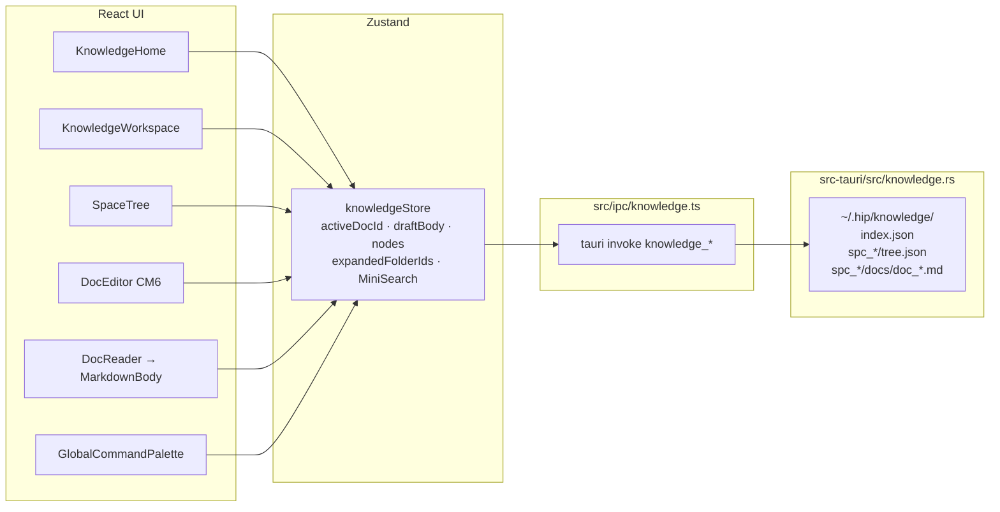
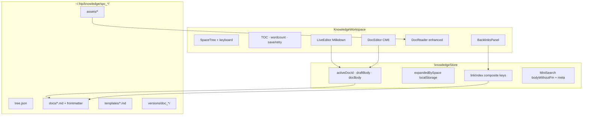
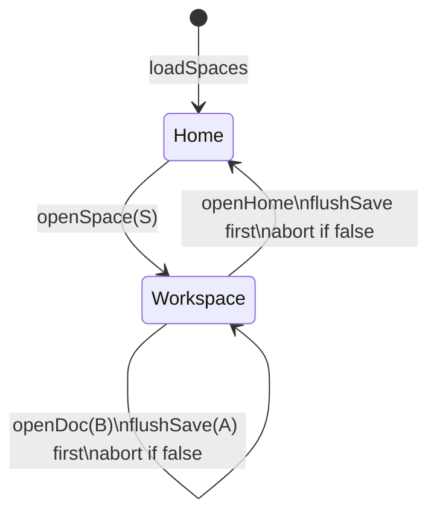
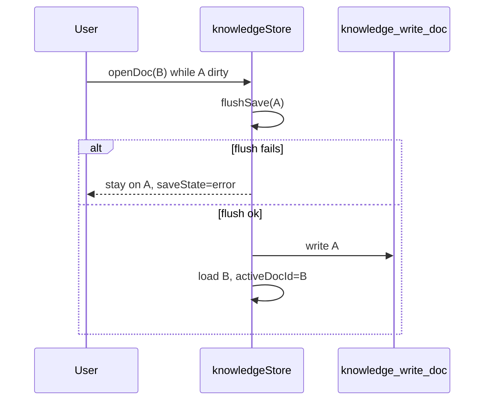
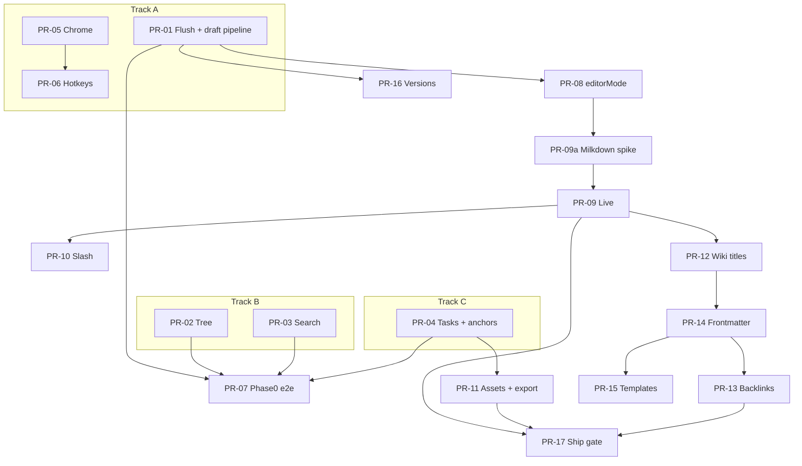

# Knowledge Base Phase 0 + Phase 1 Implementation Plan

| Field | Value |
|-------|-------|
| **Title** | Knowledge Base Phase 0 + Phase 1 Implementation Plan |
| **Author** | hip engineering (design) |
| **Date** | 2026-07-14 |
| **Status** | Draft (post-review revision) |
| **Project** | hip |
| **Scope** | Concrete implementation plan for Phase 0 (experience foundation) and Phase 1 (writing UX + wiki structure) on top of the existing local-first knowledge stack |
| **Code verified** | `src/components/knowledge/*`, `src/store/knowledgeStore.ts`, `src/domain/knowledge/*`, `src/ipc/knowledge.ts`, `src-tauri/src/knowledge.rs`, `src-tauri/tauri.conf.json` CSP, `src/components/command-palette/*`, `src/components/chat/MarkdownBody.tsx`, `e2e/helpers/knowledge.ts`, `e2e/specs/knowledge-*.spec.ts` |
| **Revision** | Post-review design; **2026-07-14 product decision: drop multi-doc tabs** (single active doc retained). Flush gates + draft persist modes remain. |

---

## Overview

hip’s knowledge base is a **local-first Markdown workbench**: Spaces under `~/.hip/knowledge` (or `HIP_DATA_DIR/knowledge`), a folder/doc tree in `tree.json`, and document bodies as `docs/<docId>.md`. The UI already delivers Home + Workspace, CodeMirror source editing with 500ms autosave, GFM preview via `MarkdownBody`, MiniSearch FTS, export/import, command-palette doc search, and context menus on tree nodes.

Relative to Notion / Feishu Docs, the remaining gap is not “can I store notes?” but **speed of navigation, preview polish, and wiki-style linking / live writing**. This plan delivers that gap in two phases **without** cloud sync, multi-user CRDT collab, Notion Database / Feishu Base, multi-doc editor tabs, or agent/RAG tooling.

**Proposed approach:** keep the existing Zustand + Tauri IPC + React surface and **single-active-document** model; harden flush-on-navigate + draft persist modes; enhance `DocReader`/`MarkdownBody` and tree/search UX in Phase 0; introduce Live edit (Markdown-round-trip editor) + wiki links/backlinks/attachments/frontmatter/templates/snapshots in Phase 1 via incremental, independently reviewable PRs.

---

## Background & Motivation

### Current architecture (code facts, 2026-07-14)



| Layer | Path | Role today |
|-------|------|------------|
| Page shell | `KnowledgePage.tsx` | Loads spaces; routes `mode: home \| workspace`; flush on unmount |
| Home | `KnowledgeHome.tsx` | Spaces, recent (`localStorage` key `hip-knowledge-recent`, cap 8), global search hits |
| Workspace | `KnowledgeWorkspace.tsx` | Tree + breadcrumb + edit/preview segmented control + save status |
| Tree | `SpaceTree.tsx` | DnD reorder, expand via `expandedFolderIds`, context menu |
| Editor | `DocEditor.tsx` | `@uiw/react-codemirror` + local `text` (no store echo while typing); keymap via `mdEdit.ts` |
| Toolbar | `MarkdownToolbar.tsx` | Bold/italic/headings/lists/fence against CM `EditorView` |
| Preview | `DocReader.tsx` → `MarkdownBody.tsx` | `react-markdown` + `remark-gfm`; default `a` calls Tauri `open(href)`; **custom `components` override is supported** (knowledge can override without forking chat) |
| Store | `knowledgeStore.ts` | Single active doc: `activeDocId`, `docBody`, `draftBody`; **`setDraftBody` only `scheduleSave` when `editing === true`**; `flushSave` ignores `editing` but preview uses `docBody` |
| Search | `domain/knowledge/search.ts` | MiniSearch + CJK tokenize; `bodyPreview` cap 2048 for snippets; full body string indexed today |
| IPC | `ipc/knowledge.ts` | 14 commands: spaces/tree/docs + export/import/reveal |
| Disk | `paths::knowledge_dir` | `index.json`, `<spc>/meta.json`, `tree.json`, `docs/<docId>.md` |
| CSP | `src-tauri/tauri.conf.json` | `img-src 'self' data:` only — **blocks typical `asset://` / `https://asset.localhost` URLs** |
| Palette | `registry.ts` `knowledgeCommandProvider` | Search-time doc hits; nav open KB / home / new doc when `views: ['knowledge']` |
| E2E | `e2e/specs/knowledge-*.spec.ts` (~939 lines) | Home, lifecycle, tree CRUD, editor UX, advanced |

### Pain points addressed by Phase 0–1

| # | Pain | Evidence in code |
|---|------|------------------|
| 1 | Switching docs can lose dirty buffer if flush fails silently; no multi-doc tabs (by design) | `openDoc` must abort on failed flush; single `activeDocId` / `draftBody` |
| 2 | Expand state reset every `openSpace` | `openSpace` sets `expandedFolderIds: {}` |
| 3 | Preview is passive (no task write-back, weak relative images/anchors) | `DocReader` thin wrapper; default link handler shells out |
| 4 | Search not grouped; no scroll-to-match; rebuild is all-or-nothing spinner | Home flattens hits; `indexStatus: building \| ready` only |
| 5 | Writing still feels like “source box”; no wiki links / backlinks / assets | No frontmatter, no `[[wiki]]`, no `assets/` |
| 6 | Save error is toast-only; no retry chrome; no TOC / word count | `saveState: 'error'` set but UI only shows saving/saved |
| 7 | `openDoc` ignores `flushSave() === false` | Can replace active doc after a failed write |

### Strategic constraints (locked)

1. **Local-first** — no cloud sync / multi-user realtime in Phase 0–1.
2. **Markdown is source of truth** — Live/WYSIWYG must round-trip to `.md`.
3. **Do not build** Notion Database, Feishu Base, or CRDT collab.
4. **Surgical changes** — Zustand + Tauri IPC + React patterns; AGENTS.md simplicity.
5. **Titles stay in `tree.json`** — not forced into H1/frontmatter (`InlineDocTitle` comment).

---

## Goals & Non-Goals

### Goals — Phase 0 (2–4 weeks)

| ID | Goal | Success criteria |
|----|------|------------------|
| P0.1 | Shortcuts + palette knowledge actions | Documented hotkeys; palette can create folder/doc (same parent rule as toolbar), open recent, toggle edit/preview when in KB |
| P0.2 | Safe single-doc navigation + draft persist | Switching docs / leaving space **flushes first**; failed flush **aborts** switch and keeps current doc; `setDraftBody({ persist })` so source autosave + preview task write-back work; **no multi-doc editor tabs** |
| P0.3a | Preview: tasks + anchors | GFM task checkbox write-back persists to disk **without** entering edit mode; `#heading` in-doc anchors work |
| P0.3b | Preview: relative images | **Phase 1 (with P1.5 / PR-11)** — not a Phase 0 exit criterion |
| P0.4 | Tree/nav | Persist expand state per space; ↑↓ keyboard selection; richer recent list (cap 16) |
| P0.5 | Search UX | Group hits by Space; open + scroll near match; index rebuild progress (n/N) + event-loop yields |
| P0.6 | Doc chrome | Word count / reading time; save-fail retry; optional TOC from headings |
| P0.7 | Quality | E2E for flush-abort switch + checkbox + search jump; docs with `length > KNOWLEDGE_LARGE_DOC_CHARS` open/save without multi-second hard freeze |

### Goals — Phase 1 (4–8 weeks)

| ID | Goal | Success criteria |
|----|------|------------------|
| P1.1 | Live edit mode | Default-ish WYSIWYG when flag on; Source toggle; MD round-trip suite green; large docs force Source |
| P1.2 | Slash `/` menu | Headings/lists/todo/code/quote/hr/table skeleton insert |
| P1.3 | Wiki links | `[[title]]` fuzzy pick; clickable in preview/live; broken-link style; **title-based; rename does not auto-rewrite** |
| P1.4 | Backlinks panel | Incremental link index (composite keys); list + navigate; broken count |
| P1.5 | Local attachments + image preview | Drag/paste → `assets/`; relative MD; preview via `data:` URLs; reveal; export portable layout |
| P1.6 | Frontmatter | tags/status/aliases in YAML; indexed separately from body; filter on Home/search |
| P1.7 | Templates | Space-level templates; pick on create (no orphan empty docs on cancel) |
| P1.8 | Version snapshots | Daily or manual; list + restore; cap 30; delete cleans versions |

### Non-goals (Phase 0–1)

- **Multi-doc editor tabs** (`DocTabBar`, `tabsBySpaceId`, per-space open tab sets). Product decision 2026-07-14: keep single `activeDocId` + tree navigation only (recent list / tree / search to reopen).
- Real-time multi-user collab / CRDT / OT.
- Notion-style multi-dimensional database / Feishu Base / kanban as first-class DB.
- Permissions / sharing / ACL.
- Full Obsidian plugin ecosystem or custom render plugins.
- Agent tools / RAG over knowledge (Phase 2).
- Lite structured DB / relational views (Phase 3).
- Rewriting the entire tree to filesystem folders of human titles (keep id-based `docs/`).
- Replacing MiniSearch with a native FTS engine in these phases.
- Auto-rewrite of wiki links on rename (Phase 1 limitation; may revisit later).
- Human-readable space zip with title paths **while assets exist** (portable hip layout is the asset-aware export; see K17).

### Deferred roadmap

| Phase | Theme | Examples |
|-------|--------|----------|
| **Phase 2** | AI-native | Agent tools (`kb_search`, `kb_read`, `kb_write`), RAG chunking, cite-in-chat, auto-summarize |
| **Phase 3** | Lite DB | Optional property tables, filtered views, relation fields — still MD-backed where possible |

---

## Proposed Design

### Architecture target (end of Phase 1)



### Shared constants

```ts
// domain/knowledge/limits.ts
/** Single large-doc threshold used everywhere (edit, index, snapshots). */
export const KNOWLEDGE_LARGE_DOC_CHARS = 512_000
/** MiniSearch indexes at most this many body chars after frontmatter strip. */
export const KNOWLEDGE_INDEX_BODY_CHARS = 512_000
/** Recent docs cap (localStorage). */
export const KNOWLEDGE_RECENT_CAP = 16
/**
 * Max asset size on disk (import from path / file picker).
 * Not the same as what may cross the WebView as base64.
 */
export const KNOWLEDGE_ASSET_MAX_BYTES = 25 * 1024 * 1024
/**
 * Max raw bytes for IPC base64 round-trips (`read_asset_data`, paste `import_asset_bytes`).
 * ~1.5MB raw ≈ ~2MB base64 + JSON framing — keeps invoke off the PTY-scale freeze path.
 * Oversize on-disk assets still store fine; preview uses placeholder + reveal.
 */
export const KNOWLEDGE_ASSET_INLINE_MAX_BYTES = 1_500_000
/** Versions retained per doc. */
export const KNOWLEDGE_VERSION_CAP = 30
```

| Behavior | When `body.length > KNOWLEDGE_LARGE_DOC_CHARS` |
|----------|------------------------------------------------|
| Open / paint | Deferred setState (`startTransition` / idle); loading shell |
| Live mode | Forced **Source**; toast once per doc |
| MiniSearch body | Index only first `KNOWLEDGE_INDEX_BODY_CHARS` of body-without-FM |
| Link index | Still extract wiki links from full body (cheap regex) or first 512KB — **full body** preferred for correctness under 2MB; skip extract above 2MB with debug log |
| Daily/manual snapshot | Allowed; enforce version cap; warn in UI if single snapshot > 512KB |
| Paste assets | Cap is `KNOWLEDGE_ASSET_INLINE_MAX_BYTES` (base64 IPC), not disk max |
| Path-import assets | Cap is `KNOWLEDGE_ASSET_MAX_BYTES` on disk; response must not echo file bytes |

---

### Phase 0 — Experience foundation

#### P0.1 Shortcuts + command palette

**Current:** Palette already has `nav-knowledge`, `knowledge-go-home`, `knowledge-new-doc` (`buildGlobalCommands.ts`), and search-time `knowledgeCommandProvider`. Global hotkey is only ⌘K (`useGlobalHotkeys.ts`). In-editor: Mod-b/i/e, headings, lists, Mod-s (`DocEditor.tsx`). Palette `knowledgeCreateDoc` always `createDoc(null, …)` (space root).

**Parent resolution (shared):**

```ts
// domain/knowledge/parentForNew.ts
/** Used by toolbar, ⌘N, palette knowledge-new-doc/folder. */
export function resolveParentForNew(opts: {
  treeFocusId: string | null
  activeDocId: string | null
  nodes: KnowledgeNode[]
}): string | null {
  const focus = opts.treeFocusId && opts.nodes.find(n => n.id === opts.treeFocusId)
  if (focus?.kind === 'folder') return focus.id
  if (focus?.kind === 'doc') return focus.parentId
  const active = opts.activeDocId && opts.nodes.find(n => n.id === opts.activeDocId)
  return active?.parentId ?? null
}
```

| Action | Binding (proposal) | Implementation |
|--------|--------------------|----------------|
| New doc (in open space) | ⌘N when `activeView === 'knowledge'` | `createDoc(resolveParentForNew(...), …)` |
| New folder | ⌘⇧N | same parent helper |
| Toggle edit/preview | ⌘⇧E | `setEditorMode` / legacy `setEditing` until PR-08 |
| Focus tree filter | ⌘⇧F | focus `knowledge-tree-filter` |
| Close / leave doc | (none dedicated) | Use tree / search / Home; flush gates apply on navigate |
| Focus doc search (home) | / when not in input | existing home search |

Palette additions (knowledge view only unless noted):

- `knowledge-new-folder` — uses `resolveParentForNew`
- `knowledge-new-doc` — **fix** to use `resolveParentForNew` (not always root)
- `knowledge-toggle-preview`
- `knowledge-retry-save` (when `saveState === 'error'`)
- Recent docs as curated group when query empty and view is knowledge (cap 5; reuse `recent`)

Register labels in `GlobalCommandLabels` + **`en.ts` / `zh-CN.ts` / `zh-TW.ts`** (all three locale files).

#### P0.2 Safe single-doc navigation (no multi-doc tabs)

**Product decision (2026-07-14):** Do **not** implement multi-doc editor tabs (`DocTabBar`, `tabsBySpaceId`, in-session tab sets). Users open one document at a time via tree / search / recent; top-level `SessionTabBar` still has a single knowledge chip only.

**Problem retained:** `openDoc` must not drop a failed dirty buffer; preview tasks and Live need a draft persist gate that is not tied to multi-tab state.

##### Navigation + flush machine (locked)



Single buffer remains as today:

```ts
// Zustand — unchanged shape for active doc
activeDocId: string | null
docBody: string
draftBody: string
// No openTabs / tabsBySpaceId / draftByKey multi-doc map
```

| Event | Behavior |
|-------|----------|
| `openDoc(id)` | `flushSave()` for current active; if **false**, stay on current `activeDocId`, surface retry. On success, load B into `docBody`/`draftBody`. |
| `openSpace` / `openHome` | Flush active dirty doc first; abort leave/switch on failure. |
| `deleteNode` active doc | Clear active buffer after disk delete (as today). |
| App unmount / close knowledge view | Best-effort `flushSave()`. |

##### Flush gate (critical)

```ts
async openDoc(id: string): Promise<void> {
  const ok = await get().flushSave()
  if (!ok) {
    // stay on current activeDocId; saveState already 'error'; retry chrome visible
    return
  }
  // … load B, set activeDocId
}
```

**Unit tests required:** failed `flushSave` does not change `activeDocId`; space switch abort leaves prior space active.

##### Draft pipeline (critical — fixes `editing` gate)

Today: `setDraftBody` only schedules save when `editing === true`. Preview tasks and future Live break without a redesign.

```ts
type EditorMode = 'live' | 'source' | 'preview'

function shouldAutosave(mode: EditorMode): boolean {
  return mode === 'live' || mode === 'source'
}

setDraftBody: (v: string, opts?: { persist?: 'auto' | 'now' | 'none' }) => {
  set({ draftBody: v })
  const mode = get().editorMode // after PR-08; until then derive from editing
  const persist = opts?.persist ?? (shouldAutosave(mode) ? 'auto' : 'none')
  if (persist === 'auto') scheduleSave(get)
  if (persist === 'now') void get().flushSave()
}

// Preview task write-back:
setDraftBody(nextMd, { persist: 'now' })
// flushSave on success sets docBody = draftBody so DocReader re-renders
```

Until PR-08 lands, implement the same gate as:

```ts
const editing = get().editing
const persist = opts?.persist ?? (editing ? 'auto' : 'none')
// task path always passes persist: 'now'
```

`flushSave` continues to ignore mode (writes whenever `draftBody !== docBody`).

**UI:** No `DocTabBar`. Workspace keeps tree selection highlight + breadcrumbs + chrome only.



#### P0.3 Preview enhancements

**File:** extend `DocReader` with knowledge-only `MarkdownBody` `components` (chat callers unchanged).

```tsx
// DocReader.tsx
<MarkdownBody
  content={content} // preview uses docBody from store; after task flush, docBody updates
  components={knowledgeMarkdownComponents({
    spaceId, docId,
    onTaskToggle,      // P0.3a
    // resolveAssetUrl  // P1.5 only
    // onWikiLink       // P1.3
  })}
/>
```

| Feature | Phase | Approach |
|---------|-------|----------|
| **GFM task write-back** | **P0.3a** | Custom checkbox; `toggleTaskAt(md, index)` in `domain/knowledge/mdTasks.ts`; `setDraftBody(next, { persist: 'now' })`; unit + e2e “toggle without edit mode” |
| **`#heading` anchors** | **P0.3a** | Local `slugifyHeading`; `id` on `h1–h6`; `a[href^="#"]` → `scrollIntoView` (not shell open). Export `scrollToKnowledgeHeading` for search jump |
| **Relative images** | **P0.3b / P1.5** | See [Asset URL strategy (K16)](#asset-url-strategy-k16). Not required to exit Phase 0 |

Pure helpers: `src/domain/knowledge/mdPreview.ts`, `mdTasks.ts` with unit tests (no DOM).

#### P0.4 Tree / nav

| Item | Design |
|------|--------|
| **Persist expand** | `localStorage` key `hip-knowledge-expanded-v1`: `Record<spaceId, Record<folderId, true>>`. Load in `openSpace`; write on `toggleFolder` (debounce 100ms). Stop wiping to `{}` on every open. |
| **Keyboard** | Roving tabindex: ↑↓ move `treeFocusId`; Enter open doc / toggle folder; Left collapse / parent; Right expand. Keep mouse DnD. |
| **Selection vs active doc** | `treeFocusId` separate from `activeDocId`. `resolveParentForNew` uses focus first. |
| **Recent list** | Cap **16** (`KNOWLEDGE_RECENT_CAP`); show path or space icon. |

#### P0.5 Search UX

| Item | Design |
|------|--------|
| **Group by Space** | Home reduces hits → sections by `spaceId`. |
| **Jump + scroll** | `pendingReveal: { query }`; after open, highlight/scroll in Preview or CM Source. |
| **Index progress** | `indexProgress: { done, total, spaceName? }`; yield every **20** docs; cancel via `indexBuildGen`. |
| **Body for index** | After P1.6, index `bodyWithoutFm` only; until then full body is OK. Large-doc cap: first `KNOWLEDGE_INDEX_BODY_CHARS`. |

#### P0.6 Doc chrome

| Item | Design |
|------|--------|
| **Word count / reading time** | `countWords(md)` strips fences + frontmatter; CJK chars as words; `max(1, round(words/200))` min. |
| **Save-fail retry** | Red chip + **Retry** → `flushSave()` when `saveState === 'error'`. |
| **TOC** | ATX headings from active body; sticky rail or header dropdown; hide if &lt;2 headings. |

#### P0.7 Performance & quality

Use shared `KNOWLEDGE_LARGE_DOC_CHARS` matrix above. E2E: dirty doc switch (including **failed save stays on current doc** if mockable), checkbox write-back, search group + jump. Images **out of Phase 0 e2e**.

---

### Phase 1 — Writing UX + wiki structure

#### P1.1 Editor strategy (Live mode)

##### Options evaluated

| Option | MD round-trip | Reuse CM / mdEdit / e2e | Notion-like | Risk | Effort |
|--------|---------------|-------------------------|-------------|------|--------|
| **A. CM live decorations** | Best (identity) | Full | Weak | Low | M |
| **B. Split pane** CM + DocReader | Best | Full | Medium | Low | S–M |
| **C. Milkdown / Crepe** Live + CM Source | Good (suite) | Source kept | Strong | Medium | L |
| **D. TipTap** | Fair–poor | Low | Strong | High | L |
| **E. Replace CM entirely** | Poor if not MD-native | Breaks e2e | Strong | High | XL |

##### Decision

**Primary: dual-mode Source = CodeMirror; Live = Milkdown.**  
**Fallback: Option A (CM decorations) + slash on CM** if Milkdown spike fails exit criteria (see contract).  
**Product fallback (Phase 0 polish, not full Live):** Option B split pane can ship anytime as optional layout without blocking P1.1.

Default after flag-on: **Live** for users without a stored pref; remember `localStorage` `hip-knowledge-editor-mode` (`live` \| `source`). Preview is the third mode (K19).  
**Feature flag:** `localStorage` key `hip-knowledge-live` only (**not** `hip.toml` — no existing knowledge flag pattern there). Default `false` until PR-17 gate.

##### Milkdown integration contract

| Item | Contract |
|------|----------|
| **Spike PR** | **PR-09a** (time-boxed ≤3 days): dependency install, hello-world editor, 10 fixture round-trips, bundle size note — **no** full workspace wiring required |
| **Packages to evaluate** | Prefer `@milkdown/crepe` if GFM tasks/tables work out of the box; else `@milkdown/core` + `@milkdown/preset-commonmark` + `@milkdown/preset-gfm` + `@milkdown/plugin-listener` + React host. Pin exact versions in `package.json` after spike. |
| **GFM fixtures (required)** | tasks, tables, strikethrough, fenced code, blockquote, ordered/bullet lists, autolink, CJK paragraphs, empty doc, frontmatter **passthrough** (FM may be stripped from Live editable region and re-prefixed on serialize — document choice in spike) |
| **Out of fixture scope** | Footnotes, MDX, raw HTML |
| **Normalization** | Document `normalizeMd(s)`: trim trailing spaces per line optional **off**; ensure single trailing `\n`; list marker unify to `- `; task markers `- [ ]` / `- [x]` lowercase x |
| **Round-trip API** | `markdownToLiveEditor` / `liveEditorToMarkdown` pure where possible; `expect(normalize(liveToMd(mdToLive(md)))).toBe(normalize(md))` |
| **Toolbar mapping** | Live: Milkdown commands. Source: existing `mdEdit.ts` + `MarkdownToolbar`. No shared abstract “EditorFacade” unless a third consumer appears (YAGNI). |
| **Autosave** | Live `onChange` → `setDraftBody(md, { persist: 'auto' })` (mode `live` schedules). |
| **Parse failure** | Toast + **force Source for that doc for the session**; do not corrupt disk (leave last good `docBody`). |
| **Bundle budget** | Spike records gzip delta; soft target &lt;250KB gzip added; if &gt;400KB strongly prefer fallback A. |
| **E2E** | Prefer `data-testid` on host; core flows remain Source-mode; one Live smoke: type text → toggle Source → see MD. |
| **Exit to fallback A** | Spike misses GFM tasks/tables, or &gt;2 flaky fixture classes after 2 pin attempts, or schedule slip &gt;1 week past PR-09a — ship decorations + slash on CM; keep Milkdown behind flag off. |

```tsx
// KnowledgeWorkspace main pane (after PR-08/09)
{editorMode === 'preview' ? (
  <DocReader content={docBody} … />
) : editorMode === 'source' || !liveEnabled || forceSource ? (
  <DocEditor … />
) : (
  <DocLiveEditor key={activeDocId} initialMarkdown={docBody} onDraftChange={…} />
)}
```

#### P1.2 Slash `/` menu

- Trigger: `/` at line start or after whitespace in Live; Source CM autocomplete optional same PR or follow-up.
- Items: H1–H3, bullet, ordered, task, fence, quote, hr, table 3×2, wiki link, template insert (if P1.7).
- i18n: `knowledge.slash.*` in en + zh-CN + zh-TW.

#### P1.3 Wiki links

**Syntax:** `[[Title]]` and optional `[[Title\|Display]]` (pipe). No namespaces. **No doc-id embedding in Phase 1.**

**Resolution (same space only — K6):**

1. Exact title match among docs in **current space** (case-sensitive, then case-insensitive).
2. **If frontmatter aliases available** (after PR-14): match `aliases[]` (case-insensitive).
3. Fuzzy title score (reuse palette `fuzzyScore`) for picker only — navigation click uses exact/alias only.
4. Else **broken**.

**Duplicate titles:** **first** match in stable tree order (`order`, then `title`, then `id`). Document in UI tooltip on broken/ambiguous later if needed. Unit test with two “Untitled”.

**Rename policy (Phase 1):** **No auto-rewrite** of `[[Old]]` → `[[New]]` in other files. After rename, links may show broken until user edits. Backlinks panel shows **broken outbound count** for current doc; index rebuild resolves by current titles only.

**Create on click:** **Confirm modal** (K20) — never silent create. Parent = `resolveParentForNew`.

**PR sequencing:** PR-12 ships **title-only** resolution; PR-14 adds alias step + tests (explicit incremental). Do **not** hard-block wiki on frontmatter.

**Parse:** `domain/knowledge/wikiLink.ts` — `extractWikiLinks(md)`.

#### P1.4 Backlinks + incremental link index

```ts
type LinkEdge = {
  fromSpaceId: string
  fromDocId: string
  toSpaceId: string | null
  toDocId: string | null
  title: string
  broken: boolean
}

// Always composite keys — never bare docId / bare title
// bySource: docKey(fromSpace, fromDoc) → edges
// byTargetDoc: docKey(toSpace, toDoc) → edges
// byTargetTitle: `${spaceId}::title:${normalizedTitle}` → edges (same-space)
```

**Build:** piggyback `rebuildSearchIndex` + incremental on flushSave / rename / delete. **Memory:** personal libs &lt;5k docs; edges O(links). Optional disk cache deferred.

**UI:** `BacklinksPanel`; show broken badge. Rebuild linked to search rebuild (no separate user control required).

#### P1.5 Local attachments + image preview

**Disk:**

```
~/.hip/knowledge/<spaceId>/
  docs/doc_xxx.md
  assets/<ast_id>_<sanitizedFileName>
```

MD: `` **space-root-relative** (resolved against space root, not `docs/`).

##### Asset URL strategy (K16)

**Chosen strategy: `data:` URLs via IPC for inlinable images (not `convertFileSrc` / `asset://`).**

Rationale: current CSP is `img-src 'self' data:` (`tauri.conf.json`). There is **no** existing `convertFileSrc` usage. Extending CSP to `asset:` / `https://asset.localhost` plus filesystem scope is higher blast radius. Base64 `data:` works with **zero CSP change** for images **under the inline cap**.

**Split caps (do not couple disk max with invoke payload):**

| Constant | Value | Applies to |
|----------|-------|------------|
| `KNOWLEDGE_ASSET_MAX_BYTES` | 25MB | On-disk store via `import_asset_from_path` (and any future large copy) |
| `KNOWLEDGE_ASSET_INLINE_MAX_BYTES` | 1.5MB raw | `read_asset_data` response body; `import_asset_bytes` request; paste path |

Hip already keeps large base64 IPC rare (e.g. PTY event payloads are much smaller). Shipping 25MB ≈ 33MB base64 through `invoke` would freeze the WebView — hence the inline ceiling.

| Path | Behavior |
|------|----------|
| `knowledge_read_asset_data` | `{ spaceId, relPath }` → `{ mime, base64 }` after `safe_join` under `assets/`; **error if file size &gt; `KNOWLEDGE_ASSET_INLINE_MAX_BYTES`** (UI falls back to placeholder + reveal) |
| UI cache | Session `Map<relPath, dataUrl>` per space; **re-use for multi-image docs** — do not re-fetch multi‑MB payloads; only inline-sized assets enter the cache |
| Oversize image on disk | Placeholder + “Reveal in Finder” (`knowledge_asset_abs_path` / `reveal_path`); MD link still valid |
| Non-image (e.g. pdf) | No inline preview; reveal only |
| Future opt-in | If many mid-size images need smooth preview without base64, add CSP `img-src … asset:` + `convertFileSrc` in a dedicated PR |

**No CSP edit required for P1 image preview** under this strategy. If a later PR chooses asset protocol, update `tauri.conf.json` CSP `img-src` and document scope allowlist under `knowledge_dir` only.

##### Asset IPC entrypoints

| Command | Args | Returns | Used by |
|---------|------|---------|---------|
| `knowledge_import_asset_from_path` | `{ spaceId, sourcePath }` | `{ relPath, mime, byteLength }` — **no file contents / no base64** | Drag/drop files, file picker (disk cap 25MB) |
| `knowledge_import_asset_bytes` | `{ spaceId, base64, fileName, mime }` | `{ relPath, mime, byteLength }` — **no echo of base64** | Clipboard paste; reject if decoded size &gt; inline max |
| `knowledge_read_asset_data` | `{ spaceId, relPath }` | `{ mime, base64 }` or error if oversize / missing | Preview `` for inlinable files only |
| `knowledge_asset_abs_path` | `{ spaceId, relPath }` | `{ absolutePath }` | Reveal only (never pass to img src without protocol plan) |
| `knowledge_reveal_path` | `{ spaceId, relPath }` | `()` | Finder; **must** `safe_join` under space — refactor helper shared with `knowledge_reveal_doc` |

**MIME allowlist:** `image/png`, `image/jpeg`, `image/gif`, `image/webp`, `application/pdf` (pdf: no inline preview — reveal only). Reject others in Rust.

**Paste flow:** clipboard image → check `blob.size ≤ KNOWLEDGE_ASSET_INLINE_MAX_BYTES` → base64 → `import_asset_bytes` → insert `` → `setDraftBody` auto. Larger clipboard images: toast “Image too large to paste; save to file and attach” (or write temp + path import if product later wants — not required P1).

**Path-import flow:** OS path → Rust copies under `assets/` (disk cap) → returns `{ relPath, mime, byteLength }` only → UI inserts MD. Preview then calls `read_asset_data` **only if** `byteLength ≤ inline max`; else placeholder + reveal.

**Security:** treat clipboard as untrusted; enforce both size caps in Rust; no SVG-as-image execute (if SVG ever added, serve only as download not inline HTML).

##### Export zip layout (K17)

**Decision: portable hip layout for space zip when exporting for backup/round-trip.**

Zip root:

```
meta.json
tree.json
docs/<docId>.md
assets/<files>          # if any
# templates/ versions/ optional include later; v1: docs+assets+tree+meta
```

- Space-root-relative `assets/…` links in MD **work as-is** when re-imported or when opened as hip data.
- **Import:** detect hip layout (`tree.json` + `docs/`) vs flat folder of `.md` (existing behavior).
- **Human-readable title-path zip** (current behavior): remains available as **“Export readable Markdown…”** only if we implement **link rewrite** (each `](assets/x)` → path relative to that file’s exported location). **Phase 1 default “Export space as ZIP” switches to portable hip layout** so assets are never silently broken. Document in i18n string.
- Single-doc export: body only (assets not embedded) — note in UI; optional follow-up “export with assets”.

**Round-trip test:** create doc + image → export portable zip → import (or replace space) → image preview works.

#### P1.6 Frontmatter properties

```markdown
---
tags: [design, hip]
status: draft
aliases: [KB Plan]
---

Body…
```

- Hand-rolled `domain/knowledge/frontmatter.ts` for tags/status/aliases only (avoid gray-matter unless nested YAML appears).
- **Search pipeline:** `parseFrontmatter(raw)` → `{ meta, bodyWithoutFm }`; MiniSearch fields include `tags`, `status`, `aliases` (stringified); **`body` field indexes `bodyWithoutFm` only**; `bodyPreview` from body without FM. Unit tests: FM-only change does not pollute body tokens.
- Title remains tree node title.
- Home filter chips: tag / status.

#### P1.7 Templates

```
templates/templates.json
templates/tpl_*.md
```

**Create flow (no orphans):**

1. User triggers new doc (toolbar / ⌘N / palette) with `parentId = resolveParentForNew(…)`.
2. If space has templates → open modal (**do not** create node yet).
3. Confirm template or Empty → then `createDoc` + write body + `openDoc`.
4. Cancel modal → **no** doc created.

Optional: “Save current as template” in doc menu.

#### P1.8 Lightweight version snapshots

```
versions/<docId>/
  manifest.json
  <iso>.md
```

| Policy | Rule |
|--------|------|
| Daily | First successful save of calendar day in **system local TZ**; body ≠ last snapshot |
| Manual | Doc menu |
| Cap | `KNOWLEDGE_VERSION_CAP` (30); delete oldest file + manifest entry |
| Size | Allowed for large docs; same atomic write; UI may warn |
| Chain | Snapshot enqueue **on `saveChain` after successful write** (no parallel race with `flushSave`) |
| Restore | Confirm → write body + update draft map; if write fails mid-way, leave prior body (atomic_write already) |
| Delete | `deleteNode` removes `versions/<docId>/`; `deleteSpace` removes whole space dir (includes versions) |

---

### Store changes summary (`knowledgeStore.ts`)

| Concern | Phase | Storage |
|---------|-------|---------|
| Single `activeDocId` / `docBody` / `draftBody` | P0 | Zustand (unchanged model) |
| `treeFocusId` | P0 | Zustand |
| Expand persist | P0 | localStorage |
| `indexProgress` | P0 | Zustand |
| `pendingReveal` | P0 | Zustand ephemeral |
| `editorMode` | P0.5/P1 | Zustand + localStorage pref |
| Draft `persist` options | P0 | API on `setDraftBody` |
| `linkIndex` composite keys | P1 | Module |
| Frontmatter meta in search | P1 | MiniSearch fields; bodyWithoutFm |

Gate `moveNode` / `deleteNode` / `openDoc` / `openSpace` / `openHome` on successful flush where data loss is possible. **No** multi-doc tab APIs.

### UI surface map

| Surface | Phase 0 | Phase 1 |
|---------|---------|---------|
| Home | Grouped search, recent 16 | Tag/status filters |
| Workspace header | Retry, wordcount | Live/Source/Preview |
| Tree | Persist expand, keyboard, treeFocusId | — |
| Editor | CM Source + Preview tasks/anchors | Live + assets + wiki |
| Side panels | TOC | Backlinks |
| Palette | Parent-aware new doc/folder | — |

---

## API / Interface Changes

### Existing IPC

Unchanged contracts for current 14 commands. `knowledge_write_doc` body may include frontmatter text.

### New IPC

| Command | Phase | Notes |
|---------|-------|-------|
| `knowledge_import_asset_from_path` | P1 | Path entry; disk ≤25MB; return meta only (no bytes) |
| `knowledge_import_asset_bytes` | P1 | Paste; raw ≤1.5MB; return meta only |
| `knowledge_read_asset_data` | P1 | Preview `data:`; refuse oversize inline |
| `knowledge_asset_abs_path` | P1 | Reveal only |
| `knowledge_reveal_path` | P1 | Shared opener; safe_join under space |
| `knowledge_list_templates` / `save` / `delete` | P1 | |
| `knowledge_list_versions` / `save` / `restore` / `read` | P1 | |

All new commands: register in `lib.rs` invoke handler; unit-test id validation + `safe_join` / traversal.

### Frontend wrappers

```ts
export async function knowledgeImportAssetFromPath(
  spaceId: string,
  sourcePath: string,
): Promise<{ relPath: string; mime: string; byteLength: number }>
export async function knowledgeImportAssetBytes(
  spaceId: string,
  args: { base64: string; fileName: string; mime: string },
): Promise<{ relPath: string; mime: string; byteLength: number }>
/** Throws / returns err if file exceeds KNOWLEDGE_ASSET_INLINE_MAX_BYTES. */
export async function knowledgeReadAssetData(
  spaceId: string,
  relPath: string,
): Promise<{ mime: string; base64: string }>
// templates & versions…
```

```ts
// store
openDoc(id): Promise<void>           // abort if flush false
setDraftBody(v, opts?: { persist?: 'auto' | 'now' | 'none' })
setEditorMode(mode: EditorMode): void
retrySave(): Promise<boolean>
flushAllDirtyDrafts(): Promise<boolean>
resolveParentForNew(): string | null // or pure helper outside store
```

---

## Data Model Changes

### On-disk layout

```
~/.hip/knowledge/
  index.json
  <spc_id>/
    meta.json
    tree.json
    docs/<doc_id>.md
    assets/<ast_id>_<file>       # P1
    templates/                   # P1
    versions/<doc_id>/           # P1 — deleted with doc/space
```

### Migrations

| Change | Migration |
|--------|-----------|
| Frontmatter | None |
| assets/templates/versions | Create on first use |
| Expand / flags / editor mode | localStorage missing → defaults |
| Active doc draft | Session buffer only; durability via autosave |
| Export zip format | Portable hip layout for space zip (document for users) |
| Version dirs on delete | Explicit in deleteNode / deleteSpace paths |

### Export/import

See K17. Symlink skip / canonicalize on import retained.

---

## Alternatives Considered

### 1. Multi-doc editor tabs (`DocTabBar` / `tabsBySpaceId`)

**Rejected (product decision 2026-07-14).** Keep single active document; navigate via tree, search, recent. Avoids second tab chrome inside knowledge and complexity of multi-buffer draft maps.

### 2. Persist multi-doc open-tab set to localStorage

- **Pros:** N/A once multi-doc tabs are out of scope.  
- **Cons:** Stale titles; empty tabs if docs deleted.  
- **Rejected** for Phase 0–1; recent list covers resume. Bodies never stored in localStorage.

### 3. Live = CM decorations only (Option A)

Accepted as **schedule fallback**, not primary.

### 4. Split-pane Source|Preview as Live substitute (Option B)

Valid Phase 0 optional layout; does not replace P1.1 WYSIWYG goal.

### 5. TipTap for Live

Rejected — MD fidelity.

### 6. Link graph in SQLite

Rejected — in-memory composite maps enough.

### 7. Human-readable folders on disk as primary store

Deferred — id-based `docs/` + reveal + portable zip.

### 8. Git-backed versioning

Rejected — file snapshots.

### 9. `convertFileSrc` + CSP asset protocol for images

Rejected as **default** (CSP blast radius); data URL first; protocol later if needed.

### 10. Auto-rewrite wiki links on rename

Deferred — Phase 1 accepts broken-until-edit; optional later.

---

## Security & Privacy Considerations

| Threat | Severity | Mitigation |
|--------|----------|------------|
| Path traversal asset/template/version | High | `safe_join` + id checks; reject `..` **components** |
| Symlink escape import/asset copy | High | Skip symlinks / canonicalize under space |
| CSP / unexpected remote img | High | Prefer `data:` only; keep `img-src 'self' data:`; do not widen CSP without dedicated review |
| Huge asset OOM / WebView freeze | Medium | Disk 25MB; **inline/base64 1.5MB**; path import never returns body; MIME allowlist |
| Untrusted clipboard paste | Medium | MIME allowlist; **inline size cap**; no inline SVG HTML |
| XSS via markdown HTML | Medium | No `rehype-raw`; react-markdown default |
| Milkdown contenteditable paste HTML | Medium | Prefer paste-as-text / MD paste plugin; strip HTML where possible |
| Wiki silent create | Low | Confirm modal |
| Snapshots retain deleted text | Low | Delete `versions/<docId>` on doc delete; space delete removes all |
| `knowledge_reveal_path` escape | High | Only reveal paths under active space root |
| New IPC surface | Medium | Every command in `lib.rs` + path tests |

No cloud auth changes. E2E via `HIP_DATA_DIR`.

---

## Observability

| Signal | How |
|--------|-----|
| Save failures | Toast + `saveState` + retry chrome |
| Index build | Progress UI + optional `console.debug` timing |
| Live parse failure | Toast + force Source for session; flag off restores all-Source |
| Link index | Rebuilt with search rebuild; no separate control required for MVP |
| Asset import | toast + `knowledgeErrorMessage` |

**User recovery:** set `localStorage hip-knowledge-live=false` or Settings later; always can use Source.

---

## Rollout Plan

### Phase 0 parallel tracks (~2–4 weeks wall-clock with parallel PRs)

| Track | PRs | Theme |
|-------|-----|-------|
| **A** | PR-01, PR-05, PR-06 | Flush/draft pipeline, chrome, hotkeys |
| **B** | PR-02, PR-03 | Tree, search |
| **C** | PR-04 | Preview tasks + anchors (no images) |
| **Merge train** | PR-07 | E2E + large-doc after A+B+C |

### Phase 1 (~4–8 weeks; Milkdown may slip to fallback A)

| Track | PRs |
|-------|-----|
| Editor | PR-08 → PR-09a spike → PR-09 → PR-10 |
| Assets | PR-11 (images + export layout) |
| Wiki | PR-12 (title-only) → PR-14 aliases → PR-13 backlinks |
| Meta | PR-15 templates, PR-16 versions |
| Ship | PR-17 quality gate |

| Flag / pref | Storage | Default |
|-------------|---------|---------|
| `hip-knowledge-live` | localStorage | `false` until PR-17 |
| `hip-knowledge-editor-mode` | localStorage | `source` until user picks; after flag-on default **live** for new prefs |
| TOC/progress/flush gates | always on when merged | — |

**PR-17 quality gate (all required):**

1. Round-trip fixture suite 100% green in CI (`mdRoundTrip.test.ts`).
2. Phase 1 e2e Source + one Live smoke green.
3. Portable zip export → import image round-trip test green.
4. No open P0 regressions on flush gates / single-doc navigation.
5. Then set live flag default **true** (users with explicit `false` respected).

**Rollback:** flags + git revert; additive disk dirs.

---

## Open Questions

Resolved into Key Decisions where possible. Remaining:

1. **Attachment GC:** Delete unused assets when last referencing doc deleted? **Defer** — best-effort later; don’t block P1.5. (Not a launch blocker.)
2. **Human-readable zip with rewrite:** Ship in same PR-11 as secondary menu item, or defer entirely? **Recommend defer** until portable layout proven; only portable zip in P1.

---

## Risks

| Risk | Severity | Mitigation |
|------|----------|------------|
| Milkdown round-trip / bundle | High | Spike PR-09a; fallback A; pin versions |
| Dual editor maintenance | Medium | Shared draft pipeline only |
| CSP mistake if someone uses convertFileSrc | High | K16 forbids without CSP PR |
| Export broken images | High | K17 portable layout |
| `setDraftBody` gate regresses | High | Unit tests preview task + live auto |
| Doc switch data loss on failed save | High | Abort on flush false |
| Wiki rename breaks links | Medium | Documented limitation; broken count |
| Large snapshot disk growth | Medium | Cap 30; large-doc matrix |
| Link title key collisions | Medium | Composite `spaceId::title:` keys |
| E2E contenteditable flaky | Medium | Source-heavy e2e |

---

## Test Plan

### Unit

| Area | Cases |
|------|-------|
| Single-doc flush | **flush false aborts** openDoc / openSpace / openHome; dirty body retained |
| Draft persist modes | `editing`/`live`/`source` auto; preview `none`; task `now` |
| mdTasks | Multi checkbox; nested |
| mdStats / mdToc | CJK; strip FM |
| wikiLink | Dup titles first-wins; broken; no rewrite on rename |
| frontmatter | Index bodyWithoutFm; aliases |
| linkIndex | Composite keys; cross-space no bleed |
| mdRoundTrip | GFM fixtures |
| parentForNew | Folder focus vs doc focus vs root |

### Component / Rust / E2E

- Checkbox without edit mode persists after re-open space.
- Flush-abort switch e2e; search group e2e.
- Rust: asset traversal, MIME reject, version cap, delete cleans versions, portable zip structure.
- P1: wiki create confirm; export/import image; Live smoke.

---

## Contracts appendix (implementation checklist)

### C1 — Draft pipeline

1. Active buffer only: `draftBody` / `docBody` (single document; no multi-doc draft map).
2. `scheduleSave` iff mode ∈ {live, source} **or** explicit `persist: 'auto'`.
3. Preview mutations (tasks): `persist: 'now'` → `flushSave` → updates `docBody` on success.
4. `flushSave` returns boolean; **false aborts** navigation that would drop the failed buffer (`activeDocId` stays).

### C2 — Asset URL

1. Store files under `assets/` with `safe_join`; disk cap `KNOWLEDGE_ASSET_MAX_BYTES` (25MB).
2. Preview: `knowledge_read_asset_data` → `data:{mime};base64,…` **only if** raw size ≤ `KNOWLEDGE_ASSET_INLINE_MAX_BYTES` (1.5MB); else placeholder + reveal.
3. Do not use `convertFileSrc` without separate CSP PR.
4. Paste → `import_asset_bytes` (inline cap); drag path → `import_asset_from_path` (disk cap).
5. Path/bytes import responses return `{ relPath, mime, byteLength }` only — **never echo file contents** on path import; never re-send base64 on import success.
6. Session `dataUrl` cache avoids re-fetching inlinable images within a space visit.

### C3 — Export layout

1. Space ZIP (default) = portable hip: `meta.json`, `tree.json`, `docs/`, `assets/`.
2. Links `assets/…` unchanged.
3. Import detects hip layout.
4. Single-doc export = body only.

### C4 — Single-doc navigation (no tabs)

1. One `activeDocId` per open space workspace; no `openTabs` / `DocTabBar`.
2. `openDoc` / `openSpace` / `openHome` / unmount: flush first; abort navigation if flush returns false.
3. Reopen documents via tree, search, or recent — not a tab strip.
4. Dirty indicator is `draftBody !== docBody` (and `saveState`).

### C5 — Parent for new

1. `resolveParentForNew` shared by toolbar, ⌘N, palette.
2. Templates: modal before create; cancel = no node.

### C6 — Wiki Phase 1

1. Title (and later alias) resolution; first duplicate wins.
2. No rename rewrite.
3. Confirm create.
4. Composite link index keys.

---

## Key Decisions

| # | Decision | Rationale |
|---|----------|-----------|
| K1 | Markdown files canonical; tree.json title/structure only | Existing design; AI Phase 2 friendly |
| K2 | **No multi-doc editor tabs**; single `activeDocId` only | Product decision 2026-07-14; tree/search/recent for navigation |
| K3 | Live = Milkdown; Source = CM; three-way + Preview | WYSIWYG without abandoning CM |
| K4 | TipTap rejected as default Live | MD fidelity |
| K5 | CM decorations = schedule fallback | Spike exit criteria |
| K6 | Wiki same-space only | Simpler index |
| K7 | Frontmatter in `.md` | Zero migration |
| K8 | Assets under `space/assets/` space-root-relative | Clean MD; safe_join |
| K9 | Snapshots = file copies, not Git | Local simplicity; cap 30 |
| K10 | Expand + flags in localStorage (not hip.toml) | Match recent pattern |
| K11 | Index progress + yields | P0.7 |
| K12 | Feature-flag Live until PR-17 gate | Protect Source quality |
| K13 | No CRDT / DB / collab / RAG | Scope lock |
| K14 | `treeFocusId` ≠ `activeDocId` | Keyboard + create-under-folder |
| K15 | Incremental PRs | Reviewability |
| K16 | **Image preview via `data:` IPC, not asset protocol**; **disk 25MB vs inline 1.5MB caps split**; path import returns meta only | CSP already allows `data:`; avoid multi‑MB base64 `invoke` freezes; large files still store + reveal |
| K17 | **Space zip = portable hip layout** (`docs/`+`assets/`+tree+meta) | Space-root-relative links survive export |
| K18 | **No in-session multi-doc tab set** | Simplifies store; flush-on-navigate is enough for single buffer |
| K19 | **Three-way Live / Source / Preview**; Preview stays `MarkdownBody` | Fast read path; task write-back via draft pipeline |
| K20 | **Wiki create requires confirm** | Prevent accidental files |
| K21 | **Live default after flag-on** for users without pref; remember override | Product “default-ish WYSIWYG” |
| K22 | **Wiki rename does not rewrite links** in Phase 1 | Avoid silent mass file edits; accept broken links |
| K23 | **Duplicate title → first stable tree order wins** | Deterministic resolution |
| K24 | **Strip frontmatter from MiniSearch body field** | Avoid noisy tokens/snippets |
| K25 | **Single `KNOWLEDGE_LARGE_DOC_CHARS = 512_000`** | One policy matrix |
| K26 | **Wiki PR-12 title-only; aliases in PR-14** | Incremental, testable |
| K27 | **flushSave false aborts openDoc / leave space / openHome** | Prevent silent draft loss |

---

## References

- Implementation: `src/store/knowledgeStore.ts`, `src-tauri/src/knowledge.rs`, `src/components/knowledge/*`
- CSP: `src-tauri/tauri.conf.json` (`img-src 'self' data:`)
- Search: `src/domain/knowledge/search.ts`
- Palette: `src/components/command-palette/registry.ts`
- Preview: `src/components/chat/MarkdownBody.tsx` (`components` override)
- Paths: `src-tauri/src/paths.rs` (`knowledge_dir`, `HIP_DATA_DIR`)
- E2E: `e2e/helpers/knowledge.ts`, `e2e/specs/knowledge-*.spec.ts`

---

## PR Plan

Incremental, independently reviewable PRs.

### Track overview



### PR-01 — Flush gates + draft persist modes (P0.2)

- **Title:** `feat(knowledge): flush-abort navigation and draft persist modes`
- **Files:** `knowledgeStore.ts`, `knowledgeStore.test.ts`, `KnowledgeWorkspace.tsx`, `KnowledgePage.tsx`, i18n ×3 if needed
- **Dependencies:** none
- **Changes:** `openDoc`/`openSpace`/`openHome` abort on flush false; `setDraftBody(..., { persist })`; **no** multi-doc tabs / `DocTabBar` / `draftByKey` multi-buffer map

### PR-02 — Tree expand persist + keyboard + treeFocusId (P0.4)

- **Title:** `feat(knowledge): persist expand and keyboard tree navigation`
- **Files:** `knowledgeStore.ts`, `SpaceTree.tsx`, tests, `parentForNew.ts`, `KnowledgeWorkspace.tsx`
- **Dependencies:** none (parallel)
- **Changes:** localStorage expand; roving focus; `resolveParentForNew` for toolbar

### PR-03 — Grouped search + index progress + yields (P0.5)

- **Title:** `feat(knowledge): grouped search, index progress, scroll-to-match`
- **Files:** `knowledgeStore.ts`, `search.ts`, `KnowledgeHome.tsx`, reveal helper, i18n ×3
- **Dependencies:** none (parallel)
- **Changes:** progress; yield every 20 docs; large body index cap constant; `pendingReveal`

### PR-04 — Preview tasks + heading anchors only (P0.3a)

- **Title:** `feat(knowledge): preview task write-back and heading anchors`
- **Files:** `DocReader.tsx`, `mdTasks.ts`, `mdPreview.ts`, store task path uses `persist: 'now'`, tests, i18n if needed
- **Dependencies:** PR-01 recommended (persist modes); can temporarily special-case flush if PR-01 not merged
- **Changes:** **No** asset IPC / images; checkbox e2e; `#` anchors

### PR-05 — Doc chrome (P0.6)

- **Title:** `feat(knowledge): word count, save retry, TOC`
- **Files:** `KnowledgeWorkspace.tsx`, `mdStats.ts`, `mdToc.ts`, `DocToc.tsx`, i18n ×3
- **Dependencies:** none
- **Changes:** retry chip; TOC; stats strip FM-ready

### PR-06 — Hotkeys + palette parent-aware actions (P0.1)

- **Title:** `feat(knowledge): knowledge hotkeys and palette actions`
- **Files:** hotkeys binder, `buildGlobalCommands.ts`, `GlobalCommandPalette.tsx`, tests, Shortcuts help, i18n ×3
- **Dependencies:** PR-02 for parent helper ideal; PR-01 for flush/persist; PR-05 for retry command
- **Changes:** ⌘N/⌘⇧N use `resolveParentForNew`; fix palette root-only create; toggle preview; recent group

### PR-07 — Phase 0 e2e + large-doc guards (P0.7)

- **Title:** `test(knowledge): phase0 e2e and large-doc guards`
- **Files:** `knowledge-nav.spec.ts` (or extend existing), `knowledge-preview.spec.ts`, helpers, store large-doc branch
- **Dependencies:** PR-01, PR-03, PR-04 (merge train)
- **Changes:** flush-abort / search / tasks e2e; **no image e2e**; **no multi-doc tab e2e**

### PR-08 — editorMode state machine

- **Title:** `refactor(knowledge): editorMode live|source|preview`
- **Files:** store, workspace, e2e helpers, tests
- **Dependencies:** PR-01
- **Changes:** replace boolean `editing`; autosave gate uses `shouldAutosave(mode)`; Live UI hidden until flag

### PR-09a — Milkdown spike (time-boxed)

- **Title:** `spike(knowledge): Milkdown/Crepe GFM round-trip evaluation`
- **Files:** optional sandbox package or `DocLiveEditor.spike.md` notes + fixture tests; may add deps under flag
- **Dependencies:** none hard
- **Changes:** package choice, fixture results, bundle note, go/no-go for PR-09 vs fallback A

### PR-09 — Live editor flagged (P1.1)

- **Title:** `feat(knowledge): Milkdown live editor behind localStorage flag`
- **Files:** `package.json`, `DocLiveEditor.tsx`, `mdRoundTrip.test.ts`, workspace, i18n ×3
- **Dependencies:** PR-08, PR-09a go
- **Changes:** Live → draft pipeline; large-doc force Source; flag default false; parse fail → Source

### PR-10 — Slash menu (P1.2)

- **Title:** `feat(knowledge): slash menu for live inserts`
- **Files:** Live slash config, optional CM, `mdEdit` table skeleton, i18n ×3
- **Dependencies:** PR-09 (or CM-only slash if fallback A)

### PR-11 — Assets + data URL preview + portable export (P1.5 / P0.3b)

- **Title:** `feat(knowledge): assets IPC, data-URL preview, portable space zip`
- **Files:** `knowledge.rs`, `lib.rs`, `ipc/knowledge.ts`, DocReader img, drag/paste, export zip layout, Rust tests, i18n ×3
- **Dependencies:** PR-04 component hook points
- **Changes:** path + bytes import (split disk/inline caps); path returns meta only; `read_asset_data` refuses oversize; session dataUrl cache; MIME allowlist; **no CSP change**; portable zip; import hip layout detect

### PR-12 — Wiki links title-only (P1.3)

- **Title:** `feat(knowledge): wiki links [[title]] title resolution + picker`
- **Files:** `wikiLink.ts`, preview/live/source plugins, confirm create modal, tests
- **Dependencies:** PR-09 for Live UX; works in Preview without Live
- **Changes:** title resolution; duplicate first-wins; **no** alias yet; no rename rewrite; confirm create

### PR-13 — Backlinks index (P1.4)

- **Title:** `feat(knowledge): backlinks panel and link index`
- **Files:** `linkIndex.ts`, store hooks, `BacklinksPanel.tsx`
- **Dependencies:** PR-12; **PR-14 preferred** so alias-resolved edges exist (soft: can land after PR-12 with title-only edges)
- **Changes:** composite keys; broken count; incremental updates

### PR-14 — Frontmatter + search body strip + aliases (P1.6)

- **Title:** `feat(knowledge): frontmatter properties and clean search indexing`
- **Files:** `frontmatter.ts`, `search.ts`, property row UI, Home filters, wiki alias resolution hook, tests
- **Dependencies:** PR-03 nice; **before or with** alias-aware wiki — wiki aliases added here
- **Changes:** bodyWithoutFm index; tags/status/aliases; extends PR-12 resolution step 2

### PR-15 — Templates (P1.7)

- **Title:** `feat(knowledge): space document templates`
- **Files:** Rust template cmds, ipc, modal **before** create, i18n ×3
- **Dependencies:** PR-14 optional; PR-02 parent helper
- **Changes:** cancel leaves no empty doc

### PR-16 — Version snapshots (P1.8)

- **Title:** `feat(knowledge): daily/manual version snapshots`
- **Files:** Rust version cmds, ipc, UI, **deleteNode/deleteSpace cleanup**, saveChain hook
- **Dependencies:** PR-01 (flush/save chain)
- **Changes:** cap 30; local TZ daily; restore atomic

### PR-17 — Phase 1 ship gate

- **Title:** `chore(knowledge): live default on after quality gate`
- **Files:** e2e live/wiki/export, flag default, optional Claude.md note
- **Dependencies:** PR-09–16 as shipped
- **Changes:** only if PR-17 checklist green; respect user `false`

---

*End of design document.*
