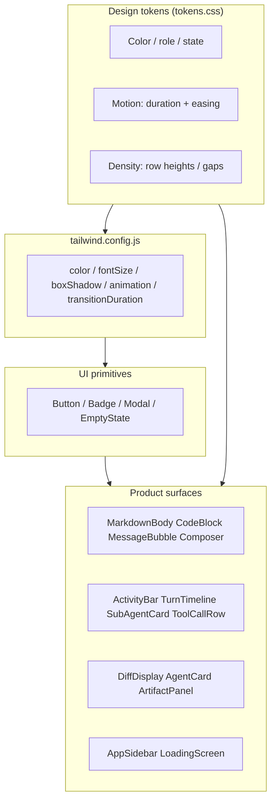
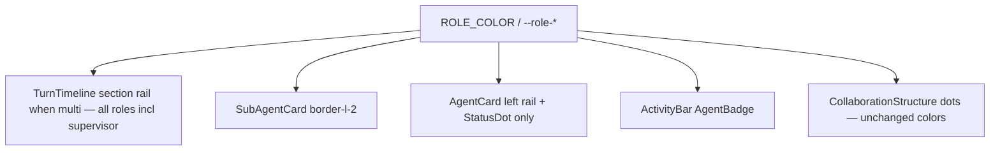
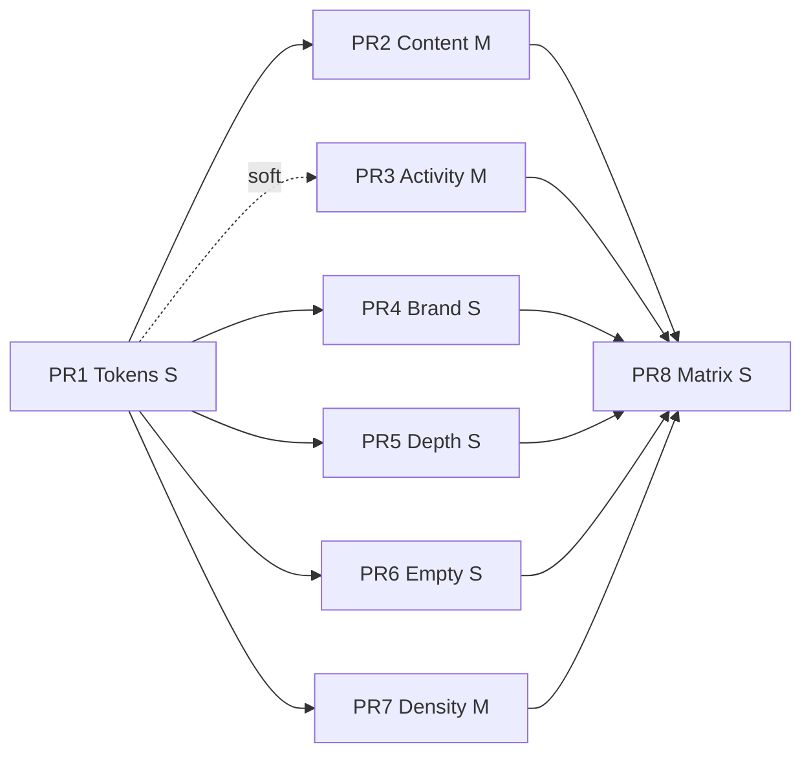

# hip Visual Design Upgrade

| Field | Value |
|-------|-------|
| **Author** | TBD |
| **Date** | 2026-07-18 |
| **Status** | Draft (rev 3 — CodeBlock spacing + residual nits closed) |
| **Scope** | Frontend visual system only (`src/`, tokens, Tailwind) — no backend/sidecar changes |
| **Related** | `src/styles/tokens.css`, `tailwind.config.js`, `src/components/{ui,chat,artifact,layout,login}/` |

---

## Overview

hip is a Tauri desktop AI workbench. Users spend almost all of their time in chat transcripts, tool/activity timelines, diffs, and code — not marketing chrome. The existing design system is already solid: monochrome chrome, Sage Gray accent used sparingly, flat shadows (three tiers only), native glass/vibrancy with solid fallback, CLI-style messages, role colors for multi-agent identity, and Cursor-inspired monochrome primary buttons.

This upgrade does **not** reinvent that language. It tightens content hierarchy, brand micro-signals, spatial depth, empty/system states, motion tokens, optional density, and multi-agent visual consistency — under one principle:

> **Chrome quieter; content clearer; personality at key moments — do not turn hip into another glowing AI product.**

The work ships as incremental, independently reviewable PRs. Critical path is **PR1 → (fan-out) → PR7**; brand/content/depth can proceed in parallel after tokens land.

---

## Background & Motivation

### Current state (strengths)

| Layer | Source of truth | Established rules |
|-------|-----------------|-------------------|
| Color / glass / shadows | `src/styles/tokens.css` | Monochrome `--bg-app` / `--text-*`; Sage `--accent` `#6b7c5c` / dark `#a8b89a`; hover stays **neutral gray** (`--accent-subtle` = gray, not sage-tinted); three shadow tiers via `--shadow-panel` + Tailwind `shadow-menu` / `shadow-overlay`. Note: an older tokens comment still says accent is usable for “按钮底”; product law is `Button.tsx` monochrome primary, not that comment. |
| Tailwind mapping | `tailwind.config.js` | `surface` / `ink` / `accent` / `role.*` / font scale `caption`→`page`; all default `boxShadow` flattened to `none` except `panel` / `menu` / `overlay` |
| Vibrancy | `src/lib/windowVibrancy.ts` + `html[data-vibrancy]` | `mac-sidebar` \| `win-mica` \| `win-acrylic` \| `solid`; legacy alias `native` treated like `mac-sidebar` in JS/CSS; never semi-transparent glass without native material |
| Role identity | `src/lib/roleColor.ts` + `--role-*` | Functional indicators for supervisor/planner/coder/reviewer/worker; `subagent` maps to worker color |
| Primary CTA | `src/components/ui/Button.tsx` | Soft monochrome inverse (`--btn-primary`), **never** sage-filled |
| Messages | `MessageBubble.tsx` | CLI-style role + time meta line — not thick chat bubbles |
| Personality | `NewConversation.tsx` + `MascotActor.tsx` | Large animated mascot (420px) on empty conversation |
| a11y | `tokens.css` | AA contrast notes on tokens; global `prefers-reduced-motion` kill-switch |

### Pain points

1. **Content surfaces under-invested** — `MarkdownBody`, `CodeBlock`, diffs, activity trails lack hierarchy polish relative to chrome.
2. **Activity/timeline double-motion** — `ActivityBar` already runs **both** `Loader2 animate-spin` and `animate-pulse` on the role badge when running.
3. **Brand almost invisible in chrome** — Active sidebar uses `bg-surface` + hairline ring only; no 2px Sage rail.
4. **Spatial depth inconsistent** — Glass sidebar vs solid paper OK; artifact panel has no `shadow-panel`; Composer `card` vs `flat` focus differs.
5. **Empty/system states uneven** — Hero mascot vs dashed `EmptyState` vs custom list empties.
6. **Motion not tokenized** — Hard-coded durations in Tailwind + `.animate-greeting-enter` in tokens.css.
7. **No density mode** — Only theme (light/dark/system) in `GeneralSettings` / `uiStore`.

---

## Goals & Non-Goals

### Goals

1. **P0 — Content clarity**: Prose hierarchy, code block chrome + external spacing (CodeBlock-owned), diff sticky polish, quiet activity timeline.
2. **P1 — Brand micro-signals**: 2px Sage left rail on active sidebar items; hairline ring removed when rail ships; accent chips only on listed identity call sites.
3. **P1 — Spatial depth**: Artifact/Preview panel elevation on panel root only; unified composer focus grammar; keep existing modal scrim (`bg-ink/40`).
4. **P2 — Empty / system tiers**: Personality ladder; EmptyState visual upgrade without ui→login coupling; one LoadingScreen treatment.
5. **P2 — Motion system**: Tokenized durations with CSS-var fallbacks; shared pulse grammar (no dual motion).
6. **P3 — Density mode**: Comfortable default vs Compact; full consumer inventory; `uiStore` + `ThemeProvider` dataset.
7. **P3 — Multi-agent signature**: Left role color rails; reuse `ROLE_COLOR`; no rainbow fills.

### Non-Goals

- Large gradient backgrounds, glassmorphism buttons, heavy card shadow walls
- Sage solid primary CTA (do **not** change `buttonVariants.primary`)
- Brand-tinted chrome hover globally
- Thick chat bubbles / flashy marketing motion / colorful third themes
- Backend/sidecar changes; syntax highlighters; sticky markdown thead; image figure chrome
- Completion “sage flash” animation (rejected — see Activity grammar)
- `--overlay-scrim` token (deferred — keep `bg-ink/40`)

### Constraints

- Surgical diffs; match existing style (`AGENTS.md`)
- Prefer CSS tokens + Tailwind mapping over one-off hex
- Keep vibrancy solid-fallback rules
- Update Vitest in the **same PR** as class changes (PR8 is matrix/guardrails only)
- New strings: en / zh-CN / zh-TW in the same PR (`translation-keys.test.ts` enforces parity)
- No remote feature flags; density ships as settings (local preference). If a kill-switch is ever needed: `const DENSITY_SETTING = true` in a local `feature.ts` pattern — **not** required for v1.

---

## Key Decisions

| # | Decision | Rationale |
|---|----------|-----------|
| **KD1** | Extend existing token system; do not invent a parallel design language | Tokens already encode product rules. |
| **KD2** | Primary button stays monochrome inverse (`--btn-primary`) | Cursor-inspired; explicit non-goal. |
| **KD3** | Brand signals sparse: 2px Sage left rail + listed identity chips only | Orientation without glowing chrome. |
| **KD4** | Multi-agent identity = left **role color rail** + role name | Builds on `ROLE_COLOR` / `AgentBadge`. |
| **KD5** | Motion tiers: chrome ~140ms, content ~240ms, celebrate ~450ms; reduced-motion kill-switch | Matches existing menu/panel/message split. |
| **KD6** | Density over a third theme | Desktop-native; CSS vars `--row-h-*` / `--trail-min-h`. |
| **KD7** | Code chrome aligns with surface-muted / terminal family (no highlighter) | `terminalTheme.ts` already token-driven. |
| **KD8** | Empty personality ladder; mascot only via call-site composition | Trust for errors; no ui→login import. |
| **KD9** | 8 PRs; PR1 first; content/brand/depth parallel after PR1 | Independent review + revert. |
| **KD10** | Composer `card` vs `flat` keep structure; share focus grammar | Empty card vs session dock differ product-wise. |
| **KD11** | **CodeBlock owns fenced-code chrome and external vertical spacing** | Strip all `[&_pre]:*` chrome **and** `[&_pre]:my-2` from `markdownProseClassName`. CodeBlock host (`DeclarativeContextMenu` / chrome outer) owns `my-2`; inner `pre` is `m-0`. Prevents double-chrome and collapsed external gap. |
| **KD12** | **Density v1**: CSS vars on `:root` (PR1); apply via `ThemeProvider` reading `uiStore.density` → `html[data-density]` (PR7); FOUC-safe default `comfortable` on `:root` before rehydrate; consumer inventory is exhaustive for v1 | No inventing Tailwind steps like `min-h-4.5`; use `min-h-[var(--trail-min-h)]`. |
| **KD13** | **EmptyState** stays a ui primitive: `tier` + optional Lucide `icon` + optional `children` — **never** import `MascotActor` or `HipLogo` from `ui/` | Layering: `ui` must not depend on `login/`. Call sites pass media via `children` (e.g. `<HipLogo size={32} decorative />`). |

---

## Proposed Design

### Architecture (layers)



---

### P0 — Content surfaces

#### 1. CodeBlock owns chrome + external spacing (KD11)

**Today**

- `MarkdownBody` `markdownProseClassName` paints every fenced `pre`:  
  `[&_pre]:my-2 [&_pre]:overflow-auto [&_pre]:rounded-md [&_pre]:bg-surface-muted [&_pre]:p-3 [&_pre]:font-mono [&_pre]:text-meta`
- `CodeBlock` wraps `<pre {...props}>` in `relative` + absolute copy button; `languageOf()` is computed but not rendered.
- `DeclarativeContextMenu` always wraps children in a layout `div`; its `className` applies to that host (verified in `DeclarativeContextMenu.tsx`).

**Decision: CodeBlock owns chrome and external vertical rhythm.** MarkdownBody drops **all** `[&_pre]:*` selectors. External `my-2` lives on the CodeBlock host (context-menu layout div), not on a nested `pre` (margin inside `overflow-hidden` would not separate consecutive blocks).

##### Exact class delta — `MarkdownBody.tsx`

**Remove entirely from `markdownProseClassName` (no replacement `pre` line):**

```
[&_pre]:my-2 [&_pre]:overflow-auto [&_pre]:rounded-md [&_pre]:bg-surface-muted [&_pre]:p-3 [&_pre]:font-mono [&_pre]:text-meta
```

Default fenced blocks use `components.pre` → `CodeBlock`, which owns margin + chrome. If a consumer overrides `components.pre` without CodeBlock, **that owner** must supply vertical margin and chrome.

Inline code selectors unchanged:

```
[&_:not(pre)>code]:rounded [&_:not(pre)>code]:bg-surface-muted [&_:not(pre)>code]:px-1 [&_:not(pre)>code]:py-px
[&_code]:font-mono [&_code]:text-meta
```

##### Spacing ownership (normative)

| Node | Classes | Role |
|------|---------|------|
| `DeclarativeContextMenu` host | `my-2` | **External** block gap in transcript |
| Chrome unit `div` | `overflow-hidden rounded-md border border-border bg-surface-muted` | Visual unit (no `my-*`) |
| Inner `<pre>` | `m-0 overflow-auto bg-transparent p-3 font-mono text-meta text-ink` | Code body only — **no** external margin |

##### Target JSX skeleton — `CodeBlock.tsx`

```tsx
export function CodeBlock({ children, node, ...props }: ComponentPropsWithoutRef<'pre'> & { node?: unknown }) {
  const { t } = useTranslation()
  const [copied, setCopied] = useState(false)
  const code = codeTextOf(children)
  const language = languageOf(children)

  // onCopy unchanged…

  return (
    <DeclarativeContextMenu
      kind="codeBlock"
      payload={{ code, language }}
      className="my-2" // EXTERNAL spacing — host owns vertical rhythm (KD11)
      data-testid="code-block-context-menu"
    >
      <div
        className="overflow-hidden rounded-md border border-border bg-surface-muted"
        data-testid="code-block"
      >
        <div className="flex h-7 items-center justify-between gap-2 border-b border-border px-2.5">
          <span className="min-w-0 truncate text-caption uppercase tracking-wide text-ink-tertiary">
            {language ?? ''}
          </span>
          <button
            type="button"
            onClick={onCopy}
            data-testid="code-copy"
            title={t('chat.copyCode')}
            aria-label={t('chat.copyCode')}
            className="flex h-6 w-6 shrink-0 items-center justify-center rounded-md text-ink-tertiary transition-colors hover:text-ink-secondary"
          >
            {copied ? <Check size={13} /> : <Copy size={13} />}
          </button>
        </div>
        {/* Drop absolute positioning; chrome is the header bar. */}
        <pre
          {...props}
          className={cn(
            'm-0 overflow-auto bg-transparent p-3 font-mono text-meta text-ink',
            props.className,
          )}
        >
          {children}
        </pre>
      </div>
    </DeclarativeContextMenu>
  )
}
```

**Notes**

- react-markdown still mounts `components.pre` → CodeBlock; document flow is host `div.my-2` → chrome → `pre.m-0`. There is **no** reliance on parent `[&_pre]:my-2`.
- When `language` is missing, header still renders (empty label + copy) so height/copy hit target stay stable.
- No syntax highlighter in this upgrade (KD7 / non-goal).
- Tests: `CodeBlock.test.tsx` — host has `my-2`; lang label when `language-ts`; copy still works; MarkdownBody has **no** `[&_pre]` classes.

---

#### 2. MarkdownBody — full target `markdownProseClassName` contract

**Ship this exact join list** (PR2). No “long answer” prop. Nested denser overrides (`className="text-meta [&_p]:my-1"`) on SubAgent/ToolCall **unchanged**.

```ts
export const markdownProseClassName = [
  'max-w-none text-prose leading-relaxed text-ink',
  // Headings
  '[&_h1]:mb-3 [&_h1]:mt-1 [&_h1]:text-display [&_h1]:font-bold [&_h1]:tracking-tight',
  '[&_h2]:mb-2 [&_h2]:mt-5 [&_h2]:text-title [&_h2]:font-bold [&_h2]:tracking-tight',
  '[&_h3]:mb-1.5 [&_h3]:mt-4 [&_h3]:text-body [&_h3]:font-semibold',
  '[&_h4]:mb-1 [&_h4]:mt-3 [&_h4]:text-meta [&_h4]:font-semibold',
  '[&_h5]:mb-1 [&_h5]:mt-3 [&_h5]:text-meta [&_h5]:font-semibold',
  '[&_h6]:mb-1 [&_h6]:mt-3 [&_h6]:text-meta [&_h6]:font-semibold [&_h6]:text-ink-secondary',
  // Body
  '[&_p]:my-1.5',
  '[&_ul]:my-1.5 [&_ul]:list-disc [&_ul]:pl-5',
  '[&_ol]:my-1.5 [&_ol]:list-decimal [&_ol]:pl-5',
  '[&_li]:my-0.5',
  '[&_li>p]:my-0.5',
  // Fenced pre: NO [&_pre]:* — CodeBlock host owns my-2 + chrome (KD11)
  // Inline code
  '[&_:not(pre)>code]:rounded [&_:not(pre)>code]:bg-surface-muted [&_:not(pre)>code]:px-1 [&_:not(pre)>code]:py-px',
  '[&_code]:font-mono [&_code]:text-meta',
  // Quote / rule
  '[&_blockquote]:my-2 [&_blockquote]:border-l-2 [&_blockquote]:border-border [&_blockquote]:pl-3 [&_blockquote]:text-ink-secondary',
  '[&_hr]:my-4 [&_hr]:border-0 [&_hr]:border-t [&_hr]:border-border',
  // Tables (no sticky thead, no zebra — deferred)
  '[&_table]:my-2 [&_table]:w-full [&_table]:border-collapse',
  '[&_th]:border [&_th]:border-border [&_th]:bg-surface-muted [&_th]:px-2.5 [&_th]:py-1.5 [&_th]:text-left [&_th]:text-meta [&_th]:font-semibold',
  '[&_td]:border [&_td]:border-border [&_td]:px-2.5 [&_td]:py-1.5 [&_td]:text-meta',
  // GFM task lists (remark-gfm): checkbox baseline
  '[&_input[type=checkbox]]:mr-2 [&_input[type=checkbox]]:align-middle',
].join(' ')
```

**Before → after deltas (summary)**

| Selector | Before | After |
|----------|--------|-------|
| h3–h6 | (none) | body/meta semibold scale as above |
| `li` / `li>p` | (none) | `my-0.5` |
| `pre` / `[&_pre]:*` | full chrome + `my-2` | **removed entirely** — CodeBlock host `my-2` + chrome |
| `hr` | (none) | `my-4 border-t border-border` |
| `th`/`td` | `px-2 py-1` | `px-2.5 py-1.5`; th `text-meta font-semibold` |
| task checkbox | (none) | `mr-2 align-middle` |
| images / sticky thead / zebra | — | **out of scope** (Open Questions) |

---

#### 3. Diff / ChangesView — exact target classes

**File:** `src/components/artifact/DiffDisplay.tsx` only in PR2 for class polish.

| Element | Today | Target |
|---------|-------|--------|
| Sticky file header | `sticky top-0 z-[1] flex h-9 items-center justify-between gap-2 bg-surface-muted px-3` | **Add** `border-b border-border` → `sticky top-0 z-[1] flex h-9 items-center justify-between gap-2 border-b border-border bg-surface-muted px-3` |
| Hunk header row | `flex bg-surface-muted/60 text-caption text-ink-tertiary` | Keep container; **@@ span** use `text-ink-secondary` (was tertiary via parent): e.g. mono span `… text-ink-secondary`, optional header tail stays `opacity-70 text-ink-tertiary` |
| Line tint | `bg-success/10` / `bg-danger/10` | **Unchanged** |
| Word-diff span | `bg-success/30` / `bg-danger/30` | **Unchanged** (do not move to `/25`) |
| `STATUS_CHIP` | semantic tints | **Unchanged** |
| Local `Empty` | glyph ± professional | **No change in PR2 or PR6** (leave specialized) |
| `ChangesView.tsx` | shell + DiffDisplay | **No code change** in PR2 |

---

#### 4. ActivityBar + TurnTimeline — motion & rails (closed product choices)

##### Running motion (pick one — no dual motion)

| Condition | Summary row leading control | Role badge / other |
|-----------|----------------------------|--------------------|
| `status === 'running'` **and** `activeRole` present | **No Loader2** | `AgentBadge` with `animate-pulse` only |
| `status === 'running'` **and** no `activeRole` (initializing / empty trail) | **`Loader2 animate-spin text-accent-strong` only** | **No** accent pulse dot, **no** `AgentBadge` pulse — single motion |
| terminal statuses | Icon only (CheckCircle2 / XCircle / AlertTriangle / Circle) | No pulse |

**Initializing path change vs today:** drop the second accent pulse dot on the initializing row so only the spinner moves (aligns with status icon table).

**Tool rows** (`ToolCallRow` / group headers): keep at most **one** motion — prefer `Loader2` on the tool status icon when `running`; no additional pulse on the same row.

##### Completion flash — **no**

- Success = `CheckCircle2` + `text-success` only.
- **No** sage border flash, **no** `animate-completion-rail`, **no** toast.
- Closes former Open Question 4.

##### Timeline role rails

**Today** (`TurnTimeline.tsx` ~313):

```tsx
className={cn(multi && s.role !== 'supervisor' && 'mt-1 border-l border-border pl-2')}
```

**Target:**

- When `multi` (sections.length > 1): **every** section including **supervisor** gets a left rail:
  - Classes: `mt-1 border-l-2 pl-2` (supervisor may omit extra `mt-1` if first: use `multi && (s.role !== 'supervisor' ? 'mt-1 ' : '') + 'border-l-2 pl-2'`)
  - Color: `style={{ borderLeftColor: ROLE_COLOR[s.role] }}` (not `border-border`)
- When single section: no rail (unchanged quiet trail).

##### ActivityBar status icon table (final)

| State | Icon | Motion |
|-------|------|--------|
| running + role | none (badge only) | pulse on badge only |
| running, no role (initializing) | Loader2 | spin only — **no** pulse dot |
| success | CheckCircle2 `text-success` | none |
| error | XCircle `text-danger` | none |
| partial | AlertTriangle `text-warning` | none |
| stopped | Circle `text-ink-tertiary` | none |

---

#### 5. SubAgentCard + AgentCard

##### SubAgentCard

**Today:** `border-l border-border pl-3`.

**Target:**

```tsx
<div
  className="mb-2 border-l-2 pl-3"
  style={{ borderLeftColor: ROLE_COLOR[agent.role] }}
  data-testid="subagent-card"
>
```

- When `taskInput` is the title, show role name as secondary meta: `text-ink-tertiary` via `t(ROLE_NAME_KEY[agent.role])`.
- Running: pulse only on status icon (Loader2 or status), not whole card.
- **Edge case (one sentence):** Unknown/missing role falls back to `ROLE_COLOR.subagent` (= worker) via existing map — never unstyled rainbow.

##### AgentCard (`artifact/AgentCard.tsx`)

**Edge case (one sentence):** Keep the existing collapsible **card shell** (`rounded-lg border bg-surface`, running `border-accent/40`) — dashboard density needs a card; only SubAgent in-transcript stays flat CLI trail.

**Visual changes only:**

1. Remove the **redundant second role circle** next to `StatusDot` (keep StatusDot only).
2. Add left rail: `border-l-2` with `borderLeftColor: ROLE_COLOR[agent.role]` on the outer card (in addition to existing full border; rail can be implemented as `box-shadow: inset 2px 0 0 ROLE` or left border override — prefer `border-l-2` with role color and keep other sides `border-border` via `border border-border border-l-2` + style on left).

```tsx
<div
  className={cn(
    'flex flex-col rounded-lg border border-border border-l-2 bg-surface transition-colors',
    running ? 'border-accent/40' : isError ? 'border-danger/40' : '',
  )}
  style={{ borderLeftColor: isError ? 'var(--danger)' : color }}
  data-testid="agent-card"
>
```

When running, accent border may still apply to non-left sides; left stays role color for identity (identity > running wash on the rail).

Optional shared helper deferred until 3+ call sites need it (still no required `roleRail.ts`).

---

### P1 — Brand micro-signals

#### Sidebar active — 2px Sage rail; **hard rule: drop hairline ring**

When active rail ships, **remove** `shadow-[0_0_0_1px_var(--border)]` from every PR4-included active row. Active = `bg-surface` + `before:` Sage rail only (not rail + ring).

**PR4 include (active rail + drop hairline):**

| Row | File | Today active |
|-----|------|--------------|
| Section NavItem | `AppSidebar.tsx` | hairline ring |
| Session / worktree rows | `AppSidebar.tsx` | hairline ring |
| Knowledge **space** list rows | `AppSidebar.tsx` (~324–327) | hairline ring — **include for grammar consistency** |
| Footer History / Settings | `SidebarAccountFooter.tsx` | `bg-state-active` → same Sage rail |

**Target active classes (all of the above):**

```tsx
active
  ? 'relative bg-surface text-ink before:absolute before:inset-y-1.5 before:left-0 before:w-0.5 before:rounded-full before:bg-accent'
  : 'text-ink-secondary hover:bg-state-hover hover:text-ink' // sessions/spaces: hover:bg-state-hover only
```

- Hover remains **neutral** `state-hover` — never sage wash.
- Running pulse dots **keep** `animate-pulse bg-accent` (functional live signal).

#### Badge include / exclude (PR4)

| Call site | Action |
|-----------|--------|
| `account/AgentCard.tsx` — internal vs ACP category badge | **Include**: switch internal chip to `variant="accent"` (or keep equivalent `bg-accent/10 text-accent` if variant already maps); ACP stays neutral `default` / muted |
| `account/FixedAgentCard.tsx` — built-in badge `bg-accent-subtle text-accent-strong` | **Include**: normalize to `variant="accent"` for identity consistency (accent-subtle is neutral gray — wrong for “identity” chip) |
| Worktree count chip in `AppSidebar` (`bg-accent/10 text-accent`) | **Leave** (already correct pattern) |
| `artifact/AgentCard.tsx` tool-count `Badge` | **Exclude** |
| Skill/plugin badges, model badges, status installed/not-installed | **Exclude** |
| `AcpProviderPicker.tsx` | **Exclude** (picker cards, not chips) |
| Primary buttons / chrome hover | **Exclude** forever |

No drive-by restyling beyond the include list.

#### Completion moments

| Moment | Treatment |
|--------|-----------|
| Turn complete | CheckCircle2 success only (no flash) |
| Plan done | Existing checklist UI; no new toast |
| Stream end | Unmount `StreamingCursor` |

---

### P1 — Spatial depth

#### Elevation host — **one place only**

Apply `shadow-panel` on **`ArtifactPanel` root** and **`PreviewPanel` root** only:

```tsx
// ArtifactPanel.tsx root
<div className="flex h-full min-h-0 flex-col bg-surface shadow-panel">
```

**Do not** also add shadow on `AppLayout` Panel host (would double). Resize handle stays as today.

#### Composer focus — **one flat rule**

| Variant | Focus treatment |
|---------|-----------------|
| `card` | **Keep** `focus-within:border-accent focus-within:ring-[3px] focus-within:ring-accent/8` |
| `flat` | On the composer root (or InputBar dock wrapper): resting `border-t border-transparent` + `focus-within:border-t-accent`. **No** ring on flat. Transparent resting top border avoids a 1px layout jump when focus applies the accent border. |

#### Overlay scrim

- **Defer** `--overlay-scrim`.
- Keep Modal / palette: `bg-ink/40` + `shadow-overlay` + `animate-menu-in`.
- No PR5 work on scrim tokens.

---

### P2 — Empty / system states

#### EmptyState API (KD13)

```tsx
export type EmptyStateTier = 'friendly' | 'professional'

export interface EmptyStateProps {
  icon?: LucideIcon
  tier?: EmptyStateTier // default 'professional'
  title: string
  description?: string
  action?: { label: string; onClick: () => void }
  /**
   * Call sites compose brand media here.
   * ui/ never imports login/ (no MascotActor, no HipLogo).
   * Example: children={<HipLogo size={32} decorative />}
   */
  children?: React.ReactNode
  className?: string
}
```

**No `logo?: boolean`.** That prop would force `ui` → `login/HipLogo`. Use `icon` (Lucide) or `children` (call-site `HipLogo` / `MascotActor`).

**Visual by tier**

| Tier | Chrome | Media |
|------|--------|-------|
| `professional` (default) | No dashed border; borderless or subtle `border-border`; icon `text-ink-tertiary` | Lucide `icon` only (unless call site passes `children`) |
| `friendly` | Same quiet chrome (no dashed circus) | Optional `children` from call site (HipLogo / medium mascot) |

#### Migration inventory (PR6)

| Site | File | PR6 action |
|------|------|------------|
| Agent empty grid | `account/AgentGrid.tsx` | Migrate classes via EmptyState; `tier="professional"` (settings context) |
| Knowledge empty doc | `knowledge/DocReader.tsx` | `tier="professional"`; keep `className` overrides |
| Knowledge workspace empty | `knowledge/KnowledgeWorkspace.tsx` | `tier="friendly"`; optional `children={<HipLogo size={32} decorative />}` at call site |
| Knowledge home empty | `knowledge/KnowledgeHome.tsx` | `tier="friendly"`; optional call-site HipLogo via `children` |
| DiffDisplay `Empty` | `artifact/DiffDisplay.tsx` | **No change** |
| AppSidebar empty session lists | `layout/AppSidebar.tsx` | **Leave bespoke** (layout-constrained) |
| SessionHistory empty | `history/SessionHistory.tsx` | **Leave bespoke** unless already trivial to swap — default **leave** |
| Skill/Plugin/MCP empty copy | account configs | **Leave** (already product copy + tests) |
| NewConversation | `chat/NewConversation.tsx` | **No EmptyState**; keep large MascotActor |

Friendly mascot (medium ~128): only if a call site explicitly passes  
`<EmptyState tier="friendly" …><MascotActor size={128} … /></EmptyState>` — **not** required in PR6 for settings empties.

#### LoadingScreen — **one treatment**

```tsx
// LoadingScreen.tsx — brand-aligned indeterminate, no pulse bar alternative
<div className="flex h-dvh w-screen flex-col items-center justify-center gap-3 bg-surface text-ink-secondary">
  <Loader2 className="animate-spin text-accent-strong" size={24} aria-hidden />
  <span className="text-body">{t('chat.loading')}</span>
</div>
```

Only change from today: spinner uses `text-accent-strong` instead of inheriting neutral. No secondary pulse bar. Reduced-motion: global kill-switch freezes spin.

#### System banners

`MissingProjectBanner` / `ConnectionStatus` — **no cute mascot**; professional only. ConnectionStatus unchanged unless copy polish.

---

### P2 — Motion system

#### Tokens on `:root` (PR1 checklist — mandatory)

```css
:root {
  --duration-chrome: 140ms;
  --duration-content: 240ms;
  --duration-celebrate: 450ms;
  --ease-out: cubic-bezier(0.16, 1, 0.3, 1);
  --ease-standard: cubic-bezier(0.2, 0, 0, 1);

  /* Density defaults — FOUC-safe before data-density exists */
  --row-h-sidebar: 34px;
  --row-pad-y-session: 0.5rem; /* py-2 */
  --trail-min-h: 1.25rem;      /* 20px = min-h-5 */
  --meta-gap: 0.375rem;        /* 6px = gap-1.5 */
}

html[data-density="compact"] {
  --row-h-sidebar: 28px;
  --row-pad-y-session: 0.25rem; /* py-1 */
  --trail-min-h: 1.125rem;      /* 18px — use min-h-[var(--trail-min-h)] only */
  --meta-gap: 0.25rem;
}
```

`html[data-density="comfortable"]` may restate the same as `:root` for clarity; **`:root` alone is enough for FOUC**.

#### Tailwind / greeting rewire (PR1)

1. Define vars on `:root` with numeric fallbacks always present.
2. Map in `tailwind.config.js` **with fallbacks in the string**:

```js
animation: {
  'menu-in': 'menu-in var(--duration-chrome, 140ms) ease-out',
  'panel-in': 'panel-in var(--duration-content, 240ms) ease-out',
  'message-enter': 'message-enter var(--duration-content, 240ms) ease-out',
  'msg-enter-right': 'msg-enter-right var(--duration-content, 240ms) ease-out',
  'msg-enter-left': 'msg-enter-left var(--duration-content, 240ms) ease-out',
  // blink / pulse / dot-bounce: keep current cycle times (not chrome/content tiers)
},
transitionDuration: {
  DEFAULT: '150ms',
  chrome: 'var(--duration-chrome, 140ms)',
  content: 'var(--duration-content, 240ms)',
  celebrate: 'var(--duration-celebrate, 450ms)',
},
```

3. In `tokens.css`, rewire only duration of greeting:

```css
.animate-greeting-enter {
  animation: greeting-enter var(--duration-celebrate, 450ms) ease-out both;
}
```

4. **Do not rename keyframes.**
5. Reduced-motion block unchanged (still force ~0.01ms).

#### Shared pulse grammar

- Stream: `StreamingCursor` keeps `animate-blink bg-accent`.
- Tools: single Loader2 when running.
- Activity summary: rules in P0 §4.

---

### P3 — Density mode (KD12)

#### uiStore contract

```ts
export type UiDensity = 'comfortable' | 'compact'

const UI_DENSITIES = ['comfortable', 'compact'] as const

export function isUiDensity(v: unknown): v is UiDensity {
  return typeof v === 'string' && (UI_DENSITIES as readonly string[]).includes(v)
}

export function normalizeUiDensity(raw: unknown): UiDensity {
  return isUiDensity(raw) ? raw : 'comfortable'
}

// UiPersistedState:
//   … existing fields, plus:
//   density: UiDensity

// UiState:
//   density: UiDensity
//   setDensity: (d: UiDensity) => void

// create() defaults:
//   density: 'comfortable',
//   setDensity: (d) => set((s) => (s.density === d ? s : { density: d })),

// partialize: include density: s.density

// mergeUiPersistedState: after spread, force
//   density: normalizeUiDensity((rest as any).density)

// onRehydrateStorage microtask: also normalize density like language
```

**No feature flag for v1.** Optional future: `const DENSITY_SETTING = true` local const — out of scope unless release asks.

#### Apply path — ThemeProvider only

Extend `ThemeProvider.tsx` (no separate DensityProvider):

```tsx
export function ThemeProvider({ children }: ThemeProviderProps) {
  const theme = useUiStore((s) => s.theme)
  const density = useUiStore((s) => s.density)

  useEffect(() => { /* existing theme → dark class + vibrancy */ }, [theme])

  useEffect(() => {
    document.documentElement.dataset.density = density // 'comfortable' | 'compact'
  }, [density])

  return <>{children}</>
}
```

**FOUC:** CSS `:root` defines comfortable metrics before React hydrates. After rehydrate, dataset may switch to `compact`. First paint without dataset === comfortable (by design).

#### Consumer inventory (v1)

**In scope — must use density vars:**

| File | Today | Density-aware target |
|------|-------|----------------------|
| `layout/AppSidebar.tsx` `NavItem` | `h-[34px]` | `h-[var(--row-h-sidebar)]` |
| `layout/AppSidebar.tsx` **search input row** | `h-[34px]` (~201) | `h-[var(--row-h-sidebar)]` |
| `layout/AppSidebar.tsx` session button | `py-2` | `py-[var(--row-pad-y-session)]` |
| `layout/AppSidebar.tsx` knowledge **space** rows | `py-2` (~324) | `py-[var(--row-pad-y-session)]` |
| `layout/SidebarAccountFooter.tsx` | `h-[34px]` | `h-[var(--row-h-sidebar)]` |
| `chat/TurnTimeline.tsx` `TRAIL_ROW` | `min-h-5 … gap-1.5` | `min-h-[var(--trail-min-h)] … gap-[var(--meta-gap)]` |
| `chat/ActivityBar.tsx` | uses `TRAIL_ROW` | inherits |
| `chat/MessageBubble.tsx` meta / actions rows | `min-h-5 gap-1.5` | `min-h-[var(--trail-min-h)] gap-[var(--meta-gap)]` |
| `chat/ThinkingBubble.tsx` meta | `min-h-5` | `min-h-[var(--trail-min-h)]` |
| `chat/TodoChecklist.tsx` rows | `min-h-5 gap-1.5` | vars |
| `artifact/ToolCallGroup.tsx` | `min-h-5 gap-1.5` | vars |
| `artifact/SubAgentCard.tsx` header | `min-h-5 gap-1.5` | vars |
| `artifact/ToolCallRow.tsx` | trail row heights if hard-coded `min-h-5` | vars if present |

**Out of density v1 (leave hard-coded comfortable):**

| Surface | Reason |
|---------|--------|
| Diff jump list `py-0.5` | Optional later; low ROI |
| Knowledge **page** editor type scale / form controls | Not chrome row rhythm |
| Settings form controls / icon buttons `h-7`/`h-8` | Keep hit targets ≥28px fixed |

**Forbidden:** inventing `min-h-4.5` or non-default spacing scale steps.

#### Settings UI

`GeneralSettings.tsx` — new row after Theme, same dropdown pattern:

- Keys: see i18n table below.

---

### P3 — Multi-agent signature (summary)



Rules: one primary color signal per block (rail); role name text always present for a11y; no random per-agent hues; live strip may stay product accent.

---

## API / Interface Changes

### CSS / Tailwind

Additive motion + density vars; animation strings use `var(--duration-*, fallback)`.

### uiStore

`UiDensity`, `density`, `setDensity`, persist + normalize (see KD12).

### EmptyState

`tier`, optional Lucide `icon`, optional `children` (KD13). **No** `logo` prop.

### CodeBlock / MarkdownBody

Class ownership per KD11; no new React props required.

### Composer

Class-only flat focus rule; no prop API change.

---

## Data Model Changes

| Store | Change | Migration |
|-------|--------|-----------|
| `localStorage` `hip-ui` | `density?: UiDensity` | Missing/invalid → `comfortable` via `normalizeUiDensity` in merge + rehydrate |
| DOM | `html[data-density]` | Set by ThemeProvider; absent ⇒ CSS `:root` comfortable metrics |

No protocol/sidecar changes.

---

## i18n table (English source; zh-CN / zh-TW same keys, same PR)

| Key | English |
|-----|---------|
| `settings.density` | Density |
| `settings.densityDesc` | Control sidebar and activity row spacing. |
| `settings.densities.comfortable` | Comfortable |
| `settings.densities.compact` | Compact |

**No new empty/loading keys required for PR6** if existing titles/descriptions are reused (`chat.loading` already exists). If Knowledge friendly empties need a tone line later, add keys in that PR with full locale parity — none mandated in this design.

Existing badge strings (`settings.agents.badgeInternal`, `settings.agents.catAcp`, etc.) **reuse** — no new copy for PR4.

---

## Alternatives Considered

### A1 — Full visual redesign
Rejected: breaks monochrome primary / CLI messages / tests.

### A2 — Per-component one-off hex
Rejected: token drift; dark/vibrancy bugs.

### A3 — Third color theme instead of density
Rejected: KD6; density is the desktop need.

### A4 — Feature-flag every micro-signal
Rejected for rails/content; density needs no remote flag.

### A5 — Density via OS only (`prefers-reduced-motion` already handled; no standard `prefers-density`)
| Pros | Cons |
|------|------|
| Zero settings UI | No portable OS API for “compact UI”; touch vs desktop not the user ask |
| | Power users on desktop explicitly want an in-app control |

**Rejected.** In-app `uiStore` density is the product surface. CSS-only media queries without user control also rejected (cannot persist preference).

---

## Security & Privacy Considerations

Visual-only; no new IPC/network/secrets. Density in `localStorage` is non-sensitive. Auth.json storage model unchanged (do not “fix”). Modals keep Radix focus trap.

---

## Observability

| Signal | How |
|--------|-----|
| Unit tests | Same-PR class/testid updates |
| Manual matrix | Light/dark × vibrancy solid/native × density |
| Reduced motion | OS setting |
| i18n | `translation-keys.test.ts` |

No new production metrics.

---

## Rollout Plan



### Critical path

`PR1 → PR7` (density consumers need vars). Content/brand/depth/empty **parallelize after PR1**.

### Soft dependencies

- **PR3** soft-depends on PR1: rails are static colors and work without motion vars; only benefits from duration tokens if any transition is added. PR3 may merge before PR1 if needed, but prefer after.
- **PR2** prefers PR1 only if copy feedback uses duration tokens (not required).

### Rollback

Each PR independently revertable. CSS `var(--x, fallback)` prevents hard break if tokens lag.

### Risk register

| Risk | Severity | Mitigation |
|------|----------|------------|
| Double code chrome | High | KD11 ownership + exact class strip |
| Vibrancy transparent without material | High | Never touch solid-fallback rules |
| Density hit targets &lt; 28px | Medium | Compact row floor 28px; icon buttons out of v1 |
| Dual motion | Medium | Activity grammar table |
| Snapshot churn | Medium | Tests in same PR as classes |
| i18n lag | Low | Keys+three locales same PR |
| Over-use of Sage | Medium | PR4 include list + hover stays neutral |

---

## Open Questions

1. **Syntax highlighting** later? **No** in this upgrade (bundle + dual-theme cost).
2. **Sticky markdown thead / image figures?** Deferred; not PR2.
3. **Density compact for Knowledge editor?** Out of v1.
4. ~~Completion sage flash?~~ **Resolved: no flash.**
5. **Medium mascot on friendly empties?** Optional call-site only; PR6 does not require it.
6. **Shared AgentCard/SubAgent shell?** Not in first pass.

---

## References

| Path | Role |
|------|------|
| `src/styles/tokens.css` | Color, glass, shadows, reduced-motion, greeting-enter |
| `tailwind.config.js` | Token map, flat shadows, keyframes |
| `src/lib/roleColor.ts` | `ROLE_COLOR`, `ROLE_NAME_KEY` |
| `src/lib/windowVibrancy.ts` | Material modes + `native` alias |
| `src/components/theme/ThemeProvider.tsx` | dark class; density dataset (PR7) |
| `src/store/uiStore.ts` | Persist `hip-ui`; density lands here |
| `src/components/account/GeneralSettings.tsx` | Theme/language; density control |
| `src/components/ui/Button.tsx` / `Badge.tsx` / `Modal.tsx` / `EmptyState.tsx` | Primitives |
| `src/components/chat/MarkdownBody.tsx` / `CodeBlock.tsx` / `MessageBubble.tsx` / `ActivityBar.tsx` / `TurnTimeline.tsx` / `Composer.tsx` / `NewConversation.tsx` / `StreamingCursor.tsx` | Chat surfaces |
| `src/components/artifact/SubAgentCard.tsx` / `AgentCard.tsx` / `DiffDisplay.tsx` / `ArtifactPanel.tsx` / `terminalTheme.ts` | Artifact |
| `src/components/layout/AppSidebar.tsx` / `SidebarAccountFooter.tsx` / `LoadingScreen.tsx` | Chrome |
| `src/components/login/MascotActor.tsx` / `HipLogo.tsx` | Personality (call-site only for empties) |
| `src/routes/AppLayout.tsx` | Shell (no dual shadow) |
| `src/i18n/*` | en / zh-CN / zh-TW |

---

## PR Plan

T-shirt sizes: **S** &lt; ~1 day / small diff; **M** multi-file visual + tests.

### PR1 — Design tokens: motion + density CSS vars (S)

**Title:** `style(tokens): motion tiers, density vars, animation fallbacks`

**Files:**

- `src/styles/tokens.css` — `--duration-*`, `--ease-*`, density vars on `:root` / `html[data-density=compact]`; greeting-enter uses `var(--duration-celebrate, 450ms)`
- `tailwind.config.js` — animation + `transitionDuration` with **fallback vars**; keyframe names unchanged

**Dependencies:** None  

**Not in PR1:** `uiStore`, ThemeProvider dataset, product UI.

**Description:** Additive tokens only. Checklist: vars on `:root`; Tailwind strings include fallbacks; greeting rewired; reduced-motion still wins.

---

### PR2 — Content surfaces: Markdown, CodeBlock, Diff (M)

**Title:** `style(content): CodeBlock chrome ownership, prose contract, diff sticky`

**Files:**

- `src/components/chat/MarkdownBody.tsx` — full target `markdownProseClassName`
- `src/components/chat/CodeBlock.tsx` — header + border unit (KD11)
- `src/components/chat/CodeBlock.test.tsx` (+ Markdown tests if any)
- `src/components/artifact/DiffDisplay.tsx` — exact sticky/hunk class deltas only

**Dependencies:** None required; soft after PR1  

**Not in PR2:** ChangesView, Diff Empty, highlighters.

---

### PR3 — Activity / timeline / sub-agent rails (M)

**Title:** `style(activity): single motion grammar, role rails, card de-noise`

**Files:**

- `src/components/chat/ActivityBar.tsx` + tests — running motion table; no completion flash
- `src/components/chat/TurnTimeline.tsx` + tests — multi-section rails all roles
- `src/components/artifact/SubAgentCard.tsx` + tests
- `src/components/artifact/AgentCard.tsx` — rail + drop dual circle; keep card shell
- `src/components/artifact/ToolCallRow.tsx` — single motion if needed

**Dependencies:** Soft on PR1  

**Description:** Static rails work without motion tokens. Close dual-spinner issue.

---

### PR4 — Brand micro-signals (S) — **parallelizable after PR1**

**Title:** `style(brand): sage active rail; identity chips only`

**Files:**

- `src/components/layout/AppSidebar.tsx` + tests — rail on NavItem, sessions, worktrees, **and knowledge space rows**; **remove** hairline ring on all of those actives
- `src/components/layout/SidebarAccountFooter.tsx` — active rail grammar
- `src/components/account/AgentCard.tsx` — internal badge → accent variant (include list)
- `src/components/account/FixedAgentCard.tsx` — normalize built-in badge to accent variant
- Tests for those account cards if class assertions exist

**Dependencies:** None / after PR1  

**Exclude:** AcpProviderPicker, skill badges, tool-count badges, Buttons.  
**Include (active rail):** knowledge space list rows in AppSidebar (not left on hairline).

---

### PR5 — Spatial depth (S) — **parallelizable after PR1**

**Title:** `style(depth): panel shadow-panel; flat composer top-border focus`

**Files:**

- `src/components/artifact/ArtifactPanel.tsx` — root `shadow-panel`
- `src/components/artifact/PreviewPanel.tsx` — root `shadow-panel`
- `src/components/chat/Composer.tsx` — flat: `border-t border-transparent focus-within:border-t-accent` (no ring; no layout jump)
- `src/components/chat/InputBar.tsx` — only if dock wrapper must carry focus class

**Dependencies:** PR1 optional  

**Not in PR5:** AppLayout double shadow; `--overlay-scrim`; Modal scrim retokenize.

---

### PR6 — Empty / system states (S) — **parallelizable after PR1**

**Title:** `style(empty): EmptyState tiers; LoadingScreen accent spinner`

**Files:**

- `src/components/ui/EmptyState.tsx` — tier + icon + children only (no `logo` prop); drop dashed default
- `account/AgentGrid.tsx`, `knowledge/DocReader.tsx`, `KnowledgeWorkspace.tsx`, `KnowledgeHome.tsx` — tier props; optional call-site HipLogo via `children`
- `src/components/layout/LoadingScreen.tsx` — `text-accent-strong` on Loader2

**Dependencies:** None  

**Not in PR6:** DiffDisplay Empty; AppSidebar/SessionHistory custom empties; any `ui` → `login` import.

---

### PR7 — Density mode (M)

**Title:** `feat(ui): comfortable vs compact density`

**Files:**

- `src/store/uiStore.ts` + `uiStore.test.ts` — full contract
- `src/components/theme/ThemeProvider.tsx` — `dataset.density`
- `src/components/account/GeneralSettings.tsx` — density dropdown
- `src/i18n/en.ts`, `zh-CN.ts`, `zh-TW.ts` — density keys (table above)
- All **in-scope** consumer inventory files (sidebar NavItem + search + sessions + knowledge spaces, footer, TRAIL_ROW, MessageBubble, ThinkingBubble, TodoChecklist, ToolCallGroup, SubAgentCard, …)

**Dependencies:** **PR1** (CSS vars)  

**Description:** Default comfortable; compact floor 28px rows; no third theme.

---

### PR8 — Manual matrix + non-goal guardrails (S)

**Title:** `test(style): visual upgrade matrix and primary-button guard`

**Files:**

- `src/components/ui/Button.test.tsx` — assert primary still monochrome (if not already)
- Only fix regressions discovered in matrix that are **not** missed work from earlier PRs
- PR description checklist: light/dark × solid/native vibrancy × density; reduced-motion; i18n density strings

**Dependencies:** After merged visual PRs  

**Not a dumping ground:** class assertion updates belong in PR2–PR7 with the change.

---

## Success Criteria

1. CodeBlock owns fenced chrome **and** external `my-2` on the context-menu host; MarkdownBody has **no** `[&_pre]:*` selectors; inner `pre` is `m-0`; no double padding / no collapsed external gap.
2. `markdownProseClassName` matches the published contract (h3–h6, hr, tables, task checkboxes; no pre chrome).
3. Activity running uses **one** motion (incl. initializing = Loader2 only); success has **no** sage flash.
4. Multi-agent rails use `ROLE_COLOR` including supervisor when multi.
5. Active sidebar (NavItem, sessions, worktrees, knowledge spaces, footer) = Sage rail + `bg-surface` **without** hairline ring; hover neutral.
6. Primary button monochrome; Badge include list only in PR4.
7. Artifact/Preview `shadow-panel` once; flat composer uses transparent resting top border + accent on focus.
8. EmptyState has no ui→login dependency (no `logo` prop); Diff Empty unchanged; LoadingScreen accent spinner.
9. Density persists in `hip-ui`, defaults comfortable, FOUC-safe via `:root` vars; inventory includes search + knowledge space rows.
10. New density strings in en/zh-CN/zh-TW; Vitest green; no sidecar changes.

---

## Appendix: Target class snippets

### A. Sidebar active (no hairline)

```tsx
className={cn(
  'flex h-[var(--row-h-sidebar)] w-full items-center gap-2.5 rounded-lg px-2.5 text-left text-body font-medium transition-colors duration-chrome',
  'focus-visible:outline-none focus-visible:ring-2 focus-visible:ring-focus-ring',
  active
    ? 'relative bg-surface text-ink before:absolute before:inset-y-1.5 before:left-0 before:w-0.5 before:rounded-full before:bg-accent'
    : 'text-ink-secondary hover:bg-state-hover hover:text-ink',
)}
```

### B. SubAgent role rail

```tsx
<div
  className="mb-2 border-l-2 pl-3"
  style={{ borderLeftColor: ROLE_COLOR[agent.role] }}
  data-testid="subagent-card"
>
```

### C. CodeBlock shell (external spacing on host)

```tsx
// DeclarativeContextMenu className="my-2"  ← external gap
//   div.overflow-hidden.rounded-md.border.border-border.bg-surface-muted
//     header h-7 …
//     pre.m-0.overflow-auto.bg-transparent.p-3.font-mono.text-meta
```

Authoritative full skeleton: P0 §1. MarkdownBody must **not** set `[&_pre]:my-2`.

### D. TRAIL_ROW density

```ts
export const TRAIL_ROW =
  'flex min-h-[var(--trail-min-h)] w-full items-center gap-[var(--meta-gap)] text-left text-meta leading-5'
```

---

*End of design document (rev 3).*
